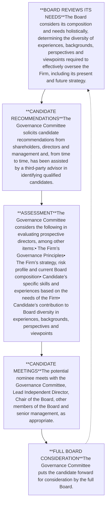

<!-- Page 1 -->

# Annual Meeting of Shareholders
# Proxy Statement
# 2026

JPMorgan Chase logo

---

<!-- Page 2 -->

JPMorgan Chase & Co.
270 Park Avenue
New York, New York 10017
April 6, 2026

Dear fellow shareholders,

We are pleased to invite you to attend the annual meeting of shareholders to be held in a virtual meeting format, via the Internet, on May 19, 2026 at 10:00 a.m. Eastern Time. Shareholders are provided an opportunity to ask questions about topics of importance to the Firm’s business and affairs, to consider matters described in the proxy statement and to receive an update on the Firm’s activities and performance.

We hope that you will participate in the meeting. We encourage you to designate the persons named as proxies on the proxy card to vote your shares even if you are planning to attend. This will ensure that your common stock is represented at the meeting.

This proxy statement provides information on the matters to be voted on at the annual meeting, proxy voting and other information about how to participate. Please read it carefully. We look forward to your participation.

Sincerely,

signature: James Dimon

**James Dimon**
Chairman and Chief Executive Officer

JPMorganChase

---

<!-- Page 3 -->

# A letter from Stephen B. Burke, our Lead Independent Director

April 6, 2026

**Dear fellow shareholders,**

With the upcoming 2026 Annual Meeting of Shareholders, I am pleased to share my perspective as your Lead Independent Director. Being your Lead Independent Director is an honor. I am fortunate to serve with a group of fellow directors who bring diverse skills, perspectives, and a shared commitment to advancing the interests of our shareholders.

## Record Financial Performance

Building on years of disciplined investment and strategic decision-making, JPMorgan Chase & Co. ("JPMorganChase" or the "Firm") delivered another year of outstanding financial results in 2025. The Firm achieved record managed revenue of $185.6 billion, net income of $57.0 billion, a return on equity of 17%, and a return on tangible common equity of 20% . These results reflect the strength of our market-leading businesses, our commitment to fortress balance sheet principles, and our continued focus on long-term value creation for shareholders.

## Leadership and Board Culture

We are especially fortunate to have Jamie Dimon continue to lead JPMorganChase as Chairman and CEO. Jamie’s vision, integrity, and commitment to our clients, communities, and employees have been instrumental in the Firm’s long-term success. The Board and I are deeply appreciative of his ongoing service.

We are proud of the Board’s strong culture—one that values independence, constructive interaction with management, and diversity of thought. Our independent directors meet separately at every regular Board meeting, allowing for candid discussion and effective oversight. Our directors bring a wide range of qualifications, backgrounds, perspectives, and tenure, and we regularly review and refresh committee assignments to best leverage these strengths. Earlier this year, we made several committee changes based on these factors: Ginni Rometty now serves as Chair of the Corporate Governance & Nominating Committee ("CGNC"), Alex Gorsky and Michele Buck have joined CGNC, and Brad Smith and Alicia Boler Davis have joined the Public Responsibility Committee.

## Board Engagement, Oversight, and Succession Planning

Our Board meets at least eight times each year, with strong engagement and open access to senior management. Over the years, we have developed a deep understanding of the executive team and the culture that drives the Firm’s success. The Board exercises independence and oversight of management, providing guidance, support, and feedback so the Firm continues to deliver for shareholders.

The Board also maintains careful oversight of key investments and works closely with management on strategy, with a focus on investment discipline, strong shareholder returns, and capital strength. We are committed to making sure that the Firm’s long-term strategy is executed with a clear focus on value creation. We are actively engaged with management on emerging risks, regulatory developments, and geopolitical events. As we look ahead to 2026 and beyond, we remain acutely aware of the evolving risk landscape and the Firm’s responses. We are incredibly proud of how JPMorganChase continues to adapt and lead in a complex environment.

A prime example is the Security and Resiliency Initiative ("SRI"), which demonstrates the Firm’s unique ability to address global challenges. The SRI leverages our scale and reach, capital resources, and unrivaled expertise to make a significant impact for shareholders and communities alike. The Board is fully supportive of this initiative, which underscores JPMorganChase’s special place in the world and its enormous capacity to help solve critical problems.

---

<!-- Page 4 -->

We know that succession planning and oversight of succession planning is a top priority. It is a focus for us, and one about which I have spoken to many of our shareholders. We are committed to a successful CEO transition at the right time. Importantly, succession is not delegated to one person or one committee. The entire Board is involved with developing and assessing the senior executives who are potential CEO and Operating Committee candidates.

A hallmark of our Board’s approach is our direct engagement with senior management. At nearly every Board meeting, each Line of Business CEO and the COO participate and provide an unscripted “Since We Last Met” update, focusing on the most important issues, opportunities, and needs facing the Firm. These candid discussions keep the Board fully informed and able to provide effective oversight.

Beyond formal Board meetings, the directors host breakfasts, lunches, dinners, and other informal interactions with the Operating Committee and many other members of senior management. These meetings range from one-on-one sessions to small group and larger gatherings, offering unique opportunities to gain insights into our future leadership. Over the course of the year, our directors met with more than 100 senior managers, providing valuable opportunities to assess the Firm’s leadership pipeline and succession planning. These meetings also allow us to understand not only the business acumen and operational excellence of our future leaders, but also to focus intently on cultural continuity and the leadership qualities possessed by our management team.

**Board Composition and Transitions**

I want to recognize the service of Todd Combs, who resigned from the Board in December 2025 to join the management team as head of the Strategic Investment Group within the Firm’s new Security and Resiliency Initiative. We thank Todd for his years of dedicated service and look forward to continuing to work with him in his new role.

**Closing**

On behalf of the entire Board, I want to thank you for your continued support. We remain committed to serving the best interests of our shareholders. As I noted last year, we are driven to help senior management deliver results by, as J.P. Morgan himself put it, “doing first-class business in a first-class way.” We are proud of the Firm’s achievements in 2025 and look forward to building on this success into the future.

Sincerely,

Stephen B. Burke signature

**Stephen B. Burke**
Lead Independent Director

---

<!-- Page 5 -->

# Notice of 2026 annual meeting of shareholders and proxy statement

**Date**
Tuesday, May 19, 2026

**Time**
10:00 a.m. Eastern Time

**Record date**
March 20, 2026

**Access**
The 2026 Annual Meeting of Shareholders will be held in a virtual meeting format, via the Internet. If you plan to participate in the virtual meeting, please see “Information about the annual meeting of shareholders.” Shareholders will be able to attend, vote and submit questions (both before, and for a portion of, the meeting) via the Internet and will be able to examine the shareholder list before the meeting. Shareholders may participate online by logging in at www.virtualshareholdermeeting.com/JPM2026.

We encourage you to submit your proxy prior to the annual meeting.

## Matters to be voted on

* Election of directors

* Advisory resolution to approve executive compensation

* Ratification of PricewaterhouseCoopers LLP as our independent registered public accounting firm for 2026

* Shareholder proposals, if they are properly introduced at the meeting

* Any other matters that may properly be brought before the meeting

By order of the Board of Directors

**Reid R. Broda**

Secretary

April 6, 2026

## Your vote is important to us. Please vote promptly.

JPMorgan Chase & Co. uses the Securities and Exchange Commission (“SEC”) rule permitting companies to furnish proxy materials to their shareholders via the Internet. In accordance with this rule, on or about April 6, 2026, we sent to shareholders of record at the close of business on March 20, 2026, a Notice of Internet Availability of Proxy Materials (“Notice”), which includes instructions on how to access our 2026 Proxy Statement and 2025 Annual Report online, and how to vote online for the 2026 Annual Meeting of Shareholders.

If you received a Notice and would like to receive a printed copy of our proxy materials, please follow the instructions for requesting such materials included in the Notice.

To be admitted to the annual meeting at www.virtualshareholdermeeting.com/JPM2026, you must enter the control number found on your proxy card, voting instruction form or Notice you previously received. See “Information about the annual meeting of shareholders” on page 94. Follow the instructions on the virtual meeting site to vote and ask questions before or during the meeting.

If you hold your shares through a broker, your shares will not be voted unless (i) you provide voting instructions or (ii) the matter is one for which brokers have discretionary authority to vote. Of the matters to be voted on at the annual meeting, the only one for which brokers have discretionary authority to vote is Proposal 3, the ratification of the independent registered public accounting firm. See “What is the voting requirement to approve each of the proposals?” on page 97.

---

<!-- Page 6 -->

# Table of contents

| **2026 Proxy summary**                                    | **1**  | IV. 2025 Option exercises and stock vested table                      | 67      |
| --------------------------------------------------------- | ------ | --------------------------------------------------------------------- | ------- |
| **Corporate governance**                                  | **7**  | V. 2025 Pension benefits                                              | 67      |
| ✔ **PROPOSAL 1:**                                         |        | VI. 2025 Non-qualified deferred compensation                          | 68      |
| **Election of directors**                                 | **7**  | VII. 2025 Potential payments upon termination or change in control    | 69      |
| Key factors for shareholder consideration                 | 8      |                                                                       |         |
| Director nominees                                         | 9      | Pay versus Performance disclosure                                     | 71      |
| Board governance                                          | 21     | CEO pay ratio disclosure                                              | 74      |
| Board oversight                                           | 28     | Security ownership of directors and executive officers                | 75      |
| Engagement                                                | 30     |                                                                       |         |
| Director compensation                                     | 32     | **Audit matters**                                                     | **77**  |
| Other corporate governance policies and practices         | 34     |                                                                       |         |
|                                                           |        | ✔ **PROPOSAL 3:**                                                     |         |
| **Executive compensation**                                | **38** | **Ratification of independent registered public accounting firm**     | **78**  |
|                                                           |        |                                                                       |         |
| ✔ **PROPOSAL 2:**                                         |        | Audit Committee report                                                | 80      |
| **Advisory resolution to approve executive compensation** | **38** |                                                                       |         |
|                                                           |        | **Shareholder proposals**                                             | **82**  |
| Compensation discussion and analysis                      | 39     |                                                                       |         |
| Introduction & overview                                   | 39     | Introduction                                                          | 83      |
| 1. How we think about pay decisions                       | 43     | ✖ **PROPOSALS 4-7:**                                                  |         |
| 2. How we performed against our business strategy         | 53     | **Shareholder-submitted proposals**                                   | **84**  |
| 3. How performance determined pay in 2025                 | 56     |                                                                       |         |
| Compensation & Management Development Committee report    | 62     | **General information**                                               | **94**  |
|                                                           |        | **Information about the annual meeting of shareholders**              | **94**  |
| Executive compensation tables                             | 63     |                                                                       |         |
| I. Summary compensation table (SCT)                       | 63     | **Shareholder proposals and nominations for the 2027 annual meeting** | **101** |
| II. 2025 Grants of plan-based awards                      | 64     | **Notes on non-GAAP financial measures**                              | **103** |
| III. Outstanding equity awards at fiscal year-end 2025    | 65     | **Glossary of selected terms and acronyms**                           | **105** |

This proxy statement contains forward-looking statements within the meaning of the Private Securities Litigation Reform Act of 1995. These statements can be identified by the fact that they do not relate strictly to historical or current facts. Forward-looking statements often use words such as "anticipate," "target," "expect," "estimate," "intend," "plan," "goal," "believe" or other words of similar meaning. Forward-looking statements provide JPMorgan Chase & Co.'s ("JPMorganChase" or the "Firm") current expectations or forecasts of future events, circumstances, results or aspirations. All forward-looking statements are, by their nature, subject to risks and uncertainties, many of which are beyond the Firm's control. JPMorganChase's actual future results may differ materially from those set forth in its forward-looking statements. Factors that could cause JPMorganChase's actual results to differ materially from those described in the forward-looking statements can be found in JPMorganChase's Annual Report on Form 10-K for the year ended December 31, 2025 ("2025 Form 10-K"). Any forward-looking statements made by or on behalf of the Firm speak only as of the date they are made, and JPMorganChase does not undertake to update the forward-looking statements included in this proxy statement to reflect the impact of circumstances or events that may arise after the date the forward-looking statements were made.

No reports, documents or websites that are cited or referred to in this proxy statement shall be deemed to form part of, or to be incorporated by reference into, this proxy statement.

---

<!-- Page 7 -->

# 2026 Proxy summary

This summary highlights information in this proxy statement. It does not contain all the information you should consider, and you should read the entire proxy statement carefully before voting. Terms not defined in the text of this proxy statement can be found in the “Glossary of selected terms and acronyms” on page 105.

Your vote is important. For more information on voting and attending the Annual Meeting of Shareholders ("annual meeting"), see “Information about the annual meeting of shareholders” on page 94. This proxy statement has been prepared by JPMorgan Chase & Co.'s ("JPMorganChase" or the "Firm") management and approved by the Board of Directors, and is being sent or made available to our shareholders on or about April 6, 2026.

## Annual meeting overview: Matters to be voted on

Checkmark icon

### Management proposals

The Board of Directors recommends you vote **FOR** each director nominee and proposals 2 and 3 (for more information see page referenced):

| 1. Election of directors                                         | 7  |
| ---------------------------------------------------------------- | -- |
| 2. Advisory resolution to approve executive compensation         | 38 |
| 3. Ratification of independent registered public accounting firm | 78 |

X icon

### Shareholder proposals (if they are properly introduced at the meeting)

The Board of Directors recommends you vote **AGAINST** each of the following shareholder proposals (for more information see page referenced):

| 4. Report on congruence of security, resiliency, and climate initiatives | 84 |
| ------------------------------------------------------------------------ | -- |
| 5. Independent board chairman                                            | 86 |
| 6. Lobbying alignment                                                    | 89 |
| 7. Sustainability ROI report                                             | 91 |

---

<!-- Page 8 -->

<u>Table of Contents</u>

## 2026 Proxy summary

# The Firm demonstrated strong financial performance in 2025

The Firm continued its focus on serving our clients and customers while investing in and executing on long-term strategic initiatives. The Firm experienced market share gains and expanded our lead, maintained a fortress balance sheet and achieved strong financial results.

| JPMorganChase Revenue                | JPMorganChase Pre-tax income                       | JPMorganChase Net income          | JPMorganChase Book value per share (“BVPS”)                                                                                                                                                                                                       | JPMorganChase Return on equity (“ROE”)          | JPMorganChase Market capitalization |
| ---------------------------------------- | ------------------------------------------------------ | ------------------------------------- | ----------------------------------------------------------------------------------------------------------------------------------------------------------------------------------------------------------------------------------------------------- | --------------------------------------------------- | --------------------------------------- |
| $182.4B Reported                     | $72.6B Reported                                    | $57.0B                                | $126.99                                                                                                                                                                                                                                               | 17%                                                 | $868.8B                                 |
| $185.6B Managed¹'²                   | $80.1B Excluding loan loss reserves (“ex. LLR”)¹'² | Earnings per share (“EPS”) $20.02 | Tangible book value per share (“TBVPS”)² $107.56                                                                                                                                                                                                  | Return on tangible common equity (“ROTCE”)² 20% | Net capital distributions³ $46.1B   |
| **Consumer & Community Banking (“CCB”)** | Revenue¹ $76.0B                                    | Pre-tax income ex. LLR¹'² $27.5B  | \* #1 market share in U.S. retail deposits⁴ \* #1 market share in U.S. credit card sales volume⁵ \* #1 primary bank for U.S. small businesses⁶ \* #1 U.S. digital banking platform⁷                                                       |                                                     |                                         |
|                                          | Net income $18.2B                                  | ROE 32%                           |                                                                                                                                                                                                                                                       |                                                     |                                         |
| **Commercial & Investment Bank (“CIB”)** | Revenue¹ $78.5B                                    | Pre-tax income¹ $37.6B            | \* #1 in global Investment Banking (“IB”) fees for 17 consecutive years, with 8.4% wallet share⁸ in 2025 \* #1 in Markets revenue⁹ \* #1 in USD payments volume with 30.2% USD SWIFT market share¹⁰ \* #3 custodian globally by revenue¹¹ |                                                     |                                         |
|                                          | Net income $27.8B                                  | ROE 18%                           |                                                                                                                                                                                                                                                       |                                                     |                                         |
| **Asset & Wealth Management (“AWM”)**    | Revenue¹ $24.1B                                    | Pre-tax income¹ $8.6B             | \* Pre-tax margin of 36% \* Long-term Assets Under Management (“AUM”) flows of $209B; top 2 rank in Client Asset Flows¹² over a 5-year period \* Average deposits of $245.2B (up 4%); record average loans of $246.6B (up 8%)                 |                                                     |                                         |
|                                          | Net income $6.5B                                   | ROE 40%                           |                                                                                                                                                                                                                                                       |                                                     |                                         |

¹ The Firm reviews the results of the Firm and the lines of business on a managed basis. Refer to Note 2, on page 103 for a definition of managed basis.

² Managed Revenue, Pre-Tax Income (ex. LLR), ROTCE and TBVPS are each non-GAAP financial measures; refer to Notes 1 and 2 on page 103 for a further discussion of these measures.

³ Reflects common dividends and common stock repurchases, net of common stock issued to employees.

⁴ FDIC 2025 Summary of Deposits survey per S&P Global Market Intelligence. Applies a $1 billion deposit cap to Chase and industry branches for market share. While many of our branches have more than $1 billion in retail deposits, applying a cap consistently to ourselves and the industry is critical to the integrity of this measurement. Includes all commercial banks, savings banks and savings institutions as defined by the FDIC.

⁵ Sales share based on 2025 sales peer disclosures, JPMorganChase estimates, and excludes private label and Commercial Card.

⁶ Barlow Research Associates, Primary Bank Legacy Market Share Database as of 4Q25. Rolling 8-quarter average of small businesses with revenues of more than $100,000 and less than $25 million.

⁷ #1 in U.S. mobile monthly active users (2025) among incumbent U.S. banking mobile apps based on Sensor Tower. Sensor Tower supplies modelled data through proprietary panels and apps.

⁸ Dealogic as of January 2, 2026, excludes the impact of UBS/CS merger prior to the year of the acquisition (2023).

⁹ Coalition Greenwich Competitor Analytics (Preliminary FY 2025). Market share is based on JPMorganChase's internal business structure, footprint and revenue. Ranks are based on Coalition Index Banks for Markets.

¹⁰ Represents U.S. dollar payment instructions for direct payments and credit transfers processed over Society for Worldwide Interbank Financial Telecommunications (“SWIFT”) in the countries where J.P. Morgan has sales coverage. Market Share is based on December 2025.

¹¹ Coalition Greenwich Competitor Analytics (Preliminary FY 2025). Rank is based on JPMorganChase’s internal business structure, footprint and revenue and Coalition Index Banks for Securities Services (excluding Corporate Trust, Escrow Services and Clearing & Settlement).

¹² Company filings and JPMorganChase estimates. Rankings reflect publicly traded peer group as follows: Allianz, Bank of America, Bank of New York Mellon, BlackRock, Charles Schwab, DWS, Franklin Templeton, Goldman Sachs, Invesco, Morgan Stanley, State Street, T. Rowe Price and UBS. JPMorganChase ranking reflects Asset & Wealth Management client assets, U.S. Wealth Management investments and new-to-firm Chase Private Client deposits.

---

<!-- Page 9 -->

# We are committed to strong corporate governance practices

## Board composition reflects an effective mix of executive experience and skills and a balance of experience and fresh perspectives to provide independent oversight

* Our directors have experience and demonstrated success in executive roles relevant to the Firm’s business and operations and contribute to the Board’s effective oversight of management and its diversity across a range of attributes, executive experience and skills

* The Board has a well-balanced tenure with a mix of experience and fresh perspectives

## A strong Lead Independent Director role facilitates independent Board oversight of management

* The Firm’s Corporate Governance Principles (“Governance Principles”) require the independent directors to appoint a Lead Independent Director if the position of Chair is not held by an independent director

* The Board reviews its leadership structure annually

* The Lead Independent Director’s responsibilities demonstrate the Board’s commitment to empowering the Lead Independent Director to provide effective independent oversight to the CEO

## Our Board drives succession planning

* The Board is focused on enabling an orderly CEO transition to take place in the medium-term

* As part of succession planning, the Board continues to oversee management’s development of several Operating Committee (“OC”) members who are well-known to shareholders as strong potential candidates to succeed Mr. Dimon

* Individual OC members and senior leaders have been provided with opportunities to gain exposure to different parts of the business and to deepen their leadership experience in new or expanded roles

## Our Board provides independent oversight of the Firm’s business and affairs

* Oversees the business and affairs of the Firm based on sound governance practices and effective leadership structure

* Oversees the Firm’s risk management and internal control frameworks

* Reviews and approves the Firm’s strategic plan and oversees strategic objectives

* Oversees executive performance, talent management and succession planning

* Oversees the Firm’s financial performance and condition

* Sets the cultural “tone at the top”

## We actively engage with shareholders

* We engage with shareholders throughout the year on a wide variety of topics, such as strategy, financial and operating performance, competitive environment, regulatory landscape and environmental, social and governance-related matters

* In 2025, our stakeholder engagement initiatives included:

    — **Shareholder engagement**: We solicited feedback and provided updates on topics of interest through engagements with approximately 338 shareholders and other stakeholders that represented approximately 37% of the Firm's outstanding common stock

    — **Senior management engagement**: Senior management presented at approximately 17 investor conferences and events and held approximately 61 meetings to connect shareholders with the Firm's senior leaders

## Our governance practices promote Board effectiveness and shareholder interests

* Annual Board and committee assessment

* Majority voting for all director elections

* Robust shareholder rights:

    — Proxy access

    — Right to call a special meeting

    — Right to act by written consent

* Stock ownership requirements for directors

* 100% principal standing committee independence

* Executive sessions of independent directors at each regular Board meeting

---

<!-- Page 10 -->

# 2026 Proxy summary

## PROPOSAL 1: Election of directors
page 7

The Board of Directors has nominated the 11 individuals listed below. All are independent other than our CEO. If elected at the annual meeting, all nominees are expected to serve until next year’s annual meeting.

| Nominee/Director of JPMorganChase since¹                                                    | Age | Principal Occupation                                                                                                     | Other U.S.-Listed Public Company Directorships | Committee Membership²                                                                |
| ------------------------------------------------------------------------------------------- | --- | ------------------------------------------------------------------------------------------------------------------------ | ---------------------------------------------- | ------------------------------------------------------------------------------------ |
| Stephen B. Burke **Stephen B. Burke** Lead Independent Director Director since 2004 | 67  | Retired Chairman and Chief Executive Officer of NBCUniversal, LLC                                                        | 1                                              | Compensation & Management Development (Chair); Corporate Governance & Nominating |
| Linda B. Bammann **Linda B. Bammann** Director since 2013                               | 70  | Retired Deputy Head of Risk Management of JPMorgan Chase & Co.³                                                          | 0                                              | Risk (Chair); Compensation & Management Development                              |
| Michele G. Buck **Michele G. Buck** Director since 2025                                 | 64  | Retired Chairman, President and Chief Executive Officer of The Hershey Company                                           | 0                                              | Audit; Corporate Governance & Nominating                                         |
| Alicia Boler Davis **Alicia Boler Davis** Director since 2023                           | 57  | President of Ford Pro, Ford Motor Company                                                                                | 0                                              | Public Responsibility; Risk                                                      |
| James Dimon **James Dimon** Director since 2004                                         | 70  | Chairman and Chief Executive Officer of JPMorgan Chase & Co.                                                             | 0                                              |                                                                                      |
| Alex Gorsky **Alex Gorsky** Director since 2022                                         | 65  | Retired Chairman and Chief Executive Officer of Johnson & Johnson                                                        | 2                                              | Audit; Corporate Governance & Nominating                                         |
| Mellody Hobson **Mellody Hobson** Director since 2018                                   | 57  | Co-Chief Executive Officer and President of Ariel Investments, LLC                                                       | 0                                              | Public Responsibility (Chair); Risk                                              |
| Phebe N. Novakovic **Phebe N. Novakovic** Director since 2020                           | 68  | Chairman and Chief Executive Officer of General Dynamics Corporation                                                     | 1                                              | Audit; Public Responsibility                                                     |
| Virginia M. Rometty **Virginia M. Rometty** Director since 2020                         | 68  | Retired Executive Chairman, President and Chief Executive Officer of International Business Machines Corporation (“IBM”) | 0                                              | Corporate Governance & Nominating (Chair); Compensation & Management Development |
| Brad D. Smith **Brad D. Smith** Director since 2025                                     | 62  | President of Marshall University and Retired Executive Chairman, President and Chief Executive Officer of Intuit Inc.    | 1                                              | Public Responsibility; Risk                                                      |
| Mark A. Weinberger **Mark A. Weinberger** Director since 2024                           | 64  | Retired Global Chairman and Chief Executive Officer of Ernst & Young LLP                                                 | 2                                              | Audit (Chair)                                                                        |

¹ Director of a heritage company of the Firm as follows: Bank One Corporation: Mr. Burke (2003–2004), Mr. Dimon, Chairman of the Board (2000–2004)

² Principal standing committees

³ Retired from JPMorgan Chase & Co. in 2005

---

<!-- Page 11 -->

<u>Table of Contents</u>

PROPOSAL 2:

# Advisory resolution to approve executive compensation
page 38

We are submitting an advisory resolution to approve the compensation of our Named Executive Officers (“NEOs”).

**We believe shareholders should consider three key factors in their evaluation of this year’s proposal:**

**1. How we think about pay decisions**

The Firm’s Business Principles and strategic framework form the basis of our OC members’ strategic priorities. The Compensation & Management Development Committee (“CMDC”) references those strategic priorities and the Firm’s compensation philosophy to assess OC members’ performance and to determine their respective total compensation levels and pay mix.

**2. How we performed against our business strategy**

We continued to deliver strong multi-year financial performance, invest in our future, strengthen our risk and control environment, and reinforce our culture and values, including our long-standing commitment to serve our customers, employees and communities, and conduct business in a responsible way to drive economic growth.

**3. How performance determined pay in 2025**

In determining OC member pay, the CMDC took into account performance across four broad performance dimensions: Business Results, i.e., the "what;" and Client/Customer/Stakeholder; Risk, Controls & Conduct; and Teamwork & Leadership, or qualitative considerations, i.e., the "how." CEO pay is strongly aligned to the Firm’s short-, medium- and long-term performance, with approximately 88% of the CEO’s variable pay deferred into equity, of which 100% is in at-risk Performance Share Units (“PSUs”). Other NEO pay is also strongly aligned to Firm and line of business (“LOB”) performance, with a majority of variable pay deferred into equity, of which 50% is in at-risk PSUs.

**Disciplined performance assessment process to determine pay**

The CMDC uses a balanced holistic approach to determine annual compensation, which includes a disciplined assessment of performance against the aforementioned performance considerations over a sustained period of time.

The table below summarizes the salary and incentive compensation awarded for 2025 performance to our NEOs who served as Executive Officers¹ through December 31, 2025.

| Name and principal position                             | Salary     | Incentive Compensation Cash | Incentive Compensation Restricted Stock Units | Incentive Compensation Performance Share Units | Total       |
| ------------------------------------------------------- | ---------- | ------------------------------- | ------------------------------------------------- | -------------------------------------------------- | ----------- |
| James Dimon Chairman and CEO                        | $1,500,000 | $5,000,000                      | $ —                                               | $36,500,000                                        | $43,000,000 |
| Mary Callahan Erdoes CEO, Asset & Wealth Management | 1,000,000  | 12,000,000                      | 9,000,000                                         | 9,000,000                                          | 31,000,000  |
| Troy Rohrbaugh Co-CEO, Commercial & Investment Bank | 1,000,000  | 10,600,000                      | 7,950,000                                         | 7,950,000                                          | 27,500,000  |
| Douglas Petno Co-CEO, Commercial & Investment Bank  | 1,000,000  | 10,600,000                      | 7,950,000                                         | 7,950,000                                          | 27,500,000  |
| Jeremy Barnum Chief Financial Officer ("CFO")       | 1,000,000  | 7,400,000                       | 5,550,000                                         | 5,550,000                                          | 19,500,000  |

¹ As previously disclosed, Daniel Pinto served as President & Chief Operating Officer ("COO") of the Firm until June 2025, after which he ceased to be an Executive Officer, and is now serving as a Vice Chair through December 2026. Mr. Pinto is included in compensation disclosures elsewhere in this Proxy Statement as required pursuant to Item 402 of Regulation S-K.

---

<!-- Page 12 -->

**2026 Proxy summary**

**PROPOSAL 3:**

# Ratification of independent registered public accounting firm page 77

The Audit Committee has appointed PricewaterhouseCoopers LLP (“PwC”) as the Firm’s independent registered public accounting firm to audit the Consolidated Financial Statements of JPMorganChase and its subsidiaries for the year ending December 31, 2026. A resolution is being presented to our shareholders requesting ratification of PwC’s appointment.

---

<!-- Page 13 -->

# Corporate governance

**PROPOSAL 1:**

## Election of directors

Our Board of Directors has nominated 11 directors, who, if elected by shareholders at our annual meeting, will be expected to serve until next year's annual meeting.

**RECOMMENDATION:**

Vote **FOR** all nominees

---

<!-- Page 14 -->

# Key factors for shareholder consideration

01

## Director nominees, Director independence & recruitment

* Nominees have executive experience and skills aligned with the Firm’s business and strategy

* Ongoing recruitment and refreshment promote a balance of experience and fresh perspective

Pages 9-20

Independent 91% donut chart

| Category | Percentage |
| -------- | ---------- |
| Women    | 55         |
| Other    | 45         |

WELL-BALANCED TENURE

5 Directors 1-4 years

3 Directors 5-8 years

3 Directors 9+ years

02

## Board governance

* Lead Independent Director provides strong independent leadership, driving independent oversight of, and appropriate challenge to, management

* Board annually reviews its leadership structure to determine the leadership structure that best serves shareholders

* A significant portion of Board oversight responsibilities of key issues is carried out by the principal standing committees, which consist solely of independent Board members

* Board annually conducts a multi-phase self-assessment aimed at enhancing its effectiveness

Pages 21-27

03

## Board oversight of the business and affairs of the Firm

* Board actively oversees the business and affairs of the Firm based on sound governance practices and effective leadership structure

* Board reviews and approves the Firm’s annual strategic plan and oversees strategic objectives

* Board oversees the Firm’s financial performance and condition

* Board oversees the Firm’s risk management and internal control frameworks

* Board evaluates CEO performance and compensation and oversees succession planning for the CEO and talent management for other senior executives

* Board sets the cultural “tone at the top”

Pages 28-29

04

## Engagement with the Firm’s stakeholders

* In 2025, we engaged with approximately 338 of our shareholders and third-party stewardship firms, representing approximately 37% of the Firm's outstanding common stock, and engaged with leading proxy advisory firms and other stakeholders. We provided updates on several topics, including Board refreshment and management succession planning, executive compensation philosophy and disclosures and our approach to the regulatory environment. We also discussed the Firm’s sustainability efforts, the Firm’s human capital management strategy and shareholder voting practices, among other items. In addition, we addressed the Firm’s strategy and financial and operating performance. Directors participate in these meetings as appropriate.

Pages 30-31

| Category | Percentage |
| -------- | ---------- |
| Women    | 55         |
| Other    | 45         |

---

<!-- Page 15 -->

**Director nominees** $\rightarrow$ Board governance $\rightarrow$ Board oversight $\rightarrow$ Engagement

# 01 | Director nominees

## Our directors

The Board is responsible for overseeing management and promoting sound corporate governance on behalf of shareholders. JPMorganChase seeks director candidates who uphold the highest standards, are committed to the Firm’s values and are strong independent stewards of the long-term interests of shareholders, employees, customers, suppliers and communities in which we work. The Board, including the Corporate Governance & Nominating Committee (“Governance Committee”), considers Board composition holistically, with a focus on recruiting directors who have the qualities required to effectively oversee the Firm, including its present and future strategy. The Board seeks directors with expertise in executive roles who will bring experienced and fresh perspectives and insight, and come together to effectively challenge and provide independent oversight of management. The Board looks for candidates with a diversity of experiences, backgrounds, perspectives and viewpoints.

The individuals presented on the following pages have been nominated for election because they possess the skills, experience, personal attributes and tenure to guide the Firm’s strategy and to effectively oversee the Firm’s risk management and internal control frameworks and management’s execution of its responsibilities.

In the biographical information about our director nominees that follows, the ages indicated are as of May 19, 2026, and the other information is as of the date of this proxy statement. There are no family relationships among the director nominees or between any director nominee and any executive officer.

On December 8, 2025, JPMorganChase announced that Todd A. Combs had resigned from the Firm's Board of Directors and would join the Firm as the head of the Strategic Investment Group within the Firm’s Security and Resiliency Initiative ("SRI").

All of the nominees are currently directors of the Firm. Each nominee has agreed to be named in this proxy statement and, if elected, to serve a one-year term expiring at our 2027 annual meeting.

Directors are expected to attend our annual meetings. All 12 directors serving on our Board at the time of the 2025 annual meeting attended last year's meeting.

---

<!-- Page 16 -->

**Corporate governance** | Director nominees

| Step 1            | Step 2           | Step 3          | Step 4     |
| ----------------- | ---------------- | --------------- | ---------- |
| Director nominees | Board governance | Board oversight | Engagement |

# Qualifications and attributes

When recruiting and selecting candidates, the Board considers a wide range of attributes, executive experience and skills. Below are brief summaries of the key qualifications of our director nominees. The following page provides a matrix of Board qualifications and attributes.

**All of our nominees possess: independent perspective, integrity, judgment, strong work ethic, strength of conviction, collaborative approach to engagement, inquisitiveness and willingness to appropriately challenge management**

| Finance and Accounting                      | Knowledge of or experience in accounting, financial reporting or auditing processes and standards is important to effectively oversee the Firm’s financial position and condition and the accurate reporting thereof and to assess the Firm’s strategic objectives from a financial perspective                                                               |
| ------------------------------------------- | ------------------------------------------------------------------------------------------------------------------------------------------------------------------------------------------------------------------------------------------------------------------------------------------------------------------------------------------------------------- |
| Financial Services                          | Experience in the financial services industry, including investment banking, asset management, global financial markets or consumer financial products and services, or work with the industry in an advisory or policy-making capacity, is important to evaluate the Firm’s business model, strategies and the industry in which we compete                  |
| International Business Operations           | Experience in diverse geographic, political and regulatory environments is important to effectively oversee the Firm as it serves customers and clients across the globe                                                                                                                                                                                      |
| Leadership of a Large, Complex Organization | Executive experience managing business operations and strategic planning is important to effectively oversee the Firm’s complex worldwide operations                                                                                                                                                                                                          |
| Human Capital Management                    | Experience in human capital management, including senior executive development, succession planning and compensation matters, helps the Board to effectively oversee the Firm’s efforts to recruit, retain and develop key talent and provide valuable insight in determining compensation of the CEO and other executive officers                            |
| Public Company Governance                   | Knowledge of public company governance matters, policies and best practices assists the Board in considering and adopting applicable corporate governance practices, interacting with stakeholders and understanding the impact of various policies on the Firm’s functions                                                                                   |
| Technology                                  | Experience with or oversight of innovative technology, artificial intelligence ("AI"), cybersecurity, information systems/data management, information security, fintech or privacy is important in overseeing the security of the Firm’s operations, assets and systems as well as the Firm’s ongoing investment in and development of innovative technology |
| Regulated Industries                        | Experience with regulated businesses, regulatory requirements and relationships with global regulators is important because the Firm operates in a heavily regulated industry                                                                                                                                                                                 |
| Risk Management and Controls                | Skills and experience in assessment and management of business and financial risk factors is important to effectively oversee risk management and understand the most significant risks facing the Firm                                                                                                                                                       |
| Sustainability                              | Experience with sustainability-related matters is important to effectively oversee potential risks and opportunities related to climate, nature and social factors that could affect the business, including business solutions that foster sustainable economic growth and support our clients in pursuing their sustainability goals                        |

| Step 1            | Step 2           | Step 3          | Step 4     |
| ----------------- | ---------------- | --------------- | ---------- |
| Director nominees | Board governance | Board oversight | Engagement |

---

<!-- Page 17 -->

| 11 Director Nominees:                                                                                                                                                                                          | Burke | Bammann | Buck | Davis | Dimon | Gorsky | Hobson | Novakovic | Rometty | Smith | Weinberger |
| -------------------------------------------------------------------------------------------------------------------------------------------------------------------------------------------------------------- | ----- | ------- | ---- | ----- | ----- | ------ | ------ | --------- | ------- | ----- | ---------- |
| Qualifications                                                                                                                                                                                                 |       |         |      |       |       |        |        |           |         |       |            |
| Finance and Accounting                                                                                                                                                                                         | Yes   | Yes     | Yes  | Yes   | Yes   | Yes    | Yes    | Yes       | Yes     | Yes   | Yes        |
| Financial Services                                                                                                                                                                                             |       | Yes     |      |       | Yes   |        | Yes    |           |         | Yes   | Yes        |
| International Business Operations                                                                                                                                                                              | Yes   | Yes     | Yes  | Yes   | Yes   | Yes    | Yes    | Yes       | Yes     | Yes   | Yes        |
| Leadership of a Large, Complex Organization                                                                                                                                                                    | Yes   | Yes     | Yes  | Yes   | Yes   | Yes    | Yes    | Yes       | Yes     | Yes   | Yes        |
| Human Capital Management                                                                                                                                                                                       | Yes   | Yes     | Yes  | Yes   | Yes   | Yes    | Yes    | Yes       | Yes     | Yes   | Yes        |
| Public Company Governance                                                                                                                                                                                      | Yes   | Yes     | Yes  | Yes   | Yes   | Yes    | Yes    | Yes       | Yes     | Yes   | Yes        |
| Technology                                                                                                                                                                                                     | Yes   |         |      | Yes   | Yes   | Yes    |        | Yes       | Yes     | Yes   | Yes        |
| Regulated Industries                                                                                                                                                                                           | Yes   | Yes     | Yes  | Yes   | Yes   | Yes    | Yes    | Yes       | Yes     | Yes   | Yes        |
| Risk Management and Controls                                                                                                                                                                                   | Yes   | Yes     | Yes  | Yes   | Yes   | Yes    | Yes    | Yes       | Yes     | Yes   | Yes        |
| Sustainability                                                                                                                                                                                                 |       |         | Yes  | Yes   | Yes   | Yes    | Yes    | Yes       | Yes     | Yes   | Yes        |
| Age/Tenure                                                                                                                                                                                                     |       |         |      |       |       |        |        |           |         |       |            |
| Age                                                                                                                                                                                                            | 67    | 70      | 64   | 57    | 70    | 65     | 57     | 68        | 68      | 62    | 64         |
| Years on the Board                                                                                                                                                                                             | 22    | 13      | 2    | 4     | 22    | 4      | 8      | 6         | 6       | 2     | 3          |
| Board composition                                                                                                                                                                                              |       |         |      |       |       |        |        |           |         |       |            |
| RACE/ETHNICITY                                                                                                                                                                                                 |       |         |      |       |       | GENDER |        |           |         |       |            |
| White                                                                                                                                                                                                          | 9     |         |      |       |       | Male   | 5      |           |         |       |            |
| Black                                                                                                                                                                                                          | 2     |         |      |       |       | Female | 6      |           |         |       |            |
| MILITARY/VETERAN                                                                                                                                                                                               |       |         |      |       |       |        |        |           |         |       |            |
| Military/Veteran                                                                                                                                                                                               | 1     |         |      |       |       |        |        |           |         |       |            |
| ¹ The information in the Board qualifications and composition matrix was provided by the nominees. The race and ethnicity information is based on U.S. Equal Employment Opportunity race/ethnicity categories. |       |         |      |       |       |        |        |           |         |       |            |

# Board qualifications and composition matrix1

## Board qualifications

| 11 Director Nominees:                       | Burke  | Bammann | Buck   | Davis  | Dimon  | Gorsky | Hobson | Novakovic | Rometty | Smith  | Weinberger |
| ------------------------------------------- | ------ | ------- | ------ | ------ | ------ | ------ | ------ | --------- | ------- | ------ | ---------- |
| **Qualifications**                          |        |         |        |        |        |        |        |           |         |        |            |
| Finance and Accounting                      | \[yes] | \[yes]  | \[yes] | \[yes] | \[yes] | \[yes] | \[yes] | \[yes]    | \[yes]  | \[yes] | \[yes]     |
| Financial Services                          |        | \[yes]  |        |        | \[yes] |        | \[yes] |           |         | \[yes] | \[yes]     |
| International Business Operations           | \[yes] | \[yes]  | \[yes] | \[yes] | \[yes] | \[yes] | \[yes] | \[yes]    | \[yes]  | \[yes] | \[yes]     |
| Leadership of a Large, Complex Organization | \[yes] | \[yes]  | \[yes] | \[yes] | \[yes] | \[yes] | \[yes] | \[yes]    | \[yes]  | \[yes] | \[yes]     |
| Human Capital Management                    | \[yes] | \[yes]  | \[yes] | \[yes] | \[yes] | \[yes] | \[yes] | \[yes]    | \[yes]  | \[yes] | \[yes]     |
| Public Company Governance                   | \[yes] | \[yes]  | \[yes] | \[yes] | \[yes] | \[yes] | \[yes] | \[yes]    | \[yes]  | \[yes] | \[yes]     |
| Technology                                  | \[yes] |         |        | \[yes] | \[yes] | \[yes] |        | \[yes]    | \[yes]  | \[yes] | \[yes]     |
| Regulated Industries                        | \[yes] | \[yes]  | \[yes] | \[yes] | \[yes] | \[yes] | \[yes] | \[yes]    | \[yes]  | \[yes] | \[yes]     |
| Risk Management and Controls                | \[yes] | \[yes]  | \[yes] | \[yes] | \[yes] | \[yes] | \[yes] | \[yes]    | \[yes]  | \[yes] | \[yes]     |
| Sustainability                              |        |         | \[yes] | \[yes] | \[yes] | \[yes] | \[yes] | \[yes]    | \[yes]  | \[yes] | \[yes]     |
| **Age/Tenure**                              |        |         |        |        |        |        |        |           |         |        |            |
| Age                                         | 67     | 70      | 64     | 57     | 70     | 65     | 57     | 68        | 68      | 62     | 64         |
| Years on the Board                          | 22     | 13      | 2      | 4      | 22     | 4      | 8      | 6         | 6       | 2      | 3          |

## Board composition

| RACE/ETHNICITY Category | RACE/ETHNICITY Count | GENDER Category | GENDER Count | MILITARY/VETERAN Category | MILITARY/VETERAN Count |
| --------------------------- | ------------------------ | ------------------- | ---------------- | ----------------------------- | -------------------------- |
| White                       | 9                        | Male                | 5                | Military/Veteran              | 1                          |
| Black                       | 2                        | Female              | 6                |                               |                            |

\*1 The information in the Board qualifications and composition matrix was provided by the nominees. The race and ethnicity information is based on U.S. Equal Employment Opportunity race/ethnicity categories.

| RACE/ETHNICITY Category | RACE/ETHNICITY Count | GENDER Category | GENDER Count | MILITARY/VETERAN Category | MILITARY/VETERAN Count |
| --------------------------- | ------------------------ | ------------------- | ---------------- | ----------------------------- | -------------------------- |
| White                       | 9                        | Male                | 5                | Military/Veteran              | 1                          |
| Black                       | 2                        | Female              | 6                |                               |                            |

| 11 Director Nominees:                                                                                                                                                                                          | Burke | Bammann | Buck | Davis | Dimon | Gorsky | Hobson | Novakovic | Rometty | Smith | Weinberger |
| -------------------------------------------------------------------------------------------------------------------------------------------------------------------------------------------------------------- | ----- | ------- | ---- | ----- | ----- | ------ | ------ | --------- | ------- | ----- | ---------- |
| Qualifications                                                                                                                                                                                                 |       |         |      |       |       |        |        |           |         |       |            |
| Finance and Accounting                                                                                                                                                                                         | Yes   | Yes     | Yes  | Yes   | Yes   | Yes    | Yes    | Yes       | Yes     | Yes   | Yes        |
| Financial Services                                                                                                                                                                                             |       | Yes     |      |       | Yes   |        | Yes    |           |         | Yes   | Yes        |
| International Business Operations                                                                                                                                                                              | Yes   | Yes     | Yes  | Yes   | Yes   | Yes    | Yes    | Yes       | Yes     | Yes   | Yes        |
| Leadership of a Large, Complex Organization                                                                                                                                                                    | Yes   | Yes     | Yes  | Yes   | Yes   | Yes    | Yes    | Yes       | Yes     | Yes   | Yes        |
| Human Capital Management                                                                                                                                                                                       | Yes   | Yes     | Yes  | Yes   | Yes   | Yes    | Yes    | Yes       | Yes     | Yes   | Yes        |
| Public Company Governance                                                                                                                                                                                      | Yes   | Yes     | Yes  | Yes   | Yes   | Yes    | Yes    | Yes       | Yes     | Yes   | Yes        |
| Technology                                                                                                                                                                                                     | Yes   |         |      | Yes   | Yes   | Yes    |        | Yes       | Yes     | Yes   | Yes        |
| Regulated Industries                                                                                                                                                                                           | Yes   | Yes     | Yes  | Yes   | Yes   | Yes    | Yes    | Yes       | Yes     | Yes   | Yes        |
| Risk Management and Controls                                                                                                                                                                                   | Yes   | Yes     | Yes  | Yes   | Yes   | Yes    | Yes    | Yes       | Yes     | Yes   | Yes        |
| Sustainability                                                                                                                                                                                                 |       |         | Yes  | Yes   | Yes   | Yes    | Yes    | Yes       | Yes     | Yes   | Yes        |
| Age/Tenure                                                                                                                                                                                                     |       |         |      |       |       |        |        |           |         |       |            |
| Age                                                                                                                                                                                                            | 67    | 70      | 64   | 57    | 70    | 65     | 57     | 68        | 68      | 62    | 64         |
| Years on the Board                                                                                                                                                                                             | 22    | 13      | 2    | 4     | 22    | 4      | 8      | 6         | 6       | 2     | 3          |
| Board composition                                                                                                                                                                                              |       |         |      |       |       |        |        |           |         |       |            |
| RACE/ETHNICITY                                                                                                                                                                                                 |       |         |      |       |       | GENDER |        |           |         |       |            |
| White                                                                                                                                                                                                          | 9     |         |      |       |       | Male   | 5      |           |         |       |            |
| Black                                                                                                                                                                                                          | 2     |         |      |       |       | Female | 6      |           |         |       |            |
| MILITARY/VETERAN                                                                                                                                                                                               |       |         |      |       |       |        |        |           |         |       |            |
| Military/Veteran                                                                                                                                                                                               | 1     |         |      |       |       |        |        |           |         |       |            |
| ¹ The information in the Board qualifications and composition matrix was provided by the nominees. The race and ethnicity information is based on U.S. Equal Employment Opportunity race/ethnicity categories. |       |         |      |       |       |        |        |           |         |       |            |

---

<!-- Page 18 -->

# Director nominees $\rightarrow$ Board governance $\rightarrow$ Board oversight $\rightarrow$ Engagement

Stephen B. Burke

## Stephen B. Burke

Retired Chairman and Chief Executive Officer of NBCUniversal, LLC

Lead Independent Director since 2021

Age: 67

Director since: 2004

Committees:

Compensation & Management Development Committee (Chair)
Corporate Governance & Nominating Committee

### Qualification Highlights

* **Public Company Governance:** As an experienced board member and executive, brings valuable insight on corporate governance best practices and effective engagement with diverse stakeholders

* **Human Capital Management:** Brings a balanced perspective on executive development, succession planning and compensation matters

* **Leadership of a Large, Complex Organization:** Experience managing a complex, global business, including setting and executing long-term strategic direction

* **Finance and Accounting:** Strong financial acumen gained through executive roles

### Career Highlights

Comcast Corporation/NBCUniversal, LLC, leading providers of entertainment, information and communication products and services

* Senior Advisor, Comcast Corporation (since 2021)

* Chairman of NBCUniversal, LLC and NBCUniversal Media, LLC (2020)

* Senior executive officer of Comcast Corporation (2011-2020)

* Chief Executive Officer and President of NBCUniversal, LLC and NBCUniversal Media, LLC (2011-2019)

* Chief Operating Officer, Comcast (2004-2011)

* President, Comcast Cable Communications Inc. (1998-2010)

### Education

* Graduate of Colgate University

* M.B.A., Harvard Business School

### Other U.S.-Listed Public Company Directorships Within the Past Five Years

* Berkshire Hathaway Inc. (since 2009)

* Snowflake Inc. (2023-2024)

### Other Experience

* Former Chairman, Children’s Hospital of Philadelphia

***

Linda B. Bammann

## Linda B. Bammann

Retired Deputy Head of Risk Management of JPMorgan Chase & Co.

Age: 70

Director since: 2013

Committees:

Risk Committee (Chair)
Compensation & Management Development Committee

### Qualification Highlights

* **Risk Management and Controls:** Retired risk management executive with deep experience in assessing and managing financial risk

* **Financial Services:** Wide-ranging experience in the financial services sector, including with respect to capital markets and consumer financial products

* **Regulated Industries:** Significant experience navigating the financial services regulatory landscape and engaging with regulators

* **Human Capital Management:** Brings valuable insight on succession planning and senior executive development matters

### Career Highlights

JPMorgan Chase & Co. (merged with Bank One Corporation in 2004)

* Deputy Head of Risk Management (2004-2005)

* Chief Risk Management Officer and Executive Vice President, Bank One Corporation (2001-2004)

* Senior Managing Director, Bank One Capital Markets (2000-2001)

### Education

* Graduate of Stanford University

* M.A., Public Policy, University of Michigan

### Other U.S.-Listed Public Company Directorships Within the Past Five Years

* None

### Other Experience

* Former Board Member, Risk Management Association

* Former Chair, Loan Syndications and Trading Association

* Board Member, The Marine Corps Heritage Foundation

* Senior Advisor, The Brydon Group

---

<!-- Page 19 -->

**Director nominees** $\rightarrow$ Board governance $\rightarrow$ Board oversight $\rightarrow$ Engagement

Portrait of Michele G. Buck

### Michele G. Buck

Retired Chairman, President and Chief Executive Officer of The Hershey Company

Age: 64

Director since: 2025

**Committees:**

Audit Committee
Corporate Governance & Nominating Committee

**Qualification Highlights**

* **Finance and Accounting:** Expertise in strategic financial management as CEO of The Hershey Company and board-level financial oversight

* **Leadership of a Large, Complex Organization:** Respected leader of a large, consumer-facing business, setting strategy and direction for long-term sustainable, profitable growth

* **Public Company Governance:** Significant experience in corporate governance leadership and with complex stakeholder structures as Chair of The Hershey Company and through other board service

* **Human Capital Management:** C-suite and board director experience in succession planning, compensation and organizational matters

**Career Highlights**

The Hershey Company, an industry-leading snacks company

* Special Advisor (since 2025)

* Chairman of the Board (2019-2025)

* President and Chief Executive Officer (2017-2025)

* Executive Vice President, Chief Operating Officer (2016–2017)

* President, North America (2013-2016)

* Senior Vice President, Global Chief Growth Officer (2011-2013)

* Senior Vice President, Global Chief Marketing Officer (2005-2011)

**Education**

* Graduate of Shippensburg University

* M.B.A., University of North Carolina at Chapel Hill

**Other U.S.-Listed Public Company Directorships Within the Past Five Years**

* The Hershey Company (2017-2025)

**Other Experience**

* Member, The Business Council

* Member, American Society of Corporate Executives

* Former Board Member, New York Life Insurance Company

* Past Benefit Co-Chair, Children's Brain Tumor Foundation

***

Portrait of Alicia Boler Davis

### Alicia Boler Davis

President of Ford Pro, Ford Motor Company

Age: 57

Director since: 2023

**Committees:**

Public Responsibility Committee
Risk Committee

**Qualification Highlights**

* **Risk Management and Controls:** Expertise in risk management and controls matters gained from experience in senior executive roles

* **Technology:** Insight into the development and deployment of innovative technology including through her experience leading Amazon’s worldwide network of customer service operations, and robotics and technology

* **Regulated Industries:** Strong understanding of regulatory processes and the ability to effectively navigate the regulatory landscape as President of a business in a highly regulated industry

* **International Business Operations:** Wide-ranging experience in overseeing businesses with global operations, customers and stakeholders

**Career Highlights**

Ford Motor Company, a multinational automotive manufacturing company

* President of Ford Pro (since 2025)

Alto Pharmacy, LLC, a digital pharmacy

* Chief Executive Officer (2022-2025)

Amazon.com, Inc., a global e-commerce company

* Senior Vice President, Global Customer Fulfillment (2021-2022)

* Senior Team Member (2020-2022)

* Vice President, Global Customer Fulfillment (2019-2021)

The General Motors Company, a multinational automotive manufacturing company

* Executive Vice President, Global Manufacturing and Labor Relations (2016-2019)

**Education**

* Graduate of Northwestern University

* Master of Science and Honorary Doctor of Engineering, Rensselaer Polytechnic Institute

* M.B.A., Indiana University

**Other U.S.-Listed Public Company Directorships Within the Past Five Years**

* None

**Other Experience**

* Trustee, Northwestern University

* Former Board Member, General Mills, Inc.

* Former Board Member, Beaumont Health Systems

* Former Board Member, CARE House of Oakland County

---

<!-- Page 20 -->

**Corporate governance** | Director nominees

**Director nominees** $\rightarrow$ Board governance $\rightarrow$ Board oversight $\rightarrow$ Engagement

James Dimon portrait

# James Dimon

Chairman and Chief Executive Officer of JPMorgan Chase & Co.

**Age:** 70

**Director since:** 2004 and Chairman of the Board since 2006

**Qualification Highlights**

* **Financial Services:** Experienced leader in the financial services industry with deep knowledge of all aspects of the Firm’s business activities, as well as its financial position and condition, corporate governance practices, technology investments and risk management and controls, in addition to the items detailed below

* **Leadership of a Large, Complex Organization:** Leadership of JPMorganChase and its predecessors for more than two decades, with a track record of growth, market leadership, focus on the Firm’s clients, advancing economic growth and opportunity and empowering communities

* **Human Capital Management:** Unique insight into all aspects of recruitment, retention and development of key talent and succession planning for senior executives

* **Regulated Industries:** In-depth experience in responding to an evolving regulatory landscape and cultivating constructive relationships with regulators and government leaders around the world

* **International Business Operations:** Executive management of business operations that serve customers and clients in 100+ global markets and across diverse geographic, political and regulatory environments

**Career Highlights**

JPMorgan Chase & Co. (merged with Bank One Corporation in 2004)

* Chairman of the Board (since 2006) and Director (since 2004); Chief Executive Officer (since 2005)

* President (2004-2018)

* Chief Operating Officer (2004-2005)

* Chairman and Chief Executive Officer at Bank One Corporation (2000-2004)

**Education**

* Graduate of Tufts University

* M.B.A., Harvard Business School

**Other U.S.-Listed Public Company Directorships Within the Past Five Years**

* None

**Other Experience**

* Member of Board of Deans, Harvard Business School

* Director, Catalyst

* Member and former Chairman, Business Roundtable

* Member, Business Council

* Trustee, New York University School of Medicine

***

Alex Gorsky portrait

# Alex Gorsky

Retired Chairman and Chief Executive Officer of Johnson & Johnson

**Age:** 65

**Director since:** 2022

**Committees:**

Audit Committee
Corporate Governance & Nominating Committee

**Qualification Highlights**

* **Finance and Accounting:** Deep understanding of financial reporting standards and oversight of enterprise financial condition from experience as CEO of Johnson & Johnson

* **Technology:** Expertise in overseeing innovative technologies, AI, information security and privacy issues through executive and board positions

* **International Business Operations:** Seasoned executive experience operating in diverse geographic, political and regulatory environments

* **Public Company Governance:** Broad governance expertise through public company board service and as former Chair of the Business Roundtable’s Corporate Governance Committee

**Career Highlights**

Johnson & Johnson, a global healthcare company

* Executive Chairman (2022)

* Chairman, Chief Executive Officer, Chairman of the Executive Committee (2012-2021)

* Worldwide Chairman of the Surgical Care Group and the Medical Devices and Diagnostics Group and member of the Executive Committee (2009)

* Company Group Chairman, Ethicon (2008-2009)

Novartis Pharmaceuticals Corporation, a multinational medicines company

* Head of North America pharmaceutical business (2004-2008)

**Education**

* Graduate of the U.S. Military Academy at West Point

* M.B.A., The Wharton School of the University of Pennsylvania

**Other U.S.-Listed Public Company Directorships Within the Past Five Years**

* Apple Inc. (since 2021)

* IBM (since 2014)

* Johnson & Johnson (2012-2022)

**Other Experience**

* Managing Director, ICONIQ Capital, LLC

* Board Member, Neurotech Pharmaceuticals, Inc.

* Board Member, Xiara Therapeutics, Inc.

* Board Member, Travis Manion Foundation

* Board Member, Wharton Board of Overseers

* Board Member, Cleveland Clinic

* Former Member and Chair of the Corporate Governance Committee, Business Roundtable

---

<!-- Page 21 -->

# Director nominees → Board governance → Board oversight → Engagement

Mellody Hobson portrait

## Mellody Hobson

Co-Chief Executive Officer and President of Ariel Investments, LLC

**Age**: 57

**Director since**: 2018

**Committees**:

Public Responsibility Committee (Chair)
Risk Committee

**Qualification Highlights**

* **Financial Services**: Co-CEO and President of Ariel Investments, LLC with over three decades of experience in asset management

* **Risk Management and Controls**: Deep understanding of risk management developed through C-suite positions at Ariel and current and prior service on public company boards

* **Public Company Governance**: Significant corporate governance experience and insights gained from roles at Ariel Investments, LLC and through service on other public company boards

* **Sustainability**: A recognized leader in civic and industry associations with focus on financial education and inclusive economic growth

**Career Highlights**

Ariel Investments, LLC, a private global asset management firm

* Co-Chief Executive Officer (since 2019)

* President and Director (since 2000)

* Chairman of the Board of Trustees of Ariel Investment Trust, a registered investment company (since 2006)

**Education**

* Graduate of the School of Public and International Affairs at Princeton University

**Other U.S.-Listed Public Company Directorships Within the Past Five Years**

* Starbucks Corporation (2005-2025)

**Other Experience**

* Chair, After School Matters

* Member, Executive Committee, Investment Company Institute

* Ex Officio/Former Chair, The Economic Club of Chicago

* Board Member and Former Vice Chair, World Business Chicago

* Former regular contributor and analyst on finance, the markets and economic trends for CBS News

***

Phebe N. Novakovic portrait

## Phebe N. Novakovic

Chairman and Chief Executive Officer of General Dynamics Corporation

**Age**: 68

**Director since**: 2020

**Committees**:

Audit Committee
Public Responsibility Committee

**Qualification Highlights**

* **Technology**: In-depth understanding and experience overseeing innovative technology, AI, information security, data management systems and other technology-related matters as Chairman and CEO of General Dynamics and a former director of Abbott Laboratories

* **Finance and Accounting**: Strong background in overseeing strategic objectives from a financial perspective gained through executive leadership roles

* **Leadership of a Large, Complex Organization**: Trusted leader with experience in various senior officer positions at a global public company

* **Sustainability**: Unique perspective on environmental, safety, and human rights matters gained through leadership roles in the public and private sectors

**Career Highlights**

General Dynamics Corporation, a global aerospace and defense company

* Chairman and Chief Executive Officer (since 2013)

* President and Chief Operating Officer (2012)

* Executive Vice President, Marine Systems (2010-2012)

* Senior Vice President, Planning and Development (2005-2010)

* Vice President (2002-2005)

**Education**

* Graduate of Smith College

* M.B.A., The Wharton School of the University of Pennsylvania

**Other U.S.-Listed Public Company Directorships Within the Past Five Years**

* General Dynamics Corporation — Chairman (since 2013); member (since 2012)

* Abbott Laboratories (2010-2021)

**Other Experience**

* Chairman, Board of Directors, Association of the United States Army

* Chairman, Board of Trustees, Ford’s Theatre

* Chair, Aerospace Industries Association

* Member, Business Roundtable

* Trustee, Baylor Scott & White Health

---

<!-- Page 22 -->

**Corporate governance** | Director nominees

**Director nominees** $\rightarrow$ Board governance $\rightarrow$ Board oversight $\rightarrow$ Engagement

---

Virginia M. Rometty

# Virginia M. Rometty

Retired Executive Chairman, President and Chief Executive Officer of IBM

**Age:** 68

**Director since:** 2020

**Committees:**

* Corporate Governance & Nominating Committee (Chair)
* Compensation & Management Development Committee

## Qualification Highlights

* **Technology:** Exceptional leader in the technology sector with deep knowledge of innovative technology, AI, quantum, information security and data management gained through four decades at IBM

* **Public Company Governance:** Extensive public company governance experience as Chairman of IBM

* **Human Capital Management:** C-suite and director positions at both public and private companies provide comprehensive understanding of human capital management matters

* **International Business Operations:** In-depth experience managing international business operations as CEO of IBM and in senior oversight and advisory roles including with respect to international trade and global supply chain matters

## Career Highlights

IBM, a global information technology company

* Executive Chairman (2020)

* Chairman, President and Chief Executive Officer (2012-2020)

## Education

* Graduate of Northwestern University

## Other U.S.-Listed Public Company Directorships Within the Past Five Years

* None

## Other Experience

* Board Member, GlobalAI Cloud Inc.

* Board Member, Cargill Corporation

* Member, Mitsubishi UFJ Financial Group Global Advisory Board

* Trustee, Brookings Institution

* Member, BDT Capital Advisory Board

* Co-Chair, OneTen

* Member, Council on Foreign Relations

* Member and Trustee, Peterson Institute for International Economics

* Vice Chairman, Board of Trustees, Northwestern University

* Trustee, Memorial Sloan-Kettering Cancer Center

* Former Member and Chair of the Education & Workforce Committee, Business Roundtable

* Former Member, President’s Export Council

---

Brad D. Smith

# Brad D. Smith

President of Marshall University and Retired Executive Chairman, President and Chief Executive Officer of Intuit Inc.

**Age:** 62

**Director since:** 2025

**Committees:**

* Public Responsibility Committee
* Risk Committee

## Qualification Highlights

* **Technology:** As former CEO of Intuit, brings valuable insight on transformational technology, cybersecurity and data privacy and security

* **Risk Management and Controls:** Expertise in navigating complex business and financial risks in an innovative sector

* **Financial Services:** Executive leadership focused on data-driven growth and innovation in the financial technology and consumer financial services industry

* **Sustainability:** Demonstrated leadership in creating opportunities for inclusive educational and economic development for underserved communities

## Career Highlights

Marshall University, a public research university

* President (since 2022)

Intuit Inc., a global financial technology company

* Executive Chairman (2019-2021)

* Chairman (2016-2018)

* President and Chief Executive Officer (2008-2018)

## Education

* Graduate of Marshall University

* Master of Management, Aquinas College

## Other U.S.-Listed Public Company Directorships Within the Past Five Years

* Amazon.com, Inc. (since 2023)

* Humana Inc. (2022-2025)

* SurveyMonkey, formerly Momentive Global Inc. and SVMK Inc. (2017-2022)

* Nordstrom, Inc. (2013-2022)

* Intuit Inc. (2008-2022)

## Other Experience

* Co-Founder, Wing 2 Wing Foundation

---

<!-- Page 23 -->

# Director nominees $\rightarrow$ Board governance $\rightarrow$ Board oversight $\rightarrow$ Engagement

Portrait of Mark A. Weinberger

# Mark A. Weinberger

Retired Global Chairman and Chief Executive Officer of Ernst & Young LLP (“EY”)

**Age:** 64

**Director since:** 2024

**Committees:**

Audit Committee (Chair)

## Qualification Highlights

* **Finance and Accounting:** Distinctive expertise in finance, tax and accountancy from leadership roles in those fields for over three decades prior to his retirement

* **Leadership of a Large, Complex Organization:** Led over 270,000 people in over 150 countries as the former CEO of EY

* **Regulated Industries:** Comprehensive experience in a highly regulated industry combined with government policy and legislative positions

* **Sustainability:** Unique perspective gained through leadership roles at JUST Capital, Council for Inclusive Capitalism and World Economic Forum

## Career Highlights

EY, a leading global professional services organization providing assurance, consulting, strategy and transactions, and tax services

* Global Chairman and Chief Executive Officer (2013–2019)

* Member, Global Executive Board (2008–2019)

U.S. Government, appointments by four presidential administrations

* Member, President’s Strategic and Policy Forum (2017)

* Member, President’s Infrastructure Task Force (2015-2016)

* Assistant Secretary, U.S. Department of Treasury (Tax Policy) (2001-2002)

* Member, U.S. Social Security Administration Advisory Board (2000)

* Chief Tax and Budget Counsel, U.S. Senate (1991-1994)

## Education

* Graduate of Emory University

* M.B.A. and J.D., Case Western Reserve University

* Master of Laws in Taxation, Georgetown University Law Center

## Other U.S.-Listed Public Company Directorships Within the Past Five Years

* Johnson & Johnson (since 2019)

* MetLife, Inc. (since 2019)

* Accelerate Acquisition Corp. (2021-2022)

## Non-U.S.-Listed Public Company Directorships Within the Past Five Years

* Saudi Arabian Oil Co. (Saudi Aramco) (since 2019)

## Other Experience

* Board Member, GlobalAI Cloud Inc.

* Board Member, JUST Capital

* Board Member, National Bureau of Economic Research

* Advisor and Member, Council for Inclusive Capitalism

* Former Member of the International Business Council and Global Agenda Steward for Economic Progress, World Economic Forum

---

<!-- Page 24 -->

| \*\*Director nominees\*\* | $\rightarrow$ | Board governance | $\rightarrow$ | Board oversight | $\rightarrow$ | Engagement |
| ------------------------- | ------------- | ---------------- | ------------- | --------------- | ------------- | ---------- |

# Director independence

All of the Firm’s non-management Board members are independent, under both the New York Stock Exchange (“NYSE”) corporate governance listing standards and the Firm’s independence standards as set forth in its Governance Principles.

To be considered independent, a director must have no disqualifying relationships, as defined by the NYSE, and the Board must have affirmatively determined that he or she has no material relationships with JPMorganChase, either directly or as a partner, shareholder or officer of another organization that has a relationship with the Firm.

In assessing the materiality of relationships with the Firm, the Board considers relevant facts and circumstances. Given the nature and broad scope of the products and services provided by the Firm, there are from time to time ordinary course of business transactions between the Firm and a director, his or her immediate family members, or principal business affiliations. These may include, among other relationships: extensions of credit; provision of other financial and financial advisory products and services; business transactions for property or services; and charitable contributions made by the JPMorgan Chase Foundation or the Firm to a nonprofit organization of which a director is an officer. The Board reviews these relationships to assess their materiality and determine if any such relationship would impair the independence and judgment of the relevant director. The Board considered:

* Consumer credit: credit cards and other lines of credit and loans for directors Bammann, Buck, Burke, Gorsky, Hobson, Novakovic, Weinberger and/or their immediate family members.

* Wholesale/commercial credit: extensions of credit and other financial and financial advisory products and services provided to: Ford Motor Company, for which Ms. Davis is the Chief Executive Officer of the Ford Pro segment, and its subsidiaries; ICONIQ Capital, LLC, for which Mr. Gorsky serves as a Managing Director, and its subsidiaries, affiliates and funds; Ariel Investments, LLC, for which Ms. Hobson is Co-Chief Executive Officer and President, and its subsidiaries, affiliates and funds; certain entities wholly-owned by Ms. Hobson’s spouse; General Dynamics Corporation, for which Ms. Novakovic is Chairman and Chief Executive Officer, and its subsidiaries; Louis Dreyfus Company B.V., for which a sibling of Mrs. Rometty serves as the Trading Operations Officer and Cotton Platform Head, and its subsidiaries; Hearthside Food Solutions, LLC, d/b/a Maker's Pride, for which a sibling of Mrs. Rometty serves as Chief Executive Officer, and its affiliates; and Marshall University, for which Mr. Smith is the President.

* Goods, services: purchases of corporate aircraft and associated maintenance services and parts provided by General Dynamics subsidiaries.

* Other relationships: a son-in-law of Mr. Burke is a non-executive employed by the Firm and in 2025, was provided compensation of less than $120,000. He became Mr. Burke’s son-in-law in 2024. He has been employed by the Firm since 2021 and is currently a Business Relationship Manager in Consumer & Community Banking. In 2025, a son of Ms. Davis participated in a Summer Fellowship program in Consumer & Community Banking, and was provided compensation of less than $120,000. Mr. Burke's son-in-law and Ms. Davis' son received benefits in accordance with the Firm's employment and compensation practices applicable to employees holding comparable positions.

The Board, having reviewed the relevant relationships between the Firm and each non-management director, determined, in accordance with the NYSE’s listing standards and the Firm’s independence standards, that each non-management director (Linda B. Bammann, Michele G. Buck, Stephen B. Burke, Alicia Boler Davis, Alex Gorsky, Mellody Hobson, Phebe N. Novakovic, Virginia M. Rometty, Brad D. Smith, and Mark A. Weinberger) had only immaterial relationships with JPMorganChase and accordingly is independent. Todd A. Combs, who resigned from the Board in December 2025, had only immaterial relationships with JPMorganChase while a member of the Board and accordingly, was an independent director during the term of his service. In 2026, Mr. Combs was hired by the Firm and additional information is provided on page 35.

All directors who served on the Audit and Compensation & Management Development Committees of the Board were also determined to meet the additional independence and qualitative criteria of the NYSE listing standards applicable to directors serving on those committees. For more information about the committees of the Board, see pages 23-26.

---

<!-- Page 25 -->

Director nominees, Board governance, Board oversight, Engagement navigation bar

# Director recruitment

The Governance Committee oversees the ongoing evaluation of candidates for Board membership and the candidate nomination process.

The Governance Committee is engaged in an ongoing recruitment process designed to build a strong pipeline of prospective directors for the near and long term. This includes candidates who are not available for board membership immediately but may become available in the future, such as candidates whose current professional commitments preclude board service and emerging leaders who require more experience. Often the Board works to develop a relationship with prospective candidates, becoming familiar with their skills and effectiveness, before the candidate is formally considered. The Board looks to recruit those who will contribute individually, and it seeks to balance skills, experience, personal attributes and tenure. All candidates recommended to the Governance Committee are evaluated based on the same standards outlined above.

The Firm’s By-laws provide for a right of proxy access. For further information, see page 101.

---

<!-- Page 26 -->

Corporate governance | Director nominees

| Step 1            | Step 2           | Step 3          | Step 4     |
| ----------------- | ---------------- | --------------- | ---------- |
| Director nominees | Board governance | Board oversight | Engagement |

# Director re-nomination

The Governance Committee also oversees the re-nomination process. In determining whether to re-nominate a director for election at our annual meeting, the Governance Committee reviews each director, considering:

Director re-nomination infographic showing six key considerations: Skills and experience, personal attributes; Independence; Engagement at Board and committee meetings; Shareholder feedback, including the support received at our annual meeting of shareholders; Continued contribution to the Board's effectiveness; and Feedback from the annual Board and committee self-assessments.

## Retirement policy

Our Governance Principles require a non-management director to offer not to stand for re-election in each calendar year following a year in which the director will be 75 or older. The Board (other than the affected director) then determines whether to accept the offer. The Board believes that the appropriate mix of experience and fresh perspectives is an important consideration in assessing Board composition, and the best interests of the Firm are served by taking advantage of all available talent, and evaluations as to director candidacy should not be determined solely on age.

None of our director nominees will be 75 or older this year.

For a description of the annual Board and committee self-assessment process, see page 26.

| Step 1            | Step 2           | Step 3          | Step 4     |
| ----------------- | ---------------- | --------------- | ---------- |
| Director nominees | Board governance | Board oversight | Engagement |

---

<!-- Page 27 -->

Director nominees -> Board governance -> Board oversight -> Engagement

# 02 | Board governance

## Strong governance practices

Our Board is guided by the Firm’s Governance Principles, and we adhere to the Commonsense Corporate Governance Principles and the Investor Stewardship Group’s Corporate Governance Principles for U.S. Listed Companies. Our sound governance practices include:

* Annual election of all directors by majority vote
* 100% principal standing committee independence
* Robust shareholder engagement process, including participation by our Lead Independent Director and semi-annual Board review of investor feedback
* Ongoing consideration of Board composition and refreshment and annual review of board leadership structure
* Lead Independent Director with independent perspective and judgment as well as clearly defined responsibilities
* Limits on directors’ board and audit committee memberships
* Executive sessions of independent directors at each regular Board meeting without the presence of the CEO
* Direct Board access to, and regular interaction with, management
* Annual Board and committee self-assessment guided by the Lead Independent Director, with progress on key action items reviewed throughout the year
* Strong director attendance: each director attended 75% or more of total meetings of the Board and committees on which he or she served during 2025
* No poison pill
* Robust anti-hedging and anti-pledging policies
* Ongoing director education
* Stock ownership requirements for directors

## Our Board’s leadership structure

The Board’s leadership structure is designed to promote Board effectiveness and to appropriately allocate authority and responsibility between the Board and management. Based on consideration of the factors described on <u>page 22</u>, our Board has determined that combining the roles of Chair and CEO is the most effective leadership structure for the Board at this time. The Board believes the present structure provides the Firm and the Board with strong leadership, appropriate independent oversight of management, continuity of experience that complements ongoing Board refreshment, and the ability to clearly communicate the Firm’s business and strategy to shareholders, clients, employees, regulators and the public.

As required by the Firm’s Governance Principles, when the role of the Chair is combined with that of the CEO, the independent directors appoint a Lead Independent Director. Our Lead Independent Director provides effective independent oversight, including by facilitating independent oversight of management, promoting open dialogue among the independent directors during and in between Board meetings, leading executive sessions at each regular Board meeting without the presence of the CEO, and focusing on the Board’s priorities and processes.

In March 2026, the independent directors conducted their annual review of the Board’s leadership structure. This review was conducted first by the Governance Committee, which considered the factors on <u>page 22</u>, the Firm’s governance practices, which include executive sessions of independent directors as part of each regularly scheduled Board meeting and the directors’ frequent and open interactions with senior management, and the effectiveness of the Lead Independent Director role. Following its review, the Governance Committee recommended that the Board continue its current leadership structure and that Stephen B. Burke be re-appointed as Lead Independent Director. The independent directors of the Board then conducted their own review, again taking into account the factors on <u>page 22</u>, the Governance Committee’s recommendation and Mr. Burke’s strong performance in the Lead Independent Director role over the course of the prior year, and determined to maintain the current leadership structure with Mr. Burke serving as Lead Independent Director.

The Board maintains the ability to change its leadership structure at any time should it elect to do so and is not limited to its annual review of leadership structure. The Board has a general policy, upon the next CEO transition, that the Chair and CEO positions shall be separate, subject to the Board’s determination of the leadership structure that best serves the Firm and its shareholders at that time. This policy is reflected in the Firm’s Governance Principles and reinforces the Board’s longstanding commitment to independent oversight while also maintaining the Board’s ability to fulfill its fiduciary duty to determine the leadership structure that best serves shareholders.

---

<!-- Page 28 -->

**Corporate governance** | Director nominees

Navigation bar showing Director nominees, Board governance (highlighted), Board oversight, and Engagement

# Factors the Board considers in reviewing its leadership structure

The Board reviews its leadership structure not less than annually, and conducted its most recent review in March 2026, considering the following factors:

* The respective responsibilities for the positions of Chair and Lead Independent Director (see table below for detailed information)

* The people currently in the roles of Chair and Lead Independent Director and their record of strong leadership and performance in their roles

* The current composition of the Board

* The policies and practices in place to provide independent Board oversight of management (including Board oversight of CEO performance and compensation, regular executive sessions of the independent directors, Board input into agendas and meeting materials, and Board self-assessment)

* The Firm’s circumstances, including its financial performance

* The views of our stakeholders, including shareholders

* Trends in corporate governance, including practices at other public companies, and studies on the impact of leadership structures on shareholder value

* Such other factors as the Board determines

## Respective duties and responsibilities of the chair and lead independent director

| **Chair**                             | \[yes] | Calls Board and shareholder meetings                                                                              |
| ------------------------------------- | ------ | ----------------------------------------------------------------------------------------------------------------- |
|                                       | \[yes] | Presides at Board and shareholder meetings                                                                        |
|                                       | \[yes] | Approves Board meeting schedules, agendas and materials, subject to the approval of the Lead Independent Director |
| **Lead Independent Director** | \[yes] | Has the authority to call for a Board meeting or a meeting of independent directors                               |
|                                       | \[yes] | Presides at Board meetings in the Chair’s absence or when otherwise appropriate                                   |
|                                       | \[yes] | Approves agendas and adds agenda items for Board meetings and meetings of independent directors                   |
|                                       | \[yes] | Liaises between independent directors and the Chair/CEO                                                           |
|                                       | \[yes] | Presides over executive sessions of independent directors                                                         |
|                                       | \[yes] | Engages and consults with major shareholders and other constituencies, where appropriate                          |
|                                       | \[yes] | Provides advice and guidance to the CEO on executing long-term strategy                                           |
|                                       | \[yes] | Guides the annual performance review of the Chair/CEO                                                             |
|                                       | \[yes] | Advises the CEO of the Board’s needs and expectations                                                             |
|                                       | \[yes] | Guides annual independent director consideration of CEO compensation                                              |
|                                       | \[yes] | Meets one-on-one with the Chair/CEO following executive sessions of independent directors                         |
|                                       | \[yes] | Guides the Board in its consideration of CEO succession                                                           |
|                                       | \[yes] | Guides the annual self-assessment of the Board                                                                    |

---

<!-- Page 29 -->

Director nominees | **Corporate governance**

Director nominees flow diagram

# Board meetings and attendance

| 8                                                 | 8                                                   | 39                                                | 4                                               | 2                              |
| ------------------------------------------------- | --------------------------------------------------- | ------------------------------------------------- | ----------------------------------------------- | ------------------------------ |
| \*\*Regularly scheduled Board meetings\*\*        | \*\*Executive sessions of independent directors\*\* | \*\*Meetings of principal standing committees\*\* | \*\*Meetings of specific purpose committees\*\* | \*\*Special Board meetings\*\* |
| \*Communication between meetings as appropriate\* | \*Led by Lead Independent Director\*                |                                                   |                                                 |                                |

The Board conducts its business as a whole and through a well-developed committee structure in adherence to our Governance Principles. The Board has established practices and processes to actively manage its information flow, set meeting agendas and promote sound, well-informed decisions.

Board members have direct access to management and regularly receive information from, and engage with, management during and outside of formal Board meetings.

In addition, the Board and each committee has the authority and resources to seek legal or other expert advice from sources independent of management.

The full Board met 10 times at eight regularly scheduled Board meetings and two special Board meetings in 2025. For more information on committees, see below. Each director attended 75% or more of the total meetings of the Board and the committees on which he or she served in 2025.

## Committees of the Board

A significant portion of our Board’s oversight responsibilities is carried out through its five independent, principal standing committees: Audit Committee, CMDC, Governance Committee, Public Responsibility Committee (“PRC”) and Risk Committee. Allocating responsibilities among committees allows more in-depth attention devoted to the Board’s oversight of the business and affairs of the Firm.

Committees meet regularly in conjunction with scheduled Board meetings and hold additional meetings as needed. Each committee reviews reports from senior management and reports its actions to, and discusses its recommendations with, the full Board.

Each principal standing committee operates pursuant to a written charter. These charters are available on our website at jpmorganchase.com/about/governance/committees. Each charter is reviewed at least annually as part of the Board’s and each respective committee’s self-assessment.

The Board annually reviews the allocation of responsibility among the committees as part of the Board and committee self-assessment. For more information about the self-assessment process, <u>see page 26.</u>

Each committee has oversight of specific activities and risk, and engages with the Firm’s senior management responsible for those areas.

All committee chairs are appointed at least annually by our Board. Committee chairs are responsible for:

* Calling meetings of their committees

* Approving agendas for their committee meetings

* Presiding at meetings of their committees

* Serving as a liaison between committee members and the Board, and between committee members and senior management, including the CEO

* Working directly with the senior management responsible for committee mandates

The Board regularly reviews and refreshes committee composition to meet the Firm's needs and best leverage directors' strengths, including their qualifications, backgrounds, perspectives and tenure.

The Board has determined each member of the Audit Committee (Michele G. Buck, Alex Gorsky, Phebe N. Novakovic and Mark A. Weinberger) to be an audit committee financial expert in accordance with the definition established by the SEC, and that Ms. Bammann, the chair of the Risk Committee, has experience in identifying, assessing and managing risk exposures of large, complex financial firms in accordance with rules issued by the Board of Governors of the Federal Reserve System (“Federal Reserve”).

---

<!-- Page 30 -->

**Corporate governance** | Director nominees

Director nominees Board governance Board oversight Engagement
Director nominees arrow <mark>Board governance</mark> arrow Board oversight arrow Engagement

Key oversight responsibilities of the principal standing committees of the Board

# Board of directors

### Audit **15 meetings in 2025**

**Oversees:**

* The independent registered public accounting firm’s qualifications and independence
* The performance of the internal audit function and the independent public accounting firm
* Management’s responsibilities to ensure that there is an effective system of controls reasonably designed to:
  — Safeguard the assets and income of the Firm
  — Ensure integrity of financial statements
  — Maintain compliance with the Firm’s ethical standards, policies, plans and procedures, and with laws and regulations
* Internal control framework
* Reputational risks and conduct risks within its scope of responsibility

### CMDC **6 meetings in 2025**

**Oversees:**

* Development of and succession for key executives
* Compensation principles and practices
* Compensation and qualified benefit programs
* Operating Committee performance assessments and compensation
* Culture and significant employee conduct issues and any related actions
* Reputational risks and conduct risks within its scope of responsibility

### Governance **7 meetings in 2025**

**Oversees:**

* Review of the qualifications of proposed nominees for Board membership
* Corporate governance practices applicable to the Firm
* The framework for the Board’s self-assessment
* Shareholder engagement
* Board and committee composition
* Reputational risks and conduct risks within its scope of responsibility

### Risk **7 meetings in 2025**

**Oversees:**

* Management’s responsibility to implement an effective global risk management framework reasonably designed to identify, assess and manage the Firm’s risks, including:
  — Strategic risk
  — Market risk
  — Credit and investment risk
  — Operational risk
* Applicable primary risk management policies
* Risk appetite results and breaches
* The Firm’s capital and liquidity planning and analysis
* Reputational risks and conduct risks within its scope of responsibility

### PRC **4 meetings in 2025**

**Oversees:**

* Community investing and fair lending practices
* Significant policies and practices regarding political contributions, major lobbying priorities and principal trade association memberships related to Firm public policy objectives
* Sustainability
* Consumer practices, including consumer experience, consumer complaint resolution and consumer issues related to disclosures, fees or the introduction of major new products
* Reputational risks and conduct risks within its scope of responsibility

For more information about committee responsibilities, see committee Charters available at: jpmorganchase.com/about/governance/committees.

---

<!-- Page 31 -->

Corporate governance navigation bar: Director nominees, Board governance (highlighted), Board oversight, Engagement

## Other standing committees

The Board has two additional standing committees:

**Stock Committee:** The committee is responsible for implementing the declaration of dividends, authorizing the issuance of stock, administering the dividend reinvestment plan and implementing share repurchase plans. The committee acts within Board-approved limitations and capital plans.

**Executive Committee:** The committee may exercise all the powers of the Board that lawfully may be delegated, but with the expectation that it will not take material actions absent special circumstances.

The Board may establish additional standing committees as needed.

## Specific purpose committees

The Board establishes specific purpose committees as appropriate to address specific issues.

The Board currently has two such committees, the Markets Compliance Committee and the Omnibus Committee. The Markets Compliance Committee provides oversight in connection with certain markets-related matters, including issues related to trading venues and trade surveillance data feeds. The Omnibus Committee reviews matters delegated by the Board.

As the Firm achieves its objectives in a specific area, the work of the relevant specific purpose committee will be concluded and the committee appropriately disbanded.

Additional specific purpose committees may be established from time to time in the future to address particular issues.

## Current board committee membership

| Director                | Audit  | CMDC   | Governance | PRC    | Risk   | Specific Purpose¹ |
| ----------------------- | ------ | ------ | ---------- | ------ | ------ | ----------------- |
| **Stephen B. Burke²**   |        | C      | \[yes]     |        |        | A                 |
| **Linda B. Bammann**    |        | \[yes] |            |        | C      | B                 |
| **Michele G. Buck**     | \[yes] |        | \[yes]     |        |        |                   |
| **Alicia Boler Davis**  |        |        |            | \[yes] | \[yes] |                   |
| **James Dimon**         |        |        |            |        |        |                   |
| **Alex Gorsky**         | \[yes] |        | \[yes]     |        |        |                   |
| **Mellody Hobson**      |        |        |            | C      | \[yes] | A                 |
| **Phebe N. Novakovic**  | \[yes] |        |            | \[yes] |        |                   |
| **Virginia M. Rometty** |        | \[yes] | C          |        |        | A                 |
| **Brad D. Smith**       |        |        |            | \[yes] | \[yes] |                   |
| **Mark A. Weinberger**  | C      |        |            |        |        |                   |

● Member          **C** Chair

¹ The Board’s specific purpose committees in 2025 were:
A – Markets Compliance Committee
B – Omnibus Committee

² Lead Independent Director

All directors of the Firm were elected by shareholders in 2025. All of the directors of the Firm comprise the full Boards of JPMorgan Chase Bank, National Association (the “Bank”) and an intermediate holding company, JPMorgan Chase Holdings LLC (the “IHC”). Mr. Burke is the independent Chair of the Board of the Bank; IHC does not have a Chair of the Board.

---

<!-- Page 32 -->

**Corporate governance** | Director nominees

* Director nominees
* arrow
* <mark>**Board governance**</mark>
* arrow
* Board oversight
* arrow
* Engagement

# Board and committee self-assessment

The Board conducts an annual self-assessment aimed at enhancing its effectiveness. Through this practice, which includes an assessment of its policies, procedures and performance, the Board identifies areas for further consideration and improvement. In assessing itself, the Board takes a multi-year perspective. The Board self-assessment is guided by the Lead Independent Director and is conducted in phases.

**SELF-ASSESSMENT FRAMEWORK**

The Governance Committee reviews and provides feedback on the annual self-assessment process.

down arrow

**BOARD AND COMMITTEE ASSESSMENTS**

The Board reviews the actions taken in response to the previous year’s self-assessment and reviews the Board’s performance against regulatory requirements, including its responsibilities under the Office of the Comptroller of the Currency’s “Heightened Standards” for large national banks, as well as the Federal Reserve’s Supervisory Guidance on Board of Directors’ Effectiveness.

Topics addressed in the Board assessment generally include: strategic priorities; Board composition and structure; how the Board spends its time; oversight of and interaction with management; oversight of culture & conduct; talent management and succession planning; committee effectiveness; and specific matters that may be relevant.

Each principal standing committee conducts a self-assessment that includes a review of performance against committee charter requirements and focuses on committee agenda planning and the flow of information received from management. Committee discussion topics include committee composition and effectiveness, leadership, and the content and quality of meeting materials.

down arrow

**ONE-ON-ONE DISCUSSIONS**

The directors hold private individual discussions with the General Counsel using a discussion guide that frames the self-assessment.

The General Counsel reviews feedback from the individual discussions with the Lead Independent Director and Chair/CEO.

down arrow

**ACTION ITEMS**

The General Counsel and Lead Independent Director report the feedback received to the Board.

Appropriate action plans are developed to address the feedback received from the Board and committee assessments. Throughout the year, the Board and committees partner with management to execute and evaluate progress on action items.

---

<!-- Page 33 -->

Director nominees $\rightarrow$ <mark>Board governance</mark> $\rightarrow$ Board oversight $\rightarrow$ Engagement

# Director education

Our director education program focuses on incorporating key strategic and important cross-business issues and is designed to assist Board members in fulfilling their responsibilities. The director education program commences with an orientation program when a new director joins the Board. Ongoing education for all directors is conducted throughout the year through “deep dive” presentations from LOBs, discussions and presentations by subject matter experts and other events. In 2025, directors participated in programs on a number of subjects, including:

* deep dive sessions from each LOB covering topics such as products, services, strategy and control environment;

* finance deep dives;

* geopolitical environment and related risks;

* sustainability and governance strategy and disclosures;

* key laws, regulations and supervisory requirements applicable to the Firm;

* significant and emerging risks;

* technology, AI and cybersecurity updates; and

* workforce matters.

---

<!-- Page 34 -->

Corporate governance | Board oversight

Director nominees $\rightarrow$ Board governance $\rightarrow$ <mark>**Board oversight**</mark> $\rightarrow$ Engagement

# 03 | Board oversight

The Board is responsible for oversight of the business and affairs of the Firm on behalf of shareholders. It is also responsible for setting the cultural "tone at the top." Among its core responsibilities, the Board oversees:

## Strategy

The Board of Directors oversees the formulation and implementation of the Firm's strategic initiatives and reviews and approves the Firm's annual strategic plan. The annual strategic plan includes evaluation of performance against the prior year's initiatives, assessment of the current operating environment, refinement of existing strategies and development of new strategic initiatives. Throughout the year, the CEO and senior management provide updates on the Firm's overall strategic direction, including updates on opportunities, performance, priorities and the implementation of strategies within their respective LOBs and Corporate functions. These management presentations are the foundation of active dialogue with, and feedback from, the Board about the strategic risks and opportunities facing the Firm and its businesses.

## Executive performance, talent management and succession planning

The CMDC reviews the Firm's performance periodically during the course of the year, and formally, at least annually. The CMDC's review of the CEO's performance is presented to the Board in connection with the Board's review of executive officer annual compensation.

In accordance with our Governance Principles, succession planning is considered at least annually by the Board. As a top Board priority, succession planning for the CEO is discussed regularly by the full Board. The CMDC reviews the succession plan for the CEO in preparation for discussion by the Board, with such discussion guided by the Lead Independent Director. These discussions occur with and without the CEO and include consideration of recommendations, evaluations and development plans for potential CEO successors, in addition to ongoing review of the Firm's long-term strategy and analyses of CEO transitions at other companies, among other factors.

The Board is focused on enabling an orderly CEO transition to take place in the medium-term. As part of succession planning, the Board continues to oversee management's development of several Operating Committee members who are well-known to shareholders as strong potential candidates to succeed Mr. Dimon. Over the past several years, individual OC members and senior leaders have been provided with opportunities to gain exposure to different parts of the business and to deepen their leadership experience in new or expanded roles.

The CMDC also periodically reviews the succession plan for members of the OC other than the CEO to build a robust talent pipeline for specific critical roles. The Board has numerous opportunities to meet with, and assess development plans for, members of the OC and other high-potential senior leaders. This occurs through various means, including informal meetings, presentations to the Board and its committees and Board dinners.

---

<!-- Page 35 -->

Corporate governance navigation bar: Director nominees, Board governance, Board oversight (highlighted), Engagement

# Financial performance and condition

Throughout the year, the Board reviews the Firm’s financial performance and condition, including overseeing management’s execution against the Firm’s capital, liquidity, strategic and financial operating plans.

Reports on the Firm’s financial performance and condition are presented at each regularly scheduled Board meeting. The Firm’s annual Comprehensive Capital Analysis and Review (“CCAR”) capital plan submission, which contains the Firm’s proposed plans to make capital distributions, such as dividend payments, stock repurchases and other capital actions, is reviewed and approved prior to its submission to the Federal Reserve. In addition, the Audit Committee assists the Board in the oversight of the Firm’s financial statements and internal control framework. The Audit Committee also assists the Board in the appointment, retention, compensation, evaluation and oversight of the Firm’s independent registered public accounting firm. For further information, see “Risk management and internal control framework” below.

# Risk management and internal control framework

Risk is an inherent part of JPMorganChase’s business activities. When the Firm extends a consumer or wholesale loan, advises customers and clients on their investment decisions, makes markets in securities, or offers other products or services, the Firm takes on some degree of risk. The Firm’s overall objective is to manage its business, and the associated risks, in a manner that balances serving the interests of its clients, customers and investors, and protecting the safety and soundness of the Firm.

The Firm’s risk governance framework is managed on a firmwide basis. The Board of Directors oversees management’s strategic decisions, and the Risk Committee oversees Independent Risk Management (“IRM”) and the Firm’s risk governance framework. The full Board oversees cybersecurity risk and AI matters, with additional oversight of the relevant risk framework and controls provided by the Audit and Risk Committees. Board committees support the Board’s oversight responsibility by overseeing the risk categories related to such committee’s specific area of focus.

Committee chairs report significant matters discussed at committee meetings to the full Board. Issues escalated to the full Board may be dealt with in several ways, as appropriate, for example: oversight of risk may remain with the particular principal standing committee of the Board, the Board may establish or direct a specific purpose committee to oversee such matters, or the Board may ask management to present more frequently to the full Board on the issue.

# Sustainability and governance matters

Oversight of sustainability and governance matters is part of the Board’s work in setting the policies and principles that govern our business, including:

* the Firm’s governance-related policies and practices;

* our systems of risk management and controls;

* our investment in our employees;

* the manner in which we serve our customers and support our communities; and

* how we advance sustainability in our business and operations.

Board committees each consider sustainability and governance matters within their scope of responsibility. The PRC provides oversight of the Firm’s positions and practices on public responsibility matters such as community investment, fair lending, consumer practices, sustainability and other public policy issues that reflect the Firm’s values and character and impact its reputation among its stakeholders. The CMDC oversees the Firm’s culture; the Risk Committee considers climate risk; the Governance Committee reviews board composition and also considers shareholder proposals; and the Audit Committee assists the Board in its oversight of compliance with the Firm’s ethical standards, policies, plans and procedures, and with laws and regulations. In the past year, Board and committee discussion topics included, among others, sustainability and governance strategy and disclosure. Additional information on Board committee oversight is available on our website at jpmorganchase.com/about/governance/committees.

---

<!-- Page 36 -->

Corporate governance | Engagement

# 04 | Engagement

Our directors meet periodically throughout the year with the Firm’s shareholders, employees, regulators, community and business leaders, and other persons interested in our strategy, business practices, governance, culture and performance.

## Shareholders and other interested parties

We have an active and ongoing approach to engagement on a wide variety of topics throughout the year. Our engagement efforts are outlined below.

| HOW WE COMMUNICATE:                                                                                                                                                                                                   | WHO WE ENGAGE:                                                                                                                                                                                                                                                                                                                                                                                        | HOW WE ENGAGE:                                                                                                                                                                               |
| --------------------------------------------------------------------------------------------------------------------------------------------------------------------------------------------------------------------- | ----------------------------------------------------------------------------------------------------------------------------------------------------------------------------------------------------------------------------------------------------------------------------------------------------------------------------------------------------------------------------------------------------- | -------------------------------------------------------------------------------------------------------------------------------------------------------------------------------------------- |
| \* Annual Report \* Proxy statement and supplemental filings \* SEC filings \* Earnings materials \* Press releases \* Firm website \* Reports and publications \* Events and conferences | \* Community and business leaders and clients \* Institutional shareholders, including portfolio managers, investment analysts and stewardship teams \* Retail shareholders \* Fixed income investors and analysts \* Sell side and financials-focused analysts \* Proxy advisory firms \* Rating firms \* Non-governmental organizations \* Industry thought leaders | \* Quarterly earnings calls \* Investor meetings and conferences \* Shareholder Outreach Program \* Annual Meeting of Shareholders \* Investor queries to Investor Relations |

**Shareholder Outreach Program:**

* We maintain an ongoing Shareholder Outreach Program to provide updates on topics of interest, address shareholder questions and solicit their perspectives and feedback. The program’s governance topics include Board composition and refreshment, management succession planning, executive compensation and shareholder rights, among others. We also host discussions to solicit investor feedback about the Firm's climate- and human rights-related disclosures, enterprise risk management framework and approach to AI development. Additionally, we seek to provide insights about opportunities and risks related to the Firm's climate strategies and targets, client engagement and human capital management approach, in addition to other topics. We also meet with shareholders and fixed income holders who request ad hoc engagements

* We provide the Board with information on areas of shareholder focus and feedback from these engagement sessions

* In 2025, we invited more than 330 of our shareholders, fixed income holders, proxy advisory firms and third-party stewardship firms to join engagement sessions with the Firm’s directors, senior management and other subject matter experts

* We engaged with approximately 338 of our shareholders and third-party stewardship firms, representing approximately 37% of the Firm's outstanding common stock

— Board-level engagements represented approximately 14% of the Firm's outstanding common stock

**INVESTOR ENGAGEMENTS**

**Investor Engagement in 2025**

* Frequently discussed topics included, among others:

— Board composition, including the Board's leadership structure, Board refreshment and management succession planning

— Executive compensation philosophy and disclosures, including shareholder support for Say on Pay at the 2025 Annual Meeting

— The Firm's approach to the regulatory environment

— The Firm's risk management approaches tied to environmental, nature and social matters, cybersecurity and AI, human rights and the transition to a lower-carbon economy

— The Firm's disclosures related to climate opportunities and risks, climate strategies, climate-related targets and the Firm’s Energy Supply Financing Ratio disclosure

— The Firm’s human capital management strategy

— Shareholder engagement strategies and voting practices

— The Firm's strategy and financial and operating performance

**Senior Management Engagement**

* Presented at approximately 17 investor conferences

* Held approximately 61 meetings to connect shareholders with the Firm’s senior leaders

* Met with shareholders, fixed income holders and other parties

---

<!-- Page 37 -->

Director nominees $\rightarrow$ Board governance $\rightarrow$ Board oversight $\rightarrow$ <mark>**Engagement**</mark>

# Employees

The Board is committed to maintaining a strong corporate governance culture that instills and enhances a sense of personal accountability on the part of all of the Firm’s employees.

In addition to discussions at Board meetings with senior management about these efforts, our directors participate in events outside of the boardroom including meetings with employees that emphasize this commitment. These meetings include LOB and leadership team events such as our annual senior leaders’ meetings and informal sessions with members of the OC and other senior leaders. In 2025, members of our Board participated in Regional Director dinners, Firmwide senior leadership events, LOB industry events and Business Resource Groups’ (“BRGs”) events.

# Regulators

Our Board and senior leaders regularly meet with regulators. These interactions help us learn first-hand from regulators about matters of importance to them and their expectations of us. They also provide a forum for the Board and management to keep our regulators well-informed about the Firm’s performance and business practices.

# Stakeholders

As we strive to deliver value, management engages with our stakeholders, including our customers, suppliers and leaders in the communities in which we work, on a range of issues and in a variety of ways. These may include, for example, participation in consumer advisory groups and meetings with policy advocacy groups and nonprofit organizations. We seek feedback on key topics to help us better understand what is important to our stakeholders and find ways to deliver value while also navigating financial, legal and regulatory considerations. In recent years, we have engaged in extensive stakeholder outreach pertaining to, among other topics, the Firm’s enterprise risk management framework, human capital management and sustainability.

Management shares feedback from these relationships and engagements with the Board, providing the Board with valuable insights. Board members also participate in engagements with stakeholders through client events, industry conferences and shareholder discussions as appropriate.

---

<!-- Page 38 -->

# Director compensation

The Governance Committee is responsible for reviewing director compensation and making recommendations to the Board. In making its recommendations, the Governance Committee annually reviews the Board’s responsibilities and the compensation practices of peer firms, which include the primary financial services peer group referenced with respect to the compensation of our NEOs. For more information see “Evaluating market practices” on page 46.

The Board believes a best practice is to link director compensation to the Firm’s performance; therefore, a significant portion of director compensation is paid in common stock.

## Annual compensation

For 2025, each non-employee director was entitled to receive an annual cash retainer of up to $110,000 and, if the non-employee director was on the Board at the time when annual performance year equity awards were granted, an annual grant of deferred stock units valued at $265,000.

Pursuant to discretion authorized under the Firm's Long-Term Incentive Plan approved by shareholders at the 2024 Annual Meeting, the Governance Committee recommended, and the Board approved, an increase to director compensation to maintain the competitiveness of the program. Effective January 1, 2026, the directors' annual cash retainer was increased from $110,000 to $120,000 and the annual grant of deferred stock units was increased from $265,000 to $280,000.

Compensation paid during 2025, including additional cash compensation paid for certain committee and other service, is described in the following tables.

Each deferred stock unit included in the annual grant to directors represents the right to receive one share of the Firm’s common stock and dividend equivalents payable in deferred stock units for any dividends paid. Deferred stock units have no voting rights. In January of the year immediately following a director’s retirement from the Board, deferred stock units are distributed in shares of the Firm’s common stock in either a lump sum or in annual installments for up to 15 years as elected by the director. Beginning with the annual deferred stock units to be granted in January 2027, provided that directors meet stock ownership requirements set forth in the Firm's Governance Principles, directors may elect to defer payment of up to 50% of their annual grant of deferred stock units for thirty-six months from the award date, and the remainder must be deferred until the director's retirement from the Board.

The following table summarizes the 2025 annual compensation for non-employee directors for service on the Boards of the Firm and the Bank. There is no additional compensation paid for service on the Board of IHC.

| Compensation                             | Amount ($) |
| ---------------------------------------- | ---------- |
| Board retainer                           | $ 110,000  |
| Lead Independent Director retainer       | 35,000     |
| Audit and Risk Committee chair retainer  | 30,000     |
| Audit and Risk Committee member retainer | 20,000     |
| All other committees chair retainer      | 20,000     |
| Deferred stock unit grant                | 265,000    |
| Bank Board retainer                      | 20,000     |
| Bank Board’s chair retainer              | 30,000     |

The Board may periodically ask directors to serve on one or more specific purpose committees or other committees that are not one of the Board’s principal standing committees or to serve on the board of directors of a subsidiary of the Firm. Any compensation for such service is included in the “2025 Director compensation table” on the next page.

---

<!-- Page 39 -->

# 2025 Director compensation table

The following table shows the compensation for each non-employee director in 2025.

| Director            | Fees earned or paid in cash ($)1 | 2025 Stock award ($)2 | Other fees earned or paid in cash ($)3 | Total ($) |
| ------------------- | -------------------------------- | --------------------- | -------------------------------------- | --------- |
| Stephen B. Burke    | $165,000                         | $265,000              | $60,000                                | $490,000  |
| Linda B. Bammann    | 160,000                          | 265,000               | 20,000                                 | 445,000   |
| Michele G. Buck     | 102,861                          | —                     | 15,833                                 | 118,694   |
|                     |                                  |                       |                                        |           |
|                     |                                  |                       |                                        |           |
|                     |                                  |                       |                                        |           |
|                     |                                  |                       |                                        |           |
| Todd A. Combs4      | 121,522                          | 265,000               | 26,195                                 | 412,717   |
| Virginia M. Rometty | 111,304                          | 265,000               | 30,000                                 | 406,304   |
| Brad D. Smith       | 119,667                          | —                     | 18,889                                 | 138,556   |
| Mark A. Weinberger  | 160,000                          | 265,000               | 20,000                                 | 445,000   |

\*1 Includes fees earned, whether paid in cash or deferred, for service on the Board of Directors. For additional information on each director’s service on committees of JPMorganChase, see “Committees of the Board” on pages 23-25.

\*2 On January 21, 2025, each non-employee director who was on the Board at the time when annual performance year equity awards were granted, received an annual grant of deferred stock units valued at $265,000, based on a grant date fair market value of the Firm’s common stock of $261.8768 per share. The aggregate number of stock and option awards outstanding at December 31, 2025, for each current director is included in the “Security ownership of directors and executive officers” table on page 75 under the columns “SARs/Options exercisable within 60 days” and “Additional underlying stock units,” respectively. All such awards are vested.

\*3 Includes fees paid to non-employee directors for service on the Board of Directors of the Bank or who are members of one or more specific purpose committees. A fee of $2,500 is paid for each specific purpose committee meeting attended (with the exception of the Omnibus Committee).

\*4 Mr. Combs resigned from the Board in December 2025.

# Stock ownership: no sales, no hedging, no pledging

As stated in the Governance Principles, each director retains all shares of the Firm’s common stock he or she purchased on the open market or received pursuant to his or her service as a Board member for as long as he or she serves on our Board absent any exceptions discussed by the Governance Committee. In addition, shares held personally by a director may not be held in margin accounts or otherwise pledged as collateral, nor may the economic risk of such shares be hedged. Further information on the Firm’s “Anti-hedging/anti-pledging provisions” can be found on page 50.

# Deferred compensation

Each year, non-employee directors may elect to defer all or part of their cash compensation. A director’s right to receive future payments under any deferred compensation arrangement is an unsecured claim against JPMorganChase’s general assets. Cash amounts may be deferred into various investment equivalents, including deferred stock units.

Cash compensation deferred into stock units will be distributed in stock; all other deferred cash compensation will be distributed in cash. Deferred compensation, with the exception of annual deferred stock units that directors may elect to be distributed after thirty-six months (as described on the prior page), will be distributed in either a lump sum or in annual installments for up to 15 years as elected by the director commencing in January of the year following the director’s retirement from the Board.

# Reimbursements and insurance

The Firm reimburses directors for their expenses in connection with their Board service or pays such expenses directly. The Firm also pays the premiums on directors’ and officers’ liability insurance policies and on travel accident insurance policies covering directors as well as employees of the Firm.

---

<!-- Page 40 -->

# Other corporate governance policies and practices

## Shareholder rights

The Firm’s Certificate of Incorporation and By-laws provide shareholders with important rights, including:

* Proxy access, which enables eligible shareholders to include their nominees for election as directors in the Firm’s proxy statement. For further information, see page 101, “Shareholder proposals and nominations for the 2027 annual meeting”

* The ability to call a special meeting by shareholders holding at least 20% of the outstanding shares of our common stock (net of hedges)

* The ability of shareholders holding at least 20% of the outstanding shares of our common stock (net of hedges) to seek a corporate action by written consent without a meeting on terms substantially similar to the terms applicable to call special meetings

* Majority election of directors

* No poison pill in effect

* No super-majority vote requirements in our Certificate of Incorporation or By-laws

The Firm’s Certificate of Incorporation and By-laws are available on our website at <u>jpmorganchase.com/about/governance.</u>

## Delinquent section 16(a) reports

A late Form 4 filing was made in March 2025 to report the Firm's February 2025 redemption of a series of preferred stock held by Mary Callahan Erdoes, which was non-discretionary.

## Policies and procedures for approval of related party transactions

The Firm has adopted a written Transactions with Related Persons Policy (“Related Persons Policy”), which sets forth the Firm’s policies and procedures for reviewing and approving transactions with related persons — our directors, executive officers, their respective immediate family members and 5% shareholders. The transactions covered by the Related Persons Policy include any financial transaction, arrangement or relationship in which the Firm is a participant, and the related person has or will have a direct or indirect material interest.

After becoming aware of any transaction which may be subject to the Related Persons Policy, the director or executive officer involved in such transaction is required to report all relevant facts with respect to the transaction to the General Counsel of the Firm. Upon determination by the General Counsel that a transaction requires review under the Related Persons Policy, the material facts of the transaction and the related person’s interest in the transaction are provided to the Governance Committee. The transaction is then reviewed by the disinterested members of the Governance Committee, who determine whether approval or ratification of the transaction shall be granted. In reviewing a transaction, the Governance Committee considers facts and circumstances that it deems relevant to its determination, such as management’s assessment of the commercial reasonableness of the transaction; the materiality of the related person’s direct or indirect interest in the transaction; whether the transaction may involve an actual, or the appearance of, a conflict of interest; and, if the transaction involves a director, the impact of the transaction on the director’s independence.

Certain types of transactions are pre-approved in accordance with the terms of the Related Persons Policy. These include transactions in the ordinary course of business involving financial products and services provided by, or to, the Firm, including loans, provided such transactions are in compliance with the Sarbanes-Oxley Act of 2002, Federal Reserve Board Regulation O and other applicable laws and regulations.

---

<!-- Page 41 -->

# Transactions with directors, executive officers and 5% shareholders

Our directors and executive officers, and some of their immediate family members and affiliated entities, and BlackRock, Inc. and affiliated entities ("BlackRock") and The Vanguard Group and affiliated entities ("Vanguard"), beneficial owners of more than 5% of our outstanding common stock, were customers of, or had transactions with or involving, JPMorganChase or our banking or other subsidiaries in the ordinary course of business during 2025. Additional transactions may be expected to take place in the future.

Any outstanding loans to the foregoing persons and entities and any other transactions involving the Firm's financial products and services (such as banking, brokerage, investment, investment banking and financial advisory products and services) provided to such persons and entities: (i) were made in the ordinary course of business, (ii) were made on substantially the same terms (including interest rates and collateral (where applicable)), as those prevailing at the time for comparable transactions with persons and entities not related to the Firm (or, where eligible with respect to executive officers, immediate family members and affiliated entities, on such terms as are available under our employee benefits or compensation programs) and (iii) did not involve more than the normal risk of collectibility or present other unfavorable features.

The fiduciary committees for the JPMorgan Chase Retirement Plan and for the JPMorgan Chase 401(k) Savings Plan (each, a "Plan") entered into agreements with BlackRock giving it discretionary authority to manage certain assets on behalf of each Plan. Pursuant to these agreements, fees of approximately $5.7 million were paid by the Plans to BlackRock in 2025. JPMorganChase paid BlackRock approximately $25.6 million in 2025 to access and utilize its Aladdin® platform.

Mr. Combs, a former member of the Board during 2025, joined the Firm in January 2026 to head the Strategic Investment Group of the Firm's new SRI. He will receive an annual base salary of $1 million and annual incentive compensation (set at $24 million for 2026).

The Firm agreed to co-invest up to $200 million alongside the Project Black Fund (the "Co-Invest Program"), a private equity initiative of an affiliate of Ariel Investments, LLC, of which Ms. Hobson is Co-CEO and President, which is intended to position the portfolio companies to serve as leading suppliers to Fortune 500 companies increasing the number of minority business enterprises in this sector. In 2025, the Firm made one co-investment under the Program of $20 million. The Firm receives no fees from and pays no fees to Ariel Investments, LLC or any of its affiliates in connection with the Co-Invest Program, and such Program is not material to Ms. Hobson or Ariel Investments, LLC.

# Compensation & Management Development Committee interlocks and insider participation

The members of the CMDC are listed on page 25. No member of the CMDC is or ever was a JPMorganChase officer or employee, other than Linda B. Bammann, who previously served as an officer of JPMorganChase 15 years before joining the CMDC and 8 years before joining the Board. No JPMorganChase executive officer is, or was during 2025, a member of the board of directors or compensation committee (or other committee serving an equivalent function) of another company that has, or had during 2025, an executive officer serving as a member of our Board or the CMDC. All of the members of the CMDC, and/or some of their immediate family members and affiliated entities, were customers of, or had transactions with or involving, JPMorganChase or our banking or other subsidiaries in the ordinary course of business during 2025. Additional transactions may be expected to take place in the future. Any outstanding loans to the directors serving on the CMDC and their immediate family members and affiliated entities, and any transactions involving other financial products and services provided by the Firm to such persons and entities, were made in accordance with the standards stated above for transactions with directors, executive officers and 5% shareholders.

# Political activities and lobbying

JPMorganChase believes that responsible corporate citizenship demands a commitment to a healthy and informed democracy through civic and community involvement. Our business is subject to extensive laws and regulations at the international, federal, state and local levels, and changes to such laws can significantly affect how we operate, our revenues and the costs we incur. Because of the potential impact public policy can have on our businesses, employees, communities and customers, we engage with policymakers in order to advance and protect the long-term interests of the Firm.

---

<!-- Page 42 -->

**Corporate governance** | Other corporate governance policies and practices

The PRC oversees the Firm’s significant policies and practices regarding political contributions, major lobbying priorities and principal trade association memberships that relate to the Firm’s public policy objectives.

Except as described below, the Firm’s policies related to political activities:

* prohibit the use of corporate funds to make contributions to candidates, political parties and political committees organized under Section 527 of the Internal Revenue Code, to promote the election or defeat of candidates for office;

* provide that the Firm restrict U.S. trade associations and groups organized under Section 501(c)(4) of the Internal Revenue Code to which it belongs from using membership dues for election-related activity; and

* prohibit the use of corporate funds to make independent political expenditures, as defined by the rules of the Federal Election Commission, including electioneering communications.

The Head of global Government Relations and Public Policy may approve corporate payments, including to a political committee or social welfare organization operating under 501(c)(4) of the Internal Revenue Code, for the purpose of making direct or indirect independent expenditures, or to support or oppose a state or local ballot initiative that may materially affect the Firm or our business operations.

For further information regarding the Firm’s policy engagement, political contributions and lobbying activity, view our Political Engagement and Public Policy Statement on our website.

# Code of Conduct

The Code of Conduct is a collection of principles designed to assist employees and directors in making decisions about their conduct in relation to the Firm’s business.

Employees and directors receive regular conduct training. They must also affirm that they have read, understand, and are in compliance with the Code of Conduct. Employees and directors are required to raise concerns about misconduct and report any potential or actual violations of the Code of Conduct, any Firm policy, or any law or regulation applicable to the Firm’s business. The Code of Conduct prohibits intimidation or retaliation against anyone who raises an issue or concern in good faith or assists with an investigation.

Employees and directors can report potential or actual violations of the Code of Conduct, Firm policy, law, or regulation to management, Human Resources (“HR”), Global Security, Compliance, the Office of the General Counsel, or the Firm's Conduct Hotline (“Hotline”). Reports to the Hotline can be made by phone, online or via mobile device. The Hotline is anonymous, where permitted by law. It is available 24/7 globally, with translation services. The Hotline is maintained by a third-party service provider.

Employees in HR and Global Security follow specific procedures when handling reports of potential Code of Conduct concerns. Suspected violations of the Code of Conduct, Firm policy, or law or regulation are investigated by the Firm and may result in an employee being cleared of the suspected violation or in an escalating range of actions, including termination of employment, depending upon the facts and circumstances. Periodically, the Audit Committee receives reports on the Code of Conduct program. The CMDC periodically reviews reports from management regarding significant conduct issues and any related employee actions.

# Code of Ethics for Finance Professionals

The Code of Ethics for Finance Professionals (“Code of Ethics”), a supplement to the Code of Conduct, applies to the Chairman, CEO, CFO, and Principal Accounting Officer, and all other finance professionals of the Firm serving in a finance, accounting, treasury, tax, or investor relations roles. The purpose of our Code of Ethics is to promote honest and ethical conduct and adherence with the law in connection with the maintenance of the Firm’s financial books and records and the preparation of our External Financial Reporting. It also addresses the reporting of actual or apparent conflicts of interest and actual or potential violations of the Code of Ethics or other matters that would compromise the integrity of the Firm’s External Financial Reporting.

---

<!-- Page 43 -->

# Supplier Code of Conduct

The Supplier Code of Conduct outlines the Firm’s expectation that suppliers demonstrate the highest standards of business conduct, integrity, and adherence to the law. The Supplier Code of Conduct applies to our suppliers, vendors, consultants, agents, contractors, temporary workers, and other third parties working on behalf of the Firm, as well as to the owners, officers, directors, employees, consultants, affiliates, contractors, and subcontractors of these organizations and entities. The Supplier Code of Conduct provides specific guidance regarding suppliers’ responsibility to comply with all applicable laws and regulations and to have policies ensuring such compliance. It also discusses suppliers' duty to escalate concerns, handle information properly, maintain accurate records, address potential conflicts of interest, and encourages suppliers to operate responsibly on matters such as environmental sustainability, non-discrimination and equal opportunity.

# Insider Trading Policy

JPMorganChase has adopted an insider trading policy applicable to its directors, officers, employees and certain non-employees (e.g., contingent workers), as well as to JPMorganChase itself, governing the purchase, sale and other dispositions of the Firm’s securities (the “Insider Trading Policy”). The Firm believes that the Insider Trading Policy is reasonably designed to promote compliance with applicable U.S. federal securities laws and the listing standards of the New York Stock Exchange relating to insider trading. The Insider Trading Policy is filed with the SEC as Exhibit 19 to the Firm's Annual Report on Form 10-K for the year ended December 31, 2025 ("2025 Form 10-K").

# How to contact our Board

The Board actively manages its information flow through a variety of means and requires management to provide the Board with the appropriate information to assist the Board in meeting its core responsibilities, as described in this Corporate Governance section.

To contact our Board of Directors, any Board member, including the Lead Independent Director, any committee chair, or the independent directors as a group, email correspondence to the Office of the Secretary at corporate.secretary@jpmchase.com, or mail to: JPMorgan Chase & Co., Attention (name of Board member(s)), Office of the Secretary, 270 Park Avenue, New York, New York 10017.

---

<!-- Page 44 -->

# Executive compensation

**PROPOSAL 2:**

## Advisory resolution to approve executive compensation

Approve the Firm’s compensation practices and principles and their implementation for 2025 for the compensation of the Firm’s Named Executive Officers as discussed and disclosed in the Compensation discussion and analysis, the compensation tables, and any related material contained in this proxy statement.

**RECOMMENDATION:**

Vote **FOR** approval of this advisory resolution to approve executive compensation

**Proposal 2: Advisory resolution to approve executive compensation**

As required by Section 14A of the Securities Exchange Act of 1934, as amended, we currently provide our shareholders with an annual advisory vote to approve the compensation of our Named Executive Officers. This proposal seeks a shareholder advisory vote to approve the compensation of our Named Executive Officers as disclosed pursuant to Item 402 of Regulation S-K through the following resolution:

“Resolved, that shareholders approve the Firm’s compensation practices and principles and their implementation for 2025 for the compensation of the Firm’s Named Executive Officers as discussed and disclosed in the Compensation discussion and analysis, the compensation tables, and any related material contained in this proxy statement.”

This advisory vote will not be binding upon the Board of Directors. However, the CMDC will take into account the outcome of the vote when considering future executive compensation arrangements.

We highly value engaging with our shareholders and do so extensively each year. The Firm has a demonstrable history of being responsive to shareholder feedback, which informs the decisions of our Board and CMDC. Our 2025 Say on Pay proposal received 91% approval, and shareholders expressed their continued deep support for the management team, the Firm’s strategy, long-term performance and pay-for-performance compensation program and practices.

---

<!-- Page 45 -->

# Compensation discussion and analysis

## Introduction

Our compensation philosophy promotes a fair and well-governed, long-term approach to compensation, including pay-for-performance practices that are designed to attract and retain top talent from all backgrounds, to be responsive to and aligned with shareholders, to mitigate excessive risk-taking, and to encourage a culture that supports our Purpose, Values, Business Principles and strategic framework.

The Board believes that JPMorganChase’s long-term success depends on the talents of our employees and a proper alignment of their compensation with performance and sustained shareholder value. The Firm’s compensation programs play a significant role in our ability to attract, retain and properly motivate a highly talented workforce.

In the discussion that follows, we review the philosophy, key features and process of our executive compensation program as well as how our Board and CMDC make pay decisions. This Compensation discussion and analysis ("CD&A") is organized around the following factors:

*   **CD&A overview** (pages 39 - 42)

*   **How we think about pay decisions** (pages 43 - 52)

*   **How we performed against our business strategy** (pages 53 - 55)

*   **How performance determined pay in 2025** (pages 56 - 61)

Our 2025 NEOs are:

| James Dimon                      | Mary Callahan Erdoes                                        | Troy Rohrbaugh                                              | Douglas Petno                                              | Jeremy Barnum         | Daniel Pinto                 |
| -------------------------------- | ----------------------------------------------------------- | ----------------------------------------------------------- | ---------------------------------------------------------- | --------------------- | ---------------------------- |
| James Dimon Chairman and CEO | Mary Callahan Erdoes CEO, Asset & Wealth Management | Troy Rohrbaugh Co-CEO, Commercial & Investment Bank | Douglas Petno Co-CEO, Commercial & Investment Bank | Jeremy Barnum CFO | Daniel Pinto Vice Chair¹ |

## 2025 Firm performance

In 2025, the Firm achieved strong business results and maintained its fortress balance sheet principles. Results reflect execution on long-term strategic initiatives, years of investment, a favorable market backdrop, and selective deployment of excess capital. The Firm delivered managed revenue² of $185.6 billion, which was a record for the eighth-consecutive year, and net income of $57.0 billion, or $20.02 per share, with ROTCE² of 20%. The Firm increased its quarterly common dividend from $1.25 to $1.50 per share.

Throughout 2025, the Firm continued to invest in data, technology, and AI research and capabilities, people and products, and corporate responsibility, positioning it for future success. The Firm also opened its new global headquarters building at 270 Park Avenue in New York, enabling the Firm to create enhanced collaborative work environments for employees, serve clients locally and globally, and contribute to local economies.

\*1 Mr. Pinto served as President & COO of the Firm until June 2025, after which he ceased to be an Executive Officer, and is now serving as a Vice Chair through December 2026. The compensation disclosures required by the SEC can be found in the Executive compensation tables starting on page 63.

\*2 The Firm reviews the results of the Firm on a managed basis. Managed Revenue and ROTCE are each non-GAAP financial measures. Refer to Notes 1 and 2 on page 103 for a further discussion of these measures.

---

<!-- Page 46 -->

# CD&A overview

<mark>**01** | **How we think about pay decisions**
Pages 43-52</mark>

## Evaluating performance

The Firm’s Business Principles and strategic framework guide our OC members in determining their annual strategic priorities. The CMDC assesses OC members’ performance against those priorities, as well as four broad financial and non-financial performance dimensions in a balanced and holistic way in accordance with the Firm’s compensation philosophy. To determine OC compensation, the CMDC considers both what progress has been made against long-term strategic priorities, and how that progress has been achieved. The CMDC applies:

* **\~50% weighting** to its consideration of absolute and relative Business Results (what they have accomplished)

* **\~50% weighting** to its qualitative consideration of Client/Customer/Stakeholder; Risk, Controls & Conduct; and Teamwork & Leadership (**how** they have accomplished results)

While there is no single performance dimension in isolation that determines compensation, a significant shortcoming in any one dimension may result in downward adjustments to OC members’ variable compensation, without limits.

| The "what" Dimension 1                                | The "how" Dimension 2   | The "how" Dimension 3 | The "how" Dimension 4 | = | Result                |
| --------------------------------------------------------- | --------------------------- | ------------------------- | ------------------------- | - | --------------------- |
| Business Results                                          | Client/Customer/Stakeholder | Risk, Controls & Conduct  | Teamwork & Leadership     | = | OC Member Performance |
| Unlimited downward potential for significant shortcomings |                             |                           |                           |   |                       |

## Determining total compensation

After considering OC members’ performance throughout the year and over the long-term, the CMDC first determines their respective total compensation levels and then their pay mix — a combination of fixed pay (salary) and variable pay (cash awards and long-term equity). Pay mix is weighted toward long-term equity, and for PSUs, ROTCE performance drives the ultimate payout.

The CMDC also considers competitive market practices, referencing our primary financial services peer group of American Express, Bank of America, Citigroup, Goldman Sachs, Morgan Stanley and Wells Fargo.

## Pay mix

To determine the appropriate pay mix, the CMDC considers the fixed and variable components of each OC member’s pay. The salary portion of total compensation has already been paid, and the variable portion can include a cash award that is paid immediately, plus long-term equity in the form of restricted stock units (“RSUs”) and at-risk PSUs.

Mr. Dimon receives all of his equity in at-risk PSUs, comprising \~88% of his variable compensation, which is a higher proportion than any of our peer firms’ CEOs. Mr. Dimon’s total cash compensation is consistently among the lowest, and in 2025, well below the \~$12 million median of the total cash amounts paid to peer CEOs.

The chart below illustrates the components of our OC members’ 2025 pay mix.

Approximate % of 2025 Variable Compensation table showing CEO and Other NEOs pay mix

Timeline of 2025-2030 compensation components including Salary, Cash Award, RSUs, and PSUs

\*1 Excludes Mr. Pinto whose 2025 variable compensation mix comprises 23% in cash, 38.5% in RSUs and 38.5% in PSUs.

| The "what"                                                        | The "how"                   | =                        | Result                |   |                       |
| ----------------------------------------------------------------- | --------------------------- | ------------------------ | --------------------- | - | --------------------- |
| Dimension 1                                                       | Dimension 2                 | Dimension 3              | Dimension 4           |   |                       |
| Business Results                                                  | Client/Customer/Stakeholder | Risk, Controls & Conduct | Teamwork & Leadership | = | OC Member Performance |
| Unlimited downward potential for significant shortcomings $185.6B |                             |                          |                       |   |                       |
| Record revenue¹                                                   | Pre-tax income ex. LLR¹     | Net income               | ROTCE¹                |   |                       |
| 8th consecutive record year                                       |                             | or $20.02 per share      |                       |   |                       |

---

<!-- Page 47 -->

# 02 How we performed against our business strategy

Pages 53-55

## 2025 Business Results

In the context of the Firm’s 2025 business results, the CMDC recognized the Firm’s continued focus on serving our clients and customers while investing in and executing on long-term strategic initiatives in its performance assessment for our OC members. The Firm:

* Experienced market share gains and expanded our lead

* Maintained a fortress balance sheet

* Achieved strong results - among other metrics, the CMDC considered that the Firm delivered:

A summary of the qualitative factors the CMDC considered in assessing OC members’ 2025 performance is provided below.

### Client/Customer/Stakeholder

* Continued to put clients and customers first by delivering a comprehensive set of products and services, including leveraging cutting-edge AI/Machine Learning ("ML") technology to provide tailored solutions and an intuitive digital experience

* Remained steadfast in driving economic growth, supporting and empowering the communities we serve around the world and engaging with policymakers to support the long-term interests of the Firm and stakeholders

* Examples of external recognition² we received across our leading franchises in 2025 include:

| CCB                                 | CIB                                   | AWM             |
| ----------------------------------- | ------------------------------------- | --------------- |
| #1 U.S. Retail Deposit Market Share | #1 Markets revenue and global IB fees | #1 Active Flows |

### Risk, Controls & Conduct

Continued to focus on:

* Managing key risks to the Firm and maintaining strong risk discipline and a satisfactory risk and controls environment across the organization

* Investing significantly in our technologies and cyber defense capabilities to mitigate risk, including through public and private sector partnerships that enhance our resiliency

* Setting the standards of leadership and manager expectations to drive the Firm’s culture, consistent with our Business Principles

### Teamwork & Leadership

* Fostered a culture of respect, inclusion and performance-based accountability that encourages innovation, creativity and productivity, supported by continued investment in collaborative work environments for our employees

* Recognized as an employer of choice through our competitive recruitment, training, compensation and benefits programs

---

<!-- Page 48 -->

# 03 How performance determined pay in 2025

Pages 56-61

## Pay decisions are based on current year and long-term performance, which is driven by the Firm’s ongoing investments

In addition to considering 2025 performance, including the factors on the prior page, the CMDC continues to assess long-term performance as part of its balanced and holistic review. The CMDC considered, in part, the following factors:

*   **Exceptional Performance:** the Firm’s sustained strong relative outperformance compared to its peers

*   **Scope:** our larger size, scale, complexity and global reach

*   **Pay-for-Performance Alignment:** Mr. Dimon’s annual compensation continues to demonstrate strong pay-for-performance alignment

James Dimon

James Dimon

Below are examples of the long-term performance factors the CMDC considered as part of its determination of Mr. Dimon’s 2025 annual compensation of $43 million.

***

### Exceptional ROTCE¹ Performance

In the past 10 years, achieving reported ROTCE¹ of ≥18% has been rare amongst our PSU peers. JPMorganChase achieved it 6 times, and our 10 PSU peers combined have only achieved it 8 times².

#### YEARS OF EXCEPTIONAL (≥18%) ROTCE¹ PERFORMANCE

|                 | 2016  | '17   | '18    | '19    | '20   | '21    | '22    | '23    | '24    | '25    |
| --------------- | ----- | ----- | ------ | ------ | ----- | ------ | ------ | ------ | ------ | ------ |
| JPMorganChase   | \[no] | \[no] | \[no]  | \[yes] | \[no] | \[yes] | \[yes] | \[yes] | \[yes] | \[yes] |
| Bank of America | \[no] | \[no] | \[no]  | \[no]  | \[no] | \[no]  | \[no]  | \[no]  | \[no]  | \[no]  |
| Barclays        | \[no] | \[no] | \[no]  | \[no]  | \[no] | \[no]  | \[no]  | \[no]  | \[no]  | \[no]  |
| Capital One     | \[no] | \[no] | \[yes] | \[no]  | \[no] | \[no]  | \[yes] | \[no]  | \[no]  | \[no]  |
| Citigroup       | \[no] | \[no] | \[no]  | \[no]  | \[no] | \[no]  | \[no]  | \[no]  | \[no]  | \[no]  |
| Deutsche Bank   | \[no] | \[no] | \[no]  | \[no]  | \[no] | \[no]  | \[no]  | \[no]  | \[no]  | \[no]  |
| Goldman Sachs   | \[no] | \[no] | \[no]  | \[no]  | \[no] | \[yes] | \[no]  | \[no]  | \[no]  | \[no]  |
| HSBC            | \[no] | \[no] | \[no]  | \[no]  | \[no] | \[no]  | \[no]  | \[no]  | \[no]  | \[no]  |
| Morgan Stanley  | \[no] | \[no] | \[no]  | \[no]  | \[no] | \[yes] | \[no]  | \[no]  | \[yes] | \[yes] |
| UBS             | \[no] | \[no] | \[no]  | \[no]  | \[no] | \[no]  | \[no]  | \[yes] | \[no]  | \[no]  |
| Wells Fargo     | \[no] | \[no] | \[no]  | \[no]  | \[no] | \[no]  | \[no]  | \[no]  | \[no]  | \[no]  |

### Strong Shareholder Returns

An investment made in JPMorganChase 10 years ago would have significantly outperformed that of the S&P Financials and KBW Bank indices by 297 and 341 percentage points, respectively.

#### TOTAL SHAREHOLDER RETURNS (“TSR”)³

| Performance for the period ended December 31, 2025 (Percentage) Period | Performance for the period ended December 31, 2025 (Percentage) JPMorgan Chase | Performance for the period ended December 31, 2025 (Percentage) S\&P Financials Index | Performance for the period ended December 31, 2025 (Percentage) KBW Bank Index |
| -------------------------------------------------------------------------- | ---------------------------------------------------------------------------------- | ----------------------------------------------------------------------------------------- | ---------------------------------------------------------------------------------- |
| 1-YEAR                                                                     | 37                                                                                 | 15                                                                                        | 33                                                                                 |
| 3-YEAR                                                                     | 159                                                                                | 68                                                                                        | 80                                                                                 |
| 5-YEAR                                                                     | 189                                                                                | 103                                                                                       | 96                                                                                 |
| 10-YEAR                                                                    | 541                                                                                | 244                                                                                       | 200                                                                                |
| Annual Cumulative Value of $100 Investment (USD)                           |                                                                                    |                                                                                           |                                                                                    |
| Year                                                                       | JPMorgan Chase                                                                     | S\&P Financials Index                                                                     | KBW Bank Index                                                                     |
| 2015                                                                       | 100                                                                                | 100                                                                                       | 100                                                                                |
| '16                                                                        | 135                                                                                | 125                                                                                       | 125                                                                                |
| '17                                                                        | 170                                                                                | 155                                                                                       | 150                                                                                |
| '18                                                                        | 160                                                                                | 130                                                                                       | 125                                                                                |
| '19                                                                        | 235                                                                                | 175                                                                                       | 175                                                                                |
| '20                                                                        | 225                                                                                | 170                                                                                       | 155                                                                                |
| '21                                                                        | 285                                                                                | 230                                                                                       | 215                                                                                |
| '22                                                                        | 250                                                                                | 205                                                                                       | 170                                                                                |
| '23                                                                        | 325                                                                                | 230                                                                                       | 165                                                                                |
| '24                                                                        | 465                                                                                | 300                                                                                       | 230                                                                                |
| '25                                                                        | 641                                                                                | 344                                                                                       | 300                                                                                |

***

### Substantial Size & Scale

Our revenue & market capitalization continue to exceed those of our primary peers, demonstrating our significantly larger size and scale.

#### 3-YEAR AVERAGE REVENUE & MARKET CAP VS. PEERS (2023-2025)²

| Institution      | 3-Year Average Revenue ($B) | 3-Year Average Year-End Market Cap ($B) | Notes                                               |
| ---------------- | --------------------------- | --------------------------------------- | --------------------------------------------------- |
| JPMorganChase    | 173                         | 676                                     | \~2.3x peer avg revenue; \~3.1x peer avg market cap |
| Bank of America  | 107                         | 334                                     |                                                     |
| Wells Fargo      | 83                          | 234                                     |                                                     |
| Morgan Stanley   | 62                          | 212                                     |                                                     |
| American Express | 66                          | 200                                     |                                                     |
| Goldman Sachs    | 53                          | 198                                     |                                                     |
| Citigroup        | 81                          | 146                                     |                                                     |

### Leading CEO Pay-for-Performance Alignment

Our relative annual CEO pay-for-performance alignment has been consistently stronger than our primary peers, reflected by our more efficient annual CEO pay allocation ratio.

#### 3-YEAR AVERAGE ANNUAL CEO PAY AS % OF PROFITS (2023-2025)²'⁴

| Company          | 3-Year Average Annual CEO Pay as % of Profits |
| ---------------- | --------------------------------------------- |
| JPMorganChase    | 0.07                                          |
| Bank of America  | 0.13                                          |
| Wells Fargo      | 0.17                                          |
| Citigroup        | 0.28                                          |
| Goldman Sachs    | 0.29                                          |
| Morgan Stanley   | 0.29                                          |
| American Express | 0.41                                          |

***

¹ ROTCE is a non-GAAP financial measure; refer to Note 1 on page 103 for a further discussion of this measure.

² Peer ROTCE, Revenue, Net Income and CEO Compensation based on public disclosures (Form 10-K, Form 8-K, Annual Proxy Filings); Market Capitalization from S&P CapIQ database.

³ TSR shows the cumulative total return of JPM common stock compared to the indices, with dividends reinvested.

⁴ Annual compensation comprises base salary, cash bonus paid and long-term incentive compensation (target value) in connection with the performance year, which may be different from amounts reported in the Summary compensation table. Refer to page 56 for further information. The percentage of profits paid is equal to 3-year average annual CEO compensation divided by 3-year average net income. Excludes special awards.

| Performance for the period ended December 31, 2025 (Percentage) Period | Performance for the period ended December 31, 2025 (Percentage) JPMorgan Chase | Performance for the period ended December 31, 2025 (Percentage) S\&P Financials Index | Performance for the period ended December 31, 2025 (Percentage) KBW Bank Index |
| -------------------------------------------------------------------------- | ---------------------------------------------------------------------------------- | ----------------------------------------------------------------------------------------- | ---------------------------------------------------------------------------------- |
| 1-YEAR                                                                     | 37                                                                                 | 15                                                                                        | 33                                                                                 |
| 3-YEAR                                                                     | 159                                                                                | 68                                                                                        | 80                                                                                 |
| 5-YEAR                                                                     | 189                                                                                | 103                                                                                       | 96                                                                                 |
| 10-YEAR                                                                    | 541                                                                                | 244                                                                                       | 200                                                                                |
| Annual Cumulative Value of $100 Investment (USD)                           |                                                                                    |                                                                                           |                                                                                    |
| Year                                                                       | JPMorgan Chase                                                                     | S\&P Financials Index                                                                     | KBW Bank Index                                                                     |
| 2015                                                                       | 100                                                                                | 100                                                                                       | 100                                                                                |
| '16                                                                        | 135                                                                                | 125                                                                                       | 125                                                                                |
| '17                                                                        | 170                                                                                | 155                                                                                       | 150                                                                                |
| '18                                                                        | 160                                                                                | 130                                                                                       | 125                                                                                |
| '19                                                                        | 235                                                                                | 175                                                                                       | 175                                                                                |
| '20                                                                        | 225                                                                                | 170                                                                                       | 155                                                                                |
| '21                                                                        | 285                                                                                | 230                                                                                       | 215                                                                                |
| '22                                                                        | 250                                                                                | 205                                                                                       | 170                                                                                |
| '23                                                                        | 325                                                                                | 230                                                                                       | 165                                                                                |
| '24                                                                        | 465                                                                                | 300                                                                                       | 230                                                                                |
| '25                                                                        | 641                                                                                | 344                                                                                       | 300                                                                                |

| Company          | 3-Year Average Annual CEO Pay as % of Profits |
| ---------------- | --------------------------------------------- |
| JPMorganChase    | 0.07                                          |
| Bank of America  | 0.13                                          |
| Wells Fargo      | 0.17                                          |
| Citigroup        | 0.28                                          |
| Goldman Sachs    | 0.29                                          |
| Morgan Stanley   | 0.29                                          |
| American Express | 0.41                                          |

| Institution      | 3-Year Average Revenue ($B) | 3-Year Average Year-End Market Cap ($B) | Notes                                               |
| ---------------- | --------------------------- | --------------------------------------- | --------------------------------------------------- |
| JPMorganChase    | 173                         | 676                                     | \~2.3x peer avg revenue; \~3.1x peer avg market cap |
| Bank of America  | 107                         | 334                                     |                                                     |
| Wells Fargo      | 83                          | 234                                     |                                                     |
| Morgan Stanley   | 62                          | 212                                     |                                                     |
| American Express | 66                          | 200                                     |                                                     |
| Goldman Sachs    | 53                          | 198                                     |                                                     |
| Citigroup        | 81                          | 146                                     |                                                     |

---

<!-- Page 49 -->

<mark>How we think about pay decisions</mark> arrow How we performed against our business strategy arrow How performance determined pay in 2025

# 01 | How we think about pay decisions

The Firm’s Business Principles and strategic framework form the basis of our OC members’ strategic priorities. The CMDC references those strategic priorities and the Firm’s compensation philosophy to assess OC members’ performance and determine their respective total compensation levels and pay mix.

## Business Principles

In addition to our Purpose and Values, the Firm’s Business Principles and culture are fundamental to our success in how we do business over the long-term.

| Exceptional Client Service | Operational Excellence | A Commitment to Integrity, Fairness and Responsibility | A Great Team and Winning Culture |
| ------------------------------ | ---------------------- | ---------------------------------------------------------- | ------------------------------------ |

## Strategic Framework

Guided by our Business Principles, our strategic framework provides holistic direction for the Firm and ultimately focuses on four primary strategic tenets listed below.

Each year, the Operating Committee reviews the strategic framework, which is approved by the Board. In 2025, the CMDC approved the Firm’s strategic framework as the priorities of the CEO, including the 15 strategic priorities listed below.

| Exceptional Client Franchises  | \* **Customer centric** and **easy to do business with** \* **Comprehensive** set of products and services                                  | \* Focus on **safety** and **security** \* **Powerful brands**           |
| ---------------------------------- | ----------------------------------------------------------------------------------------------------------------------------------------------- | ---------------------------------------------------------------------------- |
| Unwavering Principles          | \* **Fortress** balance sheet \* **Risk governance** and **controls**                                                                       | \* **Culture** and **conduct** \* **Operational resilience**             |
| Long-Term Shareholder Value    | \* Continuously **investing** in the future while maintaining **expense discipline** \* Focus on **customer experience** and **innovation** | \* **Employer of choice** for top talent from all backgrounds                |
| Sustainable Business Practices | \* Investing in and **supporting our communities** \* Integrating **environmental sustainability** into business and operating decisions    | \* Serving a **diverse** customer base \* Promoting **sound governance** |

Our businesses develop initiatives that map to the strategic framework and are designed to reinforce the Firm’s operating principles to be complete, global, diversified and at scale. Execution of our strategy forms the basis of **what** we achieve through our current and multi-year business results.

## Compensation Philosophy

Also guided by our Business Principles, the Firm's compensation philosophy is fundamental to our goals of attracting, retaining and motivating our workforce in a competitive market. Our compensation philosophy provides the guiding principles that drive compensation-related decisions. The key tenets of our compensation philosophy are listed below.

|                                                      | Paying for performance and aligning with shareholders’ interests | Encouraging a culture of shared success | Attracting and retaining top talent from all backgrounds |
| ---------------------------------------------------- | ------------------------------------------------------------------------ | ----------------------------------------------- | ---------------------------------------------------------------- |
| Integrating risk management and compensation | No special perquisites and non-performance based compensation    | Maintaining strong governance           | Transparency with shareholders                           |

---

<!-- Page 50 -->

**Executive compensation** | Compensation discussion and analysis

<mark>**How we think about pay decisions**</mark> arrow How we performed against our business strategy arrow How performance determined pay in 2025

# Our pay practices and governance process

Our pay-for-performance compensation program is designed to align the long-term interests of our employees with those of our shareholders by emphasizing sustained value and reinforcing personal accountability. Highlighted below are pay practices that are integral to our compensation program, as well as certain pay practices that we choose not to implement.

**WE ADOPT SOUND PAY PRACTICES**

| \[x] **Principles-based compensation philosophy** – Guiding principles that drive compensation-related decision-making         | \[x] **Competitive benchmarking** – We evaluate pay levels and pay practices against relevant market data                           |
| ------------------------------------------------------------------------------------------------------------------------------ | ----------------------------------------------------------------------------------------------------------------------------------- |
| \[x] **Robust anti-hedging/anti-pledging provisions** – Strict prohibition on unvested awards and shares owned outright        | \[x] **Responsible use of equity** – We used less than 1% of weighted average diluted shares in 2025 for employee compensation      |
| \[x] **Strong clawback provisions** – Enable us to cancel, reduce or require repayment, if appropriate                         | \[x] **Risk, controls and conduct factors** – We consider material issues as part of performance and pay decisions when appropriate |
| \[x] **Majority of variable pay is in deferred equity** – Most of OC annual variable compensation is deferred in PSUs and RSUs | \[x] **Strong share holding requirements** – OC members required to retain significant portion of net shares to increase ownership  |
| \[x] **Performance-based pay** – OC variable pay is based on performance linked to shareholder value and safety & soundness    | \[x] **Robust shareholder engagement** – Each year the Board receives feedback on our compensation programs and practices           |
| \[x] **No new special awards for the current CEO and former President**                                                        | \[x] **Direct performance conditions for any rare future special awards to NEOs**                                                   |

**WE AVOID POOR PAY PRACTICES**

| \[ ] **No golden parachute agreements** – We do not provide additional payments or benefits as a result of a change-in-control event                                                                                               | \[ ] **No guaranteed bonuses** – We do not provide guaranteed bonuses, except for select individuals at hire                                                                                                                              |
| ---------------------------------------------------------------------------------------------------------------------------------------------------------------------------------------------------------------------------------- | ----------------------------------------------------------------------------------------------------------------------------------------------------------------------------------------------------------------------------------------- |
| \[ ] **No special severance** – We do not provide special severance. All employees, including OC members, participate at the same level of severance, based on years of service, capped at 52 weeks with a maximum credited salary | \[ ] **No special executive benefits** • No private club dues or excessive tax gross-ups for benefits • No 401(k) Savings Plan matching contribution • No special health or medical benefits • No special pension credits |

**GOVERNANCE RESPONSIBILITIES OF THE CMDC**

The CMDC oversees our compensation programs throughout the year, which enables the Committee to be proactive in its compensation planning to address both current and emerging developments or challenges. Key committee responsibilities related to compensation programs include:

* Periodically reviewing and approving a statement of the Firm’s compensation philosophy, principles and practices

* Reviewing the Firm’s compensation practices and the relationship among risk, risk management and compensation (including safety and soundness and avoiding practices that could encourage excessive risk-taking)

* Adopting pay practices and approving any necessary formulas, performance metrics or pool calculations in compliance with applicable U.S. and global regulatory, statutory or governance requirements

* Reviewing and approving overall incentive compensation pools (including equity/cash mix)

* Reviewing over multiple meetings and approving compensation for our OC and, for the CEO, making a compensation recommendation to the Board for consideration and ratification by the independent directors

* Reviewing and approving the design and terms of compensation awards, including recovery/clawback provisions

The CMDC may delegate authority to the Head of Human Resources ("HR") or other appropriate officer to administer and amend the Firm’s compensation and benefits programs.

Section 162(m) of the Internal Revenue Code limits the tax deductibility of executive compensation paid to each of our "covered employees" to $1 million. The CMDC continues to retain the discretion to make awards and pay amounts that may not qualify as tax deductible.

---

<!-- Page 51 -->

Compensation discussion and analysis navigation bar

# Our performance assessment process starts with planning and priority-setting

The CMDC uses a disciplined pay-for-performance framework to make decisions about the compensation of our OC members, so that their compensation is commensurate with the overall performance of the Firm, their respective businesses and their individual performance. The performance assessment process starts with strategic plans, budgets and priorities being established at those same levels, with the Board and CMDC engaging in regular discussions with the CEO and the Head of HR about individual OC members’ performance throughout the year, as appropriate.

This approach (rather than determining pay levels during a single year-end process) enables the CMDC to make balanced and informed OC member pay decisions that are aligned with long-term performance against business results and qualitative considerations, which assess progress on short-, medium- and long-term priorities that drive sustained shareholder value.

## Balanced and holistic approach for assessing performance

In determining OC compensation, the CMDC considers both what progress has been made against long-term strategic priorities and how that progress has been achieved. For example, consistently strong revenue, net income and ROTCE performance over the long-term are more important than any short-term fluctuations in business results.

The CMDC applies an approximately 50% weighting to its consideration of absolute and relative Business Results against the Firm’s strategic priorities over multiple years, i.e., the "what," and an approximately 50% weighting to its qualitative consideration of Client/Customer/Stakeholder; Risk, Controls & Conduct; and Teamwork & Leadership, i.e., the "how."

No single performance dimension in isolation determines total compensation; however, it is possible for a single significant shortcoming to have a downward impact on variable compensation without limitation. The CMDC has historically exercised this kind of downward discretion by making significant reductions to OC member compensation related to material risk & control matters — and it will continue to do so in the future if appropriate.

This balanced and holistic assessment of results against long-term strategic priorities and other qualitative considerations is illustrated in the chart below, and includes considerations of responsible leadership, thoughtful governance and sustainability where applicable.

| \~50% weighting onthe "what" Business Results                                                                                                                                                                                                                                                                                                                                                                          | \~50% weighting onthe "how" Client/Customer/Stakeholder                                                                                                                                                                                                                                                                     | \~50% weighting onthe "how" Risk, Controls & Conduct                                                                                                                                                                                 | \~50% weighting onthe "how" Teamwork & Leadership                                                                                                                                                                                                               |
| -------------------------------------------------------------------------------------------------------------------------------------------------------------------------------------------------------------------------------------------------------------------------------------------------------------------------------------------------------------------------------------------------------------------------- | ------------------------------------------------------------------------------------------------------------------------------------------------------------------------------------------------------------------------------------------------------------------------------------------------------------------------------- | ---------------------------------------------------------------------------------------------------------------------------------------------------------------------------------------------------------------------------------------- | ------------------------------------------------------------------------------------------------------------------------------------------------------------------------------------------------------------------------------------------------------------------- |
| \* **Drive high performance, the right way** \* Fortress balance sheet \* Operational resilience \* Comprehensive set of products and services \* Growing powerful brands \* Disciplined investment in the future \* Current & multi-year financial performance, including but not limited to: — Managed Revenue — Pre-tax income ex. LLR — Net Income — ROTCE | \* Focus on customer experience \* Serving a diverse customer base \* Customer centric and easy to do business with \* Open and transparent dialogue \* Investing in and supporting our communities \* Integrating environmental sustainability into business decisions | \* Sound governance and controls \* Culture & conduct \* Focus on safety & security, including cyber \* Active management of control environment \* Embedding sustainable business practices | \* Creating an open, respectful, inclusive culture \* Active attraction, retention, promotion and upskilling of talent \* Employer of choice for top talent from all backgrounds \* Partnerships with internal stakeholders |

The CMDC also considers other relevant factors such as market practices in its overall assessment of performance.

---

<!-- Page 52 -->

How we think about pay decisions -> How we performed against our business strategy -> How performance determined pay in 2025

# Pay determination and pay mix

## Evaluating market practices

In order to effectively attract, properly motivate and retain our senior executives, the CMDC periodically reviews market data relating to pay levels, pay mix and pay practices.

In evaluating market data for OC members, the CMDC benchmarks against our primary financial services peer group, which consists of large financial services companies with which the Firm directly competes for both talent and business. The following companies comprise our primary financial services peer group, which remains unchanged from last year:

* American Express
* Citigroup
* Morgan Stanley
* Bank of America
* Goldman Sachs
* Wells Fargo

Given the diversity of the Firm’s businesses, the CMDC may also periodically reference the pay plans and practices of other financial services companies as well as leading large, global firms across multiple industries. The CMDC considers the size, presence, brand and reputation of the companies, and the nature and mix of their businesses in using this data. These companies may include: 3M, Alphabet, Amazon, Apple, AT&T, Barclays, BlackRock, BNY Mellon, Boeing, Capital One Financial, Chevron, Coca-Cola, Comcast, CVS Health, Deutsche Bank, ExxonMobil, GE Aerospace, HSBC, IBM, Johnson & Johnson, Merck, Meta, Microsoft, Oracle, PayPal, PepsiCo, Pfizer, Procter & Gamble, RTX, UBS, Verizon, Walmart and Walt Disney. Although these reference companies are not part of our primary financial services peer group, we believe that their practices can provide a relevant point of reference for maintaining a competitive talent and compensation program.

# Disciplined process to determine total compensation

## Pay level

In determining total compensation levels for individual OC members, the CMDC evaluates various pay scenarios in light of the following considerations to inform its judgment:

* Performance, based on the four broad assessment dimensions and discussed on pages 53-55

* Value of the position to the organization and shareholders over time (i.e., “value of seat”)

* The example they set for others by acting with integrity and strengthening the Firm’s culture, Purpose and Values

* External talent market (i.e., market data)

While market data provides the CMDC with useful information regarding our competitors, the CMDC does not target specific positioning (e.g., 50th percentile), nor does it use a formulaic approach in determining competitive pay levels. Instead, the CMDC uses a range of data as a reference, which is considered in the context of each executive’s performance over a multi-year period, and the CMDC’s assessment of the value the individual delivers to the Firm.

## Pay mix

Once the CMDC determines OC members’ total incentive compensation, it then establishes the appropriate pay mix between an annual cash award and long-term equity, including PSUs and RSUs.

For OC members other than the current CEO and former President, the CMDC continued to apply the Firm’s standard cash/equity incentive mix to each of their 2025 incentive compensation awards. Per the Firm’s mix, the OC members were awarded 60% of their incentive compensation in long-term equity (with 30% in PSUs and 30% in RSUs), and the remaining 40% paid in cash. The CMDC determined that a 50%/50% mix of at-risk PSUs and time-based RSUs continues to provide an appropriate balance to their equity exposure.

The CMDC believes that this significant weighting of pay mix to equity is aligned with the interests of shareholders by encouraging OC members to focus on the long-term success of the Firm while mitigating excessive risk-taking, and provides a competitive annual cash incentive opportunity.

Messrs. Dimon and Pinto’s annual cash incentive awards are subject to a cap of 25% of their respective total compensation. The CMDC determined to not award the maximum amount allowed by their respective caps in 2025, but to maintain a lower cash award of $5 million each for Messrs. Dimon and Pinto. PSUs comprise 100% of the equity portion of Mr. Dimon's incentive compensation.

---

<!-- Page 53 -->

<mark>How we think about pay decisions</mark> $\rightarrow$ How we performed against our business strategy $\rightarrow$ How performance determined pay in 2025

## Summary of pay elements

Our compensation program provides for an appropriate mix between base salary, cash and equity incentives that vest over time. The table below summarizes the elements of compensation for the 2025 performance year.

| Elements       | % of Variable CEO | % of Variable Other NEOs1 | Description                                                                                                                                                                                                                                                                                                                                                                                                                                                                                      | Vesting period                                                                                                                                                                                       | Subject to clawback2 |
| -------------- | --------------------- | ----------------------------- | ------------------------------------------------------------------------------------------------------------------------------------------------------------------------------------------------------------------------------------------------------------------------------------------------------------------------------------------------------------------------------------------------------------------------------------------------------------------------------------------------ | ---------------------------------------------------------------------------------------------------------------------------------------------------------------------------------------------------- | -------------------- |
| **Fixed**      |                       |                               |                                                                                                                                                                                                                                                                                                                                                                                                                                                                                                  |                                                                                                                                                                                                      |                      |
| **Salary**     | N/A                   | N/A                           | \* Fixed portion of total pay that enables us to attract and retain talent \* Only fixed source of cash compensation                                                                                                                                                                                                                                                                                                                                                                         | \* N/A                                                                                                                                                                                               | \* N/A               |
| **Variable**   |                       |                               |                                                                                                                                                                                                                                                                                                                                                                                                                                                                                                  |                                                                                                                                                                                                      |                      |
| **Cash Award** | \~12%                 | 40%                           | \* Provides a competitive annual cash award opportunity \* Payout determined and awarded in the year following the performance year \* Represents less than half of variable compensation                                                                                                                                                                                                                                                                                                | \* Immediately vested                                                                                                                                                                                | \[yes]               |
| **RSUs**       | 0%                    | 30%                           | \* RSUs serve as a strong retention tool \* Dividend equivalents are paid on RSUs at the time actual dividends are paid \* RSUs and PSUs do not carry voting rights, and are subject to protection-based vesting and the OC stock ownership/retention policy \* RSUs and PSUs provide a competitive mix of time-based and performance-conditioned equity awards that are aligned with long-term shareholder interests as the value of payout fluctuates with stock price performance | \* Over three years: — 50% after two years, with the remaining 50% after three years                                                                                                             | \[yes]               |
| **PSUs**       | \~88%                 | 30%                           | \* PSUs reinforce accountability through objective performance conditions based on absolute and relative ROTCE \* PSU payout of 0–150% is settled in shares \* Dividend equivalents accrue on PSUs and are subject to the same vesting, performance and clawback provisions as the underlying PSUs                                                                                                                                                                                       | \* Combined period of approximately five years prior to transferability/sale: — Award cliff-vests at the end of the three-year performance period — Subject to a two-year hold after vesting | \[yes]               |

\*1 For Mr. Pinto's 2025 variable compensation mix, refer to Note 1 on page 40.

\*2 Additional information on recovery and clawback provisions is provided on page 52.

## Option grants and material non-public information

In 2025, the CMDC did not grant any stock options or stock appreciation rights ("SARs") to any OC member. Additionally, we do not time the disclosure of material non-public information for the purpose of affecting the value of executive compensation.

---

<!-- Page 54 -->

Executive compensation | Compensation discussion and analysis

How we think about pay decisions -> How we performed against our business strategy -> How performance determined pay in 2025

# Performance Share Unit program

The key features of our 2025 PSU program are substantially unchanged and are summarized below:

| Plan Feature                | Performance Year 2025 PSU Award Description                                                                                                                                                                                                                                                                                                                                                                                                                                                                                      |
| --------------------------- | -------------------------------------------------------------------------------------------------------------------------------------------------------------------------------------------------------------------------------------------------------------------------------------------------------------------------------------------------------------------------------------------------------------------------------------------------------------------------------------------------------------------------------- |
| Vehicle                     | • Value of units moves with stock price during performance period; units are settled in shares at vesting.                                                                                                                                                                                                                                                                                                                                                                                                                       |
| Time Horizon                | • Three-year cliff-vesting, plus an additional two-year holding period (for a combined five-year holding period).                                                                                                                                                                                                                                                                                                                                                                                                                |
| Performance Measure         | • The CMDC selected ROTCE, a comprehensive performance metric that measures the Firm’s net income applicable to common equity as a percentage of average tangible common equity. ROTCE is used by the Firm, as well as investors and analysts, in assessing the earnings power of common shareholders’ equity capital and is a useful metric for comparing the profitability of the Firm with that of competitors.                                                                                                               |
| Payout Scale                | • Payout under the PSU program is calculated at the end of the three-year performance period based on absolute and relative average ROTCE1, per the payout scale below. The use of both absolute and relative ROTCE helps promote a reasonable outcome for both shareholders and participants. For the 2025 PSU award, the CMDC set the absolute ROTCE thresholds as follows: (1) maximum payout at 18% or greater; and (2) zero payout at less than 6%. Absolute 3-Year Average Payout Table Relative Rank PSU Payout Table |
| PSU Peers                   | • In determining companies to include in the relative ROTCE scale, the CMDC selected competitors with business activities that overlap with at least 30% of the Firm’s revenue mix. These include Bank of America, Barclays, Capital One Financial, Citigroup, Deutsche Bank, Goldman Sachs, HSBC, Morgan Stanley, UBS and Wells Fargo.                                                                                                                                                                                          |
| Minimum Risk-based Hurdle   | • If the Firm’s CET1 capital ratio2 is less than 8% at any year-end, then up to one-third of unvested PSUs will be subject to downward adjustment by the CMDC for each such year.                                                                                                                                                                                                                                                                                                                                                |
| Narrow Adjustment Provision | • The CMDC may make adjustments (up or down) to maintain the intended economics of the award in light of changed circumstances (e.g., change in accounting rules/policies or changes in capital structure).                                                                                                                                                                                                                                                                                                                      |

| Absolute 3-Year Average | Payout                      |
| ----------------------- | --------------------------- |
| ≥ 18%                   | 150%                        |
| 6% to < 18%             | Pay by relative ROTCE Scale |
| < 6%                    | 0%                          |

| Relative Rank | PSU Payout |                 |
| ------------- | ---------- | --------------- |
| #1            | 150%       |                 |
| #2            | 140%       |                 |
| #3            | 130%       | 75th percentile |
| #4            | 120%       |                 |
| #5            | 100%       |                 |
| #6            | 90%        | Median          |
| #7            | 80%        |                 |
| #8            | 70%        | 25th percentile |
| #9            | 60%        |                 |
| #10           | 50%        |                 |
| #11           | 0%         |                 |

## Our PSU program spans a 5-year time horizon

PSU goal is set at beginning of performance period
| Performance Year 2025 | 3-Year Post-Grant Performance Period (cliff-vest) 2026                     | 2027 | 2-Year Additional Hold on Fully Vested Awards 2028 | 2-Year Additional Hold on Fully Vested Awards 2029 | 2-Year Additional Hold on Fully Vested Awards 2030 |
| ------------------------- | ------------------------------------------------------------------------------ | ---- | ------------------------------------------------------ | ------------------------------------------------------ | ------------------------------------------------------ |
| Award is determined       | Payout is calculated based on average ROTCE over the 3-year performance period |      |                                                        | Ultimate number of units earned                        |                                                        |

**Awards subject to reduction/cancellation/clawback based on risk, control & conduct features (including protection-based vesting)**

---

<!-- Page 55 -->

How we think about pay decisions $\rightarrow$ How we performed against our business strategy $\rightarrow$ How performance determined pay in 2025

# Process to determine payout

As part of the design of the PSU program, the ultimate number of PSUs paid out at vesting is determined by a pre-established formula set at the time of the award based on the Firm’s absolute and relative ROTCE performance over the subsequent three years, with the value of the payout ranging from 0% to 150% and subject to risk and control features. The value upon vesting of PSUs is also directly tied to the Firm’s performance through its stock price, similar to RSUs. The CMDC believes that the PSU design continues to appropriately incentivize strong performance by our OC members, does not encourage excessive risk-taking and is aligned with long-term shareholder interests. Since PSUs were first introduced in 2015, we have received positive shareholder support for this aspect of our executive compensation program.

# Determining absolute and relative PSU performance goals

* Each year, in determining the absolute ROTCE goal and minimum ROTCE threshold for that year’s PSU awards, the CMDC reviews the Firm’s historical performance and a summary of a reasonable range of possible net income and capital scenarios over the next three years. For the 2025 PSU awards granted in January 2026, these factors were considered, evaluated and analyzed in the context of the macroeconomic and geopolitical environment, interest rates, regulatory capital requirements and key business drivers, all of which affect the range of ROTCE outcomes in the medium-term.

* The CMDC calibrated the upper ROTCE goal of the 2025 PSUs, representing exceptional financial performance over the three-year performance period, at 18% or more; and the lower ROTCE threshold, representing weak financial performance over the same period, at below 6%.

    — Of the three-year performance periods for the Firm and our PSU peers in the last 10 years, our PSU peers have achieved ROTCE of >18% only 5 times, demonstrating the rigor of our upper ROTCE goal.

    — Our PSU peers have collectively reported three-year average ROTCE of <6% 14 times during that period, demonstrating the rigor of our lower absolute ROTCE threshold.

* Furthermore, the Firm recognizes that there are substantial uncertainties in the current macroeconomic and geopolitical environment that may have significant implications on financial institutions over the next three years. To this end, the CMDC believes that it has set upper and lower absolute performance thresholds that are sufficiently rigorous in this environment, including consideration of a current range of possible net income and capital scenarios over the next three years.

* In setting the relative ROTCE performance goals for the 2025 PSU awards, the CMDC limited above-target payout to instances in which the Firm outperforms the majority of its competitors on a relative basis, with below-target payout occurring in instances of underperformance. Median relative performance results in below-target payout, outstanding relative performance results in a payout of 150% and requires a top ranking, and bottom relative performance pays out at 0%.

* As reflected by the chart to the right, the Firm’s consistent relative outperformance of our ten PSU peers is demonstrated in particular by the strength of our three-year average ROTCE outperformance over the last 10 years.

### 3-YEAR AVERAGE ROTCE OF THE FIRM RELATIVE TO PSU PEERS OVER THE PAST 10 YEARS1,2

| ROTCE Range | JPM (Percentage) | PSU Peers (Percentage) |
| ----------- | ---------------- | ---------------------- |
| <6%         | 0                | 14                     |
| 6%-12%      | 0                | 46                     |
| 12%-15%     | 30               | 24                     |
| 15%-18%     | 20               | 10                     |
| >18%        | 50               | 5                      |

# PSUs awarded for performance years 2022, 2023 and 2024

* The Firm reported ROTCE¹ of 21%, 22% and 20% in 2023, 2024 and 2025 respectively, resulting in a three-year average ROTCE of 21%, outperforming the absolute threshold for the 2022 PSU awards granted in January 2023. On March 25, 2026, the 2022 PSU awards vested at 150%. For the 2023 and 2024 PSU awards, the payouts will be calculated once the performance period ends on December 31, 2026 and December 31, 2027 respectively, based on the Firm’s absolute and relative three-year average ROTCE performance.

\*1 ROTCE is a non-GAAP financial measure; refer to Note 1 on page 103 for a further discussion of this measure.

\*2 Peer ROTCE based on public disclosures (Form 10-K, Annual Report).

| ROTCE Range | JPM (Percentage) | PSU Peers (Percentage) |
| ----------- | ---------------- | ---------------------- |
| <6%         | 0                | 14                     |
| 6%-12%      | 0                | 46                     |
| 12%-15%     | 30               | 24                     |
| 15%-18%     | 20               | 10                     |
| >18%        | 50               | 5                      |

---

<!-- Page 56 -->

<mark>How we think about pay decisions</mark> → [How we performed against our business strategy] → [How performance determined pay in 2025]

# Strong ownership & accountability provisions

## Stock ownership guideline and retention requirements

The CMDC believes it is important to align the interests of our OC members with those of our shareholders. To meet this objective, OC members are subject to a stock ownership guideline and retention policy.

While on the Operating Committee, each member is required to accumulate either:

* A minimum of between 200,000 and 400,000 shares (1 million shares for the CEO); or

* A minimum fixed dollar value of shares of between $10 million and $30 million ($75 million for the CEO).

    — In 2025, this represented 10x to 30x of OC member base salary, or 50x for the CEO.

Shares credited for purposes of satisfying the above ownership levels include shares owned outright, as well as 50% of unvested RSUs and PSUs, but do not include SARs or stock options (whether exercisable or unexercisable).

The stock ownership guideline must be met within 6 years of the later of the effective date of the policy or appointment to the Operating Committee. If the stock ownership guidelines are subsequently increased, the higher ownership guideline must be satisfied within 6 years of such revision, unless otherwise determined by the CEO and CMDC.

Prior to reaching their designated share ownership guideline, OC members are required to retain 75% of all net shares received from equity awards granted after they join the Operating Committee. Once they have met their ownership guideline, the policy requires OC members to retain 50% of all net shares received from awards (75% for the CEO) as summarized below:

| Retention Requirement Before Guideline Met               | Retention Requirement After Guideline Met                                       |
| ------------------------------------------------------------ | ----------------------------------------------------------------------------------- |
| 75% of net shares until stock ownership guideline is met | 50% of net shares for the duration of their service on the OC (75% for CEO) |

Because OC members are required to continue accumulating shares even after having met their share ownership guideline, the resulting increase of share ownership over time further strengthens the alignment of their interests with those of our shareholders. Notably, since he became CEO, Mr. Dimon has acquired a substantial amount of stock through compensation and purchases on the open market.

## Anti-hedging/anti-pledging provisions

All employees are prohibited from hedging or pledging unvested RSUs and PSUs, and unexercised SARs or stock options. In addition:

* Shares owned outright or through deferred compensation by an OC member may not be hedged.

* Shares held directly by an OC or Board member¹ may not be held in margin accounts or otherwise pledged.

---

<!-- Page 57 -->

<mark>**How we think about pay decisions**</mark> arrow How we performed against our business strategy arrow How performance determined pay in 2025

# Integrating risk with compensation

The CMDC holds an annual joint session with the Risk Committee to review our HR and compensation practices, including:

* How we integrate risk, controls and conduct considerations into key HR practices including performance development, compensation and promotion.

* Compensation features and elements designed to discourage imprudent risk-taking (e.g., multi-year vesting, clawbacks, prohibition on hedging, etc.).

* Annual incentive pool processes for LOBs and Corporate functions.

The committees are also provided with a summary of the risk, controls and conduct framework, impacts and updates regarding HR Control Forum issues, and regulatory updates which have impacted or may impact HR practices in the future.

## Risk, controls and conduct review process

The review processes we maintain to evaluate and provide feedback on risk, controls and conduct matters and to identify accountable employees are summarized below:

* **Performance review process:** All employees are evaluated for both what they achieve and how they achieve it. Employees in roles that could expose the Firm to greater risks, including OC and other Designated Employees, are subject to a more disciplined evaluation process including solicited behavioral feedback from control functions.

* **Employee conduct framework:** We have a firmwide framework to assess employee conduct-related matters, and we review trends that may expose the Firm to material financial, reputation, compliance and other operational risks. Matters that have actual or potential misconduct that create material concerns are escalated to the HR Control Forum process through a variety of escalation channels. The Firmwide HR Control Forum reviews outputs and gives feedback to the LOB, Functional and/or Regional HR Control Forums and provides constructive challenge.

* **Board oversight:** The Board receives OC performance reviews, including an independent assessment of their risk, controls and conduct behavior. The CMDC also reviews a summary of outcomes of HR Control Forums, and certain issues reviewed at HR Control Forums that meet established criteria are escalated to the CMDC.

## Strong accountability and recovery provisions

Our compensation program is designed to hold employees accountable, including executives, when appropriate, for meaningful actions or issues that may negatively impact business performance or the Firm’s reputation in current or future years. Issues that may warrant recovery determinations can be raised at any time, including in HR Control Forums and annual assessments of employee performance. Under the Firm’s process to govern these determinations:

* We review compensation or other employee actions following a determination that the cause and materiality of a risk-related loss, issue or other set of facts and circumstances warrants such a review of accountability for actual or potential misconduct.

* The CMDC is responsible for determinations involving OC members (determinations involving the CEO are subject to ratification by independent members of the Board).

To hold individuals responsible for taking risks inconsistent with the Firm’s risk appetite and to discourage future imprudent behavior, the Firm has policies and procedures that enable it to take timely and proportionate actions, including:

I. Reduce or altogether eliminate annual incentive compensation;

II. Cancel unvested awards (in full or in part);

III. Clawback/Recover previously paid incentive compensation, which includes cash and/or equity (i.e., RSUs and PSUs);

IV. Demotion, negative performance rating or other appropriate employment actions; and

V. Termination of employment.

The Firm has a framework in place that provides for recommended impacts to drive consistency. However, the precise actions we take with respect to accountable individuals, which may also include coaching and training, are based on the relevant circumstances, including the nature of their involvement, the magnitude of the event and the impact on the Firm.

---

<!-- Page 58 -->

<mark>How we think about pay decisions</mark> $\rightarrow$ How we performed against our business strategy $\rightarrow$ How performance determined pay in 2025

# Clawback/recovery provisions

We maintain clawback/recovery provisions on both cash incentives and equity awards that enable us to reduce or cancel unvested awards and recover previously paid compensation in certain situations. While incentive awards are intended and expected to vest according to their terms, the Firm’s strong recovery provisions permit recovery of incentive compensation awards in appropriate circumstances.

As previously disclosed, the Firm adopted the Recovery of Erroneously Awarded Incentive-Based Compensation Policy in 2023 to comply with the applicable rules of The New York Stock Exchange Listed Company Manual and Rule 10D-1 of the Securities Exchange Act, which includes provisions that apply to the Firm’s Executive Officers and operates in addition to the recovery provisions in the summary table below. The Recovery of Erroneously Awarded Incentive-Based Compensation Policy is filed as Exhibit 97 of the Firm’s 2025 Form 10-K.

## Clawback disclosure

In 2025, we did not take any action to recover or clawback any incentive compensation from our OC members or the Firmwide Controller.

## Equity clawback review provisions¹

The following table provides details on the clawback provisions that apply to our OC members and the Firmwide Controller.

| Category                      | Trigger                                                                                                                                                                                                                                                                | Award Type Vested | Unvested |
| ----------------------------- | ---------------------------------------------------------------------------------------------------------------------------------------------------------------------------------------------------------------------------------------------------------------------- | --------------------- | -------- |
| **Restatement**               | \* In the event of a **material restatement of the Firm’s financial results** for the relevant period                                                                                                                                                                  | \[yes]                | \[yes]   |
|                               | \* This provision also **applies to cash incentives**                                                                                                                                                                                                                  | \[yes]                | \[yes]   |
| **Misconduct**                | \* If the employee engaged in **conduct detrimental** to the Firm that causes material financial or reputational harm to the Firm, or engaged in knowing and willful misconduct related to employment                                                                  | \[yes]                | \[yes]   |
|                               | \* If the award was based on **material misrepresentation** by the employee                                                                                                                                                                                            | \[yes]                | \[yes]   |
|                               | \* If the employee is **terminated for cause**                                                                                                                                                                                                                         | \[yes]                | \[yes]   |
| **Risk-related and Other**    | \* If the employee improperly or with gross negligence **failed to identify, raise or assess**, in a timely manner and as reasonably expected, issues and/or concerns with respect to **risks material to the Firm**                                                   | \[yes]                | \[yes]   |
|                               | \* If the award was based on **materially inaccurate performance metrics**, whether or not the employee was responsible for the inaccuracy                                                                                                                             | \[yes]                | \[yes]   |
| **Protection-Based Vesting²** | \* If **performance in relation to the priorities** for their position, or the Firm’s performance in relation to the priorities for which they share responsibility as a member of the Operating Committee, **has been unsatisfactory for a sustained period of time** |                       | \[yes]   |
|                               | \* If awards granted to participants in a LOB for which the Operating Committee member exercised responsibility were in whole or in part cancelled because the LOB **did not meet its annual LOB financial threshold**                                                 |                       | \[yes]   |
|                               | \* If, for any one calendar year during the vesting period, **pre-tax pre-provision income is negative**, as reported by the Firm                                                                                                                                      |                       | \[yes]   |
|                               | \* If, for the three calendar years preceding the third year vesting date, the **Firm does not meet a 15% cumulative ROTCE**                                                                                                                                           |                       | \[yes]   |

\*1 Since 2015, the Firm has maintained a local Malus and Clawback Policy in accordance with E.U. and U.K. regulations which operates in addition to the recovery provisions in the table above. Under the policy, the Firm is able to cancel and/or recover incentive compensation for relevant Identified Staff (including Mr. Pinto’s prior awards granted when he was in the U.K.) in certain circumstances for a minimum period of seven years following the date of the award.

\*2 Provisions apply to PSUs, RSUs and SARs granted to the Operating Committee and may result in cancellation of up to a total of 50% of the award. For SARs granted to Messrs. Dimon and Pinto in 2021, the cumulative ROTCE threshold is 20% for the four calendar years preceding the fifth-year exercisable dates.

---

<!-- Page 59 -->

How we think about pay decisions $\rightarrow$ <mark>How we performed against our business strategy</mark> $\rightarrow$ How performance determined pay in 2025

# 02 | How we performed against our business strategy

We continued to deliver strong multi-year financial performance, invest in our future, strengthen our risk and control environment, and reinforce our culture and values, including our long-standing commitment to serve our customers, employees and communities, and conduct business in a responsible way to drive economic growth.

In assessing the Firm’s performance in 2025, the CMDC considered Business Results and qualitative factors including Client/Customer/Stakeholder; Risk, Controls & Conduct; and Teamwork & Leadership.

## 2025 Business Results - Key highlights

The Firm continued its focus on serving our clients and customers while investing in and executing on long-term strategic initiatives. The Firm experienced market share gains and expanded our lead, maintained a fortress balance sheet and achieved strong financial results.

| JPMorganChase Revenue | JPMorganChase Pre-tax income              | JPMorganChase Net income                         | JPMorganChase BVPS                                                                                                                                                                                                       | JPMorganChase ROE | JPMorganChase Market capitalization |
| ------------------------- | --------------------------------------------- | ---------------------------------------------------- | ---------------------------------------------------------------------------------------------------------------------------------------------------------------------------------------------------------------------------- | --------------------- | --------------------------------------- |
| $182.4B Reported      | $72.6B Reported                           | $57.0B                                               | $126.99                                                                                                                                                                                                                      | 17%                   | $868.8B                                 |
| $185.6B Managed¹'²    | $80.1B Ex. LLR¹'²                         | EPS $20.02                                       | TBVPS² $107.56                                                                                                                                                                                                           | ROTCE² 20%        | Net capital distributions³ $46.1B   |
| CCB                       | Revenue¹ $76.0B Net income $18.2B | Pre-tax income ex. LLR¹'² $27.5B ROE 32% | \* #1 market share in U.S. retail deposits⁴ \* #1 market share in U.S. credit card sales volume⁴ \* #1 primary bank for U.S. small businesses⁴ \* #1 U.S. digital banking platform⁴                              |                       |                                         |
| CIB                       | Revenue¹ $78.5B Net income $27.8B | Pre-tax income¹ $37.6B ROE 18%           | \* #1 in global IB fees for 17 consecutive years, with 8.4% wallet share⁵ in 2025 \* #1 in Markets revenue⁵ \* #1 in USD payments volume with 30.2% USD SWIFT market share⁵ \* #3 custodian globally by revenue⁵ |                       |                                         |
| AWM                       | Revenue¹ $24.1B Net income $6.5B  | Pre-tax income¹ $8.6B ROE 40%            | \* Pre-tax margin of 36% \* Long-term AUM flows of $209B; top 2 rank in Client Asset Flows⁶ over a 5-year period \* Average deposits of $245.2B (up 4%); record average loans of $246.6B (up 8%)                     |                       |                                         |

\*¹ The Firm reviews the results of the Firm and the lines of business on a managed basis. Refer to Note 2, on page 103 for a definition of managed basis.

\*² Managed Revenue, Pre-Tax Income (ex. LLR), ROTCE and TBVPS are each non-GAAP financial measures; refer to Notes 1 and 2 on page 103 for a further discussion of these measures.

\*³ Reflects common dividends and common stock repurchases, net of common stock issued to employees.

\*⁴ Refer to Notes 4, 5, 6 and 7 on page 2.

\*⁵ Refer to Notes 8, 9, 10 and 11 on page 2.

\*⁶ Refer to Note 12 on page 2.

---

<!-- Page 60 -->

**Executive compensation** | Compensation discussion and analysis

How we think about pay decisions $\rightarrow$ <mark>**How we performed against our business strategy**</mark> $\rightarrow$ How performance determined pay in 2025

# Client/Customer/Stakeholder

Our performance reflects ongoing investments in our employees and businesses, and market leadership of our franchises that generates long-term value for our shareholders and helps strengthen the broader economy. Our ability to meet or exceed expectations, deal fairly and ethically, support communities around the world and continue to help build a more inclusive and stronger global economy drives our current and future success.

Exceptional Client Service is one of our Business Principles. We strive to deliver value by offering our customers and clients choice, through a comprehensive set of products and services; security through processes designed to protect their data and transactions; ease of doing business in a fast and simple way; personalization through tailored customer solutions and integrated experiences; and continued investments in technology. Additionally, our LOBs are able to leverage the unique scale advantage of our Firm in order to benefit our customers and clients. Highlights across the Firm include:

| **Firmwide** | \* Continued investments in:                                                                                                                                                                                                                                                                                                                    |
| ------------ | ----------------------------------------------------------------------------------------------------------------------------------------------------------------------------------------------------------------------------------------------------------------------------------------------------------------------------------------------- |
|              | — Our communities, including by supporting business growth and entrepreneurship, careers and skills, community development, environmental sustainability and financial health and wealth creation. We seek to create a stronger economy through community investments, local collaborations and policy advocacy                                 |
|              | — Our data and technology capabilities, including AI and ML. We continue to deploy cutting-edge technology across the Firm to enable increased productivity and an enhanced experience for our clients and customers globally                                                                                                                   |
|              | — Our real estate footprint, including by opening our new global headquarters at 270 Park Avenue in New York, to create enhanced collaborative work environments for employees, serve clients around the world and contribute to local economies                                                                                                |
|              | \* Continued to develop and advance sustainable, evidence-based policy solutions to drive inclusive economic growth globally, powered by the Firm's business resources and expertise, including data, research, talent and philanthropy                                                                                                         |
|              | \* Continued to engage with policy makers globally to advance and protect the long-term interests of our Firm, including our businesses, employees, customers and communities                                                                                                                                                                   |
| **CCB**      | \* Achieved record high customer satisfaction scores in both net promoter scores ("NPS") and customer satisfaction ("CSAT") for branch and digital channels                                                                                                                                                                                     |
|              | \* Served 94 million customers: 86.6 million consumers and 7.4 million small businesses                                                                                                                                                                                                                                                         |
|              | \* Added 1.7 million net new checking accounts across Consumer and Business Banking and acquired 10.4 million new Card accounts                                                                                                                                                                                                                 |
|              | \* Opened 160 branches and 18 financial centers, ending the year with more than 5,000 branches and 20 financial centers across our footprint                                                                                                                                                                                                    |
|              | \* Announced a milestone deal to become the issuer of the award-winning Apple Card and refreshed our UnitedSM and Southwest® partner cards. Enhanced our Sapphire® value proposition and launched the Sapphire for BusinessSM Card                                                                                                              |
| **CIB**      | \* Ranked #1 for overall institutional client service quality for the 7th consecutive year in Global Markets, per Coalition Greenwich Institutional Voice of Client 2025 Markets Study                                                                                                                                                          |
|              | \* Ranked #1 Global Research, #1 Global Fixed Income Research and #1 Global Equity Research by Extel for the 4th time in 5 years                                                                                                                                                                                                                |
|              | \* Awarded Best Global Corporate Bank consistently, per Coalition Greenwich Institutional Voice of Client 2025 Global Corporate Banking Study                                                                                                                                                                                                   |
| **AWM**      | \* Received industry-leading recognition for innovation, performance and service: Best Active ETF Issuer for $1B+, World's Best Private Bank, Best Private Bank for Big Data Analytics and AI, Best Private Bank for Client Communication and Engagement, Equities Fund Manager of the Year (Europe) and Asia House of the Year (AsianInvestor) |
|              | \* 83% of 10-year long-term mutual fund AUM performing in top two quartiles, and 88% of equities AUM performing above benchmark                                                                                                                                                                                                                 |
|              | \* Drove technology modernization and enhancement in data centers and implementation of AI/ML technologies across AWM, aiming to increase efficiencies, reduce risk and enhance our ability to serve clients effectively                                                                                                                        |

---

<!-- Page 61 -->

| How we think about pay decisions | $\rightarrow$ | \*\*How we performed against our business strategy\*\* | $\rightarrow$ | How performance determined pay in 2025 |
| -------------------------------- | ------------- | ------------------------------------------------------ | ------------- | -------------------------------------- |

# Risk, Controls & Conduct

Risk management is an inherent part of the Firm’s business activities, and we believe a strong control environment is fundamental to our success. The Firm manages its business and the associated risks in a manner that balances serving the interests of its clients, customers and shareholders, and protecting the safety and soundness of the Firm. We continue to invest in strengthening our controls and infrastructure and improving how we serve our customers and clients. Additionally, as digital solutions play a role in financial services and the economy as a whole, the risk of cyberattacks and other threats to information security continues to evolve and grow, and we invest in enhancing our cyber defense capabilities. Our key priorities/focus areas include:

| **Cybersecurity and data privacy** | \* Educating and training employees on how to identify potential cybersecurity and privacy risks, protect the Firm's resources and information and report any unusual activity or incidents \* Deepening our public and private sector partnerships to understand the full spectrum of cybersecurity risks, enhance defenses and improve resiliency \* Strengthening our comprehensive strategy on privacy and data protection, including maintaining and evolving internal controls, establishing policies covering all stages of the data lifecycle and deploying appropriate technology |
| ---------------------------------- | -------------------------------------------------------------------------------------------------------------------------------------------------------------------------------------------------------------------------------------------------------------------------------------------------------------------------------------------------------------------------------------------------------------------------------------------------------------------------------------------------------------------------------------------------------------------------------------------------- |
| **Culture and conduct**            | \* Setting standards for manager expectations to drive a strong culture and promote employee engagement \* Communicating expectations that all employee conduct must adhere to the highest ethical standards \* Promoting a culture of respect that allows every employee to feel safe and empowered at work \* Remaining committed to our core principles, including our belief in the power of a diverse workforce that strengthens our business and attracts and retains the best talent                                                                                            |

# Teamwork & Leadership

We know our people are the foundation of our success. The Firm believes our long-term growth and success depend on our ability to identify, attract, develop, retain and engage talented employees, and foster an inclusive work environment. The Firm believes in equal opportunity employment and is focused on being an employer of choice for all talent, where employees are treated with respect and dignity. We support the professional development and career growth of our employees through training and educational programs, and provide competitive compensation, benefits and wellness programs. Our key priorities/focus areas include:

| **Attracting and retaining employees** | \* Attracting and hiring highly qualified candidates across all roles and career levels \* Providing rewarding career opportunities for external candidates and internal employees who are seeking a different role \* Recruiting from a broad set of channels and industries and engaging individuals with diverse skills, backgrounds and experiences                                                                         |
| -------------------------------------- | --------------------------------------------------------------------------------------------------------------------------------------------------------------------------------------------------------------------------------------------------------------------------------------------------------------------------------------------------------------------------------------------------------------------------------------- |
| **Developing employees**               | \* Fostering a culture that enables employees to grow and succeed while encouraging them to uphold a standard of excellence \* Offering extensive training programs and educational resources to empower employees to build their knowledge, skills and experience, and to guide their career advancement \* Supporting our talent with mentorship opportunities that help accelerate their professional growth and development |
| **Rewarding and supporting employees** | \* Providing market-competitive compensation opportunities, guided by the Firm's pay-for-performance philosophy and balanced compensation framework \* Offering comprehensive benefits and wellness programs to support our employees and their families and help them build a financially secure future                                                                                                                            |
| **2025 Accolades**                     | \* 2025 Top Companies List (LinkedIn) \* Top 10 Most Admired Companies in the World (FORTUNE) \* #1 Most Attractive Employer among Business Students in the U.S. (Universum)                                                                                                                                                                                                                                                    |

---

<!-- Page 62 -->

How we think about pay decisions $\rightarrow$ How we performed against our business strategy $\rightarrow$ <mark>How performance determined pay in 2025</mark>

# 03 | How performance determined pay in 2025

CEO pay is strongly aligned to the Firm’s short-, medium- and long-term performance, with approximately 88% of the CEO’s variable pay deferred into equity, of which 100% is in at-risk PSUs. Other NEO pay is also strongly aligned to Firm and LOB performance, with a majority of variable pay deferred into equity, of which 50% is in at-risk PSUs. The table below sets forth salary and incentive compensation awarded for 2025 performance to our NEOs who served as Executive Officers through December 31, 2025. The pages that follow summarize the performance of those individual NEOs that drove the CMDC’s 2025 pay decisions.

## NEO annual compensation table

| Name and principal position          | Year     | Annual Compensation (For Performance Year) Salary | Annual Compensation (For Performance Year) Incentive Compensation Cash | Annual Compensation (For Performance Year) Incentive Compensation RSUs | Annual Compensation (For Performance Year) Incentive Compensation PSUs1 | Annual Compensation (For Performance Year) Total |
| ------------------------------------ | -------- | ------------------------------------------------- | ------------------------------------------------------------------------------ | ------------------------------------------------------------------------------ | ------------------------------------------------------------------------------- | ------------------------------------------------ |
| **James Dimon**                      | **2025** | **$1,500,000**                                    | **$5,000,000**                                                                 | **$ —**                                                                        | **$36,500,000**                                                                 | **$43,000,000**                                  |
| Chairman and CEO                     | 2024     | 1,500,000                                         | 5,000,000                                                                      | —                                                                              | 32,500,000                                                                      | 39,000,000                                       |
|                                      | 2023     | 1,500,000                                         | 5,000,000                                                                      | —                                                                              | 29,500,000                                                                      | 36,000,000                                       |
| **Mary Callahan Erdoes**             | **2025** | **1,000,000**                                     | **12,000,000**                                                                 | **9,000,000**                                                                  | **9,000,000**                                                                   | **31,000,000**                                   |
| CEO, Asset & Wealth Management       | 2024     | 1,000,000                                         | 11,000,000                                                                     | 8,250,000                                                                      | 8,250,000                                                                       | 28,500,000                                       |
|                                      | 2023     | 750,000                                           | 10,500,000                                                                     | 7,875,000                                                                      | 7,875,000                                                                       | 27,000,000                                       |
| **Troy Rohrbaugh²**                  | **2025** | **1,000,000**                                     | **10,600,000**                                                                 | **7,950,000**                                                                  | **7,950,000**                                                                   | **27,500,000**                                   |
| Co-CEO, Commercial & Investment Bank | 2024     | 1,000,000                                         | 9,200,000                                                                      | 6,900,000                                                                      | 6,900,000                                                                       | 24,000,000                                       |
| **Douglas Petno³**                   | **2025** | **1,000,000**                                     | **10,600,000**                                                                 | **7,950,000**                                                                  | **7,950,000**                                                                   | **27,500,000**                                   |
| Co-CEO, Commercial & Investment Bank |          |                                                   |                                                                                |                                                                                |                                                                                 |                                                  |
| **Jeremy Barnum**                    | **2025** | **1,000,000**                                     | **7,400,000**                                                                  | **5,550,000**                                                                  | **5,550,000**                                                                   | **19,500,000**                                   |
| CFO                                  | 2024     | 1,000,000                                         | 6,530,000                                                                      | 4,897,500                                                                      | 4,897,500                                                                       | 17,325,000                                       |
|                                      | 2023     | 750,000                                           | 5,700,000                                                                      | 4,275,000                                                                      | 4,275,000                                                                       | 15,000,000                                       |

\*1 Reflects the grant date fair value. Actual amounts of PSUs received by NEOs upon vesting may range from 0% to 150% of the target shares (excluding accrued dividends), depending upon the Firm’s performance.

\*2 Mr. Rohrbaugh was not a NEO in 2023. Mr. Rohrbaugh's salary of $1,000,000 includes a fee of £150,000 for his service on the J.P. Morgan Securities plc Board.

\*3 Mr. Petno was not a NEO in 2023 or 2024.

As previously disclosed, Daniel Pinto plans to retire at the end of 2026, after over 40 years of distinguished service. The Firm thanks Mr. Pinto for his stewardship and significant contributions to the success of our leading franchise. In recognition of his prior role as President & COO and transition to Vice Chair, including his ongoing support and engagement with stakeholders, advisory and delivery on strategic priorities, and successful COO transition, Mr. Pinto's 2025 performance year compensation was $23.25 million, comprising $1.5 million salary, $5.0 million cash incentive, $8.375 million RSUs and $8.375 million PSUs.

## Interpreting 2025 NEO compensation

The table and narrative above illustrate how the CMDC and Board viewed compensation awarded for 2025 performance. They differ from how compensation is reported in the “Summary compensation table” (“SCT”) on page 63, which is required by the SEC, and are not intended as a substitute for the SCT. In the table and narrative above, equity awards (RSUs and PSUs) granted in 2026, 2025 and 2024 are shown as compensation for the relevant performance year (2025, 2024 and 2023, respectively). In contrast, the SCT reports the value of equity awards in the year in which they are granted. Additionally, the table and narrative above do not show the change in pension value and nonqualified deferred compensation and all other compensation, which are reported in the SCT.

---

<!-- Page 63 -->

Compensation discussion and analysis | **Executive compensation**

How we think about pay decisions $\rightarrow$ How we performed against our business strategy $\rightarrow$ **How performance determined pay in 2025**

# 2025 CEO annual compensation is aligned with multi-year performance

James Dimon portrait

**James Dimon**

**Chairman and CEO**

In determining Mr. Dimon’s compensation, independent members of the Board considered his exemplary leadership and achievements across the Firm’s four broad performance dimensions.

| Category                | Value |
| ----------------------- | ----- |
| Salary                  | 1.5   |
| Variable Pay            |       |
| Cash Incentive          | 5     |
| PSUs                    | 36.5  |
| Total 2025 COMPENSATION | 43    |

CEO PERFORMANCE SUMMARY: Assessment of results against long-term strategic priorities and qualitative considerations

**2025 Business Results & Progress Against our Strategic Framework**
*   Record revenue1,2 of $185.6 billion
*   Net income of $57.0 billion
*   BVPS of $126.99; TBVPS2 of $107.56
*   Pre-tax income of $72.6 billion; Pre-tax income ex. LLR1,2 of $80.1 billion
*   EPS of $20.02
*   ROE of 17%; ROTCE2 of 20%
*   CCB3: #1 U.S. retail deposit market share
*   CIB3: #1 Markets revenue and global IB fees
*   AWM3: #1 Active Flows
*   Maintained a fortress balance sheet, executed on long-term strategic initiatives and selectively deployed excess capital amid a constructive market backdrop
*   Continued to efficiently address risks and controls while improving the client and customer experience
*   Continued investment in data, technology and AI/ML capabilities to improve internal processes and position the Firm for future success

**Client/Customer/Stakeholder**
*   Continued to put clients and customers first by delivering a comprehensive set of products and services, including leveraging cutting-edge technology to provide tailored solutions and an intuitive digital experience
*   Remained steadfast in driving economic growth, supporting and empowering the communities we serve around the world and engaging with policymakers to support the long-term interests of the Firm and stakeholders

**Risk, Controls & Conduct**
Continued to focus on:
*   Managing key risks to the Firm and maintaining strong risk discipline and a satisfactory risk and controls environment across the organization
*   Investing significantly in our technologies and cyber defense capabilities to mitigate risk, including through public and private sector partnerships that enhance our resiliency
*   Setting the standards of leadership and manager expectations to drive the Firm’s culture, consistent with our Business Principles

**Teamwork & Leadership**
*   Continued focus on the execution of long-term succession planning for the Firm’s senior leadership
*   Fostered a culture of respect, inclusion and performance-based accountability that encourages innovation, creativity and productivity, supported by continued investment in collaborative work environments for our employees
*   Continued to focus on programs and policies that support the needs and improve the well-being and financial health of our employees and their families

1 The Firm reviews the results of the Firm on a managed basis. Refer to Note 2, on page 103 for a definition of managed basis.

2 Managed Revenue, Pre-Tax Income (ex. LLR), TBVPS and ROTCE are non-GAAP financial measures. Refer to Note 1 on page 103 for further discussion on these measures.

3 For recognition sources for CCB and CIB refer to page 2, and for AWM, page 41.

| Category                | Value |
| ----------------------- | ----- |
| Salary                  | 1.5   |
| Variable Pay            |       |
| Cash Incentive          | 5     |
| PSUs                    | 36.5  |
| Total 2025 COMPENSATION | 43    |

---

<!-- Page 64 -->

**Executive compensation** | Compensation discussion and analysis

How we think about pay decisions $\rightarrow$ How we performed against our business strategy $\rightarrow$ **How performance determined pay in 2025**

# 2025 NEO pay-for-performance summaries

The following pages are summaries of our NEOs’ progress against the Firm’s strategic framework and achievements across the Firm’s four broad performance dimensions.

| Compensation Component  | Value |
| ----------------------- | ----- |
| Salary                  | 1     |
| Variable Pay            | 30    |
| Cash Incentive          | 12    |
| RSUs                    | 9     |
| PSUs                    | 9     |
| Total 2025 COMPENSATION | 31    |

**PERFORMANCE SUMMARY:** Assessment of results against long-term strategic priorities and qualitative considerations

**~50% Assessed on "What" (Business Results)**
**2025 Business Results & Progress Against our Strategic Framework**
* AWM achieved record net income of $6.5 billion on record revenue¹ of $24.1 billion (9ᵗʰ year); ROE of 40%; and pre-tax margin of 36%; gained market share overall
* AUM of $4.8 trillion and client assets of $7.1 trillion, up 18% and 20% respectively
* Long-term AUM flows of $209 billion, positive across all channels, regions, and asset classes, and record client asset flows of $553 billion; top 2 rank in Client Asset Flows² over a 5-year period
* Average deposits of $245.2 billion (up 4%); record average loans of $246.6 billion (up 8%)
* Continued innovation and investments to provide clients with high quality and personalized products at scale, while maintaining focus on a long-term fiduciary mindset to both deliver strong financial performance and grow the business

**Client/Customer/Stakeholder**
* 83% of 10-year long-term mutual fund AUM performing in top two quartiles, and 88% of our equities AUM are performing above benchmark
* Drove technology modernization and advancement by spearheading firmwide enhancements in data centers and implementing AI/ML technologies across AWM; these efforts aim to increase efficiencies, reduce risk and enhance our ability to serve clients effectively
* Received wide recognition for innovation, performance and service: Best Active ETF Issuer for $1B+, World’s Best Private Bank, Best Private Bank for Big Data Analytics and AI, Best Private Bank for Client Communication and Engagement, Equities Fund Manager of the Year (Europe) and Asia House of the Year (AsianInvestor)
* Delivered industry leading client flows while maintaining strong profitability and returns on AWM's allocated equity

**~50% Assessed on "How" (Qualitative Considerations)**
**Risk, Controls & Conduct**
* Maintained a satisfactory risk and controls environment, with a continued focus on emerging risk areas and uplifting operational and control processes to support growth
* Demonstrated focus on driving accountability and the highest standards of culture and conduct consistent with the Firm’s Business Principles
* Maintained a risk-aware culture with disciplined use of the Firm’s balance sheet and highest standards of fiduciary care for our investor clients

**Teamwork & Leadership**
* Maintained a strong focus on succession planning, retention and development of top talent, and hiring efforts
* Continued to support talent growth by driving AI integration, leading to increased performance and cross-training opportunities
* Provided ongoing leadership to deliver on strategic priorities and support the Firm’s culture across AWM

¹ The Firm reviews the results of the lines of business on a managed basis. Refer to Note 2, on page 103 for a definition of managed basis.

² Refer to Note 12 on page 2.

| Compensation Component  | Value |
| ----------------------- | ----- |
| Salary                  | 1     |
| Variable Pay            | 30    |
| Cash Incentive          | 12    |
| RSUs                    | 9     |
| PSUs                    | 9     |
| Total 2025 COMPENSATION | 31    |

---

<!-- Page 65 -->

**Daniel Pinto**
President and Chief Operating Officer; CEO, Corporate & Investment Bank

Daniel Pinto portrait

**2025 Compensation**

| Category                     | Value ($ million) |
| ---------------------------- | ----------------- |
| Salary                       | 1                 |
| Variable Pay                 | 26.5              |
| Variable Pay: Cash Incentive | 10.6              |
| Variable Pay: RSUs           | 7.95              |
| Variable Pay: PSUs           | 7.95              |
| Total 2025 COMPENSATION      | 27.5              |

**$27.8M**
Total Compensation

**$27.8M**
2025 Compensation (as assessed by the Board)

| Category                     | Value ($ million) |
| ---------------------------- | ----------------- |
| Salary                       | 1                 |
| Variable Pay                 | 26.5              |
| Variable Pay: Cash Incentive | 10.6              |
| Variable Pay: RSUs           | 7.95              |
| Variable Pay: PSUs           | 7.95              |
| Total 2025 COMPENSATION      | 27.5              |

**PERFORMANCE SUMMARY: Assessment of results against long-term strategic priorities and qualitative considerations**

**~50% Assessed on "What" (Business Results)**
**2025 Business Results & Progress Against our Strategic Framework**
* CIB achieved net income of $27.8 billion on revenue¹ of $78.5 billion, with an ROE of 18%
* IB fees of $9.7 billion, up 7%; Payments revenue of $19.3 billion, up 7%; Fixed Income revenue of $22.5 billion, up 12%; Equities revenue of $13.3 billion, up 33%; and Securities Services revenue of $5.6 billion, up 10%
* Ranked #1 in global IB fees for 17 consecutive years with wallet share of 8.4%² in 2025
* Participated in 5 of the top 10 fee paying deals³
* Ranked #1 in Markets revenue with 11.8%⁴ wallet share (#1 in Fixed Income; Co-#1 in Equities)
* Record revenue across Markets, Payments, and Securities Services
* Continued to advance CIB's industry-leading positions and focus on integration, collaboration and modernization across the business to provide clients with high quality products and services, and deliver strong performance

**~50% Assessed on "How" (Qualitative Considerations)**
**Client/Customer/Stakeholder**
* Continued focus on and investment in technologies, efficiency and modernization, implementing optimized client-focused solutions to meet their needs and gain market share globally, in addition to driving AI product maturity and adoption
* Maintained a commitment to our institutional, corporate, and sponsor clients across all regions and products through the participation in numerous client events throughout the year
* Ranked #1 for overall institutional client service quality for the 7ᵗʰ consecutive year in Global Markets, per Coalition Greenwich Institutional Voice of Client 2025 Markets Study
* Ranked #1 Global Research, #1 Global Fixed Income Research and #1 Global Equity Research by Extel for the 4ᵗʰ time in 5 years
* Awarded Best Global Corporate Bank consistently, per Coalition Greenwich Institutional Voice of Client 2025 Global Corporate Banking Study

**Risk, Controls & Conduct**
* Maintained a satisfactory risk and controls environment, with continued focus on the anticipation of risks and proactive reviews of operational resilience
* Demonstrated focus on driving accountability and the highest standards of culture and conduct consistent with the Firm’s Business Principles
* Drove significant progress on regulatory matters specific to the CIB, while continuing to lead the integration of controls and governance across heritage Corporate & Investment Bank and Commercial Banking

**Teamwork & Leadership**
* Drove succession planning, retention and development of top talent through key appointments, focused training, and hiring efforts
* Prioritized strengthening connectivity and a culture of collaboration across an integrated CIB, driving accountability and delivery on key strategies to align client experience and enhance productivity
* Supported the Firm’s culture, continuing to engage broadly across the CIB organization to provide leadership and communicate strategic priorities

\*1 The Firm reviews the results of the lines of business on a managed basis. Refer to Note 2, on page 103 for a definition of managed basis.

\*2 Refer to Note 8 on page 2.

\*3 Dealogic as of January 2, 2026.

\*4 Refer to Note 9 on page 2.

| Category                     | Value ($ million) |
| ---------------------------- | ----------------- |
| Salary                       | 1                 |
| Variable Pay                 | 26.5              |
| Variable Pay: Cash Incentive | 10.6              |
| Variable Pay: RSUs           | 7.95              |
| Variable Pay: PSUs           | 7.95              |
| Total 2025 COMPENSATION      | 27.5              |

---

<!-- Page 66 -->

# Executive compensation | Compensation discussion and analysis

| Compensation Component                         | Value ($ Millions) |
| ---------------------------------------------- | ------------------ |
| Salary                                         | 1                  |
| Variable Pay                                   | 26.5               |
| Cash Incentive (sub-component of Variable Pay) | 10.6               |
| RSUs (sub-component of Variable Pay)           | 7.95               |
| PSUs (sub-component of Variable Pay)           | 7.95               |
| Total 2025 COMPENSATION                        | 27.5               |

**PERFORMANCE SUMMARY: Assessment of results against long-term strategic priorities and qualitative considerations**

**~50% Assessed on "What" (Business Results)**
### 2025 Business Results & Progress Against our Strategic Framework
* CIB achieved net income of $27.8 billion on revenue¹ of $78.5 billion, with an ROE of 18%
* IB fees of $9.7 billion, up 7%; Payments revenue of $19.3 billion, up 7%; Fixed Income revenue of $22.5 billion, up 12%; Equities revenue of $13.3 billion, up 33%; and Securities Services revenue of $5.6 billion, up 10%
* Ranked #1 in global IB fees for 17 consecutive years with wallet share of 8.4%² in 2025
* Participated in 5 of the top 10 fee paying deals³
* Ranked #1 in Markets revenue with 11.8%⁴ wallet share (#1 in Fixed Income; Co-#1 in Equities)
* Record revenue across Markets, Payments, and Securities Services
* Continued to advance CIB's industry-leading positions and focus on integration, collaboration and modernization across the business to provide clients with high quality products and services, and deliver strong performance

**~50% Assessed on "How" (Qualitative Considerations)**
### Client/Customer/Stakeholder
* Continued focus on and investment in technologies, efficiency and modernization, implementing optimized client-focused solutions to meet their needs and gain market share globally, in addition to driving AI product maturity and adoption
* Maintained a commitment to our institutional, corporate, and sponsor clients across all regions and products through the participation in numerous client events throughout the year
* Ranked #1 for overall institutional client service quality for the 7ᵗʰ consecutive year in Global Markets, per Coalition Greenwich Institutional Voice of Client 2025 Markets Study
* Ranked #1 Global Research, #1 Global Fixed Income Research and #1 Global Equity Research by Extel for the 4ᵗʰ time in 5 years
* Awarded Best Global Corporate Bank consistently, per Coalition Greenwich Institutional Voice of Client 2025 Global Corporate Banking Study

### Risk, Controls & Conduct
* Maintained a satisfactory risk and controls environment, with continued focus on the anticipation of risks and proactive reviews of operational resilience
* Demonstrated focus on driving accountability and the highest standards of culture and conduct consistent with the Firm’s Business Principles
* Drove significant progress on regulatory matters specific to the CIB, while continuing to lead the integration of controls and governance across heritage Corporate & Investment Bank and Commercial Banking

### Teamwork & Leadership
* Drove succession planning, retention and development of top talent through key appointments, focused training, and hiring efforts
* Prioritized strengthening connectivity and a culture of collaboration across an integrated CIB, driving accountability and delivery on key strategies to align client experience and enhance productivity
* Supported the Firm’s culture, connecting with and engaging broadly across the CIB organization to provide leadership and communicate strategic priorities

\*1 The Firm reviews the results of the lines of business on a managed basis. Refer to Note 2, on page 103 for a definition of managed basis.

\*2 Refer to Note 8 on page 2.

\*3 Dealogic as of January 2, 2026.

\*4 Refer to Note 9 on page 2.

| Compensation Component                         | Value ($ Millions) |
| ---------------------------------------------- | ------------------ |
| Salary                                         | 1                  |
| Variable Pay                                   | 26.5               |
| Cash Incentive (sub-component of Variable Pay) | 10.6               |
| RSUs (sub-component of Variable Pay)           | 7.95               |
| PSUs (sub-component of Variable Pay)           | 7.95               |
| Total 2025 COMPENSATION                        | 27.5               |

---

<!-- Page 67 -->

How we think about pay decisions $\rightarrow$ How we performed against our business strategy $\rightarrow$ **How performance determined pay in 2025**

Jeremy Barnum portrait

# Jeremy Barnum

**CFO**

Mr. Barnum was appointed as the CFO of the Firm in May 2021. Previously, Mr. Barnum served as head of Global Research for the Corporate & Investment Bank and prior to that, was CFO and Chief of Staff for the Corporate & Investment Bank from 2013 through the beginning of 2021.

| Category                | Component      | Value ($ Millions) |
| ----------------------- | -------------- | ------------------ |
| Salary                  | Salary         | 1                  |
| Variable Pay            | Cash Incentive | 7.4                |
|                         | RSUs           | 5.55               |
|                         | PSUs           | 5.55               |
| Total 2025 Compensation |                | 19.5               |

**PERFORMANCE SUMMARY: Assessment of results against long-term strategic priorities and qualitative considerations**

**~50% Assessed on "What" (Business Results)**
### 2025 Business Results & Progress Against our Strategic Framework
* Managed the Firm’s balance sheet, capital and liquidity position, interest rate risk and portfolio through an evolving economic and regulatory environment
* Drove expense discipline and accountability across the Firm while balancing key commercial priorities
* Continued to deliver on core responsibilities, such as regulatory reporting and financial forecasting, while driving ongoing process improvements
* Advanced the technology and data strategy across the Finance and Treasury organizations, achieving tangible progress on significant milestones
* Provided ongoing analysis, public messaging and advocacy efforts on key regulatory matters such as the Basel III Endgame and Global Systemically Important Bank (“GSIB”) proposals

**~50% Assessed on "How" (Qualitative Considerations)**
### Client/Customer/Stakeholder
* Continued to build and strengthen relationships with a broad range of stakeholders, including investors, analysts, regulators, clients and employees by participating in numerous internal and external engagements globally
* Participated in constructive engagement and advocacy with key regulators on matters important to the Financial Services industry
* Oversaw a strong Investor Relations team and continued to deliver on the strategy for best-in-class external communication

### Risk, Controls & Conduct
* Maintained a strong risk discipline across the organization as well as satisfactory risk and controls environment with active engagement on firmwide issues and participation in key forums
* Set expectations for accountability and the highest standards of culture and conduct in alignment with the Firm’s Business Principles
* Focused on risk identification, mitigation and timely remediation efforts across capital, liquidity, external financial reporting and business resiliency while facilitating consistent and transparent regulatory engagement

### Teamwork & Leadership
* Continued focus on succession planning, cultivating development opportunities for key senior leaders, and supporting key leaders in new roles, while building a strong talent pipeline
* Fostered a culture that values strategic innovation and process efficiency
* Drove connectivity across an organization comprised of a wide range of disciplines and professional expertise with a focus on delivering strong execution of core responsibilities
* Provided ongoing Firmwide leadership to deliver on strategic priorities

| Category                | Component      | Value ($ Millions) |
| ----------------------- | -------------- | ------------------ |
| Salary                  | Salary         | 1                  |
| Variable Pay            | Cash Incentive | 7.4                |
|                         | RSUs           | 5.55               |
|                         | PSUs           | 5.55               |
| Total 2025 Compensation |                | 19.5               |

---

<!-- Page 68 -->

# Compensation & Management Development Committee report

The Compensation & Management Development Committee has reviewed the Compensation discussion and analysis and discussed that analysis with management.

Based on such review and discussion with management, the Compensation & Management Development Committee recommended to the Board of Directors that the Compensation discussion and analysis be included in this proxy statement and our Annual Report on Form 10-K for the year ended December 31, 2025. This report is provided as of March 17, 2026, by the following independent directors, who comprise the Compensation & Management Development Committee:

**Stephen B. Burke** (Chair)

**Linda B. Bammann**

**Virginia M. Rometty**

> The Compensation discussion and analysis is intended to describe our 2025 performance, the compensation decisions for our Named Executive Officers and the Firm’s philosophy and approach to compensation. The following tables and disclosures on pages 63-76 present additional information required in accordance with SEC rules, including the Summary compensation table and the Pay versus Performance disclosure.

---

<!-- Page 69 -->

# Executive compensation tables

## I. Summary compensation table (SCT)

The following table and related notes present the compensation for our Named Executive Officers in the format specified by the SEC. The table below reflects equity awards made in 2025 for 2024 performance. The “NEO annual compensation table" on page 56 shows how the CMDC viewed compensation actions for 2025 performance.

| Name and principal position | Year | Salary ($)¹ | Bonus ($)² | Stock awards ($)³ | Change in pension value and non-qualified deferred compensation earnings ($)⁴ | All other compensation ($)⁵ | Total ($)   |
| --------------------------- | ---- | ----------- | ---------- | ----------------- | ----------------------------------------------------------------------------- | --------------------------- | ----------- |
| James Dimon                 | 2025 | $1,500,000  | $5,000,000 | $32,500,000       | $44,872                                                                       | $1,587,852 ⁶                | $40,632,724 |
| Chairman and CEO            | 2024 | 1,500,000   | 5,000,000  | 29,500,000        | 50,826                                                                        | 1,632,636                   | 37,683,462  |
|                             | 2023 | 1,500,000   | 5,000,000  | 28,000,000        | 40,185                                                                        | 1,420,074                   | 35,960,259  |
| Mary Callahan Erdoes        | 2025 | 1,000,000   | 12,000,000 | 16,500,000        | 28,934                                                                        | —                           | 29,528,934  |
| CEO, AWM                    | 2024 | 1,000,000   | 11,000,000 | 15,750,000        | 19,779                                                                        | 37,181                      | 27,806,960  |
|                             | 2023 | 750,000     | 10,500,000 | 14,850,000        | 29,183                                                                        | 5,000                       | 26,134,183  |
| Troy Rohrbaugh⁷             | 2025 | 1,000,000   | 10,600,000 | 13,800,000        | 7,218                                                                         | 8,676 ⁸                     | 25,415,894  |
| Co-CEO, CIB                 | 2024 | 1,000,000   | 9,200,000  | 13,350,000        | 4,530                                                                         | 5,373                       | 23,559,903  |
| Douglas Petno⁹              | 2025 | 1,000,000   | 10,600,000 | 11,400,000        | 41,597                                                                        | 31,825 ¹⁰                   | 23,073,422  |
| Co-CEO, CIB                 |      |             |            |                   |                                                                               |                             |             |
| Jeremy Barnum               | 2025 | 1,000,000   | 7,400,000  | 9,795,000         | 17,926                                                                        | —                           | 18,212,926  |
| Chief Financial Officer     | 2024 | 1,000,000   | 6,530,000  | 8,550,000         | 10,582                                                                        | 5,000                       | 16,095,582  |
|                             | 2023 | 750,000     | 5,700,000  | 6,750,000         | 16,257                                                                        | 5,000                       | 13,221,257  |
| Daniel Pinto¹¹              | 2025 | 1,500,000   | 5,000,000  | 25,000,000        | —                                                                             | 116,871 ¹²                  | 31,616,871  |
| Vice Chair; Former          | 2024 | 1,500,000   | 5,000,000  | 23,500,000        | —                                                                             | 72,089                      | 30,072,089  |
| President and COO           | 2023 | 1,500,000   | 5,000,000  | 22,000,000        | —                                                                             | 97,037                      | 28,597,037  |

¹ Salary reflects the actual amount paid in each year.

² Includes amounts awarded, whether paid or deferred. Cash incentive compensation reflects compensation earned in connection with the performance year shown, which was awarded in January of the following year.

³ Includes amounts awarded during the year shown. Amounts are the fair value on the grant date in accordance with applicable accounting guidance. Actual amounts of PSUs received by NEOs upon vesting may range from 0% to 150% of the target shares (excluding accrued dividends), depending upon the Firm’s performance. At the maximum level of performance, the value of PSUs awarded in 2025 would be: $48,750,000 for Mr. Dimon; $12,375,000 for Ms. Erdoes; $10,350,000 for Mr. Rohrbaugh; $8,550,000 for Mr. Petno, $7,346,250 for Mr. Barnum; and $37,500,000 for Mr. Pinto. The Firm’s accounting for employee stock-based incentives is described in Note 9 to the Firm’s Consolidated Financial Statements in the 2025 Annual Report on pages 226 - 227 which may be accessed on our website at jpmorganchase.com, under Investor Relations.

⁴ Amounts for years 2025, 2024 and 2023 are the aggregate change in the actuarial present value of the accumulated benefits under all defined benefit pension plans (including supplemental plans). No NEOs had earnings in excess of 120% of the applicable federal rate on deferred compensation balances where the rate of return is not calculated in the same or in a similar manner as earnings on hypothetical investments under the Firm’s qualified plans. The amount of earnings in excess of 120% of the applicable federal rate included in this column is $0 for each of 2025, 2024 and 2023.

⁵ “All other compensation” includes the cost, if any, for a NEO’s immediate family member to attend business-related events where familial attendance is expected or customary. This did not exceed the greater of $25,000 or 10% of the NEO’s total perquisites and personal benefits except as specifically noted in the footnotes that follow.

⁶ The “All other compensation” amount for Mr. Dimon includes: $260,926 for personal use of corporate aircraft; $85,312 for personal use of corporate cars; and $1,241,474 for the cost of residential, personal travel, and related security paid by the Firm.

\* (1) Aircraft: operating cost per flight hour for the aircraft type used, developed by an independent reference source, including fuel, fuel additives and lubricants; landing and parking fees; crew expenses; small supplies and catering; maintenance, labor and parts; engine restoration costs; and a maintenance service plan.

\* (2) Cars: annual lease valuation of the cars; annual insurance premiums; fuel expense; annual maintenance; other miscellaneous expense; and annual drivers’ compensation, including salary, benefits and bonus. The resulting total is allocated between personal and business use based on mileage.

\* (3) Security: annual employee compensation, including salary, benefits and bonus, allocated between personal and business based on time; direct costs of third-party vendors and equipment; and ancillary expenses.

---

<!-- Page 70 -->

# Executive compensation | Executive compensation tables

7 Mr. Rohrbaugh was not a NEO in 2023. Mr. Rohrbaugh's 2024 and 2025 salary of $1,000,000 includes a fee of £150,000 for his service on the J.P. Morgan Securities plc Board.

8 The "All other compensation" amount for Mr. Rohrbaugh includes $8,676 in tax gross-up payments made on behalf of Mr. Rohrbaugh in connection with tax compliance related to his prior relocation and his current director role on the J.P. Morgan Securities plc Board, at the Firm's request.

9 Mr. Petno was not a NEO in 2023 or 2024.

10 The “All other compensation” amount for Mr. Petno includes $31,825 for filing fee and related professional services fees relating to Mr. Petno’s compliance with the Hart-Scott-Rodino Antitrust Improvements Act of 1976.

11 Mr. Pinto served as President & COO of the Firm until June 2025, after which he ceased to be an Executive Officer, and is now serving as a Vice Chair through December 2026. Mr. Pinto’s 2023 salary of $1,500,000 includes a fee of £96,164 for his service on the J.P. Morgan Securities plc Board.

12 The “All other compensation” amount for Mr. Pinto includes $105,679 in tax compliance assistance for business travel and relocation at the Firm’s request.

## II. 2025 Grants of plan-based awards

The following table shows grants of plan-based awards¹ made in 2025. No awards of options or SARs were granted to NEOs in 2025.

| Name                 | Grant date | Estimated Future Payout Under Equity Incentive Plan Awards (PSUs)2 Threshold (#) | Estimated Future Payout Under Equity Incentive Plan Awards (PSUs)2 Target (#) | Estimated Future Payout Under Equity Incentive Plan Awards (PSUs)2 Maximum (#) | Stock awards (RSUs)3 Number of shares of restricted stock or units (#) | Grant date fair value ($)4 |
| -------------------- | ---------- | -------------------------------------------------------------------------------- | ----------------------------------------------------------------------------- | ------------------------------------------------------------------------------ | -------------------------------------------------------------------------- | -------------------------- |
| James Dimon          | 1/21/2025  | —                                                                                | 124,105                                                                       | 186,157                                                                        | —                                                                          | $32,500,000                |
| Mary Callahan Erdoes | 1/21/2025  | —                                                                                | —                                                                             | —                                                                              | 31,504                                                                     | 8,250,000                  |
|                      | 1/21/2025  | —                                                                                | 31,504                                                                        | 47,256                                                                         | —                                                                          | 8,250,000                  |
| Troy Rohrbaugh       | 1/21/2025  | —                                                                                | —                                                                             | —                                                                              | 26,349                                                                     | 6,900,000                  |
|                      | 1/21/2025  | —                                                                                | 26,349                                                                        | 39,523                                                                         | —                                                                          | 6,900,000                  |
| Douglas Petno        | 1/21/2025  | —                                                                                | —                                                                             | —                                                                              | 21,766                                                                     | 5,700,000                  |
|                      | 1/21/2025  | —                                                                                | 21,766                                                                        | 32,649                                                                         | —                                                                          | 5,700,000                  |
| Jeremy Barnum        | 1/21/2025  | —                                                                                | —                                                                             | —                                                                              | 18,702                                                                     | 4,897,500                  |
|                      | 1/21/2025  | —                                                                                | 18,702                                                                        | 28,053                                                                         | —                                                                          | 4,897,500                  |
| Daniel Pinto         | 1/21/2025  | —                                                                                | 95,465                                                                        | 143,197                                                                        | —                                                                          | 25,000,000                 |

\*1 Equity grants are awarded as part of the annual compensation process and as part of employment offers for new hires. Grants made as part of the annual incentive compensation process are generally awarded in January after fourth quarter earnings are released. RSUs and PSUs carry no voting rights. On January 20, 2026, the Firm awarded RSU and PSU awards as part of 2025 annual incentive compensation. Because these awards were granted in 2026, they do not appear in this table, which is required to include only equity awards actually granted during 2025. These 2026 awards are however reflected in the “NEO annual compensation table" on page 56.

\*2 PSUs vest on March 25, 2028, and are subject to a two-year holding period post-vesting. Each PSU represents the right to receive one share of common stock on the vesting date. The ultimate number of PSUs that will vest will be determined by the Firm’s performance over the three-year performance period and will include any accumulated reinvested dividend equivalent shares. The dividend equivalent shares, if any, will be based on: (1) the number of PSUs earned at vesting; and (2) dividends that would have been paid on the Firm’s common stock during the vesting period as of each dividend payment date, if any.

\*3 RSUs vest in two equal installments on January 13, 2027 and 2028. Each RSU represents the right to receive one share of common stock on the vesting date and non-preferential dividend equivalents, payable in cash, equal to any dividends paid on the Firm’s common stock during the vesting period.

\*4 The grant date fair value for RSUs and PSUs is based on the average of the high and the low prices of JPMorganChase common stock on the grant date multiplied by the number of units granted (for RSUs) or target number of PSUs.

---

<!-- Page 71 -->

# III. Outstanding equity awards at fiscal year-end 2025

The following table shows the number of shares of the Firm’s common stock underlying (i) SARs and (ii) RSUs and PSUs that had not yet vested held by the Firm’s Named Executive Officers on December 31, 2025.

|                      | Option awards                   | Stock awards                                                          |                                                                         |                           |                        |                                                              |                                                                                   |
| -------------------- | ------------------------------- | --------------------------------------------------------------------- | ----------------------------------------------------------------------- | ------------------------- | ---------------------- | ------------------------------------------------------------ | --------------------------------------------------------------------------------- |
| Name                 | Option/ stock award grant date¹ | Number of securities underlying unexercised options: # exercisable¹‚² | Number of securities underlying unexercised options: # unexercisable¹‚² | Option exercise price ($) | Option expiration date | Number of shares or units of stock that have not vested¹‚²‚³ | Number of unearned performance shares or units of stock that have not vested¹‚²‚³ |
| James Dimon          |                                 |                                                                       |                                                                         |                           |                        |                                                              |                                                                                   |
|                      | 7/20/2021                       | —                                                                     | 1,500,000 ᵃ                                                             | 148.73                    | 7/20/2031              | —                                                            | —                                                                                 |
|                      | 1/17/2023⁴                      | —                                                                     | —                                                                       | —                         | —                      | 318,906 ᵇ                                                    | —                                                                                 |
|                      | 1/16/2024                       | —                                                                     | —                                                                       | —                         | —                      | —                                                            | 276,226 ᵇ                                                                         |
|                      | 1/21/2025                       | —                                                                     | —                                                                       | —                         | —                      | —                                                            | 189,024 ᵇ                                                                         |
| Total awards (#)     |                                 | —                                                                     | 1,500,000                                                               |                           |                        | 318,906                                                      | 465,250                                                                           |
| Market value ($)⁵    |                                 | $ —                                                                   | $ 260,235,000                                                           |                           |                        | $ 102,757,891                                                | $ 149,912,855                                                                     |
| Mary Callahan Erdoes |                                 |                                                                       |                                                                         |                           |                        |                                                              |                                                                                   |
|                      | 1/17/2023⁴                      | —                                                                     | —                                                                       | —                         | —                      | 84,567 ᵇ                                                     | —                                                                                 |
|                      | 1/17/2023                       | —                                                                     | —                                                                       | —                         | —                      | 26,446 ᶜ                                                     | —                                                                                 |
|                      | 1/16/2024                       | —                                                                     | —                                                                       | —                         | —                      | 47,385 ᶜ                                                     | 73,739 ᵇ                                                                          |
|                      | 1/21/2025                       | —                                                                     | —                                                                       | —                         | —                      | 31,504 ᶜ                                                     | 47,983 ᵇ                                                                          |
| Total awards (#)     |                                 | —                                                                     | —                                                                       |                           |                        | 189,902                                                      | 121,722                                                                           |
| Market value ($)⁵    |                                 | $ —                                                                   | $ —                                                                     |                           |                        | $ 61,190,222                                                 | $ 39,221,263                                                                      |
| Troy Rohrbaugh       |                                 |                                                                       |                                                                         |                           |                        |                                                              |                                                                                   |
|                      | 1/17/2023⁴                      | —                                                                     | —                                                                       | —                         | —                      | 72,608 ᵇ                                                     | —                                                                                 |
|                      | 1/17/2023                       | —                                                                     | —                                                                       | —                         | —                      | 22,706 ᶜ                                                     | —                                                                                 |
|                      | 1/16/2024                       | —                                                                     | —                                                                       | —                         | —                      | 40,164 ᶜ                                                     | 62,502 ᵇ                                                                          |
|                      | 1/21/2025                       | —                                                                     | —                                                                       | —                         | —                      | 26,349 ᶜ                                                     | 40,132 ᵇ                                                                          |
| Total awards (#)     |                                 | —                                                                     | —                                                                       |                           |                        | 161,827                                                      | 102,634                                                                           |
| Market value ($)⁵    |                                 | $ —                                                                   | $ —                                                                     |                           |                        | $ 52,143,896                                                 | $ 33,070,727                                                                      |
| Douglas Petno        |                                 |                                                                       |                                                                         |                           |                        |                                                              |                                                                                   |
|                      | 1/17/2023⁴                      | —                                                                     | —                                                                       | —                         | —                      | 50,399 ᵇ                                                     | —                                                                                 |
|                      | 1/17/2023                       | —                                                                     | —                                                                       | —                         | —                      | 15,761 ᶜ                                                     | —                                                                                 |
|                      | 1/16/2024                       | —                                                                     | —                                                                       | —                         | —                      | 28,431 ᶜ                                                     | 44,243 ᵇ                                                                          |
|                      | 1/21/2025                       | —                                                                     | —                                                                       | —                         | —                      | 21,766 ᶜ                                                     | 33,151 ᵇ                                                                          |
| Total awards (#)     |                                 | —                                                                     | —                                                                       |                           |                        | 116,357                                                      | 77,394                                                                            |
| Market value ($)⁵    |                                 | $ —                                                                   | $ —                                                                     |                           |                        | $ 37,492,553                                                 | $ 24,937,895                                                                      |
| Name                 | Option/stock award grant date¹  | Number of securities underlying unexercised options: # exercisable¹,² | Number of securities underlying unexercised options: # unexercisable¹,² | Option exercise price ($) | Option expiration date | Number of shares or units of stock that have not vested¹,²,³ | Number of unearned performance shares or units of stock that have not vested¹,²,³ |
| Jeremy Barnum        |                                 |                                                                       |                                                                         |                           |                        |                                                              |                                                                                   |
|                      | 1/17/2023⁴                      | —                                                                     | —                                                                       | —                         | —                      | 38,440 ᵇ                                                     | —                                                                                 |
|                      | 1/17/2023                       | —                                                                     | —                                                                       | —                         | —                      | 12,021 ᶜ                                                     | —                                                                                 |
|                      | 1/16/2024                       | —                                                                     | —                                                                       | —                         | —                      | 25,723 ᶜ                                                     | 40,029 ᵇ                                                                          |
|                      | 1/21/2025                       | —                                                                     | —                                                                       | —                         | —                      | 18,702 ᶜ                                                     | 28,484 ᵇ                                                                          |
| Total awards (#)     |                                 | —                                                                     | —                                                                       |                           |                        | 94,886                                                       | 68,513                                                                            |
| Market value ($)⁵    |                                 | $ —                                                                   | $ —                                                                     |                           |                        | $ 30,574,167                                                 | $ 22,076,259                                                                      |
| Daniel Pinto         |                                 |                                                                       |                                                                         |                           |                        |                                                              |                                                                                   |
|                      | 1/15/2019                       | —                                                                     | —                                                                       | —                         | —                      | 23,442 ᵈ                                                     | —                                                                                 |
|                      | 1/15/2019                       | —                                                                     | —                                                                       | —                         | —                      | 16,718 ᵈ                                                     | —                                                                                 |
|                      | 1/21/2020                       | —                                                                     | —                                                                       | —                         | —                      | 35,652 ᵈ                                                     | —                                                                                 |
|                      | 1/21/2020                       | —                                                                     | —                                                                       | —                         | —                      | 24,646 ᵈ                                                     | —                                                                                 |
|                      | 1/19/2021                       | —                                                                     | —                                                                       | —                         | —                      | 62,716 ᵈ                                                     | —                                                                                 |
|                      | 1/19/2021                       | —                                                                     | —                                                                       | —                         | —                      | 41,575 ᵈ                                                     | —                                                                                 |
|                      | 12/14/2021                      | —                                                                     | 750,000 ᵃ                                                               | 159.095                   | 12/14/2031             | —                                                            | —                                                                                 |
|                      | 1/18/2022                       | —                                                                     | —                                                                       | —                         | —                      | 90,755 ᵈ                                                     | —                                                                                 |
|                      | 1/18/2022                       | —                                                                     | —                                                                       | —                         | —                      | 59,820 ᵈ                                                     | —                                                                                 |
|                      | 1/17/2023⁴                      | —                                                                     | —                                                                       | —                         | —                      | 250,568 ᵇ                                                    | —                                                                                 |
|                      | 1/16/2024                       | —                                                                     | —                                                                       | —                         | —                      | —                                                            | 220,045 ᵇ                                                                         |
|                      | 1/21/2025                       | —                                                                     | —                                                                       | —                         | —                      | —                                                            | 145,402 ᵇ                                                                         |
| Total awards (#)     |                                 | —                                                                     | 750,000                                                                 |                           |                        | 605,892                                                      | 365,447                                                                           |
| Market value ($)⁵    |                                 | $ —                                                                   | $ 122,343,750                                                           |                           |                        | $ 195,230,520                                                | $ 117,754,332                                                                     |

---

<!-- Page 72 -->

# Executive compensation | Executive compensation tables

¹ The awards set forth in the table were granted with the following vesting schedules:

* ᵃ SARs become exercisable in year five

* ᵇ PSUs cliff vest in year three including any dividends that are reinvested over the vesting period

* ᶜ RSUs vest in two equal installments, in years two and three

* ᵈ PSUs and RSUs vest in five equal installments, in years three, four, five, six and seven

² Value based on $322.22, which was the closing price per share of our common stock on December 31, 2025.

³ Represents the maximum number of shares that NEOs may receive over the vesting period in connection with PSU awards granted and accumulated reinvested dividend equivalent shares, as applicable, as of December 31, 2025. The ultimate number of PSUs earned at vesting is determined by a established formula set at the time of the award based on the Firm’s absolute and relative ROTCE performance over the subsequent three years, with potential payout value ranging from 0% to 150%.

⁴ Represents PSU awards for which the performance period ended on December 31, 2025. The CMDC certified the applicable performance criteria for the PSUs on March 17, 2026; the PSUs subsequently vested on March 25, 2026 as noted in footnote 1(b).

⁵ For option awards, this represents the market value of in-the-money SARs; for stock awards it represents the value of PSUs or RSUs that have not vested.

---

<!-- Page 73 -->

<u>Table of Contents</u>

Executive compensation tables | **Executive compensation**

# IV. 2025 Option exercises and stock vested table

The following table shows the number of shares acquired and the value realized during 2025 upon the vesting of PSUs and RSUs previously granted to each of the Named Executive Officers. There were no stock options exercised in 2025.

| Name                 | Stock awards Number of sharesacquired on vesting (#) | Stock awards Value realized onvesting ($)1 |
| -------------------- | -------------------------------------------------------- | ---------------------------------------------- |
| James Dimon          | 297,186                                                  | $ 74,214,007                                   |
| Mary Callahan Erdoes | 108,677                                                  | 26,774,957                                     |
| Troy Rohrbaugh       | 111,182                                                  | 27,418,576                                     |
| Douglas Petno        | 75,091                                                   | 18,515,533                                     |
| Jeremy Barnum        | 50,769                                                   | 12,509,974                                     |
| Daniel Pinto         | 174,972                                                  | 43,133,084                                     |

1 Values were determined by multiplying the number of PSUs and RSUs, as applicable, that vested by the per-share fair market value of our common stock on the vesting date.

# V. 2025 Pension benefits

The table below sets forth the retirement benefits expected to be paid to our Named Executive Officers under the Firm’s retirement plans. The terms of the plans are described below the table. No payments were made under these plans during 2025 to our NEOs.

| Name                 | Plan name              | Number of years ofcredited service (#) | Present value ofaccumulated benefit ($) |
| -------------------- | ---------------------- | -------------------------------------- | --------------------------------------- |
| James Dimon          | Retirement Plan        | 19                                     | $252,014                                |
|                      | Excess Retirement Plan | 19                                     | 594,338                                 |
| Mary Callahan Erdoes | Retirement Plan        | 23                                     | 403,309                                 |
|                      | Excess Retirement Plan | 23                                     | 35,542                                  |
| Troy Rohrbaugh       | Retirement Plan        | 14                                     | 102,715                                 |
| Douglas Petno        | Retirement Plan        | 30                                     | 656,829                                 |
| Jeremy Barnum        | Retirement Plan        | 23                                     | 245,454                                 |
| Daniel Pinto         | —                      | —                                      | —                                       |

**Retirement Plan** — The JPMorgan Chase Retirement Plan is a qualified noncontributory U.S. defined benefit pension plan that provides benefits to most U.S. employees. The Plan was frozen with respect to pay credit contributions, effective January 1, 2020, and frozen with respect to new entrants into the Plan, effective January 1, 2019. Employees became fully vested in the value of their Plan benefits as a result of this change. The years of service listed above are as of the freeze date. The Plan employed a cash balance formula (in the form of pay and interest credits) to determine amounts at retirement. Pay credits ceased effective with the plan freeze. Interest credits, which generally equal the yield on one-year U.S. Treasury bills plus 1% (subject to a minimum of 4.5%), continue to accrue. Account balances include the value of benefits earned under prior heritage company plans, if any. Benefits are payable as an actuarially equivalent lifetime annuity with survivorship rights (if married) or optionally under a variety of other payment forms, including a single-sum distribution.

**Excess Retirement Plan** — Benefits were determined under the same terms and conditions as the Retirement Plan, but reflecting base salary in excess of IRS limits up to $1 million and benefit amounts in excess of IRS limits. Benefits are generally payable in a lump sum in the year following termination. The plan is closed to new participants and accruals under the plan were discontinued as of May 1, 2009.

**Present value of accumulated benefits** — The valuation method and all material assumptions used to calculate the amounts above are consistent with those reflected in Note 8 to the Firm’s Consolidated Financial Statements in the 2025 Form 10-K on pages 223 - 225. Key assumptions include the discount rate (5.50%); interest rates (interest crediting rates of 4.61% for 2026 and 5.25% thereafter, to project cash balances; 5.46% to convert annuities to lump sums and lump sums to annuities) and mortality rates (for the present value of annuities, the Pri-2012 (white-collar) projected generational mortality table with

---

<!-- Page 74 -->

**Executive compensation** | Executive compensation tables

projection scale MP2021; for lump sums, the UP94 mortality table projected to 2002, with 50%/50% male/female weighting). We assumed benefits would commence at normal retirement date or unreduced retirement date, if earlier. Benefits paid from the Retirement Plan were assumed to be paid either as single-sum distributions (with probability of 86%) or life annuities (with probability of 14%). Benefits from the Excess Retirement Plan are paid as single-sum distributions. No death or other separation from service was assumed prior to retirement date.

# VI. 2025 Non-qualified deferred compensation

The Deferred Compensation Plan allows eligible participants to defer their annual cash incentive compensation awards on a before-tax basis up to a maximum of $1 million. A lifetime $10 million cap applies to deferrals of cash made after 2005. No deferral elections have been permitted relative to equity awards since 2006. During 2025, there were no contributions made by the Firm nor withdrawals or distributions received by the Named Executive Officers.

| Name                     | Executivecontributions inlast fiscal year ($)¹ | Aggregate earnings(loss) in lastfiscal year ($)² | Aggregatebalance at lastfiscal year–end ($) |
| ------------------------ | ---------------------------------------------- | ------------------------------------------------ | ------------------------------------------- |
| **James Dimon**          | $ —                                            | $ 7,755                                          | $ 178,870                                   |
| **Mary Callahan Erdoes** | —                                              | —                                                | —                                           |
| **Troy Rohrbaugh**       | —                                              | —                                                | —                                           |
| **Douglas Petno**        | 500,000                                        | 403,957                                          | 4,992,660                                   |
| **Jeremy Barnum**        | —                                              | —                                                | —                                           |
| **Daniel Pinto**         | —                                              | 904                                              | 28,216                                      |

¹ Represents amounts deferred during calendar year 2025 in connection with the 2024 performance year. For Mr. Petno, this amount is not included in the Summary compensation table on page 63 which reports his bonus for the 2025 performance year.

² The Deferred Compensation Plan allows participants to direct their deferrals among several investment choices, including JPMorganChase common stock; an interest income fund based 50% on a weighted average of returns by Hartford Investment Management Company SVA Bond Index Division and 50% by Newport Group designated set of general account life insurance policies owned by JPMorganChase; Hartford funds indexed to fixed income, bond, balanced, S&P 500, Russell 2000 and international portfolios; and Hartford investments in Vanguard Variable Insurance Fund high-yield bond, mid-cap and REIT index. In addition, there are balances in deemed investment choices from heritage company plans that are no longer open to new deferrals.

Investment returns in 2025 for the following investment choices were: Short-Term Fixed Income, 5.08%; Interest Income, 3.31%; Barclays Capital U.S. Aggregate Bond Index, 7.10%; High-Yield, 9.18%; Balanced Portfolio, 12.49%; S&P 500 Index, 17.78%; Mid-Cap Index, 11.54%; Russell 2000 Index, 12.77%; REIT Index, 3.11%; International, 19.97%; and JPMorganChase common stock, including dividend equivalents, 37.32%.

Beginning with deferrals credited January 2005 under the Deferred Compensation Plan, participants were required to elect to receive distribution of the deferral balance beginning either following retirement or termination or in a specific year but no earlier than the second anniversary of the date the deferral would otherwise have been paid. If retirement or termination were elected, payments will commence during the calendar year following retirement or termination. Participants may elect the distribution to be lump sum or annual installments for a maximum of 15 years. With respect to deferrals made after December 31, 2004, under the Deferred Compensation Plan, account balances are automatically paid as a lump sum in the year following termination if employment terminates prior to the participant attaining 15 years of service. With respect to deferrals made after December 31, 2017, account balances are automatically paid as a lump sum in the year following termination if employment terminates prior to the participant attaining 5 years of service. The Supplemental Savings and Investment Plan (“SSIP”) is a heritage plan applicable to former Bank One employees which is closed to new participants and does not permit new deferrals. It functions similarly to the Deferred Compensation Plan. The investment return in 2025 for the following investment choice was: Short-Term Fixed Income, 4.53%. With respect to the SSIP, account balances are automatically paid as a lump sum in the year following termination unless an installment option is elected prior to termination of employment.

---

<!-- Page 75 -->

# VII. 2025 Potential payments upon termination or change in control

We believe our pay practices relating to termination events, summarized below, illustrate our commitment to sound corporate governance, are consistent with best practices and are aligned with shareholder interests.

**Termination policies aligned with shareholder interests**

| No golden parachute agreements | \* NEOs are not entitled to any accelerated cash/equity payments or special benefits upon a change in control |
| ------------------------------ | ------------------------------------------------------------------------------------------------------------- |
| No employment agreements       | \* NEOs are "at will" employees and are not covered by employment agreements                                  |
| No special cash severance      | \* Severance amounts for NEOs are capped at one-year salary, not to exceed $400,000                           |
| No special executive benefits  | \* NEOs are not entitled to any special benefits upon termination                                             |

## Standard, broad-based severance

Our 2025 NEOs are covered under the Firm’s broad-based U.S. Severance Plan. Benefits under the U.S. Severance Plan are based on an employee’s base salary and length of service on termination of employment. Employees remain eligible for coverage at active employee rates under certain of the Firm’s employee welfare plans (such as medical and dental) for up to six months after their employment terminates. In addition, in the event of termination by the Firm for reasons other than cause, employees may be considered, at the discretion of the Firm, for a cash payment in lieu of an annual incentive compensation award, taking into consideration all circumstances the Firm deems relevant, including the circumstances of the employee’s leaving and the employee’s contributions to the Firm over his or her career. Severance benefits and any such discretionary payment are subject to execution of a release in favor of the Firm and certain post-termination restrictions.

The table on the following page sets forth the benefits and compensation which the Named Executive Officers would have received if their employment had terminated on December 31, 2025. The amounts shown in the table on the following page do not include other payments and benefits available generally to salaried employees upon termination of employment, such as accrued vacation pay, distributions from the 401(k) Savings Plan, pension and deferred compensation plans, or any death, disability or post retirement welfare benefits available under broad-based employee plans. For information on the pension and deferred compensation plans, see “Table V: 2025 Pension benefits” on page 67 and 68 and “Table VI: 2025 Non-qualified deferred compensation” on page 68. Such tables also do not show the value of exercisable SARs, which would be listed in “Table III: Outstanding equity awards at fiscal year-end 2025” on pages 65 and 66; however, there were no exercisable SARs outstanding on December 31, 2025.

NEOs are not entitled to any additional equity awards in connection with a potential termination. Rather, under certain termination scenarios including disability, death, termination without cause, or resignation (if full-career eligible), NEOs’ outstanding equity awards continue to vest in accordance with their terms (or accelerate in the event of death). The table on the following page shows the value of these unvested RSUs, PSUs and SARs based on the closing price of our common stock on December 31, 2025.

## Government Office provision

Employees with applicable awards, including NEOs, are covered under the Firm’s Government Office provision which allows for continued vesting of equity awards if the employee resigns to accept a covered government office. For such employees who are full-career eligible, outstanding performance year awards continue to vest in accordance with their terms whether they leave the Firm to enter government service or otherwise, so, for these awards, the Government Office provision does not provide any benefit to employees who are full-career eligible. All NEOs meet the full-career eligibility provision of their applicable awards.¹

For employees who are not full-career eligible, and for awards that do not have full-career eligibility provisions, the value of awards that would continue to vest as a result of the Government Office provision of our equity plan would equal a percentage of the unvested stock awards ranging from 0% prior to three years of employment by the Firm to 50% after three years of employment increasing to 100% after five years.

---

<!-- Page 76 -->

# Executive compensation | Executive compensation tables

The Firm’s Government Office provision allows for accelerated vesting of the awards otherwise eligible for continued vesting, as described above, only if government ethics or conflicts of interest laws require divestiture of unvested awards and do not allow continued vesting.

Notwithstanding acceleration of any awards, the former employee remains subject to the applicable terms of the award agreement as if the award had remained outstanding for the duration of the original vesting period, including the clawback provisions and post-employment obligations.

Any awards not eligible for continued vesting under the terms of the plan are forfeited and they do not accelerate.

In 2025, no current or former OC member received any benefits under the Government Office provision.

## 2025 POTENTIAL PAYMENTS UPON TERMINATION OR CHANGE IN CONTROL

| Name                 |                     | Termination reason¹ Involuntarywithout cause($)² | Termination reason¹ Resignation perFull-CareerEligibilityprovision($)³ | Termination reason¹ Disability($)⁴ | Termination reason¹ Death($)⁵ | Termination reason¹ Resignation perGovernmentOffice provision($)⁶ | Change incontrol($) |
| -------------------- | ------------------- | ---------------------------------------------------- | -------------------------------------------------------------------------- | -------------------------------------- | --------------------------------- | --------------------------------------------------------------------- | ------------------- |
| James Dimon          | Severance and other | $400,000                                             | $—                                                                         | $—                                     | $—                                | $—                                                                    | $—                  |
|                      | SARs                | 260,235,000                                          | —                                                                          | 260,235,000                            | 260,235,000                       | 260,235,000                                                           | —                   |
|                      | RSUs                | —                                                    | —                                                                          | —                                      | —                                 | —                                                                     | —                   |
|                      | PSUs⁷               | 202,699,955                                          | 202,699,955                                                                | 202,699,955                            | 229,246,482                       | —                                                                     | —                   |
| Mary Callahan Erdoes | Severance and other | 400,000                                              | —                                                                          | —                                      | —                                 | —                                                                     | —                   |
|                      | RSUs                | 33,941,044                                           | 33,941,044                                                                 | 33,941,044                             | 33,941,044                        | —                                                                     | —                   |
|                      | PSUs⁷               | 53,397,254                                           | 53,397,254                                                                 | 53,397,254                             | 60,395,256                        | —                                                                     | —                   |
| Troy Rohrbaugh       | Severance and other | 400,000                                              | —                                                                          | —                                      | —                                 | —                                                                     | —                   |
|                      | RSUs                | 28,748,146                                           | 28,748,146                                                                 | 28,748,146                             | 28,748,146                        | —                                                                     | —                   |
|                      | PSUs⁷               | 45,443,109                                           | 45,443,109                                                                 | 45,443,109                             | 51,355,377                        | —                                                                     | —                   |
| Douglas Petno        | Severance and other | 400,000                                              | —                                                                          | —                                      | —                                 | —                                                                     | —                   |
|                      | RSUs                | 21,252,987                                           | 21,252,987                                                                 | 21,252,987                             | 21,252,987                        | —                                                                     | —                   |
|                      | PSUs⁷               | 32,865,432                                           | 32,865,432                                                                 | 32,865,432                             | 37,220,386                        | —                                                                     | —                   |
| Jeremy Barnum        | Severance and other | 384,615                                              | —                                                                          | —                                      | —                                 | —                                                                     | —                   |
|                      | RSUs                | 18,188,030                                           | 18,188,030                                                                 | 18,188,030                             | 18,188,030                        | —                                                                     | —                   |
|                      | PSUs⁷               | 27,104,067                                           | 27,104,067                                                                 | 27,104,067                             | 30,990,189                        | —                                                                     | —                   |
| Daniel Pinto         | Severance and other | 400,000                                              | —                                                                          | —                                      | —                                 | —                                                                     | —                   |
|                      | SARs                | 122,343,750                                          | —                                                                          | 122,343,750                            | 122,343,750                       | 122,343,750                                                           | —                   |
|                      | RSUs                | 114,492,499                                          | 114,492,499                                                                | 114,492,499                            | 114,492,499                       | —                                                                     | —                   |
|                      | PSUs⁷               | 159,241,224                                          | 159,241,224                                                                | 159,241,224                            | 180,203,181                       | —                                                                     | —                   |

\*¹ "SARs," “RSUs” and “PSUs” refer to previously granted, outstanding equity awards. NEOs are not entitled to any additional equity awards in connection with a potential termination. Potential payments upon termination would be subject to compliance with applicable terms and conditions of each outstanding equity award, including confidentiality and non-solicitation obligations.

\*² Involuntary terminations without cause include involuntary terminations due to redundancies and involuntary terminations without alternative employment. For “Severance and other,” amounts shown represent severance under the Firm’s broad-based U.S. Severance Plan. Base salary greater than $400,000 per year is disregarded for purposes of determining severance amounts.

\*³ For employees in good standing who have resigned and have met full-career eligibility or other acceptable criteria, awards continue to vest over time on their original schedule, provided that the employees, for the remainder of the vesting period, do not perform services for a financial services company or work in their profession (whether or not for a financial services company); provided that employees may work for a government, education or not-for-profit organization. The awards shown represent RSUs and PSUs that would continue to vest because the NEOs have met the full-career eligibility criteria. The awards are subject to continuing post-employment obligations to the Firm during this period.

\*⁴ In the case of disability, stock awards continue to vest pursuant to their original vesting schedule.

\*⁵ Vesting restrictions on stock awards and restrictions upon exercise of SARs lapse immediately upon death.

\*⁶ The Government Office provision of an award does not provide any benefit to employees who have met the full-career eligibility provision of that same award. Therefore, under the terms of the Government Office provision, NEOs would generally not receive any benefit upon termination since they meet the full-career eligibility provision entitling them to continued vesting of their equity awards (see preceding Note 3). For awards that do not have the full-career eligibility provision, the amount reported is based on the December 31, 2025 value of the award in which the NEO is eligible to continue to vest.

\*⁷ For death, represents the value of PSUs granted on January 17, 2023, January 16, 2024, and January 21, 2025 assuming: (a) maximum payout related to 2023, 2024, and 2025 performance years; (b) target payout related to 2026 and 2027 performance years; and (c) accumulated reinvested dividend equivalent shares as of December 31, 2025. For involuntary without cause, full-career eligibility provision and disability, represents the value of PSUs granted on January 17, 2023, January 16, 2024, and January 21, 2025 assuming: (a) maximum payout related to PSUs granted in 2023; (b) target payout related to PSUs granted in 2024 and 2025; and (c) accumulated reinvested dividend equivalent shares as of December 31, 2025.

---

<!-- Page 77 -->

# Pay versus Performance disclosure

## Pay versus Performance table

The following table presents the executive Compensation Actually Paid (“CAP”) for our Principal Executive Officer (“PEO”) and non-PEO NEOs relative to the Firm’s financial performance in the format specified by the SEC pursuant to Item 402(v) of Regulation S-K. The CMDC does not utilize CAP for compensation considerations and determinations; for more information on our compensation philosophy and pay decisions for our Named Executive Officers, see our “Compensation discussion and analysis” which starts on page 39.

The Firm continues to consider ROTCE its most important company-selected financial performance measure for compensation. ROTCE is a comprehensive performance metric that measures the Firm’s net income applicable to common equity as a percentage of average tangible common equity, and reflects how well management is using shareholders’ equity to generate profit. It is a fundamental performance metric that is widely used by the Firm, investors and analysts in assessing the earnings power of common shareholders’ equity capital, and is useful for comparing the profitability of the Firm with that of our competitors.

| Year1    | SummaryCompensationTable Total forPEO($) | CompensationActually Paid toPEO($)2 | AverageSummaryCompensationTable Total fornon-PEO NEOs($) | AverageCompensationActually Paid tonon-PEO NEOs($)2 | Value of Initial Fixed $100 Investment Based On: CompanyTSR3($) | Value of Initial Fixed $100 Investment Based On: PeerGroupTSR3($) | NetIncome($B) | ROTCE4(%) |
| -------- | ---------------------------------------- | ----------------------------------- | -------------------------------------------------------- | --------------------------------------------------- | ------------------------------------------------------------------- | --------------------------------------------------------------------- | ------------- | --------- |
| **2025** | $40,632,724                              | $246,827,058                        | $25,569,609                                              | $74,899,476                                         | $289.18                                                             | $203.21                                                               | $57.0         | 20%       |
| **2024** | 37,683,462                               | 226,833,211                         | 24,383,634                                               | 80,891,387                                          | 210.58                                                              | 176.67                                                                | 58.5          | 22%       |
| **2023** | 35,960,259                               | 104,594,286                         | 21,481,873                                               | 41,047,384                                          | 145.96                                                              | 135.32                                                                | 49.6          | 21%       |
| **2022** | 35,610,013                               | 38,222,111                          | 19,230,223                                               | 17,207,207                                          | 111.64                                                              | 120.66                                                                | 37.7          | 18%       |
| **2021** | 85,159,860                               | 131,255,455                         | 23,472,201                                               | 35,685,622                                          | 127.73                                                              | 134.87                                                                | 48.3          | 23%       |

\*1 NEOs included in the above table are comprised of the following individuals. In accordance with SEC rules, only the Firm’s CEO, CFO and the other NEOs as required pursuant to Item 402 of Regulation S-K from each year's SCT have been included.

| Year | PEO         | Non-PEO NEOs                                                                       |
| ---- | ----------- | ---------------------------------------------------------------------------------- |
| 2025 | James Dimon | Mary Callahan Erdoes, Troy Rohrbaugh, Douglas Petno, Jeremy Barnum, Daniel Pinto   |
| 2024 | James Dimon | Daniel Pinto, Mary Callahan Erdoes, Troy Rohrbaugh, Jeremy Barnum                  |
| 2023 | James Dimon | Daniel Pinto, Mary Callahan Erdoes, Marianne Lake, Jeremy Barnum                   |
| 2022 | James Dimon | Daniel Pinto, Mary Callahan Erdoes, Marianne Lake, Jeremy Barnum                   |
| 2021 | James Dimon | Daniel Pinto, Gordon Smith, Mary Callahan Erdoes, Jennifer Piepszak, Jeremy Barnum |

\*2 The following table details the adjustments that were made to SCT values to determine CAP, as presented in the above table. For the CAP portions that are calculated based on the average of the high and low JPM stock price at the end of the reporting year, the following prices were used: 2025 $323.46; 2024 $240.24; 2023 $170.16; 2022 $133.39; 2021 $158.63. There are no U.S. GAAP pension service costs as pension plans are frozen, and there are no changes in defined benefit plan projected benefit obligations attributable to a plan amendment. Fair value amounts were computed in a manner consistent with the fair value methodology used to account for share-based payments in the Firm’s financial statements. All amounts shown for non-PEO NEOs are averages.

---

<!-- Page 78 -->

# Executive compensation | Pay versus Performance disclosure

| Year | Executive    | SCT Total    | Less: value of stock awards at grant date fair value grant date fair value | Less: value of option awards at grant date fair value fair value | Less: actuarial present value of defined benefit plan benefits benefits | Plus: year-end fair value of unvested equity awards granted in reporting year^5,6 year^5,6 | Change in fair value of unvested equity awards granted in prior years^5,6 years^5,6 | Change in fair value of equity awards granted in prior years that vested in reporting year^5,6 year^5,6 | Plus: total fair value of dividends paid or reinvested reinvested | Total Adjustments^7 | Executive CAP |
| ---- | ------------ | ------------ | ------------------------------------------------------------------------------ | -------------------------------------------------------------------- | --------------------------------------------------------------------------- | ---------------------------------------------------------------------------------------------- | --------------------------------------------------------------------------------------- | ----------------------------------------------------------------------------------------------------------- | --------------------------------------------------------------------- | ------------------- | ------------- |
| 2025 | PEO          | $ 40,632,724 | $ (32,500,000)                                                                 | $ —                                                                  | $ (44,872)                                                                  | $ 60,214,040                                                                                   | $ 169,157,206                                                                           | $ 2,601,673                                                                                                 | $ 6,766,288                                                           | $ 206,194,334       | $ 246,827,058 |
|      | Non-PEO NEOs | $ 25,569,609 | $ (15,299,000)                                                                 | $ —                                                                  | $ (19,135)                                                                  | $ 25,164,994                                                                                   | $ 36,468,792                                                                            | $ 622,622                                                                                                   | $ 2,391,594                                                           | $ 49,329,867        | $ 74,899,476  |
| 2024 | PEO          | $ 37,683,462 | $ (29,500,000)                                                                 | $ —                                                                  | $ (50,826)                                                                  | $ 63,963,650                                                                                   | $ 140,746,282                                                                           | $ 6,863,985                                                                                                 | $ 7,126,657                                                           | $ 189,149,749       | $ 226,833,211 |
|      | Non-PEO NEOs | $ 24,383,634 | $ (15,287,500)                                                                 | $ —                                                                  | $ (8,723)                                                                   | $ 29,745,988                                                                                   | $ 38,405,558                                                                            | $ 1,579,866                                                                                                 | $ 2,072,565                                                           | $ 56,507,754        | $ 80,891,387  |
| 2023 | PEO          | $ 35,960,259 | $ (28,000,000)                                                                 | $ —                                                                  | $ (40,185)                                                                  | $ 33,939,433                                                                                   | $ 60,604,871                                                                            | $ (2,453,960)                                                                                               | $ 4,583,868                                                           | $ 68,634,027        | $ 104,594,286 |
|      | Non-PEO NEOs | $ 21,481,873 | $ (13,412,500)                                                                 | $ —                                                                  | $ (11,360)                                                                  | $ 16,257,725                                                                                   | $ 15,976,583                                                                            | $ (222,653)                                                                                                 | $ 977,716                                                             | $ 19,565,511        | $ 41,047,384  |
| 2022 | PEO          | $ 35,610,013 | $ (28,000,000)                                                                 | $ —                                                                  | $ (29,877)                                                                  | $ 24,384,912                                                                                   | $ 8,917,510                                                                             | $ (6,080,841)                                                                                               | $ 3,420,395                                                           | $ 2,612,098         | $ 38,222,111  |
|      | Non-PEO NEOs | $ 19,230,223 | $ (11,581,951)                                                                 | $ —                                                                  | $ —                                                                         | $ 10,868,710                                                                                   | $ (1,458,095)                                                                           | $ (503,796)                                                                                                 | $ 652,116                                                             | $ (2,023,015)       | $ 17,207,207  |
| 2021 | PEO          | $ 85,159,860 | $ (25,000,000)                                                                 | $ (52,620,000)                                                       | $ (25,486)                                                                  | $ 88,199,019                                                                                   | $ 22,942,541                                                                            | $ 7,706,801                                                                                                 | $ 4,892,720                                                           | $ 46,095,595        | $ 131,255,455 |
|      | Non-PEO NEOs | $ 23,472,201 | $ (10,131,942)                                                                 | $ (5,572,500)                                                        | $ (206)                                                                     | $ 17,813,787                                                                                   | $ 7,748,310                                                                             | $ 1,451,083                                                                                                 | $ 904,889                                                             | $ 12,213,421        | $ 35,685,622  |

^3 The TSR value listed in each year reflects what the cumulative value of $100 would be, including dividend reinvestment, if invested on December 31, 2020. For the purposes of this disclosure, “peer group” is defined as the S&P Financials Index, as reflected in our Annual Report on Form 10-K for the year ended December 31, 2025.

^4 ROTCE is a non-GAAP financial measure; refer to Note 1 on page 103 for a further discussion of this measure.

^5 Values of PSUs include an estimated payout percentage at the vesting date which is assessed at each reporting period, consistent with the Firm’s financial statements.

^6 In 2021, Messrs. Dimon and Pinto were granted special option awards in the form of SARs that were not part of their regular annual compensation and will not be awarded on a recurring basis. The special options were awarded at the fair value on the respective grant dates of each award. The respective fair values were determined using the Black-Scholes valuation model. The following table details the assumptions at the time of grant, and the equivalent values as of December 31, 2021, 2022, 2023, 2024 and 2025 for the valuation of outstanding SARs awarded to Messrs. Dimon and Pinto:

| Name         | As of date | Award strike price | JPM stock price | Assumptions Risk free interest rate | Assumptions Expected annual dividend yield | Assumptions Expected common stock price volatility | Remaining expected life in years |
| ------------ | ---------- | ------------------ | --------------- | --------------------------------------- | ---------------------------------------------- | ------------------------------------------------------ | -------------------------------- |
| James Dimon  | 7/20/2021  | $ 148.73           | $ 148.73        | 1.23%                                   | 2.69%                                          | 27.49%                                                 | 10                               |
|              | 12/31/2021 | $ 148.73           | $ 158.63        | 1.52%                                   | 2.58%                                          | 26.23%                                                 | 10                               |
|              | 12/31/2022 | $ 148.73           | $ 133.39        | 3.88%                                   | 3.07%                                          | 29.02%                                                 | 9                                |
|              | 12/31/2023 | $ 148.73           | $ 170.16        | 3.88%                                   | 2.53%                                          | 24.51%                                                 | 8                                |
|              | 12/31/2024 | $ 148.73           | $ 240.24        | 4.48%                                   | 2.44%                                          | 29.35%                                                 | 7                                |
|              | 12/31/2025 | $ 148.73           | $ 323.46        | 3.50%                                   | 1.96%                                          | 34.24%                                                 | 6                                |
| Daniel Pinto | 12/14/2021 | $ 159.10           | $ 159.10        | 1.44%                                   | 2.51%                                          | 25.76%                                                 | 10                               |
|              | 12/31/2021 | $ 159.10           | $ 158.63        | 1.52%                                   | 2.54%                                          | 25.88%                                                 | 10                               |
|              | 12/31/2022 | $ 159.10           | $ 133.39        | 3.88%                                   | 3.01%                                          | 28.53%                                                 | 9                                |
|              | 12/31/2023 | $ 159.10           | $ 170.16        | 3.88%                                   | 2.48%                                          | 24.09%                                                 | 8                                |
|              | 12/31/2024 | $ 159.10           | $ 240.24        | 4.48%                                   | 2.30%                                          | 28.77%                                                 | 7                                |
|              | 12/31/2025 | $ 159.10           | $ 323.46        | 3.53%                                   | 1.90%                                          | 33.47%                                                 | 6                                |

The Firm’s accounting for employee stock-based incentives is described in Note 9 to the Firm’s Consolidated Financial Statements in the 2025 Annual Report on pages 226 - 227.

^7 There were no stock or option awards granted and vested in the same reporting year, and no stock or option awards granted in prior years failed to meet the applicable vesting conditions during any of the reporting years. No exercise prices of option awards have been amended or adjusted.

---

<!-- Page 79 -->

# Relationships between executive CAP and the Firm’s financial performance measures

The charts and narrative below are based on the information presented in the Pay versus Performance table, to illustrate and describe the relationships between the Firm’s PEO CAP and the average of the Firm’s non-PEO NEO CAPs with the following three measures of financial performance, against the five covered fiscal years:

* The cumulative TSR of the Firm

* The net income of the Firm

* The Firm’s company-selected measure (ROTCE)

The first chart also illustrates the relationship between the Firm’s TSR and our selected peer group’s TSR, as presented in the Pay versus Performance table.

COMPENSATION ACTUALLY PAID VS FIRM AND PEER GROUP TSR

| Year | Compensation actually paid ($M) PEO CAP ($M) | Compensation actually paid ($M) Non-PEO NEOs Avg CAP ($M) | Total Shareholder Return ($) JPM TSR ($) | Total Shareholder Return ($) S\&P Financial TSR ($) | Net income ($B) Net Income ($B) | ROTCE (%) ROTCE (%) |
| ---- | ------------------------------------------------ | ------------------------------------------------------------- | -------------------------------------------- | ------------------------------------------------------- | ----------------------------------- | ----------------------- |
| 2020 |                                                  |                                                               | 100.00                                       | 100.00                                                  |                                     |                         |
| 2021 | 131.3                                            | 35.7                                                          | 134.87                                       | 135.32                                                  | 48.3                                | 23                      |
| 2022 | 38.2                                             | 17.2                                                          | 111.64                                       | 120.66                                                  | 37.7                                | 18                      |
| 2023 | 104.6                                            | 41.0                                                          | 145.96                                       | 127.73                                                  | 49.6                                | 21                      |
| 2024 | 226.8                                            | 80.9                                                          | 210.58                                       | 176.67                                                  | 58.5                                | 22                      |
| 2025 | 246.8                                            | 74.9                                                          | 289.18                                       | 203.21                                                  | 57.0                                | 20                      |

| Year | PEO CAP ($M) | Non-PEO NEOs Avg CAP ($M) | Net Income ($B) |
| ---- | ------------ | ------------------------- | --------------- |
| 2021 | 131.3        | 35.7                      | 48.3            |
| 2022 | 38.2         | 17.2                      | 37.7            |
| 2023 | 104.6        | 41.0                      | 49.6            |
| 2024 | 226.8        | 80.9                      | 58.5            |
| 2025 | 246.8        | 74.9                      | 57.0            |

| Year | PEO CAP ($M) | Non-PEO NEOs Avg CAP ($M) | ROTCE (%) |
| ---- | ------------ | ------------------------- | --------- |
| 2021 | 131.3        | 35.7                      | 23        |
| 2022 | 38.2         | 17.2                      | 18        |
| 2023 | 104.6        | 41.0                      | 21        |
| 2024 | 226.8        | 80.9                      | 22        |
| 2025 | 246.8        | 74.9                      | 20        |

In 2022, both PEO CAP and non-PEO NEO average CAP decreased significantly from 2021, due to a decrease in the Firm’s stock price as of year-end 2022, consistent with the broader market decline. The largest impact of the change in the stock price was on Messrs. Dimon and Pinto’s outstanding one-time special SARs awards that were granted in July and December 2021, respectively, both of which were out of the money as of the end of 2022. In 2023, 2024 and 2025, the increases in both PEO CAP and non-PEO NEO average CAP were attributable to an increase in the Firm’s stock price as of year-end, which outperformed the S&P Financials Index as well as the broader market in general. Additionally, the PEO and non-PEO NEO average CAP were impacted by Messrs. Dimon and Pinto’s outstanding SARs awards, both of which were in the money as of the end of 2023, 2024 and 2025.

In summary, the Firm’s PEO CAP and non-PEO NEO average CAP reflect a general correlation with:

* The Firm’s stock price and TSR, primarily due to a significant majority of our NEOs’ compensation being in the form of long-term equity

* The Firm’s net income, which reflects our pay-for-performance compensation philosophy and practices

* The Firm’s ROTCE, which reflects the Firm's strong returns and fortress balance sheet

In addition, the Firm’s change in TSR over the past five years reflects a general correlation with that of the broader S&P Financials Index.

# Unranked tabular list of the Firm’s most important financial performance measures

As required by SEC rules, the most important financial performance measures that the Firm used to link executive compensation during the last fiscal year to company performance are listed below.

| Performance Measures                                             | Performance Measures                           |
| ---------------------------------------------------------------- | ---------------------------------------------- |
| Managed revenue for the Firm and the lines of business           |                                                |
| Pre-tax income (ex. LLR) for the Firm and some lines of business | and Pre-tax income for other lines of business |
| Net income for the Firm and the lines of business                |                                                |
| ROTCE for the Firm and ROE for the lines of business             |                                                |

| Year | PEO CAP ($M) | Non-PEO NEOs Avg CAP ($M) | ROTCE (%) |
| ---- | ------------ | ------------------------- | --------- |
| 2021 | 131.3        | 35.7                      | 23        |
| 2022 | 38.2         | 17.2                      | 18        |
| 2023 | 104.6        | 41.0                      | 21        |
| 2024 | 226.8        | 80.9                      | 22        |
| 2025 | 246.8        | 74.9                      | 20        |

| Year | Compensation actually paid ($M) PEO CAP ($M) | Compensation actually paid ($M) Non-PEO NEOs Avg CAP ($M) | Total Shareholder Return ($) JPM TSR ($) | Total Shareholder Return ($) S\&P Financial TSR ($) | Net income ($B) Net Income ($B) | ROTCE (%) ROTCE (%) |
| ---- | ------------------------------------------------ | ------------------------------------------------------------- | -------------------------------------------- | ------------------------------------------------------- | ----------------------------------- | ----------------------- |
| 2020 |                                                  |                                                               | 100.00                                       | 100.00                                                  |                                     |                         |
| 2021 | 131.3                                            | 35.7                                                          | 134.87                                       | 135.32                                                  | 48.3                                | 23                      |
| 2022 | 38.2                                             | 17.2                                                          | 111.64                                       | 120.66                                                  | 37.7                                | 18                      |
| 2023 | 104.6                                            | 41.0                                                          | 145.96                                       | 127.73                                                  | 49.6                                | 21                      |
| 2024 | 226.8                                            | 80.9                                                          | 210.58                                       | 176.67                                                  | 58.5                                | 22                      |
| 2025 | 246.8                                            | 74.9                                                          | 289.18                                       | 203.21                                                  | 57.0                                | 20                      |

| Year | PEO CAP ($M) | Non-PEO NEOs Avg CAP ($M) | Net Income ($B) |
| ---- | ------------ | ------------------------- | --------------- |
| 2021 | 131.3        | 35.7                      | 48.3            |
| 2022 | 38.2         | 17.2                      | 37.7            |
| 2023 | 104.6        | 41.0                      | 49.6            |
| 2024 | 226.8        | 80.9                      | 58.5            |
| 2025 | 246.8        | 74.9                      | 57.0            |

---

<!-- Page 80 -->

# CEO pay ratio disclosure

We are providing the following information about the relationship of the annual total compensation of our estimated median employee and the annual total compensation of Mr. Dimon, our Chairman and CEO.

## CEO pay ratio

For the year ended December 31, 2025:

* The annual total compensation of Mr. Dimon was $40,644,723¹, including Firm-paid employee benefits

* The annual total compensation of our estimated median employee was $111,905², including Firm-paid employee benefits

* This represents a ratio of 363 to 1

## Identifying our median employee

We used the same estimated median employee for disclosure in our 2023, 2024 and 2025 Proxy Statements. For the 2026 Proxy Statement, we have identified a new estimated median employee from our global employee population in accordance with SEC rules, based on data from the Firm's global compensation system as of February 2, 2026.

Annual total compensation included salary as of December 31, 2025, as well as overtime pay, fixed allowance and incentive compensation, if applicable. We annualized the salary portion of the compensation for employees who were hired during 2025; however, we did not make any full-time equivalent adjustments to part-time, temporary and seasonal employees. We did not apply any cost-of-living adjustments as part of the calculation and removed those employees who had anomalous compensation characteristics. In determining the scope of our employees (other than our CEO), we included our global workforce of full-time, part-time, temporary and seasonal employees who were employed as of December 31, 2025.

## Comparability

We believe the ratio above is a reasonable estimate, based on the methodology we have described. Given the different methodologies, exclusions, estimates and assumptions other companies may use to calculate their respective CEO pay ratios, as well as differences in employment and compensation practices between companies, the estimated ratio reported above may not be comparable to that reported by other companies.

¹ For purposes of the CEO pay ratio disclosure, Mr. Dimon’s annual total compensation includes the amount reported in the “Total” column of the 2025 Summary compensation table on page 63 which includes change in pension value, plus the value of Firm contributions to broad-based employee benefits applicable to Mr. Dimon.

² The estimated median employee’s annual total compensation includes change in pension value, plus the value of Firm contributions to broad-based employee benefits and 401(k) Savings Plan contributions.

---

<!-- Page 81 -->

# Security ownership of directors and executive officers

Our share retention policies require share ownership for directors and executive officers, as described on pages 33 and 50, respectively.

The following table shows the number of shares of common stock and common stock equivalents beneficially owned by each director, nominee and the current executive officers named in the SCT, and all directors, nominees and executive officers as a group as of February 28, 2026. Shares beneficially owned include shares that could have been acquired within 60 days after that date through the exercise of stock options or SARs, and additional underlying stock units as described in Note 2 to the table. Unless otherwise indicated, each individual and member of the group has sole voting power and sole investment power with respect to shares owned. The number of shares beneficially owned, as defined by Rule 13d-3 under the Securities Exchange Act of 1934—as of February 28, 2026, by all directors, nominees and executive officers as a group and by each director, nominee and NEO individually—is less than 1% of our outstanding common stock.

## Security ownership

| Name                                                                            | Beneficial ownership Common stock (#)¹ | Beneficial ownership SARs/Optionsexercisablewithin60 days (#) | Beneficial ownership Total beneficialownership (#) | Additionalunderlyingstock units (#)² | Total (#)  |
| ------------------------------------------------------------------------------- | ------------------------------------------ | ----------------------------------------------------------------- | ------------------------------------------------------ | ------------------------------------ | ---------- |
| Stephen B. Burke                                                                | 107,334                                    | —                                                                 | 107,334                                                | 155,063                              | 262,397    |
| Linda B. Bammann                                                                | 46,486                                     | —                                                                 | 46,486                                                 | 36,969                               | 83,455     |
| Jeremy Barnum                                                                   | 23,804                                     | —                                                                 | 23,804                                                 | 139,434                              | 163,238    |
| Michele G. Buck                                                                 | 5                                          | —                                                                 | 5                                                      | 914                                  | 919        |
| Alicia Boler Davis                                                              | 285                                        | —                                                                 | 285                                                    | 3,611                                | 3,896      |
| James Dimon³                                                                    | 6,266,647                                  | —                                                                 | 6,266,647                                              | 653,426                              | 6,920,073  |
| Mary Callahan Erdoes                                                            | 613,405                                    | —                                                                 | 613,405                                                | 252,128                              | 865,533    |
| Alex Gorsky                                                                     | 88                                         | —                                                                 | 88                                                     | 7,206                                | 7,294      |
| Mellody Hobson                                                                  | 129,574                                    | —                                                                 | 129,574                                                | 24,133                               | 153,707    |
| Phebe N. Novakovic                                                              | 545                                        | —                                                                 | 545                                                    | 12,759                               | 13,304     |
| Douglas Petno                                                                   | 435,285                                    | —                                                                 | 435,285                                                | 173,474                              | 608,759    |
| Troy Rohrbaugh                                                                  | 111,279                                    | —                                                                 | 111,279                                                | 215,802                              | 327,081    |
| Virginia M. Rometty                                                             | 280                                        | —                                                                 | 280                                                    | 14,420                               | 14,700     |
| Brad D. Smith                                                                   | 9,898                                      | —                                                                 | 9,898                                                  | 1,947                                | 11,845     |
| Mark A. Weinberger                                                              | 500                                        | —                                                                 | 500                                                    | 3,611                                | 4,111      |
| All directors, nominees and current executive officers as a group (21 persons)³ | 8,573,082                                  | —                                                                 | 8,573,082                                              | 2,518,835                            | 11,091,917 |

\*¹ Shares owned outright, except as otherwise noted. Directors agree to retain all shares of common stock of JPMorganChase purchased on the open market or received pursuant to their service as a Board member for as long as they serve on the Board.

\*² Amounts include for directors, nominees and executive officers, shares or deferred stock units, receipt of which has been deferred under deferred compensation plan arrangements. For executive officers, amounts also include unvested RSUs and unvested PSUs (including accumulated reinvested dividend equivalent shares), as well as share equivalents attributable under the JPMorgan Chase 401(k) Savings Plan. The ultimate number of PSUs earned at vesting is determined by a pre-established formula set at the time of the award based on the Firm’s absolute and relative ROTCE performance over the subsequent three years, with potential payout value ranging from 0% to 150%. Additional details on the PSU program are provided on pages 48-49.

\*³ Includes 116,466 shares owned by entities as to which Mr. Dimon disclaims beneficial ownership, except to the extent of his pecuniary interest therein.

---

<!-- Page 82 -->

**Executive compensation** | Security ownership of directors and executive officers

Pursuant to SEC filings, the companies included in the table below were the beneficial owners of more than 5% of our outstanding common stock as of December 31, 2025.

| Name of beneficial owner | Address of beneficial owner          | Common stock owned (#) | Percent owned (%) |
| ------------------------ | ------------------------------------ | ---------------------- | ----------------- |
| The Vanguard Group¹      | 100 Vanguard Blvd, Malvern, PA 19355 | 265,758,185            | 9.86              |
| BlackRock, Inc.²         | 50 Hudson Yards, New York, NY 10001  | 192,831,104            | 7.15              |

1 The number of shares reported as beneficially owned is derived from shares reported in the Form 13F as filed by Vanguard with the SEC for the quarter ending December 31, 2025. According to the Schedule 13G dated February 13, 2024, filed with the SEC, in the aggregate, Vanguard (including the affiliated entities identified in the Schedule 13G) had sole dispositive power over 259,678,951 shares, shared dispositive power over 12,732,039 shares, sole voting power over 0 shares and shared voting power over 3,623,542 shares of our common stock. The Vanguard Group owns the above holdings in its capacity as an investment advisor in accordance with SEC Rule 13d-1(b)(1)(ii)(E).

2 BlackRock, Inc. owns the above holdings in its capacity as a parent holding company or control person in accordance with SEC Rule 13d-1(b)(1)(ii)(G). According to the Schedule 13G dated February 7, 2024, filed with the SEC, in the aggregate, BlackRock (including the affiliated entities identified in the Schedule 13G) had sole dispositive power over 192,831,104 shares and sole voting power over 173,083,182 shares of our common stock.

---

<!-- Page 83 -->

# Audit matters

**PROPOSAL 3:**

# Ratification of independent registered public accounting firm

The Audit Committee has appointed PwC as the Firm’s independent registered public accounting firm for the year ending December 31, 2026.

**RECOMMENDATION:**

Vote **FOR** ratification of PwC

## Overview

The Audit Committee is responsible for the appointment, retention, compensation, evaluation and oversight of the Firm’s independent registered public accounting firm. It is also responsible for assisting the Board in its oversight of the Firm’s Internal Audit function and of management’s responsibilities to ensure that there is an effective system of controls in place reasonably designed to safeguard the assets and income of the Firm, ensure the integrity of the Firm’s financial statements and maintain compliance with the Firm’s ethical standards, policies, plans and procedures, and with laws and regulations. The Report of the Audit Committee on these matters can be found on pages 80-81.

The Audit Committee has appointed PwC as the Firm’s independent registered public accounting firm to audit the Consolidated Financial Statements of JPMorganChase and its subsidiaries for the year ending December 31, 2026. A resolution will be presented to our shareholders at the annual meeting requesting them to ratify PwC’s appointment. For more information on this resolution, see page 78. If the shareholders do not ratify the appointment of PwC, the Audit Committee will consider the appointment of another independent registered public accounting firm.

---

<!-- Page 84 -->

# Proposal 3: Ratification of independent registered public accounting firm

## Engagement of independent registered public accounting firm

The Audit Committee is responsible for the appointment, retention, compensation, evaluation and oversight of the Firm’s independent registered public accounting firm.

The Audit Committee has appointed PwC as the Firm’s independent registered public accounting firm to audit the Consolidated Financial Statements of JPMorganChase and its subsidiaries for the year ending December 31, 2026.

The Audit Committee annually evaluates PwC’s qualifications, performance and independence in connection with its determination as to whether to retain PwC. For information on the factors evaluated by the Audit Committee, see the Audit Committee Report on pages 80-81.

The members of the Audit Committee and the Board believe that continued retention of PwC as the Firm’s independent external auditor is in the best interests of JPMorganChase and its shareholders. PwC and its predecessors have acted as our independent registered public accounting firm since 1965. The Board believes the Firm receives significant benefits from the extensive history PwC has with the Firm. These benefits include:

* the high quality of its audit work and accounting advice, as a result of their institutional knowledge of our businesses, global operations, key risks, accounting policies, financial systems and internal control framework;

* its audit efficiency and effectiveness, which results in a lower fee structure due to their history and familiarity with our businesses;

* the time and expense that would be avoided by management and staff in order to onboard a new auditor; and

* its commitment to maintaining their independence from the Firm.

A member of PwC will be present at the annual meeting and will have the opportunity to make a statement and respond to appropriate questions from shareholders.

## Board oversight of PwC

The Audit Committee held eight private sessions with PwC during 2025.

The Audit Committee assesses PwC’s independence throughout the year. This includes reviewing with PwC its practices for maintaining independence. The Audit Committee has also established policies and procedures for approving services provided by PwC. It is JPMorganChase’s policy to use PwC only for audit and audit-related services, as well as tax services in certain circumstances. For more information, see "Audit Committee approval policies and procedures" on page 79.

No member of PwC’s audit team may be hired by the Firm for a period of one year after the last day of field work for that audit period in the year in which such person transferred from the Firm’s audit engagement to another role at PwC, or has terminated employment with PwC. Further, no former PwC employee who was a manager or partner may be hired by the Firm as the CFO, Principal Accounting Officer, General Auditor, Treasurer, Director of Tax or CFO or Controller of a LOB or Corporate function for a period of two years following his or her termination of employment with PwC.

In accordance with SEC rules and PwC policies, audit engagement partners are subject to rotation requirements to limit the number of consecutive years of service an individual partner may provide audit services to the Firm. The lead audit engagement partner may provide services to our Firm for a maximum of five consecutive years. As a result of these rotation requirements, a new lead audit engagement partner was selected commencing with the 2026 audit engagement and is expected to serve in this capacity through the end of the 2030 audit. Management considered feedback from the Audit Committee Chair in selecting the new lead audit engagement partner.

---

<!-- Page 85 -->

# Fees paid to PricewaterhouseCoopers LLP

The Audit Committee is responsible for negotiating the terms and fees associated with the Firm’s retention of PwC, including the annual integrated audit of the Firm’s Consolidated Financial Statements.

Aggregate fees for professional services rendered by PwC for JPMorganChase and its subsidiaries for the years ended December 31, 2025 and 2024, were:

| Year ended December 31, ($ in millions) | 2025   | 2024   |
| ------------------------------------------- | ------ | ------ |
| Audit                                       | $91.0  | $78.5  |
| Audit-related                               | 38.1   | 36.0   |
| Tax                                         | 5.9    | 4.5    |
| Total                                       | $135.0 | $119.0 |

The amounts reported in the table above exclude all fees paid to PwC by investment companies and asset management funds (e.g., private equity, mutual and exchange-traded funds, and collective investment funds), and special purpose vehicles that are sponsored, managed or advised by subsidiaries of JPMorganChase but are not consolidated with the Firm. Reported Audit fees are those applicable to each fiscal year's engagements. Audit-related and Tax fees are reported based on services rendered during each fiscal year.

## Audit fees

For the years ended December 31, 2025 and 2024, fees for the annual integrated audit of the Firm’s Consolidated Financial Statements and of the Firm’s internal control over financial reporting, and quarterly reviews of the Firm’s Consolidated Financial Statements, were $54.0 million and $52.2 million, respectively. Fees for services related to statutory/subsidiary audits, attestation reports required by statute or regulation, and comfort letters and consents related to SEC filings and other similar filings with non-U.S. authorities were $37.0 million and $26.3 million, respectively. The increase in audit fees is primarily driven by PwC being appointed as auditor for certain international subsidiary engagements.

## Audit-related fees

Audit-related fees comprise assurance and related services that are traditionally performed by the independent registered public accounting firm. These services include attestation and agreed-upon procedures which address accounting, reporting and control matters relating to fiduciary, transaction processing, investment management, servicing activities and sustainability initiatives; reviews related to investment and lending processes, and technology systems; and due diligence reviews related to acquisitions and divestitures. These services are normally provided in connection with the recurring audit engagement. The increase in Audit-related fees is primarily driven by services rendered during the calendar year due to continued business growth.

## Tax fees

Fees for the years ended December 31, 2025 and 2024, for tax compliance and tax return preparation services were $5.5 million and $4.3 million, respectively. Fees for other tax services, including tax advisory and consultation on tax matters, were $0.4 million and $0.2 million, respectively.

## Audit Committee approval policies and procedures

The Audit Committee’s policies and procedures require the Audit Committee to pre-approve a list of specified audit, audit-related and tax services, and review and approve the terms and fees for the annual integrated audit of the Firm's Consolidated Financial Statements. Management is responsible for verifying that all PwC engagements are part of a pre-approved services list. All other requests must be approved by the Audit Committee. JPMorganChase’s pre-approval policy does not provide for a de minimis exception under which the pre-approval requirement may be waived.

Pre-approved services to be performed by PwC with estimated costs in excess of a set threshold are approved by the Chair of the Audit Committee and other pre-approved services are delegated to the Firmwide Controller’s office.

---

<!-- Page 86 -->

# Audit Committee report

The Audit Committee of the Board of Directors of JPMorganChase is comprised of four non-management directors. The Board has determined that each member of our committee has no material relationship with the Firm under the Board’s director independence standards and that each member is independent under the listing standards of the NYSE, where the Firm’s securities are listed, and under the SEC’s standards relating to the independence of audit committees. The Board has also determined that each member is financially literate and is an audit committee financial expert as defined by the SEC.

## Charter

The Audit Committee operates under a written charter adopted by the Board, which is available on our website at jpmorganchase.com/about/governance/board-committees/audit-committee. We annually review our charter and our practices. We have determined that our charter and practices are consistent with the listing standards of the NYSE and the provisions of the Sarbanes-Oxley Act of 2002. The purpose of the Audit Committee is to assist the Board in its oversight of:

* the independent registered public accounting firm’s qualifications and independence,

* the performance of the Firm’s internal audit function and the independent registered public accounting firm, and

* management’s responsibilities to assure that there is in place an effective system of controls reasonably designed to safeguard the assets and income of the Firm; assure the integrity of the Firm’s financial statements; and maintain compliance with the Firm’s ethical standards, policies, plans and procedures, and with laws and regulations.

## Audit communications and fees

We discussed with PwC the matters required to be discussed by Public Company Accounting Oversight Board (“PCAOB”) Auditing Standard No. 1301, Communications with Audit Committees, including PwC’s overall audit scope and audit approach as set forth in the terms of their engagement letter; PwC’s overall audit strategy for significant audit risks identified by them; and the nature and extent of the specialized skills necessary to perform the planned audit. We have established procedures to receive and track the handling of issues regarding accounting and reporting, internal control and auditing matters. In addition, we monitor the audit, audit-related and tax services provided by PwC. The Audit Committee has also evaluated and concluded that audit-related and tax services provided by PwC do not impair PwC’s independence.

Details of the fees paid to PwC for its services, as well as the Audit Committee’s “pre-approval policy” for such services, can be found on page 79.

## Assessment of PwC

The Audit Committee annually evaluates PwC’s qualifications, performance and independence in connection with its determination as to whether to retain PwC. In conducting our evaluation we considered, among other things:

* the professional qualifications of PwC, and that of the lead audit partner, quality review partner and other key engagement partners;

* PwC’s current and historical performance on the Firm’s audit, including the extent and quality of its communications with the Audit Committee and the Firm’s management related to accounting and auditing issues, legislative and regulatory developments impacting financial institutions as well as industry insights, trends and emerging practices;

* PwC’s demonstrated professional skepticism and objectivity, including fresh perspectives brought through the required periodic rotation of the lead audit partner, the quality review partner and other partners who play a significant role in the audit engagement;

* PwC’s demonstrated capability, expertise and efficiency in which it navigates the breadth and complexity of the Firm’s global operations, including the use of technology, specialists, and subject matter experts;

* PwC’s depth of institutional knowledge and understanding of the Firm’s global businesses, operations and systems, the financial services industry, including the global regulatory environment, U.S. and international accounting standards, the potential effect on the financial statements of the significant risks and exposures facing the Firm, and the Firm’s internal control over financial reporting;

* external data relating to PwC’s audit quality and performance, including recent PCAOB reports on PwC (including its global network of firms), and the results of peer review and self-review examinations;

---

<!-- Page 87 -->

* an analysis of PwC’s known legal risks and significant proceedings that could impair PwC’s ability to perform the Firm’s annual audit;

* PwC’s tenure as the Firm’s independent auditor;

* the appropriateness of PwC’s fees, both on an absolute basis and as compared with fees paid by certain peer banking firms; and

* the advisability and potential impact of selecting a different independent registered public accounting firm, including the additional costs and inefficiencies associated with hiring a new independent registered public accounting firm.

PwC provided us the written disclosures and the letter required by PCAOB’s Ethics and Independence Rule 3526, *Communications with Audit Committees Concerning Independence*. After discussions, we confirmed with PwC their independence.

As a result of this evaluation, we believe PwC has the capability to provide the necessary expertise, independence and professional skepticism to continue to audit the Firm’s businesses, and we approved the appointment of PwC as JPMorganChase’s independent registered public accounting firm for 2026, subject to shareholder ratification.

Management is responsible for the Firm’s internal control over financial reporting, the financial reporting process and JPMorganChase’s Consolidated Financial Statements. PwC is responsible for performing an independent audit of JPMorganChase’s Consolidated Financial Statements and of the effectiveness of internal control over financial reporting in accordance with auditing standards promulgated by the PCAOB. The Firm’s Internal Audit function, under the direction of the General Auditor, is independent of the Firm’s businesses and the Independent Risk Management function. Internal Audit reports directly to the Audit Committee (and administratively to the Firm’s CEO) and is responsible for preparing an annual audit plan and conducting internal audits intended to independently test and evaluate the Firm’s governance, risk management and internal controls. The members of the Audit Committee are not professionally engaged in the practice of accounting or auditing; as noted above, the Audit Committee’s responsibility is to monitor and oversee these processes.

The Audit Committee regularly meets and holds discussions with the Firm’s management, internal auditors and with PwC, and also holds private sessions with the General Auditor and with PwC, without members of management present. These discussions include issues encountered during the audit, the Firm’s quarterly earnings materials, and Quarterly and Annual Reports on Form 10-Q and Form 10-K, respectively, prior to filing with the SEC; as well as actions the Audit Committee has taken during the prior year.

Management represented to us that JPMorganChase’s Consolidated Financial Statements were prepared in accordance with accounting principles generally accepted in the United States of America (“U.S. GAAP”). We reviewed and discussed JPMorganChase’s Consolidated Financial Statements with management, the General Auditor and PwC. We also reviewed and discussed with PwC the quality of the Firm’s significant accounting principles, the reasonableness of critical accounting estimates and judgments, critical audit matters PwC identified during the audit, and the disclosures in JPMorganChase’s Consolidated Financial Statements, including disclosures relating to significant accounting policies. We relied, without independent verification, on the information provided to us and on the representations made by management, internal auditors and the independent auditor. Based on our review of the reports given to us by PwC and our discussions with the Firm’s management, internal auditors and PwC, as well as their respective representations to us, we recommended to the Board, and the Board approved, inclusion of the audited Consolidated Financial Statements in the 2025 Annual Report on Form 10-K, as filed with the SEC.

March 16, 2026

**Audit Committee**

**Mark A. Weinberger** (Chair)
**Michele Buck**
**Alex Gorsky**
**Phebe N. Novakovic**

---

<!-- Page 88 -->

# Shareholder proposals¹:

> **RECOMMENDATION:**
> Vote **AGAINST** shareholder proposals, if presented

| \*\*Introduction\*\*                                                                                  | \*\*83\*\* |
| ----------------------------------------------------------------------------------------------------- | ---------- |
| \*\*PROPOSAL 4:\*\* \*\*Report on congruence of security, resiliency, and climate initiatives\*\* | \*\*84\*\* |
| \*\*PROPOSAL 5:\*\* \*\*Independent board chairman\*\*                                            | \*\*86\*\* |
| \*\*PROPOSAL 6:\*\* \*\*Lobbying alignment\*\*                                                    | \*\*89\*\* |
| \*\*PROPOSAL 7:\*\* \*\*Sustainability ROI report\*\*                                             | \*\*91\*\* |

\*1 The names, addresses and beneficial holdings of the proponents and any co-sponsors to a proposal are available to shareholders upon request by writing to the Secretary at the address listed on page 99.

---

<!-- Page 89 -->

# Introduction

We have determined to include proposals 4-7 which were submitted by shareholders and will be voted on if properly presented at the 2026 Annual Meeting. The shareholder proposals and supporting statements appear in the form they were submitted to us.

Our Board and senior management spend significant time considering each shareholder proposal the Firm receives, engaging with the proponents to better understand their views, assessing the relevance of the subject matter to our business, considering the opinions of other shareholders to prioritize shareholder views and considering the potential costs and benefits of the request. The Board’s focus is on its fiduciary duty, namely, advancing the long-term financial interests of the Firm’s shareholders.

Consistent with recent trends we’ve observed, some proposals the Firm receives do not explain how they promote shareholders’ interests or even assert that they do. Some proposals provide no empirical evidence of financial effectiveness; some request action without identifying a failure, material problem, or historical significant risk at the Firm and also ask the Firm to adopt practices that are not common among our peers; and still others are based on assertions about the Firm that we believe are inaccurate and misleading.

There is meaningful cost attached to the implementation of each shareholder proposal. For instance, all but one proposal request preparation of a report. In 2025, the Firm published a number of reports, including a Sustainability Report, on topics that we have determined to be of interest to a broad base of shareholders and other stakeholders. Each of these reports require considerable time and resources to produce, including senior management time and attention. Creating additional and potentially duplicative reports is not a good use of resources, particularly when, based on our assessment, interest in the topic is limited.

Having considered the potential costs, benefits, and alignment with our shareholders’ long-term financial interests, as well as the themes addressed in the proposals, **the Board strongly recommends a vote AGAINST each of the shareholder proposals presented within this proxy statement.**

We firmly believe in the value of shareholder engagement and recognize that our shareholders hold diverse views and perspectives on various issues. While the Board recommends votes AGAINST these proposals, we remain open to continued engagement with the proponents and others who share our commitment to the long-term value of JPMorganChase.

> 

> In November 2025, the SEC announced that it would not respond substantively to most requests for exclusion of shareholder proposals under SEC Rule 14a-8. After a thorough evaluation, the Firm excluded one shareholder proposal from this proxy statement for the reasons set forth in the letter the Firm submitted to the Staff of the SEC Division of Corporation Finance, which is available on the SEC’s website. This exclusion is consistent with our approach to SEC no-action requests in prior years.

---

<!-- Page 90 -->

PROPOSAL 4:

# Report on congruence of security, resiliency, and climate initiatives

National Legal and Policy Center has advised us that it intends to introduce the following resolution:

**WHEREAS:** JPMorgan Chase & Co. (“JPMorgan” or “Company”) has revealed its $1.5 trillion Security and Resiliency Initiative (“SRI”), which will “facilitate, finance and invest” in critical American industries.¹ Chairman/CEO Jamie Dimon stated in a Company press release:

> It has become painfully clear that the United States has allowed itself to become too reliant on unreliable sources of critical minerals, products and manufacturing – all of which are essential for our national security. Our security is predicated on the strength and resiliency of America’s economy. America needs more speed and investment. It also needs to remove obstacles that stand in the way: excessive regulations, bureaucratic delay, partisan gridlock and an education system not aligned to the skills we need.

**SUPPORTING STATEMENT:** JPMorgan’s sustainability goals could represent many of the obstacles to which Mr. Dimon refers. The Company’s Carbon Compass sets 2030 targets across eight emissions-intensive sectors: oil and gas, electric power, auto manufacturing, aviation, shipping, iron and steel, cement, and aluminum—ranging from -23% to -69% from their 2019 baselines.² These targets are based on the International Energy Agency’s Net Zero Emissions by 2050 Scenario.³,⁴ Further confusing matters, the Company exited the Net Zero Banking Alliance at the beginning of 2025.⁵ Nonetheless, these frameworks guide JPMorgan’s client engagement and underwriting toward lower-emissions intensity in these critical sectors. According to the Company’s 2024 Climate Report:

> We developed our Carbon Assessment Framework (“CAF”) to help assess our clients’ decarbonization plans. CAF creates an opportunity for us to engage with our clients, understand their views, plans and constraints, as well as their capital needs. We use CAF as one element of our decision-making; for each new proposed in-scope transaction, our CAF provides decision-makers at the Firm with insights into how the transaction may impact a portfolio’s carbon intensity.⁶

JPMorgan’s existing focus on carbon emission intensity reductions and its new SRI represent potentially conflicting objectives. The SRI breaks down into 27 sub-areas, covering energy reliability, re-industrialization, critical minerals supply chains, artificial intelligence, and defense manufacturing. Meeting power demand growth—from data centers and AI to reshored industry—necessitates abundant power generation, affordable hydrocarbon energy, nuclear build-out, and exponentially greater mining and processing.

While the SRI and JPMorgan’s existing climate targets may not be mutually exclusive, neither are they seemingly compatible. Increased security and resilience likely demand increased carbon intensity. From a reliability-first, pro-growth perspective, investors need clarity on how the Board reconciles climate-target conformity with financing the hydrocarbon, nuclear, and heavy-industry projects that underwrite U.S. security and resilience. JPMorgan’s existing climate reporting does not reflect the new SRI reality.

**RESOLVED:** Shareholders request that the Board of Directors publish a report, prepared at reasonable cost and omitting proprietary or legally privileged information, describing the Board’s oversight and evaluation for how the Company’s Security and Resiliency Initiative is congruent with existing climate-related commitments.

---

<!-- Page 91 -->

# Board response to proposal 4

The Board of Directors recommends that shareholders vote <u>**AGAINST**</u> this proposal for the following reasons:

* JPMorganChase’s diversified, global franchise pursues a wide variety of strategic objectives that meet the needs of our clients and drive long-term shareholder value.

* The proposal misrepresents our Security and Resiliency Initiative (“SRI”) and our portfolio-level carbon intensity targets (“carbon intensity targets”), incorrectly suggesting they are in conflict.

* Our SRI and carbon intensity targets both enable the Firm to support secure and affordable energy and a transition to a low-carbon economy.

* Our industry-leading returns speak to the Firm’s disciplined management and continued focus on generating value for our shareholders.

* The proposal’s requested report would not provide meaningful or relevant disclosure to shareholders. A static report of this kind would be insufficient in reflecting our responsiveness to the complex and dynamic operating environment and would incur unnecessary expense.

In October 2025, JPMorganChase announced the SRI, a $1.5 trillion, 10-year plan to facilitate, finance and invest in industries critical to U.S. national economic security and resiliency. Through SRI, the Firm is championing long-term economic security and resiliency by supporting industries including supply chain and manufacturing, defense and aerospace, energy independence and resilience, strategic and frontier technologies, and pharma and healthtech.

The Firm also has climate-related metrics and targets to help us understand the impacts of our efforts and how we can support an energy-secure transition to a low-carbon economy. To date, we have set nine carbon intensity targets for eight sectors of our financing portfolio: Oil & Gas, Electric Power, Auto Manufacturing, Aviation, Shipping, Iron & Steel, Cement and Aluminum. We have consistently noted that our targets indicate our intent to capture sustainability-related opportunities, not to restrict our financing. As described in Carbon Compass®, our targets are based on the International Energy Agency's Net Zero 2050 Emissions by 2050 Scenario (IEA NZE), which assumes ongoing roles for oil and gas through 2030 and beyond.

The proposal is premised on a fundamental misunderstanding of the Firm’s approach to business opportunities. It assumes the Firm cannot pursue SRI and meet its carbon intensity targets at the same time. In fact, the Firm’s global, diversified franchise allows us to serve clients and communities with wide-ranging needs and manage to multiple objectives simultaneously. Many of these objectives are complementary; this includes our SRI and climate-related targets. Many efforts that advance the SRI’s Energy Independence and Resilience pillar may also aid our clients in their decarbonization efforts, which in turn will progress our carbon intensity targets. For example, advancements in technologies such as nuclear power, energy storage and grid resilience will assist many of our clients in their decarbonization efforts.

We make business decisions and manage multiple initiatives to advance the Firm’s long-term delivery of shareholder value. Management is responsible for executing the Firm’s strategic and commercial objectives, including SRI. The Board of Directors provides appropriate oversight of SRI, including with respect to strategic direction, notable investments and the integration of investments with policy initiatives. Our industry-leading returns speak to the Firm’s disciplined management and continued focus on generating value for our shareholders. In 2025, the Firm generated record revenue for the eighth-consecutive year, with return on tangible common equity7 of 20%, reflecting strong underlying performance across our businesses.

JPMorganChase provides regular disclosures regarding our approach to energy security and climate initiatives in our public reports, including our Sustainability Report, regulatory filings and other disclosures. As the SRI evolves, we intend to provide additional disclosure if and when management deems it appropriate. The proposal’s request for an analysis that is premised on an oversimplified and inaccurate understanding of the Firm’s business initiatives would result in a report that would not provide shareholders with meaningful or relevant information and incur unnecessary expense.

> 

> The Board of Directors recommends a vote **AGAINST** this proposal.

---

<!-- Page 92 -->

**Shareholder proposals**

# PROPOSAL 5:
# Independent board chairman

John Chevedden has advised us that he intends to introduce the following resolution:

FOR Shareholder Rights logo

Shareholders request that the Board of Directors adopt an enduring policy, and amend the governing documents as necessary including the Corporate Governance Guidelines in order that 2 separate people hold the office of the Chairman and the office of the CEO as soon as possible.

The Chairman of the Board shall be an Independent Director. An independent Lead Director shall not be a substitute for an independent Board Chairman.

The Board shall have the discretion to select an interim Chairman of the Board, who is not an Independent Director, to serve while the Board is required to seek an Independent Chairman of the Board on an accelerated basis. This policy could be phased in when there is a contract renewal for our current CEO or for the next CEO transition although it is better to adopt it now to obtain the maximum benefit.

An independent Board Chairman at all times improves corporate governance by bringing impartiality, objective oversight, and external expertise to board decisions, mitigating conflicts of interest, enhancing transparency, and boosting shareholder confidence.

This detached perspective allows the chairman to focus on shareholder interests, strengthen management accountability, and provide critical checks and balances, ultimately contributing to long-term sustainability and credibility.

An independent Board Chairman could help JPM avoid unfavorable JPM news reports likle those that emerged in 2025.

Germany's Federal Financial Supervisory Authority fined JPM $51 million for shortcomings in its system for preventing money laundering.

Reports in October 2025 revisited JPMorgan's ties to convicted sex offender Jeffrey Epstein, detailing how JPM reportedly disregarded red flags about his questionable activities for years, an issue that previously led to significant JPM settlements in 2023.

An October 2025 report said that "irregularities" in the Commercial & Investment Banking (CIB) division, specifically concerning borrower-related collateral in secured lending facilities, contributed to higher-than-expected provisions for credit losses.

A former executive who was convicted of defrauding JPM during its acquisition of the college financial aid platform Frank was sentenced to 5-years in prison in November 2025, drawing negative attention to JPM's flawed acquisition process.

JPM's Q3 2025 earnings call highlighted negative points such as an 8% increase in expenses, elevated wholesale charge-offs due to instances of apparent fraud in secured lending, and flat retail deposit growth.

JPM's strict return-to-office mandates were cited as an example of an employer policy that risks losing talented employees. Another mark against attracting talented employees was a class-action lawsuit against JPM, alleging it mismanaged its employee health and prescription benefits program, resulting employees vastly overpaying for costs and premiums.

Please vote yes:

Support for an Independent Board Chairman — Proposal 5

---

<!-- Page 93 -->

# Board response to proposal 5

The Board of Directors recommends that shareholders vote **AGAINST** this proposal for the following reasons:

* Determining the optimal Board leadership structure is crucial for fulfilling the Board's fiduciary duty to shareholders. The Board conducts an annual evaluation of its leadership structure, leveraging its experience, judgment, boardroom insight, and ongoing shareholder feedback to make informed decisions. Historically, the Board has separated the Chair and CEO roles in half of the Firm’s previous six management transitions and enhanced our Corporate Governance Principles such that the general policy of the Board shall be that upon the next CEO transition, the Chair and Chief Executive Officer positions shall be separate and that each position shall be held by a different individual, subject to the Board’s determination of the leadership structure that best serves the Firm and its shareholders. This flexibility demonstrates the Board's commitment to adapting its leadership structure to best serve the Firm's interests, effectively discharging its fiduciary responsibilities.

* The proposal fails to recognize the robustness of the Firm’s Lead Independent Director role which is empowered to serve as a strong independent leader and provides effective independent oversight. The current Lead Independent Director has been particularly effective at guiding the Board’s responsiveness to shareholder concerns, reflected in the consistently high shareholder support received by our Lead Independent Director during his tenure in the role. Further, the Board meets separately from Mr. Dimon at every regularly scheduled meeting and has unfettered access to management.

* The proposal, premised on an unsupported link between leadership structure and news coverage, calls for a mandatory, enduring, and inflexible policy on leadership structure that may violate Delaware law, and presents absolutely no evidence that a policy to maintain a separate CEO and Chair leadership structure serves the best interests of the Firm and its shareholders. In fact, this underlying assumption is contradicted by the practices of the majority of the largest U.S. public companies and the Firm’s consistent financial outperformance under its current leadership structure.

* Outstanding long-term performance does not happen without exceptional leadership. Under the current leadership structure, in 2025, the Firm delivered strong results and maintained its fortress balance sheet principles, delivering a return on tangible common equity¹ ("ROTCE") that has consistently outperformed our major competitors. As described throughout this proxy statement, this structure has allowed for effective execution on long-term strategic priorities.

We continue to disagree with this prescriptive proposal—annually resubmitted by the same proponent with varying rationales—and a majority of our shareholders have rejected similar proposals for many years. The Board remains focused on maintaining the leadership structure that best serves long-term shareholder value and remains in the best position to determine the appropriate structure of its leadership at any given time. The Board has implemented strong governance around its assessment by requiring an annual review of leadership structure. Each year the Board considers, among other factors, the composition of the Board, the individuals serving in leadership roles and their respective responsibilities and performance, the needs and opportunities of the Firm at the time, the Firm’s long-term performance and shareholder feedback. Importantly, our Board is not fixed in its view of whether the Firm is best served by a combined or separated Chair/CEO function – in fact, it has separated the Chair and CEO roles in half of the Firm’s six previous management transitions. Further, the Board responded to support garnered by a proposal in 2021 to enhance our Corporate Governance Principles such that the general policy of the Board shall be that upon the next CEO transition, the Chair and Chief Executive Officer positions shall be separate and that each position shall be held by a different individual, subject to the Board’s determination of the leadership structure that best serves the Firm and its shareholders at that time. This demonstrates the Board’s ability to effectively discharge its fiduciary duties with respect to leadership structure.

The Board also considers the performance and effectiveness of our Lead Independent Director, Stephen B. Burke, who is empowered to serve as a strong independent leader and an effective independent oversight. Mr. Burke is independent under New York Stock Exchange rules and the Board’s independence standards which are described in the Firm’s Corporate Governance Principles (see p. 18 of this proxy statement for further information). Mr. Burke facilitates the Board’s independent oversight of management, including by promoting open dialogue among independent directors during Board meetings, at executive sessions without the CEO, and in between Board meetings. The Board meets separately from Mr. Dimon at every regularly scheduled meeting and provides direct feedback to him afterward. The Board hears directly from line of business CEOs and the COO at Board meetings and has unfettered access to and direct relationships with senior management. A simple majority of the Board can remove the CEO at any time, for any reason. The CEO has no contract and serves at the

---

<!-- Page 94 -->

# Shareholder proposals

pleasure of the Board. Mr. Burke has been overwhelmingly supported by shareholders, receiving more than 90% of shareholder votes for each election during his tenure as Lead Independent Director.

The Board has been clear that it believes a mandatory or “enduring” policy that requires a separate independent Chair undermines its discretion to respond to shareholder feedback and use its experience, judgment, and boardroom insight to make the best-informed decision about leadership at the time and has consistently recommended against adoption of such a policy. The proposal’s request for an “enduring” policy would require the Board to abdicate its fiduciary duty to shareholders

and imposes restrictions on current and future Board action in a manner that may violate Delaware law. At least four companies have made similar arguments in exclusion letters submitted to the Securities and Exchange Commission, with supporting opinions from Delaware counsel. They argue that the proposed Board policy, if implemented, would violate Delaware law because a key aspect of the proposal is that it could never be changed by the Board or the stockholders in the future even if they believed such a change to be in the best interests of the company and its stockholders.

There is no consensus on a single ideal leadership structure for all companies, as evidenced by the proponent's lack of empirical support. However, a clear “market practice” exists among our peers; a market practice study shows the majority of the 100-largest U.S. public companies listed on the New York Stock Exchange and Nasdaq have a combined CEO and Chair role, and at 39% of companies where the chair and CEO positions are separated, the chair is not independent. In the financial services sector specifically, we have seen additional consolidation of CEO and Chair roles in the past year, further evidencing the effectiveness of this leadership structure, depending on a company’s circumstances.

The proposal is also premised on an unsupported link between leadership structure and news coverage. The proposal baselessly claims that an independent Chair could help the Firm avoid “unfavorable JPM news reports” without explaining how or why an independent Chair could have insulated the Firm from such coverage. In fact, media coverage is often subjective and driven by factors unrelated to Board leadership structure, and the proposal fails to demonstrate any such link. The Firm operates in a competitive environment and complex regulatory landscape, and risk is inherent to our business. The Board’s current leadership structure enables it to provide effective independent oversight of management, helping the Firm navigate these challenges while protecting long-term shareholder value.

Under Mr. Dimon's leadership as Chair and CEO, overseen by an otherwise independent Board and Lead Independent Director, the Firm continues to deliver strong results and maintain its fortress balance sheet principles, while investing in and executing on long-term strategic initiatives. In 2025, the Firm achieved a ROTCE of 20% that has consistently outperformed our major competitors, demonstrating effective oversight and leadership achieved through a combined structure. As described throughout this proxy statement, the combined leadership structure has allowed for effective execution on strategic priorities, enhancing long-term shareholder value.

> 

> The Board of Directors recommends a vote **AGAINST** this proposal.

---

<!-- Page 95 -->

# PROPOSAL 6:
# Lobbying alignment

The Missionary Oblates of Mary Immaculate has advised us that it intends to introduce the following resolution:

**RESOLVED:** Shareholders request the Board of Directors take steps to analyze and report to shareholders (at reasonable cost and omitting confidential information) on the alignment of JPMorgan Chase’s lobbying and public policy advocacy with its stated public policy positions. This report should include both direct lobbying and indirect advocacy through trade associations and politically active social welfare organizations and criteria used to analyze alignment.

**SUPPORTING STATEMENT:** Our company is active in numerous public policy debates and lobbying on key issues affecting it financially, including issues like tax reform, trade policy, climate change. JPMorgan Chase describes values and beliefs guiding the Company in its Sustainability Report. But sometimes trade associations or other organizations to which they belong or contribute, advocate for policies that contradict or undercut company positions. Companies with serious misalignment face reputational risk and, where misalignment involves issues core to value creation, risk to the business.

For example, climate change poses systemic financial risk, potentially reducing global GDP by up to 19% by midcentury.¹ Corporate lobbying and policy action inconsistent with mitigating negative climate impacts and transitioning to a low carbon economy may present risks to investors and companies. It is important for JPMorgan Chase to assess how their trade associations or politically active nonprofits they support lobby on climate laws and regulations.

For example, the bank presently supports ALEC, a controversial organization that promotes model legislation for states which attack work on diversity or climate change. In addition, the bank was identified as supporting the State Financial Officers Federation (SFOF), which has waged a coordinated attack on climate policy.² The company risks reputational damage by funding organizations lobbying against climate legislation, contradicting its public statements and potentially undermining achievement of its climate goals.

Another example is lobbying by trade associations to limit shareholder rights and their ability to file resolutions³ while in contrast the company respects and values its engagements with investors.

We commend the company for its present disclosure of lobbying and oversight. However, current disclosures do not adequately explain how the Company ensures its lobbying aligns with its public policy positions and how it manages policy misalignment risks. Such a review does not automatically lead to ending membership in such organizations but could include expanding ways to engage and change that organization. While we would expect that management oversees involvement in trade associations and politically active nonprofit organizations, we believe JPMorgan Chase should deepen scrutiny of their actions, how they analyze alignment with their advocacy and describe options when contradictions arise.

We urge JPMorgan Chase to issue a lobbying alignment report similar to those published by Ford, General Motors, Honeywell, United Airlines and Unilever.

---

<!-- Page 96 -->

Shareholder proposals

## Board response to proposal 6

The Board of Directors recommends that shareholders vote <u>**AGAINST**</u> this proposal for the following reasons:

* The Firm maintains strong governance over the policies and practices tied to our major lobbying priorities and principal trade association memberships, including oversight by the Board’s Public Responsibility Committee ("PRC").

* Active engagement in the political process—including through public policy advocacy, lobbying and trade association membership—is an important tool to advance and protect the long-term interests of the Firm and our shareholders.

* The Firm values discourse with stakeholders holding diverse viewpoints. Participation in these forums does not mean that we agree with all stakeholders’ positions, as we make independent decisions on each issue. If we identify significant divergence from a stakeholder’s position about an issue, we constructively share our perspective.

* Because we already provide detailed disclosures about our lobbying activities, trade association memberships and governance and oversight practices, the requested report would not provide shareholders with meaningful additional information and would incur unnecessary expense.

JPMorganChase believes that active engagement in policy discussions of importance to the Firm—including through public policy advocacy, lobbying and trade association membership—advances and protects the long-term interests of the Firm and our shareholders. Given that our business is subject to extensive laws and regulations, which may significantly affect our operations, revenue and expense outlook, we engage with a range of trade associations and organizations involved in policy development about topics relevant to our enterprise. Engagements with a spectrum of stakeholders helps us address the broad array of issues that may affect our Firm, clients and the markets in which we operate.

The Firm focuses its lobbying efforts toward issues that may significantly affect our operations, revenue and expense outlook. Our membership in any trade association or organization does not mean we endorse each position one may take, including positions tied to climate- or governance-related matters. The Firm makes independent decisions and, when appropriate, provides feedback on the efforts by these associations. Through ongoing dialogue with stakeholders, including shareholders, trade associations and advocacy organizations, we are able to advocate for the Firm’s policy positions. Requiring full alignment on every policy issue would constrain our engagement and narrow the coalitions available to advocate for matters that directly affect shareholder value.

JPMorganChase maintains internal processes to evaluate the alignment of our memberships and affiliations with our long-term strategy. The Firm’s political engagement and public policy activities are directed by our global Government Relations and Public Policy team ("GRPP"). The GRPP team reports to the Head of Corporate Responsibility, who regularly reports to the PRC of the Board regarding the Firm’s political engagement. At least annually, the PRC reviews the Firm's significant policies and practices regarding major lobbying priorities and principal trade association memberships that relate to the Firm's public policy objectives, which may, from time to time, result in us exiting a group when continued membership is not in the best interest of the Firm. This process allows the Firm’s political engagement efforts to remain focused on public policy issues most relevant to the long-term interests of the Firm and our clients and shareholders.

The Political Engagement and Public Policy ("PEPP") Statement page of our website provides extensive information about our lobbying, governance and disclosure practices. The PEPP Statement hosts five years of Political Engagement Reports that disclose key subjects on which we have lobbied and our aggregate annual federal lobbying expense. The Political Engagement Reports also provide links and instructions for accessing our prior-year federal quarterly lobbying reports, which include our corporate lobbying expenditures and related issues, for the public and our shareholders to access. The Political Engagement Reports also disclose our principal trade associations and the aggregate total of dues attributable to lobbying.

Given our existing oversight and disclosure practices regarding public policy engagement, lobbying and trade association membership, the requested report would impose administrative burdens and costs on the Firm without providing shareholders with meaningful new information. The Board is confident that our current approach helps maintain strong governance, alignment with our values and the advancement and protection of the long-term interests of the Firm and our shareholders.

The Board of Directors recommends a vote **AGAINST** this proposal.

---

<!-- Page 97 -->

# PROPOSAL 7:
# Sustainability ROI report

The National Center for Public Policy Research has advised us that it intends to introduce the following resolution:

**WHEREAS:** JPMorgan Chase & Co. ("the Company") has fiduciary duties to prioritize the financial interests of its shareholders.

**WHEREAS:** While the Company asserts that its approach to sustainability is “driven by commercial considerations,”¹ the sheer magnitude of capital allocated to environmental and social objectives requires rigorous financial transparency.

**WHEREAS:** Shareholders should be concerned that the 2024 Sustainability Report² emphasizes volume-based metrics (total dollars committed) rather than performance-based metrics (profitability or risk-adjusted expected returns), potentially obscuring whether these initiatives generate shareholder value.

**RESOLVED:** Shareholders request the Board of Directors issue a report by the next annual meeting, at reasonable cost and omitting proprietary information, assessing whether and to what extent the Company’s sustainability investments referenced in its 2024 Sustainability Report were authorized based on positive Net Present Value (NPV) analysis and are maintained based on quantifiable Return on Investment (ROI) metrics.

**SUPPORTING STATEMENT:** The Company’s 2024 Sustainability Report details massive capital mobilization without apparently providing the requisite financial data to determine if these investments are fully informed by traditional financial metrics.

1. The $2.5 Trillion Sustainable Development Target (SDT): The Company has established a goal to finance and facilitate $2.5 trillion by 2030, having already deployed $900 billion since 2021. In 2024 alone, the Company deployed $226 billion toward this target. While the Company claims these targets “indicate our intent to capture sustainability-related opportunities,” there is no disclosure confirming that this $2.5 trillion portfolio was authorized based on NPV calculations comparable to the Company’s traditional lines of business. And without ROI data, shareholders cannot assess if this volume is driven by genuine market demand or artificial targets detached from economic reality.

2. The Development Finance Portfolio: In 2024, the Company qualified approximately $129 billion toward Development Finance. This capital is directed toward emerging economies to support United Nations Sustainable Development Goals. Financing in emerging markets inherently carries higher risk profiles. The Report notes these transactions are qualified based on “anticipated environmental and socioeconomic impacts,” yet apparently fails to demonstrate that these investments represent the best use of shareholder assets based on traditional financial metrics.

3. The Green Objective: The Company has targeted $1 trillion specifically for “Green” initiatives by 2030, with $68 billion deployed in 2024 for renewable energy and green bonds. The Report states that the Company's approach is “rooted in commercial considerations.” However, “commercial considerations” is a vague standard compared to clear NPV and ROI. Given the political and regulatory pressures to expand green financing, shareholders require assurance that the authorization of this $1 trillion target was grounded in mathematical proof of value rather than ideological alignment.

Absent this report, shareholders are unable to distinguish between prudent business expansion and non-financial social endeavors. We urge a vote FOR this proposal to ensure financial discipline governs the Company’s sustainability strategy.

\*1 https://www.jpmorganchase.com/content/dam/jpmorganchase/documents/about/jpmc-sustainability-report-2024.pdf

\*2 Id.

---

<!-- Page 98 -->

# Board response to proposal 7

The Board of Directors recommends that shareholders vote <u>**AGAINST**</u> this proposal for the following reasons:

* The proposal incorrectly assumes that JPMorganChase's sustainability-related activities are somehow distinct from commercially motivated business. The reality is that clients across sectors — energy companies, manufacturers, municipalities, institutional investors — are demanding sustainability-related products and services, and the Firm is meeting that demand.

* These sustainability-related products and services are evaluated using commercial standards consistent with our other offerings.

* We make business decisions based on our assessment of the facts and in consideration of commercial drivers and our business principles, including a clear focus on long-term shareholder value.

* The two requested metrics oversimplify the commercial assessment the Firm undertakes in deciding whether and how to allocate capital and are inconsistent with our stated approach to making commercially based decisions.

* Our strong track record in delivering shareholder value underscores management’s effectiveness in executing strategic priorities and investing for the long term.

* JPMorganChase already provides regular disclosures regarding our sustainability-related activities in our ongoing public reports, including our Sustainability Report, regulatory filings and other disclosures. The requested report would not provide shareholders any meaningful information and would incur unnecessary costs.

At JPMorganChase, we pursue sustainability-related business where it advances long-term shareholder value. We see demand for sustainability-related products and services from corporate, municipal, and institutional clients, and we compete to win that business where it meets our commercial standards. Our Sustainable Development Target ("SDT") — our goal to finance and facilitate more than $2.5 trillion over 10 years from 2021 through the end of 2030 — reflects our capacity to support clients and win business in a growth segment, not a commitment detached from economics. Furthermore, we assess our targets, including our SDT, using our own independent assessment of what we determine is reasonable and will serve the best interests of our business and clients.

We provide a wide range of financing products, investment solutions and strategic advice – each with different risk and reward profiles – to help our clients achieve their goals. We include some of these activities in how we measure our progress toward the $2.5 trillion SDT, which includes the Green, Development Finance and Community Development objectives referenced in the proposal. The SDT was established to help catalyze global sustainable economic growth, using the Firm's capital and expertise, consistent with our independent business judgment, to support our clients and customers by capitalizing on new opportunities to finance new solutions to a low-carbon economy while also aiming to contribute to socioeconomic development and inclusive growth.

Each of the Firm’s Lines of Business sets its own strategy based on a variety of commercial considerations, including potential revenue opportunities, expected expense, potential strategic advantages, individual client and customer preferences and risk profiles. We also have consistently noted that our targets, including our SDT, are subject to prerequisites and critical considerations, both within and outside our control, that may affect our ability to meet them. Sustainability-related products and services, including transactions counted toward SDT, are subject to the same credit review, risk assessment, and return expectations as any other business activity the Firm undertakes. Our disclosure of the total dollar value of financing and facilitation we provided with respect to the SDT illustrates our nuanced approach; we disclose this metric because it serves as an indicator of our capacity to support and scale growth across diverse industries and highlights the breadth of services and capabilities that the Firm delivers to the market. The SDT is an aggregation of activity across lines of business, not a separate asset class, standalone fund, or managed portfolio with its own profits and losses. Thus, the relevant measure is firmwide performance, not portfolio-level return.

In contrast to our approach, the proposal asks JPMorganChase to conduct an overly prescriptive assessment of its former and current sustainability activities with a retroactive net present value (“NPV”) analysis coupled with an assessment of the degree to which these activities are maintained based on “quantifiable Return on Investment (“ROI”) metrics". The prescribed assessment is not aligned with the Firm’s approach to business opportunities and would oversimplify the commercial assessment the Firm currently undertakes in deciding whether and how to allocate capital.

---

<!-- Page 99 -->

The proposal’s limited focus on an NPV and ROI analysis excludes many of the important considerations our businesses use to drive robust financial performance and transparent reporting, which underpin our commitment to delivering long-term shareholder value. Our industry-leading returns speak to management's effectiveness in executing strategic priorities and investing for the long term with a continued focus on generating value for our shareholders. In 2025, the Firm generated record revenue for the eighth-consecutive year, with return on tangible common equity3 of 20%, reflecting strong underlying performance across our businesses.

We provide regular disclosures regarding our sustainability-related activities in our public reports, including our Sustainability Report, regulatory filings and other disclosures. The proposal’s request to evaluate sustainability efforts across the Firm’s franchise based on NPV and ROI metrics would not produce relevant information for shareholders and would incur unnecessary expense.

> The Board of Directors recommends a vote **AGAINST** this proposal.

3 Return on tangible common equity is a non-GAAP financial measure; refer to Note 1 on page 103 for a further discussion of these measures.

---

<!-- Page 100 -->

# Information about the annual meeting of shareholders

## General

### Why am I receiving these materials?

You are invited to attend JPMorganChase’s Annual Meeting of Shareholders and vote on the proposals described in this proxy statement because you were a JPMorganChase shareholder on March 20, 2026 (the “Record Date”). JPMorganChase is soliciting proxies for use at the annual meeting, including any postponements or adjournments.

**Even if you plan on attending the annual meeting through our virtual meeting site, we encourage you to vote your shares in advance using one of the methods described in this proxy statement to ensure that your vote will be represented at the annual meeting.**

### When and where is our annual meeting?

We will hold our annual meeting on Tuesday, May 19, 2026, at 10:00 a.m. Eastern Time.

The annual meeting will be held in a virtual meeting format only. To participate in the virtual meeting, visit www.virtualshareholdermeeting.com/JPM2026 and enter the 16-digit control number included on your proxy card, voting instruction form or Notice you previously received.

If you have any questions about accessing the virtual meeting website for the annual meeting, please contact the Office of the Secretary by sending an email to corporate.secretary@jpmchase.com or calling (212) 270-6000 by May 15, 2026.

If you encounter any technical difficulties with the virtual meeting site on the day of the meeting, please call the technical support number that will be posted on the virtual meeting log-in page.

We encourage you to vote your shares prior to the annual meeting.

### What is included in our proxy materials?

Our proxy materials, which are available on our website at jpmorganchase.com/ir/annual-report, include:

* Our Notice of 2026 Annual Meeting of Shareholders;

* Our Proxy Statement; and

* Our 2025 Annual Report to Shareholders

If you received printed versions of these materials by mail (rather than through electronic delivery), the materials also included a proxy card or voting instruction form. For further information, see “Information about paper and electronic delivery of proxy materials” on page 99.

## Attending and voting at the annual meeting

### Can I attend our annual meeting?

Shareholders as of the close of business on the Record Date and/or their authorized representatives are permitted to attend our annual meeting virtually by following the procedures in this proxy statement.

---

<!-- Page 101 -->

<u>Table of Contents</u>

**Information about the annual meeting of shareholders**

# How can I ask questions pertinent to meeting matters?

Shareholders may submit questions either before the meeting, from April 22 to May 13, 2026, or during a portion of the meeting. If you wish to submit a question before the meeting, you may log into www.proxyvote.com using your 16-digit control number and follow the instructions to submit a question. Alternatively, if you wish to submit a question during the meeting, log into the virtual meeting platform at www.virtualshareholdermeeting.com/JPM2026 using the 16-digit control number and follow the instructions to submit a question.

Questions pertinent to meeting matters will be answered during the meeting, subject to time limitations. Rules of Conduct including procedures for shareholder questions will be posted on the virtual meeting platform.

# Who can vote at our annual meeting?

You can vote your shares of common stock at our annual meeting if you were a shareholder at the close of business on the Record Date.

At the close of business on the Record Date, there were 2,682,219,629 shares of common stock outstanding, each of which entitles the holder to one vote for each matter to be voted on at our annual meeting.

# How do I vote?

To be valid, your vote by Internet, telephone or mail must be received by the deadline specified on the proxy card or voting instruction form, as applicable.

|                                                                                                                                                                                     | If you are ashareholder of record                                                                                                                                                                    | If you are a beneficial owner ofshares held in street name                                                                                                                               |
| ----------------------------------------------------------------------------------------------------------------------------------------------------------------------------------- | ---------------------------------------------------------------------------------------------------------------------------------------------------------------------------------------------------- | ---------------------------------------------------------------------------------------------------------------------------------------------------------------------------------------- |
| Through the virtual meeting site during the meeting                                                                                                                             | Complete and submit a ballot online during the meeting at www\.virtualshareholdermeeting.com/ JPM2026.                                                                                   | Complete and submit a ballot online during the meeting at www\.virtualshareholdermeeting.com/ JPM2026.                                                                       |
| Online (24 hours a day) — Use the Internet to transmit your voting instructions up until 11:59 P.M. Eastern Time the day before the meeting date.                   | Go to www\.proxyvote.com and follow the instructions.                                                                                                                                            | Go to www\.proxyvote.com and follow the instructions.                                                                                                                                |
| By Telephone (24 hours a day) — Use any touch-tone telephone to transmit your voting instructions up until 11:59 P.M. Eastern Time the day before the meeting date. | 1-800-690-6903                                                                                                                                                                                       | 1-800-454-8683  The availability of voting by telephone may depend on the voting process of the organization that holds your shares.                                     |
| By Mail                                                                                                                                                                             | Return a properly executed and dated proxy card in the pre-paid envelope we have provided or return it to JPMorgan Chase & Co., c/o Broadridge, 51 Mercedes Way, Edgewood, NY 11717. | Return a properly executed and dated voting instruction form using the method(s) your bank, brokerage firm, broker-dealer or other similar organizations make available. |

---

<!-- Page 102 -->

**Information about the annual meeting of shareholders**

## Can I change my vote after I have voted?

You can revoke your proxy and change your vote at any time before the closing of the polls at our annual meeting, subject to the voting deadlines that are described on the proxy card or voting instruction form, as applicable.

You can revoke your vote:

* **During the virtual meeting.** If you attend the annual meeting at www.virtualshareholdermeeting.com/JPM2026, you may revoke your proxy and change your vote by voting online during the meeting. Your attendance at the annual meeting will not automatically revoke your proxy unless you properly vote at the annual meeting.

* **In writing.** You may request that your prior proxy be revoked by delivering a written notice of revocation prior to the annual meeting via email to corporate.secretary@jpmchase.com or mail to the Office of the Secretary, JPMorgan Chase & Co., 270 Park Avenue, New York, New York 10017.

* **Online at www.proxyvote.com.** You may change your vote at www.proxyvote.com until 11:59 P.M. Eastern Time the day before the meeting date, in which case only your latest Internet proxy submitted prior to the annual meeting will be counted.

* **Telephone.** You may change your vote using the phone voting method described above, in which case only your latest telephone proxy submitted prior to the annual meeting will be counted.

* **Mail.** You may revoke your proxy and change your vote by signing and returning a new proxy card or voting instruction form dated as of a later date, in which case only your latest proxy card or voting instruction form received prior to the annual meeting will be counted.

## How are shares voted?

All shares represented by valid ballots or valid proxies received prior to the taking of the vote at the annual meeting will be voted. If you do not vote at the annual meeting, the persons named as proxies on the proxy card will vote your shares as you have instructed.

## How will my shares be voted if I do not give specific voting instructions?

*Shareholder of Record:* If you are a shareholder of record and do not return a proxy card, or if you sign, date and return a proxy card but do not give specific voting instructions, then the persons named as proxies on the proxy card will vote your shares in the manner recommended by our Board on all matters presented in this proxy statement. In addition, the proxies may determine in their discretion how to vote your shares regarding any other matters properly presented for a vote at our annual meeting.

Although our Board does not anticipate that any of the director nominees will be unable to stand for election as a director nominee at our annual meeting, if this occurs, the persons named as proxies on the proxy card will vote your shares in favor of such other person or persons as may be recommended by our Governance Committee and designated by the Board.

*Beneficial Owner of Shares Held in Street Name:* If you are a beneficial owner of shares held in street name and the organization holding your shares does not receive specific voting instructions from you, how your shares may be voted will depend on whether the proposal is considered “routine” or “non-routine,” as described below.

*Participants in the 401(k) Savings Plan:* The trustee of the JPMorganChase 401(k) Savings Plan (“Plan”) will vote the shares held in the Common Stock Fund as of the Record Date. If you have an interest in the JPMorganChase Common Stock Fund through the Plan, your vote will provide voting instructions to the trustee. If no voting instructions are given, the trustee will vote uninstructed shares in the same proportion as voted shares.

## Which proposals are considered “routine” or “non-routine”?

The ratification of the appointment of the independent registered public accounting firm is considered to be a “routine” matter under NYSE rules. A bank, brokerage firm, broker-dealer or other similar organization may generally vote in their discretion on routine matters, if specific voting instructions are not received from a beneficial owner.

---

<!-- Page 103 -->

All other proposals are considered “non-routine” under NYSE rules and are therefore “non-discretionary” matters. This means your bank, brokerage firm, broker-dealer or other similar organization may not vote your shares without instructions from you. If the organization that holds your shares does not receive instructions from you on how to vote on one of these non-routine matters, it will so inform the inspector of election. This is generally referred to as a “broker non-vote.”

## What is the difference between holding shares as a shareholder of record and as a beneficial owner of shares held in street name?

**Shareholder of Record:** If your shares of JPMorganChase common stock are registered directly in your name with our transfer agent, Computershare, you are considered a “shareholder of record” of those shares.

**Beneficial Owner of Shares Held in Street Name:** If your shares are held in an account at a bank, brokerage firm, broker-dealer or other similar organization, you are a beneficial owner of shares held in street name. In that case, you will have received these proxy materials, as well as a voting instruction form, from the organization holding your shares and, as a beneficial owner, you have the right to direct the organization as to how to vote them. Most individual shareholders are beneficial owners of shares held in street name.

## What is the voting requirement to approve each of the proposals?

**Quorum Requirement:** Before any business can be transacted at our annual meeting, a quorum must be present. Holders of a majority of the shares entitled to vote at the annual meeting, present at the meeting or represented by proxy, will constitute a quorum. Abstentions and broker non-votes are treated as present for quorum purposes.

**Requirements for each proposal:** What is the voting requirement for each proposal?

| Proposal                                           | Voting options                                      | Vote requirement                                                                            | Effect of abstentions¹                 | Effect of broker non-votes²                                                                |
| -------------------------------------------------- | --------------------------------------------------- | ------------------------------------------------------------------------------------------- | -------------------------------------- | ------------------------------------------------------------------------------------------ |
| **Corporate governance:**                          |                                                     |                                                                                             |                                        |                                                                                            |
| – Election of directors³                           | FOR, AGAINST or ABSTAIN (for each director nominee) | Majority of the votes cast FOR or AGAINST (for each director nominee)                       | No effect — not counted as a vote cast | No effect — not entitled to vote                                                           |
| **Executive compensation:**                        |                                                     |                                                                                             |                                        |                                                                                            |
| – Advisory vote on compensation⁴                   | FOR, AGAINST or ABSTAIN                             | Majority of the shares present or represented by proxy and entitled to vote on the proposal | Counts as a vote AGAINST               | No effect — not entitled to vote                                                           |
| **Audit matters:**                                 |                                                     |                                                                                             |                                        |                                                                                            |
| Ratification of independent auditor                | FOR, AGAINST or ABSTAIN                             | Majority of the shares present or represented by proxy and entitled to vote on the proposal | Counts as a vote AGAINST               | N/A — the organization that holds shares of beneficial owners may vote in their discretion |
| **Shareholder proposals:**                         |                                                     |                                                                                             |                                        |                                                                                            |
| Voting requirements for each proposal are the same | FOR, AGAINST or ABSTAIN                             | Majority of the shares present or represented by proxy and entitled to vote on the proposal | Counts as a vote AGAINST               | No effect — not entitled to vote                                                           |

\*1 For election of directors, abstentions have no effect because the required vote is determined as follows: votes FOR divided by the sum of votes FOR plus votes AGAINST. For all other proposals (management and shareholder), abstentions are counted as a vote AGAINST the proposal because the required vote is determined as follows: votes FOR divided by the sum of votes FOR plus votes AGAINST plus votes ABSTAINING.

\*2 For all proposals (management and shareholder) other than ratification of the independent auditor, broker non-votes have no effect because they are not considered shares entitled to vote on the proposal.

\*3 If, in a non-contested election of directors, an incumbent nominee for director is not re-elected by a majority of votes cast, such nominee must tender their resignation, and the Board of Directors, through a process managed by the Governance Committee, will decide whether to accept the resignation at its next regular meeting. Unless the Board decides to reject the offer or to postpone the effective date, the resignation shall become effective 45 days after the date of the election.

\*4 The result of the advisory vote on compensation is not binding on the Board, whether or not the resolution is passed under the standard described above.

---

<!-- Page 104 -->

**Information about the annual meeting of shareholders**

## Is my vote confidential?

Proxy instructions, ballots and voting tabulations that identify individual shareholders are handled in a manner that protects your voting privacy. JPMorganChase will not disclose the proxy instructions or ballots of individual shareholders except to those recording the vote, or as may be required in accordance with appropriate legal process, or as authorized by the shareholder.

## Could other matters be decided at the 2026 annual meeting?

We do not know of any matters that will be considered at the annual meeting other than those described above. If a shareholder proposal that was properly excluded from this proxy statement or is otherwise not properly presented at the meeting is nevertheless brought before the meeting, the Chair will declare such a proposal out of order, and it will be disregarded. If any other matters arise at the annual meeting that are properly presented at the meeting, the proxies will be voted at the discretion of the proxy holders.

## What happens if the meeting is postponed or adjourned?

Your proxy will still be good and may be voted at the postponed or adjourned meeting. You will still be able to change or revoke your proxy until it is voted.

## Who counts the votes cast at our annual meeting?

Representatives of Broadridge Financial Solutions, Inc. will tabulate the votes cast at our annual meeting, and American Election Services, LLC will act as the independent inspector of election.

## Where can I find the voting results of our annual meeting?

We expect to announce the preliminary voting results at our annual meeting. The final voting results will be reported on a Current Report on Form 8-K that will be filed with the SEC and be available on our website.

## Who is paying the costs of this proxy solicitation?

JPMorganChase is paying the costs of the solicitation of proxies. JPMorganChase has retained MacKenzie Partners, Inc. to assist in the distribution of proxy materials and the solicitation of proxies from brokerage firms, banks, broker-dealers and other similar organizations representing beneficial owners of shares. We have agreed to pay MacKenzie Partners a fee of approximately $55,000 plus reimbursement of certain out-of-pocket expenses.

JPMorganChase must also pay brokerage firms, banks, broker-dealers and other similar organizations representing beneficial owners certain fees associated with:

* Forwarding the Notice of Internet Availability to beneficial owners;

* Forwarding printed proxy materials by mail to beneficial owners who specifically request them; and

* Obtaining beneficial owners’ voting instructions.

In addition to solicitations by mail, the persons who will be serving as the proxies and JPMorganChase’s directors, officers and employees may solicit, without additional compensation, proxies on JPMorganChase’s behalf in person, by phone or by electronic communication.

## How do I inspect the list of shareholders of record?

A list of shareholders of record as of March 20, 2026 will be available for inspection during ordinary business hours at our offices at 270 Park Avenue, New York, New York 10017, from May 8, 2026, to May 18, 2026. Please contact the Office of the Secretary by sending an email to corporate.secretary@jpmchase.com if you wish to inspect the list prior to the annual meeting.

---

<!-- Page 105 -->

<u>Table of Contents</u>

**Information about the annual meeting of shareholders**

# Information about paper and electronic delivery of proxy materials

JPMorganChase uses the SEC rule commonly known as “Notice and Access” that permits companies to furnish proxy materials to our shareholders over the Internet. This process enables us to expedite delivery of materials to our shareholders and reduces the costs to us of printing and mailing paper proxy materials.

In accordance with the Notice and Access rules, on or about April 6, 2026, we sent those current shareholders of record on March 20, 2026, the Record Date for the annual meeting, a Notice. The Notice contains instructions on how to access our proxy statement and annual report online. If you received a Notice, you will not receive a printed copy of the proxy materials in the mail.

If you received a Notice, and would like to receive copies of our proxy materials in print by mail, or electronically by email, please follow the instructions in the Notice.

Shareholders who do not receive the Notice will receive copies of our proxy statement and 2025 Annual Report to Shareholders either by mail or email. The copies will be sent on or about April 6, 2026.

## How can I obtain an additional proxy card?

Shareholders of record can contact the Office of the Secretary by sending an email to corporate.secretary@jpmchase.com or calling (212) 270-6000.

If you hold your shares of common stock in street name, contact your account representative at the bank, brokerage firm, broker-dealer or similar organization through which you hold your shares.

## How do I sign up for electronic delivery of proxy materials?

This proxy statement and our 2025 Annual Report to Shareholders are available on our website at: jpmorganchase.com. If you would like to help reduce the environmental impact of our annual meetings and our costs of printing and mailing future materials, you can agree to access these documents in the future over the Internet rather than receiving printed copies in the mail. For your convenience, you may find links to sign up for electronic delivery for both shareholders of record and beneficial owners who hold shares in street name at <u>https://enroll.icsdelivery.com/jpm</u>.

Once you sign up, you will continue to receive proxy materials electronically until you revoke this preference.

## I share an address with another shareholder, and we received only one paper copy of the proxy materials. How can I obtain an additional copy of the proxy materials?

JPMorganChase has adopted a procedure called “householding.” Under this procedure, JPMorganChase may deliver a single copy of the proxy statement and annual report to multiple shareholders who share the same address, unless we have received contrary instructions from one or more of the shareholders. Each shareholder continues to receive a separate proxy card. This procedure reduces the environmental impact of our annual meetings and our printing and mailing costs.

If your household received a single set of proxy materials, but you prefer to receive a separate copy of the proxy statement and 2025 Annual Report, you may contact the Office of the Secretary via email at corporate.secretary@jpmchase.com, via mail at the Office of the Secretary, JPMorgan Chase & Co., 270 Park Avenue, New York, New York 10017, or by phone at 212-270-6000 and these documents will be delivered to you promptly upon receiving the request.

Alternatively, if you are receiving more than one copy of the proxy materials at a single address and would like to participate in householding, please contact Broadridge Financial Services at 1-866-540-7095. If you are a beneficial owner who holds shares in street name, contact your bank, brokerage firm, broker-dealer or similar organization to request information about householding.

You may change your householding preferences at any time, by contacting Broadridge Financial Services at 1-866-540-7095 or by sending a written request to Broadridge Financial Services, Inc., Householding Department, 51 Mercedes Way, Edgewood, NY 11717, or by contacting the bank, brokerage firm, broker-dealer or similar organization through which you hold your shares.

---

<!-- Page 106 -->

# Other

## How do I obtain more information about JPMorganChase?

The Governance Principles, Code of Conduct, Code of Ethics for Finance Professionals, Business Principles, the Political Engagement and Public Policy Statement, Sustainability Report, the By-laws and the charters of our principal standing committees are posted on our website at jpmorganchase.com. These documents will also be made available to any shareholder who requests them by writing to the Secretary at corporate.secretary@jpmchase.com, or Office of the Secretary, JPMorgan Chase & Co., 270 Park Avenue, New York, New York 10017.

Information that the Firm is required to disclose under Article 20 (Corporate Governance Statement) of Directive 2013/34/EU, as adopted in the European Union and the United Kingdom, may be found in this proxy statement under the headings “Corporate governance” and “Audit Committee report.”

---

<!-- Page 107 -->

<u>Table of Contents</u>

# Shareholder proposals and nominations for the 2027 annual meeting

## How do I submit a proposal for inclusion at the 2027 annual meeting of shareholders?

For a shareholder proposal to be included in the proxy materials and be distributed by us in connection with our 2027 Annual Meeting of Shareholders, the proposal must be received by the Secretary of JPMorganChase no later than December 7, 2026. Such proposals must comply with all requirements of Rule 14a-8 promulgated by the Securities and Exchange Commission.

## How can I submit nominees for inclusion in the proxy materials for the 2027 annual meeting?

The Firm’s By-laws provide for a right of proxy access. This By-law enables shareholders, under specified conditions, to include their nominees for election as directors in the Firm’s proxy statement. Under By-law Section 1.10, a shareholder (or group of up to 20 shareholders) who has continuously owned at least 3% of the Firm’s outstanding shares for at least three consecutive years may nominate up to 20% of the Board (but in any event at least two directors) and have such nominee(s) included in the Firm’s proxy statement, if the shareholder(s) and the nominee(s) satisfy the applicable requirements set forth in the Firm’s By-laws.

If a shareholder is seeking to have one or more nominees included in the Firm’s 2027 proxy statement, the notice required by the Firm’s By-laws must be received by the Secretary of JPMorganChase not later than December 7, 2026, and not earlier than November 7, 2026.

## How do I submit nominees for election of directors at the 2027 annual meeting other than through proxy access?

Under our By-laws, nominations for director (other than through proxy access described above) may be made by a shareholder who is entitled to vote and complies with other applicable requirements set forth in the By-laws. The notice by shareholders who intend to nominate directors at the 2027 Annual Meeting of Shareholders must be received by the Secretary of JPMorganChase no earlier than January 19, 2027 and no later than the close of business on February 18, 2027. Notice of director nominations must satisfy the provisions in our By-laws relating to director nominations and set forth information required by Rule 14a-19(b) of the Securities Exchange Act of 1934. The advance notice provisions under our By-laws are in addition to, and separate from, the requirements that a shareholder must meet in order to have a nominee included in the proxy statement.

## How can I submit proposals at our 2027 annual meeting of shareholders, that are not to be included in the proxy materials?

Our By-laws govern the submission of other business proposals that a shareholder wishes to have considered at a meeting of shareholders, but that are not included in JPMorganChase’s proxy statement for that meeting.

Under our By-laws, other business proposals to be addressed at our next annual meeting may be made by a shareholder who is entitled to vote and complies with other applicable requirements set forth in the Firm’s By-laws. The notice must contain the information required by the Firm’s By-laws and must be received by the Secretary of JPMorganChase not later than the close of business on February 18, 2027, and not earlier than January 19, 2027.

These advance notice provisions are in addition to, and separate from, the requirements that a shareholder must meet in order to have a proposal included in the proxy statement.

---

<!-- Page 108 -->

**Shareholder proposals and nominations for the 2027 annual meeting**

A proxy granted by a shareholder will give discretionary authority to the proxies to vote on any matters introduced pursuant to the advance-notice By-law provisions described above, subject to applicable rules of the SEC.

## How can I obtain a copy of JPMorganChase’s By-laws?

Copies of our By-laws are available on our website at: jpmorganchase.com/about/governance or may be obtained by contacting the Office of the Secretary via email at corporate.secretary@jpmchase.com or via mail at the Office of the Secretary, JPMorgan Chase & Co., 270 Park Avenue, New York, New York 10017.

## Where should a shareholder send his or her proposals?

Shareholder proposals (including nominees for director pursuant to the Firm’s By-laws) should be emailed to the Office of the Secretary at corporate.secretary@jpmchase.com. A copy may be mailed to the Secretary at JPMorgan Chase & Co., Office of the Secretary, 270 Park Avenue, New York, New York 10017. We strongly encourage you to use email to submit a proposal. If a proposal is sent by means other than email, please provide a copy by email to ensure delivery.

**Reid R. Broda**

Secretary

---

<!-- Page 109 -->

# Notes on non-GAAP financial measures

1. TCE, ROTCE, TBVPS and Pre-tax income ex. LLR are each non-GAAP financial measures. TCE represents the Firm’s common stockholders’ equity (i.e., total stockholders’ equity less preferred stock) less goodwill and identifiable intangible assets (other than mortgage servicing rights), net of related deferred tax liabilities. ROTCE measures the Firm’s net income applicable to common equity as a percentage of average TCE. TBVPS represents the Firm’s TCE at period-end divided by common shares at period-end. Pre-tax income ex. LLR represents income on a managed basis before income tax expense (pre-tax income) excluding the change in loan loss reserves. This reflects the exclusion of the portion of the provision for credit losses attributable to the change in allowance for credit losses. TCE, ROTCE and TBVPS are utilized by the Firm, as well as investors and analysts, in assessing the Firm’s use of equity. Pre-tax income ex. LLR is utilized by the Firm to assess the Firm’s operating performance and management believes this information helps investors understand the effect on reported results and provides an alternate presentation of the Firm’s performance. The following tables provide reconciliations and calculations of these measures for the periods presented.

2. In addition to analyzing the Firm’s results on a reported basis, management reviews Firmwide results on a “managed” basis; these Firmwide managed basis results are non-GAAP financial measures. The Firm also reviews the results of the lines of business on a “managed” basis. The Firm’s definition of managed basis starts, in each case, with the reported U.S. GAAP results and includes certain reclassifications to present total net revenue for the Firm (and each of the reportable business segments) on a fully taxable-equivalent basis. Accordingly, revenue from investments that receive tax credits and tax-exempt securities is presented in the managed results on a basis comparable to taxable investments and securities. These financial measures allow management to assess the comparability of revenue from year-to-year arising from both taxable and tax-exempt sources. The corresponding income tax impact related to tax-exempt items is recorded within income tax expense. These adjustments have no impact on net income as reported by the Firm as a whole or by the lines of business.

## Non-GAAP reconciliations

| Avg. TCE, ROE and ROTCE(in millions, except ratio data) | Average for the year ended December 31, 2016 | Average for the year ended December 31, 2017 | Average for the year ended December 31, 2018 | Average for the year ended December 31, 2019 | Average for the year ended December 31, 2020 | Average for the year ended December 31, 2021 | Average for the year ended December 31, 2022 | Average for the year ended December 31, 2023 | Average for the year ended December 31, 2024 | Average for the year ended December 31, 2025 |
| ------------------------------------------------------- | ------------------------------------------------ | ------------------------------------------------ | ------------------------------------------------ | ------------------------------------------------ | ------------------------------------------------ | ------------------------------------------------ | ------------------------------------------------ | ------------------------------------------------ | ------------------------------------------------ | ------------------------------------------------ |
| **Common stockholders’ equity**                         | **$ 224,631**                                    | **$ 230,350**                                    | **$ 229,222**                                    | **$ 232,907**                                    | **$ 236,865**                                    | **$ 250,968**                                    | **$ 253,068**                                    | **$ 282,056**                                    | **$ 312,370**                                    | **$ 332,754**                                    |
| Less: Goodwill                                          | 47,310                                           | 47,317                                           | 47,491                                           | 47,620                                           | 47,820                                           | 49,584                                           | 50,952                                           | 52,258                                           | 52,627                                           | **52,677**                                       |
| Less: Other intangible assets                           | 922                                              | 832                                              | 807                                              | 789                                              | 781                                              | 876                                              | 1,112                                            | 2,572                                            | 3,042                                            | **2,706**                                        |
| Add: Certain deferred tax liabilities(a)                | 3,212                                            | 3,116                                            | 2,231                                            | 2,328                                            | 2,399                                            | 2,474                                            | 2,505                                            | 2,883                                            | 2,970                                            | **2,921**                                        |
| **Tangible common equity**                              | **$ 179,611**                                    | **$ 185,317**                                    | **$ 183,155**                                    | **$ 186,826**                                    | **$ 190,663**                                    | **$ 202,982**                                    | **$ 203,509**                                    | **230,109**                                      | **259,671**                                      | **280,292**                                      |
| **Net income applicable to common equity**              | **$ 23,086**                                     | **$ 22,778**                                     | **$ 30,923**                                     | **$ 34,844**                                     | **$ 27,548**                                     | **$ 46,734**                                     | **$ 36,081**                                     | **$ 48,051**                                     | **$ 57,212**                                     | **$ 55,949**                                     |
| Return on common equity(b)                              | 10%                                              | 10%                                              | 13%                                              | 15%                                              | 12%                                              | 19%                                              | 14%                                              | 17%                                              | 18%                                              | **17%**                                          |
| Return on tangible common equity(c)                     | 13                                               | 12                                               | 17                                               | 19                                               | 14                                               | 23                                               | 18                                               | 21                                               | 22                                               | **20**                                           |

\*(a) Represents deferred tax liabilities related to tax-deductible goodwill and to identifiable intangibles created in nontaxable transactions, which are netted against goodwill and other intangibles when calculating TCE.

\*(b) Represents net income applicable to common equity / average common stockholders’ equity.

\*(c) Represents net income applicable to common equity / average TCE.

---

<!-- Page 110 -->

**Notes on non-GAAP financial measures**

# Non-GAAP reconciliations (continued)

| Managed basis Total net revenue(in millions) | Year ended December 31, 2024 | Year ended December 31, 2025 |
| -------------------------------------------- | -------------------------------- | -------------------------------- |
| Reported Total net revenue                   | $177,556                         | **$182,447**                     |
| Fully taxable-equivalent adjustments(a)      | 3,037                            | **3,134**                        |
| **Managed basis Total net revenue**          | **$180,593**                     | **$185,581**                     |

(a) Predominantly recognized in CIB and Corporate.

| BVPS and TBVPS(in millions, except ratio data) | At December 31, 2025 |
| ---------------------------------------------- | -------------------- |
| Common stockholders’ equity                    | **$342,393**         |
| Less: Goodwill                                 | **52,731**           |
| Less: Other intangible assets                  | **2,560**            |
| Add: Certain deferred tax liabilities(a)       | **2,916**            |
| **Tangible common equity**                     | **$290,018**         |
| Common shares                                  | **2,696.2**          |
| Book value per share(b)                        | **$126.99**          |
| Tangible book value per share(c)               | **107.56**           |

(a) Represents deferred tax liabilities related to tax-deductible goodwill and to identifiable intangibles created in nontaxable transactions, which are netted against goodwill and other intangibles when calculating TCE.

(b) Represents common stockholders’ equity at period-end / common shares at period-end.

(c) Represents TCE at period-end / common shares at period-end.

**Pre-tax income ex. LLR**

| For the year ended                   | December 31, 2024 Firmwide | December 31, 2024 CCB | December 31, 2025 Firmwide | December 31, 2025 CCB |
| ------------------------------------ | ------------------------------ | ------------------------- | ------------------------------ | ------------------------- |
| Reported pre-tax income              | $75.1                          |                           | **$72.6**                      |                           |
| Fully taxable-equivalent adjustments | 3.0                            |                           | **3.1**                        |                           |
| Managed basis pre-tax income         | $78.1                          | $23.5                     | **$75.7**                      | **$24.3**                 |
| Change in loan loss reserves         | 2.0                            | 2.0                       | **4.4**                        | **3.2**                   |
| **Pre-tax income ex. LLR**           | **$80.2**                      | **$25.5**                 | **$80.1**                      | **$27.5**                 |

Note: Totals may not sum due to rounding.

# Additional notes

1. The Basel III common equity Tier 1 (“CET1”) ratio is used by management, bank regulators, investors and analysts to assess and monitor the Firm’s capital position. Refer to Capital Risk Management on pages 89-99 of the 2025 Form 10-K for additional information on this measure.

---

<!-- Page 111 -->

<u>Table of Contents</u>

# Glossary of selected terms and acronyms

**2025 Form 10-K**: JPMorgan Chase & Co.’s Annual Report on Form 10-K for the year ended December 31, 2025

**IHC**: JPMorgan Chase Holdings LLC, an intermediate holding company

**AI**: Artificial Intelligence

**JPMorganChase**: JPMorgan Chase & Co.

**Annual Meeting**: Annual Meeting of Shareholders

**LOB**: Line of business

**AUM**: Assets under management

**ML**: Machine Learning

**AWM**: Asset & Wealth Management

**NEO**: Named Executive Officer

**Bank**: JPMorgan Chase Bank, National Association

**Notice**: Notice of Internet Availability of Proxy Material

**BlackRock**: BlackRock, Inc. and affiliated entities

**NYSE**: New York Stock Exchange

**BRG**: Business Resource Group

**OC**: Operating Committee

**BVPS**: Book value per share

**PCAOB**: Public Company Accounting Oversight Board

**CAP**: Compensation Actually Paid

**PRC**: Public Responsibility Committee

**CCAR**: Comprehensive Capital Analysis and Review

**PSU**: Performance share unit

**CCB**: Consumer & Community Banking

**PwC**: PricewaterhouseCoopers LLP

**CD&A**: Compensation discussion and analysis

**ROE**: Return on common equity

**CEO**: Chief Executive Officer

**ROTCE**: Return on tangible common equity

**CET1**: Common equity Tier 1

**RSU**: Restricted stock unit

**CFO**: Chief Financial Officer

**SAR**: Stock appreciation right

**CIB**: Commercial & Investment Bank

**SCT**: Summary compensation table

**CMDC**: Compensation & Management Development Committee

**SEC**: United States Securities and Exchange Commission

**COO**: Chief Operating Officer

**SRI**: Security and Resiliency Initiative

**Designated Employees**: Tier 1 Employees, Identified Staff, or other employees who are material risk-takers identified under other similar standards

**TBVPS**: Tangible book value per share

**TCE**: Tangible common equity

**Tier 1 Employees**: Employees who are material risk-takers identified under Federal Reserve standards

**EPS**: Earnings per share

**TSR**: Total shareholder return

**E.U.**: European Union

**U.K.**: United Kingdom

**ex. LLR**: Excluding loan loss reserves

**U.S.**: United States of America

**Federal Reserve**: Board of Governors of the Federal Reserve System

**U.S. GAAP**: Accounting principles generally accepted in the U.S.

**Firm**: JPMorgan Chase & Co.

**Vanguard**: The Vanguard Group and affiliated entities

**Governance Committee**: Corporate Governance & Nominating Committee

**Governance Principles**: Corporate Governance Principles

**HR**: Human Resources

**IB**: Investment Banking

**Identified Staff**: Employees who are material risk-takers identified under U.K. and/or European Union standards

---

<!-- Page 112 -->

<u>Table of Contents</u>