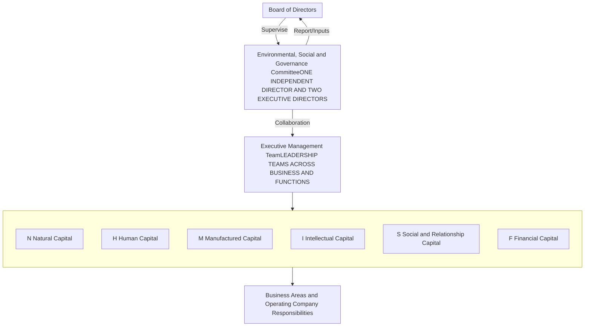
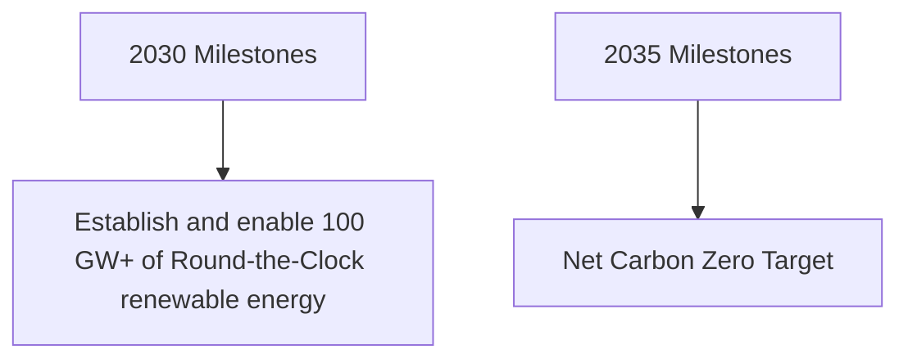

<!-- Page 1 -->

Collage of images representing various sectors of Reliance Industries Limited

Solar panels under a sunset sky with the label Sustainability

A teacher with children in a classroom with the label Responsibility

Young people taking a selfie with a smartphone with the label Connectivity

A woman and child shopping in a grocery store with the label Accessibility

Reliance Industries Limited logo with the tagline Growth is Life

A woman refueling a car at a petrol station with the label Mobility

An offshore oil rig with a worker in the foreground with the label Reliability

Two elderly women looking at a smartphone with the label Variety

# Realising Aspirations

Integrated Annual Report
2024-25

---

<!-- Page 2 -->

Portrait of Shri Dhirubhai H. Ambani

Pursue your goals even in the face of difficulties, and convert adversities into opportunities.

**Shri. Dhirubhai H. Ambani**

Founder Chairman

Reliance Industries Limited (RIL) is India's largest private sector enterprise and a Fortune Global 500 leader. Its presence across energy, retail, telecom, media and green technologies touches millions of lives every day, contributing to the nation's unstoppable growth momentum. As India dreams bigger and strides confidently forward, Reliance fuels that ambition with relentless passion, living by its unshakeable belief that 'Growth is Life'.

First Indian company to cross **Consolidated Total Equity** of over **₹10,00,000** Crore

## Empowering India's economy

**₹2,83,719** Crore
Exports

**₹2,156** Crore
CSR Contribution

**4,03,303**
People

## Proud champion of Make In India

**#88**
Fortune Global 500

Among **TIME100**
most influential
companies 2024

**#49**

Forbes Global 2000

### About this Report

The Reliance Integrated Annual Report has been prepared in alignment with the Integrated Reporting \<IR\> Framework. In preparation for the Report, GRI Standards, National Guidelines for Responsible Business Conduct (NGRBC), United Nations Sustainable Development Goals (UN SDGs) and 13 other frameworks were referenced. The Report outlines RIL's commitment to stakeholder value creation and defines the actions taken and outcomes achieved for its stakeholders.

### Attending the 48ᵗʰ AGM Online

RIL invites the participation of all shareholders at its 48ᵗʰ Annual General Meeting (AGM), to be held on August 29, 2025.

[Click here](https://www.ril.com/ar2024-25/index.html) to join.

### Forward-looking Statement

The report contains forward-looking statements, identified by words like 'plans', 'expects', 'will', 'anticipates', 'believes', 'intends', 'projects', 'estimates' and so on. All statements that address expectations or projections about the future, but not limited to the Company's strategy for growth, product development, market position, expenditures, and financial results, are forward-looking statements. Since these are based on certain assumptions and expectations of future events, the Company cannot guarantee that these are accurate or will be realised. The Company's actual results, performance or achievements could thus differ from those projected in any forward-looking statements. The Company assumes no responsibility to publicly amend, modify, or revise any such statements on the basis of subsequent developments, information or events.

The Company disclaims any obligation to update these forward-looking statements, except as may be required by law.

# TABLE OF CONTENTS

## Corporate Overview icon Corporate Overview

2 Reliance at a Glance
3 Stakeholder Value Creation
4 Chairman and Managing Director's Statement
6 10-year Financial Highlights

## Management Discussion and Analysis icon Management Discussion and Analysis

7 Financial Performance and Review

**Business Overview**

| 9  | Retail icon Retail                                   |
| -- | ---------------------------------------------------- |
| 12 | Digital Services icon Digital Services               |
| 15 | Media and Entertainment icon Media and Entertainment |
| 19 | Oil to Chemicals icon Oil to Chemicals               |
| 22 | Oil and Gas icon Oil and Gas                         |
| 25 | Risk and Governance                                  |
| 28 | Major Awards and Recognitions                        |

## Integrated Approach to Sustainable Growth icon Integrated Approach to Sustainable Growth

| 30 | Integrated Approach to ESG Governance                                |
| -- | -------------------------------------------------------------------- |
| 32 | Making Significant Strides towards a Net Carbon Zero Future          |
| 33 | Approach to Climate-related Disclosures                              |
| 34 | Natural Capital icon Natural Capital                                 |
| 37 | Human Capital icon Human Capital                                     |
| 38 | Manufactured Capital icon Manufactured Capital                       |
| 39 | Intellectual Capital icon Intellectual Capital                       |
| 39 | Social and Relationship Capital icon Social and Relationship Capital |
| 41 | Independent Assurance on Sustainability Disclosures                  |

## Governance icon Governance

45 Corporate Governance Report
76 Board's Report

## Financial Statements icon Financial Statements

97 Standalone
182 Consolidated

Portrait of Shri Mukesh D. Ambani

Our focus on fulfilling India's growth requirements through customer centric innovation, delivered with rigorous operational discipline are the key pillars of Reliance's resilience and progression.

**Shri Mukesh D. Ambani**

Chairman and Managing Director

## REPORTING SUITE

2024-25

RIL's Annual Reporting suite brings together the financial, non-financial, risk, and sustainability performance for the year.

Reporting Suite Visuals

Online Integrated Annual Report
**Online Integrated Annual Report**
[Click here](https://www.ril.com/reports/BRSR202425.pdf)

Business Responsibility & Sustainability Report (BRSR)
**Business Responsibility & Sustainability Report (BRSR)**
[Click here](https://www.ril.com/reports/CSR202425.pdf)

Corporate Social Responsibility Report (CSR)
**Corporate Social Responsibility Report (CSR)**
[Click here](https://www.ril.com/sites/default/files/reports/Members-Feedback-Form-2024-25.pdf)

Member's Feedback Form [Click here](https://jioevents.jio.com/rilagm/)

---

<!-- Page 3 -->

# A Powerhouse with Multiple Growth Engines

## Our Growth Engines

## Retail

**REVENUE ↑ 7.9%**
₹3,30,943 Crore
US$ 38.7 Billion

**EBITDA ↑ 8.6%**
₹25,094 Crore
US$ 2.9 Billion

India’s top retailer, delivering exceptional reach, providing quality products and superior customer experience through a unified network of stores and cutting-edge digital platforms.

**Consumption Baskets**

Consumer Electronics, Grocery, Fashion and Lifestyle, and Connectivity

[→ PG 9]

## Digital Services

**REVENUE ↑ 15.9%**
₹1,54,119 Crore
US$ 18.0 Billion

**EBITDA ↑ 14.7%**
₹65,001 Crore
US$ 7.6 Billion

India’s unmatched digital powerhouse, serving over 488 million subscribers with the widest converged network and innovative digital solutions.

**Ecosystem Platforms**

Connectivity and Cloud, Digital Commerce, Media/Gaming, Education, Agriculture, eGovernance, and Healthcare

[→ PG 12]

## Media & Entertainment

**REVENUE ↑ 74.3%**
₹20,696 Crore
US$ 2.4 Billion

**EBITDA ↑ 139.6%**
₹1,833 Crore
US$ 0.2 Billion

India’s largest Media & Entertainment platform, engaging daily with over 400 Mn+ viewers in a mobile-first, multi-screen, real-time market.

**Media Platforms**

Entertainment, Sports, News, OTT, Digital, Television, Content Production, Films, and on-ground Events

[→ PG 15]

## Oil to Chemicals

**REVENUE ↑ 11.0%**
₹6,26,921 Crore
US$ 73.4 Billion

**EBITDA ↓ 11.9%**
₹54,988 Crore
US$ 6.4 Billion

A global leader in Oil-to-Chemicals, delivering high-quality transportation fuels and petrochemical products through advanced integration, optimised conversion, and a strong focus on sustainable, high-value chemical solutions.

**Products**

Transportation Fuels, Polymers & Elastomers, Intermediates, and Polyesters

[→ PG 19]

## Oil and Gas

**REVENUE ↑ 3.2%**
₹25,211 Crore
US$ 2.9 Billion

**EBITDA ↑ 4.9%**
₹21,188 Crore
US$ 2.5 Billion

A leading contributor to India’s Exploration and Production sector, overseeing an upstream portfolio that covers deep and ultra-deepwater oil and gas reserves, as well as coal bed methane blocks.

**Capabilities**

Exploration, Field Development, Field Management, and Operations

[→ PG 22]

# Consistently Delivering Inclusive Growth

## Value Added Statement

(Consolidated)

Value added is defined as the value created by the activities of a business and its employees.

| Category                                                   | FY 2024-25 (₹ Crore) | FY 2023-24 (₹ Crore) |
| ---------------------------------------------------------- | -------------------- | -------------------- |
| CONTRIBUTION TO NATIONAL EXCHEQUER                         | 2,10,269             | 1,86,440             |
| REINVESTED IN THE GROUP TO MAINTAIN AND DEVELOP OPERATIONS | 1,40,151             | 1,35,880             |
| PROVIDERS OF DEBT                                          | 42,552               | 38,340               |
| EMPLOYEE BENEFITS                                          | 28,559               | 25,679               |
| PROVIDERS OF EQUITY CAPITAL                                | 6,766                | 6,089                |
| CONTRIBUTION TO SOCIETY                                    | 2,156                | 1,592                |
| TOTAL VALUE ADDED                                          | 4,30,453             | 3,94,020             |

**TOTAL VALUE ADDED IN FY 2024-25**

# ₹4,30,453 crore
(₹3,94,020 Crore in FY 2023-24)

* **CONTRIBUTION TO NATIONAL EXCHEQUER**: ₹2,10,269 Crore (₹1,86,440 Crore (FY 24))

* **REINVESTED IN THE GROUP TO MAINTAIN AND DEVELOP OPERATIONS**: ₹1,40,151 Crore (₹1,35,880 Crore (FY 24))

* **PROVIDERS OF DEBT**: ₹42,552 Crore (₹38,340 Crore (FY 24))

* **EMPLOYEE BENEFITS**: ₹28,559 Crore (₹25,679 Crore (FY 24))

* **PROVIDERS OF EQUITY CAPITAL**: ₹6,766 Crore (₹6,089 Crore (FY 24))

* **CONTRIBUTION TO SOCIETY**: ₹2,156 Crore (₹1,592 Crore (FY 24))

### Sustainable Growth Enablers

| 1                                         | 2                                    | 3                             | 4                                                 |
| ----------------------------------------- | ------------------------------------ | ----------------------------- | ------------------------------------------------- |
| Technology and consumer-centric platforms | Strong project management capability | Competitive access to capital | Diversification, integration, and cost leadership |

| Category                                                   | FY 2024-25 (₹ Crore) | FY 2023-24 (₹ Crore) |
| ---------------------------------------------------------- | -------------------- | -------------------- |
| CONTRIBUTION TO NATIONAL EXCHEQUER                         | 2,10,269             | 1,86,440             |
| REINVESTED IN THE GROUP TO MAINTAIN AND DEVELOP OPERATIONS | 1,40,151             | 1,35,880             |
| PROVIDERS OF DEBT                                          | 42,552               | 38,340               |
| EMPLOYEE BENEFITS                                          | 28,559               | 25,679               |
| PROVIDERS OF EQUITY CAPITAL                                | 6,766                | 6,089                |
| CONTRIBUTION TO SOCIETY                                    | 2,156                | 1,592                |
| TOTAL VALUE ADDED                                          | 4,30,453             | 3,94,020             |

---

<!-- Page 4 -->

# What is Good for India is Good for Reliance

Dear Shareholders,

Nearly fifty years ago, our visionary founder, Shri Dhirubhai Ambani, embarked on a bold mission — to prove that India could build a world-class enterprise founded on innovation, integrity, and ambition. That belief became Reliance. And over the decades, Reliance has grown from an idea into one of the world’s most admired enterprises — a symbol of India’s entrepreneurial spirit and its limitless potential.

Portrait of Shri. Mukesh D. Ambani

**Shri. Mukesh D. Ambani**
**Chairman and Managing Director,**
**Reliance Industries Limited**

Today, Reliance is not just a company. It is a national institution that powers opportunity, progress, and prosperity for 1.45 billion Indians. Our journey has been extraordinary — transforming traditional industries, building global-scale capabilities, creating entirely new markets, and touching the everyday lives of our fellow citizens. But we have never paused to celebrate the past. Instead, each milestone has inspired us to aim higher, work harder, and lead with purpose.

## Adapting Boldly, Evolving Relentlessly

The world is changing at breakneck speed — reshaped by digital disruption, global shifts, and technological breakthroughs. At Reliance, we see this not as a challenge but as an opportunity. We are reimagining our future and reshaping our businesses to become a new-age deep-tech enterprise.

From energy to entertainment, from retail to digital services, we are integrating next-generation technologies across every business vertical. Over 1,000 of our in-house scientists are leading cutting-edge research in areas like AI, renewable energy, advanced materials, and digital platforms.

Our manufacturing infrastructure is being future-proofed to support India’s aspiration to become a global manufacturing powerhouse. This evolution mirrors the journey of our great nation as it steps confidently into the Amrit Kaal — a transformative era on the path to becoming a fully developed ‘Viksit Bharat.’

## India’s Moment. Reliance’s Resolve.

Today, India is standing tall on the global stage. Despite global uncertainties and geopolitical turbulence, our economy continues to demonstrate unmatched resilience and momentum. In FY25, India’s GDP growth remained nearly double the global average — propelled by robust domestic consumption, infrastructure development, thriving exports, and a dynamic digital ecosystem.

More importantly, India is no longer just following trends — it is setting them. From UPI’s global success to the India AI Mission, from green energy to space tech, India is shaping the future. This is India’s moment. And Reliance is proud to walk shoulder-to-shoulder with the nation — as a committed partner, a responsible value-creator, and a technology-driven enabler of inclusive growth.

## Strong and Resilient Performance

Even amidst external volatility, Reliance delivered a year of solid and balanced growth. Our results speak to the strength of our diversified model and our deep-rooted execution discipline:

* **Revenue:** ₹ 10,71,174 crore (+7.1% Y-o-Y)

* **EBITDA:** ₹ 1,83,422 crore (+2.9% Y-o-Y)

* **Net Profit:** ₹ 81,309 crore (+2.9% Y-o-Y)

Each business played a vital role in this performance:

* **Retail:** Crossed ₹ 3,30,000 crore in turnover and expanded its footprint to 19,340 stores, strengthening its leadership in Indian Retail industry.

* **Digital Services:** Jio emerged as the world’s largest data network with 488 million users, including 191 million on 5G.

* **Media:** Built a large and distinctive media institution, in partnership with Disney, across genres, marking the beginning of a new era in India’s entertainment landscape. Delivered record viewership and engagement metrics within the first few months of commencing operations.

* **Oil to Chemicals (O2C):** Demonstrated resilience through disciplined cost management and strong domestic placement.

* **Oil & Gas:** Delivered record EBITDA, with increased output from KG-D6 and CBM blocks, enhancing India’s energy independence.

* **New Energy:** Transitioned from vision to execution — operationalising giga-scale solar and battery energy projects.

## Creating the Future — Four New Engines of Growth

As Reliance approaches its Golden Jubilee, we have built high-powered growth engines: **Retail, Digital Services, Media and Entertainment, and New Energy.** Each of these platforms is technology-first, innovation-led, and positioned to disrupt industries while delivering massive value to Indian consumers and the global market.

Our O2C and Oil and Gas businesses will continue to grow while catering to India’s rising energy and materials demand.

We are not just scaling businesses — we are building platforms that empower people, reduce inequality, drive sustainability, and elevate India’s position in the global economy. Whether it’s transforming the way Indians shop, consume data, watch content, or power their homes and businesses — Reliance is shaping the future with purpose and conviction.

Aerial view of an industrial facility at night

## Our Foundation — Values, People, Vision

At the heart of Reliance’s success is a foundation built on values, trust, and talent. Our strong balance sheet, relentless focus on productivity, and unwavering commitment to excellence give us the confidence to embrace bold ambitions.

Our people — across every function and business — bring passion, ingenuity, and integrity to their work every day. Our Board provides the stewardship and wisdom that guides our long-term decisions. Our partners and vendors align closely with our purpose. And above all, our customers and shareholders place their trust in us — time and again — and that is our greatest strength.

## Thank You for Believing in Us

To each of you — our valued shareholders — I express my deepest gratitude. Your unwavering belief in Reliance’s vision gives us the courage to keep pushing boundaries and building for the future.

The journey ahead is full of promise. With unwavering faith in India and steadfast commitment to innovation, sustainability and inclusion, Reliance is poised to rise to even greater heights. For India and for Reliance - the future shines bright!

With warm regards,

**Mukesh D. Ambani**
Chairman and Managing Director
August 6, 2025

---

<!-- Page 5 -->

# 10-YEAR FINANCIAL HIGHLIGHTS

(Consolidated)

(₹ in crore, unless otherwise stated)

|                                                                       | US$ million | FY 2024-25 | FY 2023-24 | FY 2022-23\*\*\* | FY 2021-22 | FY 2020-21 | FY 2019-20 | FY 2018-19 | FY 2017-18 | FY 2016-17 | FY 2015-16 |
| --------------------------------------------------------------------- | ----------- | ---------- | ---------- | ---------------- | ---------- | ---------- | ---------- | ---------- | ---------- | ---------- | ---------- |
| Value of Sales and Services (Revenue)                                 | 125,320     | 10,71,174  | 10,00,122  | 9,74,864         | 7,88,743   | 5,39,238   | 6,59,997   | 6,25,212   | 4,30,731   | 3,30,180   | 2,93,298   |
| Total Income                                                          | 116,773     | 9,98,114   | 9,30,529   | 9,03,045         | 7,32,578   | 5,02,653   | 6,25,601   | 5,91,480   | 4,18,214   | 3,39,623   | 3,05,351   |
| Earnings Before Depreciation, Finance Cost and Tax Expenses (EBDIT) # | 21,459      | 1,83,422   | 1,78,290   | 1,53,920         | 1,23,684   | 97,580     | 1,02,280   | 92,656     | 74,184     | 55,529     | 53,993     |
| Depreciation and Amortisation                                         | 6,217       | 53,136     | 50,832     | 40,303           | 29,782     | 26,572     | 22,203     | 20,934     | 16,706     | 11,646     | 11,565     |
| Exceptional Items gain/(loss)                                         | -           | -          | -          | -                | 2,836      | 5,642      | (4,444)    | -          | 1,087      | -          | 4,574      |
| Profit for the Year                                                   | 9,513       | 81,309     | 79,020     | 73,670           | 66,184     | 53,739     | 39,880     | 39,837     | 36,080     | 29,833     | 29,861     |
| Equity Dividend (%)##                                                 | -           | 100        | 90         | 80               | 70         | 65         | 65         | 60         | 110        | -          | 105        |
| Dividend Payout##                                                     | 792         | 6,766      | 6,089      | 5,083            | 4,297      | 3,921      | 3,852      | 3,554      | 3,255      | -          | 3,095      |
| Equity Share Capital                                                  | 1,583       | 13,532     | 6,766      | 6,766            | 6,765      | 6,445      | 6,339      | 5,926      | 5,922      | 2,959      | 2,948      |
| Net Worth                                                             | 93,018      | 7,95,069   | 7,42,922   | 6,68,880         | 6,45,127   | 5,48,156   | 3,71,569   | 3,24,644   | 2,89,798   | 2,58,511   | 2,31,556   |
| Gross Fixed Assets                                                    | 188,831     | 16,14,033  | 14,38,448  | 12,96,484        | 10,43,121  | 8,91,553   | 8,42,635   | 7,63,988   | 7,62,493   | 6,81,238   | 5,59,942   |
| Net Fixed Assets                                                      | 144,747     | 12,37,221  | 11,03,851  | 10,03,287        | 7,87,295   | 6,56,999   | 6,31,505   | 5,65,840   | 5,85,094   | 5,18,471   | 4,09,353   |
| Total Assets                                                          | 228,151     | 19,50,121  | 17,55,986  | 16,07,431        | 14,99,665  | 13,21,212  | 11,65,915  | 10,02,406  | 8,16,348   | 7,06,802   | 5,98,997   |
| Market Capitalisation^                                                | 201,858     | 17,25,378  | 20,14,011  | 15,77,093        | 17,81,841  | 13,15,998  | 7,05,212   | 8,63,996   | 5,59,223   | 4,28,909   | 3,38,703   |

## KEY INDICATORS

|                            | US$ | FY 2024-25 | FY 2023-24 | FY 2022-23\*\*\* | FY 2021-22 | FY 2020-21 | FY 2019-20 | FY 2018-19 | FY 2017-18 | FY 2016-17 | FY 2015-16 |
| -------------------------- | --- | ---------- | ---------- | ---------------- | ---------- | ---------- | ---------- | ---------- | ---------- | ---------- | ---------- |
| Earnings Per Share\* (₹)   | 0.6 | 51.5       | 102.9      | 98.0             | 89.5       | 76.4       | 63.1       | 66.8       | 61.0       | 101.3      | 101.0      |
| Turnover Per Share\* (₹)   | 9.3 | 791.6      | 1,478.1    | 1,440.8          | 1,165.7    | 836.7      | 1,041.1    | 1,055.1    | 727.4      | 1,115.9    | 994.9      |
| Book Value Per Share\* (₹) | 7.3 | 623.1      | 1,172.7    | 1,058.0          | 1,152.1    | 1,086.4    | 708.5      | 653.3      | 495.6      | 891.2      | 785.5      |
| Debt: Equity Ratio         | -   | 0.41:1     | 0.41:1     | 0.44:1           | 0.34:1     | 0.36:1     | 0.75:1     | 0.74:1     | 0.75:1     | 0.75:1     | 0.78:1     |
| EBDIT/Gross Turnover (%)   | -   | 17.1       | 17.8       | 15.8             | 15.7       | 18.1       | 15.5       | 14.8       | 17.2       | 16.8       | 18.4       |
| Net Profit Margin (%)      | -   | 7.6        | 7.9        | 7.6              | 8.4        | 10.0       | 6.0        | 6.4        | 8.4        | 9.0        | 10.2       |
| RONW (%)\*\*               | -   | 14.6       | 16.3       | 15.0             | 13.2       | 13.1       | 12.7       | 15.1       | 16.9       | 16.4       | 16.5       |
| ROCE (%)\*\*               | -   | 11.3       | 12.6       | 13.3             | 12.7       | 10.6       | 12.0       | 13.5       | 13.6       | 13.5       | 13.0       |

In this Integrated Annual Report, $ denotes US$, unless otherwise stated

US$ 1 = 85.4750 (Exchange Rate as on 31.03.2025)

\*** Excludes impact of discontinued operations

\# Before exceptional items

\## The disclosure of dividend payout is on actual payment basis post Ind AS implementation w.e.f. FY 2016-17

\^ For Reliance Industries Limited

\* Pursuant to issue of Bonus Shares in 2017-18 and 2024-25 in the ratio of 1:1

\** Refer Note 39.1 of Standalone Financial Statements.

Note: Above highlights are part of Management Discussion and Analysis Section

# Financial Performance and Review

## Operating Environment

Global economic growth remained healthy at 3.3% in CY24 consistent with the prior year. Global inflation eased to 5.7% in CY24 from 6.7% in CY23, supported by the stabilisation of supply chains post-COVID and a moderation in commodity prices. This enabled major central banks to ease monetary policy, lowering benchmark rates by 50 to 100 bps in CY24.

However, geopolitical tension and policy uncertainties, including trade tariffs, led to volatility in global markets, adversely impacting energy demand, resulting in softer prices and narrower margins. Transportation fuel margins moderated from elevated levels, and downstream chemicals margins came under significant pressure due to incremental supply additions, particularly from China.

Despite global headwinds, the Indian economy was remarkably resilient. While growth moderated to 6.5% in FY 2024-25 from 9.2% in FY 2023-24, India retained its position as the fastest growing major economy in the world.

Domestic consumption witnessed mixed trends with rural demand strengthening, and urban consumption moderating. Macro-prudential regulatory tightening of credit in FY 2023-24 led to moderation in personal credit growth to 16% in FY 2024-25, from 27% in FY 2023-24. Consumption demand remained relatively soft during the first half with general elections and peak monsoon. The festive season and Mahakumbh revived domestic markets in the second half. However, pockets of urban and rural demand are yet to fully recover.

External balances in India saw continued strength in current account with resilient services surplus (current account deficit <1% of GDP). Net services exports clocked another 14% Y-o-Y growth, driven by continued momentum in digital services and Global Capability Centres (GCC). In the second half, capital inflows slowed as FPIs turned net sellers, leading to tighter liquidity. In response, the RBI cut the CRR by 50 bps in December, and subsequently reduced the policy repo rate by a cumulative 100 bps to 5.5% by June 2025. India remains well positioned for sustained high growth on the back of favourable demographics and a large domestic market.

## Performance Overview

Reliance Industries Limited delivered a resilient performance for FY 2024-25, emphasising the strength of its focused, diverse business portfolio. Amidst prolonged global volatility, the Company delivered balanced and consistent growth across its businesses.

* Consolidated revenue increased by 7.1% to ₹10,71,174 crore (US$ 125.3 billion), compared to ₹10,00,122 crore in FY 2023-24

* EBITDA grew by 2.9% to ₹1,83,422 crore (US$ 21.5 billion) from ₹1,78,290 crore in the previous year, with consumer businesses contributing over 50% of consolidated EBITDA

* PAT rose 2.9% year-on-year to ₹81,309 crore (US$ 9.5 billion)

Segment Performance:

* Digital Services EBITDA grew 14.7% supported by widespread adoption of 5G and broadband across mobility, home, and enterprise segments. Tariff revision introduced during the year was well absorbed, with no adverse impact on data consumption trends.

* Retail EBITDA grew 8.6%, benefitting from productivity gains through network optimisation and improved operating metrics

* Oil and Gas EBITDA increased by 4.9% supported by a marginal increase in production from the KG D6 block

* Oil to Chemicals (O2C) EBITDA declined by 11.9%, impacted by weaker fuel cracks and lower petrochemical margins. The performance was supported by stronger domestic demand and feedstock flexibility. The segment witness increased fuel retail sales through Jio-bp, aided by a favourable margin environment.

* Consolidated cash profit increased to ₹1,46,917 crore, compared to ₹1,41,969 crore in FY 2023-24.

## Consolidated Net Debt

RIL’s gross debt as on 31st Mar’25 stood at ₹ 3,47,530 crore (US$ 40.7 billion) Net debt stood at ₹ 1,17,083 crore (US$ 13.7 billion). Robust internal flow generation supported investments in growth opportunities across business, while maintaining a conservative balance sheet and investment grade credit ratings.

## Capex

Capital expenditure for the financial year stood at ₹ 1,31,107 crore (US$ 15.3 billion), adequately covered by cash profits. FY 2023-24 capex was at ₹ 1,31,769 crore. FY 2024-25 investments were largely directed towards new O2C projects, Retail store expansion, augmenting Digital Services infrastructure and building manufacturing assets in New Energy.

## Standalone

Standalone RIL revenue was at ₹ 5,57,163 crore (US$ 65.2 billion), lower by 3.1% as compared to ₹ 5,74,956 crore in FY 2023-24. EBITDA for the standalone entity fell 14.2% to ₹ 74,163 crore (US$ 8.7 billion) from ₹ 86,393 crore for the year ago period. The O2C segment profitability was impacted by unfavourable global demand-supply balance, which was partially offset by improved upstream performance with higher volumes of gas and condensate. Standalone Profit After Tax was at ₹ 35,262 crore (US$ 4.1 billion), down 16.1% vis-a-vis ₹ 42,042 crore last year.

---

<!-- Page 6 -->

## Movement in Key Financial Ratios

The net capital turnover ratio improved from 25.43 in FY 2023-24 to 47.92 in FY 2024-25, due to reduction in net working capital.

The operating margin ratio declined to 7.2% in FY 2024-25 as against 9.8% in previous year primarily due to weaker transportation fuels and downstream chemical margins.

The return on net worth* fell to 8.2% in FY 2024-25 as against 10.3% in previous year due to decline in O2C earnings.

\*Adjusted for CWIP and revaluation

## Liquidity and Capital Resources

### Macro Environment

FY 2024–25 witnessed high volatility in financial markets. In India, first half of the financial year saw global outperformance of Indian assets driven by healthy growth momentum, continued improvement in fiscal health, which led to prospect of rating upgrade, and bond index inclusion flows. Softening global yield environment helped India benchmark 10y G-sec yield to ease decisively below 7%, while rupee remained stable.

However, second half of the financial year saw large outflows from foreign portfolio investors, softening of growth momentum in India and resurgence of China as an investment destination. This had a depreciative effect on INR and tightened banking system liquidity. As a result, from December 2024 onwards, RBI began easing financial conditions through a mix of CRR cut, Repo rate cuts and injection of rupee liquidity.

### Fund Raising

Despite a volatile environment, RIL successfully executed a multi-currency, multi-instrument financing strategy, achieving an optimal capital structure at competitive costs. The proceeds were primarily utilised to fund green capital expenditures and to refinance upcoming debt maturities.

### Offshore Facilities

#### Syndicated Term Loan Facilities (~$3 billion equivalent)

The Company secured these facilities to refinance maturing debt obligations.

#### ECA Supported Facilities (~$1 billion equivalent)

RIL tied up ~$1 billion equivalent green SACE Push facilities supported by Italian Export Credit Agency (SACE) to finance capital expenditure towards eligible green projects. This is the first such fully green-labelled facility for the Company.

### Liquidity Management

RIL maintains a robust liquidity management framework to ensure financial flexibility and resilience in all market conditions. The Company leveraged a diverse funding strategy and efficiently managed working capital. RIL’s surplus funds were deployed in stable yield instruments, insulated from unfavourable market movements to ensure immediate access to liquidity.

### Credit Rating

RIL continues to be rated two notches above sovereign by S&P and one notch above sovereign by Moody’s.

| Instrument         | Rating Agency | Ratings      | Remarks                                    |
| ------------------ | ------------- | ------------ | ------------------------------------------ |
| International Debt | S\&P          | BBB+         | Two notches above India’s sovereign rating |
| International Debt | Moody’s       | Baa2         | One notch above India’s sovereign rating   |
| Long-Term Debt     | CRISIL        | AAA (Stable) | Highest rating by CRISIL                   |
| Long-Term Debt     | CARE          | AAA (Stable) | Highest rating by CARE                     |
| Long-Term Debt     | ICRA          | AAA (Stable) | Highest rating by ICRA                     |
| Long-Term Debt     | India Ratings | AAA (Stable) | Highest rating by India Ratings            |

### Way Forward

RIL remains committed to maintaining a strong liquidity position and a robust capital structure to enable organic growth and strategic investments. The Company generates strong cash flows, enabling it to fund strategic initiatives, service debt, and deliver long-term value to shareholders. RIL will continue to prioritise prudent capital allocation within a robust risk management framework to achieve its strategic goals.

# Retail

Reliance Retail, the largest and most successful retailer in India, has adopted a multi-channel strategy through an integrated network of **physical stores, digital commerce, and new commerce platforms** to serve its customers across diverse consumption baskets. This ensures that Reliance Retail operates at an unparalleled and unmatched scale in the Indian retail industry. Enriching the quality of lives of millions of Indians everyday, Reliance Retail is ranked 40th in Deloitte’s Global Powers of Retailing and the only Indian retailer in the Top 100.

> 

> ### Strategic Objective
> 

> Transform the retail landscape through synergistic partnerships creating shared wins for all stakeholders across the retail value chain. Guided by innovation and relentless focus on customer-centricity, Reliance Retail will continue to deliver exceptional value and a differentiated experience to Indian consumers across key categories and omnichannel platforms—shaping the future of retail in India.

**19,340**
Retail stores

**~1.4 Billion**
Transactions

**77.4 Million sq. ft.**
Retail area

**>349 Million**
Registered customer base

**2,47,782**
People

### Industry Overview

India’s retail industry has evolved into one of the most dynamic and rapidly expanding sectors, contributing immensely to the development of our country.

According to a recent report by the Boston Consulting Group and the Retailers Association of India, India’s retail sector is projected to reach an impressive ₹ 190 lakh crore by 2034, growing at a compounded annual growth rate (CAGR) of 9%. The share of organised retail constitutes 18% of the total retail market, while the unorganised segment, characterised by presence of millions of small kiranas, constitutes the remaining 82%.

India remains one of the world’s fastest-growing retail markets and is poised to become the third-largest retail market by 2030.

Two women shopping at a SMART Bazaar store with a shopping cart

---

<!-- Page 7 -->

## Business Performance

Reliance Retail recorded Gross Revenue of ₹ 3,30,943 crore for the year, a growth of 7.9% over last year.

The business continued its strong track record of profit growth registering an EBITDA of ₹ 25,094 crore, higher by 8.6% Y-o-Y.

The business opened 2,659 stores during the year, taking the total store count to 19,340 stores, the largest store footprint for any retailer in the country. The registered customer base crossed 349 million.

## Consumer Electronics

Reliance Retail is India’s leading consumer electronics retailer, operating Reliance Digital and MyJio Stores. The business follows a solution-selling approach, offering a unique value proposition, an enhanced in-store experience, and a comprehensive yet curated product range. This is further supported by resQ, the in-house after-sales service organisation and India’s first multi-brand multi-category service provider that ensures seamless customer support and satisfaction.

### Strategic Progress

* Offline business experienced robust growth, driven by new product and brand launches and curated product assortment leading to higher transactions and improved conversions.

* resQ continued to expand its reach, enhancing service availability through the launch of newer plans and categories

* The Own Brands business strengthened its portfolio with new offerings and a growing merchant network.

* JioMart Digital sustained its growth trajectory, driven by strong product demand and deeper engagement with merchant partners.

Two people looking at a smartphone in a store

### FINANCIAL PERFORMANCE

| (₹ Crore)                   | (₹ Crore) FY 2024-25 | (₹ Crore) FY 2023-24 | (₹ Crore) Y-o-Y Change |
| --------------------------- | ------------------------ | ------------------------ | -------------------------- |
| Value of sales and services | 3,30,943                 | 3,06,848                 | 7.9%                       |
| Revenue from operations     | 2,91,043                 | 2,73,131                 | 6.6%                       |
| EBITDA                      | 25,094                   | 23,108                   | 8.6%                       |
| EBITDA margin\*             | 8.6%                     | 8.5%                     | 10 bps                     |

\*EBITDA margin is calculated on Revenue from operations

## Fashion and Lifestyle

Reliance Retail is India’s largest fashion and lifestyle retailer. It operates multiple retail formats tailored to meet varied consumer preferences across segments, providing a world-class shopping experience.

### Strategic Progress

* Apparel & Footwear business delivered a steady performance supported by improved store experience and enhanced product assortment. The business continued to invest in developing fast fashion ecosystem with ‘design-to-shelf’ cycle of 30 days.

* AJIO maintained steady performance, supported by an expanding product catalogue and introduction of new brands.

* The Premium Brands business enriched its portfolio with new brand partnerships while focusing on global expansion of owned intellectual properties.

* The Jewellery business delivered steady growth, supported by value transactions and new product designs catering to special occasions.

People shopping in a clothing store

## Grocery

Reliance Retail is India’s largest grocery retailer. Through innovative store concepts coupled with integrated digital and new commerce platforms, it provides a broad selection of fresh produce, daily essentials, and general merchandise in a modern shopping environment, delivering superior value to customers.

### Strategic Progress

* Grocery business sustained strong growth, driven by the expansion of large-format stores and scale up of hyperlocal deliveries.

* Growth across categories remained strong, with a particular focus on catalogue expansion in non-food segments. Enhanced offerings in General Merchandise, Home & Personal Care, and Value Apparel drove customer engagement and contributed to sustained growth.

* Metro business continued strong growth through targeted initiatives for HoReCa and Trader channels.

## Consumer Brands

Consumer Brands has emerged to become one of the fastest growing FMCG companies in India. The business continues to expand its portfolio, building a strong lineup of accessible and affordable brands across key categories of Beverages, Staples, Packaged Foods and Home & Personal Care.

### Strategic Progress

* Consumer brands continued to show strong growth across categories, driven by expanding product offerings and increasing market presence.

* Flagship brands such as Campa and Independence are gaining momentum across regions, strengthening their position in key categories and showing promising growth potential.

* Campa continued to gain traction across markets, registering >10% market share in sparkling beverage category in select states.

* The business deepened its presence in General Trade by enhancing availability and reach across merchant outlets nationwide.

Campa beverage advertisement with bottles

* Product innovation remained a key focus, with strategic acquisitions of Tagz Foods and the launch of new variants under Campa, Independence, Alan’s, Enzo, Ravalgaon etc. to cater to evolving consumer preferences.

## JioMart and Milkbasket

JioMart is a multi-category digital commerce platform offering a seamless, fast, and convenient shopping experience. Milkbasket operates as a subscription-based service, allowing households to schedule daily deliveries of essential products with ease.

### Strategic Progress

* JioMart expanded its product catalogue and seller network, enhancing customer offerings across diverse categories.

* The platform continued to scale its quick commerce delivery capability, evolving to meet consumer expectations while also ensuring efficient operations.

* Milkbasket maintained strong growth momentum, driven by increasing customer adoption and consistent improvement in service offerings.

## Connectivity

Reliance Retail serves as a master distributor for Jio’s connectivity services, offering a wide array of products and solutions to consumers across India through a network of MyJio and Digital stores, and in collaborations with retailers nationwide.

## SCOT Analysis

**S STRENGTHS**
* Largest omni-channel retailer with seamless integration of stores, digital, and new commerce platforms
* Expansive customer base with >349 million registered customers.
* Deep insights into evolving consumer behaviour and shopping preferences
* Strong product design and innovation capabilities across diverse categories
* Robust sourcing network encompassing MSMEs, national, and international suppliers
* Preferred partner for global brands, offering the widest portfolio of international labels
* Extensive supply chain enabling nationwide product delivery within 24–48 hours

**C CHALLENGES**
* Upward pressure on rentals due to demand-supply mismatch for high quality real estate
* Availability of trained manpower to support rapid expansion

**O OPPORTUNITIES**
* Rising consumer aspirations and growing disposable incomes present significant growth potential
* Accelerating the growth of own brands and exclusive brand partnerships
* Leveraging AI and data analytics for personalised customer engagement and operational efficiency
* Expanding into emerging segments and scale up regional brands

**T THREATS**
* Macroeconomic factors affecting consumer spending patterns

## Outlook

India’s retail sector has been one of the fastest growing consumer markets in the world. Government initiatives, including tax relief and supportive economic policies are expected to boost disposable incomes and stimulate consumption.

With strong rural demand and projected GDP growth, the retail sector is poised for sustained growth.

Overall, the outlook is positive for India’s retail industry, characterised by technological progress, market expansion, greater consumer engagement, and launch of innovative products.

---

<!-- Page 8 -->

% logo

# Digital Services

Jio is a key catalyst and driver of digital adoption in India, powered by its world-class connectivity network and a suite of technology platforms. This has put India on the global map for connectivity infrastructure and consumer technology adoption. We remain committed to driving innovation and enabling the most powerful, inclusive, and accessible Digital Society in the country.

> **Strategic Objective**
>
> Leverage indigenously developed technologies and partnerships to provide best-in-class products and services for customers across and beyond India.

**185 Exabytes**
Data Traffic

**488 Million+**
Subscribers EoP

**18 Million+**
Homes Connected

**191 Million**
5G Users

**94,523**
People

## Unlimited 5G, Unlimited Possibilities

5G logo

Man using smartphone with 5G graphic

### Industry Overview

#### Digital becoming a growth engine for the economy

With ~950 million broadband users, India’s digital economy is growing at a remarkable pace, driving economic growth, employment, and sustainable development. According to Government of India estimates, digital economy is expected to grow at twice the pace of the overall economy and contribute to one-fifth of the national income by 2030. Key drivers of this growth include the rapid adoption of AI, cloud services, and the rise of global capability centres (GCCs) in the country. Jio is actively partnering with Government of India in its INDIAai mission to build a comprehensive AI ecosystem that democratises computer access and develops indigenous AI capabilities.

### Broadband adoption accelerates with 5G and Fixed Wireless

Improving device ecosystem and the pan-India rollout of 5G have boosted digital adoption. Jio significantly expanded its 5G user base in India with high per capita data usage. According to Ericsson Mobility Report, 5G subscriptions in India are expected to reach around 970 million by the end of 2030, accounting for 74% of mobile subscriptions. The rollout of fixed wireless infrastructure has accelerated the growth of fixed broadband in the country. Fixed wireless technology with point-to-multi-point radios is taking services to currently underserved semi urban/rural areas. India’s fixed broadband user base is expected to grow multifold from the current 47 million premises over the next few years.

JioHome and Jio More services graphic

### Regulatory Developments

The key regulatory developments during the year were as follows:

* **Spectrum Auction** was conducted in June 2024 and Jio enhanced its holdings in 1800 MHz band in Bihar and West Bengal. Jio’s spectrum footprint increased to 26,801 MHz (uplink + downlink), solidifying its leadership position.

* Government has issued the draft Rules under **Digital Personal Data Protection Act, 2023** to protect the digital personal data of Indian citizens for consultation.

* TRAI issued revised guidelines under the **Telecom Commercial Communications Customer Preference (Second Amendment) Regulations, 2025** to strengthen spam management.

* TRAI has released recommendations on **Terms and Conditions for the Assignment of Spectrum for Satellite-Based Commercial Communication Services**.

## Business Performance

### FINANCIAL PERFORMANCE

| (₹ Crore)                   | FY 2024-25 | FY 2023-24 | Y-o-Y Change |
| --------------------------- | ---------- | ---------- | ------------ |
| Value of sales and services | 1,54,119   | 1,32,938   | 15.9%        |
| Revenue from operations     | 1,31,336   | 1,13,176   | 16.0%        |
| EBITDA                      | 65,001     | 56,675     | 14.7%        |
| EBITDA margin\*             | 49.5%      | 50.1%      | (60 bps)     |

\* EBITDA margin is calculated on Revenue from Operations

Revenue and EBITDA growth for the Digital Services business in FY 2024-25 were 15.9% and 14.7% Y-o-Y, led by impact of tariff hike in mobility, increasing penetration of the homes business and scale-up of digital platforms. Customer engagement on the Jio network remained robust, with average per capita data and voice usage at 33.6 GB and 1,027 minutes per month across overall subscriber base of 488.2 million for the quarter ending March 2025.

### Jio has led every communication technology transition in India

In less than a decade, Jio has driven India’s transition from data darkness to data abundance. This has been enabled by Jio’s vision and ahead of the curve investments on 4G LTE pre-2016, Fiber-To-The-Home in 2018, Standalone 5G in 2022, and FWA in 2024. Resultantly, Jio is now the world’s largest data operator carrying over 17 exabytes of data traffic monthly with a ~60% share of wireless data traffic in India.

Jio continues to work on future communication technologies and is actively researching and developing 6G technology, aiming to be a global leader in its development and deployment. To augment our technology leadership in building terrestrial networks, Jio is also building its own Satellite communication platform and partnering with SpaceX to offer Starlink’s broadband internet services to its customers in India.

### Jio strengthens market leadership across mobility and fixed broadband

As of March 2025, Jio had ~191 million 5G users on its network contributing ~45% of its wireless data traffic. Jio’s True5G network is the most awarded and shows a significant lead on performance and availability metrics across most network performance measurement platforms like OpenSignal and Ookla.

Jio has connected ~18 million homes as of the end of FY 2024-25 and has accounted for ~85% of the total new additions in the industry during the fiscal year. Jio’s AirFiber solution has been the primary reason for the acceleration in pace of home connects extending reach to all parts of the country, especially beyond the top 1,000 cities. Jio remains confident of connecting 100 million homes with a combination of Fiber and AirFiber broadband solutions bundled with digital TV and on demand entertainment.

People watching content on a large screen

---

<!-- Page 9 -->

# DIGITAL SERVICES

## Ecosystem approach to Consumer and Enterprise Digital Services

Jio offers its 488 million+ users access to a wide and engaging suite of applications across multiple entertainment use cases – live digital TV, video and music streaming, games, education, among others. This is complemented by MyJio, India’s largest connectivity self-care application which serves as a platform to access the entire digital services offering across Jio and its partner ecosystem.

Jio’s Set-top box is a digital gateway with high engagement levels and average daily usage of over 5 hours in every home. Our new offerings, the JioAICloud, a consumer cloud storage service, and JioPC a cloud based scalable compute platform would make AI accessible across our customer base.

Store Intelligently - Free 50 GB secure storage - for all that matters.

Jio is also growing as an end-to-managed services partner of enterprises offering best in industry scalable connectivity bundled with Cloud, Internet of Things (IoT), Managed Wifi, Private 5G and host of industry specific solutions.

## AI to drive incremental multi-decade growth

With an aim to streamline AI adoption, Jio is developing a comprehensive suite of tools and platforms called JioBrain, a powerful AI service platform that can be offered to enterprises across industries. This is currently used in different parts of Jio operations like network planning and maintenance, resource optimisation and customer services. Jio will leverage its expertise in infrastructure, networking, operations, software and data, and collaborate with its global partners to enable world’s lowest AI inferencing cost in India to make AI available Everywhere for Everyone.

JioPC Next-Gen AI Ready Computer.

## SCOT Analysis

**S** **STRENGTHS**
* One of the most advanced and integrated connectivity networks globally.
* Deepest digital and physical distribution footprint on a pan-India basis.
* A complete suite of digital platforms across consumer and enterprise offerings.

**C** **CHALLENGES**
* Unforeseen disruptions in the global technology supply chain.
* Need to drive the development of a robust device ecosystem across form factors to support future technologies.
* Continued investment in creating relevant use cases and deepening user engagement across digital platforms.

**O** **OPPORTUNITIES**
* Jio’s pan-India True5G network is well-positioned to lead the 5G transformation.
* Jio’s extensive fiber network and pioneering fixed wireless rollout are poised to connect 100 million premises with digital solutions.
* Opportunity to advance compute infrastructure in India with AI.

**T** **THREATS**
* Disruptive technological changes could make current technologies obsolete.
* The entry of a new disruptive player or price competition could impact long-term returns.

## Outlook

Jio is extending its leadership in technologies like 5G, fixed broadband and converged networks, to now address the huge opportunity provided by AI services. Jio’s leadership in network, consumer and enterprise technologies will maintain its distinct competitive advantage. These indigenously developed technologies are being deployed at scale across India and will be taken to the rest of the world. This will ensure a long runway of growth and consistent shareholder returns.

# Media and Entertainment

Reliance has significantly advanced its Media and Entertainment (M&E) ambitions with JioStar, India’s largest media platform, created by the merger of Viacom18 and Star India, during the past year. It brought together iconic brands across entertainment and sports, including Colors, Star Plus, Star Gold, and Star Sports, as well as integrated JioCinema and Disney+Hotstar into a unified super streaming service, JioHotstar. The News business restructuring was also completed with the merger of Network18 and TV18, creating India’s biggest omni-channel news media powerhouse.

### Strategic Objective

Our goal is to be the leading provider of content and unparalleled entertainment experiences across diverse genres, regions, and languages, reaching audiences on their preferred platforms.

**3**
Jio Studios films ranked among the year’s top 5 Hindi hits

**652 Million**
IPL 2025 viewership on JioHotstar, highest ever

**11,186**
People

People playing cricket

**34%**

Industry leading TV viewership share across Entertainment genres

**280 Million**

Pay subscriber base of JioHotstar during IPL Season 18, second highest globally

**503 Million**

Peak MAUs of JioHotstar in March’25

**#1**

TV News network in India with leadership in national and regional markets

**#1**

Moneycontrol is India’s No. 1 business and markets news, data & analytics destination with entertainment-class engagement metrics

### Industry Overview

Indian Media and Entertainment sector grew 3.3% Y-o-Y in 2024 to reach ₹ 2.5 trillion. Video continued to command the lion’s share of revenues and drove content consumption across platforms.

### Digital continues to drive growth in M&E Sector

Digital segment is expected to grow at a CAGR of 11.2% over 2024-27, reaching ₹ 1.1 trillion and representing over 50% of the overall ‘big media’ (TV, Digital, Print). With an estimated 945 million broadband subscribers, led by mobile, and around 70% of time spent on small-screens going towards media consumption, online video is expected to drive long-term growth of the media segment.

---

<!-- Page 10 -->

## MEDIA AND ENTERTAINMENT

### Connected TVs to Lead Growth in Television Segment

India is estimated to have crossed 50 million Connected TVs by end of 2024. With the engagement levels on big screens higher than small screens, CTVs offer the best features of traditional and digital ecosystems, providing an opportunity for brands to reach premium audiences in an intelligent fashion on the big screens.

### Sports is a key catalyst for digital adoption

Live Sports has a broad demographic appeal and a unique ability to engage millions of viewers concurrently with high engagement levels, ensuring a consistent flow of traffic. With platforms innovating to bring in more audience and adding new features to increase engagement, sports is expected to be a key driver for digital segment growth.

Source: EY-FICCI M&E Report March 2025

CHAMPIONS JioHotstar RECORD-BREAKING VIEWERSHIP: 540+ CR VIEWS, 11,000 CR MINUTES CUMULATIVE WATCH TIME

### Business Performance

#### FINANCIAL PERFORMANCE

|                             | FY 2024-25\* | FY 2023-24 | Y-o-Y Change |
| --------------------------- | ------------ | ---------- | ------------ |
| Value of sales and services | 20,696       | 11,875     | 74.3%        |
| Revenue from operations     | 17,762       | 10,157     | 74.9%        |
| EBITDA                      | 1,833        | 765        | 139.6%       |
| EBITDA margin\*\*           | 10.3%        | 7.5%       | 280 bps      |

\* Includes Jio Star for the period November 14, 2024 - March 31, 2025

\*\*EBITDA margin is calculated on Revenue from operations

JioStar logo

#### TV Entertainment

JioStar reinforced its leadership in the Indian television landscape by delivering an unmatched content slate across genres and languages.

In the Hindi GEC segment, 9 out of the top 10 shows belonged to JioStar; Star Plus remained the undisputed leader with a 27% market share.

The regional portfolio delivered exceptional performance, with Star Pravah dominating Marathi GEC with a 50% market share. In Bangla, Star Jalsha strengthened its leadership, increasing its market share from 43% to 47%, with 6 of the top 10 shows.

Asianet continued its supremacy in Malayalam GEC with a 42% market share and the top 9 shows of the genre, while Star Maa led Telugu GEC with 39% market share. In Tamil too, Star Vijay emerged as a leader with 32% market share and 5 of the top 10 shows.

JioStar’s Kids, English, and Youth portfolios retained their #1 position in their respective segments.

Source: BARC - Respective genre TGs

JIOSTAR NETWORK THE #1 CHOICE IN INDIA'S ENTERTAINMENT LANDSCAPE - UNMATCHED INFLUENCE WITH 34% NETWORK SHARES

#### Digital Success

With over 280 million subscribers during IPL Season 18, JioHotstar continues to make high-quality content more accessible than ever.

The Champions Trophy 2025 was a defining moment, delivering peak concurrency of 61.2 million viewers, surpassing previous benchmarks. IPL viewership (reach) hit an all-time high of 652 million as multiple viewer centric innovations drove higher engagement.

Beyond sports, JioHotstar is transforming how audiences experience culture and entertainment through immersive live streaming. Mahashivratri: The Divine Night amassed 39 million views, and the Coldplay Music of the Spheres concert, streamed exclusively on JioHotstar, garnered 8.3 million views.

On 6th April, India joined in the celebration *JioHotstar 8.2 cr views

JioHotstar also introduced ‘Sparks’, a flagship initiative spotlighting India’s biggest digital creators through engaging formats. With an unparalleled mix of sports, movies, originals, and live events, JioHotstar remains the ultimate destination for digital entertainment.

### Network 18

#### News Business

Network18’s TV News portfolio is now the #1 ranked news network in the country as it garnered a record-high viewership share. It made significant gains in key regional markets like Marathi (#1), Bengali (#1), and Kannada (#2), strengthening its pan-India position. The network fortified its leadership positions in the national markets – Hindi (News18 India), English (CNN News18) and English Business News (CNBC TV18). Network18’s digital news portfolio also exited the year as the #1 online news publisher with a clear leadership in financial news segment where Moneycontrol has consistently maintained the numero uno status, both in terms of reach as well as engagement. Moneycontrol Pro crossed a significant

milestone of 1 million paid subscribers, establishing its position as India’s most subscribed digital news platform. Moneycontrol’s fintech business gathered steam as it saw a strong traction for its lending offering. Firstpost continued to build a loyal audience on YouTube, as India’s top global news destination, crossing 7 million subscribers with 70% growth during the year.

3 YEARS OF UNCHALLENGED LEADERSHIP - CNN NEWS18 INDIA'S NO.1 ENGLISH NEWS CHANNEL

### SCOT Analysis

#### STRENGTHS

* Reliance is India’s largest media conglomerate comprising JioStar, Network18, Jio Studios, and other investments, with leadership positions in most segments.

* With a portfolio of 20 News and 100+ Entertainment & Sports TV channels, India’s largest digital entertainment and digital news platforms, RIL operates at an unprecedented platform scale.

* JioStar has secured the biggest sports rights while also pioneering interactive sports viewing on JioHotstar.

#### CHALLENGES

* Intense competition continues to push up content costs. Viewership fragmentation necessitates platform-agnostic content strategies.

* India’s ad market remains sensitive to broader economic shifts. Building a resilient business model is crucial to mitigate these risks.

* Despite improvements in digital rights management, content piracy persists as a challenge.

#### OPPORTUNITIES

* Newer formats like micro dramas (mobile-first short form story telling) and more, are unlocking fresh audience engagement models and monetisation opportunities.

* Localised storytelling in regional languages, hyperlocal news and dubbed versions of global franchises will further drive audience engagement.

* Beyond sports, JioHotstar is pioneering culture-defining live entertainment experiences that present untapped revenue potential.

#### THREATS

* Rapid technological advancements may lead to the obsolescence of current content production infrastructure, viewing platforms and may even lead to changes in consumer behaviour.

### Outlook

Backed by a diverse content slate across genres and languages, 34% share in TV entertainment, 85%+ in sports viewership and the #1 News network, RIL is uniquely positioned to drive deep viewer engagement and monetisation. With a surge in online video consumption and rapid CTV adoption, JioHotstar is set to lead the next wave of digital growth. Continued investments in entertainment, sports and news, along with innovation in content formats and AI-driven personalisation, will strengthen RIL’s leadership. The next leg of growth in RIL’s M&E segment will be driven by innovative content formats and newer monetisation capabilities by scaling advertising and subscriptions across platforms through a broader advertiser base, Ad-tech innovation, and compelling subscription offerings.

---

<!-- Page 11 -->

# India’s Undisputed Content Powerhouse

Jio STUDIOS logo

Jio Studios, the media and content arm of Reliance Industries, had a landmark year in FY 2024-25, further strengthening its market leadership in Indian entertainment. With a robust slate of over 40 films and web originals spanning multiple languages and platforms, Jio Studios delivered unparalleled success. Dominating the Hindi box office, three of its films ranked among the year’s top five hits, contributing to 40%+ of the industry’s total India Net Box Office Collection (NBOC), surpassing ₹ 1,000 crores. Notable theatrical triumphs included “Stree 2”, “Singham Again” and “Sky Force”, with “Stree 2” emerging as the highest-grossing Hindi film of all time.

With a commitment to platform-agnostic, high-quality storytelling, Jio Studios’ films and originals have consistently broken viewership records across leading platforms, including Netflix, Amazon Prime Video, ZEE5, JioHotstar, Colors, Zee, and Star Network. “Laapataa Ladies” ranked among the Top 3 most-watched Hindi films on Netflix, dominating global charts for weeks.

“Mrs.” achieved a record-breaking debut on ZEE5, garnering 500+ million viewing minutes within its first three weeks and becoming Google’s most searched film of the year. “Stree 2”’s soundtrack, headlined by the chart-topping hit “Aaj Ki Raat”, amassed over 2 billion views and streams across YouTube and Spotify, solidifying its status as a pop culture phenomenon.

Beyond commercial success, Jio Studios received widespread industry recognition, earning 65+ prestigious awards, including an unprecedented 15 wins at the International Indian Film Academy (IIFA) Awards and accolades from the Dadasaheb Phalke Film Foundation. Jio Studios’ films were celebrated at major international film festivals, including Toronto, Busan, Palm Springs, and Red Sea, and made a significant impact at the International Film Festival of India (IFFI). “Laapataa Ladies” was also selected as India’s official entry for the Best International Feature Film at the Oscars, receiving global acclaim.

Additionally, four Jio Studios films were featured in IMDb’s Most Popular Indian Movies of 2024.

In Diwali 2024, Jio Studios unveiled its new moving logo, symbolising its commitment to creativity, grandeur in storytelling across languages while proudly embracing its Indianness and vision of “Make in India, Show the World”. Expanding its regional footprint, the studio made significant strides in Marathi cinema, bringing local stories to national and global audiences. Upcoming projects include the highly anticipated magnum opus “Raja Shivaji” and the biopic of India’s first Olympic medal-winning wrestler, Khashaba Jadhav.

As a pioneer in tech-forward storytelling, Jio Studios continues to push the boundaries of innovation and diversity in content creation. With a strong line-up of forthcoming projects, it continues to reaffirm its position as a trailblazer and global leader in Indian entertainment.

## JIO STUDIOS: THE POWERHOUSE BEHIND INDIA'S MOST-WATCHED CONTENT

Collage of Jio Studios movie posters including Laapataa Ladies, Stree 2, Mrs., Article 370, Singham Again, Shaitaan, Dhoom Dhaam, and Sky Force

# Oil to Chemicals

The Oil to Chemicals (O2C) business portfolio spans transportation fuels, polymers & elastomers, intermediates, and polyesters. The O2C business includes world-class assets comprising refineries and petrochemical units that are deeply and uniquely integrated across sites, along with logistics and supply chain infrastructure.

> **Strategic Objective**
>
> Cater to India’s growing energy and materials demand while ensuring sustainability through circular economy initiatives. Targets to become Net Carbon Zero by 2035.

**80.5 MMT**
Total throughput

**71.2 MMT**
Production meant for sale

**29,985**
People

## Industry Overview

### Transportation Fuels

In FY 2024-25, the transportation fuel sector faced demand growth challenges on the back of geopolitics, energy transition, efficiency improvement, and economic concerns. Oil demand rose by 0.9 mb/d to 103.1 mb/d, while supply also increased by 1.1 mb/d to 103.3 mb/d. Brent price averaged $ 78.2 per barrel amidst volatility. In CY24, Refinery throughput increased by 600 kb/d to reach 82.9 mb/d, led by new refineries capacity additions and stronger non-OECD throughputs.

In CY24, gasoline demand increased by only 89 kb/d and diesel growth deaccelerated by 158 kb/d. Major demand came from jet fuel, which surged by 397 kb/d. Key factors to watch in 2025 would be stagnating demand in China (EV penetration), aviation growth in Asia, geopolitical uncertainties and new economic policies (tariffs & sanctions).

With consistent government push for roads and air connectivity, Indian Petroleum Product demand rose to an all-time high of 239 MMTPA at 2.1% Y-o-Y growth. Climate consciousness has led to a sustained rise in charging network presence, (close to 40,000 charging stations) with a 6 million EV parc. CNG-CBG vehicle parc has also touched 2 million.

Engineers in hard hats and safety gear reviewing a document at an industrial site

Source: IEA, CMA, ICIS, Platts, CCF, WoodMac

---

<!-- Page 12 -->

# OIL TO CHEMICALS

## Polymers & Elastomers

### Polymers & Elastomers

Global ethylene demand increased by 2.2% Y-o-Y to 185 MMT in CY24 with capacity addition of 4.6 MMT resulting in a higher operating rate by 1.9%.

Global Polymer demand increased to 254 MMT in CY24, compared to 247 MMT in CY23. In CY24, Global PE, PP, and PVC demand grew by 3.0%, 3.0% and 2.9%, respectively & domestic Polymer demand grew by 4.7%.

In FY 2024-25, domestic PP demand grew by 8.2%, driven by automotive, industrial and food packaging and PVC demand grew by 12.1%, led by agriculture and infrastructure sectors. LLDPE and LDPE demand grew by 8.0% and 0.7% respectively on account of demand from the packaging segment.

In FY 2024-25, US Ethane price was at 21 cpg, down by 9.0% Y-o-Y due to higher production of Ethane and Natural gas in US.

A collage of industrial facility photos with the Jio-bp logo

Global demand for E-SBR and PBR increased by 2.0% and 3.9% respectively in CY24 due to growth in light vehicle sector. During FY 2024-25, domestic SBR and PBR markets expanded by 2.7% and 11.7% Y-o-Y respectively driven by robust growth for Automobile OEMs.

## Intermediates and Polyesters

### Intermediates and Polyesters

In CY24, global Intermediates demand rose by 5.9% to 173 MMT though markets remained under pressure due to volatility in crude prices.

Global PX demand grew by 7.6% at 55 MMT in CY24 led by new capacity additions. PTA and MEG witnessed 5.4% and 5.0% growth respectively due to high downstream polyester operating rates.

Global Polyester demand grew by 4.9% to 93 MMT in CY24, driven by improvement in demand from Asian countries. Domestic Polyester demand grew by 5.4% in FY 2024-25. PET grew at 11.5% driven by higher demand from beverages segment.

PSF and PFY demand was up 3.0% & 3.5% respectively due to improvement in downstream operations. Textile demand from India improved as political turmoil in Bangladesh made customers divert orders to India.

## Business Performance

### FINANCIAL PERFORMANCE

|                   | FY 2024-25 | FY 2023-24 | Y-o-Y Change |
| ----------------- | ---------- | ---------- | ------------ |
| Revenue (₹ Crore) | 6,26,921   | 5,64,749   | 11.0%        |
| EBITDA (₹ Crore)  | 54,988     | 62,389     | (11.9%)      |
| EBITDA Margin     | 8.8%       | 11.0%      | (220 bps)    |

O2C Revenue for FY 2024-25 increased by 11.0% Y-o-Y to ₹ 6,26,921 crore ($ 73.4 billion) primarily on account of higher volumes and increased domestic product placement.

O2C EBITDA for FY 2024-25 was lower at ₹ 54,988 crore (US$ 6.4 billion) due to weaker transportation fuel cracks and multi-year low downstream chemical margins. Earnings were supported by higher volumes, operational flexibility, efficient feedstock sourcing & higher domestic product placement.

### PRODUCTION MEANT FOR SALE

| PRODUCTION MEANT FOR SALE Particulars | PRODUCTION MEANT FOR SALE Products | (In MMT) FY 2024-25 | FY 2023-24 |
| ----------------------------------------- | -------------------------------------- | ----------------------- | ---------- |
| Transportation Fuels                      | Gasoil                                 | 25.7                    | 24.9       |
|                                           | Gasoline/Alkylate                      | 15.7                    | 13.5       |
|                                           | ATF                                    | 5.3                     | 5.3        |
| Polymers                                  | PP                                     | 3.0                     | 2.8        |
|                                           | PE                                     | 2.2                     | 2.1        |
|                                           | PVC                                    | 0.8                     | 0.7        |
|                                           | Elastomers                             | 0.4                     | 0.4        |
| Intermediates and Polyesters              | PX and By-products                     | 1.3                     | 1.4        |
|                                           | Benzene and Derivatives                | 0.5                     | 0.5        |
|                                           | PTA                                    | 2.3                     | 2.4        |
|                                           | MEG and By-products                    | 1.1                     | 0.9        |
|                                           | Filament                               | 1.7                     | 1.3        |
|                                           | Staple                                 | 0.9                     | 0.8        |
|                                           | PET                                    | 1.1                     | 1.1        |
| Others                                    | Fuels, Solids and Others               | 9.2                     | 9.7        |
| TOTAL                                     |                                        | 71.2                    | 67.8       |

### Transportation Fuel

RIL’s transportation fuel segment in overall production meant for sale was higher driven by higher throughput and healthy domestic demand. Despite a challenging margin environment due to heightened refinery supply and global dynamics, RIL effectively managed the business environment. Cracks in key fuel categories declined: Singapore gasoline 92 RON cracks averaged $6.9/bbl (vs $11.6/bbl), gasoil 10-ppm cracks at $14.4/bbl (vs $23.0/bbl), and jet/ kerosene cracks at $13.6/bbl (vs $21.2/ bbl). RIL’s strategic positioning and efficient operations ensured stability, exemplifying resilience, and adaptability amidst market complexities.

Jio-bp has a mobility station network of 1,916 outlets. With industry-leading value propositions including active technology powered high-performance fuels, Jio-bp registered all-time high sales in fleet HSD, on-demand HSD and MS. HSD/MS sales grew at 33.3%/41.6% against industry average of 1.2%/7.5%.

With operational excellence, Jio-bp clocked 62% growth in ATF sales. Through innovative mobility solutions including charging stations, Jio-bp is playing a key role in India’s transition to low carbon fuels. Jio-bp Pulse has grown network to over 5,750 live charging points at 701 unique sites with industry leading charger uptime.

### Polymers and Elastomers

Polymer prices remained volatile during FY 2024-25 amidst global capacity additions, slowdown in consumption and recessionary concerns in developed markets. Polymer margins contracted during FY 2024-25 with PP-Naphtha, HDPE-Naphtha and PVC margins down by 2.2%, 9.5% and 3.7%, respectively. US Ethane prices declined by 9.0% Y-o-Y and Asian Naphtha prices increased by 4.1% Y-o-Y.

by 9.0% Y-o-Y and Asian Naphtha prices increased by 4.1% Y-o-Y.

### Intermediates and Polyesters

In FY 2024-25, PX-Naphtha margins decreased by 34.4%, due to weak global demand and oversupply. Integrated producers continued to optimise production based on PX vs. gasoline economics. PTA-PX margins decreased by 11.6% due to significant capacity expansion of PTA in China. MEG-Naphtha margin surged 45.9% from a low base, driven by firm product prices due to low inventory in China.

PET margins weakened due to substantial capacity increase in China and sluggish demand growth in Western countries. Filament and Staple margins improved due to slowdown in capacity additions and improved China demand.

### SCOT Analysis

| Category | Details                                                                                                                 |
| -------- | ----------------------------------------------------------------------------------------------------------------------- |
| S        | **STRENGTHS**                                                                                                           |
|          | \* Diversified feedstock sourcing and full value chain integration ensures cost efficiency and market resilience.       |
|          | \* Flexibility in product mix and manufacturing capabilities enhances profitability.                                    |
|          | \* Strong domestic presence and global reach with extensive supply chain, warehousing, and distribution networks.       |
| C        | **CHALLENGES**                                                                                                          |
|          | \* Increased freight exposure threatens margin stability, especially in European and US markets.                        |
|          | \* Global overcapacity in PP, PE, & polyester puts pressure on margins.                                                 |
|          | \* High raw material costs and volatile feedstock prices affect profitability.                                          |
| O        | **OPPORTUNITIES**                                                                                                       |
|          | \* Rising domestic demand & GDP and disposable income create market expansion opportunities.                            |
|          | \* Potential Chinese consumer demand revival could impact global dynamics positively.                                   |
|          | \* Placing products strategically based on netback across regions boosts market penetration.                            |
| T        | **THREATS**                                                                                                             |
|          | \* Tightening heavy crude supply, geopolitical uncertainties, tariffs and supply chain disruptions threaten operations. |
|          | \* China’s self-sufficiency, rising exports, and trade agreements disrupt global trade, impacting margins.              |
|          | \* EV transition, carbon taxes, and sustainability regulations challenge traditional fuel products.                     |

### Outlook

Oil demand is likely to maintain growth despite EV penetrations, largely driven by strong economic growth, China stimulus measures and possible easing of geopolitical tension. Continuing geopolitical and tariff-related uncertainties may affect trade flows and demand‑supply balance.

In 2025, ramp-up of new refineries may lead to weaker product cracks. However, expected closures could create upside potential for refining margins. Fuel demand in India is expected to remain healthy with increasing economic activity.

Demand for downstream chemical products in India is expected to grow ahead of GDP growth rate, driven by demand from infrastructure, packaging, automobiles and agriculture.

---

<!-- Page 13 -->

# Oil and Gas

The Exploration & Production (E&P) business remains firmly focused on safeguarding health, safety, and security of its people and assets, alongside efforts to stabilise and progressively enhance production performance.

In the KG Basin, strategic initiatives are being pursued to commercialise additional discovered resources, aimed at augmenting production.

In the Coal Bed Methane (CBM) Business, we have successfully reversed the declining trend in output through the adoption of Multilateral Well (MLW) technology.

Average natural gas production from the E&P business stood at 28.8 MMSCMD, contributing approximately 30% to India’s overall domestic gas supply.

> **Strategic Objective**
>
> Deliver sustainable growth and maximise stakeholder value by safely and responsibly exploring, producing, and marketing hydrocarbons, while enhancing productivity to meet India’s energy needs. Key focus is on reserves accretion via commercialisation of discovered resources and infrastructure-led exploration.

Oil and gas refinery infrastructure

## Industry Overview

In 2024, global oil demand rose by 0.9 mb/d to 103.1 mb/d, while supply also increased by 1.1 mb/d to 103.3 mb/d. Natural gas consumption hit an all-time high, with global demand up 2.8%, driven by strong growth in Asia. Stronger global demand, geopolitical tension and delay in LNG projects continue to support LNG prices. For FY 2024-25, India’s natural gas demand improved by 3.7% to 195 MMSCMD. Increasing infrastructure availability is likely to drive domestic gas demand growth.

## E&P Portfolio

| Blocks operated by RIL  | Blocks operated by RIL |                         |
| ----------------------- | ---------------------- | ----------------------- |
| Conventional Blocks     | KGDWN- 98/3            | (RIL 66.67%, bp 33.33%) |
|                         | NECOSN-97/2            | (RIL 66.67%, bp 33.33%) |
|                         | KGUDWHP-2018/1         | (RIL 60%, bp 40%)       |
|                         | KG-UDWHP-2022/1        | (RIL 60%, bp 40%)       |
| Coal Bed Methane Blocks | SP (East)- CBM-2001/1  | (RIL 100%)              |
|                         | SP (West)-CBM-2001/1   | (RIL 100%)              |

## Business Performance

Revenues and EBITDA were up 3.2% and 4.9% respectively, primarily due to higher gas and condensate production in KG D6, CBM, partly offset by lower price realisation.

### FINANCIAL PERFORMANCE

|                   | FY 2024-25 | FY 2023-24 | Y-o-Y Change |
| ----------------- | ---------- | ---------- | ------------ |
| Revenue (₹ Crore) | 25,211     | 24,439     | 3.2%         |
| EBITDA (₹ Crore)  | 21,188     | 20,191     | 4.9%         |
| EBITDA margin     | 84.0%      | 82.6%      | 140 bps      |

| Price Realisation     | FY 2024-25 | FY 2023-24 | Y-o-Y Change |
| --------------------- | ---------- | ---------- | ------------ |
| KG D6 Gas (US$/mmbtu) | 9.7        | 10.1       | (4.0%)       |
| CBM Gas (US$/mmbtu)   | 11.0       | 14.4       | (23.6%)      |
| Condensate (US$/bbl)  | 79.8       | 81.1       | (1.6%)       |

## KG Basin

### KG D6 Deepwater Production Update
KG D6, comprising R Cluster, Satellite Cluster, and MJ fields, continues to deliver strong performance with ~28 MMSCMD of gas and ~21,000 bbl/ day of oil and condensate produced in FY 2024-25, aligned with expectations. The field has set global benchmarks, achieving 99.9% uptime and over 14 years of incident-free operations.

Based on field performance, three new wells in R Cluster and one in Satellite Cluster are planned, targeting an additional ~240 BCF of gas recovery.

### Exploration Strategy
RIL’s exploration strategy is focused on leveraging existing infrastructure. Blocks KGUDWHP-2018/1 (KG UDW1) & KG-UDWHP-2022/1 (KG UDW2), awarded under OALP Rounds II and VIII, have received Petroleum Exploration Licenses. Exploration surveys are underway to pursue prospects.

## Coal Bed Methane
RIL is producing Coal Bed Methane (CBM) from Block SP (West)- CBM-2001/1, with over 320 wells contributing to an average output of ~0.8 MMSCMD in FY 2024-25, a 30% year‑on-year increase. As part of further production augmentation, we have completed first 40-well multilateral horizontal well (MLW) campaign. This has helped in successfully reversing field decline and boosting production. A second 40-well campaign has commenced in April 2025.

Reliance Gas Pipeline Limited, an RIL subsidiary, operates the 302 km Shahdol–Phulpur pipeline, linking CBM fields to the National Gas Grid and enabling access to consumers nationwide.

## Update on Arbitrations and Other Legal Issues
There are certain disputes relating to the E&P Business of the Company which are presently sub judice before various courts and tribunals. The details of these disputes have been provided in the notes to accounts (refer Note 33.3 and 33.4 of Standalone Financial Statements).

**Zero LTI**
in offshore operations

**5.06 MMBBLs**
(RIL’s share)
Oil and Condensate Production

**1,002**
People

**251 BCF\*** (RIL’s share)
Gas Production

**>₹21,000 Crore**
Highest Annual EBITDA

\*Production figures include KG-D6 and CBM

## SCOT Analysis

**S** **STRENGTHS**
* World-class infrastructure at KG D6 and CBM blocks
* Proven capabilities in deepwater project execution
* Strategic partnerships with leading global players

**C** **CHALLENGES**
* Constrained supply chain dynamics
* Exposure to fluctuating commodity prices

**O** **OPPORTUNITIES**
* Potential to monetise nearby resources using existing infrastructure
* Ability to support and scale with India’s growing gas-based economy

**T** **THREATS**
* Global LNG oversupply could pressure domestic price realisation
* Rapid shift towards renewables may reduce long-term oil and gas demand

## Outlook
Natural gas is poised to play a pivotal role in India’s energy transition, with its share in the energy mix projected to rise from 6% to 15% by 2030. Reliance’s gas portfolio is well-aligned to support this shift, currently contributing nearly 30% of the country’s domestic gas production. Ongoing development efforts in deepwater and CBM assets, leveraging existing infrastructure, are expected to further enhance supply and help meet growing domestic demand.

## Emerging Trends and Business Response including Key Focus Areas

|                            | Emerging Trends                                                                                                              | Business Response                                                                                                                                                                                                                    |
| -------------------------- | ---------------------------------------------------------------------------------------------------------------------------- | ------------------------------------------------------------------------------------------------------------------------------------------------------------------------------------------------------------------------------------ |
| Clean Energy               | Global focus on green energy to address environmental concerns and reduce greenhouse gas (GHG) emissions.                    | Leverage E\&P’s core skill and knowledge base to expand into new energy areas such as Geothermal and Natural H2.                                                                                                                     |
| Brownfields Development    | In the high-cost environment, there is a global focus on brownfield expansions by leveraging existing infrastructure.        | Focus on monetising discovered reserves in KG Basin that can be tied back to existing infrastructure.                                                                                                                                |
| Accretion of Gas resources | Gas being transition fuel, focus on monetising discovered & stranded resources, and exploration for accreting new resources. | Development of Hub Infrastructure through joint participation of GoI and other Operators for monetising discovered and stranded resources in Mahanadi Basin. Infrastructure Led Exploration in KG Basin (KG UDW1 & UD W2).       |
| Digital Technologies       | Globally, companies are adopting digital platforms to achieve energy and capital efficiencies and higher productivities.     | The Company has always been at the forefront in the adoption of latest technologies. It is further enhancing its capabilities through Digital Twin, Autonomous Fields, Virtual Command Centres, and other cutting edge technologies. |

---

<!-- Page 14 -->

# Powering a Net Carbon Zero Future

RIL is building a new energy ecosystem from the ground up—spanning photons to electrons to green molecules—across solar, storage, green hydrogen, and sustainable chemicals. The past year marked a defining phase in that journey.

## Strategic Objective: From Ambition to Execution

Mission: Enable RIL’s transition to Net Carbon Zero by 2035 through a fully integrated, globally competitive clean energy platform.

Approach:

* **Fully Integrate Across Value Chain for Each Giga Factory:** Ability to capture margins across value chain, ensure supply chain security, and opportunistically play in various markets.

* **Modular Giga-Scale Manufacturing:** Each giga factory will be modular in execution and can be scaled easily.

* **Deep-Tech R&D Capabilities:** State‑of-the-art prototyping, testing and validation centres in India and deep research labs in Singapore, USA, and China.

* **Global Partnerships:** Collaborations with globally leading technology and product companies and academic research institutions.

* **Energy Security and Economic Impact:** Reduce import dependence, spur industrial investment, and create green jobs to redefine India’s energy future.

## Global and Indian Energy Industry Overview

According to the IEA, global electricity demand is projected to rise significantly, with renewables playing a pivotal role in meeting this growth.

By 2030, renewables are expected to generate nearly half of the world’s electricity, with wind and solar PV alone accounting for 30%—double their current share. This expansion is driven by the addition of over 5,500 gigawatts of renewable capacity between now and 2030, equivalent to the current power capacity of China, the European Union, India, and the United States combined.

India too has ambitious goals:

### 500 GW

Non-fossil target by 2030

### 5 MMTPA

Production capacity by 2030 under Green Hydrogen Mission

Reliance is positioned as a keystone player in India’s clean energy transition.

## Business Updates

### Dhirubhai Ambani Green Energy Giga Complex: Creating the Future, at Scale

Solar panel illustration

The complex is one of the world’s largest integrated renewable manufacturing hubs.

* Recently, RIL commissioned its first solar GW+ line with BIS certification.

* RIL is well on its way to establish 10 GW fully integrated solar PV manufacturing from polysilicon to ingot and wafer to cell/module along with glass and encapsulant and expand it in modular fashion thereafter.

* RIL is also progressing rapidly to establish a 30GWh modular battery giga-factory for cell, packs and containerised BESS systems and backward integrate into battery materials.

* RIL is on track to establish a fully automated, multi-GW electrolyser manufacturing facility by end 2026.

* Reliance has secured exclusive technology licensing from Nel ASA for alkaline electrolysers (India and captive global).

* RIL has significantly progressed project development work on the arid wasteland leased in Kutch, which is advancing at a rapid pace.

* RIL has also been awarded key transmission projects (Lakadia-1 and Kandla) securing power connectivity for our captive requirements from Kutch as well as for our green chemical projects.

### Bio Energy: Turning Waste into Wealth

India’s vast biomass reserves—nearly 230 million tonnes of surplus non-cattle feed—represent a dual opportunity: reduce air pollution and unlock rural economic value.

Since its inception in 2023, Reliance Bio Energy has become India’s largest integrated bioenergy platform. In FY 2024-25, we:

* Operationalised 7 CBG plant with ~130 TPD production capacity (0.5 lac TPA). These plants shall also produce 2 lacs TPA of high quality Fermented Organic Manure (FOM).

* On track to establish 55 CBG plants including integrated CBG Hub with a cumulative capacity of 0.4 MTPA of CBG and 2 MTPA of organic manure.

* Built the world’s largest bioenergy R&D centre in Jamnagar, focused on microbial innovation, crop science, automation, and plant energy self-reliance.

Our partnerships with state governments and research institutions like IGFRI Jhansi are accelerating innovation in drought-resistant energy crops and salinity-tolerant cultivation.

# Risk and Governance

> 

> **Reliance Risk Management Framework** is an integrated structure designed for a consistent, robust, and proactive approach to identify and manage risks across the Group. It ensures that related activities are systematically designed, implemented, and monitored for effective response and resilience.

**Executive Committees provide** oversight and governance through Group Operational Risk Committee, Group Financial Risk Committee, Group Audit & Disclosure Committee, Group Compliance Committee and Group People Committee.

**Business Risk and Assurance Committees** are held at the business, function, and Group levels. These forums integrate multidisciplinary views on key organisational risks, prioritise the most relevant risks and align risk management, internal control and assurance activities across the Three Lines of Defence.

**Business and Functional Leaders** are accountable for safe and reliable incident-free daily operations through identification, mitigation and monitoring of existing and new risks on a day-to-day basis.

## Enterprise Risk Management (ERM) at Reliance

The Company’s Risk Management Framework enables it to:

* Identify specific risks and assess overall potential exposure

* Decide how best to deal with those risks based on impact and likelihood

* Allocate appropriate resources to actively manage these risks

* Obtain assurance over effectiveness of the management of risks and reporting

## Governance Framework

Reliance’s Risk Management Framework is designed as an end-to-end structure for identifying, managing, and reporting risks across the Group’s operations to the Board.

## Risks and Response

### Strategic and Commercial Risks

#### Climate Change and Energy Transition Impact

Impact on: Natural Capital icon

**Risk Description**

The increasing frequency and intensity of climate-related changes pose risks to physical assets, operations, and value chains.

Transition risks from evolving regulations, increasing stakeholder expectations, shifting consumer preferences, and technological advancements could potentially impact RIL.

**Risk Response**

Reliance integrates climate risk assessments across its business strategy. Each business conducts regular review, develops tailored mitigation plans and aligns responses with its broader climate resilience goals. Facilities are designed to withstand climate-related challenges. RIL takes necessary interventions to ensure workforce well-being and to maintain diversified supply chains.

Committed to its 15-year vision of fostering sustainable energy solutions and innovative materials since 2020, RIL continues to invest in energy transition. It is making progress in bioenergy, solar, energy storage, and green hydrogen. RIL integrates climate-related considerations into its strategic planning, investment evaluations, risk management and long term supply and demand projections. It monitors progress towards its Net Carbon Zero target, underpinned by robust governance.

#### Commodity Prices and Markets

Impact on: Manufactured Capital icon

**Risk Description**

Global crude oil prices continue to remain volatile on the back of dynamic interplay of various factors such as geopolitical volatility in the Middle East, redirection of shipping routes, OPEC+ and non-OPEC production decisions, regional capacity additions and downstream supply-demand realignments, evolving sanctions and trade tariff regimes and rate of recovery of Chinese economy.

New refining capacity in Nigeria & China capped product prices and Red Sea blockage led to higher freight for shipping our products to Europe.

Downstream chemical product prices and margins remained under pressure with significant new capacity additions, especially in China.

Natural Capital icon Natural Capital

Human Capital icon Human Capital

Manufactured Capital

Intellectual Capital icon Intellectual Capital

Social and Relationship Capital icon Social and Relationship Capital

Financial Capital

---

<!-- Page 15 -->

### Risk Response

RIL leveraged its advantaged feedstock access and product flexibility to mitigate volatility.

Fleet deployment of Time Chartered vessels, using Suezmax/VLCC vessels to ship our products into international markets leveraging global reach to maximise net-backs.

Focus on domestic placement to meet growing domestic demand supported downstream operating rates and profitability.

We continuously strive to maintain operational stability and profitability by diversifying suppliers, monitoring their performance, ensuring compliance, and maintaining inventory levels to mitigate the risk of supply disruptions.

### Customer Experience and Retention

**Impact on**: S logo

### Risk Description

Sub-optimal customer experience may result in customer dissatisfaction and churn.

Customer shopping needs have evolved significantly, driven by advances in technology and changing lifestyles. Today’s shoppers seek convenience, personalised experiences, and seamless omnichannel interactions, blending online and offline shopping.

Traditional retail brands must re-invent themselves and turn to technology to provide an enhanced shopping experience that satisfies customers.

### Risk Response

Reliance enhances product offerings and service delivery by providing customers with world-class products and offerings ensuring (a) best-in-class technology, (b) availability across geographies and channels, (c) customer-centric solutions and (d) innovative products and offerings to create new market segments.

Consistent push to incorporate a bevy of technologies like Artificial Reality, Virtual Reality & Artificial Intelligence is undertaken to provide all-new experiences, enabling customers to visualise, customise, try-on and engage in interactive shopping experiences.

### Oversight Over Investee Companies/Alliances

**Impact on**: F M logo

### Risk Description

Rising urbanisation, evolving consumer demand, and a robust economy is set to accelerate India’s dynamic organised retail sector.

Strategic alliances with other businesses/companies could have an adverse impact on our financial performance and competitive position.

### Risk Response

Reliance aligns with investee companies and partners to ensure business continuity, compliance, and strategic coherence. It strives to provide customers with unlimited choice, outstanding value proposition, superior quality and unmatched experience across the full spectrum of products and services. This is being enabled by focusing on internal growth within each business and expanding externally through strategic alliances.

These expansion plans/alliances have enabled us to foray into FMCG, Own Labels, Beauty, Convenience stores & cafes under our umbrella.

Governance processes are supported by enterprise risk management tools and frameworks.

### Talent to Support Scaling Business

**Impact on**: H logo

### Risk Description

As businesses scale rapidly, the need for skilled and future-ready talent becomes critical.

### Risk Response

Reliance invests in nurturing and retaining talent through structured development programmes and training, aligned with its business growth plans.

### Data Privacy Risk

**Impact on**: I logo

### Risk Description

With rising digital adoption, there are increased risks around data collection, processing, sharing, and storage, including legal and regulatory compliance.

### Risk Response

Reliance follows ‘privacy-by-design’ principles. Data governance and privacy protocols ensure that all data is processed securely, ethically, and in compliance with applicable laws.

### Cybersecurity Risk

**Impact on**: I logo

### Risk Description

As cybersecurity continues to remain a key business globally, and for Reliance, prioritising it is essential for ensuring long-term sustainability in an increasingly complex and evolving digital risk environment.

### Risk Response

Reliance implements a ‘Zero Trust’ framework and continuously strengthens its cyber defences through AI-driven monitoring, encryption, and proactive vulnerability assessments to manage a rapidly evolving threat landscape.

### Safety and Operational Risks
### Health, Safety and Environmental (HSE) Risks

**Impact On**: H M N logo

### Risk Description

Reliance has established robust systems to proactively identify potential risks that may affect our stakeholders and remains firmly committed to mitigating HSE risks across all operations.

Considering the operational environment of our facilities, we manage and mitigate a range of risks, i.e., loss of containment of hazardous materials, fire and explosion hazards, exposure to extreme weather conditions, natural disasters, etc.

Effective risk management, compliance, and safety measures are crucial to safeguarding employees, customers, and ensuring business continuity.

### Risk Response

Our facilities, designed with state-of-the-art technology and safe operating practices, are managed by skilled professionals. Digitalisation of risk management has progressed, enhancing visibility and control over operations. Risk-based oversight by subject matter experts is conducted up to the supervisory board level. HSE risk management is integrated throughout project lifecycle of all projects including Oil to Chemicals, New Energy Initiatives, with appropriate controls at every stage gate. Operating Management System (OMS) drives safe, sustainable, reliable, and compliant operations and Change Agents for Safety, Health, and Workplace Environment (CASHE) empowers employees to continually improve safety. Leadership’s strong HSE and sustainability commitment drives a zero-incident culture, protecting stakeholders and aligning with RIL’s operational excellence vision.

### Physical Security and Natural Calamity Risks

**Impact On**: M N logo

### Risk Description

Reliance faces inherent risks relating to asset security, loss prevention, platform abuse and data theft amid online growth.

### Risk Response

Ongoing risk assessment shapes strategy, focusing on effective training, asset protection, preventive and proactive audits for loss prevention, online transaction analysis, predictive analytics, and surveillance to enhance security and operational integrity.

### Compliance and Control Risks

### Regulatory Compliance Risks

**Impact On**: M S logo

### Risk Description

Increased regulatory scrutiny and changing businesses with strategic acquisitions require swift alignment with legal and regulatory compliances.

### Risk Response

Reliance has adopted a digitally integrated comprehensive compliance management framework. It aligns business processes, risks and controls, and is equipped to align with changes in business and regulatory environment. It enables efficient governance and zero tolerance to non-compliance.

### Financial Risks

### Treasury Risks

**Impact On**: F logo

### Risk Description

**Foreign Exchange Risk**: Rupee depreciation impacts the landed cost of the foreign currency liabilities.

**Liquidity Risk**: Tight liquidity conditions can impact the rollover of maturing liabilities.

**Interest Rate Risk**: High interest rates for USD and INR borrowings impact RIL’s finance costs.

**Credit Risk in Investment Portfolio**:

Corporate Bonds and Debt Mutual Funds in RIL’s portfolio carry issuer-related credit risks.

### Risk Response

**Foreign Exchange risk**: Foreign currency borrowings are hedged through a combination of natural hedges and market hedges.

**Liquidity Risk**: Timely refinancing and avoiding bunching up of repayments helped us mitigate the liquidity risk.

**Interest Rate Risk**: Maintaining an appropriate mix of fixed and floating rate liabilities helped minimise the impact of interest rate risk on finance costs.

**Credit risk in investment portfolio**:

Investments in highly rated instruments directly through its Corporate Bond portfolio and indirectly through its Mutual fund portfolio helps minimise credit risk.

### Insurance – Risk Mitigation

Our corporate risk management philosophy prioritises appropriate protection against unexpected risks by transferring them to reputable insurers. We utilise insurance as a key risk mitigation tool by conducting thorough evaluation of insurable risks. Our primary objective for cover selection is to secure risk mitigation that provides effective protection against potential negative financial impacts on our balance sheet.

---

<!-- Page 16 -->

# Major Awards and Recognitions

## Leadership and Innovation

* #1 on Burgundy Private Hurun India list for 3rd consecutive year

* #1 among Fortune 500 India – India’s largest companies

* Reliance bags 6 awards at the Brandon Hall Group HCM Excellence Awards 2024

* RIL and Jio are ranked among world’s most valuable brands in Brand Finance Global 500 2024 list

* RIL has been certified as a Great Place to Work® for the 5th consecutive year, Retail and Jio for the 4th consecutive year

* RIL, Jio, and Retail won Ambition Box Employee Choice Awards 2024

* RIL has been awarded IPBC Asia IP Elite Award 2024

* RIL won ‘South Asia Innovation Award 2024’ for significant advancements and innovative contributions to the Petrochemical and Energy industry by Clarivate

* Jio-bp won the ‘Best EV Infrastructure Provider of the Year’ Award at India Fleet Excellence Awards 2025

* FICCI Road Safety awards 2024 for implementation of ADAS camera Tracking System

* JMD-C2-LDPE secured First Place for ‘Internal Stream Factor’ in the 2023 global performance rankings conducted by LyondellBasell, outperforming 20 other similar plants

* RIL won The 18th Federation of Gujarat Industries Research Excellence Award 2024 for ‘In-house Development and Commercialisation of Next Generation Reliance Oxidation Catalyst Technology’

* RIL’s Gasification Complex has won three prestigious IMexI (Integrated Manufacturing Excellence Initiative) awards:

    - IMexI Apex Plus Award – Nation Topper with the highest-ever score

    - Platinum Award – Excellence in SMART Manufacturing

    - ICONIC Award – Recognised for Safety Excellence

* The Asset Triple A Awards for Sustainable Finance 2025:

    - Best Issuer

    - Best Green Financing, South Asia

* The Company’s landmark green SACE Push untied facilities won:

    - TXF Perfect 10 Deals of the Year 2024 - Untied Export Finance Deal of the Year

    - GTR Best Deal of 2024 Award

    - Export Finance Deal of the Year, APAC at the IJ Global Awards 2024

| Reliance Foundation                    |                                        |
| -------------------------------------- | -------------------------------------- |
| • Reliance Foundation Founder and      | animal welfare, by the Government of   |
| Chairperson, Mrs. Nita Ambani,         | India under the ‘Corporate’ category.  |
| was awarded the ‘Outstanding           | The award recognises the exceptional   |
| Contribution to Brand India Award’     | contributions of Radhe Krishna Temple  |
| at the India Business Leadership       | Elephant Welfare Trust under Vantara   |
| Awards 2024                            | dedicated to rescue, treatment, and    |
| • Vantara has been conferred with      | lifelong care of elephants             |
| the prestigious ‘Prani Mitra’ National | The Sir H. N. Reliance Foundation      |
| Award, India’s highest honour in       | Hospital was ranked #1                 |
| Media &                                | HSE and Sustainability                 |
| Entertainment                          |                                        |
|                                        | • Jamnagar Manufacturing Division      |
| Jio Hotstar                            | (JMD) at Global Water Tech Awards      |
|                                        | 2024 won:                              |
| • Saas Bahu aur Flamingo series:       |                                        |
|                                        | - Water Conservation Company of        |
| Best Web Series-Hindi, Best            |                                        |
|                                        | the Year, OM\&SH                       |
| Original Soundtrack of a series on     |                                        |
|                                        | - Smart Water Project of the Year      |
| Web/OTT, Best Actor (Female), and      |                                        |
|                                        | - DTA Refinery: Wastewater Project     |
| Best Supporting Actor (Female)         |                                        |
|                                        | of the Year                            |
| at the E4M Streaming Media             |                                        |
|                                        | • DTA Refinery and PCG Complex won     |
| Awards, 2024                           |                                        |
|                                        | awards in Diamond and Platinum         |
| • Ranneeti: Balakot & Beyond series:   |                                        |
|                                        | Category respectively at Global        |
| - Best Screenplay, Best Director,      |                                        |
|                                        | Energy & Environment Foundation        |
| Best Supporting Actress,               |                                        |
|                                        | (GEEF) Global Sustainability           |
| Best VFX and Special Effects,          |                                        |
|                                        | Awards 2024                            |
| and Best Playback Singer at the        |                                        |
|                                        | • DTA Refinery won ‘National Award for |
| ScreenXX Adgully Awards 2024           |                                        |
|                                        | Excellence in Energy Conservation      |
| - Best Web Series OTT and Best         |                                        |
|                                        | & Management 2023’ for in-house        |
| VFX at the ITA Awards 2024             |                                        |
|                                        | innovation in LPG Merox unit           |
| • Koffee with Karan: Best Integration  |                                        |
|                                        | • SEZ Refinery has won the prestigious |
| of Brand in a Web Original             |                                        |
|                                        | ‘Best Performing Refinery for          |
| (Hindi) at the E4M Streaming           |                                        |
|                                        | 2023-24’ award by Centre for High      |
| Media Awards                           |                                        |
|                                        | Technology, Government of India        |
| Jio Studios                            |                                        |
|                                        | • SEZ refinery won ‘Green World        |
| • Laapataa Ladies: Wins across         |                                        |
|                                        | Award 2025’ in Fuel, Power & Energy    |
| multiple categories including Best     |                                        |
|                                        | Sector by the Green Organisation, UK   |
| Picture, Best Actress and Best         |                                        |
|                                        | • Patalganga Manufacturing Division    |
| Director at IIFA & Zee Cine Awards     |                                        |
|                                        | (PMD) and JMD won awards in            |
| • Stree 2: Wins across multiple        |                                        |
|                                        | the Safety and Energy Efficiency       |
| categories including Best Picture,     |                                        |
|                                        | categories respectively at the FICCI   |
| Best Actress and Best Director at      |                                        |
|                                        | Awards 2024                            |
| IIFA & Zee Cine Awards                 |                                        |
|                                        | • PMD and Hoshiarpur Manufacturing     |
| • Sector 36: Best Actor (Male) at IIFA |                                        |
|                                        | Division (HoMD) were honoured          |
| OTT and Zee Cine Awards                |                                        |
|                                        | with ‘Gold awards’ by India Green      |
| • Article 370: Best Dialogues at IIFA  |                                        |
|                                        | Manufacturing Challenge (IGMC) in      |
| & Zee Cine Awards                      |                                        |
|                                        | 2024                                   |
| • Baipan Bhari Deva: Maharashtra       |                                        |
|                                        | • Hazira Manufacturing Division (HMD)  |
| State Marathi Film Awards for Best     |                                        |
|                                        | won ‘Efficient Utilisation of Fly Ash’ |
| Film, Best Actor and Best Director     |                                        |
|                                        | under <500MW (Private Company)         |
| • Shaitaan: IIFA awards for Best       |                                        |
|                                        | category award 2024 by Mission         |
| Supporting Role (Female)               |                                        |
|                                        | Energy Foundation                      |

Reliance Foundation Founder and Chairperson, Mrs. Nita Ambani, was awarded the 'Outstanding Contribution to Brand India Award at the India Business Leadership Awards 2024

Vantara has been conferred with Award, India's highest honour in animal welfare, by the Government of India under the 'Corporate' category. The award recognises the exceptional contributions of Radhe Krishna Temple Elephant Welfare Trust under Vantara dedicated to rescue, treatment, and lifelong care of elephants

The Sir H. N. Reliance Foundation Hospital was ranked #1 Multi‑Specialty Hospital in India by Times Health & Outlook Health and by Mid-Day Health & Wellness Icons

* Reliance Foundation Skilling Academy was among the top three finalists at the Aegis Graham Bell Awards 2025 supported by the Ministry of Electronics and Information Technology

## Retail

* ETHR World has recognised Reliance Retail as one of the Economic Times Future Ready Organisations 2024

### Consumer Electronics

* CMO Asia Award for Excellence in Branding and Marketing, August 2024 and Stars of the Industry Brand Excellence in Retail segment, December 2024

* BW Retail Reboot for Retail Company of the Year and Super Retailers of the Year, November 2024

* CDIT – Retailer of the Year and Global Marketing Excellence Award, November 24

### Fashion and Lifestyle

* ET Great India Retail Awards for Excellence in In-Store Design & Façade for Azorte, and Outstanding Social Media Campaign: Creator Takeover at AJIO Office

* BW Marketing World named Clovia among India’s top D2C Brands in 2024

* IMAGES Retail awards for the Most Admired Marketing Campaign of the Year

### Grocery

* Experiential Store of the Year Award for Freshpik by ET Retail - 2024-25

* RAI’s India’s Retail Champions award 2025 for Best Large Format Retail Store in the country

## Media & Entertainment

### Jio Hotstar

Saas Bahu aur Flamingo series: Best Web Series-Hindi, Best Original Soundtrack of a series on Web/OTT, Best Actor (Female), and Best Supporting Actor (Female) at the E4M Streaming Media Awards, 2024

Ranneeti: Balakot & Beyond series: Best Screenplay, Best Director, Best Supporting Actress, Best VFX and Special Effects, and Best Playback Singer at the ScreenXX Adgully Awards 2024

Best Web Series OTT and Best VFX at the ITA Awards 2024

Koffee with Karan: Best Integration of Brand in a Web Original (Hindi) at the E4M Streaming Media Awards

### Jio Studios

Laapataa Ladies: Wins across Picture, Best Actress and Best

Stree 2: Wins across multiple categories including Best Picture, Best Actress and Best Director at IIFA & Zee Cine Awards

Sector 36: Best Actor (Male) at IIFA

Article 370: Best Dialogues at IIFA & Zee Cine Awards

Baipan Bhari Deva: Maharashtra Film, Best Actor and Best Director

* Shaitaan: IIFA awards for Best Supporting Role (Female)

## HSE and Sustainability

2024 won:

Water Conservation Company of the Year, OM&SH

Smart Water Project of the Year

DTA Refinery: Wastewater Project of the Year

DTA Refinery and PCG Complex won awards in Diamond and Platinum Category respectively at Global Energy & Environment Foundation (GEEF) Global Sustainability Awards 2024

DTA Refinery won 'National Award for & Management 2023' for in-house innovation in LPG Merox unit

SEZ Refinery has won the prestigious 'Best Performing Refinery for 2023-24' award by Centre for High Technology, Government of India

SEZ refinery won 'Green World Award 2025' in Fuel, Power & Energy Sector by the Green Organisation, UK

Patalganga Manufacturing Division (PMD) and JMD won awards in the Safety and Energy Efficiency categories respectively at the FICCI

PMD and Hoshiarpur Manufacturing Division (HoMD) were honoured with 'Gold awards' by India Green Manufacturing Challenge (IGMC) in 2024

won 'Efficient Utilisation of Fly Ash' under <500MW (Private Company) category award 2024 by Mission Energy Foundation

* HoMD won ‘Best Green Product Award’ for Recycle Conjugate at Federation of Indian Chambers of Commerce and Industry (FICCI) Awards 2024

* RIL and Jio won Golden Peacock Award for Energy Efficiency by the Institute of Directors (IOD), India

* DE&I Champion Award for Reliance Retail at the EKAM - All Inclusive Summit 2024 by RAI & TRRAIN

* Jio-bp won Gold Award in the Long-Term Marketing Strategy (3+ years) category at the E4M Indian Marketing Awards 2024 for ‘You Deserve More’ Campaign

* Jio-bp won the IGBC Platinum rating for Navde Mobility Station at the Bengaluru CII International Green Building Congress 2024

* Certificate of Excellence in Workplace Health & Safety to Occupational Health Centre, Gadimoga from Global Healthcare & Wellness

* BMD awarded ‘Workplace Safety Excellence’ award by Green Tech International, 2024

* JMD won the ‘Best HSE Contribution’ award at the Gulf Energy Excellence Awards 2024 for AI-driven plant video surveillance project (FCC#1 & ROGC)

## Digital

* Jio has been recognised as the Brand of the Year at the National Marketing Excellence (NaME) Awards 2024

* Jio has received the DEI Power Allyship Award at the Global Inclusion Summit & Awards 2024

* Jio won the Golden Peacock National Quality Award in 2024

* Jio Platforms Limited has been awarded two prestigious awards:

    - National Intellectual Property Award by Government of India

    - Excellence in Technology and Innovation by International WIPO (World Intellectual Property Organisation)

* Reliance Jio Infocomm Ltd. has been honoured with:

    - Telecom Network Operator of the Year award at the ET Telecom Awards 2025

    - Excellence in Learning & Development in Private Sector

    Services award at the 17th BML Munjal Awards 2024

* JioAirFiber continues to win the Best Digital Integrated Marketing award at the D-Serve Awards & Conference by the Indian Business Council

* Jio True5G has won the Best Content in a 360 Degree Marketing Campaign award at the India Content Leadership Awards and Conference 2024

| Reliance Foundation                    |                                        |
| -------------------------------------- | -------------------------------------- |
| • Reliance Foundation Founder and      | animal welfare, by the Government of   |
| Chairperson, Mrs. Nita Ambani,         | India under the ‘Corporate’ category.  |
| was awarded the ‘Outstanding           | The award recognises the exceptional   |
| Contribution to Brand India Award’     | contributions of Radhe Krishna Temple  |
| at the India Business Leadership       | Elephant Welfare Trust under Vantara   |
| Awards 2024                            | dedicated to rescue, treatment, and    |
| • Vantara has been conferred with      | lifelong care of elephants             |
| the prestigious ‘Prani Mitra’ National | The Sir H. N. Reliance Foundation      |
| Award, India’s highest honour in       | Hospital was ranked #1                 |
| Media &                                | HSE and Sustainability                 |
| Entertainment                          |                                        |
|                                        | • Jamnagar Manufacturing Division      |
| Jio Hotstar                            | (JMD) at Global Water Tech Awards      |
|                                        | 2024 won:                              |
| • Saas Bahu aur Flamingo series:       |                                        |
|                                        | - Water Conservation Company of        |
| Best Web Series-Hindi, Best            |                                        |
|                                        | the Year, OM\&SH                       |
| Original Soundtrack of a series on     |                                        |
|                                        | - Smart Water Project of the Year      |
| Web/OTT, Best Actor (Female), and      |                                        |
|                                        | - DTA Refinery: Wastewater Project     |
| Best Supporting Actor (Female)         |                                        |
|                                        | of the Year                            |
| at the E4M Streaming Media             |                                        |
|                                        | • DTA Refinery and PCG Complex won     |
| Awards, 2024                           |                                        |
|                                        | awards in Diamond and Platinum         |
| • Ranneeti: Balakot & Beyond series:   |                                        |
|                                        | Category respectively at Global        |
| - Best Screenplay, Best Director,      |                                        |
|                                        | Energy & Environment Foundation        |
| Best Supporting Actress,               |                                        |
|                                        | (GEEF) Global Sustainability           |
| Best VFX and Special Effects,          |                                        |
|                                        | Awards 2024                            |
| and Best Playback Singer at the        |                                        |
|                                        | • DTA Refinery won ‘National Award for |
| ScreenXX Adgully Awards 2024           |                                        |
|                                        | Excellence in Energy Conservation      |
| - Best Web Series OTT and Best         |                                        |
|                                        | & Management 2023’ for in-house        |
| VFX at the ITA Awards 2024             |                                        |
|                                        | innovation in LPG Merox unit           |
| • Koffee with Karan: Best Integration  |                                        |
|                                        | • SEZ Refinery has won the prestigious |
| of Brand in a Web Original             |                                        |
|                                        | ‘Best Performing Refinery for          |
| (Hindi) at the E4M Streaming           |                                        |
|                                        | 2023-24’ award by Centre for High      |
| Media Awards                           |                                        |
|                                        | Technology, Government of India        |
| Jio Studios                            |                                        |
|                                        | • SEZ refinery won ‘Green World        |
| • Laapataa Ladies: Wins across         |                                        |
|                                        | Award 2025’ in Fuel, Power & Energy    |
| multiple categories including Best     |                                        |
|                                        | Sector by the Green Organisation, UK   |
| Picture, Best Actress and Best         |                                        |
|                                        | • Patalganga Manufacturing Division    |
| Director at IIFA & Zee Cine Awards     |                                        |
|                                        | (PMD) and JMD won awards in            |
| • Stree 2: Wins across multiple        |                                        |
|                                        | the Safety and Energy Efficiency       |
| categories including Best Picture,     |                                        |
|                                        | categories respectively at the FICCI   |
| Best Actress and Best Director at      |                                        |
|                                        | Awards 2024                            |
| IIFA & Zee Cine Awards                 |                                        |
|                                        | • PMD and Hoshiarpur Manufacturing     |
| • Sector 36: Best Actor (Male) at IIFA |                                        |
|                                        | Division (HoMD) were honoured          |
| OTT and Zee Cine Awards                |                                        |
|                                        | with ‘Gold awards’ by India Green      |
| • Article 370: Best Dialogues at IIFA  |                                        |
|                                        | Manufacturing Challenge (IGMC) in      |
| & Zee Cine Awards                      |                                        |
|                                        | 2024                                   |
| • Baipan Bhari Deva: Maharashtra       |                                        |
|                                        | • Hazira Manufacturing Division (HMD)  |
| State Marathi Film Awards for Best     |                                        |
|                                        | won ‘Efficient Utilisation of Fly Ash’ |
| Film, Best Actor and Best Director     |                                        |
|                                        | under <500MW (Private Company)         |
| • Shaitaan: IIFA awards for Best       |                                        |
|                                        | category award 2024 by Mission         |
| Supporting Role (Female)               |                                        |
|                                        | Energy Foundation                      |

---

<!-- Page 17 -->

Reliance Industries Limited logo

# Integrated Approach to Sustainable Growth

# Integrated Approach to Sustainable Growth

Reliance’s sustainable growth is guided by the belief that **“What is good for India is good for Reliance.”** Driven by breakthrough technologies and innovation, the Company is rapidly transforming into a deep-tech and advanced manufacturing leader, contributing to India’s progress towards Viksit Bharat with high-quality products and services.

## Reliance’s Journey towards Sustainable Value Creation

The Integrated Report 2024-25 comprehensively outlines Reliance’s narrative of value creation and commitment to sustainable growth through the six capitals of the International Integrated Reporting &lt;IR&gt; Framework, now part of the International Financial Reporting Standards (IFRS) Foundation.

* • Natural Capital

* • Human Capital

* • Manufactured Capital

* • Intellectual Capital

* • Social and Relationship Capital

* • Financial Capital

(Read Financial Performance and Review for more details <u>→ PG 7</u> )

The disclosures made in the Report are guided by universally accepted standards and frameworks such as the Global Reporting Initiative (GRI), International Integrated Reporting Council (IIRC), the Greenhouse Gas Protocol: A Corporate Accounting and Reporting Standard, the IPCC Fifth Assessment Report (AR5) and United Nations Sustainable Development Goals (UN SDGs).

This section encompasses ESG disclosures of all material exposures including Oil to Chemicals (O2C), Digital Services and Retail businesses.

## Integrated Approach to ESG Governance

Reliance’s strong governance framework enables it to navigate the complexities of a dynamic business environment while upholding the highest standards of corporate citizenship. The Company’s commitment to accountability, integrity and transparency guides every decision, from strategic planning to daily operations.

### Board Governance

Reliance’s leadership is guided by a diverse and experienced 14-member Board, ensuring strategic direction and effective governance. Each member brings unique expertise, skills and experience across diverse industries, strengthening the Board’s collective decision-making process.

For information on the Board composition and diversity, kindly refer <u>→ PG 46</u> of the report.

### Board Oversight

Reliance ensures effective ESG management through transparent and accountable oversight by dedicated Board Committees, each focusing on specific ESG aspects. These committees include a dedicated ESG Committee, Audit Committee, Corporate Social Responsibility and Governance Committee, Stakeholders Relationship Committee and Risk Management Committee.

### Sustainability Governance Framework

Reliance’s Board of Directors provides strategic direction and oversight for the Company’s approach to ESG related issues including climate change. Their governance framework establishes a structured process for developing and implementing a comprehensive sustainability agenda, ensuring effective decision-making in this critical area.

## Sustainability Governance Structure

## Environment, Social and Governance Committee

Reliance’s ESG Committee shapes and guides the Company’s sustainability agenda. It leads efforts to define goals, monitor performance, engage with stakeholders, and identify key ESG issues and opportunities. The ESG Committee, comprising two executive directors and one independent director, provides strategic guidance on sustainability and oversees key initiatives. The status of ESG activities is periodically reviewed by both the ESG Committee and the Board of Directors.

In collaboration with other Board Committees, the ESG Committee monitors ESG-related risks and implements mitigation strategies, and advises the Board on international sustainability practices. Guided by its Terms of Reference, the Committee prioritised strategically and operationally significant areas for Reliance in FY 2024-25, ensuring effective oversight of safety and operational risk, environmental impact, climate change, and overall sustainability.

For more details on the Committee’s Terms of Reference, please refer to: https://www.ril.com/about/board-committees.

For information on the committee’s composition and meetings, please refer <u>→ PG 55</u> of the report.

## Policies and Code

Reliance’s commitment to its stakeholders is embedded within a robust framework of policies and a comprehensive Code of Conduct. These guiding principles, embraced by both employees and Directors, ensure ethical operations and legal compliance. Reflecting Reliance’s core values—Customer Value, Ownership Mindset, Respect, Integrity, One Team and Excellence—the Code serves as a compass for decision-making. Reliance’s Senior Management and Directors annually affirm their commitment to upholding these principles.

[Read RIL’s ESG policies here:](https://www.ril.com/investors/shareholders-information/policies) <u>https://www.ril.com/investors/shareholders-information/policies</u>

## Anti-competitive Behaviour

Reliance believes in healthy competition, driven by superior product and service quality, competitive pricing and a strong focus on sustainability. The Company is committed to fair and ethical interactions with competitors, ensuring that competitive insights are obtained responsibly through transparent and lawful means. Furthermore, Reliance ensures that all employees are well-versed in and adhere to the principles of competition law. No new cases of unfair trade practices or anti-competitive behaviour were recorded in FY 2024-25.

## Stakeholder Engagement

Reliance maintains transparent engagement channels to understand and address stakeholder concerns and seek their inputs, fostering mutually beneficial relationships. This approach allows the Company to incorporate stakeholder perspectives into its decision-making processes, building trust and promoting shared value creation.

For more details on the Company’s stakeholder engagement, please refer Principle 4 of the BRSR Report.

## Managing the Material Topics

Reliance identifies material ESG topics through active stakeholder engagement, gaining insights into key concerns and priorities. These inputs help determine the most significant ESG factors impacting the Company’s business and its stakeholders, which in turn inform comprehensive risk and opportunity assessments, enabling proactive responses to challenges and emerging trends.

## Approach to Materiality

Reliance periodically evaluates its material topics through ongoing stakeholder engagement and materiality assessments. In FY 2021-22, the Company conducted a detailed materiality assessment, analysing potential issues based on inputs from both internal and external stakeholders. These findings were reviewed and approved by the Executive Board to ensure alignment with the Company’s objectives. In addition, Reliance also adopted a “Double Materiality” approach, to assess the material impacts on the Company and its impact on environment and social parameters.

More details about the double materiality approach and prioritisation of material topics can be found on page 164 of the Integrated Annual Report 2022-23.

## Reliance’s Material Topics

| Reliance’s Material Topics        | Reliance’s Material Topics                  | Reliance’s Material Topics |
| --------------------------------- | ------------------------------------------- | -------------------------- |
| 1                                 | Climate Change                              | Page 35                    |
| 2                                 | Managing Environmental Impacts              | Page 35                    |
| 3                                 | Energy Efficiency of Operations             | Page 36                    |
| 4                                 | Water and Effluent Management               | Page 36                    |
| 5                                 | Raw Material Security                       | Page 38                    |
| 6                                 | Ecosystem and Biodiversity                  | Page 36                    |
| 7                                 | Innovation and Technology                   | Page 39                    |
| 8                                 | Waste Management and Circular Economy       | Page 36                    |
| 9                                 | Sustainable Supply Chain Management         | Page 40                    |
| 10                                | Disaster Preparedness and Management        | Page 26-27                 |
| 11                                | Health, Safety and Employee Well-being      | Page 37                    |
| 12                                | Diversity and Inclusion                     | Page 37                    |
| 13                                | Customer Satisfaction                       | Page 40                    |
| 14                                | Data Privacy and Cybersecurity              | Page 39                    |
| 15                                | Security and Asset Management               | Page 39                    |
| 16                                | Talent Management                           | Page 37                    |
| 17                                | Community Development                       | Page 40                    |
| 18                                | Labour Management                           | Page 38                    |
| 19                                | Human Rights                                | Page 38                    |
| 20                                | Business Ethics, Integrity and Transparency | Page 38                    |
| 21                                | Regulatory Issues and Compliance            | Page 45                    |
| 22                                | Grievance Redressal Mechanisms              | Page 38                    |
| 23                                | Risk Management                             | Page 25                    |
| 24                                | Economic Performance                        | Page 7                     |
| 25                                | Code of Conduct                             | Page 45                    |
| Legend:                           |                                             |                            |
| ● Natural Capital                 |                                             |                            |
| ● Human Capital                   |                                             |                            |
| ● Manufactured Capital            |                                             |                            |
| ● Intellectual Capital            |                                             |                            |
| ● Financial Capital               |                                             |                            |
| ● Social and Relationship Capital |                                             |                            |
| ● Risk Management                 |                                             |                            |
| ● Governance                      |                                             |                            |

---

<!-- Page 18 -->

# Making Significant Strides towards a Net Carbon Zero Future

In the current global energy landscape, the oil and gas sector is rapidly advancing towards sustainability, driven by climate challenges and a growing interest in renewables. India is emerging as a key force due to its large energy needs that are critical to its progress. Reliance seeks to spearhead this green transformation by deploying innovative solutions and implementing decarbonisation strategies, reflecting its commitment to achieve net-zero emissions and supporting India’s broader aspirations for energy security.

Through technological advancements and large-scale infrastructure development, Reliance has intensified its efforts towards reducing carbon emissions and building a holistic green energy ecosystem. This transition from fossil fuels to greener energy solutions—requiring significant investments in skills, technology and large-scale manufacturing— continues to reinforce the Company’s commitment to developing its New Materials and New Energy business.

With a mission to position India as a global leader in energy transition, Reliance is investing in domestic technology and manufacturing capabilities to help transform India from a net energy importer to an exporter, creating long-term value for both the nation and its shareholders.

## The Reliance Commitment

To achieve its ambitious Net Carbon Zero target by 2035, Reliance announced plans to:

* **Establish** and enable **100 GW** of renewable energy by 2030

* **Invest** in the value chain, partnerships and future technologies, including upstream and downstream industries

* **Build** giga factories to create and offer a fully integrated, end-to-end renewable energy ecosystem

* **Transform** its business to Net Carbon Zero operation

## Net Carbon Zero Strategy

Reliance’s Net Carbon Zero goal has a globally transformational scale, and the Company continues to uphold its core business principles with steadfast commitment on this journey toward a Net Carbon Zero future. These values remain the cornerstone of Reliance’s progress, as outlined below:

**Backward-integration**

By integrating scientific knowledge with continuous technological innovation to build and operate truly integrated systems that deliver on cost and performance.

**Robust business model**

By building a model that captures the irreversible upward trend in the demand for green, clean and renewable energy in India and globally, alongside the decreasing cost of production.

**Scale**

By improving the efficiency, performance and life cycle of its assets and operations to achieve total system optimisation and economics.

**Focus on Deep Tech and R&D Capabilities**

Reliance continues to build deep technology capabilities through strategic investments and collaborations with leading enterprises in solar power, batteries and electrolysers. These alliances grant the Company access to new skill sets and cutting-edge technology, empowering it to shape the future of the New Energy sector globally. The Company is also fostering extensive in-house research and development to deliver advanced solutions at competitive levels.

Reliance is actively developing a comprehensive green energy ecosystem, utilising new technologies and pursuing innovative approaches, which contribute to carbon emission reduction and a more sustainable future for India.

Reliance has made a strong start on the ambitious journey to become

**Net Carbon Zero by 2035.** The

Company envisions becoming one of the world’s leading New Energy and New Materials company over a period of 10 years through a strategic focus on clean energy transition, making CO2 a recyclable resource and replacing transportation fuel.

**Other initiatives include:**

* Improving energy efficiency

* Upgrading syngas to high-value chemicals

* Converting transportation fuels to valuable petrochemicals and material building blocks

**FY 2024-25 Update**

**2.3 Million GJ**
Energy savings

**5.4 Million GJ**
Renewable energy consumption

**2025 Milestones**

**10 GW**
Production capacity of solar PV modules (including modules, cells, glass, wafer, ingot and polysilicon)
Commenced with 1 GW+ module facility (BIS certified)

**30 GWh/annum**
advanced LFP chemistry-based battery manufacturing facility
To be initiated progressively over 2025/26

**Assembling of Battery Energy Storage Systems (BESS) for utility scale applications**
To be initiated in 2025/26

**Grey → Green**
**hydrogen through pilot-scale electrolyser technologies**

## Clean Energy Transition

Reliance is making significant strides in developing the Dhirubhai Ambani Green Energy Giga Complex spanning 5,000 acres in Jamnagar. The Solar and Battery Giga-Factories are progressing rapidly, with engineering completed, procurement finalised, and equipment deliveries expected in 2025. The first giga-watt+ scale solar PV module line, with BIS certification, commenced operations recently.

Reliance is building a 30 GWh advanced battery giga factory scheduled for progressive commissioning over 2025/2026. This facility will initially assemble Battery Energy Storage Systems (BESS) and then integrate backward into cell manufacturing and battery chemicals, creating the world’s only fully integrated battery giga-factory to drive value chain synergies. Additionally, Reliance plans to operationalise a multi-GW electrolyser facility to bolster green hydrogen capabilities. Reliance and Nel Hydrogen Electrolyser AS have entered a technology licensing agreement, granting RIL an exclusive license to manufacture and utilise Nel’s alkaline electrolysers in India and for global captive use. The Company also acquired Nauyaan Shipyard near Dahej for electrolyser and fabrication capacity.

The Company has begun land development in Kutch where the Company has been allocated significant land parcels with high solar irradiance. The Company can deliver nearly 150 billion units of electricity from Kutch. The Company also has access to 2000 acres of land in Kandla for green chemicals production and evacuation. Two transmission projects - Lakadia 1 and Kandla - were awarded to RIL, enhancing its clean energy transmission footprint. Reliance continues to explore edge technologies to convert CO2 into valuable products, with carbon capture and utilisation playing a pivotal role.

Reliance is pioneering efforts to shift from traditional fuels to cleaner alternatives - such as green hydrogen and renewable electricity. Key focus areas include transitioning from traditional transportation fuels to chemical building blocks and integrating them with downstream derivatives powered by solar, and battery solutions. During the year, Jio-bp launched the Charger on Wheels (COW) mobile charging unit and unveiled southern India’s largest public EV charging hub, while also piloting a ‘Green Energy Open Access’ project. Additionally, Jio-bp has expanded its CBG/CNG offerings across its retail outlets.

## Approach to Climate-related Disclosures

Reliance acknowledges that climate-related disclosures are more than just corporate responsibilities. The Company’s climate related disclosure emphasises Governance, Strategy and Risk Management in line with the Task Force on Climate-Related Financial Disclosures (TCFD) guidelines. These guidelines are now integrated into the broader IFRS S2 Climate-related Disclosures under the ISSB Standards.

### Governance

Reliance is enhancing its approach to embedding climate change considerations into both strategic and operational decision-making. The Board plays a key role in overseeing, reviewing and guiding the Company’s energy transition strategy through ongoing engagement with management and external experts.

The Board is supported by the ESG Committee, which helps identify and assess emerging climate risks and opportunities, evaluates their potential impacts on the business and stakeholders, and proposes mitigation strategies or opportunities for growth. Additionally, the Board supervises overall risk management and internal controls through dedicated committees.

Details on the Terms of Reference of the ESG Committee can be accessed on the Company’s website:

[www.ril.com/about/board-committees](http://www.ril.com/about/board-committees)

The ESG Committee convenes quarterly to review the Company’s sustainability initiatives, progress made, advancements towards goals and targets, and upcoming plans. A comprehensive overview of the Committee proceedings is reported back to the Board.

As the shift towards low-carbon energy accelerates, relevant expertise is crucial to tackling associated complexities. The Board brings knowledge in areas such as operations, risk management, strategic planning and regulatory frameworks to address climate challenges.

| Category / Timeframe | Metric / Target                                                                                         | Value / Status   | Notes                                                    |
| -------------------- | ------------------------------------------------------------------------------------------------------- | ---------------- | -------------------------------------------------------- |
| FY 2024-25 Update    | Energy savings                                                                                          | 2.3              | Million GJ                                               |
|                      | Renewable energy consumption                                                                            | 5.4              | Million GJ                                               |
| 2025 Milestones      | Production capacity of solar PV modules (including modules, cells, glass, wafer, ingot and polysilicon) | 10               | GW; Commenced with 1 GW+ module facility (BIS certified) |
|                      | advanced LFP chemistry-based battery manufacturing facility                                             | 30               | GWh/annum; To be initiated progressively over 2025/26    |
|                      | Assembling of Battery Energy Storage Systems (BESS) for utility scale applications                      | \[Not specified] | To be initiated in 2025/26                               |
|                      | Hydrogen technology transition                                                                          | Grey -> Green    | hydrogen through pilot-scale electrolyser technologies   |
| 2030 Milestones      | Round-the-Clock renewable energy                                                                        | 100              | GW+; Establish and enable                                |
| 2035 Milestones      | Net Carbon Zero Target                                                                                  | \[Not specified] | Ultimate target                                          |

---

<!-- Page 19 -->

Additional details on Board expertise are available in Reliance’s Corporate Governance Report on → PG 46

When necessary, knowledge sessions are conducted to enhance Board members’ understanding of regulatory updates, best practices and implications for the Company.

Guided by a capable Board, Reliance’s management plays a central role in evaluating and managing climate-related risks and opportunities while monitoring climate progress. Dedicated teams reporting to the Executive Committee focus on decarbonisation, New Energy initiatives and related plans. The Executive Committee ensures strategic alignment with the Net Carbon Zero objective and keeps the Board informed about climate-related metrics, risks, energy transition opportunities, partnerships and disclosures.

## Risk Management

Reliance has a structured framework in place for identifying, assessing and managing climate-related business risks, in accordance with TCFD recommendations. This includes physical risks (both acute and chronic) as well as transition risks such as policy changes, regulatory shifts, market fluctuations, technological advancements and reputational concerns. Reliance integrates these risks within its Enterprise Risk Management (ERM) framework, allowing for effective risk identification, resource allocation and evaluation of response strategies.

Board committees regularly review risk mitigation strategies and governance mechanisms, ensuring operational stability, reducing disruptions, leveraging new opportunities and consistently delivering stakeholder value.

More details about Reliance’s Risk Governance Framework can be found on → PG 25

## Strategy

Reliance has formulated a comprehensive climate change and energy transition strategy, addressing the challenges and opportunities in this evolving landscape. This strategy is based on an in-depth analysis of material climate-related risks and opportunities, factoring in shifting regulations and stakeholder expectations.

More information on the Company’s Net Carbon Zero strategy is available on → PG 32 of the report.

**Just Transition:** Reliance understands that a ‘just transition’ is essential to navigate the challenges posed by the shift towards cleaner energy sources in line with the broader goals of environmental sustainability, social equity and economic resilience. The Company collaborates with leading academic institutions in India to conduct research and development for low-carbon solutions. Emphasising the ‘Make in India’ approach, Reliance is committed to advancing its vision of positioning India as a world leader in energy transition by investing in the promotion of domestically developed products and technologies and empowering its talent resource pool to actively embrace the technologies of the future.

## Metrics and Targets

Reliance assesses and oversees its initiatives concerning climate-related risks, opportunities and strategies by continuously monitoring key metrics and assessing performance against established targets. These metrics play a pivotal role in enabling well-informed decision-making and offer insights into the Company’s advancements towards achieving its objective of becoming Net Carbon Zero by 2035.

Renewable energy consumption, overall energy consumption, energy savings due to conservation efforts and GHG emissions are the key metrics that the Company monitors for measuring progress against its Net Carbon Zero commitment.

For details on the performance of Reliance’s assured climate-related parameters, refer to Natural Capital on → PG 34 of this Report.

In line with its commitment to invest ₹ 75,000 Crore in clean energy to become a Net Carbon Zero Company by 2035, Reliance has outlined targets for enhancing solar capacity for meeting its captive requirements. Reliance is establishing giga factories to transition into New Energy and New Materials business. By establishing and enabling 100 GW of renewable energy by 2030, Reliance will work towards meeting India’s Nationally Determined Contributions (NDCs).

For more details on targets along with the progress made in the current fiscal, refer to → PG 32 .

## Natural Capital

Building a greener future through innovation and stewardship

**BRSR Principles** BRSR Principles P2 P6 **[BRSR 2024-25]([https://www.ril.com/reports/BRSR202425.pdf](https://www.ril.com/reports/BRSR202425.pdf))**

**UN SDGs**
UN SDGs icons

## Management Approach

Reliance has established a robust governance framework to oversee its natural capital consumption, prioritising key material topics. The Board, through its Committees, provides strategic oversight, ensuring alignment with sustainability goals. The Company’s Health, Safety and Environment (HSE) Policy is underpinned by the Operating Management System (OMS) which systematically drives safe, reliable, sustainable and compliant operations across business units. The Safety and Operational Risk (S&OR) function provides independent oversight on the quality of implementation of the OMS requirements and conducts independent reviews and continuously evaluates business strategies. Regular audits, assessments and monitoring, assurance processes ensure conformance to company’s HSE requirements and adherence to environmental regulations, reinforcing the Company’s commitment to responsible resource management.

Managing Environmental Impacts icon
## Managing Environmental Impacts

Reliance implements an environmental management framework to minimise environmental impact and enhance efficiency, focusing on optimising energy use, reducing emissions, recycling and reusing water, and minimising and disposing waste responsibly. Advanced technologies, including Continuous Emission Monitoring System (CEMS), enable real-time monitoring of air pollutants, including SOx, NOx and TPM, while targeted energy conservation initiatives have been introduced across facilities.

Environmental management visual

### AIR EMISSIONS AT RELIANCE\*

| Parameter | Unit        | FY 2024-25 | FY 2023-24 | FY 2022-23 |
| --------- | ----------- | ---------- | ---------- | ---------- |
| TPM       | '000 Tonnes | 1.15       | 1.36       | 1.88       |
| SOx       | '000 Tonnes | 15.91      | 16.64      | 19.29      |
| NOx       | '000 Tonnes | 35.70      | 34.00      | 35.80      |
| VOC       | '000 Tonnes | 48.46      | 46.88      | 46.27      |

\* The above data is for RIL Standalone and other O2C entities. Air emissions for all parameters are reported using third-party stack analysis reports, except for NOx and VOC parameters at the Jamnagar unit, which are sourced from peers in the same sector.

Climate Change icon
## Climate Change

Reliance is steadily progressing towards its goal of achieving Net Carbon Zero by 2035, with a strategic focus on renewable energy transition, carbon capture and utilisation, and industrial decarbonisation. At the core of this vision is the ambition to establish Reliance as a global leader in New Energy and New Materials by advancing clean energy transition, repurposing CO₂ as a recyclable resource and replacing conventional transportation fuels with sustainable alternatives.

For further details, refer to → PG 32 .

In addition to progress toward Net Carbon Zero, Reliance is expanding its Compressed Biogas (CBG) operations. In 2025, Reliance is on track to establish 55 operating CBG plants and initiate integrated CBG hubs, with a cumulative capacity of 0.4 million metric tonnes of CBG and 2 million metric tonnes of Fermented Organic Manure (FOM) annually.

Harnessing this untapped potential, can reduce LNG imports and drive a powerful shift towards a cleaner and greener energy future. This initiative converts Anna Datas (food producers) into Urja Datas (energy producers) and will create employment. The Company has also established the world’s largest bio-energy deep-tech R&D centre in Jamnagar.

At Reliance, transformation is the key to energy sustainability. The Reliance Jamnagar Manufacturing Division (JMD) has successfully connected with the Central Transmission Utility (CTU) and started importing power, boosting power cycle efficiency by enabling the shutdown of the condensing Steam Turbo Generator (STG) and paving the way for future green power intake through the grid. Silvassa Manufacturing division, replaced the fuel oil with natural gas in its Dow vaporisers and boilers, resulting in reduction of GHG emissions. In addition, other manufacturing sites (Hazira, Dahej, Hoshiarpur and Barabanki) continued the usage of biomass as co-firing.

Reliance Retail continues to drive sustainability through efficient infrastructure, responsible operations and eco-friendly packaging across operations.

Jio has committed to decarbonise along the 1.5°C pathway, validated by SBTi. The company undertakes multiple emission-reduction initiatives, including selection of energy efficient technology and equipment, solarisation and other energy efficiency measures. In FY 2024-25, Jio’s emissions reporting boundary excludes sites where Jio doesn’t have operational control, and is aligned with its financial reporting boundary. RJIL’s Scope 1 and Scope 2 GHG emissions for FY 2024-25 is 0.06 MMT CO₂e and 1.05 MMT CO₂e, respectively. For comparative analysis, RJIL’s FY 2023-24 Scope 1 and Scope 2 GHG emissions is restated as 0.06 MMT CO₂e and 0.92 MMT CO₂e.

### RELIANCE’S GHG EMISSIONS\*

| O2C and E\&P GHG emissions    | Unit                | FY 2024-25 | FY 2023-24 | FY 2022-23 |
| ----------------------------- | ------------------- | ---------- | ---------- | ---------- |
| Scope 1 and Scope 2 emissions | Million Tonnes CO₂e | 45.76      | 45.20      | 45.24      |

\* The above data is for RIL Standalone and other O2C entities.

---

<!-- Page 20 -->

Energy Efficiency icon
## Energy Efficiency of Operations

Reliance continued to capitalise on energy-saving opportunities, including process modification projects, waste heat recovery systems and technological upgrades to equipment. Through these initiatives, O2C and E&P achieved energy savings of 2.3 Million GJ in FY 2024-25.

Reliance’s energy management approach is guided by the core principles of optimising energy use, cost-effective renewable energy consumption and equipment upgrades to reduce carbon intensity. During FY 2024-25, total energy consumption for O2C and E&P was 522 Million GJ, with 5.4 Million GJ sourced from renewable sources. This year, the volume of flared and vented hydrocarbons was 0.10 Million MT.

GSMAi, in its March 2025 report on energy benchmarking study recognised that Energy/Data Traffic (kWh/GB) for Jio is around ~30% of the global average. In FY 2024-25, Jio’s energy reporting boundary excludes sites where Jio doesn’t have operational control, and is aligned with its financial reporting boundary.

RJIL’s total energy consumption for FY 2024-25 is 63,53,629 GJ. For comparative analysis, RJIL’s FY 2023-24 energy consumption is restated as 57,78,196 GJ.

Jio is focused on 100% renewable electricity by FY 2029-30. Jio has installed over 212 MWp of solar power at more than 23,699 sites (at both owned and third-party sites) nationwide. Additionally, Jio has also setup centralised solar plant of 35 MWp capacity at Bidar, Karnataka.

Ecosystem and Biodiversity icon
## Ecosystem and Biodiversity

Reliance is committed to biodiversity conservation and strives to achieve a net positive environmental impact. Across India, the Company has greenbelts spanning 6,500+ hectares, and has planted over 2.48 Crore saplings cumulatively, including more than 1,00,346 saplings in FY 2024-25. The Jamnagar complex, once arid, now experiences lower temperatures and improved rainfall owing to the extensive green zone surrounding the refinery.

The complex boasts Asia’s largest mango orchard, while its mangrove belt attracts migratory birds. Further, Reliance Industries and Reliance Foundation have established Vantara, a state-of-the-art animal rescue, conservation and rehabilitation centre in Jamnagar, Gujarat.

Waste Management icon
## Waste Management and Circular Economy

Reliance maintains a strong focus on waste management and circular economy, including PET recycling, chemical recycling (pyrolysis oil), polyolefin recycling, reusing hazardous waste as alternative fuels and raw materials, and zero-waste stores. Reliance continues to advance circularity sustainable packaging, consumer adoption of R|ELAN™ fabric, commercialisation of RCAT-HTL technology and development of circular polymers. The Jamnagar integrated refining and petrochemical complex has earned the ISCC Plus certification for producing CircuRepol™ and CircuRelene™ polymers through the chemical recycling of plastic waste-based pyrolysis oil.

## WASTE GENERATION AT RELIANCE IN FY 2024-25

| Entity         | Parameter                                                    | Unit    | FY 2024-25 | FY 2023-24 | FY 2022-23 |
| -------------- | ------------------------------------------------------------ | ------- | ---------- | ---------- | ---------- |
| O2C and E\&P\* | Hazardous waste (disposed)                                   | '000 MT | 17.40      | 14.80      | 12.32      |
|                | Hazardous waste diverted from disposal (recycled/reused)     | '000 MT | 108.65     | 87.89      | 80.68      |
|                | Non-hazardous waste (disposed)                               | '000 MT | 4.75       | 4.80       | 4.44       |
|                | Non-hazardous waste diverted from disposal (recycled/reused) | '000 MT | 641.00     | 569.27     | 521.77     |
| Reliance Jio   | Hazardous waste (disposed)                                   | '000 MT | 0.003      | 1.93       | 3.84       |
|                | Hazardous waste diverted from disposal (recycled/reused)     | '000 MT | 0.54       | -          | -          |
|                | Non-hazardous waste (disposed)                               | '000 MT | 0.00       | 3.84       | 4.47       |
|                | Non-hazardous waste diverted from disposal (recycled/reused) | '000 MT | 1.36       | -          | -          |

\* The above data is for RIL Standalone and other Hydrocarbon entities.

Water Management icon
## Water and Effluent Management

Reliance takes a comprehensive approach to reducing freshwater consumption by increasing recyclability, reusing treated water and minimising external discharge. Investments in automation and expansion of rainwater harvesting have improved operational efficiency and lowered water usage in the Company’s manufacturing.

During the reporting period, Reliance* withdrew 232.53 Million kilolitres of water, 47% of which was seawater/desalinated water, discharged 38.96 Million kilolitres and recycled 110.09 Million kilolitres.

Additionally, the E&P Division reported 5.50 Million kilolitres of produced water.

\* The above data is for RIL Standalone and other Hydrocarbon entities.

# Human Capital

Empowering the workforce for shared success

**BRSR Principles** [BRSR 2024-25](https://www.ril.com/reports/BRSR202425.pdf)

BRSR Principle 1 BRSR Principle 3 BRSR Principle 4
BRSR Principle 5 BRSR Principle 7 BRSR Principle 8

**UN SDGs**

UN SDGs icons

## Management Approach

Reliance believes an empowered workforce is key to building a *Viksit Bharat*. Guided by its 10 Tenets of Institutional Leadership, the Company fosters empathy, inclusivity and well-being. In alignment with the Universal Declaration of Human Rights, it upholds equal opportunity and human rights, including freedom of association, speech and non-discrimination. This commitment is driven by a robust Code of Conduct, ethical governance, strong grievance redressal and transparent communication with all stakeholders.

## Talent Attraction and Retention

Consistently recognised as one of India’s best and largest employers, Reliance is redefining talent attraction and retention beyond the traditional direct employment model by embracing incentive-based engagement approaches that foster entrepreneurship, enhance earning potential, and align with emerging business and technological trends.

During FY 2024-25, Reliance on-boarded over 1.9 Lakh new hires. The Group’s headcount expanded to over 4 Lakh.

In FY 2024-25, O2C, E&P, Retail and Jio engaged with 100% of employees through employee surveys. Owing to its people-centric approach, Reliance continues to be recognised as India’s foremost and largest employer by many external agencies, including Great Place to Work®, Unstop and Ambition Box.

Health and Safety icon
## Health, Safety and Employee Well-being

Reliance prioritises employee well-being through a robust Health, Safety and Environment (HSE) management system. The Central HSE Audit Programme and Operating Management System (OMS) ensure continuous improvement and compliance with statutory requirements for all employees and contractors.

The CASHE programme empowers employees to champion workplace safety, contributing to measurable risk reduction. In FY 2024-25, Reliance invested ₹ 874 Crore in HSE initiatives. The Lost Time Injury Frequency Rate (LTIFR) in per million man-hours was 0.12 for O2C and E&P, 0.60 for Malaysia, 0.04 for RRVL and 0.70 for RJIL, highlighting the Company’s focus on safety excellence.

Additionally, the R-Swasthya and Jio Health & Wellness Academy programmes support holistic well-being through initiatives encompassing physical, mental, emotional, social, financial and spiritual well-being.

## Diversity and Inclusion

The Reliance Diversity & Inclusion Charter affirms the Company’s commitment to Diversity, Equity & Inclusion (DE&I) as a core value, guided by the 5E framework—Educate, Encourage, Enable, Experience and Effectiveness. Reliance upholds equal rights for all, regardless of identity or background, in line with its Code of Conduct, POSH Policy and Equal Opportunity Policy. Equal pay is ensured for all entry-level roles, regardless of gender.

Reliance O2C and E&P has conducted several programmes focusing on diversity, such as R-Aadya which supported 900 women in career advancement.

Reliance Retail reinforced DE&I through LGBTQ+ awareness sessions, unconscious bias workshops and inclusion initiatives for People with Disabilities. It also implemented tailored programmes such as WE Women Leaders, Pragati, Jagriti, EmpowHER to foster women leadership and Back Again, a second career programme to reintegrate women who are on a career break. Learning interventions support communication, personal branding and leadership growth for women, further reinforcing an inclusive workplace culture. Due to the company’s continued effort, 14.2% women are in leadership positions while 29.1% women are in revenue-generating functions.

Jio’s 3rd VIBGYOR Festival spotlighted DE&I across five dimensions through awareness, belongingness, and celebration. Jio has diversity hiring programmes for women, such as Jio Shakti and Jio Customer Associate programme. A patented inclusive recruitment platform masks identity to enable skill-based hiring. All communications and content are created in 11-languages to support Jio’s diverse workforce.

Talent Management icon
## Talent Management

Reliance is committed to building a strong talent pipeline by identifying, developing and empowering employees through a multi-tiered talent management approach. The Company’s performance management system promotes shared accountability through SMART objectives and Annual Operating Plans at both individual and team levels.

63 professionals were trained at ISB as part of the Career Acceleration Programme (CAP) 7.0 to build ready leaders. First Line Young Engineers at Reliance (FLYER) 4.0 enabled 44 young engineers to train at IIM-Bangalore. The Annual Talent Review Process continues to assess employees for leadership potential.

The year saw added focus on building people leadership skills both at middle and senior levels. Over 9,800 employees engaged in upskilling themselves via LinkedIn Learning and Coursera. Mission Kurukshetra, the Company’s flagship innovation programme, saw 2,161 employee ideas evaluated and implemented in FY 2024-25, fostering an innovation-driven culture.

---

<!-- Page 21 -->

In FY 2024-25, the Graduate Engineer Trainee (GET) programme received 53,000+ registrations, offering career opportunities, particularly for candidates from remote regions. The 10th season of The Ultimate Pitch, Reliance’s B-school competition, saw 22,811 registrations and 1,900+ business ideas, reinforcing entrepreneurial thinking.

Reliance Retail onboarded 360 trainees through its Young Leaders & Management/Graduate Trainee Programme, 266 interns through its Summer Internship Programme. Talent Accelerator Programme delivered in partnership with Jio Institute developed 27 high-potential young leaders. The School of Coaching, which offers 6-9-month certification programmes for middle and senior leaders, has already trained 300+ coaches who can provide coaching engagements on the Coaching-on-Demand technology platform. Retail’s Step-Up programmes (6-12 months duration) equip store employees with essential skills, fostering internal leadership growth. Additionally, employees undergo role-readiness certifications. Reliance Samarth, an app-based training and certification platform available in seven languages, offers training in 14 trades, to pre-certify role-ready workforce. The platform has recorded over 3 lakh registrations and certified above 1.74 lakh applicants, thus enabling a steady flow of job-ready talent pool for the industry at large.

Jio follows a cohort-based talent management model driven by 15 Learning Academies. In FY 2024-25, it conducted 3,900+ programmes including the Step Up programme, spanning 6-9 months, which upskilled 160+ high-potential leaders. Over 6,000 employees completed the Career Development Programme, with 3,700+ becoming eligible for progression. The Early Career Acceleration Programme (eCAP) assessed and calibrated 140+ premier B-School hires. Jio’s week-long certification programme for skilling it’s associates, created work opportunities across India, including in rural areas. Over 21,000 employees undertook specialised and niche skill certifications to enhance talent fungibility and future readiness.

## Labour Management and Human Rights icon Human Rights logo Labour Management and Human Rights

Reliance aligns with the UN Global Compact and ensures compliance with all regulatory and internal Code of Conduct standards. The Company engages in structured dialogue with employee unions, with significant number of permanent workers covered under collective bargaining agreements, reflecting its commitment to fair labour practices. In FY 2024-25, there were no reported cases of child labour, forced or involuntary labour or discriminatory employment. Additionally, 100% of Reliance employees underwent human rights training, reinforcing an ethical, inclusive and responsible workplace culture.

## Business Ethics icon Business Ethics, Integrity and Transparency

Reliance upholds ethical business practices through a strong Code of Conduct, ensuring integrity, transparency, and accountability. The Ethics and Compliance Task Force (ECTF) monitors compliance, reviews concerns, and reports quarterly to the Audit Committee. Ethics training is mandatory at all levels. Anti-Bribery Management System (ABMS) e-learning module educates employees on anti-bribery policies, while the ‘Satarkata’ module empowers business partners, fostering an ethical business ecosystem. With a zero-tolerance stance on corruption, the ABMS is strengthened by ISO 37001:2016 certification.

## Grievance Redressal Mechanism icon Grievance Redressal Mechanism

RIL has implemented a robust framework through its Vigil Mechanism and Whistleblower Policy to facilitate the reporting and management of violations classified as “Reportable Matters”. Under this policy, employees are encouraged to report any violations without fear of retaliation. The policy can be accessed [here:]([https://www.]([https://www.ril.com/sites/default/files/Vigil-[Mechanism-and-Whistle-Blower-Policy.](https://www.ril.com/sites/default/files/Vigil-Mechanism-and-Whistle-Blower-Policy.[pdf](https://www.ril.com/sites/default/files/Vigil-Mechanism-and-Whistle-Blower-Policy.pdf))pdf](https://www.ril.com/sites/default/files/Vigil-Mechanism-and-Whistle-Blower-Policy.pdf))ril.com/sites/default/files/2022-12/Vigil-Mechanism-and-Whistle-Blower-Policy.pdf) <u>https://www.ril.com/sites/default/files/Vigil-Mechanism-and-Whistle-Blower-Policy.pdf</u>

Whistleblowers can report concerns to the ECTF or directly to the Audit Committee via email, phone or letter with assurance of protection from any form of retaliation. All disclosures are diligently investigated, and necessary corrective actions initiated. The ECTF reports these cases periodically to the Audit Committee.

## Manufactured Capital

Integrating deep-technology and advanced manufacturing to propel growth for a Viksit Bharat

**BRSR Principles** **[BRSR 2024-25](https://www.ril.com/reports/BRSR202425.pdf)**
P2 P6

**UN SDGs**
UN SDGs 7, 8, 9, 11, 12, 13

### Management Approach & Business Performance

Reliance continues to advance its diverse business segments through technology-driven innovation, state-of-the-art assets and advanced manufacturing processes. Its New Energy business made notable progress in bioenergy, solar modules, electrolysers and batteries. The O2C segment remained resilient while focusing on new initiatives in vinyl chain and polyester alongside circular economy initiatives. E&P saw record production from KG D6 and India’s first multi-lateral CBM wells. Reliance Retail expanded its footprint and digital reach while Jio led 5G adoption, JioAirFiber expansion and focused on AI adoption.

For more details on business performance, refer to **→ PG 7** of this report.

### Raw Material Security icon Raw Material Security

Reliance remains committed to sustainable operations, with a strategic focus on raw material security. Through long-term contracts and strategic partnerships, the Company is reinforcing a reliable and consistent supply chain while mitigating market volatility risks. To enhance operational efficiency, Reliance has implemented zero-loss initiatives, reducing material procurement inefficiencies and handling losses. Supply chain optimisation remains a priority, with efforts undertaken to broaden sourcing channels, adopt advanced procurement strategies and ensure a steady supply of raw materials. Strengthening relationships with key suppliers is critical to securing future resource availability. Additionally, Reliance actively diversifies its supplier base, reducing procurement risks, enhancing supply chain resilience and ensuring business continuity.

### Security and Asset Management icon Security and Asset Management

Reliance employs a comprehensive risk management framework to safeguard its assets and ensure business continuity. Through advanced technology solutions, including smart manufacturing, the Company proactively identifies and mitigates operational risks. A robust crisis management process safeguards assets and operations from unforeseen challenges. Stringent safety protocols ensure workforce protection and production integrity, while continuous compliance monitoring upholds industry safety standards, securing both physical and intellectual assets.

## Intellectual Capital

Driving innovation for a sustainable and self-reliant future

**BRSR Principles** **[BRSR 2024-25](https://www.ril.com/reports/BRSR202425.pdf)**

| P2 | P6 | P9 |
| -- | -- | -- |

**UN SDGs**
UN SDGs 2, 3, 7, 8, 9, 11, 12, 13, 15

### Management Approach

Reliance is transforming into a deep-tech company with advanced manufacturing capabilities by embedding innovative technologies across all businesses to create greater value for customers. Its team of 1,000+ scientists, engineers and specialists fosters in-house innovation, enhancing products and services across all businesses.

### Innovation and Technology icon Innovation and Technology

Reliance has a comprehensive IP governance framework to strengthen and manage its patent portfolio, ensuring alignment with the Company’s strategic business objectives. In 2025, RIL O2C continued to advance its Intellectual Property (IP) initiatives, filing 48 new patent applications and securing approval for 28 patents. As of March 31, 2025, a total of 1,156 patents were granted to RIL. Jio has filed over 3,341 patents to date, including 1,654 patents in FY 2024-25. Jio Platforms and its subsidiaries were granted 154 patents in FY 2024-25. As of March 31, 2025, Jio held 485 patents, establishing itself as one of India’s largest patent holders, particularly in 5G and 6G technologies.

Reliance’s growth has always been fuelled by breakthrough technologies and innovation. The Company’s comprehensive R&D strategy focuses on following areas:

| Focus Areas                 | Key Initiatives                                                                                                                  |
| --------------------------- | -------------------------------------------------------------------------------------------------------------------------------- |
| Circular Economy            | Waste plastic to pyrolysis and plastic/tire recycling.                                                                           |
| Bio Innovations             | Algae-based biomanufacturing (e.g. food alternatives) and synthetic biology (e.g., spider silk protein, vegan iron-rich protein) |
| Affordable and Clean Energy | Biomass gasification and Bio-Coal Bed Methane and high methane yield consortia for CBG.                                          |
| Climate Change              | Polybutylene Adipate Terephthalate (PBAT)-based bio-compostable bags and microbial process for conversion of nitrate to nitrogen |
| Digital Services            | Homegrown 5G stack, multi-user Fixed Wireless Access (FWA), JioBrain and AI-based offerings                                      |

### Data Privacy and Cyber Security icon Data Privacy and Cyber Security

Reliance’s cybersecurity strategy is built on the principles of ‘Zero Trust’, ‘Security-by-Design’ and ‘Defense-in-Depth’. The Company adheres to the principles of ‘Privacy-by-Design’ and ‘Privacy-by-Default’, implementing stringent controls to ensure data is processed ethically and legally while maintaining stakeholder trust and transparency. Reliance’s key businesses are assessed and certified against global standards such as ISO 27001 (O2C, Retail), ISO 27701 (Retail), GDPR (JWC and NMACC) and PCI-DSS (Retail, RBML). The technology operations in its Digital Services business maintain ISO/IEC 27001 and ISO 27701 certifications. The Company also launched Privacy Suraksha Handbook during the Data Privacy Awareness Week 2025, which provides clear, actionable privacy best practices, especially in light of the Digital Personal Data Protection Act (DPDPA), 2023. Additionally, an in-house Generative AI-powered interactive security awareness assistant, Rovomind, has been rolled out for assisting users with context-specific guidance on cybersecurity.

## Social and Relationship Capital

Fostering sustainable communities and inspiring a Viksit Bharat

**BRSR Principles** **[BRSR 2024-25](https://www.ril.com/reports/BRSR202425.pdf)**
P1 P2 P3 P4
P5 P6 P8 P9

**UN SDGs**
UN SDGs 1, 2, 3, 4, 5, 6, 8, 9, 10, 11, 13, 17

### Management Approach

Reliance’s nation-building philosophy fosters strong ties with communities, customers and suppliers. Guided by its Corporate Social Responsibility Policy and Business Partner Code of Conduct, the Company integrates social responsibility across its value chain, supporting India’s Viksit Bharat vision.

---

<!-- Page 22 -->

### Community Development icon Community Development

Since 2010, Reliance Foundation has impacted over 8.6 Crore lives across India through various social welfare initiatives, significantly improving quality of life. In FY 2024-25, Reliance Industries Limited spent ₹ 2,156 Crore towards CSR, reinforcing its commitment to community empowerment through diverse programmes focused on rural transformation, education, health, women empowerment, disaster management, arts, culture and heritage, and animal welfare.

For further details regarding the Company’s CSR initiatives, please refer to the <u>[Reliance Corporate Social Responsibility](https://www.ril.com/reports/CSR202425.pdf) [Report 2024-25.](https://www.ril.com/reports/CSR202425.pdf)</u>

### Customer Satisfaction and Digital Engagement icon Customer Satisfaction and Digital Engagement

Customer satisfaction remains central to Reliance’s strategic vision. In FY 2024-25, the Company made notable strides across all business segments by delivering enhanced value through innovation and digital solutions. In the O2C segment, Reliance advanced circularity with green products and improved service efficiency using AI-driven insights and proactive customer engagement. Reliance Retail has enhanced its in-store interactions by providing staff with advanced training and requisite tools, enabling them to deliver personalised and efficient service. Reliance Jio continues to lead India’s digital transformation with 488 Million mobile and fixed broadband subscribers including ~191 Million Jio True 5G users. Jio drove the growth of fixed broadband industry with ~85% share of new subscriber additions. Over 50% of new Jio AirFiber users came from beyond top 1,000 towns. Jio also launched JioAICloud with up to 100 GB free cloud storage powered by AI enabled features — enhancing digital inclusion and exceeding customer expectations.

### Sustainable Supply Chain Management icon Sustainable Supply Chain Management

Reliance upholds responsible business practices through its Business Partner Code of Conduct (BPCOC), which sets clear expectations for ethical operations and ESG compliance among its partners. This framework promotes integrity while emphasising fair labour standards, prohibiting child labour, forced labour and discrimination and fostering safe and healthy workplaces. Reliance also collaborates with external agencies to conduct third-party assessments of high-spend suppliers, ensuring their sustainability practices align with the Company’s rigorous standards.

Reliance O2C has implemented a comprehensive Sustainable Procurement Framework to embed ESG principles across its value chain. This includes governance mechanisms, Supplier Code of Conduct, adherence to standards including ISO 45001 and OSHAS 18001, SOPs, internal stakeholder trainings and regular supplier engagement including trainings and third-party assessments of suppliers.

Reliance Retail promotes inclusive growth by expanding its sourcing from tribal areas, local artisans and women entrepreneurs. Its “Crafts of India” initiative includes more than 2,500 sellers, empowering ~50,000 artisans across 24 states. Jio advanced supply chain sustainability by engaging suppliers on Scope 3 emission reductions, aligning with its 1.5°C decarbonisation pathway. The Company monitors compliance with its Supplier Code of Conduct by evaluating suppliers’ performance in areas with elevated ESG risks and encourages them to adopt sustainability programmes.

Reliance Foundation "We Care" initiative showing people in a rural setting

### Outlook

Reliance’s growth is anchored in its commitment to integrated development, driving innovation, inclusion, and sustainability across all businesses. With a clear focus on achieving Net Carbon Zero by 2035, the Company is investing in clean energy, digital transformation, and circular economy solutions. By empowering talent, enabling MSMEs, and expanding access to technology and services, Reliance aims to foster inclusive development and shape a resilient, future-ready ecosystem—contributing meaningfully to India’s vision of a Viksit Bharat.

# Independent Practitioner’s Assurance Report on Identified Sustainability Information in Reliance Industries Limited’s Integrated Annual Report

To the Board of Directors
**of RELIANCE INDUSTRIES LIMITED**

1. We have undertaken to perform assurance engagement, for RELIANCE INDUSTRIES LIMITED (the “Company”) vide our engagement letter dated December 23, 2024, in respect of the agreed Sustainability Information listed below (the “Identified Sustainability Information”) in accordance with the criteria stated in paragraph 3 below. This Sustainability Information is included in the Integrated Annual Report (the “IAR” or the “Report”) of the Company for the year ended March 31, 2025. This engagement was conducted by our multidisciplinary team including assurance practitioners, environment engineers and specialists.

## 2. Identified Sustainability Information

Our scope of reasonable and limited assurance consists of the Sustainability Information listed in Appendix I and Appendix II respectively to our report. The reporting boundary of the Report is disclosed in the ‘Integrated Approach to Sustainable Growth’ section in IAR with exceptions disclosed by way of note under respective disclosures, where applicable.

## 3. Criteria

The Criteria used by the Company to prepare the Identified Sustainability Information is with reference to GRI Sustainability Reporting Standards, issued by the Global Reporting Initiative (the “GRI”) referred to as the GRI Standards.

## 4. Management’s Responsibility

The Company’s management is responsible for the selection of operations, locations and its group companies forming part of the reporting boundary of the Sustainability Information included in the Report. Further, the Company’s management is responsible for selecting or establishing suitable criteria for preparing the Sustainability Information, taking into account applicable laws and regulations, if any, related to reporting on the Sustainability Information, identification of key aspects, engagement with stakeholders, content, preparation and presentation of the Identified Sustainability Information in accordance with the Criteria. This responsibility includes design, implementation and maintenance of internal controls relevant to the preparation of the Report and the measurement of Identified Sustainability Information, which is free from material misstatement, whether due to fraud or error.

## 5. Inherent limitations

The absence of a significant body of established practice on which to draw to evaluate and measure non-financial information allows for different, but acceptable, measures and measurement techniques and can affect comparability between companies.

## 6. Our Independence and Quality Control

We have maintained our independence and confirm that we have met the requirements of the Code of Ethics issued by the Institute of Chartered Accountants of India (the “ICAI”) and have the required competencies and experience to conduct this assurance engagement.

We apply Standard on Quality Control (“SQC”) 1, “Quality Control for Firms that Perform Audits and Reviews of Historical Financial Information, and Other Assurance and Related Services Engagements”, and accordingly maintains a comprehensive system of quality control including documented policies and procedures regarding compliance with ethical requirements, professional standards, and applicable legal and regulatory requirements.

## 7. Our Responsibility

Our responsibility is to express a reasonable assurance opinion and limited assurance conclusion on the Identified Sustainability Information listed in Appendix I and Appendix II respectively based on the procedures we have performed and evidence we have obtained.

We conducted our engagement in accordance with the Standard on Sustainability Assurance Engagements (SSAE) 3000, “Assurance Engagements on Sustainability Information”, and Standard on Assurance Engagements (SAE) 3410 Assurance Engagements on Greenhouse Gas Statements (together the “Standards”), both issued by the Sustainability Reporting Standards Board (the “SRSB”) of the ICAI.

These standards require that we plan and perform our engagement to obtain reasonable assurance about whether the Identified Sustainability Information listed in Appendix I and included in

---

<!-- Page 23 -->

the Report are prepared, in all material respects, in accordance with the Criteria; and obtain limited assurance about whether the Identified Sustainability Information listed in Appendix II and included in the Report is free from material misstatement.

As part of both reasonable and limited assurance engagement in accordance with the Standards, we exercise professional judgement and maintain professional skepticism throughout the engagement.

# 8. Reasonable Assurance

A reasonable assurance engagement involves identifying and assessing the risks of material misstatement of the Identified Sustainability Information whether due to fraud or error, responding to the assessed risks as necessary in the circumstances.

The procedures we performed were based on our professional judgement and included inquiries, observation of processes performed, inspection of documents, evaluating the appropriateness of quantification methods and reporting policies, analytical procedures and agreeing or reconciling with underlying records.

Given the circumstances of the engagement, in performing the procedures listed above, we:

* Obtained an understanding of the Identified Sustainability Information and related disclosures;

* Obtained an understanding of the assessment criteria and their suitability for the evaluation and/or measurements of the Identified Sustainability Information;

* Made inquiries of Company’s management, including the sustainability team, the environment team, the energy team, the compliance team, the human resource team, amongst others and those with the 

 responsibility for preparation of the Report;

* Obtained an understanding and performed an evaluation of the design of the key systems, processes and controls for recording, processing and reporting on the Identified Sustainability Information at the corporate office and at other plants/offices on a sample basis. This included evaluating the design of those controls relevant to the engagement and determining whether they have been implemented by performing procedures in addition to inquiry of the personnel responsible for the Identified Sustainability Information;

* Based on the above understanding and the risks that the Identified Sustainability Information may be materially misstated, determined the nature, timing and extent of further procedures;

* Tested the key assumptions, emission factors and methodologies used for calculation of GHG emissions;

* Tested the Company’s process for collating the sustainability information through agreeing or reconciling the Identified Sustainability Information with the underlying records on a sample basis; and

* Tested the consolidation for various plants and offices on sample basis under the reporting boundary for ensuring the completeness of data being reported.

We believe that the evidence we have obtained is sufficient and appropriate to provide a basis for our reasonable assurance opinion.

# 9. Limited Assurance

A limited assurance engagement involves assessing the suitability in the circumstances of the Company’s use of the Criteria as the basis for the preparation of the Identified Sustainability Information as listed in Appendix II, assessing the risks of material 

 misstatement of the Identified Sustainability Information whether due to fraud or error, responding to the assessed risks as necessary in the circumstances, and evaluating the overall presentation of the Identified Sustainability Information.

A limited assurance engagement is substantially less in scope than a reasonable assurance engagement in relation to both the risk assessment procedures, including an understanding of internal controls, and the procedures performed in response to the assessed risks.

The procedures we performed were based on our professional judgement and included inquiries, observation of processes performed, inspection of documents and evaluating the appropriateness of reporting policies and agreeing with underlying records.

Given the circumstances of the engagement, in performing the procedures listed above, we:

* Obtained an understanding of the Identified Sustainability Information and related disclosures;

* Obtained an understanding of the assessment criteria and their suitability for the evaluation and/or measurements of the Identified Sustainability Information;

* Made inquiries of Company’s management, including the sustainability team, the compliance team, the human resource team, amongst others and those with the responsibility for preparation of the Report;

* Obtained an understanding of the key systems and processes for recording, processing, and reporting on the Identified Sustainability Information at the corporate office on a sample basis;

* Based on the above understanding and the risks that the Identified Sustainability Information may be materially misstated, determined the nature, timing, and extent of further procedures; and

* Reviewed the Company’s process for collating the sustainability information through agreeing or reconciling the Identified Sustainability Information with the underlying records on a sample basis.

We believe that the evidence we have obtained is sufficient and appropriate to provide a basis for our limited assurance conclusion.

# 10. Exclusions

Our assurance scope excludes the following and therefore we do not express opinion/conclusion on:

* Operations of the Company other than the Boundary covered in the Identified Sustainability Information listed in Appendix I and Appendix II;

* Aspects of the Report and the data/information (qualitative or quantitative) other than the Identified Sustainability Information; and

* The statements that describe expression of opinion, belief, aspiration, expectation, aim, or future intentions provided by the Company.

# 11. Other information

The Company’s management is responsible for the other information. The other information comprises the information included within the IAR, other than Identified Sustainability Information and our independent assurance report dated July 24, 2025, thereon.

Our reasonable assurance opinion on the Identified Sustainability Information does not cover the other information and we do not express any form of assurance thereon.

In connection with our assurance engagement of the Identified Sustainability Information, our responsibility is to read the other information and, in doing so, consider whether the other information is materially inconsistent with the Identified Sustainability Information or otherwise appears to be materially misstated.

If, based on the work we have performed, we conclude that there is a material misstatement of this other information, we are required to report that fact. We have nothing to report in this regard.

# 12. Reasonable Assurance Opinion and Limited Assurance Conclusion

## Reasonable Assurance Opinion

Based on the procedures we have performed and the evidence we have obtained, the Identified Sustainability Information for the year ended March 31, 2025, listed in Appendix I are prepared in all material respects, in accordance with the Criteria as stated in paragraph 3 above.

## Limited Assurance Conclusion

Based on the procedures we have performed and the evidence we have obtained, nothing has come to our attention that causes us to believe that the Identified Sustainability Information listed in Appendix II and presented in the Report for year ended March 31, 2025, are not prepared, in all material respects, in accordance with the Criteria as stated in paragraph 3 above.

# 13. Restriction on use

Our Reasonable Assurance report and Limited Assurance report has been prepared and addressed to the Board of Directors of the Company at the request of the Company solely, to assist the Company in reporting on Company’s sustainability performance and activities. Accordingly, we accept no liability to anyone, other than the Company. Our Reasonable Assurance report and Limited Assurance report should not be used for any other purpose or by any person other than the addressees of our report. We neither accept nor assume any duty of care or liability for any other purpose or to any other party to whom our report is shown or into whose hands it may come without our prior consent in writing.

Deloitte logo

**For Deloitte Haskins & Sells LLP**
Chartered Accountants
(Firm’s Registration No. 117366W/W-100018)

**Pratiq Shah**

Partner
Membership No. 111850
UDIN: 25111850BNUHMI5287

Place: Mumbai
Date: July 24, 2025

---

<!-- Page 24 -->

# APPENDIX I

Identified Sustainability Information subject to Reasonable Assurance

| Sr. No. | Reporting Standard Reference GRI Standards Disclosures presented in Integrated Annual Report                                                                                        | Indicator Number GRI Standards Disclosures presented in Integrated Annual Report | Boundary                                                                                                                                                                                                        |
| ------- | --------------------------------------------------------------------------------------------------------------------------------------------------------------------------------------- | ------------------------------------------------------------------------------------ | --------------------------------------------------------------------------------------------------------------------------------------------------------------------------------------------------------------- |
| 1       | Energy consumption within the organisation Total energy consumption (total electricity, total fuel) Total energy consumption from renewable sources and non-renewable sources   | GRI 302-1                                                                            | Oil to Chemicals (O2C) Entities^, Reliance Jio Infocomm Limited (RJIL) (Subsidiary)                                                                                                                             |
| 2       | Reduction in energy consumption                                                                                                                                                         | GRI 302-4                                                                            | Oil to Chemicals (O2C) Entities^                                                                                                                                                                                |
| 3       | Water withdrawal from all areas, including water stress areas by source: Surface water, Groundwater, Third-Party Water, Seawater/desalinated water, Others                          | GRI 303-3 (a, b, d)                                                                  | Oil to Chemicals (O2C) Entities^                                                                                                                                                                                |
| 4       | Water Discharge by destination: Surface water, Groundwater, Third-Party Water, Seawater/desalinated water, Others                                                                   | GRI 303-4 (a, e)                                                                     | Oil to Chemicals (O2C) Entities^                                                                                                                                                                                |
| 5       | Water consumption and water recycled                                                                                                                                                    | GRI 303-5                                                                            | Oil to Chemicals (O2C) Entities^                                                                                                                                                                                |
| 6       | Direct (Scope 1) GHG emissions                                                                                                                                                          | GRI 305-1                                                                            | Oil to Chemicals (O2C) Entities^, Reliance Jio Infocomm Limited (RJIL) (Subsidiary)                                                                                                                             |
| 7       | Energy indirect (Scope 2) GHG emissions                                                                                                                                                 | GRI 305-2                                                                            | Jio Infocomm Limited (RJIL) (Subsidiary)                                                                                                                                                                        |
| 8       | Nitrogen oxides (NOx), sulfur oxides (SOx), Total Particulate Matter (TPM), and volatile organic compounds (VOCs)                                                                       | GRI 305-7                                                                            | Oil to Chemicals (O2C) Entities^                                                                                                                                                                                |
| 9       | Waste diverted from disposal; total waste recovered through recycling, re-using or other recovery operations/hazardous and non-hazardous waste diverted from disposal                   | GRI 306-4 (a, b, c)                                                                  | Oil to Chemicals (O2C) Entities^                                                                                                                                                                                |
| 10      | Waste directed to disposal – Incineration, landfilling and other disposal operations/hazardous and non-hazardous waste disposed                                                         | GRI 306-5 (a, b, c)                                                                  | Oil to Chemicals (O2C) Entities^, Reliance Jio Infocomm Limited (RJIL) (Subsidiary)                                                                                                                             |
| 11      | Quantity of flared and vented hydrocarbons                                                                                                                                              | GRI 305-1                                                                            | Oil to Chemicals (O2C) Entities^                                                                                                                                                                                |
| 12      | Work related injuries: For all employees and workers – Number and rate of recordable work-related injuries (Lost Time Injury Frequency Rate (LTIFR)) Number of hours worked | GRI 403-9 (a-iii,v; b-iii,v)                                                         | Oil to Chemicals (O2C) Entities^, Reliance Jio Infocomm Limited (RJIL) (Subsidiary), Reliance Retail Limited (RRL) (Subsidiary), Reliance Projects & Property Management Services Limited (RPPMSL) (Subsidiary) |

# APPENDIX II

Identified Sustainability Information subject to Limited Assurance

| Sr. No. | Reporting Standard Reference GRI Standards Disclosures presented in Integrated Annual Report | Indicator Number GRI Standards Disclosures presented in Integrated Annual Report | Boundary                         |
| ------- | ------------------------------------------------------------------------------------------------ | ------------------------------------------------------------------------------------ | -------------------------------- |
| 1       | Markets served                                                                                   | GRI 2-6                                                                              | Oil to Chemicals (O2C) Entities^ |
| 2       | Governance structure and Chair of highest governance body                                        | GRI 2-9 GRI 2-11                                                                 |                                  |
| 3       | Mechanisms for advice and concerns about ethics                                                  | GRI 2-26                                                                             |                                  |
| 4       | Material topics                                                                                  | GRI 3                                                                                |                                  |

**Oil to Chemicals (O2C) Entities^ -**

Reliance Industries Limited (RIL) – Standalone (excluding telecom towers owned and operated by the Company); its manufacturing plants/refineries (Oil to Chemicals) and Oil and Gas (exploration and production) units in India; and its subsidiaries:

Recron (Malaysia) Sdn. Bhd, RP Chemicals (Malaysia) Sdn. Bhd, Reliance BP Mobility Limited (RBML),

Reliance Petro Marketing Limited and Reliance Corporate IT Park Services Limited.

Identified Sustainability Information for Recron (Malaysia) Sdn. Bhd, RP Chemicals (Malaysia) Sdn. Bhd is for the 12 months ended December 2024.

Reliance logo

# Corporate Governance Report

> Between my past, the present and the future, there is one common factor: Relationship and Trust. This is the foundation of our growth.

**Shri Dhirubhai H. Ambani**
Founder Chairman

At Reliance, governance is not just a framework — it is a philosophy that empowers responsible leadership, fosters growth by building lasting relationship with all stakeholders in an ever-evolving world.

This report is prepared in accordance with the provisions of the Securities and Exchange Board of India (Listing Obligations and Disclosure Requirements) Regulations, 2015 (“Listing Regulations”) and the report contains the details of Corporate Governance systems and processes at Reliance Industries Limited (“RIL” or “the Company”).

## Corporate Governance Structure, Policies and Practices

The Company has put in place an internal multi-tier governance structure with defined roles and responsibilities of every constituent of the system.

### Ethics/Governance Policies

### Statement on Company’s Philosophy on Code of Governance

The Company has a defined policy framework for ethical conduct of businesses.

RIL strives to conduct its business and strengthen its relationships in a manner that is dignified, distinctive and responsible. The Company adheres to ethical standards to ensure integrity, transparency, independence and accountability in dealing with all the stakeholders. Therefore, the Company has adopted various codes and policies to carry out its duties in an ethical manner.

Corporate Governance is not just a destination, but a journey to constantly improve sustainable value creation. Multiple initiatives of the Company towards maintaining the highest standards of governance are detailed in this Report.

### Code of Conduct

The Company has in place a comprehensive Code of Conduct and Our Code (the “Codes”) applicable to the Directors and employees. The Codes give guidance and reflect the core values of the Company viz. Customer Value, Ownership Mindset, Respect, Integrity, One Team and Excellence.

The Codes are available on the website of the Company. The Codes have been circulated to the Directors and Senior Management Personnel and its compliance is affirmed by them annually.

A declaration on confirmation of compliance of the Code of Conduct, signed by the Company’s Chairman and Managing Director is attached to this Report.

---

<!-- Page 25 -->

## Vigil Mechanism and Whistle-Blower Policy

The Company has a Vigil Mechanism and Whistle-Blower policy under which the employees are encouraged to report violations of applicable laws and regulations and the Code of Conduct — without fear of any retaliation. The reportable matters may be disclosed to the Ethics & Compliance Task Force which operates under the supervision of the Audit Committee. Employees may also report violations to the Chairman of the Audit Committee. There was no instance of denial of access to the Audit Committee.

The Vigil Mechanism and Whistle-Blower Policy is available on the website of the Company and can be accessed at [https://www.ril.com/sites/default/]([https://www.ril.com/sites/default/files/reports/Vigil-Mechanism-and-Whistle-Blower-Policy.pdf]([https://www.ril.com/sites/default/files/]([https://www.ril.com/sites/default/files/reports/RIL_Anti-Bribery-and-Anti-Corruption-Policy.pdf](https://www.ril.com/sites/default/files/reports/RIL_Anti-Bribery-and-Anti-[Corruption-Policy.pdf](https://www.ril.com/sites/default/files/reports/RIL_Anti-Bribery-and-Anti-Corruption-Policy.pdf)))reports/Vigil-Mechanism-and-[Whistle-Blower-Policy.pdf](https://www.ril.com/sites/default/files/reports/Vigil-Mechanism-and-Whistle-Blower-Policy.pdf)))files/reports/Vigil-Mechanism-and-Whistle-Blower-Policy.pdf.

## Anti-Bribery and Anti-Corruption Policy

The Company is committed in doing business with integrity & transparency and has a zero-tolerance approach to non-compliance with the Anti-Bribery & Anti-Corruption Policy. The Company prohibits bribery, corruption and any form of improper payments/dealings in the conduct of business operations. Training/awareness programmes are conducted on periodical basis to sensitise employees.

The Anti-Bribery & Anti-Corruption Policy is available on the website of the Company and can be accessed at https://www.ril.com/sites/default/files/reports/RIL_Anti-Bribery-and-Anti-Corruption-Policy.pdf.

## Corporate Governance Practices

RIL endeavours to continuously improve and adopt the best Corporate

Governance codes and practices. Some of the implemented global governance norms and best practices include the following:

* Quarterly review by the Stakeholders’ Relationship Committee of securities related filings with Stock Exchanges.

* Board committees for oversight on matters relating to risks, corporate social responsibility, business responsibility and sustainability reporting, environmental, social and governance etc.
* Executive Committees of senior management for continuous review of operational and financial risk mitigation measures and governance practices.

* Independent Internal Audit Function providing risk based assurance across all material areas of Group Risk and Compliance exposures.
* Quarterly secretarial compliance certification from an independent Company Secretary in whole-time practice.

* Assurance by an independent firm of Chartered Accountants on the functions of Registrar and Transfer Agent.

* Independent review of related party transactions by one of the Big4 accounting firms/Independent accounting firms for arm’s length consideration and comparison with the benchmarks available for similar type of transactions.

## Board of Directors

The Company has defined guidelines and an established framework for the meetings of the Board and its Committees. These guidelines seek to systematise the decision-making process at the meetings of the Board and Committees in an informed and efficient manner.

## Core Skills/Expertise/ Competencies available with the Board

The Board comprises qualified and experienced members who possess required skills, expertise and competencies that allow them to make effective contributions to the Board and its Committees.

The following skills/expertise/ competencies have been identified for the effective functioning of the Company and are currently available with the Board:

* Leadership/Operational experience

* Strategic Planning

* Industry Experience, Research & Development and Innovation

* Global Business

* Financial, Regulatory/Legal & Risk Management

* Corporate Governance

While all the Board members possess the skills identified, their area of core expertise is given in their respective profiles below:

## Brief Profile of Directors

Brief profile of Directors of the Company including their category, shareholding in the Company, number of other Directorships including name of listed entities where he/she is a director along with the category of their directorships, committee positions held by them in other companies as a Member or Chairperson, areas of expertise and other details are given in the following pages:

Mukesh D. Ambani

**MUKESH D. AMBANI**

Promoter Director
(Chairman and Managing Director)
(DIN: 00001695)

**Appointed:**
April 1, 1977

**Shareholding\*:**
1,61,04,040 equity shares

**Other Directorship(s)\*#:**
2

**Directorship in other listed company(ies) and category of directorship\*:**
Nil

**Committee membership(s)/ chairmanship(s) in other company(ies)\*^:**
Nil

**Areas of Expertise:**
* Leadership/Operational experience
* Strategic Planning
* Industry Experience, Research & Development and Innovation
* Global Business
* Financial, Regulatory/Legal & Risk Management
* Corporate Governance

**His expertise and vision led:**
a) Reliance’s backward integration journey — from textiles to polyester fibres and further on to petrochemicals and petroleum refining, then going upstream into oil and gas exploration and production;
b) creation of the world’s largest grassroots petroleum refinery at Jamnagar in Gujarat, India and its integration with petrochemicals, power generation, port, and related infrastructure;
c) development and implementation of a pan-India organised retail network for Reliance, spanning multiple formats and supply-chain infrastructure; and
d) one of the world’s most expansive 4G broadband wireless networks, offering end-to-end solutions that address the entire value chain across various digital services in key domains of national interest.

Raminder Singh Gujral

**RAMINDER SINGH GUJRAL**

Independent Director
(DIN: 07175393)

**Appointed:**
June 12, 2015

**Shareholding\*:**
25,798 equity shares

**Other Directorship(s)\*#:**
3

**Directorship in other listed company(ies) and category of directorship\*:**
* Adani Green Energy Limited - Independent Director

**Committee membership(s)/ chairmanship(s) in other company(ies)\*^:**
4 — (as Chairman)

**Areas of Expertise:**
* Leadership/Operational experience
* Strategic Planning
* Industry Experience, Research & Development and Innovation
* Financial, Regulatory/Legal & Risk Management
* Corporate Governance

\* as on March 31, 2025
\# excluding Directorship(s) in foreign companies and Section 8 companies under the Companies Act, 2013.
^ In accordance with Regulation 26 of the Listing Regulations.

---

<!-- Page 26 -->

Portrait of Dr. Shumeet Banerji

**DR. SHUMEET BANERJI**

Independent Director
(DIN: 02787784)

**Appointed:**
July 21, 2017

**Shareholding\*:**
28,800 equity shares

**Other Directorship(s)\*#:**
5

**Directorship in other listed company(ies) and category of directorship\*:**
Nil

**Committee membership(s)/ chairmanship(s) in other company(ies)\*^:**
1 – (as Chairman)

**Areas of Expertise:**
* Leadership/Operational experience
* Strategic Planning
* Global Business
* Financial, Regulatory/Legal & Risk Management
* Corporate Governance

Portrait of K. V. Chowdary

**K. V. CHOWDARY**

Independent Director
(w.e.f. July 21, 2022)
(DIN: 08485334)

**Appointed:**
October 18, 2019

**Shareholding\*:**
Nil

**Other Directorship(s)\*#:**
8

**Directorship in other listed company(ies) and category of directorship\*:**
* CCL Products (India) Limited - Independent Director
* Divi’s Laboratories Limited - Independent Director
* Tata Motors Limited - Independent Director
* Anant Raj Limited - Independent Director

**Committee membership(s)/ chairmanship(s) in other company(ies)\*^:**
6 – (including 4 as Chairman)

**Areas of Expertise:**
* Leadership/Operational experience
* Strategic Planning
* Financial, Regulatory/Legal & Risk Management
* Corporate Governance

Portrait of Arundhati Bhattacharya

**ARUNDHATI BHATTACHARYA**

Independent Director
(DIN: 02011213)

**Appointed:**
October 17, 2018

**Shareholding\*:**
182 equity shares

**Other Directorship(s)\*#:**
2

**Directorship in other listed company(ies) and category of directorship\*:**
Nil

**Committee membership(s)/ chairmanship(s) in other company(ies)\*^:**
Nil

**Areas of Expertise:**
* Leadership/Operational experience
* Strategic Planning
* Global Business
* Financial, Regulatory/Legal & Risk Management
* Corporate Governance

Portrait of K. V. Kamath

**K. V. KAMATH**

Independent Director
(DIN: 00043501)

**Appointed:**
January 20, 2023

**Shareholding\*:**
9,698 equity shares

**Other Directorship(s)\*#:**
1

**Directorship in other listed company(ies) and category of directorship\*:**
* Jio Financial Services Limited - Independent Director

**Committee membership(s)/ chairmanship(s) in other company(ies)\*^:**
Nil

**Areas of Expertise:**
* Leadership/Operational experience
* Strategic Planning
* Global Business
* Financial, Regulatory/Legal & Risk Management
* Corporate Governance

Portrait of His Excellency Yasir Othman H. Al Rumayyan

**HIS EXCELLENCY YASIR OTHMAN H. AL RUMAYYAN**

Independent Director
(DIN: 09245977)

**Appointed:**
July 19, 2021

**Shareholding\*:**
Nil

**Other Directorship(s)\*#:**
Nil

**Directorship in other listed company(ies) and category of directorship\*:**
Nil

**Committee membership(s)/ chairmanship(s) in other company(ies)\*^:**
Nil

**Areas of Expertise:**
* Leadership/Operational experience
* Strategic Planning
* Global Business
* Industry Experience, Research & Development and Innovation
* Corporate Governance

Portrait of Haigreve Khaitan

**HAIGREVE KHAITAN**

Independent Director
(DIN: 00005290)

**Appointed:**
April 01, 2024

**Shareholding\*:**
Nil

**Other Directorship(s)\*#:**
6

**Directorship in other listed company(ies) and category of directorship\*:**
* Grasim Industries Limited - Independent Director
* Tech Mahindra Limited - Independent Director
* Dalmia Bharat Limited - Independent Director
* JSW Steel Limited - Independent Director

**Committee membership(s)/ chairmanship(s) in other company(ies)\*^:**
4 – (including 1 as Chairman)

**Areas of Expertise:**
* Leadership/Operational experience
* Strategic Planning
* Financial, Regulatory/Legal & Risk Management
* Corporate Governance

\* as on March 31, 2025

\# excluding Directorship(s) in foreign companies and Section 8 companies under the Companies Act, 2013.

^ In accordance with Regulation 26 of the Listing Regulations.

---

<!-- Page 27 -->

ISHA M. AMBANI

**ISHA M. AMBANI**

Promoter Director
(Non-Executive Director)
(DIN: 06984175)

**Appointed:**
October 27, 2023

**Shareholding\*:**
1,61,04,042 equity shares

**Other Directorship(s)\*#:**
4

**Directorship in other listed company(ies) and category of directorship\*:**
* Jio Financial Services Limited
  - Non-Executive Director

**Committee membership(s)/ chairmanship(s) in other company(ies)\*^:**
Nil

**Areas of Expertise:**
* Leadership/Operational experience
* Strategic Planning
* Industry Experience, Research & Development and Innovation
* Corporate Governance

NIKHIL R. MESWANI

**NIKHIL R. MESWANI**

Executive Director
(DIN: 00001620)

**Appointed:**
June 26, 1986

**Shareholding\*:**
71,61,058 equity shares

**Other Directorship(s)\*#:**
1

**Directorship in other listed company(ies) and category of directorship\*:**
Nil

**Committee membership(s)/ chairmanship(s) in other company(ies)\*^:**
Nil

**Areas of Expertise:**
* Leadership/Operational experience
* Strategic Planning
* Industry Experience, Research & Development and Innovation
* Global Business
* Financial, Regulatory/Legal & Risk Management
* Corporate Governance

AKASH M. AMBANI

**AKASH M. AMBANI**

Promoter Director
(Non-Executive Director)
(DIN: 06984194)

**Appointed:**
October 27, 2023

**Shareholding\*:**
1,61,04,042 equity shares

**Other Directorship(s)\*#:**
3

**Directorship in other listed company(ies) and category of directorship\*:**
Nil

**Committee membership(s)/ chairmanship(s) in other company(ies)\*^:**
Nil

**Areas of Expertise:**
* Leadership/Operational experience
* Strategic Planning
* Industry Experience, Research & Development and Innovation
* Corporate Governance

HITAL R. MESWANI

**HITAL R. MESWANI**

Executive Director
(DIN: 00001623)

**Appointed:**
August 04, 1995

**Shareholding\*:**
68,77,376 equity shares

**Other Directorship(s)\*#:**
3

**Directorship in other listed company(ies) and category of directorship\*:**
Nil

**Committee membership(s)/ chairmanship(s) in other company(ies)\*^:**
1 – (as Chairman)

**Areas of Expertise:**
* Leadership/Operational experience
* Strategic Planning
* Industry Experience, Research & Development and Innovation
* Global Business
* Financial, Regulatory/Legal & Risk Management
* Corporate Governance

ANANT M. AMBANI

**ANANT M. AMBANI**

Promoter Director
(Non-Executive Director)
(DIN: 07945702)

**Appointed:**
October 27, 2023

**Shareholding\*:**
1,61,04,042 equity shares

**Other Directorship(s)\*#:**
4

**Directorship in other listed company(ies) and category of directorship\*:**
Nil

**Committee membership(s)/ chairmanship(s) in other company(ies)\*^:**
Nil

**Areas of Expertise:**
* Leadership/Operational experience
* Strategic Planning
* Corporate Governance

P.M.S. PRASAD

**P.M.S. PRASAD**

Executive Director
(DIN: 00012144)

**Appointed:**
August 21, 2009

**Shareholding\*:**
12,80,000 equity shares

**Other Directorship(s)\*#:**
4

**Directorship in other listed company(ies) and category of directorship\*:**
* Network18 Media & Investments Limited - Non-Executive Director

**Committee membership(s)/ chairmanship(s) in other company(ies)\*^:**
1

**Areas of Expertise:**
* Leadership/Operational experience
* Strategic Planning
* Industry Experience, Research & Development and Innovation
* Global Business
* Financial, Regulatory/Legal & Risk Management
* Corporate Governance

\* as on March 31, 2025

\# excluding Directorship(s) in foreign companies and Section 8 companies under the Companies Act, 2013.

^ In accordance with Regulation 26 of the Listing Regulations.

\* as on March 31, 2025

\# excluding Directorship(s) in foreign companies and Section 8 companies under the Companies Act, 2013.

^ In accordance with Regulation 26 of the Listing Regulations.

**Notes:**

a) Shri Mukesh D. Ambani is the father of Ms. Isha M. Ambani, Shri Akash M. Ambani and Shri Anant M. Ambani.

b) Shri Nikhil R. Meswani and Shri Hital R. Meswani are brothers and are not ‘relatives’ of Promoter Directors as per the Companies Act, 2013.

c) None of the other Directors are related to any other Director on the Board.

The detailed profile of the Directors is available on the website of the Company.

The number of Directorship(s) and Committee Membership(s)/Chairmanship(s) of all Directors is/are within the respective limits prescribed under the Companies Act, 2013 and the Listing Regulations.

---

<!-- Page 28 -->

## Board [I](https://www.ril.com/about/board-committees)ndependence

**Board Independence**

In the opinion of the Board, the Independent Directors fulfil the conditions specified in the Listing Regulations and are independent of the management.

## Meeting of Independent Directors

**Meeting of Independent Directors**

The Company’s Independent Directors met 2 (Two) times in the FY 2024-25. Such meetings were conducted to enable the Independent Directors to discuss matters pertaining to the Company’s affairs and put forth their views.

The Independent Directors, *inter alia*, review the performance of Independent Directors, Board as a whole and Chairman of the Company, taking into account the views of Executive Directors and Non-Executive Directors and also assess the quality, quantity and timeliness of flow of information between the management and the Board that is necessary for the Board to effectively and reasonably perform their duties.

## Board Meetings and Attendance

**Board Meetings and Attendance**

**Number of Board meetings and Attendance of Directors**

During the FY 2024-25, 6 (Six) Board meetings were held as against the statutory requirement of four meetings.

The details of Board meetings and attendance of Directors at these meetings and at last Annual General Meeting (AGM) are given below:

| Name of the Director                       | Last AGM held on August 29, 2024 | Board Meetings held on April 22, 2024 | Board Meetings held on July 19, 2024 | Board Meetings held on September 5, 2024 | Board Meetings held on October 14, 2024 | Board Meetings held on December 11, 2024 | Board Meetings held on January 16, 2025 |
| ------------------------------------------ | -------------------------------- | ----------------------------------------- | ---------------------------------------- | -------------------------------------------- | ------------------------------------------- | -------------------------------------------- | ------------------------------------------- |
| Mukesh D. Ambani                           | Yes                              | Yes                                       | Yes                                      | Yes                                          | Yes                                         | Yes                                          | Yes                                         |
| Raminder Singh Gujral                      | Yes                              | Yes                                       | Yes                                      | Yes                                          | Yes                                         | Yes                                          | Yes                                         |
| Dr. Shumeet Banerji                        | Yes                              | Yes                                       | Yes                                      | Yes                                          | Yes                                         | Yes                                          | Yes                                         |
| Arundhati Bhattacharya                     | Yes                              | Yes                                       | Yes                                      | Yes                                          | Yes                                         | Yes                                          | Yes                                         |
| His Excellency Yasir Othman H. Al Rumayyan | Yes                              | No                                        | Yes                                      | No                                           | Yes                                         | No                                           | No                                          |
| K. V. Chowdary                             | Yes                              | Yes                                       | Yes                                      | Yes                                          | Yes                                         | Yes                                          | Yes                                         |
| K. V. Kamath                               | Yes                              | Yes                                       | Yes                                      | Yes                                          | Yes                                         | Yes                                          | Yes                                         |
| Haigreve Khaitan                           | Yes                              | Yes                                       | Yes                                      | Yes                                          | Yes                                         | Yes                                          | Yes                                         |
| Isha M. Ambani                             | Yes                              | Yes                                       | Yes                                      | Yes                                          | Yes                                         | Yes                                          | Yes                                         |
| Akash M. Ambani                            | Yes                              | Yes                                       | Yes                                      | Yes                                          | Yes                                         | Yes                                          | Yes                                         |
| Anant M. Ambani                            | Yes                              | Yes                                       | Yes                                      | Yes                                          | Yes                                         | Yes                                          | Yes                                         |
| Nikhil R. Meswani                          | Yes                              | Yes                                       | Yes                                      | Yes                                          | Yes                                         | Yes                                          | Yes                                         |
| Hital R. Meswani                           | Yes                              | Yes                                       | Yes                                      | Yes                                          | Yes                                         | Yes                                          | Yes                                         |
| P. M. S. Prasad                            | Yes                              | Yes                                       | Yes                                      | Yes                                          | Yes                                         | Yes                                          | Yes                                         |
| % Attendance                               | 100%                             | 92.86%                                    | 100%                                     | 92.86%                                       | 100%                                        | 92.86%                                       | 92.86%                                      |

All directors have attended all the board meetings except His Excellency Yasir Othman H. Al Rumayyan, who has attended 2 out of 6 meetings held during the year.

## Board Familiarisation and Induction Programme

**Board Familiarisation and Induction Programme**

Details of familiarisation programmes for the Independent Directors are available on the website of the Company and can be accessed at [https://www.ril.com/investors/](https://www.ril.com/investors/resource-center/statutory-filings)[resource-center/statutory-filings.](https://www.ril.com/investors/resource-center/statutory-filings)

## Board Compensation

**Board Compensation**

The Company’s Remuneration Policy for Directors, Key Managerial Personnel and Other Employees is available on the website of the Company and can be accessed at [https://www.ril.com/sites/]([https://www.ril.com/sites/default/files/reports/Remuneration-Policy-for-Directors.pdf](https://www.ril.com/sites/default/files/reports/Remuneration-[Policy-for-Directors.pdf](https://www.ril.com/sites/default/files/reports/Remuneration-Policy-for-Directors.pdf)))default/files/reports/Remuneration-Policy-for-Directors.pdf

The Company’s remuneration policy rewards performance, based on review of achievements. The remuneration policy is in consonance with existing industry practice.

## Remuneration of the Executive Directors for the Financial Year 2024-25

**Remuneration of the Executive Directors for the Financial Year 2024-25**

| Name of the Director | Salary, Allowances and Perquisites | Retiral Benefits | Commission | Total | (₹ in crore) Stock Options |
| -------------------- | ---------------------------------- | ---------------- | ---------- | ----- | ------------------------------ |
| Mukesh D. Ambani     | Nil                                |                  |            |       | -                              |
| Nikhil R. Meswani    | 7.28                               | 0.44             | 17.28      | 25    | -                              |
| Hital R. Meswani     | 7.28                               | 0.44             | 17.28      | 25    | -                              |
| P. M. S. Prasad      | 19.37#                             | 0.59             | -          | 19.96 | -                              |

\# includes performance linked incentives for the FY 2023-24 paid in the FY 2024-25.

The tenure of office of the Executive Directors is for 5 (Five) years from their respective date of appointment and can be terminated by either party by giving three months’ notice in writing. There is no provision for payment of severance fees.

## Remuneration of the Non-Executive Directors for the Financial Year 2024-25

**Remuneration of the Non-Executive Directors for the Financial Year 2024-25**

| Name of the Director                       | Sitting Fee | Commission | (₹ in crore) Total |
| ------------------------------------------ | ----------- | ---------- | ---------------------- |
| Raminder Singh Gujral                      | 0.29        | 2.25       | 2.54                   |
| Dr. Shumeet Banerji                        | 0.17        | 2.25       | 2.42                   |
| Arundhati Bhattacharya                     | 0.17        | 2.25       | 2.42                   |
| His Excellency Yasir Othman H. Al Rumayyan | 0.02        | 2.25       | 2.27                   |
| K. V. Chowdary                             | 0.36        | 2.25       | 2.61                   |
| K. V. Kamath                               | 0.08        | 2.25       | 2.33                   |
| Haigreve Khaitan                           | 0.22        | 2.25       | 2.47                   |
| Isha M. Ambani                             | 0.06        | 2.25       | 2.31                   |
| Akash M. Ambani                            | 0.06        | 2.25       | 2.31                   |
| Anant M. Ambani                            | 0.06        | 2.25       | 2.31                   |
| **Total**                                  | **1.49**    | **22.5**   | **23.99**              |

During the year, there were no other pecuniary relationships or transactions of Non-Executive Directors with the Company. The Company has not granted any stock options to its Non-Executive Directors.

## Directors and Officers Insurance

**Directors and Officers Insurance**

In line with the requirements of Regulation 25(10) of the Listing Regulations, the Company has in place a Directors and Officers Liability Insurance policy.

## Performance Evaluation Criteria for Directors

**Performance Evaluation Criteria for Directors**

The Human Resources, Nomination and Remuneration Committee has devised the criteria for evaluation of the performance of the Directors including the Independent Directors. The said criteria specifies certain parameters like attendance, acquaintance with business, communication inter se between Board members, effective participation, domain knowledge, compliance with code of conduct, vision and strategy, benchmarks established by global peers etc., which is in compliance with applicable laws, regulations and guidelines.

## Board Committees

**Board Committees**

The Board has constituted seven main Committees, viz. Audit Committee, Human Resources, Nomination and Remuneration Committee, Stakeholders’ Relationship Committee, Corporate Social Responsibility and Governance Committee, Risk Management Committee, Environmental, Social and Governance Committee and Finance Committee and is authorised to constitute other functional Committees, from time to time, depending on business needs. The recommendations of the Committees are submitted to the Board for approval. During the year, all the recommendations of the Committees were accepted by the Board.

Smt. Savithri Parekh, Company Secretary and Compliance Officer of the Company, is the Secretary to all the Committees constituted by the Board.

## Procedure at Committee Meetings

**Procedure at Committee Meetings**

The Company’s guidelines relating to the Board meetings are applicable to the Committee meetings. The composition and terms of reference of all the Committees are in compliance with the Companies Act, 2013 and the Listing Regulations, as applicable. Each Committee has the authority to engage outside experts, advisors and counsels to the extent it considers appropriate to assist in its functioning. Minutes of the proceedings of Committee meetings are circulated to the respective Committee members and are also placed before the Board for its noting.

## Audit Committee Composition

**Audit Committee Composition**

| Sr. No. | Name of the Director  | Designation |
| ------- | --------------------- | ----------- |
| 1       | Raminder Singh Gujral | Chairman    |
| 2       | K. V. Chowdary        | Member      |
| 3       | Haigreve Khaitan      | Member      |

All the members of the Audit Committee possess requisite qualifications.

## Brief Terms of Reference

**Brief Terms of Reference**

Terms of Reference of the Committee, *inter alia*, include the following:

* Recommend appointment, remuneration and terms of appointment of auditors, including cost auditors, of the Company.

* Approval of payment to statutory auditors, including cost auditors, for any other services rendered by them.

* Review with the management, the quarterly financial statements before submission to the Board for approval.

* Review and monitor the auditor’s independence, performance and effectiveness of audit process.

* Approval or any subsequent modification of transactions with related parties of the Company.

* Review the findings of any internal investigations by the internal auditors into matters where there is suspected fraud or irregularity or a failure of internal control systems of a material nature and reporting the matter to the Board.

* Review the functioning of the whistle-blower mechanism/oversee the vigil mechanism.

* Review financial statements, in particular the investments made by the Company’s unlisted subsidiaries.

The detailed terms of reference of the Committee is available on the website of the Company and can be accessed at https://www.ril.com/about/board-[committees.](https://www.ril.com/about/board-committees)

## Meeting and Attendance

**Meeting and Attendance**

During the FY 2024-25, 14 (Fourteen) meetings of the Committee were held as against the statutory requirement of four meetings. The details of the meetings and attendance of members of the Committee at these meetings are given below:

52
53

---

<!-- Page 29 -->

| Date of the Meet\[i]\(https\://www\.r\[i]\(https\://www\.r\[i]\(https\://www\.r\[i]\(https\://www\.r\[i]\(https\://www\.ril.com/about/board-\[committees]\(https\://www\.ril.com/about/board-committees))l.com/about/board-\[committees]\(\[https\://www\.ril.com/about/board-committees]\(https\://www\.ril.com/about/board-committees)))l.com/about/board-\[committees]\(https\://www\.ril.com/about/board-committees))l.com/about/board-\[committees]\(https\://www\.ril.com/about/board-committees))l.com/about/board-committees)ng | Attended by Raminder Singh Gujral | Attended by K. V. Chowdary | Attended by Haigreve Khaitan | % Attendance at Meeting |
| --------------------------------------------------------------------------------------------------------------------------------------------------------------------------------------------------------------------------------------------------------------------------------------------------------------------------------------------------------------------------------------------------------------------------------------------------------------------------------------------------------------------------------------- | ------------------------------------- | ------------------------------ | -------------------------------- | ----------------------- |
| April 16, 2024                                                                                                                                                                                                                                                                                                                                                                                                                                                                                                                          | Yes                                   | Yes                            | Yes                              | 100%                    |
| April 22, 2024                                                                                                                                                                                                                                                                                                                                                                                                                                                                                                                          | Yes                                   | Yes                            | Yes                              | 100%                    |
| June 21, 2024                                                                                                                                                                                                                                                                                                                                                                                                                                                                                                                           | Yes                                   | Yes                            | Yes                              | 100%                    |
| July 11, 2024                                                                                                                                                                                                                                                                                                                                                                                                                                                                                                                           | Yes                                   | Yes                            | Yes                              | 100%                    |
| July 19, 2024                                                                                                                                                                                                                                                                                                                                                                                                                                                                                                                           | Yes                                   | Yes                            | Yes                              | 100%                    |
| October 8, 2024                                                                                                                                                                                                                                                                                                                                                                                                                                                                                                                         | Yes                                   | Yes                            | Yes                              | 100%                    |
| October 14, 2024                                                                                                                                                                                                                                                                                                                                                                                                                                                                                                                        | Yes                                   | Yes                            | Yes                              | 100%                    |
| November 28, 2024                                                                                                                                                                                                                                                                                                                                                                                                                                                                                                                       | Yes                                   | Yes                            | Yes                              | 100%                    |
| December 11, 2024                                                                                                                                                                                                                                                                                                                                                                                                                                                                                                                       | Yes                                   | Yes                            | Yes                              | 100%                    |
| January 10, 2025                                                                                                                                                                                                                                                                                                                                                                                                                                                                                                                        | Yes                                   | Yes                            | Yes                              | 100%                    |
| January 16, 2025                                                                                                                                                                                                                                                                                                                                                                                                                                                                                                                        | Yes                                   | Yes                            | Yes                              | 100%                    |
| February 14, 2025                                                                                                                                                                                                                                                                                                                                                                                                                                                                                                                       | Yes                                   | Yes                            | Yes                              | 100%                    |
| March 21, 2025                                                                                                                                                                                                                                                                                                                                                                                                                                                                                                                          | Yes                                   | Yes                            | Yes                              | 100%                    |
| March 27, 2025                                                                                                                                                                                                                                                                                                                                                                                                                                                                                                                          | Yes                                   | Yes                            | Yes                              | 100%                    |

The representatives of Statutory Auditors are permanent invitees to the Audit Committee meetings held quarterly, to approve financial results. The representatives of Statutory Auditors, Executives from Accounts department, Finance department, Corporate Secretarial department and Internal Audit department attend the Audit Committee meetings.

The Lead Cost Auditor attends the Audit Committee meeting where cost audit report is discussed.

## Human Resources, Nomination and Remuneration Committee

### Composition

| Sr. No. | Name of the Director  | Designation |
| ------- | --------------------- | ----------- |
| 1       | Dr. Shumeet Banerji   | Chairman    |
| 2       | Raminder Singh Gujral | Member      |
| 3       | K. V. Chowdary        | Member      |

### Brief Terms of Reference

Terms of Reference of the Committee, *inter alia*, include the following:

* Formulate the criteria for determining qualifications, positive attributes and independence of a Director, and recommend to the Board a policy, relating to the remuneration of the Directors, Key Managerial Personnel and other employees.

* Formulate the criteria for evaluation of performance of the Independent Directors and the Board of Directors.

* Devise a policy on Board Diversity.

* Identify persons who are qualified to become Directors and who may be appointed in senior management in accordance with the criteria laid down and to recommend to the Board their appointment and / or removal.

* Specify the manner for effective evaluation of performance of Board, its Committees and Individual Directors to be carried out either by the Board, by the Human Resources, Nomination and Remuneration Committee or by an independent external agency and review its implementation and compliance.

* Recommend to the Board, all remuneration, in whatever form, payable to senior management.

* Review Human Resource policies and overall human resources of the Company.

The detailed terms of reference of the Committee is available on the website of the Company and can be accessed at https://www.ril.com/about/board-[committees.](https://www.ril.com/about/board-committees)

### Meeting and Attendance

During the FY 2024-25, 3 (Three) meetings of the Committee were held as against statutory requirement of one meeting. The details of the meetings and attendance of members of the Committee at these meetings are given below:

| Date of the Meeting | Attended by Dr. Shumeet Banerji | Attended by Raminder Singh Gujral | Attended by K. V. Chowdary | % Attendance at Meeting |
| ------------------- | ----------------------------------- | ------------------------------------- | ------------------------------ | ----------------------- |
| April 19, 2024      | Yes                                 | Yes                                   | Yes                            | 100%                    |
| July 2, 2024        | Yes                                 | Yes                                   | Yes                            | 100%                    |
| August 8, 2024      | Yes                                 | Yes                                   | Yes                            | 100%                    |

## Risk Management Committee

### Composition

| Sr. No. | Name of the Member    | Designation |
| ------- | --------------------- | ----------- |
| 1       | Raminder Singh Gujral | Chairman    |
| 2       | Dr. Shumeet Banerji   | Member      |
| 3       | K. V. Chowdary        | Member      |
| 4       | Hital R. Meswani      | Member      |
| 5       | P. M. S. Prasad       | Member      |
| 6       | Srikanth Venkatachari | Member      |

### Brief Terms of Reference

Terms of Reference of the Committee, *inter alia*, include the following:

* Frame Risk Management Plan and Policy.

* Oversee implementation/Monitoring of Risk Management Plan and Policy.

* Periodically review and evaluate the Risk Management Policy and Practices with respect to risk assessment and risk management processes.

* Review of cyber security and related risks.

The detailed terms of reference of the Committee is available on the website of the Company and can be accessed at https://www.ril.com/about/board-committees.

### Meeting and Attendance

During the FY 2024-25, 4 (Four) meetings of the Committee were held as against statutory requirement of two meetings. The details of the meetings and attendance of members of the Committee at these meetings are given below:

| Date of the Meeting | Attended by Raminder Singh Gujral | Attended by Dr. Shumeet Banerji | Attended by K. V. Chowdary | Attended by Hital R. Meswani | Attended by P. M. S. Prasad | Attended by Srikanth Venkatachari | % Attendance at Meeting |
| ------------------- | ------------------------------------- | ----------------------------------- | ------------------------------ | -------------------------------- | ------------------------------- | ------------------------------------- | ----------------------- |
| May 15, 2024        | Yes                                   | Yes                                 | Yes                            | Yes                              | Yes                             | Yes                                   | 100%                    |
| June 26, 2024       | Yes                                   | Yes                                 | Yes                            | Yes                              | Yes                             | No                                    | 83.33%                  |
| August 8, 2024      | Yes                                   | Yes                                 | Yes                            | Yes                              | Yes                             | Yes                                   | 100%                    |
| January 7, 2025     | Yes                                   | Yes                                 | Yes                            | Yes                              | Yes                             | Yes                                   | 100%                    |

## Corporate Social Responsibility and Governance Committee

### Composition

| Sr. No. | Name of the Director | Designation |
| ------- | -------------------- | ----------- |
| 1       | Dr. Shumeet Banerji  | Chairman    |
| 2       | K. V. Chowdary       | Member      |
| 3       | Nikhil R. Meswani    | Member      |

### Terms of Reference

The terms of reference of the Committee is available on the website of the Company and can be accessed at https://www.ril.com/about/board-committees.

### Meeting Details

During the FY 2024-25, 5 (Five) meetings of the Committee were held as against statutory requirement of one meeting. These meetings were held on April 12, 2024, July 17, 2024, October 22, 2024, October 29, 2024 and January 20, 2025.

## Stakeholders’ Relationship Committee

### Composition

| Sr. No. | Name of the Director   | Designation |
| ------- | ---------------------- | ----------- |
| 1       | K. V. Chowdary         | Chairman    |
| 2       | Arundhati Bhattacharya | Member      |
| 3       | Nikhil R. Meswani      | Member      |
| 4       | Hital R. Meswani       | Member      |

### Brief Terms of Reference

The terms of reference of the Committee is available on the website of the Company and can be accessed at https://www.ril.com/about/board-committees.

### Meeting Details

2 (Two) meetings of the Committee were held during the year. These meetings were held on April 22, 2024 and January 13, 2025.

### Investor Grievance Redressal

The number of complaints received and resolved to the satisfaction of investors during the financial year 2024-25 (with an investor base of ~47.66 lakh) and their break-up are as under:

| Type of Complaints                           | No. of Complaints |
| -------------------------------------------- | ----------------- |
| Non-Receipt of Annual Reports                | 1,039             |
| Non-Receipt of Dividend                      | 98                |
| Non-Receipt of Interest/ Redemption payments | 5                 |
| Transfer of securities                       | 902               |
| Bonus Issue related                          | 30                |
| Rights Issue related                         | 13                |
| **Total**                                    | **2,087**         |

As on March 31, 2025, no complaints were outstanding.

The response time for attending to investors’ correspondence during the financial year 2024-25 is as under:

| Particulars                                                     | Number   | %      |
| --------------------------------------------------------------- | -------- | ------ |
| Total number of correspondences received during the FY 2024-25  | 4,25,474 | 100.00 |
| Replied within 1 to 4 days of receipt                           | 4,23,745 | 99.59  |
| Replied after 4 days of receipt but within prescribed timelines | 1,729    | 0.41   |

## Compliance Officer

Smt. Savithri Parekh, Company Secretary and Compliance Officer, is the Compliance Officer of the Company.

## Environmental, Social and Governance Committee

### Composition

| Sr. No. | Name of the Director   | Designation |
| ------- | ---------------------- | ----------- |
| 1       | Hital R. Meswani       | Chairman    |
| 2       | Arundhati Bhattacharya | Member      |
| 3       | P. M. S. Prasad        | Member      |

### Terms of Reference

The terms of reference of the Committee is available on the website of the Company and can be accessed at https://www.ril.com/about/board-committees.

### Meeting Details

4 (Four) meetings of the Committee were held during the year. These meetings were held on April 19, 2024, August 16, 2024, January 28, 2025 and March 25, 2025.

## Finance Committee

### Composition

| Sr. No. | Name of the Director | Designation |
| ------- | -------------------- | ----------- |
| 1       | Mukesh D. Ambani     | Chairman    |
| 2       | Nikhil R. Meswani    | Member      |
| 3       | Hital R. Meswani     | Member      |

### Terms of Reference

The terms of reference of the Committee is available on the website of the Company and can be accessed at https://www.ril.com/about/board-committees.

### Meeting Details

2 (Two) meetings of the Committee were held during the year. These meetings were held on August 9, 2024 and November 18, 2024.

## Succession Planning

The Company believes that sound succession plan for the senior leadership is very important for creating a robust future for the Company. The Human Resources, Nomination and Remuneration Committee works

---

<!-- Page 30 -->

along with the Human Resource team of the Company for a structured leadership succession plan.

## Senior Management

Particulars of senior management:

| Sr. No. | Name of Senior Management Personnel | Designation                                                                        |
| ------- | ----------------------------------- | ---------------------------------------------------------------------------------- |
| 1       | Shri Srikanth Venkatachari          | Chief Financial Officer                                                            |
| 2       | Shri Harish Shah                    | President - Corporate Planning & Strategy                                          |
| 3       | Shri L. V. Merchant                 | Group Controller                                                                   |
| 4       | Smt. Savithri Parekh                | Company Secretary and Compliance Officer                                           |
| 5       | Shri Sanjiv Singh                   | Group President - Oil to Chemicals                                                 |
| 6       | Shri Srinivas Tuttagunta            | COO Supply & Trading                                                               |
| 7       | Shri B Narayan                      | Chief Procurement Officer                                                          |
| 8       | Shri Ashwani Prashara               | CHRO Hydrocarbons Operations                                                       |
| 9       | Shri Mahesh Marve                   | Head of Technology                                                                 |
| 10      | Shri Durga Dube                     | Executive Vice President and Head - Cyber Security and Information Risk Management |

Shri Avinash Kumar Verma, President Operations – Petchem, ceased to be a member of senior management of the Company, due to superannuation.

## Framework for Monitoring Subsidiary Companies

The details of material subsidiaries, during the financial year 2024-25, are given below:

| Name                                                  | Date of Incorporation | Place of Incorporation | Name of Statutory Auditors                             | Date of Appointment of Statutory Auditors |
| ----------------------------------------------------- | --------------------- | ---------------------- | ------------------------------------------------------ | ----------------------------------------- |
| Jio Platforms Limited                                 | November 15, 2019     | India                  | Deloitte Haskins & Sells LLP and Chaturvedi & Shah LLP | December 21, 2020                         |
| Reliance Jio Infocomm Limited                         | February 15, 2007     | India                  | DTS & Associates LLP                                   | September 28, 2020                        |
| Reliance Retail Ventures Limited                      | December 13, 2006     | India                  | Deloitte Haskins & Sells LLP                           | September 24, 2020                        |
| Reliance Retail Limited                               | June 29, 1999         | India                  | DTS & Associates LLP                                   | September 30, 2022                        |
| Reliance Global Energy Services (Singapore) Pte. Ltd. | August 12, 2008       | Singapore              | Deloitte & Touche LLP, Singapore                       | June 27, 2024                             |
| Reliance International Limited                        | June 16, 2021         | Abu Dhabi              | KGRN Chartered Accountants Limited                     | February 25, 2025                         |

The composition and effectiveness of Boards of subsidiaries is reviewed by the Company periodically. A robust compliance management system covering all the subsidiaries is also in place.

The Company is in compliance with the provisions governing material subsidiaries. Copy of the Secretarial Audit Reports of Jio Platforms Limited, Reliance Jio Infocomm Limited, Reliance Retail Ventures Limited and Reliance Retail Limited forms part of this report. The Secretarial Audit Report of these material subsidiaries does not contain any qualification, reservation, adverse remark or disclaimer.

The Company’s Policy for determining Material Subsidiaries is available on the website of the Company and can be accessed at [https://[www.ril.com](http://www.ril.com)/]([https://www.ril.com/sites/default/files/reports/Material-Subsidiaries.pdf](https://www.ril.com/sites/default/files/reports/Material-Subsidiaries.pdf))sites/default/files/reports/Material-[Subsidiaries.pdf.](https://www.ril.com/sites/default/files/reports/Material-Subsidiaries.pdf)

# General Body Meetings

## Annual General Meetings

The date, time and venue of the Annual General Meetings held during preceding three years and the special resolution(s) passed thereat, are as follows:

| Date and Time              | Special Resolution(s) Passed                                                                                                                                                                                                                                                                    | Venue                                                                                                                                       |
| -------------------------- | ----------------------------------------------------------------------------------------------------------------------------------------------------------------------------------------------------------------------------------------------------------------------------------------------- | ------------------------------------------------------------------------------------------------------------------------------------------- |
| August 29, 2024 02:00 p.m. | No special resolution was passed.                                                                                                                                                                                                                                                               | Held through video conference/ other audio-visual means (Deemed venue - 3ʳᵈ Floor, Maker Chambers IV, 222, Nariman Point, Mumbai – 400 021) |
| August 28, 2023 02:00 p.m. | 1. Re-appointment of Shri Mukesh D. Ambani as Managing Director 2. Re-appointment of Smt. Arundhati Bhattacharya as an Independent Director 3. Alteration of Articles of Association of the Company 4. Alteration of Objects Clause of the Memorandum of Association of the Company |                                                                                                                                             |
| August 29, 2022 02:00 p.m. | 1. Appointment of Shri K. V. Chowdary as an Independent Director 2. Alteration of Objects Clause of the Memorandum of Association of the Company                                                                                                                                            |                                                                                                                                             |

## Resolution(s) passed through Postal Ballot

During the FY 2024-25, members of the Company approved the following resolutions by requisite majority, through postal ballot:

| Date of Postal Ballot Notice | Resolution(s) passed through Postal Ballot                                                                                                  | Votes in favour/against the resolution (% of total number of valid votes) | Approval date    | Date of Scrutinizer Report |
| ---------------------------- | ------------------------------------------------------------------------------------------------------------------------------------------- | ------------------------------------------------------------------------- | ---------------- | -------------------------- |
| April 22, 2024               | Appointment of Shri Haigreve Khaitan (DIN: 00005290) as an Independent Director of the Company (Special Resolution)                         | Votes in favour: 87.1550% Votes against: 12.8450%                     | June 20, 2024    | June 21, 2024              |
|                              | Re-appointment of His Excellency Yasir Othman H. Al Rumayyan (DIN: 09245977) as an Independent Director of the Company (Special Resolution) | Votes in favour: 83.9729% Votes against: 16.0271%                     |                  |                            |
|                              | Re-appointment of Shri P.M.S. Prasad (DIN: 00012144) as a Whole-time Director designated as an Executive Director (Special Resolution)      | Votes in favour: 93.6921% Votes against: 6.3079%                      |                  |                            |
|                              | Approval of Material Related Party Transactions of the Company (Ordinary Resolution)                                                        | Votes in favour: 99.9956% Votes against: 0.0044%                      |                  |                            |
|                              | Approval of Material Related Party Transactions of subsidiaries of the Company (Ordinary Resolution)                                        | Votes in favour: 99.9956% Votes against: 0.0044%                      |                  |                            |
| September 13, 2024           | Issue of Bonus Shares (Ordinary Resolution)                                                                                                 | Votes in favour: 99.9275% Votes against: 0.0725%                      | October 15, 2024 | October 16, 2024           |
|                              | Increase in Authorised Share Capital and consequent alteration to the Capital Clause of the Memorandum of Association (Ordinary Resolution) | Votes in favour: 98.9633% Votes against: 1.0367%                      |                  |                            |

## Procedure adopted for Postal Ballot

The Postal Ballot was carried out as per the provisions of Sections 108 and 110 and other applicable provisions of the Companies Act, 2013, read with the rules framed thereunder and MCA Circulars. Shri Anil Lohia, a Practising Chartered Accountant, (Membership No.: 031626), Partner, Dayal and Lohia, Chartered Accountants acted as Scrutiniser for conducting the Postal Ballot in a fair and transparent manner. Voting results are available on the website of the Stock Exchanges and the Company.

The Company proposes to pass resolutions for appointing Shri Anant M. Ambani as a Whole-time Director of the Company and re-appointing Shri Hital R. Meswani as a Whole-time Director of the Company, through Postal Ballot.

## Means of Communication

**Quarterly results**: The Company’s quarterly/half-yearly/annual financial results are sent to the Stock Exchanges and published in ‘Indian Express’, ‘Financial Express’ and ‘Loksatta’. They are also available on the website of the Company.

**News releases, presentations**: Official news releases and official media releases are generally sent to Stock Exchanges and are also available on the website of the Company.

**Presentations to institutional investors/analysts**: Detailed presentations are made to institutional investors and financial analysts on the Company’s quarterly, half-yearly as well as annual financial results and are sent to the Stock Exchanges. These presentations, video recordings and transcript of the meetings are available on the website of the Company.

**Website**: The Company’s website (www.ril.com) contains a separate dedicated section ‘Investor Relations’ where shareholders’ information is available.

**Chairman’s Communiqué**: A copy of the Chairman’s speech is sent to all the shareholders, whose e-mail addresses are registered with the Company/ Depository Participants. The document is also available on the website of the Company.

**Letters/e-mails/SMS to Investors**: Apart from sending Annual Report, the Company has also addressed various investor-centric letters/e-mails/SMS to its shareholders during the year. This include reminders for claiming unclaimed/unpaid dividend from the Company; claiming shares lying in unclaimed suspense account with the Company; dematerialisation of shares, updating e-mail address, PAN, bank account details and Nomination details. The Company has sent Quarterly and Annual financial results of the Company filed with the Stock Exchanges to all the shareholders, whose e-mail addresses are registered with the Company/ Depository Participants.

In accordance with the SEBI Circulars, the Company has sent letters, emails and SMS, to its shareholders holding shares in physical mode intimating them to furnish valid PAN, Nomination, Contact details, Mobile Number, Specimen Signature, Bank Account details, for receiving dividend electronically.

**Chatbot**: State-of-the-art Chatbot application providing shareholders instant automated annual general meeting related query resolution was deployed.

**SEBI Complaints Redressal System (SCORES)**: Investor complaints are processed at Securities and Exchange Board of India (“SEBI”) in a centralised web-based complaints redressal system. The salient features of this system are centralised database

---

<!-- Page 31 -->

of all complaints, online upload of Action Taken Reports by concerned companies and online viewing by investors of actions taken on the complaints and their current status.

**Online Dispute Resolution:** SEBI vide its Circular dated July 31, 2023 issued guidelines for members to resolve their grievances by way of Online Dispute Resolution (‘ODR’) through a common ODR portal. Members are requested to first take up their grievance, if any, with KFin Technologies Limited, Registrar and Share Transfer Agent of the Company. If the grievance is not redressed satisfactorily, the member may escalate the same through: i) SCORES Portal in accordance with the SCORES guidelines, and ii) if the member is not satisfied with the outcome, dispute resolution can be initiated through the ODR Portal at <u>[https://smartodr.in/login](https://smartodr.in/login)</u>.

**Shareholders’ Feedback Survey:**

The Company takes feedback from shareholders on various matters relating to investor services and Annual Report for improvement in future.

# General Shareholder Information

## Annual General Meeting

August 29, 2025 at 02.00 P.M. IST through Video Conferencing/Other Audio Visual Means as set out in the Notice convening the Annual General Meeting. Deemed venue of the meeting is 3ʳᵈ Floor, Maker Chambers IV, 222, Nariman Point, Mumbai – 400 021.

## Dividend Payment Date

Between August 29, 2025 and September 04, 2025 electronically to all the shareholders who have furnished bank account details to the Company/ its Registrar and Transfer Agent/ Depository Participant, as applicable.

## Financial Year

April 1 to March 31

## Financial Calendar

(Tentative) Results for the quarter ending

**June 30, 2025** - Third week of July, 2025;

**September 30, 2025** - Third week of October, 2025;

**December 31, 2025** - Third week of January, 2026; and

**March 31, 2026** - Fourth week of April, 2026.

**Annual General Meeting** – July/August

## Listing on Stock Exchanges

|                                                                                  | Name of the stock exchanges                                                    | Address                                                                                                                |
| -------------------------------------------------------------------------------- | ------------------------------------------------------------------------------ | ---------------------------------------------------------------------------------------------------------------------- |
| Equity Shares ISIN: INE002A01018                                             | - BSE Limited (BSE) Scrip Code - 500325                                    | - Phiroze Jeejeebhoy Towers, Dalal Street, Mumbai – 400 001                                                            |
|                                                                                  | - National Stock Exchange of India Limited (NSE) Trading Symbol - RELIANCE | - Exchange Plaza, C-1, G Block, Bandra-Kurla Complex, Bandra (East), Mumbai – 400 051                                  |
| Global Depository Receipts (GDRs) Overseas Depository Domestic Custodian | - Luxembourg Stock Exchange                                                    | - 35A Boulevard Joseph II, L-1840, Luxembourg                                                                          |
|                                                                                  | - The Bank of New York Mellon Corporation                                      | - 240, Greenwich Street, New York, NY 10286                                                                            |
|                                                                                  | - ICICI Bank Limited                                                           | - Empire Complex, 1ˢᵗ Floor, 414, Senapati Bapat Marg, Lower Parel (West), Mumbai – 400 013                            |
| Debentures                                                                       | - BSE Limited (BSE)                                                            | - Phiroze Jeejeebhoy Towers, Dalal Street, Mumbai – 400 001                                                            |
|                                                                                  | - National Stock Exchange of India Limited (NSE)                               | - Exchange Plaza, C-1, G Block, Bandra-Kurla Complex, Bandra (East), Mumbai – 400 051                                  |
| Bonds                                                                            | - Singapore Exchange Limited                                                   | - 4 Shenton Way, #02-01 SGX Centre 2, Singapore 068807                                                                 |
|                                                                                  | - Luxembourg Stock Exchange                                                    | - 35A Boulevard Joseph II, L-1840, Luxembourg                                                                          |
|                                                                                  | - India International Exchange (IFSC) Limited (India Inx)                      | - 1ˢᵗ Floor, Unit No. 101, The Signature Building No. 13B, Road 1C, Zone 1, GIFT SEZ, GIFT CITY, Gandhinagar – 382 355 |
| Commercial Papers                                                                | - BSE Limited                                                                  | - Phiroze Jeejeebhoy Towers, Dalal Street, Mumbai – 400 001                                                            |

## Payment of Listing Fees

Annual listing fees for the FY 2025-26 has been paid by the Company to BSE Limited and National Stock Exchange of India Limited.

## Fees Paid to the Statutory Auditors

Total fees, for all services, paid by the Company and its subsidiaries, on a consolidated basis, to Statutory Auditors of the Company and other firms in the network entity of which the Statutory Auditors are a part, during the year ended March 31, 2025, is ₹ 96.33 crore.

## Credit Rating

The Company’s financial discipline and prudence is reflected in the strong credit ratings ascribed by rating agencies. There has been no revision in credit ratings during the FY 2024-25. The details of the Credit Rating are mentioned in Management Discussion and Analysis Report.

## Share Transfer System

As mandated by SEBI, securities of the Company can be transferred/traded only in dematerialised form. Shareholders holding shares in physical form are advised to avail the facility of dematerialisation.

## Distribution of shareholding as on March 31, 2025

| Sr. No. (A) Promoter and Promoter Group | Category of Shareholder (A) Promoter and Promoter Group                    | Number of Shareholders (A) Promoter and Promoter Group | Total Number of Shares (A) Promoter and Promoter Group | % of Total Number of Shares (A+B+C) (A) Promoter and Promoter Group |
| ------------------------------------------- | ------------------------------------------------------------------------------ | ---------------------------------------------------------- | ---------------------------------------------------------- | ----------------------------------------------------------------------- |
| (1)                                         | Indian                                                                         | 47                                                         | 664,54,96,096                                              | 49.11                                                                   |
| (2)                                         | Foreign                                                                        | 0                                                          | 0                                                          | 0.00                                                                    |
|                                             | **Total Shareholding of Promoter and Promoter Group**                          | **47**                                                     | **664,54,96,096**                                          | **49.11**                                                               |
| (B) Public Shareholding                     |                                                                                |                                                            |                                                            |                                                                         |
| (1)                                         | Institutions                                                                   | 2,171                                                      | 510,85,87,521                                              | 37.75                                                                   |
| (2)                                         | Central Government/State Government(s)/President of India                      | 75                                                         | 1,29,31,582                                                | 0.10                                                                    |
| (3)                                         | Non-institutions                                                               | 47,63,434                                                  | 149,55,51,271                                              | 11.05                                                                   |
|                                             | **Total Public Shareholding**                                                  | **47,65,680**                                              | **661,70,70,374**                                          | **48.90**                                                               |
| (C) Non-Promoter Non-Public                 |                                                                                |                                                            |                                                            |                                                                         |
| (1)                                         | Shares held by Custodian(s) against which Depository Receipts have been issued | 1                                                          | 26,98,06,428                                               | 1.99                                                                    |
|                                             | **Total shares held by Non-Promoter Non-Public**                               | **1**                                                      | **26,98,06,428**                                           | **1.99**                                                                |
|                                             | **Total (A) + (B) + (C)**                                                      | **47,65,728**                                              | **1353,23,72,898**                                         | **100.00**                                                              |

## Build-up of Equity Share Capital, category-wise shareholding, Dematerialisation of Shares and Liquidity

The statement showing build-up of equity share capital, category-wise shareholding, dividend declared by the Company in the last 10 years, bonus issue of fully paid-up equity shares is available on the website of the Company and can be accessed at <u>[https://www.ril.com/sites/default/files/reports/Build-up-of-Equity-Share-Capital.](https://www.ril.com/sites/default/files/reports/Build-up-of-Equity-Share-Capital.[pdf](https://www.ril.com/sites/default/files/reports/Build-up-of-Equity-Share-Capital.pdf))pdf</u>.

| Mode of Holding                       | % of Total Shares |
| ------------------------------------- | ----------------- |
| a) Shares held in dematerialised mode |                   |
| i) NSDL                               | 95.59             |
| ii) CDSL                              | 4.13              |
| b) Shares held in physical mode       | 0.28              |
| **Total**                             | **100.00**        |

The Company’s equity shares are among the most liquid and actively traded shares on the Indian Stock Exchanges. RIL shares consistently rank among the top few frequently traded shares both in terms of the number of shares traded as well as value.

Average daily turnover of equity shares for the FY 2024-25 is given below:

| Particulars        | BSE      | NSE       | Total     |
| ------------------ | -------- | --------- | --------- |
| Shares (Nos.)      | 4,40,887 | 94,15,847 | 98,56,734 |
| Value (₹ in crore) | 87.33    | 1,830.03  | 1,917.36  |

[Source: This information is compiled from the data available on the websites of BSE and NSE]

## Outstanding Global Depository Receipts (GDRs)/Warrants and Convertible Bonds, Conversion Date and Likely Impact on Equity

GDRs: Outstanding GDRs as on March 31, 2025 represent 26,98,06,428 equity shares constituting 1.99% of Company’s paid-up equity share capital. Each GDR

represents four underlying equity shares in the Company. GDR is not a specific time-bound instrument and can be surrendered at any time and converted into the underlying equity shares in the Company. The shares so released in favour of the investors upon surrender of GDRs can either be held by investors concerned in their name or sold in the Indian secondary markets for cash. To the extent of shares so sold in Indian markets, GDRs can be reissued under the available headroom.

There are no outstanding warrants or convertible bonds having any impact on equity.

## RIL GDR Programme

The Global Depository Receipts of the Company are listed on Luxembourg Stock Exchange and are traded on the International Order Book (London Stock Exchange) and amongst qualified institutional investors on the counter market in the United States of America.

RIL GDRs are exempted securities under US Securities Law. RIL GDR programme has been established under Rule 144A and Regulation S of the US Securities Act, 1933. Reporting is done under the exempted route of Rule 12g3-2(b) under the US Securities Exchange Act, 1934.

## Commodity Price Risks/Foreign Exchange Risk and Hedging Activities

The Company has in place a robust risk management framework for identification and monitoring and mitigation of commodity price and foreign exchange risks. The risks are tracked and monitored on a regular basis and mitigation strategies are adopted in line with the risk management framework. For further details on the above risks, please refer the Enterprise Risk Management section of the Management Discussion and Analysis Report.

---

<!-- Page 32 -->

# Risk Management Policy with respect to Commodities including through Hedging

## • Commodities Exposure

The Company is exposed to price volatility on various Petroleum, Petrochemical and other Energy related commodities, as part of its business operations. Due to the dynamic markets, prices of such Commodities fluctuate and can result in Margin Risk. This policy prescribes the guidelines for hedging Commodities Price risks.

## • Hedging Policy

Exposures are identified and measured across the Company so that appropriate hedging can be done on a net basis. For commodities hedging, there exist Over The Counter (OTC) and exchange markets that offer financial instruments (derivatives), that enable managing the Price risk.

Strategic decisions regarding the timing and the usage of derivatives instruments such as Swaps/Futures/Options are taken based on various factors including market conditions, physical inventories, macro-economic situation. These decisions and execution are done in line with the Board approved Commodities Risk Management Framework. The Risk Management Committee has oversight on all hedging actions taken.

More details on Risk Management are covered under the Enterprise Risk Management section of the Management Discussion and Analysis Report.

Exposure of the Company to commodity risks, which are material is as under:

| Commodity Name         | Exposure towards the particular commodity (in ₹ crore) | Exposure in quantity terms towards the particular commodity (in 1000 Metric tonnes) | % of such exposure hedged through commodity derivatives Domestic market OTC | % of such exposure hedged through commodity derivatives Domestic market Exchange | % of such exposure hedged through commodity derivatives International market OTC | % of such exposure hedged through commodity derivatives International market Exchange\* | % of such exposure hedged through commodity derivatives Total |
| ---------------------- | ------------------------------------------------------ | ----------------------------------------------------------------------------------- | ----------------------------------------------------------------------------------- | ---------------------------------------------------------------------------------------- | ---------------------------------------------------------------------------------------- | ----------------------------------------------------------------------------------------------- | ----------------------------------------------------------------- |
| Crude                  | 333,209                                                | 72,158                                                                              | -                                                                                   | -                                                                                        | 0.09%                                                                                    | 10.37%                                                                                          | 10.46%                                                            |
| Middle Distillates     | 186,290                                                | 31,714                                                                              | -                                                                                   | -                                                                                        | 1.34%                                                                                    | 4.49%                                                                                           | 5.83%                                                             |
| Light Distillates      | 108,926                                                | 17,724                                                                              | -                                                                                   | -                                                                                        | -                                                                                        | 6.60%                                                                                           | 6.60%                                                             |
| Polymer                | 58,655                                                 | 6,035                                                                               | -                                                                                   | -                                                                                        | -                                                                                        | -                                                                                               | -                                                                 |
| Petchem                | 38,895                                                 | 4,921                                                                               | -                                                                                   | -                                                                                        | -                                                                                        | -                                                                                               | -                                                                 |
| Intermediate Polyester | 26,378                                                 | 2,427                                                                               | -                                                                                   | -                                                                                        | -                                                                                        | -                                                                                               | -                                                                 |
| **Total**              | **752,353**                                            | **134,979**                                                                         |                                                                                     |                                                                                          |                                                                                          |                                                                                                 |                                                                   |

\*Includes OTC transactions cleared through International Exchanges.

### Plant Locations in India

| Category         | Division/Plant                    | Location                                                    |
| ---------------- | --------------------------------- | ----------------------------------------------------------- |
| Oil to Chemicals | DTA Jamnagar Refinery             | Jamnagar, Gujarat                                           |
|                  | SEZ Jamnagar Refinery             |                                                             |
|                  | Hazira Manufacturing Division     | Surat, Gujarat                                              |
|                  | Dahej Manufacturing Division      | Bharuch, Gujarat                                            |
|                  | Vadodara Manufacturing Division   | Vadodara, Gujarat                                           |
|                  | Patalganga Manufacturing Division | Raigad, Maharashtra                                         |
|                  | Nagothane Manufacturing Division  |                                                             |
|                  | Silvassa Manufacturing Division   | Union Territory of Dadra and Nagar Haveli and Daman and Diu |
|                  | Barabanki Manufacturing Division  | Barabanki, Uttar Pradesh                                    |
|                  | Hoshiarpur Manufacturing Division | Hoshiarpur, Punjab                                          |
| Oil & Gas        | KG-D6                             | East Godavari, Andhra Pradesh                               |
|                  | Coal Bed Methane                  | Shahdol, Madhya Pradesh                                     |
| Composites       | Vadodara Composites Division      | Vadodara, Gujarat                                           |
| Textiles         | Naroda Manufacturing Division     | Ahmedabad, Gujarat                                          |
| Bio-Energy       | 2 Compressed Biogas plants        | Uttar Pradesh                                               |

### Address for Correspondence

**Debenture Trustee**
Axis Trustee Services Limited
The Ruby, 2ⁿᵈ Floor, SW, 29, Senapati Bapat Marg, Dadar (West), Mumbai – 400 028

Tel: +91-22-62300451, Fax: +91-22-62300700

E-mail: [debenturetrustee@axistrustee.in,](mailto:debenturetrustee%40axistrustee.in?subject=) Website Address: www.axistrustee.in

**For shares held in physical form**

Please address all your queries to KFin Technologies Limited, Registrar and Transfer Agent whose address is given below:

**KFin Technologies Limited**
Selenium Tower B, Plot 31-32, Gachibowli, Financial District, Nanakramguda, Hyderabad – 500 032

Toll Free No.: 1800 309 4001 (From 9:00 a.m. to 6:00 p.m. on all working days)

E-mail: rilinvestor@kfintech.com, Website: www.kfintech.com

**For shares held in demat form**
Depository Participant(s) of the investor concerned and/or KFin Technologies Limited.

**Any Query on the Annual Report**
Smt. Savithri Parekh
Company Secretary and Compliance Officer
Reliance Industries Limited
3ʳᵈ Floor, Maker Chambers IV, 222, Nariman Point, Mumbai – 400 021

E-mail: [investor.relations@ril.com](mailto:investor.relations%40ril.com?subject=); [rilagm@ril.com](mailto:rilagm%40ril.com?subject=)

# Transfer of Unpaid/Unclaimed Amounts of dividend and Shares to Investor Education and Protection Fund

In accordance with the provisions of the Companies Act, 2013, during the year, the Company has:

a) credited ₹ 31.08 crore to Investor Education and Protection Fund (IEPF);

b) transferred 13,20,488 equity shares of ₹ 10/- each, to the credit of IEPF Authority.

The Company has uploaded on its website, the details of unpaid and unclaimed amounts lying with the Company as on March 31, 2025.

Details of shares transferred to IEPF Authority during FY 2024-25 are also available on the website of the Company. The Company has also uploaded these details on the website of the IEPF Authority ([www.iepf.gov.in).](http://www.iepf.gov.in)

Last date to claim unclaimed/unpaid dividends before transfer to IEPF, for the financial year 2017-18 and thereafter, are as under:

| Financial Year | Declaration Date | Date to claim before transfer to IEPF |
| -------------- | ---------------- | ------------------------------------- |
| 2017-18        | July 5, 2018     | August 4, 2025                        |
| 2018-19        | August 12, 2019  | September 11, 2026                    |
| 2019-20        | July 15, 2020    | August 14, 2027                       |
| 2020-21        | June 24, 2021    | July 26, 2028                         |
| 2021-22        | August 29, 2022  | September 30, 2029                    |
| 2022-23        | August 28, 2023  | September 27, 2030                    |
| 2023-24        | August 29, 2024  | September 30, 2031                    |

The procedure for claiming underlying shares and unpaid/unclaimed dividend from IEPF Authority is covered in the Shareholders’ Referencer available on the website of the Company.

Further, in accordance with the IEPF Rules, the Board of Directors have appointed Nodal Officer and Deputy Nodal Officers of the Company for the purposes of verification of claims of shareholders pertaining to shares transferred to IEPF and/or refund of dividend from IEPF Authority and for coordination with IEPF Authority. The details of Smt. Savithri Parekh, Nodal Officer and Shri Venugopal Siva Prasad and Shri Vivin Malli, Deputy Nodal Officers are available on the website of the Company.

# Equity Shares in the Unclaimed Suspense Account

In terms of Regulation 39 of the Listing Regulations, details of the equity shares lying in the Unclaimed Suspense Account are as follows:

| Particulars                                                                                                              | No. of Shareholders (Phase-wise Transfers) | No. of Equity Shares |
| ------------------------------------------------------------------------------------------------------------------------ | ------------------------------------------ | -------------------- |
| Aggregate number of shareholders and the outstanding shares in the Unclaimed Suspense Account lying as on April 1, 2024  | 59,215                                     | 54,92,993            |
| Less: Number of shareholders who approached the Company for transfer of shares and to whom the shares were transferred   | 1,664                                      | 3,18,880             |
| Add: Number of shareholders and aggregate number of shares transferred to the Unclaimed Suspense Account during the year | 1\*                                        | 53,61,691\*          |
| Less: Number of shares transferred to IEPF Authority during the year                                                     | 154                                        | 7,418                |
| Aggregate number of shareholders and the outstanding shares in the Unclaimed Suspense Account lying as on March 31, 2025 | 57,398                                     | 1,05,28,386          |

\*These equity shares are of 58,121 shareholders.

The voting rights on the shares in the suspense account as on March 31, 2025 as well as the shares transferred to IEPF Authority shall remain frozen till the rightful owner claims the shares.

# Unclaimed amounts relating to interest and/ or redemption proceeds of debentures issued by the Company

During the FY 2024-25, no claims were received by the Company from the debenture holders with respect to any amounts. No unclaimed amounts relating to interest and/or redemption proceeds of debentures is lying with the Company as on the date of this report.

# Other Disclosures

**Disclosure on materially significant related party transactions that may have potential conflict with the Company’s interests at large**

There were no materially significant related party transactions which could have potential conflict with interests of the Company at large.

The Policy on Materiality of Related Party Transactions and on dealing with Related Party Transactions is available on the website of the Company and can be accessed at [https://www.ril.com/]([https://www.ril.com/sites/default/files/reports/Policy-on-Materiality-of-RPT.pdf](https://www.ril.com/sites/default/files/reports/Policy-on-[Materiality-of-RPT.pdf](https://www.ril.com/sites/default/files/reports/Policy-on-Materiality-of-RPT.pdf)))sites/default/files/reports/Policy-on-Materiality-of-RPT.pdf.

All the contracts/arrangements/ transactions entered by the Company during the financial year with related parties were in its ordinary course of business and on an arm’s length basis.

During the FY 2024-25, contracts/ arrangements/transactions were entered into with related parties in accordance with the policy of the Company on Materiality of Related Party Transactions and on dealing with Related Party Transactions. The Company has made full disclosure of transactions with the related parties as set out in Note 32 of Standalone Financial Statement, forming part of the Annual Report.

**Details of non-compliance by the Company, penalties, strictures imposed on the Company by stock exchange or SEBI, or any statutory authority, on any matter related to capital markets, during the last three years**

i. On December 16, 2010, SEBI issued a show cause notice (SCN), inter alia to the Company (RIL) in connection with the trades by RIL in the stock exchanges in 2007 in the shares of Reliance Petroleum Limited, then a subsidiary of RIL. Hearings were held before the Whole Time Member (WTM) of SEBI in respect of the SCN. By an order dated March 24, 2017,

---

<!-- Page 33 -->

the WTM passed the directions: (i) prohibiting inter alia RIL from dealing in equity derivatives in the ‘Futures & Options’ segment of stock exchanges, directly or indirectly, for a period of one year from the date of the order; and (ii) to RIL to disgorge an amount of ₹ 447.27 crore along with interest at the rate of 12% per annum from November 29, 2007 till the date of payment. In May 2017, RIL and the other notices filed an appeal before the Securities Appellate Tribunal (SAT) against this order. SAT, by a majority order (2:1), dismissed the appeal on November 5, 2020 and directed RIL to pay the disgorged amount within sixty days from the date of the order. The appeal of RIL and other notices has been admitted by the Hon’ble Supreme Court of India. By its order dated December 17, 2020, the Hon’ble Supreme Court of India directed RIL to deposit ₹ 250 crore in the Investors’ Protection Fund, subject to the final result of the appeal and stayed the recovery of the balance, inclusive of interest, pending the appeal. RIL has complied with the order dated December 17, 2020 of the Hon’ble Supreme Court of India.

In the very same matter, on November 21, 2017, SEBI issued show cause notice, inter alia, to RIL, asking RIL to show cause as to why inquiry should not be held in terms of SEBI (Procedure for Holding Inquiry and Imposing Penalties by Adjudicating Officer) Rules, 1995 and penalty not be imposed under the provisions of the Securities and Exchange Board of India Act, 1992. The Adjudicating Officer of SEBI passed an order on January 1, 2021 imposing a penalty of ₹ 25 crore on RIL. RIL paid the penalty under protest and filed an appeal before the SAT against this order. SAT has vide its order dated December 4, 2023 did not interfere with the order passed by the AO since the matter was already covered by its earlier decision dated November 5, 2020, which is in appeal by RIL before the Hon’ble Supreme Court. RIL has filed an appeal in Hon’ble Supreme Court against Order dated December 4, 2023 of the SAT.

ii. On December 22, 2021, SEBI issued a show cause notice inter alia to RIL asking it to show cause as to why inquiry should not be held against it in terms of SEBI (Procedure for Holding Inquiry and Imposing Penalties by Adjudicating Officer) Rules, 1995 read with Section 15I of the Securities and Exchange Board of India Act, 1992 for alleged violation of Principle No. 4 under Schedule A – Principles for Fair Disclosure of UPSI read with Regulation 8(1) of SEBI (Prohibition of Insider Trading) Regulations, 2015 read with Regulation 30(11) of SEBI (Listing Obligations and Disclosure Requirements) Regulations, 2015. The alleged violation, if established, will make RIL liable for monetary penalty (of not less than ₹ 1 lakh and which may extend to maximum of ₹ 1 crore) under Section 15HB of the SEBI Act, 1992. RIL filed a detailed reply to this show cause notice. The Adjudicating Officer of SEBI passed an order on June 20, 2022 imposing a penalty of ₹ 30 lakh. Appeal has been filed before the Securities Appellate Tribunal (“SAT”) against this order. SAT has stayed the operation of the order dated June 20, 2022 and appeal is pending.

**Disclosures in relation to the Sexual Harassment of Women at Workplace (Prevention, Prohibition and Redressal) Act, 2013**

The Company is committed to provide a work environment which ensures that every employee is treated with dignity, respect and afforded equal treatment. Training/awareness programmes are conducted throughout the year to create sensitivity towards ensuring respectable workplace. Please refer Human Capital section of Management Discussion and Analysis Report, for more details.

**Details of loans and advances in the nature of loans to firms/companies in which directors are interested**

The Company has not given any loans or advances to any firm/company in which its directors are interested. Loans granted to subsidiaries are given in Notes to the Standalone Financial Statement.

**Agreements relating to the Company**

There are no agreements with any party which impact the management or control of the Company or impose any restriction or create any liability upon the Company.

**Adoption of Mandatory and Discretionary Requirements**

The Company has complied with all mandatory requirements of Regulation 34 of the Listing Regulations.

The Company has adopted the following discretionary requirements of the Listing Regulations:

**Audit Qualification**

The Company is in the regime of unmodified opinions on financial statements.

**Reporting of Internal Auditor**

The Internal Audit Department of the Company, co-sourced with professional firms of Chartered Accountants, reports directly to the Audit Committee.

The Company is in compliance with the corporate governance requirements specified in Regulations 17 to 27 and Regulation 46(2)(b) to (i) of the Listing Regulations.

**Certificate on Compliance with Code of Conduct**

I hereby confirm that the Company has obtained from all the members of the Board and Senior Management Personnel, the affirmation that they have complied with the ‘Code of Conduct’ and ‘Our Code’ in respect of the FY 2024-25.

**Mukesh D. Ambani**

Chairman and Managing Director

April 25, 2025
Mumbai

Reliance logo

**CERTIFICATE OF NON-DISQUALIFICATION OF DIRECTORS**

(pursuant to Regulation 34(3) read with Schedule V Para C Clause 10(i) of the SEBI (Listing Obligations and Disclosure Requirements) Regulations, 2015)

To,

The Members

**Reliance Industries Limited**

3ʳᵈ Floor, Maker Chambers IV, 222
Nariman Point, Mumbai 400 021
Maharashtra, India

I have examined the relevant registers, records, forms, returns and disclosures received from the Directors of Reliance Industries Limited having CIN L17110MH1973PLC019786 and registered office at 3ʳᵈ Floor, Maker Chambers IV, 222, Nariman Point, Mumbai 400 021, Maharashtra, India (hereinafter referred to as ‘the Company’), produced before me by the Company for the purpose of issuing this Certificate, in accordance with Regulation 34(3) read with Schedule V Para-C Clause 10(i) of the Securities and Exchange Board of India (Listing Obligations and Disclosure Requirements) Regulations, 2015.

In my opinion and to the best of my information and according to the verifications (including Director Identification Number (DIN) status at the portal <u>[www.mca.gov.in](http://www.mca.gov.in)</u>) as considered necessary and explanations furnished to me by the Company & its officers, I hereby certify that none of the Directors on the Board of the Company as stated below for the financial year ended 31ˢᵗ March 2025, have been debarred or disqualified from being appointed or continuing as Directors of companies by the Securities and Exchange Board of India, Ministry of Corporate Affairs or any such other Statutory Authority.

| Sr. No. | Name of Director                           | DIN      | Date of appointment in the Company |
| ------- | ------------------------------------------ | -------- | ---------------------------------- |
| 1.      | Mukesh Dhirubhai Ambani                    | 00001695 | 01.04.1977                         |
| 2.      | Raminder Singh Gujral                      | 07175393 | 12.06.2015                         |
| 3.      | Shumeet Banerji                            | 02787784 | 21.07.2017                         |
| 4.      | Arundhati Bhattacharya                     | 02011213 | 17.10.2018                         |
| 5.      | Veerayya Chowdary Kosaraju                 | 08485334 | 18.10.2019                         |
| 6.      | His Excellency Yasir Othman H. Al Rumayyan | 09245977 | 19.07.2021                         |
| 7.      | Kundapur Kamath                            | 00043501 | 20.01.2023                         |
| 8.      | Haigreve Khaitan                           | 00005290 | 01.04.2024                         |
| 9.      | Isha Mukesh Ambani                         | 06984175 | 27.10.2023                         |
| 10.     | Akash Mukesh Ambani                        | 06984194 | 27.10.2023                         |
| 11.     | Anant Mukesh Ambani                        | 07945702 | 27.10.2023                         |
| 12.     | Nikhil Rasiklal Meswani                    | 00001620 | 26.06.1986                         |
| 13.     | Hital Rasiklal Meswani                     | 00001623 | 04.08.1995                         |
| 14.     | Madhusudana Sivaprasad Panda               | 00012144 | 21.08.2009                         |

Ensuring the eligibility of the appointment / continuity of every Director on the Board is the responsibility of the management of the Company. My responsibility is to express an opinion on these based on my verification. This certificate is neither an assurance as to the future viability of the Company nor of the efficiency or effectiveness with which the management has conducted the affairs of the Company.

**Dr. K. R. Chandratre**
FCS No.: 1370, C. P. No.: 5144
Place: Pune
Date: 25 April 2025
UDIN: F001370G000205816
Peer Review Certificate No.: 1206/2021

---

<!-- Page 34 -->

# CEO / CFO CERTIFICATE

## Under Regulation 17(8) of the Securities and Exchange Board of India (Listing Obligations and Disclosure Requirements) Regulations, 2015

To,

The Board of Directors
Reliance Industries Limited

1. We have reviewed financial statements and the cash flow statement of Reliance Industries Limited (“the Company”) for the year ended March 31, 2025 and to the best of our knowledge and belief:

i. these statements do not contain any materially untrue statement or omit any material fact or contain statements that might be misleading;

ii. these statements together present a true and fair view of the Company’s affairs and are in compliance with existing accounting standards, applicable laws and regulations.

2. There are, to the best of our knowledge and belief, no transactions entered into by the Company during the year which are fraudulent, illegal or violative of the Company’s Code of Conduct.

3. We accept responsibility for establishing and maintaining internal controls for financial reporting and we have evaluated the effectiveness of Company’s internal control systems pertaining to financial reporting. We have not come across any reportable deficiencies in the design or operation of such internal controls.

4. We have indicated to the Auditors and the Audit Committee that:

i. there are no significant changes in internal controls over financial reporting during the year;

ii. there are no significant changes in accounting policies during the year; and

iii. there are no instances of significant fraud of which we have become aware.

**Srikanth Venkatachari**
Chief Financial Officer

**Mukesh D. Ambani**
Chairman & Managing Director

Place: Mumbai
Date: April 25, 2025

# Form No. MR-3

# SECRETARIAL AUDIT REPORT

## For the Financial Year ended March 31, 2025

[Pursuant to Section 204(1) of the Companies Act, 2013 and Rule No. 9 of the Companies (Appointment and Remuneration of Managerial Personnel) Rules, 2014]

**The Members,**
**Jio Platforms Limited**

Office - 101, Saffron, Nr. Centre Point,
Panchwati 5 Rasta, Ambawadi,
Ahmedabad - 380 006

We have conducted the Secretarial Audit of the compliance of applicable statutory provisions and adherence to good corporate practices by Jio Platforms Limited [CIN: U72900GJ2019PLC110816] (hereinafter called the ‘Company’) for the financial year ended March 31, 2025 (hereinafter called the ‘period under audit’). Secretarial Audit was conducted in a manner that provided us a reasonable basis for evaluating the Company’s corporate conducts/ statutory compliances and expressing our opinion thereon.

Based on our verification of the Company’s books, papers, minute books, forms and returns filed and other records maintained by the Company and also the information provided by the Company, its officers, agents and authorised representatives during the conduct of secretarial audit, we hereby report that in our opinion, the Company has, during the period under audit, complied with the statutory provisions listed hereunder and also that the Company has proper Board-processes and compliance-mechanism in place to the extent, in the manner and subject to the reporting made hereinafter.

We have examined the books, papers, minute books, forms and returns filed and other records maintained by the Company for the audit period according to the provisions of:

i. The Companies Act, 2013 (“the Act”) and the Rules framed thereunder;

ii. The Depositories Act, 1996 and the Regulations and Bye-laws framed thereunder;

iii. Foreign Exchange Management Act, 1999 and the Rules and Regulations made thereunder to the extent of Foreign Direct Investment and Overseas Direct Investments.

iv. The Securities Contracts (Regulation) Act, 1956 and the Rules framed thereunder;

We have also examined compliance by the Company with the applicable clauses of the Secretarial Standard on Meetings of Board of Directors (SS-1) and Secretarial Standard on General Meetings (SS-2) issued by the Institute of Company Secretaries of India and notified by Central Government under Section 118(10) of the Act which are mandatorily applicable to the Company.

During the period under audit, the Company has complied with the provisions of the Act, Rules, Regulations, Standards, etc. mentioned above.

During the period under audit, provisions of the following Acts, Rules and Regulations were not applicable to the Company:

i. Foreign Exchange Management Act, 1999 and the Rules and Regulations made thereunder to the extent they relate to External Commercial Borrowings;

ii. The following Regulations and Guidelines prescribed under the Securities and Exchange Board of India Act, 1992: -

a) The Securities and Exchange Board of India (Registrars to an Issue and Share Transfer Agents) Regulations, 1993 regarding the Act and dealing with clients;

b) The Securities and Exchange Board of India (Listing Obligations and Disclosure Requirements) Regulations, 2015;

c) The Securities and Exchange Board of India (Substantial Acquisition of Shares and Takeovers) Regulations, 2011;

d) The Securities and Exchange Board of India (Prohibition of Insider Trading) Regulations, 2015;*

e) The Securities and Exchange Board of India (Share-Based Employee Benefits and Sweat Equity) Regulations, 2021;

f) The Securities and Exchange Board of India (Issue of Capital and Disclosure Requirements) Regulations, 2018;

g) The Securities and Exchange Board of India (Issue and Listing of Convertible Securities) Regulations, 2021;

h) The Securities and Exchange Board of India (Delisting of Equity Shares) Regulations, 2021; and

i) The Securities and Exchange Board of India (Buyback of Securities) Regulations, 2018.

\*The Company being a material subsidiary of Reliance Industries Limited (“RIL”) as defined in Regulation 16(1) (c) of the SEBI (Listing Obligations and Disclosure Requirements) Regulations, 2015 as amended, certain employees of the Company have been categorised as “Designated Persons” and are covered under the RIL’s Code of Conduct framed under the Securities and Exchange Board of India (Prohibition of Insider Trading) Regulations, 2015.

iii. The Company has not entered into any listing agreements with the stock exchanges.

**We further report that -**

The Board of Directors of the Company is duly constituted with proper balance

---

<!-- Page 35 -->

of Executive, Non-Executive and Independent Directors. During the year under review, Mr. Mathew Oommen was appointed as Group Chief Executive Officer with effect from October 11, 2024.

Adequate notices were given to all directors of the Company as regards the schedule of the Meetings of the Board (including Meetings of its Committees), except where consent of the directors were received for scheduling the meetings at a shorter notice. Agenda and detailed notes on agenda were also sent to all the directors of the Company at least seven days in advance, except where consent of directors was received for circulation of the Agenda and notes on Agenda at a shorter notice. A system 

 exists for seeking and obtaining further information and clarifications on the agenda items before the meeting and for ensuring meaningful participation by the directors at the meetings.

All decisions at the Meetings of the Board and its Committees were carried out unanimously as recorded in the minutes of the meetings of the Board of Directors or Committees of the Board, as the case may be.

We further report that there are adequate systems and processes in the Company commensurate with its size and operations to monitor and ensure compliance with the applicable laws, rules, regulations and guidelines.

We further report that during the period under audit, no specific events/ actions which having a major bearing on the Company’s affairs have taken place, in pursuance of the above referred laws, rules, regulations and standards.

**For BNP & Associates**
**Company Secretaries**
**[Firm Regn. No. P2014MH037400]**
**PR No. 6316/2024**

**Kalidas Ramaswami**
**Partner**
**FCS: 2440 / CP No. 22856**
**UDIN: F002440G000188384**

**Date: April 24, 2025**
**Place: Mumbai**

*Note: This report is to be read with our letter of even date which is annexed as Annexure A and forms an integral part of this report*

---

# Annexure A

To,
The Members,
**Jio Platforms Limited**
Office - 101, Saffron, Nr. Centre Point ,
Panchwati 5 Rasta, Ambawadi
Ahmedabad - 380006

**Re: Secretarial Audit Report of even date is to be read along with this letter.**

1. Maintenance of secretarial records is the responsibility of the management. Our responsibility is to express an opinion on these secretarial records based on our audit.

2. We have followed the audit practices and processes as were appropriate to obtain reasonable assurance about the correctness of the contents of the secretarial records. The verification was done on test-check basis to ensure that correct facts are reflected in secretarial records. We believe that the process and practices, we followed provide a reasonable basis for our opinion.

3. We have not verified the correctness and appropriateness of financial records and Books of Account of the Company.

4. Wherever required, we have obtained management representation about the compliance of laws, rules and regulations and happening of events, etc.

5. The compliance of the provisions or corporate and other applicable laws, rules, regulations, standards, is the responsibility of management. Our examination was limited to the verification of procedures on test-check basis.

6. The Secretarial Audit Report is neither an assurance as to the future viability of the Company nor of the efficacy or effectiveness with which the management has conducted the affairs of the Company.

**For BNP & Associates**
**Company Secretaries**
**[Firm Regn. No. P2014MH037400]**
**PR No. 6316/2024**

**Kalidas Ramaswami**
**Partner**
**FCS: 2440 / CP No. 22856**
**UDIN: F002440G000188384**

**Date: April 24, 2025**
**Place: Mumbai**

---

# FORM NO. MR-3
# SECRETARIAL AUDIT REPORT

For the Financial Year ended March 31, 2025

[Pursuant to Section 204 (1) of the Companies Act, 2013 and Rule No.9 of the Companies (Appointment and Remuneration of Managerial personnel) Rules, 2014]

To,
The Members
**Reliance Jio Infocomm Limited,**
Office - 101, Saffron, Nr. Centre Point
Panchwati 5 Rasta, Ambawadi
Ahmedabad - 380006

We have conducted the Secretarial Audit of the compliance of applicable statutory provisions and the adherence to good corporate practices by **Reliance Jio Infocomm Limited, (CIN: U72900GJ2007PLC105869)** (hereinafter called the ‘Company’) for the financial year ended March 31, 2025 (‘period under audit’). Secretarial Audit was conducted in a manner that provided us with a reasonable basis for evaluating the Company’s corporate conducts/statutory compliances and for expressing our opinion thereon.

Based on our verification of the Company’s books, papers, minute books, forms and returns filed and other records maintained and provided to us as also the information provided by, its officers, agents and authorised representatives, during the conduct of Secretarial Audit, we hereby report that in our opinion, the Company has, during the period under audit, complied with the statutory provisions listed hereunder and also that the Company has proper Board-processes and compliance-mechanism in place to the extent, in the manner and subject to the reporting made hereinafter.

We have examined the books, papers, minute books, forms and returns filed and other records maintained by the Company for the period under audit according to the provisions of:

I. The Companies Act, 2013 (“the Act”) and the Rules made thereunder;

II. The Depositories Act, 1996 and the Regulations and Bye-laws framed thereunder;

III. The Securities Contracts (Regulation) Act, 1956 and the Rules made thereunder;

IV. The Foreign Exchange Management Act, 1999 and the Rules/ Regulations made thereunder to the extent of Overseas Direct Investments and External Commercial Borrowings;

V. The Securities and Exchange Board of India (Issue and Listing of Non-Convertible Securities) Regulations, 2021;

VI. The Securities and Exchange Board of India (Listing Obligations and Disclosure Requirements) Regulations, 2015; (Applicable for the period up to October 07, 2024)

VII. The Securities and Exchange Board of India (Prohibition of Insider Trading) Regulations, 2015, including maintenance of a ‘Structural Digital Database’ (Applicable for the period up to October 07, 2024 )

We have also examined compliance by the Company with the applicable clauses of the Secretarial Standard on Meetings of Board of Directors (SS-1) and Secretarial Standard on General Meetings (SS-2) issued by the Institute of Company Secretaries of India and notified by Central Government under Section 118(10) of the Act which are mandatorily applicable to the company.

During the period under audit, the Company has complied with the provisions of the Act, Rules, Regulations, Standards, as mentioned above.

We have also examined, on test-check basis, the relevant documents and records maintained by the Company according to the following laws applicable specifically to the Company:

1. The Indian Telegraph Act, 1885 & Indian Telegraph Right of Way Rules, 2016;

2. The Indian Wireless Telegraphy Act, 1933;

3. The Telecom Regulatory Authority of India Act, 1997;

4. The Information Technology Act, 2000

5. The Aadhaar and Other Laws (Amendment) Act, 2019

Based on such examination and having regard to the compliance system prevailing in the Company, we report that, the Company has complied with the provisions of the above laws during the period under audit.

During the period under audit, provisions of the following Acts, Rules and Regulations were not applicable to the Company:

1. Foreign Exchange Management Act, 1999 and the Rules and Regulations made thereunder with respect to Foreign Direct Investment.

2. The following Regulations and Guidelines prescribed under the Securities and Exchange Board of India Act, 1992:

(a) The Securities and Exchange Board of India (Registrars to an Issue and Share Transfer Agents) Regulations, 1993 relating to the Companies Act, 2013 and dealing with clients;

(b) The Securities and Exchange Board of India (Substantial Acquisition of Shares and Takeovers) Regulations, 2011;

(c) The Securities and Exchange Board of India (Issue of Capital and Disclosure Requirements) Regulations, 2018;

(d) The Securities and Exchange Board of India (Share Based Employee Benefits and Sweat Equity) Regulations, 2021;

---

<!-- Page 36 -->

(e) The Securities and Exchange Board of India (Delisting of Equity Shares) Regulations, 2021;

(f) The Securities and Exchange Board of India (Buy-back of Securities) Regulations, 2018.

**We further report that:**

The Board of Directors of the Company is duly constituted with proper balance of Executive Director, Non-Executive Directors and Independent Directors. The changes in the composition of the Board of Directors that took place during the period under audit were carried out in compliance with the provisions of the Act.

Adequate notice was given to all directors of the Company as regards the schedule of the meetings of the Board (including meetings of the Committees) except where consent of directors was received for holding the meeting at a shorter notice. Agenda and detailed notes on Agenda were also sent to all the directors of the company at least seven days in advance, except in cases where consent of directors was received for circulation of the agenda and notes on Agenda at a shorter notice. A system exists for seeking and obtaining further information and clarifications on the agenda items before the meetings and for meaningful participation by the directors at the meetings.

All decisions at the meetings of the Board and the meetings of the Committees were carried out unanimously as recorded in the minutes of the meetings of the Board of Directors or Committees of the Board, as the case may be.

**We further report that** there are adequate systems and processes in the Company, which are commensurate with its size and operations, to monitor and ensure compliance with applicable laws, rules, regulations and guidelines.

**We further report that** during the period under audit, the following specific events / actions having major bearing on the Company’s affairs have taken place in pursuance of the above referred laws, rules, regulations and standards:

i) The Company has outstanding External Commercial Borrowings.

ii) The Company had issued Commercial Papers (“CPs”), in one or more tranches, which were listed on the BSE Limited in accordance with the provisions of SEBI Master Circular bearing no. SEBI/HO/DDHS/PoD1/P/CIR/2024/54 dated May 22, 2024 . As on March 31, 2025, CPs amounting to Rs. 8050 crores were outstanding.

iii) The Company had on October 7, 2024 cancelled 50,000 Unsecured Redeemable Convertible Debentures PPD17 (NCDs), which were purchased by the Company from the open market, in accordance with the terms of issue of these NCDs and there are no outstanding debentures from the said date, the provisions of the Securities and Exchange Board of India (Listing Obligations and Disclosure Requirements) Regulations, 2015 are no longer applicable to the Company.

**For BNP & Associates**
**Company Secretaries**
**[Firm Reg No: P2014MH037400]**
**PR No: 6316/2024**

**Kalidas Ramaswami**
Partner
FCS: F2440 / COP: 22856
UDIN: F002440G000187121

**Date: April 24, 2025**
**Place: Mumbai**

Note: This report is to be read with our letter of even date which is annexed as Annexure A and forms an integral part of this report.

# Annexure - A

To
The Members,
**Reliance Jio Infocomm Limited**
Office - 101, Saffron, Nr. Centre Point
Panchwati 5 Rasta, Ambawadi
Ahmedabad - 380006

**Re: Secretarial Audit Report of even date is to be read along with this letter.**

1. Maintenance of secretarial records is the responsibility of the Management. Our responsibility is to express an opinion on the secretarial records based on our audit.

2. We have followed the audit practices and processes as were considered appropriate to obtain reasonable assurance about the correctness of the contents of the secretarial records. The verification was done on test-check basis to ensure that correct facts are reflected in secretarial records. We believe that the process and practices, we followed provide a reasonable basis for our opinion.

3. We have not verified the correctness and appropriateness of financial records and Books of Account of the Company.

4. Wherever required, we have obtained Management representation about the compliance of laws, rules and regulations and happening of material events, etc.

5. The compliance of the provisions of corporate and other applicable laws, rules, regulations, standards, is the responsibility of the Management. Our examination was limited to the verification of procedures on test-check basis.

6. The Secretarial Audit Report is neither an assurance as to the future viability of the Company nor of the efficacy or effectiveness with which the Management has conducted the affairs of the Company.

**For BNP & Associates**
**Company Secretaries**
**[FRN: P2014MH037400]**
**PR No: 6316/2024**

**Kalidas Ramaswami**
Partner
FCS: F2440 / COP: 22856
UDIN: F002440G000187121

**Date: April 24, 2025**
**Place: Mumbai**

# Form No. MR-3
# SECRETARIAL AUDIT REPORT

FOR THE FINANCIAL YEAR ENDED 31ST MARCH, 2025

*[Pursuant to Section 204(1) of the Companies Act, 2013 and Rule 9 of the Companies (Appointment and Remuneration of Managerial Personnel) Rules, 2014]*

To,
The Members,
**Reliance Retail Ventures Limited**
**CIN: U51909MH2006PLC166166**
**4ᵗʰ Floor, Court House,**
**Lokmanya Tilak Marg,**
**Dhobi Talao,**
**Mumbai- 400002**

We have conducted the Secretarial Audit of the compliance with applicable statutory provisions and the adherence to good corporate practices by Reliance Retail Ventures Limited (hereinafter called the **“Company”**) for the Financial Year ended **31ˢᵗ March, 2025**. Secretarial Audit was conducted in a manner that provided us a reasonable basis for evaluating the corporate conducts/ statutory compliances and expressing our opinion thereon.

Based on our verification of the Company’s books, papers, minute books, forms and returns filed and other records maintained by the Company and furnished to us through access to the Company’s in-house portal and also the information provided by the Company, its officers, agents and authorised representatives during the conduct of secretarial audit, we hereby report that in our opinion, the Company has, during the audit period covering the financial year ended on **31ˢᵗ March 2025**, complied with the statutory provisions listed hereunder and also that the Company has proper Board-processes and compliance-mechanism in place to the extent, in the manner and subject to the reporting made hereinafter:

We have examined the books, papers, minute books, forms and returns filed and other records maintained by the Company for the financial year ended on **31ˢᵗ March, 2025** according to the provisions of:

i. The Companies Act, 2013 (‘the Act’) and the rules made thereunder;

ii. The Securities Contracts (Regulation) Act, 1956 (‘SCRA’) and the rules made thereunder- **Not Applicable as the Securities of the Company are not listed on any Stock Exchange.**

iii. The Depositories Act, 1996 and the Regulations and Bye-laws framed thereunder;

iv. The Foreign Exchange Management Act, 1999 and the rules and regulations made thereunder to the extent of Foreign Direct Investment, Overseas Direct Investment and External Commercial Borrowings-: **Not Applicable to the extent of External Commercial Borrowings;**

v. The following Regulations and Guidelines prescribed under the Securities and Exchange Board of India Act, 1992 (‘SEBI Act’) are **Not Applicable as the Securities of the Company are not listed on any Stock Exchange;**

a. The Securities and Exchange Board of India (Substantial Acquisition of Shares and Takeovers) Regulations, 2011- **except to the extent of being a promoter as defined, of a listed entity;**

b. The Securities and Exchange Board of India (Prohibition of Insider Trading) Regulations, 2015;

c. The Securities and Exchange Board of India (Issue of Capital and Disclosure Requirements) Regulations, 2018;

d. The Securities and Exchange Board of India (Share Based Employee Benefits and Sweat Equity) Regulations, 2021;

e. The Securities and Exchange Board of India (Registrars to an Issue and Share Transfer Agents) Regulations, 1993 regarding the Companies Act and dealing with client;

f. The Securities and Exchange Board of India (Delisting of Equity Shares) Regulations, 2021;

g. The Securities and Exchange Board of India (Buyback of Securities) Regulations, 2018;

h. The Securities and Exchange Board of India (Issue and Listing of Non-Convertible Securities) Regulations, 2021;

i. The Securities and Exchange Board of India (Listing Obligations and Disclosure Requirements) Regulations, 2015;

vi. Framework/ Circulars for Issue and Listing of Commercial Papers issued by Securities and Exchange Board of India including amendments thereto.

The Management of the Company has confirmed that there are no laws identified which are specifically applicable to the Company.

We have also examined compliance with the applicable Standards/ Regulations of the following:

(i) Secretarial Standards with regard to Meeting of the Board of Directors (SS-1) and General Meetings (SS-2) issued by The Institute of Company Secretaries of India;

(ii) The Listing Agreements entered into by the Company with the Stock Exchanges: **Applicable to the extent of Commercial Papers listed during the period under review.**

---

<!-- Page 37 -->

During the period under audit, the Company has complied with the provisions of the Act, Rules, Regulations, Guidelines, Standards, etc. mentioned above.

We further report that: -

* The Board of Directors of the Company is duly constituted with proper balance of Executive Directors, Non-Executive Directors including a Woman Director and Independent Directors. The changes in the composition of the Board of Directors that took place during the period under review were carried out in compliance with the provisions of the Act.

* Adequate notice is given to all Directors of the schedule of the Board Meetings (including Committees Meetings). Agenda and detailed notes on agenda were also sent atleast seven days in advance, except where consent of directors was received for circulation of the

Agenda and notes on Agenda at a shorter notice. A system exists for seeking and obtaining further information and clarifications on the agenda items before the meeting and for meaningful participation by the directors at the meeting.

* As recorded in the Minutes of Board/ Committee Meetings, all decisions of the Board and Committees thereof were carried out unanimously.

We further report that based on review of compliance mechanism established by the Company and on the basis of the Compliance Certificate(s) issued by the Company Secretary based on the certificates issued by functional heads and taken on record by the Board of Directors at their meeting(s), we are of the opinion that there are adequate systems and processes in place which commensurate with size and operations of the Company, to monitor and ensure compliance with all applicable laws, rules, regulations and guidelines.

We further report that during the financial year under audit, there were no event/actions which occurred, having a major bearing on the Company’s affairs in pursuance of the above referred laws, rules, regulations, guidelines, standards, etc:

The Report is to be read with our letter of even date which is annexed as Annexure A hereto and forms an integral part of this report.

**For S. N. ANANTHASUBRAMANIAN & Co.**
Company Secretaries
ICSI Unique Code: P1991MH040400
Peer Review Cert. No.: 5218/2023

**Aparna Gadgil**
Partner

ACS: 14713| COP No.: 8430
ICSI UDIN: A014713G000200162
25ᵗʰ April, 2025 | Thane

# Annexure A

To,
**The Members,**
**Reliance Retail Ventures Limited**
**CIN: U51909MH2006PLC166166**
**4ᵗʰ Floor, Court House,**
**Lokmanya Tilak Marg,**
**Dhobi Talao,**
**Mumbai - 400002.**

Our Secretarial Audit Report for the financial year ended 31ˢᵗ March 2025 of even date is to be read along with this letter.

## Management’s Responsibility

1. It is the responsibility of the management of the Company to maintain secretarial records, devise proper systems to ensure compliance with the provisions of all applicable laws and regulations and to ensure that the systems are adequate and operate effectively.

## Auditor’s Responsibility

2. Our responsibility is to express an opinion on these

secretarial records, standards and procedures followed by the Company with respect to secretarial compliances.

3. We have conducted the Audit as per the applicable Auditing Standards issued by the Institute of Company Secretaries of India.

4. We believe that audit evidence and information obtained from the Company’s management is adequate and appropriate for us to provide a basis for our opinion.

5. Wherever required, we have obtained reasonable assurance about whether the statements prepared, documents or Records, in relation to Secretarial Audit, maintained by the Auditee, are free from misstatement.

6. Wherever required, we have obtained the Management’s representation about the compliance of laws, rules and regulations and happening of events, etc.

## Disclaimer

7. The Secretarial Audit Report is neither an assurance as to the future viability of the Company nor of the efficacy or effectiveness with which the management has conducted the affairs of the Company.

8. We have not verified the correctness and appropriateness of financial records and Books of Account of the Company.

**For S. N. ANANTHASUBRAMANIAN & Co.**
Company Secretaries
ICSI Unique Code: P1991MH040400
Peer Review Cert. No.: 5218/2023

**Aparna Gadgil**
Partner

ACS: 14713| COP No.: 8430
ICSI UDIN: A014713G000200162
25ᵗʰ April, 2025 | Thane

# SECRETARIAL AUDIT REPORT

For the Financial Year ended March 31, 2025

[Pursuant to section 204(1) of the Companies Act, 2013 read with Rule 9 of the Companies (Appointment and Remuneration of Managerial Personnel), Rules, 2014]

To
**The Members**
**Reliance Retail Limited**

3ʳᵈ Floor, Court House
Lokmanya Tilak Marg
Dhobi Talao, Mumbai- 400 002

I have conducted the secretarial audit of the compliance of applicable statutory provisions and the adherence to good corporate practices by **Reliance Retail Limited** having **CIN: U01100MH1999PLC120563** (‘the **Company**’). Secretarial Audit was conducted in a manner that provided me a reasonable basis for evaluating the corporate conducts/ statutory compliances and expressing my opinion thereon.

## Management’s responsibility

The Management along with the Board of Directors are responsible for ensuring that the Company complies with the provisions of all applicable laws and maintains the required statutory records and documents in the prescribed manner.

## Auditor’s responsibility

Based on audit, my responsibility is to express an opinion on the compliance with the applicable laws and maintenance of records by the Company. I conducted my audit in accordance with the auditing standards CSAS 1 to CSAS 4 (‘CSAS’) prescribed by the Institute of Company Secretaries of India. These standards require that the auditor complies with statutory and regulatory requirements and plans and performs the audit to obtain reasonable assurance about compliance with applicable laws and maintenance of records.

Due to the inherent limitations of an audit including internal, financial and operating controls, there is an unavoidable risk that some misstatements or material non-compliances may not be detected, even though the audit is properly planned and performed in accordance with the CSAS.

## Basis for Opinion

I have followed the audit practices and processes as were appropriate to obtain reasonable assurance about the correctness of the contents of the secretarial records. The verification was done on test basis to ensure that correct facts are reflected in the secretarial records. I believe that the processes and practices followed provide a reasonable basis for my opinion.

## Opinion

Based on my verification of the Company’s books, papers, minute books, forms and returns filed and other records maintained by the Company and provided in physical mode or as scanned copies by email or through permitted access to the Company’s in-house portal and also the information provided by the Company, its officers and authorised representatives during the conduct of secretarial audit, I hereby report that in my opinion, the Company has, during the audit period covering the financial year ended on March 31, 2025 (‘the **Audit Period**’), complied with the statutory provisions listed hereunder and also that the Company has proper Board-processes and compliance-mechanism in place to the extent, in the manner and subject to the reporting made hereinafter:

I have examined the books, papers, minute books, forms and returns filed and other records maintained by the Company for the Audit Period according to the provisions of:

i) The Companies Act, 2013 (“the Act”) and the rules made thereunder;

ii) The Securities Contracts (Regulation) Act, 1956 and the rules made thereunder- **Not Applicable to the Company during the Audit Period;**

iii) The Depositories Act, 1996 and the Regulations and Bye-laws framed thereunder;

iv) Foreign Exchange Management Act, 1999 and the rules and regulations made thereunder to the extent of ~~Foreign Direct Investment~~, Overseas Direct Investment ~~and External Commercial Borrowings~~;

v) The following Regulations and Guidelines prescribed under the Securities and Exchange Board of India Act, 1992:-

a) The Securities and Exchange Board of India (Substantial Acquisition of Shares and Takeovers) Regulations, 2011- **Not Applicable to the Company during the Audit Period;**

b) The Securities and Exchange Board of India (Prohibition of Insider Trading) Regulations, 2015- **Not Applicable to the Company during the Audit Period;**

c) The Securities and Exchange Board of India (Issue of Capital and Disclosure Requirements) Regulations, 2018- **Not Applicable to the Company during the Audit Period;**

d) The Securities and Exchange Board of India (Share Based Employee Benefits and Sweat Equity) Regulations, 2021 - **Not Applicable to the Company during the Audit Period;**

e) The Securities and Exchange Board of India (Issue and

---

<!-- Page 38 -->

Listing of Non-Convertible Securities) Regulations, 2021 - Not Applicable to the Company during the Audit Period;

f) The Securities and Exchange Board of India (Registrars to an Issue and Share Transfer Agents) Regulations, 1993 regarding the Companies Act and dealing with client - Not Applicable to the Company during the Audit Period;

g) The Securities and Exchange Board of India (Delisting of Equity Shares) Regulations, 2021- Not Applicable to the Company during the Audit Period;

h) The Securities and Exchange Board of India (Buyback of Securities) Regulations, 2018 - Not Applicable to the Company during the Audit Period; and

i) The Securities and Exchange Board of India (Listing Obligations and Disclosure Requirements) Regulations, 2015- Not Applicable to the Company during the Audit Period.

I have also examined compliance with:

i) Applicable Secretarial Standards issued by the Institute of Company Secretaries of India; and

ii) The Listing Agreements entered into by the Company with Stock Exchange(s) -Not Applicable to the Company during the Audit Period.

During the Audit Period, the Company has complied with the provisions of the Act, Rules, Regulations, Guidelines, Standards, etc. mentioned above.

I further report that, the Company has identified the following laws as specifically applicable to the Company:

i) The Food Safety and Standards Act, 2006 and Rules;

ii) The Legal Metrology Act, 2009 and Rules;

iii) State Agriculture Produce Marketing Act;

iv) The Bureau of Indian Standards Act, 2016;

v) The Trade Marks Act, 1999.

I further report that-

The Board of Directors of the Company was constituted comprising Executive Director, Non-Executive Directors including Woman Director and Independent Directors. The changes in the composition of Board of Directors that took place during the Audit Period were carried out in compliance with the provisions of the Act.

Adequate notice was given to all directors of the Company of the meetings of the Board (including meetings of the Committees), except where consent of directors was received for shorter notice. The agenda and detailed notes on agenda were sent at least seven days in advance for the Board and Committee meetings, except for the meetings which were convened at shorter notice with the consent of directors.

I further report that the Company has devised a system which enables the directors to seek and obtain further information and clarifications on the agenda items before the meeting and for meaningful participation at the meeting.

During the Audit Period, one extra-ordinary general meeting was convened and held, at shorter notice with the consent of the members, in due compliance with the applicable provisions of the Act.

All decisions made at Board meetings and Committee meetings have unanimous consent of directors (excluding the directors who were concerned or interested in specific items) as recorded in the minutes of the meetings of the Board of Directors or Committees of the Board, as the case may be.

I further report that having regard to the compliance system prevailing in the Company and as per explanations and management representations obtained and relied upon by me, the Company has adequate systems and processes commensurate with the size and operations of the Company to monitor and ensure compliance with applicable laws, rules, regulations and guidelines.

I further report that, during the Audit Period, the Company has done the following transactions in due compliance with the applicable provisions of the Act:

1) Issued and allotted 4,000 crore zero coupon unsecured optionally fully convertible debentures of Rs. 10 each aggregating to Rs. 40,000 crore to the holding company on Rights basis and the outstanding loan of the company availed from the holding company stood reduced to that extent; and

2) Made investment in securities of body corporate pursuant to Sections 179 and 186 of the Act.

**For Shashikala Rao & Co.**
**Company Secretaries**
**ICSI Unique Code: S2024MH1002900**
**PR 6443/2025**

**Shashikala Rao**
Proprietor
FCS: 3866 CP No. 9482
UDIN- F003866G000200161

Place: Mumbai
Date: April 25, 2025

# ANNEXURE TO THE SECRETARIAL AUDIT REPORT

To
The Members
Reliance Retail Limited

My report of even date is to be read along with this letter:

1. I have not verified the correctness and appropriateness of financial records and Books of Account of the Company and financial statements and disclosures made therein.

2. Wherever required, I have obtained a Management Representation about the compliance of laws, rules and regulations and happening of events, etc.

3. The Secretarial Audit report is neither an assurance as to future viability of the Company nor of the efficiency or effectiveness with which the management has conducted the affairs of the Company.

**For Shashikala Rao & Co.**
**Company Secretaries**
**ICSI Unique Code: S2024MH1002900**
**PR 6443/2025**

**Shashikala Rao**
Proprietor
FCS: 3866 CP No. 9482
UDIN - F003866G000200161

Place: Mumbai
Date: April 25, 2025

---

<!-- Page 39 -->

# Independent Auditor’s Report on compliance with the conditions of Corporate Governance as per provisions of Chapter IV of Securities and Exchange Board of India (Listing Obligations and Disclosure Requirements) Regulations, 2015

**TO THE MEMBERS OF**
**RELIANCE INDUSTRIES LIMITED**

1. This certificate is issued in accordance with the terms of our engagement letter dated September 26, 2024.

2. We, Deloitte Haskins & Sells LLP, Chartered Accountants and Chaturvedi & Shah LLP, Chartered Accountants, the Statutory Auditors of Reliance Industries Limited (“the Company”), have examined the compliance of conditions of Corporate Governance by the Company, for the year ended on March 31, 2025, as stipulated in regulations 17 to 27 and clauses (b) to (i) of regulation 46(2) and para C and D of Schedule V of the SEBI (Listing Obligations and Disclosure Requirements) Regulations, 2015 (“the Listing Regulations”). This report is required by the Company for annual submission to the stock exchange and to be sent to the members of the Company.

## Managements’ Responsibility

3. The compliance of conditions of Corporate Governance is the responsibility of the Management including the preparation and maintenance of all relevant supporting records and documents. This responsibility also includes the design, implementation and maintenance of internal control and procedures to ensure the compliance with the conditions of the Corporate Governance stipulated in the Listing Regulations.

## Auditor’s Responsibility

4. Our responsibility is limited to examining the procedures and implementation thereof, adopted by the Company for ensuring compliance with the conditions of the Corporate Governance. It is neither an audit nor an expression of opinion on the financial statements of the Company.

5. We have examined the books of account and other relevant records and documents maintained by the Company for the purposes of providing reasonable assurance on the compliance with Corporate Governance requirements by the Company.

6. We have carried out an examination of the relevant records of the Company in accordance with the Guidance Note on Certification of Corporate Governance issued by the Institute of the Chartered Accountants of India (“the ICAI”), the Standards on Auditing specified under Section 143(10) of the Companies Act, 2013, in so far as applicable for the purpose of this certificate and as per the Guidance Note on Reports or Certificates for Special Purposes issued by the ICAI which requires that we comply with the ethical requirements of the Code of Ethics issued by the ICAI.

7. We have complied with the relevant applicable requirements of the Standard on Quality Control (SQC) 1, Quality Control for Firms that Perform Audits and Reviews of Historical Financial Information, and Other Assurance and Related Services Engagements.

8. The procedures selected depend on the auditor’s judgement, including the assessment of the risks associated in compliance of the Corporate Governance Report with the applicable criteria. The procedures include but not limited to verification of secretarial records and financial information of the Company and obtained necessary representations.

9. The procedures also include examining evidence supporting the particulars in the Corporate Governance Report on a test basis. Further, our scope of work under this report did not involve us performing audit tests for the purposes of expressing an opinion on the fairness or accuracy of any of the financial information or the financial statements of the Company taken as a whole.

## Opinion

10. Based on our examination of the relevant records and according to the information and explanations provided to us and the representations provided by the Management, we certify that the Company has complied with the conditions of Corporate Governance as stipulated in regulations 17 to 27 and clauses (b) to (i) of regulation 46(2) and para C and D of Schedule V of the Listing Regulations during the year ended March 31, 2025.

11. We state that such compliance is neither an assurance as to the future viability of the Company nor the efficiency or effectiveness with which the Management has conducted the affairs of the Company.

## Restriction on Use

12. This report is addressed to and provided to the members of the Company solely for the purpose of enabling it to comply with its obligations under the Listing Regulations and should not be used by any other person or for any other purpose. Accordingly, we do not accept or assume any liability or any duty of care or for any other purpose or to any other party to whom it is shown or into whose hands it may come without our prior consent in writing. We have no responsibility to update this report for events and circumstances occurring after the date of this report.

**For Deloitte Haskins & Sells LLP**

Chartered Accountants
Firm’s Registration No. 117366W/W-100018

**Abhijit A. Damle**

Partner
Membership No. 102912
UDIN: 25102912BMLCDD4621

**Place:** Mumbai
**Date:** April 25, 2025

**For Chaturvedi & Shah LLP**

Chartered Accountants
Firm’s Registration No. 101720W/W-100355

**Sandesh Ladha**

Partner
Membership No. 047841
UDIN: 25047841BMIHNF7511

**Place:** Mumbai
**Date:** April 25, 2025

---

<!-- Page 40 -->

# Board’s Report

Dear Members,

The Board of Directors present the Company’s Forty-eighth Annual Report (Post-IPO) and the Company’s audited financial statements for the financial year ended March 31, 2025.

## Financial Results

The Company’s financial performance (standalone and consolidated) for the year ended March 31, 2025 is summarised below:

|                                                                                    | Standalone 2024-25 ₹ crore | Standalone 2024-25 US$ million\* | Standalone 2023-24 ₹ crore | Standalone 2023-24 US$ million\* | Consolidated 2024-25 ₹ crore | Consolidated 2024-25 US$ million\* | Consolidated 2023-24 ₹ crore | Consolidated 2023-24 US$ million\* |
| ---------------------------------------------------------------------------------- | ---------------------------------- | ---------------------------------------- | ---------------------------------- | ---------------------------------------- | ------------------------------------ | ------------------------------------------ | ------------------------------------ | ------------------------------------------ |
| **Profit Before Tax**                                                              | 46,128                             | 5,397                                    | 55,273                             | 6,627                                    | 1,06,017                             | 12,403                                     | 1,04,340                             | 12,509                                     |
| Current Tax                                                                        | (9,399)                            | (1,100)                                  | (10,922)                           | (1,310)                                  | (12,758)                             | (1,493)                                    | (13,590)                             | (1,629)                                    |
| Deferred Tax                                                                       | (1,467)                            | (172)                                    | (2,309)                            | (277)                                    | (12,472)                             | (1,459)                                    | (12,117)                             | (1,453)                                    |
| **Profit After Tax**                                                               | 35,262                             | 4,125                                    | 42,042                             | 5,040                                    | 80,787                               | 9,451                                      | 78,633                               | 9,427                                      |
| Share of Profit / (Loss) of Associates and Joint Ventures                          | -                                  | -                                        | -                                  | -                                        | 522                                  | 61                                         | 387                                  | 47                                         |
| **Profit After Tax and Share of Profit / (Loss) of Associates and Joint Ventures** | 35,262                             | 4,125                                    | 42,042                             | 5,040                                    | 81,309                               | 9,512                                      | 79,020                               | 9,474                                      |
| Net Profit attributable to Non-Controlling Interest                                | -                                  | -                                        | -                                  | -                                        | (11,661)                             | (1,364)                                    | (9,399)                              | (1,127)                                    |
| **Net Profit Attributable to Owners of the Company**                               | 35,262                             | 4,125                                    | 42,042                             | 5,040                                    | 69,648                               | 8,148                                      | 69,621                               | 8,347                                      |
| Balance in Retained Earnings                                                       | 1,03,213                           | 14,701                                   | 97,110                             | 13,970                                   | 3,39,787                             | 45,014                                     | 2,95,739                             | 39,733                                     |
| Transferred to statement of Profit & Loss A/c ^                                    | -                                  | -                                        | -                                  | -                                        | -                                    | -                                          | (818)                                | (98)                                       |
| Others #^                                                                          | -                                  | -                                        | -                                  | -                                        | (10,813)                             | (1,265)                                    | -                                    | -                                          |
| Fresh issue of equity by subsidiary ^                                              | -                                  | -                                        | -                                  | -                                        | -                                    | -                                          | 11,184                               | 1,341                                      |
| **Sub-Total**                                                                      | 1,38,475                           | 18,826                                   | 1,39,152                           | 19,010                                   | 3,98,622                             | 51,897                                     | 3,75,726                             | 49,323                                     |
| **Appropriations**                                                                 |                                    |                                          |                                    |                                          |                                      |                                            |                                      |                                            |
| Transferred to General Reserve                                                     | -                                  | -                                        | (30,000)                           | (3,597)                                  | -                                    | -                                          | (30,000)                             | (3,597)                                    |
| Transferred to Statutory Reserve                                                   | -                                  | -                                        | -                                  | -                                        | (158)                                | (18)                                       | -                                    | -                                          |
| Transferred from Debenture Redemption Reserve                                      | -                                  | -                                        | -                                  | -                                        | 245                                  | 29                                         | -                                    | -                                          |
| Transferred from Special Economic Zone Reinvestment Reserve                        | -                                  | -                                        | 150                                | 18                                       | -                                    | -                                          | 150                                  | 18                                         |
| Dividend on Equity Shares                                                          | (6,766)                            | (792)                                    | (6,089)                            | (730)                                    | (6,766)                              | (792)                                      | (6,089)                              | (730)                                      |
| **Closing Balance**                                                                | 1,31,709                           | 18,034                                   | 1,03,213                           | 14,701                                   | 3,91,943                             | 51,116                                     | 3,39,787                             | 45,014                                     |

Figures in brackets represent deductions.

\* 1 US$ = ₹ 85.475 Exchange Rate as on March 31, 2025 (1 US$ = ₹ 83.41 as on March 31, 2024).

# Includes impact of change in Non-Controlling Interest.

^ Refer Note 15 of the Consolidated Financial Statement.

## Results of operations and the state of the Company’s affairs

Highlights of the Company’s financial performance for the year ended March 31, 2025 are as under:

| Particulars                 | Standalone ₹ crore | Standalone US$ billion\* | Consolidated ₹ crore | Consolidated US$ billion\* |
| --------------------------- | ---------------------- | ---------------------------- | ------------------------ | ------------------------------ |
| Value of Sales and Services | 5,57,163               | 65.2                         | 10,71,174                | 125.3                          |
| EBITDA                      | 74,163                 | 8.7                          | 1,83,422                 | 21.5                           |
| Cash Profit                 | 54,710                 | 6.4                          | 1,46,917                 | 17.2                           |
| Net Profit                  | 35,262                 | 4.1                          | 81,309                   | 9.5                            |

\* 1 US$ = ₹ 85.475 Exchange Rate as on March 31, 2025

## Dividend

The Board of Directors have recommended a dividend of ₹ 5.50 (Rupees Five and Fifty paise only) per equity share of ₹ 10/- (Rupees Ten only) each, on the increased paid-up share capital post issue of bonus shares during the financial year 2024-25 in the ratio of 1:1, aggregating ₹ 7,443 crore. Last year, dividend was ₹ 10/- per equity share of ₹ 10/- each. Dividend is subject to approval of members at the ensuing Annual General Meeting (AGM) and shall be subject to deduction of income tax at source.

The dividend recommended is in accordance with the Company’s Dividend Distribution Policy. The Policy is available on the Company’s website and can be accessed at [https://www.](https://www.[ril.com/sites/default/files/reports/](https://www.ril.com/sites/default/files/reports/[Dividend-Distribution-Policy.pdf](https://www.ril.com/sites/default/files/reports/Dividend-Distribution-Policy.pdf))Dividend-Distribution-Policy.pdf)ril.com/sites/default/files/reports/Dividend-Distribution-Policy.pdf

## Details of material changes from the end of the financial year

There have been no material changes and commitments affecting the financial position of the Company between the end of the financial year and date of this report.

## Material events during the year

### Forfeiture and cancellation of partly paid-up equity shares

The Company cancelled 1,42,565 forfeited partly paid-up equity shares of the Company.

### Bonus issue of Equity Shares

The Company declared bonus shares in the ratio of 1:1, i.e., 1 (One) new fully paid-up equity share for every 1 (One) existing fully paid-up equity share and accordingly, issued and allotted 676,61,86,449 equity shares of ₹ 10/- each.

### Increase in Authorised Share Capital

The Company increased its Authorised Share Capital to ₹ 50000,00,00,000/- (Rupees Fifty Thousand Crore only) consisting of 4900,00,00,000 (Four Thousand and Nine Hundred Crore) equity shares of ₹ 10/- (Rupees Ten only) each and 100,00,00,000 (One Hundred Crore) preference shares of ₹ 10/– (Rupees Ten only) each and consequently, Clause V of the Memorandum of Association of the Company stands altered.

### Reliance and Disney – Strategic Alliance

The Company completed the formation of strategic joint venture (JV) between the Company, Viacom 18 Media Private Limited (now known as Studio 18 Media Private Limited) (“Viacom18”) and The Walt Disney Company (“Disney”), by the transfer of the media and JioCinema businesses into Star India Private Limited. The JV is now a subsidiary of the Company and owned 16.34% by the Company, 46.82% by Viacom18 and 36.84% by Disney.

## Management Discussion and Analysis Report

Management Discussion and Analysis Report for the year under review, as per the Securities and Exchange Board of India (Listing Obligations and Disclosure Requirements) Regulations, 2015 (“Listing Regulations”), is presented in a separate section, which forms part of this Annual Report.

## Business operations/ performance of the Company and its major subsidiaries

Major developments and business performance of the Company and its major subsidiaries consolidated with the Company are given below:

### Retail

Reliance Retail delivered another year of growth led by steady performance across all consumption baskets.

The business recorded a Gross Revenue of ₹ 330,943 crore for the FY25 with a growth of 7.9% over last year. It has registered an EBITDA of ₹ 25,094 crore, growing by 8.6% Y-o-Y, driven by improved store productivity and effective cost management.

Strategic partnerships such as Shein, Asos, Delta Galil and Saks Fifth Avenue further reinforce Reliance Retail’s position as the partner of choice for international brands entering India. Reliance Retail continues to be India’s preferred retailer for consumer electronics, fashion & lifestyle and grocery.

### Digital Services

Digital Services achieved a revenue of ₹ 1,54,119 crore driven by tariff increase in the mobility business, ramp up of homes and enterprise services and scale up of digital platforms. The business registered an EBITDA of ₹ 65,001 crore which was on account of higher revenue and consistent improvement in margins. Digital Services has delivered 2X growth in EBITDA over the past four years.

Jio is the largest operator globally (outside China) by 5G subscribers, with 191 million Jio True5G subscribers. JioAirFiber services has accelerated the pace of home connect and is close to global leadership in FWA with ~6 million homes. In addition, there is also strong momentum in revenue contribution from content bundling and cloud and IoT services for enterprises.

### Media and Entertainment

During the year, JioStar - India’s largest media platform was created by the merger of Viacom18 and Star India. It brought together iconic brands across entertainment and sports, including Colors, Star Plus, Star Gold and Star Sports and integrated JioCinema and Disney+Hotstar into a single super streaming service, JioHotstar. JioStar reinforced its pre-eminent position in the Indian television landscape with 34% viewership share across Entertainment genres. JioHotstar scaled upto 280 million paying subscribers during IPL Season 18, the second highest globally and hit peak MAUs of 503 million in March 2025. The News business restructuring was also completed with the merger of Network18 and TV18, creating India’s biggest omni-channel news media powerhouse. The TV News network was No. 1 in India with leadership in national and regional markets. Moneycontrol was the undisputed leader in financial news segment. 3 movies of Jio Studio were amongst the year’s top 5 Hindi hits.

### Oil to Chemicals

Revenue of Oil to Chemicals for FY25 increased by 11 % Y-o-Y to ₹ 6,26,921 crore on account of higher volumes and increased domestic product placement.

EBITDA of Oil to Chemicals for FY25 was at ₹ 54,988 crore, down by 11.9%. Earnings were impacted by weak margin environment across transportation fuels and downstream chemicals. This was partially offset

76
77

---

<!-- Page 41 -->

by feedstock sourc[i]([https://](https://www.r[i](https://www.r[i](https://www.r[i]([https://www.ril.com/]([https://www.ril.com/]([https://www.ril.com/]([https://www.ril.com/sites/](https://www.ril.com/sites/default/files/reports/CSR-Policy.pdf)default/files/reports/Policy-on-Materiality-of-RPT.pdf)[reports/BRSR202425.pdf](https://www.ril.com/reports/BRSR202425.pdf))sites/default/files/reports/Material-Subsidiaries.pdf)investors/subsidiaries-associates/financial-statements-of-subsidiaries/financial-statements-of-[subsidiaries-2024-25](https://www.ril.com/investors/subsidiaries-associates/financial-statements-of-subsidiaries/financial-statements-of-subsidiaries-2024-25))l.com/investors/subsidiaries-associates/financial-statements-of-subsidiaries/financial-statements-of-subsidiaries-2024-25)l.com/investors/subsidiaries-associates/financial-statements-of-subsidiaries/financial-statements-of-subsidiaries-2024-25)l.com/investors/subsidiaries-associates/financial-statements-of-subsidiaries/financial-statements-of-subsidiaries-2024-25)www.ril.com/reports/RIL-Integrated-[Annual-Report-2024-25.pdf](https://www.ril.com/reports/RIL-Integrated-Annual-Report-2024-25.pdf))ng, advantageous ethane cracking.

Strong domestic demand and conducive margin environment enabled higher domestic retail fuel placement through Jio-bp during the year.

## Oil & Gas

Oil & Gas segment achieved highest ever revenue and EBITDA and witnessed 3.2% Y-o-Y increase in Revenue to ₹ 25,211 crore & 4.9 % increase in EBITDA to ₹ 21,188 crore. The increase is mainly on account of higher gas and condensate production from KG-D6 and CBM Field partly offset by lower gas price realisation.

KG D6 has three producing fields namely, R-Cluster, Sat-Cluster and MJ with combined average gas production of ~28 MMSCMD and oil & condensate production of ~21,000 bbls in FY25. Development is being planned for three additional wells in R Cluster and one additional well in Satellite Cluster which is expected to provide incremental recovery of ~240 BCF from these fields. Development Plan for these additional wells is approved by the Government.

In CBM, first 40 Multi-lateral Wells (MLW) campaign has been completed. The campaign has established > 3X productivity of MLWs compared to vertical wells. Incremental production of 0.4 MMSCMD from the 40 MLWs has helped in successfully reversing the field decline. Average field production for FY 25 is ~0.8 MMSCMD. Based on the success of first MLW campaign, the Company aims to continue MLW campaigns and prepare for development of CBM (East) and accordingly, has commenced second 40 MLW campaign.

Together these fields are contributing to 30% of India’s Production.

## Credit Rating

The Company’s financial discipline and prudence is reflected in the strong credit ratings ascribed by rating agencies. The details of credit ratings are disclosed in the Management Discussion and Analysis Report, which forms part of this Annual Report.

## Consolidated Financial Statement

In accordance with the provisions of the Companies Act, 2013 (“the Act”) and the Listing Regulations read with Ind AS 110-Consolidated Financial Statements, Ind AS 28-Investments in Associates and Joint Ventures and Ind AS 31-Interests in Joint Ventures, the consolidated audited financial statement forms part of this Annual Report.

## Subsidiary, Joint Venture and Associate companies

During the year under review, companies listed in Annexure I to this Report have become and/or ceased to be the subsidiary, joint venture or associate of the Company.

A statement providing details of performance and salient features of the financial statement of subsidiary, associate, joint venture companies, as per Section 129(3) of the Act, is provided as Annexure A to the consolidated audited financial statement and therefore not repeated in this Report to avoid duplication.

The audited financial statements including the consolidated financial statement of the Company and all other documents required to be attached thereto are available on the Company’s website and can be accessed at [https://](https://www.ril.com/reports/RIL-Integrated-Annual-Report-2024-25.pdf)www.ril.com/reports/RIL-Integrated-Annual-Report-2024-25.pdf. The financial statements of the subsidiaries, are available on the Company’s website and can be accessed at https://www.ril.com/investors/subsidiaries-associates/financial-statements-of-subsidiaries/financial-statements-of-subsidiaries-2024-25.

The Policy for determining Material Subsidiaries is available on the Company’s website and can be accessed at https://www.ril.com/sites/default/files/reports/Material-[Subsidiaries.pdf.](https://www.ril.com/sites/default/files/reports/Material-Subsidiaries.pdf)

During the year under review, Jio Platforms Limited, Reliance Jio Infocomm Limited, Reliance Retail Ventures Limited, Reliance Retail Limited, Reliance Global Energy Services (Singapore) Pte. Limited and Reliance International Limited were material subsidiaries of the Company as per the Listing Regulations.

## Secretarial Standards

The Company has followed the applicable Secretarial Standards with respect to Meetings of the Board of Directors (SS-1) and General Meetings (SS-2) issued by the Institute of Company Secretaries of India.

## Directors’ Responsibility Statement

Your Directors state that:

a) in the preparation of the annual accounts for the year ended March 31, 2025, the applicable accounting standards read with requirements set out under Schedule [III](https://www.ril.com/sites/default/files/reports/Material-Subsidiaries.pdf) to the Act have been followed and there are no material departures from the same;

b) the Directors have selected such accounting policies and applied them consistently and made judgements and estimates that are reasonable and prudent so as to give a true and fair view of the state of affairs of the Company as at March 31, 2025 and of the profit of the Company for the year ended on that date;

c) the Directors have taken proper and sufficient care for the maintenance of adequate accounting records in accordance with the provisions of the Act for safeguarding the assets of the Company and for preventing and detecting fraud and other irregularities;

d) the Directors have prepared the annual accounts on a going concern basis;

e) the Directors have laid down internal financial controls to be followed by the Company and that such internal financial controls are adequate and are operating effectively; and

f) the Directors have devised proper systems to ensure compliance with the provisions of all applicable laws and that such systems are adequate and operating effectively.

## Corporate Governance

The Company is committed to maintain the highest standards of governance and has also implemented several best governance practices. The Corporate Governance Report as per the Listing Regulations forms part of this Annual Report. Certificate from the Auditors of the Company confirming compliance with the conditions of Corporate Governance is attached to the Corporate Governance Report.

## Business Responsibility & Sustainability Report (BRSR)

In accordance with the Listing Regulations, the BRSR describes the performance of the Company on environmental, social and governance aspects. The disclosures on key performance indicators (KPIs) of BRSR Core and Independent Assurance Report on the identified sustainability information are available on the Company’s website and can be accessed at https://www.ril.com/reports/BRSR202425.pdf.

## Contracts or arrangements with related parties

During the year under review:

a) all contracts/arrangements/ transactions entered by the Company with related parties were in the ordinary course of business and on arm’s length basis.

b) contracts/arrangements/ transactions which were material, were entered into with related parties in accordance with the policy of the Company on Materiality of Related Party Transactions and on dealing with Related Party Transactions.

Details of contracts/arrangements/ transactions with related party which are required to be reported in Form No. AOC-2 in terms of Section 134(3)(h) read with Section 188 of the Act and Rule 8(2) of the Companies (Accounts) Rules, 2014 are provided in Annexure II to this Report.

The Policy on Materiality of Related Party Transactions and on dealing with Related Party Transactions is available on the Company’s website and can be accessed at https://www.ril.com/sites/default/files/reports/Policy-on-[Materiality-of-RPT.pdf.](https://www.ril.com/sites/default/files/reports/Policy-on-Materiality-of-RPT.pdf)

There were no materially significant related party transactions which could have potential conflict with the interests of the Company at large.

Members may refer to Note 32 of the Standalone Financial Statement which sets out Related Parties Disclosures pursuant to Ind AS.

## Corporate Social Responsibility (CSR)

The CSR activities undertaken during the year reflect the ‘We Care’ philosophy that guides the Company’s approach. These CSR initiatives of the Company, under the leadership of Smt. Nita M. Ambani, Founder & Chairperson, Reliance Foundation, have touched the lives of more than 86 million people, across 91,500+ villages and several urban locations across India since 2010.

As per the CSR Policy, the Company stepped up its endeavours to bring positive momentum to the lives of people and enable an inclusive approach through initiatives in the areas of Rural Transformation, Health, Education, Sports for Development, Women Empowerment, Disaster Management, Arts, Culture & Heritage and Environment. The three core commitments of Scale, Impact and Sustainability, with a focus on environment, women, youth and grassroots sports, form the bedrock of the Company’s philosophy for CSR initiatives.

The Company through its various CSR initiatives, has aligned with various national priority initiatives including the Gram Uday Se Bharat Uday Abhiyan, Unnat Bharat Abhiyan, Swachh Bharat Abhiyan, Jal Shakti Abhiyan, Sabki Yojana Sabka Vikas, Skill India Mission, NIPUN Bharat Mission, National Rural Livelihoods Mission and Digital India.

The CSR initiatives of the Company have won several awards including the CII Water Award in ‘Beyond the Fence’ category, IAA Olive Crown Awards and the Social Change Maker Award at the 14ᵗʰ CSR Leadership Summit, 2024. The Company was also one of the top three finalists in the 15ᵗʰ Aegis Graham Bell Award.

The CSR Policy is available on the Company’s website and can be accessed at https://www.ril.com/sites/[default/files/reports/CSR-Policy.pdf.](https://www.ril.com/sites/default/files/reports/CSR-Policy.pdf)

During the year under review, the Company has spent ₹ 1,309 crore (2.49% of the average net profits of the immediately preceding three financial years) towards identified and approved CSR initiatives covered under Schedule VII to the Act, directly/through implementing agencies. The progress and impact through the CSR initiatives reaffirm Reliance’s commitment of ‘We Care’; contributing to India’s national priorities and building a hopeful future for all.

The Annual Report on CSR activities including summary of Impact Assessment Report is annexed and marked as Annexure [III](https://www.ril.com/sites/default/files/reports/Policy-on-Materiality-of-RPT.pdf) to this Report.

## Risk Management

The Company has a structured Group Risk Management Framework, designed to identify, assess and mitigate risks appropriately. The Risk Management Committee has been entrusted with the responsibility to assist the Board in:

a) overseeing the Company’s enterprise wide risk management framework;

b) ensuring that all material Strategic and Commercial risks including Cybersecurity, Safety and Operations, Compliance, Control and Financial risks have been identified and assessed; and

c) ensuring that all adequate risk mitigation measures are in place to address these risks.

Further details on the risk management activities including the implementation of risk management policy, key risks identified and their mitigations are covered in Management Discussion and Analysis Report, which forms part of this Annual Report.

---

<!-- Page 42 -->

## Internal Financial Controls

The key internal financial controls have been documented, automated wherever possible and embedded in the respective business processes.

Assurance to the Board on the effectiveness of internal financial controls is obtained through Three Lines of Defence which include:

a) Management reviews and self‑assessment;

b) Continuous controls monitoring by functional experts; and

c) Independent design and operational testing by the Group Internal Audit function.

The Company believes that these systems provide reasonable assurance that the Company’s internal financial controls are adequate and are operating effectively as intended.

## Directors and Key Managerial Personnel

In accordance with the provisions of the Act and the Articles of Association of the Company, Shri Nikhil R. Meswani and Ms. Isha M. Ambani, Directors of the Company, retire by rotation at the ensuing AGM. The Board of Directors of the Company, based on the recommendation of the Human Resources, Nomination and Remuneration (HRNR) Committee, have recommended their re-appointment.

The members of the Company, vide resolutions passed through postal ballot, approved:

i. appointment of Shri Haigreve Khaitan as an Independent Director of the Company for a term of 5 (five) consecutive years, i.e., upto March 31, 2029;

[ii]([https://www.ril.com/sites/](https://www.ril.com/sites/[default/files/esos_2017_disclosure.pdf](https://www.ril.com/sites/default/files/esos_2017_disclosure.pdf))default/files/reports/Remuneration-Policy-for-Directors.pdf). re-appointment of His Excellency Yasir Othman H. Al Rumayyan as an Independent Director of the Company for a second term of 5 (five) consecutive years, i.e., upto July 18, 2029; and

[iii]([https://www.ril.com/sites/](https://www.ril.com/sites/default/files/reports/Remuneration-Policy-for-Directors.pdf)default/files/reports/Policy-for-[Selection-of-Directors.pdf](https://www.ril.com/sites/default/files/reports/Policy-for-Selection-of-Directors.pdf)). re-appointment of Shri P.M.S. Prasad as a Whole-time Director, designated as an Executive Director of the Company, for a period of 5 (five) years, with effect from August 21, 2024.

In the opinion of the Board, Shri Haigreve Khaitan and His Excellency Yasir Othman H. Al Rumayyan possess requisite expertise, integrity, experience and proficiency.

The Board of Directors based on the recommendation of the HRNR Committee:

a) approved re-appointment of Shri Hital R. Meswani as a Whole-time Director, designated as an Executive Director of the Company, for a period of 5 (five) years, with effect from August 4, 2025; and

b) appointed Shri Anant M. Ambani as a Whole-time Director, designated as an Executive Director of the Company, for a period of 5 (five) years, with effect from May 1, 2025.

The Company has received declarations from all the Independent Directors of the Company confirming that:

a) they meet the criteria of independence prescribed under the Act and the Listing Regulations; and

b) they have registered their names in the Independent Directors’ Databank.

The Company has devised, *inter alia*, the following policies viz.:

a) Policy for selection of Directors and determining Directors’ independence; and

b) Remuneration Policy for Directors, Key Managerial Personnel and other employees.

The Policy for selection of Directors and determining Directors’ independence sets out the guiding principles for the HRNR Committee for identifying persons who are qualified to become Directors and to determine the independence of Directors, while considering their appointment as independent directors of the Company. The Policy also provides for the factors in evaluating the suitability of individual board members with diverse background and experience that are relevant for the Company’s operations. The Policy is available on the Company’s website and can be accessed at [https://www.ril.com/](https://www.ril.com/sites/default/files/reports/Policy-for-Selection-of-Directors.pdf)sites/default/files/reports/Policy-for-Selection-of-Directors.pdf.

The Company’s remuneration policy is directed towards rewarding performance, based on review of achievements. The remuneration policy is in consonance with existing industry practice. The Policy is available on the Company’s website and can be accessed at https://www.ril.com/sites/default/files/reports/Remuneration-[Policy-for-Directors.pdf.](https://www.ril.com/sites/default/files/reports/Remuneration-Policy-for-Directors.pdf)

## Performance Evaluation

The Company has a policy for performance evaluation of the Board, Committees and other individual Directors (including Independent Directors) which includes criteria for performance evaluation of Non-Executive Directors and Executive Directors.

In accordance with the manner of evaluation specified by the HRNR Committee, the Board carried out annual performance evaluation of the Board, its Committees and Individual Directors. The Independent Directors carried out annual performance evaluation of the Chairman, the non-independent directors and the Board as a whole. The Chairman of the respective Committees shared the report on evaluation with the respective Committee members. The performance of each Committee was evaluated by the Board based on the report of evaluation received from the respective Committees.

## Employees’ Stock Option Scheme

The HRNR Committee, through RIL ESOS 2017 Trust administers and monitors Reliance Industries Limited Employees’ Stock Option Scheme 2017 (ESOS-2017).

The ESOS-2017 is in line with the SEBI (Share Based Employee Benefits and Sweat Equity) Regulations, 2021 (SBEB Regulations). The details as required to be disclosed under the SBEB Regulations are available on the Company’s website and can be accessed at https://www.ril.com/sites/default/files/esos_2017_disclosure.pdf.

## Auditors and Auditors’ Report

### Auditors

Deloitte Haskins & Sells LLP, Chartered Accountants and Chaturvedi & Shah LLP, Chartered Accountants, were appointed as the Auditors of the Company for a term of 5 (five) consecutive years, at the 45ᵗʰ AGM (Post-IPO) held on August 29, 2022. The Auditors have confirmed that they are not disqualified from continuing as the Auditors of the Company.

The Auditors’ Report does not contain any qualification, reservation, adverse remark or disclaimer. The Notes to the financial statements referred in the Auditors’ Report are self-explanatory and do not call for any further comments.

### Cost Auditors

The Board has appointed the following Cost Accountants as Cost Auditors for conducting the audit of cost records of various products of the Company, for the financial year 2025‑26:

i. Textiles Business – Kiran J. Mehta & Co.;

ii. Chemicals Business – Diwanji & Co., K.G. Goyal & Associates, V.J. Talati & Co., Suresh Damodar Shenoy, Shome & Banerjee, Dilip M Malkar & Co. and V. Kumar & Associates;

iii. Polyester Business – Kiran J. Mehta & Co., Dilip M Malkar & Co. and V. Kumar & Associates;

iv. Electricity Generation – Diwanji & Co., K. G. Goyal & Associates and Balwinder & Associates;

v. Petroleum Business – Suresh Damodar Shenoy;

vi. Oil & Gas Business – Shome & Banerjee;

vii. Gasification - Suresh Damodar Shenoy and Diwanji & Co.;

viii. Composites Business – Kiran J. Mehta & Co.; and

ix. Telecommunication Business - Shome & Banerjee.

Shome & Banerjee, Cost Accountants, have been nominated as the Company’s Lead Cost Auditor.

In accordance with the provisions of the Act, read with the Companies (Cost Records and Audit) Rules, 2014, the Company has maintained cost records.

### Secretarial Auditor

The Board had appointed Dr. K.R. Chandratre, Practising Company Secretary, to conduct the Secretarial Audit of the Company for the financial year 2024-25. The Secretarial Audit Report for the financial year ended March 31, 2025 is annexed and marked as Annexure IV to this Report. The Secretarial Audit Report does not contain any qualification, reservation, adverse remark or disclaimer.

In accordance with the recent amendments to the Listing Regulations, the Board has recommended to the members for their approval, appointment of Dr. K.R. Chandratre, Practising Company Secretary, as the Secretarial Auditor of the Company, for a term of 5 (five) consecutive financial years commencing from the financial year 2025-26 to the financial year 2029‑30.

## Disclosures

### Meetings of the Board

Six meetings of the Board of Directors were held during the year. The particulars of the meetings held and attendance of each Director are detailed in the Corporate Governance Report.

### Audit Committee

The Audit Committee comprises Shri Raminder Singh Gujral (Chairman), Shri K. V. Chowdary and Shri Haigreve Khaitan. All the recommendations made by the Audit Committee were accepted by the Board.

### Human Resources, Nomination and Remuneration (HRNR) Committee

The HRNR Committee comprises Dr. Shumeet Banerji (Chairman), Shri Raminder Singh Gujral and Shri K. V. Chowdary.

### Corporate Social Responsibility and Governance (CSR&G) Committee

The CSR&G Committee comprises Dr. Shumeet Banerji (Chairman), Shri Nikhil R. Meswani and Shri K. V. Chowdary.

### Environmental, Social and Governance (ESG) Committee

The ESG Committee comprises Shri Hital R. Meswani (Chairman), Shri P.M.S. Prasad and Smt. Arundhati Bhattacharya.

### Stakeholders’ Relationship (SR) Committee

The SR Committee comprises Shri K. V. Chowdary (Chairman), Smt. Arundhati Bhattacharya, Shri Nikhil R. Meswani and Shri Hital R. Meswani.

### Risk Management (RM) Committee

The RM Committee comprises Shri Raminder Singh Gujral (Chairman), Dr. Shumeet Banerji, Shri Hital R. Meswani, Shri P.M.S. Prasad, Shri K. V. Chowdary and Shri Srikanth Venkatachari.

### Vigil Mechanism and Whistle-blower Policy

The Company has established a robust Vigil Mechanism and Whistle-blower Policy in accordance with the provisions of the Act and the Listing Regulations. Ethics & Compliance Task Force (ECTF) comprising Executive Director, General Counsel, Group Controller and Company Secretary has been established, which oversees and monitors the implementation of ethical business practices in the Company.

---

<!-- Page 43 -->

Employees and other stakeholders are required to report actual or suspected violations of applicable laws and regulations and the Code of Conduct. Such genuine concerns (termed Reportable Matter) disclosed as per Policy are called “Protected Disclosures” and can be raised by a Whistle-blower through an e-mail or dedicated telephone line or a letter to the ECTF or to the Chairman of the Audit Committee.

ECTF oversees these mechanisms that allow employees to report unethical practices confidentially, ensuring protection against retaliation. ECTF evaluates incidents of suspected or actual violations of the Code of Conduct and reports them to the Audit Committee every quarter.

The Policy is available on the Company’s website and can be accessed at [https://www.ril.com/sites/]([https://www.](https://www.[ril.com/sites/default/files/reports/](https://www.ril.com/sites/default/files/reports/AnnualReturn-2024-25.pdf)AnnualReturn-2024-25.pdf)ril.com/sites/default/files/reports/Vigil-Mechanism-[and-Whistle-Blower-Policy.pdf](https://www.ril.com/sites/default/files/reports/Vigil-Mechanism-and-Whistle-Blower-Policy.pdf))default/files/reports/Vigil-Mechanism-and-Whistle-Blower-Policy.pdf.

## Prevention of sexual harassment at workplace

In accordance with the requirements of the Sexual Harassment of Women at Workplace (Prevention, Prohibition & Redressal) Act, 2013 (POSH Act) and the Rules made thereunder, the Company has in place a policy which mandates no tolerance against any conduct amounting to sexual harassment of women at workplace. The Company has constituted Internal Committee(s) (ICs) to redress and resolve any complaints arising under the POSH Act. Training/awareness programmes are conducted throughout the year to create sensitivity towards ensuring a respectable workplace.

## Particulars of loans, investments, guarantees and securities

Particulars of loans given, investments made, guarantees given and securities provided along with the purpose for which the loan or guarantee or security provided is proposed to be utilised by the recipient are disclosed in the Standalone Financial Statement (Please refer Note 2, 3, 7, 32, and 38 to the Standalone Financial Statement).

## Conservation of energy, technology absorption, foreign exchange earnings and outgo

The particulars relating to conservation of energy, technology absorption, foreign exchange earnings and outgo, as required to be disclosed under the Act, are provided in **Annexure V** to this Report.

## Annual Return

The Annual Return of the Company as on March 31, 2025 is available on the Company’s website and can be accessed at https://www.ril.com/sites/default/files/reports/[AnnualReturn-2024-25.pdf.](https://www.ril.com/sites/default/files/reports/AnnualReturn-2024-25.pdf)

## Particulars of employees and related disclosures

In terms of the provisions of Section 197(12) of the Act read with Rules 5(2) and 5(3) of the Companies (Appointment and Remuneration of Managerial Personnel) Rules, 2014, a statement showing the names of the top ten employees in terms of remuneration drawn and names and other particulars of the employees drawing remuneration in excess of the limits set out in the said rules, forms part of this Report.

Disclosures relating to remuneration and other details as required under Section 197(12) of the Act read with Rule 5(1) of the Companies (Appointment and Remuneration of Managerial Personnel) Rules, 2014 forms part of this Report.

Having regard to the provisions of the second proviso to Section 136(1) of the Act and as advised, the Annual Report excluding the aforesaid information is being sent to the members of the Company. Any member interested in obtaining such information may address their email to [rilagm@ril.com](mailto:rilagm%40ril.com?subject=).

## General

Your Directors state that no disclosure or reporting is required in respect of the following matters as there were no transactions on these matters during the year under review:

* Details relating to deposits covered under Chapter V of the Act.

* Issue of equity shares with differential rights as to dividend, voting or otherwise.

* Issue of sweat equity shares to the employees or directors of the Company.

* Neither the Managing Director nor the Whole-time Directors of the Company receive any salary or commission from any of the subsidiaries of the Company.

* No significant or material orders were passed by the Regulators or Courts or Tribunals which impact the going concern status and Company’s operations in future.

* No fraud has been reported by the Auditors to the Audit Committee or the Board.

* No change in the nature of business of the Company.

* No proceeding pending under the Insolvency and Bankruptcy Code, 2016.

* No instance of one time settlement with any Bank or Financial Institution.

* No amendment in the policies referred in this report.

## Acknowledgement

The Board places on record its deep sense of appreciation for the committed services by all the employees of the Company. The Board would also like to express its sincere appreciation for the assistance and co-operation received from the financial institutions, banks, government and regulatory authorities, stock exchanges, customers, vendors, members, debenture holders and debenture trustee during the year under review.

For and on behalf of the Board of Directors

## Mukesh D. Ambani

Chairman and Managing Director
Mumbai, April 25, 2025

## Annexure I

Companies/bodies corporate which became/ceased to be subsidiary, joint venture or associate as per the provisions of the Companies Act, 2013:

### 1. Companies/bodies corporate which became subsidiary during the financial year 2024-25:

| Sr. No. | Name of the Company/Body Corporate                                                                                                   |
| ------- | ------------------------------------------------------------------------------------------------------------------------------------ |
| 1       | CAA Brands Reliance Private Limited                                                                                                  |
| 2       | Digital18 Media Private Limited                                                                                                      |
| 3       | Global Asianet Limited                                                                                                               |
| 4       | IndiaCast Media Distribution Private Limited                                                                                         |
| 5       | IndiaCast UK Ltd                                                                                                                     |
| 6       | IndiaCast US Ltd                                                                                                                     |
| 7       | JVCO 2024 Limited                                                                                                                    |
| 8       | Karkinos Healthcare North East Private Limited                                                                                       |
| 9       | Karkinos Healthcare Private Limited                                                                                                  |
| 10      | Lakadia B Power Transmission Limited                                                                                                 |
| 11      | Mashal Sports Private Limited                                                                                                        |
| 12      | MSKVY Nineteenth Solar SPV Limited                                                                                                   |
| 13      | MSKVY Twenty Second Solar SPV Limited                                                                                                |
| 14      | Nauyaan Shipyard Private Limited                                                                                                     |
| 15      | Nauyaan Tradings Private Limited                                                                                                     |
| 16      | Navi Mumba\[i II]\(https\://www\.ril.com/sites/default/files/reports/Vigil-Mechanism-and-Whistle-Blower-Policy.pdf)A Private Limited |
| 17      | New Star Middle East FZ-LLC                                                                                                          |
| 18      | REC Sustainable Energy Solutions Pte. Ltd.                                                                                           |
| 19      | Reliance New Energy Battery Limited                                                                                                  |
| 20      | Reliance Sideways Private Limited                                                                                                    |
| 21      | Roptonal Limited                                                                                                                     |
| 22      | Skymet Weather Services Private Limited                                                                                              |
| 23      | Star Advertising Sales Limited                                                                                                       |
| 24      | Star India Private Limited                                                                                                           |
| 25      | Star Television Productions Limited                                                                                                  |
| 26      | Studio 18 Media Private Limited (formerly known as Viacom 18 Media Private Limited)                                                  |
| 27      | Viacom 18 Media (UK) Limited                                                                                                         |
| 28      | Viacom 18 US Inc.                                                                                                                    |

Notes:

i. Viacom 18 Media Private Limited became an associate w.e.f. November 14, 2024 and a subsidiary w.e.f. December 30, 2024.

ii. Reldel Apparel Private Limited became a subsidiary w.e.f. May 22, 2024 and ceased to be a subsidiary w.e.f. July 15, 2024.

### 2. Companies/bodies corporate which ceased to be subsidiary during the financial year 2024-25:

| Sr. No. | Name of the Company/Body Corporate                        |
| ------- | --------------------------------------------------------- |
| 1       | Hamleys Toys (Ireland) Limited #                          |
| 2       | M Entertainments Private Limited                          |
| 3       | MYJD Private Limited #                                    |
| 4       | REC Solar France                                          |
| 5       | REC Solar Norway AS                                       |
| 6       | Reliance Eagleford Upstream LLC @                         |
| 7       | Reliance Global Project Services UK Limited @             |
| 8       | Reliance Industries Uruguay Petroquimica S.A $            |
| 9       | Reliance Innovative Building Solutions Private Limited \* |
| 10      | Reliance UbiTek LLC @                                     |
| 11      | Soubhagya Confectionery Private Limited ^                 |

\# voluntary strike off

@ dissolved

$ liquidated

\* merged with Model Economic Township Limited

^ amalgamated with Lotus Chocolate Company Limited

Note: skyTran Israel Ltd has been liquidated and ceased to be a subsidiary in the financial year 2023-24. However, the certificate of liquidation is awaited.

### 3. Companies/bodies corporate which became joint venture or associate during the financial year 2024-25: Nil

### 4. Companies/bodies corporate which ceased to be joint venture or associate during the financial year 2024-25: Nil

For and on behalf of the Board of Directors

## Mukesh D. Ambani

Chairman and Managing Director
Mumbai, April 25, 2025

---

<!-- Page 44 -->

## Annexure II

**Form No. AOC-2**

(Pursuant to clause (h) of sub-section (3) of section 134 of the Companies Act, 2013 and Rule 8(2) of the Companies (Accounts) Rules, 2014)

Disclosure of particulars of contracts/arrangements entered into by the Company with related parties referred to in sub-section (1) of section 188 of the Companies Act, 2013 including certain arm’s length transactions under third proviso thereto:

1. **Details of contracts or arrangements or transactions not at arm’s length basis:** Not Applicable

2. **Details of material contracts or arrangement or transactions at arm’s length basis:**

**a. Name of the related party and nature of relationship**

Reliance International Limited (RINL), a wholly-owned subsidiary of the Company.

**b. Nature of contracts/arrangements/transactions**

The Company and RINL have entered into crude and product supply agreements pursuant to which the Company purchases and sells high speed diesel, crude oil and other petrochemical products.

Apart from above, the Company and RINL have entered into other allied transactions in the ordinary course of business.

**c. Duration of the contracts/arrangements/transactions**

Tenure of the crude and product supply agreements entered between the Company and RINL is upto March 31, 2050 unless terminated earlier pursuant to provisions of the said agreements. The parties may mutually agree to extend the term for further period on mutually accepted terms.

**d. Salient terms of the contracts or arrangements or transactions including the value, if any:**

i. aggregate value of purchase by the Company from RINL for FY 2024-25 – ₹ 1,48,298 crore;

ii. aggregate value of sales by the Company to RINL for FY2024-25 – ₹ 1,96,887 crore; and

iii. aggregate value of other allied transactions between the Company and RINL for FY 2024-25 – ₹ 8 crore.

**e. Date(s) of approval by the Board, if any:**

Transactions of the Company with RINL are in the ordinary course of business and on an arm’s length basis and accordingly, approval of the Board under Section 188 of the Companies Act, 2013 was not applicable.

**f. Amount paid as advances, if any: Nil**

For and on behalf of the Board of Directors

**Mukesh D. Ambani**

Chairman and Managing Director
Mumbai, April 25, 2025

## Annexure III

**Annual Report on Corporate Social Responsibility (CSR) Activities for the financial year 2024-25**

1. **Brief outline on CSR Policy of the Company** Refer Section: Corporate Social Responsibility (CSR) in the Board’s Report

2. **Composition of CSR Committee**

| Sl. No | Name of Director       | Designation/ Nature of Directorship | Number of meetings of CSR Committee held during the year | Number of meetings of CSR Committee attended during the year |
| ------ | ---------------------- | ----------------------------------- | -------------------------------------------------------- | ------------------------------------------------------------ |
| 1      | Dr. Shumeet Banerji    | Chairman (Non-Executive Director)   | 2                                                        | 2                                                            |
| 2      | Shri K. V. Chowdary    | Member (Non-Executive Director)     | 2                                                        | 2                                                            |
| 3      | Shri Nikhil R. Meswani | Member (Executive Director)         | 2                                                        | 2                                                            |

| 3. | Provide the weblink where Composition of CSR Committee, CSR Policy and CSR projects approved by the board are disclosed on the website of the company        | Composition of CSR Committee                                                                                                                                                                         | \[https\://www\.ril.com/OurCompany/Leadership/BoardCommittees.aspx]\(https\://www\.ril.com/OurCompany/Leadership/BoardCommittees.aspx)                                                                                                                                                                    |
| -- | ------------------------------------------------------------------------------------------------------------------------------------------------------------ | ---------------------------------------------------------------------------------------------------------------------------------------------------------------------------------------------------- | --------------------------------------------------------------------------------------------------------------------------------------------------------------------------------------------------------------------------------------------------------------------------------------------------------- |
|    |                                                                                                                                                              | CSR Policy                                                                                                                                                                                           | \[https\://www\.ril.com/sites/default/files/reports/CSR-Policy.pdf]\(\[https\://www\.ril.com/sites/default/files/reports/]\(https\://www\.ril.com/sites/default/files/reports/\[CSR-IA-2024-25.pdf]\(https\://www\.ril.com/sites/default/files/reports/CSR-IA-2024-25.pdf))CSR-Policy.pdf)                |
|    |                                                                                                                                                              | CSR projects approved by the Board                                                                                                                                                                   | \[https\://www\.ril.com/sites/default/files/2025-01/CSR\_approved\_]\(https\://www\.ril.com/sites/default/files/2025-01/CSR\_approved\_\[projects\_for\_FY\_2024-25.pdf]\(https\://www\.ril.com/sites/default/files/2025-01/CSR\_approved\_projects\_for\_FY\_2024-25.pdf))projects\_for\_FY\_2024-25.pdf |
| 4. | Provide the executive summary along with web-link(s) of Impact Assessment of CSR Projects carried out in pursuance of sub-rule (3) of rule 8, if applicable. | The Company has carried out Impact Assessment through Independent third parties. The reports are attached and also available at https\://www\.ril.com/sites/default/files/reports/CSR-IA-2024-25.pdf |                                                                                                                                                                                                                                                                                                           |
| 5. | (a) Average net profit of the company as per sub-section (5) of section 135                                                                                  |                                                                                                                                                                                                      | ₹ 52,413 crore                                                                                                                                                                                                                                                                                            |
|    | (b) Two percent of average net profit of the company as per sub-section (5) of section 135                                                                   |                                                                                                                                                                                                      | ₹ 1,048 crore                                                                                                                                                                                                                                                                                             |
|    | (c) Surplus arising out of the CSR Projects or programmes or activities of the previous financial years                                                      |                                                                                                                                                                                                      | NIL                                                                                                                                                                                                                                                                                                       |
|    | (d) Amount required to be set-off for the financial year, if any                                                                                             |                                                                                                                                                                                                      | NIL                                                                                                                                                                                                                                                                                                       |
|    | (e) Total CSR obligation for the financial year \[(b)+(c)-(d)]                                                                                               |                                                                                                                                                                                                      | ₹ 1,048 crore                                                                                                                                                                                                                                                                                             |
| 6. | (a) Amount spent on CSR Projects (both Ongoing Project and other than Ongoing Project)                                                                       |                                                                                                                                                                                                      | ₹ 1,309 crore                                                                                                                                                                                                                                                                                             |
|    | (b) Amount spent in Administrative Overheads                                                                                                                 |                                                                                                                                                                                                      | NIL                                                                                                                                                                                                                                                                                                       |
|    | (c) Amount spent on Impact Assessment, if applicable                                                                                                         |                                                                                                                                                                                                      | \*                                                                                                                                                                                                                                                                                                        |
|    | (d) Total amount spent for the financial year \[(a)+(b)+(c)]                                                                                                 |                                                                                                                                                                                                      | ₹ 1,309 crore                                                                                                                                                                                                                                                                                             |

\* Amount claimed towards Impact Assessment is ₹ 50 lakh

(e) CSR amount spent or unspent for the financial year:

| Total Amount Spent for the financial year | Amount Unspent (₹ in crore) Total Amount transferred to Unspent CSR Account as per sub-section (6) of Section 135 Amount | Amount Unspent (₹ in crore) Total Amount transferred to Unspent CSR Account as per sub-section (6) of Section 135 Date of transfer | Amount Unspent (₹ in crore) Amount transferred to any fund specified under Schedule VII as per second proviso to sub-section (5) of Section 135 Name of the Fund | Amount Unspent (₹ in crore) Amount transferred to any fund specified under Schedule VII as per second proviso to sub-section (5) of Section 135 Amount | Amount transferred to any fund specified under Schedule VII as per second proviso to sub-section (5) of Section 135 Date of transfer |
| ----------------------------------------- | -------------------------------------------------------------------------------------------------------------------------------- | ------------------------------------------------------------------------------------------------------------------------------------------ | ------------------------------------------------------------------------------------------------------------------------------------------------------------------------ | -------------------------------------------------------------------------------------------------------------------------------------------------------------- | ---------------------------------------------------------------------------------------------------------------------------------------- |
| ₹ 1,309 crore                             | NIL                                                                                                                              |                                                                                                                                            |                                                                                                                                                                          | NIL                                                                                                                                                            |                                                                                                                                          |

(f) Excess amount for set-off, if any:

| Sl. No. | Particulars                                                                                                | Amount        |
| ------- | ---------------------------------------------------------------------------------------------------------- | ------------- |
| (i)     | Two percent of average net profit of the company as per sub-section (5) of section 135                     | ₹ 1,048 crore |
| (ii)    | Total amount spent for the financial year                                                                  | ₹ 1,309 crore |
| (iii)   | Excess amount spent for the financial year \[(ii)-(i)]                                                     | ₹ 261 crore   |
| (iv)    | Surplus arising out of the CSR projects or programmes or activities of the previous financial year, if any | -             |
| (v)     | Amount available for set off in succeeding financial year \[(iii)-(iv)]                                    | ₹ 261 crore   |

---

<!-- Page 45 -->

7. Details of Unspent Corporate Social Responsibility amount for the preceding three financial years:

| (1) Sl. No. | (2) Preceding financial year(s) | (3) Amount transferred to Unspent CSR Account under subsection (6) of section 135 (₹ In crore) | (4) Balance Amount in Unspent CSR Account under subsection (6) of section 135 (₹ In crore) | (5) Amount Spent in the financial year (₹ In crore) | (6) Amount transferred to a Fund as specified under Schedule VII as per second proviso to subsection (5) of section 135, if any Amount (₹ In crore) | (6) Amount transferred to a Fund as specified under Schedule VII as per second proviso to subsection (5) of section 135, if any Date of Transfer | (7) Amount remaining to be spent in succeeding financial years (₹ In crore) | (8) Deficiency, if any |
| ----------- | ------------------------------- | ---------------------------------------------------------------------------------------------- | ------------------------------------------------------------------------------------------ | --------------------------------------------------- | ------------------------------------------------------------------------------------------------------------------------------------------------------- | ---------------------------------------------------------------------------------------------------------------------------------------------------- | --------------------------------------------------------------------------- | ---------------------- |
| 1           | FY 2023-24                      |                                                                                                |                                                                                            |                                                     |                                                                                                                                                         |                                                                                                                                                      |                                                                             |                        |
| 2           | FY 2022-23                      |                                                                                                |                                                                                            | NIL                                                 |                                                                                                                                                         |                                                                                                                                                      |                                                                             |                        |
| 3           | FY 2021-22                      |                                                                                                |                                                                                            |                                                     |                                                                                                                                                         |                                                                                                                                                      |                                                                             |                        |

8. **Whether any capital assets have been created or acquired through Corporate Social Responsibility amount spent in the financial year:** No
**If Yes, enter the number of Capital assets created/ acquired**: Not Applicable

Furnish the details relating to such asset(s) so created or acquired through Corporate Social Responsibility amount spent in the financial year:

| (1) Sl. No.    | (2) Short particulars of the property or asset(s) \[including complete address and location of the property] | (3) Pincode of the property or asset(s) | (4) Date of creation | (5) Amount of CSR amount spent - ₹ in crore | (6) Details of entity/ Authority/ beneficiary of the registered owner CSR Registration Number, if applicable | (6) Details of entity/ Authority/ beneficiary of the registered owner Name | (6) Details of entity/ Authority/ beneficiary of the registered owner Registered address |
| -------------- | ------------------------------------------------------------------------------------------------------------ | --------------------------------------- | -------------------- | ------------------------------------------- | ---------------------------------------------------------------------------------------------------------------- | ------------------------------------------------------------------------------ | -------------------------------------------------------------------------------------------- |
| Not Applicable |                                                                                                              |                                         |                      |                                             |                                                                                                                  |                                                                                |                                                                                              |

9. Specify the reason(s), if the company has failed to spend two per cent of the average net profit as per subsection (5) of section 135
Not Applicable

For and on behalf of the Board of Directors

**Dr. Shumeet Banerji**
(Chairman, CSR&G Committee)

**Nikhil R. Meswani**
(Executive Director)

**Mukesh D. Ambani**
(Chairman and Managing Director)

Mumbai, April 25, 2025

# Programme – WomenConnect Challenge India

## 1. Study – End-line Evaluation of WomenConnect Challenge India (Round 2)

WomenConnect Challenge India logos SDG logos: No Poverty, Gender Equality, Decent Work and Economic Growth

**Impact Study Agency – Population Council Consulting Private Limited**

### Background

The WomenConnect Challenge India programme to identify and support innovative solutions to empower women in India, for use of digital technology for positive outcomes for themselves and their families connected over one lakh women directly and 1.6 lakh individuals indirectly, across seven states and one Union Territory through seven not-for-profit organisations funded by Reliance Foundation.

### Objectives

To assess women’s access to varied digital tools and services, and the impact of technology use on women’s economic empowerment

### Key findings

**Digital access:** Over 97% of participants had access to a phone with over 75% owning a smartphone, and a similar proportion a mobile phone.

**Digital awareness:** Six out of ten participants reported knowing basic phone functions; 80% were aware of at least one risk of using the internet; 75% understood risks of digital transactions.

**Shifts in digital knowledge:** 83% of direct participants reported improved knowledge of phone functions over the past year. Women who owned a phone as well as younger and more educated women had greater knowledge. 60% of participants reported increase in knowledge of digital payments, while over three-fourths an increase in understanding of social media applications.

**Digital use:** WhatsApp, phone calling and entertainment were most common reported activities; over 80% of participants reported increase in phone usage, social media engagement and digital payments in the past year; Phone owners had higher usage and 94% confidence in using mobile devices.

**Use of phone for livelihood purposes:** 60% of participants reported usage for business activities with notable rise in digital payment use.

**Women Empowerment:** 87% of women reported greater freedom of movement; 77% mentioned more active participation in household decision-making; 80% reported improved self-confidence, over three-fourths acknowledged increase across these empowerment dimensions.

**Financial inclusion:** 98% of participants hold a formal financial institution account.

**Opportunities for the programme’s sustainability:** Robust peer-learning ecosystem, integrating digital literacy into self-help group activities, for existing community structures to sustain digital and financial literacy initiatives enabling both sustainability and scalability.

# Programme: Women Empowerment

## 2. Study: Outcome Monitoring of Women’s Economic Empowerment Programme (Swayamshree)

SDG logos: No Poverty, Gender Equality, Decent Work and Economic Growth Women's Economic Empowerment Programme logo SDG logos: No Poverty, Decent Work and Economic Growth

**Impact Assessment Agency – Sambodhi Research and Communications Private Limited**

### Background

Reliance Foundation and the Gates Foundation’s Empowering Women Entrepreneurs (EWE) Programme for 11 lakh women across Madhya Pradesh, Odisha, and Gujarat aims to enable women to earn up to ₹1 lakh annually while enhancing their income, quality of life, and decision-making power.

### Objective

To assess the underlying factors influencing baseline trends in women’s livelihoods and agency and document the learnings and best practices

### Key findings:

**Women, Livelihood, and Agency:** Higher restrictions on mobility and participation in Madhya Pradesh due to social norms and domestic violence. More women in Gujarat identify as farmers than in Madhya Pradesh and Odisha.

**Financial Behaviour and Digital Access:** Low formal credit access, leading to informal loans, limited digital literacy, reducing uptake of digital financial tools and minimal WhatsApp use in Odisha and Gujarat.

**Training and Capacity Building:** Practices like multi-layer farming, home-made fertilizers, livestock training conducted.

**Enterprise and Non-Timber Forest Produce (NTFP):** Home-based enterprises provide secondary incomes.

**Collectives:** Farmer Interest Group (FIG) / Producer Group (PG) participation is higher in Madhya Pradesh and Odisha while new groups are emerging in Gujarat, but leadership in Odisha restricted to few women.

**Market Linkages:** With weak market connections, few women are aggregators. Increasing women aggregators and involving men in market awareness could improve income and access.

# Programme – Rural Transformation

## 3. Study – Effectiveness of RF-RT Tollfree Helpline Service

SDG logos: No Poverty, Decent Work and Economic Growth, Climate Action, Life Below Water

**Impact Study Agency – ImpactDash (EveryULB Technologies Private Limited)**

### Background

Reliance Foundation’s Rural Transformation programme bridges information gaps to enhance livelihoods through knowledge on agricultural practices in 10 Indian languages, for farmers and fisherfolk. Reliance Foundation’s Toll-Free Helpline offers vital services for sustainable, safer rural livelihoods.

### Objectives

Assess helpline accessibility for rural users and its impact on user decision-making, adoption of recommendations by helpline, relevance of information and effectiveness in resolving user queries

---

<!-- Page 46 -->

**Key findings**

**Awareness and Accessibility:** 98% of respondents familiar with the service, of which 98% reported using the RF helpline as their primary source of information.

**Relevance and Adequacy:** 94% of respondents found the advice pertinent while 63% indicated it was clear indicating there may still be room to enhance clarity for users.

**Effectiveness:** 85% of respondents reported that the helpline was useful for adoption while 65% could connect to experts within two minutes with calls typically lasting more than three minutes.

**Adoption and Impact:** 83% of respondents stated they took actionable decisions; 89% reported adopting, and 94% of those who implemented the recommendations observed economic benefits underscoring effectiveness in driving practical, positive outcomes for its users.

## Programme – Rural Transformation

### 4. Study – Enhancing Productivity and Income through Improved Farming Practices

Sustainable Development Goals: 1 No Poverty, 2 Zero Hunger, 6 Clean Water and Sanitation, 8 Decent Work and Economic Growth, 13 Climate Action

**Impact Study Agency – Global Tenet Events and Research**

**Background**

The Rural Transformation Programme enhances sustainable livelihoods through an integrated approach from communities to government bodies. Interventions include promotion of climate-smart agricultural practices through integration into local planning water resource management, diversified farming systems and better market access with focus on women.

**Objectives**

* Assess changes in crop yield and farm income across the Kharif cropping cycle for key crops such as Paddy, Maize, Soybean, Cotton and Groundnut.

* Evaluate the extent to which improved farming practices have contributed to a reduction in cultivation costs and the influence of timely advisories on farmer decision-making

**Key findings**

**Increase in Crop Yield and Farm Income Across Key Kharif Crops:** Productivity and income increase due to enhanced crop management and better resource utilisation were as follows:

* Increase of 32% in net income and 8.2% in productivity of paddy crop

* Increase of 7.6%, in yields and 34% in income of maize crop

* Increase of 8.8% productivity and 34% net income in soybean crop

* 7.9% increase in productivity and 26% income enhancement in cotton crop

* 11.6% productivity increase and 24% income boost in groundnut crop

**Reduction in Cultivation Costs Through Improved Farming Practices:** 39% of respondents attributed cost reductions, nutrition management (89%), soil and tillage improvements (71%), and better post-harvest handling (59%) with other practices.

**Impact of Timely Advisories on Decision-Making, Risk Mitigation, and Loss Aversion:** Informed decisions for reduced risks and improved resilience. 69% of farmers reported avoiding agricultural losses, 60% accessed government schemes, 77% of farmers reported enhanced knowledge.

**Adoption of Improved Practices by Non-Intervention Farmers:** 75% of respondents observed that, on average, five other farmers adopted improved practices after witnessing positive results on their farms. 97% farmers indicated they continued these methods in the following crop season.

**Additional Observation: Water Availability for Agriculture and Drinking:**

Erratic rainfall, groundwater depletion, and poor drinking water quality affected farming and health. Drip irrigation, check dam construction and rainwater harvesting were positive developments. Collaborative interventions with Gram Panchayats improved safe water with potential for scale.

## Programme – Rural Transformation

### 5. Study – Assessing Economic Impact of Livelihood-Based Advisories

Sustainable Development Goals: 1 No Poverty, 2 Zero Hunger, 8 Decent Work and Economic Growth, 13 Climate Action, 14 Life Below Water

**Impact Study Agency – Global Tenet Events and Research**

**Background**

The Rural Transformation Programme has reached several million people across 19 states and 2 Union Territories with a ‘phygital’ approach that blends digital tools with physical outreach. Address critical information asymmetries advisories via digital channels and the Machli mobile app, provide real-time information for safer, sustainable fishing and long-term economic stability.

**Objectives**

Evaluate the adoption and effect of advisories by both farmers and fisherman and analyse improvements such as cost savings, asset protection, increased yields, better trip planning, and overall income growth

**Key findings**

**High Adoption Driven by Relevance and Accessibility:** Over 96% of farmers and 83% of fisherfolk reported using the advisories ‘sometimes’ or ‘frequently’ on weather-based information, farm practices or safety precautions.

**Transformative Shifts in Practices and Planning:** Over 70% reported adopting improved practices while over 80% fisherfolk used advisories to plan their fishing activities.

Increased crop yields (82%), reduced cost of cultivation (75%), improved animal health (45%), higher income from fishing trips (65%), better protection of nets and vessels, fewer no-catch trips (49%), and a reduction in sea-related accidents (37%) are reported outcomes.

**Economic Gains Reflect Real-World Impact:** 82% farmers reported increase in net income from crop production, 75% experienced reduction in cost of cultivation by 4% and enhanced crop productivity was reported in key crops such as groundnut (13%), paddy (12%), wheat (9%), and mustard and soybean (7%).

65% fisherfolk reported economic benefits with 10.3% rise in annual wages 35% increase in net income by boat owners indicating positive financial impact.

**User Feedback:** 83% of farmers and 81% of fisherfolk rated the services positively preferring this information with 69% of farmers and 88% of fisherfolk passing on advisories to peers.

## Programme – Early Childhood Care & Education (ECCE)

### 6. Study – Outcome Monitoring of ECCE (Round 1)

Sustainable Development Goal: 4 Quality Education

**Impact Study Agency – Oxford Policy Management**

**Background**

The Early Childhood Care & Education (ECCE) programme seeks to transform India’s ECCE landscape by establishing Anganwadi Learning Labs (AWLLs), strengthening ICDS functionaries, and engaging communities for children aged 3-6 years to achieve developmental milestones. Implemented in Maharashtra and Telangana, in partnership with the state govt. departments. The hub and spoke model includes high dose intervention medium dose intervention in selected ICDS centres and low-dose treatment in others.

**Objectives**

To gather stakeholder insights on programme implementation and key inputs and analyze Baseline Data to identify best practices, challenges and opportunities.

**Key findings**

**Capacity Building:** All Anganwadi Teachers (AWTs) and supervisors attended trainings, covering ECCE concepts and development domains, with positive feedback.

Training helped AWTs enhance classroom routines. “Training on ECCE has helped me establish a structured daily routine for children, allowing me to engage them in play-based learning through storytelling & TLMs (teaching learning material).” - AWT Group A, Maharashtra.

**Classroom practices on ECCE:** All AWTs provided positive feedback on the quality of TLMs, and stationery received. “Previously, children showed little engagement. With play-based activities, their participation in class has significantly increased.” - AWT Group B, Telangana

Community events like ECCE Day, ‘Welcome Melas’ (enrolment drives through community engagement & play-based activities) have helped boost enrolment and improved parental involvement.

**Parent & Community Engagement**

Regular parental engagement through parent’s groups using locally contextualised digital TLMs improved children’s learning at home though limited smartphone access remains a challenge.

## Programme: CSR interventions at Jhajjar

### 7. Study: Impact Assessment of Interventions at Jhajjar

Sustainable Development Goals: 3 Good Health and Well-being, 4 Quality Education, 5 Gender Equality, 6 Clean Water and Sanitation, 8 Decent Work and Economic Growth

**Impact Assessment Agency – Sustainable Outcomes Private Limited**

**Background**

Reliance Foundation has developed a comprehensive approach in the Model Economic Township (MET) in Jhajjar district over the past few years for development and community well-being.

**Objective**

To evaluate the immediate and sustainable impact of the initiatives on healthcare, education, skill training and women empowerment, community welfare, and sports for development and their impact on the socioeconomic status of the targeted communities

**Key Findings**

**Awareness:** Strong awareness (100%) of the programme’s initiatives, highlights effective outreach; health (92%) and rural infrastructure (79%).

**Health:** Mobile Medical Units (MMU) have enhanced doorstep delivery of primary health care in villages. General health services are reaching nearly 95% of families. SC (scheduled caste) and ST (scheduled tribe) households make up 60% of those served. Estimated net potential savings are about ` 1.85 crore. For every rupee spent on doorstep health care, there is a social benefit by a multiple of 4.34.

RF’s strategic partnerships with public hospital such as Bahadurgarh Civil Hospital, have led to 46% of the beneficiaries accessing free spectacles or cataract surgery.

907 beneficiaries (94.5% of estimated affected women) were reached during 2022-23. For every ` 1 spent on the camps, an economic benefit of ` 19.60 was generated while every rupee spent on dental care generated a social benefit of ` 14 to ` 33.

**Education :** Mission Navodaya improved education outcomes. 40% of the total 80 students from the region admitted to Jawahar Navodaya Vidyalaya in 2022‑23.

**Skilling and women empowerment**

Of 214 households surveyed, 88 had participated in various training interventions. 85% households indicated that female members were involved in skills programme. Each woman averaged ` 3000 monthly earnings through these trainings.

**Community Welfare and Infrastructure Development:** 59.35% of households used public taps and 34.11% were dependent on public borewells indicating increased awareness and trust in community-managed water supply systems. These households, now earn an additional ` 15,000 per month (average) from milk sales.

RF’s Jhajjar sports infrastructure and improved training facilities has strengthened the region’s sporting culture.

Over 75% of households hold the PM Ayushman Bharat Yojana card, under Mission Sahyog reporting a monthly benefit of ` 753 per household.

2500 trees planted across seven villages, with estimated 92.5% survival rate with improved air quality and reduced soil erosion.

---

<!-- Page 47 -->

# Programme: CSR interventions at Gadimonga

## 8. Study: Impact Assessment Report on Findings from Community Development Programme in Gadimoga, Telangana

SDG icons: 1 No Poverty, 2 Zero Hunger, 3 Good Health and Well-being, 4 Quality Education, 5 Gender Equality, 6 Clean Water and Sanitation, 8 Decent Work and Economic Growth, 13 Climate Action

**Impact Assessment Agency – The Institute of Public Enterprise**

### Background

Gadimoga, actively implemented development and sustainability initiatives in nine villages with 16,767 population to enhance the socio-economic well-being of local communities for positive impact.

### Objective

To assess the socio-economic impact of programme interventions and measure the improvement in quality of life of the targeted communities.

### Key Findings

**Education** – Reliance Foundation has been distributing educational kits across schools in Gadimoga. The Dhirubhai Ambani Protsaham Scheme, enabled 95% of economically disadvantaged students to access quality education, with 25% enrolling in STEM courses. Teacher shortages, were addressed through Vidya Volunteers, reducing teaching load by 20% and providing livelihood for youth. In collaboration with Padala Charitable Trust, career counselling for high school students, helping 80% choose suitable career paths. Building of two classrooms at Zilla Parishad High School, Gadimoga, improved attendance by 90% with construction of an Anganwadi Centre. The company also upgraded government school classrooms, labs, furniture, and sanitation, improving overall learning experience. Three rural libraries through Village Knowledge Centre, support youth in exam preparation, with 25% securing jobs while Children’s Day celebrations foster creativity among students.

**Health** - A Primary Health Centre was established and its operations funded for improved health outcomes. Eye and general health camps, benefited 85% of villagers raising health awareness. Health programmes addressed maternal nutrition, mental health, hygiene, and adolescent reproductive health.

**Rural water supply** – Rural water supply system created for Tallarevu handed over to the Andhra Pradesh Rural Water Supply Department for Gadimoga, Chinavalasala, Pedavalasala, and Laxmipathipuram, Waterborne and skin diseases have reduced by 50%.

**Women empowerment and skilling** -

Tailoring and designing training enabled 35 percent of women to earn an income and improve their family status.

**Environment** - Coconut saplings distributed through its Green Belt Initiative, enhanced greenery, improved air quality, and promoted environmental sustainability.

**Sports and Development**- A volleyball court constructed, encouraged regular attendance and active participation, leading to improved physical fitness levels among the participants.

# Programme: Reliance Foundation School

## 9. Study: Evaluation of Reliance Foundation School-Vadodara, Gujarat

Reliance Foundation School logo

**Impact Assessment Agency – Sustainable Outcomes Private Limited**

### Background

Reliance Foundation Schools work to provide an enjoyable and enriching educational experience to children to inspire and facilitate their full potential with a fine blend of curricular and co-curricular activities.

Founded in 1989, Reliance Foundation School in Vadodara is a co-ed institution offers classes I to X in both English and Gujarati mediums with quality education encouraging students to discover and develop their unique talents.

### Objective:

* To assess students’ academic performance, critical thinking, emotional well-being, and preparedness for higher education or career pathways

* To examine instructional quality, resource adequacy, key achievements, and challenges, to provide actionable insights for enhancing school programmes.

### Key Findings:

**Academic Performance:** The RF School demonstrated improved Board Exam results across both English and Gujarati mediums, particularly in the higher score brackets. Class X results had an increase in students scoring above 80%.

**Dropout Rates:** The overall dropout rate at RF School (9.0%) is significantly lower than the Gujarat state average of 17.9% for secondary classes, as per the SDG India Index 2023–24 (NITI Aayog). Most dropouts are attributed to family relocation or parental job transfers, particularly in Subhanpura, Vadodara.

**Extracurricular Participation:** 97.5%, extracurricular participation with full participation among female students.

**Teaching Quality:** Teaching methods are engaging and application-oriented, supported by interactive tools though some students face challenges.

**Digital Learning:** Digital integration in classrooms is robust, with interactive panels, subject-specific labs, and educational tools. Students with limited prior exposure to technology tend to struggle with advanced digital content.

**21ˢᵗ-Century Skills:** While a structured digital literacy curriculum is in place, gaps in advanced areas like HTML and AI may stem from limited access to digital devices at home.

**Counselling & Career Readiness:** The school combines conceptual learning with career counselling, digital literacy, and exposure to industry insights to prepare students for higher education and careers in STEM.

# Programme: Reliance Foundation Developmental Grants

## 10. Study: Impact Study of community developmental grants provided in the areas of healthcare, education, wildlife conservation, art and culture

SDG icons: 3 Good Health and Well-being, 4 Quality Education, 15 Life on Land

**Impact Assessment Agency – Athena Infonomics India Private Limited (AIIPL)**

### Background

Reliance Foundation implements programmes to empower communities and driving positive transformation across healthcare, education, art and culture, and wildlife conservation. Key initiatives assessed include the Super Specialty Cardio Cath Lab at Kasturba Vaidyakiya Rahat Mandal, installation of a Smart CT Scan Machine at Nirmal Government Hospital, infrastructure expansion at Sher Singh Karki School in Uttarakhand, the development of new enclosures at Pilikula Zoological Park, the Odia Parba cultural event and Pandit Deendayal Energy University (PDEU) in Gandhinagar, Gujarat.

### Objective

To evaluate the relevance, effectiveness, and impact of the community developmental projects and to understand the extent to which these interventions have contributed to the well-being of the communities/ stakeholders they serve.

### Key findings
#### Relevance

* Most KVRM patients visited for routine check-ups (94.6%), emphasising preventive care. Smaller groups sought symptom consultations (19.6%), follow-ups (17.9%), cardiac tests (17.9%), or post-op care (14.3%). Emergency visits were minimal (3.6%).

* At Nirmal Government Hospital, 74.3% learned about CT (computed tomography) scan services via doctor referrals, with word-of-mouth (51.4%) and family/friend recommendations (34.3%).

* Students at Sher Singh Karki School in Uttarakhand appreciated the new classrooms for their spacious design, comfortable seating, and well-lit, climate-controlled environment.

* About 30.8% of zoo visitors at Pilikula Zoological Park were first-timers, 40.4% visited rarely, and 5.8% visited frequently. Education (57.7%) was the top reason, followed by recreation (26.9%) and wildlife observation/ photography (25.0%).

* The Odia Parba event attracted over 15,000 attendees, showcasing Odisha’s culture through live demonstrations, performances and knowledge of Odisha’s heritage.

* PDEU is home to India’s first Solar PV Panel Assembly Line (SOPAL) within a university. 86.7% of students enrolled in SOPAL due to their interest in Solar PV technology, showcasing strong alignment with student aspirations.

* The Center of Next Generation Computing (CNGC), also referred to as the Apple Lab, at Pandit Deendayal Energy University (PDEU) provides students with access to advanced computing resources.

#### Effectiveness

* 96.4% of patients found the Cardio Cath Lab’s treatment met their expectations.

* The eight new enclosures at Pilikula Zoological Park improved animal living conditions and introduced rare species. 73% of visitors gained significant wildlife knowledge, and 93% felt the new housing raised conservation awareness.

* The classrooms and facilities at Sher Singh Karki School increased student enrolment, attendance and learning conditions from 190 to 281.

* Facilities in SOPAL received overwhelmingly positive feedback. 99% of students reported all the supporting facilities at CNGC lab to be free, ensuring inclusivity and removing financial barriers.

#### Impact

* The Cardio Cath Lab at KVRM improved patient well-being, with 89.3% reporting better quality of life, 85.7% improved daily function, and 71.4% reduced symptoms. Smaller gains included better health awareness (39.3%), faster recovery (16.1%), and improved mental state (10.7%). 85.75% of patients received free treatment, while 7.1% paid an average of ₹16,575.

* All students at Sher Singh Karki School (100%) are happy with the new facilities, with 98.2% feeling positive. Improved concentration (53.6%), motivation (39.3%), and results (33.9%) were noted, along with increased interest in studies (73.2%), higher marks (64.3%), and better self-esteem (46.4%). Increase in participation in extracurricular activities (39.3%) and sports (35.7%).

* 71% of the Pilikula Zoological Park visitors rated their experience as “Good” or “Excellent,” with the same percentage appreciating new additions. Educational programmes engaged school groups, and 50% benefited from informational boards.

* Participants at Odia Parba earned ₹18,333 per day on average; 8 saw increased customer variety, and ten were fully satisfied with networking.

* 88.6% of students felt the CNGC improved employability. 80% of students aim for careers in renewable energy. Students save an average of ₹6,907 monthly by using the CNGC. 87% of students would recommend SOPAL. 66% of students found CNGC well-equipped, requiring no extra resources.

---

<!-- Page 48 -->

## Annexure IV

# Secretarial Audit Report

For the financial year ended 31 March 2025

[Pursuant to Section 204(1) of the Companies Act, 2013 and Rule 9 of the Companies (Appointment and Remuneration of Managerial Personnel) Rules, 2014]

To,
The Members
Reliance Industries Limited
3ʳᵈ Floor, Maker Chambers IV,
222, Nariman Point,
Mumbai – 400 021

I have conducted the Secretarial Audit of the compliance of applicable statutory provisions and the adherence to good corporate practices by Reliance Industries Limited (hereinafter called “the Company”). Secretarial Audit was conducted in a manner that provided me a reasonable basis for evaluating the corporate conducts/ statutory compliances and expressing my opinion thereon.

Based on my verification of the Company’s books, papers, minute books, forms and returns filed and other records maintained by the Company and also the information provided by the Company, its officers, agents and authorised representatives during the conduct of Secretarial Audit, I hereby report that in my opinion, the Company has, during the audit period covering the financial year ended on 31 March 2025 (‘Audit Period’) complied with the statutory provisions listed hereunder and also that the Company has proper Board processes and compliance mechanism in place to the extent, in the manner and subject to the reporting made hereinafter:

I have examined the books, papers, minute books, forms and returns filed and other records maintained by the Company for the financial year ended on 31 March 2025 according to the provisions of:

(i) The Companies Act, 2013 (the Act) and the rules made thereunder;

(ii) The Securities Contracts (Regulation) Act, 1956 and the rules made thereunder;

(iii) The Depositories Act, 1996 and the Regulations and bye-laws framed thereunder;

(iv) The Foreign Exchange Management Act, 1999 and the rules and regulations made thereunder to the extent of Foreign Direct Investment, Overseas Direct Investment and External Commercial Borrowings;

(v) The following Regulations and Guidelines prescribed under the Securities and Exchange Board of India Act, 1992 (‘SEBI Act’): —

(a) The Securities and Exchange Board of India (Substantial Acquisition of Shares and Takeovers) Regulations, 2011;

(b) The Securities and Exchange Board of India (Prohibition of Insider Trading) Regulations, 2015;

(c) The Securities and Exchange Board of India (Issue of Capital and Disclosure Requirements) Regulations, 2018;

(d) The Securities and Exchange Board of India (Share Based Employee Benefits and Sweat Equity) Regulations, 2021;

(e) The Securities and Exchange Board of India (Issue and Listing of Non-Convertible Securities) Regulations, 2021;

(f) The Securities and Exchange Board of India (Registrars to an Issue and Share Transfer Agents) Regulations, 1993 regarding the Act and dealing with client **(Not applicable to the Company during the Audit Period);**

(g) The Securities and Exchange Board of India (Delisting of Equity Shares) Regulations, 2021 **(Not applicable to the Company during the Audit Period);**

(h) The Securities and Exchange Board of India (Buy-Back of Securities) Regulations, 2018 **(Not applicable to the Company during the Audit Period);** and

(i) The Securities and Exchange Board of India (Listing Obligations and Disclosure Requirements) Regulations, 2015.

I have also examined compliance with the applicable clauses of the following:

(i) Secretarial Standards with respect to Meetings of the Board of Directors (SS-1) and General Meetings (SS-2) issued by The Institute of Company Secretaries of India; and

(ii) Listing Agreements entered into by the Company with BSE Limited and the National Stock Exchange of India Limited.

During the Audit Period, the Company has complied with the provisions of the Act, Rules, Regulations, Guidelines, Standards, etc. mentioned above.

I further report that, having regard to the compliance system prevailing in the Company and on examination of the relevant documents and records in pursuance thereof on test-check basis, the Company has complied with the following laws applicable specifically to the Company:

(a) The Petroleum Act, 1934 and Rules made thereunder;

(b) The Oilfields (Regulation and Development) Act, 1948 and Rules made thereunder;

(c) The Mines Act, 1952 and Rules made thereunder; and

(d) The Petroleum and Natural Gas Regulatory Board Act, 2006 and the Rules made thereunder.

## I further report that

The Board of Directors of the Company is duly constituted with proper balance of Executive Directors, Non-Executive Directors and Independent Directors. The changes in the composition of the Board of Directors that took place during the Audit Period under review were carried out in compliance with the provisions of the Act.

Adequate notice is given to all directors to schedule the Meetings of the Board and Committees. Except where consent of directors was received for scheduling meeting at a shorter notice, agenda and detailed notes on agenda were sent at least seven days in advance, and a system exists for seeking and obtaining further information and clarifications on the agenda items before the meeting and for meaningful participation at the meeting.

All decisions at Board Meetings and Committee Meetings were carried out unanimously as recorded in the respective minutes of the meetings. The circular resolutions passed by the Board of Directors of the Company were approved with requisite majority.

I further report that there are adequate systems and processes in the Company commensurate with the size and operations of the Company to monitor and ensure compliance with applicable laws, rules, regulations and guidelines.

I further report that during the Audit Period the Company has:

1. cancelled 1,42,565 forfeited partly paid-up equity shares.

2. declared bonus shares in the ratio of 1:1, i.e., 1 (One) new fully paid-up equity share for every 1 (One) existing fully paid-up equity share and accordingly, issued and allotted 676,61,86,449 equity shares of Rs. 10/- each (Rupees Ten only).

3. increased its Authorised Share Capital from Rs. 15000,00,00,000/- (Rupees Fifteen Thousand Crore only) divided into 1400,00,00,000 (One Thousand and Four Hundred Crore) equity shares of Rs. 10/- (Rupees Ten only) each and 100,00,00,000 (One Hundred Crore) preference shares of Rs. 10/– (Rupees Ten only) each to Rs. 50000,00,00,000/- (Rupees Fifty Thousand Crore only) divided into 4900,00,00,000 (Four Thousand and Nine Hundred Crore) equity shares of Rs. 10/- (Rupees Ten only) each and 100,00,00,000 (One Hundred Crore) preference shares of Rs. 10/– (Rupees Ten only) each.

The increase in the Authorised Share Capital led to the alteration of the existing Clause V of the Memorandum of Association of the Company.

4. Redeemed Unsecured Non-Convertible Debentures amounting Rs. 2,287 crore (Series PPD 3 and PPD 5 Option 2). Part redemption of Rs. 1,000 crore of Secured Non-Convertible Debentures (Series PPD 8) was completed in accordance with the terms of the issue.

**Dr. K. R. Chandratre**

FCS No.: 1370, C. P. No.: 5144
Place: Pune
Date: 25 April 2025

UDIN: F001370G000205761
Peer Review Certificate No.: 1206/2021

This report is to be read with my letter of even date which is annexed as Annexure and forms an integral part of this report.

---

<!-- Page 49 -->

## Annexure to the Secretarial Audit Report

To:
The Members
Reliance Industries Limited
3ʳᵈ Floor, Maker Chambers IV,
222, Nariman Point,
Mumbai – 400 021

Particulars of energy conservation, technology absorption, foreign exchange earnings and outgo required under the Companies (Accounts) Rules, 2014

My report of even date is to be read along with this letter:

1. Maintenance of secretarial records is the responsibility of the management of the Company. My responsibility is to express an opinion on these secretarial records based on my audit.

2. I have followed the audit practices and processes as were appropriate to obtain reasonable assurance about the correctness of the contents of the secretarial records. The verification was done on test-check basis to ensure that correct facts are reflected in secretarial records. I believe that the process and practices I followed provide a reasonable basis for my opinion.

3. I have not verified the correctness and appropriateness of financial records and books of account of the Company.

4. Wherever required, I have obtained Management Representation about the compliance of laws, rules and regulations and happening of events, etc.

5. The compliance of the provisions of corporate and other applicable laws, rules, regulations, standards is the responsibility of management. My examination was limited to the verification of procedures on test-check basis.

6. The Secretarial Audit report is neither an assurance as to future viability of the Company nor of the efficacy or effectiveness with which the management has conducted the affairs of the Company.

### A) Conservation of energy

* Super heater module replacement in a heat recovery steam generator in DTA – Captive power plant to improve the overall heat rate of the system saving 5.6 Gcal/hr.

#### (i) Steps taken to conserve energy

* Steam drum pressure reduction in Platformer for additional steam generation saving 4.7 Gcal/hr.

Energy management plays a pivotal role in the company's overall business strategy. There are dedicated energy teams across sites and central level equipped with modern tools and technologies to systematically monitor, benchmark, audit and optimise energy usage. The focus of these teams is aligned and contributing towards achieving the company's long-term objective of net zero by 2035.

**Petrochemical Complexes:**

* In HMD (Hazira), optimisation of pressure levels of steam in MEG plant saving 1.7 Gcal/hr.

* In NMD (Nagothane), upgradation and replacement of steam traps to reduce trap losses.

* In VMD (Vadodara), uprate of Gas Turbine with Advanced gas path components for improved heat rates.

* In HMD (Hazira), heat recovery from continuous blow down from boiler steam drums saving fuel.

#### (ii) Steps taken to utilise alternate sources of energy

The Energy management strategy is guided by 5 tenets listed below:

The Company is advancing towards achieving its long term sustainability goals by developing infrastructure to enable and enhance renewable energy consumption.

* Optimise energy use

* Dahej, Hazira, Barabanki and Hoshiarpur manufacturing divisions continued co-firing of biomass.

* Adaptation of new & emerging technologies, best practices and digital initiatives

* Jamnagar Manufacturing Division (JMD) has successfully connected with Central Transmission Utility and started importing power. This enables the Company to become future ready for green power intake.

* Utilise low grade waste heat

* Reduce carbon intensity of energy used

#### (iii) Capital investment on energy conservation equipments

* Optimise cost of energy

Major energy conservation schemes implemented in FY 2024-25 are given below:

| Sr. No | Manufacturing Division    | Capital investments on energy efficient equipment (₹ in crore) | Energy savings (Gcal/hr) |
| ------ | ------------------------- | -------------------------------------------------------------- | ------------------------ |
| 1.     | Jamnagar Refinery Complex | 77                                                             | 69                       |
| 2.     | Petrochemical Complexes   | 9                                                              | 9                        |
|        | Total                     | 86                                                             | 78                       |

**Dr. K. R. Chandratre**

FCS No.: 1370, C. P. No.: 5144
Place: Pune
Date: 25 April 2025

**Jamnagar Refinery Complex:**

* Uprates in Gas Turbines with Advanced gas path components resulting efficient operation and saving of 14 Gcal/hr.

### B) Technology absorption

UDIN: F001370G000205761
Peer Review Certificate No.: 1206/2021

The Company’s research, technology development, and technology adoption create superior value and competitive advantage. Research and technology development focuses on:

* Process heat integration in DHDS plant saving 10.7 Gcal/hr.

a) New products, processes, and catalysts development to strengthen existing business and pave way for new businesses through breakthrough technologies.

* Reduction in HP steam consumption in Sulphur pit ejector in SRU saving 10.7 Gcal/hr

b) Advance support to capital projects and reliability improvements in manufacturing plants through novel solutions.

* Recovery of vent gas from Deisopentaniser column saving equivalent 9.2 Gcal/hr.

c) Innovative solutions to achieve net carbon.

#### (i) Major efforts made towards technology absorption

* Rerouting of Depentaniser bottoms for additional heat recovery saving 8.2 Gcal/hr

**Oil to Chemicals (O2C) Business**

* Catalytic gasification of biomass for green methanol, green hydrogen and sustainable aviation fuels (SAF).

---

<!-- Page 50 -->

* Technology development for catalytic pyrolysis of waste plastic to oil.

* Biomass co-processing trials in Petcoke gasifiers for Green hydrogen production.

* Technology development for vanadium recovery from gasification slag.

* rWGS high conversion process for CO₂ conversion.

* FCC and hydroprocessing catalyst development.

* Non-phthalate-based PP catalyst development for replacing the phthalate-based catalyst.

* Development of PBAT based bio-compostable compositions for flexible Bag-On-Roll packaging applications.

* Prototype development for DPE (Disentangled Polyethylene) based protective jackets.

* Demonstration of 1-Hexene Catalyst.

* Development of microbial process for conversion of Nitrate to Nitrogen from Highly acidic and high TDS wastewater.

* Catalytic process for green hydrogen purification.

* Value added product from CPVC acidic effluent water.

* Adsorption purification process for MTBE, Methane and Thermic fluids.

**Advanced materials and other R&D activities**

* Development of PVC nano composites.

* Development of polyacrylonitrile (PAN) precursor for carbon fiber.

**Biofuels and Bio-Chemicals**

* Algae biorefinery technology for production of sustainable specialty products viz. super proteins, de-proteinated dewaxed biomass and algae oil for cosmetics, sustainable algae based composite and bio-stimulant for agricultural applications.

* Process for fermentative production of Iron rich R BAGI vegan food protein.

* Scale-up demonstration for spider silk protein (SSP) for personal care application.

* Development of PHA (polyhydroxyalkanoates)– bioplastics and copolymers using renewable feedstock.

** (ii) Information regarding imported technology (imported during last three financial years)**

| Details of technology imported      | Technology imported from | Year of import | Absorbed or not |
| ----------------------------------- | ------------------------ | -------------- | --------------- |
| PMD – Metaxylene Process Technology | UOP                      | FY 2024-25     | Yes             |

** (iii) The benefits derived from R&D and technology absorption, adoption and innovation:**

Reliance’s focused approach towards research and innovation creates the potential for developing cutting-edge products that meet market demands. By following continuous cycles of technology absorption and adoption, Reliance is consistently improving operational efficiencies and cutting the cost. This approach helps Reliance to continue increasing the market share, enhancing customer satisfaction, and the ability to swiftly adapting to industry trends, consequently, ensuring overall long-term competitiveness and growth.

** (iv) Expenditure incurred on Research and Development:**

| Sr. No. | Particulars | (₹ in crore) |
| ------- | ----------- | ------------ |
| a)      | Capital     | 2,652        |
| b)      | Revenue     | 1,533        |
| Total   |             | 4,185        |

**C) Foreign exchange earnings and Outgo**

**Total foreign exchange earned and used**

| Sr. No.         | Particulars                                                                                                          | (₹ in crore) |
| --------------- | -------------------------------------------------------------------------------------------------------------------- | ------------ |
| a)              | Foreign Exchange earned in terms of actual inflows                                                                   | 272,650      |
| b)              | Total savings in foreign exchange through products manufactured by the Company and deemed exports (US$ 21.9 billion) | 187,744      |
| Sub-total (a+b) |                                                                                                                      | 460,394      |
| c)              | Foreign Exchange outgo in terms of actual outflows                                                                   | 381,233      |

For and on behalf of the Board of Directors

**Mukesh D. Ambani**

Chairman and Managing Director
Mumbai, April 25, 2025

# Independent Auditor’s Report

**To The Members of Reliance Industries Limited**
**Report on the Audit of the Standalone Financial Statements**

**Opinion**

We have audited the accompanying Standalone Financial Statements of **Reliance Industries Limited** (the “Company”), which includes its joint operations, which comprise the Balance Sheet as at 31ˢᵗ March, 2025, and the Statement of Profit and Loss (including Other Comprehensive Income), the Statement of Cash Flows and the Statement of Changes in Equity for the year ended on that date, and notes to the Standalone Financial Statements, including a summary of material accounting policies and other explanatory information.

In our opinion and to the best of our information and according to the explanations given to us, the aforesaid Standalone Financial Statements give the information required by the Companies Act, 2013 (the “Act”) in the manner so required and give a true and fair view in conformity with the Indian Accounting Standards prescribed under Section 133 of the Act read with the Companies (Indian Accounting Standards) Rules, 2015, as amended, (“Ind AS”) and other accounting principles generally accepted in India, of the state of affairs of the Company as at 31ˢᵗ March, 2025, and its profit, total comprehensive income, its cash flows and the changes in equity for the year ended on that date.

**Basis for Opinion**

We conducted our audit of the Standalone Financial Statements in accordance with the Standards on Auditing (“SA”s) specified under Section 143(10) of the Act. Our responsibilities under those Standards are further described in the Auditor’s Responsibility for the Audit of the Standalone Financial Statements section of our report. We are independent of the Company in accordance with the Code of Ethics issued by the Institute of Chartered Accountants of India (“ICAI”) together with the ethical requirements that are relevant to our audit of the Standalone Financial Statements under the provisions of the Act and the Rules made thereunder, and we have fulfilled our other ethical responsibilities in accordance with these requirements and the ICAI’s Code of Ethics. We believe that the audit evidence obtained by us is sufficient and appropriate to provide a basis for our audit opinion on the Standalone Financial Statements.

**Key Audit Matters**

Key audit matters are those matters that, in our professional judgment, were of most significance in our audit of the Standalone Financial Statements of the current period. These matters were addressed in the context of our audit of the Standalone Financial Statements as a whole, and in forming our opinion thereon, and we do not provide a separate opinion on these matters. We have determined the matters described below to be the key audit matters to be communicated in our report.

| Sr. No. 1. | Key Audit Matter Litigation mattersThe Company has certain significant ongoing legal proceedings for various complex matters with the Government of India and other parties, continuing from earlier years, which are as under:1. Matters in relation to Oil and Gas: (a) Disallowance of certain costs under the production sharing contract, relating to Block KG-DWN-98/3 and consequent deposit of differential revenue on gas sales from D1D3 field to the gas pool account maintained by GAIL (India) Limited. (b) Claim against the Company in respect of gas said to have migrated from blocks neighbouring KGD6. (c) Arbitration matters relating to difference in interpretation of certain Production Sharing Contracts (PSC) provisions in Panna-Mukta and Tapti blocks. | Auditor’s Response Auditor’s Response Our audit procedures included and were not limited to the following: \* Tested the design, implementation and operating effectiveness of the controls established by the Company in the process of evaluation of litigation matters. \* Assessed the management’s position through discussions with the in-house legal expert and external legal opinions obtained by the Company (where considered necessary) on both, the probability of success in the aforesaid cases, and the magnitude of any potential loss. \* Discussed with the management on the developments in respect of these litigations during the year ended 31ˢᵗ March, 2025 till the date of approval of the Standalone Financial Statements. \* Rolled out enquiry letters to the Company’s legal counsel and assessed the responses received. |
| -------------- | ---------------------------------------------------------------------------------------------------------------------------------------------------------------------------------------------------------------------------------------------------------------------------------------------------------------------------------------------------------------------------------------------------------------------------------------------------------------------------------------------------------------------------------------------------------------------------------------------------------------------------------------------------------------------------------------------------------------------------------------------------------------------------------------------------- | --------------------------------------------------------------------------------------------------------------------------------------------------------------------------------------------------------------------------------------------------------------------------------------------------------------------------------------------------------------------------------------------------------------------------------------------------------------------------------------------------------------------------------------------------------------------------------------------------------------------------------------------------------------------------------------------------------------------------------------------------------------------------------------------------------------------------------------------------------------------------------- |

---

<!-- Page 51 -->

# Independent Auditor’s Report

| Sr. No. | Key Audit Matter                                                                                                                                                                                                                                                                                                                                                                                                                                                                                                                                                                                                                                                                                                                                                                                                                                                                                                                                                                               | Auditor's Response                                                                                                                                                                                                                                                                  |
| ------- | ---------------------------------------------------------------------------------------------------------------------------------------------------------------------------------------------------------------------------------------------------------------------------------------------------------------------------------------------------------------------------------------------------------------------------------------------------------------------------------------------------------------------------------------------------------------------------------------------------------------------------------------------------------------------------------------------------------------------------------------------------------------------------------------------------------------------------------------------------------------------------------------------------------------------------------------------------------------------------------------------- | ----------------------------------------------------------------------------------------------------------------------------------------------------------------------------------------------------------------------------------------------------------------------------------- |
|         | (d) Suit for specific performance of a contract for supply of natural gas before the Hon’ble Bombay High Court. Refer Notes 33.3 and 33.4 to the Standalone Financial Statements.                                                                                                                                                                                                                                                                                                                                                                                                                                                                                                                                                                                                                                                                                                                                                                                                          | \* Assessed the objectivity and competence of the Company’s legal counsel involved in the process. \* Reviewed the disclosures made by the Company in the Standalone Financial Statements. \* Obtained Management representation letter on the assessment of these matters. |
| 2.      | **Matter relating to trading in shares of Reliance Petroleum Limited (‘RPL’):** Securities Appellate Tribunal judgement dated 5ᵗʰ November, 2020, dismissing the Company’s appeal made in relation to Order passed by the Securities and Exchange Board of India (‘SEBI’) under Section 11B of the SEBI Act, 1992 in connection with trades by the Company in the stock exchanges in 2007 in the shares of Reliance Petroleum Limited, then subsidiary of the Company, against which an appeal has been filed with the Hon’ble Supreme Court of India which is pending. Refer Note 34 (IV) to the Standalone Financial Statements. Due to complexity involved in these litigation matters, management’s judgement regarding recognition, measurement and disclosure of provisions for these legal proceedings is inherently uncertain and might change over time as the outcomes of the legal cases are determined. Accordingly, it has been considered as a key audit matter. |                                                                                                                                                                                                                                                                                     |

| 2. | **Fair Valuation of Investments** As at 31ˢᵗ March, 2025, the Company has investments of ₹ 78,339 crore in Equity and Preference Shares of Jio Digital Fibre Private Limited (‘JDFPL’) which are measured at fair value as per Ind AS 109 read with Ind AS 113. These investments are Level 3 investments as per the fair value hierarchy in Ind AS 113 and accordingly determination of fair value is based on a high degree of judgement and input from data that is not directly observable in the market. Further, the fair value is significantly influenced by the expected pattern of future benefits of the tangible assets of JDFPL (fibre assets). Accordingly, it has been considered as a key audit matter. Refer Notes 2 and 36A to the Standalone Financial Statements. | Our audit procedures included and were not limited to the following: \* Tested the design, implementation and operating effectiveness of the controls established by the Company in the process of determination of fair value of the investments. \* Reviewed the fair valuation reports provided by the management by involvement of internal valuation specialists. \* Assessed the assumptions around the cash flow forecasts, discount rates, expected growth rates and its effect on business and terminal growth rates used and the valuation methodology inter-alia through involvement of the internal specialists. \* Discussed potential changes in key drivers as compared to previous period / actual performance with management to evaluate the inputs and assumptions used in the cash flow forecasts. \* Assessed the objectivity and competence of our internal specialist and Company’s external experts involved in the process. \* Reviewed the disclosures made by the Company in the Standalone Financial Statements. \* Obtained Management Representation Letter as regards to fair valuation of these investments. |
| -- | ----------------------------------------------------------------------------------------------------------------------------------------------------------------------------------------------------------------------------------------------------------------------------------------------------------------------------------------------------------------------------------------------------------------------------------------------------------------------------------------------------------------------------------------------------------------------------------------------------------------------------------------------------------------------------------------------------------------------------------------------------------------------------------------------------- | ------------------------------------------------------------------------------------------------------------------------------------------------------------------------------------------------------------------------------------------------------------------------------------------------------------------------------------------------------------------------------------------------------------------------------------------------------------------------------------------------------------------------------------------------------------------------------------------------------------------------------------------------------------------------------------------------------------------------------------------------------------------------------------------------------------------------------------------------------------------------------------------------------------------------------------------------------------------------------------------------------------------------------------------------------------------------------------------------------------------------------------------------------------------------ |

| Sr. No. | Key Audit Matter                                                                                                                                                                                                                                                                                                                                                                                                                                                                                                                                                                                                                                                                                                                                                                                                                                                                                                                                                       | Auditor's Response                                                                                                                                                                                                                                                                                                                                                                                                                                                                                                                                                                                                                                                                                                                                                                                                                                                                                                                                                                                                                                                                                                     |
| ------- | ---------------------------------------------------------------------------------------------------------------------------------------------------------------------------------------------------------------------------------------------------------------------------------------------------------------------------------------------------------------------------------------------------------------------------------------------------------------------------------------------------------------------------------------------------------------------------------------------------------------------------------------------------------------------------------------------------------------------------------------------------------------------------------------------------------------------------------------------------------------------------------------------------------------------------------------------------------------------- | ---------------------------------------------------------------------------------------------------------------------------------------------------------------------------------------------------------------------------------------------------------------------------------------------------------------------------------------------------------------------------------------------------------------------------------------------------------------------------------------------------------------------------------------------------------------------------------------------------------------------------------------------------------------------------------------------------------------------------------------------------------------------------------------------------------------------------------------------------------------------------------------------------------------------------------------------------------------------------------------------------------------------------------------------------------------------------------------------------------------------- |
| 3.      | **Information Technology (IT) systems and controls over financial reporting** We identified IT systems and controls over financial reporting as a key audit matter for the Company because its financial accounting and reporting systems are fundamentally reliant on IT systems and IT controls to process significant transaction volumes, specifically with respect to revenue and raw material consumption. Also, due to such large transaction volumes and the increasing challenge to protect the integrity of the Company’s systems and data, cyber security has become more significant. Automated accounting procedures and IT environment controls, which include IT governance, IT general controls over program development and changes, access to program and data and IT operations, IT application controls and interfaces between IT applications, are required to be designed and to operate effectively to ensure accurate financial reporting. | Our procedures included and were not limited to the following: \* Assessed the complexity of the IT environment by engaging IT specialists and through discussion with the head of IT and internal audit at the Company and identified IT applications that are relevant to our audit. \* Tested the design, implementation and operating effectiveness of IT general controls over program development and changes, access to program and data and IT operations by engaging IT specialists. \* Performed inquiry procedures with the head of cybersecurity at the Company in respect of the overall security architecture and any key threats addressed by the Company in the current year. \* Tested the design, implementation and operating effectiveness of IT application controls in the key processes impacting financial reporting of the Company by engaging IT specialists. \* Tested the design, implementation and operating effectiveness of controls relating to data transmission through the different IT systems to the financial reporting systems by engaging IT specialists. |

## Information Other than the Financial Statements and Auditor’s Report Thereon

* The Company’s Board of Directors is responsible for the other information. The other information comprises the information included in the Annual Report, but does not include the Consolidated Financial Statements, Standalone Financial Statements and our auditor’s report thereon.

* Our opinion on the Standalone Financial Statements does not cover the other information and we do not express any form of assurance conclusion thereon.

* In connection with our audit of the Standalone Financial Statements, our responsibility is to read the other information and, in doing so, consider whether the other information is materially inconsistent with the Standalone Financial Statements or our knowledge obtained during the course of our audit or otherwise appears to be materially misstated.

* If, based on the work we have performed, we conclude that there is a material misstatement of this other information, we are required to report that fact. We have nothing to report in this regard.

## Responsibilities of Management and Board of Directors for the Standalone Financial Statements

The Company’s Board of Directors is responsible for the matters stated in Section 134(5) of the Act with respect to the preparation of these Standalone Financial Statements that give a true and fair view of the financial position, financial performance including other comprehensive loss, cash flows and changes in equity of the Company in accordance with the accounting principles generally accepted in India, including Ind AS specified under Section 133 of the Act. This responsibility also includes maintenance of adequate accounting records in accordance with the provisions of the Act for safeguarding the assets of the Company and for preventing and detecting frauds and other irregularities; selection and application of appropriate accounting policies; making judgements and estimates that are reasonable and prudent; and design, implementation and maintenance of adequate internal financial controls, that were operating effectively for ensuring the accuracy and completeness of the accounting records, relevant to the preparation and presentation of the standalone financial statements that give a true and fair view and are free from material misstatement, whether due to fraud or error.

---

<!-- Page 52 -->

# Independent Auditor’s Report

In preparing the Standalone Financial Statements, management and Board of Directors are responsible for assessing the Company’s ability to continue as a going concern, disclosing, as applicable, matters related to going concern and using the going concern basis of accounting unless the Board of Directors either intend to liquidate the Company or to cease operations, or has no realistic alternative but to do so.

The Company’s Board of Directors is also responsible for overseeing the Company’s financial reporting process.

## Auditor’s Responsibility for the Audit of the Standalone Financial Statements

Our objectives are to obtain reasonable assurance about whether the Standalone Financial Statements as a whole are free from material misstatement, whether due to fraud or error, and to issue an auditor’s report that includes our opinion. Reasonable assurance is a high level of assurance, but is not a guarantee that an audit conducted in accordance with SAs will always detect a material misstatement when it exists. Misstatements can arise from fraud or error and are considered material if, individually or in the aggregate, they could reasonably be expected to influence the economic decisions of users taken on the basis of these Standalone Financial Statements.

As part of an audit in accordance with SAs, we exercise professional judgment and maintain professional skepticism throughout the audit. We also:

* Identify and assess the risks of material misstatement of the Standalone Financial Statements, whether due to fraud or error, design and perform audit procedures responsive to those risks, and obtain audit evidence that is sufficient and appropriate to provide a basis for our opinion. The risk of not detecting a material misstatement resulting from fraud is higher than for one resulting from error, as fraud may involve collusion, forgery, intentional omissions, misrepresentations, or the override of internal control.

* Obtain an understanding of internal financial controls relevant to the audit in order to design audit procedures that are appropriate in the circumstances. Under Section 143(3)(i) of the Act, we are also responsible for expressing our opinion on whether the Company has adequate internal financial controls with reference to Standalone Financial Statements in place and the operating effectiveness of such controls.

* Evaluate the appropriateness of accounting policies used and the reasonableness of accounting estimates and related disclosures made by the management.

* Conclude on the appropriateness of management’s use of the going concern basis of accounting and, based on the audit evidence obtained, whether a material uncertainty exists related to events or conditions that may cast significant doubt on the Company’s ability to continue as a going concern. If we conclude that a material uncertainty exists, we are required to draw attention in our auditor’s report to the related disclosures in the Standalone Financial Statements or, if such disclosures are inadequate, to modify our opinion. Our conclusions are based on the audit evidence obtained up to the date of our auditor’s report. However, future events or conditions may cause the Company to cease to continue as a going concern.

* Evaluate the overall presentation, structure and content of the Standalone Financial Statements, including the disclosures, and whether the Standalone Financial Statements represent the underlying transactions and events in a manner that achieves fair presentation.

Materiality is the magnitude of misstatements in the Standalone Financial Statements that, individually or in aggregate, makes it probable that the economic decisions of a reasonably knowledgeable user of the Standalone Financial Statements may be influenced. We consider quantitative materiality and qualitative factors (i) in planning the scope of our audit work and in evaluating the results of our work; and (ii) to evaluate the effect of any identified misstatements in the Standalone Financial Statements.

We communicate with those charged with governance regarding, among other matters, the planned scope and timing of the audit and significant audit findings, including any significant deficiencies in internal financial controls that we identify during our audit.

We also provide those charged with governance with a statement that we have complied with relevant ethical requirements regarding independence, and to communicate with them all relationships and other matters that may reasonably be thought to bear on our independence, and where applicable, related safeguards.

From the matters communicated with those charged with governance, we determine those matters that were of most significance in the audit of the Standalone Financial Statements of the current period and are therefore the key audit matters. We describe these matters in our auditor’s report unless law or regulation precludes public disclosure about the matter or when, in extremely rare circumstances, we determine that a matter should not be communicated in our report because the adverse consequences of doing so would reasonably be expected to outweigh the public interest benefits of such communication.

## Report on Other Legal and Regulatory Requirements

1. As required by Section 143(3) of the Act, based on our audit, we report that:

    a) We have sought and obtained all the information and explanations which to the best of our knowledge and belief were necessary for the purposes of our audit.

    b) In our opinion, proper books of account as required by law have been kept by the Company so far as it appears from our examination of those books.

    c) The Balance Sheet, the Statement of Profit and Loss including Other Comprehensive Income, the Statement of Cash Flows and Statement of Changes in Equity dealt with by this Report are in agreement with the books of account.

    d) In our opinion, the aforesaid Standalone Financial Statements comply with the Ind AS specified under Section 133 of the Act.

    e) On the basis of the written representations received from the directors as on 1ˢᵗ April 2025 and 8ᵗʰ April 2025 taken on record by the Board of Directors, none of the directors is disqualified as on 31ˢᵗ March, 2025 from being appointed as a director in terms of Section 164(2) of the Act.

    f) With respect to the adequacy of the internal financial controls with reference to Standalone Financial Statements of the Company and the operating effectiveness of such controls, refer to our separate Report in “Annexure A”. Our report expresses an unmodified opinion on the adequacy and operating effectiveness of the Company’s internal financial controls with reference to Standalone Financial Statements.

    g) With respect to the other matters to be included in the Auditor’s Report in accordance with the requirements of Section 197(16) of the Act, as amended, in our opinion and to the best of our information and according to the explanations given to us, the remuneration paid by the Company to its directors during the year is in accordance with the provisions of Section 197 read with Schedule V of the Act.

    h) With respect to the other matters to be included in the Auditor’s Report in accordance with Rule 11 of the Companies (Audit and Auditors) Rules, 2014, as amended in our opinion and to the best of our information and according to the explanations given to us:

        i. The Company has disclosed the impact of pending litigations on its financial position in its Standalone Financial Statements - Refer Notes 33.3, 33.4 and 34 to the Standalone Financial Statements.

        ii. The Company has made provision, as required under the applicable law or accounting standards, for material foreseeable losses, if any, on long-term contracts including derivative contracts.

        iii. There has been no delay in transferring amounts, required to be transferred, to the Investor Education and Protection Fund by the Company except for an amount of ₹ 2 crore which are held in abeyance due to pending legal cases.

        iv. (a) The Management has represented that, to the best of its knowledge and belief, no funds have been advanced or loaned or invested (either from borrowed funds or share premium or any other sources or kind of funds) by the Company to or in any other person(s) or entity(ies), including foreign entities (“Intermediaries”), with the understanding, whether recorded in writing or otherwise, that the Intermediary shall, directly or indirectly lend or invest in other persons or entities identified in any manner whatsoever by or on behalf of the Company (“Ultimate Beneficiaries”) or provide any guarantee, security or the like on behalf of the Ultimate Beneficiaries.

        (b) The Management has represented, that, to the best of its knowledge and belief, no funds have been received by the Company from any person(s) or entity(ies), including foreign entities (“Funding Parties”), with the understanding, whether recorded in writing or otherwise, that the Company shall, directly or indirectly, lend or invest in other persons or entities identified in any manner whatsoever by or on behalf of the Funding Party (“Ultimate Beneficiaries”) or provide any guarantee, security or the like on behalf of the Ultimate Beneficiaries.

        (c) Based on the audit procedures performed that have been considered reasonable and appropriate in the circumstances, nothing has come to our notice that has caused us to believe that the representations under sub-clause (i) and (ii) of Rule 11(e), as provided under (a) and (b) above, contain any material misstatement.

    v. The final dividend proposed in the previous year, declared and paid by the Company during the year is in accordance with Section 123 of the Act, as applicable.

---

<!-- Page 53 -->

# Independent Auditor’s Report

As stated in Note 41 to the Standalone Financial Statements, the Board of Directors of the Company has proposed final dividend for the year which is subject to the approval of the members at the ensuing Annual General Meeting. Such dividend proposed is in accordance with Section 123 of the Act, as applicable.

vi. Based on our examination, which included test checks, the Company has used accounting software systems for maintaining its books of account for the year ended 31ˢᵗ March, 2025 which have the feature of recording audit trail (edit log) facility and the same has operated throughout the year for all relevant transactions recorded in the software systems. Further, during the course of our audit we did not come across any instance of the audit trail feature being tampered with, and the audit trail has been preserved by the Company as per the statutory requirements for record retention.

2. As required by the Companies (Auditor’s Report) Order, 2020 (“the Order”) issued by the Central Government of India in terms of Section 143(11) of the Act, we give in “Annexure B” a statement on the matters specified in paragraphs 3 and 4 of the Order.

**For Deloitte Haskins & Sells LLP**

Chartered Accountants
Firm’s Registration No. 117366W/W-100018

**Abhijit A. Damle**

Partner

Membership No.102912
UDIN: 25102912BMLCDE3576

Place: Mumbai
Date: April 25, 2025

**For Chaturvedi & Shah LLP**

Chartered Accountants
Firm’s Registration No. 101720W/W-100355

**Sandesh Ladha**

Partner

Membership No. 047841
UDIN: 25047841BMIHNG1591

Place: Mumbai
Date: April 25, 2025

# “Annexure A”

To The Independent Auditor’s Report

(Referred to in paragraph 1(f) under ‘Report on Other Legal and Regulatory Requirements’ section of our report of even date)

## Report on the Internal Financial Controls with reference to Standalone Financial Statements under clause (i) of sub-section 3 of Section 143 of the Companies Act, 2013 (“the Act”)

We have audited the internal financial controls with reference to Standalone Financial Statements of Reliance Industries Limited (“the Company”) as at 31ˢᵗ March, 2025 in conjunction with our audit of the Standalone Financial Statements of the Company for the year ended on that date.

## Management’s and Board of Directors’ Responsibilities for Internal Financial Controls

The Company’s management and Board of Directors are responsible for establishing and maintaining internal financial controls with reference to Standalone Financial Statements based on the internal control with reference to Standalone Financial Statements criteria established by the Company considering the essential components of internal control stated in the Guidance Note on Audit of Internal Financial Controls Over Financial Reporting issued by the Institute of Chartered Accountants of India (“ICAI”). These responsibilities include the design, implementation and maintenance of adequate internal financial controls that were operating effectively for ensuring the orderly and efficient conduct of its business, including adherence to the Company’s policies, the safeguarding of its assets, the prevention and detection of frauds and errors, the accuracy and completeness of the accounting records, and the timely preparation of reliable financial information, as required under the Act.

## Auditor’s Responsibility

Our responsibility is to express an opinion on the Company's internal financial controls with reference to Standalone Financial Statements of the Company based on our audit. We conducted our audit in accordance with the Guidance Note on Audit of Internal Financial Controls Over Financial Reporting (the “Guidance Note”) issued by the ICAI and the Standards on Auditing prescribed under Section 143(10) of the Act, to the extent applicable to an audit of internal financial controls with reference to Standalone Financial Statements. Those Standards and the Guidance Note require that we comply with ethical requirements and plan and perform the audit to obtain reasonable assurance about whether adequate internal financial controls with reference to Standalone Financial Statements was established and maintained and if such controls operated effectively in all material respects.

Our audit involves performing procedures to obtain audit evidence about the adequacy of the internal financial controls with reference to Standalone Financial Statements and their operating effectiveness. Our audit of internal financial controls with reference to Standalone Financial Statements included obtaining an understanding of internal financial controls with reference to Standalone Financial Statements, assessing the risk that a material weakness exists, and testing and evaluating the design and operating effectiveness of internal control based on the assessed risk. The procedures selected depend on the auditor’s judgement, including the assessment of the risks of material misstatement of the financial statements, whether due to fraud or error.

We believe that the audit evidence we have obtained is sufficient and appropriate to provide a basis for our audit opinion on the Company’s internal financial controls with reference to Standalone Financial Statements.

## Meaning of Internal Financial Controls with reference to Standalone Financial Statements

A company's internal financial control with reference to Standalone Financial Statements is a process designed to provide reasonable assurance regarding the reliability of financial reporting and the preparation of financial statements for external purposes in accordance with generally accepted accounting principles. A company's internal financial control with reference to Standalone Financial Statements includes those policies and procedures that (1) pertain to the maintenance of records that, in reasonable detail, accurately and fairly reflect the transactions and dispositions of the assets of the Company; (2) provide reasonable assurance that transactions are recorded as necessary to permit preparation of financial statements in accordance with generally accepted accounting principles, and that receipts and expenditures of the Company are being made only in accordance with authorisations of management and directors of the Company; and (3) provide reasonable assurance regarding prevention or timely detection of unauthorised acquisition, use, or disposition of the Company's assets that could have a material effect on the financial statements.

## Inherent Limitations of Internal Financial Controls with reference to Standalone Financial Statements

Because of the inherent limitations of internal financial controls with reference to Standalone Financial Statements, including the possibility of collusion or improper management override of controls, material misstatements due to error or fraud may occur and not be detected. Also, projections of any

---

<!-- Page 54 -->

# “Annexure A”

evaluation of the internal financial controls with reference to Standalone Financial Statements to future periods are subject to the risk that the internal financial control with reference to Standalone Financial Statements may become inadequate because of changes in conditions, or that the degree of compliance with the policies or procedures may deteriorate. material respects, an adequate internal financial controls with reference to Standalone Financial Statements and such internal financial controls with reference to Standalone Financial Statements were operating effectively as at 31ˢᵗ March, 2025, based on the criteria for internal financial control with reference to Standalone Financial Statements established by the Company considering the essential components of internal control stated in the Guidance Note on Audit of Internal Financial Controls Over Financial Reporting issued by the Institute of Chartered Accountants of India.

## Opinion

In our opinion, to the best of our information and according to the explanations given to us, the Company has, in all

**For Deloitte Haskins & Sells LLP**

Chartered Accountants

Firm’s Registration No. 117366W/W-100018

**Abhijit A. Damle**

Partner

Membership No.102912
UDIN: 25102912BMLCDE3576

Place: Mumbai
Date: April 25, 2025

**For Chaturvedi & Shah LLP**

Chartered Accountants
Firm’s Registration No. 101720W/W-100355

**Sandesh Ladha**

Partner

Membership No. 047841
UDIN: 25047841BMIHNG1591

Place: Mumbai
Date: April 25, 2025

# “Annexure B”

## To the Independent Auditors’ Report

(Referred to in paragraph 2 under ‘Report on Other Legal and Regulatory Requirements’ section of our Report of even date)

In terms of the information and explanations sought by us and given by the Company and the books of account and records examined by us in the normal course of audit and to the best of our knowledge and belief, we state that:

(i) a) (A) The Company has maintained proper records showing full particulars, including quantitative details and situation of Property, Plant and Equipment.

(B) The Company has maintained proper records showing full particulars of Intangible assets.

b) The Company has a program of verification of Property, Plant and Equipment so as to cover all the items once in every three years which, in our opinion, is reasonable having regard to the size of the Company and the nature of its assets. Pursuant to the program, certain items of Property, Plant and Equipment were due for verification during the year and were physically verified by the Management during the year. According to the information and explanations given to us, no material discrepancies were noticed on such verification.

c) With respect to immovable properties (other than properties where the Company is the lessee and the lease agreements are duly executed in favour of the Company) disclosed in the Standalone Financial Statements included in Property, Plant and Equipment, according to information and explanations given to us and based on verification of the registered sale deed/Transfer deed/ Conveyance deed provided to us, we report that, the title deeds of such immovable properties are held in the name of the Company as at Balance Sheet date, except for leasehold land as disclosed in Note 1.7 to the Standalone Financial Statements in respect of which the allotment letters are received and supplementary agreements are entered; however, lease deeds are pending execution.

d) The Company has not revalued any of its Property, Plant and Equipment and Intangible Assets during the year.

e) No proceedings have been initiated during the year or are pending against the Company as at 31ˢᵗ March, 2025 for holding any benami property under the Benami Transactions (Prohibition) Act, 1988 (as amended in 2016) and Rules made thereunder.

(ii) a) The inventories except for goods in transit were physically verified during the year by the Management at reasonable intervals. In our opinion and according to the information and explanations given to us, the coverage and the procedure of such verification by the Management is appropriate having regard to size of the Company and the nature of its operations. In respect of goods in transit, some of the goods have been received subsequent to the year-end. No discrepancies of 10% or more in the aggregate for each class of inventories were noticed on such physical verification when compared with books of account.

b) According to the information and explanations given to us, the Company has been sanctioned working capital limits in excess of ₹ 5 crore, in aggregate, at points of time during the year, from banks on the basis of security of current assets. In our opinion and according to information and explanations given to us, and as disclosed in Note 20.5 of the Standalone Financial Statements, the quarterly returns or statements filed by the Company with such banks are in agreement with the books of account of the Company of the respective quarters.

(iii) The Company has made investments in, provided guarantee or security and granted loans or advances in the nature of loans, secured or unsecured, to companies, firms, limited liability partnerships or any other parties during the year, in respect of which:

---

<!-- Page 55 -->

# “Annexure B”

a) The Company has provided loans and guarantee (in respect of loans) during the year and details of which are given below:

| (₹ crore)                                          | (₹ crore) Loans | (₹ crore) Guarantees |
| -------------------------------------------------- | ------------------- | ------------------------ |
| Aggregate amount granted/ provided during the year |                     |                          |
| - Subsidiaries                                     | 16,903              | 770                      |
| - Joint Ventures                                   | -                   | 50                       |
| - Others                                           | 2,371               | 512                      |
| Balance outstanding as at Balance Sheet date       |                     |                          |
| - Subsidiaries                                     | 4,941               | 2,938                    |
| - Joint Ventures                                   | -                   | 5,400                    |
| - Others                                           | -                   | 512                      |

The Company has not provided advances in the nature of loans or security to any entity during the year.

b) The investments made, guarantees provided and the terms and conditions of the grant of all the above-mentioned loans and guarantees provided during the year are, in our opinion, not prejudicial to the Company's interest.

c) In respect of loans granted by the Company, the schedule of repayment of principal and payment of interest has been stipulated and the repayments or receipts are regular.

d) According to information and explanations given to us and based on the audit procedures performed, in respect of loans granted by the Company, there is no overdue amount remaining outstanding as at the Balance Sheet date.

e) No loans granted by the Company which had fallen due during the year, that have been renewed or extended or fresh loans granted to settle the overdue of existing loans given to the same parties.

f) According to information and explanations given to us and based on the audit procedures performed, the Company has not granted loans either repayable on demand or without specifying any terms or period of repayment during the year. Hence, reporting under clause 3(iii)(f) of the Order is not applicable.

(iv) The Company has not granted loans or provided guarantees or securities to parties covered under Section 185 of the Companies Act, 2013 (“the Act”). The Company has complied with the provisions of Section 186 of the Act in respect of loans granted, investments made and guarantees and securities provided, as applicable.

(v) The Company has neither accepted deposits from the public nor accepted any amount which are deemed to be deposits within the meaning of Sections 73 to 76 of the Act and the Rules made thereunder. Hence, reporting under clause 3(v) of the Order is not applicable.

(vi) We have broadly reviewed the books of account maintained by the Company pursuant to the Companies (Cost Records and Audit) Rules, 2014, as amended, prescribed by the Central Government for the maintenance of cost records under Section 148(1) of the Act, related to the manufacturing activities and are of the opinion that, prima facie, the prescribed cost records have been made and maintained by the Company.

(vii) (a) In respect of statutory dues:

Undisputed statutory dues, including goods and services tax, provident fund, employees’ state insurance, income tax, sales tax, service tax, duty of customs, duty of excise, value added tax, cess and other material statutory dues applicable to the Company have generally been regularly deposited by it with the appropriate authority.

There were no undisputed amounts payable in respect of goods and services tax, provident fund, employees’ state insurance, income tax, sales tax, service tax, duty of customs, duty of excise, value added tax, cess and other material statutory dues in arrears as at 31ˢᵗ March, 2025 for a period of more than six months from the date they became payable.

(b) Details of statutory dues referred to in sub-clause (a) above which have not been deposited as on 31ˢᵗ March, 2025 on account of any dispute are given below:

| Name of the statute                                             | Nature of the dues                  | Amount (₹ In crore) | Period to which the amount relates                                                             | Forum where the dispute is pending                                                         |
| --------------------------------------------------------------- | ----------------------------------- | ------------------- | ---------------------------------------------------------------------------------------------- | ------------------------------------------------------------------------------------------ |
| Central Excise Act, 1944                                        | Excise Duty and Service Tax         | -\*                 | FY 1990-91 to FY 2017-18                                                                       | Commissioner of Central Excise (Appeals)                                                   |
|                                                                 |                                     | 71                  | FY 1991-92 to FY 2017-18                                                                       | The Customs, Excise and Service Tax Appellate Tribunal                                     |
| Central Sales Tax Act, 1956 and Sales Tax Act of various States | Sales Tax/ VAT/Octroi and Entry Tax | 25                  | FY 2005-06 to FY 2023-24                                                                       | Joint Commissioner / Commissioner (Appeals)/Additional Commissioner (Appeals) of Sales Tax |
|                                                                 |                                     | 14                  | FY 1999-00 to FY 2015-16                                                                       | Sales Tax Appellate Tribunal                                                               |
|                                                                 |                                     | 106                 | FY 2004-05 to FY 2022-23                                                                       | High Court                                                                                 |
| Customs Act, 1962                                               | Customs Duty                        | 2                   | FY 2021-22 to FY 2022-23                                                                       | The Customs, Excise and Service Tax Appellate Tribunal                                     |
| Goods and Services Tax Act, 2017                                | Goods and Services Tax              | 53                  | FY 2017-18 to FY 2019-20                                                                       | Joint Commissioner                                                                         |
|                                                                 |                                     | 1                   | FY 2017-18 to FY 2019-20                                                                       | Tribunal                                                                                   |
| Income Tax Act, 1961                                            | Income Tax                          | 387                 | AY 2009-10, AY 2015-16, AY 2017-18, AY 2019-20, AY 2020-21, AY 2021-22, AY 2024-25, AY 2025-26 | Commissioner of Income Tax (Appeals)                                                       |

\* less than ₹ 1 crore

(viii) There were no transactions relating to previously unrecorded income that were surrendered or disclosed as income in the tax assessments under the Income Tax Act, 1961 (43 of 1961) during the year.

(ix) (a) In our opinion, the Company has not defaulted in the repayment of loans or other borrowings or in the payment of interest thereon to any lender during the year.

(b) The Company has not been declared wilful defaulter by any bank or financial institution or government or any government authority.

(c) To the best of our knowledge and belief, in our opinion, term loans availed by the Company were applied by the Company during the year for the purposes for which the loans were obtained.

(d) On an overall examination of the Standalone Financial Statements of the Company, funds raised on short-term basis have not been used during the year for long-term purposes by the Company.

(e) On an overall examination of the Standalone Financial Statements of the Company, the Company has not taken funds from any entity or person on account of or to meet the obligations of its subsidiaries, associates or joint ventures.

(f) The Company has not raised loans during the year on the pledge of securities held in its subsidiaries, joint ventures or associate companies.

(x) (a) In our opinion, money received during the year towards unpaid calls related to right issue of equity shares in an earlier year have been applied by the Company for the purposes for which they were raised. The Company has not raised money by way of Initial Public Offer/ further public offer through debt instruments.

(b) During the year, the Company has not made any preferential allotment or private placement of shares or convertible debentures (fully or partly or optionally) and hence reporting under clause 3(x)(b) of the Order is not applicable.

(xi) (a) Based upon the audit procedures performed for the purpose of reporting the true and fair view of the Standalone Financial Statements and according to the information and explanations given by the

---

<!-- Page 56 -->

# “Annexure B”

management, no fraud by the Company or no material fraud on the Company has been noticed or reported during the year.

(b) To the best of our knowledge, no report under sub-section (12) of Section 143 of the Act has been filed by Cost Auditor or Secretarial Auditor or us, in Form ADT – 4 as prescribed under Rule 13 of Companies (Audit and Auditors) Rules, 2014 with the Central Government, during the year and upto the date of this report.

(c) We have taken into consideration the whistle‑blower complaints received by the Company and provided to us during the year when performing our audit.

(xii) The Company is not a Nidhi Company and hence reporting under clause 3(xii) of the Order is not applicable.

(xiii) In our opinion, the Company is in compliance with Sections 177 and 188 of the Act, where applicable, for all transaction with related parties and details of related party transactions have been disclosed in the Standalone Financial Statements as required by the applicable accounting standards.

(xiv) (a) In our opinion, the Company has an adequate internal audit system commensurate with the size and nature of its business.

(b) We have considered the internal audit reports issued during the year and till the date of the audit report covering period upto 31ˢᵗ March, 2025.

(xv) In our opinion, during the year, the Company has not entered into any non-cash transactions with its directors or persons connected with its directors and hence provisions of Section 192 of the Act are not applicable to the Company.

(xvi) (a) The provisions of Section 45-IA of the Reserve Bank of India Act, 1934 (2 of 1934) are not applicable to the Company. Accordingly, the requirement to report on clause 3(xvi)(a) of the Order is not applicable to the Company.

(b) The Company has not conducted any Non-Banking Financial or Housing Finance activities and is not required to obtain Certificate of Registration (CoR) for such activities from the Reserve Bank of India as per the Reserve Bank of India Act, 1934.

(c) The Company is not a Core Investment Company as defined in the regulations made by Reserve Bank of India. Accordingly, the requirement to report on clause 3(xvi)(c) of the Order is not applicable to the Company.

(d) As represented by the management, the Group has more than one Core Investment Company (CIC) as part of the Group as per the definition of Group contained in the Core Investment Companies (Reserve Bank) Directions, 2016. There are 3 CICs forming part of the Group.

(xvii) The Company has not incurred cash losses during the financial year covered by our audit and the immediately preceding financial year.

(xviii) There has been no resignation of the statutory auditors of the Company during the year.

(xix) On the basis of the financial ratios disclosed in Note 39 to the Standalone Financial Statements, ageing and expected dates of realisation of financial assets and payment of financial liabilities, other information accompanying the Standalone Financial Statements and our knowledge of the Board of Directors and management plans and based on our examination of the evidence supporting the assumptions, nothing has come to our attention, which causes us to believe that any material uncertainty exists as on the date of the audit report that Company is not capable of meeting its liabilities existing at the date of Balance Sheet as and when they fall due within a period of one year from the Balance Sheet date. We, however, state that this is not an assurance as to the future viability of the Company. We further state that our reporting is based on the facts up to the date of the audit report and we neither give any guarantee nor any assurance that all liabilities falling due within a period of one year from the Balance Sheet date, will get discharged by the Company as and when they fall due.

(xx) The Company has fully spent the required amount towards Corporate Social responsibility (CSR) and there are no unspent CSR amounts for the year requiring a transfer to a fund specified in Schedule VII of the Act or special account in compliance with the provision of sub-section (6) of Section 135 of the Act. Accordingly, reporting under clause 3(xx) of the Order is not applicable for the year.

**For Deloitte Haskins & Sells LLP**
Chartered Accountants
Firm’s Registration No. 117366W/W-100018

**Abhijit A. Damle**
Partner
Membership No.102912
UDIN: 25102912BMLCDE3576

Place: Mumbai
Date: April 25, 2025

**For Chaturvedi & Shah LLP**
Chartered Accountants
Firm’s Registration No. 101720W/W-100355

**Sandesh Ladha**
Partner
Membership No. 047841
UDIN: 25047841BMIHNG1591

Place: Mumbai
Date: April 25, 2025

---

<!-- Page 57 -->

# Balance Sheet

As at 31ˢᵗ March, 2025

|                                     | Notes | (₹ in crore) As at31st March, 2025 | (₹ in crore) As at31st March, 2024 |
| ----------------------------------- | ----- | -------------------------------------- | -------------------------------------- |
| **Assets**                          |       |                                        |                                        |
| **Non-Current Assets**              |       |                                        |                                        |
| Property, Plant and Equipment       | 1     | 2,67,096                               | 2,58,911                               |
| Intangible Assets                   | 1     | 43,951                                 | 40,719                                 |
| Capital Work-in-Progress            | 1     | 76,322                                 | 44,294                                 |
| Intangible Assets Under Development | 1     | 6,095                                  | 17,338                                 |
| Financial Assets                    |       |                                        |                                        |
| Investments                         | 2     | 3,33,258                               | 3,01,400                               |
| Loans                               | 3     | 4,941                                  | 10,051                                 |
| Other Financial Assets              | 4     | 15,256                                 | 16,902                                 |
| Other Non-Current Assets            | 5     | 5,919                                  | 7,403                                  |
| **Total Non-Current Assets**        |       | **7,52,838**                           | **6,97,018**                           |
| **Current Assets**                  |       |                                        |                                        |
| Inventories                         | 6     | 89,216                                 | 85,100                                 |
| Financial Assets                    |       |                                        |                                        |
| Investments                         | 7     | 57,102                                 | 68,663                                 |
| Trade Receivables                   | 8     | 15,591                                 | 14,740                                 |
| Cash and Cash Equivalents           | 9     | 82,471                                 | 69,248                                 |
| Other Financial Assets              | 10    | 15,218                                 | 11,747                                 |
| Other Current Assets                | 12    | 9,965                                  | 13,127                                 |
| **Total Current Assets**            |       | **2,69,563**                           | **2,62,625**                           |
| **Total Assets**                    |       | **10,22,401**                          | **9,59,643**                           |

|                                        | Notes | (₹ in crore) As at31st March, 2025 | (₹ in crore) As at31st March, 2024 |
| -------------------------------------- | ----- | -------------------------------------- | -------------------------------------- |
| **Equity and Liabilities**             |       |                                        |                                        |
| **Equity**                             |       |                                        |                                        |
| Equity Share capital                   | 13    | 13,532                                 | 6,766                                  |
| Other Equity                           | 14    | 5,29,555                               | 5,08,330                               |
| **Total Equity**                       |       | **5,43,087**                           | **5,15,096**                           |
| **Liabilities**                        |       |                                        |                                        |
| **Non-Current Liabilities**            |       |                                        |                                        |
| Financial Liabilities                  |       |                                        |                                        |
| Borrowings                             | 15    | 1,72,025                               | 1,61,059                               |
| Lease Liabilities                      |       | 2,627                                  | 2,692                                  |
| Other Financial Liabilities            | 16    | 4,397                                  | -                                      |
| Provisions                             | 17    | 1,767                                  | 1,701                                  |
| Deferred Tax Liabilities (Net)         | 18    | 37,390                                 | 36,259                                 |
| Other Non-Current Liabilities          | 19    | 3,173                                  | 2,822                                  |
| **Total Non-Current Liabilities**      |       | **2,21,379**                           | **2,04,533**                           |
| **Current Liabilities**                |       |                                        |                                        |
| Financial Liabilities                  |       |                                        |                                        |
| Borrowings                             | 20    | 26,788                                 | 50,731                                 |
| Lease Liabilities                      |       | 65                                     | 93                                     |
| Trade Payables Due to:                 | 21    |                                        |                                        |
| Micro and Small Enterprises            |       | 1,301                                  | 492                                    |
| Other than Micro and Small Enterprises |       | 1,21,078                               | 1,29,367                               |
| Other Financial Liabilities            | 22    | 35,264                                 | 27,493                                 |
| Other Current Liabilities              | 23    | 72,283                                 | 30,866                                 |
| Provisions                             | 24    | 1,156                                  | 972                                    |
| **Total Current Liabilities**          |       | **2,57,935**                           | **2,40,014**                           |
| **Total Liabilities**                  |       | **4,79,314**                           | **4,44,547**                           |
| **Total Equity and Liabilities**       |       | **10,22,401**                          | **9,59,643**                           |

**Material Accounting Policies** A-C
**See accompanying Notes to the Financial Statements** 1 to 43

As per our Report of even date
For **Deloitte Haskins & Sells LLP**
Chartered Accountants
(Registration No. 117366W/W-100018)

**Abhijit A. Damle**
Partner
Membership No. 102912

For **Chaturvedi & Shah LLP**
Chartered Accountants
(Registration No. 101720W/W-100355)

**Sandesh Ladha**
Partner
Membership No. 047841

Date: April 25, 2025

For and on behalf of the Board

**Srikanth Venkatachari**
Chief Financial Officer

**Savithri Parekh**
Company Secretary

**M.D. Ambani**
DIN: 00001695
Chairman and Managing Director

**N.R. Meswani**
DIN: 00001620
**H.R. Meswani**
DIN: 00001623
Executive Directors

**P.M.S. Prasad**
DIN: 00012144

**Akash M. Ambani**
DIN: 06984194
**Isha M. Ambani**
DIN: 06984175
**Anant M. Ambani**
DIN: 07945702
**Raminder Singh Gujral**
DIN: 07175393
**Dr. Shumeet Banerji**
DIN: 02787784
**Arundhati Bhattacharya**
DIN: 02011213
Non-Executive Directors

**His Excellency Yasir Othman H. Al-Rumayyan**
DIN: 09245977
**K.V. Chowdary**
DIN: 08485334
**K.V. Kamath**
DIN: 00043501
**Haigreve Khaitan**
DIN: 00005290

---

<!-- Page 58 -->

# Statement of Profit and Loss

For the year ended 31ˢᵗ March, 2025

|                                                                                  | Notes | (₹ in crore) 2024-25 | (₹ in crore) 2023-24 |
| -------------------------------------------------------------------------------- | ----- | ------------------------ | ------------------------ |
| **Income**                                                                       |       |                          |                          |
| Value of Sales                                                                   |       | 5,38,564                 | 5,33,566                 |
| Income from Services                                                             |       | 18,599                   | 41,390                   |
| **Value of Sales & Services (Revenue)**                                          |       | **5,57,163**             | **5,74,956**             |
| Less: GST Recovered                                                              |       | 24,371                   | 27,014                   |
| **Revenue from Operations**                                                      | 25    | **5,32,792**             | **5,47,942**             |
| Other Income                                                                     | 26    | 16,094                   | 12,128                   |
| **Total Income**                                                                 |       | **5,48,886**             | **5,60,070**             |
| **Expenses**                                                                     |       |                          |                          |
| Cost of Materials Consumed                                                       |       | 3,84,021                 | 3,76,418                 |
| Purchase of Stock-in-Trade                                                       |       | 15,864                   | 13,453                   |
| Changes in Inventories of Finished Goods, Work-in-Progress and Stock-in-Trade    | 27    | (10,679)                 | 2,700                    |
| Excise Duty                                                                      |       | 15,443                   | 13,408                   |
| Employee Benefits Expense                                                        | 28    | 8,690                    | 7,807                    |
| Finance Costs                                                                    | 29    | 10,054                   | 13,430                   |
| Depreciation / Amortisation and Depletion Expense                                | 1     | 17,981                   | 17,690                   |
| Other Expenses                                                                   | 30    | 61,384                   | 59,891                   |
| **Total Expenses**                                                               |       | **5,02,758**             | **5,04,797**             |
| **Profit Before Tax**                                                            |       | **46,128**               | **55,273**               |
| **Tax Expenses**                                                                 |       |                          |                          |
| Current Tax                                                                      | 11    | 9,399                    | 10,922                   |
| Deferred Tax                                                                     | 11    | 1,467                    | 2,309                    |
| **Profit for the Year**                                                          |       | **35,262**               | **42,042**               |
| **Other Comprehensive Income**                                                   |       |                          |                          |
| i. Items that will not be reclassified to Profit or Loss                         | 26.1  | 255                      | (38)                     |
| ii. Income tax relating to items that will not be reclassified to Profit or Loss | 26.1  | (29)                     | 11                       |
| iii. Items that will be reclassified to Profit or Loss                           | 26.2  | (1,132)                  | 63                       |
| iv. Income tax relating to items that will be reclassified to Profit or Loss     | 26.2  | 365                      | 7                        |
| **Total Other Comprehensive Income / (Loss) for the Year (Net of Tax)**          |       | **(541)**                | **43**                   |
| **Total Comprehensive Income for the Year**                                      |       | **34,721**               | **42,085**               |

|                                                          | Notes   | (₹ in crore) 2024-25 | (₹ in crore) 2023-24 |
| -------------------------------------------------------- | ------- | ------------------------ | ------------------------ |
| **Earnings per Equity Share of Face Value of ₹ 10 each** |         |                          |                          |
| Basic (in ₹)                                             | 31      | 26.06                    | 31.07                    |
| Diluted (in ₹)                                           | 31      | 26.06                    | 31.07                    |
| **Material Accounting Policies**                         | A-C     |                          |                          |
| **See accompanying Notes to the Financial Statements**   | 1 to 43 |                          |                          |

As per our Report of even date

**For Deloitte Haskins & Sells LLP**
Chartered Accountants
(Registration No. 117366W/W-100018)

**Abhijit A. Damle**
Partner
Membership No. 102912

**For Chaturvedi & Shah LLP**
Chartered Accountants
(Registration No. 101720W/W-100355)

**Sandesh Ladha**
Partner
Membership No. 047841

Date: April 25, 2025

**For and on behalf of the Board**

**Srikanth Venkatachari**
Chief Financial Officer

**Savithri Parekh**
Company Secretary

**M.D. Ambani**
Chairman and Managing Director
DIN: 00001695

**N.R. Meswani**
DIN: 00001620

**H.R. Meswani**
DIN: 00001623

**P.M.S. Prasad**
DIN: 00012144

**Akash M. Ambani**
DIN: 06984194

**Isha M. Ambani**
DIN: 06984175

**Anant M. Ambani**
DIN: 07945702

**Raminder Singh Gujral**
DIN: 07175393

**Dr. Shumeet Banerji**
DIN: 02787784

**Arundhati Bhattacharya**
DIN: 02011213

**His Excellency Yasir Othman H. Al-Rumayyan**
DIN: 09245977

**K.V. Chowdary**
DIN: 08485334

**K.V. Kamath**
DIN: 00043501

**Haigreve Khaitan**
DIN: 00005290

} Executive Directors

} Non-Executive Directors

---

<!-- Page 59 -->

# Statement of Changes in Equity

For the year ended 31ˢᵗ March, 2025

## A. Equity Share Capital

(₹ in crore)
| Balance as at 1st April, 2023 | Change during the year 2023-24 | Balance as at 31st March, 2024 | Change during the year 2024-25\*\* | Balance as at 31st March, 2025 |
| ----------------------------- | ------------------------------ | ------------------------------ | ---------------------------------- | ------------------------------ |
| 6,766                         | —\*                            | 6,766                          | 6,766                              | 13,532                         |

\* ₹ 1,50,000
\*\* Refer Note 13.8

## B. Other Equity

(₹ in crore)
|                                              | Balance as at 1st April, 2024 | Total Comprehensive Income for the Year | Dividend    | Transfer (to)/from Retained Earnings | Transfer (to)/from General Reserve | On Rights Issue# | On Employee Stock Options | Issue of bonus shares\*\* | Balance as at 31st March, 2025 |
| -------------------------------------------- | ----------------------------- | --------------------------------------- | ----------- | ------------------------------------ | ---------------------------------- | ---------------- | ------------------------- | ------------------------- | ------------------------------ |
| **As at 31ˢᵗ March, 2025**                   |                               |                                         |             |                                      |                                    |                  |                           |                           |                                |
| **Reserves and Surplus**                     |                               |                                         |             |                                      |                                    |                  |                           |                           |                                |
| Capital Reserve                              | 403                           | —                                       | —           | —                                    | —                                  | —@               | —                         | —                         | 403                            |
| Debenture Redemption Reserve                 | 1,683                         | —                                       | —           | —                                    | —                                  | —                | —                         | —                         | 1,683                          |
| Share Based Payments Reserve                 | 53                            | —                                       | —           | —                                    | —                                  | —                | (32)                      | —                         | 21                             |
| Special Economic Zone Reinvestment Reserve\* | —                             | —                                       | —           | —                                    | —                                  | —                | —                         | —                         | —                              |
| Securities Premium                           | 99,802                        | —                                       | —           | —                                    | —                                  | 22               | 46                        | (6,766)                   | 93,104                         |
| General Reserve                              | 2,56,549                      | —                                       | —           | —                                    | —                                  | —                | —                         | —                         | 2,56,549                       |
| Retained Earnings                            | 1,03,213                      | 35,262                                  | (6,766)     | —                                    | —                                  | —                | —                         | —                         | 1,31,709                       |
| **Other Comprehensive Income**               |                               |                                         |             |                                      |                                    |                  |                           |                           |                                |
| Remeasurement of Defined Benefit Plan        | (174)                         | (51)                                    | —           | —                                    | —                                  | —                | —                         | —                         | (225)                          |
| Equity Instruments through OCI               | 59,568                        | 277                                     | —           | —                                    | —                                  | —                | —                         | —                         | 59,845                         |
| Debt Instruments through OCI                 | (76)                          | 632                                     | —           | —                                    | —                                  | —                | —                         | —                         | 556                            |
| Cash Flow Hedge                              | (12,691)                      | (1,399)                                 | —           | —                                    | —                                  | —                | —                         | —                         | (14,090)                       |
| **Total**                                    | **5,08,330**                  | **34,721**                              | **(6,766)** | **—**                                | **—**                              | **22**           | **14**                    | **(6,766)**               | **5,29,555**                   |

# Refer Note 13.7 & 14

\*\* Refer Note 13.8

\* Special Economic Zone Reinvestment Reserve created during the year of ₹ NIL.

@ ₹ 4,31,315

(₹ in crore)
|                                              | Balance as at 1st April, 2023 | Total Comprehensive Income for the Year | Dividend    | Transfer (to)/from Retained Earnings | Transfer (to)/from General Reserve | On Rights Issue# | On Employee Stock Options | Issue of bonus shares | Balance as at 31st March, 2024 |
| -------------------------------------------- | ----------------------------- | --------------------------------------- | ----------- | ------------------------------------ | ---------------------------------- | ---------------- | ------------------------- | --------------------- | ------------------------------ |
| **As at 31ˢᵗ March, 2024**                   |                               |                                         |             |                                      |                                    |                  |                           |                       |                                |
| **Reserves and Surplus**                     |                               |                                         |             |                                      |                                    |                  |                           |                       |                                |
| Capital Reserve                              | 403                           | —                                       | —           | —                                    | —                                  | —                | —                         | —                     | 403                            |
| Debenture Redemption Reserve                 | 1,683                         | —                                       | —           | —                                    | —                                  | —                | —                         | —                     | 1,683                          |
| Share Based Payments Reserve                 | 41                            | —                                       | —           | —                                    | —                                  | —                | 12                        | —                     | 53                             |
| Special Economic Zone Reinvestment Reserve\* | 150                           | —                                       | —           | (150)                                | —                                  | —                | —                         | —                     | —                              |
| Securities Premium                           | 99,792                        | —                                       | —           | —                                    | —                                  | 6                | 4                         | —                     | 99,802                         |
| General Reserve                              | 2,26,549                      | —                                       | —           | —                                    | 30,000                             | —                | —                         | —                     | 2,56,549                       |
| Retained Earnings                            | 97,110                        | 42,042                                  | (6,089)     | 150                                  | (30,000)                           | —                | —                         | —                     | 1,03,213                       |
| **Other Comprehensive Income**               |                               |                                         |             |                                      |                                    |                  |                           |                       |                                |
| Remeasurement of Defined Benefit Plan        | (116)                         | (58)                                    | —           | —                                    | —                                  | —                | —                         | —                     | (174)                          |
| Equity Instruments through OCI               | 59,537                        | 31                                      | —           | —                                    | —                                  | —                | —                         | —                     | 59,568                         |
| Debt Instruments through OCI                 | (858)                         | 782                                     | —           | —                                    | —                                  | —                | —                         | —                     | (76)                           |
| Cash Flow Hedge                              | (11,979)                      | (712)                                   | —           | —                                    | —                                  | —                | —                         | —                     | (12,691)                       |
| **Total**                                    | **4,72,312**                  | **42,085**                              | **(6,089)** | **—**                                | **—**                              | **6**            | **16**                    | **—**                 | **5,08,330**                   |

# Refer Note 13.7 & 14

\* Special Economic Zone Reinvestment Reserve created during the year of ₹ NIL.

As per our Report of even date

**For Deloitte Haskins & Sells LLP**
Chartered Accountants
(Registration No. 117366W/W-100018)

**Abhijit A. Damle**
Partner
Membership No. 102912

**For Chaturvedi & Shah LLP**
Chartered Accountants
(Registration No. 101720W/W-100355)

**Sandesh Ladha**
Partner
Membership No. 047841

Date: April 25, 2025

For and on behalf of the Board

**Srikanth Venkatachari**
Chief Financial Officer

**Savithri Parekh**
Company Secretary

**M.D. Ambani**
Chairman and Managing Director
DIN: 00001695

**N.R. Meswani**
**H.R. Meswani**
**P.M.S. Prasad**
Executive Directors
DIN: 00001620
DIN: 00001623
DIN: 00012144

**Akash M. Ambani**
DIN: 06984194
**Anant M. Ambani**
DIN: 07945702
**Dr. Shumeet Banerji**
DIN: 02787784
**His Excellency Yasir Othman H. Al-Rumayyan**
DIN: 09245977
**K.V. Chowdary**
DIN: 08485334
**Haigreve Khaitan**
DIN: 00005290
**Isha M. Ambani**
DIN: 06984175
**Raminder Singh Gujral**
DIN: 07175393
**Arundhati Bhattacharya**
DIN: 02011213
**K.V. Kamath**
DIN: 00043501
Non-Executive Directors

---

<!-- Page 60 -->

# Statement of Cash Flows

For the year ended 31ˢᵗ March, 2025

|                                                                                     | (₹ in crore) 2024-25 | (₹ in crore) 2023-24 |
| ----------------------------------------------------------------------------------- | ------------------------ | ------------------------ |
| **A. Cash Flow from Operating Activities**                                          |                          |                          |
| **Net Profit Before Tax as per Statement of Profit and Loss**                       | **46,128**               | **55,273**               |
| **Adjusted for:**                                                                   |                          |                          |
| Loss on Sale / Discard of Property, Plant and Equipment and Intangible Assets (Net) | 14                       | 113                      |
| Depreciation / Amortisation and Depletion Expense                                   | 17,981                   | 17,690                   |
| Effect of Exchange Rate Change                                                      | (1,877)                  | (1,307)                  |
| Net Gain on Financial Assets                                                        | (433)                    | (372)                    |
| Dividend Income                                                                     | (1,763)                  | (59)                     |
| Interest Income                                                                     | (11,180)                 | (9,349)                  |
| Finance costs                                                                       | 10,054                   | 13,430                   |
| **Operating Profit before Working Capital Changes**                                 | **58,924**               | **75,419**               |
| **Adjusted for:**                                                                   |                          |                          |
| Trade and Other Receivables                                                         | 3,209                    | 9,930                    |
| Inventories                                                                         | (4,116)                  | (344)                    |
| Trade and Other Payables                                                            | 30,536                   | (1,761)                  |
| **Cash Generated from Operations**                                                  | **88,553**               | **83,244**               |
| Taxes Paid (Net)                                                                    | (9,161)                  | (9,246)                  |
| **Net Cash Flow from Operating Activities\\**\*                                     | **79,392**               | **73,998**               |
| **B. Cash Flow from Investing Activities**                                          |                          |                          |
| Expenditure on Property, Plant and Equipment and Intangible Assets                  | (37,304)                 | (34,258)                 |
| Proceeds from disposal of Property, Plant and Equipment and Intangible Assets       | 39                       | 62                       |
| Investments in Subsidiaries                                                         | (46,372)                 | (40,506)                 |
| Proceeds from Redemption / Disposal of Investments in Subsidiaries                  | 15,089                   | 4,305                    |
| Purchase of Other Investments                                                       | (4,12,018)               | (3,75,590)               |
| Proceeds from Sale of Financial Assets                                              | 4,33,295                 | 3,94,803                 |
| Loans repaid – Subsidiaries, Associates, Joint Ventures and Others                  | 5,110                    | 2,975                    |
| Interest Income                                                                     | 12,292                   | 9,858                    |
| Dividend Income from Subsidiaries, Associates and Joint Ventures                    | 1,762                    | 59                       |
| Dividend Income from Others                                                         | 1                        | -                        |
| **Net Cash Used in Investing Activities**                                           | **(28,106)**             | **(38,292)**             |
| **C. Cash Flow From Financing Activities**                                          |                          |                          |
| Proceeds from Issue of Equity Share Capital@                                        | -                        | -                        |
| Net Proceeds from Rights Issue                                                      | 22                       | 7                        |
| Payment of Lease Liabilities                                                        | (93)                     | (98)                     |
| Proceeds from Borrowings - Non-Current (including current maturities)               | 4,016                    | 38,592                   |
| Repayment of Borrowings - Non-Current (including current maturities)                | (17,253)                 | (23,930)                 |
| Borrowings - Current (Net)                                                          | (3,427)                  | (19,074)                 |
| Dividends Paid                                                                      | (6,766)                  | (6,089)                  |
| Interest Paid                                                                       | (14,562)                 | (16,873)                 |
| **Net Cash Used in Financing Activities**                                           | **(38,063)**             | **(27,465)**             |
| **Net Increase in Cash and Cash Equivalents**                                       | **13,223**               | **8,241**                |
| **Opening Balance of Cash and Cash Equivalents**                                    | **69,248**               | **61,007**               |
| **Closing Balance of Cash and Cash Equivalents (Refer Note 9)**                     | **82,471**               | **69,248**               |

\* Includes amount spent in cash towards corporate social responsibility ₹ 1,309 crore ( Previous year ₹ 900 crore)

@ ₹ 22,00,000 (Previous year ₹ 1,50,000)

## Change in Liability Arising from Financing Activities

|                                                                        | (₹ in crore) 1st April, 2024 | (₹ in crore) Cash flow | (₹ in crore) Foreign exchange movement/Others | (₹ in crore) 31st March, 2025 |
| ---------------------------------------------------------------------- | -------------------------------- | -------------------------- | ------------------------------------------------- | --------------------------------- |
| Borrowing - Non-Current (including current maturities) (Refer Note 15) | 1,94,492                         | (13,237)                   | 3,687                                             | 1,84,942                          |
| Borrowing - Current (Refer Note 20)                                    | 17,298                           | (3,427)                    | -                                                 | 13,871                            |
| **Total**                                                              | **2,11,790**                     | **(16,664)**               | **3,687**                                         | **1,98,813**                      |

|                                                                        | (₹ in crore) 1st April, 2023 | (₹ in crore) Cash flow | (₹ in crore) Foreign exchange movement/Others | (₹ in crore) 31st March, 2024 |
| ---------------------------------------------------------------------- | -------------------------------- | -------------------------- | ------------------------------------------------- | --------------------------------- |
| Borrowing - Non-Current (including current maturities) (Refer Note 15) | 1,79,451                         | 14,662                     | 379                                               | 1,94,492                          |
| Borrowing - Current (Refer Note 20)                                    | 36,372                           | (19,074)                   | -                                                 | 17,298                            |
| **Total**                                                              | **2,15,823**                     | **(4,412)**                | **379**                                           | **2,11,790**                      |

As per our Report of even date

**For Deloitte Haskins & Sells LLP**
Chartered Accountants
(Registration No. 117366W/W-100018)

**Abhijit A. Damle**
Partner
Membership No. 102912

**For Chaturvedi & Shah LLP**
Chartered Accountants
(Registration No. 101720W/W-100355)

**Sandesh Ladha**
Partner
Membership No. 047841

Date: April 25, 2025

**For and on behalf of the Board**

**Srikanth Venkatachari**
Chief Financial Officer

**Savithri Parekh**
Company Secretary

**M.D. Ambani**
Chairman and Managing Director
DIN: 00001695

**N.R. Meswani**
DIN: 00001620

**H.R. Meswani**
DIN: 00001623

**P.M.S. Prasad**
DIN: 00012144

**Akash M. Ambani**
DIN: 06984194

**Isha M. Ambani**
DIN: 06984175

**Anant M. Ambani**
DIN: 07945702

**Raminder Singh Gujral**
DIN: 07175393

**Dr. Shumeet Banerji**
DIN: 02787784

**Arundhati Bhattacharya**
DIN: 02011213

**His Excellency Yasir Othman H. Al-Rumayyan**
DIN: 09245977

**K.V. Chowdary**
DIN: 08485334

**K.V. Kamath**
DIN: 00043501

**Haigreve Khaitan**
DIN: 00005290

Executive Directors

Non-Executive Directors

---

<!-- Page 61 -->

# Notes to the Standalone Financial Statements for the year ended 31st March, 2025

## A. Corporate Information

Reliance Industries Limited (“the Company”) is a listed entity incorporated in India. The registered office of the Company is located at 3rd Floor, Maker Chambers IV, 222, Nariman Point, Mumbai - 400 021, India.

The Company is engaged in activities spanning across hydrocarbon exploration and production, Oil to Chemicals, Retail and Digital Services.

## B. Material Accounting Policies:

### B.1 Basis of Preparation and Presentation

The Financial Statements have been prepared on the historical cost basis except for following assets and liabilities which have been measured at fair value amount:

i) Certain Financial Assets and Liabilities (including derivative instruments),

ii) Defined Benefit Plans – Plan Assets, and

iii) Equity settled Share Based Payments

The Financial Statements of the Company have been prepared to comply with the Indian Accounting standards (‘Ind AS’), including the Rules notified under the relevant provisions of the Companies Act, 2013, (as amended from time to time) and Presentation and disclosure requirements of Division II of Schedule III to the Companies Act, 2013, (Ind AS Compliant Schedule III) as amended from time to time. The Company follows indirect method prescribed in Ind AS 7 – Statement of Cash Flows for presentation of its cash flows.

The Company’s Financial Statements are presented in Indian Rupees (₹), which is also its functional currency and all values are rounded to the nearest crore (₹00,00,000), except when otherwise indicated.

### B.2 Summary of Material Accounting Policies

**(a) Current and Non-Current Classification**

The Company presents assets and liabilities in the Balance Sheet based on Current/ Non-Current classification considering an operating cycle of 12 months being the time elapsed between deployment of resources and the realisation/ settlement in cash and cash equivalents there-against.

**(b) Property, Plant and Equipment**

Property, Plant and Equipment are stated at cost, net of recoverable taxes, trade discount and rebates less accumulated depreciation and impairment losses, if any. Such cost includes purchase price, borrowing cost and any cost directly attributable to bringing the assets to its working condition for its intended use, net charges on foreign exchange contracts and adjustments arising from exchange rate variations attributable to the assets. In case of land the Company has availed fair value as deemed cost on the date of transition to Ind AS.

Other Indirect Expenses incurred relating to project, net of income earned during the project development stage prior to its intended use, are considered as pre-operative expenses and disclosed under Capital Work-in-Progress.

Depreciation on Property, Plant and Equipment is provided using written down value method on depreciable amount except in case of certain assets of Oil to Chemicals and Other segment which are depreciated using straight-line method. Depreciation is provided based on useful life of the assets as prescribed in Schedule II to the Companies Act, 2013 except in respect of the following assets, where useful life is as under:

| Particular                                        | Depreciation                                 |
| ------------------------------------------------- | -------------------------------------------- |
| Fixed Bed Catalyst (useful life: 2 years or more) | Over its useful life as technically assessed |
| Fixed Bed Catalyst (useful life: up to 2 years)   | 100% depreciated in the year of addition     |
| Plant and Machinery (useful life: 25 to 50 years) | Over its useful life as technically assessed |
| Buildings (Useful life: 30 to 65 years)           | Over its useful life as technically assessed |

The residual values, useful lives and methods of depreciation of Property, Plant and Equipment are reviewed at each financial year end and adjusted prospectively, if appropriate.

**(c) Leases**

The Company, as a lessee, recognises a right-of-use asset and a lease liability for its leasing arrangements, if the contract conveys the right to control the use of an identified asset. Initially the right-of-use assets measured at cost which comprises initial cost of the lease liability adjusted for any lease payments made at or before the commencement date plus any initial direct costs incurred. Subsequently measured at cost less any accumulated depreciation/ amortisation, accumulated impairment losses, if any and adjusted for any remeasurement of the lease liability.

The right-of-use assets is depreciated/ amortised using the straight-line method from the commencement date over the shorter of lease term or useful life of right-of-use asset.

The Company measures the lease liability at the present value of the lease payments that are not paid at the commencement date of the lease. The lease payments are discounted using the interest rate implicit in the lease, if that rate can be readily determined. If that rate cannot be readily determined, the Company uses incremental borrowing rate.

For short-term and low value leases, the Company recognises the lease payments as an operating expense on a straight-line basis over the lease term.

**(d) Intangible Assets**

Intangible Assets are stated at cost of acquisition net of recoverable taxes, trade discount and rebates less accumulated amortisation/depletion and impairment losses, if any. Such cost includes purchase price, borrowing costs, and any cost directly attributable to bringing the asset to its working condition for the intended use, net charges on foreign exchange contracts and adjustments arising from exchange rate variations attributable to the Intangible Assets.

Other Indirect Expenses incurred relating to project, net of income earned during the project development stage prior to its intended use, are considered as pre-operative expenses and disclosed under Intangible Assets Under Development.

The Company assesses if useful life of an intangible asset is finite or indefinite. A summary of amortisation/depletion policies applied to the Company’s Intangible Assets to the extent of depreciable amount is as follows:

| Particular         | Amortisation / Depletion                                                                                                                                                                                                                                                                                                                                                                                                                                              |
| ------------------ | --------------------------------------------------------------------------------------------------------------------------------------------------------------------------------------------------------------------------------------------------------------------------------------------------------------------------------------------------------------------------------------------------------------------------------------------------------------------- |
| Technical Know-How | *Over the useful life of the underlying assets ranging from 5 years to 35 years.*                                                                                                                                                                                                                                                                                                                                                                                     |
| Computer Software  | Over a period of 5 years.                                                                                                                                                                                                                                                                                                                                                                                                                                             |
| Development Rights | W\.r.t. Oil and Gas, depleted using the unit of production method. The cost of producing wells along with its related facilities including decommissioning costs are depleted in proportion of oil and gas production achieved vis-à-vis Proved Developed Reserves. The cost for common facilities including its decommissioning costs are depleted using Proved Reserves. With respect to other development rights, these are amortised over the period of contract. |
| Others             | In case of Jetty, the aggregate amount amortised to date is not less than the aggregate rebate availed by the Company.                                                                                                                                                                                                                                                                                                                                                |

The amortisation period and the amortisation method for Intangible Assets with a finite useful life are reviewed at each reporting date.

**(e) Inventories**

Items of inventories are measured at lower of cost and net realisable value after providing for obsolescence, if any, except in case of by-products which are valued at net realisable value.

Cost of finished goods, work-in-progress, raw materials, chemicals, stores and spares, packing materials, trading and other products are determined on weighted average basis.

**(f) Provisions**

Provisions are recognised when the Company has a present obligation (legal or constructive) as a result of a past event, it is probable that an outflow of resources embodying economic benefits will be required to settle the obligation and a reliable estimate can be made of the amount of the obligation. If the effect of the time value of money is material, provisions are discounted using a current pre-tax rate that reflects, when appropriate, the risks specific to the liability. When discounting is used, the increase in the provision due to the passage of time is recognised as a finance cost.

**Provision for Decommissioning Liability**

The Company records a provision for decommissioning costs towards site restoration activity. Decommissioning costs are provided at the present value of future expenditure using a current pre-tax rate expected to be incurred to fulfil decommissioning obligations and are recognised as part of the cost of the underlying assets. Any change in the present value of the expenditure, other than unwinding of discount on the provision, is reflected as adjustment to the provision and the corresponding asset. The change in the provision due to the unwinding of discount is recognised in the Statement of Profit and Loss.

**(g) Contingent Liabilities**

Disclosure of contingent liability is made when there is a possible obligation arising from past events, the existence of which will be confirmed only by the occurrence or non-occurrence of one or more uncertain future events not wholly within the control of the Company or a present obligation that arises from past events where it is either not probable that an outflow of resources embodying economic benefits will be required to settle or a reliable estimate of amount cannot be made.

**(h) Current Tax and Deferred Tax**

The tax expenses for the period comprise of current tax and deferred tax. The Company exercises judgment in computation of current tax considering the relevant rulings and reassesses the carrying amount of deferred tax assets at the end of each reporting period.

---

<!-- Page 62 -->

# Notes to the Standalone Financial Statements for the year ended 31ˢᵗ March, 2025

** (i) Share Based Payments **

In case of Group equity-settled share-based payment transactions, where the Company grants stock options to the employees of its subsidiaries, the transactions are accounted by increasing the cost of investment in subsidiary with a corresponding credit in the equity.

** (j) Foreign Currencies Transactions and Translation **

Exchange gains or losses on foreign currency borrowings taken prior to April 1, 2016 which are related to the acquisition or construction of qualifying assets are adjusted in the carrying cost of such assets.

** (k) Revenue Recognition **

Revenue from contracts with customers is recognised when control of the goods or services are transferred to the customer at an amount that reflects the consideration entitled in exchange for those goods or services. The Company is generally the principal as it typically controls the goods or services before transferring them to the customer.

Revenue is measured at the amount of consideration which the Company expects to be entitled to in exchange for transferring distinct goods or services to a customer as specified in the contract, excluding amounts collected on behalf of third parties (for example taxes and duties collected on behalf of the government). Consideration is generally due upon satisfaction of performance obligations and a receivable is recognised when it becomes unconditional.

Generally, the credit period varies between 0-60 days from the shipment or delivery of goods or completion of services as the case may be. The Company provides volume rebates to certain customers once the quantity of products purchased during the period exceeds a threshold specified and also accrues discounts to certain customers based on customary business practices which is derived on the basis of crude price volatility and various market demand – supply situations. Consideration are determined based on its most likely amount. Generally, sales of petroleum products contain provisional pricing features where revenue is initially recognised based on provisional price. Difference between final settlement price and provisional price is recognised subsequently.

** (l) Financial Instruments **

** i. Financial Assets **

Purchase and sale of Financial Assets are recognised using trade date accounting. Trade receivables that do not contain a significant financing component are measured at transaction price.

The Company has elected to account for its investments in subsidiaries, associates and joint venture at cost less impairment loss (if any).

All other equity investments are measured at fair value, with value changes recognised in Statement of Profit and Loss, except for those equity investments for which the Company has elected to present the value changes in ‘Other Comprehensive Income’. However, dividend on such equity investments are recognised in Statement of Profit and loss when the Company’s right to receive payment is established. The investments in preference shares with the right to surplus assets which are in nature of equity in accordance with Ind AS 32 are treated as separate category of investment and measured at Fair Value Through Other Comprehensive Income (FVTOCI). Other Financial Assets are generally measured at Fair Value Through Profit or Loss (FVTPL) except where the Company, based on the business model objectives, measures these at Amortised Cost or Fair Value Through Other Comprehensive Income (FVTOCI).

The Company uses ‘Expected Credit Loss’ (ECL) model, for evaluating impairment of Financial Assets other than those measured at FVTPL.

Expected Credit Losses are measured through a loss allowance at an amount equal to:

* The 12-months expected credit losses (expected credit losses that result from those default events on the financial instrument that are possible within 12 months after the reporting date); or

* Full lifetime expected credit losses (expected credit losses that result from all possible default events over the life of the financial instrument).

For Trade Receivables, the Company applies ‘simplified approach’ which requires expected lifetime losses to be recognised from initial recognition of the receivables.

The Company uses historical default rates to determine impairment loss on the portfolio of trade receivables. At every reporting date these historical default rates are reviewed and changes in the forward-looking estimates are analysed.

For other assets, the Company uses 12 month ECL to provide for impairment loss where there is no significant increase in credit risk. If there is significant increase in credit risk full lifetime ECL is used.

** ii. Financial Liabilities **

For trade and other payables maturing within one year from the balance sheet date, the carrying amounts are determined to approximate fair value due to the short maturity of these instruments.

** iii. Derivative Financial Instruments and Hedge Accounting **

The Company uses various derivative financial instruments such as interest rate swaps, currency swaps, forwards & options and commodity contracts to mitigate the risk of changes in interest rates, exchange rates and commodity prices. At the inception of a hedge relationship, the Company formally designates and documents the hedge relationship to which the Company wishes to apply hedge accounting and the risk management objective and strategy for undertaking the hedge.

Any gains or losses arising from changes in the fair value of derivatives are taken directly to Statement of Profit and Loss, except for the effective portion of cash flow hedge which is recognised in Other Comprehensive Income and later to Statement of Profit and Loss when the hedged item affects profit or loss or is treated as basis adjustment if a hedged forecast transaction subsequently results in the recognition of a Non-Financial Assets or Non-Financial liability.

Hedges that meet the criteria for hedge accounting are accounted for as follows:

** A. Cash Flow Hedge **

The Company designates derivative contracts or non-derivative Financial Assets/ Liabilities as hedging instruments to mitigate the risk of movement in interest rates and foreign exchange rates for foreign exchange exposure on highly probable future cash flows attributable to a recognised asset or liability or forecast cash transactions.

** B. Fair Value Hedge **

The Company designates derivative contracts or non-derivative Financial Assets/Liabilities as hedging instruments to mitigate the risk of change in fair value of hedged item due to movement in interest rates, foreign exchange rates and commodity prices.

** iv. Offsetting **

Financial Assets and Financial Liabilities are offset and the net amount is presented in the balance sheet when, and only when, the Company has a legally enforceable right to set off the amount and it intends, either to settle them on a net basis or to realise the asset and settle the liability simultaneously.

** (m) Accounting for Oil and Gas Activity **

Oil and Gas Joint Arrangement are in the nature of joint operations. Accordingly, assets and liabilities as well as income and expenditure are accounted on the basis of available information on a line-by-line basis with similar items in the Company’s Financial Statements, according to the participating interest of the Company.

The Company follows the Guidance Note on Accounting for Oil and Gas producing activities – Ind AS issued by the Institute of Chartered Accountants of India for the purposes of the accounting. Seismic costs, geological and geophysical studies, petroleum exploration license fees and general and administration costs directly attributable to exploration and evaluation activities are expensed off. The costs incurred on acquisition of interest in oil and gas blocks and on exploration and evaluation other than those which are expensed off are accounted for as Intangible Assets Under Development. All development costs incurred in respect of proved reserves are also capitalised under Intangible Assets Under Development. Once a well is ready to commence commercial production, the costs accumulated in Intangible Assets Under Development are classified as Intangible Assets corresponding to proved developed oil and gas reserves. The exploration and evaluation expenditure which does not result in discovery of proved oil and gas reserves and all cost pertaining to production are charged to the Statement of Profit and Loss.

The Company uses technical estimation of reserves as per the Petroleum Resources Management System guidelines 2011 and standard geological and reservoir engineering methods. The reserve review and evaluation is carried out annually.

---

<!-- Page 63 -->

# Notes to the Standalone Financial Statements for the year ended 31ˢᵗ March, 2025

## C. Critical Accounting Judgements and Key Sources of Estimation Uncertainty

The preparation of the Company’s Financial Statements requires management to make judgement, estimates and assumptions that affect the reported amount of revenue, expenses, assets and liabilities and the accompanying disclosures. Uncertainty about these assumptions and estimates could result in outcomes that require a material adjustment to the carrying amount of assets or liabilities affected in next financial years.

### (A) Estimation of Oil and Gas Reserves

The determination of the Company’s estimated oil and natural gas reserves requires significant judgements and estimates to be applied and these are regularly reviewed and updated. Factors such as the availability of geological and engineering data, reservoir performance data, acquisition and divestment activity, drilling of new wells, and commodity prices all impact on the determination of the Company’s estimates of its oil and natural gas reserves. The Company bases its proved reserves estimates on the requirement of reasonable certainty with rigorous technical and commercial assessments based on conventional industry practice and regulatory requirements.

Estimates of oil and natural gas reserves are used to calculate depletion charges for the Company’s oil and gas properties. The impact of changes in estimated proved reserves is dealt with prospectively by amortising the remaining carrying value of the asset over the expected future production. Oil and natural gas reserves also have a direct impact on the assessment of the recoverability of asset carrying values reported in the Financial Statements.

Details on proved reserves and production both on product and geographical basis are provided in Note 33.2.

### (B) Property Plant and Equipment/ Intangible Assets

Estimates are involved in determining the cost attributable to bringing the assets to the location and condition necessary for it to be capable of operating in the manner intended by the management. Property, Plant and Equipment/Intangible Assets are depreciated/ amortised over their estimated useful life, after taking into account estimated residual value. Management reviews the estimated useful life and residual values of the assets annually in order to determine the amount of depreciation/ amortisation to be recorded during any reporting period. The useful life and residual values are based on the Company’s historical experience with similar assets and take into account anticipated technological and future risks. The depreciation/ amortisation for future periods is revised if there are significant changes from previous estimates.

### (C) Provisions

The timing of recognition and quantification of the liability (including litigations) requires the application of judgement to existing facts and circumstances, which can be subject to change. The carrying amounts of provisions and liabilities are reviewed regularly and revised to take account of changing facts and circumstances.

### (D) Impairment of Financial and Non-Financial Assets

The impairment provisions for Financial Assets are based on assumptions about risk of default and expected cash loss rates. The Company uses judgement in making these assumptions and selecting the inputs to the impairment calculation, based on Company’s past history, existing market conditions as well as forward-looking estimates at the end of each reporting period.

In case of non-financial assets, assessment of impairment indicators involves consideration of future risks. Further, the Company estimates asset’s recoverable amount, which is higher of an asset’s or Cash Generating Units (CGU’s) fair value less costs of disposal and its value in use.

In assessing value in use, the estimated future cash flows are discounted to their present value using pre-tax discount rate that reflects current market assessments of the time value of money and the risks specific to the asset. In determining fair value less costs of disposal, recent market transactions are taken into account, if no such transactions can be identified, an appropriate valuation model is used.

### (E) Fair Value Measurement

For estimates relating to fair value of financial instruments Refer Note 36 of financial statements.

## 1. Property, Plant & Equipment, Intangible Assets, Capital Work-in-Progress and Intangible Assets Under Development.

(₹ in crore)
| Description                         | Gross Block As at 01-04-2024 | Gross Block Additions / Adjustments | Gross Block Deductions / Adjustments | Gross Block As at 31-03-2025 | Depreciation / Amortisation and Depletion As at 01-04-2024 | Depreciation / Amortisation and Depletion For the Year# | Depreciation / Amortisation and Depletion Deductions / Adjustments | Depreciation / Amortisation and Depletion As at 31-03-2025 | Net Block As at 31-03-2025 | Net Block As at 31-03-2024 |
| ----------------------------------- | -------------------------------- | --------------------------------------- | ---------------------------------------- | -------------------------------- | -------------------------------------------------------------- | ----------------------------------------------------------- | ---------------------------------------------------------------------- | -------------------------------------------------------------- | ------------------------------ | ------------------------------ |
| Property, Plant and Equipment       |                                  |                                         |                                          |                                  |                                                                |                                                             |                                                                        |                                                                |                                |                                |
| Own Assets:                         |                                  |                                         |                                          |                                  |                                                                |                                                             |                                                                        |                                                                |                                |                                |
| Land                                | 38,974                           | 201                                     | 2                                        | 39,173                           | -                                                              | -                                                           | -                                                                      | -                                                              | 39,173                         | 38,974                         |
| Buildings                           | 32,360                           | 7,166                                   | 11                                       | 39,515                           | 10,129                                                         | 812                                                         | 1                                                                      | 10,940                                                         | 28,575                         | 22,231                         |
| Plant & Machinery                   | 2,78,386                         | 7,682                                   | 1,195                                    | 2,84,873                         | 1,22,826                                                       | 5,141                                                       | 1,132                                                                  | 1,26,835                                                       | 1,58,038                       | 1,55,560                       |
| Electrical Installations            | 9,682                            | 829                                     | 20                                       | 10,491                           | 5,451                                                          | 588                                                         | 20                                                                     | 6,019                                                          | 4,472                          | 4,231                          |
| Equipments$                         | 25,798                           | 1,729                                   | 87                                       | 27,440                           | 7,785                                                          | 2,856                                                       | 86                                                                     | 10,555                                                         | 16,885                         | 18,013                         |
| Furniture & Fixtures                | 1,180                            | 296                                     | 3                                        | 1,473                            | 601                                                            | 108                                                         | 3                                                                      | 706                                                            | 767                            | 579                            |
| Vehicles                            | 1,101                            | 266                                     | 3                                        | 1,364                            | 761                                                            | 154                                                         | 3                                                                      | 912                                                            | 452                            | 340                            |
| Ships                               | 512                              | 5                                       | -                                        | 517                              | 385                                                            | 12                                                          | -                                                                      | 397                                                            | 120                            | 127                            |
| Aircrafts & Helicopters             | 46                               | -                                       | -                                        | 46                               | 43                                                             | 1                                                           | -                                                                      | 44                                                             | 2                              | 3                              |
| Sub-Total                           | 3,88,039                         | 18,174                                  | 1,321                                    | 4,04,892                         | 1,47,981                                                       | 9,672                                                       | 1,245                                                                  | 1,56,408                                                       | 248,484                        | 240,058                        |
| Right-of-Use Assets:                |                                  |                                         |                                          |                                  |                                                                |                                                             |                                                                        |                                                                |                                |                                |
| Land                                | 17,689                           | 134                                     | -                                        | 17,823                           | 2,217                                                          | 172                                                         | -                                                                      | 2,389                                                          | 15,434                         | 15,472                         |
| Plant & Machinery                   | 4,619                            | -                                       | -                                        | 4,619                            | 1,238                                                          | 203                                                         | -                                                                      | 1,441                                                          | 3,178                          | 3,381                          |
| Ships                               | 10                               | -                                       | -                                        | 10                               | 10                                                             | -                                                           | -                                                                      | 10                                                             | -                              | -                              |
| Sub-Total                           | 22,318                           | 134                                     | -                                        | 22,452                           | 3,465                                                          | 375                                                         | -                                                                      | 3,840                                                          | 18,612                         | 18,853                         |
| Total (A)                           | 4,10,357                         | 18,308                                  | 1,321                                    | 4,27,344                         | 1,51,446                                                       | 10,047                                                      | 1,245                                                                  | 1,60,248                                                       | 2,67,096                       | 2,58,911                       |
| Intangible Assets                   |                                  |                                         |                                          |                                  |                                                                |                                                             |                                                                        |                                                                |                                |                                |
| Technical Knowhow Fees              | 4,669                            | 48                                      | -                                        | 4,717                            | 3,641                                                          | 122                                                         | -                                                                      | 3,763                                                          | 954                            | 1,028                          |
| Software                            | 1,160                            | 46                                      | -                                        | 1,206                            | 983                                                            | 49                                                          | -                                                                      | 1,032                                                          | 174                            | 177                            |
| Development Rights                  | 81,985                           | 10,326                                  | 4,208                                    | 88,103                           | 42,708                                                         | 7,151                                                       | 4,208                                                                  | 45,651                                                         | 42,452                         | 39,277                         |
| Others^                             | 2,426                            | 1,014                                   | -                                        | 3,440                            | 2,189                                                          | 880                                                         | -                                                                      | 3,069                                                          | 371                            | 237                            |
| Total (B)                           | 90,240                           | 11,434\*                                | 4,208                                    | 97,466                           | 49,521                                                         | 8,202                                                       | 4,208                                                                  | 53,515                                                         | 43,951                         | 40,719                         |
| Total (A + B)                       | 5,00,597                         | 29,742                                  | 5,529                                    | 5,24,810                         | 2,00,967                                                       | 18,249                                                      | 5,453                                                                  | 2,13,763                                                       | 3,11,047                       | 2,99,630                       |
| Previous Year                       | 4,66,561                         | 35,274                                  | 1,238                                    | 5,00,597                         | 1,84,260                                                       | 17,766                                                      | 1,059                                                                  | 2,00,967                                                       | 2,99,630                       | 2,82,301                       |
| Capital Work-in-Progress            |                                  |                                         |                                          |                                  |                                                                |                                                             |                                                                        |                                                                | 76,322                         | 44,294                         |
| Intangible Assets under Development |                                  |                                         |                                          |                                  |                                                                |                                                             |                                                                        |                                                                | 6,095                          | 17,338                         |

\# Depreciation / Amortisation and Depletion Expense for the year includes depreciation of ₹ 268 crore (Previous Year ₹ 76 crore) capitalised during the year. Thus, the net amount considered in Statement of Profit and Loss is ₹ 17,981 crore (Previous Year ₹ 17,690 crore).

$ Includes office equipments.

\* Includes other than internally generated assets of ₹ 2,118 crore.

^ Includes Content Rights and Jetties.

---

<!-- Page 64 -->

# Notes to the Standalone Financial Statements for the year ended 31ˢᵗ March, 2025

## 1.1 Right-of-Use (Land) includes:

i) ₹ 6,923 crore (Previous Year ₹ 6,923 crore) towards investment in preference shares representing right to hold and use all the immovable properties of the investee entity.

## 1.2 Buildings include:

i) Cost of shares in Co-operative Societies of ₹ 2,69,200 (Previous Year ₹ 2,69,200).

ii) ₹ 88 crore (Previous Year ₹ 88 crore) in shares of Companies / Societies with right to hold and use certain area of Buildings.

## 1.3 Capital work-in-Progress and Intangible Assets Under Development include:

i) ₹ 7,927 crore (Previous Year ₹ 7,987 crore) on account of Project Development Expenditure.

ii) ₹ 14,398 crore (Previous Year ₹ 6,709 crore) on account of cost of construction materials at site.

**1.4 Additions in Property, Plant & Equipment, Intangible Assets, Capital work-in-progress and Intangible assets under Development include ₹ 606 crore (net loss) [Previous Year ₹ 251 crore (net loss)] on account of exchange rate difference during the Year.**

**1.5 For Assets given as security -Refer Note 15.1.**

## 1.6 Details of title deeds of immovable properties not held in the name of the Company:

| Relevant line item in the Balance sheet | Description of item of property | Gross carrying value (₹ in crore) | Title deeds held in the name of            | Whether title deed holder is a promoter, director or relative of promoter / director or employee of promoter / director | Property held since which date | Reason for not being held in the name of the Company |
| --------------------------------------- | ------------------------------- | --------------------------------- | ------------------------------------------ | ----------------------------------------------------------------------------------------------------------------------- | ------------------------------ | ---------------------------------------------------- |
| Property, Plant and Equipment           | Land                            | 83                                | Gujarat Industrial Development Corporation | No                                                                                                                      | 01/02/2015                     | Lease deed execution is under process.               |
| Property, Plant and Equipment           | Land                            | 129                               | Gujarat Industrial Development Corporation | No                                                                                                                      | 17/10/2024                     | Lease deed execution is under process.               |

## 1.7 Capital Work-in-Progress (CWIP)

Ageing as at 31ˢᵗ March, 2025:

(₹ in crore)

|                                | Amount in CWIP for a Period of Less than 1 year | Amount in CWIP for a Period of 1-2 years | Amount in CWIP for a Period of 2-3 years | Amount in CWIP for a Period of More than 3 years | Total  |
| ------------------------------ | --------------------------------------------------- | -------------------------------------------- | -------------------------------------------- | ---------------------------------------------------- | ------ |
| Projects in progress           | 48,968                                              | 22,220                                       | 3,497                                        | 1,637                                                | 76,322 |
| Projects temporarily suspended | -                                                   | -                                            | -                                            | -                                                    | -      |
| Total                          | 48,968                                              | 22,220                                       | 3,497                                        | 1,637                                                | 76,322 |

Ageing as at 31ˢᵗ March, 2024:

(₹ in crore)

|                                | Amount in CWIP for a Period of Less than 1 year | Amount in CWIP for a Period of 1-2 years | Amount in CWIP for a Period of 2-3 years | Amount in CWIP for a Period of More than 3 years | Total  |
| ------------------------------ | --------------------------------------------------- | -------------------------------------------- | -------------------------------------------- | ---------------------------------------------------- | ------ |
| Projects in progress           | 25,220                                              | 15,187                                       | 3,366                                        | 521                                                  | 44,294 |
| Projects temporarily suspended | -                                                   | -                                            | -                                            | -                                                    | -      |
| Total                          | 25,220                                              | 15,187                                       | 3,366                                        | 521                                                  | 44,294 |

## 1.8 Intangible Assets Under Development (IAUD):

Ageing as at 31ˢᵗ March, 2025:

(₹ in crore)

|                                | Amount in IAUD for a Period of Less than 1 year | Amount in IAUD for a Period of 1-2 years | Amount in IAUD for a Period of 2-3 years | Amount in IAUD for a Period of More than 3 years | Total |
| ------------------------------ | --------------------------------------------------- | -------------------------------------------- | -------------------------------------------- | ---------------------------------------------------- | ----- |
| Projects in progress           | 1,035                                               | 4,389                                        | 167                                          | 504                                                  | 6,095 |
| Projects temporarily suspended | -                                                   | -                                            | -                                            | -                                                    | -     |
| Total                          | 1,035                                               | 4,389                                        | 167                                          | 504                                                  | 6,095 |

Ageing as at 31ˢᵗ March, 2024:

(₹ in crore)

|                                | Amount in IAUD for a Period of Less than 1 year | Amount in IAUD for a Period of 1-2 years | Amount in IAUD for a Period of 2-3 years | Amount in IAUD for a Period of More than 3 years | Total  |
| ------------------------------ | --------------------------------------------------- | -------------------------------------------- | -------------------------------------------- | ---------------------------------------------------- | ------ |
| Projects in progress           | 10,873                                              | 5,954                                        | 35                                           | 476                                                  | 17,338 |
| Projects temporarily suspended | -                                                   | -                                            | -                                            | -                                                    | -      |
| Total                          | 10,873                                              | 5,954                                        | 35                                           | 476                                                  | 17,338 |

(₹ in crore)

| 2. Investments-Non-Current Investments measured at Amortised Cost In Preference Shares of Joint Venture Companies Unquoted, fully paid up | As at 31st March, 2025 Units 2. Investments-Non-Current Investments measured at Amortised Cost In Preference Shares of Joint Venture Companies Unquoted, fully paid up | As at 31st March, 2025 Amount 2. Investments-Non-Current Investments measured at Amortised Cost In Preference Shares of Joint Venture Companies Unquoted, fully paid up | As at 31st March, 2024 Units 2. Investments-Non-Current Investments measured at Amortised Cost In Preference Shares of Joint Venture Companies Unquoted, fully paid up | As at 31st March, 2024 Amount 2. Investments-Non-Current Investments measured at Amortised Cost In Preference Shares of Joint Venture Companies Unquoted, fully paid up |
| ----------------------------------------------------------------------------------------------------------------------------------------------------- | ------------------------------------------------------------------------------------------------------------------------------------------------------------------------------------------ | ------------------------------------------------------------------------------------------------------------------------------------------------------------------------------------------- | ------------------------------------------------------------------------------------------------------------------------------------------------------------------------------------------ | ------------------------------------------------------------------------------------------------------------------------------------------------------------------------------------------- |
| Alok Industries Limited - 9% Non Convertible Redeemable Preference Shares of ₹ 1 each                                                                 | 33,00,00,00,000                                                                                                                                                                            | 3,300                                                                                                                                                                                       | 33,00,00,00,000                                                                                                                                                                            | 3,300                                                                                                                                                                                       |
|                                                                                                                                                       |                                                                                                                                                                                            | 3,300                                                                                                                                                                                       |                                                                                                                                                                                            | 3,300                                                                                                                                                                                       |
| In Debentures of Joint Venture Companies                                                                                                              |                                                                                                                                                                                            |                                                                                                                                                                                             |                                                                                                                                                                                            |                                                                                                                                                                                             |
| Unquoted, fully paid up                                                                                                                               |                                                                                                                                                                                            |                                                                                                                                                                                             |                                                                                                                                                                                            |                                                                                                                                                                                             |
| BAM DLR Chennai Private Limited - 11.5% Non Convertible Debenture of ₹ 100 each.                                                                      | 63,00,000                                                                                                                                                                                  | 63                                                                                                                                                                                          | 63,00,000                                                                                                                                                                                  | 63                                                                                                                                                                                          |
|                                                                                                                                                       |                                                                                                                                                                                            | 63                                                                                                                                                                                          |                                                                                                                                                                                            | 63                                                                                                                                                                                          |
| In Preference Shares of Other Companies                                                                                                               |                                                                                                                                                                                            |                                                                                                                                                                                             |                                                                                                                                                                                            |                                                                                                                                                                                             |
| Unquoted, fully paid up                                                                                                                               |                                                                                                                                                                                            |                                                                                                                                                                                             |                                                                                                                                                                                            |                                                                                                                                                                                             |
| Summit Digitel Infrastructure Limited - 0% Redeemable, Participating, Non-Cumulative and Non-Convertible Preference Shares of ₹ 10 each               | 5,00,00,000                                                                                                                                                                                | 17                                                                                                                                                                                          | 5,00,00,000                                                                                                                                                                                | 16                                                                                                                                                                                          |
|                                                                                                                                                       |                                                                                                                                                                                            | 17                                                                                                                                                                                          |                                                                                                                                                                                            | 16                                                                                                                                                                                          |
| In Debentures of Other Company                                                                                                                        |                                                                                                                                                                                            |                                                                                                                                                                                             |                                                                                                                                                                                            |                                                                                                                                                                                             |
| Unquoted, fully paid up                                                                                                                               |                                                                                                                                                                                            |                                                                                                                                                                                             |                                                                                                                                                                                            |                                                                                                                                                                                             |
| Mahan Energen Limited - 12% Unsecured, Optionally Fully Convertible Debenture of ₹ 10 each                                                            | 10,00,00,000                                                                                                                                                                               | 100                                                                                                                                                                                         | -                                                                                                                                                                                          | -                                                                                                                                                                                           |
|                                                                                                                                                       |                                                                                                                                                                                            | 100                                                                                                                                                                                         |                                                                                                                                                                                            | -                                                                                                                                                                                           |
| In Government Securities                                                                                                                              |                                                                                                                                                                                            |                                                                                                                                                                                             |                                                                                                                                                                                            |                                                                                                                                                                                             |
| Unquoted                                                                                                                                              |                                                                                                                                                                                            |                                                                                                                                                                                             |                                                                                                                                                                                            |                                                                                                                                                                                             |
| 6 Years National Savings Certificates (Deposited with Sales Tax Department and Other Government Authorities) \[₹ 39,087 (Previous Year ₹ 39,087)]     | -                                                                                                                                                                                          | -                                                                                                                                                                                           | -                                                                                                                                                                                          | -                                                                                                                                                                                           |
|                                                                                                                                                       |                                                                                                                                                                                            | -                                                                                                                                                                                           |                                                                                                                                                                                            | -                                                                                                                                                                                           |
| Total of Investments measured at Amortised Cost                                                                                                       |                                                                                                                                                                                            | 3,480                                                                                                                                                                                       |                                                                                                                                                                                            | 3,379                                                                                                                                                                                       |

---

<!-- Page 65 -->

# Notes to the Standalone Financial Statements for the year ended 31^st March, 2025

| (₹ in crore)                                                                                                        | (₹ in crore) As at 31st March, 2025 Units | (₹ in crore) As at 31st March, 2025 Amount | (₹ in crore) As at 31st March, 2024 Units | (₹ in crore) As at 31st March, 2024 Amount |
| ------------------------------------------------------------------------------------------------------------------- | ------------------------------------------------- | -------------------------------------------------- | ------------------------------------------------- | -------------------------------------------------- |
| **Investments measured at Cost**                                                                                    |                                                   |                                                    |                                                   |                                                    |
| **In Equity Shares of Associate Companies**                                                                         |                                                   |                                                    |                                                   |                                                    |
| **Quoted, fully paid up**                                                                                           |                                                   |                                                    |                                                   |                                                    |
| Reliance Industrial Infrastructure Limited of ₹ 10 each                                                             | 68,60,064                                         | 16                                                 | 68,60,064                                         | 16                                                 |
|                                                                                                                     |                                                   | **16**                                             |                                                   | **16**                                             |
| **In Equity Shares of Joint Venture Companies**                                                                     |                                                   |                                                    |                                                   |                                                    |
| **Quoted, fully paid up**                                                                                           |                                                   |                                                    |                                                   |                                                    |
| Alok Industries Limited of ₹ 1 each                                                                                 | 1,98,65,33,333                                    | 269                                                | 1,98,65,33,333                                    | 269                                                |
|                                                                                                                     |                                                   | **269**                                            |                                                   | **269**                                            |
| **In Equity Shares of Associate Companies**                                                                         |                                                   |                                                    |                                                   |                                                    |
| **Unquoted, fully paid up**                                                                                         |                                                   |                                                    |                                                   |                                                    |
| Gujarat Chemical Port Limited of ₹ 1 each                                                                           | 64,29,20,000                                      | 64                                                 | 64,29,20,000                                      | 64                                                 |
| Indian Vaccines Corporation Limited of ₹ 10 each^$                                                                  | 62,63,125                                         | 1                                                  | 62,63,125                                         | 1                                                  |
| Jamnagar Utilities & Power Private Limited Class ‘A’ shares of ₹ 1 each \[₹ 40,40,000; (Previous Year ₹ 40,40,000)] | 52,00,000                                         | -                                                  | 52,00,000                                         | -                                                  |
| Reliance Europe Limited of Sterling Pound 1 each                                                                    | 11,08,500                                         | 4                                                  | 11,08,500                                         | 4                                                  |
| Vadodara Enviro Channel Limited of ₹ 10 each \[₹ 1,43,020; (Previous Year ₹ 1,43,020)]                              | 14,302                                            | -                                                  | 14,302                                            | -                                                  |
|                                                                                                                     |                                                   | **69**                                             |                                                   | **69**                                             |
| **In Equity Shares of Joint Venture Companies**                                                                     |                                                   |                                                    |                                                   |                                                    |
| **Unquoted, fully paid up**                                                                                         |                                                   |                                                    |                                                   |                                                    |
| BAM DLR Chennai Private Limited of ₹ 10 each                                                                        | 1,52,58,850                                       | 210                                                | 1,52,58,850                                       | 210                                                |
| BAM DLR Data Centre Services Private Limited of ₹ 10 each                                                           | 24,70,000                                         | 9                                                  | 24,70,000                                         | 9                                                  |
| BAM DLR Kolkata Private Limited of ₹ 10 each \[₹ 34,00,950; (Previous Year ₹ 34,00,950)]                            | 2,05,000                                          | -                                                  | 2,05,000                                          | -                                                  |
| BAM DLR Mumbai Private Limited of ₹ 10 each                                                                         | 12,02,86,182                                      | 134                                                | 12,02,86,182                                      | 134                                                |
| BAM DLR Network Services Private Limited of ₹ 10 each                                                               | 19,84,000                                         | 2                                                  | 19,84,000                                         | 2                                                  |
| Football Sports Development Limited of ₹ 10 each                                                                    | -                                                 | -                                                  | 10,80,141                                         | 134                                                |
| India Gas Solution Private Limited of ₹ 10 each                                                                     | 2,25,00,000                                       | 23                                                 | 2,25,00,000                                       | 23                                                 |
| Pipeline Management Services Private Limited of ₹ 10 each                                                           | 5,00,000                                          | 1                                                  | 5,00,000                                          | 1                                                  |
| Sintex Industries Limited of ₹ 1 each                                                                               | 6,00,00,00,000                                    | 600                                                | 6,00,00,00,000                                    | 600                                                |
|                                                                                                                     |                                                   | **979**                                            |                                                   | **1,113**                                          |
| **In Preference Shares of Joint Venture Companies**                                                                 |                                                   |                                                    |                                                   |                                                    |
| **Unquoted, fully paid up**                                                                                         |                                                   |                                                    |                                                   |                                                    |
| Alok Industries Limited - 9% Optionally Convertible Preference Shares of ₹ 1 each                                   | 2,50,00,00,000                                    | 250                                                | 2,50,00,00,000                                    | 250                                                |
|                                                                                                                     |                                                   | **250**                                            |                                                   | **250**                                            |
| **In Debentures of Joint Venture Companies**                                                                        |                                                   |                                                    |                                                   |                                                    |
| **Unquoted, fully paid up**                                                                                         |                                                   |                                                    |                                                   |                                                    |
| Sintex Industries Limited - 6% Unsecured Optionally Fully Convertible Debenture of ₹ 1 each.                        | 9,00,00,00,000                                    | 900                                                | 9,00,00,00,000                                    | 900                                                |
|                                                                                                                     |                                                   | **900**                                            |                                                   | **900**                                            |

^$ Net of provision for impairment.

| (₹ in crore)                                                                                    | (₹ in crore) As at 31st March, 2025 Units | (₹ in crore) As at 31st March, 2025 Amount | (₹ in crore) As at 31st March, 2024 Units | (₹ in crore) As at 31st March, 2024 Amount |
| ----------------------------------------------------------------------------------------------- | ------------------------------------------------- | -------------------------------------------------- | ------------------------------------------------- | -------------------------------------------------- |
| **In Equity Shares of Subsidiary Companies**                                                    |                                                   |                                                    |                                                   |                                                    |
| **Unquoted, fully paid up**                                                                     |                                                   |                                                    |                                                   |                                                    |
| Indiawin Sports Private Limited of ₹ 10 each                                                    | 26,50,000                                         | 3                                                  | 26,50,000                                         | 3                                                  |
| Jio Platforms Limited of ₹ 10 each                                                              | 5,93,78,41,645                                    | 54,900                                             | 5,93,78,41,645                                    | 54,863                                             |
| Jio Limited of ₹ 10 each \[₹ 5,00,000; (Previous Year ₹ 3,00,000)]                              | 50,000                                            | -                                                  | 30,000                                            | -                                                  |
| Lakadia B Power Transmission Limited of ₹ 10 each \[₹ 5,00,000; (Previous Year ₹ NIL)]          | 50,000                                            | -                                                  | -                                                 | -                                                  |
| MSKVY Nineteenth Solar SPV Limited of ₹ 10 each                                                 | 1,00,10,000                                       | 11                                                 | -                                                 | -                                                  |
| MSKVY Twenty Second Solar SPV Limited of ₹ 10 each                                              | 40,10,000                                         | 5                                                  | -                                                 | -                                                  |
| Navi Mumbai IIA Private Limited of ₹ 10 each                                                    | 57,12,39,588                                      | 1,628                                              | -                                                 | -                                                  |
| REC Sustainable Energy Solutions Pte. Ltd. of USD 1 each                                        | 1,00,000                                          | 1                                                  | -                                                 | -                                                  |
| Reliance 4IR Realty Development Limited of ₹ 10 each                                            | 10,00,00,000                                      | 17,614                                             | 10,00,00,000                                      | 17,614                                             |
| Reliance Bhutan Limited of ₹ 10 each \[₹ 5,00,000; (Previous Year ₹ 5,00,000)]                  | 50,000                                            | -                                                  | 50,000                                            | -                                                  |
| Reliance BP Mobility Limited of ₹ 10 each \[₹ 4,95,790; (Previous Year ₹ 4,95,790)]             | 49,579                                            | -                                                  | 49,579                                            | -                                                  |
| Reliance Chemicals and Materials Limited of ₹ 10 each                                           | 39,00,00,000                                      | 390                                                | -                                                 | -                                                  |
| Reliance Commercial Dealers Limited of ₹ 10 each                                                | 1,50,00,000                                       | 25                                                 | 1,50,00,000                                       | 25                                                 |
| Reliance Content Distribution Limited of ₹ 10 each \[₹ 5,00,000; (Previous Year ₹ 5,00,000)]    | 50,000                                            | -                                                  | 50,000                                            | -                                                  |
| Reliance Digital Health Limited of ₹ 10 each                                                    | 16,17,18,500                                      | 186                                                | 16,17,18,500                                      | 186                                                |
| Reliance Ethane Holding Pte. Ltd. of USD 1 each                                                 | 22,42,72,113                                      | 1,844                                              | 22,42,72,113                                      | 1,844                                              |
| Reliance Ethane Pipeline Limited of ₹ 10 each                                                   | 5,00,50,000                                       | 49                                                 | 5,00,50,000                                       | 49                                                 |
| Reliance Exploration & Production DMCC of AED 1,000 each                                        | 16,66,900                                         | 2,738                                              | 16,66,900                                         | 2,738                                              |
| Reliance Gas Pipelines Limited of ₹ 7 each                                                      | 37,30,00,000                                      | 257                                                | 37,30,00,000                                      | 257                                                |
| Reliance Global Energy Services (Singapore) Pte. Ltd. of SGD 1 each                             | 15,00,000                                         | 65                                                 | 15,00,000                                         | 65                                                 |
| Reliance Global Energy Services Limited of GBP 1 each                                           | 30,00,000                                         | 54                                                 | 30,00,000                                         | 54                                                 |
| Reliance Industries (Middle East) DMCC of AED 1,000 each                                        | 7,62,235                                          | 1,366                                              | 7,62,235                                          | 1,366                                              |
| Reliance International Limited of USD 1 each                                                    | 2,50,00,000                                       | 189                                                | 2,50,00,000                                       | 189                                                |
| Reliance Mappedu Multi Modal Logistics Park Limited of ₹ 10 each \[₹ 10; (Previous Year ₹ 10)]  | 1                                                 | -                                                  | 1                                                 | -                                                  |
| Reliance New Energy Limited of ₹ 10 each                                                        | 6,45,04,00,000                                    | 6,450                                              | 6,45,04,00,000                                    | 6,450                                              |
| Reliance New Energy Battery Limited of ₹ 10 each \[₹ 14,80,000; (Previous Year ₹ NIL)]          | 1,48,000                                          | -                                                  | -                                                 | -                                                  |
| Reliance Petro Marketing Limited of ₹ 10 each                                                   | 50,000                                            | 299                                                | 50,000                                            | 299                                                |
| Reliance Projects & Property Management Services Limited of ₹ 10 each                           | -                                                 | -                                                  | 10,00,00,000                                      | 32                                                 |
| Reliance Retail Ventures Limited of ₹ 10 each                                                   | 5,85,84,86,658                                    | 19,817                                             | 5,85,84,86,658                                    | 19,817                                             |
| Reliance Sibur Elastomers Private Limited of ₹ 10 each                                          | 1,76,35,43,119                                    | 1,764                                              | 1,76,35,43,119                                    | 1,764                                              |
| Reliance SOU Limited of ₹ 10 each (Previous Year ₹ 1,00,000)                                    | 10,10,000                                         | 1                                                  | 10,000                                            | -                                                  |
| Reliance Strategic Business Ventures Limited of ₹ 10 each                                       | 10,00,00,000                                      | 10,035                                             | 10,00,00,000                                      | 10,035                                             |
| Reliance Syngas Limited of ₹ 10 each \[₹ 10,00,000; (Previous Year ₹ 10,00,000)]                | 1,00,000                                          | -                                                  | 1,00,000                                          | -                                                  |
| Reliance Ventures Limited of ₹ 10 each                                                          | 26,91,150                                         | 2,351                                              | 26,91,150                                         | 2,351                                              |
| Rise Worldwide Limited of ₹ 10 each                                                             | 10,67,20,148                                      | 253                                                | 10,67,20,148                                      | 253                                                |
| SenseHawk, Inc. of USD 0.0001 each                                                              | 32,12,690                                         | 158                                                | 32,12,690                                         | 158                                                |
| Star India Private Limited of ₹ 10 each                                                         | 26,05,19,406                                      | 11,500                                             | -                                                 | -                                                  |
| Star Television Productions Limited of USD 1 each                                               | 31,582                                            | 211                                                | -                                                 | -                                                  |
| Studio 18 Media Private Limited of ₹ 10 each (Formerly known as Viacom18 Media Private Limited) | 30,18,61,503                                      | 23,216                                             | -                                                 | -                                                  |
|                                                                                                 |                                                   | **1,57,380**                                       |                                                   | **1,20,412**                                       |

---

<!-- Page 66 -->

# Notes to the Standalone Financial Statements for the year ended 31ˢᵗ March, 2025

| (₹ in crore)                                                                                                                                                   | (₹ in crore) As at 31st March, 2025 Units | (₹ in crore) As at 31st March, 2025 Amount | (₹ in crore) As at 31st March, 2024 Units | (₹ in crore) As at 31st March, 2024 Amount |
| -------------------------------------------------------------------------------------------------------------------------------------------------------------- | ------------------------------------------------- | -------------------------------------------------- | ------------------------------------------------- | -------------------------------------------------- |
| **In Preferred Shares of Subsidiary Companies**                                                                                                                |                                                   |                                                    |                                                   |                                                    |
| **Unquoted, fully paid up**                                                                                                                                    |                                                   |                                                    |                                                   |                                                    |
| SenseHawk, Inc. of USD 0.00001 each - Series B                                                                                                                 | 21,18,803                                         | 106                                                | 21,18,803                                         | 106                                                |
|                                                                                                                                                                |                                                   | **106**                                            |                                                   | **106**                                            |
| **In Preference Shares of Subsidiary Companies**                                                                                                               |                                                   |                                                    |                                                   |                                                    |
| **Unquoted, fully paid up**                                                                                                                                    |                                                   |                                                    |                                                   |                                                    |
| Indiawin Sports Private Limited - 9% Non-Cumulative Optionally Convertible Preference Shares of ₹ 10 each                                                      | 22,49,96,000                                      | 225                                                | 22,49,96,000                                      | 225                                                |
| Reliance 4IR Realty Development Limited - 0.01% Non-Cumulative Optionally Convertible Preference Shares of ₹ 10 each                                           | 6,07,51,270                                       | 12,510                                             | 6,07,51,270                                       | 12,510                                             |
| Reliance Chemicals and Materials Limited - 8.1% Cumulative Optionally Convertible Preference Shares of ₹ 10 each                                               | 64,70,00,000                                      | 647                                                | -                                                 | -                                                  |
| Reliance Content Distribution Limited - 6% Non-Cumulative Optionally Convertible Preference Shares of ₹ 10 each                                                | 5,34,00,60,000                                    | 5,340                                              | 5,34,00,60,000                                    | 5,340                                              |
| Reliance Ethane Pipeline Limited - 6% Non-Cumulative Optionally Convertible Preference Shares of ₹ 10 each                                                     | 18,55,00,000                                      | 182                                                | 18,55,00,000                                      | 182                                                |
| Reliance Gas Pipelines Limited - 6% Non-Cumulative Optionally Convertible Preference Shares of ₹ 7 each                                                        | 36,76,50,000                                      | 253                                                | 36,76,50,000                                      | 253                                                |
| Reliance Projects & Property Management Services Limited - 0.01% Non-Cumulative Optionally Convertible Preference Shares of ₹ 10 each                          | -                                                 | -                                                  | 9,79,52,40,000                                    | 12,009                                             |
| Reliance Prolific Traders Private Limited - 9% Non-Cumulative Optionally Convertible Preference Shares of ₹ 10 each                                            | 14,39,92,000                                      | 1,296                                              | 14,39,92,000                                      | 1,296                                              |
| Reliance Strategic Business Ventures Limited - 6% Non-Cumulative Optionally Convertible Preference Shares of ₹ 10 each                                         | 27,75,000                                         | 288                                                | 27,75,000                                         | 288                                                |
| Reliance Universal Traders Private Limited - 9% Non-Cumulative Optionally Convertible Preference Shares of ₹ 10 each                                           | 1,71,64,000                                       | 103                                                | 1,71,64,000                                       | 103                                                |
| Studio 18 Media Private Limited - 0.001% Cumulative Compulsorily Convertible Preference Shares of ₹ 10 each (Formerly known as Viacom18 Media Private Limited) | -                                                 | -                                                  | 24,61,33,682                                      | 18,930                                             |
|                                                                                                                                                                |                                                   | **20,844**                                         |                                                   | **51,136**                                         |
| **Members Contribution in Subsidiary Companies, Unquoted**                                                                                                     |                                                   |                                                    |                                                   |                                                    |
| Reliance Marcellus LLC$                                                                                                                                        |                                                   | 769                                                |                                                   | 532                                                |
|                                                                                                                                                                |                                                   | **769**                                            |                                                   | **532**                                            |
| **In Debentures of Subsidiary Companies**                                                                                                                      |                                                   |                                                    |                                                   |                                                    |
| **Unquoted, fully paid up**                                                                                                                                    |                                                   |                                                    |                                                   |                                                    |
| Lakadia B Power Transmission Limited - Zero Coupon Unsecured Optionally Fully Convertible Debentures of ₹ 10 each                                              | 67,00,000                                         | 7                                                  | -                                                 | -                                                  |
| MSKVY Nineteenth Solar SPV Limited - Zero Coupon Unsecured Optionally Fully Convertible Debentures of ₹ 10 each                                                | 1,00,00,000                                       | 10                                                 | -                                                 | -                                                  |
| Reliance 4IR Realty Development Limited - Zero Coupon Unsecured Optionally Fully Convertible Debentures of ₹ 10 each                                           | 12,37,91,643                                      | 25,491                                             | 3,44,97,311                                       | 6,976                                              |
| Reliance Ambit Trade Private Limited - Zero Coupon Unsecured Optionally Fully Convertible Debentures of ₹ 10 each                                              | 3,11,10,000                                       | 31                                                 | 3,11,10,000                                       | 31                                                 |
| Reliance Comtrade Private Limited - Zero Coupon Unsecured Optionally Fully Convertible Debentures of ₹ 10 each \[₹ 20,00,000; (Previous Year ₹ 20,00,000)] | 2,00,000                                          | -                                                  | 2,00,000                                          | -                                                  |
| Reliance Content Distribution Limited - Zero Coupon Unsecured Optionally Fully Convertible Debentures of ₹ 10 each                                             | 48,49,52,700                                      | 485                                                | 48,49,52,700                                      | 485                                                |

\* Net of provision for impairment.

| (₹ in crore)                                                                                                                       | (₹ in crore) As at 31st March, 2025 Units | (₹ in crore) As at 31st March, 2025 Amount | (₹ in crore) As at 31st March, 2024 Units | (₹ in crore) As at 31st March, 2024 Amount |
| ---------------------------------------------------------------------------------------------------------------------------------- | ------------------------------------------------- | -------------------------------------------------- | ------------------------------------------------- | -------------------------------------------------- |
| Reliance Digital Health Limited - Zero Coupon Unsecured Optionally Fully Convertible Debentures of ₹ 10 each                       | 38,24,52,748                                      | 421                                                | 34,32,57,000                                      | 378                                                |
| Reliance Eminent Trading & Commercial Private Limited - Zero Coupon Unsecured Optionally Fully Convertible Debentures of ₹ 10 each | 2,12,00,000                                       | 21                                                 | 2,12,00,000                                       | 21                                                 |
| Reliance Gas Pipelines Limited - Zero Coupon Unsecured Optionally Fully Convertible Debentures of ₹ 7 each                         | 49,00,00,000                                      | 343                                                | 56,00,00,000                                      | 392                                                |
| Reliance New Energy Limited - Zero Coupon Unsecured Compulsorily Convertible Debentures of ₹ 10 each                               | 22,50,00,000                                      | 225                                                | 22,50,00,000                                      | 225                                                |
| Reliance New Energy Limited - Zero Coupon Unsecured Optionally Fully Convertible Debentures of ₹ 10 each                           | 12,76,99,40,000                                   | 12,770                                             | 9,33,92,20,000                                    | 9,339                                              |
| Reliance Prolific Commercial Private Limited - Zero Coupon Unsecured Optionally Fully Convertible Debentures of ₹ 10 each          | 3,75,70,000                                       | 38                                                 | 3,75,70,000                                       | 38                                                 |
| Reliance Strategic Business Ventures Limited - Zero Coupon Unsecured Optionally Fully Convertible Debentures of ₹ 10 each          | 20,43,50,426                                      | 25,091                                             | 18,76,19,496                                      | 22,514                                             |
|                                                                                                                                    |                                                   | **64,933**                                         |                                                   | **40,399**                                         |
| **In Corpus of Trust**                                                                                                             |                                                   |                                                    |                                                   |                                                    |
| **Unquoted**                                                                                                                       |                                                   |                                                    |                                                   |                                                    |
| Independent Media Trust                                                                                                            |                                                   | 3,367                                              |                                                   | 3,367                                              |
| Jio Financial Services Limited Trust \[₹ 30,000; (Previous Year ₹ 30,000)]                                                     |                                                   | -                                                  |                                                   | -                                                  |
|                                                                                                                                    |                                                   | **3,367**                                          |                                                   | **3,367**                                          |
| **Total of Investments measured at Cost**                                                                                          |                                                   | **2,49,882**                                       |                                                   | **2,18,569**                                       |
| **Investments measured at Fair Value through Other Comprehensive Income (FVTOCI)**                                                 |                                                   |                                                    |                                                   |                                                    |
| **In Equity Shares of Other Companies**                                                                                            |                                                   |                                                    |                                                   |                                                    |
| **Unquoted, fully paid up**                                                                                                        |                                                   |                                                    |                                                   |                                                    |
| Ahmedabad Mega Clean Association of ₹ 10 each \[₹ 1,00,000; (Previous Year ₹ 1,00,000)]                                        | 10,000                                            | -                                                  | 10,000                                            | -                                                  |
| Ishvahah Enterprises Private Limited of ₹ 10 each \[₹ 36,000; (Previous Year ₹ NIL)]                                           | 450                                               | -                                                  | -                                                 | -                                                  |
| Mahan Energen Limited of ₹ 10 each                                                                                                 | 5,00,00,000                                       | 50                                                 | -                                                 | -                                                  |
| Petronet India Limited of ₹ 0.10 each \[₹ 10,00,000; (Previous Year ₹ 10,00,000)]                                              | 1,00,00,000                                       | -                                                  | 1,00,00,000                                       | -                                                  |
| Petronet VK Limited of ₹ 10 each$ \[₹ 20,000; (Previous Year ₹ 20,000)]                                                        | 1,49,99,990                                       | -                                                  | 1,49,99,990                                       | -                                                  |
| VAKT Holdings Limited of USD 0.001 each                                                                                            | 81,810                                            | 15                                                 | 81,810                                            | 15                                                 |
|                                                                                                                                    |                                                   | **65**                                             |                                                   | **15**                                             |
| **Quoted, fully paid up**                                                                                                          |                                                   |                                                    |                                                   |                                                    |
| Balaji Telefilms Limited of ₹ 2 each                                                                                               | 2,52,00,000                                       | 152                                                | 2,52,00,000                                       | 185                                                |
| Eros STX Global Corporation of GBP 0.30 each. \[₹ 26,592 ; (Previous Year ₹ 6,487)]                                            | 31,11,088                                         | -                                                  | 31,11,088                                         | -                                                  |
|                                                                                                                                    |                                                   | **152**                                            |                                                   | **185**                                            |
| **In Preference Shares of Other Companies**                                                                                        |                                                   |                                                    |                                                   |                                                    |
| **Unquoted, fully paid up**                                                                                                        |                                                   |                                                    |                                                   |                                                    |
| Jio Digital Fibre Private Limited - 0.01% Cumulative Redeemable and Non - Convertible Preference Shares of ₹ 10 each               | 12,50,000                                         | 1                                                  | 12,50,000                                         | 1                                                  |
| Jio Digital Fibre Private Limited - 0.01% Redeemable, Cumulative and Optionally Convertible Preference Shares of ₹ 10 each         | 77,70,11,98,375                                   | 78,088                                             | 77,70,11,98,375                                   | 77,842                                             |
|                                                                                                                                    |                                                   | **78,089**                                         |                                                   | **77,843**                                         |

\* Net of provision for impairment.

---

<!-- Page 67 -->

# Notes to the Standalone Financial Statements for the year ended 31^st March, 2025

|                                                                                    | As at 31st March, 2025 Units | As at 31st March, 2025 Amount | As at 31st March, 2024 Units | As at 31st March, 2024 Amount |
| ---------------------------------------------------------------------------------- | -------------------------------- | --------------------------------- | -------------------------------- | --------------------------------- |
| (₹ in crore)                                                                       |                                  |                                   |                                  |                                   |
| **Other Investments**                                                              |                                  |                                   |                                  |                                   |
| *In Membership Share in LLP, Unquoted*                                             |                                  |                                   |                                  |                                   |
| Breakthrough Energy Ventures II L.P.                                               |                                  | 519                               |                                  | 398                               |
| Labs 02 Limited Partnership                                                        |                                  | 36                                |                                  | 43                                |
| *In Membership Interest in LLC, Unquoted*                                          |                                  |                                   |                                  |                                   |
| Breakthrough Energy Ventures LLC                                                   |                                  | 785                               |                                  | 718                               |
|                                                                                    |                                  | 1,340                             |                                  | 1,159                             |
| **Total of Investments measured at Fair Value Through Other Comprehensive Income** |                                  | **79,646**                        |                                  | **79,202**                        |
| **Investments measured at Fair Value Through Profit and Loss (FVTPL)**             |                                  |                                   |                                  |                                   |
| *In Equity Shares of Other Companies - Unquoted, fully paid up*                    |                                  |                                   |                                  |                                   |
| Jio Digital Fibre Private Limited of ₹ 1 each                                      | 2,49,54,43,333                   | 250                               | 2,49,54,43,333                   | 250                               |
| **Total of Investments measured at Fair Value Through Profit and Loss**            |                                  | **250**                           |                                  | **250**                           |
| **Total Investments Non-Current**                                                  |                                  | **3,33,258**                      |                                  | **3,01,400**                      |
| Aggregate amount of Quoted Investments                                             |                                  | 437                               |                                  | 470                               |
| Market Value of Quoted Investments                                                 |                                  | 3,696                             |                                  | 6,196                             |
| Aggregate amount of Unquoted Investments                                           |                                  | 3,32,821                          |                                  | 3,00,930                          |

| 2.1 Category-Wise Investments – Non-Current                                | As at 31st March, 2025 | As at 31st March, 2024 |
| -------------------------------------------------------------------------- | -------------------------- | -------------------------- |
| (₹ in crore)                                                               |                            |                            |
| Financial assets measured at Amortised Cost                                | 3,480                      | 3,379                      |
| Financial assets measured at Cost                                          | 2,49,882                   | 2,18,569                   |
| Financial assets measured at Fair Value through Other Comprehensive Income | 79,646                     | 79,202                     |
| Financial assets measured at Fair Value through Profit or Loss             | 250                        | 250                        |
| **Total Investments – Non-Current**                                        | **3,33,258**               | **3,01,400**               |

**2.2** The list of subsidiaries, joint ventures and associates along with proportion of ownership interest held and country of incorporation are disclosed in Note 38 and Note 39 of Consolidated Financial Statement.

| 3. Loans – Non-Current                       | As at 31st March, 2025 | As at 31st March, 2024 |
| -------------------------------------------- | -------------------------- | -------------------------- |
| (₹ in crore)                                 |                            |                            |
| **Unsecured and Considered Good**            |                            |                            |
| Loans to Related parties (Refer Note 32 (V)) | 4,941                      | 10,051                     |
| **Total**                                    | **4,941**                  | **10,051**                 |

## A. Loans Given To Subsidiaries:

| Sr. No.                  | Name of the Company                                      | As at 31st March, 2025 (₹ in crore) | Maximum Balance during the year (₹ in crore) | As at 31st March, 2024 (₹ in crore) | Maximum Balance during the year (₹ in crore) |
| ------------------------ | -------------------------------------------------------- | --------------------------------------- | ------------------------------------------------ | --------------------------------------- | ------------------------------------------------ |
| **Loans - Non-Current^** |                                                          |                                         |                                                  |                                         |                                                  |
| 1                        | Reliance 4IR Realty Development Limited                  | 1,860                                   | 6,173                                            | 6,162                                   | 6,192                                            |
| 2                        | Reliance Corporate IT Park Limited                       | 431                                     | 2,209                                            | 2,114                                   | 2,773                                            |
| 3                        | Reliance Chemicals and Materials Limited                 | -                                       | 20                                               | -                                       | -                                                |
| 4                        | Reliance Ethane Pipeline Limited                         | -                                       | 168                                              | 168                                     | 403                                              |
| 5                        | Reliance New Energy Limited                              | -                                       | -                                                | -                                       | 6,582                                            |
| 6                        | Reliance Projects & Property Management Services Limited | -                                       | 282                                              | 136                                     | 145                                              |
| 7                        | Reliance Sibur Elastomers Private Limited                | 911                                     | 1,216                                            | 1,216                                   | 1,216                                            |
| 8                        | Reliance Strategic Business Ventures Limited             | 1,739                                   | 1,770                                            | 255                                     | 15,556                                           |
|                          |                                                          | **4,941**                               |                                                  | **10,051**                              |                                                  |
| **Loans - Current**      |                                                          |                                         |                                                  |                                         |                                                  |
| 1                        | Reliance Sibur Elastomers Private Limited                | -                                       | -                                                | -                                       | 595                                              |
|                          |                                                          | **-**                                   |                                                  | **-**                                   |                                                  |
|                          | **Total**                                                | **4,941**                               |                                                  | **10,051**                              |                                                  |

All the above loans have been given for business purposes.

^ Loans that fall under the category of ‘Loans - Non-Current’ are re-payable after more than 1 year.

## Note 1 Investment by Reliance 4IR Realty Development Limited in Subsidiaries:

### In Equity Shares:

| Sr. No. | Name of the Company                          | No. of Shares | Sr. No. | Name of the Company                          | No. of Shares |
| ------- | -------------------------------------------- | ------------- | ------- | -------------------------------------------- | ------------- |
| 1       | Dronagiri Bokadvira East Infra Limited       | 50,000        | 19      | Dronagiri Navghar South Second Infra Limited | 50,000        |
| 2       | Dronagiri Bokadvira North Infra Limited      | 50,000        | 20      | Dronagiri Navghar West Infra Limited         | 50,000        |
| 3       | Dronagiri Bokadvira South Infra Limited      | 50,000        | 21      | Dronagiri Pagote East Infra Limited          | 50,000        |
| 4       | Dronagiri Bokadvira West Infra Limited       | 50,000        | 22      | Dronagiri Pagote North First Infra Limited   | 50,000        |
| 5       | Dronagiri Dongri East Infra Limited          | 50,000        | 23      | Dronagiri Pagote North Infra Limited         | 50,000        |
| 6       | Dronagiri Dongri North Infra Limited         | 50,000        | 24      | Dronagiri Pagote North Second Infra Limited  | 50,000        |
| 7       | Dronagiri Dongri South Infra Limited         | 50,000        | 25      | Dronagiri Pagote South First Infra Limited   | 50,000        |
| 8       | Dronagiri Dongri West Infra Limited          | 50,000        | 26      | Dronagiri Pagote South Infra Limited         | 50,000        |
| 9       | Dronagiri Funde East Infra Limited           | 50,000        | 27      | Dronagiri Pagote West Infra Limited          | 50,000        |
| 10      | Dronagiri Funde North Infra Limited          | 50,000        | 28      | Dronagiri Panje East Infra Limited           | 50,000        |
| 11      | Dronagiri Funde South Infra Limited          | 50,000        | 29      | Dronagiri Panje North Infra Limited          | 50,000        |
| 12      | Dronagiri Funde West Infra Limited           | 50,000        | 30      | Dronagiri Panje South Infra Limited          | 50,000        |
| 13      | Dronagiri Navghar East Infra Limited         | 50,000        | 31      | Dronagiri Panje West Infra Limited           | 50,000        |
| 14      | Dronagiri Navghar North First Infra Limited  | 50,000        | 32      | Kalamboli East Infra Limited                 | 50,000        |
| 15      | Dronagiri Navghar North Infra Limited        | 50,000        | 33      | Kalamboli North First Infra Limited          | 50,000        |
| 16      | Dronagiri Navghar North Second Infra Limited | 50,000        | 34      | Kalamboli North Infra Limited                | 50,000        |
| 17      | Dronagiri Navghar South First Infra Limited  | 50,000        | 35      | Kalamboli North Second Infra Limited         | 50,000        |
| 18      | Dronagiri Navghar South Infra Limited        | 50,000        | 36      | Kalamboli North Third Infra Limited          | 50,000        |

---

<!-- Page 68 -->

# Notes to the Standalone Financial Statements for the year ended 31st March, 2025

| Sr. No. | Name of the Company                                   | No. of Shares  | Sr. No. | Name of the Company                     | No. of Shares |
| ------- | ----------------------------------------------------- | -------------- | ------- | --------------------------------------- | ------------- |
| 37      | Kalamboli South First Infra Limited                   | 50,000         | 48      | Reliance Vantage Retail Limited         | 5,60,000      |
| 38      | Kalamboli South Infra Limited                         | 50,000         | 49      | Surela Investment and Trading Limited   | 5,000         |
| 39      | Kalamboli West Infra Limited                          | 50,000         | 50      | The Indian Film Combine Private Limited | 5,73,751      |
| 40      | Reliance Ambit Trade Private Limited                  | 10,00,000      | 51      | Ulwe East Infra Limited                 | 50,000        |
| 41      | Reliance Comtrade Private Limited                     | 10,00,000      | 52      | Ulwe North Infra Limited                | 50,000        |
| 42      | Reliance Corporate IT Park Limited                    | 2,37,99,94,480 | 53      | Ulwe South Infra Limited                | 50,000        |
| 43      | Reliance Eminent Trading & Commercial Private Limited | 1,00,00,000    | 54      | Ulwe Waterfront East Infra Limited      | 50,000        |
| 44      | Reliance Progressive Traders Private Limited          | 1,00,00,000    | 55      | Ulwe Waterfront North Infra Limited     | 50,000        |
| 45      | Reliance Prolific Commercial Private Limited          | 10,00,000      | 56      | Ulwe Waterfront South Infra Limited     | 50,000        |
| 46      | Reliance Prolific Traders Private Limited             | 1,00,00,000    | 57      | Ulwe Waterfront West Infra Limited      | 50,000        |
| 47      | Reliance Universal Traders Private Limited            | 1,00,00,000    | 58      | Ulwe West Infra Limited                 | 50,000        |

## In Preference Shares:

| Sr. No. | Name of the Company              | No. of Shares |
| ------- | -------------------------------- | ------------- |
| 1       | skyTran Inc. (Under liquidation) | 4,46,64,684   |

## In Preference Shares of Subsidiaries:

| Sr. No. | Name of the Company                                   | No. of Shares  | Sr. No. | Name of the Company                          | No. of Shares |
| ------- | ----------------------------------------------------- | -------------- | ------- | -------------------------------------------- | ------------- |
| 1       | Reliance Corporate IT Park Limited                    | 5,37,66,63,246 | 3       | Reliance Progressive Traders Private Limited | 2,03,06,000   |
| 2       | Reliance Eminent Trading & Commercial Private Limited | 17,37,000      | 4       | Reliance Universal Traders Private Limited   | 7,20,00,000   |

(₹ in crore)

| 4. Other Financials Assets – Non-Current          | As at 31st March, 2025 4. Other Financials Assets – Non-Current | As at 31st March, 2024 4. Other Financials Assets – Non-Current |
| ------------------------------------------------- | ------------------------------------------------------------------- | ------------------------------------------------------------------- |
| Deposits with Related Parties (Refer Note 32 (V)) | 633                                                                 | 563                                                                 |
| Receivable from Related Parties                   | 13,011                                                              | 15,465                                                              |
| Others\*                                          | 1,612                                                               | 874                                                                 |
|                                                   | 15,256                                                              | 16,902                                                              |

\* Includes fair valuation of interest free deposits.

## Note 2 Investment by Reliance Corporate IT Park Limited in Subsidiaries:

### In Equity Shares:

| Sr. No. | Name of the Company                               | No. of Shares | Sr. No. | Name of the Company                               | No. of Shares |
| ------- | ------------------------------------------------- | ------------- | ------- | ------------------------------------------------- | ------------- |
| 1       | Kutch New Energy Projects Limited                 | 20,000        | 6       | Reliance New Energy Hydrogen Electrolysis Limited | 20,000        |
| 2       | Reliance Carbon Fibre Cylinder Limited            | 20,000        | 7       | Reliance New Energy Hydrogen Fuel Cell Limited    | 20,000        |
| 3       | Reliance Hydrogen Electrolysis Limited            | 20,000        | 8       | Reliance New Energy Power Electronics Limited     | 20,000        |
| 4       | Reliance Hydrogen Fuel Cell Limited               | 20,000        | 9       | Reliance New Energy Storage Limited               | 20,000        |
| 5       | Reliance New Energy Carbon Fibre Cylinder Limited | 20,000        | 10      | Reliance Petro Materials Limited                  | 27,50,000     |

(₹ in crore)

| 5. Other Non-Current Assets (Unsecured and Considered Good) | As at 31st March, 2025 5. Other Non-Current Assets (Unsecured and Considered Good) | As at 31st March, 2024 5. Other Non-Current Assets (Unsecured and Considered Good) |
| ----------------------------------------------------------- | -------------------------------------------------------------------------------------- | -------------------------------------------------------------------------------------- |
| Capital Advances                                            | 948                                                                                    | 1,050                                                                                  |
| Others\*                                                    | 4,971                                                                                  | 6,353                                                                                  |
| Total                                                       | 5,919                                                                                  | 7,403                                                                                  |

\* Includes ₹ 295 crore (Previous Year ₹ 295 crore) deposited in Gas pool account (Refer Note 33.3), and Financial Assets measured at Amortised cost.

## Note 3 Investment by Reliance Strategic Business Ventures Limited in Subsidiaries:

### In Equity Shares:

| Sr. No. | Name of the Company                            | No. of Shares | Sr. No. | Name of the Company                     | No. of Shares |
| ------- | ---------------------------------------------- | ------------- | ------- | --------------------------------------- | ------------- |
| 1       | Columbus Centre Corporation                    | 1.032049118   | 7       | Karkinos Healthcare Private Limited     | 1,00,00,000   |
| 2       | Enercent Technologies Private Limited          | 95,667        | 8       | Nauyaan Tradings Private Limited        | 10,000        |
| 3       | India Mumbai Indians (Pty) Limited             | 37,34,00,001  | 9       | Reliance Polyester Limited              | 10,00,00,000  |
| 4       | Indiawin Sports Middle East Limited            | 2,72,72,722   | 10      | Stoke Park Limited                      | 9,93,12,403   |
| 5       | Indiawin Sports USA Inc.                       | 1,70,00,000   | 11      | Skymet Weather Services Private Limited | 25,233        |
| 6       | Jio Infrastructure Management Services Limited | 60,000        | 12      | VasyERP Solutions Private Limited       | 5,33,333      |

(₹ in crore)

| Advance Income Tax (Net of Provision) | As at 31st March, 2025 Advance Income Tax (Net of Provision) | As at 31st March, 2024 Advance Income Tax (Net of Provision) |
| ------------------------------------- | ---------------------------------------------------------------- | ---------------------------------------------------------------- |
| At start of year                      | -                                                                | 1,663                                                            |
| Charge for the year - Current Tax     | (9,399)                                                          | (10,922)                                                         |
| Others                                | 238                                                              | 13                                                               |
| Tax paid (Net) during the year        | 9,161                                                            | 9,246                                                            |
| At end of year                        | -                                                                | -                                                                |

(₹ in crore)

| 6. Inventories                                | As at 31st March, 2025 6. Inventories | As at 31st March, 2024 6. Inventories |
| --------------------------------------------- | ----------------------------------------- | ----------------------------------------- |
| Raw Materials (Including Material in Transit) | 11,990                                    | 17,969                                    |
| Work-in-Progress\*                            | 52,514                                    | 42,279                                    |
| Finished Goods                                | 15,689                                    | 15,513                                    |
| Stock-in-Trade                                | 133                                       | 134                                       |
| Stores and Spares                             | 8,890                                     | 9,205                                     |
| Total                                         | 89,216                                    | 85,100                                    |

\* Includes land, development cost and inventory on completion of projects.

---

<!-- Page 69 -->

# Notes to the Standalone Financial Statements for the year ended 31ˢᵗ March, 2025

| (₹ in crore)                                                                       | (₹ in crore) As at 31st March, 2025 | (₹ in crore) As at 31st March, 2024 |
| ---------------------------------------------------------------------------------- | --------------------------------------- | --------------------------------------- |
| **7. Investment – Current**                                                        |                                         |                                         |
| **Investments Measured at Amortised Cost**                                         |                                         |                                         |
| In Collateral Borrowing & Lending Obligation - Unquoted                            | 1,699                                   | 999                                     |
| **Total of Investments measured at Amortised Cost**                                | **1,699**                               | **999**                                 |
| **Investments measured at Fair Value through Other Comprehensive Income (FVTOCI)** |                                         |                                         |
| In Government Securities - Quoted fully paid up\\\*                                | 11,794                                  | 7,929                                   |
| In Debentures or Bonds Quoted, fully paid up\\\*                                   | 5,088                                   | 18,107                                  |
| In Mutual Fund - Quoted                                                            | 396                                     | 4,758                                   |
| In Mutual Fund - Unquoted                                                          | 645                                     | 4,825                                   |
| **Total of Investments measured at Fair Value Through Other Comprehensive Income** | **17,923**                              | **35,619**                              |
| **Investments measured at Fair Value Through Profit or Loss (FVTPL)**              |                                         |                                         |
| In Government Securities - Quoted, fully paid up\\\*                               | 23,239                                  | 23,652                                  |
| In Debentures or Bonds Quoted, fully paid up\\\*                                   | 1,137                                   | 1,957                                   |
| In Treasury Bills - Quoted                                                         | 10,234                                  | 3,471                                   |
| In Mutual Fund- Unquoted                                                           | 2,403                                   | 116                                     |
| In Certificate of Deposit- Quoted                                                  | 467                                     | 1,018                                   |
| In Commercial Papers- Quoted                                                       | -                                       | 1,831                                   |
| **Total of Investments measured at Fair Value Through Profit or Loss**             | **37,480**                              | **32,045**                              |
| **Total Investments - Current**                                                    | **57,102**                              | **68,663**                              |
| Aggregate amount of Quoted Investments                                             | 52,355                                  | 62,723                                  |
| Market Value of Quoted Investments                                                 | 52,355                                  | 62,723                                  |
| Aggregate amount of Unquoted Investments                                           | 4,747                                   | 5,940                                   |

\* Includes ₹ 805 crore (Previous Year ₹ 8,712 crore) given as collateral security for borrowings. (Refer Note 20.2) and ₹ 53 crore (Previous Year ₹ 72 crore) given as collateral security for derivatives contracts.

| (₹ in crore)                                                               | (₹ in crore) As at 31st March, 2025 | (₹ in crore) As at 31st March, 2024 |
| -------------------------------------------------------------------------- | --------------------------------------- | --------------------------------------- |
| **7.1 Category-Wise Investments – Current**                                |                                         |                                         |
| Financial assets measured at Amortised Cost                                | 1,699                                   | 999                                     |
| Financial assets measured at Fair Value through Other Comprehensive Income | 17,923                                  | 35,619                                  |
| Financial Assets measured at Fair value through Profit or Loss             | 37,480                                  | 32,045                                  |
| **Total Investments - Current**                                            | **57,102**                              | **68,663**                              |

| (₹ in crore)                                             | (₹ in crore) As at 31st March, 2025 | (₹ in crore) As at 31st March, 2024 |
| -------------------------------------------------------- | --------------------------------------- | --------------------------------------- |
| **8. Trade Receivables (Unsecured and Considered Good)** |                                         |                                         |
| Trade Receivables                                        | 15,591                                  | 14,740                                  |
| **Total**                                                | **15,591**                              | **14,740**                              |

## 8.1 Trade Receivables ageing:

| (₹ in crore) Particulars                                                       | (₹ in crore) Outstanding for following periods from due date of payment Not due | (₹ in crore) Outstanding for following periods from due date of payment Less than 6 months | (₹ in crore) Outstanding for following periods from due date of payment 6 months - 1 year | (₹ in crore) Outstanding for following periods from due date of payment 1-2 years | (₹ in crore) Outstanding for following periods from due date of payment 2-3 years | (₹ in crore) Outstanding for following periods from due date of payment More than 3 years | (₹ in crore) Total |
| ---------------------------------------------------------------------------------- | --------------------------------------------------------------------------------------- | -------------------------------------------------------------------------------------------------- | ------------------------------------------------------------------------------------------------- | ----------------------------------------------------------------------------------------- | ----------------------------------------------------------------------------------------- | ------------------------------------------------------------------------------------------------- | ---------------------- |
| **As at 31ˢᵗ March, 2025**                                                         |                                                                                         |                                                                                                    |                                                                                                   |                                                                                           |                                                                                           |                                                                                                   |                        |
| (i) Undisputed Trade Receivables - considered good                                 | 15,020                                                                                  | 545                                                                                                | 17                                                                                                | 5                                                                                         | 1                                                                                         | 3                                                                                                 | 15,591                 |
| (ii) Undisputed Trade Receivables - which have significant increase in credit risk | -                                                                                       | -                                                                                                  | -                                                                                                 | -                                                                                         | -                                                                                         | -                                                                                                 | -                      |
| (iii) Undisputed Trade Receivables - credit impaired                               | -                                                                                       | -                                                                                                  | -                                                                                                 | -                                                                                         | -                                                                                         | -                                                                                                 | -                      |
| (iv) Disputed Trade Receivables - considered good                                  | -                                                                                       | -                                                                                                  | -                                                                                                 | -                                                                                         | -                                                                                         | -                                                                                                 | -                      |
| (v) Disputed Trade Receivables - which have significant increase in credit risk    | -                                                                                       | -                                                                                                  | -                                                                                                 | -                                                                                         | -                                                                                         | -                                                                                                 | -                      |
| (vi) Disputed Trade Receivables - credit impaired                                  | -                                                                                       | -                                                                                                  | -                                                                                                 | -                                                                                         | -                                                                                         | -                                                                                                 | -                      |
| **Total**                                                                          | **15,020**                                                                              | **545**                                                                                            | **17**                                                                                            | **5**                                                                                     | **1**                                                                                     | **3**                                                                                             | **15,591**             |

| (₹ in crore) Particulars                                                       | (₹ in crore) Outstanding for following periods from due date of payment Not due | (₹ in crore) Outstanding for following periods from due date of payment Less than 6 months | (₹ in crore) Outstanding for following periods from due date of payment 6 months - 1 year | (₹ in crore) Outstanding for following periods from due date of payment 1-2 years | (₹ in crore) Outstanding for following periods from due date of payment 2-3 years | (₹ in crore) Outstanding for following periods from due date of payment More than 3 years | (₹ in crore) Total |
| ---------------------------------------------------------------------------------- | --------------------------------------------------------------------------------------- | -------------------------------------------------------------------------------------------------- | ------------------------------------------------------------------------------------------------- | ----------------------------------------------------------------------------------------- | ----------------------------------------------------------------------------------------- | ------------------------------------------------------------------------------------------------- | ---------------------- |
| **As at 31ˢᵗ March, 2024**                                                         |                                                                                         |                                                                                                    |                                                                                                   |                                                                                           |                                                                                           |                                                                                                   |                        |
| (i) Undisputed Trade Receivables - considered good                                 | 13,282                                                                                  | 1,414                                                                                              | 37                                                                                                | 3                                                                                         | 2                                                                                         | 2                                                                                                 | 14,740                 |
| (ii) Undisputed Trade Receivables - which have significant increase in credit risk | -                                                                                       | -                                                                                                  | -                                                                                                 | -                                                                                         | -                                                                                         | -                                                                                                 | -                      |
| (iii) Undisputed Trade Receivables - credit impaired                               | -                                                                                       | -                                                                                                  | -                                                                                                 | -                                                                                         | -                                                                                         | -                                                                                                 | -                      |
| (iv) Disputed Trade Receivables - considered good                                  | -                                                                                       | -                                                                                                  | -                                                                                                 | -                                                                                         | -                                                                                         | -                                                                                                 | -                      |
| (v) Disputed Trade Receivables - which have significant increase in credit risk    | -                                                                                       | -                                                                                                  | -                                                                                                 | -                                                                                         | -                                                                                         | -                                                                                                 | -                      |
| (vi) Disputed Trade Receivables - credit impaired                                  | -                                                                                       | -                                                                                                  | -                                                                                                 | -                                                                                         | -                                                                                         | -                                                                                                 | -                      |
| **Total**                                                                          | **13,282**                                                                              | **1,414**                                                                                          | **37**                                                                                            | **3**                                                                                     | **2**                                                                                     | **2**                                                                                             | **14,740**             |

| (₹ in crore)                                                 | (₹ in crore) As at 31st March, 2025 | (₹ in crore) As at 31st March, 2024 |
| ------------------------------------------------------------ | --------------------------------------- | --------------------------------------- |
| **9. Cash and Cash Equivalents**                             |                                         |                                         |
| Cash on Hand                                                 | 17                                      | 17                                      |
| Balances with Banks\\\*                                      | 82,454                                  | 69,231                                  |
| **Cash and Cash Equivalents as per Balance Sheet**           | **82,471**                              | **69,248**                              |
| **Cash and Cash Equivalents as per Statement of Cash Flows** | **82,471**                              | **69,248**                              |

\* Includes Unclaimed Dividend of ₹ 171 crore (Previous Year ₹ 172 crore) and Fixed Deposits of ₹ 47,001 crore (Previous Year ₹ 15,001 crore) with maturity of more than 12 months. Fixed Deposits of ₹ 4,656 crore (Previous Year ₹ 3063 crore) given as collateral security. Principal amount of these Fixed Deposits can be withdrawn or an equivalent amount can be availed against such deposits by the Company at any point of time without prior notice or penalty.

---

<!-- Page 70 -->

# Notes to the Standalone Financial Statements for the year ended 31ˢᵗ March, 2025

| 10. Other Financial Assets – Current              | (₹ in crore) As at 31st March, 2025 | (₹ in crore) As at 31st March, 2024 |
| ------------------------------------------------- | ------------------------------------------- | ------------------------------------------- |
| Deposits with Related Parties (Refer Note 32 (V)) | 35                                          | 39                                          |
| Other Deposits                                    | 2,490                                       | 3,238                                       |
| Receivables from Related Parties                  | 1,751                                       | 1,541                                       |
| Others\*                                          | 10,942                                      | 6,929                                       |
| **Total**                                         | **15,218**                                  | **11,747**                                  |

\* Includes fair valuation of derivatives.

| 11. Taxation                                                | (₹ in crore) Year ended 31st March, 2025 | (₹ in crore) Year ended 31st March, 2024 |
| ----------------------------------------------------------- | ------------------------------------------------ | ------------------------------------------------ |
| **Tax Expenses Recognised in Statement of Profit and Loss** |                                                  |                                                  |
| Current tax                                                 | 9,399                                            | 10,922                                           |
| Deferred tax                                                | 1,467                                            | 2,309                                            |
| **Total**                                                   | **10,866**                                       | **13,231**                                       |

Tax expenses for the year can be reconciled to the accounting profit as follows:

|                                                                                                                | (₹ in crore) Year ended 31st March, 2025 | (₹ in crore) Year ended 31st March, 2024 |
| -------------------------------------------------------------------------------------------------------------- | ------------------------------------------------ | ------------------------------------------------ |
| Profit Before Tax                                                                                              | 46,128                                           | 55,273                                           |
| Applicable Tax Rate                                                                                            | 25.168%                                          | 25.168%                                          |
| Computed Tax Expense                                                                                           | 11,609                                           | 13,911                                           |
| **Tax effect of:**                                                                                             |                                                  |                                                  |
| Expenses disallowed                                                                                            | 4,677                                            | 4,348                                            |
| Additional allowances / Deduction                                                                              | (6,887)                                          | (7,337)                                          |
| **Current Tax Provision (A)**                                                                                  | **9,399**                                        | **10,922**                                       |
| Incremental Deferred tax Liability / (Asset) on account of Property, Plant and Equipment and Intangible Assets | 3,123                                            | 2,321                                            |
| Impact on account of change in Tax Rate                                                                        | (1,572)                                          | -                                                |
| Incremental Deferred tax Liability / (Asset) on account of Financial Assets and Other items                    | (84)                                             | (12)                                             |
| **Deferred Tax Provision (B)**                                                                                 | **1,467**                                        | **2,309**                                        |
| **Tax Expenses Recognised in Statement of Profit and Loss (A+B)**                                              | **10,866**                                       | **13,231**                                       |
| Effective Tax Rate                                                                                             | 23.56%                                           | 23.94%                                           |

| 12. Other Current Assets (Unsecured and Considered Good)        | (₹ in crore) As at 31st March, 2025 | (₹ in crore) As at 31st March, 2024 |
| --------------------------------------------------------------- | ------------------------------------------- | ------------------------------------------- |
| Balance with Customs, Central Excise, GST and state authorities | 7,076                                       | 9,666                                       |
| Others#                                                         | 2,889                                       | 3,461                                       |
| **Total**                                                       | **9,965**                                   | **13,127**                                  |

# Includes prepaid expenses and claims receivable.

| 13. Share Capital                                                               | (₹ in crore) As at 31st March, 2025 | (₹ in crore) As at 31st March, 2024 |
| ------------------------------------------------------------------------------- | ------------------------------------------- | ------------------------------------------- |
| **Authorised Share Capital:**                                                   |                                             |                                             |
| 49,00,00,00,000 Equity Shares of ₹ 10 each *(14,00,00,00,000)*              | 49,000                                      | 14,000                                      |
| 1,00,00,00,000 Preference Shares of ₹ 10 each *(1,00,00,00,000)*            | 1,000                                       | 1,000                                       |
| **Total**                                                                       | **50,000**                                  | **15,000**                                  |
| **Issued and Subscribed Capital:**                                              |                                             |                                             |
| 13,53,23,72,898 Equity Shares of ₹ 10 each *(6,76,61,09,014)*               | 13,532                                      | 6,766                                       |
| **Total**                                                                       | **13,532**                                  | **6,766**                                   |
| **Paid Up Capital:**                                                            |                                             |                                             |
| 13,53,23,72,898 Equity Shares of ₹ 10 each fully paid up *(6,76,61,09,014)* | 13,532                                      | 6,766                                       |
| Less: Calls Unpaid \[₹ NIL (Previous Year ₹ 27,21,523) ] (Refer Note 13.7)  | -                                           | -                                           |
| **Total**                                                                       | **13,532**                                  | **6,766**                                   |

| 13.1 | 6,76,61,86,449 Equity Shares were allotted as Bonus Shares in the current *(Nil)* year by capitalisation of securities premium |
| ---- | ------------------------------------------------------------------------------------------------------------------------------ |
|      | 1,42,565 Forfeiture and cancellation of partly paid-up equity shares *(Nil)* (Refer Note 13.7)                                 |
|      | 7,33,866 Shares held by Associates *(3,66,933)*                                                                                |

*Figures in italic represents previous year’s figure.*

| Name of the Shareholder                                           | As at 31st March, 2025 No. of Shares | As at 31st March, 2025 % held | As at 31st March, 2024 No. of Shares | As at 31st March, 2024 % held |
| ----------------------------------------------------------------- | ---------------------------------------- | --------------------------------- | ---------------------------------------- | --------------------------------- |
| **13.2 The details of shareholders holding more than 5% shares:** |                                          |                                   |                                          |                                   |
| Srichakra Commercials LLP                                         | 1,47,91,99,658                           | 10.93                             | 73,95,99,829                             | 10.93                             |
| Devarshi Commercials LLP                                          | 1,09,11,38,920                           | 8.06                              | 54,55,69,460                             | 8.06                              |
| Karuna Commercials LLP                                            | 1,09,11,38,920                           | 8.06                              | 54,55,69,460                             | 8.06                              |
| Tattvam Enterprises LLP                                           | 1,09,11,38,920                           | 8.06                              | 54,55,69,460                             | 8.06                              |
| Life Insurance Corporation of India                               | 89,38,39,330                             | 6.61                              | 41,54,11,317                             | 6.14                              |

## 13.3 Shareholding of Promoter

| Sr. No. As at 31ˢᵗ March, 2025 | Class of Equity Share As at 31ˢᵗ March, 2025 | Promoter's Name As at 31ˢᵗ March, 2025 | No. of shares at the beginning of the year As at 31ˢᵗ March, 2025 | change during the year As at 31ˢᵗ March, 2025 | No. of shares at the end of the year As at 31ˢᵗ March, 2025 | % of total shares As at 31ˢᵗ March, 2025 | % change during the year As at 31ˢᵗ March, 2025 |
| ---------------------------------- | ------------------------------------------------ | ------------------------------------------ | --------------------------------------------------------------------- | ------------------------------------------------- | --------------------------------------------------------------- | -------------------------------------------- | --------------------------------------------------- |
| 1                                  | Fully paid-up equity shares of ₹ 10 each         | Mukesh D Ambani                            | 80,52,020                                                             | 80,52,020                                         | 1,61,04,040                                                     | 0.12                                         | -                                                   |
|                                    | **Total**                                        |                                            | **80,52,020**                                                         | **80,52,020**                                     | **1,61,04,040**                                                 | **0.12**                                     |                                                     |

| Sr. No. As at 31ˢᵗ March, 2024 | Class of Equity Share As at 31ˢᵗ March, 2024 | Promoter's Name As at 31ˢᵗ March, 2024 | No. of shares at the beginning of the year As at 31ˢᵗ March, 2024 | change during the year As at 31ˢᵗ March, 2024 | No. of shares at the end of the year As at 31ˢᵗ March, 2024 | % of total shares As at 31ˢᵗ March, 2024 | % change during the year As at 31ˢᵗ March, 2024 |
| ---------------------------------- | ------------------------------------------------ | ------------------------------------------ | --------------------------------------------------------------------- | ------------------------------------------------- | --------------------------------------------------------------- | -------------------------------------------- | --------------------------------------------------- |
| 1                                  | Fully paid-up equity shares of ₹ 10 each         | Mukesh D Ambani                            | 80,52,020                                                             | -                                                 | 80,52,020                                                       | 0.12                                         | -                                                   |
|                                    | **Total**                                        |                                            | **80,52,020**                                                         | **-**                                             | **80,52,020**                                                   | **0.12**                                     |                                                     |

136 137

---

<!-- Page 71 -->

# Notes to the Standalone Financial Statements for the year ended 31st March, 2025

| Particulars                                                                       | As at 31st March, 2025 No. of Shares | As at 31st March, 2024 No. of Shares |
| --------------------------------------------------------------------------------- | -------------------------------------------- | -------------------------------------------- |
| **13.4 The Reconciliation of the Number of Shares Outstanding is set out below:** |                                              |                                              |
| Equity Shares at the beginning of the year                                        | 6,76,61,09,014                               | 6,76,60,94,014                               |
| Add: Shares issued on exercise of employee stock options (Refer Note 28.2)        | 2,20,000                                     | 15,000                                       |
| Less: Forfeiture and Cancellation of Shares (Refer Note 13.7)                     | 1,42,565                                     | -                                            |
|                                                                                   | 6,76,61,86,449                               | 6,76,61,09,014                               |
| Add: Allotment of Bonus Shares (Refer Note 13.8)                                  | 6,76,61,86,449                               | -                                            |
| **Equity Shares at the end of the year**                                          | **13,53,23,72,898**                          | **6,76,61,09,014**                           |

**13.5** Pursuant to ‘Reliance Industries Limited Employees’ Stock Option Scheme 2017’ (ESOS-2017), options granted and remaining to be vested as at the end of the year is 66,088.

**13.6 Rights, preferences and restrictions attached to shares:**

The Company has only one class of equity shares having face value of ₹ 10 each. The holder of the equity share is entitled to dividend right and voting right in the same proportion as the capital paid-up on such equity share bears to the total paid-up equity share capital of the Company. The dividend proposed by Board of Directors is subject to approval of the shareholders in the ensuing Annual General Meeting. In the event of liquidation of the Company, the holders of equity shares will be entitled to receive the remaining assets of the Company in the same proportion as the capital paid-up on the equity shares held by them bears to the total paid-up equity share capital of the Company.

**13.7 Issue of shares under rights issue:**

The Company had issued 42,26,26,894 equity shares of face value of ₹ 10/- each on right basis (‘Rights Equity Shares’). In accordance with the terms of issue, ₹ 314.25 i.e. 25% of the Issue Price per Rights Equity Share, was received from the concerned allottees on application and shares were allotted. The Board had made First call of ₹ 314.25 per Rights Equity Share (including a premium of ₹ 311.75 per share) in May, 2021 and Second and Final call of ₹ 628.50 per Rights Equity Share (including a premium of ₹ 623.50 per share) in November, 2021. During the year under review, 2,74,853 partly paid up shares became fully paid up shares and 1,42,565 shares, on which an amount of ₹ 4,31,315 was paid-up, were forfeited and cancelled.

**13.8 Bonus shares issued during the current financial year:**

On October 29, 2024, the Company had allotted 676,61,86,449 bonus equity shares of ₹ 10/- each (fully paid up) in the proportion of 1 bonus equity share for every 1 fully paid up equity share to eligible shareholders whose names appeared in the Register of Members / Register of Beneficial Owner as on October 28, 2024, being the record date fixed for this purpose, in accordance with approval received from the Members by way of postal ballot, result of which was declared on October 16, 2024. The said bonus equity shares rank pari passu in all respects with the existing equity shares of the Company. As a result of the bonus issue, the paid-up capital of the Company increased to ₹ 13,532 crore from ₹ 6,766 crore. The paid-up capital on account of bonus issue of ₹ 6,766 crore has been appropriated from securities premium.

| 14. Other Equity                                 | 14. Other Equity As at 31st March, 2025 (₹ in crore) | 14. Other Equity As at 31st March, 2024 (₹ in crore) |
| ------------------------------------------------ | ------------------------------------------------------------ | ------------------------------------------------------------ |
| **Capital Reserve**                              |                                                              |                                                              |
| As per last Balance Sheet                        | 403                                                          | 403                                                          |
| Movement during the year                         | -\*                                                          | -                                                            |
|                                                  | **403**                                                      | **403**                                                      |
| **Securities Premium**                           |                                                              |                                                              |
| As per last Balance Sheet                        | 99,802                                                       | 99,792                                                       |
| On Exercise of Employee stock options            | 46                                                           | 4                                                            |
| Calls Received - Rights Issue (Refer Note 13.7)  | 22                                                           | 6                                                            |
| Less: On Issue of Bonus Shares (Refer Note 13.8) | (6,766)                                                      | -                                                            |
|                                                  | **93,104**                                                   | **99,802**                                                   |
| **Debentures Redemption Reserve**                |                                                              |                                                              |
| As per last Balance Sheet                        | 1,683                                                        | 1,683                                                        |
| Transferred to General Reserves                  | -                                                            | -                                                            |
|                                                  | **1,683**                                                    | **1,683**                                                    |

|                                                                          | As at 31st March, 2025 (₹ in crore) | As at 31st March, 2024 (₹ in crore) |
| ------------------------------------------------------------------------ | --------------------------------------- | --------------------------------------- |
| **Share Based Payments Reserve**                                         |                                         |                                         |
| As per last Balance Sheet                                                | 53                                      | 41                                      |
| On Employee Stock Option                                                 | (32)                                    | 12                                      |
|                                                                          | **21**                                  | **53**                                  |
| **Special Economic Zone Reinvestment Reserve**                           |                                         |                                         |
| As per last Balance Sheet                                                | -                                       | 150                                     |
| Transferred (to) / from Retained Earnings\*                              | -                                       | (150)                                   |
|                                                                          | **-**                                   | **-**                                   |
| **General Reserve**                                                      |                                         |                                         |
| As per last Balance Sheet                                                | 2,56,549                                | 2,26,549                                |
| Transferred from Retained Earnings                                       | -                                       | 30,000                                  |
|                                                                          | **2,56,549**                            | **2,56,549**                            |
| **Retained Earnings**                                                    |                                         |                                         |
| As per last Balance Sheet                                                | 1,03,213                                | 97,110                                  |
| Profit for the year                                                      | 35,262                                  | 42,042                                  |
|                                                                          | **1,38,475**                            | **1,39,152**                            |
| **Appropriations**                                                       |                                         |                                         |
| Dividend on Equity Shares \[Dividend per Share ₹ 10 (Previous Year ₹ 9)] | (6,766)                                 | (6,089)                                 |
| Transferred from/(to) General Reserve                                    | -                                       | (30,000)                                |
| Transferred from/(to) Special Economic Zone Reinvestment Reserve         | -                                       | 150                                     |
|                                                                          | **1,31,709**                            | **1,03,213**                            |
| **Other Comprehensive Income**                                           |                                         |                                         |
| **Remeasurement of Defined Benefit Plan**                                |                                         |                                         |
| As per last Balance Sheet                                                | (174)                                   | (116)                                   |
| Movement during the year                                                 | (51)                                    | (58)                                    |
|                                                                          | **(225)**                               | **(174)**                               |
| **Equity Instruments through OCI**                                       |                                         |                                         |
| As per last Balance Sheet                                                | 59,568                                  | 59,537                                  |
| Movement during the year                                                 | 277                                     | 31                                      |
|                                                                          | **59,845**                              | **59,568**                              |
| **Debt Instruments through OCI**                                         |                                         |                                         |
| As per last Balance Sheet                                                | (76)                                    | (850)                                   |
| Movement during the year                                                 | 632                                     | 782                                     |
|                                                                          | **556**                                 | **(76)**                                |
| **Cash Flow Hedge**                                                      |                                         |                                         |
| As per last Balance Sheet                                                | (12,691)                                | (11,979)                                |
| Movement during the year                                                 | (1,399)                                 | (712)                                   |
|                                                                          | **(14,090)**                            | **(12,691)**                            |
| **Total**                                                                | **5,29,555**                            | **5,08,330**                            |

\* ₹ 4,31,315 (Refer Note 13.7)

\* Consider Special Economic Zone Reinvestment Reserve created during the year ₹ NIL (Previous year ₹ NIL).

---

<!-- Page 72 -->

# Notes to the Standalone Financial Statements for the year ended 31st March, 2025

| (₹ in crore)                      | As at 31st March, 2025 Non-Current (₹ in crore) | As at 31st March, 2025 Current (₹ in crore) | As at 31st March, 2024 Non-Current (₹ in crore) | As at 31st March, 2024 Current (₹ in crore) |
| --------------------------------- | ------------------------------------------------------- | --------------------------------------------------- | ------------------------------------------------------- | --------------------------------------------------- |
| **15. Borrowings**                |                                                         |                                                     |                                                         |                                                     |
| **Secured - At Amortised cost**   |                                                         |                                                     |                                                         |                                                     |
| Non-Convertible Debentures        | 20,415                                                  | 1,000                                               | 21,184                                                  | 1,000                                               |
|                                   | **20,415**                                              | **1,000**                                           | **21,184**                                              | **1,000**                                           |
| **Unsecured - At Amortised cost** |                                                         |                                                     |                                                         |                                                     |
| Non-Convertible Debentures        | 7,367                                                   | 1,645                                               | 9,012                                                   | 2,281                                               |
| Bonds                             | 52,048                                                  | 683                                                 | 51,407                                                  | 9,006                                               |
| Term Loans - from Banks           | 92,195                                                  | 9,589                                               | 79,456                                                  | 21,049                                              |
| Term Loans - from Others          | -                                                       | -                                                   | -                                                       | 97                                                  |
|                                   | **1,51,610**                                            | **11,917**                                          | **1,39,875**                                            | **32,433**                                          |
| **Total**                         | **1,72,025**                                            | **12,917**                                          | **1,61,059**                                            | **33,433**                                          |

**15.1 Secured Non-Convertible Debentures referred above to the extent of:**

(a) ₹ 20,415 crore (Previous year ₹ 20,183 crore) are secured by way of hypothecation of all the movable plant and machinery, electrical equipments, installations and capital work-in-progress, both present and future, located at Hazira, Dahej, Patalganga, Nagothane and Silvassa Manufacturing Divisions of the Company.

(b) ₹ 1,000 crore (Previous year ₹ 2,001 crore) are secured by way of hypothecation of all the movable plant and machinery, both present and future, located at Hazira and Dahej Manufacturing Divisions of the Company.

**15.2 Maturity Profile and Interest rate of Non-Convertible Debentures are as set out below:**

a) **Secured:**

| Rate of Interest (₹ in crore) | Non-Current\* 2033-2034 (₹ in crore) | Non-Current\* 2032-2033 (₹ in crore) | Non-Current\* Total (₹ in crore) | Current 2025-26 (₹ in crore) |
| --------------------------------- | -------------------------------------------- | -------------------------------------------- | ---------------------------------------- | ------------------------------------ |
| 8.25%                             | -                                            | -                                            | -                                        | 1,000                                |
| 7.79%                             | 15,000                                       | 5,000                                        | 20,000                                   | -                                    |
| **Total**                         | **15,000**                                   | **5,000**                                    | **20,000**                               | **1,000**                            |

\*Excludes ₹ 415 crore (Non-Current) as fair valuation Impact.

b) **Unsecured:**

| Rate of Interest (₹ in crore) | Non-Current\* 2028-29 (₹ in crore) | Non-Current\* Total (₹ in crore) | Current\* 2025-26 (₹ in crore) |
| --------------------------------- | ------------------------------------------ | ---------------------------------------- | -------------------------------------- |
| 7.40%                             | -                                          | -                                        | 1,650                                  |
| 8.65%                             | 2,190                                      | 2,190                                    | -                                      |
| 8.70%                             | 800                                        | 800                                      | -                                      |
| 8.95%                             | 1,990                                      | 1,990                                    | -                                      |
| 9.05%                             | 2,409                                      | 2,409                                    | -                                      |
| **Total**                         | **7,389**                                  | **7,389**                                | **1,650**                              |

\*Includes ₹ 27 crore (Non-Current ₹ 22 crore and Current ₹ 5 crore) as prepaid finance charges and fair valuation Impact.

**15.3 Maturity Profile and Interest rate of Unsecured Bonds are as set out below:**

| Rate of Interest (₹ in crore) | Non-Current\* 2096-97 (₹ in crore) | Non-Current\* 2061-62 (₹ in crore) | Non-Current\* 2051-52 (₹ in crore) | Non-Current\* 2046-47 (₹ in crore) | Non-Current\* 2044-45 (₹ in crore) | Non-Current\* 2040-41 (₹ in crore) | Non-Current\* 2031-32 (₹ in crore) | Non-Current\* 2027-28 (₹ in crore) | Non-Current\* 2026-27 (₹ in crore) | Non-Current\* Total (₹ in crore) | Current\* 2025-26 (₹ in crore) |
| --------------------------------- | ------------------------------------------ | ------------------------------------------ | ------------------------------------------ | ------------------------------------------ | ------------------------------------------ | ------------------------------------------ | ------------------------------------------ | ------------------------------------------ | ------------------------------------------ | ---------------------------------------- | -------------------------------------- |
| 1.87%                             | -                                          | -                                          | -                                          | -                                          | -                                          | -                                          | -                                          | -                                          | -                                          | -                                        | 166                                    |
| 2.06%                             | -                                          | -                                          | -                                          | -                                          | -                                          | -                                          | -                                          | -                                          | -                                          | -                                        | 163                                    |
| 2.44%                             | -                                          | -                                          | -                                          | -                                          | -                                          | -                                          | -                                          | -                                          | -                                          | -                                        | 185                                    |
| 2.51%                             | -                                          | -                                          | -                                          | -                                          | -                                          | -                                          | -                                          | -                                          | -                                          | -                                        | 192                                    |
| 2.88%                             | -                                          | -                                          | -                                          | -                                          | -                                          | -                                          | 12,821                                     | -                                          | -                                          | 12,821                                   | -                                      |
| 3.63%                             | -                                          | -                                          | 14,958                                     | -                                          | -                                          | -                                          | -                                          | -                                          | -                                          | 14,958                                   | -                                      |
| 3.67%                             | -                                          | -                                          | -                                          | -                                          | -                                          | -                                          | -                                          | 6,838                                      | -                                          | 6,838                                    | -                                      |
| 3.75%                             | -                                          | 6,411                                      | -                                          | -                                          | -                                          | -                                          | -                                          | -                                          | -                                          | 6,411                                    | -                                      |
| 4.88%                             | -                                          | -                                          | -                                          | -                                          | 6,411                                      | -                                          | -                                          | -                                          | -                                          | 6,411                                    | -                                      |
| 6.25%                             | -                                          | -                                          | -                                          | -                                          | -                                          | 4,274                                      | -                                          | -                                          | -                                          | 4,274                                    | -                                      |
| 7.63%                             | -                                          | -                                          | -                                          | -                                          | -                                          | -                                          | -                                          | 26                                         | -                                          | 26                                       | -                                      |
| 8.25%                             | -                                          | -                                          | -                                          | -                                          | -                                          | -                                          | -                                          | -                                          | 290                                        | 290                                      | -                                      |
| 9.38%                             | -                                          | -                                          | -                                          | -                                          | -                                          | -                                          | -                                          | -                                          | 189                                        | 189                                      | -                                      |
| 10.25%                            | 106                                        | -                                          | -                                          | -                                          | -                                          | -                                          | -                                          | -                                          | -                                          | 106                                      | -                                      |
| 10.50%                            | -                                          | -                                          | -                                          | 82                                         | -                                          | -                                          | -                                          | -                                          | -                                          | 82                                       | -                                      |
| **Total**                         | **106**                                    | **6,411**                                  | **14,958**                                 | **82**                                     | **6,411**                                  | **4,274**                                  | **12,821**                                 | **6,864**                                  | **479**                                    | **52,406**                               | **706**                                |

\* Includes ₹ 381 crore (Non-Current ₹ 358 crore and Current ₹ 23 crore) as prepaid finance charges and Fair Valuation Impact

**15.4 Maturity Profile of Unsecured Term Loans are as set out below:**

| (₹ in crore)             | Non-Current 1-5 years (₹ in crore) | Non-Current Above 5 years (₹ in crore) | Non-Current Total (₹ in crore) | Current 2025-26 (₹ in crore) |
| ------------------------ | ------------------------------------------ | ---------------------------------------------- | -------------------------------------- | ------------------------------------ |
| Term Loans- from Banks\* | 79,728                                     | 13,498                                         | 93,226                                 | 9,843                                |
| **Total**                | **79,728**                                 | **13,498**                                     | **93,226**                             | **9,843**                            |

\* Includes ₹ 1,285 crore (Non-Current ₹ 1,031 crore and Current ₹ 254 crore) as prepaid finance charges.
Interest rates on unsecured term loans are in range of 0.57% to 5.55% per annum.

**15.5 The Company has satisfied all the covenants prescribed in terms of borrowings.**

| (₹ in crore)                                      | As at 31st March, 2025 (₹ in crore) | As at 31st March, 2024 (₹ in crore) |
| ------------------------------------------------- | --------------------------------------- | --------------------------------------- |
| **16. Other Financial Liabilities – Non-Current** |                                         |                                         |
| Other Payables\*                                  | 4,397                                   | -                                       |
| **Total**                                         | **4,397**                               | **-**                                   |

\* Includes Creditors for Capital Expenditure.

| (₹ in crore)                             | As at 31st March, 2025 (₹ in crore) | As at 31st March, 2024 (₹ in crore) |
| ---------------------------------------- | --------------------------------------- | --------------------------------------- |
| **17. Provisions – Non-Current**         |                                         |                                         |
| Provision for decommissioning of Assets# | 1,767                                   | 1,701                                   |
| **Total**                                | **1,767**                               | **1,701**                               |

# Provision for Decommissioning of Assets is for Tapti, KGD6 and CBM Block. The increase in provision of ₹ 66 crore (Previous Year increase of ₹ 405 crore) is towards (i) decommissioning provision of MJ field in KGD6 Block (ii) changes in the exchange rates (iii) unwinding of discount (iv) change in timing of the activity.

---

<!-- Page 73 -->

# Notes to the Standalone Financial Statements for the year ended 31ˢᵗ March, 2025

| (₹ in crore)                                            | (₹ in crore) As at 31st March, 2025 | (₹ in crore) As at 31st March, 2024 |
| ------------------------------------------------------- | --------------------------------------- | --------------------------------------- |
| **18. Deferred Tax Liabilities (Net)**                  |                                         |                                         |
| The movement on the deferred tax account is as follows: |                                         |                                         |
| At the start of the year                                | 36,259                                  | 33,968                                  |
| Charge to Statement of Profit and Loss                  | 1,467                                   | 2,309                                   |
| Charge / (Credit) to Other Comprehensive Income         | (336)                                   | (18)                                    |
| **At the end of year**                                  | **37,390**                              | **36,259**                              |

| (₹ in crore) Component of Deferred tax liabilities / (asset) | (₹ in crore) Component of Deferred tax liabilities / (asset) As at 1st April, 2024 | (₹ in crore) Component of Deferred tax liabilities / (asset) Charge / (Credit) to Statement of Profit and Loss | (₹ in crore) Component of Deferred tax liabilities / (asset) Charge / (Credit) to Other Comprehensive Income | (₹ in crore) Component of Deferred tax liabilities / (asset) As at 31st March, 2025 |
| ---------------------------------------------------------------- | -------------------------------------------------------------------------------------- | -------------------------------------------------------------------------------------------------------------------------- | ------------------------------------------------------------------------------------------------------------------------ | --------------------------------------------------------------------------------------- |
| **Deferred tax liabilities / (asset) in relation to:**           |                                                                                        |                                                                                                                            |                                                                                                                          |                                                                                         |
| Property, Plant and Equipment and Intangible Asset               | 36,301                                                                                 | 1,568                                                                                                                      | -                                                                                                                        | 37,869                                                                                  |
| Financial Assets and Others (Net)                                | 452                                                                                    | (137)                                                                                                                      | (336)                                                                                                                    | (21)                                                                                    |
| Loan and Advances                                                | (27)                                                                                   | 51                                                                                                                         | -                                                                                                                        | 24                                                                                      |
| Provisions                                                       | (467)                                                                                  | (15)                                                                                                                       | -                                                                                                                        | (482)                                                                                   |
|                                                                  | **36,259**                                                                             | **1,467**                                                                                                                  | **(336)**                                                                                                                | **37,390**                                                                              |

| (₹ in crore)                          | (₹ in crore) As at 31st March, 2025 | (₹ in crore) As at 31st March, 2024 |
| ------------------------------------- | --------------------------------------- | --------------------------------------- |
| **19. Other Non-Current Liabilities** |                                         |                                         |
| Contract Liabilities\*                | 3,173                                   | 2,822                                   |
| **Total**                             | **3,173**                               | **2,822**                               |

\* Revenue is expected to be recognised over the period of three years.

| (₹ in crore)                                                 | (₹ in crore) As at 31st March, 2025 | (₹ in crore) As at 31st March, 2024 |
| ------------------------------------------------------------ | --------------------------------------- | --------------------------------------- |
| **20. Borrowings – Current**                                 |                                         |                                         |
| **Secured - At Amortised Cost**                              |                                         |                                         |
| **Working Capital Loans**                                    |                                         |                                         |
| **From Banks**                                               |                                         |                                         |
| Rupee Loans                                                  | 7,371                                   | 5,798                                   |
| **From Others**                                              |                                         |                                         |
| Rupee Loans                                                  | -                                       | 8,500                                   |
|                                                              | **7,371**                               | **14,298**                              |
| **Unsecured - At Amortised Cost**                            |                                         |                                         |
| **Other Loans**                                              |                                         |                                         |
| **From Banks**                                               |                                         |                                         |
| Rupee Loans                                                  | 6,500                                   | 3,000                                   |
| **From Others**                                              |                                         |                                         |
| Commercial paper\*                                           | -                                       | -                                       |
|                                                              | **6,500**                               | **3,000**                               |
| Current maturities of Non-Current Borrowings (Refer Note 15) | 12,917                                  | 33,433                                  |
| **Total**                                                    | **26,788**                              | **50,731**                              |

\* Maximum amount outstanding at any time during the year was ₹ 12,650 crore (Previous Year ₹ 18,008 crore).

**20.1** Working Capital Loans from Banks of ₹ 7,371 crore (Previous Year ₹ 5,798 crore) are secured by hypothecation of present and future stock of raw materials, work-in-progress, finished goods, stores and spares (not relating to plant and machinery), book debts, outstanding monies, receivables, claims, bills, materials in transit, fixed deposit etc. save and except stock and receivables of Oil & Gas segment (Refer Note 9).

**20.2** Working Capital Loans from Others is ₹ NIL (Previous Year ₹ 8,500 crore) are secured by Government Securities (Refer Note 7).

**20.3** Refer note 36 B (iv) for maturity profile.

**20.4** The Company has satisfied all the covenants prescribed in terms of borrowings.

**20.5** In respect of working capital loans, quarterly returns or statements of current assets filed by the Company with banks are in agreement with the books of account.

| (₹ in crore)                           | (₹ in crore) As at 31st March, 2025 | (₹ in crore) As at 31st March, 2024 |
| -------------------------------------- | --------------------------------------- | --------------------------------------- |
| **21. Trade Payables Due To**          |                                         |                                         |
| Micro and Small Enterprises            | 1,301                                   | 492                                     |
| Other than Micro and Small Enterprises | 1,21,078                                | 1,29,367                                |
| **Total**                              | **1,22,379**                            | **1,29,859**                            |

**21.1** There are no overdue amounts to Micro and Small Enterprises as on 31ˢᵗ March, 2025.

**21.2 Trade Payables Ageing**

| (₹ in crore)                | (₹ in crore) Outstanding for following Periods from due date of payment Not due | (₹ in crore) Outstanding for following Periods from due date of payment Less than 1 year | (₹ in crore) Outstanding for following Periods from due date of payment 1-2 years | (₹ in crore) Outstanding for following Periods from due date of payment 2-3 years | (₹ in crore) Outstanding for following Periods from due date of payment More than 3 years | (₹ in crore) Outstanding for following Periods from due date of payment Total |
| --------------------------- | --------------------------------------------------------------------------------------- | ------------------------------------------------------------------------------------------------ | ----------------------------------------------------------------------------------------- | ----------------------------------------------------------------------------------------- | ------------------------------------------------------------------------------------------------- | ------------------------------------------------------------------------------------- |
| **As at 31ˢᵗ March, 2025**  |                                                                                         |                                                                                                  |                                                                                           |                                                                                           |                                                                                                   |                                                                                       |
| (i) MSME                    | 1,301                                                                                   | -                                                                                                | -                                                                                         | -                                                                                         | -                                                                                                 | 1,301                                                                                 |
| (ii) Others                 | 1,19,193                                                                                | 962                                                                                              | 455                                                                                       | -                                                                                         | 468                                                                                               | 1,21,078                                                                              |
| (iii) Disputed dues - MSME  | -                                                                                       | -                                                                                                | -                                                                                         | -                                                                                         | -                                                                                                 | -                                                                                     |
| (iv) Disputed dues - Others | -                                                                                       | -                                                                                                | -                                                                                         | -                                                                                         | -                                                                                                 | -                                                                                     |
| **Total**                   | **1,20,494**                                                                            | **962**                                                                                          | **455**                                                                                   | **-**                                                                                     | **468**                                                                                           | **1,22,379**                                                                          |

| (₹ in crore)                | (₹ in crore) Outstanding for following Periods from due date of payment Not due | (₹ in crore) Outstanding for following Periods from due date of payment Less than 1 year | (₹ in crore) Outstanding for following Periods from due date of payment 1-2 years | (₹ in crore) Outstanding for following Periods from due date of payment 2-3 years | (₹ in crore) Outstanding for following Periods from due date of payment More than 3 years | (₹ in crore) Outstanding for following Periods from due date of payment Total |
| --------------------------- | --------------------------------------------------------------------------------------- | ------------------------------------------------------------------------------------------------ | ----------------------------------------------------------------------------------------- | ----------------------------------------------------------------------------------------- | ------------------------------------------------------------------------------------------------- | ------------------------------------------------------------------------------------- |
| **As at 31ˢᵗ March, 2024**  |                                                                                         |                                                                                                  |                                                                                           |                                                                                           |                                                                                                   |                                                                                       |
| (i) MSME                    | 492                                                                                     | -                                                                                                | -                                                                                         | -                                                                                         | -                                                                                                 | 492                                                                                   |
| (ii) Others                 | 1,25,912                                                                                | 2,167                                                                                            | -                                                                                         | -                                                                                         | 1,288                                                                                             | 1,29,367                                                                              |
| (iii) Disputed dues - MSME  | -                                                                                       | -                                                                                                | -                                                                                         | -                                                                                         | -                                                                                                 | -                                                                                     |
| (iv) Disputed dues - Others | -                                                                                       | -                                                                                                | -                                                                                         | -                                                                                         | -                                                                                                 | -                                                                                     |
| **Total**                   | **1,26,404**                                                                            | **2,167**                                                                                        | **-**                                                                                     | **-**                                                                                     | **1,288**                                                                                         | **1,29,859**                                                                          |

| (₹ in crore)                                  | (₹ in crore) As at 31st March, 2025 | (₹ in crore) As at 31st March, 2024 |
| --------------------------------------------- | --------------------------------------- | --------------------------------------- |
| **22. Other Financial Liabilities – Current** |                                         |                                         |
| Interest accrued but not due on Borrowings    | 1,661                                   | 1,852                                   |
| Unclaimed Dividends#                          | 171                                     | 172                                     |
| Other Payables\*                              | 33,432                                  | 25,469                                  |
| **Total**                                     | **35,264**                              | **27,493**                              |

# Does not include any amount due and outstanding, to be credited to Investor Education and Protection Fund except ₹ 2 crore (Previous Year ₹ 2 crore) which is held in abeyance due to pending legal cases.

\* Includes Creditors for Capital Expenditure, Security Deposit and Financial Liability at Fair Value.

---

<!-- Page 74 -->

# Notes to the Standalone Financial Statements for the year ended 31ˢᵗ March, 2025

| 23. Other Current Liabilities | (₹ in crore) As at 31st March, 2025 | (₹ in crore) As at 31st March, 2024 |
| ----------------------------- | ------------------------------------------- | ------------------------------------------- |
| Contract Liabilities \*       | 66,226                                      | 22,855                                      |
| Other Payables ^              | 6,057                                       | 8,011                                       |
| **Total**                     | **72,283**                                  | **30,866**                                  |

\* Products have been supplied and booked in revenue from operations against the contract liabilities outstanding at the beginning of the year.

^ Includes statutory dues.

| 24. Provisions – Current                               | (₹ in crore) As at 31st March, 2025 | (₹ in crore) As at 31st March, 2024 |
| ------------------------------------------------------ | ------------------------------------------- | ------------------------------------------- |
| Provisions for Employee Benefits (Refer Note 28.1)\*\* | 375                                         | 334                                         |
| Provisions for Income Tax (Net of advance tax)         | 253                                         | 13                                          |
| Other Provisions#                                      | 528                                         | 625                                         |
| **Total**                                              | **1,156**                                   | **972**                                     |

\*\* The provision for employee benefits includes accrued annual leave and vested long service leave entitlement.

\# The Company had recognised liability for excise duty payable on clearance of goods lying in stock as on 31ˢᵗ March, 2024 of ₹ 341 crore as per the estimated pattern of dispatches. For the year ended 31ˢᵗ March 2025, ₹ 341 crore was utilised for clearance of goods. Provision recognised under this class for the year is ₹ 231 crore which is outstanding as on 31ˢᵗ March, 2025. Actual outflow is expected in the next financial year. The Company had recognised customs duty liability on goods imported under various export incentive schemes of ₹ 121 crore as at 31ˢᵗ March, 2024. For the year ended 31ˢᵗ March 2025, further provision of ₹ 526 crore was made and sum of ₹ 442 crore were reversed on fulfilment of export obligation. Closing balance on this account as at 31ˢᵗ March, 2025 is ₹ 205 crore.

| 25. Revenue from Operations | (₹ in crore) 2024-25 | (₹ in crore) 2023-24 |
| --------------------------- | ------------------------ | ------------------------ |
| **Disaggregated Revenue**   |                          |                          |
| Oil to Chemicals            | 4,91,622                 | 4,87,451                 |
| Oil & Gas                   | 24,783                   | 24,425                   |
| Retail                      | 10                       | 17                       |
| Others                      | 1,013                    | 1,420                    |
| **Value of Sales**          | **5,17,428**             | **5,13,313**             |
| Income from Services        | 15,364                   | 34,629                   |
| **Value of Services**       | **15,364**               | **34,629**               |
| **Total ^^**                | **5,32,792**             | **5,47,942**             |

^^ Net of GST.

Revenue from contract with customers differ from the revenue as per contracted price due to factors such as taxes recovered, volume rebate, discounts, hedge etc.

| 26. Other Income                                  | (₹ in crore) 2024-25 | (₹ in crore) 2023-24 |
| ------------------------------------------------- | ------------------------ | ------------------------ |
| **Interest**                                      |                          |                          |
| Bank deposits                                     | 5,468                    | 4,129                    |
| Debt instruments                                  | 3,946                    | 5,052                    |
| Other Financial Assets measured At Amortised Cost | 1,570                    | 90                       |
| Others                                            | 196                      | 78                       |
|                                                   | **11,180**               | **9,349**                |
| Dividend Income                                   | 1,763                    | 59                       |
| Other Non-operating Income                        | 2,718                    | 2,349                    |
| **Gain / (Loss) on Financial Assets**             |                          |                          |
| Realised Gain / (Loss)                            | 637                      | 18                       |
| Unrealised Gain                                   | (204)                    | 353                      |
|                                                   | **433**                  | **371**                  |
| **Total**                                         | **16,094**               | **12,128**               |

Above includes income from assets measured at Cost / Amortised Cost - ₹ 9,587 crore (Previous Year ₹ 5,730 crore), income from assets measured at Fair Value Through Profit and Loss - ₹ 2,068 crore (Previous Year ₹ 1,764 crore) and income from assets measured at Fair Value Through Other Comprehensive Income - ₹ 1,721 crore (Previous Year ₹ 2,285 crore).

| 26.1 Other Comprehensive Income - Items that will not be Reclassified to Profit or Loss | (₹ in crore) 2024-25 | (₹ in crore) 2023-24 |
| --------------------------------------------------------------------------------------- | ------------------------ | ------------------------ |
| Remeasurement loss of Defined Benefit Plan                                              | (68)                     | (78)                     |
| Tax effect on above                                                                     | 17                       | 20                       |
| Equity instruments through OCI                                                          | 323                      | 40                       |
| Tax effect on above                                                                     | (46)                     | (9)                      |
| **Total**                                                                               | **226**                  | **(27)**                 |

| 26.2 Other Comprehensive Income - Items that will be Reclassified to Profit or Loss | (₹ in crore) 2024-25 | (₹ in crore) 2023-24 |
| ----------------------------------------------------------------------------------- | ------------------------ | ------------------------ |
| Debt instruments through OCI                                                        | 737                      | 1,014                    |
| Tax effect on above                                                                 | (105)                    | (232)                    |
| Cash flow Hedge                                                                     | (1,869)                  | (951)                    |
| Tax effect on above                                                                 | 470                      | 239                      |
| **Total**                                                                           | **(767)**                | **70**                   |

| 27. Changes In Inventories of Finished Goods, Work-in-Progress and Stock-in-Trade | (₹ in crore) 2024-25 | (₹ in crore) 2023-24 |
| --------------------------------------------------------------------------------- | ------------------------ | ------------------------ |
| **A) Inventories (At Close)**                                                     |                          |                          |
| Finished Goods / Stock-in-Trade                                                   | 15,822                   | 15,647                   |
| Work-in-Progress\*                                                                | 49,481                   | 39,036                   |
|                                                                                   | **65,303**               | **54,683**               |
| **B) Inventories (At Commencement)**                                              |                          |                          |
| Finished Goods / Stock-in-Trade                                                   | 15,647                   | 19,811                   |
| Work-in-Progress\*                                                                | 39,036                   | 37,599                   |
|                                                                                   | **54,683**               | **57,410**               |
| **C) Capitalised during the year**                                                | **59**                   | **27**                   |
| **Total (B-A-C)**                                                                 | **(10,679)**             | **2,700**                |

\* Excludes inventory on completion of projects.

---

<!-- Page 75 -->

# Notes to the Standalone Financial Statements for the year ended 31ˢᵗ March, 2025

| 28. Employee Benefits Expense                  | 28. Employee Benefits Expense 2024-25 (₹ in crore) | 28. Employee Benefits Expense 2023-24 (₹ in crore) |
| ---------------------------------------------- | ---------------------------------------------------------- | ---------------------------------------------------------- |
| Salaries and Wages                             | 6,683                                                      | 6,408                                                      |
| Contribution to Provident Fund and Other Funds | 468                                                        | 384                                                        |
| Staff Welfare Expenses                         | 1,539                                                      | 1,015                                                      |
| **Total**                                      | **8,690**                                                  | **7,807**                                                  |

**28.1 As per Indian Accounting Standard 19 “Employee benefits”, the disclosures as defined are given below:**

## Defined Contribution Plans

Contribution to Defined Contribution Plans, recognised as expense for the year is as under:

| Particulars                                    | 2024-25 (₹ in crore) | 2023-24 (₹ in crore) |
| ---------------------------------------------- | ------------------------ | ------------------------ |
| Employer’s Contribution to Provident Fund      | 242                      | 213                      |
| Employer’s Contribution to Superannuation Fund | 30                       | 27                       |
| Employer’s Contribution to Pension Scheme      | 114                      | 99                       |

The Company’s Provident Fund is exempted under Section 17 of Employees’ Provident Fund and Miscellaneous Provisions Act, 1952.

## Defined Benefit Plan

I) Reconciliation of opening and closing balances of Defined Benefit Obligation

| Particulars                                           | Gratuity (Funded) 2024-25 (₹ in crore) | Gratuity (Funded) 2023-24 (₹ in crore) |
| ----------------------------------------------------- | ---------------------------------------------- | ---------------------------------------------- |
| Defined Benefit Obligation at beginning of the period | 1,269                                          | 1,015                                          |
| Current Service Cost                                  | 80                                             | 47                                             |
| Interest Cost                                         | 94                                             | 77                                             |
| Actuarial Loss                                        | 77                                             | 95                                             |
| Benefits Paid\\\*                                     | (148)                                          | (114)                                          |
| Liability Transferred In/(Out) (Net)                  | 37                                             | 149                                            |
| **Defined Benefit Obligation at end of the period**   | **1,409**                                      | **1,269**                                      |

\* Includes benefits of ₹ 145 crore (Previous Year ₹ 112 crore) paid by the Company.

II) Reconciliation of opening and closing balances of fair value of Plan Assets

| Particulars | Gratuity (Funded) 2024-25 (₹ in crore) | Gratuity (Funded) 2023-24 (₹ in crore) |
| ----------- | ---------------------------------------------- | ---------------------------------------------- |

| Fair value of Plan Assets at beginning of the year                                                                                          | 1,378 | 1,129 |
| ------------------------------------------------------------------------------------------------------------------------------------------- | ----- | ----- |
| Return on Plan Assets VII) The expected contributions for Defined Benefit Plan for the next financial year will be in line with FY 2024-25. | 111   | 102   |
| Benefits Paid                                                                                                                               | (3)   | (2)   |
| Assets Transferred In /(Out) (Net)                                                                                                          | 33    | 149   |
| Fair value of Plan Assets at end of the year                                                                                                | 1,519 | 1,378 |
| (C in crore)                                                                                                                                |       |       |
| Gratuity (Funded)                                                                                                                           |       |       |
| Particulars                                                                                                                                 |       |       |
| 2024-25 2023-24                                                                                                                             |       |       |
| Fair value of Plan Assets                                                                                                                   | 1,519 | 1,378 |
| Present value of Obligation                                                                                                                 | 1,409 | 1,269 |
| Amount recognised in Balance Sheet \[Surplus]                                                                                               | 110   | 109   |

III) Reconciliation of fair value of Assets and Obligations

IV) Expenses recognised during the year

| Particulars                                    | Gratuity (Funded) 2024-25 (₹ in crore) | Gratuity (Funded) 2023-24 (₹ in crore) |
| ---------------------------------------------- | ---------------------------------------------- | ---------------------------------------------- |
| **In Income Statement**                        |                                                |                                                |
| Current Service Cost                           | 80                                             | 47                                             |
| Interest Cost                                  | 94                                             | 77                                             |
| Return on Plan Assets                          | (102)                                          | (86)                                           |
| **Net Cost**                                   | **72**                                         | **38**                                         |
| **In Other Comprehensive Income (OCI)**        |                                                |                                                |
| Actuarial Loss                                 | 77                                             | 95                                             |
| Return on Plan Assets                          | (9)                                            | (17)                                           |
| **Net Expense for the year recognised in OCI** | **68**                                         | **78**                                         |

V) Investment Details:

| Particulars        | As at 31st March, 2025 ₹ in crore | As at 31st March, 2025 % Invested | As at 31st March, 2024 ₹ in crore | As at 31st March, 2024 % Invested |
| ------------------ | ------------------------------------- | ------------------------------------- | ------------------------------------- | ------------------------------------- |
| GOI Securities     | -                                     | -                                     | -\\\*                                 | 0.01                                  |
| Insurance Policies | 1,519                                 | 100.00                                | 1,378                                 | 99.99                                 |
| **Total**          | **1,519**                             | **100.00**                            | **1,378**                             | **100.00**                            |

\* ₹ 10,00,000

VI) Actuarial assumptions

| Particulars                                        | Gratuity (Funded) 2024-25 | Gratuity (Funded) 2023-24 |
| -------------------------------------------------- | ----------------------------- | ----------------------------- |
| Mortality Table (IALM)                             | 2012-14 (Urban)               | 2012-14 (Urban)               |
| Discount Rate (per annum)                          | 6.90%                         | 7.23%                         |
| Expected rate of return on Plan Assets (per annum) | 6.90%                         | 7.23%                         |
| Rate of escalation in Salary (per annum)           | 6%                            | 6%                            |
| Rate of employee turnover (per annum)              | 5%                            | 7%                            |

The estimates of rate of escalation in salary considered in actuarial valuation, take into account inflation, seniority, promotion and other relevant factors including supply and demand in the employment market. The above information is certified by the actuary.

The Expected Rate of Return on Plan Assets is determined considering several applicable factors, mainly the composition of Plan Assets held, assessed risks, historical results of return on Plan Assets and the Company’s policy for Plan Assets Management.

VII) The expected contributions for Defined Benefit Plan for the next financial year will be in line with FY 2024-25.

| Fair value of Plan Assets at beginning of the year                                                                                          | 1,378 | 1,129 |
| ------------------------------------------------------------------------------------------------------------------------------------------- | ----- | ----- |
| Return on Plan Assets VII) The expected contributions for Defined Benefit Plan for the next financial year will be in line with FY 2024-25. | 111   | 102   |
| Benefits Paid                                                                                                                               | (3)   | (2)   |
| Assets Transferred In /(Out) (Net)                                                                                                          | 33    | 149   |
| Fair value of Plan Assets at end of the year                                                                                                | 1,519 | 1,378 |
| (C in crore)                                                                                                                                |       |       |
| Gratuity (Funded)                                                                                                                           |       |       |
| Particulars                                                                                                                                 |       |       |
| 2024-25 2023-24                                                                                                                             |       |       |
| Fair value of Plan Assets                                                                                                                   | 1,519 | 1,378 |
| Present value of Obligation                                                                                                                 | 1,409 | 1,269 |
| Amount recognised in Balance Sheet \[Surplus]                                                                                               | 110   | 109   |

---

<!-- Page 76 -->

# Notes to the Standalone Financial Statements for the year ended 31ˢᵗ March, 2025

## VIII) Sensitivity Analysis

Significant Actuarial Assumptions for the determination of the defined benefit obligation are discount rate, expected salary increase and employee turnover. The sensitivity analysis below, have been determined based on reasonably possible changes of the assumptions occurring at end of the reporting period, while holding all other assumptions constant. The result of Sensitivity analysis is given below:

| Particulars                                                    | (₹ in crore) As at 31st March, 2025 Decrease | (₹ in crore) As at 31st March, 2025 Increase | (₹ in crore) As at 31st March, 2024 Decrease | (₹ in crore) As at 31st March, 2024 Increase |
| -------------------------------------------------------------- | ---------------------------------------------------- | ---------------------------------------------------- | ---------------------------------------------------- | ---------------------------------------------------- |
| Change in rate of discounting (delta effect of +/- 0.5%)       | 30                                                   | 32                                                   | 23                                                   | 24                                                   |
| Change in rate of salary increase (delta effect of -/+ 0.5%)   | 30                                                   | 32                                                   | 23                                                   | 24                                                   |
| Change in rate of employee turnover (delta effect of -/+ 0.5%) | 2                                                    | 2                                                    | 2                                                    | 2                                                    |

These plans typically expose the Company to actuarial risks such as: Investment Risk, Interest Risk, Longevity Risk and Salary Risk.

| Investment Risk | The present value of the defined benefit plan liability is calculated using a discount rate which is determined by reference to market yields at the end of the reporting period on government bonds.                                                                                 |
| --------------- | ------------------------------------------------------------------------------------------------------------------------------------------------------------------------------------------------------------------------------------------------------------------------------------- |
| Interest Risk   | A decrease in the bond interest rate will increase the plan liability; however, this will be partially offset by an increase in the return on the plan’s debt investments.                                                                                                            |
| Longevity Risk  | The present value of the defined benefit plan liability is calculated by reference to the best estimate of the mortality of plan participants both during and after their employment. An increase in the life expectancy of the plan participants will increase the plan’s liability. |
| Salary Risk     | The present value of the defined plan liability is calculated by reference to the future salaries of plan participants. As such, an increase in the salary of the plan participants will increase the plan’s liability.                                                               |

## 28.2 Share Based Payments

### a) Scheme details

The Company has Employees’ Stock Option Scheme i.e. ESOS-2017 under which options have been granted at the exercise price of ₹ 10 per share to be vested from time to time on the basis of performance and other eligibility criteria. Details of number of options outstanding have been tabulated below:

| Financial Year(Year of Grant)ESOS - 2017 Details of Employee Stock Options granted from 1ˢᵗ April, 2020 to 31ˢᵗ March, 2025 | Number of Options Outstanding As at 31st March, 2025 Post Bonus\* ESOS - 2017 Details of Employee Stock Options granted from 1ˢᵗ April, 2020 to 31ˢᵗ March, 2025 | Number of Options Outstanding As at 31st March, 2025 Pre Bonus ESOS - 2017 Details of Employee Stock Options granted from 1ˢᵗ April, 2020 to 31ˢᵗ March, 2025 | Number of Options Outstanding As at 31st March, 2024 Pre Bonus ESOS - 2017 Details of Employee Stock Options granted from 1ˢᵗ April, 2020 to 31ˢᵗ March, 2025 | Financial Year of VestingESOS - 2017 Details of Employee Stock Options granted from 1ˢᵗ April, 2020 to 31ˢᵗ March, 2025 | Exercise Price (₹)ESOS - 2017 Details of Employee Stock Options granted from 1ˢᵗ April, 2020 to 31ˢᵗ March, 2025 | Range of Fair value adjusted for bonus at Grant Date (₹)\*ESOS - 2017 Details of Employee Stock Options granted from 1ˢᵗ April, 2020 to 31ˢᵗ March, 2025 |
| ------------------------------------------------------------------------------------------------------------------------------- | -------------------------------------------------------------------------------------------------------------------------------------------------------------------------------- | ----------------------------------------------------------------------------------------------------------------------------------------------------------------------------- | ----------------------------------------------------------------------------------------------------------------------------------------------------------------------------- | --------------------------------------------------------------------------------------------------------------------------- | -------------------------------------------------------------------------------------------------------------------- | ------------------------------------------------------------------------------------------------------------------------------------------------------------ |
| 2020-21                                                                                                                         | -                                                                                                                                                                                | -                                                                                                                                                                             | 2,00,000                                                                                                                                                                      | 2021-22 to 2024-25                                                                                                          | 10.00                                                                                                                | 1,066.70 - 1,075.95                                                                                                                                          |
| 2021-22                                                                                                                         | 1,10,000                                                                                                                                                                         | 55,000                                                                                                                                                                        | 75,000                                                                                                                                                                        | 2022-23 to 2025-26                                                                                                          | 10.00                                                                                                                | 1,297.60 - 1,306.65                                                                                                                                          |
| 2023-24                                                                                                                         | 55,824                                                                                                                                                                           | 27,912                                                                                                                                                                        | 27,912                                                                                                                                                                        | 2024-25 to 2025-26                                                                                                          | 10.00                                                                                                                | 1,418.30 - 1,420.35                                                                                                                                          |
| **Total**                                                                                                                       | **1,65,824**                                                                                                                                                                     | **82,912**                                                                                                                                                                    | **3,02,912**                                                                                                                                                                  |                                                                                                                             |                                                                                                                      |                                                                                                                                                              |

Exercise period would commence from the date of Vesting and would expire not later than seven years from the Grant Date or such other period as may be decided by the Human Resources, Nomination and Remuneration Committee of the Board.

\* Stock options post bonus issue and range of fair value at grant date have been proportionately adjusted to give the impact of bonus issue in the ratio of 1:1 made by the Company during FY 2024-25.

### b) Fair Value on the grant date

The fair value at grant date is determined using “Black Scholes Model” which takes into account the exercise price, term of the option, share price at grant date and expected price volatility of the underlying shares, expected dividend yield and the risk free interest rate for the term of the option.

The model inputs for options granted during the year ended 31ˢᵗ March, 2021, 31ˢᵗ March, 2022 and 31ˢᵗ March, 2024 included as mentioned below.

| ESOS - 2017                                      | ESOS - 2017        | ESOS - 2017        | ESOS - 2017        |
| ------------------------------------------------ | ------------------ | ------------------ | ------------------ |
| a) Weighted average exercise price:              | ₹ 10               | ₹ 10               | ₹ 10               |
| b) Grant date:                                   | 05.10.2020         | 30.03.2022         | 26.03.2024         |
| c) Vesting year:                                 | 2021-22 to 2024-25 | 2022-23 to 2025-26 | 2024-25 to 2025-26 |
| d) Share Price at grant date:                    | ₹ 2,212            | ₹ 2,673            | ₹ 2,883            |
| e) Expected price volatility of Company's share: | 30.20% to 31.90%   | 30.70% to 33.00%   | 27.27% to 30.50%   |
| f) Expected dividend yield:                      | 0.60%              | 0.49%              | 0.30%              |
| g) Risk free interest rate:                      | 5.10% to 5.60%     | 5.86% to 6.34%     | 7.00% to 7.10%     |

The expected price volatility is based on the historic volatility (based on remaining life of the options).

### c) Movement in share options during the period:

| Particulars                            | As at 31st March, 2025 Number of share options | As at 31st March, 2025 Weighted average exercise price | As at 31st March, 2024 Number of share options | As at 31st March, 2024 Weighted average exercise price |
| -------------------------------------- | -------------------------------------------------- | ---------------------------------------------------------- | -------------------------------------------------- | ---------------------------------------------------------- |
| Balance at the beginning of the period | 3,02,912                                           | 10.00                                                      | 2,90,000                                           | 10.00                                                      |
| Granted during the period              | -                                                  | -                                                          | 27,912                                             | 10.00                                                      |
| Exercised during the period            | (2,20,000)                                         | 10.00                                                      | (15,000)                                           | 10.00                                                      |
| Bonus Issue (Refer Note 13.8)          | 82,912                                             | 10.00                                                      | -                                                  | -                                                          |
| Balance at the end of the period       | 1,65,824                                           | 10.00                                                      | 3,02,912                                           | 10.00                                                      |

Weighted average remaining contractual life of the share option outstanding at the end of the period is 1,704 days (Previous Year 1,533 days).

| 29. Finance Costs                                                | 2024-25    | (₹ in crore) 2023-24 |
| ---------------------------------------------------------------- | ---------- | ------------------------ |
| Interest Expenses\*                                              | 8,820      | 12,152                   |
| Interest on Lease Liabilities                                    | 217        | 225                      |
| Applicable loss on foreign currency transactions and translation | 1,017      | 1,053                    |
| **Total**                                                        | **10,054** | **13,430**               |

\* Net of Interest Capitalised of ₹ 5,547 crore (Previous Year ₹ 3,522 crore).

---

<!-- Page 77 -->

# Notes to the Standalone Financial Statements for the year ended 31ˢᵗ March, 2025

| (₹ in crore)                                                                  | 2024-25 (₹ in crore) | 2023-24 (₹ in crore) |
| ----------------------------------------------------------------------------- | ------------------------ | ------------------------ |
| **30. Other Expenses**                                                        |                          |                          |
| **Manufacturing Expenses**                                                    |                          |                          |
| Stores, Chemicals and Packing Materials                                       | 6,684                    | 7,480                    |
| Electric Power, Fuel and Water                                                | 21,956                   | 20,358                   |
| Labour Processing, Production Royalty and Machinery Hire Charges              | 12,679                   | 9,563                    |
| Repairs to Building                                                           | 130                      | 207                      |
| Repairs to Machinery                                                          | 1,505                    | 1,719                    |
| Exchange Difference (Net)                                                     | (47)                     | 32                       |
| Excise Duty#                                                                  | 51                       | 603                      |
| Lease Rent                                                                    | 45                       | 65                       |
|                                                                               | **43,003**               | **40,027**               |
| **Selling and Distribution Expenses**                                         |                          |                          |
| Warehousing and Distribution Expenses                                         | 8,129                    | 8,185                    |
| Sales Tax / VAT                                                               | 1,873                    | 2,023                    |
| Other Selling and Distribution Expenses                                       | 1,482                    | 1,313                    |
|                                                                               | **11,484**               | **11,521**               |
| **Establishment Expenses**                                                    |                          |                          |
| Professional Fees                                                             | 1,686                    | 1,666                    |
| General Expenses                                                              | 3,600                    | 3,760                    |
| Rent                                                                          | 124                      | 183                      |
| Insurance                                                                     | 760                      | 732                      |
| Rates & Taxes                                                                 | 794                      | 798                      |
| Other Repairs                                                                 | 824                      | 752                      |
| Travelling Expenses                                                           | 422                      | 310                      |
| Payment to Auditors                                                           | 45                       | 41                       |
| Loss on Sale / Discard of Property, Plant and Equipment and Intangible Assets | 64                       | 155                      |
| Charity and Donations                                                         | 1,425                    | 1,605                    |
|                                                                               | **9,744**                | **10,002**               |
| Less: Transferred to Project Development Expenditure                          | 2,847                    | 1,659                    |
| **Total**                                                                     | **61,384**               | **59,891**               |

# Excise Duty shown under manufacturing expenditure represents the aggregate of Excise Duty borne by the Company and difference between Excise Duty on opening and closing stock of finished goods.

| Particulars (₹ in crore)       | 2024-25 (₹ in crore) | 2023-24 (₹ in crore) |
| ---------------------------------- | ------------------------ | ------------------------ |
| **30.1 Payment to Auditors as:**\* |                          |                          |
| (a) Fees as Auditors               | 37                       | 34                       |
| (b) Tax Audit Fees                 | 2                        | 2                        |
| (c) Fees for Other Services        | 5                        | 4                        |
| (d) Cost Audit Fees                | 1                        | 1                        |
| **Total**                          | **45**                   | **41**                   |

Fees for Other Services includes certification fees paid to auditors.

\* Excluding out of pocket expenses

## 30.2 Corporate Social Responsibility (CSR)

(a) CSR amount required to be spent as per Section 135 of the Companies Act, 2013 read with Schedule VII thereof by the Company during the year is ₹ 1,048 crore (Previous Year ₹ 840 crore).

(b) Expenditure related to Corporate Social Responsibility is ₹ 1,309 crore (Previous Year ₹ 900 crore).

| Particulars (₹ in crore)                                              | 2024-25 (₹ in crore) | 2023-24 (₹ in crore) |
| ------------------------------------------------------------------------- | ------------------------ | ------------------------ |
| Rural Transformation                                                      | 92                       | 107                      |
| Healthcare                                                                | 92                       | 186                      |
| Education and Skill Development                                           | 427                      | 531                      |
| Sports for Development                                                    | 290                      | 24                       |
| Environment, Ecology and Animal Welfare                                   | 387                      | 40                       |
| Others including Disaster Management, Women Empowerment, Arts and Culture | 21                       | 12                       |
| **Total**                                                                 | **1,309**                | **900**                  |

(c) Out of note (b) above, ₹ 180 crore (Previous Year ₹ 223 crore) contributed to Reliance Foundation, ₹ 17 crore (Previous Year ₹ 20 crore) to Reliance Foundation Youth Sports, ₹ 2 crore (Previous Year ₹ 105 crore) to Reliance Foundation Institution of Education and Research, ₹ 18 crore (Previous Year ₹ 126 crore) to Reliance Foundation Hospital Trust (Formerly known as Sir HN Hospital Trust), ₹ 188 crore (Previous Year ₹ 170 crore) to Jamnaben Hirachand Ambani Foundation, ₹ 6 crore (Previous Year ₹ 11 crore) to Dhirubhai Ambani Foundation, ₹ 12 crore (Previous Year ₹ 6 crore) to Sir Hurkisondas Nurrotumdas Hospital & Research Centre, ₹ 6 crore (Previous Year ₹ 3 crore) to Hirachand Govardhandas Ambani Public Charitable Trust, ₹ 272 crore (Previous Year ₹ NIL) to Vividh Kridakhel Foundation, ₹ 64 crore (Previous Year ₹ NIL) to Vividh Hunarvikas Foundation which are related parties.

| (₹ in crore)                                                                                              | 2024-25 (₹ in crore) | 2023-24 (₹ in crore) |
| --------------------------------------------------------------------------------------------------------- | ------------------------ | ------------------------ |
| **31. Earnings Per Share (EPS)**\*\*                                                                      |                          |                          |
| Face Value Per Equity Share (₹)                                                                           | 10                       | 10                       |
| Basic earnings per share (₹)                                                                              | 26.06                    | 31.07                    |
| Diluted earnings per share (₹)                                                                            | 26.06                    | 31.07                    |
| Net Profit after Tax as per Statement of Profit and Loss attributable to Equity Shareholders (₹ in crore) | 35,262                   | 42,042                   |
| **Weighted Average number of Equity Shares used as denominator**                                          |                          |                          |
| Basic EPS                                                                                                 | 13,53,20,92,187          | 13,53,16,21,632          |
| Diluted EPS                                                                                               | 13,53,24,10,577          | 13,53,24,81,373          |
| **Reconciliation of weighted average number of shares outstanding**                                       |                          |                          |
| Weighted Average number of Equity Shares used as denominator for calculating Basic EPS ^                  | 13,53,20,92,187          | 13,53,16,21,632          |
| Total Weighted Average Potential Equity Shares#                                                           | 3,18,390                 | 8,59,741                 |
| Weighted Average number of Equity Shares used as denominator for calculating Diluted EPS                  | 13,53,24,10,577          | 13,53,24,81,373          |

\*\* The Company has issued and allotted 6,76,61,86,449 equity shares to the eligible holders of equity shares on the record date (i.e. 28ᵗʰ October 2024) as bonus shares by capitalising securities premium. The EPS figures for the year ended 31ˢᵗ March, 2024 have been adjusted to give effect to the allotment of bonus shares as required by IND AS 33.

^ Refer Note 13.7 & 13.8.

\# Dilutive impact of Employee Stock Option Scheme and Partly paid Rights Issue Shares.

---

<!-- Page 78 -->

# Notes to the Standalone Financial Statements for the year ended 31ˢᵗ March, 2025

## 32. Related Parties Disclosures

As per Ind AS 24, the disclosures of transactions with the related parties are given below:

**(I) List of related parties and relationships:**

| Sr. No. | Name of the Subsidiary Companies                                                                      |
| ------- | ----------------------------------------------------------------------------------------------------- |
| 1       | 7-India Convenience Retail Limited                                                                    |
| 2       | Aaidea Solutions Limited                                                                              |
| 3       | Accops Systems FZ-LLC                                                                                 |
| 4       | Accops Systems Private Limited                                                                        |
| 5       | Actoserba Active Wholesale Limited                                                                    |
| 6       | Addverb Technologies B.V.                                                                             |
| 7       | Addverb Technologies Limited                                                                          |
| 8       | Addverb Technologies Pte. Ltd.                                                                        |
| 9       | Addverb Technologies Pty Limited                                                                      |
| 10      | Addverb Technologies USA Inc.                                                                         |
| 11      | Adventure Marketing Private Limited#                                                                  |
| 12      | AETN18 Media Private Limited#                                                                         |
| 13      | Amante Exports (Private) Limited                                                                      |
| 14      | Amante India Limited                                                                                  |
| 15      | Amante Lanka (Private) Limited                                                                        |
| 16      | Asteria Aerospace Limited                                                                             |
| 17      | Bhadohi DEN Entertainment Private Limited@@                                                           |
| 18      | Bismi Connect Limited                                                                                 |
| 19      | Bismi Hypermart Limited                                                                               |
| 20      | CAA Brands Reliance Private Limited (Formerly known as CAA - Global Brands Reliance Private Limited)& |
| 21      | Catwalk Worldwide Limited                                                                             |
| 22      | Channels India Network Private Limited                                                                |
| 23      | Chennai Cable Vision Network Private Limited                                                          |
| 24      | Colorful Media Private Limited#                                                                       |
| 25      | Colosceum Media Private Limited#                                                                      |
| 26      | Columbus Centre Corporation (Cayman)                                                                  |
| 27      | Columbus Centre Holding Company LLC                                                                   |
| 28      | Cover Story Clothing Limited                                                                          |
| 29      | Cover Story Clothing UK Limited                                                                       |
| 30      | Crystalline Silica and Mining Limited                                                                 |
| 31      | C-Square Info-Solutions Limited                                                                       |
| 32      | Dadha Pharma Distribution Limited                                                                     |
| 33      | DEN Ambey Cable Networks Private Limited                                                              |
| 34      | Den Broadband Limited                                                                                 |
| 35      | Den Budaun Cable Network Private Limited                                                              |
| 36      | Den Discovery Digital Networks Private Limited                                                        |
| 37      | Den Enjoy Cable Networks Private Limited                                                              |
| 38      | Den Enjoy Navaratan Network Private Limited                                                           |
| 39      | Den F K Cable TV Network Private Limited                                                              |
| 40      | Den Fateh Marketing Private Limited                                                                   |
| 41      | Den Kashi Cable Network Limited                                                                       |
| 42      | Den Malayalam Telenet Private Limited                                                                 |
| 43      | Den Mod Max Cable Network Private Limited@@                                                           |
| 44      | Den Nashik City Cable Network Private Limited                                                         |
| 45      | Den Networks Limited                                                                                  |
| 46      | Den Premium Multilink Cable Network Private Limited                                                   |
| 47      | Den Rajkot City Communication Private Limited                                                         |
| 48      | Den Satellite Cable TV Network Limited@@                                                              |
| 49      | Den Saya Channel Network Limited                                                                      |
| 50      | Den Supreme Satellite Vision Private Limited@@                                                        |
| 51      | Den-Manoranjan Satellite Private Limited@@                                                            |
| 52      | Digital Media Distribution Trust%                                                                     |
| 53      | Digital18 Media Private Limited (Formerly known as Digital18 Media Limited)                           |
| 54      | Drashti Cable Network Limited                                                                         |
| 55      | Dronagiri Bokadvira East Infra Limited                                                                |
| 56      | Dronagiri Bokadvira North Infra Limited                                                               |
| 57      | Dronagiri Bokadvira South Infra Limited                                                               |
| 58      | Dronagiri Bokadvira West Infra Limited                                                                |
| 59      | Dronagiri Dongri East Infra Limited                                                                   |
| 60      | Dronagiri Dongri North Infra Limited                                                                  |
| 61      | Dronagiri Dongri South Infra Limited                                                                  |
| 62      | Dronagiri Dongri West Infra Limited                                                                   |
| 63      | Dronagiri Funde East Infra Limited                                                                    |
| 64      | Dronagiri Funde North Infra Limited                                                                   |
| 65      | Dronagiri Funde South Infra Limited                                                                   |
| 66      | Dronagiri Funde West Infra Limited                                                                    |
| 67      | Dronagiri Navghar East Infra Limited                                                                  |
| 68      | Dronagiri Navghar North First Infra Limited                                                           |
| 69      | Dronagiri Navghar North Infra Limited                                                                 |
| 70      | Dronagiri Navghar North Second Infra Limited                                                          |
| 71      | Dronagiri Navghar South First Infra Limited                                                           |
| 72      | Dronagiri Navghar South Infra Limited                                                                 |
| 73      | Dronagiri Navghar South Second Infra Limited                                                          |
| 74      | Dronagiri Navghar West Infra Limited                                                                  |
| 75      | Dronagiri Pagote East Infra Limited                                                                   |
| 76      | Dronagiri Pagote North First Infra Limited                                                            |
| 77      | Dronagiri Pagote North Infra Limited                                                                  |
| 78      | Dronagiri Pagote North Second Infra Limited                                                           |
| 79      | Dronagiri Pagote South First Infra Limited                                                            |
| 80      | Dronagiri Pagote South Infra Limited                                                                  |
| 81      | Dronagiri Pagote West Infra Limited                                                                   |
| 82      | Dronagiri Panje East Infra Limited                                                                    |
| 83      | Dronagiri Panje North Infra Limited                                                                   |
| 84      | Dronagiri Panje South Infra Limited                                                                   |
| 85      | Dronagiri Panje West Infra Limited                                                                    |
| 86      | e-Eighteen.com Limited@@                                                                              |
| 87      | Elite Cable Network Private Limited                                                                   |
| 88      | Eminent Cable Network Private Limited                                                                 |
| 89      | Enercent Technologies Private Limited                                                                 |
| 90      | Eternalia Media Private Limited                                                                       |
| 91      | Ethane Coral LLC                                                                                      |
| 92      | Ethane Diamond LLC                                                                                    |
| 93      | Ethane Jade LLC                                                                                       |
| 94      | Faradion Limited                                                                                      |
| 95      | Faradion UG                                                                                           |
| 96      | Foodhall Franchises Limited                                                                           |
| 97      | Football Sports Development Limited&                                                                  |
| 98      | Future Lifestyles Franchisee Limited                                                                  |
| 99      | Futuristic Media and Entertainment Limited                                                            |
| 100     | Galaxy Den Media & Entertainment Private Limited@@                                                    |
| 101     | Genesis Colors Limited                                                                                |
| 102     | Genesis La Mode Private Limited                                                                       |
| 103     | GLB Body Care Private Limited                                                                         |
| 104     | GLF Lifestyle Brands Private Limited                                                                  |
| 105     | Global Asianet Limited^                                                                               |
| 106     | GML India Fashion Private Limited                                                                     |
| 107     | Grab A Grub Services Limited                                                                          |
| 108     | Greycells18 Media Limited#                                                                            |
| 109     | Hamleys (Franchising) Limited                                                                         |
| 110     | Hamleys Asia Limited                                                                                  |
| 111     | Hamleys of London Limited                                                                             |
| 112     | Hamleys Toys (Ireland) Limited@                                                                       |
| 113     | Hathway Bhaskar CCN Multi Entertainment Private Limited                                               |
| 114     | Hathway Bhawani Cabletel & Datacom Limited                                                            |
| 115     | Hathway Cable and Datacom Limited                                                                     |
| 116     | Hathway Cable MCN Nanded Private Limited&                                                             |
| 117     | Hathway Digital Limited                                                                               |
| 118     | Hathway Kokan Crystal Cable Network Limited                                                           |
| 119     | Hathway Mantra Cable & Datacom Limited                                                                |
| 120     | Hathway Nashik Cable Network Private Limited                                                          |
| 121     | Hathway VCN Cablenet Private Limited                                                                  |
| 122     | ICD Columbus Centre Hotel LLC                                                                         |
| 123     | Independent Media Trust%                                                                              |
| 124     | India Mumbai Indians (Pty) Ltd                                                                        |
| 125     | IndiaCast Media Distribution Private Limited                                                          |
| 126     | IndiaCast UK Ltd                                                                                      |
| 127     | IndiaCast US Ltd                                                                                      |
| 128     | Indiavidual Learning Limited                                                                          |
| 129     | Indiawin Sports Middle East Limited                                                                   |
| 130     | Indiawin Sports Private Limited                                                                       |
| 131     | Indiawin Sports USA Inc.                                                                              |
| 132     | Infomedia Press Limited#                                                                              |
| 133     | Intimi India Limited                                                                                  |
| 134     | IPCO Holdings LLP                                                                                     |
| 135     | IW Columbus Centre LLC                                                                                |
| 136     | Jaisuryas Retail Ventures Limited                                                                     |
| 137     | Jio Cable and Broadband Holdings Private Limited$                                                     |
| 138     | Jio Content Distribution Holdings Private Limited$                                                    |
| 139     | Jio Digital Distribution Holdings Private Limited$                                                    |
| 140     | Jio Estonia OÜ                                                                                        |
| 141     | Jio Futuristic Digital Holdings Private Limited$                                                      |
| 142     | Jio Haptik Technologies Limited                                                                       |
| 143     | Jio Infrastructure Management Services Limited                                                        |
| 144     | Jio Internet Distribution Holdings Private Limited$                                                   |
| 145     | Jio Limited                                                                                           |
| 146     | Jio Media Limited                                                                                     |
| 147     | Jio Platforms Limited                                                                                 |
| 148     | Jio Satellite Communications Limited                                                                  |
| 149     | Jio Television Distribution Holdings Private Limited$                                                 |
| 150     | Jio Things Limited                                                                                    |
| 151     | Just Dial Limited                                                                                     |
| 152     | JVCO 2024 Limited^                                                                                    |
| 153     | Kalamboli East Infra Limited                                                                          |
| 154     | Kalamboli North First Infra Limited                                                                   |
| 155     | Kalamboli North Infra Limited                                                                         |
| 156     | Kalamboli North Second Infra Limited                                                                  |
| 157     | Kalamboli North Third Infra Limited                                                                   |
| 158     | Kalamboli South First Infra Limited                                                                   |
| 159     | Kalamboli South Infra Limited                                                                         |
| 160     | Kalamboli West Infra Limited                                                                          |
| 161     | Kalanikethan Fashions Limited                                                                         |
| 162     | Kalanikethan Silks Limited                                                                            |
| 163     | Karkinos Healthcare North East Private Limited^                                                       |
| 164     | Karkinos Healthcare Private Limited^                                                                  |

\# Control by Independent Media Trust of which the Company is the sole beneficiary.

@@ Entity Merged during the year.

& Relationship changed from Joint Venture to Subsidiary.

% Company/subsidiary is a beneficiary.

^ Relationships established during the year.

@ Ceased to be related party during the year.

$ Control by Digital Media Distribution Trust of which Reliance Content Distribution Limited is the sole beneficiary, which is a wholly-owned subsidiary of the Company.

---

<!-- Page 79 -->

# Notes to the Standalone Financial Statements for the year ended 31st March, 2025

| Sr. No. | Name of the Subsidiary Companies                                                                  |
| ------- | ------------------------------------------------------------------------------------------------- |
| 165     | Kishna Den Cable Networks Private Limited@@                                                       |
| 166     | Kutch New Energy Projects Limited                                                                 |
| 167     | Lakadia B Power Transmission Limited^                                                             |
| 168     | Libra Cable Network Limited                                                                       |
| 169     | Lithium Werks China Manufacturing Co., Ltd.                                                       |
| 170     | Lithium Werks Technology B.V.                                                                     |
| 171     | Lotus Chocolate Company Limited                                                                   |
| 172     | M Entertainments Private Limited@                                                                 |
| 173     | Mahadev Den Cable Network Limited                                                                 |
| 174     | Mahavir Den Entertainment Private Limited                                                         |
| 175     | Mansion Cable Network Private Limited                                                             |
| 176     | Mashal Sports Private Limited^                                                                    |
| 177     | Mayuri Kumkum Limited                                                                             |
| 178     | Media18 Distribution Services Limited#                                                            |
| 179     | Meerut Cable Network Private Limited                                                              |
| 180     | Mesindus Ventures Limited                                                                         |
| 181     | Metro Cash and Carry India Limited (Formerly known as Metro Cash and Carry India Private Limited) |
| 182     | Mimosa Networks Bilişim Teknolojileri Limited Şirketi                                             |
| 183     | Mimosa Networks, Inc.                                                                             |
| 184     | Mindex 1 Limited                                                                                  |
| 185     | Model Economic Township Limited                                                                   |
| 186     | Moneycontrol.Dot Com India Limited#                                                               |
| 187     | MSKVY Nineteenth Solar SPV Limited^                                                               |
| 188     | MSKVY Twenty Second Solar SPV Limited^                                                            |
| 189     | MYJD Private Limited@                                                                             |
| 190     | Nauyaan Shipyard Private Limited^                                                                 |
| 191     | Nauyaan Tradings Private Limited^                                                                 |
| 192     | Navi Mumbai IIA Private Limited^                                                                  |
| 193     | Netmeds Healthcare Limited                                                                        |
| 194     | Network 18 Media Trust%                                                                           |
| 195     | Network18 Media & Investments Limited#                                                            |
| 196     | New Emerging World of Journalism Limited                                                          |
| 197     | New York Hotel, LLC                                                                               |
| 198     | NextGen Fast Fashion Limited                                                                      |
| 199     | Nilgiris Stores Limited                                                                           |
| 200     | NowFloats Technologies Limited                                                                    |
| 201     | Purple Panda Fashions Limited                                                                     |
| 202     | Radiant Satellite (India) Private Limited@@                                                       |
| 203     | Radisys B.V.                                                                                      |
| 204     | Radisys Canada Inc.                                                                               |
| 205     | Radisys Cayman Limited                                                                            |
| 206     | Radisys Convedia (Ireland) Limited                                                                |

| Sr. No. | Name of the Subsidiary Companies                      |
| ------- | ----------------------------------------------------- |
| 207     | Radisys Corporation                                   |
| 208     | Radisys GmbH                                          |
| 209     | Radisys India Limited                                 |
| 210     | Radisys International LLC                             |
| 211     | Radisys International Singapore Pte. Ltd.             |
| 212     | Radisys Spain S.L.U.                                  |
| 213     | Radisys Systems Equipment Trading (Shanghai) Co. Ltd. |
| 214     | Radisys Technologies (Shenzhen) Co., Ltd.             |
| 215     | Radisys UK Limited                                    |
| 216     | RB Holdings Private Limited#                          |
| 217     | RB Media Holdings Private Limited#                    |
| 218     | RB Mediasoft Private Limited#                         |
| 219     | RBML Solutions India Limited                          |
| 220     | REC Americas LLC                                      |
| 221     | REC ScanModule Sweden AB                              |
| 222     | REC Solar (Japan) Co., Ltd.\*\*                       |
| 223     | REC Solar EMEA GmbH                                   |
| 224     | REC Solar France@                                     |
| 225     | REC Solar Holdings AS                                 |
| 226     | REC Solar Norway AS@                                  |
| 227     | REC Solar Pte. Ltd.                                   |
| 228     | REC Sustainable Energy Solutions Pte. Ltd.^           |
| 229     | REC Systems (Thailand) Co., Ltd.\*\*                  |
| 230     | REC Trading (Shanghai) Co., Ltd.                      |
| 231     | REC US Holdings, Inc.                                 |
| 232     | Recron (Malaysia) Sdn. Bhd.                           |
| 233     | Reldel Apparel Private Limited\*                      |
| 234     | Reliance 4IR Realty Development Limited               |
| 235     | Reliance A\&T Fashions Private Limited                |
| 236     | Reliance Abu Sandeep Private Limited                  |
| 237     | Reliance AK-OK Fashions Limited                       |
| 238     | Reliance Ambit Trade Private Limited                  |
| 239     | Reliance Beauty & Personal Care Limited               |
| 240     | Reliance Bhutan Limited                               |
| 241     | Reliance Bio Energy Limited                           |
| 242     | Reliance BP Mobility Limited                          |
| 243     | Reliance Brands Eyewear Private Limited               |
| 244     | Reliance Brands Holding UK Limited                    |
| 245     | Reliance Brands Limited                               |
| 246     | Reliance Brands Luxury Fashion Private Limited        |
| 247     | Reliance Carbon Fibre Cylinder Limited                |
| 248     | Reliance Chemicals and Materials Limited              |
| 249     | Reliance Clothing India Limited                       |

| Sr. No. | Name of the Subsidiary Companies                                                                    |
| ------- | --------------------------------------------------------------------------------------------------- |
| 250     | Reliance Commercial Dealers Limited                                                                 |
| 251     | Reliance Comtrade Private Limited                                                                   |
| 252     | Reliance Consumer Products Limited                                                                  |
| 253     | Reliance Content Distribution Limited                                                               |
| 254     | Reliance Corporate IT Park Limited                                                                  |
| 255     | Reliance Cosmetics Retail Private Limited (Formerly known as KIKO Cosmetics Retail Private Limited) |
| 256     | Reliance Digital Health Limited                                                                     |
| 257     | Reliance Digital Health USA Inc.                                                                    |
| 258     | Reliance Eagleford Upstream LLC                                                                     |
| 259     | Reliance Electrolyser Manufacturing Limited                                                         |
| 260     | Reliance Eminent Trading & Commercial Private Limited                                               |
| 261     | Reliance Ethane Holding Pte. Ltd.                                                                   |
| 262     | Reliance Ethane Pipeline Limited                                                                    |
| 263     | Reliance Exploration & Production DMCC                                                              |
| 264     | Reliance Finance and Investments USA LLC                                                            |
| 265     | Reliance GAS Lifestyle India Private Limited                                                        |
| 266     | Reliance Gas Pipelines Limited                                                                      |
| 267     | Reliance Global Energy Services (Singapore) Pte. Limited                                            |
| 268     | Reliance Global Energy Services Limited                                                             |
| 269     | Reliance Global Project Services Pte. Ltd.\*\*                                                      |
| 270     | Reliance Global Project Services UK Limited@                                                        |
| 271     | Reliance Green Hydrogen and Green Chemicals Limited                                                 |
| 272     | Reliance Hydrogen Electrolysis Limited                                                              |
| 273     | Reliance Hydrogen Fuel Cell Limited                                                                 |
| 274     | Reliance Industries (Middle East) DMCC                                                              |
| 275     | Reliance Innovative Building Solutions Private Limited@@                                            |
| 276     | Reliance International Limited                                                                      |
| 277     | Reliance Jio Global Resources, LLC                                                                  |
| 278     | Reliance Jio Infocomm Limited                                                                       |
| 279     | Reliance Jio Infocomm Pte. Ltd.                                                                     |
| 280     | Reliance Jio Infocomm UK Limited                                                                    |
| 281     | Reliance Jio Infocomm USA, Inc.                                                                     |
| 282     | Reliance Lifestyle Products Private Limited                                                         |
| 283     | Reliance Lithium Werks B.V.                                                                         |
| 284     | Reliance Lithium Werks USA LLC                                                                      |
| 285     | Reliance Luxe Beauty Limited                                                                        |
| 286     | Reliance Mappedu Multi Modal Logistics Park Limited                                                 |
| 287     | Reliance Marcellus LLC                                                                              |
| 288     | Reliance NeuComm LLC                                                                                |
| 289     | Reliance New Energy Battery Limited^                                                                |
| 290     | Reliance New Energy Battery Storage Limited                                                         |

| Sr. No. | Name of the Subsidiary Companies                         |
| ------- | -------------------------------------------------------- |
| 291     | Reliance New Energy Carbon Fibre Cylinder Limited        |
| 292     | Reliance New Energy Hydrogen Electrolysis Limited        |
| 293     | Reliance New Energy Hydrogen Fuel Cell Limited           |
| 294     | Reliance New Energy Limited                              |
| 295     | Reliance New Energy Power Electronics Limited            |
| 296     | Reliance New Energy Storage Limited                      |
| 297     | Reliance New Power Electronics Limited                   |
| 298     | Reliance New Solar Energy Limited                        |
| 299     | Reliance Petro Marketing Limited                         |
| 300     | Reliance Petro Materials Limited                         |
| 301     | Reliance Polyester Limited                               |
| 302     | Reliance Power Electronics Limited                       |
| 303     | Reliance Progressive Traders Private Limited             |
| 304     | Reliance Projects & Property Management Services Limited |
| 305     | Reliance Prolific Commercial Private Limited             |
| 306     | Reliance Prolific Traders Private Limited                |
| 307     | Reliance Rahul Mishra Fashion Private Limited            |
| 308     | Reliance Retail and Fashion Lifestyle Limited            |
| 309     | Reliance Retail Limited                                  |
| 310     | Reliance Retail Ventures Limited                         |
| 311     | Reliance Ritu Kumar Private Limited                      |
| 312     | Reliance Sibur Elastomers Private Limited                |
| 313     | Reliance Sideways Private Limited&                       |
| 314     | Reliance SOU Limited                                     |
| 315     | Reliance Strategic Business Ventures Limited             |
| 316     | Reliance Syngas Limited                                  |
| 317     | Reliance TerraTech Holdings LLC                          |
| 318     | Reliance UbiTek LLC@                                     |
| 319     | Reliance Universal Traders Private Limited               |
| 320     | Reliance Vantage Retail Limited                          |
| 321     | Reliance Ventures Limited                                |
| 322     | Reliance-GrandOptical Private Limited                    |
| 323     | Reverie Language Technologies Limited                    |
| 324     | RIL USA, Inc.                                            |
| 325     | RISE Worldwide Limited                                   |
| 326     | Ritu Kumar ME (FZE)                                      |
| 327     | Roptonal Limited\*\*                                     |
| 328     | Rose Entertainment Private Limited                       |
| 329     | RP Chemicals (Malaysia) Sdn. Bhd.                        |
| 330     | RRB Mediasoft Private Limited#                           |
| 331     | Saavn Media Limited                                      |
| 332     | SankhyaSutra Labs Limited                                |
| 333     | Sensehawk India Private Limited                          |

@@ Entity Merged during the year.

^ Relationships established during the year.

@ Ceased to be related party during the year.

# Control by Independent Media Trust of which the Company is the sole beneficiary.

% Company/subsidiary is a beneficiary.

** Entity is under Liquidation

\* Relationship changed from Subsidiary to Joint Venture.

& Relationship changed from Joint Venture to Subsidiary.

---

<!-- Page 80 -->

# Notes to the Standalone Financial Statements for the year ended 31st March, 2025

| Sr. No. | Name of the Subsidiary Companies                                                    |
| ------- | ----------------------------------------------------------------------------------- |
| 334     | Sensehawk MEA Limited                                                               |
| 335     | SenseHawk, Inc.                                                                     |
| 336     | Shopsense Retail Technologies Limited                                               |
| 337     | Shri Kannan Departmental Store Limited                                              |
| 338     | Skymet Weather Services Private Limited^                                            |
| 339     | skyTran Inc.\*\*                                                                    |
| 340     | Soubhagya Confectionery Private Limited@@                                           |
| 341     | Srishti Den Networks Limited                                                        |
| 342     | Star Advertising Sales Limited^                                                     |
| 343     | Star India Private Limited^                                                         |
| 344     | Star Television Productions Limited^                                                |
| 345     | Stoke Park Limited                                                                  |
| 346     | Strand Life Sciences Private Limited                                                |
| 347     | Studio 18 Media Private Limited (Formerly known as Viacom 18 Media Private Limited) |
| 348     | Surajya Services Limited                                                            |
| 349     | Surela Investment and Trading Limited                                               |
| 350     | Tesseract Imaging Limited                                                           |
| 351     | The Indian Film Combine Private Limited                                             |
| 352     | Thodupuzha Retail Private Limited                                                   |
| 353     | Tira Beauty Limited                                                                 |

| Sr. No. | Name of the Subsidiary Companies          |
| ------- | ----------------------------------------- |
| 354     | Tresara Health Limited                    |
| 355     | TV18 Broadcast Limited@@                  |
| 356     | Ulwe East Infra Limited                   |
| 357     | Ulwe North Infra Limited                  |
| 358     | Ulwe South Infra Limited                  |
| 359     | Ulwe Waterfront East Infra Limited        |
| 360     | Ulwe Waterfront North Infra Limited       |
| 361     | Ulwe Waterfront South Infra Limited       |
| 362     | Ulwe Waterfront West Infra Limited        |
| 363     | Ulwe West Infra Limited                   |
| 364     | Urban Ladder Home Décor Solutions Limited |
| 365     | V - Retail Limited                        |
| 366     | VasyERP Solutions Private Limited         |
| 367     | VBS Digital Distribution Network Limited  |
| 368     | Vengara Retail Private Limited            |
| 369     | Viacom 18 Media (UK) Limited\*\*          |
| 370     | Viacom 18 US Inc.\*\*                     |
| 371     | Vitalic Health Limited                    |
| 372     | Watermark Infratech Private Limited#      |
| 373     | Web18 Digital Services Limited#           |

\* Relationships established during the year.

\*\* Entity is under Liquidation

@@ Entity Merged during the year.

# Control by Independent Media Trust of which the Company is the sole beneficiary.

## (II) Transactions during the Year with related parties:

(₹ in crore)
| Sr. No. | Nature of Transactions (Excluding Reimbursements)               | Subsidiaries/ Beneficiary | Associates / Joint Ventures | Key Managerial Personnel/ Relative | Others  | Total      |
| ------- | --------------------------------------------------------------- | ------------------------- | --------------------------- | ---------------------------------- | ------- | ---------- |
| 1       | Purchase of Property, Plant and Equipment and Intangible Assets | 7,347                     | 6                           | -                                  | -       | 7,353      |
|         |                                                                 | *9,747*                   | *13*                        | *-*                                | *1*     | *9,761*    |
| 2       | Purchase / Subscription of Investments                          | 63,582                    | -                           | -                                  | -       | 63,582     |
|         |                                                                 | *36,786*                  | *3,718*                     | *-*                                | *-*     | *40,504*   |
| 3       | Sale / Redemption of Investments                                | 38,427                    | -                           | -                                  | -       | 38,427     |
|         |                                                                 | *3,352*                   | *-*                         | *-*                                | *-*     | *3,352*    |
| 4       | Loans and Advances, Deposits Given                              | 16,972                    | 2                           | -                                  | -       | 16,974     |
|         |                                                                 | *41,292*                  | *-*                         | *-*                                | *-*     | *41,292*   |
| 5       | Loans and Advances, Deposits Returned                           | 22,018                    | -                           | -                                  | -       | 22,018     |
|         |                                                                 | *44,246*                  | *15*                        | *-*                                | *-*     | *44,261*   |
| 6       | Revenue from Operations                                         | 3,01,670                  | 2,114                       | -                                  | 12      | 3,03,796   |
|         |                                                                 | *3,29,718*                | *3,975*                     | *-*                                | *3*     | *3,33,696* |
| 7       | Other Income                                                    | 3,700                     | 60                          | -                                  | 4       | 3,764      |
|         |                                                                 | *1,150*                   | *132*                       | *-*                                | *6*     | *1,288*    |
| 8       | Purchase of Goods / Services                                    | 1,62,687                  | 3,363                       | -                                  | 1,502   | 1,67,552   |
|         |                                                                 | *1,30,160*                | *1,647*                     | *-*                                | *1,484* | *1,33,291* |
| 9       | Electric Power, Fuel and Water                                  | 129                       | 5,012                       | -                                  | -       | 5,141      |
|         |                                                                 | *124*                     | *4,552*                     | *-*                                | *-*     | *4,676*    |
| 10      | Labour Processing and Hire Charges                              | 7,361                     | -                           | -                                  | -       | 7,361      |
|         |                                                                 | *6,063*                   | *8*                         | *-*                                | *-*     | *6,071*    |
| 11      | Employee Benefits Expenses                                      | 476                       | 3                           | -                                  | 805     | 1,284      |
|         |                                                                 | *362*                     | *1*                         | *-*                                | *659*   | *1,022*    |
| 12      | Payment to Key Managerial Personnel/ Relative                   | -                         | -                           | 97                                 | -       | 97         |
|         |                                                                 | *-*                       | *-*                         | *99*                               | *-*     | *99*       |
| 13      | Selling and Distribution Expenses                               | 287                       | 87                          | -                                  | 2,823   | 3,197      |
|         |                                                                 | *332*                     | *76*                        | *-*                                | *2,574* | *2,982*    |
| 14      | Rent                                                            | 5                         | 22                          | -                                  | -       | 27         |
|         |                                                                 | *4*                       | *14*                        | *-*                                | *-*     | *18*       |
| 15      | Professional Fees                                               | 207                       | 26                          | -                                  | 1       | 234        |
|         |                                                                 | *223*                     | *23*                        | *-*                                | *-*     | *246*      |
| 16      | General Expenses#                                               | 1,108                     | 24                          | -                                  | 10      | 1,142      |
|         |                                                                 | *896*                     | *9*                         | *-*                                | *11*    | *916*      |
| 17      | Travelling Expenses                                             | 194                       | -                           | -                                  | -       | 194        |
|         |                                                                 | *168*                     | *-*                         | *-*                                | *-*     | *168*      |
| 18      | Donations                                                       | -                         | -                           | -                                  | 772     | 772        |
|         |                                                                 | *-*                       | *-*                         | *-*                                | *674*   | *674*      |

Note: Figures in italic represents Previous Year’s amounts.

# Does not include sitting fees of Non- Executive Directors .

---

<!-- Page 81 -->

# Notes to the Standalone Financial Statements for the year ended 31ˢᵗ March, 2025

## (III) Balances as at 31st March, 2025

| (₹ in crore) Sr. No. | (₹ in crore) Nature of Balances   | (₹ in crore) Subsidiaries/ Beneficiary | (₹ in crore) Associates / Joint Ventures | (₹ in crore) Key Managerial Personnel/ Relative | (₹ in crore) Others | (₹ in crore) Total |
| ------------------------ | ------------------------------------- | ------------------------------------------ | -------------------------------------------- | --------------------------------------------------- | ----------------------- | ---------------------- |
| 1                        | Investments                           | 2,47,400                                   | 5,845                                        | -                                                   | -                       | 2,53,245               |
|                          | *2,15,952*                            | *5,980*                                    | *-*                                          | *-*                                                 | *2,21,932*              |                        |
| 2                        | Trade Receivables                     | 7,879                                      | 117                                          | -                                                   | -                       | 7,996                  |
|                          | *5,930*                               | *171*                                      | *-*                                          | *-*                                                 | *6,101*                 |                        |
| 3                        | Loans and Advances                    | 4,941                                      | -                                            | -                                                   | -                       | 4,941                  |
|                          | *10,051*                              | *-*                                        | *-*                                          | *-*                                                 | *10,051*                |                        |
| 4                        | Deposits                              | 161                                        | 155                                          | -                                                   | 353                     | 669                    |
|                          | *96*                                  | *153*                                      | *-*                                          | *353*                                               | *602*                   |                        |
| 5                        | Other Financial Assets- Current       | 1,750                                      | 1                                            | -                                                   | -                       | 1,751                  |
|                          | *1,540*                               | *1*                                        | *-*                                          | *-*                                                 | *1,541*                 |                        |
| 6                        | Other Current Assets                  | 835                                        | -                                            | -                                                   | -                       | 835                    |
|                          | *-*                                   | *-*                                        | *-*                                          | *-*                                                 | *-*                     |                        |
| 7                        | Other Financial Assets- Non Current   | 13,011                                     | -                                            | -                                                   | -                       | 13,011                 |
|                          | *15,465*                              | *-*                                        | *-*                                          | *-*                                                 | *15,465*                |                        |
| 8                        | Others Non-current assets             | 4,613                                      | -                                            | -                                                   | -                       | 4,613                  |
|                          | *1*                                   | *-*                                        | *-*                                          | *-*                                                 | *1*                     |                        |
| 9                        | Trade and Other Payables              | 72,399                                     | 314                                          | -                                                   | 76                      | 72,789                 |
|                          | *56,674*                              | *511*                                      | *-*                                          | *92*                                                | *57,277*                |                        |
| 10                       | Other Financial Liabilities - Current | 5,471                                      | -                                            | -                                                   | -                       | 5,471                  |
|                          | *13,158*                              | *-*                                        | *-*                                          | *-*                                                 | *13,158*                |                        |
| 11                       | Other Current Liabilities             | 59,002                                     | -                                            | -                                                   | -                       | 59,002                 |
|                          | *17,993*                              | *-*                                        | *-*                                          | *-*                                                 | *17,993*                |                        |
| 12                       | Financial Guarantees                  | 4,482                                      | 5,400                                        | -                                                   | -                       | 9,882                  |
|                          | *7,256*                               | *5,350*                                    | *-*                                          | *-*                                                 | *12,606*                |                        |
| 13                       | Performance Guarantees                | 1,392                                      | -                                            | -                                                   | -                       | 1,392                  |
|                          | *3,235*                               | *-*                                        | *-*                                          | *-*                                                 | *3,235*                 |                        |

Note: Figures in italic represents Previous Year’s amounts.

## (IV) Disclosure in Respect of Major Related Party Transactions during the year

| (₹ in crore) Particulars                                                                                                           | (₹ in crore) 2024-25 | (₹ in crore) 2023-24 |
| -------------------------------------------------------------------------------------------------------------------------------------- | ------------------------ | ------------------------ |
| **1 Purchase of Property Plant & Equipment and Intangible Assets**                                                                     |                          |                          |
| **Subsidiary**                                                                                                                         |                          |                          |
| Addverb Technologies Limited                                                                                                           | 19                       | -                        |
| Jio Platforms Limited                                                                                                                  | 2,254                    | 2,103                    |
| Jio Things Limited                                                                                                                     | 4                        | 8                        |
| Lithium Werks China Manufacturing Co., Ltd.                                                                                            | 10                       | -                        |
| REC Americas LLC                                                                                                                       | 6                        | -                        |
| REC Solar EMEA GmbH                                                                                                                    | 3                        | -                        |
| REC Solar Pte. Ltd.                                                                                                                    | 1,261                    | 37                       |
| REC Trading (Shanghai) Co., Ltd.                                                                                                       | 9                        | -                        |
| Reliance Bio Energy Limited                                                                                                            | 2,087                    | -                        |
| Reliance Brands Limited                                                                                                                | 5                        | 4                        |
| Reliance Brands Luxury Fashion Private Limited                                                                                         | 1                        | -                        |
| Reliance Chemicals and Materials Limited                                                                                               | 3                        | -                        |
| Reliance Corporate IT Park Limited                                                                                                     | 1,038                    | 1,763                    |
| Reliance Ethane Pipeline Limited                                                                                                       | -                        | 1                        |
| Reliance Lifestyle Products Private Limited                                                                                            | 1                        | 1                        |
| Reliance New Energy Battery Storage Limited                                                                                            | 66                       | -                        |
| Reliance New Solar Energy Limited                                                                                                      | 284                      | 5,669                    |
| Reliance Power Electronics Limited                                                                                                     | 24                       | -                        |
| Reliance Projects & Property Management Services Limited                                                                               | 102                      | 61                       |
| Reliance Retail Limited                                                                                                                | 132                      | 87                       |
| Reliance Sibur Elastomers Private Limited                                                                                              | 28                       | 12                       |
| Reliance Syngas Limited                                                                                                                | 8                        | 1                        |
| **Associate**                                                                                                                          |                          |                          |
| Sterling and Wilson Renewable Energy Limited                                                                                           | 5                        | 10                       |
| **Joint Venture**                                                                                                                      |                          |                          |
| Sintex Industries Limited                                                                                                              | -                        | 3                        |
| **Enterprises / Parent of the Enterprises over which Key Managerial Personnel / Relatives are able to exercise significant influence** |                          |                          |
| Sikka Ports & Terminals Limited                                                                                                        | -                        | 1                        |
| **2 Purchase / Subscription of Investments**                                                                                           |                          |                          |
| **Subsidiary**                                                                                                                         |                          |                          |
| Lakadia B Power Transmission Limited                                                                                                   | 7                        | -                        |
| MSKVY Nineteenth Solar SPV Limited                                                                                                     | 20                       | -                        |
| MSKVY Twenty Second Solar SPV Limited                                                                                                  | 4                        | -                        |
| Reliance 4IR Realty Development Limited                                                                                                | 18,516                   | 700                      |
| Reliance Chemicals and Materials Limited                                                                                               | 723                      | -                        |
| Reliance Digital Health Limited                                                                                                        | 43                       | 9                        |
| Reliance Ethane Holding Pte. Ltd.                                                                                                      | -                        | 852                      |
| Reliance Marcellus LLC                                                                                                                 | 237                      | 366                      |
| Reliance New Energy Limited                                                                                                            | 3,431                    | 9,542                    |
| Reliance Projects & Property Management Services Limited                                                                               | 4,722                    | 1,545                    |
| Reliance Retail Ventures Limited                                                                                                       | -                        | 2,500                    |
| Reliance SOU Limited                                                                                                                   | 1                        | -                        |
| Reliance Strategic Business Ventures Limited                                                                                           | 5,448                    | 21,272                   |
| Star India Private Limited                                                                                                             | 11,500                   | -                        |
| Studio 18 Media Private Limited (Formerly known as Viacom 18 Media Private Limited)                                                    | 18,930                   | -                        |
| **Joint Venture**                                                                                                                      |                          |                          |
| Alok Industries Limited                                                                                                                | -                        | 3,300                    |
| BAM DLR Chennai Private Limited                                                                                                        | -                        | 273                      |
| BAM DLR Data Centre Services Private Limited                                                                                           | -                        | 9                        |
| BAM DLR Mumbai Private Limited                                                                                                         | -                        | 134                      |
| BAM DLR Network Services Private Limited                                                                                               | -                        | 2                        |
| **3 Sale / Redemption of Investments**                                                                                                 |                          |                          |
| **Subsidiary**                                                                                                                         |                          |                          |
| Reliance Gas Pipelines Limited                                                                                                         | 49                       | -                        |
| Reliance Projects & Property Management Services Limited                                                                               | 16,407                   | -                        |
| Reliance Retail Limited                                                                                                                | 100                      | -                        |
| Reliance Strategic Business Ventures Limited                                                                                           | 2,872                    | 3,352                    |
| Studio 18 Media Private Limited (Formerly known as Viacom 18 Media Private Limited)                                                    | 18,999                   | -                        |

---

<!-- Page 82 -->

# Notes to the Standalone Financial Statements for the year ended 31ˢᵗ March, 2025

| Particulars                                              | (₹ in crore) 2024-25 | (₹ in crore) 2023-24 |
| -------------------------------------------------------- | ------------------------ | ------------------------ |
| **4 Loans and Advances, Deposits Given**                 |                          |                          |
| **Subsidiary**                                           |                          |                          |
| Reliance 4IR Realty Development Limited                  | 8,629                    | 4,358                    |
| Reliance Chemicals and Materials Limited                 | 20                       | -                        |
| Reliance Corporate IT Park Limited                       | 2,397                    | 2,604                    |
| Reliance Green Hydrogen and Green Chemicals Limited      | 69                       | -                        |
| Reliance New Energy Limited                              | -                        | 6,229                    |
| Reliance Projects & Property Management Services Limited | 431                      | 17,388                   |
| Reliance Sibur Elastomers Private Limited                | -                        | 621                      |
| Reliance Strategic Business Ventures Limited             | 5,426                    | 10,071                   |
| Surela Investment and Trading Limited                    | -                        | 21                       |
| **Associate**                                            |                          |                          |
| Gujarat Chemical Port Limited                            | 2                        | -                        |
| **5 Loans and Advances, Deposits Returned**              |                          |                          |
| **Subsidiary**                                           |                          |                          |
| Reliance 4IR Realty Development Limited                  | 12,931                   | 280                      |
| Reliance Chemicals and Materials Limited                 | 20                       | -                        |
| Reliance Corporate IT Park Limited                       | 4,081                    | 3,213                    |
| Reliance Ethane Pipeline Limited                         | 168                      | 235                      |
| Reliance New Energy Limited                              | -                        | 6,655                    |
| Reliance Projects & Property Management Services Limited | 567                      | 17,252                   |
| Reliance Sibur Elastomers Private Limited                | 305                      | -                        |
| Reliance Strategic Business Ventures Limited             | 3,941                    | 16,611                   |
| Surela Investment and Trading Limited                    | 5                        | -                        |
| **Associate**                                            |                          |                          |
| Gujarat Chemical Port Limited                            | -                        | 15                       |
| **6 Revenue from Operations**                            |                          |                          |
| **Subsidiary**                                           |                          |                          |
| Football Sports Development Limited                      | 13                       | 9                        |
| Genesis La Mode Private Limited                          | 1                        | 1                        |
| GLF Lifestyle Brands Private Limited                     | 1                        | -                        |
| Indiawin Sports Private Limited                          | 5                        | 5                        |
| Jio Infrastructure Management Services Limited           | 4                        | 4                        |
| Jio Platforms Limited                                    | 1,094                    | 1,102                    |
| Model Economic Township Limited                          | 4                        | 2                        |
| Network18 Media & Investments Limited                    | 3                        | 1                        |
| RBML Solutions India Limited                             | 772                      | 564                      |
| Recron (Malaysia) Sdn. Bhd.                              | 1,318                    | 1                        |
| Reliance Abu Sandeep Private Limited                     | 1                        | -                        |
| Reliance Bio Energy Limited                              | 6                        | 1                        |
| Reliance BP Mobility Limited                             | 40,928                   | 31,191                   |
| Reliance Brands Limited                                  | 13                       | 10                       |
| Reliance Brands Luxury Fashion Private Limited           | 2                        | -                        |

| Particulars                                                                         | (₹ in crore) 2024-25 | (₹ in crore) 2023-24 |
| ----------------------------------------------------------------------------------- | ------------------------ | ------------------------ |
| Reliance Chemicals and Materials Limited                                            | 12                       | 4                        |
| Reliance Commercial Dealers Limited                                                 | 47                       | 49                       |
| Reliance Consumer Products Limited                                                  | 5                        | -                        |
| Reliance Corporate IT Park Limited                                                  | 10                       | 500                      |
| Reliance Ethane Pipeline Limited                                                    | 5,256                    | 5,127                    |
| Reliance Gas Pipelines Limited                                                      | 23                       | 29                       |
| Reliance Global Energy Services (Singapore) Pte. Limited                            | 25,040                   | 15,932                   |
| Reliance Industries (Middle East) DMCC                                              | -                        | 6                        |
| Reliance International Limited                                                      | 1,96,887                 | 2,56,880                 |
| Reliance Jio Infocomm Limited                                                       | 7,981                    | 10,273                   |
| Reliance Jio Infocomm Pte. Ltd.                                                     | 2                        | 2                        |
| Reliance Lifestyle Products Private Limited                                         | 1                        | -                        |
| Reliance New Energy Limited                                                         | 54                       | -                        |
| Reliance New Solar Energy Limited                                                   | 11                       | 795                      |
| Reliance Petro Marketing Limited                                                    | 471                      | 1,722                    |
| Reliance Polyester Limited                                                          | 1,757                    | 1,750                    |
| Reliance Projects & Property Management Services Limited                            | 185                      | 44                       |
| Reliance Rahul Mishra Fashion Private Limited                                       | 2                        | -                        |
| Reliance Retail Limited                                                             | 491                      | 426                      |
| Reliance Sibur Elastomers Private Limited                                           | 1,361                    | 1,196                    |
| Reliance Syngas Limited                                                             | 127                      | 120                      |
| Reverie Language Technologies Limited                                               | 2                        | 2                        |
| RIL USA, Inc.                                                                       | 17,174                   | 385                      |
| RISE Worldwide Limited                                                              | -                        | 4                        |
| RP Chemicals (Malaysia) Sdn. Bhd.                                                   | 564                      | 1,026                    |
| Star India Private Limited                                                          | 34                       | -                        |
| Studio 18 Media Private Limited (Formerly known as Viacom 18 Media Private Limited) | 5                        | 558                      |
| The Indian Film Combine Private Limited                                             | 1                        | -                        |
| **Associate**                                                                       |                          |                          |
| Big Tree Entertainment Private Limited                                              | 2                        | 2                        |
| BookmyShow Live Private Limited                                                     | -                        | 1                        |
| Gujarat Chemical Port Limited                                                       | 4                        | 4                        |
| Jamnagar Utilities & Power Private Limited                                          | 256                      | 280                      |
| MM Styles Private Limited                                                           | 3                        | -                        |
| Omnia Toys India Private Limited                                                    | 1                        | -                        |
| Reliance Industrial Infrastructure Limited                                          | 1                        | -                        |
| **Joint Venture**                                                                   |                          |                          |
| Alok Industries Limited                                                             | 258                      | 1,926                    |
| Burberry India Private Limited                                                      | 1                        | -                        |
| Canali India Private Limited                                                        | 1                        | -                        |
| India Gas Solutions Private Limited                                                 | 1,429                    | 1,631                    |
| Reliance Bally India Private Limited                                                | 1                        | -                        |
| Reliance Paul & Shark Fashions Private Limited                                      | 1                        | -                        |
| Ryohin-Keikaku Reliance India Private Limited                                       | 3                        | 1                        |
| Sintex Industries Limited                                                           | 151                      | 118                      |
| TCO Reliance India Private Limited                                                  | 1                        | -                        |
| Zegna South Asia Private Limited                                                    | 1                        | -                        |

---

<!-- Page 83 -->

# Notes to the Standalone Financial Statements for the year ended 31ˢᵗ March, 2025

| Particulars                                                                   | 2024-25 | (C in crore) 2023-24 |
| ----------------------------------------------------------------------------- | ------- | ------------------------ |
| Enterprises / Parent of the Enterprises over which Key Managerial Personnel / |         |                          |
| Relatives are able to exercise significant influence                          |         |                          |
| Samarjit Enterprises LLP                                                      | 10      | -                        |
| Sikka Ports & Terminals Limited                                               | 1       | 1                        |
| Reliance Foundation Hospital Trust (Formerly known as Sir HN Hospital Trust)  | 1       | -                        |
| Company under Common Control##                                                |         |                          |
| Jio Financial Services Limited                                                | -       | 1                        |
| 7 Other Income                                                                |         |                          |
| Subsidiary                                                                    |         |                          |
| E-Eighteen.Com Limited                                                        | -       | 7                        |
| Ethane Coral LLC                                                              | 1       | -                        |
| Ethane Diamond LLC                                                            | 1       | -                        |
| Ethane Jade LLC                                                               | 1       | -                        |
| Genesis La Mode Private Limited                                               | 1       | -                        |
| GLF Lifestyle Brands Private Limited                                          | 1       | -                        |
| Network18 Media & Investments Limited                                         | 16      | 1                        |
| Recron (Malaysia) Sdn. Bhd.                                                   | 2       | 1                        |
| Reliance 4IR Realty Development Limited                                       | 127     | 350                      |
| Reliance Bio Energy Limited                                                   | 1       | -                        |
| Reliance BP Mobility Limited                                                  | 376     | 29                       |
| Reliance Brands Limited                                                       | 6       | 2                        |
| Reliance Brands Luxury Fashion Private Limited                                | 1       | 1                        |
| Reliance Chemicals and Materials Limited                                      | 5       | 4                        |
| Reliance Corporate IT Park Limited                                            | 178     | 189                      |
| Reliance Ethane Pipeline Limited                                              | 8       | 27                       |
| Reliance Global Energy Services (Singapore) Pte. Limited                      | 1       | 1                        |
| Reliance Industries (Middle East) DMCC                                        | (6)     | 1                        |
| Reliance International Limited                                                | 8       | 17                       |
| Reliance Jio Infocomm Limited                                                 | 4       | 13                       |
| Reliance New Energy Limited                                                   | -       | 167                      |
| Reliance New Solar Energy Limited                                             | 4       | 4                        |
| Reliance Projects & Property Management Services Limited                      | 1,264   | 26                       |
| Reliance Retail Limited                                                       | -       | 2                        |
| Reliance Sibur Elastomers Private Limited                                     | 115     | 81                       |
| Reliance Strategic Business Ventures Limited                                  | 93      | 186                      |
| Reliance Syngas Limited                                                       | 9       | 9                        |
| Reliance Ventures Limited                                                     | 3       | 7                        |
| RISE Worldwide Limited                                                        | 4       | 4                        |
| RP Chemicals (Malaysia) Sdn. Bhd.                                             | -       | 1                        |
| Skytran Inc.                                                                  | -       | 12                       |
| TV18 Broadcast Limited                                                        | -       | 8                        |
| Associate                                                                     |         |                          |
| BookmyShow Live Private Limited                                               | -       | 1                        |
| Gujarat Chemical Port Limited                                                 | 46      | 46                       |
| Reliance Industrial Infrastructure Limited                                    | 2       | 2                        |
| Joint Venture                                                                 |         |                          |
| Alok Industries Limited                                                       | 2       | 66                       |

## Shri Mukesh D Ambani and his family comprising Smt. Nita M Ambani, Ms. Isha M Ambani, Shri Akash M Ambani and Shri Anant M Ambani together and collectively control both RIL and Jio Financial Services Limited.

(₹ in crore)
| Particulars                                                                                                                        | 2024-25  | 2023-24  |
| ---------------------------------------------------------------------------------------------------------------------------------- | -------- | -------- |
| Burberry India Private Limited                                                                                                     | 2        | 1        |
| Canali India Private Limited                                                                                                       | 1        | -        |
| IBN Lokmat News Private Limited                                                                                                    | 2        | 2        |
| India Gas Solutions Private Limited                                                                                                | -        | 9        |
| Ryohin-Keikaku Reliance India Private Limited                                                                                      | 1        | 1        |
| Sintex Industries Limited                                                                                                          | 1        | 1        |
| Zegna South Asia Private Limited                                                                                                   | 1        | -        |
| Enterprises / Parent of the Enterprises over which Key Managerial Personnel / Relatives are able to exercise significant influence |          |          |
| Jamnaben Hirachand Ambani Foundation                                                                                               | 3        | 5        |
| Reliance Foundation Hospital Trust (Formerly known as Sir HN Hospital Trust)                                                       | 1        | 1        |
| 8 Purchase of Goods / Services                                                                                                     |          |          |
| Subsidiary                                                                                                                         |          |          |
| Jio Platforms Limited                                                                                                              | 739      | 814      |
| Jio Things Limited                                                                                                                 | 5        | -        |
| Metro Cash and Carry India Limited (Formerly known as Metro Cash and Carry India Private Limited)                                  | 5        | -        |
| Radisys India Limited                                                                                                              | 2        | 3        |
| Recron (Malaysia) Sdn. Bhd.                                                                                                        | 81       | -        |
| Reliance Bio Energy Limited                                                                                                        | 1        | -        |
| Reliance BP Mobility Limited                                                                                                       | 5        | 9        |
| Reliance Brands Luxury Fashion Private Limited                                                                                     | -        | 2        |
| Reliance Chemicals and Materials Limited                                                                                           | 4        | -        |
| Reliance Corporate IT Park Limited                                                                                                 | -        | 2        |
| Reliance Eminent Trading & Commercial Private Limited                                                                              | 2        | -        |
| Reliance Ethane Pipeline Limited                                                                                                   | 9,137    | 8,161    |
| Reliance Global Energy Services (Singapore) Pte. Limited                                                                           | -        | 671      |
| Reliance Industries (Middle East) DMCC                                                                                             | 40       | 1,659    |
| Reliance International Limited                                                                                                     | 1,48,229 | 1,11,117 |
| Reliance Jio Global Resources, LLC                                                                                                 | 156      | 120      |
| Reliance Jio Infocomm Limited                                                                                                      | 153      | 228      |
| Reliance Lifestyle Products Private Limited                                                                                        | 1        | 1        |
| Reliance New Energy Battery Storage Limited                                                                                        | 1        | -        |
| Reliance New Solar Energy Limited                                                                                                  | 13       | 12       |
| Reliance Petro Marketing Limited                                                                                                   | 1        | 1,811    |
| Reliance Polyester Limited                                                                                                         | 223      | 94       |
| Reliance Progressive Traders Private Limited                                                                                       | 5        | 2        |
| Reliance Projects & Property Management Services Limited                                                                           | 1,464    | 975      |
| Reliance Prolific Commercial Private Limited                                                                                       | 4        | 2        |
| Reliance Prolific Traders Private Limited                                                                                          | 1        | 1        |
| Reliance Retail Limited                                                                                                            | 92       | 56       |
| Reliance Sibur Elastomers Private Limited                                                                                          | 20       | 1,378    |
| Reliance Syngas Limited                                                                                                            | 5        | 8        |
| RIL USA, Inc.                                                                                                                      | 2,147    | 3,034    |
| RP Chemicals (Malaysia) Sdn. Bhd.                                                                                                  | 150      | -        |
| Associate                                                                                                                          |          |          |
| Big Tree Entertainment Private Limited                                                                                             | -        | 2        |

| Particulars                                                                   | 2024-25 | (C in crore) 2023-24 |
| ----------------------------------------------------------------------------- | ------- | ------------------------ |
| Enterprises / Parent of the Enterprises over which Key Managerial Personnel / |         |                          |
| Relatives are able to exercise significant influence                          |         |                          |
| Samarjit Enterprises LLP                                                      | 10      | -                        |
| Sikka Ports & Terminals Limited                                               | 1       | 1                        |
| Reliance Foundation Hospital Trust (Formerly known as Sir HN Hospital Trust)  | 1       | -                        |
| Company under Common Control##                                                |         |                          |
| Jio Financial Services Limited                                                | -       | 1                        |
| 7 Other Income                                                                |         |                          |
| Subsidiary                                                                    |         |                          |
| E-Eighteen.Com Limited                                                        | -       | 7                        |
| Ethane Coral LLC                                                              | 1       | -                        |
| Ethane Diamond LLC                                                            | 1       | -                        |
| Ethane Jade LLC                                                               | 1       | -                        |
| Genesis La Mode Private Limited                                               | 1       | -                        |
| GLF Lifestyle Brands Private Limited                                          | 1       | -                        |
| Network18 Media & Investments Limited                                         | 16      | 1                        |
| Recron (Malaysia) Sdn. Bhd.                                                   | 2       | 1                        |
| Reliance 4IR Realty Development Limited                                       | 127     | 350                      |
| Reliance Bio Energy Limited                                                   | 1       | -                        |
| Reliance BP Mobility Limited                                                  | 376     | 29                       |
| Reliance Brands Limited                                                       | 6       | 2                        |
| Reliance Brands Luxury Fashion Private Limited                                | 1       | 1                        |
| Reliance Chemicals and Materials Limited                                      | 5       | 4                        |
| Reliance Corporate IT Park Limited                                            | 178     | 189                      |
| Reliance Ethane Pipeline Limited                                              | 8       | 27                       |
| Reliance Global Energy Services (Singapore) Pte. Limited                      | 1       | 1                        |
| Reliance Industries (Middle East) DMCC                                        | (6)     | 1                        |
| Reliance International Limited                                                | 8       | 17                       |
| Reliance Jio Infocomm Limited                                                 | 4       | 13                       |
| Reliance New Energy Limited                                                   | -       | 167                      |
| Reliance New Solar Energy Limited                                             | 4       | 4                        |
| Reliance Projects & Property Management Services Limited                      | 1,264   | 26                       |
| Reliance Retail Limited                                                       | -       | 2                        |
| Reliance Sibur Elastomers Private Limited                                     | 115     | 81                       |
| Reliance Strategic Business Ventures Limited                                  | 93      | 186                      |
| Reliance Syngas Limited                                                       | 9       | 9                        |
| Reliance Ventures Limited                                                     | 3       | 7                        |
| RISE Worldwide Limited                                                        | 4       | 4                        |
| RP Chemicals (Malaysia) Sdn. Bhd.                                             | -       | 1                        |
| Skytran Inc.                                                                  | -       | 12                       |
| TV18 Broadcast Limited                                                        | -       | 8                        |
| Associate                                                                     |         |                          |
| BookmyShow Live Private Limited                                               | -       | 1                        |
| Gujarat Chemical Port Limited                                                 | 46      | 46                       |
| Reliance Industrial Infrastructure Limited                                    | 2       | 2                        |
| Joint Venture                                                                 |         |                          |
| Alok Industries Limited                                                       | 2       | 66                       |

---

<!-- Page 84 -->

# Notes to the Standalone Financial Statements for the year ended 31ˢᵗ March, 2025

| Particulars                                                                                                                        | (₹ in crore) 2024-25 | (₹ in crore) 2023-24 |
| ---------------------------------------------------------------------------------------------------------------------------------- | ------------------------ | ------------------------ |
| Gujarat Chemical Port Limited                                                                                                      | 167                      | 167                      |
| Jamnagar Utilities & Power Private Limited                                                                                         | 57                       | 26                       |
| MM Styles Private Limited                                                                                                          | -                        | 7                        |
| Reliance Industrial Infrastructure Limited                                                                                         | 21                       | 20                       |
| Sterling and Wilson Renewable Energy Limited                                                                                       | -                        | 1                        |
| Joint Venture                                                                                                                      |                          |                          |
| Alok Industries Limited                                                                                                            | 444                      | 176                      |
| India Gas Solutions Private Limited                                                                                                | 1,180                    | 1,239                    |
| Reliance International Leasing IFSC Private Limited (Formerly known as Reliance International Leasing IFSC Limited)                | 1,484                    | -                        |
| Sintex Industries Limited                                                                                                          | 9                        | 9                        |
| Enterprises / Parent of the Enterprises over which Key Managerial Personnel / Relatives are able to exercise significant influence |                          |                          |
| Sikka Ports & Terminals Limited                                                                                                    | 1,502                    | 1,484                    |
| **9 Electric Power, Fuel and Water**                                                                                               |                          |                          |
| Subsidiary                                                                                                                         |                          |                          |
| Reliance Corporate IT Park Limited                                                                                                 | 120                      | 115                      |
| Reliance Sibur Elastomers Private Limited                                                                                          | 9                        | 9                        |
| Associate                                                                                                                          |                          |                          |
| Jamnagar Utilities & Power Private Limited                                                                                         | 4,447                    | 4,539                    |
| Reliance Industrial Infrastructure Limited                                                                                         | 13                       | 13                       |
| Joint Venture                                                                                                                      |                          |                          |
| Alok Industries Limited                                                                                                            | 552                      | -                        |
| **10 Labour Processing and Hire Charges**                                                                                          |                          |                          |
| Subsidiary                                                                                                                         |                          |                          |
| Reliance Ethane Pipeline Limited                                                                                                   | 326                      | 339                      |
| Reliance Syngas Limited                                                                                                            | 6,200                    | 5,724                    |
| Associate                                                                                                                          |                          |                          |
| Reliance Industrial Infrastructure Limited                                                                                         | -                        | 8                        |
| **11 Employee Benefit Expenses**                                                                                                   |                          |                          |
| Subsidiary                                                                                                                         |                          |                          |
| Jio Platforms Limited                                                                                                              | 103                      | 94                       |
| Reliance Corporate IT Park Limited                                                                                                 | 14                       | 64                       |
| Reliance Projects & Property Management Services Limited                                                                           | 138                      | 150                      |
| Reliance Retail Limited                                                                                                            | 218                      | 53                       |
| The Indian Film Combine Private Limited                                                                                            | 1                        | -                        |
| Tresara Health Limited                                                                                                             | 1                        | 1                        |
| Associate                                                                                                                          |                          |                          |
| Future101 Design Private Limited                                                                                                   | 3                        | 1                        |
| Post Employment Benefit\\\*                                                                                                        |                          |                          |
| IPCL employees Provident fund Trust                                                                                                | 114                      | 119                      |
| Reliance Employees Provident Fund Bombay                                                                                           | 534                      | 433                      |
| Reliance Industries Limited Staff superannuation scheme                                                                            | 30                       | 26                       |
| Enterprises / Parent of the Enterprises over which Key Managerial Personnel / Relatives are able to exercise significant influence |                          |                          |
| Jamnaben Hirachand Ambani Foundation                                                                                               | 2                        | 2                        |

\* Also includes employee contribution

| Particulars                                                                                                                        | (₹ in crore) 2024-25 | (₹ in crore) 2023-24 |
| ---------------------------------------------------------------------------------------------------------------------------------- | ------------------------ | ------------------------ |
| Reliance Foundation Hospital Trust (Formerly known as Sir HN Hospital Trust)                                                       | 125                      | 79                       |
| **12 Payment to Key Managerial Personnel / Relative**                                                                              |                          |                          |
| Key Managerial Personnel                                                                                                           |                          |                          |
| Shri Mukesh D. Ambani                                                                                                              | -                        | -                        |
| Shri Nikhil R. Meswani                                                                                                             | 25                       | 25                       |
| Shri Hital R. Meswani                                                                                                              | 25                       | 25                       |
| Shri P.M.S. Prasad                                                                                                                 | 20                       | 18                       |
| Shri Alok Agarwal$                                                                                                                 | -                        | 5                        |
| Shri Srikanth Venkatachari                                                                                                         | 17                       | 19                       |
| Smt. Savithri Parekh                                                                                                               | 4                        | 3                        |
| Relative of Key Managerial Personnel                                                                                               |                          |                          |
| Smt. Nita M. Ambani\\\*\\\*                                                                                                        | -                        | 1                        |
| Smt. Isha M Ambani                                                                                                                 | 2                        | 1                        |
| Shri Akash M Ambani                                                                                                                | 2                        | 1                        |
| Shri Anant M Ambani                                                                                                                | 2                        | 1                        |
| **13 Selling and Distribution Expenses**                                                                                           |                          |                          |
| Subsidiary                                                                                                                         |                          |                          |
| Jio Things Limited                                                                                                                 | -                        | 1                        |
| Reliance BP Mobility Limited                                                                                                       | 144                      | 115                      |
| Reliance Brands Limited                                                                                                            | 1                        | 1                        |
| Reliance Industries (Middle East) DMCC                                                                                             | 71                       | 8                        |
| Reliance International Limited                                                                                                     | 69                       | 206                      |
| RISE Worldwide Limited                                                                                                             | 1                        | -                        |
| Studio 18 Media Private Limited (Formerly known as Viacom 18 Media Private Limited)                                                | -                        | 1                        |
| Associate                                                                                                                          |                          |                          |
| Big Tree Entertainment Private Limited                                                                                             | 5                        | -                        |
| Gujarat Chemical Port Limited                                                                                                      | 79                       | 74                       |
| Reliance Industrial Infrastructure Limited                                                                                         | 2                        | 2                        |
| Enterprises / Parent of the Enterprises over which Key Managerial Personnel / Relatives are able to exercise significant influence |                          |                          |
| Jamnaben Hirachand Ambani Foundation                                                                                               | 6                        | -                        |
| Sikka Ports & Terminals Limited                                                                                                    | 2,816                    | 2,574                    |
| Company under Common Control##                                                                                                     |                          |                          |
| Jio Payment Solutions Limited (Subsidiary of Jio Financial Services Limited)                                                       | 1                        | -                        |
| **14 Rent**                                                                                                                        |                          |                          |
| Subsidiary                                                                                                                         |                          |                          |
| Reliance BP Mobility Limited                                                                                                       | 1                        | 1                        |
| Reliance Progressive Traders Private Limited                                                                                       | 1                        |                          |
| Surela Investment and Trading Limited                                                                                              | 3                        | 3                        |
| Associate                                                                                                                          |                          |                          |
| Reliance Industrial Infrastructure Limited                                                                                         | 13                       | 13                       |
| Joint Venture                                                                                                                      |                          |                          |
| Alok Industries Limited                                                                                                            | 9                        | 1                        |

\*\* Ceased to be a director w.e.f. close of business hours of 28ᵗʰ August, 2023

$ Ceased to be a Key Managerial Personnel w.e.f 1ˢᵗ June, 2023

## Shri Mukesh D Ambani and his family comprising Smt. Nita M Ambani, Ms. Isha M Ambani, Shri Akash M Ambani and Shri Anant M Ambani together and collectively control both RIL and Jio Financial Services Limited.

---

<!-- Page 85 -->

# Notes to the Standalone Financial Statements for the year ended 31ˢᵗ March, 2025

| Particulars                                                                                                                            | (₹ in crore) 2024-25 | (₹ in crore) 2023-24 |
| -------------------------------------------------------------------------------------------------------------------------------------- | ------------------------ | ------------------------ |
| **15 Professional Fees**                                                                                                               |                          |                          |
| **Subsidiary**                                                                                                                         |                          |                          |
| Crystalline Silica and Mining Limited                                                                                                  | 3                        | -                        |
| Jio Platforms Limited                                                                                                                  | 53                       | 53                       |
| REC Solar Pte. Ltd.                                                                                                                    | 12                       | -                        |
| REC Trading (Shanghai) Co., Ltd.                                                                                                       | 7                        | -                        |
| Reliance Brands Limited                                                                                                                | -                        | 1                        |
| Reliance Corporate IT Park Limited                                                                                                     | 98                       | 142                      |
| Reliance Digital Health USA Inc.                                                                                                       | 3                        | 2                        |
| Reliance Lithium Werks USA LLC                                                                                                         | 20                       | -                        |
| Reliance Marcellus LLC                                                                                                                 | 2                        | -                        |
| Reliance Projects & Property Management Services Limited                                                                               | 4                        | 20                       |
| RIL USA, Inc.                                                                                                                          | 5                        | 5                        |
| **Associate**                                                                                                                          |                          |                          |
| Big Tree Entertainment Private Limited                                                                                                 | -                        | 4                        |
| Reliance Europe Limited                                                                                                                | 26                       | 19                       |
| **Enterprises / Parent of the Enterprises over which Key Managerial Personnel / Relatives are able to exercise significant influence** |                          |                          |
| Reliance Foundation Hospital Trust (Formerly known as Sir HN Hospital Trust)                                                           | 1                        | -                        |
| **16 General Expenses**                                                                                                                |                          |                          |
| **Subsidiary**                                                                                                                         |                          |                          |
| Addverb Technologies Limited                                                                                                           | 1                        | -                        |
| Jio Things Limited                                                                                                                     | 1                        | -                        |
| Metro Cash and Carry India Limited (Formerly known as Metro Cash and Carry India Private Limited)                                      | 1                        | -                        |
| REC Solar Pte. Ltd.                                                                                                                    | 26                       | -                        |
| Reliance BP Mobility Limited                                                                                                           | 13                       | 12                       |
| Reliance Brands Eyewear Private Limited                                                                                                | 1                        | -                        |
| Reliance Brands Limited                                                                                                                | 3                        | -                        |
| Reliance Commercial Dealers Limited                                                                                                    | 834                      | 685                      |
| Reliance Jio Infocomm Limited                                                                                                          | 164                      | 158                      |
| Reliance Lifestyle Products Private Limited                                                                                            | 2                        | -                        |
| Reliance Retail Limited                                                                                                                | 59                       | 39                       |
| RISE Worldwide Limited                                                                                                                 | 1                        | -                        |
| The Indian Film Combine Private Limited                                                                                                | 1                        | 2                        |
| **Associate**                                                                                                                          |                          |                          |
| Big Tree Entertainment Private Limited                                                                                                 | 21                       | 3                        |
| MM Styles Private Limited                                                                                                              | -                        | 1                        |
| Vadodara Enviro Channel Limited                                                                                                        | 2                        | 5                        |
| **Enterprises / Parent of the Enterprises over which Key Managerial Personnel / Relatives are able to exercise significant influence** |                          |                          |
| Sikka Ports & Terminals Limited                                                                                                        | 8                        | 10                       |
| Reliance Foundation Hospital Trust (Formerly known as Sir HN Hospital Trust)                                                           | 1                        | -                        |
| **Company under Common Control##**                                                                                                     |                          |                          |
| Jio Payment Solutions Limited (Subsidiary of Jio Financial Services Limited)                                                           | 1                        | 1                        |
| **17 Travelling Expenses**                                                                                                             |                          |                          |
| **Subsidiary**                                                                                                                         |                          |                          |
| IW Columbus Centre LLC                                                                                                                 | 14                       | -                        |
| Stoke Park Limited                                                                                                                     | 180                      | 168                      |

## Shri Mukesh D Ambani and his family comprising Smt. Nita M Ambani, Ms. Isha M Ambani, Shri Akash M Ambani and Shri Anant M Ambani together and collectively control both RIL and Jio Financial Services Limited.

| Particulars                                                                                                                            | (₹ in crore) 2024-25 | (₹ in crore) 2023-24 |
| -------------------------------------------------------------------------------------------------------------------------------------- | ------------------------ | ------------------------ |
| **18 Donations**                                                                                                                       |                          |                          |
| **Enterprises / Parent of the Enterprises over which Key Managerial Personnel / Relatives are able to exercise significant influence** |                          |                          |
| Dhirubhai Ambani Foundation                                                                                                            | 6                        | 11                       |
| Hirachand Govardhandas Ambani Public Charitable Trust                                                                                  | 6                        | 3                        |
| Jamnaben Hirachand Ambani Foundation                                                                                                   | 195                      | 180                      |
| Reliance Foundation                                                                                                                    | 180                      | 223                      |
| Reliance Foundation Institution of Education and Research                                                                              | 2                        | 105                      |
| Reliance Foundation Youth Sports                                                                                                       | 17                       | 20                       |
| Reliance Foundation Hospital Trust (Formerly known as Sir HN Hospital Trust)                                                           | 18                       | 126                      |
| Sir Hurkisondas Nurrotumdas Hospital and Research Centre                                                                               | 12                       | 6                        |
| Vividh Hunarvikas Foundation                                                                                                           | 64                       | -                        |
| Vividh Kridakhel Foundation                                                                                                            | 272                      | -                        |

## (V) Balances as at 31st March, 2025

| Particulars                                                                                                                            | (₹ in crore) As at 31st March, 2025 | (₹ in crore) As at 31st March, 2024 |
| -------------------------------------------------------------------------------------------------------------------------------------- | --------------------------------------- | --------------------------------------- |
| **1 Loans and Advances**                                                                                                               |                                         |                                         |
| **Non-Current**                                                                                                                        |                                         |                                         |
| **Subsidiary**                                                                                                                         |                                         |                                         |
| Reliance 4IR Realty Development Limited                                                                                                | 1,860                                   | 6,162                                   |
| Reliance Corporate IT Park Limited                                                                                                     | 431                                     | 2,114                                   |
| Reliance Ethane Pipeline Limited                                                                                                       | -                                       | 168                                     |
| Reliance Projects & Property Management Services Limited                                                                               | -                                       | 136                                     |
| Reliance Sibur Elastomers Private Limited                                                                                              | 911                                     | 1,216                                   |
| Reliance Strategic Business Ventures Limited                                                                                           | 1,739                                   | 255                                     |
| **2 Deposits**                                                                                                                         |                                         |                                         |
| **Non-Current**                                                                                                                        |                                         |                                         |
| **Subsidiary**                                                                                                                         |                                         |                                         |
| Reliance Commercial Dealers Limited\*                                                                                                  | 44                                      | 44                                      |
| Reliance Ethane Pipeline Limited                                                                                                       | 30                                      | 30                                      |
| Reliance Green Hydrogen and Green Chemicals Limited                                                                                    | 69                                      | -                                       |
| **Associate**                                                                                                                          |                                         |                                         |
| Gujarat Chemical Port Limited\*                                                                                                        | 20                                      | 18                                      |
| Jamnagar Utilities & Power Private Limited\*                                                                                           | 118                                     | 118                                     |
| **Enterprises / Parent of the Enterprises over which Key Managerial Personnel / Relatives are able to exercise significant influence** |                                         |                                         |
| Sikka Ports & Terminals Limited\*                                                                                                      | 353                                     | 353                                     |
| **Current**                                                                                                                            |                                         |                                         |
| **Subsidiary**                                                                                                                         |                                         |                                         |
| Reliance Jio Infocomm Limited                                                                                                          | 1                                       | 1                                       |
| Surela Investment and Trading Limited                                                                                                  | 17                                      | 21                                      |
| **Associate**                                                                                                                          |                                         |                                         |
| Gaurav Overseas Private Limited                                                                                                        | 17                                      | 17                                      |

\* Fair value of deposit as per Accounting Standard.

---

<!-- Page 86 -->

# Notes to the Standalone Financial Statements for the year ended 31ˢᵗ March, 2025

## 32.1 Compensation of Key Managerial Personnel

The compensation of directors and other member of Key Managerial Personnel during the year was as follows:

| (₹ in crore) | (₹ in crore) 2024-25 | (₹ in crore) 2023-24 | (₹ in crore) 2023-24 |
| ------------ | ------------------------ | ------------------------ | ------------------------ |
| i            | Short-term benefits      | 95                       | 93                       |
| ii           | Post employment benefits | 2                        | 2                        |
|              | **97**                   | **95**                   |                          |

## 33.1 Disclosure of the Company’s Interest in Oil and Gas Joint Arrangements (Joint Operation):

| Sr. No. | Name of the Fields in the Joint Ventures | Company's % Interest 2024-25 | Company's % Interest 2023-24 | Partners and their Participating Interest (PI)                                                 | Country |
| ------- | ---------------------------------------- | -------------------------------- | -------------------------------- | ---------------------------------------------------------------------------------------------- | ------- |
| 1       | Mid and South Tapti                      | 30%                              | 30%                              | BG Exploration & Production India Limited - 30%; Oil and Natural Gas Corporation Limited - 40% | India   |
| 2       | NEC - OSN - 97/2                         | 66.67%                           | 66.67%                           | BP Exploration (Alpha) Limited - 33.33%                                                        | India   |
| 3       | KG - DWN - 98/3                          | 66.67%                           | 66.67%                           | BP Exploration (Alpha) Limited - 33.33%                                                        | India   |
| 4       | KG-UDWHP-2018/1                          | 60%                              | 60%                              | BP Exploration (Alpha) Limited - 40%                                                           | India   |
| 5       | KG-UDWHP-2022/1                          | 60%                              | 60%                              | BP Exploration (Alpha) Limited - 40%                                                           | India   |

## 33.2 Quantities of Company’s Interest (on gross basis) in Proved Reserves and Proved Developed Reserves:

| Particulars           | Proved Reserves in India (Million MT\*) 2024-25 | Proved Reserves in India (Million MT\*) 2023-24 | Proved Developed Reserves in India (Million MT\*) 2024-25 | Proved Developed Reserves in India (Million MT\*) 2023-24 |
| --------------------- | --------------------------------------------------- | --------------------------------------------------- | ------------------------------------------------------------- | ------------------------------------------------------------- |
| **Oil:**              |                                                     |                                                     |                                                               |                                                               |
| Opening Balance       | 2.73                                                | 3.29                                                | 2.73                                                          | 0.04                                                          |
| Addition to Reserves  | -                                                   | -                                                   | -                                                             | 3.25                                                          |
| Revision of estimates | (0.01)                                              | 0.03                                                | (0.01)                                                        | 0.03                                                          |
| Production            | (0.67)                                              | (0.59)                                              | (0.67)                                                        | (0.59)                                                        |
| **Closing balance**   | **2.05**                                            | **2.73**                                            | **2.05**                                                      | **2.73**                                                      |

| Particulars           | Proved Reserves in India (Million M3\*) 2024-25 | Proved Reserves in India (Million M3\*) 2023-24 | Proved Developed Reserves in India (Million M3\*) 2024-25 | Proved Developed Reserves in India (Million M3\*) 2023-24 |
| --------------------- | --------------------------------------------------- | --------------------------------------------------- | ------------------------------------------------------------- | ------------------------------------------------------------- |
| **Gas:**              |                                                     |                                                     |                                                               |                                                               |
| Opening Balance       | 42,443                                              | 49,145                                              | 33,354                                                        | 23,329                                                        |
| Addition to Reserves  | -                                                   | -                                                   | -                                                             | 16,727                                                        |
| Revision of estimates | 311                                                 | 150                                                 | 311                                                           | 150                                                           |
| Production            | (7,102)                                             | (6,852)                                             | (7,102)                                                       | (6,852)                                                       |
| **Closing balance**   | **35,652**                                          | **42,443**                                          | **26,563**                                                    | **33,354**                                                    |

\*1 cubic meter (M3) = 35.315 cubic feet, 1 cubic feet = 1000 BTU and 1 MT = 7.5 bbl

The reserve estimates for producing fields are revised based on the performance of producing fields and with respect to discovered fields, the revision are based on the revised geological and reservoir simulation studies.

**33.3** The Government of India (“GoI”), disallowed certain costs which the Production Sharing Contract (“PSC”), relating to Block KG-DWN-98/3 (“KG D6”) entitles the Company to recover. The Company maintains that the Contractor is entitled to recover all of its costs under the terms of the PSC and there are no provisions that entitle the GOI to disallow the recovery of any Contract Cost. The Company referred the issue to arbitration with GOI for resolution of disputes. The matter is presently at the stage of Final Hearing as part of arbitration proceedings. The demand from the GOI of $ 165 million (for ₹ 1,407 crore) being the Company's share (total demand $ 247 million – ₹ 2,111 crore) towards additional Profit Petroleum has been considered as contingent liability as on 31ˢᵗ March 2025.

In supersession of the Ministry’s Gazette notification no. 22011/3/2012-ONG.D.V. dated 10ᵗʰ January 2014, the GOI notified the New Domestic Natural Gas Pricing Guidelines, 2014 on 26ᵗʰ October 2014. The GOI had directed the Company to instruct customers to deposit differential revenue on gas sales from D1D3 field on account of the prices determined under the guidelines converted to NCV basis and the prevailing price prior to 1ˢᵗ November 2014 ($ 4.205 per MMBTU) to be credited to the gas pool account maintained by GAIL (India) Limited. The amount so deposited by customer to Gas Pool Account is ₹ 295 crore (net) as at 31ˢᵗ March 2025. Revenue has been recognised at the GoI notified prices on GCV basis, in respect of gas quantities sold from D1D3 field from 1ˢᵗ November 2014. This amount in the Gas Pool Account has also been challenged under cost recovery arbitration and is pending adjudication.

**33.4 (a)** Government of India (“GoI”) sent a demand notice to the KG D6 block contractor (RIL, BP Exploration (Alpha) Limited and Niko (NECO) Limited) (together “Contractor”) on 3ʳᵈ November 2016, on account of production of gas allegedly migrated from ONGC’s blocks. RIL, as operator and on behalf of the Contractor, initiated arbitration proceedings against the GoI. The Arbitral Tribunal vide its Final Award dated 24ᵗʰ July 2018 (“Arbitration Award”), upheld Contractor’s claims. Vide Judgment dated 9ᵗʰ May 2023, a single judge of the Hon’ble Delhi High Court upheld the Arbitration Award and dismissed GoI’s appeal challenging the award. On an appeal by GOI, vide judgment dated 14ᵗʰ February 2025, the Division Bench of the Hon’ble Delhi High Court allowed GoI’s appeal and set aside the judgment of the single judge and the Arbitration Award.

A demand letter dated 1ˢᵗ March 2025 for payment of $ 2.81 billion (RIL share $ 1.87 billion) was sent by GoI to the Contractor. RIL, on 17ᵗʰ March 2025, responded that it is not liable to make any payment to GoI and that the demand letter is without any factual or legal basis and is liable to be withdrawn. RIL will be filing an appeal against the judgement of the Division Bench of the Hon’ble Delhi High Court.

**(b)** Arbitration was initiated by BG Exploration and Production India Limited and the Company (together the Claimants) against GOI under the PSCs for Panna – Mukta and Tapti blocks due to difference in interpretation of certain PSC provisions between Claimants and GOI. The Arbitration Tribunal has issued a number of final partial awards in this matter, some of which have (in part) not been in Claimant’s favour. The arbitration is ongoing and a final award is yet to be issued. The arbitration has also led to satellite litigation in India (presently ongoing) and in the UK, which has resulted in court judgements that have not always been entirely in RIL’s favour.

**(c)** NTPC filed suit in 2006 for specific performance of contract for supply of natural gas of 132 trillion BTU annually for a period of 17 years. This suit is still pending adjudication in the Bombay High Court and the Company's fact witnesses in the suit are to be cross examined by NTPC. On 2ⁿᵈ December 2024, an SLP was filed by RIL before the Supreme Court against an Order of the Bombay High Court in the NTPC suit, directing redaction of certain portions of RIL’s Affidavit. The matter is presently sub-judice.

Considering the complexity of above issues, the Company is of the view that any attempt for quantification of possible exposure to the Company will have an effect of prejudicing Company's legal position in the ongoing arbitration/ litigations. Moreover, the Company considers above demand/disputes as remote.

## 33.5 Exploration for and Evaluation of Oil and Gas Resources

The following financial information represents the amounts included in Intangible Assets under Development relating to activity associated with the exploration for and evaluation of oil and gas resources.

| (₹ in crore) Particulars             | (₹ in crore) As at 31st March, 2025 | (₹ in crore) As at 31st March, 2024 |
| ---------------------------------------- | --------------------------------------- | --------------------------------------- |
| **Exploration & Evaluation (E\&E) Cost** |                                         |                                         |
| Other Exploration Cost                   | 52                                      | 308                                     |
| **Exploration Cost for the year**        | **52**                                  | **308**                                 |

---

<!-- Page 87 -->

# Notes to the Standalone Financial Statements for the year ended 31st March, 2025

| (₹ in crore)                                                                                        | (₹ in crore) 2024-25 | (₹ in crore) 2023-24 |
| --------------------------------------------------------------------------------------------------- | ------------------------ | ------------------------ |
| 34. Contingent Liabilities and Commitments                                                          |                          |                          |
| (I) Contingent Liabilities                                                                          |                          |                          |
| (A) Claims against the Company / disputed liabilities not acknowledged as debts                     |                          |                          |
| (i) In respect of Joint Arrangements                                                                | 1,458                    | 1,373                    |
| (ii) In respect of Others                                                                           | 1,045                    | 1,070                    |
| (B) Guarantees                                                                                      |                          |                          |
| (i) On behalf of Joint Arrangements                                                                 | 1,078                    | 817                      |
| (ii) On behalf of Subsidiaries / Associates / Joint Ventures / Others                               | 11,755                   | 15,841                   |
| (II) Commitments                                                                                    |                          |                          |
| (A) Estimated amount of contracts remaining to be executed on capital account and not provided for: |                          |                          |
| (i) In respect of Joint Arrangements                                                                | 1,624                    | 436                      |
| (ii) In respect of Others                                                                           | 22,418                   | 11,127                   |
| (B) Other Commitments                                                                               |                          |                          |
| (i) Investments                                                                                     | 290                      | 354                      |

(III) The Income-Tax Assessments of the Company have been completed up to Assessment Year 2021-22. The total outstanding demand is ₹ 387 crore as on date. Based on the decisions of the Appellate authorities and the interpretations of other relevant provisions of the Income tax Act, 1961, the Company has been legally advised that the demand raised is likely to be either deleted or substantially reduced and accordingly no provision is considered necessary.

(IV) On December 16, 2010, the Securities and Exchange Board of India (SEBI) issued a show cause notice (“SCN”) inter alia to the Company (RIL) in connection with the trades by RIL in the stock exchanges in 2007 in the shares of Reliance Petroleum Limited, then a subsidiary of RIL. By an order dated March 24, 2017, the Whole Time Member (“WTM”) passed directions: (i) prohibiting inter alia RIL from dealing in equity derivatives in the ‘Futures & Options’ segment of stock exchanges, directly or indirectly, for a period of one year from the date of the order; and (ii) to disgorge from RIL an amount of ₹ 447 crore along with interest at the rate of 12% per annum from November 29, 2007, till the date of payment On an appeal by RIL, Securities Appellate Tribunal (“SAT”) by a majority order (2:1), dismissed the appeal on November 5, 2020, and directed RIL to pay the disgorged amount within sixty days from the date of the order. The appeal of RIL and others has been admitted by the Hon’ble Supreme Court of India. By its order dated December 17, 2020, the Hon’ble Supreme Court of India directed RIL to deposit ₹ 250 crore in the Investors’ Protection Fund, subject to the final result of the appeal and stayed the recovery of the balance, inclusive of interest, pending the appeal. RIL has complied with the order dated December 17, 2020, of the Hon’ble Supreme Court of India.

In the above matter, the adjudicating officer of SEBI (“AO”) while adjudicating the show cause notice dated November 21, 2017 issued, inter alia, to RIL passed an order on January 1, 2021 imposing a penalty of ₹ 25 crore on RIL. In the appeal filed by RIL, the Hon’ble Securities Appellate Tribunal vide order dated December 4, 2023, did not interfere with the order passed by the AO since the matter was already covered by its earlier decision dated November 5, 2020, which is in appeal by RIL before the Hon’ble Supreme Court. RIL has filed an appeal in the Hon’ble Supreme Court of India against Order dated December 4, 2023 of SAT. The Company continues to consider the aforesaid liability as contingent.

## 35. Capital Management

The Company adheres to a disciplined Capital Management framework in order to maintain a strong balance sheet. The main objectives are as follows:

a) Maintain AAA rating domestically and investment grade rating internationally.

b) Manage foreign exchange, interest rates and commodity price risk, and minimise the impact of market volatility on earnings.

c) Diversify sources of financing and spread the maturity across tenure buckets in order to manage liquidity risk.

d) Leverage optimally in order to maximise shareholder returns.

The Net Gearing Ratio at end of the reporting period was as follows:

| (₹ in crore) Particulars            | (₹ in crore) As at 31st March, 2025 | (₹ in crore) As at 31st March, 2024 |
| --------------------------------------- | --------------------------------------- | --------------------------------------- |
| Gross Debt                              | 1,98,813                                | 2,11,790                                |
| Cash and Marketable Securities\*        | 1,39,573                                | 1,37,945                                |
| Net debt (A)                            | 59,240                                  | 73,845                                  |
| Total Equity (As per Balance Sheet) (B) | 5,43,087                                | 5,15,096                                |
| Net Gearing (A/B)                       | 0.11                                    | 0.14                                    |

\*Cash & Marketable Securities include cash and equivalents of ₹ 82,471 crore (Previous year ₹ 69,248 crore), current investments of ₹ 57,102 crore (Previous Year ₹ 68,663 crore), Share Call money receivable on rights issue ₹ NIL (Previous year ₹ 34 crore).

## 36. Financial Instruments

### A. Fair value measurement hierarchy

| (₹ in crore) Particulars    | (₹ in crore) As at 31st March, 2025 Carrying Amount | (₹ in crore) As at 31st March, 2025 Level of input used in Level 1 | (₹ in crore) As at 31st March, 2025 Level of input used in Level 2 | (₹ in crore) As at 31st March, 2025 Level of input used in Level 3 | (₹ in crore) As at 31st March, 2024 Carrying Amount Level 1 | (₹ in crore) As at 31st March, 2024 Level of input used in Level 2 | (₹ in crore) As at 31st March, 2024 Level of input used in Level 3 | (₹ in crore) As at 31st March, 2024 Level of input used in Level 3 |
| --------------------------- | ----------------------------------------------------------- | ------------------------------------------------------------------------------ | ------------------------------------------------------------------------------ | ------------------------------------------------------------------------------ | ----------------------------------------------------------------------- | ------------------------------------------------------------------------------ | ------------------------------------------------------------------------------ | ------------------------------------------------------------------------------ |
| Financial Assets            |                                                             |                                                                                |                                                                                |                                                                                |                                                                         |                                                                                |                                                                                |                                                                                |
| At Amortised Cost           |                                                             |                                                                                |                                                                                |                                                                                |                                                                         |                                                                                |                                                                                |                                                                                |
| Investments\*               | 5,179                                                       | -                                                                              | -                                                                              | -                                                                              | 4,378                                                                   | -                                                                              | -                                                                              | -                                                                              |
| Trade Receivables           | 15,591                                                      | -                                                                              | -                                                                              | -                                                                              | 14,740                                                                  | -                                                                              | -                                                                              | -                                                                              |
| Cash and Cash Equivalents   | 82,471                                                      | -                                                                              | -                                                                              | -                                                                              | 69,248                                                                  | -                                                                              | -                                                                              | -                                                                              |
| Loans                       | 4,941                                                       | -                                                                              | -                                                                              | -                                                                              | 10,051                                                                  | -                                                                              | -                                                                              | -                                                                              |
| Other Financial Assets      | 26,998                                                      | -                                                                              | -                                                                              | -                                                                              | 27,510                                                                  | -                                                                              | -                                                                              | -                                                                              |
| At FVTPL                    |                                                             |                                                                                |                                                                                |                                                                                |                                                                         |                                                                                |                                                                                |                                                                                |
| Investments                 | 37,730                                                      | 27,836                                                                         | 9,644                                                                          | 250                                                                            | 32,295                                                                  | 24,414                                                                         | 7,631                                                                          | 250                                                                            |
| Other Financial Assets      | 3,474                                                       | -                                                                              | 3,474                                                                          | -                                                                              | 1,139                                                                   | -                                                                              | 1,139                                                                          | -                                                                              |
| At FVTOCI                   |                                                             |                                                                                |                                                                                |                                                                                |                                                                         |                                                                                |                                                                                |                                                                                |
| Investments                 | 97,569                                                      | 11,605                                                                         | 6,471                                                                          | 79,493                                                                         | 1,14,821                                                                | 20,068                                                                         | 15,737                                                                         | 79,016                                                                         |
| Other Financial Assets      | 2                                                           | -                                                                              | 2                                                                              | -                                                                              | -                                                                       | -                                                                              | -                                                                              | -                                                                              |
| Financial Liabilities       |                                                             |                                                                                |                                                                                |                                                                                |                                                                         |                                                                                |                                                                                |                                                                                |
| At Amortised Cost           |                                                             |                                                                                |                                                                                |                                                                                |                                                                         |                                                                                |                                                                                |                                                                                |
| Borrowings                  | 1,98,813                                                    | -                                                                              | -                                                                              | -                                                                              | 2,11,790                                                                | -                                                                              | -                                                                              | -                                                                              |
| Trade Payables              | 1,22,379                                                    | -                                                                              | -                                                                              | -                                                                              | 1,29,859                                                                | -                                                                              | -                                                                              | -                                                                              |
| Lease Liabilities           | 2,692                                                       |                                                                                |                                                                                |                                                                                | 2,785                                                                   |                                                                                |                                                                                |                                                                                |
| Other Financial Liabilities | 36,564                                                      | -                                                                              | -                                                                              | -                                                                              | 25,068                                                                  | -                                                                              | -                                                                              | -                                                                              |
| At FVTPL                    |                                                             |                                                                                |                                                                                |                                                                                |                                                                         |                                                                                |                                                                                |                                                                                |
| Other Financial Liabilities | 3,097                                                       | -                                                                              | 3,097                                                                          | -                                                                              | 2,425                                                                   | -                                                                              | 2,425                                                                          | -                                                                              |

\* Exclude Group company investments ₹ 2,49,882 crore (Previous Year ₹ 2,18,569 crore) measured at cost (Refer Note 2.1).

---

<!-- Page 88 -->

# Notes to the Standalone Financial Statements for the year ended 31st March, 2025

## A.1 Reconciliation of fair value measurement of the investment categorised at level 3:

(₹ in crore)

| Particulars                               | As at 31st March, 2025 At FVTPL | As at 31st March, 2025 At FVTOCI                                              | As at 31st March, 2024 At FVTPL | As at 31st March, 2024 At FVTOCI                                             |
| ----------------------------------------- | ----------------------------------- | --------------------------------------------------------------------------------- | ----------------------------------- | -------------------------------------------------------------------------------- |
| Opening Balance                           | 250                                 | 79,016                                                                            | 250                                 | 88,137                                                                           |
| Addition during the year                  | -                                   | 120                                                                               | -                                   | 76                                                                               |
| Sale/Reduction during the year            | -                                   | -                                                                                 | -                                   | (9,145)                                                                          |
| Total (Loss)/Gain                         | -                                   | 357                                                                               | -                                   | (52)                                                                             |
| **Closing Balance**                       | **250**                             | **79,493**                                                                        | **250**                             | **79,016**                                                                       |
| Line item in which gain/(loss) recognised |                                     | Other Comprehensive Income- Items that will not be reclassified to Profit or Loss |                                     | Other Comprehensive Income-Items that will not be reclassified to Profit or Loss |

## A.2 Sensitivity of level 3 financial instrument’s fair value to changes in significant unobservable inputs used in their fair valuation:

(₹ in crore)

| Particulars                 | Valuation Technique   | Significant Unobservable Input                     | Change in % | Sensitivity of the fair value to change in input 31st March, 2025 | Sensitivity of the fair value to change in input 31st March, 2024 |
| --------------------------- | --------------------- | -------------------------------------------------- | ----------- | --------------------------------------------------------------------- | --------------------------------------------------------------------- |
| Investment in OCPS (FVTOCI) | Discounting Cash Flow | Discounting rate - 11.54% (Previous Year - 14.49%) | +0.10%      | (1,448)                                                               | (1,611)                                                               |
|                             |                       |                                                    | -0.10%      | 1,465                                                                 | 1,635                                                                 |

## A.3 The below table summarises the fair value of borrowings which are carried at amortised cost:

(₹ in crore)

| Particulars                                           | Level   | 31st March, 2025 | 31st March, 2024 |
| ----------------------------------------------------- | ------- | ---------------- | ---------------- |
| Non-current borrowings (including current maturities) | Level 1 | 74,894           | 86,766           |
|                                                       | Level 2 | 1,02,276         | 99,437           |
|                                                       | Level 3 | 830              | 2,016            |

For current borrowings, the carrying amounts approximates fair value due to the short maturity of these instruments.

The financial instruments are categorised into three levels based on the inputs used to arrive at fair value measurements as described below:

Level 1: Quoted prices (unadjusted) in active markets for identical assets or liabilities;

Level 2: Inputs other than the quoted prices included within Level 1 that are observable for the asset or liability, either directly or indirectly; and

Level 3: Inputs based on unobservable market data.

## Valuation Methodology

All financial instruments are initially recognised and subsequently re-measured at fair value as described below:

a) The fair value of investment in quoted Equity Shares, Bonds, Government Securities, Treasury Bills, Certificate of Deposit and Mutual Funds is measured at quoted price or NAV.

b) The fair value of Interest Rate Swaps is calculated as the present value of the estimated future cash flows based on observable yield curves.

c) The fair value of Forward Foreign Exchange contracts and Currency Swaps is determined using observable forward exchange rates and yield curves at the balance sheet date.

d) The fair value of over-the-counter Foreign Currency Option contracts is determined using the Black Scholes valuation model.

e) Commodity derivative contracts are valued using available information in markets and quotations from exchange, brokers and price index developers.

f) The fair value for level 3 instruments is valued using inputs based on information about market participants assumptions and other data that are available.

g) The fair value of the remaining financial instruments is determined using discounted cash flow analysis.

h) All foreign currency denominated assets and liabilities are translated using exchange rate at reporting date.

## B. Financial Risk Management

The Company’s activities expose it to variety of financial risks: market risk (including foreign currency risk and interest rate risk), commodity price risk, credit risk and liquidity risk. Within the boundaries of approved Risk Management Policy framework, the Company uses derivative instruments to manage the volatility of financial markets and minimise the adverse impact on its financial performance.

### i) Market Risk

Market risk is the risk that the fair value of future cash flows of a financial instrument will fluctuate because of changes in market prices. Market risk comprises three types of risk: interest rate risk, currency risk and other price risk, such as equity price risk and commodity risk.

#### a) Foreign Currency Risk

Foreign currency risk is the risk that the Fair Value or Future Cash Flows of an exposure will fluctuate because of changes in foreign currency rates. Exposures can arise on account of the various assets and liabilities which are denominated in currencies other than Indian Rupee.

The following table shows in ₹ Crore, the US Dollar, Euro and Japanese Yen currency exposure on financial instruments at the end of the reporting period.

(₹ in crore)

| Particulars                 | Foreign Currency Exposure As at 31st March, 2025 USD | Foreign Currency Exposure As at 31st March, 2025 EUR | Foreign Currency Exposure As at 31st March, 2025 JPY | Foreign Currency Exposure As at 31st March, 2024 USD | Foreign Currency Exposure As at 31st March, 2024 EUR | Foreign Currency Exposure As at 31st March, 2024 JPY |
| --------------------------- | ------------------------------------------------------------ | ------------------------------------------------------------ | ------------------------------------------------------------ | ------------------------------------------------------------ | ------------------------------------------------------------ | ------------------------------------------------------------ |
| Borrowings                  | 1,26,341                                                     | 11,426                                                       | 18,414                                                       | 1,34,909                                                     | 11,461                                                       | 15,858                                                       |
| Trade and Other Payables    | 1,00,902                                                     | 175                                                          | 23                                                           | 98,497                                                       | 267                                                          | 33                                                           |
| Trade and Other Receivables | (11,957)                                                     | (23)                                                         | (31)                                                         | (10,981)                                                     | (87)                                                         | (9)                                                          |
| Derivatives                 |                                                              |                                                              |                                                              |                                                              |                                                              |                                                              |
| - Forwards & Futures        | (71,365)                                                     | (12,604)                                                     | (19,491)                                                     | (35,952)                                                     | (11,434)                                                     | (16,092)                                                     |
| - Options                   | (13,465)                                                     | (391)                                                        | (26)                                                         | (47)                                                         | (47)                                                         | 168                                                          |
| **Exposure**                | **1,30,456**                                                 | **(1,417)**                                                  | **(1,111)**                                                  | **1,86,426**                                                 | **160**                                                      | **(42)**                                                     |

Sensitivity analysis of 1% change in exchange rate at the end of reporting period net of hedges\*

(₹ in crore)

| Particulars                | Foreign Currency Sensitivity As at 31st March, 2025 USD | Foreign Currency Sensitivity As at 31st March, 2025 EUR | Foreign Currency Sensitivity As at 31st March, 2025 JPY | Foreign Currency Sensitivity As at 31st March, 2024 USD | Foreign Currency Sensitivity As at 31st March, 2024 EUR | Foreign Currency Sensitivity As at 31st March, 2024 JPY |
| -------------------------- | --------------------------------------------------------------- | --------------------------------------------------------------- | --------------------------------------------------------------- | --------------------------------------------------------------- | --------------------------------------------------------------- | --------------------------------------------------------------- |
| **1% Depreciation in INR** |                                                                 |                                                                 |                                                                 |                                                                 |                                                                 |                                                                 |
| Impact on Equity           | (104)                                                           | 14                                                              | 9                                                               | (167)                                                           | -                                                               | -                                                               |
| Impact on P\&L             | 552                                                             | -                                                               | 2                                                               | 57                                                              | (2)                                                             | -                                                               |
| **Total**                  | **448**                                                         | **14**                                                          | **11**                                                          | **(110)**                                                       | **(2)**                                                         | **-**                                                           |
| **1% Appreciation in INR** |                                                                 |                                                                 |                                                                 |                                                                 |                                                                 |                                                                 |
| Impact on Equity           | 104                                                             | (14)                                                            | (9)                                                             | 167                                                             | -                                                               | -                                                               |
| Impact on P\&L             | (552)                                                           | -                                                               | (2)                                                             | (57)                                                            | 2                                                               | -                                                               |
| **Total**                  | **(448)**                                                       | **(14)**                                                        | **(11)**                                                        | **110**                                                         | **2**                                                           | **-**                                                           |

\*Includes natural hedges arising from foreign currency denominated earnings, for which hedge accounting may be implemented.

#### b) Interest Rate Risk

The Company is also exposed to interest rate risk, changes in interest rates will affect future cash flows or the fair values of its financial instruments, principally debt. The Company issues debt in a variety of currencies based on market opportunities and it uses derivatives to hedge interest rate exposures.

---

<!-- Page 89 -->

# Notes to the Standalone Financial Statements for the year ended 31ˢᵗ March, 2025

The exposure of the Company’s borrowings and derivatives to interest rate changes at the end of the reporting period are as follows:

| (₹ in crore) Particulars                               | (₹ in crore) Interest Rate Exposure As at 31st March, 2025 | (₹ in crore) Interest Rate Exposure As at 31st March, 2024 |
| ------------------------------------------------------ | ------------------------------------------------------------------ | ------------------------------------------------------------------ |
| **Borrowings**                                         |                                                                    |                                                                    |
| Non-Current - Floating (includes Current Maturities)\* | 1,02,276                                                           | 99,340                                                             |
| Non-Current - Fixed (includes Current Maturities)\*    | 83,944                                                             | 96,311                                                             |
| Current                                                | 13,871                                                             | 17,298                                                             |
| **Total**                                              | **2,00,091**                                                       | **2,12,949**                                                       |
| **Derivatives**                                        |                                                                    |                                                                    |
| **Foreign Currency Interest Rate Swaps**               |                                                                    |                                                                    |
| - Receive Fix                                          | 21,270                                                             | 10,376                                                             |
| - Pay Fix                                              | 20,317                                                             | 8,090                                                              |
| **Rupees Interest Rate Swaps**                         |                                                                    |                                                                    |
| - Receive Fix                                          | 33,495                                                             | 32,195                                                             |
| - Pay Fix                                              | 31,915                                                             | 25,515                                                             |

\* Including ₹ 1,278 Crore ( Previous Year ₹ 1,159 Crore) as prepaid financial charges and fair valuation impact

**Sensitivity analysis of 1% change in Interest rate**

| (₹ in crore) Particulars | (₹ in crore) Interest rate Sensitivity As at 31st March, 2025 Up Move | (₹ in crore) Interest rate Sensitivity As at 31st March, 2025 Down Move | (₹ in crore) Interest rate Sensitivity As at 31st March, 2024 Up Move | (₹ in crore) Interest rate Sensitivity As at 31st March, 2024 Down Move |
| ------------------------ | --------------------------------------------------------------------------------- | ----------------------------------------------------------------------------------- | --------------------------------------------------------------------------------- | ----------------------------------------------------------------------------------- |
| Impact on Equity         | (331)                                                                             | 305                                                                                 | (407)                                                                             | 330                                                                                 |
| Impact on P\&L           | (764)                                                                             | 721                                                                                 | (509)                                                                             | 449                                                                                 |
| **Total Impact**         | **(1,095)**                                                                       | **1,026**                                                                           | **(916)**                                                                         | **779**                                                                             |

## ii) Commodity Price Risk

Commodity price risk arises due to fluctuation in prices of crude oil, other feed stock and products. The company has a risk management framework aimed at prudently managing the risk arising from the volatility in commodity prices and freight costs.

The Company’s commodity risk is managed centrally through well-established trading operations and control processes. In accordance with the risk management policy, the Company enters into various transactions using derivatives and uses over-the-counter as well as Exchange Traded Futures, Options and Swap contracts to hedge its commodity and freight exposure.

## iii) Credit Risk

Credit risk is the risk that a customer or counterparty to a financial instrument fails to perform or pay the amounts due causing financial loss to the Company. Credit risk arises from company’s activities in investments, dealing in derivatives and receivables from customers. The Company ensure that sales of products are made to customers with appropriate creditworthiness. Investment and other market exposures are managed against counterparty exposure limits. Credit information is regularly shared between businesses and finance function, with a framework in place to quickly identify and respond to cases of credit deterioration.

The company has a prudent and conservative process for managing its credit risk arising in the course of its business activities. Credit risk is actively managed through Letters of Credit, Bank Guarantees, Parent Company Guarantees, advance payments and factoring & forfaiting without recourse to the Company to avoid concentration of risk. The company restricts its fixed income investments to liquid securities carrying high credit rating.

## iv) Liquidity Risk

Liquidity risk arises from the Company’s inability to meet its cash flow commitments on the due date. The company maintains sufficient stock of cash, marketable securities and committed credit facilities. The company accesses global and local financial markets to meet its liquidity requirements. It uses a range of products and a mix of currencies to ensure efficient funding from across well-diversified markets and investor pools. Treasury monitors rolling forecasts of the Company’s cash flow position and ensures that the Company is able to meet its financial obligation at all times including contingencies.

The Company’s liquidity is managed centrally with operating units forecasting their cash and liquidity requirements. Treasury pools the cash surpluses from across the different operating units and then arranges to either fund the net deficit or invest the net surplus in a range of short-dated, secure and liquid instruments including short-term bank deposits, money market funds, reverse repos and similar instruments. The portfolio of these investments is diversified to avoid concentration risk in any one instrument or counterparty.

| (₹ in crore) Maturity Profile as at 31st March, 2025 Particulars ^ | (₹ in crore) Maturity Profile as at 31st March, 2025 Below 3 Months | (₹ in crore) Maturity Profile as at 31st March, 2025 3-6 Months | (₹ in crore) Maturity Profile as at 31st March, 2025 6-12 Months | (₹ in crore) Maturity Profile as at 31st March, 2025 1-3 Years | (₹ in crore) Maturity Profile as at 31st March, 2025 3-5 Years | (₹ in crore) Maturity Profile as at 31st March, 2025 Above 5 Years | (₹ in crore) Maturity Profile as at 31st March, 2025 Total |
| -------------------------------------------------------------------------- | --------------------------------------------------------------------------- | ----------------------------------------------------------------------- | ------------------------------------------------------------------------ | ---------------------------------------------------------------------- | ---------------------------------------------------------------------- | -------------------------------------------------------------------------- | ------------------------------------------------------------------ |
| **Borrowings**                                                             |                                                                             |                                                                         |                                                                          |                                                                        |                                                                        |                                                                            |                                                                    |
| Non-Current\*@                                                             | 7,847                                                                       | 1,685                                                                   | 3,666                                                                    | 40,840                                                                 | 53,619                                                                 | 78,563                                                                     | 1,86,220                                                           |
| Current$                                                                   | 13,871                                                                      | -                                                                       | -                                                                        | -                                                                      | -                                                                      | -                                                                          | 13,871                                                             |
| **Total**                                                                  | **21,718**                                                                  | **1,685**                                                               | **3,666**                                                                | **40,840**                                                             | **53,619**                                                             | **78,563**                                                                 | **2,00,091**                                                       |
| Lease Liabilities (Gross)                                                  | 69                                                                          | 69                                                                      | 138                                                                      | 552                                                                    | 552                                                                    | 3,748                                                                      | 5,128                                                              |
| **Derivative Liabilities**                                                 |                                                                             |                                                                         |                                                                          |                                                                        |                                                                        |                                                                            |                                                                    |
| Forwards                                                                   | 791                                                                         | 638                                                                     | 404                                                                      | 222                                                                    | 31                                                                     | -                                                                          | 2,086                                                              |
| Options                                                                    | 332                                                                         | 28                                                                      | 13                                                                       | 259                                                                    | 50                                                                     | -                                                                          | 682                                                                |
| Interest Rate Swaps                                                        | 1                                                                           | 4                                                                       | 5                                                                        | 63                                                                     | 244                                                                    | 12                                                                         | 329                                                                |
| **Total**                                                                  | **1,124**                                                                   | **670**                                                                 | **422**                                                                  | **544**                                                                | **325**                                                                | **12**                                                                     | **3,097**                                                          |

^ Does not include Trade Payables (Current) Amounting of ₹ 1,29,860 crore
\* Including ₹ 1,278 Crore as prepaid finance charges and Fair Valuation Impact.
@ Does not include interest thereon (For interest rate refer note 15.2, 15.3 and 15.4)
$ Interest rate of current borrowings ranges from 6.95% to 9.00%.

| (₹ in crore) Maturity Profile as at 31st March, 2024 Particulars ^ | (₹ in crore) Maturity Profile as at 31st March, 2024 Below 3 Months | (₹ in crore) Maturity Profile as at 31st March, 2024 3-6 Months | (₹ in crore) Maturity Profile as at 31st March, 2024 6-12 Months | (₹ in crore) Maturity Profile as at 31st March, 2024 1-3 Years | (₹ in crore) Maturity Profile as at 31st March, 2024 3-5 Years | (₹ in crore) Maturity Profile as at 31st March, 2024 Above 5 Years | (₹ in crore) Maturity Profile as at 31st March, 2024 Total |
| -------------------------------------------------------------------------- | --------------------------------------------------------------------------- | ----------------------------------------------------------------------- | ------------------------------------------------------------------------ | ---------------------------------------------------------------------- | ---------------------------------------------------------------------- | -------------------------------------------------------------------------- | ------------------------------------------------------------------ |
| **Borrowings**                                                             |                                                                             |                                                                         |                                                                          |                                                                        |                                                                        |                                                                            |                                                                    |
| Non-Current\*@                                                             | 9,936                                                                       | 2,587                                                                   | 21,143                                                                   | 34,149                                                                 | 61,009                                                                 | 66,827                                                                     | 1,95,651                                                           |
| Current$                                                                   | 17,298                                                                      | -                                                                       | -                                                                        | -                                                                      | -                                                                      | -                                                                          | 17,298                                                             |
| **Total**                                                                  | **27,234**                                                                  | **2,587**                                                               | **21,143**                                                               | **34,149**                                                             | **61,009**                                                             | **66,827**                                                                 | **2,12,949**                                                       |
| Lease Liabilities (Gross)                                                  | 81                                                                          | 81                                                                      | 150                                                                      | 552                                                                    | 552                                                                    | 4,024                                                                      | 5,440                                                              |
| **Derivative Liabilities**                                                 |                                                                             |                                                                         |                                                                          |                                                                        |                                                                        |                                                                            |                                                                    |
| Forwards                                                                   | 759                                                                         | 447                                                                     | 650                                                                      | 49                                                                     | 57                                                                     | -                                                                          | 1,962                                                              |
| Options                                                                    | 62                                                                          | 10                                                                      | 23                                                                       | 33                                                                     | 36                                                                     | -                                                                          | 164                                                                |
| Interest Rate Swaps                                                        | -                                                                           | -                                                                       | 2                                                                        | 34                                                                     | 260                                                                    | 3                                                                          | 299                                                                |
| **Total**                                                                  | **821**                                                                     | **457**                                                                 | **675**                                                                  | **116**                                                                | **353**                                                                | **3**                                                                      | **2,425**                                                          |

^ Does not include Trade Payables (Current) Amounting of ₹ 1,29,859 crore
\* Including ₹ 1,159 Crore as Prepaid finance charges and Fair valuation impact.
@ Does not include interest thereon (For interest rate refer note 15.2, 15.3 and 15.4)
$ Interest rate of current borrowings ranges from 6.8% to 8.5%.

## C. Hedge Accounting

The Company’s business objective includes safe-guarding its earnings against adverse price movements of crude oil and other feedstock, refined products, freight costs as well as foreign exchange and interest rates. The Company has adopted a structured risk management policy to hedge all these risks within an acceptable risk limit and an approved hedge accounting framework which allows for Fair Value and Cash Flow hedges. Hedging instruments include exchange traded futures and options, over-the-counter swaps, forwards and options as well as non-derivative instruments to achieve this objective.

There is an economic relationship between the hedged items and the hedging instruments. The Company has established a hedge ratio of 1:1 for the hedging relationships. To test the hedge effectiveness, the Company uses the hypothetical derivative method and critical term matching method.

The hedge ineffectiveness can arise from:

* Differences in the timing of the cash flows.

* Different indexes (and accordingly different curves).

* The counterparties’ credit risk differently impacting the fair value movements.

---

<!-- Page 90 -->

# Notes to the Standalone Financial Statements for the year ended 31ˢᵗ March, 2025

The table below shows the position of hedging instruments and hedged items as on the balance sheet date:

## Disclosure of effects of hedge accounting

### A. Fair Value Hedge

**Hedging Instrument**

| Particulars                | Nominal Value | Quantity (Kbbl) | Carrying Amount Assets | Carrying Amount Liabilities | Changes in Fair Value | Hedge Maturity         | Line Item in Balance Sheet           |
| -------------------------- | ------------- | --------------- | -------------------------- | ------------------------------- | --------------------- | ---------------------- | ------------------------------------ |
| **As at 31ˢᵗ March, 2025** |               |                 |                            |                                 |                       |                        |                                      |
| **Foreign Currency Risk**  |               |                 |                            |                                 |                       |                        |                                      |
| Derivative Contracts       | 72,166        | -               | -                          | 1,247                           | (1,257)               | Apr 2025 to Feb 2026   | Other Financial Liabilities          |
| **Interest Rate Risk**     |               |                 |                            |                                 |                       |                        |                                      |
| Derivative Contracts       | 2,308         | NA              | 24                         | -                               | 40                    | Dec 2028 to Aug 2029   | Other Financial Assets               |
| Investments                | 10,893        | NA              | 10,937                     | -                               | (136)                 | Aug 2033 to Mar 2035   | Investments                          |
| **Commodity Price Risk**   |               |                 |                            |                                 |                       |                        |                                      |
| Derivative Contracts       | 11,352        | 38,466          | 233                        | 125                             | 108                   | Apr 2025 to Sept 2026  | Other Financial Assets / Liabilities |
| **As at 31ˢᵗ March, 2024** |               |                 |                            |                                 |                       |                        |                                      |
| **Interest Rate Risk**     |               |                 |                            |                                 |                       |                        |                                      |
| Derivative Contracts       | 11,237        | NA              | -                          | 28                              | (28)                  | Jan 2028 to Mar 2029   | Other Financial Liabilities          |
| Investments                | 20,072        | NA              | 20,253                     | -                               | 181                   | Feb 2033 to Nov 2033   | Investments                          |
| **Commodity Price Risk**   |               |                 |                            |                                 |                       |                        |                                      |
| Derivative Contracts       | 10,391        | 39,660          | 408                        | 170                             | 238                   | April 2024 to Dec 2024 | Other Financial Assets / Liabilities |

**Hedged Items**

| (₹ in crore) Particulars                           | (₹ in crore) Carrying Amount Assets | (₹ in crore) Carrying Amount Liabilities | (₹ in crore) Changes in Fair Value | (₹ in crore) Line Item in Balance Sheet |
| ------------------------------------------------------ | ------------------------------------------- | ------------------------------------------------ | -------------------------------------- | ------------------------------------------- |
| **As at 31ˢᵗ March, 2025**                             |                                             |                                                  |                                        |                                             |
| **Foreign Currency Risk**                              |                                             |                                                  |                                        |                                             |
| Import Firm Commitments                                | 1,247                                       | -                                                | 1,257                                  | Other Financial Asset                       |
| **Interest Rate Risk**                                 |                                             |                                                  |                                        |                                             |
| Borrowings                                             | -                                           | 2,332                                            | (38)                                   | Non-Current Borrowings                      |
| Borrowings                                             | -                                           | 10,942                                           | 131                                    | Non-Current Borrowings                      |
| **Commodity Price Risk**                               |                                             |                                                  |                                        |                                             |
| Firm Commitments for purchase of feedstock and freight | -                                           | 167                                              | (167)                                  | Other Financial Assets / Liabilities        |
| Firm Commitments for sale of products                  | 125                                         | -                                                | 125                                    | Other Financial Assets                      |
| Inventories                                            | 4,253                                       | -                                                | (66)                                   | Inventories                                 |
| **As at 31ˢᵗ March, 2024**                             |                                             |                                                  |                                        |                                             |
| **Interest Rate Risk**                                 |                                             |                                                  |                                        |                                             |
| Borrowings                                             | -                                           | 31,466                                           | (158)                                  | Non-Current Borrowings                      |
| **Commodity Price Risk**                               |                                             |                                                  |                                        |                                             |
| Firm Commitments for purchase of feedstock and freight | -                                           | 408                                              | (408)                                  | Other Financial Assets / Liabilities        |
| Firm Commitments for sale of products                  | 22                                          | -                                                | 22                                     | Other Financial Assets                      |
| Inventories                                            | 4917                                        | -                                                | 148                                    | Inventories                                 |

### B. Cash Flow Hedge

**Hedging Instruments**

| (₹ in crore) Particulars                     | (₹ in crore) Nominal Value | (₹ in crore) Carrying amount Assets | (₹ in crore) Carrying amount Liabilities | (₹ in crore) Changes in Fair Value | (₹ in crore) Hedge Maturity       | (₹ in crore) Line Item in Balance Sheet |
| ------------------------------------------------ | ------------------------------ | ------------------------------------------- | ------------------------------------------------ | -------------------------------------- | ------------------------------------- | ------------------------------------------- |
| **As at 31ˢᵗ March, 2025**                       |                                |                                             |                                                  |                                        |                                       |                                             |
| **Foreign Currency Risk**                        |                                |                                             |                                                  |                                        |                                       |                                             |
| Foreign Currency Risk Component - Trade Payables | 24,702                         | -                                           | 25,643                                           | (561)                                  | 30th June 2025 to 31st March 2028     | Trade Payables                              |
| Foreign Currency Risk Component - Borrowings     | 1,39,650                       | -                                           | 1,51,747                                         | (2,886)                                | 30th June 2025 to 31st March 2062     | Borrowings                                  |
| **Interest Rate Risk**                           |                                |                                             |                                                  |                                        |                                       |                                             |
| Interest Rate Swaps                              | 2,522                          | -                                           | 55                                               | 16                                     | 30th Sep 2028 to 31st Jul 2029        | Other Financial Liabilities                 |
| **As at 31ˢᵗ March, 2024**                       |                                |                                             |                                                  |                                        |                                       |                                             |
| **Foreign Currency Risk**                        |                                |                                             |                                                  |                                        |                                       |                                             |
| Foreign Currency Risk Component - Trade Payables | 24,291                         | -                                           | 25,022                                           | (331)                                  | 30ᵗʰ June 2024 to 31ˢᵗ March 2027     | Trade Payables                              |
| Foreign Currency Risk Component - Borrowings     | 1,37,180                       | -                                           | 1,50,364                                         | (2,238)                                | 30ᵗʰ June 2024 to 30ᵗʰ September 2034 | Borrowings                                  |
| **Interest Rate Risk**                           |                                |                                             |                                                  |                                        |                                       |                                             |
| Interest Rate Swaps                              | 4003                           | -                                           | 71                                               | (71)                                   | 30th Sep 2028 to 31st Mar 2029        | Other Financial Liabilities                 |

**Hedged Items**

| (₹ in crore) Particulars       | (₹ in crore) Nominal Value | (₹ in crore) Changes in Fair Value | (₹ in crore) Hedge Reserve | (₹ in crore) Line Item in Balance Sheet |
| ---------------------------------- | ------------------------------ | -------------------------------------- | ------------------------------ | ------------------------------------------- |
| **As at 31ˢᵗ March, 2025**         |                                |                                        |                                |                                             |
| **Foreign Currency Risk**          |                                |                                        |                                |                                             |
| Highly Probable Forecasted Exports | 1,64,352                       | 3,447                                  | (17,260)                       | Other Equity                                |
| **Interest Rate Risk**             |                                |                                        |                                |                                             |
| Borrowings                         | 2,522                          | (16)                                   | (82)                           | Other Equity                                |
| **As at 31ˢᵗ March, 2024**         |                                |                                        |                                |                                             |
| **Foreign Currency Risk**          |                                |                                        |                                |                                             |
| Highly Probable Forecasted Exports | 1,61,471                       | 2,569                                  | (15,446)                       | Other Equity                                |
| **Interest Rate Risk**             |                                |                                        |                                |                                             |
| Borrowings                         | 4,003                          | 71                                     | (51)                           | Other Equity                                |

### C. Movement in Cash Flow Hedge

| (₹ in crore) Sr. No. | (₹ in crore) Particulars                                  | (₹ in crore) 2024-25 | (₹ in crore) 2023-24 | (₹ in crore) Line Item in Balance Sheet / Statement of Profit and Loss |
| ------------------------ | ------------------------------------------------------------- | ------------------------ | ------------------------ | -------------------------------------------------------------------------- |
| 1                        | At the beginning of the year                                  | (15,472)                 | (14,371)                 |                                                                            |
| 2                        | Loss recognised in other comprehensive income during the year | (4,099)                  | (2,646)                  | Items that will be reclassified to Profit & Loss                           |
| 3                        | Amount reclassified to Profit or Loss during the year         | 2,229                    | 1,545                    | Value of Sale and Finance Cost                                             |
| 4                        | At the end of the year                                        | (17,342)                 | (15,472)                 | Other Comprehensive Income                                                 |

---

<!-- Page 91 -->

# Notes to the Standalone Financial Statements for the year ended 31ˢᵗ March, 2025

37. As per Ind AS 108- “Operating Segment”, segment information has been provided under the Notes to Consolidated Financial Statements.

## 38. Details of loans given, investments made and guarantee given covered u/s 186 (4) of the Companies Act, 2013.

Loans given and Investments made are given under the respective heads.

Corporate Guarantees given by the Company in respect of loans as at 31ˢᵗ March, 2025.

| (₹ in crore) Sr. No. | (₹ in crore) Particulars              | (₹ in crore) As at 31st March, 2025 | (₹ in crore) As at 31st March, 2024 |
| ------------------------ | ----------------------------------------- | --------------------------------------- | --------------------------------------- |
| 1                        | Reliance Industries (Middle East) DMCC    | 689                                     | 1,344                                   |
| 2                        | Reliance Sibur Elastomers Private Limited | 1,600                                   | 1,620                                   |
| 3                        | Sintex Industries Limited                 | 1,900                                   | 1,900                                   |
| 4                        | Alok Industries Limited                   | 3,500                                   | 3,450                                   |
| 5                        | Model Economic Township Limited           | 250                                     | 250                                     |
| 6                        | C2 Alpha Crystal LLC                      | 85                                      | -                                       |
| 7                        | C2 Alpha Opal LLC                         | 85                                      | -                                       |
| 8                        | C2 Alpha Emerald LLC                      | 85                                      | -                                       |
| 9                        | C2 Alpha Pearl LLC                        | 85                                      | -                                       |
| 10                       | C2 Alpha Topaz LLC                        | 85                                      | -                                       |
| 11                       | C2 Alpha Sapphire LLC                     | 85                                      | -                                       |
| 12                       | Ethane Jade LLC                           | 133                                     | -                                       |
| 13                       | Ethane Coral LLC                          | 133                                     | -                                       |
| 14                       | Ethane Diamond LLC                        | 133                                     | -                                       |

All the above Corporate Guarantees have been given for business purpose.

### 39.1 Formula for computation of ratios are as follows:

| Sr. No. | Particulars                      | Formula                                                                                                                                                                                   |
| ------- | -------------------------------- | ----------------------------------------------------------------------------------------------------------------------------------------------------------------------------------------- |
| 1       | Current Ratio                    | Current Assets Current Liabilities                                                                                                                                                    |
| 2       | Debt-Equity Ratio                | Total Debt Total Equity                                                                                                                                                               |
| 3       | Debt Service Coverage Ratio      | Earnings before Interest and Tax Interest Expense + Principal Repayments made during the year for long term loans                                                                     |
| 4       | Return on Equity (%)             | Profit After Tax Average Net Worth                                                                                                                                                    |
| 5       | Inventory Turnover Ratio         | Cost of Goods Sold (Cost of Material Consumed + Purchases + Changes in Inventory + Manufacturing Expenses) Average Inventories of Finished Goods, Stock-in-Process and Stock-in-Trade |
| 6       | Trade Receivables Turnover Ratio | Value of Sales & Services Average Trade Receivables                                                                                                                                   |
| 7       | Trade Payables Turnover Ratio    | Cost of Materials Consumed (after adjustment of RM Inventory) + Purchases of Stock-in-Trade + Other Expenses Average Trade Payables                                                   |
| 8       | Net Capital Turnover Ratio       | Value of Sales & Services Working Capital (Current Assets - Current Liabilities)                                                                                                      |
| 9       | Net Profit Margin                | Profit After Tax Value of Sales & Services                                                                                                                                            |
| 10      | Return on Capital Employed       | Net Profit After Tax + Deferred Tax Expense/(Income) + Finance Cost (-) Other Income from Cash & Other Marketable Securities Average Capital Employed\*\*                             |
| 11      | Return on Investment             | Other Income (Excluding Dividend) Average Cash, Cash Equivalents & Other Marketable Securities                                                                                        |

\*\* Capital employed includes Equity, Borrowings, Deferred Tax Liabilities, Creditor for Capital Expenditure and reduced by Investments, Cash and Cash Equivalents, Capital Work-in-Progress and Intangible Assets under Development.

## 39. Ratio Analysis:

| Sr. No. | Particulars                      | 2024-25 | 2023-24 | % Changes |
| ------- | -------------------------------- | ------- | ------- | --------- |
| 1       | Current Ratio                    | 1.05    | 1.09    | (3.7)     |
| 2       | Debt-Equity Ratio                | 0.37    | 0.41    | (9.8)     |
| 3       | Debt Service Coverage Ratio      | 2.06    | 1.84    | 12.0      |
| 4       | Return on Equity (%)             | 7.3%    | 9.3%    | (21.5)    |
| 5       | Inventory Turnover Ratio         | 6.85    | 7.31    | (6.3)     |
| 6       | Trade Receivables Turnover Ratio | 36.74   | 29.57   | 24.2      |
| 7       | Trade Payables Turnover Ratio    | 3.61    | 3.64    | 0.8       |
| 8       | Net Capital Turnover Ratio\*     | 47.92   | 25.43   | 88.4      |
| 9       | Net Profit Margin (%)            | 6.3%    | 7.3%    | (13.7)    |
| 10      | Return on Capital Employed (%)   | 14.6%   | 18.0%   | (19.0)    |
| 11      | Return on Investment (%)         | 10.3%   | 8.5%    | 21.2      |

\* Net Capital Turnover Ratio improved due to reduction in net working capital.

---

<!-- Page 92 -->

# Notes to the Standalone Financial Statements for the year ended 31ˢᵗ March, 2025

## 40. Other Statutory Information

(i) Balances outstanding with Nature of transaction with struck off companies as per section 248 of the Companies Act, 2013:

| Sr. No. | Name of struck off company                      | Nature of transactions with struck-off company | Balance outstanding (₹ in crore) | Relationship with the Struck off company |
| ------- | ----------------------------------------------- | ---------------------------------------------- | -------------------------------- | ---------------------------------------- |
| 1       | Prasad Textiles P Ltd (₹ 2772)                  | Advance Received from Customer                 | -                                | NA                                       |
| 2       | Ocean Star Diving Services Pvt Ltd (₹ 1,57,750) | Advance Paid to Vendor                         | -                                | NA                                       |
| 3       | ARJ Infrastructure Pvt Ltd (₹ 64,400)           | Trade Payables                                 | -                                | NA                                       |

(ii) The Company has not advanced or loaned or invested funds to any other persons or entities, including foreign entities (Intermediaries) with the understanding that the Intermediary shall:

(a) Directly or indirectly lend or invest in other persons or entities identified in any manner whatsoever by or on behalf of the Company (Ultimate Beneficiaries) or

(b) Provide any guarantee, security or the like to or on behalf of the Ultimate Beneficiaries.

(iii) The Company has not received any fund from any person(s) or entity(ies), including foreign entities (Funding Party) with the understanding (whether recorded in writing or otherwise) that the Company shall:

(a) Directly or indirectly lend or invest in other persons or entities identified in any manner whatsoever by or on behalf of the Funding Party (Ultimate Beneficiaries) or

(b) Provide any guarantee, security or the like on behalf of the Ultimate Beneficiaries.

(iv) The Company does not have any transaction which is not recorded in the books of account that has been surrendered or disclosed as income during the year in the tax assessments under the Income-tax Act, 1961.

## 41. Events after the Reporting Period

The Board of Directors have recommended dividend of ₹ 5.5/- per fully paid up equity share of ₹ 10/- each for the financial year 2024-25 aggregating ₹ 7,443 crore.

## 42. The figures for the corresponding previous year have been regrouped / reclassified wherever necessary, to make them comparable.

## 43. Approval of Financial Statements

The financial statements were approved for issue by the Board of Directors on April 25, 2025.

| As per our Report of even date For Deloitte Haskins & Sells LLP Chartered Accountants (Registration No. 117366W/W-100018) | As per our Report of even date For Chaturvedi & Shah LLP Chartered Accountants (Registration No. 101720W/W-100355) | As per our Report of even date Srikanth Venkatachari Chief Financial Officer (Registration No. 101720W/W-100355) | For and on behalf of the Board M.D. Ambani DIN: 00001695 (Registration No. 101720W/W-100355) | For and on behalf of the Board Chairman and Managing Director | For and on behalf of the Board Chairman and Managing Director | DIN: 00001695 |
| ------------------------------------------------------------------------------------------------------------------------------------- | ------------------------------------------------------------------------------------------------------------------------------ | ---------------------------------------------------------------------------------------------------------------------------- | -------------------------------------------------------------------------------------------------------- | ----------------------------------------------------------------- | ----------------------------------------------------------------- | ------------- |
|                                                                                                                                       |                                                                                                                                |                                                                                                                              | N.R. Meswani                                                                                             | H.R. Meswani                                                      |                                                                   |               |
|                                                                                                                                       |                                                                                                                                |                                                                                                                              | DIN: 00001620                                                                                            | DIN: 00001623                                                     |                                                                   |               |
| Abhijit A. Damle                                                                                                                      | Sandesh Ladha                                                                                                                  | Savithri Parekh                                                                                                              | P.M.S. Prasad                                                                                            | Executive Directors                                               |                                                                   |               |
| Partner                                                                                                                               | Partner                                                                                                                        | Company Secretary                                                                                                            | DIN: 00012144                                                                                            |                                                                   |                                                                   |               |
| Membership No. 102912                                                                                                                 | Membership No. 047841                                                                                                          |                                                                                                                              |                                                                                                          |                                                                   |                                                                   |               |
|                                                                                                                                       |                                                                                                                                |                                                                                                                              | Akash M. Ambani                                                                                          | Isha M. Ambani                                                    |                                                                   |               |
| Date: April 25, 2025                                                                                                                  |                                                                                                                                |                                                                                                                              | DIN: 06984194                                                                                            | DIN: 06984175                                                     |                                                                   |               |
|                                                                                                                                       |                                                                                                                                |                                                                                                                              | Anant M. Ambani                                                                                          | Raminder Singh Gujral                                             |                                                                   |               |
|                                                                                                                                       |                                                                                                                                |                                                                                                                              | DIN: 07945702                                                                                            | DIN: 07175393                                                     |                                                                   |               |
|                                                                                                                                       |                                                                                                                                |                                                                                                                              | Dr. Shumeet Banerji                                                                                      | Arundhati Bhattacharya                                            |                                                                   |               |
|                                                                                                                                       |                                                                                                                                |                                                                                                                              | DIN: 02787784                                                                                            | DIN: 02011213                                                     |                                                                   |               |
|                                                                                                                                       |                                                                                                                                |                                                                                                                              | His Excellency Yasir Othman H. Al-Rumayyan                                                               |                                                                   | Non-Executive Directors                                           |               |
|                                                                                                                                       |                                                                                                                                |                                                                                                                              | DIN: 09245977                                                                                            |                                                                   |                                                                   |               |
|                                                                                                                                       |                                                                                                                                |                                                                                                                              | K.V. Chowdary                                                                                            | K.V. Kamath                                                       |                                                                   |               |
|                                                                                                                                       |                                                                                                                                |                                                                                                                              | DIN: 08485334                                                                                            | DIN: 00043501                                                     |                                                                   |               |
|                                                                                                                                       |                                                                                                                                |                                                                                                                              | Haigreve Khaitan                                                                                         |                                                                   |                                                                   |               |
|                                                                                                                                       |                                                                                                                                |                                                                                                                              | DIN: 00005290                                                                                            |                                                                   |                                                                   |               |

---

<!-- Page 93 -->

# Independent Auditor’s Report

**To The Members of Reliance Industries Limited**

**Report on the Audit of the Consolidated Financial Statements**

## Opinion

We have audited the accompanying Consolidated Financial Statements of Reliance Industries Limited (“the Parent”) which includes its joint operations and its subsidiaries (the Parent and its subsidiaries together referred to as “the Group”), and the Group’s share of profit / loss in its associates and joint ventures, which comprise the Consolidated Balance Sheet as at 31ˢᵗ March, 2025, and the Consolidated Statement of Profit and Loss (including Other Comprehensive Income), the Consolidated Statement of Cash Flows and the Consolidated Statement of Changes in Equity for the year ended on that date, and Notes to the Consolidated Financial Statements, including a summary of material accounting policies and other explanatory information.

In our opinion and to the best of our information and according to the explanations given to us, and based on the consideration of reports of the other auditors on separate / consolidated financial statements / financial information of the subsidiaries, associates and joint ventures referred to in the Other Matters section below, the aforesaid Consolidated Financial Statements give the information required by the Companies Act, 2013 (“the Act”) in the manner so required and give a true and fair view in conformity with the Indian Accounting Standards prescribed under Section 133 of the Act read with the Companies (Indian Accounting Standards) Rules, 2015, as amended (‘Ind AS’), and other accounting principles generally accepted in India, of the consolidated state of affairs of the Group as at 31ˢᵗ March, 2025, and their consolidated profit, their consolidated total comprehensive income, their consolidated cash flows and their consolidated changes in equity for the year ended on that date.

## Basis for Opinion

We conducted our audit of the Consolidated Financial Statements in accordance with the Standards on Auditing (SAs) specified under Section 143(10) of the Act. Our responsibilities under those Standards are further described in the Auditor’s Responsibility for the Audit of the Consolidated Financial Statements section of our report. We are independent of the Group, its associates and joint ventures in accordance with the Code of Ethics issued by the Institute of Chartered Accountants of India (“ICAI”) together with the ethical requirements that are relevant to our audit of the Consolidated Financial Statements under the provisions of the Act and the Rules made thereunder, and we have fulfilled our other ethical responsibilities in accordance with these requirements and the ICAI’s Code of Ethics. We believe that the audit evidence obtained by us and the audit evidence obtained by the other auditors in terms of their reports referred to in the sub-paragraphs (a) and (b) of the Other Matters section below, is sufficient and appropriate to provide a basis for our audit opinion on the Consolidated Financial Statements.

## Key Audit Matters

Key audit matters are those matters that, in our professional judgment, were of most significance in our audit of the Consolidated Financial Statements of the current period. These matters were addressed in the context of our audit of the Consolidated Financial Statements as a whole, and in forming our opinion thereon, and we do not provide a separate opinion on these matters. We have determined the matters described below to be the key audit matters to be communicated in our report.

| Sr. No. | Key Audit Matter                                                                                                                                                                                                                                                                                                                                                                                                                                                                                                                                                                                                                                                                                                                                                                                                                                                                                                                                                                                                                                                                                                                                                                                                                                                                                                                                                                                                                                                                                                                                                                                                                                                                                                                                                                                                                                                                                                                                                                                  | Auditor's Response                                                                                                                                                                                                                                                                                                                                                                                                                                                                                                                                                                                                                                                                                                                                                                                                                                                                                                                                                                                                                                                                                                                                                                  |
| ------- | ------------------------------------------------------------------------------------------------------------------------------------------------------------------------------------------------------------------------------------------------------------------------------------------------------------------------------------------------------------------------------------------------------------------------------------------------------------------------------------------------------------------------------------------------------------------------------------------------------------------------------------------------------------------------------------------------------------------------------------------------------------------------------------------------------------------------------------------------------------------------------------------------------------------------------------------------------------------------------------------------------------------------------------------------------------------------------------------------------------------------------------------------------------------------------------------------------------------------------------------------------------------------------------------------------------------------------------------------------------------------------------------------------------------------------------------------------------------------------------------------------------------------------------------------------------------------------------------------------------------------------------------------------------------------------------------------------------------------------------------------------------------------------------------------------------------------------------------------------------------------------------------------------------------------------------------------------------------------------------------------- | ----------------------------------------------------------------------------------------------------------------------------------------------------------------------------------------------------------------------------------------------------------------------------------------------------------------------------------------------------------------------------------------------------------------------------------------------------------------------------------------------------------------------------------------------------------------------------------------------------------------------------------------------------------------------------------------------------------------------------------------------------------------------------------------------------------------------------------------------------------------------------------------------------------------------------------------------------------------------------------------------------------------------------------------------------------------------------------------------------------------------------------------------------------------------------------- |
| 1.      | **Litigation matters** The Parent has certain significant ongoing legal proceedings for various complex matters with the Government of India and other parties, continuing from earlier years, which are as under: **1. Matters in relation to Oil and Gas:** (a) Disallowance of certain costs under the production sharing contract, relating to Block KG-DWN-98/3 and consequent deposit of differential revenue on gas sales from D1D3 field to the gas pool account maintained by Gail (India) Limited. (b) Claim against the Parent in respect of gas said to have migrated from blocks neighbouring KGD6. (c) Arbitration matters relating to difference in interpretation of certain Production Sharing Contracts (PSC) provisions in Panna-Mukta and Tapti blocks. (d) Suit for specific performance of a contract for supply of natural gas before the Hon’ble Bombay High Court. Refer Notes 33.3 and 33.4 to the Consolidated Financial Statements. **2. Matter relating to trading in shares of Reliance Petroleum Limited (‘RPL’):** Securities Appellate Tribunal judgement dated 5ᵗʰ November, 2020, dismissing the Parent’s appeal made in relation to Order passed by the Securities and Exchange Board of India (‘SEBI’) under Section 11B of the SEBI Act, 1992 in connection with trades by the Parent in the stock exchanges in 2007 in the shares of Reliance Petroleum Limited, then subsidiary of the Parent, against which an appeal has been filed with the Hon’ble Supreme Court of India which is pending. Refer Note 34 (III) to the Consolidated Financial Statements. Due to complexity involved in these litigation matters, management’s judgement regarding recognition, measurement and disclosure of provisions for these legal proceedings is inherently uncertain and might change over time as the outcomes of the legal cases are determined. Accordingly, it has been considered as a key audit matter. | Our audit procedures included and were not limited to the following: \\\* Tested the design, implementation and operating effectiveness of the controls established by the Parent in the process of evaluation of litigation matters. \\\* Assessed the management’s position through discussions with the in-house legal expert and external legal opinions obtained by the Parent (where considered necessary) on both, the probability of success in the aforesaid cases, and the magnitude of any potential loss. \\\* Discussed with the management on the developments in respect of these litigations during the year ended 31ˢᵗ March 2025 till the date of approval of the Parent’s Consolidated Financial Statements. \\\* Rolled out enquiry letters to the Parent’s legal counsel and assessed the responses received. \\\* Assessed the objectivity and competence of the Parent’s legal counsel involved in the process. \\\* Reviewed the disclosures made by the Parent in the Consolidated Financial Statements. \\\* Obtained Management Representation Letter on the assessment of these matters.                                    |
| 2.      | **Fair Valuation of Investments** As at 31ˢᵗ March 2025, the Parent has investments of ₹ 78,339 crore in Equity and Preference Shares of Jio Digital Fibre Private Limited (‘JDFPL’) which are measured at fair value as per Ind AS 109 read with Ind AS 113. These investments are Level 3 investments as per the fair value hierarchy in Ind AS 113 and accordingly determination of fair value is based on a high degree of judgement and input from data that is not directly observable in the market. Further, the fair value is significantly influenced by the expected pattern of future benefits of the tangible assets of JDFPL (fibre assets). Accordingly, it has been considered as a key audit matter. Refer Notes 2 and 36A to the Consolidated Financial Statements.                                                                                                                                                                                                                                                                                                                                                                                                                                                                                                                                                                                                                                                                                                                                                                                                                                                                                                                                                                                                                                                                                                                                                                                             | Our audit procedures included and were not limited to the following: \\\* Tested the design, implementation and operating effectiveness of the controls established by the Parent in the process of determination of fair value of the investments. \\\* Reviewed the fair valuation reports provided by the management by involvement of internal valuation specialists. \\\* Assessed the assumptions around the cash flow forecasts, discount rates, expected growth rates and its effect on business and terminal growth rates used and the valuation methodology inter-alia through involvement of the internal specialists. \\\* Discussed potential changes in key drivers as compared to previous year / actual performance with management to evaluate the inputs and assumptions used in the cash flow forecasts. \\\* Assessed the objectivity and competence of our internal specialist and Parent’s external experts involved in the process. \\\* Reviewed the disclosures made by the Parent in the Consolidated Financial Statements. \\\* Obtained Management Representation Letter as regards to fair valuation of these investments. |

---

<!-- Page 94 -->

# Independent Auditor’s Report

| Sr. No. | Key Audit Matter                                                                                                                                                                                                                                                                                                                                                                                                                                                                                                                                                                                                                                                                                                                                                                                                                                                                                                                                                                                                                                                                                                                                          | Auditor's Response                                                                                                                                                                                                                                                                                                                                                                                                                                                                                                                                                                                                                                                                                                                                                                                                                                                                                                                                                                                                                                                                                                                                                                                                                                                                                                                                                                                                                                                                                                                                                                                                                                                                                                                                                                                     |
| ------- | --------------------------------------------------------------------------------------------------------------------------------------------------------------------------------------------------------------------------------------------------------------------------------------------------------------------------------------------------------------------------------------------------------------------------------------------------------------------------------------------------------------------------------------------------------------------------------------------------------------------------------------------------------------------------------------------------------------------------------------------------------------------------------------------------------------------------------------------------------------------------------------------------------------------------------------------------------------------------------------------------------------------------------------------------------------------------------------------------------------------------------------------------------- | ------------------------------------------------------------------------------------------------------------------------------------------------------------------------------------------------------------------------------------------------------------------------------------------------------------------------------------------------------------------------------------------------------------------------------------------------------------------------------------------------------------------------------------------------------------------------------------------------------------------------------------------------------------------------------------------------------------------------------------------------------------------------------------------------------------------------------------------------------------------------------------------------------------------------------------------------------------------------------------------------------------------------------------------------------------------------------------------------------------------------------------------------------------------------------------------------------------------------------------------------------------------------------------------------------------------------------------------------------------------------------------------------------------------------------------------------------------------------------------------------------------------------------------------------------------------------------------------------------------------------------------------------------------------------------------------------------------------------------------------------------------------------------------------------------ |
| 3.      | **Revenue Recognition** (a) The auditors of Reliance Jio Infocomm Limited (‘RJIL’), a step-down subsidiary of the Parent, have reported revenue recognition as a key audit matter due to the high volumes of data processed by the IT systems and the complexity of those IT systems.                                                                                                                                                                                                                                                                                                                                                                                                                                                                                                                                                                                                                                                                                                                                                                                                                                                                 | In respect of the key audit matter reported to us by the auditors of RJIL, we performed inquiry of and oversight on the audit procedures performed by them to address the key audit matter. As reported by the subsidiary auditors, the audit procedures performed by them included and were not limited to the following: • Evaluated and tested the design, implementation and operating effectiveness of the relevant business process controls, inter-alia controls over the capture, measurement and authorisation of revenue transactions, involving internal Information Technology (IT) specialists for the automated controls, interface controls and reports generated through various relevant IT systems involved in the revenue process. • Involved internal IT specialists and tested the IT environment inter-alia for access controls, change management and application specific controls in the IT Systems over RJIL’s billing and other relevant support systems. • Tested collections and the reconciliation between revenue per the billing system and the financial records. Performed procedures to test the computation of revenue and deferred revenue.                                                                                                                                                                                                                                                                                                                                                                                                                                                                                                                                                                                                           |
|         | (b) The auditors of Reliance Retail Ventures Limited (‘RRVL’), a subsidiary of the Parent, have reported revenue recognition as a key audit matter at its subsidiary viz., Reliance Retail Limited (‘RRL’). RRL is engaged in organised retail and the trading transactions generating revenue comprising of high volume of individually small transactions which increases the risk of revenue being recognised inappropriately and which highlights the criticality of sound internal processes of summarising and recording sales. RRL trades in various consumption baskets on a principal basis and recognises full value of consideration as its revenue. The revenue is recognised on transfer of control of traded goods to the customers. Transfer of control coincides with collection of cash or cash equivalent from customers. In view of the above and since revenue is a key performance indicator for RRL, revenue recognition is identified as a key audit matter.                                                                                                                                                                       | In respect of the key audit matter reported to us by the auditors of RRVL, we performed inquiry of and oversight on the audit procedure performed by them to address the key audit matter. As reported by the subsidiary auditor, the audit procedures performed by them included and were not limited to the following: • Obtained understanding of the process followed by the management to record the revenue from each store. • Evaluated the design and tested the operating effectiveness of the internal controls established by RRL over reconciliation of revenue recorded with underlying collection made by RRL. • Involved information technology specialist to test the automated controls and reports involved in the reconciliation of revenue. • On a test-check basis, selected samples of stores on various dates. For such selections, obtained details of revenue recorded through various modes of payment from RRL’s accounting system. Reconciled revenue recorded as per such details with the underlying collection made by RRL as per cash receipts, merchant payment reports, and other third party supporting.                                                                                                                                                                                                                                                                                                                                                                                                                                                                                                                                                                                                                                            |
| 4.      | **Information Technology (IT) systems and controls over financial reporting** We identified IT systems and controls over financial reporting as a key audit matter for the Parent because its financial accounting and reporting systems are fundamentally reliant on IT systems and IT controls to process significant transaction volumes, specifically with respect to revenue and raw material consumption. Also, due to such large transaction volumes and the increasing challenge to protect the integrity of the Parent’s systems and data, cyber security has become more significant. Automated accounting procedures and IT environment controls, which include IT governance, IT general controls over program development and changes, access to program and data and IT operations, IT application controls and interfaces between IT applications, are required to be designed and to operate effectively to ensure accurate financial reporting.                                                                                                                                                                                      | Our procedures included and were not limited to the following: • Assessed the complexity of the IT environment by engaging IT specialists and through discussion with the head of IT and internal audit at the Parent and identified IT applications that are relevant to our audit. • Tested the design, implementation and operating effectiveness of IT general controls over program development and changes, access to program and data and IT operations by engaging IT specialists. • Performed inquiry procedures with the head of cyber security at the Parent in respect of the overall security architecture and any key threats addressed by the Parent in the current year. • Tested the design, implementation and operating effectiveness of IT application controls in the key processes impacting financial reporting of the Parent by engaging IT specialists. • Tested the design, implementation and operating effectiveness of controls relating to data transmission through the different IT systems to the financial reporting systems by engaging IT specialists.                                                                                                                                                                                                                                                                                                                                                                                                                                                                                                                                                                                                                                                                                         |
| 5.      | **Business Combination** During the year, the Parent acquired control over Star India Private Limited (SIPL) by way of Composite Scheme of Arrangement (the “Scheme”) involving demerger of Group’s media and Jio Cinema undertaking into SIPL and the Group consequently acquired control of SIPL. The auditors of SIPL, a subsidiary of the Parent, have reported to us, the audit of accounting of this reverse acquisition to be a key audit matter since this is a significant transaction during the year that required significant management judgement regarding: • Determination of the acquisition date. • Determination of the fair value of consideration transferred. • Identification and measurement of the fair value of the identifiable assets acquired and liabilities assumed. • Identification of intangible assets acquired through business combination. • Allocation of the purchase price to identifiable assets and liabilities. • Accounting and disclosures in the financial statements in accordance with the applicable Ind AS. Refer Note 42 to the Consolidated Financial Statements. | In respect of the key audit matter reported to us by the auditors of SIPL, we performed inquiry of and oversight on the audit procedures performed by them to address the key audit matter. As reported by the subsidiary auditor, the audit procedures performed by them included and were not limited to: • Examined the terms and conditions of the Scheme in order to validate the management’s assessment of acquisition date. • Evaluated the design and tested the operating effectiveness of internal controls relating to business acquisition accounting and the process of determination of purchase price allocation. • Tested the completeness of the identification of acquired assets including intangible assets and liabilities assumed by reading through the Scheme, discussions with the management and understanding of the business. • Assessed the management’s determination of fair values for assets acquired and liabilities assumed, and the methods used to value the underlying assets and liabilities by: - Reviewing the valuation report prepared by the management appointed external valuation specialists by involvement of internal valuation specialists. - Involving our internal valuation specialists in assessing the appropriateness of the methods used to determine the fair values of the identifiable assets acquired and liabilities assumed including assumptions. • Assessing the objectivity and competence of our internal specialist and SIPL’s external experts involved in the process. • Evaluated appropriateness of disclosures in accordance with the applicable accounting standards. • Obtained Management Representation Letter as regards the identifiable assets acquired and liabilities assumed. |

---

<!-- Page 95 -->

# Independent Auditor’s Report

## Information Other than the Financial Statements and Auditor’s Report Thereon

* The Parent’s Board of Directors is responsible for the other information. The other information comprises the information included in the Annual Report, but does not include the Consolidated Financial Statements, Standalone Financial Statements and our auditor’s report thereon.

* Our opinion on the Consolidated Financial Statements does not cover the other information and we do not express any form of assurance conclusion thereon.

* In connection with our audit of the Consolidated Financial Statements, our responsibility is to read the other information, compare with the financial statements / financial information of the subsidiaries, joint ventures and associates audited by the other auditors, to the extent it relates to these entities and, in doing so, place reliance on the work of the other auditors and consider whether the other information is materially inconsistent with the Consolidated Financial Statements or our knowledge obtained during the course of our audit or otherwise appears to be materially misstated. Other information so far as it relates to the subsidiaries, joint ventures and associates, is traced from their financial statements / financial information audited by the other auditors.

* If, based on the work we have performed, we conclude that there is a material misstatement of this other information, we are required to report that fact. We have nothing to report in this regard.

## Responsibilities of Management and Board of Directors for the Consolidated Financial Statements

The Parent’s Board of Directors is responsible for the matters stated in Section 134(5) of the Act with respect to the preparation of these Consolidated Financial Statements that give a true and fair view of the consolidated financial position, consolidated financial performance including other comprehensive loss, consolidated cash flows and consolidated changes in equity of the Group including its associates and joint ventures in accordance with the accounting principles generally accepted in India including Ind AS specified under Section 133 of the Act. The respective Board of Directors of the companies included in the Group and of its associates and joint ventures are responsible for maintenance of adequate accounting records in accordance with the provisions of the Act for safeguarding the assets of the Group and its associates and its joint ventures and for preventing and detecting frauds and other irregularities; selection and application of appropriate accounting policies; making judgements and estimates that are reasonable and prudent; and design, implementation and maintenance of adequate internal financial controls, that were operating effectively for ensuring the accuracy and completeness of the accounting records, relevant to 

 the preparation and presentation of the financial statements that give a true and fair view and are free from material misstatement, whether due to fraud or error, which have been used for the purpose of preparation of the Consolidated Financial Statements by the Board of Directors of the Parent, as aforesaid.

In preparing the Consolidated Financial Statements, the respective Management and Board of Directors of the companies included in the Group and of its associates and joint ventures are responsible for assessing the ability of the respective entities to continue as a going concern, disclosing, as applicable, matters related to going concern and using the going concern basis of accounting unless the respective Board of Directors either intend to liquidate their respective entities or to cease operations, or has no realistic alternative but to do so.

The respective Board of Directors of the companies included in the Group and of its associates and joint ventures are also responsible for overseeing the financial reporting process of the Group and of its associates and joint ventures.

## Auditor’s Responsibility for the Audit of the Consolidated Financial Statements

Our objectives are to obtain reasonable assurance about whether the Consolidated Financial Statements as a whole are free from material misstatement, whether due to fraud or error, and to issue an auditor’s report that includes our opinion. Reasonable assurance is a high level of assurance, but is not a guarantee that an audit conducted in accordance with SAs will always detect a material misstatement when it exists. Misstatements can arise from fraud or error and are considered material if, individually or in the aggregate, they could reasonably be expected to influence the economic decisions of users taken on the basis of these Consolidated Financial Statements.

As part of an audit in accordance with SAs, we exercise professional judgment and maintain professional skepticism throughout the audit. We also:

* Identify and assess the risks of material misstatement of the Consolidated Financial Statements, whether due to fraud or error, design and perform audit procedures responsive to those risks, and obtain audit evidence that is sufficient and appropriate to provide a basis for our opinion. The risk of not detecting a material misstatement resulting from fraud is higher than for one resulting from error, as fraud may involve collusion, forgery, intentional omissions, misrepresentations, or the override of internal control.

* Obtain an understanding of internal financial controls relevant to the audit in order to design audit procedures that are appropriate in the circumstances. Under Section 143(3)(i) of the Act, we are also responsible for expressing our opinion on whether the Parent has adequate internal financial controls with reference to Consolidated Financial Statements in place and the operating effectiveness of such controls.

* Evaluate the appropriateness of accounting policies used and the reasonableness of accounting estimates and related disclosures made by the management.

* Conclude on the appropriateness of management’s use of the going concern basis of accounting and, based on the audit evidence obtained, whether a material uncertainty exists related to events or conditions that may cast significant doubt on the ability of the Group and its associates and joint ventures to continue as a going concern. If we conclude that a material uncertainty exists, we are required to draw attention in our auditor’s report to the related disclosures in the Consolidated Financial Statements or, if such disclosures are inadequate, to modify our opinion. Our conclusions are based on the audit evidence obtained up to the date of our auditor’s report. However, future events or conditions may cause the Group and its associates and joint ventures to cease to continue as a going concern.

* Evaluate the overall presentation, structure and content of the Consolidated Financial Statements, including the disclosures, and whether the Consolidated Financial Statements represent the underlying transactions and events in a manner that achieves fair presentation.

* Obtain sufficient appropriate audit evidence regarding the financial information of the entities or business activities within the Group and its associates and joint ventures to express an opinion on the Consolidated Financial Statements. We are responsible for the direction, supervision and performance of the audit of the financial statements of such entities or business activities included in the Consolidated Financial Statements of which we are the independent auditors. For the other entities or business activities included in the Consolidated Financial Statements, which have been audited by the other auditors, such other auditors remain responsible for the direction, supervision and performance of the audits carried out by them. We remain solely responsible for our audit opinion.

Materiality is the magnitude of misstatements in the Consolidated Financial Statements that, individually or in aggregate, makes it probable that the economic decisions of a reasonably knowledgeable user of the Consolidated Financial Statements may be influenced. We consider quantitative materiality and qualitative factors (i) in planning the scope of our audit work and in evaluating the results of our work; and (ii) to evaluate the effect of any identified misstatements in the Consolidated Financial Statements.

We communicate with those charged with governance of the Parent and such other entities included in the Consolidated Financial Statements of which we are the independent auditors regarding, among other matters, the planned scope and timing of the audit and significant audit findings, including any significant deficiencies in internal financial controls with reference to financial statements that we identify during our audit.

We also provide those charged with governance with a statement that we have complied with relevant ethical requirements regarding independence, and to communicate with them all relationships and other matters that may reasonably be thought to bear on our independence, and where applicable, related safeguards.

From the matters communicated with those charged with governance, we determine those matters that were of most significance in the audit of the Consolidated Financial Statements of the current period and are therefore the key audit matters. We describe these matters in our auditor’s report unless law or regulation precludes public disclosure about the matter or when, in extremely rare circumstances, we determine that a matter should not be communicated in our report because the adverse consequences of doing so would reasonably be expected to outweigh the public interest benefits of such communication.

## Other Matters

(a) The Consolidated Financial Statements include the financial statements / financial information of 217 subsidiaries, whose audited standalone / consolidated financial statements / financial information reflect total assets of ₹ 659,588 crore as at 31ˢᵗ March, 2025, total revenues of ₹ 655,163 crore and net cash outflows amounting to ₹ 6,179 crore for the year ended on that date. The Consolidated Financial Statements also include the Group’s share of net profit of ₹ 195 crore for the year ended 31ˢᵗ March, 2025, as considered in the Consolidated Financial Statements, in respect of 12 associates and 10 joint ventures. These financial statements / financial information have been audited by one of us either individually or jointly with other auditors.

(b) We did not audit the financial statements / financial information of 128 subsidiaries, whose standalone / consolidated financial statements / financial information reflect total assets of ₹ 900,522 crore as at 31ˢᵗ March, 2025, total revenues of ₹ 497,946 crore and net cash inflows amounting to ₹ 10,302 crore for the year ended on that date, as considered in the Consolidated Financial Statements. The Consolidated Financial Statements also include the Group’s share of net profit of ₹ 162 crore for the year ended 31ˢᵗ March, 2025, as considered in the Consolidated Financial Statements, in respect of 78 associates and 27 joint ventures, whose financial statements / financial information have not been audited by us. These financial statements / financial information have been audited by other auditors whose reports have been furnished to us by the Management and our opinion on the Consolidated Financial Statements, in so far as it relates to the amounts and disclosures included in respect of these subsidiaries, joint ventures and associates, and our report in terms of sub-section (3) of Section 143 of the Act, in so far as it relates to the aforesaid subsidiaries, joint ventures and associates is based solely on the reports of the other auditors.

---

<!-- Page 96 -->

# Independent Auditor’s Report

(c) The Consolidated Financial Statements also include the Group’s share of net profit of ₹ 165 crore for the year ended 31ˢᵗ March, 2025, as considered in the Consolidated Financial Statements, in respect of 28 associates and 13 joint ventures, whose financial statements / financial information have not been audited by us. These financial statements / financial information are unaudited and have been furnished to us by the Management and our opinion on the Consolidated Financial Statements, in so far as it relates to the amounts and disclosures included in respect of these joint ventures and associates, is based solely on such unaudited financial statements / financial information. In our opinion and according to the information and explanations given to us by the Management, these financial statements /financial information are not material to the Group.

Our opinion on the Consolidated Financial Statements above and our report on Other Legal and Regulatory Requirements below, is not modified in respect of the above matters with respect to our reliance on the work done and the reports of the other auditors and the financial statements / financial information certified by the Management.

## Report on Other Legal and Regulatory Requirements

1. As required by Section 143(3) of the Act, based on our audit and on the consideration of the reports of the other auditors on the Standalone / Consolidated Financial Statements / financial information of the subsidiaries, associates and joint ventures, except in respect of 6 subsidiaries, 8 associates and 13 joint ventures where audit under Section 143 of the Act has not yet been completed, we report, to the extent applicable that:

    a) We have sought and obtained all the information and explanations which to the best of our knowledge and belief were necessary for the purposes of our audit of the aforesaid Consolidated Financial Statements.

    b) In our opinion, proper books of account as required by law maintained by the Group, its associates and joint ventures including relevant records relating to preparation of the aforesaid Consolidated Financial Statements have been kept so far as it appears from our examination of those books and the reports of the other auditors, except (a) in respect of 1 acquired subsidiary company and certain branches of an associate company for not keeping backup on a daily basis of certain books of account maintained in electronic mode in servers physically located in India, and in respect of 4 joint venture companies, in the absence of independent auditor’s report in relation to accounting software operated by a third party software service provider, the other auditor is unable to comment whether the back-up of the books of account maintained in electronic mode in servers physically located in India has been kept on a daily basis during 1ˢᵗ February, 2025 till 31ˢᵗ March, 2025 and (b) in relation to compliance with the requirements of audit trail, refer paragraph (i) (vi) below.

    c) The Consolidated Balance Sheet, the Consolidated Statement of Profit and Loss including Other Comprehensive Loss, the Consolidated Statement of Cash Flows and the Consolidated Statement of Changes in Equity dealt with by this Report are in agreement with the relevant books of account maintained for the purpose of preparation of the Consolidated Financial Statements.

    d) In our opinion, the aforesaid Consolidated Financial Statements comply with the Ind AS specified under Section 133 of the Act.

    e) On the basis of the written representations received from the directors of the Parent as on 1ˢᵗ April, 2025 and 8ᵗʰ April, 2025 taken on record by the Board of Directors of the Parent and the reports of the statutory auditors of its subsidiary companies, associate companies and joint venture companies incorporated in India, none of the directors of the Group companies, its associate companies and joint venture companies incorporated in India is disqualified as on 31ˢᵗ March, 2025 from being appointed as a director in terms of Section 164(2) of the Act.

    f) The modification relating to the maintenance of accounts and other matters connected therewith, is as stated in paragraph (b) above.

    g) With respect to the adequacy of the internal financial controls with reference to Consolidated Financial Statements and the operating effectiveness of such controls, refer to our separate Report in “Annexure A” which is based on the auditors’ reports of the Parent, subsidiary companies, associate companies and joint venture companies incorporated in India. Our report expresses an unmodified opinion on the adequacy and operating effectiveness of internal financial controls with reference to Consolidated Financial Statements of those companies.

    h) With respect to the other matters to be included in the Auditor’s Report in accordance with the requirements of Section 197(16) of the Act, as amended, in our opinion and to the best of our information and according to the explanations given to us and based on the auditor’s reports of subsidiary companies, associate companies and joint venture companies incorporated in India, the remuneration paid by the Parent and such subsidiary companies, associate companies and joint venture companies to their respective directors during the year is in accordance with the provisions of Section 197 read with Schedule V of the Act.

    i) With respect to the other matters to be included in the Auditor’s Report in accordance with Rule 11 of the Companies (Audit and Auditors) Rules, 2014, as amended, in our opinion and to the best of our information and according to the explanations given to us and based on the auditor’s reports of subsidiary companies, associate companies and joint venture companies incorporated in India:

        i) The Consolidated Financial Statements disclose the impact of pending litigations on the consolidated financial position of the Group, its associates and joint ventures – Refer Note 33.3, 33.4 and 34 to the Consolidated Financial Statements.

        ii) Provision has been made in the Consolidated Financial Statements, as required under the applicable law or accounting standards, for material foreseeable losses, if any, on long-term contracts including derivative contracts - Refer Note 19 to the Consolidated Financial Statements.

        iii) There has been no delay in transferring amounts, required to be transferred, to the Investor Education and Protection Fund by the Parent and its subsidiary companies, associate companies and joint venture companies incorporated in India, except for an amount of ₹ 2 crore which are held in abeyance due to pending legal cases at the Parent.

        iv) (a) The respective Managements of the Parent and its subsidiaries, associates and joint ventures which are companies incorporated in India, whose financial statements have been audited under the Act, have represented to us and to the other auditors of such subsidiaries, associates and joint ventures respectively that, to the best of their knowledge and belief, no funds have been advanced or loaned or invested (either from borrowed funds or share premium or any other sources or kind of funds) by the Parent or any of such subsidiaries, associates and joint ventures to or in any other person(s) or entity(ies), including foreign entities (“Intermediaries”), with the understanding, whether recorded in writing or otherwise, that the Intermediary shall, directly or indirectly lend or invest in other persons or entities identified in any manner whatsoever by or on behalf of the Parent or any of such subsidiaries, associates and joint ventures (“Ultimate Beneficiaries”) or provide any guarantee, security or the like on behalf of the Ultimate Beneficiaries.

        (b) The respective Managements of the Parent and its subsidiaries, associates and joint ventures which are companies incorporated in India, whose financial statements have been audited under the Act, have represented to us and to the other auditors of such subsidiaries, associates and joint ventures respectively that, to the best of their knowledge and belief, no funds have been received by the Parent or any of such subsidiaries, associates and joint ventures from any person(s) or entity(ies), including foreign entities (“Funding Parties”), with the understanding, whether recorded in writing or otherwise, that the Parent or any of such subsidiaries, associates and joint ventures shall, directly or indirectly, lend or invest in other persons or entities identified in any manner whatsoever by or on behalf of the Funding Party (“Ultimate Beneficiaries”) or provide any guarantee, security or the like on behalf of the Ultimate Beneficiaries.

        (c) Based on the audit procedures performed that have been considered reasonable and appropriate in the circumstances performed by us and that performed by the auditors of the subsidiary companies, associate companies and joint venture companies which are companies incorporated in India whose financial statements have been audited under the Act, nothing has come to our or other auditor’s notice that has caused us or the other auditors to believe that the representations under sub-clause (i) and (ii) of Rule 11(e) of the Companies (Audit and Auditors) Rules, 2014, as provided under (a) and (b) above, contain any material misstatement.

        v) The final dividend proposed in the previous year, declared and paid by the Parent and its associate companies which are companies incorporated in India, whose financial statements have been audited under the Act, where applicable, during the year is in accordance with Section 123 of the Act, as applicable.

        The interim dividend declared and paid by the subsidiary companies which are companies incorporated in India, whose financial statements have been audited under the Act, where applicable, during the year and until the

---

<!-- Page 97 -->

# Independent Auditor’s Report

date of this report is in accordance with Section 123 of the Act, as applicable.

The Board of Directors of the Parent and its associate companies which is a companies incorporated in India, whose financial statements have been audited under the Act, where applicable, have proposed final dividend for the year which is subject to the approval of the members of the Parent and such associate companies at the ensuing respective Annual General Meetings. Such dividend proposed is in accordance with Section 123 of the Act, as applicable.

vi) Based on our examination which included test checks and based on the other auditor’s reports of its subsidiary companies, associate companies and joint venture companies which are companies incorporated in India whose financial statements have been audited under the Act, except for the instances mentioned below including certain vendor provided software applications which feed into the principal accounting software, the Parent, its subsidiary companies, associate companies and joint venture companies incorporated in India have used accounting software for maintaining their respective books of account for the year ended 31ˢᵗ March, 2025, which have a feature of recording audit trail (edit log) facility and the same has operated throughout the year for all relevant transactions recorded in the respective software.

In respect of 4 joint venture companies, in the absence of the independent auditor’s report in relation to controls at the service organisation for the accounting software operated by a third party software service provider, the other auditor is unable to comment whether audit trail feature for the said software was enabled and operated from 1ˢᵗ February, 2025 to 31ˢᵗ March, 2025 for all the relevant transactions recorded in the software, and in respect of 3 subsidiaries (including 2 acquired subsidiaries), certain accounting software used by the subsidiary companies for maintaining its books of account for the year ended 31ˢᵗ March,

2025 did not have a feature of recording audit trail (edit log) facility at an application level and / or at database level, as reported by the respective auditors.

In respect of 4 subsidiary (including 1 acquired subsidiary) and 4 associate companies, certain accounting software system’s audit trail feature was not enabled for part of the year at an application level and / or at database level, as reported by the respective auditors.

Further, during the course of our audit, we and the respective other auditors, whose reports have been furnished to us by the Management of the Parent, have not come across any instance of the audit trail feature being tampered with in respect of the accounting software systems for the period for which the audit trail feature was operating.

Where audit trail was not enabled at the database level for certain software systems by 1 acquired subsidiary and 4 associates, we are unable to comment whether there were any instances of the audit trail feature being tampered with.

Additionally, the audit trail has been preserved by the Parent and subsidiary companies, associate companies and joint venture companies incorporated in India as per the statutory requirements for record retention for the period for which the audit trail feature was operating. As audit trail feature was not enabled by 20 subsidiaries, 10 associates and 2 joint venture companies for the year ended 31ˢᵗ March, 2024, the reporting under Rule 11(g) of the Companies (Audit and Auditors) Rules, 2014 on preservation of audit trail for the aforesaid period as per the statutory requirements for record retention is not applicable.

2. As required by the Companies (Auditor’s Report) Order, 2020 (“the Order”) issued by the Central Government of India in terms of Section 143(11) of the Act, we give in the “Annexure B” a statement on the matters specified in paragraphs 3 and 4 of the Order, to the extent applicable.

**For Deloitte Haskins & Sells LLP**
Chartered Accountants
Firm’s Registration No. 117366W/W-100018

**Abhijit A. Damle**
Partner
Membership No.102912
UDIN: 25102912BMLCDF5125

Place: Mumbai
Date: April 25, 2025

**For Chaturvedi & Shah LLP**
Chartered Accountants
Firm’s Registration No. 101720W/W-100355

**Sandesh Ladha**
Partner
Membership No. 047841
UDIN: 25047841BMIHNH2338

Place: Mumbai
Date: April 25, 2025

# “Annexure A”

## Report on the Internal Financial Controls with reference to Consolidated Financial Statements under Clause (i) of Sub-section 3 of Section 143 of the Companies Act, 2013 (“the Act”)

In conjunction with our audit of the Consolidated Financial Statements of Reliance Industries Limited (hereinafter referred to as the “Parent”) as at and for the year ended 31ˢᵗ March, 2025, we have audited the internal financial controls with reference to Consolidated Financial Statements of the Parent and its subsidiary companies, its associate companies and joint venture companies, which are companies incorporated in India, as of that date.

### Management’s and Board of Directors’ Responsibilities for Internal Financial Controls

The respective Board of Directors of the Parent, its subsidiary companies, its associate companies and joint venture companies, which are companies incorporated in India, are responsible for establishing and maintaining internal financial controls with reference to Consolidated Financial Statements based on the internal control with reference to Consolidated Financial Statements criteria established by the respective Companies considering the essential components of internal control stated in the Guidance Note on Audit of Internal Financial Controls Over Financial Reporting issued by the Institute of Chartered Accountants of India (ICAI). These responsibilities include the design, implementation and maintenance of adequate internal financial controls that were operating effectively for ensuring the orderly and efficient conduct of its business, including adherence to the respective company’s policies, the safeguarding of its assets, the prevention and detection of frauds and errors, the accuracy and completeness of the accounting records, and the timely preparation of reliable financial information, as required under the Act.

### Auditor’s Responsibility

Our responsibility is to express an opinion on the internal financial controls with reference to Consolidated Financial Statements of the Parent, its subsidiary companies, its associate companies and its joint venture companies, which are companies incorporated in India, based on our audit. We conducted our audit in accordance with the Guidance Note on Audit of Internal Financial Controls Over Financial Reporting (the “Guidance Note”) issued by the ICAI and the Standards on Auditing, prescribed under Section 143(10) of the Act, to the extent applicable to an audit of internal financial controls with reference to Consolidated Financial Statements. Those Standards and the Guidance Note require

that we comply with ethical requirements and plan and perform the audit to obtain reasonable assurance about whether adequate internal financial controls with reference to Consolidated Financial Statements was established and maintained and if such controls operated effectively in all material respects.

Our audit involves performing procedures to obtain audit evidence about the adequacy of the internal financial controls with reference to Consolidated Financial Statements and their operating effectiveness. Our audit of internal financial controls with reference to Consolidated Financial Statements included obtaining an understanding of internal financial controls with reference to Consolidated Financial Statements, assessing the risk that a material weakness exists, and testing and evaluating the design and operating effectiveness of internal control based on the assessed risk. The procedures selected depend on the auditor’s judgement, including the assessment of the risks of material misstatement of the Consolidated Financial Statements, whether due to fraud or error.

We believe that the audit evidence we have obtained and the audit evidence obtained by the other auditors of the subsidiary companies, associate companies and joint venture companies, which are companies incorporated in India, in terms of their reports referred to in the Other Matters paragraph below, is sufficient and appropriate to provide a basis for our audit opinion on the internal financial controls with reference to Consolidated Financial Statements of the Parent, its subsidiary companies, its associate companies and its joint venture companies, which are companies incorporated in India.

### Meaning of Internal Financial Controls with reference to Consolidated Financial Statements

A company’s internal financial control with reference to Consolidated Financial Statements is a process designed to provide reasonable assurance regarding the reliability of financial reporting and the preparation of financial statements for external purposes in accordance with generally accepted accounting principles. A company’s internal financial control with reference to Consolidated Financial Statements includes those policies and procedures that (1) pertain to the maintenance of records that, in reasonable detail, accurately and fairly reflect the transactions and dispositions of the assets of the Company; (2) provide reasonable assurance that transactions are recorded as necessary to permit preparation of financial statements in accordance with generally accepted accounting principles, and that receipts and expenditures of the Company are being made only in accordance with authorisations of management and directors of the Company; and (3) provide reasonable assurance regarding prevention or timely detection of unauthorised acquisition, use, or

---

<!-- Page 98 -->

## “Annexure A”

disposition of the Company’s assets that could have a material effect on the financial statements.

### Inherent Limitations of Internal Financial Controls with reference to Consolidated Financial Statements

Because of the inherent limitations of internal financial controls with reference to Consolidated Financial Statements, including the possibility of collusion or improper management override of controls, material misstatements due to error or fraud may occur and not be detected. Also, projections of any evaluation of the internal financial controls with reference to Consolidated Financial Statements to future periods are subject to the risk that the internal financial control with reference to Consolidated Financial Statements may become inadequate because of changes in conditions, or that the degree of compliance with the policies or procedures may deteriorate.

companies, associate companies and joint venture companies, which are companies incorporated in India, have, in all material respects, an adequate internal financial controls with reference to Consolidated Financial Statements and such internal financial controls with reference to Consolidated Financial Statements were operating effectively as at 31st March, 2025, based on the criteria for internal financial control with reference to Consolidated Financial Statements established by the respective companies considering the essential components of internal control stated in the Guidance Note on Audit of Internal Financial Controls Over Financial Reporting issued by the Institute of Chartered Accountants of India.

### Opinion

In our opinion to the best of our information and according to the explanations given to us and based on the consideration of the reports of the other auditors referred to in the Other Matters paragraph below, the Parent, its subsidiary

### Other Matters

Our aforesaid report under Section 143(3)(i) of the Act on the adequacy and operating effectiveness of the internal financial controls with reference to Consolidated Financial Statements insofar as it relates to 94 subsidiary companies, 39 associate companies and 20 joint venture companies, which are companies incorporated in India, is based solely on the corresponding reports of the auditors of such companies incorporated in India.

Our opinion is not modified in respect of the above matters.

**For Deloitte Haskins & Sells LLP**

Chartered Accountants
Firm’s Registration No. 117366W/W-100018

**Abhijit A. Damle**
Partner
Membership No.102912
UDIN: 25102912BMLCDF5125

Place: Mumbai
Date: April 25, 2025

**For Chaturvedi & Shah LLP**

Chartered Accountants
Firm’s Registration No. 101720W/W-100355

**Sandesh Ladha**
Partner
Membership No. 047841
UDIN: 25047841BMIHNH2338

Place: Mumbai
Date: April 25, 2025

## “Annexure B”

**To The Independent Auditor’s Report**

(Referred to in paragraph 2 under ‘Report on Other Legal and Regulatory Requirements’ section of our report of even date)

With respect to the matters specified in clause (xxi) of paragraph 3 and paragraph 4 of the Companies (Auditor’s Report) Order, 2020 (“CARO”) issued by the Central Government in terms of Section 143(11) of the Act, according to the information and explanations given to us, and based on the CARO reports issued by us and the auditors of respective companies included in the Consolidated Financial Statements, to which reporting under

CARO is applicable, as provided to us by the Management of the Parent, we report that in respect of those companies where audits have been completed under Section 143 of the Act, there are no qualifications or adverse remarks by the respective auditors in the CARO reports of the said companies included in the Consolidated Financial Statements.

**For Deloitte Haskins & Sells LLP**
Chartered Accountants
Firm’s Registration No. 117366W/W-100018

**Abhijit A. Damle**
Partner
Membership No.102912
UDIN: 25102912BMLCDF5125

Place: Mumbai
Date: April 25, 2025

**For Chaturvedi & Shah LLP**
Chartered Accountants
Firm’s Registration No. 101720W/W-100355

**Sandesh Ladha**
Partner
Membership No. 047841
UDIN: 25047841BMIHNH2338

Place: Mumbai
Date: April 25, 2025

---

<!-- Page 99 -->

# Consolidated Balance Sheet

As at 31ˢᵗ March, 2025

|                                           | Notes                     | (₹ in crore) As at 31st March, 2025 | (₹ in crore) As at 31st March, 2024 | (₹ in crore) As at 31st March, 2024 |
| ----------------------------------------- | ------------------------- | --------------------------------------- | --------------------------------------- | --------------------------------------- |
| **Assets**                                |                           |                                         |                                         |                                         |
| **Non-Current Assets**                    |                           |                                         |                                         |                                         |
| Property, Plant and Equipment             | 1                         | 6,83,102                                | 6,06,084                                |                                         |
| Spectrum                                  | 1                         | 1,47,122                                | 69,852                                  |                                         |
| Other Intangible Assets                   | 1                         | 1,44,639                                | 89,060                                  |                                         |
| Goodwill                                  | 1                         | 24,530                                  | 14,989                                  |                                         |
| Capital Work-in-Progress                  | 1                         | 1,69,710                                | 1,52,382                                |                                         |
| Spectrum Under Development                | 1                         | 54,176                                  | 1,29,602                                |                                         |
| Other Intangible Assets Under Development | 1                         | 38,472                                  | 56,871                                  |                                         |
| Financial Assets                          |                           |                                         |                                         |                                         |
|                                           | Investments               | 2                                       | 1,23,672                                | 1,19,502                                |
|                                           | Loans                     | 3                                       | 742                                     | 899                                     |
|                                           | Other Financial Assets    | 4                                       | 6,088                                   | 2,622                                   |
| Deferred Tax Assets (Net)                 | 5                         | 408                                     | 938                                     |                                         |
| Other Non-Current Assets                  | 6                         | 58,190                                  | 43,085                                  |                                         |
| **Total Non-Current Assets**              |                           | **14,50,851**                           | **12,85,886**                           |                                         |
| **Current Assets**                        |                           |                                         |                                         |                                         |
| Inventories                               | 7                         | 1,46,062                                | 1,52,770                                |                                         |
| Financial Assets                          |                           |                                         |                                         |                                         |
|                                           | Investments               | 8                                       | 1,18,709                                | 1,06,170                                |
|                                           | Trade Receivables         | 9                                       | 42,121                                  | 31,628                                  |
|                                           | Cash and Cash Equivalents | 10                                      | 1,06,502                                | 97,225                                  |
|                                           | Loans                     |                                         | 5,182                                   | 2,517                                   |
|                                           | Other Financial Assets    | 11                                      | 23,546                                  | 23,965                                  |
| Other Current Assets                      | 12                        | 57,148                                  | 55,825                                  |                                         |
| **Total Current Assets**                  |                           | **4,99,270**                            | **4,70,100**                            |                                         |
| **Total Assets**                          |                           | **19,50,121**                           | **17,55,986**                           |                                         |

|                                                    | Notes                        | (₹ in crore) As at 31st March, 2025 | (₹ in crore) As at 31st March, 2024 | (₹ in crore) As at 31st March, 2024 |
| -------------------------------------------------- | ---------------------------- | --------------------------------------- | --------------------------------------- | --------------------------------------- |
| **Equity and Liabilities**                         |                              |                                         |                                         |                                         |
| **Equity**                                         |                              |                                         |                                         |                                         |
| Equity Share Capital                               | 14                           | 13,532                                  | 6,766                                   |                                         |
| Other Equity                                       | 15                           | 8,29,668                                | 7,86,715                                |                                         |
| Non-Controlling Interest                           |                              | 1,66,426                                | 1,32,307                                |                                         |
| **Total Equity**                                   |                              | **10,09,626**                           | **9,25,788**                            |                                         |
| **Liabilities**                                    |                              |                                         |                                         |                                         |
| **Non-Current Liabilities**                        |                              |                                         |                                         |                                         |
| Financial Liabilities                              |                              |                                         |                                         |                                         |
|                                                    | Borrowings                   | 16                                      | 2,36,899                                | 2,22,712                                |
|                                                    | Lease Liabilities            |                                         | 17,142                                  | 17,415                                  |
|                                                    | Deferred Payment Liabilities | 17                                      | 1,04,410                                | 1,08,272                                |
|                                                    | Other Financial Liabilities  | 18                                      | 10,909                                  | 5,667                                   |
| Provisions                                         | 19                           | 28,304                                  | 2,044                                   |                                         |
| Deferred Tax Liabilities (Net)                     | 5                            | 83,453                                  | 72,241                                  |                                         |
| Other Non-Current Liabilities                      |                              | 5,641                                   | 4,480                                   |                                         |
| **Total Non-Current Liabilities**                  |                              | **4,86,758**                            | **4,32,831**                            |                                         |
| **Current Liabilities**                            |                              |                                         |                                         |                                         |
| Financial Liabilities                              |                              |                                         |                                         |                                         |
|                                                    | Borrowings                   | 20                                      | 1,10,631                                | 1,01,910                                |
|                                                    | Lease Liabilities            |                                         | 4,903                                   | 4,105                                   |
|                                                    | Trade Payables               | 21                                      | 1,86,789                                | 1,78,377                                |
|                                                    | Other Financial Liabilities  | 22                                      | 57,143                                  | 55,602                                  |
| Other Current Liabilities                          | 23                           | 90,124                                  | 55,198                                  |                                         |
| Provisions                                         | 24                           | 4,147                                   | 2,175                                   |                                         |
| **Total Current Liabilities**                      |                              | **4,53,737**                            | **3,97,367**                            |                                         |
| **Total Liabilities**                              |                              | **9,40,495**                            | **8,30,198**                            |                                         |
| **Total Equity and Liabilities**                   |                              | **19,50,121**                           | **17,55,986**                           |                                         |
| Material Accounting Policies                       | A-C                          |                                         |                                         |                                         |
| See accompanying Notes to the Financial Statements | 1 to 45                      |                                         |                                         |                                         |

As per our Report of even date

**For Deloitte Haskins & Sells LLP**
Chartered Accountants
(Registration No. 117366W/W-100018)

**Abhijit A. Damle**
Partner
Membership No. 102912

**For Chaturvedi & Shah LLP**
Chartered Accountants
(Registration No. 101720W/W-100355)

**Sandesh Ladha**
Partner
Membership No. 047841

**Srikanth Venkatachari**
Chief Financial Officer

**Savithri Parekh**
Company Secretary

Date: April 25, 2025

**For and on behalf of the Board**

**M.D. Ambani**
Chairman and Managing Director
DIN: 00001695

**N.R. Meswani**
DIN: 00001620

**H.R. Meswani**
DIN: 00001623
Executive Directors

**P.M.S. Prasad**
DIN: 00012144

**Akash M. Ambani**
DIN: 06984194

**Isha M. Ambani**
DIN: 06984175

**Anant M. Ambani**
DIN: 07945702

**Raminder Singh Gujral**
DIN: 07175393

**Dr. Shumeet Banerji**
DIN: 02787784

**Arundhati Bhattacharya**
DIN: 02011213
Non-Executive Directors

**His Excellency Yasir Othman H. Al-Rumayyan**
DIN: 09245977

**K.V. Chowdary**
DIN: 08485334

**K.V. Kamath**
DIN: 00043501

**Haigreve Khaitan**
DIN: 00005290

---

<!-- Page 100 -->

# Consolidated Statement of Profit and Loss

For the year ended 31ˢᵗ March, 2025

|                                                                                   | Notes | 2024-25       | (₹ in crore) 2023-24 |
| --------------------------------------------------------------------------------- | ----- | ------------- | ------------------------ |
| **Income**                                                                        |       |               |                          |
| Value of Sales                                                                    |       | 9,60,355      | 8,83,646                 |
| Income from Services                                                              |       | 1,10,819      | 1,16,476                 |
| **Value of Sales & Services (Revenue)**                                           |       | **10,71,174** | **10,00,122**            |
| Less: GST Recovered                                                               |       | 91,038        | 85,650                   |
| **Revenue from Operations**                                                       | 25    | **9,80,136**  | **9,14,472**             |
| Other Income                                                                      | 26    | 17,978        | 16,057                   |
| **Total Income**                                                                  |       | **9,98,114**  | **9,30,529**             |
| **Expenses**                                                                      |       |               |                          |
| Cost of Materials Consumed                                                        |       | 4,22,127      | 4,00,345                 |
| Purchase of Stock-in-Trade                                                        |       | 2,22,686      | 1,89,881                 |
| Changes in Inventories of Finished Goods, Work-in-Progress and Stock-in-Trade     | 27    | (15,124)      | (4,883)                  |
| Excise Duty                                                                       |       | 15,443        | 13,408                   |
| Employee Benefits Expense                                                         | 28    | 28,559        | 25,679                   |
| Finance Costs                                                                     | 29    | 24,269        | 23,118                   |
| Depreciation / Amortisation and Depletion Expense                                 | 1     | 53,136        | 50,832                   |
| Other Expenses                                                                    | 30    | 1,41,001      | 1,27,809                 |
| **Total Expenses**                                                                |       | **8,92,097**  | **8,26,189**             |
| **Profit Before Share of Profit / (Loss) of Associates / Joint Ventures and Tax** |       | **1,06,017**  | **1,04,340**             |
| **Tax Expenses**                                                                  |       |               |                          |
| Current Tax                                                                       | 13    | 12,758        | 13,590                   |
| Deferred Tax                                                                      | 13    | 12,472        | 12,117                   |
| **Profit After Tax**                                                              |       | **80,787**    | **78,633**               |
| Share of Profit / (Loss) of Associates and Joint Ventures                         |       | 522           | 387                      |
| **Profit for the year**                                                           |       | **81,309**    | **79,020**               |
| **Other Comprehensive Income:**                                                   |       |               |                          |
| i. Items that will not be reclassified to Profit or Loss                          | 26.1  | (2,904)       | 3,852                    |
| ii. Income Tax relating to items that will not be reclassified to Profit or Loss  | 26.1  | 438           | (433)                    |
| iii. Items that will be reclassified to Profit or Loss                            | 26.2  | (214)         | 244                      |
| iv. Income Tax relating to items that will be reclassified to Profit or Loss      | 26.2  | 244           | 6                        |
| **Total Other Comprehensive Income / (Loss) for the Year (Net of Tax)**           |       | **(2,436)**   | **3,669**                |
| **Total Comprehensive Income for the year**                                       |       | **78,873**    | **82,689**               |

|                                                          | Notes   | 2024-25 | (₹ in crore) 2023-24 |
| -------------------------------------------------------- | ------- | ------- | ------------------------ |
| **Net Profit Attributable to:**                          |         |         |                          |
| a) Owners of the Company                                 |         | 69,648  | 69,621                   |
| b) Non-Controlling Interest                              |         | 11,661  | 9,399                    |
| **Other Comprehensive Income Attributable to:**          |         |         |                          |
| a) Owners of the Company                                 |         | (2,433) | 3,567                    |
| b) Non-Controlling Interest                              |         | (3)     | 102                      |
| **Total Comprehensive Income attributable to:**          |         |         |                          |
| a) Owners of the Company                                 |         | 67,215  | 73,188                   |
| b) Non-Controlling Interest                              |         | 11,658  | 9,501                    |
| **Earnings Per Equity Share of Face Value of ₹ 10 each** |         |         |                          |
| Basic (in ₹)                                             | 31      | 51.47   | 51.45                    |
| Diluted (in ₹)                                           | 31      | 51.47   | 51.45                    |
| Material Accounting Policies                             | A-C     |         |                          |
| See accompanying Notes to the Financial Statements       | 1 to 45 |         |                          |

As per our Report of even date

**For Deloitte Haskins & Sells LLP**
Chartered Accountants
(Registration No. 117366W/W-100018)

**Abhijit A. Damle**
Partner
Membership No. 102912

**For Chaturvedi & Shah LLP**
Chartered Accountants
(Registration No. 101720W/W-100355)

**Sandesh Ladha**
Partner
Membership No. 047841

Date: April 25, 2025

**For and on behalf of the Board**

**Srikanth Venkatachari**
Chief Financial Officer

**Savithri Parekh**
Company Secretary

**M.D. Ambani**
Chairman and Managing Director
DIN: 00001695

**N.R. Meswani**
DIN: 00001620

**H.R. Meswani**
DIN: 00001623

**P.M.S. Prasad**
DIN: 00012144

**Akash M. Ambani**
DIN: 06984194

**Isha M. Ambani**
DIN: 06984175

**Anant M. Ambani**
DIN: 07945702

**Raminder Singh Gujral**
DIN: 07175393

**Dr. Shumeet Banerji**
DIN: 02787784

**Arundhati Bhattacharya**
DIN: 02011213

**His Excellency Yasir Othman H. Al-Rumayyan**
DIN: 09245977

**K.V. Chowdary**
DIN: 08485334

**K.V. Kamath**
DIN: 00043501

**Haigreve Khaitan**
DIN: 00005290

} Executive Directors
} Non-Executive Directors

---

<!-- Page 101 -->

# Consolidated Statement of Changes in Equity

For the year ended 31ˢᵗ March, 2025

## A. Equity Share Capital

(₹ in crore)
| Balance as at 1st April, 2023 | Change during the year 2023-24 | Balance as at 31st March, 2024 | Change during the year 2024-25 \*\* | Balance as at 31st March, 2025 |
| ----------------------------- | ------------------------------ | ------------------------------ | ----------------------------------- | ------------------------------ |
| 6,766                         | - \*                           | 6,766                          | 6,766                               | 13,532                         |

\* ₹ 1,50,000
\*\* Refer Note 14.8

## B. Other Equity

(₹ in crore)
|                                              | Balance as at 1st April, 2024 | Total Comprehensive Income for the Year | Dividend | Transfer (to)/from Retained Earnings | Transfer (to)/from General Reserve | On Rights Issue \* | On Employee Stock Options | Issue of Bonus shares \*\* | Others     | Balance as at 31st March, 2025 |
| -------------------------------------------- | ----------------------------- | --------------------------------------- | -------- | ------------------------------------ | ---------------------------------- | ------------------ | ------------------------- | -------------------------- | ---------- | ------------------------------ |
| As at 31ˢᵗ March, 2025                       |                               |                                         |          |                                      |                                    |                    |                           |                            |            |                                |
| Reserves and Surplus                         |                               |                                         |          |                                      |                                    |                    |                           |                            |            |                                |
| Capital Reserve                              | 280                           | -                                       | -        | -                                    | -                                  | - @                | -                         | -                          | -          | 280                            |
| Capital Redemption Reserve                   | 44                            | -                                       | -        | -                                    | -                                  | -                  | -                         | -                          | -          | 44                             |
| Debenture Redemption Reserve                 | 2,314                         | -                                       | -        | (245)                                | -                                  | -                  | -                         | -                          | -          | 2,069                          |
| Share Based Payments Reserve                 | 780                           | -                                       | -        | -                                    | -                                  | -                  | 10                        | -                          | -          | 790                            |
| Statutory Reserve                            | 445                           | -                                       | -        | 158                                  | -                                  | -                  | -                         | -                          | -          | 603                            |
| Special Economic Zone Reinvestment Reserve $ | -                             | -                                       | -        | -                                    | -                                  | -                  | -                         | -                          | -          | -                              |
| Securities Premium                           | 99,802                        | -                                       | -        | -                                    | -                                  | 22                 | 46                        | (6,766)                    | -          | 93,104                         |
| General Reserve                              | 2,92,704                      | -                                       | -        | -                                    | -                                  | -                  | -                         | -                          | -          | 2,92,704                       |
| Retained Earnings                            | 3,39,787                      | 69,648                                  | (6,766)  | 87                                   | -                                  | -                  | -                         | -                          | (10,813) # | 3,91,943                       |
| Other Comprehensive Income                   |                               |                                         |          |                                      |                                    |                    |                           |                            |            |                                |
| Remeasurement of Defined Benefit Plan        | (152)                         | (181)                                   | -        | -                                    | -                                  | -                  | -                         | -                          | -          | (333)                          |
| Equity Instruments through OCI               | 63,182                        | (2,285)                                 | -        | -                                    | -                                  | -                  | -                         | -                          | -          | 60,897                         |
| Debt Instruments through OCI                 | 1,505                         | 723                                     | -        | -                                    | -                                  | -                  | -                         | -                          | -          | 2,228                          |
| Cash Flow Hedge                              | (13,003)                      | (1,096)                                 | -        | -                                    | -                                  | -                  | -                         | -                          | -          | (14,099)                       |
| Foreign Currency Translation Reserve         | (973)                         | 406                                     | -        | -                                    | -                                  | -                  | -                         | -                          | 5          | (562)                          |
| Total                                        | 7,86,715                      | 67,215                                  | (6,766)  | -                                    | -                                  | 22                 | 56                        | (6,766)                    | (10,808)   | 8,29,668                       |

\* Refer Note 14.7 & 15

\*\* Refer Note 14.8

@ ₹ 4,31,315

$ Special Economic Zone Reinvestment Reserve created during the year of ₹ Nil.

\# Includes impact of change in non-controlling interest.

(₹ in crore)
|                                              | Balance as at 1st April, 2023 | Total Comprehensive Income for the Year | Dividend | Transfer (to)/from Retained Earnings | Transfer (to)/from General Reserve | On Rights Issue \* | On Employee Stock Options | Others   | Balance as at 31st March, 2024 |
| -------------------------------------------- | ----------------------------- | --------------------------------------- | -------- | ------------------------------------ | ---------------------------------- | ------------------ | ------------------------- | -------- | ------------------------------ |
| As at 31ˢᵗ March, 2024                       |                               |                                         |          |                                      |                                    |                    |                           |          |                                |
| Reserves and Surplus                         |                               |                                         |          |                                      |                                    |                    |                           |          |                                |
| Capital Reserve                              | 280                           | -                                       | -        | -                                    | -                                  | -                  | -                         | -        | 280                            |
| Capital Redemption Reserve                   | 44                            | -                                       | -        | -                                    | -                                  | -                  | -                         | -        | 44                             |
| Debenture Redemption Reserve                 | 2,314                         | -                                       | -        | -                                    | -                                  | -                  | -                         | -        | 2,314                          |
| Share Based Payments Reserve                 | 646                           | -                                       | -        | -                                    | -                                  | -                  | 134                       | -        | 780                            |
| Statutory Reserve                            | 445                           | -                                       | -        | -                                    | -                                  | -                  | -                         | -        | 445                            |
| Special Economic Zone Reinvestment Reserve $ | 150                           | -                                       | -        | (150)                                | -                                  | -                  | -                         | -        | -                              |
| Securities Premium                           | 99,792                        | -                                       | -        | -                                    | -                                  | 6                  | 4                         | -        | 99,802                         |
| General Reserve                              | 2,62,704                      | -                                       | -        | -                                    | 30,000                             | -                  | -                         | -        | 2,92,704                       |
| Retained Earnings                            | 2,95,739                      | 69,621                                  | (6,089)  | 150                                  | (30,000)                           | -                  | -                         | 10,366 ^ | 3,39,787                       |
| Other Comprehensive Income                   |                               |                                         |          |                                      |                                    |                    |                           |          |                                |
| Remeasurement of Defined Benefit Plan        | (376)                         | 224                                     | -        | -                                    | -                                  | -                  | -                         | -        | (152)                          |
| Equity Instruments through OCI               | 60,083                        | 3,099                                   | -        | -                                    | -                                  | -                  | -                         | -        | 63,182                         |
| Debt Instruments through OCI                 | 642                           | 863                                     | -        | -                                    | -                                  | -                  | -                         | -        | 1,505                          |
| Cash Flow Hedge                              | (12,193)                      | (810)                                   | -        | -                                    | -                                  | -                  | -                         | -        | (13,003)                       |
| Foreign Currency Translation Reserve         | (1,164)                       | 191                                     | -        | -                                    | -                                  | -                  | -                         | -        | (973)                          |
| Total                                        | 7,09,106                      | 73,188                                  | (6,089)  | -                                    | -                                  | 6                  | 138                       | 10,366   | 7,86,715                       |

\* Refer Note 14.7 & 15

$ Special Economic Zone Reinvestment Reserve created during the year of ₹ Nil.

^ Mainly pursuant to fresh issue of equity by subsidiary.

As per our Report of even date
**For Deloitte Haskins & Sells LLP**
Chartered Accountants
(Registration No. 117366W/W-100018)

**Abhijit A. Damle**
Partner
Membership No. 102912

**For Chaturvedi & Shah LLP**
Chartered Accountants
(Registration No. 101720W/W-100355)

**Sandesh Ladha**
Partner
Membership No. 047841

Date: April 25, 2025

For and on behalf of the Board

**Srikanth Venkatachari**
Chief Financial Officer

**Savithri Parekh**
Company Secretary

**M.D. Ambani**
Chairman and Managing Director
DIN: 00001695

**N.R. Meswani**
DIN: 00001620
**H.R. Meswani**
DIN: 00001623
Executive Directors

**P.M.S. Prasad**
DIN: 00012144

**Akash M. Ambani**
DIN: 06984194
**Isha M. Ambani**
DIN: 06984175

**Anant M. Ambani**
DIN: 07945702
**Raminder Singh Gujral**
DIN: 07175393

**Dr. Shumeet Banerji**
DIN: 02787784
**Arundhati Bhattacharya**
DIN: 02011213
Non-Executive Directors

**His Excellency Yasir Othman H. Al-Rumayyan**
DIN: 09245977

**K.V. Chowdary**
DIN: 08485334
**K.V. Kamath**
DIN: 00043501

**Haigreve Khaitan**
DIN: 00005290

---

<!-- Page 102 -->

# Consolidated Statement of Cash Flows

For the year ended 31ˢᵗ March, 2025

| (₹ in crore)                                                                                                              | 2024-25 (₹ in crore) | 2023-24 (₹ in crore) |
| ------------------------------------------------------------------------------------------------------------------------- | ------------------------ | ------------------------ |
| **A. Cash Flow from Operating Activities**                                                                                |                          |                          |
| **Net Profit Before Share of Profit / (Loss) of Associates / Joint Ventures and Tax as per Statement of Profit and Loss** | **1,06,017**             | **1,04,340**             |
| **Adjusted for:**                                                                                                         |                          |                          |
| Loss on Sale / Discard of Property, Plant and Equipment and Other Intangible Assets (Net)                                 | 135                      | 178                      |
| Depreciation / Amortisation and Depletion Expense                                                                         | 53,136                   | 50,832                   |
| Effect of Exchange Rate Change                                                                                            | (2,182)                  | (1,330)                  |
| Net Gain on Financial Assets                                                                                              | (1,557)                  | (1,921)                  |
| Dividend Income                                                                                                           | (504)                    | (89)                     |
| Interest Income                                                                                                           | (12,410)                 | (10,745)                 |
| Finance Costs                                                                                                             | 24,269                   | 23,118                   |
| **Sub-total**                                                                                                             | **60,887**               | **60,043**               |
| **Operating Profit before Working Capital Changes**                                                                       | **1,66,904**             | **1,64,383**             |
| **Adjusted for:**                                                                                                         |                          |                          |
| Trade and Other Receivables                                                                                               | (17,837)                 | (15,674)                 |
| Inventories                                                                                                               | 3,134                    | (12,756)                 |
| Trade and Other Payables                                                                                                  | 38,427                   | 34,796                   |
| **Sub-total**                                                                                                             | **23,724**               | **6,366**                |
| **Cash Generated from Operations**                                                                                        | **1,90,628**             | **1,70,749**             |
| Taxes Paid (Net)                                                                                                          | (11,925)                 | (11,961)                 |
| **Net Cash Flow from Operating Activities \\**\*                                                                          | **1,78,703**             | **1,58,788**             |
| **B. Cash Flow from Investing Activities**                                                                                |                          |                          |
| Expenditure for Property, Plant and Equipment, Spectrum and Other Intangible Assets                                       | (1,39,967)               | (1,52,883)               |
| Proceeds from disposal of Property, Plant and Equipment and Other Intangible Assets                                       | 2,343                    | 15,307                   |
| Purchase of Investments                                                                                                   | (6,84,340)               | (5,13,660)               |
| Proceeds from Sale of Financial Assets                                                                                    | 6,72,558                 | 5,31,355                 |
| Payment of Deferred Payment Liabilities                                                                                   | (4,574)                  | (4,423)                  |
| Interest Income                                                                                                           | 15,833                   | 10,648                   |
| Dividend Income from Associates                                                                                           | 49                       | 59                       |
| Dividend Income from Others                                                                                               | 563                      | 16                       |
| **Net Cash Flow used in Investing Activities**                                                                            | **(1,37,535)**           | **(1,13,581)**           |
| **C. Cash Flow from Financing Activities**                                                                                |                          |                          |
| Proceeds from Issue of Equity Share Capital @                                                                             | -                        | -                        |
| Proceeds from Issue of Share Capital to Non-Controlling Interest (Net of Dividend Paid)                                   | -                        | 20,915                   |
| Net Proceeds from Rights Issue                                                                                            | 22                       | 7                        |
| Payments to Non-Controlling Interest Shareholders towards Capital Reduction                                               | -                        | (1,085)                  |
| Payment of Lease Liabilities                                                                                              | (2,956)                  | (2,483)                  |
| Proceeds from Borrowings – Non-current (including Current Maturities)                                                     | 26,378                   | 69,610                   |
| Repayment of Borrowings – Non-current (including Current Maturities)                                                      | (31,755)                 | (35,055)                 |
| Borrowings – Current (Net)                                                                                                | 24,624                   | (25,293)                 |
| Payment of Dividend to Equity Holders of the Company                                                                      | (6,766)                  | (6,089)                  |
| Payment of Dividend to Non-Controlling Interest                                                                           | (414)                    | -                        |
| Interest Paid                                                                                                             | (41,024)                 | (37,173)                 |
| **Net Cash Flow Used in Financing Activities**                                                                            | **(31,891)**             | **(16,646)**             |
| **Net Increase in Cash and Cash Equivalents**                                                                             | **9,277**                | **28,561**               |
| **Opening Balance of Cash and Cash Equivalents**                                                                          | **97,225**               | **68,664**               |
| **Closing Balance of Cash and Cash Equivalents (Refer Note 10)**                                                          | **1,06,502**             | **97,225**               |

\* Includes amount spent in cash towards Corporate Social Responsibility of ₹ 2,156 crore (Previous Year ₹ 1,592 crore).

@ ₹ 22,00,000 (Previous year ₹ 1,50,000).

## Change in Liability arising from Financing Activities

| (₹ in crore) Particulars                                            | (₹ in crore) 1st April, 2024 | (₹ in crore) Cash flow | (₹ in crore) Foreign exchange movement / Others | (₹ in crore) 31st March, 2025 |
| ----------------------------------------------------------------------- | -------------------------------- | -------------------------- | --------------------------------------------------- | --------------------------------- |
| Borrowings – Non-current (including Current Maturities) (Refer Note 16) | 2,67,980                         | (5,377)                    | 3,619                                               | 2,66,222                          |
| Borrowings – Current (Refer Note 20)                                    | 56,642                           | 24,624                     | 42                                                  | 81,308                            |
| **Total**                                                               | **3,24,622**                     | **19,247**                 | **3,661**                                           | **3,47,530**                      |

| (₹ in crore) Particulars                                            | (₹ in crore) 1st April, 2023 | (₹ in crore) Cash flow | (₹ in crore) Foreign exchange movement / Others | (₹ in crore) 31st March, 2024 |
| ----------------------------------------------------------------------- | -------------------------------- | -------------------------- | --------------------------------------------------- | --------------------------------- |
| Borrowings – Non-current (including Current Maturities) (Refer Note 16) | 2,31,708                         | 34,555                     | 1,717                                               | 2,67,980                          |
| Borrowings – Current (Refer Note 20)                                    | 82,258                           | (25,293)                   | (323)                                               | 56,642                            |
| **Total**                                                               | **3,13,966**                     | **9,262**                  | **1,394**                                           | **3,24,622**                      |

As per our Report of even date

**For Deloitte Haskins & Sells LLP**
Chartered Accountants
(Registration No. 117366W/W-100018)

**Abhijit A. Damle**
Partner
Membership No. 102912

**For Chaturvedi & Shah LLP**
Chartered Accountants
(Registration No. 101720W/W-100355)

**Sandesh Ladha**
Partner
Membership No. 047841

Date: April 25, 2025

For and on behalf of the Board

**Srikanth Venkatachari**
Chief Financial Officer

**Savithri Parekh**
Company Secretary

**M.D. Ambani**
DIN: 00001695
Chairman and Managing Director

**N.R. Meswani**
DIN: 00001620
**H.R. Meswani**
DIN: 00001623
Executive Directors

**P.M.S. Prasad**
DIN: 00012144

**Akash M. Ambani**
DIN: 06984194
**Isha M. Ambani**
DIN: 06984175
**Anant M. Ambani**
DIN: 07945702
**Raminder Singh Gujral**
DIN: 07175393
**Dr. Shumeet Banerji**
DIN: 02787784
**Arundhati Bhattacharya**
DIN: 02011213
**His Excellency Yasir Othman H. Al-Rumayyan**
DIN: 09245977
**K.V. Chowdary**
DIN: 08485334
**K.V. Kamath**
DIN: 00043501
**Haigreve Khaitan**
DIN: 00005290
Non-Executive Directors

---

<!-- Page 103 -->

# Notes to the Consolidated Financial Statements for the year ended 31ˢᵗ March, 2025

## A. Corporate Information

The Consolidated Financial Statements comprise financial statements of “Reliance Industries Limited” (“the Company”) and its subsidiaries (collectively referred to as “the Group”) for the year ended 31ˢᵗ March, 2025.

The Company is a listed entity incorporated in India. The registered office of the Company is located at 3ʳᵈ Floor, Maker Chambers IV, 222, Nariman Point, Mumbai - 400 021, India.

The principal activities of the Group, its joint ventures and associates consist of Oil to Chemicals (O2C), Oil and Gas, Retail and Digital Services. Further details about the business operations of the Group are provided in Note 37 – Segment Information.

## B. Material Accounting Policies

### B.1 Basis of Preparation and Presentation

The Consolidated Financial Statements have been prepared on the historical cost basis except for the following assets and liabilities which have been measured at fair value:

i. Certain Financial Assets and Liabilities (including derivative instruments),

ii. Defined Benefit Plan’s – Plan Assets, and

iii. Equity settled Share Based Payments

The Consolidated Financial Statements of the Group have been prepared in accordance with Indian Accounting Standards (Ind AS) notified under the Companies (Indian Accounting Standards) Rules, 2015 (as amended from time to time) and presentation requirements of Division II of Schedule III to the Companies Act, 2013, (Ind AS compliant Schedule III), as applicable to the Consolidated Financial Statements. The Group follows indirect method prescribed in Ind AS 7 – Statement of Cash Flows for presentation of its cash flows.

The Consolidated Financial Statements comprises of Reliance Industries Limited and all its subsidiaries, being the entities that it controls. Control is assessed in accordance with the requirement of Ind AS 110 – Consolidated Financial Statements.

The Consolidated Financial Statements are presented in Indian Rupees (₹) and all values are rounded to the nearest crore (₹ 00,00,000), except when otherwise indicated.

### B.2 Principles of Consolidation

(a) The financial statements of the Company and its subsidiaries are combined on a line-by-line basis by adding together like items of assets, liabilities, equity, incomes, expenses and cash flows, after fully eliminating intra-group balances and intra-group transactions.

(b) Profits or losses resulting from intra-group transactions that are recognised in assets, such as Inventory and Property, Plant and Equipment, are eliminated in full.

(c) In case of foreign subsidiaries, revenue items are consolidated at the average rate prevailing during the year. All assets and liabilities are converted at rates prevailing at the end of the year. Any exchange difference arising on consolidation is recognised in the Foreign Currency Translation Reserve (FCTR).

(d) The audited / unaudited financial statements of foreign subsidiaries / joint ventures / associates have been prepared in accordance with the Generally Accepted Accounting Principle of its Country of Incorporation or Ind AS.

(e) The differences in accounting policies of the Company and its subsidiaries / joint ventures / associates are not material and there are no material transactions from 1ˢᵗ January, 2025 to 31ˢᵗ March, 2025 in respect of subsidiaries / joint ventures / associates having financial year ended 31ˢᵗ December 2024.

### B.3 Summary of Material Accounting Policies

**(a) Current and Non-Current Classification**

The Group present assets and liabilities in the Balance Sheet based on Current / Non-Current classification considering an operating cycle of 12 months being the time elapsed between deployment of resources and the realisation / settlement in cash and cash equivalents there-against.

**(b) Business Combination**

For each business combination, the Group elects whether to measure the non-controlling interests in the acquiree at fair value or at the proportionate share of the acquiree’s identifiable net assets.

**(c) Property, Plant and Equipment**

Property, Plant and Equipment are stated at cost, net of recoverable taxes, trade discount and rebate less accumulated depreciation and impairment loss, if any. Such cost includes purchase price, borrowing cost and any cost directly attributable to bringing the assets to its working condition for its intended use, net charges on foreign exchange contracts and adjustments arising from exchange rate variations attributable to the assets. In case of land the Group has availed fair value as deemed cost on the date of transition to Ind AS.

Other Indirect Expenses incurred relating to project, net of income earned during the project development stage prior to its intended use, are considered as pre-operative expenses and disclosed under Capital Work-in-Progress.

Depreciation on Property, Plant and Equipment is provided using written down value method on depreciable amount except in case of certain assets of Oil to Chemicals and Other Segment, which are depreciated using straight-line method. Depreciation is provided based on useful life of the assets as prescribed in Schedule II to the Companies Act, 2013 except in respect of the following assets, where useful life is as under:

| Particular                                        | Depreciation                                 |
| ------------------------------------------------- | -------------------------------------------- |
| Fixed Bed Catalyst (useful life: 2 years or more) | Over its useful life as technically assessed |
| Fixed Bed Catalyst (useful life: up to 2 years)   | 100% depreciated in the year of addition     |
| Premium on Leasehold Land (range up to 99 years)  | Over the period of lease term                |
| Plant and Machinery (useful life: 25 to 50 years) | Over its useful life as technically assessed |
| Buildings (useful life: 30 to 65 years)           | Over its useful life as technically assessed |

The residual values, useful lives and methods of depreciation of Property, Plant and Equipment are reviewed at each financial year end and adjusted prospectively, if appropriate.

**(d) Leases**

The Group, as a lessee, recognises a right-of-use asset and a lease liability for its leasing arrangements, if the contract conveys the right to control the use of an identified asset. Initially the right-of-use assets measured at cost which comprises initial cost of the lease liability adjusted for any lease payments made at or before the commencement date plus any initial direct costs incurred. Subsequently measured at cost less any accumulated depreciation / amortisation, accumulated impairment losses, if any and adjusted for any remeasurement of the lease liability.

The right-of-use assets is depreciated / amortised using the straight-line method from the commencement date over the shorter of lease term or useful life of right-of-use asset.

The Group measures the lease liability at the present value of the lease payments that are not paid at the commencement date of the lease. The lease payments are discounted using the interest rate implicit in the lease, if that rate can be readily determined. If that rate cannot be readily determined, the Group uses incremental borrowing rate.

For short-term and low value leases, the Group recognises the lease payments as an operating expense on a straight-line basis over the lease term.

**(e) Intangible Assets**

Intangible Assets are stated at cost of acquisition net of recoverable taxes, trade discount and rebate less accumulated amortisation / depletion and impairment loss, if any. Such cost includes purchase price, borrowing costs, and any cost directly attributable to bringing the asset to its working condition for the intended use, net charges on foreign exchange contracts and adjustments arising from exchange rate variations attributable to the Intangible Assets.

Other Indirect Expenses incurred relating to project, net of income earned during the project development stage prior to its intended use, are considered as pre-operative expenses and disclosed under Intangible Assets Under Development.

The Group assesses if useful life of an intangible asset is finite or indefinite. A summary of the amortisation / depletion policies applied to the Group’s Intangible Assets with a finite life to the extent of depreciable amount is as follows.

| Particulars        | Amortisation                                                                                                                                                                                                                                                                                                                                                                                                                                                                  |
| ------------------ | ----------------------------------------------------------------------------------------------------------------------------------------------------------------------------------------------------------------------------------------------------------------------------------------------------------------------------------------------------------------------------------------------------------------------------------------------------------------------------- |
| Technical Know-How | Over the useful life of the underlying assets ranging from 5 years to 35 years                                                                                                                                                                                                                                                                                                                                                                                                |
| Computer Software  | Over a period of 5 to 10 years.                                                                                                                                                                                                                                                                                                                                                                                                                                               |
| Development Rights | With respect to Oil and Gas, depleted using the unit of production method. The cost of producing wells along with its related facilities including decommissioning costs are depleted in proportion of oil and gas production achieved vis-à-vis Proved Developed Reserves. The cost for common facilities including its decommissioning costs are depleted using Proved Reserves. With respect to other development rights, these are amortised over the period of contract. |
| License Fee        | Amortised over the remainder of the license period from the date of commencement of the commercial operation.                                                                                                                                                                                                                                                                                                                                                                 |
| Spectrum Fees      | Amortised from the date of commencement of commercial operation over the balance validity period, based on the expected pattern of consumption of the expected future economic benefits, in accordance with the applicable Accounting Standards.                                                                                                                                                                                                                              |

---

<!-- Page 104 -->

# Notes to the Consolidated Financial Statements for the year ended 31ˢᵗ March, 2025

| Particulars | Amortisation                                                                                                                                                                                                          |
| ----------- | --------------------------------------------------------------------------------------------------------------------------------------------------------------------------------------------------------------------- |
| Others      | In case of Jetty, the aggregate amount amortised to date is not less than the aggregate rebate availed by the Group. In case of Platforms and related Product Developments, over a period ranging from 5 to 25 years. |

The amortisation period and the amortisation method for Intangible Assets with a finite useful life are reviewed at each reporting date.

## (f) Inventories

Items of inventories are measured at lower of cost and net realisable value after providing for obsolescence, if any, except in case of by-products which are valued at net realisable value.

Cost of finished goods, work-in-progress, raw materials, chemicals, stores and spares, packing materials, trading and other products are determined on weighted average basis.

## (g) Provisions

Provisions are recognised when the Group has a present obligation (legal or constructive) as a result of a past event, it is probable that an outflow of resources embodying economic benefits will be required to settle the obligation and a reliable estimate can be made of the amount of the obligation. If the effect of the time value of money is material, provisions are discounted using a current pre-tax rate that reflects, when appropriate, the risks specific to the liability. When discounting is used, the increase in the provision due to the passage of time is recognised as a finance cost.

**Provision for Decommissioning Liability**

The Group records a provision for decommissioning costs towards site restoration activity. Decommissioning costs are provided at the present value of future expenditure using a current pre-tax rate expected to be incurred to fulfil decommissioning obligations and are recognised as part of the cost of the underlying assets. Any change in the present value of the expenditure, other than unwinding of discount on the provision, is reflected as adjustment to the provision and the corresponding asset. The change in the provision due to the unwinding of discount is recognised in the Consolidated Statement of Profit and Loss.

## (h) Contingent Liabilities

Disclosure of contingent liability is made when there is a possible obligation arising from past events, the existence of which will be confirmed only by the occurrence or non-occurrence of one or more uncertain future events not wholly within the control of the Group or a present obligation that arises from past events where it is either not probable that an outflow of resources embodying economic benefits will be required to settle or a reliable estimate of amount cannot be made.

## (i) Current Tax and Deferred Tax

The tax expenses for the period comprise of current tax and deferred tax. The Group exercises judgment in computation of current tax considering the relevant rulings and reassesses the carrying amount of deferred tax assets / liabilities at the end of each reporting period.

## (j) Share Based Payments

In case of Group equity-settled share-based payment transactions, where the Company grants stock options to the employees of its subsidiaries, the transactions are accounted by increasing the cost of investment in subsidiary with a corresponding credit in the equity.

## (k) Foreign Currencies Transactions and Translation

Exchange gains or losses on foreign currency borrowings taken prior to 1ˢᵗ April, 2016 which are related to the acquisition or construction of qualifying assets are adjusted in the carrying cost of such assets.

## (l) Revenue Recognition

Revenue from contracts with customers is recognised when control of the goods or services are transferred to the customer at an amount that reflects the consideration entitled in exchange for those goods or services. The Group is generally considered as principal, as it typically controls the goods or services before transferring them to the customer.

Revenue is measured at the amount of consideration which the Group expects to be entitled to in exchange for transferring distinct goods or services to a customer as specified in the contract, excluding amounts collected on behalf of third parties (for example taxes and duties collected on behalf of the government). Consideration is generally due upon satisfaction of performance obligations and a receivable is recognised when it becomes unconditional. Generally, the credit period varies between 0-60 days from the shipment or delivery of goods or completion of services as the case may be. The Group provides volume rebates to certain customers once the quantity of products purchased during the period exceeds a threshold specified and also accrues discounts to certain customers based on customary business practices which is derived on the basis of crude price volatility and various market demand – supply situations. Consideration are determined based on its most likely amount. Generally, sales of petroleum products contain provisional pricing features where revenue is initially recognised based on provisional price. Difference between final settlement price and provisional price is recognised subsequently.

## (m) Financial Instruments

### i. Financial Assets

Purchase and sale of Financial Assets are recognised using trade date accounting. Trade receivables that do not contain a significant financing component are measured at transaction price.

The investments in associates and joint venture are accounted on equity method.

All other equity investments are measured at fair value, with value changes recognised in Statement of Profit and Loss, except for those equity investments for which the Group has elected to present the value changes in ‘Other Comprehensive Income’. However, dividend on such equity investments are recognised in Statement of Profit and Loss when the Company’s right to receive payment is established. The investments in preference shares with the right to surplus assets which are in nature of equity in accordance with Ind AS 32 are treated as separate category of investment and measured at Fair Value Through Other Comprehensive Income (FVTOCI). Other Financial Assets are generally measured at Fair Value Through Profit or Loss (FVTPL) except where the Group, based on the business model objectives, measures these at Amortised Cost or Fair Value Through Other Comprehensive Income (FVTOCI).

The Group uses ‘Expected Credit Loss’ (ECL) model, for evaluating impairment of Financial Assets other than those measured at Fair Value Through Profit or Loss (FVTPL).

Expected Credit Losses are measured through a loss allowance at an amount equal to:

* The 12-months expected credit losses (expected credit losses that result from those default events on the financial instrument that are possible within 12 months after the reporting date); or

* Full lifetime expected credit losses (expected credit losses that result from all possible default events over the life of the financial instrument).

For Trade Receivables, the Group applies ‘simplified approach’ which requires expected lifetime losses to be recognised from initial recognition of the receivables.

The Group uses historical default rates to determine impairment loss on the portfolio of trade receivables. At every reporting date these historical default rates are reviewed and changes in the forward-looking estimates are analysed.

For other assets, the Group uses 12 month ECL to provide for impairment loss where there is no significant increase in credit risk. If there is significant increase in credit risk full lifetime ECL is used.

### ii. Financial Liabilities

For trade and other payables maturing within one year from the balance sheet date, the carrying amounts are determined to approximate fair value due to the short maturity of these instruments.

### iii. Derivative Financial Instruments and Hedge Accounting

The Group uses various derivative financial instruments such as interest rate swaps, currency swaps, forwards & options and commodity contracts to mitigate the risk of changes in interest rates, exchange rates and commodity prices. At the inception of a hedge relationship, the Group formally designates and documents the hedge relationship to which the Group wishes to apply hedge accounting and the risk management objective and strategy for undertaking the hedge.

Any gains or losses arising from changes in the fair value of derivatives are taken directly to Statement of Profit and Loss, except for the effective portion of cash flow hedge which is recognised in Other Comprehensive Income and later to Statement of Profit and Loss when the hedged item affects profit or loss or is treated as basis adjustment if a hedged forecast transaction subsequently results in the recognition of a Non-Financial Assets or Non-Financial liabilities.

Hedges that meet the criteria for hedge accounting are accounted for as follows:

**A. Cash Flow Hedge**

The Group designates derivative contracts or non-derivative Financial Assets / Liabilities as hedging instruments to mitigate the risk of movement in interest rates and foreign exchange rates for foreign exchange exposure on highly probable future cash flows attributable to a recognised asset or liability or forecast cash transactions.

---

<!-- Page 105 -->

# Notes to the Consolidated Financial Statements for the year ended 31ˢᵗ March, 2025

## B. Fair Value Hedge

The Group designates derivative contracts or non-derivative Financial Assets / Liabilities as hedging instruments to mitigate the risk of change in fair value of hedged item due to movement in interest rates, foreign exchange rates and commodity prices.

## iv. Offsetting

Financial Assets and Financial Liabilities are offset and the net amount is presented in the balance sheet when, and only when, the Group has a legally enforceable right to set off the amount and it intends, either to settle them on a net basis or to realise the asset and settle the liability simultaneously.

## (n) Accounting for Oil and Gas Activity

Oil and Gas Joint Arrangement are in the nature of joint operations. Accordingly, assets and liabilities as well as income and expenditure are accounted on the basis of available information on a line-by-line basis with similar items in the Financial Statements, according to the participating interest of the Group.

The Group follows the Guidance Note on Accounting for Oil and Gas producing activities – Ind AS issued by the Institute of Chartered Accountants of India for the purpose of accounting. Seismic costs, geological and geophysical studies, petroleum exploration license fees and general and administration costs directly attributable to exploration and evaluation activities are expensed off. The costs incurred on acquisition of interest in oil and gas blocks and on exploration and evaluation other than those which are expensed off are accounted for as Intangible Assets Under Development. All development costs incurred in respect of proved reserves are also capitalised under Intangible Assets Under Development. Once a well is ready to commence commercial production, the costs accumulated in Intangible Assets Under Development are classified as Intangible Assets corresponding to proved developed oil and gas reserves. The exploration and evaluation expenditure which does not result in discovery of proved oil and gas reserves and all cost pertaining to production are charged to the Statement of Profit and Loss.

The Group uses technical estimation of reserves as per the Petroleum Resources Management System guidelines 2011 and standard geological and reservoir engineering methods. The reserve review and evaluation is carried out annually.

## C. CRITICAL ACCOUNTING JUDGEMENTS AND KEY SOURCES OF ESTIMATION UNCERTAINTY

The preparation of the Group’s financial statements require management to make judgement, estimates and assumptions that affect the reported amount of revenue, expenses, assets and liabilities and the accompanying disclosures. Uncertainty about these assumptions and estimates could result in outcomes that require a material adjustment to the carrying amount of assets or liabilities affected in future periods.

### (A) ESTIMATION OF OIL AND GAS RESERVES

The determination of the Group’s estimated oil and natural gas reserves require significant judgements and estimates to be applied and these are regularly reviewed and updated. Factors such as the availability of geological and engineering data, reservoir performance data, acquisition and divestment activity, drilling of new wells, and commodity prices all impact on the determination of the Group’s estimates of its oil and natural gas reserves. The Group bases its proved reserves estimates on the requirement of reasonable certainty with rigorous technical and commercial assessments based on conventional industry practice and regulatory requirements.

Estimates of oil and natural gas reserves are used to calculate depletion charges for the Group’s oil and gas properties. The impact of changes in estimated proved reserves is dealt with prospectively by amortising the remaining carrying value of the asset over the expected future production. Oil and natural gas reserves also have a direct impact on the assessment of the recoverability of asset carrying values reported in the financial statements.

Details on proved reserves and production both on product and geographical basis are provided in Note 33.

### (B) PROPERTY, PLANT AND EQUIPMENT / OTHER INTANGIBLE ASSETS

Estimates are involved in determining the cost attributable to bringing the assets to the location and condition necessary for it to be capable of operating in the manner intended by the management. Property, Plant and Equipment / Other Intangible Assets are depreciated / amortised over their estimated useful life, after taking into account estimated residual value. Spectrum Cost is amortised over its balance validity period, based on the expected pattern of consumption of the expected future economic benefits.

Management reviews the estimated useful life and residual values of the assets annually in order to determine the amount of depreciation / amortisation to be recorded during any reporting period. The useful life and residual values are based on the Group’s historical experience with similar assets and take into account anticipated technological and future risks. The depreciation / amortisation for future periods is revised if there are significant changes from previous estimates.

### (C) PROVISIONS

The timing of recognition and quantification of the liability (including litigations) requires the application of judgement to existing facts and circumstances, which can be subject to change. The carrying amounts of provisions and liabilities are reviewed regularly and revised to take account of changing facts and circumstances.

### (D) IMPAIRMENT OF GOODWILL, INTANGIBLE ASSETS UNDER DEVELOPMENT AND INTANGIBLE ASSETS WITH INDEFINITE USEFUL LIFE

Management reviews the carrying value of goodwill, intangible assets under development and intangible assets with indefinite useful life annually, to determine whether there has been any impairment by allocating the value of goodwill, intangible assets under development and intangible assets with indefinite useful life to a Cash Generating Unit (CGU). The Group has identified CGUs’ for this purpose, considering the nature of the businesses to which each of the CGU relates.

Value in use i.e. the enterprise value of each CGU is aggregate of cash flow projections, for five years as approved by Senior Management and beyond five years extrapolated using a long-term growth rate which ranges from 2% to 5%. Cash flow projections are discounted by a pre-tax discount rate, being the Weighted Average Cost of Capital (WACC), which ranges from 8% to 12%.

The Management believes that any reasonably possible change in the above key assumptions on which recoverable amount is based would not cause the aggregate carrying amount to exceed the aggregate recoverable amount of the CGU.

Goodwill and intangible assets with indefinite lives have been allocated to the respective CGUs. During the year ended March 31, 2025, the Group has determined that there is no impairment towards these assets.

### (E) IMPAIRMENT OF FINANCIAL AND NON-FINANCIAL ASSETS

The impairment provisions for Financial Assets are based on assumptions about risk of default and expected cash loss rates. The Group uses judgement in making these assumptions and selecting the inputs to the impairment calculation, based on Group’s past history, existing market conditions as well as forward-looking estimates at the end of each reporting period.

In case of non-financial assets, the Group estimates asset’s recoverable amount, which is higher of an asset’s or Cash Generating Units (CGU’s) fair value less costs of disposal and its value in use.

In assessing value in use, the estimated future cash flows are discounted to their present value using pre-tax discount rate that reflects current market assessments of the time value of money and the risks specific to the asset. In determining fair value less costs of disposal, recent market transactions are taken into account, if no such transactions can be identified, an appropriate valuation model is used.

### (F) FAIR VALUE MEASUREMENT

For estimates relating to fair value of financial instruments refer Note 36 of Consolidated Financial Statements.

### (G) LEASES

The Group evaluates if an arrangement qualifies to be a lease as per the requirements of Ind AS 116. Identification of a lease requires significant judgement. The Group uses judgement in assessing whether a contract (or part of contract) include a lease, the lease term (including anticipated renewals), the applicable discount rate, variable lease payments whether are in-substance fixed. The judgement involves assessment of whether the asset included in the contract is a fully or partly identified asset based on the facts and circumstances, whether the contract include a lease and non-lease component and if so, separation thereof for the purpose of recognition and measurement, determination of lease term basis, inter alia the non-cancellable period of lease and whether the lessee intends to opt for continuing with the use of the asset upon the expiry thereof, and whether the lease payments are fixed are variable or a combination of both.

---

<!-- Page 106 -->

1.

# Property, Plant and Equipment, Spectrum, Other Intangible Assets, Goodwill, Capital Work-in-Progress, Spectrum Under Development and Intangible Assets under Development

(₹ in crore)

| Notes to the Consolidated Financial Statements for the year ended 31st Development crore) at31-03-2024 53,694 55,153 3,70,349 18,774 46,029 10,626 366 127 1,380 5,56,498 29,625 6,411 13,525 25 - 49,586 6,06,084 69,852 1,684 As in Block C ( | Profit of    |
| --------------------------------------------------------------------------------------------------------------------------------------------------------------------------------------------------------------------------------------------------- | ------------ |
| Net 41 -                                                                                                                                                                                                                                            | Statement    |
| As 54,523 75,851 19,058 45,619 10,975 473 120 1,254 42,961 6,805 13,810 63,617 1,625                                                                                                                                                                |              |
| at31-03-2025 4,11,612 6,19,485 6,83,102 1,47,122                                                                                                                                                                                                    |              |
| under                                                                                                                                                                                                                                               | in           |
| Assets As - 5,346 1,011 397 1,328 4,604 3,806 71 10 4,878                                                                                                                                                                                           | considered   |
| at31-03-2025 19,889 2,01,259 12,261 18,345 2,59,836 13,830 22,321 2,82,157 25,373                                                                                                                                                                   |              |
| Depletion                                                                                                                                                                                                                                           | amount       |
| Intangible - - - - - -                                                                                                                                                                                                                              |              |
| 33 40 474 24 2 20 325 606 951                                                                                                                                                                                                                       |              |
| and 4,561 5,134 6,085 3,926                                                                                                                                                                                                                         | net          |
| and Deductions/Adjustments                                                                                                                                                                                                                          | the          |
| Amortisation                                                                                                                                                                                                                                        | Thus,        |
| the# - 12 16 -                                                                                                                                                                                                                                      |              |
| Development For Year 2,045 21,067 2,250 4,663 1,331 160 261 31,789 647 962 3,323 4,948 36,737 5,974 170                                                                                                                                             | year.        |
| /                                                                                                                                                                                                                                                   |              |
|                                                                                                                                                                                                                                                     | the          |
| - 1 31 1 - - 923 9 - - 589 - -                                                                                                                                                                                                                      |              |
| Under Depreciation Acquisitions Business Combinations 197 444 249 351 229 1,512 234                                                                                                                                                                 | during       |
| through                                                                                                                                                                                                                                             |              |
|                                                                                                                                                                                                                                                     | capitalised  |
| Spectrum -                                                                                                                                                                                                                                          |              |
| As 17,680 10,050 13,907 4,008 852 385 1,067 3,968 2,818 10,884 55 10 17,735 23,325 4,708                                                                                                                                                            |              |
| at01-04-2024 1,84,309 2,32,258 2,49,993                                                                                                                                                                                                             | crore)       |
|                                                                                                                                                                                                                                                     | 142          |
| Work-in-Progress, As at31-03-2025 54,523 95,740 31,319 63,964 16,321 1,484 517 2,582 112 10                                                                                                                                                         | H            |
| 6,12,871 8,79,321 47,565 10,611 27,640 85,938 9,65,259 1,72,495 6,503                                                                                                                                                                               | Year         |
|                                                                                                                                                                                                                                                     | (Previous    |
| 2 72 55 50 5 - - 37 - - -                                                                                                                                                                                                                           |              |
| Capital Deductions/Adjustments 4,869 629 5,679 1,027 903 1,967 7,646 3,926                                                                                                                                                                          |              |
|                                                                                                                                                                                                                                                     | crore        |
|                                                                                                                                                                                                                                                     | 309          |
| Goodwill, 5 -                                                                                                                                                                                                                                       | H            |
| 827 2,548 4,292 1,699 270 135 1,002 3,563 32 111                                                                                                                                                                                                    | of           |
| Block Additions/Adjustments 22,621 62,305 94,702 13,898 18,495 1,13,197 83,244                                                                                                                                                                      |              |
| Assets, Gross                                                                                                                                                                                                                                       | depreciation |
| 4 2 38 1 - - - - - -                                                                                                                                                                                                                                |              |
| 358 777 362 1,542 111 1,407 571 2,089 3,631 247                                                                                                                                                                                                     |              |
| Intangible Acquisitions Business Combinations                                                                                                                                                                                                       | includes     |
| through                                                                                                                                                                                                                                             |              |
|                                                                                                                                                                                                                                                     | year         |
| Other                                                                                                                                                                                                                                               |              |
| As at01-04-2024 53,694 72,833 28,824 59,936 14,634 1,218 512 2,447 33,593 9,229 24,409 80 10 67,321 93,177 6,392                                                                                                                                    | the          |
| 5,54,658 7,88,756 8,56,077                                                                                                                                                                                                                          | for          |
| Spectrum,                                                                                                                                                                                                                                           |              |
|                                                                                                                                                                                                                                                     | Depletion    |
|                                                                                                                                                                                                                                                     | and          |
| Equipment,                                                                                                                                                                                                                                          |              |
| Equipment Fees                                                                                                                                                                                                                                      | Amortisation |
| and & Helicopters Assets                                                                                                                                                                                                                            |              |
| Plant Installations Fixtures Assets: (B) Knowhow                                                                                                                                                                                                    | /            |
| Plant Machinery $ and Machinery Cost                                                                                                                                                                                                                |              |
| & Intangible                                                                                                                                                                                                                                        |              |
| Assets: & & (A)                                                                                                                                                                                                                                     | Depreciation |
| Property, Description Property, Buildings Electrical Equipments Furniture Sub-Total Right-of-Use Buildings Sub-Total Spectrum Technical                                                                                                             |              |
| Plant Vehicles Ships Aircrafts Plant Vehicles Ships Total Other                                                                                                                                                                                     |              |
| Own Land Land                                                                                                                                                                                                                                       |              |
|                                                                                                                                                                                                                                                     | #            |

^ Includes Platform and related Product Development, Database / Customer listing on acquisition of subsidiary, Content Rights and Jetties.
\* Includes other than internally generated assets of ₹ 4,681 crore.
and Loss is ₹ 53,136 crore (Previous Year ₹ 50,832 crore).
$ Includes Office Equipments.

**1.1 Buildings include:**

i) Cost of shares in Co-operative Societies of ₹ 2,69,200 (Previous Year ₹ 2,69,200).

ii) ₹ 88 crore (Previous Year ₹ 88 crore) in shares of Companies / Societies with right to hold and use certain area of Buildings.

**1.2 Capital Work-in-Progress and Intangible Assets under Development include:**

i) ₹ 33,879 crore (Previous Year ₹ 27,756 crore) on account of Project Development Expenditure.

ii) ₹ 30,589 crore (Previous Year ₹ 20,904 crore) on account of cost of construction materials at site.

**1.3** Additions in Property, Plant & Equipment, Other Intangible Assets, Capital Work-in-Progress and Intangible Assets under Development include ₹ 575 crore (net loss) [Previous Year ₹ 259 crore (net loss)] on account of exchange rate difference during the year.

**1.4 For Assets given as security – Refer Note 16.1, 16.2 and 20.1.**

**1.5 Capital Work-in-Progress (CWIP)**

Ageing as at 31ˢᵗ March, 2025:

(₹ in crore)

|                                | Amount in CWIP for a Period of Less than 1 year | Amount in CWIP for a Period of 1-2 years | Amount in CWIP for a Period of 2-3 years | Amount in CWIP for a Period of More than 3 years | Amount in CWIP for a Period of Total |
| ------------------------------ | --------------------------------------------------- | -------------------------------------------- | -------------------------------------------- | ---------------------------------------------------- | ---------------------------------------- |
| Projects in progress           | 95,905                                              | 59,985                                       | 7,074                                        | 6,746                                                | 1,69,710                                 |
| Projects temporarily suspended | -                                                   | -                                            | -                                            | -                                                    | -                                        |
| Total                          | 95,905                                              | 59,985                                       | 7,074                                        | 6,746                                                | 1,69,710                                 |

Ageing as at 31ˢᵗ March, 2024:

(₹ in crore)

|                                | Amount in CWIP for a Period of Less than 1 year | Amount in CWIP for a Period of 1-2 years | Amount in CWIP for a Period of 2-3 years | Amount in CWIP for a Period of More than 3 years | Amount in CWIP for a Period of Total |
| ------------------------------ | --------------------------------------------------- | -------------------------------------------- | -------------------------------------------- | ---------------------------------------------------- | ---------------------------------------- |
| Projects in progress           | 89,744                                              | 51,707                                       | 6,802                                        | 4,129                                                | 1,52,382                                 |
| Projects temporarily suspended | -                                                   | -                                            | -                                            | -                                                    | -                                        |
| Total                          | 89,744                                              | 51,707                                       | 6,802                                        | 4,129                                                | 1,52,382                                 |

(₹ in crore)

|                                                          | As at 31st March, 2025 Units | As at 31st March, 2025 Amount | As at 31st March, 2024 Units | As at 31st March, 2024 Amount |
| -------------------------------------------------------- | -------------------------------- | --------------------------------- | -------------------------------- | --------------------------------- |
| 2. Investments – Non-Current                             |                                  |                                   |                                  |                                   |
| A. Investment in Associates                              |                                  |                                   |                                  |                                   |
| Investment measured at Cost                              |                                  |                                   |                                  |                                   |
| In Equity Shares – Quoted, Fully Paid Up #               |                                  |                                   |                                  |                                   |
| GTPL Hathway Limited of ₹ 10 each                        | 4,26,97,825                      | 549                               | 4,26,97,825                      | 548                               |
| Reliance Industrial Infrastructure Limited of ₹ 10 each  | 68,60,064                        | 239                               | 68,60,064                        | 242                               |
| Sterling and Wilson Renewable Energy Limited of ₹ 1 each | 7,58,77,334                      | 2,302                             | 7,58,77,334                      | 2,283                             |
|                                                          |                                  | 3,090                             |                                  | 3,073                             |

# Accounted using Equity Method.

| Notes to the Consolidated Financial Statements for the year ended 31st Development crore) at31-03-2024 53,694 55,153 3,70,349 18,774 46,029 10,626 366 127 1,380 5,56,498 29,625 6,411 13,525 25 - 49,586 6,06,084 69,852 1,684 As in Block C ( | Profit of    |
| --------------------------------------------------------------------------------------------------------------------------------------------------------------------------------------------------------------------------------------------------- | ------------ |
| Net 41 -                                                                                                                                                                                                                                            | Statement    |
| As 54,523 75,851 19,058 45,619 10,975 473 120 1,254 42,961 6,805 13,810 63,617 1,625                                                                                                                                                                |              |
| at31-03-2025 4,11,612 6,19,485 6,83,102 1,47,122                                                                                                                                                                                                    |              |
| under                                                                                                                                                                                                                                               | in           |
| Assets As - 5,346 1,011 397 1,328 4,604 3,806 71 10 4,878                                                                                                                                                                                           | considered   |
| at31-03-2025 19,889 2,01,259 12,261 18,345 2,59,836 13,830 22,321 2,82,157 25,373                                                                                                                                                                   |              |
| Depletion                                                                                                                                                                                                                                           | amount       |
| Intangible - - - - - -                                                                                                                                                                                                                              |              |
| 33 40 474 24 2 20 325 606 951                                                                                                                                                                                                                       |              |
| and 4,561 5,134 6,085 3,926                                                                                                                                                                                                                         | net          |
| and Deductions/Adjustments                                                                                                                                                                                                                          | the          |
| Amortisation                                                                                                                                                                                                                                        | Thus,        |
| the# - 12 16 -                                                                                                                                                                                                                                      |              |
| Development For Year 2,045 21,067 2,250 4,663 1,331 160 261 31,789 647 962 3,323 4,948 36,737 5,974 170                                                                                                                                             | year.        |
| /                                                                                                                                                                                                                                                   |              |
|                                                                                                                                                                                                                                                     | the          |
| - 1 31 1 - - 923 9 - - 589 - -                                                                                                                                                                                                                      |              |
| Under Depreciation Acquisitions Business Combinations 197 444 249 351 229 1,512 234                                                                                                                                                                 | during       |
| through                                                                                                                                                                                                                                             |              |
|                                                                                                                                                                                                                                                     | capitalised  |
| Spectrum -                                                                                                                                                                                                                                          |              |
| As 17,680 10,050 13,907 4,008 852 385 1,067 3,968 2,818 10,884 55 10 17,735 23,325 4,708                                                                                                                                                            |              |
| at01-04-2024 1,84,309 2,32,258 2,49,993                                                                                                                                                                                                             | crore)       |
|                                                                                                                                                                                                                                                     | 142          |
| Work-in-Progress, As at31-03-2025 54,523 95,740 31,319 63,964 16,321 1,484 517 2,582 112 10                                                                                                                                                         | H            |
| 6,12,871 8,79,321 47,565 10,611 27,640 85,938 9,65,259 1,72,495 6,503                                                                                                                                                                               | Year         |
|                                                                                                                                                                                                                                                     | (Previous    |
| 2 72 55 50 5 - - 37 - - -                                                                                                                                                                                                                           |              |
| Capital Deductions/Adjustments 4,869 629 5,679 1,027 903 1,967 7,646 3,926                                                                                                                                                                          |              |
|                                                                                                                                                                                                                                                     | crore        |
|                                                                                                                                                                                                                                                     | 309          |
| Goodwill, 5 -                                                                                                                                                                                                                                       | H            |
| 827 2,548 4,292 1,699 270 135 1,002 3,563 32 111                                                                                                                                                                                                    | of           |
| Block Additions/Adjustments 22,621 62,305 94,702 13,898 18,495 1,13,197 83,244                                                                                                                                                                      |              |
| Assets, Gross                                                                                                                                                                                                                                       | depreciation |
| 4 2 38 1 - - - - - -                                                                                                                                                                                                                                |              |
| 358 777 362 1,542 111 1,407 571 2,089 3,631 247                                                                                                                                                                                                     |              |
| Intangible Acquisitions Business Combinations                                                                                                                                                                                                       | includes     |
| through                                                                                                                                                                                                                                             |              |
|                                                                                                                                                                                                                                                     | year         |
| Other                                                                                                                                                                                                                                               |              |
| As at01-04-2024 53,694 72,833 28,824 59,936 14,634 1,218 512 2,447 33,593 9,229 24,409 80 10 67,321 93,177 6,392                                                                                                                                    | the          |
| 5,54,658 7,88,756 8,56,077                                                                                                                                                                                                                          | for          |
| Spectrum,                                                                                                                                                                                                                                           |              |
|                                                                                                                                                                                                                                                     | Depletion    |
|                                                                                                                                                                                                                                                     | and          |
| Equipment,                                                                                                                                                                                                                                          |              |
| Equipment Fees                                                                                                                                                                                                                                      | Amortisation |
| and & Helicopters Assets                                                                                                                                                                                                                            |              |
| Plant Installations Fixtures Assets: (B) Knowhow                                                                                                                                                                                                    | /            |
| Plant Machinery $ and Machinery Cost                                                                                                                                                                                                                |              |
| & Intangible                                                                                                                                                                                                                                        |              |
| Assets: & & (A)                                                                                                                                                                                                                                     | Depreciation |
| Property, Description Property, Buildings Electrical Equipments Furniture Sub-Total Right-of-Use Buildings Sub-Total Spectrum Technical                                                                                                             |              |
| Plant Vehicles Ships Aircrafts Plant Vehicles Ships Total Other                                                                                                                                                                                     |              |
| Own Land Land                                                                                                                                                                                                                                       |              |
|                                                                                                                                                                                                                                                     | #            |

| 3,34,597 13,75,818 | 2,93,197 11,14,582 |
| ---------------------- | ---------------------- |
| 16,857                 | 35,974                 |
| 2,30,516               | 1,26,824               |
| 47,577                 | 5,730                  |

---

<!-- Page 107 -->

# Notes to the Consolidated Financial Statements for the year ended 31ˢᵗ March, 2025

| (₹ in crore)                                                                                                 | (₹ in crore) As at 31st March, 2025 Units | (₹ in crore) As at 31st March, 2025 Amount | (₹ in crore) As at 31st March, 2024 Units | (₹ in crore) As at 31st March, 2024 Amount |
| ------------------------------------------------------------------------------------------------------------ | ------------------------------------------------- | -------------------------------------------------- | ------------------------------------------------- | -------------------------------------------------- |
| **In Equity Shares - Unquoted, Fully Paid Up**#                                                              |                                                   |                                                    |                                                   |                                                    |
| Big Tree Entertainment Private Limited of ₹ 10 each                                                          | 17,04,279                                         | -                                                  | 17,04,279                                         | -                                                  |
| Circle E Retail Private Limited of ₹ 10 each                                                                 | 36,986                                            | 32                                                 | 35,140                                            | 28                                                 |
| Clayfin Technologies Private Limited of ₹ 10 each                                                            | 35,93,552                                         | 17                                                 | 35,93,552                                         | 17                                                 |
| DEN ADN Network Private Limited of ₹ 10 each                                                                 | 19,38,000                                         | 3                                                  | 19,38,000                                         | 3                                                  |
| Den Satellite Network Private Limited of ₹ 10 each                                                           | 50,295                                            | 62                                                 | 50,295                                            | 61                                                 |
| Eenadu Television Private Limited of ₹ 10 each                                                               | 60,94,190                                         | 652                                                | 60,94,190                                         | 601                                                |
| Future101 Design Private Limited of ₹ 10 each                                                                | 5,658                                             | 43                                                 | 5,658                                             | 39                                                 |
| Gaurav Overseas Private Limited of ₹ 10 each                                                                 | 14,23,000                                         | -                                                  | 14,23,000                                         | -                                                  |
| Gujarat Chemical Port Limited of ₹ 1 each                                                                    | 64,29,20,000                                      | 1,077                                              | 64,29,20,000                                      | 926                                                |
| Health Alliance Group Inc. of USD 0.001 each                                                                 | 4,50,000                                          | 85                                                 | -                                                 | -                                                  |
| Indian Vaccines Corporation Limited of ₹ 10 each $                                                           | 62,63,125                                         | 1                                                  | 62,63,125                                         | 1                                                  |
| Jamnagar Utilities & Power Private Limited - Class A Shares of ₹ 1 each                                      | 54,52,000                                         | 3                                                  | 54,52,000                                         | 3                                                  |
| MM Styles Private Limited of ₹ 10 each                                                                       | 4,03,596                                          | 265                                                | 4,03,596                                          | 288                                                |
| Neolync Solutions Private Limited of ₹ 10 each                                                               | 6,667                                             | 60                                                 | 6,667                                             | 60                                                 |
| NexWafe GmbH - Common Stock of EUR 1 each                                                                    | 7,433                                             | -                                                  | 7,433                                             | -                                                  |
| NW18 HSN Holdings PLC of USD 0.2 each                                                                        | -                                                 | -                                                  | 92,62,233                                         | -                                                  |
| Omnia Toys India Private Limited of ₹ 10 each                                                                | 1,80,00,000                                       | 16                                                 | 1,20,00,000                                       | 18                                                 |
| Pan Cable Services Private Limited of ₹ 10 each                                                              | 10                                                | -                                                  | 10                                                | -                                                  |
| Reliance Europe Limited of GBP 1 each                                                                        | 11,08,500                                         | 49                                                 | 11,08,500                                         | 47                                                 |
| Reliance Logistics and Warehouse Holdings Limited - Class B Shares of ₹ 10 each                              | 3,93,98,112                                       | 290                                                | 2,93,98,112                                       | 216                                                |
| Reliance Logistics and Warehouse Holdings Limited of ₹ 10 each                                               | 2,60,00,000                                       | -                                                  | 2,60,00,000                                       | 19                                                 |
| Ritu Kumar Fashion (LLC) of AED 1,000 each                                                                   | 147                                               | -                                                  | 147                                               | -                                                  |
| SRC Ecotex (India) Private Limited of ₹ 10 each                                                              | 1,80,96,000                                       | 16                                                 | -                                                 | -                                                  |
| Vadodara Enviro Channel Limited of ₹ 10 each \[₹ 1,43,020; (Previous Year ₹ 1,43,020)]                       | 14,302                                            | -                                                  | 14,302                                            | -                                                  |
| Wavetech Helium, Inc.                                                                                        | -                                                 | 103                                                | -                                                 | -                                                  |
|                                                                                                              |                                                   | **2,774**                                          |                                                   | **2,327**                                          |
| **In Preference Shares - Unquoted, Fully Paid Up**                                                           |                                                   |                                                    |                                                   |                                                    |
| Big Tree Entertainment Private Limited - Compulsorily Convertible Preference Shares Series B of ₹ 1,000 each | 1,156                                             | -                                                  | 1,156                                             | -                                                  |
| Big Tree Entertainment Private Limited - Compulsorily Convertible Preference Shares Series B1 of ₹ 10 each   | 2,31,200                                          | -                                                  | 2,31,200                                          | -                                                  |
| Big Tree Entertainment Private Limited - Compulsorily Convertible Preference Shares Series C of ₹ 1,000 each | 1,807                                             | 69                                                 | 1,807                                             | -                                                  |
| Big Tree Entertainment Private Limited - Compulsorily Convertible Preference Shares Series C1 of ₹ 10 each   | 3,61,400                                          | -                                                  | 3,61,400                                          | -                                                  |
| Big Tree Entertainment Private Limited - Compulsorily Convertible Preference Shares Series D of ₹ 10 each    | 3,41,857                                          | 278                                                | 3,41,857                                          | 269                                                |
| Dunzo Digital Private Limited - Compulsorily Convertible Preference Shares Series F of ₹ 55 each             | -                                                 | -                                                  | 69,527                                            | 1,445                                              |
| Dunzo Digital Private Limited - Optionally Convertible Preference Shares Series F3 of ₹ 55 each              | -                                                 | -                                                  | 9,396                                             | 200                                                |

# Accounted using Equity Method.
$ Net of provision for impairment.

| (₹ in crore)                                                                                           | (₹ in crore) As at 31st March, 2025 Units | (₹ in crore) As at 31st March, 2025 Amount | (₹ in crore) As at 31st March, 2024 Units | (₹ in crore) As at 31st March, 2024 Amount |
| ------------------------------------------------------------------------------------------------------ | ------------------------------------------------- | -------------------------------------------------- | ------------------------------------------------- | -------------------------------------------------- |
| Reliance Realty Limited - 7.5% Redeemable Non Cumulative Non Convertible Preference share of ₹ 10 each | -                                                 | -                                                  | 50,00,000                                         | 200                                                |
| Two Platforms Inc. of USD 4 each                                                                       | 37,50,000                                         | 85                                                 | 37,50,000                                         | 96                                                 |
|                                                                                                        |                                                   | **432**                                            |                                                   | **2,210**                                          |
| **In Preference shares - Unquoted, Partly Paid Up**                                                    |                                                   |                                                    |                                                   |                                                    |
| NW18 HSN Holdings PLC – Class O Preference Shares of USD 0.2 each, Paid Up USD 0.05 each               | -                                                 | -                                                  | 12,75,367                                         | -                                                  |
|                                                                                                        |                                                   | -                                                  |                                                   | -                                                  |
| **In Preferred Shares- Unquoted, Fully Paid Up**                                                       |                                                   |                                                    |                                                   |                                                    |
| Caelux Corporation - Series A-1 Preferred Stock of USD 0.0001 each                                     | 1,76,83,466                                       | 85                                                 | 1,76,83,466                                       | 98                                                 |
| Caelux Corporation - Series A-3 Preferred Stock of USD 0.0001 each                                     | 10,65,189                                         | 8                                                  | 10,65,189                                         | 8                                                  |
| Caelux Corporation - Series B Preferred Stock of USD 0.0001 each                                       | 31,03,534                                         | 31                                                 | -                                                 | -                                                  |
| Caelux Corporation - Series B-1 Preferred Stock of USD 0.0001 each                                     | 27,15,647                                         | 22                                                 | -                                                 | -                                                  |
| NexWafe GmbH - Series B1 Preferred Shares of EUR 1 each                                                | 1,518                                             | 2                                                  | 1,518                                             | 2                                                  |
| NexWafe GmbH - Series B2 Preferred Shares of EUR 1 each                                                | 660                                               | 1                                                  | 660                                               | 1                                                  |
| NexWafe GmbH - Series C Preferred Shares of EUR 1 each                                                 | 86,887                                            | 171                                                | 86,887                                            | 213                                                |
|                                                                                                        |                                                   | **320**                                            |                                                   | **322**                                            |
| **In Share Warrant - Unquoted, Partly Paid Up**                                                        |                                                   |                                                    |                                                   |                                                    |
| NW18 HSN Holdings PLC – Share Warrant of USD 10 each, Paid Up USD 0.01 each                            | -                                                 | -                                                  | 24,18,393                                         | -                                                  |
|                                                                                                        |                                                   | -                                                  |                                                   | -                                                  |
| **In Limited Liability Partnership**                                                                   |                                                   |                                                    |                                                   |                                                    |
| GenNext Ventures Investment Advisers LLP \[₹ Nil; (Previous Year ₹ 22,78,391)]                         | -                                                 | -                                                  | -                                                 | -                                                  |
|                                                                                                        |                                                   | -                                                  |                                                   | -                                                  |
| **Total Investments in Associates**                                                                    |                                                   | **6,616**                                          |                                                   | **7,932**                                          |
| **B. Investment in Joint Ventures**                                                                    |                                                   |                                                    |                                                   |                                                    |
| Investment measured at Cost                                                                            |                                                   |                                                    |                                                   |                                                    |
| **In Equity Shares - Quoted, Fully Paid Up**#                                                          |                                                   |                                                    |                                                   |                                                    |
| Alok Industries Limited of ₹ 1 each                                                                    | 1,98,65,33,333                                    | -                                                  | 1,98,65,33,333                                    | -                                                  |
|                                                                                                        |                                                   | -                                                  |                                                   | -                                                  |
| **In Equity Shares - Unquoted, Fully Paid Up**#                                                        |                                                   |                                                    |                                                   |                                                    |
| BAM DLR Chennai Private Limited of ₹ 10 each                                                           | 1,52,58,850                                       | 196                                                | 1,52,58,850                                       | 207                                                |
| BAM DLR Data Centre Services Private Limited of ₹ 10 each                                              | 24,70,000                                         | 11                                                 | 24,70,000                                         | 10                                                 |
| BAM DLR Kolkata Private Limited of ₹ 10 each \[₹ 34,00,950; (Previous Year ₹ 34,00,950)]               | 2,05,000                                          | -                                                  | 2,05,000                                          | -                                                  |
| BAM DLR Mumbai Private Limited of ₹ 10 each                                                            | 12,02,86,182                                      | 130                                                | 12,02,86,182                                      | 133                                                |
| BAM DLR Network Services Private Limited of ₹ 10 each                                                  | 19,84,000                                         | 3                                                  | 19,84,000                                         | 3                                                  |
| Brooks Brothers India Private Limited of ₹ 10 each                                                     | 2,45,00,000                                       | 37                                                 | 2,45,00,000                                       | 32                                                 |
| Burberry India Private Limited of ₹ 10 each                                                            | 2,23,22,952                                       | 71                                                 | 2,23,22,952                                       | 65                                                 |
| CAA Brands Reliance Private Limited of ₹ 10 each \[₹ Nil; (Previous Year ₹ Nil)]                       | -                                                 | -                                                  | 3,75,000                                          | -                                                  |
| Canali India Private Limited of ₹ 10 each                                                              | 1,22,50,000                                       | 29                                                 | 1,22,50,000                                       | 25                                                 |
| Clarks Footwear Private Limited of ₹ 10 each                                                           | -                                                 | -                                                  | 5,31,00,000                                       | 48                                                 |
| D.E. Shaw India Securities Private Limited of ₹ 10 each                                                | 1,07,00,000                                       | 1                                                  | 1,07,00,000                                       | 1                                                  |
| Diesel Fashion India Reliance Private Limited of ₹ 10 each                                             | 6,05,15,000                                       | 28                                                 | 6,05,15,000                                       | 28                                                 |

# Accounted using Equity Method.

---

<!-- Page 108 -->

# Notes to the Consolidated Financial Statements for the year ended 31st March, 2025

(₹ in crore)

|                                                                                                                                  | As at 31st March, 2025 Units | As at 31st March, 2025 Amount | As at 31st March, 2024 Units | As at 31st March, 2024 Amount |
| -------------------------------------------------------------------------------------------------------------------------------- | -------------------------------- | --------------------------------- | -------------------------------- | --------------------------------- |
| Ethane Crystal LLC Class A Shares of USD 1 each                                                                                  | -                                | -                                 | 86,666                           | 1                                 |
| Ethane Crystal LLC Class C Shares of USD 1 each                                                                                  | -                                | -                                 | 2,76,70,066                      | 231                               |
| Ethane Emerald LLC Class A Shares of USD 1 each                                                                                  | -                                | -                                 | 81,680                           | 1                                 |
| Ethane Emerald LLC Class C Shares of USD 1 each                                                                                  | -                                | -                                 | 2,65,58,954                      | 224                               |
| Ethane Opal LLC Class A Shares of USD 1 each                                                                                     | -                                | -                                 | 81,545                           | 1                                 |
| Ethane Opal LLC Class C Shares of USD 1 each                                                                                     | -                                | -                                 | 2,48,80,086                      | 211                               |
| Ethane Pearl LLC Class A Shares of USD 1 each                                                                                    | -                                | -                                 | 87,021                           | 1                                 |
| Ethane Pearl LLC Class C Shares of USD 1 each                                                                                    | -                                | -                                 | 2,64,80,720                      | 222                               |
| Ethane Sapphire LLC Class A Shares of USD 1 each                                                                                 | -                                | -                                 | 81,545                           | 1                                 |
| Ethane Sapphire LLC Class C Shares of USD 1 each                                                                                 | -                                | -                                 | 2,46,38,086                      | 210                               |
| Ethane Topaz LLC Class A Shares of USD 1 each                                                                                    | -                                | -                                 | 81,545                           | 1                                 |
| Ethane Topaz LLC Class C Shares of USD 1 each                                                                                    | -                                | -                                 | 2,48,93,086                      | 211                               |
| Football Sports Development Limited of ₹ 10 each                                                                                 | -                                | -                                 | 14,85,711                        | 89                                |
| Hathway Bhawani NDS Network Limited of ₹ 500 each \[₹ 10,43,693; (Previous Year ₹ 18,57,815)]                                    | 15,810                           | -                                 | 15,810                           | -                                 |
| Hathway Cable MCN Nanded Private Limited of ₹ 10 each                                                                            | 13,05,717                        | -                                 | 13,05,717                        | 1                                 |
| Hathway Channel 5 Cable and Datacom Private Limited of ₹ 10 each                                                                 | 2,49,000                         | -                                 | 2,49,000                         | -                                 |
| Hathway Dattatray Cable Network Private Limited of ₹ 10 each                                                                     | 20,400                           | -                                 | 20,400                           | -                                 |
| Hathway Ice Television Private Limited of ₹ 10 each                                                                              | 1,02,000                         | -                                 | 1,02,000                         | -                                 |
| Hathway Latur MCN Cable & Datacom Private Limited of ₹ 10 each (Previous Year ₹ 25,87,816)                                       | 51,000                           | 1                                 | 51,000                           | -                                 |
| Hathway MCN Private Limited of ₹ 10 each                                                                                         | 9,63,000                         | 6                                 | 9,63,000                         | 7                                 |
| Hathway Prime Cable & Datacom Private Limited of ₹ 10 each                                                                       | 2,29,500                         | -                                 | 2,29,500                         | -                                 |
| Hathway Sai Star Cable & Datacom Private Limited of ₹ 10 each                                                                    | 68,850                           | -                                 | 68,850                           | -                                 |
| Hathway Sonali OM Crystal Cable Private Limited of ₹ 10 each                                                                     | 68,000                           | -                                 | 68,000                           | -                                 |
| IBN Lokmat News Private Limited of ₹ 10 each                                                                                     | 86,25,000                        | -                                 | 86,25,000                        | -                                 |
| Iconix Lifestyle India Private Limited of ₹ 10 each                                                                              | 52,86,250                        | 164                               | 52,86,250                        | 158                               |
| India Gas Solutions Private Limited of ₹ 10 each                                                                                 | 2,25,00,000                      | 442                               | 2,25,00,000                      | 376                               |
| IndoSpace MET Logistics Park Farukhnagar Private Limited of ₹ 10 each                                                            | 2,43,43,661                      | 19                                | 2,43,43,661                      | 21                                |
| Jio Space Technology Limited of ₹ 10 each                                                                                        | 38,25,000                        | 4                                 | 38,25,000                        | 4                                 |
| Marks and Spencer Reliance India Private Limited - Class A Shares of ₹ 10 each                                                   | 81,42,722                        | 25                                | 81,42,722                        | 35                                |
| Marks and Spencer Reliance India Private Limited - Class C Shares of ₹ 5 each                                                    | 9,51,16,546                      | 99                                | 9,51,16,546                      | 136                               |
| Media Pro Enterprise India Private Limited of ₹ 10 each                                                                          | 25,00,000                        | 10                                | -                                | -                                 |
| Pipeline Management Services Private Limited of ₹ 10 each                                                                        | 5,00,000                         | 14                                | 5,00,000                         | 12                                |
| Reldel Apparel Private Limited of ₹ 10 each                                                                                      | 1,00,10,000                      | 8                                 | -                                | -                                 |
| Reliance Bally India Private Limited of ₹ 10 each                                                                                | 48,50,000                        | 10                                | 48,50,000                        | 9                                 |
| Reliance International Leasing IFSC Private Limited (Formerly known as Reliance International Leasing IFSC Limited) of ₹ 10 each | 25,00,000                        | 9                                 | 24,99,997                        | 2                                 |
| Reliance Paul & Shark Fashions Private Limited of ₹ 10 each                                                                      | 1,54,00,000                      | 7                                 | 1,54,00,000                      | 8                                 |
| Reliance Sideways Private Limited of ₹ 10 each \[₹ Nil; (Previous Year ₹ 3,48,575)]                                              | -                                | -                                 | 5,000                            | -                                 |
| Reliance-Vision Express Private Limited of ₹ 10 each                                                                             | 13,94,95,500                     | 16                                | 13,54,95,500                     | 17                                |
| Ryohin-Keikaku Reliance India Private Limited of ₹ 10 each                                                                       | 4,41,98,000                      | 27                                | 3,53,78,000                      | 17                                |
| Sanmina-SCI India Private Limited of ₹ 10 each                                                                                   | 9,81,37,159                      | 2,195                             | 9,81,37,159                      | 1,998                             |
| Sintex Industries Limited of ₹ 1 each                                                                                            | 6,00,00,00,000                   | 602                               | 6,00,00,00,000                   | 586                               |
| Sodium-ion Batteries Pty Limited of AUD $ 1.00 each                                                                              | 27,88,822                        | -                                 | 27,88,822                        | 9                                 |

|                                                                                                                                                                                             | As at 31st March, 2025 Units | As at 31st March, 2025 Amount | As at 31st March, 2024 Units | As at 31st March, 2024 Amount |
| ------------------------------------------------------------------------------------------------------------------------------------------------------------------------------------------- | -------------------------------- | --------------------------------- | -------------------------------- | --------------------------------- |
| Sosyo Hajoori Beverages Private Limited of ₹ 10 each                                                                                                                                        | 12,50,000                        | 206                               | 12,50,000                        | 204                               |
| TCO Reliance India Private Limited of ₹ 10 each                                                                                                                                             | 3,13,60,000                      | 36                                | 2,84,20,000                      | 32                                |
| Ubona Technologies Private Limited of ₹ 10 each                                                                                                                                             | 10,821                           | 11                                | 10,821                           | 11                                |
| Zegna South Asia Private Limited of ₹ 10 each                                                                                                                                               | 2,98,44,272                      | 17                                | 2,98,44,272                      | 12                                |
|                                                                                                                                                                                             |                                  | **4,434**                         |                                  | **5,611**                         |
| **In Preference Shares - Unquoted, Fully Paid Up**                                                                                                                                          |                                  |                                   |                                  |                                   |
| Alok Industries Limited - 9% Non Convertible Redeemable Preference Shares of ₹ 1 each                                                                                                       | 33,00,00,00,000                  | 3,300                             | 33,00,00,00,000                  | 3,300                             |
| Alok Industries Limited - 9% Optionally Convertible Preference Shares of ₹ 1 each                                                                                                           | 2,50,00,00,000                   | 250                               | 2,50,00,00,000                   | 250                               |
| IBN Lokmat News Private Limited – 0.01% Optionally Convertible Non-Cumulative Redeemable Preference Share Series "II" of ₹ 100 each                                                         | 1                                | -                                 | 1                                | -                                 |
| IBN Lokmat News Private Limited – 0.10% Non-Cumulative Redeemable Preference Shares Series "I" of ₹ 100 each                                                                                | 2,20,00,000                      | -                                 | 2,20,00,00,000                   | -                                 |
| IBN Lokmat News Private Limited – 0.10% Non-Cumulative Redeemable Preference Shares Series "II" of ₹ 100 each                                                                               | 2,49,999                         | 5                                 | 2,49,999                         | 5                                 |
| IBN Lokmat News Private Limited – 0.10% Non-Cumulative Redeemable Preference Shares Series "III" of ₹ 100 each                                                                              | 20,35,250                        | 3                                 | 20,35,250                        | 2                                 |
| Reliance International Leasing IFSC Private Limited (Formerly known as Reliance International Leasing IFSC Limited) - 8.1% Cumulative Optionally Convertible Preference Shares of ₹ 10 each | 8,75,00,000                      | 88                                | -                                | -                                 |
|                                                                                                                                                                                             |                                  | **3,646**                         |                                  | **3,557**                         |
| **In Debentures or Bonds- Unquoted, Fully Paid Up**                                                                                                                                         |                                  |                                   |                                  |                                   |
| BAM DLR Chennai Private Limited - 11.5% Non Convertible Debentures of ₹ 100 each                                                                                                            | 63,00,000                        | 63                                | 63,00,000                        | 63                                |
| IndoSpace MET Logistics Park Farukhnagar Private Limited - Non-Convertible Bonds of ₹ 1,000 each                                                                                            | 236,600                          | 24                                | 96,200                           | 10                                |
| Sintex Industries Limited - 6% Unsecured Optionally Fully Convertible Debentures of ₹ 1 each                                                                                                | 9,00,00,00,000                   | 900                               | 9,00,00,00,000                   | 900                               |
|                                                                                                                                                                                             |                                  | **987**                           |                                  | **973**                           |
| **In Limited Liability Partnership**                                                                                                                                                        |                                  |                                   |                                  |                                   |
| Hathway SS Cable & Datacom LLP \[₹ Nil; (Previous Year ₹ 13,815)]                                                                                                                           | -                                | -                                 | -                                | -                                 |
|                                                                                                                                                                                             |                                  | -                                 |                                  | -                                 |
|                                                                                                                                                                                             |                                  | **4,633**                         |                                  | **4,530**                         |
| **Total Investments in Joint Ventures**                                                                                                                                                     |                                  | **9,067**                         |                                  | **10,141**                        |

**C. Other Investments**
**Investment measured at Amortised Cost**
**In Government Securities - Unquoted**
6 Years National Savings Certificates (Deposited with Sales Tax Department and Other Government Authorities) [₹ 41,09,248; (Previous Year ₹ 41,84,250)]

|                                                                                                                                         | As at 31st March, 2025 Units | As at 31st March, 2025 Amount | As at 31st March, 2024 Units | As at 31st March, 2024 Amount |
| --------------------------------------------------------------------------------------------------------------------------------------- | -------------------------------- | --------------------------------- | -------------------------------- | --------------------------------- |
|                                                                                                                                         | -                                | -                                 | -                                | -                                 |
|                                                                                                                                         |                                  | -                                 |                                  | -                                 |
| **In Preference Shares - Unquoted, Fully Paid Up**                                                                                      |                                  |                                   |                                  |                                   |
| Reliance Realty Limited - 7.5% Redeemable Non Cumulative Non Convertible Preference share of ₹ 10 each                                  | 50,00,000                        | 200                               | -                                | -                                 |
| Summit Digitel Infrastructure Limited - 0% Redeemable, Participating, Non-Cumulative and Non-Convertible Preference Shares of ₹ 10 each | 5,00,00,000                      | 17                                | 5,00,00,000                      | 16                                |
|                                                                                                                                         |                                  | **217**                           |                                  | **16**                            |
| **In Debentures or Bonds - Unquoted, Fully Paid Up**                                                                                    |                                  |                                   |                                  |                                   |
| Mahan Energen Limited - 12% Optionally Convertible Debentures of ₹ 10 each                                                              | 10,00,00,000                     | 100                               | -                                | -                                 |
|                                                                                                                                         |                                  | **100**                           |                                  | -                                 |

---

<!-- Page 109 -->

# Notes to the Consolidated Financial Statements for the year ended 31ˢᵗ March, 2025

| (₹ in crore)                                                                                                               | As at 31st March, 2025 Units (₹ in crore) | As at 31st March, 2025 Amount (₹ in crore) | As at 31st March, 2024 Units (₹ in crore) | As at 31st March, 2024 Amount (₹ in crore) |
| -------------------------------------------------------------------------------------------------------------------------- | ------------------------------------------------- | -------------------------------------------------- | ------------------------------------------------- | -------------------------------------------------- |
| **Investment measured at Fair Value through Other Comprehensive Income (FVTOCI)**                                          |                                                   |                                                    |                                                   |                                                    |
| **In Membership Interest of LLP - Unquoted**                                                                               |                                                   |                                                    |                                                   |                                                    |
| Breakthrough Energy Ventures II L.P.                                                                                       | -                                                 | 519                                                | -                                                 | 398                                                |
| First Close Partners I, LLP \[₹ 50,23,380 (Previous Year ₹ Nil)]                                                           | -                                                 | -                                                  | -                                                 | -                                                  |
| Labs 02 Limited Partnership                                                                                                | -                                                 | 36                                                 | -                                                 | 43                                                 |
| Sak Global Investor L.P.                                                                                                   | -                                                 | 213                                                | -                                                 | -                                                  |
| Smash Capital Advisors LP & Smash Capital GP I LLC                                                                         | -                                                 | 246                                                | -                                                 | 239                                                |
| Thrive Capital Holdings LP                                                                                                 | -                                                 | 433                                                | -                                                 | 141                                                |
|                                                                                                                            |                                                   | **1,447**                                          |                                                   | **821**                                            |
| **In Membership Interest of LLC - Unquoted**                                                                               |                                                   |                                                    |                                                   |                                                    |
| BreakThrough Energy Ventures LLC                                                                                           | -                                                 | 785                                                | -                                                 | 718                                                |
|                                                                                                                            |                                                   | **785**                                            |                                                   | **718**                                            |
| **In Preferred Shares - Unquoted, Fully Paid Up**                                                                          |                                                   |                                                    |                                                   |                                                    |
| American Cricket Enterprises LLC - Series A                                                                                | 3,01,448                                          | 90                                                 | -                                                 | -                                                  |
| Crown Affairs Inc. - Series A                                                                                              | 1,08,784                                          | -                                                  | 1,08,784                                          | 1                                                  |
| Exyn Technologies Inc. - Series B                                                                                          | 2,88,54,280                                       | 247                                                | 2,43,11,395                                       | 205                                                |
| Glance Inmobi PTE Limited - Series D                                                                                       | 1,93,79,845                                       | 1,724                                              | 1,93,79,845                                       | 1,720                                              |
| Homodeus Inc. - Series B                                                                                                   | 2,94,118                                          | 2                                                  | 2,94,118                                          | 2                                                  |
| Krikey Inc. - Series A                                                                                                     | 27,16,948                                         | 117                                                | -                                                 | -                                                  |
| Krikey Inc. - Series B                                                                                                     | 3,94,321                                          | 17                                                 | -                                                 | -                                                  |
| Netradyne Inc. - Series A                                                                                                  | 3,01,51,416                                       | 825                                                | 3,01,51,416                                       | 604                                                |
| Netradyne Inc. - Series B                                                                                                  | 81,17,294                                         | 222                                                | 81,17,294                                         | 162                                                |
| Proto Axiom Pty Ltd. - Series A                                                                                            | 58,336                                            | 8                                                  | 58,336                                            | 8                                                  |
| Syncron Inc. - Series C                                                                                                    | 3,22,616                                          | 74                                                 | 3,22,616                                          | 74                                                 |
|                                                                                                                            |                                                   | **3,326**                                          |                                                   | **2,776**                                          |
| **In Preference Shares - Unquoted, Fully Paid Up**                                                                         |                                                   |                                                    |                                                   |                                                    |
| Aeon Learning Private Limited - Series B Compulsorily Convertible Preference Shares of ₹ 1 each                            | 2                                                 | -                                                  | 2                                                 | -                                                  |
| Altigreen Propulsion Labs Private Limited - Series A Compulsorily Convertible Preference Shares of ₹ 100 each              | -                                                 | -                                                  | 34,000                                            | 50                                                 |
| Eliph Nutrition Private Limited - Compulsory Convertible Preference Share of ₹ 10 each                                     | -                                                 | -                                                  | 9,269                                             | 3                                                  |
| Elite Depot Limited - Series ‘D’ of USD 0.0001 each                                                                        | 1,33,151                                          | 822                                                | 1,33,151                                          | 822                                                |
| Jio Digital Fibre Private Limited - 0.01% Cumulative Redeemable and Non - Convertible Preference Shares of ₹ 10 each       | 12,50,000                                         | 1                                                  | 12,50,000                                         | 1                                                  |
| Jio Digital Fibre Private Limited - 0.01% Redeemable, Cumulative and Optionally Convertible Preference Shares of ₹ 10 each | 77,70,11,98,375                                   | 78,088                                             | 77,70,11,98,375                                   | 77,842                                             |
| KaiOS Technologies PTE Limited - Non-convertible Preference Share of USD 0.01 each                                         | 6,25,000                                          | -                                                  | 6,25,000                                          | -                                                  |
| Karexpert Technologies Private Limited - Series A Preference Shares of ₹ 20 each                                           | 22,222                                            | 10                                                 | 22,222                                            | 10                                                 |
| Karexpert Technologies Private Limited - Series B Preference Shares of ₹ 20 each                                           | 44,443                                            | 20                                                 | 44,443                                            | 20                                                 |
| Pipeline Infrastructure Limited - Zero Coupon Compulsorily Convertible Preference Shares of ₹ 10 each                      | 4,00,00,00,000                                    | 4,000                                              | 4,00,00,00,000                                    | 4,000                                              |
| Pipeline Infrastructure Limited - Zero Coupon Redeemable Preference Shares of ₹ 10 each                                    | 5,00,00,000                                       | 50                                                 | 5,00,00,000                                       | 50                                                 |
| Siddhant Commercial Private Limited - 6% Non-Cumulative Optionally Convertible Preference Shares of ₹ 10 each              | 2,025                                             | 466                                                | 2,025                                             | 466                                                |
|                                                                                                                            |                                                   | **83,457**                                         |                                                   | **83,264**                                         |

| (₹ in crore)                                                                            | As at 31st March, 2025 Units (₹ in crore) | As at 31st March, 2025 Amount (₹ in crore) | As at 31st March, 2024 Units (₹ in crore) | As at 31st March, 2024 Amount (₹ in crore) |
| --------------------------------------------------------------------------------------- | ------------------------------------------------- | -------------------------------------------------- | ------------------------------------------------- | -------------------------------------------------- |
| **In Equity Shares - Quoted, Fully Paid Up**                                            |                                                   |                                                    |                                                   |                                                    |
| Airspan Networks Holdings Inc. - Shares in lieu of 10,000 Series D Preference Shares    | 14,68,385                                         | -                                                  | 14,68,385                                         | 1                                                  |
| Balaji Telefilms Limited of ₹ 2 each                                                    | 2,52,00,000                                       | 152                                                | 2,52,00,000                                       | 185                                                |
| EIH Limited of ₹ 2 each                                                                 | 11,77,60,869                                      | 4,163                                              | 11,77,60,869                                      | 5,293                                              |
| Eros STX Global Corporation of GBP 0.30 each \[₹ 26,592; (Previous Year ₹ 6,487)]       | 31,11,088                                         | -                                                  | 31,11,088                                         | -                                                  |
| HFCL Limited of ₹ 1 each                                                                | 4,85,32,764                                       | 384                                                | 4,85,32,764                                       | 446                                                |
| KSL and Industries Limited of ₹ 4 each                                                  | 4,74,308                                          | -                                                  | 4,74,308                                          | -                                                  |
| Refex Industries Limited of ₹ 10 each                                                   | 13,75,000                                         | 52                                                 | 2,75,000                                          | 18                                                 |
| SMC Global Securities Limited of ₹ 2 each                                               | 11,35,670                                         | 12                                                 | 11,35,670                                         | 14                                                 |
| Yatra Online Inc. of USD 0.0001 each                                                    | 19,26,397                                         | 13                                                 | 19,26,397                                         | 22                                                 |
| Yatra Online Limited of ₹ 1 each                                                        | 11,88,870                                         | 9                                                  | 11,88,870                                         | 16                                                 |
|                                                                                         |                                                   | **4,785**                                          |                                                   | **5,995**                                          |
| **In Equity Shares - Unquoted, Fully Paid Up**                                          |                                                   |                                                    |                                                   |                                                    |
| 24x7 Learning Private Limited of ₹ 10 each                                              | 6,45,558                                          | -                                                  | 6,45,558                                          | -                                                  |
| Aeon Learning Private Limited of ₹ 1 each \[₹ 1,00,000; (Previous Year ₹ 1,00,000)]     | 1,00,000                                          | -                                                  | 1,00,000                                          | -                                                  |
| Ahmedabad Mega Clean Association of ₹ 10 each \[₹ 1,00,000; (Previous Year ₹ 1,00,000)] | 10,000                                            | -                                                  | 10,000                                            | -                                                  |
| Ambri Inc. of USD 0.00001 each                                                          | 4,23,44,173                                       | -                                                  | 4,23,44,173                                       | 372                                                |
| Amstrad Consumer India Private Ltd of ₹ 10 each                                         | 10,00,000                                         | -                                                  | 10,00,000                                         | -                                                  |
| C2 Alpha Crystal LLC Class A shares of USD 1 each \[₹ 18,37,833]                        | 21,465                                            | -                                                  | -                                                 | -                                                  |
| C2 Alpha Crystal LLC Class C shares of USD 1 each                                       | 2,20,78,535                                       | 189                                                | -                                                 | -                                                  |
| C2 Alpha Emerald I LLC Class A shares of USD 1 each \[₹ 18,37,833]                      | 21,465                                            | -                                                  | -                                                 | -                                                  |
| C2 Alpha Emerald I LLC Class C shares of USD 1 each                                     | 2,20,78,535                                       | 189                                                | -                                                 | -                                                  |
| C2 Alpha Opal LLC Class A shares of USD 1 each \[₹ 18,37,833]                           | 21,465                                            | -                                                  | -                                                 | -                                                  |
| C2 Alpha Opal LLC Class C shares of USD 1 each                                          | 2,20,78,535                                       | 189                                                | -                                                 | -                                                  |
| C2 Alpha Pearl LLC Class A shares of USD 1 each \[₹ 18,37,833]                          | 21,465                                            | -                                                  | -                                                 | -                                                  |
| C2 Alpha Pearl LLC Class C shares of USD 1 each                                         | 2,20,78,535                                       | 189                                                | -                                                 | -                                                  |
| C2 Alpha Sapphire LLC Class A shares of USD 1 each \[₹ 18,37,833]                       | 21,465                                            | -                                                  | -                                                 | -                                                  |
| C2 Alpha Sapphire LLC Class C shares of USD 1 each                                      | 2,20,78,535                                       | 189                                                | -                                                 | -                                                  |
| C2 Alpha Topaz LLC Class A shares of USD 1 each \[₹ 18,37,833]                          | 21,465                                            | -                                                  | -                                                 | -                                                  |
| C2 Alpha Topaz LLC Class C shares of USD 1 each                                         | 2,20,78,535                                       | 189                                                | -                                                 | -                                                  |
| Clarks Reliance Footwear Private Limited of ₹ 10 each                                   | 5,31,00,000                                       | -                                                  | -                                                 | -                                                  |
| DSE Estates Limited of ₹ 1 each                                                         | 8,98,500                                          | -                                                  | 8,98,500                                          | -                                                  |
| Eliph Nutrition Private Limited of ₹ 10 each \[₹ Nil; (Previous Year ₹ 3,20,000)]       | -                                                 | -                                                  | 100                                               | -                                                  |
| Eshwar Land Private Limited of ₹ 10 each                                                | 400                                               | -                                                  | 400                                               | -                                                  |
| Hathway Patiala Cable Private Limited of ₹ 10 each                                      | 71,175                                            | -                                                  | 71,175                                            | -                                                  |
| Ishvahah Enterprises Private Limited of ₹ 10 each \[₹ 36,000; (Previous Year ₹ Nil)]    | 450                                               | -                                                  | -                                                 | -                                                  |
| KaiOS Technologies PTE. Limited of USD 0.01 each                                        | 19,04,781                                         | -                                                  | 19,04,781                                         | -                                                  |
| Karkinos Healthcare Private Limited of ₹ 10 each                                        | -                                                 | -                                                  | 1,111                                             | 25                                                 |

---

<!-- Page 110 -->

# Notes to the Consolidated Financial Statements for the year ended 31st March, 2025

| (₹ in crore)                                                                                                          | (₹ in crore) As at 31st March, 2025 Units | (₹ in crore) As at 31st March, 2025 Amount | (₹ in crore) As at 31st March, 2024 Units | (₹ in crore) As at 31st March, 2024 Amount |
| --------------------------------------------------------------------------------------------------------------------- | ------------------------------------------------- | -------------------------------------------------- | ------------------------------------------------- | -------------------------------------------------- |
| Leichhardt Industrials Group PTY Limited of AUD 1 each                                                                | 3,095                                             | 82                                                 | -                                                 | -                                                  |
| Mahan Energen Limited of ₹ 10 each                                                                                    | 5,00,00,000                                       | 50                                                 | -                                                 | -                                                  |
| NW18 HSN Holdings PLC of USD 0.2 each                                                                                 | 92,62,233                                         | -                                                  | -                                                 | -                                                  |
| Neolync Telecommunication Private Limited of ₹ 10 each                                                                | 10,000                                            | -                                                  | 10,000                                            | -                                                  |
| Petronet India Limited of ₹ 0.10 each \[₹ 10,00,000; (Previous Year ₹ 10,00,000)]                                     | 1,00,00,000                                       | -                                                  | 1,00,00,000                                       | -                                                  |
| Petronet VK Limited of ₹ 10 each \[₹ 20,000; (Previous Year ₹ 20,000)] $                                              | 1,49,99,990                                       | -                                                  | 1,49,99,990                                       | -                                                  |
| Roptonal Limited of GBP 0.85 each                                                                                     | 5,768                                             | 17                                                 | -                                                 | -                                                  |
| Ushodaya Enterprises Private Limited of ₹ 100 each \[₹ 28,00,000; (Previous Year ₹ 27,50,000)]                        | 27,500                                            | -                                                  | 27,500                                            | -                                                  |
| VAKT Holdings Ltd of USD 0.001 each                                                                                   | 81,810                                            | 15                                                 | 81,810                                            | 15                                                 |
|                                                                                                                       |                                                   | **1,298**                                          | **412**                                           |                                                    |
| **In Other Units - Quoted, Fully Paid Up**                                                                            |                                                   |                                                    |                                                   |                                                    |
| Intelligent Supply Chain Infrastructure Trust of ₹ 100 each                                                           | 15,54,48,000                                      | 1,554                                              | 15,54,48,000                                      | 1,554                                              |
|                                                                                                                       |                                                   | **1,554**                                          | **1,554**                                         |                                                    |
| **In Other Units - Unquoted, Fully Paid Up**                                                                          |                                                   |                                                    |                                                   |                                                    |
| ICICI Prudential Savings Fund- Direct Plan- Growth                                                                    | 18,79,316                                         | 101                                                | -                                                 | -                                                  |
| Kotak Low Duration Fund Direct Growth                                                                                 | 3,26,698                                          | 117                                                | -                                                 | -                                                  |
|                                                                                                                       |                                                   | **218**                                            | **-**                                             |                                                    |
| **In Debentures or Bonds - Unquoted, Fully Paid Up**                                                                  |                                                   |                                                    |                                                   |                                                    |
| Ashwani Commercials Private Limited - Zero Coupon Unsecured Optionally Fully Convertible Debentures of ₹ 1,000 each   | 30,507                                            | 50                                                 | 30,507                                            | 50                                                 |
| Ashwani Commercials Private Limited - Zero Coupon Unsecured Optionally Fully Convertible Debentures of ₹ 10 each      | -                                                 | -                                                  | 13,55,90,000                                      | 136                                                |
| Carin Commercial Private Limited - Zero Coupon Unsecured Optionally Fully Convertible Debentures of ₹ 1,000 each      | 25,202                                            | 50                                                 | 25,202                                            | 50                                                 |
| Netravati Commercials Private Limited - Zero Coupon Unsecured Optionally Fully Convertible Debentures of ₹ 1,000 each | 23,508                                            | 50                                                 | 23,508                                            | 50                                                 |
| Rakshita Commercial Private Limited - Zero Coupon Unsecured Optionally Fully Convertible Debentures of ₹ 1,000 each   | 24,415                                            | 50                                                 | 24,415                                            | 50                                                 |
|                                                                                                                       |                                                   | **200**                                            | **336**                                           |                                                    |
| **Investments measured at Fair Value Through Profit & Loss (FVTPL)**                                                  |                                                   |                                                    |                                                   |                                                    |
| In Membership Interest of LLP - Unquoted                                                                              |                                                   | 62                                                 |                                                   | 43                                                 |
| In Equity Shares - Quoted, Fully Paid Up                                                                              |                                                   | 411                                                |                                                   | 539                                                |
| In Equity Shares - Unquoted, Fully Paid Up                                                                            |                                                   | 1,764                                              |                                                   | 299                                                |
| In Preferred Shares - Unquoted, Fully Paid Up \[₹ 85; (Previous Year ₹ 83)]                                           |                                                   | -                                                  |                                                   | -                                                  |
| In Debentures or Bonds - Unquoted, Fully Paid Up                                                                      |                                                   | 3,268                                              |                                                   | -                                                  |
| In Corpus of Trust, Unquoted \[₹ 30,000; (Previous Year ₹ 30,000)]                                                    |                                                   | -                                                  |                                                   | -                                                  |
| In Others                                                                                                             |                                                   | 5,097                                              |                                                   | 4,656                                              |
| **Total Other Investments**                                                                                           |                                                   | **1,07,989**                                       |                                                   | **1,01,429**                                       |
| **Total Non-Current Investments (A+B+C)**                                                                             |                                                   | **1,23,672**                                       |                                                   | **1,19,502**                                       |

$ Net of provision for impairment.

| (₹ in crore) 2.1 Category-wise Investments – Non-Current                        | (₹ in crore) As at 31st March, 2025 | (₹ in crore) As at 31st March, 2024 |
| ----------------------------------------------------------------------------------- | --------------------------------------- | --------------------------------------- |
| Financial Assets measured at Cost                                                   | 15,683                                  | 18,073                                  |
| Financial Assets measured at Amortised Cost                                         | 317                                     | 16                                      |
| Financial Assets measured at Fair Value through Other Comprehensive Income (FVTOCI) | 97,070                                  | 95,876                                  |
| Financial Assets measured at Fair value through Profit & Loss (FVTPL)               | 10,602                                  | 5,537                                   |
| **Total Investments – Non-Current**                                                 | **1,23,672**                            | **1,19,502**                            |

| (₹ in crore) 3. Loans – Non-Current (Unsecured and Considered Good) | (₹ in crore) As at 31st March, 2025 | (₹ in crore) As at 31st March, 2024 |
| ----------------------------------------------------------------------- | --------------------------------------- | --------------------------------------- |
| Loans and Advances with Related Parties \[Refer Note 32 (iv)]           | 109                                     | 559                                     |
| Loans and Advances - to Others                                          | 633                                     | 340                                     |
| **Total**                                                               | **742**                                 | **899**                                 |

| (₹ in crore) 4. Other Financial Assets – Non-Current | (₹ in crore) As at 31st March, 2025 | (₹ in crore) As at 31st March, 2024 |
| -------------------------------------------------------- | --------------------------------------- | --------------------------------------- |
| Deposits with Related Parties \[Refer Note 32 (iv)]      | 491                                     | 490                                     |
| Others \*                                                | 5,597                                   | 2,132                                   |
| **Total**                                                | **6,088**                               | **2,622**                               |

\* Includes fair valuation of interest free deposits.

| (₹ in crore) 5. Deferred Tax            | (₹ in crore) As at 31st March, 2025 | (₹ in crore) As at 31st March, 2024 |
| ------------------------------------------- | --------------------------------------- | --------------------------------------- |
| **Component of Deferred Tax**               |                                         |                                         |
| Deferred Tax Assets (Net)                   | 408                                     | 938                                     |
| Less: Deferred Tax Liabilities (Net)        | 83,453                                  | 72,241                                  |
| **Net Deferred Tax Assets / (Liabilities)** | **(83,045)**                            | **(71,303)**                            |

| (₹ in crore) Deferred Tax Assets (Net) in Relation to: | (₹ in crore) As at 1st April, 2024 | (₹ in crore) (Charge)/Credit to Statement of Profit and Loss^ | (₹ in crore) (Charge)/Credit to Other Comprehensive Income | (₹ in crore) Others (Including Exchange Difference) | (₹ in crore) As at 31st March, 2025 |
| ---------------------------------------------------------- | -------------------------------------- | ----------------------------------------------------------------- | -------------------------------------------------------------- | ------------------------------------------------------- | --------------------------------------- |
| Property, Plant and Equipment and Intangible Asset         | (4,040)                                | (907)                                                             | -                                                              | (212)                                                   | (5,159)                                 |
| Financial Assets                                           | 94                                     | 5                                                                 | (16)                                                           | 24                                                      | 107                                     |
| Loans and Advances                                         | 251                                    | 13                                                                | -                                                              | 17                                                      | 281                                     |
| Provisions                                                 | 300                                    | (49)                                                              | -                                                              | 12                                                      | 263                                     |
| Disallowances                                              | 201                                    | (44)                                                              | 24                                                             | 7                                                       | 188                                     |
| Carried Forward Loss                                       | 4,330                                  | 170                                                               | (8)                                                            | 110                                                     | 4,602                                   |
| Others                                                     | (198)                                  | 253                                                               | 17                                                             | 54                                                      | 126                                     |
| **Deferred Tax Assets (Net)**                              | **938**                                | **(559)**                                                         | **17**                                                         | **12**                                                  | **408**                                 |

---

<!-- Page 111 -->

# Notes to the Consolidated Financial Statements for the year ended 31ˢᵗ March, 2025

| (₹ in crore)                                       | As at 1st April, 2024 (₹ in crore) | (Charge)/Credit to Statement of Profit and Loss^ (₹ in crore) | (Charge)/Credit to Other Comprehensive Income (₹ in crore) | Others (Including Exchange Difference) (₹ in crore) | As at 31st March, 2025 (₹ in crore) |
| -------------------------------------------------- | -------------------------------------- | ----------------------------------------------------------------- | -------------------------------------------------------------- | ------------------------------------------------------- | --------------------------------------- |
| **Deferred Tax Liabilities (Net) in Relation to:** |                                        |                                                                   |                                                                |                                                         |                                         |
| Property, Plant and Equipment and Intangible Asset | 91,249                                 | 11,514                                                            | -                                                              | 445                                                     | 1,03,208                                |
| Financial Assets and Others                        | 3,727                                  | (112)                                                             | (510)                                                          | (49)                                                    | 3,056                                   |
| Loans and Advances                                 | 282                                    | 51                                                                | -                                                              | (309)                                                   | 24                                      |
| Provisions                                         | (562)                                  | (30)                                                              | -                                                              | 35                                                      | (557)                                   |
| Disallowances                                      | 203                                    | 387                                                               | (226)                                                          | (56)                                                    | 308                                     |
| Carried Forward Losses                             | (22,503)                               | (102)                                                             | 1                                                              | (470)                                                   | (23,074)                                |
| Others                                             | (155)                                  | 205                                                               | 70                                                             | 368                                                     | 488                                     |
| **Deferred Tax Liabilities (Net)**                 | **72,241**                             | **11,913**                                                        | **(665)**                                                      | **(36)**                                                | **83,453**                              |
| **Net Deferred Tax Assets / (Liabilities)**        | **(71,303)**                           | **(12,472)**                                                      | **682**                                                        | **48**                                                  | **(83,045)**                            |

^ Refer Note 13.

| (₹ in crore)                                                    | As at 31st March, 2025 (₹ in crore) | As at 31st March, 2024 (₹ in crore) |
| --------------------------------------------------------------- | --------------------------------------- | --------------------------------------- |
| **6. Other Non-Current Assets (Unsecured and Considered Good)** |                                         |                                         |
| Capital Advances                                                | 9,130                                   | 9,027                                   |
| Security Deposits @                                             | 6,957                                   | 5,105                                   |
| Advance Income Tax (Net of Provision) #                         | 4,906                                   | 2,169                                   |
| Upfront Fibre Payment                                           | 13,345                                  | 13,890                                  |
| Others \*                                                       | 23,852                                  | 12,894                                  |
| **Total**                                                       | **58,190**                              | **43,085**                              |

@ Includes Deposits of ₹ 438 crore (Previous Year ₹ 40 crore) given to Related Parties [Refer Note 32 (iv)].

# Refer Note 13.

\* Includes prepaid expenses and unamortised customer acquisition cost.

| (₹ in crore)                                  | As at 31st March, 2025 (₹ in crore) | As at 31st March, 2024 (₹ in crore) |
| --------------------------------------------- | --------------------------------------- | --------------------------------------- |
| **7. Inventories**                            |                                         |                                         |
| Raw Materials (Including Material in Transit) | 12,921                                  | 18,770                                  |
| Work-in-Progress \*                           | 60,189                                  | 58,936                                  |
| Finished Goods                                | 20,326                                  | 20,274                                  |
| Stores and Spares                             | 10,919                                  | 12,054                                  |
| Stock-in-Trade                                | 29,979                                  | 32,526                                  |
| Programming and Other Rights                  | 11,728                                  | 10,210                                  |
| **Total**                                     | **1,46,062**                            | **1,52,770**                            |

\* Includes land, development cost and inventory on completion of projects.

| (₹ in crore)                                            | As at 31st March, 2025 (₹ in crore) | As at 31st March, 2024 (₹ in crore) |
| ------------------------------------------------------- | --------------------------------------- | --------------------------------------- |
| **8. Investments – Current**                            |                                         |                                         |
| **Investment Measured at Amortised Cost**               |                                         |                                         |
| In Collateral Borrowing & Lending Obligation – Unquoted | 1,699                                   | 999                                     |
| In Other Corporate Deposit - Callable                   | 13,800                                  | -                                       |
| **Total of Investment measured at Amortised Cost**      | **15,499**                              | **999**                                 |

| (₹ in crore)                                                                               | As at 31st March, 2025 (₹ in crore) | As at 31st March, 2024 (₹ in crore) |
| ------------------------------------------------------------------------------------------ | --------------------------------------- | --------------------------------------- |
| **Investment Measured at Fair Value Through Other Comprehensive Income (FVTOCI)**          |                                         |                                         |
| In Government Securities - Quoted, Fully Paid Up \*                                        | 12,116                                  | 8,195                                   |
| In Mutual Fund - Quoted                                                                    | 772                                     | 5,625                                   |
| In Mutual Fund - Unquoted                                                                  | 7,289                                   | 12,038                                  |
| In Debentures or Bonds - Quoted, Fully Paid Up                                             | 5,088                                   | 18,107                                  |
| In Debentures or Bonds - Unquoted, Fully Paid Up                                           | 15,395                                  | 15,395                                  |
| **Total of Investment measured at Fair Value Through Other Comprehensive Income (FVTOCI)** | **40,660**                              | **59,360**                              |
| **Investment Measured at Fair Value Through Profit and Loss (FVTPL)**                      |                                         |                                         |
| In Government Securities - Quoted, Fully Paid Up \*                                        | 25,323                                  | 23,655                                  |
| In Debentures or Bonds - Quoted, Fully Paid Up                                             | 1,440                                   | 2,278                                   |
| In Treasury Bills - Quoted                                                                 | 10,234                                  | 3,471                                   |
| In Mutual Fund - Quoted                                                                    | 1,544                                   | 271                                     |
| In Mutual Fund - Unquoted                                                                  | 23,542                                  | 8,411                                   |
| In Certificate of Deposits - Quoted                                                        | 467                                     | 2,910                                   |
| In Commercial Paper - Quoted                                                               | -                                       | 1,831                                   |
| In Commercial Paper - Unquoted                                                             | -                                       | 2,984                                   |
| **Total of Investment measured at Fair Value Through Profit and Loss (FVTPL)**             | **62,550**                              | **45,811**                              |
| **Total Investments - Current**                                                            | **1,18,709**                            | **1,06,170**                            |

\* Includes ₹ 2,915 crore (Previous Year ₹ 8,712 crore) given as collateral security for borrowings (Refer Note 20) and ₹ 53 crore (Previous Year ₹ 72 crore) given as collateral security for derivatives contracts.

| (₹ in crore)                                                               | As at 31st March, 2025 (₹ in crore) | As at 31st March, 2024 (₹ in crore) |
| -------------------------------------------------------------------------- | --------------------------------------- | --------------------------------------- |
| **8.1 Category-Wise Investments – Current**                                |                                         |                                         |
| Financial Assets measured at Amortised Cost                                | 15,499                                  | 999                                     |
| Financial Assets measured at Fair Value Through Other Comprehensive Income | 40,660                                  | 59,360                                  |
| Financial Assets measured at Fair Value Through Profit and Loss            | 62,550                                  | 45,811                                  |
| **Total Investments – Current**                                            | **1,18,709**                            | **1,06,170**                            |

| (₹ in crore)                                             | As at 31st March, 2025 (₹ in crore) | As at 31st March, 2024 (₹ in crore) |
| -------------------------------------------------------- | --------------------------------------- | --------------------------------------- |
| **9. Trade Receivables (Unsecured and Considered Good)** |                                         |                                         |
| Trade Receivables                                        | 42,121                                  | 31,628                                  |
| **Total**                                                | **42,121**                              | **31,628**                              |

## 9.1 Trade Receivables Ageing:

| Particulars(₹ in crore)                                                       | Outstanding for following periods from due date of payment \* Not Due (₹ in crore) | Outstanding for following periods from due date of payment \* Less than 6 months (₹ in crore) | Outstanding for following periods from due date of payment \* 6 months - 1 year (₹ in crore) | Outstanding for following periods from due date of payment \* 1-2 years (₹ in crore) | Outstanding for following periods from due date of payment \* 2-3 years (₹ in crore) | Outstanding for following periods from due date of payment \* More than 3 years (₹ in crore) | Total(₹ in crore) |
| ----------------------------------------------------------------------------- | ------------------------------------------------------------------------------------------ | ----------------------------------------------------------------------------------------------------- | ---------------------------------------------------------------------------------------------------- | -------------------------------------------------------------------------------------------- | -------------------------------------------------------------------------------------------- | ---------------------------------------------------------------------------------------------------- | ----------------- |
| **As at 31ˢᵗ March, 2025**                                                    |                                                                                            |                                                                                                       |                                                                                                      |                                                                                              |                                                                                              |                                                                                                      |                   |
| Undisputed Trade Receivables – considered good                                | 34,982                                                                                     | 5,789                                                                                                 | 1,017                                                                                                | 216                                                                                          | 37                                                                                           | 80                                                                                                   | 42,121            |
| Undisputed Trade Receivables – which have significant increase in credit risk | -                                                                                          | -                                                                                                     | -                                                                                                    | -                                                                                            | -                                                                                            | -                                                                                                    | -                 |
| Undisputed Trade Receivables – credit impaired                                | -                                                                                          | -                                                                                                     | -                                                                                                    | -                                                                                            | -                                                                                            | -                                                                                                    | -                 |
| Disputed Trade Receivables – considered good                                  | -                                                                                          | -                                                                                                     | -                                                                                                    | -                                                                                            | -                                                                                            | -                                                                                                    | -                 |
| Disputed Trade Receivables – which have significant increase in credit risk   | -                                                                                          | -                                                                                                     | -                                                                                                    | -                                                                                            | -                                                                                            | -                                                                                                    | -                 |
| Disputed Trade Receivables – credit impaired                                  | -                                                                                          | -                                                                                                     | -                                                                                                    | -                                                                                            | -                                                                                            | -                                                                                                    | -                 |
| **Total**                                                                     | **34,982**                                                                                 | **5,789**                                                                                             | **1,017**                                                                                            | **216**                                                                                      | **37**                                                                                       | **80**                                                                                               | **42,121**        |

\* Net of provision.

---

<!-- Page 112 -->

# Notes to the Consolidated Financial Statements for the year ended 31ˢᵗ March, 2025

## 9.2 Trade Receivables Ageing:

| Particulars As at 31ˢᵗ March, 2024                                        | Outstanding for following periods from due date of payment \* Not Due As at 31ˢᵗ March, 2024 | Outstanding for following periods from due date of payment \* Less than 6 months As at 31ˢᵗ March, 2024 | Outstanding for following periods from due date of payment \* 6 months - 1 year As at 31ˢᵗ March, 2024 | Outstanding for following periods from due date of payment \* 1-2 years As at 31ˢᵗ March, 2024 | Outstanding for following periods from due date of payment \* 2-3 years As at 31ˢᵗ March, 2024 | Outstanding for following periods from due date of payment \* More than 3 years As at 31ˢᵗ March, 2024 | (₹ in crore) Total As at 31ˢᵗ March, 2024 |
| ----------------------------------------------------------------------------- | ---------------------------------------------------------------------------------------------------- | --------------------------------------------------------------------------------------------------------------- | -------------------------------------------------------------------------------------------------------------- | ------------------------------------------------------------------------------------------------------ | ------------------------------------------------------------------------------------------------------ | -------------------------------------------------------------------------------------------------------------- | ------------------------------------------------- |
| Undisputed Trade Receivables – considered good                                | 25,425                                                                                               | 5,403                                                                                                           | 506                                                                                                            | 89                                                                                                     | 48                                                                                                     | 157                                                                                                            | 31,628                                            |
| Undisputed Trade Receivables – which have significant increase in credit risk | -                                                                                                    | -                                                                                                               | -                                                                                                              | -                                                                                                      | -                                                                                                      | -                                                                                                              | -                                                 |
| Undisputed Trade Receivables – credit impaired                                | -                                                                                                    | -                                                                                                               | -                                                                                                              | -                                                                                                      | -                                                                                                      | -                                                                                                              | -                                                 |
| Disputed Trade Receivables – considered good                                  | -                                                                                                    | -                                                                                                               | -                                                                                                              | -                                                                                                      | -                                                                                                      | -                                                                                                              | -                                                 |
| Disputed Trade Receivables – which have significant increase in credit risk   | -                                                                                                    | -                                                                                                               | -                                                                                                              | -                                                                                                      | -                                                                                                      | -                                                                                                              | -                                                 |
| Disputed Trade Receivables – credit impaired                                  | -                                                                                                    | -                                                                                                               | -                                                                                                              | -                                                                                                      | -                                                                                                      | -                                                                                                              | -                                                 |
| **Total**                                                                     | **25,425**                                                                                           | **5,403**                                                                                                       | **506**                                                                                                        | **89**                                                                                                 | **48**                                                                                                 | **157**                                                                                                        | **31,628**                                        |

\* Net of provision.

| 10. Cash and Cash Equivalents                                | As at 31st March, 2025 As at 31st March, 2025 10. Cash and Cash Equivalents | (₹ in crore) As at 31st March, 2024 10. Cash and Cash Equivalents |
| ------------------------------------------------------------ | ----------------------------------------------------------------------------------- | ------------------------------------------------------------------------- |
| Cash on Hand                                                 | 318                                                                                 | 229                                                                       |
| Balances with Banks \*                                       | 1,06,184                                                                            | 93,514                                                                    |
| Others – Deposits / Advances                                 | -                                                                                   | 3,482                                                                     |
| **Cash and Cash Equivalents as per Balance Sheet**           | **1,06,502**                                                                        | **97,225**                                                                |
| **Cash and Cash Equivalents as per Statement of Cash Flows** | **1,06,502**                                                                        | **97,225**                                                                |

\* Includes Unclaimed Dividend of ₹ 171 crore (Previous Year ₹ 172 crore) and Fixed Deposits of ₹ 54,160 crore (Previous Year ₹ 16,046 crore) with maturity of more than 12 months. Fixed Deposits of ₹ 5,686 crore (Previous Year ₹ 3,513 crore) are given as collateral securities. Principal amount of these fixed deposits can be withdrawn or an equivalent amount can be availed against such deposits by the Group at any point of time without prior notice or penalty.

| 11. Other Financial Assets – Current | As at 31st March, 2025 As at 31st March, 2025 11. Other Financial Assets – Current | (₹ in crore) As at 31st March, 2024 11. Other Financial Assets – Current |
| ------------------------------------ | ------------------------------------------------------------------------------------------ | -------------------------------------------------------------------------------- |
| Deposits#                            | 4,108                                                                                      | 12,365                                                                           |
| Others^                              | 19,438                                                                                     | 11,600                                                                           |
| **Total**                            | **23,546**                                                                                 | **23,965**                                                                       |

# Includes Deposit of ₹ 17 crore (Previous Year ₹ 17 crore) given to Related Parties [Refer Note 32 (iv)].
^ Includes fair valuation of derivatives.

| 12. Other Current Assets (Unsecured and Considered Good)        | As at 31st March, 2025 As at 31st March, 2025 12. Other Current Assets (Unsecured and Considered Good) | (₹ in crore) As at 31st March, 2024 12. Other Current Assets (Unsecured and Considered Good) |
| --------------------------------------------------------------- | -------------------------------------------------------------------------------------------------------------- | ---------------------------------------------------------------------------------------------------- |
| Balance with Customs, Central Excise, GST and State Authorities | 37,079                                                                                                         | 41,174                                                                                               |
| Others \*\*                                                     | 20,069                                                                                                         | 14,651                                                                                               |
| **Total**                                                       | **57,148**                                                                                                     | **55,825**                                                                                           |

\*\* Includes unamortised customer acquisition cost, prepaid expenses, advance to vendors and claims receivable.

| 13. Taxation Tax Recognised in Statement of Profit and Loss | Year ended 31st March, 2025 Year ended 31st March, 2025 13. Taxation Tax Recognised in Statement of Profit and Loss | (₹ in crore) Year ended 31st March, 2024 13. Taxation Tax Recognised in Statement of Profit and Loss |
| --------------------------------------------------------------- | ------------------------------------------------------------------------------------------------------------------------------- | ---------------------------------------------------------------------------------------------------------------- |
| Current Tax                                                     | 12,758                                                                                                                          | 13,590                                                                                                           |
| Deferred Tax                                                    | 12,472                                                                                                                          | 12,117                                                                                                           |
| **Total Tax Expenses**                                          | **25,230**                                                                                                                      | **25,707**                                                                                                       |

The tax expenses for the year can be reconciled to the accounting profit as follows:

|                                                                                                                      | Year ended 31st March, 2025 Year ended 31st March, 2025 | (₹ in crore) Year ended 31st March, 2024 |
| -------------------------------------------------------------------------------------------------------------------- | ----------------------------------------------------------- | -------------------------------------------- |
| **Profit Before Share of Profit / (Loss) of Associates / Joint Ventures and Tax**                                    | **1,06,017**                                                | **1,04,340**                                 |
| Applicable Tax Rate                                                                                                  | 25.168%                                                     | 25.168%                                      |
| Computed Tax Expense                                                                                                 | 26,682                                                      | 26,260                                       |
| **Tax Effect of:**                                                                                                   |                                                             |                                              |
| Exempted Income                                                                                                      | (470)                                                       | 210                                          |
| Expenses Disallowed                                                                                                  | 6,349                                                       | 4,815                                        |
| Additional Allowances / Deductions                                                                                   | (11,655)                                                    | (10,446)                                     |
| Non-Taxable Subsidiaries and effect of Differential Tax Rate under various jurisdiction                              | (20)                                                        | 13                                           |
| Carried Forward Losses Utilised                                                                                      | (7,451)                                                     | (7,615)                                      |
| Others                                                                                                               | (677)                                                       | 353                                          |
| **Current Tax Provision (A)**                                                                                        | **12,758**                                                  | **13,590**                                   |
| Incremental Deferred Tax Liability / (Asset) on account of Property, Plant and Equipment and Other Intangible Assets | 14,620                                                      | 14,502                                       |
| Impact on account of change in Tax Laws                                                                              | (1,572)                                                     | -                                            |
| Incremental Deferred Tax Liability / (Asset) on account of Financial Assets and Other Items                          | (576)                                                       | (2,385)                                      |
| **Deferred Tax Provision (B)**                                                                                       | **12,472**                                                  | **12,117**                                   |
| **Tax Expenses recognised in Statement of Profit and Loss (A+B)**                                                    | **25,230**                                                  | **25,707**                                   |
| **Effective Tax Rate**                                                                                               | **23.80%**                                                  | **24.55%**                                   |

|                                           | Year ended 31st March, 2025 Year ended 31st March, 2025 | (₹ in crore) Year ended 31st March, 2024 |
| ----------------------------------------- | ----------------------------------------------------------- | -------------------------------------------- |
| **Advance Income Tax (Net of Provision)** |                                                             |                                              |
| At start of the year                      | 2,091                                                       | 3,632                                        |
| Charge for the year                       | (12,758)                                                    | (13,590)                                     |
| Others \*                                 | 3,314                                                       | 88                                           |
| Tax paid during the year                  | 11,925                                                      | 11,961                                       |
| **At end of the year#**                   | **4,572**                                                   | **2,091**                                    |

\* Pertains to Provision for Tax on Other Comprehensive Income.
# Refer Note 6 and Note 24.

| 14. Share Capital Authorised Share Capital:                | As at 31st March, 2025 As at 31st March, 2025 14. Share Capital Authorised Share Capital: | (₹ in crore) As at 31st March, 2024 14. Share Capital Authorised Share Capital: |
| -------------------------------------------------------------- | ----------------------------------------------------------------------------------------------------- | ------------------------------------------------------------------------------------------- |
| 49,00,00,00,000 Equity Shares of ₹ 10 each (14,00,00,00,000)   | 49,000                                                                                                | 14,000                                                                                      |
| 1,00,00,00,000 Preference Shares of ₹ 10 each (1,00,00,00,000) | 1,000                                                                                                 | 1,000                                                                                       |
| **Total**                                                      | **50,000**                                                                                            | **15,000**                                                                                  |

---

<!-- Page 113 -->

# Notes to the Consolidated Financial Statements for the year ended 31ˢᵗ March, 2025

| (₹ in crore)                                                                   | (₹ in crore) As at 31st March, 2025 | (₹ in crore) As at 31st March, 2024 |
| ------------------------------------------------------------------------------ | --------------------------------------- | --------------------------------------- |
| **Issued and Subscribed Capital:**                                             |                                         |                                         |
| 13,53,23,72,898 Equity Shares of ₹ 10 each (6,76,61,09,014)                | 13,532                                  | 6,766                                   |
| **Total**                                                                      | **13,532**                              | **6,766**                               |
| **Paid Up Capital:**                                                           |                                         |                                         |
| 13,53,23,72,898 Equity Shares of ₹ 10 each, Fully Paid Up (6,76,61,09,014) | 13,532                                  | 6,766                                   |
| Less: Calls Unpaid \[₹ NIL (Previous Year ₹ 27,21,523)] (Refer Note 14.7)  | -                                       | -                                       |
| **Total**                                                                      | **13,532**                              | **6,766**                               |

| (₹ in crore)                                                                                                                                | (₹ in crore) As at 31st March, 2025 | (₹ in crore) As at 31st March, 2024 |
| ------------------------------------------------------------------------------------------------------------------------------------------- | --------------------------------------- | --------------------------------------- |
| **14.1** 6,76,61,86,449 Equity Shares were allotted as Bonus Shares in the current *(Nil)* year by capitalisation of securities premium |                                         |                                         |
| 1,42,565 Forfeiture and cancellation of partly paid-up equity shares *(Nil)* (Refer Note 14.7)                                          |                                         |                                         |
| 7,33,866 Shares held by Associates *(3,66,933)*                                                                                         |                                         |                                         |

*Figures in italics represent Previous Year figures.*

## 14.2 The details of shareholders holding more than 5% shares:

| Name of the Shareholder             | As at 31st March, 2025 No. of Shares | As at 31st March, 2025 % held | As at 31st March, 2024 No. of Shares | As at 31st March, 2024 % held |
| ----------------------------------- | ---------------------------------------- | --------------------------------- | ---------------------------------------- | --------------------------------- |
| Srichakra Commercials LLP           | 1,47,91,99,658                           | 10.93                             | 73,95,99,829                             | 10.93                             |
| Devarshi Commercials LLP            | 1,09,11,38,920                           | 8.06                              | 54,55,69,460                             | 8.06                              |
| Karuna Commercials LLP              | 1,09,11,38,920                           | 8.06                              | 54,55,69,460                             | 8.06                              |
| Tattvam Enterprises LLP             | 1,09,11,38,920                           | 8.06                              | 54,55,69,460                             | 8.06                              |
| Life Insurance Corporation of India | 89,38,39,330                             | 6.61                              | 41,54,11,317                             | 6.14                              |

## 14.3 Shareholding of Promoter:

| Sr. No.                    | Class of Equity Share                    | Promoter’s Name | No. of shares at the beginning of the year | Change during the year | No. of shares at the end of the year | % of total shares | % change during the year |
| -------------------------- | ---------------------------------------- | --------------- | ------------------------------------------ | ---------------------- | ------------------------------------ | ----------------- | ------------------------ |
| **As at 31ˢᵗ March, 2025** |                                          |                 |                                            |                        |                                      |                   |                          |
| 1.                         | Fully paid-up equity shares of ₹ 10 each | Mukesh D Ambani | 80,52,020                                  | 80,52,020              | 1,61,04,040                          | 0.12              | -                        |
| **Total**                  |                                          |                 | **80,52,020**                              | **80,52,020**          | **1,61,04,040**                      | **0.12**          | **-**                    |

| Sr. No.                    | Class of Equity Share                    | Promoter’s Name | No. of shares at the beginning of the year | Change during the year | No. of shares at the end of the year | % of total shares | % change during the year |
| -------------------------- | ---------------------------------------- | --------------- | ------------------------------------------ | ---------------------- | ------------------------------------ | ----------------- | ------------------------ |
| **As at 31ˢᵗ March, 2024** |                                          |                 |                                            |                        |                                      |                   |                          |
| 1.                         | Fully paid-up equity shares of ₹ 10 each | Mukesh D Ambani | 80,52,020                                  | -                      | 80,52,020                            | 0.12              | -                        |
| **Total**                  |                                          |                 | **80,52,020**                              | **-**                  | **80,52,020**                        | **0.12**          | **-**                    |

## 14.4 The Reconciliation of the Number of Shares Outstanding is set out below:

|                                                                            | As at 31st March, 2025 No. of Shares | As at 31st March, 2024 No. of Shares |
| -------------------------------------------------------------------------- | ---------------------------------------- | ---------------------------------------- |
| Equity Shares at the beginning of the year                                 | 6,76,61,09,014                           | 6,76,60,94,014                           |
| Add: Shares issued on exercise of employee stock options (Refer Note 28.2) | 2,20,000                                 | 15,000                                   |
| Less: Forfeiture and Cancellation of Shares (Refer Note 14.7)              | 1,42,565                                 | -                                        |
|                                                                            | **6,76,61,86,449**                       | **6,76,61,09,014**                       |
| Add: Allotment of Bonus Shares (Refer Note 14.8)                           | 6,76,61,86,449                           | -                                        |
| **Equity Shares at the end of the year**                                   | **13,53,23,72,898**                      | **6,76,61,09,014**                       |

14.5 Pursuant to ‘Reliance Industries Limited Employees’ Stock Option Scheme 2017’ (ESOS-2017), options granted and remaining to be vested as at the end of the period is 66,088.

## 14.6 Rights, preferences and restrictions attached to shares:

The Company has only one class of equity shares having face value of ₹ 10 each. The holder of the equity share is entitled to dividend right and voting right in the same proportion as the capital paid-up on such equity share bears to the total paid-up equity share capital of the Company. The dividend proposed by Board of Directors is subject to approval of the shareholders in the ensuing Annual General Meeting. In the event of liquidation of the Company, the holders of equity shares will be entitled to receive the remaining assets of the Company in the same proportion as the capital paid-up on the equity shares held by them bears to the total paid-up equity share capital of the Company.

## 14.7 Issue of Shares Under Rights Issue:

The Company had issued 42,26,26,894 equity shares of face value of ₹ 10/- each on right basis (‘Rights Equity Shares’). In accordance with the terms of issue, ₹ 314.25 i.e. 25% of the Issue Price per Rights Equity Share, was received from the concerned allottees on application and shares were allotted. The Board had made First call of ₹ 314.25 per Rights Equity Share (including a premium of ₹ 311.75 per share) in May, 2021 and Second and Final call of ₹ 628.50 per Rights Equity Share (including a premium of ₹ 623.50 per share) in November, 2021. During the year under review, 2,74,853 partly paid up shares became fully paid up shares and 1,42,565 shares, on which an amount of ₹ 4,31,315 was paid-up, were forfeited and cancelled.

## 14.8 Bonus Shares Issued During the Current Financial Year:

On October 29, 2024, the Company had allotted 676,61,86,449 bonus equity shares of ₹ 10/- each (fully paid up) in the proportion of 1 bonus equity share for every 1 fully paid up equity share to eligible shareholders whose names appeared in the Register of Members / Register of Beneficial Owner as on October 28, 2024, being the record date fixed for this purpose, in accordance with approval received from the Members by way of postal ballot, result of which was declared on October 16, 2024. The said bonus equity shares rank pari passu in all respects with the existing equity shares of the Company. As a result of the bonus issue, the paid-up capital of the Company increased to ₹ 13,532 crore from ₹ 6,766 crore. The paid-up capital on account of bonus issue of ₹ 6,766 crore has been appropriated from securities premium.

| (₹ in crore)                              | (₹ in crore) As at 31st March, 2025 | (₹ in crore) As at 31st March, 2024 |
| ----------------------------------------- | --------------------------------------- | --------------------------------------- |
| **15. Other Equity**                      |                                         |                                         |
| **Reserves and Surplus**                  |                                         |                                         |
| **Capital Reserve**                       |                                         |                                         |
| As per last Balance Sheet                 | 280                                     | 280                                     |
| Movement during the year                  | -\*                                     | -                                       |
|                                           | **280**                                 | **280**                                 |
| **Capital Redemption Reserve**            |                                         |                                         |
| As per last Balance Sheet                 | 44                                      | 44                                      |
|                                           | **44**                                  | **44**                                  |
| **Debenture Redemption Reserve**          |                                         |                                         |
| As per last Balance Sheet                 | 2,314                                   | 2,314                                   |
| Transferred from / (to) Retained Earnings | (245)                                   | -                                       |
|                                           | **2,069**                               | **2,314**                               |
| **Share Based Payments Reserve**          |                                         |                                         |
| As per last Balance Sheet                 | 780                                     | 646                                     |
| On Employee Stock Options                 | 10                                      | 134                                     |
|                                           | **790**                                 | **780**                                 |

\* ₹ 4,31,315 (Refer Note 14.7)

---

<!-- Page 114 -->

Reliance Industries Limited logo

# Notes to the Consolidated Financial Statements for the year ended 31ˢᵗ March, 2025

| (₹ in crore)                                                       | As at 31st March, 2025 (₹ in crore) | As at 31st March, 2024 (₹ in crore) |
| ------------------------------------------------------------------ | --------------------------------------- | --------------------------------------- |
| **Statutory Reserve**                                              |                                         |                                         |
| As per last Balance Sheet                                          | 445                                     | 445                                     |
| Transferred from Retained Earnings                                 | 158                                     | -                                       |
|                                                                    | **603**                                 | **445**                                 |
| **Special Economic Zone Reinvestment Reserve**                     |                                         |                                         |
| As per last Balance Sheet                                          | -                                       | 150                                     |
| Transferred from / (to) Retained Earnings$                         | -                                       | (150)                                   |
|                                                                    | **-**                                   | **-**                                   |
| **Securities Premium**                                             |                                         |                                         |
| As per last Balance Sheet                                          | 99,802                                  | 99,792                                  |
| Calls Received - Rights Issue (Refer Note 14.7)                    | 22                                      | 6                                       |
| On Exercise of Employee Stock Options                              | 46                                      | 4                                       |
| Less: On Issue of Bonus Shares (Refer Note 14.8)                   | (6,766)                                 | -                                       |
|                                                                    | **93,104**                              | **99,802**                              |
| **General Reserve**                                                |                                         |                                         |
| As per last Balance Sheet                                          | 2,92,704                                | 2,62,704                                |
| Transferred from / (to) Retained Earnings                          | -                                       | 30,000                                  |
|                                                                    | **2,92,704**                            | **2,92,704**                            |
| **Retained Earnings**                                              |                                         |                                         |
| As per last Balance Sheet                                          | 3,39,787                                | 2,95,739                                |
| Profit for the year                                                | 69,648                                  | 69,621                                  |
| Proceeds from fresh issue of equity by subsidiary                  | -                                       | 11,184                                  |
| Others                                                             | (10,813)                                | (818)                                   |
|                                                                    | **3,98,622**                            | **3,75,726**                            |
| **Appropriations**                                                 |                                         |                                         |
| Transferred from / (to) General Reserve                            | -                                       | (30,000)                                |
| Transferred from / (to) Statutory Reserve                          | (158)                                   | -                                       |
| Transferred from / (to) Debentures Redemption Reserve              | 245                                     | -                                       |
| Transferred from / (to) Special Economic Zone Reinvestment Reserve | -                                       | 150                                     |
| Dividend on Equity Shares                                          | (6,766)                                 | (6,089)                                 |
|                                                                    | **(6,679)**                             | **(35,939)**                            |
|                                                                    | **3,91,943**                            | **3,39,787**                            |
| **Other Comprehensive Income**                                     |                                         |                                         |
| **Remeasurement of Defined Benefit Plan**                          |                                         |                                         |
| As per last Balance Sheet                                          | (152)                                   | (376)                                   |
| Movement during the year                                           | (181)                                   | 224                                     |
|                                                                    | **(333)**                               | **(152)**                               |
| **Equity Instruments through OCI**                                 |                                         |                                         |
| As per last Balance Sheet                                          | 63,182                                  | 60,083                                  |
| Movement during the year                                           | (2,285)                                 | 3,099                                   |
|                                                                    | **60,897**                              | **63,182**                              |
| **Debt Instruments through OCI**                                   |                                         |                                         |
| As per last Balance Sheet                                          | 1,505                                   | 642                                     |
| Movement during the year                                           | 723                                     | 863                                     |
|                                                                    | **2,228**                               | **1,505**                               |
| **Cash Flow Hedge**                                                |                                         |                                         |
| As per last Balance Sheet                                          | (13,003)                                | (12,193)                                |
| Movement during the year                                           | (1,096)                                 | (810)                                   |
|                                                                    | **(14,099)**                            | **(13,003)**                            |
| **Foreign Currency Translation Reserve**                           |                                         |                                         |
| As per last Balance Sheet                                          | (973)                                   | (1,164)                                 |
| Movement during the year                                           | 406                                     | 191                                     |
| Others                                                             | 5                                       | -                                       |
|                                                                    | **(562)**                               | **(973)**                               |
| **Total**                                                          | **8,29,668**                            | **7,86,715**                            |

$ Considers Special Economic Zone Reinvestment Reserve created during the year of ₹ Nil (Previous Year ₹ Nil).

| (₹ in crore)                      | As at 31st March, 2025 Non-Current (₹ in crore) | As at 31st March, 2025 Current (₹ in crore) | As at 31st March, 2024 Non-Current (₹ in crore) | As at 31st March, 2024 Current (₹ in crore) |
| --------------------------------- | ------------------------------------------------------- | --------------------------------------------------- | ------------------------------------------------------- | --------------------------------------------------- |
| **16. Borrowings - Non-Current**  |                                                         |                                                     |                                                         |                                                     |
| **Secured – At Amortised Cost**   |                                                         |                                                     |                                                         |                                                     |
| Non-Convertible Debentures        | 20,415                                                  | 1,000                                               | 21,184                                                  | 1,000                                               |
| Term Loans - from Banks           | 1,089                                                   | 609                                                 | 1,188                                                   | 424                                                 |
|                                   | **21,504**                                              | **1,609**                                           | **22,372**                                              | **1,424**                                           |
| **Unsecured – At Amortised Cost** |                                                         |                                                     |                                                         |                                                     |
| Non-Convertible Debentures        | 7,367                                                   | 1,645                                               | 13,930                                                  | 2,281                                               |
| Bonds                             | 52,048                                                  | 683                                                 | 51,407                                                  | 9,006                                               |
| Term Loans - from Banks           | 1,54,683                                                | 23,893                                              | 1,33,621                                                | 32,260                                              |
| Term Loans - from Others          | 1,297                                                   | 1,493                                               | 1,382                                                   | 297                                                 |
|                                   | **2,15,395**                                            | **27,714**                                          | **2,00,340**                                            | **43,844**                                          |
| **Total**                         | **2,36,899**                                            | **29,323**                                          | **2,22,712**                                            | **45,268**                                          |

## 16.1 Secured Non-Convertible Debentures Referred Above to the Extent of:

(a) ₹ 20,415 crore (Previous year ₹ 20,183) are secured by way of hypothecation of all the movable plant and machinery, electrical equipments, installations and capital work-in-progress, both present and future, located at Hazira, Dahej, Patalganga, Nagothane and Silvassa Manufacturing Divisions of the Group.

(b) ₹ 1,000 crore (Previous year ₹ 2,001 crore) are secured by way of hypothecation of all the movable plant and machinery, both present and future, located at Hazira and Dahej Manufacturing Divisions of the Group.

## 16.2 Secured Term Loans from Banks Referred above to the Extent of:

a) ₹ 1,596 crore (Previous Year ₹ 1,612 crore) are secured by way of a first ranking pari passu charge on all the Property, Plant and Equipment (excluding land and / or any interest in the land) relating to the project located at Jamnagar.

b) ₹ 102 crore (Previous Year ₹ Nil) are secured against Property, Plant and Equipment.

## 16.3 Maturity Profile and Rate of Interest of Non-Convertible Debentures are as set out below:

### a) Secured:

| Rate of Interest(₹ in crore) | Non-Current \* 2033-34 (₹ in crore) | Non-Current \* 2032-33 (₹ in crore) | Non-Current \* Total (₹ in crore) | Current 2025-26 (₹ in crore) |
| ---------------------------- | ------------------------------------------- | ------------------------------------------- | ----------------------------------------- | ------------------------------------ |
| 8.25%                        | -                                           | -                                           | -                                         | 1,000                                |
| 7.79%                        | 15,000                                      | 5,000                                       | 20,000                                    | -                                    |
|                              | **15,000**                                  | **5,000**                                   | **20,000**                                | **1,000**                            |

\* Excludes ₹ 415 crore (Non-Current) as fair valuation impact.

### b) Unsecured:

| Rate of Interest(₹ in crore) | Non-Current \* Year of Maturity 2028-29 (₹ in crore) | Non-Current \* Total(₹ in crore) | Current \* 2025-26(₹ in crore) |
| ---------------------------- | ---------------------------------------------------------------- | ------------------------------------ | ---------------------------------- |
| 7.40%                        | -                                                                | -                                    | 1,650                              |
| 8.65%                        | 2,190                                                            | 2,190                                | -                                  |
| 8.70%                        | 800                                                              | 800                                  | -                                  |
| 8.95%                        | 1,990                                                            | 1,990                                | -                                  |
| 9.05%                        | 2,409                                                            | 2,409                                | -                                  |
|                              | **7,389**                                                        | **7,389**                            | **1,650**                          |

\* Includes ₹ 27 crore (Non-Current ₹ 22 crore and Current ₹ 5 crore) as prepaid finance charges and fair valuation Impact.

224 225

---

<!-- Page 115 -->

# Notes to the Consolidated Financial Statements for the year ended 31ˢᵗ March, 2025

## 16.4 Maturity Profile and Rate of Interest of Unsecured Bonds are as set out below:

| Rate of Interest | Non-Current \* Year of Maturity 2096-97 | Non-Current \* Year of Maturity 2061-62 | Non-Current \* Year of Maturity 2051-52 | Non-Current \* Year of Maturity 2046-47 | Non-Current \* Year of Maturity 2044-45 | Non-Current \* Year of Maturity 2040-41 | Non-Current \* Year of Maturity 2031-32 | Non-Current \* Year of Maturity 2027-28 | Non-Current \* Year of Maturity 2026-27 | Non-Current \* Total 2026-27 | Current \*2025-26 |
| ---------------- | ----------------------------------------------- | ----------------------------------------------- | ----------------------------------------------- | ----------------------------------------------- | ----------------------------------------------- | ----------------------------------------------- | ----------------------------------------------- | ----------------------------------------------- | ----------------------------------------------- | ------------------------------------ | ----------------- |
| 1.87%            | -                                               | -                                               | -                                               | -                                               | -                                               | -                                               | -                                               | -                                               | -                                               | -                                    | 166               |
| 2.06%            | -                                               | -                                               | -                                               | -                                               | -                                               | -                                               | -                                               | -                                               | -                                               | -                                    | 163               |
| 2.44%            | -                                               | -                                               | -                                               | -                                               | -                                               | -                                               | -                                               | -                                               | -                                               | -                                    | 185               |
| 2.51%            | -                                               | -                                               | -                                               | -                                               | -                                               | -                                               | -                                               | -                                               | -                                               | -                                    | 192               |
| 2.88%            | -                                               | -                                               | -                                               | -                                               | -                                               | -                                               | 12,821                                          | -                                               | -                                               | 12,821                               | -                 |
| 3.63%            | -                                               | -                                               | 14,958                                          | -                                               | -                                               | -                                               | -                                               | -                                               | -                                               | 14,958                               | -                 |
| 3.67%            | -                                               | -                                               | -                                               | -                                               | -                                               | -                                               | -                                               | 6,838                                           | -                                               | 6,838                                | -                 |
| 3.75%            | -                                               | 6,411                                           | -                                               | -                                               | -                                               | -                                               | -                                               | -                                               | -                                               | 6,411                                | -                 |
| 4.88%            | -                                               | -                                               | -                                               | -                                               | 6,411                                           | -                                               | -                                               | -                                               | -                                               | 6,411                                | -                 |
| 6.25%            | -                                               | -                                               | -                                               | -                                               | -                                               | 4,274                                           | -                                               | -                                               | -                                               | 4,274                                | -                 |
| 7.63%            | -                                               | -                                               | -                                               | -                                               | -                                               | -                                               | -                                               | 26                                              | -                                               | 26                                   | -                 |
| 8.25%            | -                                               | -                                               | -                                               | -                                               | -                                               | -                                               | -                                               | -                                               | 290                                             | 290                                  | -                 |
| 9.38%            | -                                               | -                                               | -                                               | -                                               | -                                               | -                                               | -                                               | -                                               | 189                                             | 189                                  | -                 |
| 10.25%           | 106                                             | -                                               | -                                               | -                                               | -                                               | -                                               | -                                               | -                                               | -                                               | 106                                  | -                 |
| 10.50%           | -                                               | -                                               | -                                               | 82                                              | -                                               | -                                               | -                                               | -                                               | -                                               | 82                                   | -                 |
|                  | 106                                             | 6,411                                           | 14,958                                          | 82                                              | 6,411                                           | 4,274                                           | 12,821                                          | 6,864                                           | 479                                             | 52,406                               | 706               |

\* Includes ₹ 381 crore (Non-Current ₹ 358 crore and Current ₹ 23 crore) as prepaid finance charges and Fair Valuation Impact

## 16.5 Maturity Profile of Secured Term Loans are as set out below:

(₹ in crore)
|                            | Non-Current 1-5 years | Non-Current Above 5 years | Non-Current Total | Current 1 year |
| -------------------------- | ------------------------- | ----------------------------- | --------------------- | ------------------ |
| Term Loans – from Banks \* | 1,094                     | -                             | 1,094                 | 609                |
|                            | 1,094                     | -                             | 1,094                 | 609                |

\* Includes ₹ 5 crore as prepaid finance charges.

Interest rates on secured term loans are in range of 0.67% to 10.40% per annum.

## 16.6 Maturity Profile of Unsecured Term Loans are as set out below:

(₹ in crore)
|                            | Non-Current 1-5 years | Non-Current Above 5 years | Non-Current Total | Current 1 year |
| -------------------------- | ------------------------- | ----------------------------- | --------------------- | ------------------ |
| Term Loans – from Banks \* | 1,38,319                  | 17,995                        | 1,56,314              | 24,226             |
| Term Loans – from Others   | 992                       | 305                           | 1,297                 | 1,493              |
|                            | 1,39,311                  | 18,300                        | 1,57,611              | 25,719             |

\* Includes ₹ 1,964 crore (Non-Current ₹ 1,631 crore and Current ₹ 333 crore) as prepaid finance charges and fair valuation impact.
Interest rates on unsecured term loans are in range of 0.29% to 10.48% per annum.

## 16.7 The Group has satisfied all the covenants prescribed in terms of borrowings.

(₹ in crore)
| 17. Deferred Payment Liabilities                     | As at 31st March, 2025 Non-Current 17. Deferred Payment Liabilities | As at 31st March, 2025 Current 17. Deferred Payment Liabilities | As at 31st March, 2024 Non-Current 17. Deferred Payment Liabilities | As at 31st March, 2024 Current 17. Deferred Payment Liabilities |
| ---------------------------------------------------- | --------------------------------------------------------------------------- | ----------------------------------------------------------------------- | --------------------------------------------------------------------------- | ----------------------------------------------------------------------- |
| Unsecured                                            |                                                                             |                                                                         |                                                                             |                                                                         |
| Payable to Department of Telecommunication ("DoT") ^ | 1,04,410                                                                    | 4,736                                                                   | 1,08,270                                                                    | 4,574                                                                   |
| Others                                               | -                                                                           | 2                                                                       | 2                                                                           | 3                                                                       |
| Total                                                | 1,04,410                                                                    | 4,738                                                                   | 1,08,272                                                                    | 4,577                                                                   |

^ a) The deferred payment liability of ₹ 32,536 crore, related to spectrum acquired in March 2021 auction, is payable in 14 equated annual instalments along with interest @ 7.30% p.a.

b) The deferred payment liability of ₹ 75,734 crore, related to spectrum acquired in August 2022 auction, is payable in 17 equated annual instalments along with interest @ 7.20% p.a.

c) The deferred payment liability of ₹ 876 crore, related to spectrum acquired in July 2024 auction, is payable in 18 equated annual instalments, commencing from August 2026, along with interest @ 8.65% p.a.

(₹ in crore)
| 18. Other Financial Liabilities – Non-Current | As at 31st March, 2025 18. Other Financial Liabilities – Non-Current | As at 31st March, 2024 18. Other Financial Liabilities – Non-Current |
| --------------------------------------------- | ---------------------------------------------------------------------------- | ---------------------------------------------------------------------------- |
| Other Payables ^                              | 10,909                                                                       | 5,667                                                                        |
| Total                                         | 10,909                                                                       | 5,667                                                                        |

^ Includes Interest Accrued but not due on Deferred Payment Liabilities and Creditors for Capital Expenditure.

(₹ in crore)
| 19. Provisions – Non-Current              | As at 31st March, 2025 19. Provisions – Non-Current | As at 31st March, 2024 19. Provisions – Non-Current |
| ----------------------------------------- | ----------------------------------------------------------- | ----------------------------------------------------------- |
| Provision for Annuities                   | 82                                                          | 76                                                          |
| Provision for Decommissioning of Assets # | 1,899                                                       | 1,828                                                       |
| Others \*                                 | 26,323                                                      | 140                                                         |
| Total                                     | 28,304                                                      | 2,044                                                       |

# Includes Provision for Decommissioning of Assets for Tapti, KGD6 and CBM Block. The increase in provision of ₹ 71 crore (Previous Year decrease of ₹ 405 crore) is mainly towards (i) Decommissioning provision of MJ field in KGD6 Block (ii) changes in the exchange rates (iii) unwinding of discount (iv) change in timing of the activity.

\* Includes provision for onerous contracts (of Star India Private Limited) of ₹ 25,760 crore. Provision used during the year is ₹ 4,963 crore (Previous Year ₹ Nil).

(₹ in crore)
| 20. Borrowings – Current                                     | As at 31st March, 2025 20. Borrowings – Current | As at 31st March, 2024 20. Borrowings – Current |
| ------------------------------------------------------------ | ------------------------------------------------------- | ------------------------------------------------------- |
| Secured – At Amortised Cost                                  |                                                         |                                                         |
| Working Capital Loans                                        |                                                         |                                                         |
| From Banks                                                   |                                                         |                                                         |
| Foreign Currency Loans                                       | 72                                                      | 71                                                      |
| Rupee Loans                                                  | 15,522                                                  | 11,236                                                  |
|                                                              | 15,594                                                  | 11,307                                                  |
| From Others                                                  |                                                         |                                                         |
| Rupee Loans                                                  | -                                                       | 8,500                                                   |
| Unsecured – At Amortised Cost                                |                                                         |                                                         |
| Other Loans and Advances                                     |                                                         |                                                         |
| From Banks                                                   |                                                         |                                                         |
| Foreign Currency Loans                                       | 1,594                                                   | 1,583                                                   |
| Rupee Loans                                                  | 31,530                                                  | 15,572                                                  |
|                                                              | 33,124                                                  | 17,155                                                  |
| From Others                                                  |                                                         |                                                         |
| Foreign Currency Loans                                       | 2,870                                                   | -                                                       |
| Rupee Loans                                                  | 496                                                     | -                                                       |
|                                                              | 3,366                                                   | -                                                       |
| Commercial Paper ^                                           | 29,162                                                  | 19,595                                                  |
| Loans from Related Parties \[Refer Note 32 (iv)]             | 62                                                      | 85                                                      |
| Current maturities of Non-Current Borrowings (Refer Note 16) | 29,323                                                  | 45,268                                                  |
| Total                                                        | 1,10,631                                                | 1,01,910                                                |

^ Maximum amount outstanding at any time during the year was ₹ 60,054 crore (Previous Year ₹ 37,081 crore).

---

<!-- Page 116 -->

Reliance Industries icons

# Notes to the Consolidated Financial Statements for the year ended 31ˢᵗ March, 2025

**20.1 a)** Working Capital Loan in foreign currency of ₹ 72 crore (Previous Year ₹ 71 crore) are secured on Freehold Property.

**b)** Working Capital Loans from Banks of ₹ 7,371 crore (Previous Year ₹ 5,798 crore) are secured by hypothecation of present and future stock of raw materials, work-in-progress, finished goods, stores and spares (not relating to plant and machinery), book debts, outstanding monies, receivables, claims, bills, materials in transit, fixed deposit etc. save and except receivables of Oil & Gas segment.

**c)** Working Capital Loan from Bank of ₹ 2,110 crore (Previous Year ₹ Nil) are secured by way of collateral on investment in Government Securities.

**d)** Working Capital Loan repayable on demand from Bank of ₹ 3,185 (Previous Year ₹ 3,300 crore) are secured by a first pari passu charge over Property, Plant and Equipment and Current Assets.

**e)** Working Capital Loan from Bank of ₹ 2,636 crore (Previous Year ₹ 2,138 crore) are secured by way of hypothecation on current assets and certain subsidiaries.

**f)** Working Capital Loans from Others is ₹ Nil (Previous Year ₹ 8,500 crore) are secured by Goverment Securities.

**g)** Working Capital Loans from Others is ₹ 220 crore (Previous Year ₹ Nil) are secured by way of collateral on Fixed Deposit.

**h)** Refer Note 36 B (iv) for maturity profile.

**i)** In respect of working capital loans, quarterly returns or statements of current assets filed by the Group with banks are in agreement with the books of account.

**j)** The Group has satisfied all the covenants prescribed in terms of borrowings.

| (₹ in crore) 21. Trade Payables Due to | (₹ in crore) As at 31st March, 2025 21. Trade Payables Due to | (₹ in crore) As at 31st March, 2024 21. Trade Payables Due to |
| -------------------------------------- | --------------------------------------------------------------------- | --------------------------------------------------------------------- |
| Micro and Small Enterprises            | 2,067                                                                 | 1,450                                                                 |
| Other than Micro and Small Enterprises | 1,84,722                                                              | 1,76,927                                                              |
| **Total**                              | **1,86,789**                                                          | **1,78,377**                                                          |

## 21.1 Trade Payables Ageing:

| (₹ in crore) Particulars As at 31ˢᵗ March, 2025 | (₹ in crore) Outstanding for following periods from due date of payment Not Due As at 31ˢᵗ March, 2025 | (₹ in crore) Outstanding for following periods from due date of payment Less than 1 year As at 31ˢᵗ March, 2025 | (₹ in crore) Outstanding for following periods from due date of payment 1-2 years As at 31ˢᵗ March, 2025 | (₹ in crore) Outstanding for following periods from due date of payment 2-3 years As at 31ˢᵗ March, 2025 | (₹ in crore) Outstanding for following periods from due date of payment More than 3 years As at 31ˢᵗ March, 2025 | (₹ in crore) TotalAs at 31ˢᵗ March, 2025 |
| --------------------------------------------------- | ------------------------------------------------------------------------------------------------------------------ | --------------------------------------------------------------------------------------------------------------------------- | -------------------------------------------------------------------------------------------------------------------- | -------------------------------------------------------------------------------------------------------------------- | ---------------------------------------------------------------------------------------------------------------------------- | -------------------------------------------- |
| MSME                                                | 2,067                                                                                                              | -                                                                                                                           | -                                                                                                                    | -                                                                                                                    | -                                                                                                                            | 2,067                                        |
| Others                                              | 1,78,390                                                                                                           | 5,031                                                                                                                       | 620                                                                                                                  | 114                                                                                                                  | 567                                                                                                                          | 1,84,722                                     |
| Disputed – MSME                                     | -                                                                                                                  | -                                                                                                                           | -                                                                                                                    | -                                                                                                                    | -                                                                                                                            | -                                            |
| Disputed – Others                                   | -                                                                                                                  | -                                                                                                                           | -                                                                                                                    | -                                                                                                                    | -                                                                                                                            | -                                            |
| **Total**                                           | **1,80,457**                                                                                                       | **5,031**                                                                                                                   | **620**                                                                                                              | **114**                                                                                                              | **567**                                                                                                                      | **1,86,789**                                 |

## 21.2 Trade Payables Ageing:

| (₹ in crore) Particulars As at 31ˢᵗ March, 2024 | (₹ in crore) Outstanding for following periods from due date of payment Not Due As at 31ˢᵗ March, 2024 | (₹ in crore) Outstanding for following periods from due date of payment Less than 1 year As at 31ˢᵗ March, 2024 | (₹ in crore) Outstanding for following periods from due date of payment 1-2 years As at 31ˢᵗ March, 2024 | (₹ in crore) Outstanding for following periods from due date of payment 2-3 years As at 31ˢᵗ March, 2024 | (₹ in crore) Outstanding for following periods from due date of payment More than 3 years As at 31ˢᵗ March, 2024 | (₹ in crore) TotalAs at 31ˢᵗ March, 2024 |
| --------------------------------------------------- | ------------------------------------------------------------------------------------------------------------------ | --------------------------------------------------------------------------------------------------------------------------- | -------------------------------------------------------------------------------------------------------------------- | -------------------------------------------------------------------------------------------------------------------- | ---------------------------------------------------------------------------------------------------------------------------- | -------------------------------------------- |
| MSME                                                | 1,450                                                                                                              | -                                                                                                                           | -                                                                                                                    | -                                                                                                                    | -                                                                                                                            | 1,450                                        |
| Others                                              | 1,68,993                                                                                                           | 6,326                                                                                                                       | 214                                                                                                                  | 25                                                                                                                   | 1,369                                                                                                                        | 1,76,927                                     |
| Disputed – MSME                                     | -                                                                                                                  | -                                                                                                                           | -                                                                                                                    | -                                                                                                                    | -                                                                                                                            | -                                            |
| Disputed – Others                                   | -                                                                                                                  | -                                                                                                                           | -                                                                                                                    | -                                                                                                                    | -                                                                                                                            | -                                            |
| **Total**                                           | **1,70,443**                                                                                                       | **6,326**                                                                                                                   | **214**                                                                                                              | **25**                                                                                                               | **1,369**                                                                                                                    | **1,78,377**                                 |

| (₹ in crore) 22. Other Financial Liabilities – Current             | (₹ in crore) As at 31st March, 2025 22. Other Financial Liabilities – Current | (₹ in crore) As at 31st March, 2024 22. Other Financial Liabilities – Current |
| ------------------------------------------------------------------ | ------------------------------------------------------------------------------------- | ------------------------------------------------------------------------------------- |
| Current maturities of Deferred Payment Liabilities (Refer Note 17) | 4,738                                                                                 | 4,577                                                                                 |
| Interest accrued but not due on Borrowings                         | 2,046                                                                                 | 2,180                                                                                 |
| Unclaimed Dividend \*                                              | 171                                                                                   | 172                                                                                   |
| Other Payables #                                                   | 50,188                                                                                | 48,673                                                                                |
| **Total**                                                          | **57,143**                                                                            | **55,602**                                                                            |

\* Does not include any amount due and outstanding, to be credited to Investor Education and Protection Fund except ₹ 2 crore (Previous Year ₹ 2 crore) which is held in abeyance due to pending legal cases.

\# Includes Creditors for Capital Expenditure, Security Deposit and Financial Liability at Fair Value.

| (₹ in crore) 23. Other Current Liabilities | (₹ in crore) As at 31st March, 2025 23. Other Current Liabilities | (₹ in crore) As at 31st March, 2024 23. Other Current Liabilities |
| ------------------------------------------ | ------------------------------------------------------------------------- | ------------------------------------------------------------------------- |
| Contract Liabilities \*                    | 63,005                                                                    | 27,866                                                                    |
| Other Payables ^                           | 27,119                                                                    | 27,332                                                                    |
| **Total**                                  | **90,124**                                                                | **55,198**                                                                |

\* Products have been supplied and booked in revenue from operations against the contract liabilities outstanding at the beginning of the year.
^ Includes statutory dues and deferred revenue.

| (₹ in crore) 24. Provisions – Current                | (₹ in crore) As at 31st March, 2025 24. Provisions – Current | (₹ in crore) As at 31st March, 2024 24. Provisions – Current |
| ---------------------------------------------------- | -------------------------------------------------------------------- | -------------------------------------------------------------------- |
| Provision for Employee Benefits (Refer Note 28.1) \* | 1,433                                                                | 1,313                                                                |
| Provision for Income Tax (Net of Advance Tax) ^      | 334                                                                  | 78                                                                   |
| Other Provisions @                                   | 2,380                                                                | 784                                                                  |
| **Total**                                            | **4,147**                                                            | **2,175**                                                            |

\* Includes gratuity, accrued annual leave and vested long service leave entitlement.

^ Refer Note 13.

@ Includes Provision for Customs Duty, Excise Duty on Finished Goods and Other Duties and Taxes.

| (₹ in crore) 25. Revenue from Operations Disaggregated Revenue | (₹ in crore) 2024-25 25. Revenue from Operations Disaggregated Revenue | (₹ in crore) 2023-24 25. Revenue from Operations Disaggregated Revenue |
| ------------------------------------------------------------------ | ---------------------------------------------------------------------------------- | ---------------------------------------------------------------------------------- |
| Oil to Chemicals                                                   | 6,04,013                                                                           | 5,42,766                                                                           |
| Oil and Gas                                                        | 19,627                                                                             | 18,233                                                                             |
| Retail                                                             | 2,86,972                                                                           | 2,69,118                                                                           |
| Digital Services                                                   | 27,535                                                                             | 21,900                                                                             |
| Others                                                             | 41,989                                                                             | 62,455                                                                             |
| \*\*Total \* ^\*\*                                                 | **9,80,136**                                                                       | **9,14,472**                                                                       |

\* Net of GST.

^ Includes Income from Services.

Revenue from contract with customers differ from the revenue as per contracted price due to factors such as taxes recovered, volume rebate, discounts, hedge etc.

---

<!-- Page 117 -->

# Notes to the Consolidated Financial Statements for the year ended 31ˢᵗ March, 2025

|                                                   | 2024-25    | 2023-24    |
| ------------------------------------------------- | ---------- | ---------- |
| (₹ in crore)                                      |            |            |
| **26. Other Income**                              |            |            |
| Interest                                          |            |            |
| Bank Deposits                                     | 6,189      | 4,679      |
| Debt Instruments                                  | 4,043      | 4,905      |
| Other Financial Assets measured at Amortised Cost | 1,402      | 741        |
| Others                                            | 776        | 420        |
|                                                   | **12,410** | **10,745** |
| Dividend Income                                   | 504        | 89         |
| Other Non-Operating Income                        | 3,507      | 3,302      |
| Gain / (Loss) on Financial Assets                 |            |            |
| Realised Gain / (Loss)                            | 837        | 1,385      |
| Unrealised Gain / (Loss)                          | 720        | 536        |
|                                                   | **1,557**  | **1,921**  |
| **Total**                                         | **17,978** | **16,057** |

Above includes income from assets measured at Cost / Amortised cost of ₹ 7,757 crore (Previous Year ₹ 6,591 crore), income from assets measured at Fair Value through Profit and Loss of ₹ 4,169 crore (Previous Year ₹ 3,283 crore) and income from assets measured at Fair Value Through Other Comprehensive Income of ₹ 2,545 crore (Previous Year ₹ 2,881 crore).

|                                                                                              | 2024-25     | 2023-24   |
| -------------------------------------------------------------------------------------------- | ----------- | --------- |
| (₹ in crore)                                                                                 |             |           |
| **26.1 Other Comprehensive Income – Items that will not be reclassified to Profit and Loss** |             |           |
| Remeasurement of Defined Benefit Plan                                                        | (222)       | 288       |
| Tax effect on above                                                                          | 41          | (64)      |
| Equity Instruments through OCI                                                               | (2,682)     | 3,564     |
| Tax effect on above                                                                          | 397         | (369)     |
| **Total**                                                                                    | **(2,466)** | **3,419** |

|                                                                                          | 2024-25 | 2023-24 |
| ---------------------------------------------------------------------------------------- | ------- | ------- |
| (₹ in crore)                                                                             |         |         |
| **26.2 Other Comprehensive Income – Items that will be reclassified to Profit and Loss** |         |         |
| Debt Instruments through OCI                                                             | 860     | 1,111   |
| Tax effect on above                                                                      | (140)   | (248)   |
| Cash Flow Hedge                                                                          | (1,480) | (1,058) |
| Tax effect on above                                                                      | 384     | 254     |
| Foreign Currency Translation                                                             | 406     | 191     |
| Tax effect on above                                                                      | -       | -       |
| **Total**                                                                                | **30**  | **250** |

|                                                                                       | 2024-25 | 2024-25      | 2023-24 | 2023-24      |
| ------------------------------------------------------------------------------------- | ------- | ------------ | ------- | ------------ |
| (₹ in crore)                                                                          |         |              |         |              |
| **27. Changes in Inventories of Finished Goods, Work-in-Progress and Stock-in-Trade** |         |              |         |              |
| **Inventories (At Close)**                                                            |         |              |         |              |
| Finished Goods / Stock-in-Trade                                                       | 50,305  |              | 52,800  |              |
| Work-in-Progress \*                                                                   | 57,011  | **1,07,316** | 55,548  | **1,08,348** |
| **Inventories (At Commencement)**                                                     |         |              |         |              |
| Finished Goods / Stock-in-Trade                                                       | 52,800  |              | 54,539  |              |
| Work-in-Progress \*                                                                   | 55,548  | **1,08,348** | 48,183  | **1,02,722** |
| Capitalised during the year                                                           |         | (16,684)     |         | (27)         |
| Opening Stock of Subsidiaries acquired during the year                                |         | 97           |         | 703          |
| Others                                                                                |         | 431          |         | 67           |
|                                                                                       |         | **92,192**   |         | **1,03,465** |
| **Total**                                                                             |         | **(15,124)** |         | **(4,883)**  |

\* Excludes inventory on completion of Projects.

|                                           | 2024-25    | 2023-24    |
| ----------------------------------------- | ---------- | ---------- |
| (₹ in crore)                              |            |            |
| **28. Employee Benefits Expense**         |            |            |
| Salaries and Wages                        | 24,420     | 22,089     |
| Contribution to Provident and Other Funds | 1,590      | 1,425      |
| Staff Welfare Expenses                    | 2,549      | 2,165      |
| **Total**                                 | **28,559** | **25,679** |

**28.1 As per Indian Accounting Standard 19 – “Employee Benefits”, the Disclosures as Defined are given below:**

## I) Defined Contribution Plan

Contribution to Defined Contribution Plan, recognised as expense for the year is as under :

|                                                | 2024-25 | 2023-24 |
| ---------------------------------------------- | ------- | ------- |
| (₹ in crore)                                   |         |         |
| Employer’s Contribution to Provident Fund      | 757     | 653     |
| Employer’s Contribution to Superannuation Fund | 39      | 56      |
| Employer’s Contribution to Pension Scheme      | 427     | 397     |

## II) Defined Benefit Plan

Reconciliation of opening and closing balances of Defined Benefit Obligation

|                                                     | Gratuity (Funded) 2024-25 | Gratuity (Funded) 2023-24 | Gratuity (Unfunded) 2024-25 | Gratuity (Unfunded) 2023-24 |
| --------------------------------------------------- | ----------------------------- | ----------------------------- | ------------------------------- | ------------------------------- |
| (₹ in crore)                                        |                               |                               |                                 |                                 |
| Defined Benefit Obligation at beginning of the year | 2,167                         | 1,878                         | 275                             | 264                             |
| On Acquisition / Transfers / Others                 | 296                           | (125)                         | 129                             | 103                             |
| Current Service Cost                                | 267                           | 195                           | 42                              | 53                              |
| Interest Cost                                       | 169                           | 128                           | 21                              | 24                              |
| Actuarial (Gain) / Loss                             | 81                            | 114                           | 67                              | (27)                            |
| Benefits Paid \*                                    | (241)                         | (175)                         | (40)                            | (36)                            |
| Liability Transferred Out                           | (22)                          | 152                           | (19)                            | (106)                           |
| **Defined Benefit Obligation at end of the year**   | **2,717**                     | **2,167**                     | **476**                         | **275**                         |

\* Includes benefits of ₹ 201 crore (Previous Year ₹ 155 crore) paid directly by Employer Entities.

---

<!-- Page 118 -->

# Notes to the Consolidated Financial Statements for the year ended 31^st March, 2025

### III) Reconciliation of opening and closing balances of Fair Value of Plan Assets

|                                                    | Gratuity (Funded) 2024-25 | Gratuity (Funded) 2023-24 |
| -------------------------------------------------- | ----------------------------- | ----------------------------- |
| (₹ in crore)                                       |                               |                               |
| Fair Value of Plan Assets at beginning of the year | 2,152                         | 1,879                         |
| On Acquisition / Transfers / Others                | 25                            | (139)                         |
| Expected Return on Plan Assets                     | 165                           | 166                           |
| Actuarial Loss                                     | (4)                           | -                             |
| Employer Contribution                              | 119                           | 106                           |
| Benefits Paid                                      | (40)                          | (20)                          |
| Asset Transferred Out                              | 43                            | 160                           |
| **Fair Value of Plan Assets at end of the year**   | **2,460**                     | **2,152**                     |

### IV) Reconciliation of Fair Value of Assets and Obligations

|                                                            | Gratuity (Funded) As at 31st March, 2025 | Gratuity (Funded) As at 31st March, 2024 | Gratuity (Unfunded) As at 31st March, 2025 | Gratuity (Unfunded) As at 31st March, 2024 |
| ---------------------------------------------------------- | -------------------------------------------- | -------------------------------------------- | ---------------------------------------------- | ---------------------------------------------- |
| (₹ in crore)                                               |                                              |                                              |                                                |                                                |
| Fair Value of Plan Assets                                  | 2,460                                        | 2,152                                        | -                                              | -                                              |
| Present Value of Obligation                                | 2,717                                        | 2,167                                        | 476                                            | 275                                            |
| **Amount recognised in Balance Sheet Surplus / (Deficit)** | **(257)**                                    | **(15)**                                     | **(476)**                                      | **(275)**                                      |

### V) Expenses recognised during the year

|                                                                                  | Gratuity (Funded) 2024-25 | Gratuity (Funded) 2023-24 | Gratuity (Unfunded) 2024-25 | Gratuity (Unfunded) 2023-24 |
| -------------------------------------------------------------------------------- | ----------------------------- | ----------------------------- | ------------------------------- | ------------------------------- |
| (₹ in crore)                                                                     |                               |                               |                                 |                                 |
| **In Income Statement**                                                          |                               |                               |                                 |                                 |
| Current Service Cost                                                             | 267                           | 195                           | 42                              | 53                              |
| Interest Cost                                                                    | 169                           | 128                           | 21                              | 24                              |
| Return on Plan Assets                                                            | (155)                         | (116)                         | -                               | -                               |
| **Net Cost**                                                                     | **281**                       | **207**                       | **63**                          | **77**                          |
| **In Other Comprehensive Income**                                                |                               |                               |                                 |                                 |
| Actuarial (Gain) / Loss                                                          | 85                            | 114                           | 67                              | (27)                            |
| Return on Plan Assets                                                            | (10)                          | (50)                          | -                               | -                               |
| **Net (Income) / Expense for the year recognised in Other Comprehensive Income** | **75**                        | **64**                        | **67**                          | **(27)**                        |

### VI) Investment Details

|                                | As at 31st March, 2025 (₹ in crore) | As at 31st March, 2025 % Invested | As at 31st March, 2024 (₹ in crore) | As at 31st March, 2024 % Invested |
| ------------------------------ | --------------------------------------- | ------------------------------------- | --------------------------------------- | ------------------------------------- |
| Government of India Securities | -                                       | -                                     | -                                       | -                                     |
| Insurance Policies             | 2,460                                   | 100.00                                | 2,152                                   | 100.00                                |
| **Total**                      | **2,460**                               | **100.00**                            | **2,152**                               | **100.00**                            |

### VII) Actuarial Assumptions

|                                                    | Gratuity (Funded) 2024-25 | Gratuity (Funded) 2023-24 | Gratuity (Unfunded) 2024-25 | Gratuity (Unfunded) 2023-24 |
| -------------------------------------------------- | ----------------------------- | ----------------------------- | ------------------------------- | ------------------------------- |
| Mortality Table (IALM)                             | 2012-14                       | 2012-14                       | 2012-14                         | 2012-14                         |
|                                                    | (Urban)                       | (Urban)                       | (Urban)                         | (Urban)                         |
| Discount Rate (per annum)                          | 6.90%                         | 7.23%                         | 6.90%                           | 7.23%                           |
| Expected Rate of Return on Plan Assets (per annum) | 6.90%                         | 7.23%                         | 6.90%                           | 7.23%                           |
| Rate of Escalation in Salary (per annum)           | 6.00%                         | 6.00%                         | 6.00%                           | 6.00%                           |

The estimates of Rate of Escalation in salary considered in actuarial valuation, take into account inflation, seniority, promotion and other relevant factors including supply and demand in the employment market. The above information is certified by the actuaries.

The Expected Rate of Return on Plan Assets is determined considering several applicable factors, mainly the composition of Plan Assets held, assessed risks, historical results of return on Plan Assets and the Group’s policy for Plan Assets Management.

### VIII) The expected contributions for Defined Benefit Plan for the next financial year will be in line with financial year 2024‑25.

### IX) These plan’s typically expose the Group to actuarial risks such as: Investment Risk, Interest Risk, Longevity Risk and Salary Risk.

**Investment Risk** The present value of the defined benefit plan liability is calculated using a discount rate which is determined by reference to market yields at the end of the reporting period on government bonds.

**Interest Risk** A decrease in the bond interest rate will increase the plan liability; however, this will be partially offset by an increase in the return on the plan's debt investments.

**Longevity Risk** The present value of the defined benefit plan liability is calculated by reference to the best estimate of the mortality of plan participants both during and after their employment. An increase in the life expectancy of the plan participants will increase the plan's liability.

**Salary Risk** The present value of the defined plan liability is calculated by reference to the future salaries of plan participants. As such, an increase in the salary of the plan participants will increase the plan's liability.

## 28.2 Share Based Payments

### 1) Reliance Industries Limited

#### a) Scheme Details

The Company has Employees’ Stock Option Scheme i.e. ESOS-2017 under which options have been granted at the exercise price of ₹ 10 per share to be vested from time to time on the basis of performance and other eligibility criteria. Details of number of options outstanding have been tabulated below:

| Financial Year (Year of Grant)                                                       | Number of Options Outstanding As at 31st March, 2025 Post Bonus \* | Number of Options Outstanding As at 31st March, 2025 Pre Bonus | Number of Options Outstanding As at 31st March, 2024 | Financial Year of Vesting | Exercise Price (₹) | Range of Fair Value Adjusted for Bonus at Grant Date (₹) \* |
| ------------------------------------------------------------------------------------ | -------------------------------------------------------------------------- | ---------------------------------------------------------------------- | -------------------------------------------------------- | ------------------------- | ------------------ | ----------------------------------------------------------- |
| **ESOS – 2017**                                                                      |                                                                            |                                                                        |                                                          |                           |                    |                                                             |
| Details of Employee Stock Options granted from 1^st April, 2020 to 31^st March, 2025 |                                                                            |                                                                        |                                                          |                           |                    |                                                             |
| 2020-21                                                                              | -                                                                          | -                                                                      | 2,00,000                                                 | 2021-22 to 2024-25        | 10.00              | 1,066.70 - 1,075.95                                         |
| 2021-22                                                                              | 1,10,000                                                                   | 55,000                                                                 | 75,000                                                   | 2022-23 to 2025-26        | 10.00              | 1,297.60 - 1,306.65                                         |
| 2023-24                                                                              | 55,824                                                                     | 27,912                                                                 | 27,912                                                   | 2024-25 to 2025-26        | 10.00              | 1,418.30 - 1,420.35                                         |
| **Total**                                                                            | **1,65,824**                                                               | **82,912**                                                             | **3,02,912**                                             |                           |                    |                                                             |

Exercise period would commence from the date of vesting and would expire not later than seven years from the Grant Date or such other period as may be decided by the Human Resources, Nomination and Remuneration Committee of the Board.

\* Stock options post bonus issue and range of fair value at grant date have been proportionately adjusted to give the impact of bonus issue in the ratio of 1:1 made by the Company during FY 2024-25.

#### b) Fair Value on the grant date

The fair value at grant date is determined using “Black Scholes Model” which takes into account the exercise price, term of the option, share price at grant date and expected price volatility of the underlying shares, expected dividend yield and the risk free interest rate for the term of the option.

---

<!-- Page 119 -->

# Notes to the Consolidated Financial Statements for the year ended 31ˢᵗ March, 2025

The model inputs for options granted during the year ended 31ˢᵗ March, 2021, 31ˢᵗ March, 2022 and 31ˢᵗ March, 2024 included as mentioned below.

| ESOS - 2017                                      | ESOS - 2017        | ESOS - 2017        | ESOS - 2017        |
| ------------------------------------------------ | ------------------ | ------------------ | ------------------ |
| a) Weighted average exercise price:              | ₹ 10               | ₹ 10               | ₹ 10               |
| b) Grant date:                                   | 05.10.2020         | 30.03.2022         | 26.03.2024         |
| c) Vesting year:                                 | 2021-22 to 2024-25 | 2022-23 to 2025-26 | 2024-25 to 2025-26 |
| d) Share Price at grant date:                    | ₹ 2,212            | ₹ 2,673            | ₹ 2,883            |
| e) Expected price volatility of Company's share: | 30.20% to 31.90%   | 30.70% to 33.00%   | 27.27% to 30.50%   |
| f) Expected dividend yield:                      | 0.60%              | 0.49%              | 0.30%              |
| g) Risk free interest rate:                      | 5.10% to 5.60%     | 5.86% to 6.34%     | 7.00% to 7.10%     |

The expected price volatility is based on the historic volatility (based on remaining life of the options).

## c) Movement in share options during the year:

| Particulars                          | As at 31st March, 2025 Number of share options | As at 31st March, 2025 Weighted average exercise price (₹) | As at 31st March, 2024 Number of share options | As at 31st March, 2024 Weighted average exercise price (₹) |
| ------------------------------------ | -------------------------------------------------- | -------------------------------------------------------------- | -------------------------------------------------- | -------------------------------------------------------------- |
| Balance at the beginning of the year | 3,02,912                                           | 10.00                                                          | 2,90,000                                           | 10.00                                                          |
| Granted during the year              | -                                                  | -                                                              | 27,912                                             | 10.00                                                          |
| Exercised during the year            | (2,20,000)                                         | 10.00                                                          | (15,000)                                           | 10.00                                                          |
| Bonus Issue (Refer Note 14.8)        | 82,912                                             | 10.00                                                          | -                                                  | -                                                              |
| Balance at the end of the year       | 1,65,824                                           | 10.00                                                          | 3,02,912                                           | 10.00                                                          |

Weighted average remaining contractual life of the share option outstanding at the end of year is 1,704 days (Previous Year 1,533 days).

## 2) Jio Platforms Limited

### a) Scheme Details

Jio Platforms Limited, a subsidiary, has introduced Employee Stock Option Scheme ESOS - 2020 under which options have been granted at the exercise price of ₹ 10 per share to be vested from time to time on the basis of performance and other eligibility criteria. Details of number of options outstanding have been tabulated below:

| ESOS - 2020 Financial Year (Year of Grant) | ESOS - 2020 Number of Options Outstanding As at 31st March, 2025 | ESOS - 2020 Number of Options Outstanding As at 31st March, 2024 | ESOS - 2020 Financial Year of Vesting | ESOS - 2020 Exercise Price (₹) | ESOS - 2020 Range of Fair Value at Grant Date (₹) |
| ------------------------------------------ | ------------------------------------------------------------------------ | ------------------------------------------------------------------------ | ------------------------------------- | ------------------------------ | ------------------------------------------------- |
| 2020-21                                    | 1,28,80,000                                                              | 1,31,20,000                                                              | 2021-22 to 2025-26                    | 10.00                          | 541.20 - 542.30                                   |
| 2021-22                                    | -                                                                        | -                                                                        | 2022-23 to 2028-29                    | 10.00                          | 541.20 - 542.30                                   |
| Sub total                                  | 1,28,80,000                                                              | 1,31,20,000                                                              |                                       |                                |                                                   |

Exercise Period would commence from the date of vesting and would expire not later than eight years from the Grant Date or such other period as may be decided by the Nomination and Remuneration Committee.

### b) Fair Value on the grant date

The fair value at grant date is determined using “Black Scholes Model” which takes into account the exercise price, term of the option, share price at grant date and expected price volatility of the underlying shares, expected dividend yield and the risk free interest rate for the term of the option.

2,08,18,375 options have been granted in earlier years under ESOS 2020. The model inputs for options granted during the year ended 31ˢᵗ March, 2021 and 31ˢᵗ March, 2022 are mentioned below.

| ESOS-2020                                        | ESOS-2020                                         |
| ------------------------------------------------ | ------------------------------------------------- |
| a) Weighted average exercise price:              | ₹ 10                                              |
| b) Grant date:                                   | 05.10.2020 & 01.07.2021                           |
| c) Vesting year:                                 | 2021-22 to 2028-29                                |
| d) Share Price at grant date:                    | ₹ 549.31 at 01.07.2021 ₹ 549.31 at 05.10.2020 |
| e) Expected price volatility of Company's share: | 33.79% to 36.25%                                  |
| f) Risk free interest rate:                      | 5.1% to 6.0%                                      |

The expected price volatility is based on the historic volatility (based on remaining life of the options).

## c) Movement in share options during the year:

| Particulars                          | As at 31st March, 2025 Number of share options | As at 31st March, 2025 Weighted average exercise price (₹) | As at 31st March, 2024 Number of share options | As at 31st March, 2024 Weighted average exercise price (₹) |
| ------------------------------------ | -------------------------------------------------- | -------------------------------------------------------------- | -------------------------------------------------- | -------------------------------------------------------------- |
| Balance at the beginning of the year | 1,31,20,000                                        | 10.00                                                          | 1,33,60,000                                        | 10.00                                                          |
| Exercised during the year            | -                                                  | -                                                              | -                                                  | -                                                              |
| Granted during the year              | -                                                  | -                                                              | -                                                  | -                                                              |
| Lapsed during the year               | (2,40,000)                                         | -                                                              | (2,40,000)                                         | -                                                              |
| Balance at the end of the year       | 1,28,80,000                                        | 10.00                                                          | 1,31,20,000                                        | 10.00                                                          |

Weighted average remaining contractual life of the share option outstanding at the end of year is 917 days (Previous Year 1,282 days).

| (₹ in crore) 29. Finance Costs                                   | (₹ in crore) 2024-25 29. Finance Costs | (₹ in crore) 2023-24 29. Finance Costs |
| ---------------------------------------------------------------- | ---------------------------------------------- | ---------------------------------------------- |
| Interest Expenses \\\*                                           | 20,414                                         | 20,121                                         |
| Interest on Lease Liabilities                                    | 1,707                                          | 1,651                                          |
| Other Borrowing Costs                                            | 290                                            | 163                                            |
| Applicable loss on foreign currency transactions and translation | 1,858                                          | 1,183                                          |
| Total                                                            | 24,269                                         | 23,118                                         |

\* Net of Interest Capitalised of ₹ 18,283 crore (Previous Year ₹ 15,222 crore).

| (₹ in crore) 30. Other Expenses Manufacturing Expenses                          | (₹ in crore) 2024-25 30. Other Expenses Manufacturing Expenses | (₹ in crore) 2024-25 30. Other Expenses Manufacturing Expenses | (₹ in crore) 2023-24 30. Other Expenses Manufacturing Expenses | (₹ in crore) 2023-24 30. Other Expenses Manufacturing Expenses |
| ----------------------------------------------------------------------------------- | -------------------------------------------------------------------------- | -------------------------------------------------------------------------- | -------------------------------------------------------------------------- | -------------------------------------------------------------------------- |
| Stores, Chemicals and Packing Materials                                             | 8,057                                                                      |                                                                            | 9,011                                                                      |                                                                            |
| Electric Power, Fuel and Water                                                      | 23,823                                                                     |                                                                            | 22,137                                                                     |                                                                            |
| Labour Processing, Production Royalty and Machinery                                 | 5,382                                                                      |                                                                            | 3,547                                                                      |                                                                            |
| Hire Charges                                                                        |                                                                            |                                                                            |                                                                            |                                                                            |
| Repairs to Building                                                                 | 340                                                                        |                                                                            | 456                                                                        |                                                                            |
| Repairs to Machinery                                                                | 2,242                                                                      |                                                                            | 2,447                                                                      |                                                                            |
| Exchange Difference (Net)                                                           | (189)                                                                      |                                                                            | 109                                                                        |                                                                            |
| Excise Duty \\\*                                                                    | 51                                                                         |                                                                            | 603                                                                        |                                                                            |
| Lease Rent                                                                          | 156                                                                        | 39,862                                                                     | 114                                                                        | 38,424                                                                     |
| Land Development and Construction Expenditure                                       |                                                                            |                                                                            |                                                                            |                                                                            |
|                                                                                     |                                                                            | 378                                                                        |                                                                            | 398                                                                        |
| Selling and Distribution Expenses                                                   |                                                                            |                                                                            |                                                                            |                                                                            |
| Warehousing and Distribution Expenses                                               | 12,922                                                                     |                                                                            | 11,992                                                                     |                                                                            |
| Sales Tax / VAT                                                                     | 1,873                                                                      |                                                                            | 2,023                                                                      |                                                                            |
| Other Selling and Distribution Expenses                                             | 8,679                                                                      | 23,474                                                                     | 8,997                                                                      | 23,012                                                                     |
| Establishment Expenses                                                              |                                                                            |                                                                            |                                                                            |                                                                            |
| Professional Fees                                                                   | 3,459                                                                      |                                                                            | 3,286                                                                      |                                                                            |
| Network Operating Expenses                                                          | 31,323                                                                     |                                                                            | 28,261                                                                     |                                                                            |
| Access Charges (Net)                                                                | 1,281                                                                      |                                                                            | 1,066                                                                      |                                                                            |
| Regulatory Charges                                                                  | 10,495                                                                     |                                                                            | 9,213                                                                      |                                                                            |
| General Expenses                                                                    | 11,415                                                                     |                                                                            | 11,252                                                                     |                                                                            |
| Programming and Telecast Related Expenses                                           | 11,489                                                                     |                                                                            | 6,325                                                                      |                                                                            |
| Rent                                                                                | 2,623                                                                      |                                                                            | 601                                                                        |                                                                            |
| Insurance                                                                           | 1,451                                                                      |                                                                            | 1,521                                                                      |                                                                            |
| Rates and Taxes                                                                     | 1,273                                                                      |                                                                            | 1,223                                                                      |                                                                            |
| Other Repairs                                                                       | 1,941                                                                      |                                                                            | 1,591                                                                      |                                                                            |
| Travelling Expenses                                                                 | 872                                                                        |                                                                            | 651                                                                        |                                                                            |
| Payment to Auditors                                                                 | 100                                                                        |                                                                            | 94                                                                         |                                                                            |
| Loss on Sale / Discard of Property, Plant and Equipment and Other Intangible Assets | 154                                                                        |                                                                            | 265                                                                        |                                                                            |
| Charity and Donations                                                               | 2,267                                                                      | 80,143                                                                     | 2,294                                                                      | 67,643                                                                     |
| Less: Transferred to Project Development Expenditure                                |                                                                            | 2,856                                                                      |                                                                            | 1,668                                                                      |
| Total                                                                               |                                                                            | 1,41,001                                                                   |                                                                            | 1,27,809                                                                   |

\* Excise Duty shown under manufacturing expenditure represents the aggregate of excise duty borne by the Group and difference between excise duty on opening and closing stock of finished goods.

---

<!-- Page 120 -->

# Notes to the Consolidated Financial Statements for the year ended 31ˢᵗ March, 2025

### 30.1 Corporate Social Responsibility (CSR)

(a) CSR amount required to be spent by the Companies within the Group as per Section 135 of the Companies Act, 2013 read with Schedule VII thereof during the year is ₹ 1,894 crore (Previous Year ₹ 1,529 crore).

(b) Expenditure related to Corporate Social Responsibility is ₹ 2,156 crore (Previous Year ₹ 1,592 crore).

| (₹ in crore) Particulars                                              | (₹ in crore) 2024-25 | (₹ in crore) 2023-24 |
| ------------------------------------------------------------------------- | ------------------------ | ------------------------ |
| Rural Transformation                                                      | 135                      | 136                      |
| Healthcare                                                                | 295                      | 404                      |
| Education and Skill Development                                           | 772                      | 792                      |
| Sports for Development                                                    | 395                      | 80                       |
| Environment, Ecology and Animal Welfare                                   | 493                      | 103                      |
| Others including Disaster Management, Women Empowerment, Arts and Culture | 66                       | 77                       |
| **Total**                                                                 | **2,156**                | **1,592**                |

(c) Out of Note (b) above, ₹ 855 crore (Previous Year ₹ 691 crore) is contributed to Reliance Foundation, ₹ 85 crore (Previous Year ₹ 271) to Reliance Foundation Hospital Trust (Formerly known as Sir HN Hospital Trust), ₹ 188 crore (Previous Year ₹ 170 crore) to Jamnaben Hirachand Ambani Foundation, ₹ 2 crore (Previous Year ₹ 105 crore) to Reliance Foundation Institution of Education and Research, ₹ 89 crore (Previous Year ₹ 58 crore) to Reliance Foundation Youth Sports, ₹ 22 crore (Previous Year ₹ 31) to Sir Hurkisondas Nurrotumdas Hospital & Research Centre, ₹ 19 crore (Previous Year ₹ 21) to Dhirubhai Ambani Foundation, ₹ 6 crore (Previous Year ₹ 3 crore) to Hirachand Govardhandas Ambani Public Charitable Trust, ₹ 272 crore (Previous Year ₹ Nil) to Vividh Kridakhel Foundation and ₹ 64 crore (Previous Year ₹ Nil) to Vividh Hunarvikas Foundation which are related parties.

| (₹ in crore) 31. Earnings Per Share (EPS) \*\*                                                                                                   | (₹ in crore) 2024-25 \*\* | (₹ in crore) 2023-24 |
| ---------------------------------------------------------------------------------------------------------------------------------------------------- | ----------------------------- | ------------------------ |
| Face Value per Equity Share (₹)                                                                                                                      | 10                            | 10                       |
| Basic Earnings Per Share (₹)                                                                                                                         | 51.47                         | 51.45                    |
| Diluted Earnings Per Share (₹)                                                                                                                       | 51.47                         | 51.45                    |
| Net Profit after Tax as per Statement of Profit and Loss attributable to Equity Shareholders (After adjusting Non-Controlling Interest) (₹ in crore) | 69,648                        | 69,621                   |
| **Weighted Average number of Equity Shares used as denominator**                                                                                     |                               |                          |
| Basic EPS                                                                                                                                            | 13,53,20,92,187               | 13,53,16,21,632          |
| Diluted EPS                                                                                                                                          | 13,53,24,10,577               | 13,53,24,81,373          |
| **Reconciliation of Weighted Average Number of Shares Outstanding**                                                                                  |                               |                          |
| Weighted Average number of Equity Shares used as denominator for calculating Basic EPS ^                                                             | 13,53,20,92,187               | 13,53,16,21,632          |
| Total Weighted Average Potential Equity Shares #                                                                                                     | 3,18,390                      | 8,59,741                 |
| Weighted Average number of Equity Shares used as denominator for calculating Diluted EPS                                                             | 13,53,24,10,577               | 13,53,24,81,373          |

\*\* The Company has issued and allotted 6,76,61,86,449 equity shares to the eligible holders of equity shares on the record date (i.e. 28ᵗʰ October 2024) as bonus shares by capitalising securities premium. The EPS figures for the year ended 31ˢᵗ March, 2024 have been adjusted to give effect to the allotment of bonus shares as required by IND AS 33.

^ Refer Note 14.7 & 14.8.

\# Dilutive impact of Employee Stock Option Scheme and Partly paid Rights Issue Shares.

### 32. Related Parties Disclosures

(i) Transactions during the year ended March 31, 2025 with Related Parties:

| (₹ in crore) Sr. No. | (₹ in crore) Nature of Transactions (Excluding Reimbursements)    | (₹ in crore) Associate / Joint Venture | (₹ in crore) Key Managerial Personnel / Relative | (₹ in crore) Others | (₹ in crore) Total |
| ------------------------ | --------------------------------------------------------------------- | ------------------------------------------ | ---------------------------------------------------- | ----------------------- | ---------------------- |
| 1                        | Purchase of Property, Plant and Equipment and Other Intangible Assets | 527                                        | -                                                    | -                       | 527                    |
|                          | *190*                                                                 | *-*                                        | *1*                                                  | *191*                   |                        |
| 2                        | Purchase / Subscription of Investments                                | 278                                        | -                                                    | -                       | 278                    |
|                          | *3,797*                                                               | *-*                                        | *3*                                                  | *3,800*                 |                        |
| 3                        | Sale / Redemption of Investments                                      | 955                                        | -                                                    | -                       | 955                    |
|                          | *1*                                                                   | *-*                                        | *-*                                                  | *1*                     |                        |
| 4                        | Loans and Advances, Deposits Given                                    | 3                                          | -                                                    | -                       | 3                      |
|                          | *122*                                                                 | *-*                                        | *-*                                                  | *122*                   |                        |
| 5                        | Loans and Advances, Deposits Returned                                 | 21                                         | -                                                    | -                       | 21                     |
|                          | *31*                                                                  | *-*                                        | *-*                                                  | *31*                    |                        |
| 6                        | Revenue from Operations                                               | 3,310                                      | -                                                    | 621                     | 3,931                  |
|                          | *4,868*                                                               | *-*                                        | *338*                                                | *5,206*                 |                        |
| 7                        | Other Income                                                          | 87                                         | -                                                    | 5                       | 92                     |
|                          | *230*                                                                 | *-*                                        | *6*                                                  | *236*                   |                        |
| 8                        | Purchase of Goods / Services                                          | 7,070                                      | -                                                    | 1,504                   | 8,574                  |
|                          | *3,239*                                                               | *-*                                        | *1,489*                                              | *4,728*                 |                        |
| 9                        | Electric Power, Fuel and Water                                        | 5,095                                      | -                                                    | -                       | 5,095                  |
|                          | *4,639*                                                               | *-*                                        | *-*                                                  | *4,639*                 |                        |
| 10                       | Labour Processing and Hire Charges                                    | -                                          | -                                                    | -                       | -                      |
|                          | *8*                                                                   | *-*                                        | *2*                                                  | *10*                    |                        |
| 11                       | Employee Benefits Expense                                             | 5                                          | -                                                    | 1,159                   | 1,164                  |
|                          | *1*                                                                   | *-*                                        | *1,039*                                              | *1,040*                 |                        |
| 12                       | Payment to Key Managerial Personnel / Relative                        | -                                          | 97                                                   | -                       | 97                     |
|                          | *-*                                                                   | *99*                                       | *-*                                                  | *99*                    |                        |
| 13                       | Selling and Distribution Expenses                                     | 1,221                                      | -                                                    | 2,823                   | 4,044                  |
|                          | *343*                                                                 | *-*                                        | *2,575*                                              | *2,918*                 |                        |
| 14                       | Rent                                                                  | 96                                         | -                                                    | -                       | 96                     |
|                          | *18*                                                                  | *-*                                        | *-*                                                  | *18*                    |                        |
| 15                       | Professional Fees                                                     | 58                                         | -                                                    | 2                       | 60                     |
|                          | *26*                                                                  | *-*                                        | *-*                                                  | *26*                    |                        |
| 16                       | Programming and Telecast Related Expenses                             | 381                                        | -                                                    | -                       | 381                    |
|                          | *41*                                                                  | *-*                                        | *-*                                                  | *41*                    |                        |
| 17                       | General Expenses \*                                                   | 73                                         | -                                                    | 58                      | 131                    |
|                          | *52*                                                                  | *-*                                        | *58*                                                 | *110*                   |                        |
| 18                       | Donations                                                             | -                                          | -                                                    | 1,609                   | 1,609                  |
|                          | *-*                                                                   | *-*                                        | *1,360*                                              | *1,360*                 |                        |
| 19                       | Finance Costs                                                         | 4                                          | -                                                    | -                       | 4                      |
|                          | *4*                                                                   | *-*                                        | *-*                                                  | *4*                     |                        |
| 20                       | Sale of Property, Plant and Equipment                                 | 872                                        | -                                                    | -                       | 872                    |
|                          | *10,901*                                                              | *-*                                        | *-*                                                  | *10,901*                |                        |

Figures in italic represents balance as on 31ˢᵗ March, 2024.
\* Does not include sitting fees of Non-Executive Directors.

---

<!-- Page 121 -->

# Notes to the Consolidated Financial Statements for the year ended 31ˢᵗ March, 2025

**(ii) Balances as on March 31, 2025 with Related Parties:**

| Sr. No.      | Nature of Balances        | Associates / Joint Ventures | Key Managerial Personnel / Relative | Others | Total    |
| ------------ | ------------------------- | --------------------------- | ----------------------------------- | ------ | -------- |
| (₹ in crore) |                           |                             |                                     |        |          |
| 1            | Loans and Advances        | 109                         | -                                   | -      | 109      |
|              |                           | *559*                       | -                                   | -      | *559*    |
| 2            | Deposits                  | 593                         | -                                   | 353    | 946      |
|              |                           | *194*                       | -                                   | 353    | *547*    |
| 3            | Unsecured Loans           | 62                          | -                                   | -      | 62       |
|              |                           | *85*                        | -                                   | -      | *85*     |
| 4            | Financial Guarantees      | 5,400                       | -                                   | -      | 5,400    |
|              |                           | *5,350*                     | -                                   | -      | *5,350*  |
| 5            | Investments               | 15,683                      | -                                   | -      | 15,683   |
|              |                           | *18,073*                    | -                                   | -      | *18,073* |
| 6            | Trade Receivables         | 657                         | -                                   | 48     | 705      |
|              |                           | *1,017*                     | -                                   | 58     | *1,075*  |
| 7            | Trade and Other Payables  | 593                         | -                                   | 77     | 670      |
|              |                           | *744*                       | -                                   | 92     | *836*    |
| 8            | Other Financial Assets    | 1                           | -                                   | -      | 1        |
|              |                           | *214*                       | -                                   | -      | *214*    |
| 9            | Other Current Assets      | 783                         | -                                   | 3      | 786      |
|              |                           | *15*                        | -                                   | -      | *15*     |
| 10           | Other Current Liabilities | 5                           | -                                   | -      | 5        |
|              |                           | *-*                         | -                                   | -      | *-*      |

*Figures in italic represents balance as on 31ˢᵗ March, 2024.*

**(iii) Disclosure in respect of Major Related Party Transactions during the year ended 31st March, 2025**

| Particulars                                                                                                                          | 2024-25 | 2023-24 |
| ------------------------------------------------------------------------------------------------------------------------------------ | ------- | ------- |
| (₹ in crore)                                                                                                                         |         |         |
| **1 Purchase of Property, Plant and Equipment and Other Intangible Assets**                                                          |         |         |
| **Associates**                                                                                                                       |         |         |
| Dunzo Digital Private Limited \*                                                                                                     | -       | 64      |
| Sterling and Wilson Renewable Energy Limited                                                                                         | 6       | 12      |
| **Joint Ventures**                                                                                                                   |         |         |
| Sanmina-SCI India Private Limited                                                                                                    | 519     | 111     |
| Sintex Industries Limited                                                                                                            | -       | 3       |
| Sosyo Hajoory Beverages Private Limited                                                                                              | 2       | -       |
| **Enterprise / Parent of the Enterprise over which Key Managerial Personnel / Relatives Are Able To Exercise Significant Influence** |         |         |
| Sikka Ports & Terminals Limited                                                                                                      | -       | 1       |
| **2 Purchase / Subscription of Investments**                                                                                         |         |         |
| **Associates**                                                                                                                       |         |         |
| Caelux Corporation                                                                                                                   | 53      | -       |
| Circle E Retail Private Limited                                                                                                      | 3       | 27      |
| Neolync Solutions Private Limited                                                                                                    | -       | 20      |
| Omnia Toys India Private Limited                                                                                                     | 6       | -       |
| Reliance Logistics and Warehouse Holdings Limited                                                                                    | 101     | -       |
| SRC Ecotex (India) Private Limited @                                                                                                 | 1       | -       |
| **Joint Ventures**                                                                                                                   |         |         |
| Alok Industries Limited                                                                                                              | -       | 3,300   |
| BAM DLR Chennai Private Limited                                                                                                      | -       | 273     |
| BAM DLR Data Centre Services Private Limited                                                                                         | -       | 9       |
| BAM DLR Mumbai Private Limited                                                                                                       | -       | 134     |
| BAM DLR Network Services Private Limited                                                                                             | -       | 2       |
| Reldel Apparel Private Limited @                                                                                                     | 10      | -       |
| Reliance International Leasing IFSC Private Limited (Formerly known as Reliance International Leasing IFSC Limited)                  | 88      | 3       |
| Reliance-Vision Express Private Limited                                                                                              | 4       | 10      |
| Ryohin-Keikaku Reliance India Private Limited                                                                                        | 9       | 4       |
| TCO Reliance India Private Limited                                                                                                   | 3       | 15      |
| **Company under Common Control #**                                                                                                   |         |         |
| Jio Financial Services Limited                                                                                                       | -       | 3       |
| **3 Sale / Redemption of Investments**                                                                                               |         |         |
| **Joint Ventures**                                                                                                                   |         |         |
| Ethane Crystal LLC \*                                                                                                                | 165     | -       |
| Ethane Emerald LLC \*                                                                                                                | 156     | -       |
| Ethane Opal LLC \*                                                                                                                   | 156     | -       |
| Ethane Pearl LLC \*                                                                                                                  | 166     | -       |
| Ethane Sapphire LLC \*                                                                                                               | 156     | -       |
| Ethane Topaz LLC \*                                                                                                                  | 156     | -       |
| Sodium-ion Batteries Pty Limited \*                                                                                                  | -       | 1       |
| **4 Loans and Advances, Deposits Given**                                                                                             |         |         |
| **Associates**                                                                                                                       |         |         |
| DEN ADN Network Private Limited                                                                                                      | 1       | -       |
| Dunzo Digital Private Limited \*                                                                                                     | -       | 26      |
| Gujarat Chemical Port Limited                                                                                                        | 2       | -       |
| Nexwafe GmbH                                                                                                                         | -       | 87      |
| **Joint Ventures**                                                                                                                   |         |         |
| Alok Industries Limited                                                                                                              | -       | 8       |
| Diesel Fashion India Reliance Private Limited                                                                                        | -       | 1       |
| **5 Loans and Advances, Deposits Returned**                                                                                          |         |         |
| **Associates**                                                                                                                       |         |         |
| Caelux Corporation                                                                                                                   | 21      | -       |
| DEN ADN Network Private Limited                                                                                                      | -       | 1       |
| Gujarat Chemical Port Limited                                                                                                        | -       | 15      |
| Honeywell Properties Private Limited                                                                                                 | -       | 1       |
| Prakhar Commercials Private Limited                                                                                                  | -       | 10      |
| Reliance Realty Limited \*                                                                                                           | -       | 4       |
| **6 Revenue from Operations**                                                                                                        |         |         |
| **Associates**                                                                                                                       |         |         |
| Big Tree Entertainment Private Limited                                                                                               | 13      | 3       |
| BookMyShow Live Private Limited                                                                                                      | -       | 3       |
| DEN ADN Network Private Limited                                                                                                      | 2       | 1       |
| DEN New Broad Communication Private Limited                                                                                          | 1       | 1       |
| Den Satellite Network Private Limited                                                                                                | 28      | 23      |
| DL GTPL Cabnet Private Limited                                                                                                       | 16      | 10      |
| Dunzo Digital Private Limited \*                                                                                                     | 1       | -       |
| Dyulok Technologies Private Limited                                                                                                  | 4       | 2       |

\* Ceased to be related party during the year.

@ Relationship established during the year.

# Shri Mukesh D Ambani and his family comprising Smt. Nita M Ambani, Ms. Isha M Ambani, Shri Akash M Ambani and Shri Anant M Ambani together and collectively control both RIL and Jio Financial Services Limited.

---

<!-- Page 122 -->

# Notes 

 to the Consolidated Financial Statements for the year ended 31ˢᵗ March, 2025

| Particulars                                                                   | 2024-25 |
| ----------------------------------------------------------------------------- | ------- |
| Eenadu Television Private Limited                                             | 23      |
| GTPL Broadband Private Limited                                                | 17      |
| GTPL Hathway Limited                                                          | 412     |
| GTPL KCBPL Broad Band Private Limited                                         | 2       |
| GTPL Kolkata Cable & Broad Band Pariseva Limited                              | 149     |
| Gujarat Chemical Port Limited                                                 | 10      |
| Jamnagar Utilities & Power Private Limited                                    | 257     |
| Konark IP Dossiers Private Limited                                            | -       |
| Metro Cast Network India Private Limited                                      | 30      |
| MM Styles Private Limited                                                     | 8       |
| Omnia Toys India Private Limited                                              | 1       |
| Reliance Industrial Infrastructure Limited                                    | 1       |
| Reliance Logistics and Warehouse Holdings Limited                             | 194     |
| Joint Ventures                                                                |         |
| Alok Industries Limited                                                       | 262     |
| Brooks Brothers India Private Limited                                         | 19      |
| Burberry India Private Limited                                                | 4       |
| BVM Overseas Limited                                                          | -       |
| Canali India Private Limited                                                  | 7       |
| Clarks Footwear Private Limited \*                                            | 3       |
| Diesel Fashion India Reliance Private Limited                                 | 16      |
| Football Sports Development Limited $                                         | 9       |
| Hathway Bhawani NDS Network Limited                                           | -       |
| Hathway Cable MCN Nanded Private Limited \*                                   | -       |
| Hathway Dattatray Cable Network Private Limited                               | -       |
| Hathway Latur MCN Cable & Datacom Private Limited                             | 3       |
| Hathway MCN Private Limited                                                   | 14      |
| Hathway Sai Star Cable & Datacom Private Limited                              | 6       |
| IBN Lokmat News Private Limited                                               | 3       |
| Iconix Lifestyle India Private Limited                                        | 10      |
| India Gas Solutions Private Limited                                           | 1,439   |
| Indospace MET Logistics Park Farukhnagar Private Limited                      | -       |
| Marks and Spencer Reliance India Private Limited                              | 31      |
| Reldel Apparel Private Limited @                                              | 1       |
| Reliance Bally India Private Limited                                          | 8       |
| Reliance Paul & Shark Fashions Private Limited                                | 6       |
| Reliance-Vision Express Private Limited                                       | 4       |
| Ryohin-Keikaku Reliance India Private Limited                                 | 11      |
| Sintex Industries Limited                                                     | 151     |
| Sosyo Hajoori Beverages Private Limited                                       | 120     |
| TCO Reliance India Private Limited                                            | 5       |
| Ubona Technologies Private Limited                                            | 5       |
| Zegna South Asia Private Limited                                              | 4       |
| Enterprises / Parent of the Enterprises over which Key Managerial Personnel / |         |
| Relatives Are Able To Exercise Significant Influence                          |         |
| Jamnaben Hirachand Ambani Foundation                                          | 5       |
| Reliance Foundation                                                           | 14      |
| Reliance Foundation Hospital Trust (Formerly known as Sir HN Hospital Trust)  | 5       |

\* Ceased to be related party during the year.

$ Relationship changed from Joint Venture to Subsidiary.

@ Relationship established during the year.

| Particulars                                                                                                                            | 2024-25 | (₹ in crore) 2023-24 |
| -------------------------------------------------------------------------------------------------------------------------------------- | ------- | ------------------------ |
| Reliance Foundation Institution of Education and Research                                                                              | 29      | 3                        |
| Reliance Foundation Youth Sports                                                                                                       | 1       | -                        |
| Samarjit Enterprises LLP                                                                                                               | 10      | -                        |
| Sikka Ports & Terminals Limited                                                                                                        | 500     | 316                      |
| **Companies Under Common Control #**                                                                                                   |         |                          |
| Jio Finance Limited (Subsidiary of Jio Financial Services Limited Group)                                                               | 4       | -                        |
| Jio Finance Platform and Service Limited (Subsidiary of Jio Financial Services Limited Group) @                                        | 17      | -                        |
| Jio Financial Services Limited                                                                                                         | 4       | 1                        |
| Jio Insurance Broking Limited (Subsidiary of Jio Financial Services Limited Group)                                                     | 1       | 3                        |
| Jio Leasing Services Limited (Subsidiary of Jio Financial Services Limited Group)                                                      | 2       | -                        |
| Jio Payment Solutions Limited (Subsidiary of Jio Financial Services Limited Group)                                                     | 29      | 1                        |
| **7 Other Income**                                                                                                                     |         |                          |
| **Associates**                                                                                                                         |         |                          |
| BookmyShow Live Private Limited                                                                                                        | -       | 1                        |
| Caelux Corporation                                                                                                                     | 1       | -                        |
| DEN ADN Network Private Limited                                                                                                        | 1       | 1                        |
| GTPL Hathway Limited                                                                                                                   | -       | 17                       |
| Gujarat Chemical Port Limited                                                                                                          | 46      | 46                       |
| Nexwafe GmbH                                                                                                                           | 8       | 8                        |
| Reliance Industrial Infrastructure Limited                                                                                             | 2       | 2                        |
| Reliance Realty Limited \*                                                                                                             | -       | 48                       |
| **Joint Ventures**                                                                                                                     |         |                          |
| Alok Industries Limited                                                                                                                | 2       | 66                       |
| Burberry India Private Limited                                                                                                         | 2       | 1                        |
| Canali India Private Limited                                                                                                           | 1       | -                        |
| Ethane Crystal LLC \*                                                                                                                  | 2       | 4                        |
| Ethane Emerald LLC \*                                                                                                                  | 2       | 3                        |
| Ethane Opal LLC \*                                                                                                                     | 2       | 3                        |
| Ethane Pearl LLC \*                                                                                                                    | 2       | 4                        |
| Ethane Sapphire LLC \*                                                                                                                 | 2       | 3                        |
| Ethane Topaz LLC \*                                                                                                                    | 2       | 3                        |
| IBN Lokmat News Private Limited                                                                                                        | 2       | 2                        |
| India Gas Solutions Private Limited                                                                                                    | -       | 9                        |
| Pipeline Management Services Private Limited                                                                                           | 7       | 7                        |
| Ryohin-Keikaku Reliance India Private Limited                                                                                          | 1       | 1                        |
| Sintex Industries Limited                                                                                                              | 1       | 1                        |
| Zegna South Asia Private Limited                                                                                                       | 1       | -                        |
| **Enterprises / Parent of the Enterprises over which Key Managerial Personnel / Relatives Are Able To Exercise Significant Influence** |         |                          |
| Jamnaben Hirachand Ambani Foundation                                                                                                   | 3       | 5                        |
| Reliance Foundation Hospital Trust (Formerly known as Sir HN Hospital Trust)                                                           | 1       | 1                        |
| **Company under Common Control #**                                                                                                     |         |                          |
| Jio Finance Limited (Subsidiary of Jio Financial Services Limited Group)                                                               | 1       | -                        |
| **8 Purchase of Goods / Services**                                                                                                     |         |                          |
| **Associates**                                                                                                                         |         |                          |
| Ashwani Commercials Private Limited                                                                                                    | -       | 2                        |
| Big Tree Entertainment Private Limited                                                                                                 | 1       | 3                        |

\# Shri Mukesh D Ambani and his family comprising Smt. Nita M Ambani, Ms. Isha M Ambani, Shri Akash M Ambani and Shri Anant M Ambani together and collectively control both RIL and Jio Financial Services Limited.

@ Relationship established during the year.

\* Ceased to be related party during the year.

| Particulars                                                                   | 2024-25 |
| ----------------------------------------------------------------------------- | ------- |
| Eenadu Television Private Limited                                             | 23      |
| GTPL Broadband Private Limited                                                | 17      |
| GTPL Hathway Limited                                                          | 412     |
| GTPL KCBPL Broad Band Private Limited                                         | 2       |
| GTPL Kolkata Cable & Broad Band Pariseva Limited                              | 149     |
| Gujarat Chemical Port Limited                                                 | 10      |
| Jamnagar Utilities & Power Private Limited                                    | 257     |
| Konark IP Dossiers Private Limited                                            | -       |
| Metro Cast Network India Private Limited                                      | 30      |
| MM Styles Private Limited                                                     | 8       |
| Omnia Toys India Private Limited                                              | 1       |
| Reliance Industrial Infrastructure Limited                                    | 1       |
| Reliance Logistics and Warehouse Holdings Limited                             | 194     |
| Joint Ventures                                                                |         |
| Alok Industries Limited                                                       | 262     |
| Brooks Brothers India Private Limited                                         | 19      |
| Burberry India Private Limited                                                | 4       |
| BVM Overseas Limited                                                          | -       |
| Canali India Private Limited                                                  | 7       |
| Clarks Footwear Private Limited \*                                            | 3       |
| Diesel Fashion India Reliance Private Limited                                 | 16      |
| Football Sports Development Limited $                                         | 9       |
| Hathway Bhawani NDS Network Limited                                           | -       |
| Hathway Cable MCN Nanded Private Limited \*                                   | -       |
| Hathway Dattatray Cable Network Private Limited                               | -       |
| Hathway Latur MCN Cable & Datacom Private Limited                             | 3       |
| Hathway MCN Private Limited                                                   | 14      |
| Hathway Sai Star Cable & Datacom Private Limited                              | 6       |
| IBN Lokmat News Private Limited                                               | 3       |
| Iconix Lifestyle India Private Limited                                        | 10      |
| India Gas Solutions Private Limited                                           | 1,439   |
| Indospace MET Logistics Park Farukhnagar Private Limited                      | -       |
| Marks and Spencer Reliance India Private Limited                              | 31      |
| Reldel Apparel Private Limited @                                              | 1       |
| Reliance Bally India Private Limited                                          | 8       |
| Reliance Paul & Shark Fashions Private Limited                                | 6       |
| Reliance-Vision Express Private Limited                                       | 4       |
| Ryohin-Keikaku Reliance India Private Limited                                 | 11      |
| Sintex Industries Limited                                                     | 151     |
| Sosyo Hajoori Beverages Private Limited                                       | 120     |
| TCO Reliance India Private Limited                                            | 5       |
| Ubona Technologies Private Limited                                            | 5       |
| Zegna South Asia Private Limited                                              | 4       |
| Enterprises / Parent of the Enterprises over which Key Managerial Personnel / |         |
| Relatives Are Able To Exercise Significant Influence                          |         |
| Jamnaben Hirachand Ambani Foundation                                          | 5       |
| Reliance Foundation                                                           | 14      |
| Reliance Foundation Hospital Trust (Formerly known as Sir HN Hospital Trust)  | 5       |

---

<!-- Page 123 -->

# Notes to the Consolidated Financial Statements for the year ended 31st March, 2025

| 5     | 6     |
| ----- | ----- |
| 5     | 6     |
| 2,270 | -     |
| 9     | 157   |
| 134   | 4     |
| -     | 1     |
| 1     | -     |
| 1     | -     |
| 1,502 | 1,484 |
| -     | 5     |
| 4,530 | 4,626 |
| 13    | 13    |
| 552   | -     |
| 3     | 1     |

| Particulars                                                                                                                        | 2024-25 | 2023-24 |
| ---------------------------------------------------------------------------------------------------------------------------------- | ------- | ------- |
| (₹ in crore)                                                                                                                       |         |         |
| Joint Venture                                                                                                                      |         |         |
| IBN Lokmat News Private Limited                                                                                                    | 2       | -       |
| Enterprises / Parent of the Enterprises over which Key Managerial Personnel / Relatives Are Able To Exercise Significant Influence |         |         |
| Jamnaben Hirachand Ambani Foundation                                                                                               | 2       | 2       |
| Reliance Foundation Hospital Trust (Formerly known as Sir HN Hospital Trust)                                                       | 127     | 81      |
| Post Employment Benefit @@                                                                                                         |         |         |
| IPCL Employees Provident Fund Trust                                                                                                | 114     | 119     |
| Jio Platforms Limited Employees Gratuity Fund                                                                                      | 39      | 41      |
| Reliance Employees Provident Fund Bombay                                                                                           | 534     | 433     |
| Reliance Industries Limited Staff Superannuation Scheme                                                                            | 30      | 26      |
| Reliance Jio Infocomm Limited Employees Gratuity Fund                                                                              | -       | 19      |
| Reliance Retail Limited Employees Gratuity Fund                                                                                    | 30      | 30      |
| Reliance Retail Limited Employees Provident Fund                                                                                   | 281     | 288     |
| Reliance Syngas Limited Employees Gratuity Fund                                                                                    | 2       | -       |
| 12 Payment to Key Managerial Personnel / Relatives                                                                                 |         |         |
| Key Managerial Personnel                                                                                                           |         |         |
| Shri Mukesh D. Ambani                                                                                                              | -       | -       |
| Shri Nikhil R. Meswani                                                                                                             | 25      | 25      |
| Shri Hital R. Meswani                                                                                                              | 25      | 25      |
| Shri P. M. S. Prasad                                                                                                               | 20      | 18      |
| Shri Alok Agarwal \*\*                                                                                                             | -       | 5       |
| Shri Srikanth Venkatachari                                                                                                         | 17      | 19      |
| Smt. Savithri Parekh                                                                                                               | 4       | 3       |
| Relatives of Key Managerial Personnel                                                                                              |         |         |
| Smt. Nita M. Ambani ##                                                                                                             | -       | 1       |
| Ms. Isha M Ambani                                                                                                                  | 2       | 1       |
| Shri Akash M Ambani                                                                                                                | 2       | 1       |
| Shri Anant M Ambani                                                                                                                | 2       | 1       |
| 13 Selling and Distribution Expenses                                                                                               |         |         |
| Associates                                                                                                                         |         |         |
| Big Tree Entertainment Private Limited                                                                                             | 5       | -       |
| BookmyShow Live Private Limited                                                                                                    | -       | 1       |
| DEN ADN Network Private Limited                                                                                                    | 1       | 2       |
| Den Satellite Network Private Limited                                                                                              | 3       | 5       |
| DL GTPL Cabnet Private Limited                                                                                                     | 4       | 8       |
| GTPL Hathway Limited                                                                                                               | 106     | 182     |
| GTPL Kolkata Cable & Broad Band Pariseva Limited                                                                                   | 32      | 49      |
| Gujarat Chemical Port Limited                                                                                                      | 79      | 74      |
| Metro Cast Network India Private Limited                                                                                           | 6       | 7       |
| Reliance Industrial Infrastructure Limited                                                                                         | 2       | 3       |
| Reliance Logistics and Warehouse Holdings Limited                                                                                  | 981     | 11      |
| Joint Ventures                                                                                                                     |         |         |
| Hathway Sai Star Cable & Datacom Private Limited                                                                                   | -       | 1       |
| IBN Lokmat News Private Limited                                                                                                    | 2       | -       |

@@ Also includes employee contribution.

\*\* Ceased to be a Key Managerial Personnel w.e.f June 1, 2023.

## Ceased to be a director w.e.f. close of business hours of August 28, 2023.

\* Ceased to be related party during the year.

$ Relationship changed from Joint Venture to Subsidiary.

# Shri Mukesh D Ambani and his family comprising Smt. Nita M Ambani, Ms. Isha M Ambani, Shri Akash M Ambani and Shri Anant M Ambani together and collectively control both RIL and Jio Financial Services Limited.

| 5     | 6     |
| ----- | ----- |
| 5     | 6     |
| 2,270 | -     |
| 9     | 157   |
| 134   | 4     |
| -     | 1     |
| 1     | -     |
| 1     | -     |
| 1,502 | 1,484 |
| -     | 5     |
| 4,530 | 4,626 |
| 13    | 13    |
| 552   | -     |
| 3     | 1     |

| 1     | -     |
| ----- | ----- |
| 1     | -     |
| 1,502 | 1,484 |
| -     | 5     |
| 4,530 | 4,626 |
| 13    | 13    |
| 552   | -     |
| -     | 8     |
| -     | 2     |
| 3     | 1     |

---

<!-- Page 124 -->

# Notes to the Consolidated Financial Statements for the year ended 31ˢᵗ March, 2025

| Particulars (₹ in crore)                                                                                                           | 2024-25 (₹ in crore) | 2023-24 (₹ in crore) |
| -------------------------------------------------------------------------------------------------------------------------------------- | ------------------------ | ------------------------ |
| **Enterprises / Parent of the Enterprises over which Key Managerial Personnel / Relatives Are Able To Exercise Significant Influence** |                          |                          |
| Jamnaben Hirachand Ambani Foundation                                                                                                   | 6                        | -                        |
| Sikka Ports & Terminals Limited                                                                                                        | 2,816                    | 2,574                    |
| **Company under Common Control #**                                                                                                     |                          |                          |
| Jio Payment Solutions Limited (Subsidiary of Jio Financial Services Limited Group)                                                     | 1                        | 1                        |
| **14 Rent**                                                                                                                            |                          |                          |
| **Associates**                                                                                                                         |                          |                          |
| Reliance Europe Limited                                                                                                                | 5                        | 4                        |
| Reliance Industrial Infrastructure Limited                                                                                             | 13                       | 13                       |
| **Joint Ventures**                                                                                                                     |                          |                          |
| Alok Industries Limited                                                                                                                | 9                        | 1                        |
| Reliance International Leasing IFSC Private Limited (Formerly known as Reliance International Leasing IFSC Limited)                    | 69                       | -                        |
| **15 Professional Fees**                                                                                                               |                          |                          |
| **Associates**                                                                                                                         |                          |                          |
| Big Tree Entertainment Private Limited                                                                                                 | -                        | 4                        |
| Clayfin Technologies Private Limited                                                                                                   | -                        | 1                        |
| Neolync Solutions Private Limited                                                                                                      | 2                        | 1                        |
| Reliance Europe Limited                                                                                                                | 34                       | 20                       |
| Two Platforms Inc.                                                                                                                     | 22                       | -                        |
| **Enterprise / Parent of the Enterprise over which Key Managerial Personnel / Relatives Are Able To Exercise Significant Influence**   |                          |                          |
| Reliance Foundation Hospital Trust (Formerly known as Sir HN Hospital Trust)                                                           | 2                        | -                        |
| **16 Programming and Telecast Related Expenses**                                                                                       |                          |                          |
| **Associates**                                                                                                                         |                          |                          |
| Big Tree Entertainment Private Limited                                                                                                 | 1                        | -                        |
| DEN ADN Network Private Limited                                                                                                        | 1                        | -                        |
| Den Satellite Network Private Limited                                                                                                  | 6                        | -                        |
| DL GTPL Cabnet Private Limited                                                                                                         | 7                        | -                        |
| Eenadu Television Private Limited                                                                                                      | 26                       | 26                       |
| GTPL Hathway Limited                                                                                                                   | 210                      | -                        |
| GTPL Kolkata Cable & Broad Band Pariseva Limited                                                                                       | 88                       | -                        |
| Metro Cast Network India Private Limited                                                                                               | 20                       | -                        |
| **Joint Ventures**                                                                                                                     |                          |                          |
| Hathway Cable MCN Nanded Private Limited \*                                                                                            | -                        | 1                        |
| Hathway Dattatray Cable Network Private Limited                                                                                        | 1                        | 1                        |
| Hathway Latur MCN Cable & Datacom Private Limited                                                                                      | 2                        | 1                        |
| Hathway MCN Private Limited                                                                                                            | 8                        | 8                        |
| Hathway Sai Star Cable & Datacom Private Limited                                                                                       | 4                        | 1                        |
| Hathway Sonali OM Crystal Cable Private Limited                                                                                        | 2                        | -                        |
| IBN Lokmat News Private Limited                                                                                                        | 5                        | 3                        |
| **17 General Expenses**                                                                                                                |                          |                          |
| **Associates**                                                                                                                         |                          |                          |
| Big Tree Entertainment Private Limited                                                                                                 | 21                       | 3                        |
| DEN ADN Network Private Limited                                                                                                        | 1                        | 1                        |
| Den Satellite Network Private Limited                                                                                                  | 7                        | 6                        |
| Dunzo Digital Private Limited \*                                                                                                       | -                        | -                        |
| Eenadu Television Private Limited                                                                                                      | 10                       | 7                        |
| MM Styles Private Limited                                                                                                              | -                        | 1                        |
| Vadodara Enviro Channel Limited                                                                                                        | 2                        | 5                        |

# Shri Mukesh D Ambani and his family comprising Smt. Nita M Ambani, Ms. Isha M Ambani, Shri Akash M Ambani and Shri Anant M Ambani together and collectively control both RIL and Jio Financial Services Limited.

\* Ceased to be related party during the year.

| Particulars (₹ in crore)                                                                                                           | 2024-25 (₹ in crore) | 2023-24 (₹ in crore) |
| -------------------------------------------------------------------------------------------------------------------------------------- | ------------------------ | ------------------------ |
| **Joint Ventures**                                                                                                                     |                          |                          |
| Alok Industries Limited                                                                                                                | 1                        | -                        |
| Diesel Fashion India Reliance Private Limited                                                                                          | -                        | 1                        |
| Iconix Lifestyle India Private Limited                                                                                                 | 31                       | 28                       |
| **Enterprises / Parent of the Enterprises over which Key Managerial Personnel / Relatives Are Able To Exercise Significant Influence** |                          |                          |
| Reliance Foundation Hospital Trust (Formerly known as Sir HN Hospital Trust)                                                           | 2                        | -                        |
| Reliance Foundation Institution of Education and Research                                                                              | 1                        | -                        |
| Sikka Ports & Terminals Limited                                                                                                        | 8                        | 10                       |
| **Company under Common Control #**                                                                                                     |                          |                          |
| Jio Payment Solutions Limited (Subsidiary of Jio Financial Services Limited Group)                                                     | 47                       | 48                       |
| **18 Donations**                                                                                                                       |                          |                          |
| **Enterprises / Parent of the Enterprises over which Key Managerial Personnel / Relatives Are Able To Exercise Significant Influence** |                          |                          |
| Dhirubhai Ambani Foundation                                                                                                            | 19                       | 21                       |
| Hirachand Govardhandas Ambani Public Charitable Trust                                                                                  | 6                        | 3                        |
| Jamnaben Hirachand Ambani Foundation                                                                                                   | 195                      | 180                      |
| Reliance Foundation                                                                                                                    | 855                      | 691                      |
| Reliance Foundation Hospital Trust (Formerly known as Sir HN Hospital Trust)                                                           | 85                       | 271                      |
| Reliance Foundation Institution of Education and Research                                                                              | 2                        | 105                      |
| Reliance Foundation Youth Sports                                                                                                       | 89                       | 58                       |
| Sir Hurkisondas Nurrotumdas Hospital and Research Centre                                                                               | 22                       | 31                       |
| Vividh Hunarvikas Foundation @                                                                                                         | 64                       | -                        |
| Vividh Kridakhel Foundation @                                                                                                          | 272                      | -                        |
| **19 Finance Costs**                                                                                                                   |                          |                          |
| **Associate**                                                                                                                          |                          |                          |
| Reliance Europe Limited                                                                                                                | 4                        | 4                        |
| **20 Sale of Property, Plant and Equipment**                                                                                           |                          |                          |
| **Associate**                                                                                                                          |                          |                          |
| Reliance Logistics and Warehouse Holdings Limited                                                                                      | -                        | 10,901                   |
| **Joint Venture**                                                                                                                      |                          |                          |
| Reliance International Leasing IFSC Private Limited (Formerly known as Reliance International Leasing IFSC Limited)                    | 872                      | -                        |

# Shri Mukesh D Ambani and his family comprising Smt. Nita M Ambani, Ms. Isha M Ambani, Shri Akash M Ambani and Shri Anant M Ambani together and collectively control both RIL and Jio Financial Services Limited.

@ Relationship established during the year.

## (iv) Disclosure in respect of Major Related Party Balances as on 31st March, 2025

| Particulars (₹ in crore)                     | 2024-25 (₹ in crore) | 2023-24 (₹ in crore) |
| ------------------------------------------------ | ------------------------ | ------------------------ |
| **1 Loans and Advances**                         |                          |                          |
| **Associates**                                   |                          |                          |
| Nexwafe Gmbh                                     | 105                      | 95                       |
| Reliance Realty Limited \*                       | -                        | 464                      |
| **Joint Ventures**                               |                          |                          |
| Diesel Fashion India Reliance Private Limited    | 1                        | -                        |
| Marks and Spencer Reliance India Private Limited | 1                        | -                        |
| Reliance Bally India Private Limited             | 2                        | -                        |
| **2 Deposits**                                   |                          |                          |
| **Associates**                                   |                          |                          |
| Dunzo Digital Private Limited \*                 | -                        | 26                       |
| Gaurav Overseas Private Limited                  | 17                       | 17                       |
| Gujarat Chemical Port Limited #                  | 20                       | 19                       |
| Jamnagar Utilities & Power Private Limited #     | 118                      | 118                      |
| Neolync Solutions Private Limited                | 435                      | -                        |

\* Ceased to be related party during the year.

\# Fair value of deposit as per Accounting Standard.

---

<!-- Page 125 -->

# Notes to the Consolidated Financial Statements for the year ended 31ˢᵗ March, 2025

| Particulars                                                                                                                          | (₹ in crore) 2024-25 | (₹ in crore) 2023-24 |
| ------------------------------------------------------------------------------------------------------------------------------------ | ------------------------ | ------------------------ |
| **Joint Ventures**                                                                                                                   |                          |                          |
| Alok Industries Limited                                                                                                              | -                        | 8                        |
| Brooks Brothers India Private Limited                                                                                                | 1                        | -                        |
| Diesel Fashion India Reliance Private Limited                                                                                        | 1                        | 1                        |
| Marks and Spencer Reliance India Private Limited                                                                                     | -                        | 5                        |
| Zegna South Asia Private Limited                                                                                                     | 1                        | -                        |
| **Enterprise / Parent of the Enterprise Over Which Key Managerial Personnel / Relatives Are Able To Exercise Significant Influence** |                          |                          |
| Sikka Ports & Terminals Limited #                                                                                                    | 353                      | 353                      |
| **3 Unsecured Loans**                                                                                                                |                          |                          |
| **Associate**                                                                                                                        |                          |                          |
| Reliance Europe Limited                                                                                                              | 62                       | 85                       |
| **4 Financial Guarantees**                                                                                                           |                          |                          |
| **Joint Ventures**                                                                                                                   |                          |                          |
| Alok Industries Limited                                                                                                              | 3,500                    | 3,450                    |
| Sintex Industries Limited                                                                                                            | 1,900                    | 1,900                    |

\# Fair value of deposit as per Accounting Standard.

## 32.1 Compensation of Key Managerial Personnel

The compensation of directors and other member of Key Managerial Personnel during the year was as follows:

| Particulars                 | (₹ in crore) 2024-25 | (₹ in crore) 2023-24 |
| --------------------------- | ------------------------ | ------------------------ |
| i Short-term benefits       | 95                       | 93                       |
| ii Post employment benefits | 2                        | 2                        |
| **Total**                   | **97**                   | **95**                   |

## 33.1 Disclosure of Group’s interest in Oil and Gas Joint Arrangements (Joint Operations):

| Sr. No. | Name of the Fields in the Joint Ventures | Company’s % Interest 2024-25 | Company’s % Interest 2023-24 | Partners and their Participating Interest (PI)                                                    | Country |
| ------- | ---------------------------------------- | -------------------------------- | -------------------------------- | ------------------------------------------------------------------------------------------------- | ------- |
| 1       | Mid and South Tapti                      | 30.00%                           | 30.00%                           | BG Exploration & Production India Limited - 30% Oil and Natural Gas Corporation Limited - 40% | India   |
| 2       | NEC - OSN - 97/2                         | 66.67%                           | 66.67%                           | BP Exploration (Alpha) Limited - 33.33%                                                           | India   |
| 3       | KG - DWN - 98/3                          | 66.67%                           | 66.67%                           | BP Exploration (Alpha) Limited - 33.33%                                                           | India   |
| 4       | KG-UDWHP-2018/1                          | 60.00%                           | 60.00%                           | BP Exploration (Alpha) Limited - 40%                                                              | India   |
| 5       | KG-UDWHP-2022/1                          | 60.00%                           | 60.00%                           | BP Exploration (Alpha) Limited - 40%                                                              | India   |

## 33.2 Quantities of Group’s Interest (on Gross Basis) in Proved Reserves and Proved Developed Reserves:

| Particulars           | Proved Reserves in India (Million MT \*) 2024-25 | Proved Reserves in India (Million MT \*) 2023-24 | Proved Developed Reserves in India (Million MT \*) 2024-25 | Proved Developed Reserves in India (Million MT \*) 2023-24 |
| --------------------- | -------------------------------------------------------- | -------------------------------------------------------- | ------------------------------------------------------------------ | ------------------------------------------------------------------ |
| **Oil:**              |                                                          |                                                          |                                                                    |                                                                    |
| Opening Balance       | 2.73                                                     | 3.29                                                     | 2.73                                                               | 0.04                                                               |
| Addition to Reserves  | -                                                        | -                                                        | -                                                                  | 3.25                                                               |
| Revision of estimates | (0.01)                                                   | 0.03                                                     | (0.01)                                                             | 0.03                                                               |
| Production            | (0.67)                                                   | (0.59)                                                   | (0.67)                                                             | (0.59)                                                             |
| **Closing Balance**   | **2.05**                                                 | **2.73**                                                 | **2.05**                                                           | **2.73**                                                           |

| Particulars           | Proved Reserves in India (Million M3 \*) 2024-25 | Proved Reserves in India (Million M3 \*) 2023-24 | Proved Developed Reserves in India (Million M3 \*) 2024-25 | Proved Developed Reserves in India (Million M3 \*) 2023-24 |
| --------------------- | -------------------------------------------------------- | -------------------------------------------------------- | ------------------------------------------------------------------ | ------------------------------------------------------------------ |
| **Gas:**              |                                                          |                                                          |                                                                    |                                                                    |
| Opening Balance       | 42,443                                                   | 49,145                                                   | 33,354                                                             | 23,329                                                             |
| Addition to Reserves  | -                                                        | -                                                        | -                                                                  | 16,727                                                             |
| Revision of estimates | 311                                                      | 150                                                      | 311                                                                | 150                                                                |
| Production            | (7,102)                                                  | (6,852)                                                  | (7,102)                                                            | (6,852)                                                            |
| **Closing Balance**   | **35,652**                                               | **42,443**                                               | **26,563**                                                         | **33,354**                                                         |

\* 1 cubic meter (M3) = 35.315 cubic feet and 1 cubic feet = 1000 BTU and 1 MT = 7.5 bbl

The reserve estimates for producing fields are revised based on the performance of producing fields and with respect to discovered fields, the revision are based on the revised geological and reservoir simulation studies.

**33.3** The Government of India (“GoI”), disallowed certain costs which the Production Sharing Contract (“PSC”), relating to Block KG‑DWN-98/3 (“KG D6”) entitles the Company to recover. The Company maintains that the Contractor is entitled to recover all of its costs under the terms of the PSC and there are no provisions that entitle the GOI to disallow the recovery of any Contract Cost. The Company referred the issue to arbitration with GOI for resolution of disputes. The matter is presently at the stage of Final Hearing as part of arbitration proceedings. The demand from the GOI of $ 165 million (for ₹ 1,407 crore) being the Company’s share (total demand $ 247 million – ₹ 2,111 crore) towards additional Profit Petroleum has been considered as contingent liability as on 31ˢᵗ March 2025.

In supersession of the Ministry’s Gazette notification no. 22011/3/2012-ONG.D.V. dated 10ᵗʰ January 2014, the GOI notified the New Domestic Natural Gas Pricing Guidelines, 2014 on 26ᵗʰ October 2014. The GOI had directed the Company to instruct customers to deposit differential revenue on gas sales from D1D3 field on account of the prices determined under the guidelines converted to NCV basis and the prevailing price prior to 1ˢᵗ November 2014 ($ 4.205 per MMBTU) to be credited to the gas pool account maintained by GAIL (India) Limited. The amount so deposited by customer to Gas Pool Account is ₹ 295 crore (net) as at 31ˢᵗ March 2025. Revenue has been recognised at the GoI notified prices on GCV basis, in respect of gas quantities sold from D1D3 field from 1ˢᵗ November 2014. This amount in the Gas Pool Account has also been challenged under cost recovery arbitration and is pending adjudication.

**33.4 (a)** Government of India (“GoI”) sent a demand notice to the KG D6 block contractor (RIL, BP Exploration (Alpha) Limited and Niko (NECO) Limited) (together “Contractor”) on 3ʳᵈ November 2016, on account of production of gas allegedly migrated from ONGC’s blocks. RIL, as operator and on behalf of the Contractor, initiated arbitration proceedings against the GoI. The Arbitral Tribunal vide its Final Award dated 24ᵗʰ July 2018 (“Arbitration Award”), upheld Contractor’s claims. Vide Judgment dated 9ᵗʰ May 2023, a single judge of the Hon’ble Delhi High Court upheld the Arbitration Award and dismissed GoI’s appeal challenging the award. On an appeal by GOI, vide judgment dated 14ᵗʰ February 2025, the Division Bench of the Hon’ble Delhi High Court allowed GoI’s appeal and set aside the judgment of the single judge and the Arbitration Award.

A demand letter dated 1ˢᵗ March 2025 for payment of $ 2.81 billion (RIL share $ 1.87 billion) was sent by GoI to the Contractor. RIL, on 17ᵗʰ March 2025, responded that it is not liable to make any payment to GoI and that the demand letter is without any factual or legal basis and is liable to be withdrawn. RIL will be filing an appeal against the judgement of the Division Bench of the Hon’ble Delhi High Court.

**(b)** Arbitration was initiated by BG Exploration and Production India Limited and the Company (together the Claimants) against GOI under the PSCs for Panna – Mukta and Tapti blocks due to difference in interpretation of certain PSC provisions between Claimants and GOI. The Arbitration Tribunal has issued a number of final partial awards in this matter, some of which have (in part) not been in Claimant’s favour. The arbitration is ongoing and a final award is yet to be issued. The arbitration has also led to satellite litigation in India (presently ongoing) and in the UK, which has resulted in court judgements that have not always been entirely in RIL’s favour.

**(c)** NTPC filed suit in 2006 for specific performance of contract for supply of natural gas of 132 trillion BTU annually for a period of 17 years. This suit is still pending adjudication in the Bombay High Court and the Company’s fact witnesses in the suit are to be cross examined by NTPC. On 2ⁿᵈ December 2024, an SLP was filed by RIL before the Supreme Court against an Order of the Bombay High Court in the NTPC suit, directing redaction of certain portions of RIL’s Affidavit. The matter is presently sub-judice.

Considering the complexity of above issues, the Company is of the view that any attempt for quantification of possible exposure to the Company will have an effect of prejudicing Company’s legal position in the ongoing arbitration / litigations. Moreover, the Company considers above demand / disputes as remote.

---

<!-- Page 126 -->

# Notes to the Consolidated Financial Statements for the year ended 31ˢᵗ March, 2025

| 34. Contingent Liabilities and Commitments                                                          | 34. Contingent Liabilities and Commitments (₹ in crore) 2024-25 | 34. Contingent Liabilities and Commitments (₹ in crore) 2023-24 |
| --------------------------------------------------------------------------------------------------- | ----------------------------------------------------------------------- | ----------------------------------------------------------------------- |
| (I) Contingent Liabilities                                                                          |                                                                         |                                                                         |
| (A) Claims against the Group / disputed liabilities not acknowledged as debts                       |                                                                         |                                                                         |
| (i) In respect of Joint Arrangements                                                                | 1,458                                                                   | 1,373                                                                   |
| (ii) In respect of Others                                                                           | 5,512                                                                   | 4,953                                                                   |
| (B) Guarantees                                                                                      |                                                                         |                                                                         |
| (i) On behalf of Joint Arrangements                                                                 | 1,078                                                                   | 817                                                                     |
| (ii) On behalf of Associates / Joint Ventures / Others                                              | 5,880                                                                   | 5,350                                                                   |
| (II) Commitments                                                                                    |                                                                         |                                                                         |
| (A) Estimated amount of contracts remaining to be executed on capital account and not provided for: |                                                                         |                                                                         |
| (i) In respect of Joint Arrangements                                                                | 1,624                                                                   | 436                                                                     |
| (ii) In respect of Others                                                                           | 30,005                                                                  | 24,611                                                                  |
| (B) Other Commitments                                                                               |                                                                         |                                                                         |
| (i) Investments                                                                                     | 3,895                                                                   | 4,466                                                                   |

(III) On December 16, 2010, the Securities and Exchange Board of India (SEBI) issued a show cause notice ("SCN") inter alia to the Company (RIL) in connection with the trades by RIL in the stock exchanges in 2007 in the shares of Reliance Petroleum Limited, then a subsidiary of RIL. By an order dated March 24, 2017, the Whole Time Member ("WTM") passed directions: (i) prohibiting inter alia RIL from dealing in equity derivatives in the 'Futures & Options' segment of stock exchanges, directly or indirectly, for a period of one year from the date of the order; and (ii) to disgorge from RIL an amount of ₹ 447 crore along with interest at the rate of 12% per annum from November 29, 2007, till the date of payment On an appeal by RIL, Securities Appellate Tribunal ("SAT") by a majority order (2:1), dismissed the appeal on November 5, 2020, and directed RIL to pay the disgorged amount within sixty days from the date of the order. The appeal of RIL and others has been admitted by the Hon'ble Supreme Court of India. By its order dated December 17, 2020, the Hon'ble Supreme Court of India directed RIL to deposit ₹ 250 crore in the Investors' Protection Fund, subject to the final result of the appeal and stayed the recovery of the balance, inclusive of interest, pending the appeal. RIL has complied with the order dated December 17, 2020, of the Hon'ble Supreme Court of India.

In the above matter, the adjudicating officer of SEBI ("AO") while adjudicating the show cause notice dated November 21, 2017 issued, inter alia, to RIL passed an order on January 1, 2021 imposing a penalty of ₹ 25 crore on RIL. In the appeal filed by RIL, the Hon'ble Securities Appellate Tribunal vide order dated December 4, 2023, did not interfere with the order passed by the AO since the matter was already covered by its earlier decision dated November 5, 2020, which is in appeal by RIL before the Hon'ble Supreme Court. RIL has filed an appeal in the Hon'ble Supreme Court of India against Order dated December 4, 2023 of SAT. The Company continues to consider the aforesaid liability as contingent.

(IV) Hathway Cable and Datacom Limited has received Show Cause cum Demand notices ("SCNs") from the Department of Telecommunications ("DOT"), Government of India towards license fees aggregating to ₹ 3,202 crore which includes penalty and interest thereon (March 31, 2024: ₹ 3,202 crore including penalty and interest). The Group has made representations to DOT contesting the basis of such demands. Based on opinion of legal expert, the Group is confident that it has good grounds on merit to defend itself in the above matter. Accordingly, the Group is of the view that no provision is necessary in respect of the aforesaid matter.

(V) Den Networks Limited ("DEN") has received demand of ₹ 628 crore from the Department of Telecom (DOT) during provisional assessment towards the license fees for the years 2010-11 to 2015-16 considering revenue from the cable business and other income for the purpose of calculating AGR or license fees. Demand was initially raised on DEN. However, revised demand of ₹ 2,157 crore including interest and penalty calculated up till date has been raised on Den Broadband Limited (wholly owned subsidiary of DEN) for the years 2011-2012 to 2015-2016. In view of management and based on legal opinion obtained, these demands are unenforceable. DEN has filed various petitions before the Hon'ble TDSAT challenging these demands. In all the petitions, the Hon'ble TDSAT has restrained DOT from taking any coercive measure for realisation of the demands.

## 35. Capital Management

The Group adheres to a disciplined Capital Management framework in order to maintain a strong balance sheet. The main objectives are as follows:

a) Maintain investment grade ratings for all issuing entities, domestically and internationally by ensuring that the financial strength of their Balance Sheets are preserved.

b) Manage foreign exchange, interest rates and commodity price risk, and minimise the impact of market volatility on earnings.

c) Diversify sources of financing and spread the maturity across tenure buckets in order to manage liquidity risk.

d) Leverage optimally in order to maximise shareholder returns.

The Net Gearing Ratio at the end of the reporting period was as follows:

|                                         | (₹ in crore) As at 31st March, 2025 | (₹ in crore) As at 31st March, 2024 |
| --------------------------------------- | --------------------------------------- | --------------------------------------- |
| Gross Debt                              | 3,47,530                                | 3,24,622                                |
| Cash and Marketable Securities \*       | 2,30,447                                | 2,08,341                                |
| Net Debt (A)                            | 1,17,083                                | 1,16,281                                |
| Total Equity (As per Balance Sheet) (B) | 8,43,200                                | 7,93,481                                |
| Net Gearing Ratio (A/B)                 | 0.14                                    | 0.15                                    |

\* Cash and Marketable Securities include Cash and Cash Equivalents of ₹ 1,06,502 crore (Previous Year ₹ 97,225 crore), Current Investments of ₹ 1,18,709 crore (Previous Year ₹ 1,06,170 crore), Other Marketable Securities of ₹ 5,236 crore (Previous Year ₹ 4,980 crore) and Share Call money receivable on rights issue of ₹ Nil (Previous Year ₹ 34 crore).

## 36. Financial Instruments

### A. Fair Value Measurement Hierarchy

| (₹ in crore) Particulars | (₹ in crore) As at 31st March, 2025 Carrying Amount | (₹ in crore) As at 31st March, 2025 Level of input used in Level 1 | (₹ in crore) As at 31st March, 2025 Level of input used in Level 2 | (₹ in crore) As at 31st March, 2025 Level of input used in Level 3 | (₹ in crore) As at 31st March, 2024 Carrying Amount | (₹ in crore) As at 31st March, 2024 Level of input used in Level 1 | (₹ in crore) As at 31st March, 2024 Level of input used in Level 2 | (₹ in crore) As at 31st March, 2024 Level of input used in Level 3 |
| ---------------------------- | ----------------------------------------------------------- | ------------------------------------------------------------------------------ | ------------------------------------------------------------------------------ | ------------------------------------------------------------------------------ | ----------------------------------------------------------- | ------------------------------------------------------------------------------ | ------------------------------------------------------------------------------ | ------------------------------------------------------------------------------ |
| Financial Assets             |                                                             |                                                                                |                                                                                |                                                                                |                                                             |                                                                                |                                                                                |                                                                                |
| At Amortised Cost            |                                                             |                                                                                |                                                                                |                                                                                |                                                             |                                                                                |                                                                                |                                                                                |
| Investments #                | 15,816                                                      | -                                                                              | -                                                                              | -                                                                              | 1,015                                                       | -                                                                              | -                                                                              | -                                                                              |
| Trade Receivables            | 42,121                                                      | -                                                                              | -                                                                              | -                                                                              | 31,628                                                      | -                                                                              | -                                                                              | -                                                                              |
| Cash and Cash Equivalents    | 1,06,502                                                    | -                                                                              | -                                                                              | -                                                                              | 97,225                                                      | -                                                                              | -                                                                              | -                                                                              |
| Loans                        | 5,924                                                       | -                                                                              | -                                                                              | -                                                                              | 3,416                                                       | -                                                                              | -                                                                              | -                                                                              |
| Other Financial Assets       | 25,944                                                      | -                                                                              | -                                                                              | -                                                                              | 24,537                                                      | -                                                                              | -                                                                              | -                                                                              |
| At FVTPL                     |                                                             |                                                                                |                                                                                |                                                                                |                                                             |                                                                                |                                                                                |                                                                                |
| Investments                  | 73,152                                                      | 45,372                                                                         | 22,614                                                                         | 5,166                                                                          | 51,348                                                      | 38,635                                                                         | 12,371                                                                         | 342                                                                            |
| Other Financial Assets       | 3,688                                                       | 2                                                                              | 3,686                                                                          | -                                                                              | 2,050                                                       | 911                                                                            | 1,139                                                                          | -                                                                              |
| At FVTOCI                    |                                                             |                                                                                |                                                                                |                                                                                |                                                             |                                                                                |                                                                                |                                                                                |
| Investments                  | 1,37,730                                                    | 25,371                                                                         | 22,544                                                                         | 89,815                                                                         | 1,55,236                                                    | 36,138                                                                         | 31,153                                                                         | 87,945                                                                         |
| Other Financial Assets       | 2                                                           | -                                                                              | 2                                                                              | -                                                                              | -                                                           | -                                                                              | -                                                                              | -                                                                              |
| Financial Liabilities        |                                                             |                                                                                |                                                                                |                                                                                |                                                             |                                                                                |                                                                                |                                                                                |
| At Amortised Cost            |                                                             |                                                                                |                                                                                |                                                                                |                                                             |                                                                                |                                                                                |                                                                                |
| Borrowings                   | 3,47,530                                                    | -                                                                              | -                                                                              | -                                                                              | 3,24,622                                                    | -                                                                              | -                                                                              | -                                                                              |
| Deferred Payment Liabilities | 1,09,148                                                    | -                                                                              | -                                                                              | -                                                                              | 1,12,849                                                    | -                                                                              | -                                                                              | -                                                                              |
| Trade Payables               | 1,86,789                                                    | -                                                                              | -                                                                              | -                                                                              | 1,78,377                                                    | -                                                                              | -                                                                              | -                                                                              |
| Other Financial Liabilities  | 59,501                                                      | -                                                                              | -                                                                              | -                                                                              | 52,381                                                      | -                                                                              | -                                                                              | -                                                                              |
| Lease Liabilities            | 22,045                                                      | -                                                                              | -                                                                              | -                                                                              | 21,520                                                      | -                                                                              | -                                                                              | -                                                                              |
| At FVTPL                     |                                                             |                                                                                |                                                                                |                                                                                |                                                             |                                                                                |                                                                                |                                                                                |
| Other Financial Liabilities  | 3,813                                                       | 40                                                                             | 3,773                                                                          | -                                                                              | 4,311                                                       | 25                                                                             | 4,286                                                                          | -                                                                              |
| At FVTOCI                    |                                                             |                                                                                |                                                                                |                                                                                |                                                             |                                                                                |                                                                                |                                                                                |
| Other Financial Liabilities  | -                                                           | -                                                                              | -                                                                              | -                                                                              | -                                                           | -                                                                              | -                                                                              | -                                                                              |

\# Excludes Investments in Associates and Joint Ventures of ₹ 15,683 crore (Previous Year ₹ 18,073 crore) measured at cost (Refer Note 2.1).

---

<!-- Page 127 -->

# Notes to the Consolidated Financial Statements for the year ended 31ˢᵗ March, 2025

Reconciliation of fair value measurement of the investment categorised at Level 3:

| (₹ in crore) Particulars            | (₹ in crore) As at 31st March, 2025 At FVTPL | (₹ in crore) As at 31st March, 2025 At FVTOCI                            | (₹ in crore) As at 31st March, 2024 At FVTPL | (₹ in crore) As at 31st March, 2024 At FVTOCI                            |
| --------------------------------------- | ---------------------------------------------------- | -------------------------------------------------------------------------------- | ---------------------------------------------------- | -------------------------------------------------------------------------------- |
| Opening Balance                         | 342                                                  | 87,945                                                                           | 345                                                  | 95,679                                                                           |
| Addition during the year                | 4,812                                                | 1,816                                                                            | 19                                                   | 1,233                                                                            |
| Sale/Reduction during the year          | -                                                    | (164)                                                                            | (2)                                                  | (9,243)                                                                          |
| Total Gain/(Loss)                       | 12                                                   | 218                                                                              | (20)                                                 | 276                                                                              |
| **Closing Balance**                     | **5,166**                                            | **89,815**                                                                       | **342**                                              | **87,945**                                                                       |
| Line item in which gain/loss recognised | Other Income                                         | Other Comprehensive Income-Items that will not be reclassified to Profit or Loss | Other Income - ₹ 1 crore unrealised                  | Other Comprehensive Income-Items that will not be reclassified to Profit or Loss |

Sensitivity of level 3 financial instrument’s fair value to changes in significant unobservable inputs used in their fair valuation:

| (₹ in crore) Particulars | (₹ in crore) Valuation Technique | (₹ in crore) Significant Unobservable Input | (₹ in crore) Change in % | (₹ in crore) Sensitivity of the fair value to change in input 31st March 2025 | (₹ in crore) Sensitivity of the fair value to change in input 31st March 2024 |
| ---------------------------- | ------------------------------------ | ----------------------------------------------- | ---------------------------- | ------------------------------------------------------------------------------------- | ------------------------------------------------------------------------------------- |
| Investment in OCPS (FVTOCI)  | Discounting Cash Flow                | Discounting rate - 11.54%                       | +0.10%                       | (1,448)                                                                               | (1,611)                                                                               |
|                              |                                      | (Previous Year - 14.49%)                        | -0.10%                       | 1,465                                                                                 | 1,635                                                                                 |

The financial instruments are categorised into three levels based on the inputs used to arrive at fair value measurements as described below:

**Level 1**: Quoted prices (unadjusted) in active markets for identical assets or liabilities;

**Level 2**: Inputs other than the quoted prices included within Level 1 that are observable for the asset or liability, either directly or indirectly; and

**Level 3**: Inputs based on unobservable market data.

## Valuation Methodology

All financial instruments are initially recognised and subsequently re-measured at fair value as described below:

a) The fair value of investment in quoted Equity Shares, Bonds, Government Securities, Treasury Bills, Certificate of Deposits and Mutual Funds is measured at quoted price or NAV.

b) The fair value of Interest Rate Swaps is calculated as the present value of the estimated future cash flows based on observable yield curves.

c) The fair value of Forward Foreign Exchange contracts and Currency Swaps is determined using observable forward exchange rates and yield curves at the balance sheet date.

d) The fair value of over-the-counter Foreign Currency Option contracts is determined using the Black Scholes valuation model.

e) Commodity derivative contracts are valued using available information in markets and quotations from exchange, brokers and price index developers.

f) The fair value for Level 3 instruments is valued using inputs based on information about market participants assumptions and other data that are available.

g) The fair value of the remaining financial instruments is determined using discounted cash flow analysis.

h) All foreign currency denominated assets and liabilities are translated using exchange rate at reporting date.

## B. Financial Risk Management

The Group’s activities expose it to variety of financial risks: market risk (including foreign currency risk and interest rate risk), commodity price risk, credit risk, and liquidity risk. Within the boundaries of approved Risk Management Policy framework, the Group uses derivative instruments to manage the volatility of financial markets and minimise the adverse impact on its financial performance.

### i) Market Risk

Market risk is the risk that the fair value of future cash flows of a financial instrument will fluctuate because of changes in market prices. Market risk comprises three types of risk: interest rate risk, currency risk and other price risk, such as equity price risk and commodity risk.

#### a) Foreign Currency Risk

Foreign Currency Risk is the risk that the Fair Value or Future Cash Flows of an exposure will fluctuate because of changes in foreign currency rates. Exposures can arise on account of the various assets and liabilities which are denominated in currencies other than Indian Rupee.

The following table shows in ₹ crore, US Dollar, Euro and Japanese Yen currency exposures on financial instruments at the end of the reporting period. The exposure to all other foreign currencies are not material.

| (₹ in crore) Particulars    | (₹ in crore) Foreign Currency Exposure As at 31st March, 2025 USD | (₹ in crore) Foreign Currency Exposure As at 31st March, 2025 EUR | (₹ in crore) Foreign Currency Exposure As at 31st March, 2025 JPY | (₹ in crore) Foreign Currency Exposure As at 31st March, 2024 USD | (₹ in crore) Foreign Currency Exposure As at 31st March, 2024 EUR | (₹ in crore) Foreign Currency Exposure As at 31st March, 2024 JPY |
| --------------------------- | ----------------------------------------------------------------------------- | ----------------------------------------------------------------------------- | ----------------------------------------------------------------------------- | ----------------------------------------------------------------------------- | ----------------------------------------------------------------------------- | ----------------------------------------------------------------------------- |
| Borrowings                  | 1,59,930                                                                      | 15,543                                                                        | 23,977                                                                        | 1,61,130                                                                      | 12,275                                                                        | 21,476                                                                        |
| Trade and Other Payables    | 1,05,489                                                                      | 572                                                                           | 98                                                                            | 1,03,383                                                                      | 435                                                                           | 107                                                                           |
| Trade and Other Receivables | (14,315)                                                                      | (211)                                                                         | (31)                                                                          | (12,353)                                                                      | (116)                                                                         | (14)                                                                          |
| **Derivatives**             |                                                                               |                                                                               |                                                                               |                                                                               |                                                                               |                                                                               |
| - Forwards and Futures      | (1,08,451)                                                                    | (17,175)                                                                      | (25,054)                                                                      | (64,040)                                                                      | (12,190)                                                                      | (21,710)                                                                      |
| - Options                   | (13,465)                                                                      | (391)                                                                         | (26)                                                                          | (47)                                                                          | (47)                                                                          | 168                                                                           |
| **Exposure**                | **1,29,188**                                                                  | **(1,662)**                                                                   | **(1,036)**                                                                   | **1,88,073**                                                                  | **357**                                                                       | **27**                                                                        |

#### b) Interest Rate Risk

The Group is also exposed to interest rate risk, changes in interest rates will affect future cash flows or the fair values of its financial instruments, principally debt. The Group issues debt in a variety of currencies based on market opportunities and it uses derivatives to hedge interest rate exposures.

The exposure of the Group’s borrowings and derivatives to interest rate changes at the end of the reporting period are as follows:

| (₹ in crore) Particulars                                | (₹ in crore) Interest Rate Exposure As at 31st March, 2025 | (₹ in crore) Interest Rate Exposure As at 31st March, 2024 |
| ------------------------------------------------------- | ------------------------------------------------------------------ | ------------------------------------------------------------------ |
| **Borrowings**                                          |                                                                    |                                                                    |
| Non-Current - Floating (Includes Current Maturities) \* | 1,66,879                                                           | 1,47,418                                                           |
| Non-Current - Fixed (Includes Current Maturities) \*    | 1,01,334                                                           | 1,22,254                                                           |
| Current #                                               | 81,624                                                             | 56,868                                                             |
| **Total**                                               | **3,49,837**                                                       | **3,26,540**                                                       |
| **Derivatives**                                         |                                                                    |                                                                    |
| Foreign Currency Interest Rate Swaps                    | 61,381                                                             | 18,466                                                             |
| Rupees Interest Rate Swaps                              | 67,785                                                             | 66,420                                                             |

\* Includes ₹ 2,407 crore (Previous Year ₹ 1,582 crore) as Prepaid Finance Charges and ₹ 416 crore (Previous Year ₹ 110 crore) as fair valuation impact.

\# Includes ₹ 316 crore (Previous Year ₹ 226 crore) as Commercial Paper Discount.

---

<!-- Page 128 -->

# Notes to the Consolidated Financial Statements for the year ended 31ˢᵗ March, 2025

## ii) Commodity Price Risk

Commodity price risk arises due to fluctuation in prices of crude oil, other feed stock and products and bullion. The Group has a risk management framework aimed at prudently managing the risk arising from the volatility in commodity prices and freight costs.

The Group’s commodity price risk is managed centrally through well-established trading operations and control processes. In accordance with the risk management policy, the Group enters into various transactions using derivatives and uses the-counter as well as Exchange Traded Futures, Options and Swap contracts to hedge its commodity and freight exposure.

## iii) Credit Risk

Credit risk is the risk that a customer or counterparty to a financial instrument fails to perform or pay the amounts due causing financial loss to the Group. Credit risk arises from Group’s activities in investments, dealing in derivatives and receivables from customers and other financial instruments. The Group ensures that sales of products are made to customers with appropriate creditworthiness. Credit information is regularly shared between businesses and finance function, with a framework in place to quickly identify, respond and recognise cases of credit deterioration.

The Group has a prudent and conservative process for managing its credit risk arising in the course of its business activities. Credit risk across the Group, is actively managed through Letters of Credit, Bank Guarantees, Parent Group Guarantees, advance payments, security deposits and factoring and forfaiting without recourse to Group. The Group restricts its fixed income investments in liquid securities carrying high credit rating.

## iv) Liquidity Risk

Liquidity risk arises from the Group’s inability to meet its cash flow commitments on the due date. The Group maintains sufficient stock of cash, marketable securities and committed credit facilities. The Group accesses global and local financial markets to meet its liquidity requirements. It uses a range of products and a mix of currencies to ensure efficient funding from across well-diversified markets and investor pools. Treasury monitors rolling forecasts of the Group’s cash flow position and ensures that the Group is able to meet its financial obligation at all times including contingencies.

The Group’s liquidity is managed centrally with operating units forecasting their cash and liquidity requirements. Treasury pools the cash surpluses from across the different operating units and then arranges to either fund the net deficit or invest the net surplus in a range of short-dated, secure and liquid instruments including short-term bank deposits, money market funds, reverse repos and similar instruments. The portfolio of these investments is diversified to avoid concentration risk in any one instrument or counterparty.

(₹ in crore)
| Maturity Profile as at 31st March, 2024 \* Particulars | Maturity Profile as at 31st March, 2024 \* Below 3 Months | Maturity Profile as at 31st March, 2024 \* 3-6 Months | Maturity Profile as at 31st March, 2024 \* 6-12 Months | Maturity Profile as at 31st March, 2024 \* 1-3 Years | Maturity Profile as at 31st March, 2024 \* 3-5 Years | Maturity Profile as at 31st March, 2024 \* Above 5 Years | Maturity Profile as at 31st March, 2024 \* Total |
| ---------------------------------------------------------- | ------------------------------------------------------------- | --------------------------------------------------------- | ---------------------------------------------------------- | -------------------------------------------------------- | -------------------------------------------------------- | ------------------------------------------------------------ | ---------------------------------------------------- |
| **Borrowings**                                             |                                                               |                                                           |                                                            |                                                          |                                                          |                                                              |                                                      |
| Non-Current #@                                             | 10,675                                                        | 5,945                                                     | 28,897                                                     | 59,432                                                   | 96,280                                                   | 68,443                                                       | 2,69,672                                             |
| Current^                                                   | 56,462                                                        | 253                                                       | 153                                                        | -                                                        | -                                                        | -                                                            | 56,868                                               |
| **Total**                                                  | **67,137**                                                    | **6,198**                                                 | **29,050**                                                 | **59,432**                                               | **96,280**                                               | **68,443**                                                   | **3,26,540**                                         |
| **Lease Liabilities (Gross)**                              | 1,591                                                         | 1,401                                                     | 2,692                                                      | 9,680                                                    | 4,725                                                    | 16,854                                                       | 36,943                                               |
| **Derivative Liabilities**                                 |                                                               |                                                           |                                                            |                                                          |                                                          |                                                              |                                                      |
| Forwards                                                   | 1,858                                                         | 820                                                       | 812                                                        | 93                                                       | 62                                                       | -                                                            | 3,645                                                |
| Options                                                    | 62                                                            | 10                                                        | 23                                                         | 33                                                       | 36                                                       | -                                                            | 164                                                  |
| Currency Swaps                                             | -                                                             | -                                                         | 2                                                          | 34                                                       | 260                                                      | 3                                                            | 299                                                  |
| Interest Rate Swaps                                        | 4                                                             | -                                                         | -                                                          | 126                                                      | -                                                        | -                                                            | 130                                                  |
| **Total**                                                  | **1,924**                                                     | **830**                                                   | **837**                                                    | **286**                                                  | **358**                                                  | **3**                                                        | **4,238**                                            |

\* Does not include Trade Payables (Current) amounting to ₹ 1,78,377 crore.

\# Includes ₹ 1,582 crore as Prepaid Finance Charges and ₹ 110 crore as fair valuation impact.

@ Does not include interest (For Interest rate refer Note 16.4).

^ Includes ₹ 226 crore as Commercial Paper Discount.

(₹ in crore)
| Maturity Profile as at 31st March, 2025 \* Particulars | Maturity Profile as at 31st March, 2025 \* Below 3 Months | Maturity Profile as at 31st March, 2025 \* 3-6 Months | Maturity Profile as at 31st March, 2025 \* 6-12 Months | Maturity Profile as at 31st March, 2025 \* 1-3 Years | Maturity Profile as at 31st March, 2025 \* 3-5 Years | Maturity Profile as at 31st March, 2025 \* Above 5 Years | Maturity Profile as at 31st March, 2025 \* Total |
| ---------------------------------------------------------- | ------------------------------------------------------------- | --------------------------------------------------------- | ---------------------------------------------------------- | -------------------------------------------------------- | -------------------------------------------------------- | ------------------------------------------------------------ | ---------------------------------------------------- |
| **Borrowings**                                             |                                                               |                                                           |                                                            |                                                          |                                                          |                                                              |                                                      |
| Non-Current #@                                             | 13,894                                                        | 5,321                                                     | 11,778                                                     | 66,241                                                   | 87,611                                                   | 83,367                                                       | 2,68,212                                             |
| Current^                                                   | 76,252                                                        | 886                                                       | 4,474                                                      | 10                                                       | -                                                        | 3                                                            | 81,625                                               |
| **Total**                                                  | **90,146**                                                    | **6,207**                                                 | **16,252**                                                 | **66,251**                                               | **87,611**                                               | **83,370**                                                   | **3,49,837**                                         |
| **Lease Liabilities (Gross)**                              | 1,637                                                         | 1,630                                                     | 3,254                                                      | 9,582                                                    | 5,049                                                    | 19,221                                                       | 40,373                                               |
| **Derivative Liabilities**                                 |                                                               |                                                           |                                                            |                                                          |                                                          |                                                              |                                                      |
| Forwards                                                   | 949                                                           | 909                                                       | 500                                                        | 381                                                      | 31                                                       | -                                                            | 2,770                                                |
| Options                                                    | 332                                                           | 28                                                        | 13                                                         | 259                                                      | 50                                                       | -                                                            | 682                                                  |
| Currency Swaps                                             | 1                                                             | 4                                                         | 5                                                          | 63                                                       | 244                                                      | 12                                                           | 329                                                  |
| Interest Rate Swaps                                        | 15                                                            | -                                                         | -                                                          | 17                                                       | -                                                        | -                                                            | 32                                                   |
| **Total**                                                  | **1,297**                                                     | **941**                                                   | **518**                                                    | **720**                                                  | **325**                                                  | **12**                                                       | **3,813**                                            |

\* Does not include Trade Payables (Current) amounting to ₹ 1,86,789 crore.

\# Includes ₹ 2,407 crore as Prepaid Finance Charges and ₹ 416 crore as fair valuation impact.

@ Does not include interest (For Interest rate refer Note 16.4).

^ Includes ₹ 316 crore as Commercial Paper Discount.

## C. Hedge Accounting

The Group’s business objective includes safe-guarding its earnings against adverse price movements of crude oil and other feedstock, refined products, precious metals, freight costs as well as foreign exchange and interest rates. The Group has adopted a structured risk management policy to hedge all these risks within an acceptable risk limit and an approved hedge accounting framework which allows for Fair Value and Cash Flow hedges. Hedging instruments include exchange traded futures and options, over-the-counter swaps, forwards and options as well as non-derivative instruments to achieve this objective.

There is an economic relationship between the hedged items and the hedging instruments. The Group has established a hedge ratio of 1:1 for the hedging relationships. To test the hedge effectiveness, the Group uses the hypothetical derivative method and Dollar offset method.

The hedge ineffectiveness can arise from:

* Differences in the timing of the cash flows.

* Different indexes (and accordingly different curves).

* The counterparties’ credit risk differently impacting the fair value movements.

The table below shows the position of hedging instruments and hedged items as on the balance sheet date:

---

<!-- Page 129 -->

# Notes to the Consolidated Financial Statements for the year ended 31ˢᵗ March, 2025

**Disclosure of effect of Hedge Accounting:**

## A. Fair Value Hedge

Hedging Instruments

| (₹ in crore) Particulars | (₹ in crore) Nominal Value | (₹ in crore) Quantity (Kbbl) | (₹ in crore) Quantity (Kgs) | (₹ in crore) Carrying Amount Assets | (₹ in crore) Carrying Amount Liabilities | (₹ in crore) Changes in Fair Value | (₹ in crore) Hedge Maturity | (₹ in crore) Line Item in Balance Sheet |
| ---------------------------- | ------------------------------ | ------------------------------------ | ----------------------------------- | ------------------------------------------- | ------------------------------------------------ | -------------------------------------- | ------------------------------- | ------------------------------------------- |
| **As at 31ˢᵗ March, 2025**   |                                |                                      |                                     |                                             |                                                  |                                        |                                 |                                             |
| **Foreign Currency Risk**    |                                |                                      |                                     |                                             |                                                  |                                        |                                 |                                             |
| Derivative Contracts         | 72,166                         | -                                    | -                                   | -                                           | 1,247                                            | (1,257)                                | April 2025 to February 2026     | Other Financial Liabilities                 |
| **Interest Rate Risk**       |                                |                                      |                                     |                                             |                                                  |                                        |                                 |                                             |
| Derivative Contracts         | 4,683                          | -                                    | -                                   | 24                                          | 2                                                | 69                                     | April 2025 to August 2029       | Other Financial Liabilities                 |
| Investments                  | 10,893                         | -                                    | -                                   | 10,937                                      | -                                                | (136)                                  | August 2033 to March 2035       | Investments                                 |
| **Commodity Price Risk**     |                                |                                      |                                     |                                             |                                                  |                                        |                                 |                                             |
| Derivative Contracts         | 33,651                         | 58,424                               | 4,437                               | 234                                         | 322                                              | (89)                                   | April 2025 to September 2026    | Other Financial Assets / Liabilities        |
| **As at 31ˢᵗ March, 2024**   |                                |                                      |                                     |                                             |                                                  |                                        |                                 |                                             |
| **Interest Rate Risk**       |                                |                                      |                                     |                                             |                                                  |                                        |                                 |                                             |
| Derivative Contracts         | 17,362                         | -                                    | -                                   | -                                           | 155                                              | (155)                                  | April 2025 to March 2029        | Other Financial Liabilities                 |
| Investments                  | 20,072                         | -                                    | -                                   | 20,253                                      | -                                                | 181                                    | February 2033 to November 2033  | Investments                                 |
| **Commodity Price Risk**     |                                |                                      |                                     |                                             |                                                  |                                        |                                 |                                             |
| Derivative Contracts         | 13,685                         | 53,032                               | 6,017                               | 408                                         | 250                                              | 158                                    | April 2024 - December 2024      | Other Financial Asset / Liabilities         |

Hedged Items

| (₹ in crore) Particulars                           | (₹ in crore) Carrying Amount Assets | (₹ in crore) Carrying Amount Liabilities | (₹ in crore) Changes in Fair Value | (₹ in crore) Line Item in Balance Sheet |
| ------------------------------------------------------ | ------------------------------------------- | ------------------------------------------------ | -------------------------------------- | ------------------------------------------- |
| **As at 31st March, 2025**                             |                                             |                                                  |                                        |                                             |
| **Foreign Currency Risk**                              |                                             |                                                  |                                        |                                             |
| Import Firm Commitments                                | 1,247                                       | -                                                | 1,257                                  | Other Financial Assets                      |
| **Interest Rate Risk**                                 |                                             |                                                  |                                        |                                             |
| Borrowings                                             | -                                           | 15,647                                           | 64                                     | Non-Current Borrowings                      |
| **Commodity Price Risk**                               |                                             |                                                  |                                        |                                             |
| Firm Commitments for purchase of feedstock and freight | -                                           | 167                                              | (167)                                  | Other Current Assets / Liabilities          |
| Firm Commitments for sale of products                  | 125                                         | 1                                                | 124                                    | Other Current Assets / Liabilities          |
| Inventories                                            | 7,527                                       | -                                                | 64                                     | Inventories                                 |
| Trade Receivables                                      | 7,910                                       | -                                                | 82                                     | Financial Assets                            |
| **As at 31st March, 2024**                             |                                             |                                                  |                                        |                                             |
| **Interest Rate Risk**                                 |                                             |                                                  |                                        |                                             |
| Borrowings                                             | -                                           | 37,492                                           | (59)                                   | Non-Current Borrowings                      |
| **Commodity Price Risk**                               |                                             |                                                  |                                        |                                             |
| Firm Commitments for purchase of feedstock and freight | -                                           | 408                                              | (408)                                  | Other Current Assets / Liabilities          |
| Firm Commitments for sale of products                  | 22                                          | -                                                | 22                                     | Other Current Assets                        |
| Inventories                                            | 9,221                                       | -                                                | 155                                    | Inventories                                 |

## B. Cash Flow Hedge

Hedging Instruments

| (₹ in crore) Particulars                     | (₹ in crore) Nominal Value | (₹ in crore) Carrying Amount Assets | (₹ in crore) Carrying Amount Liabilities | (₹ in crore) Changes in Fair Value | (₹ in crore) Hedge Maturity        | (₹ in crore) Line Item in Balance Sheet |
| ------------------------------------------------ | ------------------------------ | ------------------------------------------- | ------------------------------------------------ | -------------------------------------- | -------------------------------------- | ------------------------------------------- |
| **As at 31ˢᵗ March, 2025**                       |                                |                                             |                                                  |                                        |                                        |                                             |
| **Foreign Currency Risk**                        |                                |                                             |                                                  |                                        |                                        |                                             |
| Foreign Currency Risk Components - Trade Payable | 24,702                         | -                                           | 25,643                                           | (561)                                  | 30ᵗʰ June 2025 to 31ˢᵗ March 2028      | Trade Payables                              |
| Foreign Currency Risk Components - Borrowings    | 1,40,786                       | -                                           | 1,52,938                                         | (2,942)                                | 30ᵗʰ April 2025 to 31ˢᵗ March 2062     | Borrowings                                  |
| Forward Contracts                                | 43,710                         | 136                                         | 303                                              | 503                                    | 30ᵗʰ April 2025 to 30ᵗʰ June 2028      | Other Financial Assets / Liabilities        |
| **Interest Rate Risk**                           |                                |                                             |                                                  |                                        |                                        |                                             |
| Interest Rate Swaps                              | 22,316                         | 5                                           | 71                                               | 5                                      | 30ᵗʰ September 2027 to 31ˢᵗ July 2029  | Other Financial Liabilities                 |
| **As at 31ˢᵗ March, 2024**                       |                                |                                             |                                                  |                                        |                                        |                                             |
| **Foreign Currency Risk**                        |                                |                                             |                                                  |                                        |                                        |                                             |
| Foreign Currency Risk Components - Trade Payable | 24,291                         | -                                           | 25,022                                           | (331)                                  | 30ᵗʰ June 2024 to 31ˢᵗ March 2027      | Trade Payables                              |
| Foreign Currency Risk Components - Borrowings    | 1,69,326                       | 35                                          | 1,52,669                                         | (2,623)                                | 1ˢᵗ April 2024 to 30ᵗʰ September 2034  | Borrowings                                  |
| **Interest Rate Risk**                           |                                |                                             |                                                  |                                        |                                        |                                             |
| Interest Rate Swaps                              | 4,003                          | -                                           | 71                                               | (71)                                   | 30ᵗʰ September 2028 to 31ˢᵗ March 2029 | Other Financial Liabilities                 |

Hedged Items

| (₹ in crore) Particulars                                | (₹ in crore) Nominal Value | (₹ in crore) Changes in Fair Value | (₹ in crore) Hedge Reserve | (₹ in crore) Line Item in Balance Sheet |
| ----------------------------------------------------------- | ------------------------------ | -------------------------------------- | ------------------------------ | ------------------------------------------- |
| **As at 31ˢᵗ March, 2025**                                  |                                |                                        |                                |                                             |
| **Foreign Currency Risk**                                   |                                |                                        |                                |                                             |
| Highly Probable Forecasted Exports                          | 1,65,488                       | 3,503                                  | (17,313)                       | Other Equity                                |
| Foreign Currency Borrowings                                 | 40,757                         | 878                                    | -                              | Non-Current Borrowings                      |
| Interest accrued but not due on Foreign Currency Borrowings | 43                             | -                                      | -                              | Other Financial Liabilities                 |
| Future Interest liability on Foreign Currency Borrowings    | 2,909                          | -                                      | (53)                           | Other Financial Liabilities                 |
| **Interest Rate Risk**                                      |                                |                                        |                                |                                             |
| Borrowings                                                  | 2,522                          | 16                                     | (82)                           | Other Equity                                |
| Borrowings                                                  | 19,794                         | 11                                     | 72                             | Non-Current Borrowings                      |
| **As at 31ˢᵗ March, 2024**                                  |                                |                                        |                                |                                             |
| **Foreign Currency Risk**                                   |                                |                                        |                                |                                             |
| Highly Probable Forecasted Exports                          | 1,62,954                       | 2,777                                  | (15,564)                       | Other Equity                                |
| Foreign Currency Borrowings                                 | 30,412                         | 265                                    | (119)                          | Non-current Borrowings                      |
| Interest accrued but not due on Foreign Currency Borrowings | 21                             | -                                      | (0)                            | Other Financial Liabilities                 |
| Future Interest liability on Foreign Currency Borrowings    | 229                            | -                                      | (1)                            | Other Financial Liabilities                 |
| **Interest Rate Risk**                                      |                                |                                        |                                |                                             |
| Borrowings                                                  | 4,003                          | 71                                     | (51)                           | Other Equity                                |

---

<!-- Page 130 -->

# Notes 

 to the Consolidated Financial Statements for the year ended 31ˢᵗ March, 2025

### C. Movement in Cash Flow Hedge

| (₹ in crore) Sr. No. | (₹ in crore) Particulars                                           | (₹ in crore) 2024-25 | (₹ in crore) 2023-24 | (₹ in crore) Line Item in Balance Sheet / Statement of Profit and Loss |
| ------------------------ | ---------------------------------------------------------------------- | ------------------------ | ------------------------ | -------------------------------------------------------------------------- |
| 1                        | At the beginning of the year                                           | (15,559)                 | (14,501)                 |                                                                            |
| 2                        | Gain / (loss) recognised in Other Comprehensive Income during the year | (3,595)                  | (2,971)                  | Items that will be reclassified to Profit & Loss                           |
| 3                        | Amount reclassified to Profit and Loss during the year                 | 2,115                    | 1,913                    | Value of Sale and Finance Cost                                             |
| 4                        | At the end of the year                                                 | (17,039)                 | (15,559)                 | Other Comprehensive Income                                                 |

## 37. Segment Information

The Group has four principal operating and reporting segments; viz. Oil To Chemicals (O2C), Oil and Gas, Retail and Digital Services.

The accounting policies adopted for segment reporting are in line with the accounting policy of the Company with following additional policies for segment reporting.

a) Revenue and Expenses have been identified to a segment on the basis of relationship to operating activities of the segment. Revenue and Expenses which relate to enterprise as a whole and are not allocable to a segment on reasonable basis have been disclosed as "Unallocable".

b) Segment Assets and Segment Liabilities represent Assets and Liabilities in respective segments. Investments, tax related assets and other assets and liabilities that cannot be allocated to a segment on reasonable basis have been disclosed as "Unallocable".

### (I) Primary Segment Information

| (₹ in crore) 2024-25 1 Segment Revenue                                     | (₹ in crore) 2024-25 O2C \*\* 1 Segment Revenue | (₹ in crore) 2024-25 Oil and Gas 1 Segment Revenue | (₹ in crore) 2024-25 Retail \*\* 1 Segment Revenue | (₹ in crore) 2024-25 Digital Services 1 Segment Revenue | (₹ in crore) 2024-25 Others 1 Segment Revenue | (₹ in crore) 2024-25 Unallocable 1 Segment Revenue | (₹ in crore) 2024-25 Total 1 Segment Revenue |
| ------------------------------------------------------------------------------ | ----------------------------------------------------------- | -------------------------------------------------------------- | -------------------------------------------------------------- | ------------------------------------------------------------------- | --------------------------------------------------------- | -------------------------------------------------------------- | -------------------------------------------------------- |
| External Turnover                                                              | 6,25,928                                                    | 19,957                                                         | 3,26,872                                                       | 50,318                                                              | 48,099                                                    | -                                                              | 10,71,174                                                |
| Inter Segment Turnover                                                         | 993                                                         | 5,254                                                          | 4,071                                                          | 1,03,801                                                            | 7,760                                                     | -                                                              | -                                                        |
| Value of Sales and Services (Revenue) \*                                       | 6,26,921                                                    | 25,211                                                         | 3,30,943                                                       | 1,54,119                                                            | 55,859                                                    | -                                                              | 10,71,174                                                |
| Less: GST Recovered                                                            | 21,915                                                      | 330                                                            | 39,900                                                         | 22,783                                                              | 6,110                                                     | -                                                              | 91,038                                                   |
| Revenue from Operations (Net of GST)                                           | 6,05,006                                                    | 24,881                                                         | 2,91,043                                                       | 1,31,336                                                            | 49,749                                                    | -                                                              | 9,80,136                                                 |
| 2 Segment Result before Interest and Taxes                                     |                                                             |                                                                |                                                                |                                                                     |                                                           |                                                                |                                                          |
| Segment Result before Interest and Taxes                                       | 47,257                                                      | 15,840                                                         | 19,070                                                         | 39,717                                                              | 530                                                       | (3,024)                                                        | 1,19,390                                                 |
| Finance Cost                                                                   |                                                             |                                                                |                                                                |                                                                     |                                                           |                                                                | (24,269)                                                 |
| Interest Income                                                                |                                                             |                                                                |                                                                |                                                                     |                                                           |                                                                | 10,896                                                   |
| Profit before Tax and Share of Profit / (Loss) of Associate and Joint Ventures |                                                             |                                                                |                                                                |                                                                     |                                                           |                                                                | 1,06,017                                                 |
| Current Tax                                                                    |                                                             |                                                                |                                                                |                                                                     |                                                           |                                                                | (12,758)                                                 |
| Deferred Tax                                                                   |                                                             |                                                                |                                                                |                                                                     |                                                           |                                                                | (12,472)                                                 |
| Profit after Tax (before adjustment for Non-Controlling Interest)              |                                                             |                                                                |                                                                |                                                                     |                                                           |                                                                | 80,787                                                   |
| Share of Profit / (loss) of associate and joint ventures                       |                                                             |                                                                |                                                                |                                                                     |                                                           |                                                                | 522                                                      |
| Share of (Profit) / Loss transferred to Non-Controlling Interest               |                                                             |                                                                |                                                                |                                                                     |                                                           |                                                                | (11,661)                                                 |
| Profit after Tax (after adjustment for Non-Controlling Interest)               |                                                             |                                                                |                                                                |                                                                     |                                                           |                                                                | 69,648                                                   |
| 3 Other Information                                                            |                                                             |                                                                |                                                                |                                                                     |                                                           |                                                                |                                                          |
| Segment Assets                                                                 | 4,40,859                                                    | 35,863                                                         | 2,18,219                                                       | 5,98,015                                                            | 3,44,853                                                  | 3,12,312                                                       | 19,50,121                                                |
| Segment Liabilities                                                            | 1,95,845                                                    | 13,806                                                         | 87,554                                                         | 2,43,664                                                            | 72,263                                                    | 13,36,989                                                      | 19,50,121                                                |
| Capital Expenditure                                                            | 26,573                                                      | 1,154                                                          | 33,696                                                         | 38,438                                                              | 25,104                                                    | 6,142                                                          | 1,31,107                                                 |
| Depreciation / Amortisation and Depletion Expense                              | 7,731                                                       | 5,348                                                          | 6,024                                                          | 25,284                                                              | 7,996                                                     | 753                                                            | 53,136                                                   |

\*\* Segment results includes Interest income / Other Income pertaining to the respective segments.

\* Total Value of Sales and Services is after elimination of inter segment turnover of ₹ 1,21,879 crore.

| (₹ in crore) 2023-24 1 Segment Revenue                                     | (₹ in crore) 2023-24 O2C \*\* 1 Segment Revenue | (₹ in crore) 2023-24 Oil and Gas 1 Segment Revenue | (₹ in crore) 2023-24 Retail \*\* 1 Segment Revenue | (₹ in crore) 2023-24 Digital Services 1 Segment Revenue | (₹ in crore) 2023-24 Others 1 Segment Revenue | (₹ in crore) 2023-24 Unallocable 1 Segment Revenue | (₹ in crore) 2023-24 Total 1 Segment Revenue |
| ------------------------------------------------------------------------------ | ----------------------------------------------------------- | -------------------------------------------------------------- | -------------------------------------------------------------- | ------------------------------------------------------------------- | --------------------------------------------------------- | -------------------------------------------------------------- | -------------------------------------------------------- |
| External Turnover                                                              | 5,63,608                                                    | 18,341                                                         | 3,02,835                                                       | 41,663                                                              | 73,675                                                    | -                                                              | 10,00,122                                                |
| Inter Segment Turnover                                                         | 1,141                                                       | 6,098                                                          | 4,013                                                          | 91,275                                                              | 6,841                                                     | -                                                              | -                                                        |
| Value of Sales and Services (Revenue) \*                                       | 5,64,749                                                    | 24,439                                                         | 3,06,848                                                       | 1,32,938                                                            | 80,516                                                    | -                                                              | 10,00,122                                                |
| Less: GST Recovered                                                            | 20,842                                                      | 108                                                            | 33,717                                                         | 19,763                                                              | 11,220                                                    | -                                                              | 85,650                                                   |
| Revenue from Operations (Net of GST)                                           | 5,43,907                                                    | 24,331                                                         | 2,73,131                                                       | 1,13,175                                                            | 69,296                                                    | -                                                              | 9,14,472                                                 |
| 2 Segment Result before Interest and Taxes                                     |                                                             |                                                                |                                                                |                                                                     |                                                           |                                                                |                                                          |
| Segment Result before Interest and Taxes                                       | 53,613                                                      | 14,831                                                         | 17,524                                                         | 33,102                                                              | 1,206                                                     | (2,393)                                                        | 1,17,883                                                 |
| Finance Cost                                                                   |                                                             |                                                                |                                                                |                                                                     |                                                           |                                                                | (23,118)                                                 |
| Interest Income                                                                |                                                             |                                                                |                                                                |                                                                     |                                                           |                                                                | 9,575                                                    |
| Profit before Tax and Share of Profit / (Loss) of Associate and Joint Ventures |                                                             |                                                                |                                                                |                                                                     |                                                           |                                                                | 1,04,340                                                 |
| Current Tax                                                                    |                                                             |                                                                |                                                                |                                                                     |                                                           |                                                                | (13,590)                                                 |
| Deferred Tax                                                                   |                                                             |                                                                |                                                                |                                                                     |                                                           |                                                                | (12,117)                                                 |
| Profit after Tax (before adjustment for Non-Controlling Interest)              |                                                             |                                                                |                                                                |                                                                     |                                                           |                                                                | 78,633                                                   |
| Share of Profit / (loss) of associate and joint ventures                       |                                                             |                                                                |                                                                |                                                                     |                                                           |                                                                | 387                                                      |
| Share of (Profit) / Loss transferred to Non-Controlling Interest               |                                                             |                                                                |                                                                |                                                                     |                                                           |                                                                | (9,399)                                                  |
| Profit after Tax (after adjustment for Non-Controlling Interest)               |                                                             |                                                                |                                                                |                                                                     |                                                           |                                                                | 69,621                                                   |
| 3 Other Information                                                            |                                                             |                                                                |                                                                |                                                                     |                                                           |                                                                |                                                          |
| Segment Assets                                                                 | 4,16,322                                                    | 36,625                                                         | 1,98,765                                                       | 5,55,269                                                            | 2,52,435                                                  | 2,96,570                                                       | 17,55,986                                                |
| Segment Liabilities                                                            | 1,27,177                                                    | 11,842                                                         | 74,618                                                         | 2,37,800                                                            | 38,759                                                    | 12,65,790                                                      | 17,55,986                                                |
| Capital Expenditure                                                            | 20,251                                                      | 3,449                                                          | 24,506                                                         | 57,378                                                              | 23,705                                                    | 2,480                                                          | 1,31,769                                                 |
| Depreciation / Amortisation and Depletion Expense                              | 8,776                                                       | 5,360                                                          | 5,584                                                          | 23,573                                                              | 7,260                                                     | 279                                                            | 50,832                                                   |

\*\* Segment results includes Interest income / Other Income pertaining to the respective segments.

\* Total Value of Sales and Services is after elimination of inter segment turnover of ₹ 1,09,368 crore.

(II) Inter segment pricing are at Arm's length basis.

(III) As per Indian Accounting Standard 108 - Operating Segments, the Company has reported segment information on consolidated basis including businesses conducted through its subsidiaries.

(IV) The reportable segments are further described below:

- The Oil to Chemicals business includes Refining, Petrochemicals, fuel retailing through Reliance BP Mobility Limited, aviation fuel and bulk wholesale marketing. It includes breadth of portfolio spanning transportation fuels, polymers, polyesters and elastomers. The deep and unique integration of O2C business includes world-class assets comprising Refinery Off-Gas Cracker, Aromatics, Gasification, multi-feed and gas crackers along with downstream manufacturing facilities, logistics and supply chain infrastructure.

- The Oil and Gas segment includes exploration, development and production of crude oil and natural gas.

- The Retail segment includes consumer retail and range of related services.

- The Digital Services segment includes provision of a range of digital services.

- Other business segments which are not separately reportable have been grouped under the Others segment.

- Other investments / assets / liabilities, long term resources raised by the Group, business trade financing liabilities managed by the centralised treasury function and related income / expense are considered under Unallocated.

---

<!-- Page 131 -->

# Notes to the Consolidated Financial Statements for the year ended 31ˢᵗ March, 2025

## (V) Secondary Segment Information

|                                       | 2024-25 (₹ in crore) | 2023-24 (₹ in crore) |
| ------------------------------------- | ------------------------ | ------------------------ |
| 1 Segment Revenue – External Turnover |                          |                          |
| Within India                          | 6,86,534                 | 6,49,864                 |
| Outside India                         | 3,84,640                 | 3,50,258                 |
| **Total**                             | **10,71,174**            | **10,00,122**            |
| 2 Non-Current Assets                  |                          |                          |
| Within India                          | 14,16,943                | 12,57,375                |
| Outside India                         | 33,908                   | 28,511                   |
| **Total**                             | **14,50,851**            | **12,85,886**            |

# 38. Enterprises Consolidated as Subsidiary in accordance with Indian Accounting Standard 110 – Consolidated Financial Statements

| Sr. No. | Name of the Enterprise                              | Country of Incorporation | Proportion of Ownership Interest |
| ------- | --------------------------------------------------- | ------------------------ | -------------------------------- |
| 1       | 7-India Convenience Retail Limited                  | India                    | 83.56%                           |
| 2       | Aaidea Solutions Limited                            | India                    | 82.57%                           |
| 3       | Accops Systems FZ-LLC \*                            | UAE                      | 53.68%                           |
| 4       | Accops Systems Private Limited                      | India                    | 53.68%                           |
| 5       | Actoserba Active Wholesale Limited                  | India                    | 71.99%                           |
| 6       | Addverb Technologies B.V. \*                        | Netherlands              | 48.64%                           |
| 7       | Addverb Technologies Limited                        | India                    | 48.64%                           |
| 8       | Addverb Technologies Pte. Ltd. \*                   | Singapore                | 48.64%                           |
| 9       | Addverb Technologies Pty Limited \*                 | Australia                | 48.64%                           |
| 10      | Addverb Technologies USA Inc. \*                    | USA                      | 48.64%                           |
| 11      | Adventure Marketing Private Limited                 | India                    | 100.00%                          |
| 12      | AETN18 Media Private Limited                        | India                    | 26.73%                           |
| 13      | Amante Exports (Private) Limited \*                 | Sri Lanka                | 83.56%                           |
| 14      | Amante India Limited                                | India                    | 83.56%                           |
| 15      | Amante Lanka (Private) Limited \*                   | Sri Lanka                | 83.56%                           |
| 16      | Asteria Aerospace Limited                           | India                    | 49.54%                           |
| 17      | Bismi Connect Limited                               | India                    | 83.56%                           |
| 18      | Bismi Hypermart Limited                             | India                    | 83.56%                           |
| 19      | CAA Brands Reliance Private Limited                 | India                    | 67.53%                           |
| 20      | Catwalk Worldwide Limited                           | India                    | 71.05%                           |
| 21      | Chennai Cable Vision Network Private Limited        | India                    | 40.17%                           |
| 22      | Colorful Media Private Limited                      | India                    | 100.00%                          |
| 23      | Colosceum Media Private Limited                     | India                    | 52.41%                           |
| 24      | Columbus Centre Corporation (Cayman) \*             | Cayman                   | 100.00%                          |
| 25      | Columbus Centre Holding Company LLC \*              | USA                      | 100.00%                          |
| 26      | Cover Story Clothing Limited                        | India                    | 83.56%                           |
| 27      | Cover Story Clothing UK Limited \*                  | United Kingdom           | 83.56%                           |
| 28      | Crystalline Silica and Mining Limited               | India                    | 100.00%                          |
| 29      | C-Square Info-Solutions Limited                     | India                    | 74.74%                           |
| 30      | Dadha Pharma Distribution Limited                   | India                    | 83.56%                           |
| 31      | DEN Ambey Cable Networks Private Limited            | India                    | 40.65%                           |
| 32      | Den Broadband Limited                               | India                    | 66.64%                           |
| 33      | Den Budaun Cable Network Private Limited            | India                    | 37.90%                           |
| 34      | Den Discovery Digital Networks Private Limited      | India                    | 33.99%                           |
| 35      | Den Enjoy Cable Networks Private Limited            | India                    | 39.54%                           |
| 36      | Den Enjoy Navaratan Network Private Limited         | India                    | 20.17%                           |
| 37      | Den F K Cable TV Network Private Limited            | India                    | 33.99%                           |
| 38      | Den Fateh Marketing Private Limited                 | India                    | 33.98%                           |
| 39      | Den Kashi Cable Network Limited                     | India                    | 33.98%                           |
| 40      | Den Malayalam Telenet Private Limited               | India                    | 33.99%                           |
| 41      | Den Nashik City Cable Network Private Limited       | India                    | 33.99%                           |
| 42      | Den Networks Limited                                | India                    | 66.64%                           |
| 43      | Den Premium Multilink Cable Network Private Limited | India                    | 33.99%                           |
| 44      | Den Rajkot City Communication Private Limited       | India                    | 33.97%                           |
| 45      | Den Saya Channel Network Limited                    | India                    | 33.99%                           |
| 46      | Digital Media Distribution Trust                    | India                    | 100.00%                          |
| 47      | Digital18 Media Private Limited                     | India                    | 92.33%                           |
| 48      | Drashti Cable Network Limited                       | India                    | 55.21%                           |
| 49      | Dronagiri Bokadvira East Infra Limited              | India                    | 100.00%                          |
| 50      | Dronagiri Bokadvira North Infra Limited             | India                    | 100.00%                          |
| 51      | Dronagiri Bokadvira South Infra Limited             | India                    | 100.00%                          |
| 52      | Dronagiri Bokadvira West Infra Limited              | India                    | 100.00%                          |
| 53      | Dronagiri Dongri East Infra Limited                 | India                    | 100.00%                          |
| 54      | Dronagiri Dongri North Infra Limited                | India                    | 100.00%                          |
| 55      | Dronagiri Dongri South Infra Limited                | India                    | 100.00%                          |
| 56      | Dronagiri Dongri West Infra Limited                 | India                    | 100.00%                          |
| 57      | Dronagiri Funde East Infra Limited                  | India                    | 100.00%                          |
| 58      | Dronagiri Funde North Infra Limited                 | India                    | 100.00%                          |
| 59      | Dronagiri Funde South Infra Limited                 | India                    | 100.00%                          |
| 60      | Dronagiri Funde West Infra Limited                  | India                    | 100.00%                          |
| 61      | Dronagiri Navghar East Infra Limited                | India                    | 100.00%                          |
| 62      | Dronagiri Navghar North First Infra Limited         | India                    | 100.00%                          |
| 63      | Dronagiri Navghar North Infra Limited               | India                    | 100.00%                          |
| 64      | Dronagiri Navghar North Second Infra Limited        | India                    | 100.00%                          |
| 65      | Dronagiri Navghar South First Infra Limited         | India                    | 100.00%                          |
| 66      | Dronagiri Navghar South Infra Limited               | India                    | 100.00%                          |
| 67      | Dronagiri Navghar South Second Infra Limited        | India                    | 100.00%                          |
| 68      | Dronagiri Navghar West Infra Limited                | India                    | 100.00%                          |
| 69      | Dronagiri Pagote East Infra Limited                 | India                    | 100.00%                          |
| 70      | Dronagiri Pagote North First Infra Limited          | India                    | 100.00%                          |
| 71      | Dronagiri Pagote North Infra Limited                | India                    | 100.00%                          |
| 72      | Dronagiri Pagote North Second Infra Limited         | India                    | 100.00%                          |
| 73      | Dronagiri Pagote South First Infra Limited          | India                    | 100.00%                          |
| 74      | Dronagiri Pagote South Infra Limited                | India                    | 100.00%                          |
| 75      | Dronagiri Pagote West Infra Limited                 | India                    | 100.00%                          |
| 76      | Dronagiri Panje East Infra Limited                  | India                    | 100.00%                          |
| 77      | Dronagiri Panje North Infra Limited                 | India                    | 100.00%                          |
| 78      | Dronagiri Panje South Infra Limited                 | India                    | 100.00%                          |
| 79      | Dronagiri Panje West Infra Limited                  | India                    | 100.00%                          |
| 80      | Eminent Cable Network Private Limited               | India                    | 37.32%                           |
| 81      | Enercent Technologies Private Limited               | India                    | 75.51%                           |
| 82      | Eternalia Media Private Limited                     | India                    | 42.64%                           |
| 83      | Ethane Coral LLC \*                                 | Marshall Islands         | 100.00%                          |
| 84      | Ethane Diamond LLC \*                               | Marshall Islands         | 100.00%                          |
| 85      | Ethane Jade LLC \*                                  | Marshall Islands         | 100.00%                          |
| 86      | Faradion Limited \*                                 | United Kingdom           | 100.00%                          |
| 87      | Faradion UG \*                                      | Germany                  | 100.00%                          |
| 88      | Foodhall Franchises Limited                         | India                    | 83.56%                           |
| 89      | Football Sports Development Limited                 | India                    | 59.57%                           |
| 90      | Future Lifestyles Franchisee Limited                | India                    | 83.56%                           |
| 91      | Futuristic Media and Entertainment Limited          | India                    | 66.64%                           |
| 92      | Genesis Colors Limited                              | India                    | 67.53%                           |
| 93      | Genesis La Mode Private Limited                     | India                    | 67.53%                           |
| 94      | GLB Body Care Private Limited                       | India                    | 67.53%                           |
| 95      | GLF Lifestyle Brands Private Limited                | India                    | 67.53%                           |
| 96      | Global Asianet Limited \*                           | Mauritius                | 59.57%                           |
| 97      | GML India Fashion Private Limited                   | India                    | 67.53%                           |
| 98      | Grab A Grub Services Limited                        | India                    | 68.86%                           |
| 99      | Greycells18 Media Limited                           | India                    | 47.01%                           |
| 100     | Hamleys (Franchising) Limited \*                    | United Kingdom           | 67.53%                           |
| 101     | Hamleys Asia Limited \*                             | Hong Kong                | 67.53%                           |
| 102     | Hamleys of London Limited \*                        | United Kingdom           | 67.53%                           |
| 103     | Hathway Bhawani Cabletel & Datacom Limited          | India                    | 40.01%                           |
| 104     | Hathway Cable and Datacom Limited                   | India                    | 52.86%                           |
| 105     | Hathway Digital Limited                             | India                    | 52.86%                           |
| 106     | Hathway Mantra Cable & Datacom Limited              | India                    | 52.86%                           |
| 107     | Hathway Nashik Cable Network Private Limited        | India                    | 47.61%                           |
| 108     | Hathway VCN Cablenet Private Limited                | India                    | 52.86%                           |
| 109     | ICD Columbus Centre Hotel LLC \*                    | USA                      | 74.87%                           |
| 110     | Independent Media Trust                             | India                    | 100.00%                          |
| 111     | India Mumbai Indians (Pty) Ltd \*                   | South Africa             | 100.00%                          |
| 112     | IndiaCast Media Distribution Private Limited        | India                    | 59.57%                           |
| 113     | IndiaCast UK Ltd \*                                 | United Kingdom           | 59.57%                           |
| 114     | IndiaCast US Ltd \*                                 | USA                      | 59.57%                           |
| 115     | Indiavidual Learning Limited                        | India                    | 62.87%                           |
| 116     | Indiawin Sports Middle East Limited \*              | United Arab Emirates     | 100.00%                          |
| 117     | Indiawin Sports Private Limited                     | India                    | 100.00%                          |
| 118     | Indiawin Sports USA Inc. \*                         | USA                      | 100.00%                          |
| 119     | Infomedia Press Limited                             | India                    | 26.57%                           |
| 120     | Intimi India Limited                                | India                    | 83.56%                           |
| 121     | IPCO Holdings LLP \*                                | United Kingdom           | 51.33%                           |
| 122     | IW Columbus Centre LLC \*                           | USA                      | 74.87%                           |
| 123     | Jaisuryas Retail Ventures Limited                   | India                    | 83.56%                           |
| 124     | Jio Cable and Broadband Holdings Private Limited    | India                    | 100.00%                          |
| 125     | Jio Content Distribution Holdings Private Limited   | India                    | 100.00%                          |
| 126     | Jio Digital Distribution Holdings Private Limited   | India                    | 100.00%                          |
| 127     | Jio Estonia OÜ \*                                   | Estonia                  | 66.43%                           |
| 128     | Jio Futuristic Digital Holdings Private Limited     | India                    | 100.00%                          |
| 129     | Jio Haptik Technologies Limited                     | India                    | 66.43%                           |
| 130     | Jio Infrastructure Management Services Limited      | India                    | 100.00%                          |
| 131     | Jio Internet Distribution Holdings Private Limited  | India                    | 100.00%                          |
| 132     | Jio Limited                                         | India                    | 100.00%                          |
| 133     | Jio Media Limited                                   | India                    | 66.43%                           |
| 134     | Jio Platforms Limited                               | India                    | 66.43%                           |

\* Company having 31ˢᵗ December as reporting date.

---

<!-- Page 132 -->

# Notes to the Consolidated Financial Statements for the year ended 31ˢᵗ March, 2025

| Sr. No. | Name of the Enterprise                                                                              | Country of Incorporation | Proportion of Ownership Interest |
| ------- | --------------------------------------------------------------------------------------------------- | ------------------------ | -------------------------------- |
| 135     | Jio Satellite Communications Limited                                                                | India                    | 66.43%                           |
| 136     | Jio Television Distribution Holdings Private Limited                                                | India                    | 100.00%                          |
| 137     | Jio Things Limited                                                                                  | India                    | 66.43%                           |
| 138     | Just Dial Limited                                                                                   | India                    | 53.34%                           |
| 139     | JVCO 2024 Limited \*                                                                                | United Kingdom           | 34.44%                           |
| 140     | Kalamboli East Infra Limited                                                                        | India                    | 100.00%                          |
| 141     | Kalamboli North First Infra Limited                                                                 | India                    | 100.00%                          |
| 142     | Kalamboli North Infra Limited                                                                       | India                    | 100.00%                          |
| 143     | Kalamboli North Second Infra Limited                                                                | India                    | 100.00%                          |
| 144     | Kalamboli North Third Infra Limited                                                                 | India                    | 100.00%                          |
| 145     | Kalamboli South First Infra Limited                                                                 | India                    | 100.00%                          |
| 146     | Kalamboli South Infra Limited                                                                       | India                    | 100.00%                          |
| 147     | Kalamboli West Infra Limited                                                                        | India                    | 100.00%                          |
| 148     | Kalanikethan Fashions Limited                                                                       | India                    | 83.56%                           |
| 149     | Kalanikethan Silks Limited                                                                          | India                    | 83.56%                           |
| 150     | Karkinos Healthcare North East Private Limited                                                      | India                    | 100.00%                          |
| 151     | Karkinos Healthcare Private Limited                                                                 | India                    | 100.00%                          |
| 152     | Kutch New Energy Projects Limited                                                                   | India                    | 100.00%                          |
| 153     | Lakadia B Power Transmission Limited                                                                | India                    | 100.00%                          |
| 154     | Libra Cable Network Limited                                                                         | India                    | 33.99%                           |
| 155     | Lithium Werks China Manufacturing Co., Ltd. \*                                                      | China                    | 100.00%                          |
| 156     | Lithium Werks Technology B.V. \*                                                                    | Netherlands              | 100.00%                          |
| 157     | Lotus Chocolate Company Limited                                                                     | India                    | 42.62%                           |
| 158     | Mahadev Den Cable Network Limited                                                                   | India                    | 33.99%                           |
| 159     | Mahavir Den Entertainment Private Limited                                                           | India                    | 34.09%                           |
| 160     | Mansion Cable Network Private Limited                                                               | India                    | 43.98%                           |
| 161     | Mashal Sports Private Limited                                                                       | India                    | 44.08%                           |
| 162     | Mayuri Kumkum Limited                                                                               | India                    | 42.62%                           |
| 163     | Media18 Distribution Services Limited                                                               | India                    | 52.41%                           |
| 164     | Meerut Cable Network Private Limited                                                                | India                    | 33.99%                           |
| 165     | Mesindus Ventures Limited                                                                           | India                    | 69.63%                           |
| 166     | Metro Cash and Carry India Limited (Formerly known as Metro Cash and Carry India Private Limited)   | India                    | 83.56%                           |
| 167     | Mimosa Networks Bilişim Teknolojileri Limited Şirketi \*                                            | Turkey                   | 66.43%                           |
| 168     | Mimosa Networks, Inc. \*                                                                            | USA                      | 66.43%                           |
| 169     | Mindex 1 Limited \*                                                                                 | Gibraltar                | 100.00%                          |
| 170     | Model Economic Township Limited                                                                     | India                    | 100.00%                          |
| 171     | Moneycontrol Dot Com India Limited                                                                  | India                    | 52.41%                           |
| 172     | MSKVY Nineteenth Solar SPV Limited                                                                  | India                    | 100.00%                          |
| 173     | MSKVY Twenty Second Solar SPV Limited                                                               | India                    | 100.00%                          |
| 174     | Nauyaan Shipyard Private Limited                                                                    | India                    | 74.00%                           |
| 175     | Nauyaan Tradings Private Limited                                                                    | India                    | 100.00%                          |
| 176     | Navi Mumbai IIA Private Limited                                                                     | India                    | 74.00%                           |
| 177     | Netmeds Healthcare Limited                                                                          | India                    | 83.56%                           |
| 178     | Network 18 Media Trust                                                                              | India                    | 52.41%                           |
| 179     | Network18 Media & Investments Limited                                                               | India                    | 52.41%                           |
| 180     | New Emerging World of Journalism Limited                                                            | India                    | 49.82%                           |
| 181     | New York Hotel, LLC \*                                                                              | USA                      | 74.87%                           |
| 182     | NextGen Fast Fashion Limited                                                                        | India                    | 83.56%                           |
| 183     | Nilgiris Stores Limited                                                                             | India                    | 83.56%                           |
| 184     | NowFloats Technologies Limited                                                                      | India                    | 73.81%                           |
| 185     | Purple Panda Fashions Limited                                                                       | India                    | 76.09%                           |
| 186     | Radisys B.V. \*                                                                                     | Netherlands              | 66.43%                           |
| 187     | Radisys Canada Inc. \*                                                                              | Canada                   | 66.43%                           |
| 188     | Radisys Cayman Limited \*                                                                           | Cayman Islands           | 66.43%                           |
| 189     | Radisys Convedia (Ireland) Limited \*                                                               | Ireland                  | 66.43%                           |
| 190     | Radisys Corporation \*                                                                              | USA                      | 66.43%                           |
| 191     | Radisys GmbH \*                                                                                     | Germany                  | 66.43%                           |
| 192     | Radisys India Limited                                                                               | India                    | 66.43%                           |
| 193     | Radisys International LLC \*                                                                        | USA                      | 66.43%                           |
| 194     | Radisys International Singapore Pte. Ltd. \*                                                        | Singapore                | 66.43%                           |
| 195     | Radisys Spain S.L.U. \*                                                                             | Spain                    | 66.43%                           |
| 196     | Radisys Systems Equipment Trading (Shanghai) Co. Ltd. \*                                            | China                    | 66.43%                           |
| 197     | Radisys Technologies (Shenzhen) Co., Ltd. \*                                                        | China                    | 66.43%                           |
| 198     | Radisys UK Limited \*                                                                               | United Kingdom           | 66.43%                           |
| 199     | RB Holdings Private Limited                                                                         | India                    | 100.00%                          |
| 200     | RB Media Holdings Private Limited                                                                   | India                    | 100.00%                          |
| 201     | RB Mediasoft Private Limited                                                                        | India                    | 100.00%                          |
| 202     | RBML Solutions India Limited                                                                        | India                    | 51.00%                           |
| 203     | REC Americas LLC \*                                                                                 | USA                      | 100.00%                          |
| 204     | REC ScanModule Sweden AB \*                                                                         | Sweden                   | 100.00%                          |
| 205     | REC Solar EMEA GmbH \*                                                                              | Germany                  | 100.00%                          |
| 206     | REC Solar Holdings AS \*                                                                            | Norway                   | 100.00%                          |
| 207     | REC Solar Pte. Ltd. \*                                                                              | Singapore                | 100.00%                          |
| 208     | REC Sustainable Energy Solutions Pte. Ltd. \*                                                       | Singapore                | 100.00%                          |
| 209     | REC Trading (Shanghai) Co., Ltd. \*                                                                 | China                    | 100.00%                          |
| 210     | REC US Holdings, Inc. \*                                                                            | USA                      | 100.00%                          |
| 211     | Recron (Malaysia) Sdn. Bhd. \*                                                                      | Malaysia                 | 100.00%                          |
| 212     | Reliance 4IR Realty Development Limited                                                             | India                    | 100.00%                          |
| 213     | Reliance A\&T Fashions Private Limited                                                              | India                    | 63.51%                           |
| 214     | Reliance Abu Sandeep Private Limited                                                                | India                    | 42.62%                           |
| 215     | Reliance AK-OK Fashions Limited                                                                     | India                    | 50.14%                           |
| 216     | Reliance Ambit Trade Private Limited                                                                | India                    | 100.00%                          |
| 217     | Reliance Beauty & Personal Care Limited                                                             | India                    | 83.56%                           |
| 218     | Reliance Bhutan Limited                                                                             | India                    | 100.00%                          |
| 219     | Reliance Bio Energy Limited                                                                         | India                    | 100.00%                          |
| 220     | Reliance BP Mobility Limited                                                                        | India                    | 51.00%                           |
| 221     | Reliance Brands Eyewear Private Limited                                                             | India                    | 83.56%                           |
| 222     | Reliance Brands Holding UK Limited \*                                                               | United Kingdom           | 67.53%                           |
| 223     | Reliance Brands Limited                                                                             | India                    | 67.53%                           |
| 224     | Reliance Brands Luxury Fashion Private Limited                                                      | India                    | 67.53%                           |
| 225     | Reliance Carbon Fibre Cylinder Limited                                                              | India                    | 100.00%                          |
| 226     | Reliance Chemicals and Materials Limited                                                            | India                    | 100.00%                          |
| 227     | Reliance Clothing India Limited                                                                     | India                    | 83.56%                           |
| 228     | Reliance Commercial Dealers Limited                                                                 | India                    | 100.00%                          |
| 229     | Reliance Comtrade Private Limited                                                                   | India                    | 100.00%                          |
| 230     | Reliance Consumer Products Limited                                                                  | India                    | 83.56%                           |
| 231     | Reliance Content Distribution Limited                                                               | India                    | 100.00%                          |
| 232     | Reliance Corporate IT Park Limited                                                                  | India                    | 100.00%                          |
| 233     | Reliance Cosmetics Retail Private Limited (Formerly known as KIKO Cosmetics Retail Private Limited) | India                    | 83.56%                           |
| 234     | Reliance Digital Health Limited                                                                     | India                    | 100.00%                          |
| 235     | Reliance Digital Health USA Inc. \*                                                                 | USA                      | 100.00%                          |
| 236     | Reliance Eagleford Upstream LLC \*^                                                                 | USA                      | 100.00%                          |
| 237     | Reliance Electrolyser Manufacturing Limited                                                         | India                    | 100.00%                          |
| 238     | Reliance Eminent Trading & Commercial Private Limited                                               | India                    | 100.00%                          |
| 239     | Reliance Ethane Holding Pte. Ltd. \*                                                                | Singapore                | 100.00%                          |
| 240     | Reliance Ethane Pipeline Limited                                                                    | India                    | 100.00%                          |
| 241     | Reliance Exploration & Production DMCC                                                              | United Arab Emirates     | 100.00%                          |
| 242     | Reliance Finance and Investments USA LLC \*                                                         | USA                      | 100.00%                          |
| 243     | Reliance GAS Lifestyle India Private Limited                                                        | India                    | 34.60%                           |
| 244     | Reliance Gas Pipelines Limited                                                                      | India                    | 100.00%                          |
| 245     | Reliance Global Energy Services (Singapore) Pte. Ltd. \*                                            | Singapore                | 100.00%                          |
| 246     | Reliance Global Energy Services Limited \*                                                          | United Kingdom           | 100.00%                          |
| 247     | Reliance Green Hydrogen and Green Chemicals Limited                                                 | India                    | 100.00%                          |
| 248     | Reliance Hydrogen Electrolysis Limited                                                              | India                    | 100.00%                          |
| 249     | Reliance Hydrogen Fuel Cell Limited                                                                 | India                    | 100.00%                          |
| 250     | Reliance Industries (Middle East) DMCC                                                              | United Arab Emirates     | 100.00%                          |
| 251     | Reliance International Limited                                                                      | United Arab Emirates     | 100.00%                          |
| 252     | Reliance Jio Global Resources, LLC \*                                                               | USA                      | 66.43%                           |
| 253     | Reliance Jio Infocomm Limited                                                                       | India                    | 66.43%                           |
| 254     | Reliance Jio Infocomm Pte. Ltd. \*                                                                  | Singapore                | 66.43%                           |
| 255     | Reliance Jio Infocomm UK Limited \*                                                                 | United Kingdom           | 66.43%                           |
| 256     | Reliance Jio Infocomm USA, Inc. \*                                                                  | USA                      | 66.43%                           |
| 257     | Reliance Lifestyle Products Private Limited                                                         | India                    | 67.53%                           |
| 258     | Reliance Lithium Werks B.V. \*                                                                      | Netherlands              | 100.00%                          |
| 259     | Reliance Lithium Werks USA LLC \*                                                                   | USA                      | 100.00%                          |
| 260     | Reliance Luxe Beauty Limited                                                                        | India                    | 83.56%                           |
| 261     | Reliance Mappedu Multi Modal Logistics Park Limited                                                 | India                    | 57.98%                           |
| 262     | Reliance Marcellus LLC \*                                                                           | USA                      | 100.00%                          |
| 263     | Reliance NeuComm LLC \*                                                                             | USA                      | 100.00%                          |
| 264     | Reliance New Energy Battery Limited                                                                 | India                    | 100.00%                          |
| 265     | Reliance New Energy Battery Storage Limited                                                         | India                    | 100.00%                          |
| 266     | Reliance New Energy Carbon Fibre Cylinder Limited                                                   | India                    | 100.00%                          |
| 267     | Reliance New Energy Hydrogen Electrolysis Limited                                                   | India                    | 100.00%                          |
| 268     | Reliance New Energy Hydrogen Fuel Cell Limited                                                      | India                    | 100.00%                          |
| 269     | Reliance New Energy Limited                                                                         | India                    | 100.00%                          |
| 270     | Reliance New Energy Power Electronics Limited                                                       | India                    | 100.00%                          |
| 271     | Reliance New Energy Storage Limited                                                                 | India                    | 100.00%                          |
| 272     | Reliance New Power Electronics Limited                                                              | India                    | 100.00%                          |
| 273     | Reliance New Solar Energy Limited                                                                   | India                    | 100.00%                          |
| 274     | Reliance Petro Marketing Limited                                                                    | India                    | 100.00%                          |
| 275     | Reliance Petro Materials Limited                                                                    | India                    | 100.00%                          |
| 276     | Reliance Polyester Limited                                                                          | India                    | 100.00%                          |
| 277     | Reliance Power Electronics Limited                                                                  | India                    | 100.00%                          |
| 278     | Reliance Progressive Traders Private Limited                                                        | India                    | 100.00%                          |
| 279     | Reliance Projects & Property Management Services Limited                                            | India                    | 83.56%                           |
| 280     | Reliance Prolific Commercial Private Limited                                                        | India                    | 100.00%                          |
| 281     | Reliance Prolific Traders Private Limited                                                           | India                    | 100.00%                          |
| 282     | Reliance Rahul Mishra Fashion Private Limited                                                       | India                    | 42.62%                           |
| 283     | Reliance Retail and Fashion Lifestyle Limited                                                       | India                    | 83.56%                           |
| 284     | Reliance Retail Limited                                                                             | India                    | 83.56%                           |
| 285     | Reliance Retail Ventures Limited                                                                    | India                    | 83.56%                           |
| 286     | Reliance Ritu Kumar Private Limited                                                                 | India                    | 43.63%                           |
| 287     | Reliance Sibur Elastomers Private Limited                                                           | India                    | 74.90%                           |
| 288     | Reliance Sideways Private Limited                                                                   | India                    | 67.53%                           |
| 289     | Reliance SOU Limited                                                                                | India                    | 100.00%                          |
| 290     | Reliance Strategic Business Ventures Limited                                                        | India                    | 100.00%                          |
| 291     | Reliance Syngas Limited                                                                             | India                    | 100.00%                          |
| 292     | Reliance TerraTech Holdings LLC \*                                                                  | USA                      | 100.00%                          |
| 293     | Reliance Universal Traders Private Limited                                                          | India                    | 100.00%                          |

\* Company having 31ˢᵗ December as reporting date.

^ Company was Subsidiary for part of the year.

---

<!-- Page 133 -->

# Notes to the Consolidated Financial Statements for the year ended 31ˢᵗ March, 2025

| Sr. No. | Name of the Enterprise                  | Country of Incorporation | Proportion of Ownership Interest | Sr. No. | Name of the Enterprise                                                              | Country of Incorporation | Proportion of Ownership Interest |
| ------- | --------------------------------------- | ------------------------ | -------------------------------- | ------- | ----------------------------------------------------------------------------------- | ------------------------ | -------------------------------- |
| 294     | Reliance Vantage Retail Limited         | India                    | 100.00%                          | 317     | Strand Life Sciences Private Limited                                                | India                    | 92.96%                           |
| 295     | Reliance Ventures Limited               | India                    | 100.00%                          | 318     | Studio 18 Media Private Limited (Formerly known as Viacom 18 Media Private Limited) | India                    | 92.33%                           |
| 296     | Reliance-GrandOptical Private Limited   | India                    | 83.56%                           | 319     | Surajya Services Limited                                                            | India                    | 50.33%                           |
| 297     | Reverie Language Technologies Limited   | India                    | 56.17%                           | 320     | Surela Investment and Trading Limited                                               | India                    | 100.00%                          |
| 298     | RIL USA, Inc. \*                        | USA                      | 100.00%                          | 321     | Tesseract Imaging Limited                                                           | India                    | 61.39%                           |
| 299     | RISE Worldwide Limited                  | India                    | 100.00%                          | 322     | The Indian Film Combine Private Limited                                             | India                    | 83.17%                           |
| 300     | Ritu Kumar ME (FZE)                     | United Arab Emirates     | 43.63%                           | 323     | Thodupuzha Retail Private Limited                                                   | India                    | 83.56%                           |
| 301     | Rose Entertainment Private Limited      | India                    | 33.99%                           | 324     | Tira Beauty Limited                                                                 | India                    | 83.56%                           |
| 302     | RP Chemicals (Malaysia) Sdn. Bhd. \*    | Malaysia                 | 100.00%                          | 325     | Tresara Health Limited                                                              | India                    | 83.56%                           |
| 303     | RRB Mediasoft Private Limited           | India                    | 100.00%                          | 326     | Ulwe East Infra Limited                                                             | India                    | 100.00%                          |
| 304     | Saavn Media Limited                     | India                    | 58.56%                           | 327     | Ulwe North Infra Limited                                                            | India                    | 100.00%                          |
| 305     | SankhyaSutra Labs Limited               | India                    | 56.88%                           | 328     | Ulwe South Infra Limited                                                            | India                    | 100.00%                          |
| 306     | Sensehawk India Private Limited \*      | India                    | 79.40%                           | 329     | Ulwe Waterfront East Infra Limited                                                  | India                    | 100.00%                          |
| 307     | Sensehawk MEA Limited \*                | United Arab Emirates     | 79.40%                           | 330     | Ulwe Waterfront North Infra Limited                                                 | India                    | 100.00%                          |
| 308     | SenseHawk, Inc. \*                      | USA                      | 79.40%                           | 331     | Ulwe Waterfront South Infra Limited                                                 | India                    | 100.00%                          |
| 309     | Shopsense Retail Technologies Limited   | India                    | 72.44%                           | 332     | Ulwe Waterfront West Infra Limited                                                  | India                    | 100.00%                          |
| 310     | Shri Kannan Departmental Store Limited  | India                    | 83.56%                           | 333     | Ulwe West Infra Limited                                                             | India                    | 100.00%                          |
| 311     | Skymet Weather Services Private Limited | India                    | 76.57%                           | 334     | Urban Ladder Home Décor Solutions Limited                                           | India                    | 83.56%                           |
| 312     | Srishti Den Networks Limited            | India                    | 33.99%                           | 335     | V - Retail Limited                                                                  | India                    | 71.03%                           |
| 313     | Star Advertising Sales Limited \*       | United Kingdom           | 59.57%                           | 336     | VasyERP Solutions Private Limited                                                   | India                    | 84.21%                           |
| 314     | Star India Private Limited              | India                    | 59.57%                           | 337     | VBS Digital Distribution Network Limited                                            | India                    | 33.99%                           |
| 315     | Star Television Productions Limited \*  | British Virgin Islands   | 63.16%                           | 338     | Vengara Retail Private Limited                                                      | India                    | 83.56%                           |
| 316     | Stoke Park Limited \*                   | United Kingdom           | 100.00%                          | 339     | Vitalic Health Limited                                                              | India                    | 67.95%                           |
|         |                                         |                          |                                  | 340     | Watermark Infratech Private Limited                                                 | India                    | 100.00%                          |
|         |                                         |                          |                                  | 341     | Web18 Digital Services Limited                                                      | India                    | 52.41%                           |

\* Company having 31ˢᵗ December as reporting date.

## 39. Enterprises Consolidated as Associates and Joint Ventures in accordance with Indian Accounting Standard 28 – Investments in Associates and Joint Ventures

| Sr. No. | Name of the Enterprise                              | Country of Incorporation | Proportion of Ownership Interest | Sr. No. | Name of the Enterprise                                                                                              | Country of Incorporation | Proportion of Ownership Interest |
| ------- | --------------------------------------------------- | ------------------------ | -------------------------------- | ------- | ------------------------------------------------------------------------------------------------------------------- | ------------------------ | -------------------------------- |
| 1       | Alok Industries Limited                             | India                    | 40.01%                           | 34      | Iconix Lifestyle India Private Limited                                                                              | India                    | 33.77%                           |
| 2       | BAM DLR Chennai Private Limited                     | India                    | 33.33%                           | 35      | India Gas Solutions Private Limited                                                                                 | India                    | 50.00%                           |
| 3       | BAM DLR Data Centre Services Private Limited        | India                    | 33.33%                           | 36      | Indian Vaccines Corporation Limited                                                                                 | India                    | 33.33%                           |
| 4       | BAM DLR Kolkata Private Limited                     | India                    | 33.33%                           | 37      | Indospace MET Logistics Park Farukhnagar Private Limited                                                            | India                    | 26.00%                           |
| 5       | BAM DLR Mumbai Private Limited                      | India                    | 33.33%                           | 38      | Jio Space Technology Limited                                                                                        | India                    | 33.88%                           |
| 6       | BAM DLR Network Services Private Limited            | India                    | 33.33%                           | 39      | Marks and Spencer Reliance India Private Limited                                                                    | India                    | 40.94%                           |
| 7       | Big Tree Entertainment Private Limited              | India                    | 20.60%                           | 40      | Media Pro Enterprise India Private Limited                                                                          | India                    | 29.79%                           |
| 8       | Brooks Brothers India Private Limited               | India                    | 33.09%                           | 41      | MM Styles Private Limited                                                                                           | India                    | 27.01%                           |
| 9       | Burberry India Private Limited                      | India                    | 33.09%                           | 42      | Neolync Solutions Private Limited                                                                                   | India                    | 40.00%                           |
| 10      | Caelux Corporation                                  | USA                      | 20.67%                           | 43      | Nexwafe GmbH                                                                                                        | Germany                  | 23.77%                           |
| 11      | Canali India Private Limited                        | India                    | 33.09%                           | 44      | Omnia Toys India Private Limited                                                                                    | India                    | 27.01%                           |
| 12      | Circle E Retail Private Limited                     | India                    | 18.23%                           | 45      | Pan Cable Services Private Limited                                                                                  | India                    | 17.62%                           |
| 13      | Clayfin Technologies Private Limited                | India                    | 38.41%                           | 46      | Pipeline Management Services Private Limited                                                                        | India                    | 50.00%                           |
| 14      | D. E. Shaw India Securities Private Limited         | India                    | 50.00%                           | 47      | Reldel Apparel Private Limited                                                                                      | India                    | 41.78%                           |
| 15      | DEN ADN Network Private Limited                     | India                    | 33.99%                           | 48      | Reliance Bally India Private Limited                                                                                | India                    | 33.77%                           |
| 16      | Den Satellite Network Private Limited               | India                    | 33.32%                           | 49      | Reliance Europe Limited                                                                                             | United Kingdom           | 50.00%                           |
| 17      | Diesel Fashion India Reliance Private Limited       | India                    | 33.09%                           | 50      | Reliance Industrial Infrastructure Limited                                                                          | India                    | 45.43%                           |
| 18      | Eenadu Television Private Limited                   | India                    | 12.84%                           | 51      | Reliance International Leasing IFSC Private Limited (Formerly known as Reliance International Leasing IFSC Limited) | India                    | 50.00%                           |
| 19      | Future101 Design Private Limited                    | India                    | 29.04%                           | 52      | Reliance Logistics and Warehouse Holdings Limited                                                                   | India                    | 57.99%                           |
| 20      | Gaurav Overseas Private Limited                     | India                    | 50.00%                           | 53      | Reliance Paul & Shark Fashions Private Limited                                                                      | India                    | 33.77%                           |
| 21      | GTPL Hathway Limited                                | India                    | 20.37%                           | 54      | Reliance-Vision Express Private Limited                                                                             | India                    | 41.78%                           |
| 22      | Gujarat Chemical Port Limited                       | India                    | 41.80%                           | 55      | Ryohin-Keikaku Reliance India Private Limited                                                                       | India                    | 33.09%                           |
| 23      | Hathway Bhawani NDS Network Limited                 | India                    | 20.40%                           | 56      | Sanmina-SCI India Private Limited                                                                                   | India                    | 50.10%                           |
| 24      | Hathway Channel 5 Cable and Datacom Private Limited | India                    | 26.96%                           | 57      | Sintex Industries Limited                                                                                           | India                    | 70.00%                           |
| 25      | Hathway Dattatray Cable Network Private Limited     | India                    | 26.96%                           | 58      | Sosyo Hajoori Beverages Private Limited                                                                             | India                    | 41.78%                           |
| 26      | Hathway ICE Television Private Limited              | India                    | 26.96%                           | 59      | SRC Ecotex (India) Private Limited                                                                                  | India                    | 26.00%                           |
| 27      | Hathway Latur MCN Cable & Datacom Private Limited   | India                    | 26.96%                           | 60      | Sterling and Wilson Renewable Energy Limited                                                                        | India                    | 32.50%                           |
| 28      | Hathway MCN Private Limited                         | India                    | 26.96%                           | 61      | TCO Reliance India Private Limited                                                                                  | India                    | 33.09%                           |
| 29      | Hathway Sai Star Cable & Datacom Private Limited    | India                    | 26.96%                           | 62      | Two Platforms Inc.                                                                                                  | USA                      | 16.61%                           |
| 30      | Hathway Sonali OM Crystal Cable Private Limited     | India                    | 35.94%                           | 63      | Ubona Technologies Private Limited                                                                                  | India                    | 26.21%                           |
| 31      | Hathway SS Cable & Datacom LLP                      | India                    | 26.96%                           | 64      | Vadodara Enviro Channel Limited                                                                                     | India                    | 28.57%                           |
| 32      | Health Alliance Group Inc.                          | USA                      | 45.00%                           | 65      | Wavetech Helium, Inc.                                                                                               | USA                      | 21.00%                           |
| 33      | IBN Lokmat News Private Limited                     | India                    | 26.21%                           | 66      | Zegna South Asia Private Limited                                                                                    | India                    | 33.09%                           |

---

<!-- Page 134 -->

# Notes to the Consolidated Financial Statements for the year ended 31st March, 2025

## 40. Additional Information, as required under Schedule III to the Companies Act, 2013, of Enterprises Consolidated as Subsidiaries / Associates / Joint Ventures

| Sr. No.          | Name of the Enterprise                       | Net Assets i.e. Total Assets minus Total Liabilities As % of Consolidated Net Assets | Net Assets i.e. Total Assets minus Total Liabilities Amount (₹ in crore) | Share in Profit or Loss As % of Consolidated Profit or Loss | Share in Profit or Loss Amount (₹ in crore) | Share in Other Comprehensive Income As % of Consolidated Other Comprehensive Income | Share in Other Comprehensive Income Amount (₹ in crore) | Share in Total Comprehensive Income As % of Consolidated Total Comprehensive Income | Share in Total Comprehensive Income Amount (₹ in crore) |
| ---------------- | -------------------------------------------- | ---------------------------------------------------------------------------------------- | ---------------------------------------------------------------------------- | --------------------------------------------------------------- | ----------------------------------------------- | --------------------------------------------------------------------------------------- | ----------------------------------------------------------- | --------------------------------------------------------------------------------------- | ----------------------------------------------------------- |
| **PARENT**       |                                              |                                                                                          |                                                                              |                                                                 |                                                 |                                                                                         |                                                             |                                                                                         |                                                             |
| 1.               | Reliance Industries Limited                  | 64.41%                                                                                   | 5,43,087.25                                                                  | 50.63%                                                          | 35,262.32                                       | 22.23%                                                                                  | (540.94)                                                    | 51.66%                                                                                  | 34,721.38                                                   |
| **SUBSIDIARIES** |                                              |                                                                                          |                                                                              |                                                                 |                                                 |                                                                                         |                                                             |                                                                                         |                                                             |
| **Indian**       |                                              |                                                                                          |                                                                              |                                                                 |                                                 |                                                                                         |                                                             |                                                                                         |                                                             |
| 1                | 7-India Convenience Retail Limited           | 0.03%                                                                                    | 214.45                                                                       | (0.10%)                                                         | (72.95)                                         | (0.00%)                                                                                 | 0.01                                                        | (0.11%)                                                                                 | (72.94)                                                     |
| 2                | Aaidea Solutions Limited                     | (0.00%)                                                                                  | (15.51)                                                                      | 0.01%                                                           | 3.73                                            | (0.01%)                                                                                 | 0.16                                                        | 0.01%                                                                                   | 3.89                                                        |
| 3                | Accops Systems Private Limited               | 0.01%                                                                                    | 64.96                                                                        | 0.02%                                                           | 13.16                                           | (0.00%)                                                                                 | 0.06                                                        | 0.02%                                                                                   | 13.22                                                       |
| 4                | Actoserba Active Wholesale Limited           | (0.00%)                                                                                  | (21.21)                                                                      | (0.02%)                                                         | (15.73)                                         | (0.14%)                                                                                 | 3.47                                                        | (0.02%)                                                                                 | (12.26)                                                     |
| 5                | Addverb Technologies Limited                 | 0.04%                                                                                    | 356.39                                                                       | (0.13%)                                                         | (88.95)                                         | 0.00%                                                                                   | (0.06)                                                      | (0.13%)                                                                                 | (89.01)                                                     |
| 6                | Adventure Marketing Private Limited          | 0.05%                                                                                    | 383.29                                                                       | -                                                               | -                                               | -                                                                                       | -                                                           | -                                                                                       | -                                                           |
| 7                | Amante India Limited                         | 0.01%                                                                                    | 102.45                                                                       | (0.04%)                                                         | (29.59)                                         | 0.00%                                                                                   | (0.02)                                                      | (0.04%)                                                                                 | (29.61)                                                     |
| 8                | Asteria Aerospace Limited                    | 0.00%                                                                                    | 15.43                                                                        | (0.01%)                                                         | (6.66)                                          | (0.01%)                                                                                 | 0.36                                                        | (0.01%)                                                                                 | (6.30)                                                      |
| 9                | Bismi Connect Limited                        | (0.01%)                                                                                  | (92.73)                                                                      | (0.05%)                                                         | (33.75)                                         | (0.00%)                                                                                 | 0.02                                                        | (0.05%)                                                                                 | (33.73)                                                     |
| 10               | Bismi Hypermart Limited                      | 0.00%                                                                                    | 11.66                                                                        | (0.03%)                                                         | (18.04)                                         | (0.00%)                                                                                 | 0.02                                                        | (0.03%)                                                                                 | (18.02)                                                     |
| 11               | CAA Brands Reliance Private Limited ^        | (0.00%)                                                                                  | (0.01)                                                                       | -                                                               | -                                               | -                                                                                       | -                                                           | -                                                                                       | -                                                           |
| 12               | Catwalk Worldwide Limited                    | 0.00%                                                                                    | 4.38                                                                         | (0.02%)                                                         | (15.32)                                         | (0.00%)                                                                                 | 0.10                                                        | (0.02%)                                                                                 | (15.22)                                                     |
| 13               | Colorful Media Private Limited               | 0.05%                                                                                    | 383.13                                                                       | -                                                               | -                                               | -                                                                                       | -                                                           | -                                                                                       | -                                                           |
| 14               | Cover Story Clothing Limited                 | (0.01%)                                                                                  | (46.58)                                                                      | (0.07%)                                                         | (50.82)                                         | (0.00%)                                                                                 | 0.01                                                        | (0.08%)                                                                                 | (50.81)                                                     |
| 15               | Crystalline Silica and Mining Limited        | 0.03%                                                                                    | 221.67                                                                       | (0.00%)                                                         | (0.01)                                          | (0.25%)                                                                                 | 6.16                                                        | 0.01%                                                                                   | 6.15                                                        |
| 16               | C-Square Info-Solutions Limited              | 0.01%                                                                                    | 52.83                                                                        | (0.01%)                                                         | (10.22)                                         | (0.00%)                                                                                 | 0.02                                                        | (0.02%)                                                                                 | (10.20)                                                     |
| 17               | Dadha Pharma Distribution Limited            | 0.00%                                                                                    | 15.79                                                                        | (0.00%)                                                         | (0.20)                                          | -                                                                                       | -                                                           | (0.00%)                                                                                 | (0.20)                                                      |
| 18               | Den Networks Limited                         | 0.43%                                                                                    | 3,659.43                                                                     | 0.28%                                                           | 196.73                                          | (0.03%)                                                                                 | 0.66                                                        | 0.29%                                                                                   | 197.39                                                      |
| 19               | Digital Media Distribution Trust             | 0.69%                                                                                    | 5,820.68                                                                     | (0.00%)                                                         | (0.01)                                          | -                                                                                       | -                                                           | (0.00%)                                                                                 | (0.01)                                                      |
| 20               | Digital18 Media Private Limited ^            | 0.07%                                                                                    | 622.11                                                                       | (0.46%)                                                         | (317.25)                                        | 0.02%                                                                                   | (0.60)                                                      | (0.47%)                                                                                 | (317.85)                                                    |
| 21               | Dronagiri Bokadvira East Infra Limited       | 0.11%                                                                                    | 932.07                                                                       | (0.00%)                                                         | (0.17)                                          | -                                                                                       | -                                                           | (0.00%)                                                                                 | (0.17)                                                      |
| 22               | Dronagiri Bokadvira North Infra Limited      | 0.05%                                                                                    | 463.00                                                                       | (0.00%)                                                         | (0.08)                                          | -                                                                                       | -                                                           | (0.00%)                                                                                 | (0.08)                                                      |
| 23               | Dronagiri Bokadvira South Infra Limited      | 0.02%                                                                                    | 175.95                                                                       | (0.00%)                                                         | (0.04)                                          | -                                                                                       | -                                                           | (0.00%)                                                                                 | (0.04)                                                      |
| 24               | Dronagiri Bokadvira West Infra Limited       | 0.01%                                                                                    | 94.06                                                                        | (0.00%)                                                         | (0.03)                                          | -                                                                                       | -                                                           | (0.00%)                                                                                 | (0.03)                                                      |
| 25               | Dronagiri Dongri East Infra Limited          | 0.01%                                                                                    | 76.16                                                                        | (0.00%)                                                         | (0.03)                                          | -                                                                                       | -                                                           | (0.00%)                                                                                 | (0.03)                                                      |
| 26               | Dronagiri Dongri North Infra Limited         | 0.03%                                                                                    | 247.56                                                                       | (0.00%)                                                         | (0.08)                                          | -                                                                                       | -                                                           | (0.00%)                                                                                 | (0.08)                                                      |
| 27               | Dronagiri Dongri South Infra Limited         | 0.03%                                                                                    | 213.99                                                                       | (0.00%)                                                         | (0.06)                                          | -                                                                                       | -                                                           | (0.00%)                                                                                 | (0.06)                                                      |
| 28               | Dronagiri Dongri West Infra Limited          | 0.05%                                                                                    | 411.50                                                                       | (0.00%)                                                         | (0.11)                                          | -                                                                                       | -                                                           | (0.00%)                                                                                 | (0.11)                                                      |
| 29               | Dronagiri Funde East Infra Limited           | 0.03%                                                                                    | 213.14                                                                       | (0.00%)                                                         | (0.04)                                          | -                                                                                       | -                                                           | (0.00%)                                                                                 | (0.04)                                                      |
| 30               | Dronagiri Funde North Infra Limited          | 0.02%                                                                                    | 166.43                                                                       | (0.00%)                                                         | (0.05)                                          | -                                                                                       | -                                                           | (0.00%)                                                                                 | (0.05)                                                      |
| 31               | Dronagiri Funde South Infra Limited          | 0.01%                                                                                    | 109.06                                                                       | (0.00%)                                                         | (0.01)                                          | -                                                                                       | -                                                           | (0.00%)                                                                                 | (0.01)                                                      |
| 32               | Dronagiri Funde West Infra Limited           | 0.00%                                                                                    | 0.02                                                                         | (0.00%)                                                         | (0.01)                                          | -                                                                                       | -                                                           | (0.00%)                                                                                 | (0.01)                                                      |
| 33               | Dronagiri Navghar East Infra Limited         | 0.11%                                                                                    | 945.74                                                                       | (0.00%)                                                         | (0.10)                                          | -                                                                                       | -                                                           | (0.00%)                                                                                 | (0.10)                                                      |
| 34               | Dronagiri Navghar North First Infra Limited  | 0.01%                                                                                    | 85.61                                                                        | (0.00%)                                                         | (0.02)                                          | -                                                                                       | -                                                           | (0.00%)                                                                                 | (0.02)                                                      |
| 35               | Dronagiri Navghar North Infra Limited        | 0.10%                                                                                    | 827.46                                                                       | (0.00%)                                                         | (0.12)                                          | -                                                                                       | -                                                           | (0.00%)                                                                                 | (0.12)                                                      |
| 36               | Dronagiri Navghar North Second Infra Limited | 0.01%                                                                                    | 66.49                                                                        | (0.00%)                                                         | (0.03)                                          | -                                                                                       | -                                                           | (0.00%)                                                                                 | (0.03)                                                      |
| 37               | Dronagiri Navghar South First Infra Limited  | 0.01%                                                                                    | 52.74                                                                        | (0.00%)                                                         | (0.03)                                          | -                                                                                       | -                                                           | (0.00%)                                                                                 | (0.03)                                                      |
| 38               | Dronagiri Navghar South Infra Limited        | 0.05%                                                                                    | 411.98                                                                       | (0.00%)                                                         | (0.01)                                          | -                                                                                       | -                                                           | (0.00%)                                                                                 | (0.01)                                                      |
| 39               | Dronagiri Navghar South Second Infra Limited | 0.01%                                                                                    | 105.41                                                                       | (0.00%)                                                         | (0.03)                                          | -                                                                                       | -                                                           | (0.00%)                                                                                 | (0.03)                                                      |
| 40               | Dronagiri Navghar West Infra Limited         | 0.01%                                                                                    | 56.15                                                                        | (0.00%)                                                         | (0.02)                                          | -                                                                                       | -                                                           | (0.00%)                                                                                 | (0.02)                                                      |
| 41               | Dronagiri Pagote East Infra Limited          | 0.01%                                                                                    | 91.96                                                                        | (0.00%)                                                         | (0.03)                                          | -                                                                                       | -                                                           | (0.00%)                                                                                 | (0.03)                                                      |
| 42               | Dronagiri Pagote North First Infra Limited   | 0.01%                                                                                    | 89.17                                                                        | (0.00%)                                                         | (0.07)                                          | -                                                                                       | -                                                           | (0.00%)                                                                                 | (0.07)                                                      |

|                                                                            | minus Total Liabilities                            | minus Total Liabilities Net Assets i.e. Total Assets minus Total Liabilities | minus Total Liabilities | minus Total Liabilities | Comprehensive Income | Comprehensive Income Share in Other Comprehensive Income | Comprehensive Income | Comprehensive Income Share in Total Comprehensive Income |           |
| -------------------------------------------------------------------------- | -------------------------------------------------- | ------------------------------------------------------------------------------------ | ----------------------- | ----------------------- | -------------------- | ---------------------------------------------------------------- | -------------------- | ---------------------------------------------------------------- | --------- |
| Sr.                                                                        |                                                    |                                                                                      |                         |                         |                      | As % of                                                          |                      | As % of                                                          |           |
| No.                                                                        |                                                    | As % of                                                                              |                         | As % of                 |                      | Consolidated                                                     |                      | Consolidated                                                     |           |
|                                                                            |                                                    |                                                                                      | Amount                  |                         | Amount               |                                                                  | Amount               |                                                                  | Amount    |
|                                                                            |                                                    | Consolidated                                                                         |                         | Consolidated            |                      | Other                                                            |                      | Total                                                            |           |
|                                                                            |                                                    |                                                                                      | (K in crore)            |                         | in crore)            | (K                                                               | in crore)            | (K                                                               | in crore) |
|                                                                            |                                                    | Net Assets                                                                           |                         | Profit or Loss          |                      | Comprehensive                                                    |                      | Comprehensive                                                    |           |
|                                                                            |                                                    |                                                                                      |                         |                         |                      | Income                                                           |                      | Income                                                           |           |
| 43                                                                         | Dronagiri Pagote North Infra Limited               | 0.03%                                                                                | 286.94                  | (0.00%)                 | (0.02)               | -                                                                | -                    | (0.00%)                                                          | (0.02)    |
| 44                                                                         | Dronagiri Pagote North Second Infra Limited        | 0.01%                                                                                | 81.24                   | (0.00%)                 | (0.06)               | -                                                                | -                    | (0.00%)                                                          | (0.06)    |
| 45                                                                         | Dronagiri Pagote South First Infra Limited         | 0.01%                                                                                | 91.32                   | (0.00%)                 | (0.04)               | -                                                                | -                    | (0.00%)                                                          | (0.04)    |
| 46                                                                         | Dronagiri Pagote South Infra Limited               | 0.02%                                                                                | 134.07                  | -                       | -                    | -                                                                | -                    | -                                                                | -         |
| 47                                                                         | Dronagiri Pagote West Infra Limited                | 0.19%                                                                                | 1,624.94                | (0.00%)                 | (0.14)               | -                                                                | -                    | (0.00%)                                                          | (0.14)    |
| 48                                                                         | Dronagiri Panje East Infra Limited                 | 0.17%                                                                                | 1,460.45                | (0.00%)                 | (0.14)               | -                                                                | -                    | (0.00%)                                                          | (0.14)    |
| 49                                                                         | Dronagiri Panje North Infra Limited                | 0.00%                                                                                | 21.52                   | (0.00%)                 | (0.01)               | -                                                                | -                    | (0.00%)                                                          | (0.01)    |
| 50                                                                         | Dronagiri Panje South Infra Limited                | 0.01%                                                                                | 112.50                  | (0.00%)                 | (0.04)               | -                                                                | -                    | (0.00%)                                                          | (0.04)    |
| 51                                                                         | Dronagiri Panje West Infra Limited                 | 0.02%                                                                                | 149.53                  | (0.00%)                 | (0.05)               | -                                                                | -                    | (0.00%)                                                          | (0.05)    |
| 52                                                                         | Enercent Technologies Private Limited              | 0.00%                                                                                | 0.96                    | 0.00%                   | 0.46                 | -                                                                | -                    | 0.00%                                                            | 0.46      |
| 53                                                                         | Eternalia Media Private Limited                    | 0.01%                                                                                | 109.43                  | (0.01%)                 | (5.36)               | (0.00%)                                                          | 0.01                 | (0.01%)                                                          | (5.35)    |
| 54                                                                         | Foodhall Franchises Limited                        | -                                                                                    | -                       | (0.00%)                 | (0.02)               | -                                                                | -                    | (0.00%)                                                          | (0.02)    |
| 55                                                                         | Football Sports Development Limited                | 0.02%                                                                                | 188.80                  | (0.00%)                 | (2.50)               | 0.00%                                                            | (0.07)               | (0.00%)                                                          | (2.57)    |
| 56                                                                         | Future Lifestyles Franchisee Limited               | -                                                                                    | -                       | (0.00%)                 | (0.02)               | -                                                                | -                    | (0.00%)                                                          | (0.02)    |
| 57                                                                         | Genesis Colors Limited                             | (0.00%)                                                                              | (17.44)                 | (0.04%)                 | (27.41)              | 0.00%                                                            | (0.07)               | (0.04%)                                                          | (27.48)   |
| 58                                                                         | Genesis La Mode Private Limited                    | 0.01%                                                                                | 124.43                  | 0.03%                   | 22.57                | -                                                                | -                    | 0.03%                                                            | 22.57     |
| 59                                                                         | GLB Body Care Private Limited                      | 0.00%                                                                                | 0.37                    | 0.00%                   | 0.02                 | -                                                                | -                    | 0.00%                                                            | 0.02      |
| 60                                                                         | GLF Lifestyle Brands Private Limited               | 0.01%                                                                                | 114.42                  | 0.02%                   | 15.75                | (0.00%)                                                          | 0.01                 | 0.02%                                                            | 15.76     |
| 61                                                                         | GML India Fashion Private Limited                  | 0.00%                                                                                | 29.07                   | (0.00%)                 | (1.65)               | -                                                                | -                    | (0.00%)                                                          | (1.65)    |
| 62                                                                         | Grab A Grub Services Limited                       | 0.00%                                                                                | 22.07                   | (0.03%)                 | (18.06)              | 0.01%                                                            | (0.20)               | (0.03%)                                                          | (18.26)   |
| 63                                                                         | Hathway Cable and Datacom Limited                  | 0.52%                                                                                | 4,371.20                | 0.14%                   | 96.05                | (0.02%)                                                          | 0.38                 | 0.14%                                                            | 96.43     |
| 64                                                                         | Independent Media Trust                            | 0.40%                                                                                | 3,367.24                | (0.00%)                 | (0.01)               | -                                                                | -                    | (0.00%)                                                          | (0.01)    |
| 65                                                                         | IndiaCast Media Distribution Private Limited       | 0.00%                                                                                | 22.71                   | (0.01%)                 | (4.29)               | (0.02%)                                                          | 0.46                 | (0.01%)                                                          | (3.83)    |
| 66                                                                         | Indiavidual Learning Limited                       | 0.01%                                                                                | 110.21                  | 0.00%                   | 2.03                 | (0.00%)                                                          | 0.03                 | 0.00%                                                            | 2.06      |
| 67                                                                         | Indiawin Sports Private Limited                    | 0.06%                                                                                | 468.01                  | 0.12%                   | 84.80                | (0.00%)                                                          | 0.01                 | 0.13%                                                            | 84.81     |
| 68                                                                         | Intimi India Limited                               | (0.00%)                                                                              | (9.79)                  | (0.01%)                 | (6.07)               | -                                                                | -                    | (0.01%)                                                          | (6.07)    |
| 69                                                                         | Jaisuryas Retail Ventures Limited                  | 0.00%                                                                                | 8.52                    | 0.00%                   | 1.02                 | -                                                                | -                    | 0.00%                                                            | 1.02      |
| 70                                                                         | Jio Cable and Broadband Holdings Private           | Limited 0.07%                                                                        | 591.11                  | (0.00%)                 | (0.01)               | -                                                                | -                    | (0.00%)                                                          | (0.01)    |
| 71                                                                         | Jio Content Distribution Holdings Private Limited  | 0.23%                                                                                | 1,980.37                | 0.00%                   | 0.10                 | -                                                                | -                    | 0.00%                                                            | 0.10      |
| 72                                                                         | Jio Digital Distribution Holdings Private Limited  | 0.07%                                                                                | 553.40                  | (0.00%)                 | (0.02)               | -                                                                | -                    | (0.00%)                                                          | (0.02)    |
| 73                                                                         | Jio Futuristic Digital Holdings Private Limited    | 0.16%                                                                                | 1,323.40                | (0.00%)                 | (0.03)               | -                                                                | -                    | (0.00%)                                                          | (0.03)    |
| 74                                                                         | Jio Haptik Technologies Limited                    | 0.05%                                                                                | 388.97                  | 0.02%                   | 16.58                | (0.00%)                                                          | 0.05                 | 0.02%                                                            | 16.63     |
| 75                                                                         | Jio Infrastructure Management Services Limited     | 0.00%                                                                                | 1.75                    | 0.00%                   | 0.46                 | -                                                                | -                    | 0.00%                                                            | 0.46      |
| 76                                                                         | Jio Internet Distribution Holdings Private Limited | 0.09%                                                                                | 791.08                  | (0.00%)                 | (0.03)               | -                                                                | -                    | (0.00%)                                                          | (0.03)    |
| 77                                                                         | Jio Limited                                        | -                                                                                    | -                       | (0.00%)                 | (0.01)               | -                                                                | -                    | (0.00%)                                                          | (0.01)    |
| 78                                                                         | Jio Media Limited                                  | 0.06%                                                                                | 497.56                  | (0.00%)                 | (0.14)               | 0.00%                                                            | (0.02)               | (0.00%)                                                          | (0.16)    |
| 79                                                                         | Jio Platforms Limited                              | 24.96%                                                                               | 2,10,436.72             | 1.36%                   | 946.04               | (12.96%)                                                         | 315.34               | 1.88%                                                            | 1,261.38  |
| 80                                                                         | Jio Satellite Communications Limited               | 0.01%                                                                                | 107.64                  | 0.00%                   | 0.22                 | -                                                                | -                    | 0.00%                                                            | 0.22      |
| 81                                                                         | Jio Television Distribution Holdings Private       | Limited 0.07%                                                                        | 569.73                  | (0.00%)                 | (0.02)               | -                                                                | -                    | (0.00%)                                                          | (0.02)    |
| 82                                                                         | Jio Things Limited                                 | 0.00%                                                                                | 2.58                    | 0.00%                   | 2.50                 | 0.00%                                                            | (0.04)               | 0.00%                                                            | 2.46      |
| 83                                                                         | Just Dial Limited                                  | 0.55%                                                                                | 4,606.50                | 0.84%                   | 584.20               | 0.06%                                                            | (1.48)               | 0.87%                                                            | 582.72    |
| 84                                                                         | Kalamboli East Infra Limited                       | 0.00%                                                                                | 0.02                    | (0.00%)                 | (0.01)               | -                                                                | -                    | (0.00%)                                                          | (0.01)    |
| 85                                                                         | Kalamboli North First Infra Limited                | 0.05%                                                                                | 402.62                  | (0.00%)                 | (0.08)               | -                                                                | -                    | (0.00%)                                                          | (0.08)    |
| 86                                                                         | Kalamboli North Infra Limited                      | 0.04%                                                                                | 327.95                  | (0.00%)                 | (0.06)               | -                                                                | -                    | (0.00%)                                                          | (0.06)    |
| 87                                                                         | Kalamboli North Second Infra Limited               | 0.01%                                                                                | 124.29                  | (0.00%)                 | (0.09)               | -                                                                | -                    | (0.00%)                                                          | (0.09)    |
| 88                                                                         | Kalamboli North Third Infra Limited                | 0.00%                                                                                | 0.02                    | (0.00%)                 | (0.01)               | -                                                                | -                    | (0.00%)                                                          | (0.01)    |
| 89                                                                         | Kalamboli South First Infra Limited                | 0.01%                                                                                | 53.71                   | (0.00%)                 | (0.05)               | -                                                                | -                    | (0.00%)                                                          | (0.05)    |
| ^ Company was Subsidiary / Associate / Joint Venture for part of the year. |                                                    |                                                                                      |                         |                         |                      |                                                                  |                      |                                                                  |           |

^ Company was Subsidiary / Associate / Joint Venture for part of the year.

|                                                                            | minus Total Liabilities                            | minus Total Liabilities Net Assets i.e. Total Assets minus Total Liabilities | minus Total Liabilities | minus Total Liabilities | Comprehensive Income | Comprehensive Income Share in Other Comprehensive Income | Comprehensive Income | Comprehensive Income Share in Total Comprehensive Income |           |
| -------------------------------------------------------------------------- | -------------------------------------------------- | ------------------------------------------------------------------------------------ | ----------------------- | ----------------------- | -------------------- | ---------------------------------------------------------------- | -------------------- | ---------------------------------------------------------------- | --------- |
| Sr.                                                                        |                                                    |                                                                                      |                         |                         |                      | As % of                                                          |                      | As % of                                                          |           |
| No.                                                                        |                                                    | As % of                                                                              |                         | As % of                 |                      | Consolidated                                                     |                      | Consolidated                                                     |           |
|                                                                            |                                                    |                                                                                      | Amount                  |                         | Amount               |                                                                  | Amount               |                                                                  | Amount    |
|                                                                            |                                                    | Consolidated                                                                         |                         | Consolidated            |                      | Other                                                            |                      | Total                                                            |           |
|                                                                            |                                                    |                                                                                      | (K in crore)            |                         | in crore)            | (K                                                               | in crore)            | (K                                                               | in crore) |
|                                                                            |                                                    | Net Assets                                                                           |                         | Profit or Loss          |                      | Comprehensive                                                    |                      | Comprehensive                                                    |           |
|                                                                            |                                                    |                                                                                      |                         |                         |                      | Income                                                           |                      | Income                                                           |           |
| 43                                                                         | Dronagiri Pagote North Infra Limited               | 0.03%                                                                                | 286.94                  | (0.00%)                 | (0.02)               | -                                                                | -                    | (0.00%)                                                          | (0.02)    |
| 44                                                                         | Dronagiri Pagote North Second Infra Limited        | 0.01%                                                                                | 81.24                   | (0.00%)                 | (0.06)               | -                                                                | -                    | (0.00%)                                                          | (0.06)    |
| 45                                                                         | Dronagiri Pagote South First Infra Limited         | 0.01%                                                                                | 91.32                   | (0.00%)                 | (0.04)               | -                                                                | -                    | (0.00%)                                                          | (0.04)    |
| 46                                                                         | Dronagiri Pagote South Infra Limited               | 0.02%                                                                                | 134.07                  | -                       | -                    | -                                                                | -                    | -                                                                | -         |
| 47                                                                         | Dronagiri Pagote West Infra Limited                | 0.19%                                                                                | 1,624.94                | (0.00%)                 | (0.14)               | -                                                                | -                    | (0.00%)                                                          | (0.14)    |
| 48                                                                         | Dronagiri Panje East Infra Limited                 | 0.17%                                                                                | 1,460.45                | (0.00%)                 | (0.14)               | -                                                                | -                    | (0.00%)                                                          | (0.14)    |
| 49                                                                         | Dronagiri Panje North Infra Limited                | 0.00%                                                                                | 21.52                   | (0.00%)                 | (0.01)               | -                                                                | -                    | (0.00%)                                                          | (0.01)    |
| 50                                                                         | Dronagiri Panje South Infra Limited                | 0.01%                                                                                | 112.50                  | (0.00%)                 | (0.04)               | -                                                                | -                    | (0.00%)                                                          | (0.04)    |
| 51                                                                         | Dronagiri Panje West Infra Limited                 | 0.02%                                                                                | 149.53                  | (0.00%)                 | (0.05)               | -                                                                | -                    | (0.00%)                                                          | (0.05)    |
| 52                                                                         | Enercent Technologies Private Limited              | 0.00%                                                                                | 0.96                    | 0.00%                   | 0.46                 | -                                                                | -                    | 0.00%                                                            | 0.46      |
| 53                                                                         | Eternalia Media Private Limited                    | 0.01%                                                                                | 109.43                  | (0.01%)                 | (5.36)               | (0.00%)                                                          | 0.01                 | (0.01%)                                                          | (5.35)    |
| 54                                                                         | Foodhall Franchises Limited                        | -                                                                                    | -                       | (0.00%)                 | (0.02)               | -                                                                | -                    | (0.00%)                                                          | (0.02)    |
| 55                                                                         | Football Sports Development Limited                | 0.02%                                                                                | 188.80                  | (0.00%)                 | (2.50)               | 0.00%                                                            | (0.07)               | (0.00%)                                                          | (2.57)    |
| 56                                                                         | Future Lifestyles Franchisee Limited               | -                                                                                    | -                       | (0.00%)                 | (0.02)               | -                                                                | -                    | (0.00%)                                                          | (0.02)    |
| 57                                                                         | Genesis Colors Limited                             | (0.00%)                                                                              | (17.44)                 | (0.04%)                 | (27.41)              | 0.00%                                                            | (0.07)               | (0.04%)                                                          | (27.48)   |
| 58                                                                         | Genesis La Mode Private Limited                    | 0.01%                                                                                | 124.43                  | 0.03%                   | 22.57                | -                                                                | -                    | 0.03%                                                            | 22.57     |
| 59                                                                         | GLB Body Care Private Limited                      | 0.00%                                                                                | 0.37                    | 0.00%                   | 0.02                 | -                                                                | -                    | 0.00%                                                            | 0.02      |
| 60                                                                         | GLF Lifestyle Brands Private Limited               | 0.01%                                                                                | 114.42                  | 0.02%                   | 15.75                | (0.00%)                                                          | 0.01                 | 0.02%                                                            | 15.76     |
| 61                                                                         | GML India Fashion Private Limited                  | 0.00%                                                                                | 29.07                   | (0.00%)                 | (1.65)               | -                                                                | -                    | (0.00%)                                                          | (1.65)    |
| 62                                                                         | Grab A Grub Services Limited                       | 0.00%                                                                                | 22.07                   | (0.03%)                 | (18.06)              | 0.01%                                                            | (0.20)               | (0.03%)                                                          | (18.26)   |
| 63                                                                         | Hathway Cable and Datacom Limited                  | 0.52%                                                                                | 4,371.20                | 0.14%                   | 96.05                | (0.02%)                                                          | 0.38                 | 0.14%                                                            | 96.43     |
| 64                                                                         | Independent Media Trust                            | 0.40%                                                                                | 3,367.24                | (0.00%)                 | (0.01)               | -                                                                | -                    | (0.00%)                                                          | (0.01)    |
| 65                                                                         | IndiaCast Media Distribution Private Limited       | 0.00%                                                                                | 22.71                   | (0.01%)                 | (4.29)               | (0.02%)                                                          | 0.46                 | (0.01%)                                                          | (3.83)    |
| 66                                                                         | Indiavidual Learning Limited                       | 0.01%                                                                                | 110.21                  | 0.00%                   | 2.03                 | (0.00%)                                                          | 0.03                 | 0.00%                                                            | 2.06      |
| 67                                                                         | Indiawin Sports Private Limited                    | 0.06%                                                                                | 468.01                  | 0.12%                   | 84.80                | (0.00%)                                                          | 0.01                 | 0.13%                                                            | 84.81     |
| 68                                                                         | Intimi India Limited                               | (0.00%)                                                                              | (9.79)                  | (0.01%)                 | (6.07)               | -                                                                | -                    | (0.01%)                                                          | (6.07)    |
| 69                                                                         | Jaisuryas Retail Ventures Limited                  | 0.00%                                                                                | 8.52                    | 0.00%                   | 1.02                 | -                                                                | -                    | 0.00%                                                            | 1.02      |
| 70                                                                         | Jio Cable and Broadband Holdings Private           | Limited 0.07%                                                                        | 591.11                  | (0.00%)                 | (0.01)               | -                                                                | -                    | (0.00%)                                                          | (0.01)    |
| 71                                                                         | Jio Content Distribution Holdings Private Limited  | 0.23%                                                                                | 1,980.37                | 0.00%                   | 0.10                 | -                                                                | -                    | 0.00%                                                            | 0.10      |
| 72                                                                         | Jio Digital Distribution Holdings Private Limited  | 0.07%                                                                                | 553.40                  | (0.00%)                 | (0.02)               | -                                                                | -                    | (0.00%)                                                          | (0.02)    |
| 73                                                                         | Jio Futuristic Digital Holdings Private Limited    | 0.16%                                                                                | 1,323.40                | (0.00%)                 | (0.03)               | -                                                                | -                    | (0.00%)                                                          | (0.03)    |
| 74                                                                         | Jio Haptik Technologies Limited                    | 0.05%                                                                                | 388.97                  | 0.02%                   | 16.58                | (0.00%)                                                          | 0.05                 | 0.02%                                                            | 16.63     |
| 75                                                                         | Jio Infrastructure Management Services Limited     | 0.00%                                                                                | 1.75                    | 0.00%                   | 0.46                 | -                                                                | -                    | 0.00%                                                            | 0.46      |
| 76                                                                         | Jio Internet Distribution Holdings Private Limited | 0.09%                                                                                | 791.08                  | (0.00%)                 | (0.03)               | -                                                                | -                    | (0.00%)                                                          | (0.03)    |
| 77                                                                         | Jio Limited                                        | -                                                                                    | -                       | (0.00%)                 | (0.01)               | -                                                                | -                    | (0.00%)                                                          | (0.01)    |
| 78                                                                         | Jio Media Limited                                  | 0.06%                                                                                | 497.56                  | (0.00%)                 | (0.14)               | 0.00%                                                            | (0.02)               | (0.00%)                                                          | (0.16)    |
| 79                                                                         | Jio Platforms Limited                              | 24.96%                                                                               | 2,10,436.72             | 1.36%                   | 946.04               | (12.96%)                                                         | 315.34               | 1.88%                                                            | 1,261.38  |
| 80                                                                         | Jio Satellite Communications Limited               | 0.01%                                                                                | 107.64                  | 0.00%                   | 0.22                 | -                                                                | -                    | 0.00%                                                            | 0.22      |
| 81                                                                         | Jio Television Distribution Holdings Private       | Limited 0.07%                                                                        | 569.73                  | (0.00%)                 | (0.02)               | -                                                                | -                    | (0.00%)                                                          | (0.02)    |
| 82                                                                         | Jio Things Limited                                 | 0.00%                                                                                | 2.58                    | 0.00%                   | 2.50                 | 0.00%                                                            | (0.04)               | 0.00%                                                            | 2.46      |
| 83                                                                         | Just Dial Limited                                  | 0.55%                                                                                | 4,606.50                | 0.84%                   | 584.20               | 0.06%                                                            | (1.48)               | 0.87%                                                            | 582.72    |
| 84                                                                         | Kalamboli East Infra Limited                       | 0.00%                                                                                | 0.02                    | (0.00%)                 | (0.01)               | -                                                                | -                    | (0.00%)                                                          | (0.01)    |
| 85                                                                         | Kalamboli North First Infra Limited                | 0.05%                                                                                | 402.62                  | (0.00%)                 | (0.08)               | -                                                                | -                    | (0.00%)                                                          | (0.08)    |
| 86                                                                         | Kalamboli North Infra Limited                      | 0.04%                                                                                | 327.95                  | (0.00%)                 | (0.06)               | -                                                                | -                    | (0.00%)                                                          | (0.06)    |
| 87                                                                         | Kalamboli North Second Infra Limited               | 0.01%                                                                                | 124.29                  | (0.00%)                 | (0.09)               | -                                                                | -                    | (0.00%)                                                          | (0.09)    |
| 88                                                                         | Kalamboli North Third Infra Limited                | 0.00%                                                                                | 0.02                    | (0.00%)                 | (0.01)               | -                                                                | -                    | (0.00%)                                                          | (0.01)    |
| 89                                                                         | Kalamboli South First Infra Limited                | 0.01%                                                                                | 53.71                   | (0.00%)                 | (0.05)               | -                                                                | -                    | (0.00%)                                                          | (0.05)    |
| ^ Company was Subsidiary / Associate / Joint Venture for part of the year. |                                                    |                                                                                      |                         |                         |                      |                                                                  |                      |                                                                  |           |

---

<!-- Page 135 -->

# Notes to the Consolidated Financial Statements for the year ended 31st March, 2025

| Sr. No. | Name of the Enterprise                                                                            | Net Assets i.e. Total Assets minus Total Liabilities As % of Consolidated Net Assets | Net Assets i.e. Total Assets minus Total Liabilities Amount (₹ in crore) | Share in Profit or Loss As % of Consolidated Profit or Loss | Share in Profit or Loss Amount (₹ in crore) | Share in Other Comprehensive Income As % of Consolidated Other Comprehensive Income | Share in Other Comprehensive Income Amount (₹ in crore) | Share in Total Comprehensive Income As % of Consolidated Total Comprehensive Income | Share in Total Comprehensive Income Amount (₹ in crore) |
| ------- | ------------------------------------------------------------------------------------------------- | ---------------------------------------------------------------------------------------- | ---------------------------------------------------------------------------- | --------------------------------------------------------------- | ----------------------------------------------- | --------------------------------------------------------------------------------------- | ----------------------------------------------------------- | --------------------------------------------------------------------------------------- | ----------------------------------------------------------- |
| 90      | Kalamboli South Infra Limited                                                                     | 0.05%                                                                                    | 439.39                                                                       | (0.00%)                                                         | (0.07)                                          | -                                                                                       | -                                                           | (0.00%)                                                                                 | (0.07)                                                      |
| 91      | Kalamboli West Infra Limited                                                                      | 0.03%                                                                                    | 285.21                                                                       | (0.00%)                                                         | (0.19)                                          | -                                                                                       | -                                                           | (0.00%)                                                                                 | (0.19)                                                      |
| 92      | Kalanikethan Fashions Limited                                                                     | 0.01%                                                                                    | 50.30                                                                        | 0.00%                                                           | 0.09                                            | -                                                                                       | -                                                           | 0.00%                                                                                   | 0.09                                                        |
| 93      | Kalanikethan Silks Limited                                                                        | 0.00%                                                                                    | 27.09                                                                        | 0.00%                                                           | 1.17                                            | -                                                                                       | -                                                           | 0.00%                                                                                   | 1.17                                                        |
| 94      | Karkinos Healthcare North East Private Limited ^                                                  | (0.01%)                                                                                  | (50.25)                                                                      | (0.04%)                                                         | (25.60)                                         | (0.00%)                                                                                 | 0.03                                                        | (0.04%)                                                                                 | (25.57)                                                     |
| 95      | Karkinos Healthcare Private Limited ^                                                             | 0.03%                                                                                    | 272.87                                                                       | (0.16%)                                                         | (109.66)                                        | (0.08%)                                                                                 | 1.96                                                        | (0.16%)                                                                                 | (107.70)                                                    |
| 96      | Kutch New Energy Projects Limited                                                                 | -                                                                                        | -                                                                            | (0.00%)                                                         | (0.01)                                          | -                                                                                       | -                                                           | (0.00%)                                                                                 | (0.01)                                                      |
| 97      | Lakadia B Power Transmission Limited ^                                                            | 0.00%                                                                                    | 6.73                                                                         | 0.00%                                                           | 0.61                                            | -                                                                                       | -                                                           | 0.00%                                                                                   | 0.61                                                        |
| 98      | Lotus Chocolate Company Limited                                                                   | 0.01%                                                                                    | 59.53                                                                        | 0.02%                                                           | 17.23                                           | 0.01%                                                                                   | (0.15)                                                      | 0.03%                                                                                   | 17.08                                                       |
| 99      | M Entertainments Private Limited ^                                                                | -                                                                                        | -                                                                            | -                                                               | -                                               | -                                                                                       | -                                                           | -                                                                                       | -                                                           |
| 100     | Mashal Sports Private Limited ^                                                                   | 0.00%                                                                                    | 6.57                                                                         | 0.03%                                                           | 23.08                                           | (0.00%)                                                                                 | 0.11                                                        | 0.03%                                                                                   | 23.19                                                       |
| 101     | Mayuri Kumkum Limited                                                                             | 0.04%                                                                                    | 376.47                                                                       | 0.05%                                                           | 32.00                                           | 0.02%                                                                                   | (0.38)                                                      | 0.05%                                                                                   | 31.62                                                       |
| 102     | Mesindus Ventures Limited                                                                         | 0.01%                                                                                    | 123.12                                                                       | (0.00%)                                                         | (0.24)                                          | -                                                                                       | -                                                           | (0.00%)                                                                                 | (0.24)                                                      |
| 103     | Metro Cash and Carry India Limited (Formerly known as Metro Cash and Carry India Private Limited) | 0.22%                                                                                    | 1,888.45                                                                     | 0.05%                                                           | 37.82                                           | 0.03%                                                                                   | (0.81)                                                      | 0.06%                                                                                   | 37.01                                                       |
| 104     | Model Economic Township Limited                                                                   | 0.02%                                                                                    | 194.32                                                                       | 0.08%                                                           | 55.75                                           | 0.00%                                                                                   | (0.09)                                                      | 0.08%                                                                                   | 55.66                                                       |
| 105     | MSKVY Nineteenth Solar SPV Limited ^                                                              | 0.00%                                                                                    | 19.23                                                                        | (0.00%)                                                         | (0.78)                                          | -                                                                                       | -                                                           | (0.00%)                                                                                 | (0.78)                                                      |
| 106     | MSKVY Twenty Second Solar SPV Limited ^                                                           | 0.00%                                                                                    | 3.35                                                                         | (0.00%)                                                         | (0.66)                                          | -                                                                                       | -                                                           | (0.00%)                                                                                 | (0.66)                                                      |
| 107     | MYJD Private Limited ^                                                                            | -                                                                                        | -                                                                            | -                                                               | -                                               | -                                                                                       | -                                                           | -                                                                                       | -                                                           |
| 108     | Nauyaan Shipyard Private Limited ^                                                                | 0.00%                                                                                    | 8.35                                                                         | (0.00%)                                                         | (0.64)                                          | -                                                                                       | -                                                           | (0.00%)                                                                                 | (0.64)                                                      |
| 109     | Nauyaan Tradings Private Limited ^                                                                | (0.00%)                                                                                  | (0.81)                                                                       | (0.00%)                                                         | (0.82)                                          | -                                                                                       | -                                                           | (0.00%)                                                                                 | (0.82)                                                      |
| 110     | Navi Mumbai IIA Private Limited ^                                                                 | 0.09%                                                                                    | 746.67                                                                       | (0.00%)                                                         | (1.75)                                          | (0.01%)                                                                                 | 0.27                                                        | (0.00%)                                                                                 | (1.48)                                                      |
| 111     | Netmeds Healthcare Limited                                                                        | 0.01%                                                                                    | 42.70                                                                        | 0.01%                                                           | 5.82                                            | (0.00%)                                                                                 | (0.04)                                                      | 0.01%                                                                                   | 5.78                                                        |
| 112     | Network18 Media & Investments Limited                                                             | 0.57%                                                                                    | 4,808.37                                                                     | (2.55%)                                                         | (1,776.67)                                      | (0.53%)                                                                                 | 12.79                                                       | (2.62%)                                                                                 | (1,763.88)                                                  |
| 113     | New Emerging World of Journalism Limited                                                          | 0.00%                                                                                    | 1.36                                                                         | (0.01%)                                                         | (4.56)                                          | 0.00%                                                                                   | (0.01)                                                      | (0.01%)                                                                                 | (4.57)                                                      |
| 114     | NextGen Fast Fashion Limited                                                                      | 0.00%                                                                                    | 32.43                                                                        | -                                                               | -                                               | -                                                                                       | -                                                           | -                                                                                       | -                                                           |
| 115     | Nilgiris Stores Limited                                                                           | -                                                                                        | -                                                                            | (0.00%)                                                         | (0.02)                                          | -                                                                                       | -                                                           | (0.00%)                                                                                 | (0.02)                                                      |
| 116     | NowFloats Technologies Limited                                                                    | 0.01%                                                                                    | 82.43                                                                        | 0.00%                                                           | 1.20                                            | (0.00%)                                                                                 | 0.02                                                        | 0.00%                                                                                   | 1.22                                                        |
| 117     | Purple Panda Fashions Limited                                                                     | 0.01%                                                                                    | 109.94                                                                       | (0.08%)                                                         | (58.50)                                         | (0.01%)                                                                                 | 0.23                                                        | (0.09%)                                                                                 | (58.27)                                                     |
| 118     | Radisys India Limited                                                                             | 0.04%                                                                                    | 366.64                                                                       | 0.10%                                                           | 71.77                                           | 0.08%                                                                                   | (2.04)                                                      | 0.10%                                                                                   | 69.73                                                       |
| 119     | RB Holdings Private Limited                                                                       | 0.00%                                                                                    | 0.25                                                                         | -                                                               | -                                               | -                                                                                       | -                                                           | -                                                                                       | -                                                           |
| 120     | RB Media Holdings Private Limited                                                                 | 0.05%                                                                                    | 383.83                                                                       | 0.00%                                                           | 0.04                                            | -                                                                                       | -                                                           | 0.00%                                                                                   | 0.04                                                        |
| 121     | RB Mediasoft Private Limited                                                                      | 0.05%                                                                                    | 414.41                                                                       | -                                                               | -                                               | -                                                                                       | -                                                           | -                                                                                       | -                                                           |
| 122     | RBML Solutions India Limited                                                                      | 0.04%                                                                                    | 347.32                                                                       | 0.05%                                                           | 33.56                                           | (0.00%)                                                                                 | 0.01                                                        | 0.05%                                                                                   | 33.57                                                       |
| 123     | Reliance 4IR Realty Development Limited                                                           | 6.72%                                                                                    | 56,651.68                                                                    | 0.02%                                                           | 16.30                                           | -                                                                                       | -                                                           | 0.02%                                                                                   | 16.30                                                       |
| 124     | Reliance A\&T Fashions Private Limited                                                            | 0.00%                                                                                    | 0.60                                                                         | (0.02%)                                                         | (12.46)                                         | (0.00%)                                                                                 | 0.01                                                        | (0.02%)                                                                                 | (12.45)                                                     |
| 125     | Reliance Abu Sandeep Private Limited                                                              | 0.03%                                                                                    | 242.46                                                                       | 0.01%                                                           | 6.33                                            | 0.00%                                                                                   | (0.01)                                                      | 0.01%                                                                                   | 6.32                                                        |
| 126     | Reliance AK-OK Fashions Limited                                                                   | 0.01%                                                                                    | 51.28                                                                        | (0.01%)                                                         | (9.36)                                          | -                                                                                       | -                                                           | (0.01%)                                                                                 | (9.36)                                                      |
| 127     | Reliance Ambit Trade Private Limited                                                              | 0.27%                                                                                    | 2,306.41                                                                     | 0.01%                                                           | 3.75                                            | -                                                                                       | -                                                           | 0.01%                                                                                   | 3.75                                                        |
| 128     | Reliance Beauty & Personal Care Limited                                                           | 0.03%                                                                                    | 261.36                                                                       | 0.00%                                                           | 2.18                                            | -                                                                                       | -                                                           | 0.00%                                                                                   | 2.18                                                        |
| 129     | Reliance Bhutan Limited                                                                           | -                                                                                        | -                                                                            | -                                                               | -                                               | -                                                                                       | -                                                           | -                                                                                       | -                                                           |
| 130     | Reliance Bio Energy Limited                                                                       | 0.14%                                                                                    | 1,153.08                                                                     | (0.01%)                                                         | (5.99)                                          | -                                                                                       | -                                                           | (0.01%)                                                                                 | (5.99)                                                      |
| 131     | Reliance BP Mobility Limited                                                                      | 0.33%                                                                                    | 2,785.85                                                                     | 2.46%                                                           | 1,713.29                                        | 0.01%                                                                                   | (0.31)                                                      | 2.55%                                                                                   | 1,712.98                                                    |
| 132     | Reliance Brands Eyewear Private Limited                                                           | 0.00%                                                                                    | 1.18                                                                         | (0.00%)                                                         | (1.82)                                          | -                                                                                       | -                                                           | (0.00%)                                                                                 | (1.82)                                                      |
| 133     | Reliance Brands Limited                                                                           | 0.43%                                                                                    | 3,624.23                                                                     | (0.40%)                                                         | (278.79)                                        | (0.08%)                                                                                 | 1.99                                                        | (0.41%)                                                                                 | (276.80)                                                    |
| 134     | Reliance Brands Luxury Fashion Private Limited                                                    | 0.03%                                                                                    | 239.34                                                                       | 0.05%                                                           | 34.04                                           | (0.04%)                                                                                 | 1.06                                                        | 0.05%                                                                                   | 35.10                                                       |
| 135     | Reliance Carbon Fibre Cylinder Limited                                                            | -                                                                                        | -                                                                            | (0.00%)                                                         | (0.01)                                          | -                                                                                       | -                                                           | (0.00%)                                                                                 | (0.01)                                                      |
| 136     | Reliance Chemicals and Materials Limited                                                          | 0.12%                                                                                    | 1,010.43                                                                     | (0.03%)                                                         | (22.26)                                         | 0.02%                                                                                   | (0.43)                                                      | (0.03%)                                                                                 | (22.69)                                                     |

^ Company was Subsidiary / Associate / Joint Venture for part of the year.

| Sr. No. | Name of the Enterprise                                                                              | Net Assets i.e. Total Assets minus Total Liabilities As % of Consolidated Net Assets | Net Assets i.e. Total Assets minus Total Liabilities Amount (₹ in crore) | Share in Profit or Loss As % of Consolidated Profit or Loss | Share in Profit or Loss Amount (₹ in crore) | Share in Other Comprehensive Income As % of Consolidated Other Comprehensive Income | Share in Other Comprehensive Income Amount (₹ in crore) | Share in Total Comprehensive Income As % of Consolidated Total Comprehensive Income | Share in Total Comprehensive Income Amount (₹ in crore) |
| ------- | --------------------------------------------------------------------------------------------------- | ---------------------------------------------------------------------------------------- | ---------------------------------------------------------------------------- | --------------------------------------------------------------- | ----------------------------------------------- | --------------------------------------------------------------------------------------- | ----------------------------------------------------------- | --------------------------------------------------------------------------------------- | ----------------------------------------------------------- |
| 137     | Reliance Clothing India Limited                                                                     | (0.02%)                                                                                  | (141.80)                                                                     | (0.03%)                                                         | (22.27)                                         | (0.00%)                                                                                 | 0.03                                                        | (0.03%)                                                                                 | (22.24)                                                     |
| 138     | Reliance Commercial Dealers Limited                                                                 | 0.26%                                                                                    | 2,161.88                                                                     | 0.01%                                                           | 4.05                                            | (0.01%)                                                                                 | 0.14                                                        | 0.01%                                                                                   | 4.19                                                        |
| 139     | Reliance Comtrade Private Limited                                                                   | 0.01%                                                                                    | 117.60                                                                       | (0.00%)                                                         | (0.12)                                          | -                                                                                       | -                                                           | (0.00%)                                                                                 | (0.12)                                                      |
| 140     | Reliance Consumer Products Limited                                                                  | 0.25%                                                                                    | 2,076.44                                                                     | 0.01%                                                           | 8.92                                            | 0.00%                                                                                   | (0.11)                                                      | 0.01%                                                                                   | 8.81                                                        |
| 141     | Reliance Content Distribution Limited                                                               | 0.69%                                                                                    | 5,821.76                                                                     | (0.00%)                                                         | (0.07)                                          | -                                                                                       | -                                                           | (0.00%)                                                                                 | (0.07)                                                      |
| 142     | Reliance Corporate IT Park Limited                                                                  | 4.56%                                                                                    | 38,433.36                                                                    | 1.75%                                                           | 1,215.80                                        | 0.00%                                                                                   | (0.01)                                                      | 1.81%                                                                                   | 1,215.79                                                    |
| 143     | Reliance Cosmetics Retail Private Limited (Formerly known as KIKO Cosmetics Retail Private Limited) | 0.00%                                                                                    | 2.55                                                                         | (0.00%)                                                         | (3.38)                                          | (0.00%)                                                                                 | 0.05                                                        | (0.00%)                                                                                 | (3.33)                                                      |
| 144     | Reliance Digital Health Limited                                                                     | 0.11%                                                                                    | 937.38                                                                       | (0.00%)                                                         | (0.19)                                          | 1.03%                                                                                   | (25.00)                                                     | (0.04%)                                                                                 | (25.19)                                                     |
| 145     | Reliance Electrolyser Manufacturing Limited                                                         | 0.00%                                                                                    | 4.14                                                                         | (0.00%)                                                         | (0.71)                                          | -                                                                                       | -                                                           | (0.00%)                                                                                 | (0.71)                                                      |
| 146     | Reliance Eminent Trading & Commercial Private Limited                                               | 0.75%                                                                                    | 6,290.31                                                                     | 0.05%                                                           | 34.84                                           | (0.03%)                                                                                 | 0.77                                                        | 0.05%                                                                                   | 35.61                                                       |
| 147     | Reliance Ethane Pipeline Limited                                                                    | 0.11%                                                                                    | 955.89                                                                       | 0.19%                                                           | 131.81                                          | 0.00%                                                                                   | (0.04)                                                      | 0.20%                                                                                   | 131.77                                                      |
| 148     | Reliance GAS Lifestyle India Private Limited                                                        | 0.01%                                                                                    | 104.74                                                                       | (0.00%)                                                         | (2.68)                                          | (0.00%)                                                                                 | 0.02                                                        | (0.00%)                                                                                 | (2.66)                                                      |
| 149     | Reliance Gas Pipelines Limited                                                                      | 0.09%                                                                                    | 792.16                                                                       | (0.00%)                                                         | (0.93)                                          | (0.00%)                                                                                 | 0.03                                                        | (0.00%)                                                                                 | (0.90)                                                      |
| 150     | Reliance Green Hydrogen and Green Chemicals Limited                                                 | 0.00%                                                                                    | 5.50                                                                         | (0.00%)                                                         | (0.76)                                          | -                                                                                       | -                                                           | (0.00%)                                                                                 | (0.76)                                                      |
| 151     | Reliance Hydrogen Electrolysis Limited                                                              | -                                                                                        | -                                                                            | (0.00%)                                                         | (0.01)                                          | -                                                                                       | -                                                           | (0.00%)                                                                                 | (0.01)                                                      |
| 152     | Reliance Hydrogen Fuel Cell Limited                                                                 | -                                                                                        | -                                                                            | (0.00%)                                                         | (0.01)                                          | -                                                                                       | -                                                           | (0.00%)                                                                                 | (0.01)                                                      |
| 153     | Reliance Innovative Building Solutions Private Limited ^                                            | -                                                                                        | -                                                                            | -                                                               | -                                               | -                                                                                       | -                                                           | -                                                                                       | -                                                           |
| 154     | Reliance Jio Infocomm Limited                                                                       | 31.00%                                                                                   | 2,61,376.70                                                                  | 35.60%                                                          | 24,794.81                                       | (8.74%)                                                                                 | 212.70                                                      | 37.21%                                                                                  | 25,007.51                                                   |
| 155     | Reliance Lifestyle Products Private Limited                                                         | 0.00%                                                                                    | 7.48                                                                         | (0.00%)                                                         | (1.24)                                          | 0.00%                                                                                   | (0.01)                                                      | (0.00%)                                                                                 | (1.25)                                                      |
| 156     | Reliance Luxe Beauty Limited                                                                        | 0.02%                                                                                    | 187.39                                                                       | 0.01%                                                           | 8.80                                            | 0.00%                                                                                   | (0.04)                                                      | 0.01%                                                                                   | 8.76                                                        |
| 157     | Reliance Mappedu Multi Modal Logistics Park Limited                                                 | 0.00%                                                                                    | 38.70                                                                        | 0.00%                                                           | 0.43                                            | -                                                                                       | -                                                           | 0.00%                                                                                   | 0.43                                                        |
| 158     | Reliance New Energy Battery Limited ^                                                               | 0.00%                                                                                    | 0.15                                                                         | -                                                               | -                                               | -                                                                                       | -                                                           | -                                                                                       | -                                                           |
| 159     | Reliance New Energy Battery Storage Limited                                                         | 0.01%                                                                                    | 88.18                                                                        | (0.01%)                                                         | (9.73)                                          | -                                                                                       | -                                                           | (0.01%)                                                                                 | (9.73)                                                      |
| 160     | Reliance New Energy Carbon Fibre Cylinder Limited                                                   | -                                                                                        | -                                                                            | (0.00%)                                                         | (0.01)                                          | -                                                                                       | -                                                           | (0.00%)                                                                                 | (0.01)                                                      |
| 161     | Reliance New Energy Hydrogen Electrolysis Limited                                                   | -                                                                                        | -                                                                            | (0.00%)                                                         | (0.01)                                          | -                                                                                       | -                                                           | (0.00%)                                                                                 | (0.01)                                                      |
| 162     | Reliance New Energy Hydrogen Fuel Cell Limited                                                      | -                                                                                        | -                                                                            | (0.00%)                                                         | (0.01)                                          | -                                                                                       | -                                                           | (0.00%)                                                                                 | (0.01)                                                      |
| 163     | Reliance New Energy Limited                                                                         | 2.25%                                                                                    | 18,937.69                                                                    | 0.05%                                                           | 36.81                                           | 17.35%                                                                                  | (422.07)                                                    | (0.57%)                                                                                 | (385.26)                                                    |
| 164     | Reliance New Energy Power Electronics Limited                                                       | -                                                                                        | -                                                                            | (0.00%)                                                         | (0.01)                                          | -                                                                                       | -                                                           | (0.00%)                                                                                 | (0.01)                                                      |
| 165     | Reliance New Energy Storage Limited                                                                 | -                                                                                        | -                                                                            | (0.00%)                                                         | (0.01)                                          | -                                                                                       | -                                                           | (0.00%)                                                                                 | (0.01)                                                      |
| 166     | Reliance New Power Electronics Limited                                                              | -                                                                                        | -                                                                            | (0.00%)                                                         | (0.01)                                          | -                                                                                       | -                                                           | (0.00%)                                                                                 | (0.01)                                                      |
| 167     | Reliance New Solar Energy Limited                                                                   | 0.87%                                                                                    | 7,363.32                                                                     | (0.00%)                                                         | (3.39)                                          | -                                                                                       | -                                                           | (0.01%)                                                                                 | (3.39)                                                      |
| 168     | Reliance Petro Marketing Limited                                                                    | 0.05%                                                                                    | 446.30                                                                       | 0.08%                                                           | 55.99                                           | (0.13%)                                                                                 | 3.19                                                        | 0.09%                                                                                   | 59.18                                                       |
| 169     | Reliance Petro Materials Limited                                                                    | 0.00%                                                                                    | 1.68                                                                         | (0.00%)                                                         | (1.01)                                          | -                                                                                       | -                                                           | (0.00%)                                                                                 | (1.01)                                                      |
| 170     | Reliance Polyester Limited                                                                          | 0.18%                                                                                    | 1,492.26                                                                     | 0.01%                                                           | 6.22                                            | 0.00%                                                                                   | (0.09)                                                      | 0.01%                                                                                   | 6.13                                                        |
| 171     | Reliance Power Electronics Limited                                                                  | 0.00%                                                                                    | 27.52                                                                        | 0.00%                                                           | 0.35                                            | -                                                                                       | -                                                           | 0.00%                                                                                   | 0.35                                                        |
| 172     | Reliance Progressive Traders Private Limited                                                        | 0.99%                                                                                    | 8,365.02                                                                     | 0.05%                                                           | 35.74                                           | -                                                                                       | -                                                           | 0.05%                                                                                   | 35.74                                                       |
| 173     | Reliance Projects & Property Management Services Limited                                            | 0.03%                                                                                    | 228.47                                                                       | 0.54%                                                           | 378.71                                          | 2.08%                                                                                   | (50.51)                                                     | 0.49%                                                                                   | 328.20                                                      |
| 174     | Reliance Prolific Commercial Private Limited                                                        | 0.08%                                                                                    | 653.87                                                                       | 0.01%                                                           | 6.54                                            | -                                                                                       | -                                                           | 0.01%                                                                                   | 6.54                                                        |
| 175     | Reliance Prolific Traders Private Limited                                                           | 0.35%                                                                                    | 2,915.23                                                                     | 0.04%                                                           | 28.78                                           | -                                                                                       | -                                                           | 0.04%                                                                                   | 28.78                                                       |
| 176     | Reliance Rahul Mishra Fashion Private Limited                                                       | 0.01%                                                                                    | 81.28                                                                        | (0.02%)                                                         | (10.88)                                         | -                                                                                       | -                                                           | (0.02%)                                                                                 | (10.88)                                                     |
| 177     | Reliance Retail and Fashion Lifestyle Limited                                                       | (0.00%)                                                                                  | (36.35)                                                                      | (0.00%)                                                         | (2.95)                                          | 3.79%                                                                                   | (92.24)                                                     | (0.14%)                                                                                 | (95.19)                                                     |
| 178     | Reliance Retail Limited                                                                             | 11.27%                                                                                   | 95,052.35                                                                    | 14.32%                                                          | 9,972.97                                        | (0.13%)                                                                                 | 3.26                                                        | 14.84%                                                                                  | 9,976.23                                                    |
| 179     | Reliance Retail Ventures Limited                                                                    | 10.98%                                                                                   | 92,581.77                                                                    | 4.46%                                                           | 3,106.00                                        | 57.63%                                                                                  | (1,402.08)                                                  | 2.54%                                                                                   | 1,703.92                                                    |
| 180     | Reliance Ritu Kumar Private Limited                                                                 | 0.01%                                                                                    | 55.38                                                                        | (0.07%)                                                         | (48.94)                                         | (0.00%)                                                                                 | 0.09                                                        | (0.07%)                                                                                 | (48.85)                                                     |
| 181     | Reliance Sibur Elastomers Private Limited                                                           | 0.25%                                                                                    | 2,134.54                                                                     | 0.02%                                                           | 12.11                                           | (2.01%)                                                                                 | 48.93                                                       | 0.09%                                                                                   | 61.04                                                       |
| 182     | Reliance Sideways Private Limited ^                                                                 | 0.00%                                                                                    | 0.02                                                                         | -                                                               | -                                               | -                                                                                       | -                                                           | -                                                                                       | -                                                           |

^ Company was Subsidiary / Associate / Joint Venture for part of the year.

---

<!-- Page 136 -->

# Notes to the Consolidated Financial Statements for the year ended 31ˢᵗ March, 2025

| Sr. No.     | Name of the Enterprise                                                                | Net Assets i.e. Total Assetsminus Total Liabilities As % ofConsolidatedNet Assets | Net Assets i.e. Total Assetsminus Total Liabilities Amount(₹ in crore) | Share in Profit or Loss As % ofConsolidatedProfit or Loss | Share in Profit or Loss Amount(₹ in crore) | Share in OtherComprehensive Income As % ofConsolidatedOtherComprehensiveIncome | Share in OtherComprehensive Income Amount(₹ in crore) | Share in TotalComprehensive Income As % ofConsolidatedTotalComprehensiveIncome | Share in TotalComprehensive Income As % ofConsolidatedTotalComprehensiveIncome |
| ----------- | ------------------------------------------------------------------------------------- | ------------------------------------------------------------------------------------- | -------------------------------------------------------------------------- | ------------------------------------------------------------- | ---------------------------------------------- | ---------------------------------------------------------------------------------- | --------------------------------------------------------- | ---------------------------------------------------------------------------------- | ---------------------------------------------------------------------------------- |
| 183         | Reliance SOU Limited                                                                  | 0.00%                                                                                 | 0.74                                                                       | (0.00%)                                                       | (0.01)                                         | -                                                                                  | -                                                         | (0.00%)                                                                            | (0.01)                                                                             |
| 184         | Reliance Strategic Business Ventures Limited                                          | 4.69%                                                                                 | 39,544.31                                                                  | 0.18%                                                         | 122.99                                         | 41.99%                                                                             | (1,021.67)                                                | (1.34%)                                                                            | (898.68)                                                                           |
| 185         | Reliance Syngas Limited                                                               | 1.46%                                                                                 | 12,344.95                                                                  | 3.94%                                                         | 2,746.74                                       | 0.06%                                                                              | (1.36)                                                    | 4.08%                                                                              | 2,745.38                                                                           |
| 186         | Reliance Universal Traders Private Limited                                            | 0.21%                                                                                 | 1,749.78                                                                   | 0.01%                                                         | 8.39                                           | -                                                                                  | -                                                         | 0.01%                                                                              | 8.39                                                                               |
| 187         | Reliance Vantage Retail Limited                                                       | 0.02%                                                                                 | 168.28                                                                     | 0.01%                                                         | 3.94                                           | -                                                                                  | -                                                         | 0.01%                                                                              | 3.94                                                                               |
| 188         | Reliance Ventures Limited                                                             | 0.64%                                                                                 | 5,369.05                                                                   | 0.44%                                                         | 306.90                                         | -                                                                                  | -                                                         | 0.46%                                                                              | 306.90                                                                             |
| 189         | Reliance-GrandOptical Private Limited                                                 | (0.00%)                                                                               | (0.04)                                                                     | (0.00%)                                                       | (0.01)                                         | -                                                                                  | -                                                         | (0.00%)                                                                            | (0.01)                                                                             |
| 190         | Reverie Language Technologies Limited                                                 | 0.01%                                                                                 | 102.79                                                                     | (0.00%)                                                       | (0.79)                                         | 0.01%                                                                              | (0.25)                                                    | (0.00%)                                                                            | (1.04)                                                                             |
| 191         | RISE Worldwide Limited                                                                | 0.02%                                                                                 | 189.22                                                                     | (0.08%)                                                       | (58.93)                                        | -                                                                                  | -                                                         | (0.09%)                                                                            | (58.93)                                                                            |
| 192         | RRB Mediasoft Private Limited                                                         | 0.03%                                                                                 | 294.19                                                                     | -                                                             | -                                              | -                                                                                  | -                                                         | -                                                                                  | -                                                                                  |
| 193         | Saavn Media Limited                                                                   | 0.86%                                                                                 | 7,285.67                                                                   | (0.00%)                                                       | (0.69)                                         | (0.01%)                                                                            | 0.30                                                      | (0.00%)                                                                            | (0.39)                                                                             |
| 194         | SankhyaSutra Labs Limited                                                             | 0.01%                                                                                 | 106.38                                                                     | (0.00%)                                                       | (0.20)                                         | -                                                                                  | -                                                         | (0.00%)                                                                            | (0.20)                                                                             |
| 195         | Sensehawk India Private Limited \*                                                    | 0.00%                                                                                 | 4.78                                                                       | 0.00%                                                         | 1.71                                           | 0.01%                                                                              | (0.15)                                                    | 0.00%                                                                              | 1.56                                                                               |
| 196         | Shopsense Retail Technologies Limited                                                 | 0.07%                                                                                 | 566.00                                                                     | (0.04%)                                                       | (26.80)                                        | 0.02%                                                                              | (0.47)                                                    | (0.04%)                                                                            | (27.27)                                                                            |
| 197         | Shri Kannan Departmental Store Limited                                                | 0.03%                                                                                 | 254.49                                                                     | 0.01%                                                         | 7.06                                           | -                                                                                  | -                                                         | 0.01%                                                                              | 7.06                                                                               |
| 198         | Skymet Weather Services Private Limited ^                                             | 0.01%                                                                                 | 45.79                                                                      | 0.01%                                                         | 3.99                                           | (0.00%)                                                                            | 0.05                                                      | 0.01%                                                                              | 4.04                                                                               |
| 199         | Soubhagya Confectionery Private Limited ^                                             | -                                                                                     | -                                                                          | -                                                             | -                                              | -                                                                                  | -                                                         | -                                                                                  | -                                                                                  |
| 200         | Star India Private Limited ^                                                          | 6.29%                                                                                 | 53,059.50                                                                  | 0.30%                                                         | 211.56                                         | (0.24%)                                                                            | 5.88                                                      | 0.32%                                                                              | 217.44                                                                             |
| 201         | Strand Life Sciences Private Limited                                                  | 0.02%                                                                                 | 127.52                                                                     | (0.01%)                                                       | (8.74)                                         | 0.01%                                                                              | (0.17)                                                    | (0.01%)                                                                            | (8.91)                                                                             |
| 202         | Studio 18 Media Private Limited (Formerly known as Viacom 18 Media Private Limited) ^ | 3.99%                                                                                 | 33,608.80                                                                  | 0.00%                                                         | 2.82                                           | -                                                                                  | -                                                         | 0.00%                                                                              | 2.82                                                                               |
| 203         | Surajya Services Limited                                                              | 0.01%                                                                                 | 53.38                                                                      | (0.00%)                                                       | (2.75)                                         | -                                                                                  | -                                                         | (0.00%)                                                                            | (2.75)                                                                             |
| 204         | Surela Investment and Trading Limited                                                 | 0.00%                                                                                 | 4.40                                                                       | 0.00%                                                         | 0.65                                           | -                                                                                  | -                                                         | 0.00%                                                                              | 0.65                                                                               |
| 205         | Tesseract Imaging Limited                                                             | 0.00%                                                                                 | 16.40                                                                      | (0.00%)                                                       | (0.31)                                         | -                                                                                  | -                                                         | (0.00%)                                                                            | (0.31)                                                                             |
| 206         | The Indian Film Combine Private Limited                                               | 0.23%                                                                                 | 1,925.68                                                                   | (0.11%)                                                       | (76.28)                                        | (0.00%)                                                                            | 0.06                                                      | (0.11%)                                                                            | (76.22)                                                                            |
| 207         | Thodupuzha Retail Private Limited                                                     | 0.00%                                                                                 | 2.31                                                                       | (0.00%)                                                       | (0.70)                                         | -                                                                                  | -                                                         | (0.00%)                                                                            | (0.70)                                                                             |
| 208         | Tira Beauty Limited                                                                   | 0.00%                                                                                 | 0.01                                                                       | (0.00%)                                                       | (0.01)                                         | -                                                                                  | -                                                         | (0.00%)                                                                            | (0.01)                                                                             |
| 209         | Tresara Health Limited                                                                | (0.02%)                                                                               | (131.82)                                                                   | (0.13%)                                                       | (89.29)                                        | -                                                                                  | -                                                         | (0.13%)                                                                            | (89.29)                                                                            |
| 210         | Ulwe East Infra Limited                                                               | 0.02%                                                                                 | 151.01                                                                     | (0.00%)                                                       | (0.12)                                         | -                                                                                  | -                                                         | (0.00%)                                                                            | (0.12)                                                                             |
| 211         | Ulwe North Infra Limited                                                              | 0.01%                                                                                 | 75.98                                                                      | (0.00%)                                                       | (0.06)                                         | -                                                                                  | -                                                         | (0.00%)                                                                            | (0.06)                                                                             |
| 212         | Ulwe South Infra Limited                                                              | 0.01%                                                                                 | 67.88                                                                      | (0.00%)                                                       | (0.06)                                         | -                                                                                  | -                                                         | (0.00%)                                                                            | (0.06)                                                                             |
| 213         | Ulwe Waterfront East Infra Limited                                                    | 0.01%                                                                                 | 76.63                                                                      | 0.00%                                                         | 0.01                                           | -                                                                                  | -                                                         | 0.00%                                                                              | 0.01                                                                               |
| 214         | Ulwe Waterfront North Infra Limited                                                   | 0.04%                                                                                 | 315.02                                                                     | 0.00%                                                         | 0.24                                           | -                                                                                  | -                                                         | 0.00%                                                                              | 0.24                                                                               |
| 215         | Ulwe Waterfront South Infra Limited                                                   | 0.08%                                                                                 | 641.35                                                                     | -                                                             | -                                              | -                                                                                  | -                                                         | -                                                                                  | -                                                                                  |
| 216         | Ulwe Waterfront West Infra Limited                                                    | 0.01%                                                                                 | 72.68                                                                      | (0.00%)                                                       | (0.03)                                         | -                                                                                  | -                                                         | (0.00%)                                                                            | (0.03)                                                                             |
| 217         | Ulwe West Infra Limited                                                               | 0.00%                                                                                 | 4.93                                                                       | (0.00%)                                                       | (0.01)                                         | -                                                                                  | -                                                         | (0.00%)                                                                            | (0.01)                                                                             |
| 218         | Urban Ladder Home Décor Solutions Limited                                             | 0.01%                                                                                 | 66.86                                                                      | 0.01%                                                         | 4.91                                           | (0.01%)                                                                            | 0.22                                                      | 0.01%                                                                              | 5.13                                                                               |
| 219         | V - Retail Limited                                                                    | 0.01%                                                                                 | 44.87                                                                      | (0.00%)                                                       | (2.02)                                         | (0.00%)                                                                            | 0.09                                                      | (0.00%)                                                                            | (1.93)                                                                             |
| 220         | VasyERP Solutions Private Limited                                                     | 0.00%                                                                                 | 10.73                                                                      | (0.01%)                                                       | (4.91)                                         | 0.00%                                                                              | (0.02)                                                    | (0.01%)                                                                            | (4.93)                                                                             |
| 221         | Vengara Retail Private Limited                                                        | 0.00%                                                                                 | 2.31                                                                       | (0.00%)                                                       | (0.44)                                         | -                                                                                  | -                                                         | (0.00%)                                                                            | (0.44)                                                                             |
| 222         | Vitalic Health Limited                                                                | 0.00%                                                                                 | 34.99                                                                      | (0.00%)                                                       | (1.10)                                         | (0.00%)                                                                            | 0.08                                                      | (0.00%)                                                                            | (1.02)                                                                             |
| 223         | Watermark Infratech Private Limited                                                   | 0.05%                                                                                 | 383.14                                                                     | 0.00%                                                         | 0.01                                           | -                                                                                  | -                                                         | 0.00%                                                                              | 0.01                                                                               |
| **Foreign** |                                                                                       |                                                                                       |                                                                            |                                                               |                                                |                                                                                    |                                                           |                                                                                    |                                                                                    |
| 1           | Accops Systems FZ-LLC \*                                                              | -                                                                                     | -                                                                          | -                                                             | -                                              | -                                                                                  | -                                                         | -                                                                                  | -                                                                                  |
| 2           | Addverb Technologies B.V. \*                                                          | 0.00%                                                                                 | 4.42                                                                       | 0.00%                                                         | 1.63                                           | -                                                                                  | -                                                         | 0.00%                                                                              | 1.63                                                                               |
| 3           | Addverb Technologies Pte. Ltd. \*                                                     | (0.00%)                                                                               | (0.59)                                                                     | (0.00%)                                                       | (3.20)                                         | -                                                                                  | -                                                         | (0.00%)                                                                            | (3.20)                                                                             |
| 4           | Addverb Technologies Pty Limited \*                                                   | 0.00%                                                                                 | 24.30                                                                      | 0.00%                                                         | 0.92                                           | -                                                                                  | -                                                         | 0.00%                                                                              | 0.92                                                                               |

^ Company was Subsidiary / Associate / Joint Venture for part of the year.

\* Company having 31ˢᵗ December as reporting date.

| Sr. No. | Name of the Enterprise                                   | Net Assets i.e. Total Assetsminus Total Liabilities As % ofConsolidatedNet Assets | Net Assets i.e. Total Assetsminus Total Liabilities Amount(₹ in crore) | Share in Profit or Loss As % ofConsolidatedProfit or Loss | Share in Profit or Loss Amount(₹ in crore) | Share in OtherComprehensive Income As % ofConsolidatedOtherComprehensiveIncome | Share in OtherComprehensive Income Amount(₹ in crore) | Share in TotalComprehensive Income As % ofConsolidatedTotalComprehensiveIncome | Share in TotalComprehensive Income Amount(₹ in crore) |
| ------- | -------------------------------------------------------- | ------------------------------------------------------------------------------------- | -------------------------------------------------------------------------- | ------------------------------------------------------------- | ---------------------------------------------- | ---------------------------------------------------------------------------------- | --------------------------------------------------------- | ---------------------------------------------------------------------------------- | --------------------------------------------------------- |
| 5       | Addverb Technologies USA Inc. \*                         | 0.00%                                                                                 | 19.00                                                                      | 0.01%                                                         | 4.94                                           | -                                                                                  | -                                                         | 0.01%                                                                              | 4.94                                                      |
| 6       | Amante Exports (Private) Limited \*                      | 0.00%                                                                                 | 11.98                                                                      | (0.00%)                                                       | (1.68)                                         | 0.00%                                                                              | (0.10)                                                    | (0.00%)                                                                            | (1.78)                                                    |
| 7       | Amante Lanka (Private) Limited \*                        | 0.01%                                                                                 | 45.21                                                                      | 0.00%                                                         | 0.48                                           | 0.00%                                                                              | (0.03)                                                    | 0.00%                                                                              | 0.45                                                      |
| 8       | Columbus Centre Corporation (Cayman) \*                  | 0.21%                                                                                 | 1,806.59                                                                   | -                                                             | -                                              | (0.48%)                                                                            | 11.65                                                     | 0.02%                                                                              | 11.65                                                     |
| 9       | Columbus Centre Holding Company LLC \*                   | 0.15%                                                                                 | 1,266.92                                                                   | -                                                             | -                                              | (0.19%)                                                                            | 4.58                                                      | 0.01%                                                                              | 4.58                                                      |
| 10      | Cover Story Clothing UK Limited \*                       | 0.00%                                                                                 | 0.39                                                                       | (0.00%)                                                       | (0.56)                                         | -                                                                                  | -                                                         | (0.00%)                                                                            | (0.56)                                                    |
| 11      | Ethane Coral LLC \*                                      | 0.04%                                                                                 | 301.80                                                                     | (0.00%)                                                       | (0.43)                                         | -                                                                                  | -                                                         | (0.00%)                                                                            | (0.43)                                                    |
| 12      | Ethane Diamond LLC \*                                    | 0.04%                                                                                 | 301.81                                                                     | (0.00%)                                                       | (0.42)                                         | -                                                                                  | -                                                         | (0.00%)                                                                            | (0.42)                                                    |
| 13      | Ethane Jade LLC \*                                       | 0.04%                                                                                 | 301.81                                                                     | (0.00%)                                                       | (0.42)                                         | -                                                                                  | -                                                         | (0.00%)                                                                            | (0.42)                                                    |
| 14      | Faradion Limited \*                                      | 0.01%                                                                                 | 107.86                                                                     | (0.08%)                                                       | (54.90)                                        | 0.44%                                                                              | (10.72)                                                   | (0.10%)                                                                            | (65.62)                                                   |
| 15      | Faradion UG \*                                           | 0.00%                                                                                 | 0.70                                                                       | 0.00%                                                         | 0.12                                           | -                                                                                  | -                                                         | 0.00%                                                                              | 0.12                                                      |
| 16      | Global Asianet Limited \* ^                              | 0.00%                                                                                 | 14.81                                                                      | (0.00%)                                                       | (0.02)                                         | (0.01%)                                                                            | 0.27                                                      | 0.00%                                                                              | 0.25                                                      |
| 17      | Hamleys (Franchising) Limited \*                         | 0.04%                                                                                 | 323.75                                                                     | 0.08%                                                         | 55.39                                          | -                                                                                  | -                                                         | 0.08%                                                                              | 55.39                                                     |
| 18      | Hamleys Asia Limited \*                                  | 0.00%                                                                                 | 0.42                                                                       | 0.00%                                                         | 1.70                                           | -                                                                                  | -                                                         | 0.00%                                                                              | 1.70                                                      |
| 19      | Hamleys of London Limited \*                             | (0.04%)                                                                               | (296.95)                                                                   | (0.01%)                                                       | (5.79)                                         | -                                                                                  | -                                                         | (0.01%)                                                                            | (5.79)                                                    |
| 20      | Hamleys Toys (Ireland) Limited \* ^                      | -                                                                                     | -                                                                          | -                                                             | -                                              | -                                                                                  | -                                                         | -                                                                                  | -                                                         |
| 21      | ICD Columbus Centre Hotel LLC \*                         | 0.06%                                                                                 | 492.49                                                                     | (0.04%)                                                       | (25.09)                                        | 1.03%                                                                              | (25.09)                                                   | (0.07%)                                                                            | (50.18)                                                   |
| 22      | India Mumbai Indians (Pty) Ltd \*                        | 0.01%                                                                                 | 59.04                                                                      | (0.03%)                                                       | (23.54)                                        | (0.07%)                                                                            | 1.61                                                      | (0.03%)                                                                            | (21.93)                                                   |
| 23      | IndiaCast UK Ltd \*                                      | 0.00%                                                                                 | 20.74                                                                      | 0.00%                                                         | 1.09                                           | (0.00%)                                                                            | 0.04                                                      | 0.00%                                                                              | 1.13                                                      |
| 24      | IndiaCast US Ltd \*                                      | 0.00%                                                                                 | 10.11                                                                      | (0.00%)                                                       | (0.49)                                         | (0.01%)                                                                            | 0.20                                                      | (0.00%)                                                                            | (0.29)                                                    |
| 25      | Indiawin Sports Middle East Limited \*                   | 0.01%                                                                                 | 67.38                                                                      | (0.09%)                                                       | (60.00)                                        | (0.08%)                                                                            | 1.89                                                      | (0.09%)                                                                            | (58.11)                                                   |
| 26      | Indiawin Sports USA Inc. \*                              | 0.01%                                                                                 | 110.62                                                                     | (0.02%)                                                       | (12.03)                                        | (0.13%)                                                                            | 3.19                                                      | (0.01%)                                                                            | (8.84)                                                    |
| 27      | IPCO Holdings LLP \*                                     | 0.05%                                                                                 | 434.65                                                                     | 0.01%                                                         | 4.18                                           | -                                                                                  | -                                                         | 0.01%                                                                              | 4.18                                                      |
| 28      | IW Columbus Centre LLC \*                                | -                                                                                     | -                                                                          | -                                                             | -                                              | -                                                                                  | -                                                         | -                                                                                  | -                                                         |
| 29      | Jio Estonia OÜ \*                                        | 0.00%                                                                                 | 3.72                                                                       | 0.00%                                                         | 0.86                                           | -                                                                                  | -                                                         | 0.00%                                                                              | 0.86                                                      |
| 30      | JVCO 2024 Limited \* ^                                   | 0.04%                                                                                 | 359.29                                                                     | 0.00%                                                         | 1.07                                           | -                                                                                  | -                                                         | 0.00%                                                                              | 1.07                                                      |
| 31      | Lithium Werks China Manufacturing Co., Ltd. \*           | 0.01%                                                                                 | 95.00                                                                      | 0.00%                                                         | 0.87                                           | (0.11%)                                                                            | 2.75                                                      | 0.01%                                                                              | 3.62                                                      |
| 32      | Lithium Werks Technology B.V. \*                         | 0.00%                                                                                 | 32.95                                                                      | 0.00%                                                         | 0.36                                           | -                                                                                  | -                                                         | 0.00%                                                                              | 0.36                                                      |
| 33      | Mimosa Networks Bilişim Teknolojileri Limited Şirketi \* | 0.00%                                                                                 | 39.44                                                                      | 0.00%                                                         | 0.68                                           | -                                                                                  | -                                                         | 0.00%                                                                              | 0.68                                                      |
| 34      | Mimosa Networks, Inc. \*                                 | 0.07%                                                                                 | 603.48                                                                     | 0.13%                                                         | 91.45                                          | -                                                                                  | -                                                         | 0.14%                                                                              | 91.45                                                     |
| 35      | Mindex 1 Limited \*                                      | 0.02%                                                                                 | 194.23                                                                     | 0.00%                                                         | 3.25                                           | (0.13%)                                                                            | 3.22                                                      | 0.01%                                                                              | 6.47                                                      |
| 36      | New York Hotel, LLC \*                                   | -                                                                                     | -                                                                          | -                                                             | -                                              | -                                                                                  | -                                                         | -                                                                                  | -                                                         |
| 37      | Radisys B.V. \*                                          | 0.00%                                                                                 | 7.71                                                                       | 0.00%                                                         | 0.39                                           | -                                                                                  | -                                                         | 0.00%                                                                              | 0.39                                                      |
| 38      | Radisys Canada Inc. \*                                   | 0.00%                                                                                 | 36.00                                                                      | 0.00%                                                         | 1.86                                           | -                                                                                  | -                                                         | 0.00%                                                                              | 1.86                                                      |
| 39      | Radisys Cayman Limited \*                                | 0.00%                                                                                 | 0.09                                                                       | -                                                             | -                                              | -                                                                                  | -                                                         | -                                                                                  | -                                                         |
| 40      | Radisys Convedia (Ireland) Limited \*                    | (0.00%)                                                                               | (1.15)                                                                     | (0.00%)                                                       | (0.61)                                         | -                                                                                  | -                                                         | (0.00%)                                                                            | (0.61)                                                    |
| 41      | Radisys Corporation \*                                   | 0.07%                                                                                 | 568.70                                                                     | (0.21%)                                                       | (144.79)                                       | -                                                                                  | -                                                         | (0.22%)                                                                            | (144.79)                                                  |
| 42      | Radisys GmbH \*                                          | 0.00%                                                                                 | 9.18                                                                       | 0.00%                                                         | 1.31                                           | -                                                                                  | -                                                         | 0.00%                                                                              | 1.31                                                      |
| 43      | Radisys International LLC \*                             | 0.00%                                                                                 | 0.53                                                                       | -                                                             | -                                              | -                                                                                  | -                                                         | -                                                                                  | -                                                         |
| 44      | Radisys International Singapore Pte. Ltd. \*             | 0.00%                                                                                 | 1.27                                                                       | 0.00%                                                         | 0.28                                           | -                                                                                  | -                                                         | 0.00%                                                                              | 0.28                                                      |
| 45      | Radisys Spain S.L.U. \*                                  | 0.00%                                                                                 | 2.10                                                                       | 0.00%                                                         | 0.23                                           | -                                                                                  | -                                                         | 0.00%                                                                              | 0.23                                                      |
| 46      | Radisys Systems Equipment Trading (Shanghai) Co. Ltd. \* | 0.00%                                                                                 | 14.16                                                                      | 0.00%                                                         | 0.01                                           | -                                                                                  | -                                                         | 0.00%                                                                              | 0.01                                                      |
| 47      | Radisys Technologies (Shenzhen) Co., Ltd. \*             | (0.00%)                                                                               | (7.39)                                                                     | (0.00%)                                                       | (1.48)                                         | -                                                                                  | -                                                         | (0.00%)                                                                            | (1.48)                                                    |
| 48      | Radisys UK Limited \*                                    | 0.00%                                                                                 | 21.75                                                                      | 0.01%                                                         | 4.57                                           | -                                                                                  | -                                                         | 0.01%                                                                              | 4.57                                                      |
| 49      | REC Americas LLC \*                                      | 0.12%                                                                                 | 1,000.34                                                                   | 0.04%                                                         | 24.69                                          | -                                                                                  | -                                                         | 0.04%                                                                              | 24.69                                                     |
| 50      | REC ScanModule Sweden AB \*                              | 0.01%                                                                                 | 43.32                                                                      | 0.00%                                                         | 3.13                                           | -                                                                                  | -                                                         | 0.00%                                                                              | 3.13                                                      |
| 51      | REC Solar (Japan) Co., Ltd. \* ^                         | -                                                                                     | -                                                                          | -                                                             | -                                              | -                                                                                  | -                                                         | -                                                                                  | -                                                         |
| 52      | REC Solar EMEA GmbH \*                                   | 0.00%                                                                                 | 35.07                                                                      | 0.00%                                                         | 3.16                                           | -                                                                                  | -                                                         | 0.00%                                                                              | 3.16                                                      |
| 53      | REC Solar France \* ^                                    | -                                                                                     | -                                                                          | -                                                             | -                                              | -                                                                                  | -                                                         | -                                                                                  | -                                                         |

^ Company was Subsidiary / Associate / Joint Venture for part of the year.

\* Company having 31ˢᵗ December as reporting date.

---

<!-- Page 137 -->

# Notes to the Consolidated Financial Statements for the year ended 31ˢᵗ March, 2025

| Sr. No.                                              | Name of the Enterprise                                   | Net Assets i.e. Total Assets minus Total Liabilities As % of Consolidated Net Assets | Net Assets i.e. Total Assets minus Total Liabilities Amount (₹ in crore) | Share in Profit or Loss As % of Consolidated Profit or Loss | Share in Profit or Loss Amount (₹ in crore) | Share in Other Comprehensive Income As % of Consolidated Other Comprehensive Income | Share in Other Comprehensive Income Amount (₹ in crore) | Share in Total Comprehensive Income As % of Consolidated Total Comprehensive Income | Share in Total Comprehensive Income Amount (₹ in crore) |
| ---------------------------------------------------- | -------------------------------------------------------- | ---------------------------------------------------------------------------------------- | ---------------------------------------------------------------------------- | --------------------------------------------------------------- | ----------------------------------------------- | --------------------------------------------------------------------------------------- | ----------------------------------------------------------- | --------------------------------------------------------------------------------------- | ----------------------------------------------------------- |
| 54                                                   | REC Solar Holdings AS \*                                 | (0.10%)                                                                                  | (837.62)                                                                     | (0.14%)                                                         | (98.38)                                         | -                                                                                       | -                                                           | (0.15%)                                                                                 | (98.38)                                                     |
| 55                                                   | REC Solar Norway AS \* ^                                 | -                                                                                        | -                                                                            | -                                                               | -                                               | -                                                                                       | -                                                           | -                                                                                       | -                                                           |
| 56                                                   | REC Solar Pte. Ltd. \*                                   | (0.22%)                                                                                  | (1,874.62)                                                                   | (1.79%)                                                         | (1,247.97)                                      | -                                                                                       | -                                                           | (1.86%)                                                                                 | (1,247.97)                                                  |
| 57                                                   | REC Sustainable Energy Solutions Pte. Ltd. \* ^          | -                                                                                        | -                                                                            | -                                                               | -                                               | -                                                                                       | -                                                           | -                                                                                       | -                                                           |
| 58                                                   | REC Systems (Thailand) Co., Ltd. \* ^                    | 0.00%                                                                                    | 0.78                                                                         | (0.00%)                                                         | (0.05)                                          | -                                                                                       | -                                                           | (0.00%)                                                                                 | (0.05)                                                      |
| 59                                                   | REC Trading (Shanghai) Co., Ltd. \*                      | 0.00%                                                                                    | 4.39                                                                         | 0.00%                                                           | 1.09                                            | -                                                                                       | -                                                           | 0.00%                                                                                   | 1.09                                                        |
| 60                                                   | REC US Holdings, Inc. \*                                 | -                                                                                        | -                                                                            | -                                                               | -                                               | -                                                                                       | -                                                           | -                                                                                       | -                                                           |
| 61                                                   | Recron (Malaysia) Sdn. Bhd. \*                           | 0.19%                                                                                    | 1,635.71                                                                     | (0.13%)                                                         | (87.90)                                         | (1.72%)                                                                                 | 41.90                                                       | (0.07%)                                                                                 | (46.00)                                                     |
| 62                                                   | Reliance Brands Holding UK Limited \*                    | 0.10%                                                                                    | 810.49                                                                       | (0.04%)                                                         | (29.03)                                         | -                                                                                       | -                                                           | (0.04%)                                                                                 | (29.03)                                                     |
| 63                                                   | Reliance Digital Health USA Inc. \*                      | 0.00%                                                                                    | 7.58                                                                         | 0.00%                                                           | 0.06                                            | -                                                                                       | -                                                           | 0.00%                                                                                   | 0.06                                                        |
| 64                                                   | Reliance Eagleford Upstream LLC \*                       | -                                                                                        | -                                                                            | -                                                               | -                                               | -                                                                                       | -                                                           | -                                                                                       | -                                                           |
| 65                                                   | Reliance Ethane Holding Pte. Ltd. \*                     | 0.29%                                                                                    | 2,473.86                                                                     | 0.20%                                                           | 138.45                                          | -                                                                                       | -                                                           | 0.21%                                                                                   | 138.45                                                      |
| 66                                                   | Reliance Exploration & Production DMCC                   | 0.36%                                                                                    | 2,994.73                                                                     | 0.25%                                                           | 171.81                                          | (3.17%)                                                                                 | 77.01                                                       | 0.37%                                                                                   | 248.82                                                      |
| 67                                                   | Reliance Finance and Investments USA LLC \*              | 0.11%                                                                                    | 912.35                                                                       | 0.01%                                                           | 3.83                                            | (0.40%)                                                                                 | 9.77                                                        | 0.02%                                                                                   | 13.60                                                       |
| 68                                                   | Reliance Global Energy Services (Singapore) Pte. Ltd. \* | 0.31%                                                                                    | 2,613.37                                                                     | 0.85%                                                           | 595.06                                          | (2.86%)                                                                                 | 69.53                                                       | 0.99%                                                                                   | 664.59                                                      |
| 69                                                   | Reliance Global Energy Services Limited \*               | 0.01%                                                                                    | 70.22                                                                        | (0.02%)                                                         | (13.12)                                         | (1.37%)                                                                                 | 33.27                                                       | 0.03%                                                                                   | 20.15                                                       |
| 70                                                   | Reliance Global Project Services Pte. Ltd. \* ^          | -                                                                                        | -                                                                            | 0.00%                                                           | 0.22                                            | -                                                                                       | -                                                           | 0.00%                                                                                   | 0.22                                                        |
| 71                                                   | Reliance Industries (Middle East) DMCC                   | 0.27%                                                                                    | 2,265.61                                                                     | 0.05%                                                           | 33.09                                           | 1.48%                                                                                   | (36.12)                                                     | (0.00%)                                                                                 | (3.03)                                                      |
| 72                                                   | Reliance International Limited                           | 0.40%                                                                                    | 3,353.79                                                                     | 1.53%                                                           | 1,068.34                                        | (3.37%)                                                                                 | 81.88                                                       | 1.71%                                                                                   | 1,150.22                                                    |
| 73                                                   | Reliance Jio Global Resources, LLC \*                    | 0.01%                                                                                    | 83.23                                                                        | 0.04%                                                           | 27.12                                           | -                                                                                       | -                                                           | 0.04%                                                                                   | 27.12                                                       |
| 74                                                   | Reliance Jio Infocomm Pte. Ltd. \*                       | 0.22%                                                                                    | 1,843.61                                                                     | 0.44%                                                           | 308.48                                          | -                                                                                       | -                                                           | 0.46%                                                                                   | 308.48                                                      |
| 75                                                   | Reliance Jio Infocomm UK Limited \*                      | 0.01%                                                                                    | 78.89                                                                        | 0.00%                                                           | 2.97                                            | -                                                                                       | -                                                           | 0.00%                                                                                   | 2.97                                                        |
| 76                                                   | Reliance Jio Infocomm USA, Inc. \*                       | 0.03%                                                                                    | 213.05                                                                       | 0.02%                                                           | 11.16                                           | 0.04%                                                                                   | (1.03)                                                      | 0.02%                                                                                   | 10.13                                                       |
| 77                                                   | Reliance Lithium Werks B.V. \*                           | 0.06%                                                                                    | 500.55                                                                       | 0.00%                                                           | 1.06                                            | -                                                                                       | -                                                           | 0.00%                                                                                   | 1.06                                                        |
| 78                                                   | Reliance Lithium Werks USA LLC \*                        | (0.02%)                                                                                  | (152.36)                                                                     | (0.01%)                                                         | (8.05)                                          | -                                                                                       | -                                                           | (0.01%)                                                                                 | (8.05)                                                      |
| 79                                                   | Reliance Marcellus LLC \*                                | 0.04%                                                                                    | 336.24                                                                       | (0.00%)                                                         | (0.61)                                          | -                                                                                       | -                                                           | (0.00%)                                                                                 | (0.61)                                                      |
| 80                                                   | Reliance NeuComm LLC \*                                  | -                                                                                        | -                                                                            | -                                                               | -                                               | -                                                                                       | -                                                           | -                                                                                       | -                                                           |
| 81                                                   | Reliance TerraTech Holdings LLC \*                       | 0.00%                                                                                    | 0.09                                                                         | 0.00%                                                           | 0.04                                            | (0.00%)                                                                                 | 0.04                                                        | 0.00%                                                                                   | 0.08                                                        |
| 82                                                   | Reliance UbiTek LLC \* ^                                 | -                                                                                        | -                                                                            | -                                                               | -                                               | -                                                                                       | -                                                           | -                                                                                       | -                                                           |
| 83                                                   | RIL USA, Inc. \*                                         | 0.22%                                                                                    | 1,868.35                                                                     | 0.43%                                                           | 301.01                                          | (2.08%)                                                                                 | 50.53                                                       | 0.52%                                                                                   | 351.54                                                      |
| 84                                                   | Ritu Kumar ME (FZE)                                      | 0.00%                                                                                    | 0.06                                                                         | -                                                               | -                                               | -                                                                                       | -                                                           | -                                                                                       | -                                                           |
| 85                                                   | Roptonal Limited \* ^                                    | 0.00%                                                                                    | 16.77                                                                        | (0.12%)                                                         | (83.90)                                         | -                                                                                       | -                                                           | (0.12%)                                                                                 | (83.90)                                                     |
| 86                                                   | RP Chemicals (Malaysia) Sdn. Bhd. \*                     | 0.13%                                                                                    | 1,100.21                                                                     | 0.03%                                                           | 23.89                                           | (1.09%)                                                                                 | 26.50                                                       | 0.07%                                                                                   | 50.39                                                       |
| 87                                                   | Sensehawk MEA Limited \*                                 | (0.00%)                                                                                  | (5.16)                                                                       | (0.00%)                                                         | (2.39)                                          | 0.00%                                                                                   | (0.02)                                                      | (0.00%)                                                                                 | (2.41)                                                      |
| 88                                                   | SenseHawk, Inc. \*                                       | 0.01%                                                                                    | 44.13                                                                        | (0.02%)                                                         | (12.95)                                         | -                                                                                       | -                                                           | (0.02%)                                                                                 | (12.95)                                                     |
| 89                                                   | Star Advertising Sales Limited \* ^                      | 0.00%                                                                                    | 6.66                                                                         | 0.00%                                                           | 0.45                                            | -                                                                                       | -                                                           | 0.00%                                                                                   | 0.45                                                        |
| 90                                                   | Star Television Productions Limited \* ^                 | 0.00%                                                                                    | 38.62                                                                        | 0.01%                                                           | 3.54                                            | (0.02%)                                                                                 | 0.49                                                        | 0.01%                                                                                   | 4.03                                                        |
| 91                                                   | Stoke Park Limited \*                                    | 0.24%                                                                                    | 2,009.93                                                                     | 0.00%                                                           | 0.23                                            | (1.36%)                                                                                 | 33.01                                                       | 0.05%                                                                                   | 33.24                                                       |
| 92                                                   | Viacom 18 Media (UK) Limited \* ^                        | (0.00%)                                                                                  | (5.61)                                                                       | (0.00%)                                                         | (0.13)                                          | 0.00%                                                                                   | (0.09)                                                      | (0.00%)                                                                                 | (0.22)                                                      |
| 93                                                   | Viacom 18 US Inc. \* ^                                   | 0.00%                                                                                    | 0.19                                                                         | 0.02%                                                           | 11.31                                           | 0.00%                                                                                   | (0.02)                                                      | 0.02%                                                                                   | 11.29                                                       |
| **Others**                                           |                                                          |                                                                                          |                                                                              |                                                                 |                                                 |                                                                                         |                                                             |                                                                                         |                                                             |
| 1                                                    | Non-Controlling Interests                                | (19.74%)                                                                                 | (1,66,426.00)                                                                | (16.74%)                                                        | (11,661.00)                                     | (0.12%)                                                                                 | 3.00                                                        | (17.34%)                                                                                | (11,658.00)                                                 |
| 2                                                    | Adjustments due to Consolidation (Elimination)           | (71.34%)                                                                                 | (6,01,536.23)                                                                | 1.04%                                                           | 723.34                                          | (3.87%)                                                                                 | 94.18                                                       | 1.22%                                                                                   | 817.52                                                      |
| **Associates (Investment as per the equity method)** |                                                          |                                                                                          |                                                                              |                                                                 |                                                 |                                                                                         |                                                             |                                                                                         |                                                             |
| **Indian**                                           |                                                          |                                                                                          |                                                                              |                                                                 |                                                 |                                                                                         |                                                             |                                                                                         |                                                             |
| 1                                                    | Circle E Retail Private Limited                          | 0.00%                                                                                    | 1.53                                                                         | 0.00%                                                           | 0.10                                            | (0.00%)                                                                                 | 0.02                                                        | 0.00%                                                                                   | 0.12                                                        |
| 2                                                    | Clayfin Technologies Private Limited                     | 0.00%                                                                                    | 21.72                                                                        | 0.00%                                                           | 2.70                                            | (0.00%)                                                                                 | 0.10                                                        | 0.00%                                                                                   | 2.80                                                        |
| 3                                                    | Future101 Design Private Limited                         | 0.00%                                                                                    | 12.28                                                                        | 0.01%                                                           | 4.28                                            | -                                                                                       | -                                                           | 0.01%                                                                                   | 4.28                                                        |
| 4                                                    | Gaurav Overseas Private Limited                          | (0.00%)                                                                                  | (0.76)                                                                       | (0.00%)                                                         | (0.82)                                          | -                                                                                       | -                                                           | (0.00%)                                                                                 | (0.82)                                                      |

^ Company was Subsidiary / Associate / Joint Venture for part of the year.
\* Company having 31ˢᵗ December as reporting date.

| Sr. No.                                                  | Name of the Enterprise                                                                                              | Net Assets i.e. Total Assets minus Total Liabilities As % of Consolidated Net Assets | Net Assets i.e. Total Assets minus Total Liabilities Amount (₹ in crore) | Share in Profit or Loss As % of Consolidated Profit or Loss | Share in Profit or Loss Amount (₹ in crore) | Share in Other Comprehensive Income As % of Consolidated Other Comprehensive Income | Share in Other Comprehensive Income Amount (₹ in crore) | Share in Total Comprehensive Income As % of Consolidated Total Comprehensive Income | Share in Total Comprehensive Income Amount (₹ in crore) |
| -------------------------------------------------------- | ------------------------------------------------------------------------------------------------------------------- | ---------------------------------------------------------------------------------------- | ---------------------------------------------------------------------------- | --------------------------------------------------------------- | ----------------------------------------------- | --------------------------------------------------------------------------------------- | ----------------------------------------------------------- | --------------------------------------------------------------------------------------- | ----------------------------------------------------------- |
| 5                                                        | Gujarat Chemical Port Limited                                                                                       | 0.10%                                                                                    | 827.76                                                                       | 0.21%                                                           | 147.43                                          | -                                                                                       | -                                                           | 0.22%                                                                                   | 147.43                                                      |
| 6                                                        | Indian Vaccines Corporation Limited                                                                                 | 0.00%                                                                                    | 2.08                                                                         | 0.00%                                                           | 0.04                                            | -                                                                                       | -                                                           | 0.00%                                                                                   | 0.04                                                        |
| 7                                                        | MM Styles Private Limited                                                                                           | 0.00%                                                                                    | 11.08                                                                        | 0.00%                                                           | 0.82                                            | 0.01%                                                                                   | (0.25)                                                      | 0.00%                                                                                   | 0.57                                                        |
| 8                                                        | Neolync Solutions Private Limited (Consolidated)                                                                    | 0.00%                                                                                    | 23.26                                                                        | 0.00%                                                           | 0.38                                            | (0.00%)                                                                                 | 0.05                                                        | 0.00%                                                                                   | 0.43                                                        |
| 9                                                        | Omnia Toys India Private Limited                                                                                    | (0.00%)                                                                                  | (17.51)                                                                      | (0.01%)                                                         | (8.11)                                          | (0.00%)                                                                                 | 0.08                                                        | (0.01%)                                                                                 | (8.03)                                                      |
| 10                                                       | Reliance Industrial Infrastructure Limited                                                                          | 0.02%                                                                                    | 209.77                                                                       | 0.01%                                                           | 4.46                                            | 0.30%                                                                                   | (7.40)                                                      | (0.00%)                                                                                 | (2.94)                                                      |
| 11                                                       | Reliance Logistics and Warehouse Holdings Limited                                                                   | (0.00%)                                                                                  | (30.00)                                                                      | (0.03%)                                                         | (18.99)                                         | -                                                                                       | -                                                           | (0.03%)                                                                                 | (18.99)                                                     |
| 12                                                       | SRC Ecotex (India) Private Limited ^                                                                                | 0.00%                                                                                    | 12.00                                                                        | (0.00%)                                                         | (1.73)                                          | -                                                                                       | -                                                           | (0.00%)                                                                                 | (1.73)                                                      |
| 13                                                       | Sterling and Wilson Renewable Energy Limited (Consolidated)                                                         | (0.07%)                                                                                  | (586.64)                                                                     | 0.15%                                                           | 103.43                                          | (0.02%)                                                                                 | 0.53                                                        | 0.15%                                                                                   | 103.96                                                      |
| 14                                                       | Vadodara Enviro Channel Limited                                                                                     | 0.00%                                                                                    | 10.51                                                                        | -                                                               | -                                               | -                                                                                       | -                                                           | -                                                                                       | -                                                           |
| **Foreign**                                              |                                                                                                                     |                                                                                          |                                                                              |                                                                 |                                                 |                                                                                         |                                                             |                                                                                         |                                                             |
| 1                                                        | Caelux Corporation                                                                                                  | (0.00%)                                                                                  | (0.48)                                                                       | 0.00%                                                           | 0.26                                            | -                                                                                       | -                                                           | 0.00%                                                                                   | 0.26                                                        |
| 2                                                        | Health Alliance Group Inc. ^                                                                                        | -                                                                                        | -                                                                            | -                                                               | -                                               | -                                                                                       | -                                                           | -                                                                                       | -                                                           |
| 3                                                        | Nexwafe GmbH                                                                                                        | (0.00%)                                                                                  | (0.23)                                                                       | (0.00%)                                                         | (0.46)                                          | -                                                                                       | -                                                           | (0.00%)                                                                                 | (0.46)                                                      |
| 4                                                        | Reliance Europe Limited (Consolidated)                                                                              | 0.01%                                                                                    | 79.82                                                                        | 0.00%                                                           | 2.35                                            | -                                                                                       | -                                                           | 0.00%                                                                                   | 2.35                                                        |
| 5                                                        | Two Platforms Inc.                                                                                                  | 0.00%                                                                                    | 13.83                                                                        | (0.02%)                                                         | (11.21)                                         | 0.01%                                                                                   | (0.13)                                                      | (0.02%)                                                                                 | (11.34)                                                     |
| 6                                                        | Wavetech Helium, Inc. ^                                                                                             | -                                                                                        | -                                                                            | -                                                               | -                                               | -                                                                                       | -                                                           | -                                                                                       | -                                                           |
| **Joint Ventures (Investment as per the equity method)** |                                                                                                                     |                                                                                          |                                                                              |                                                                 |                                                 |                                                                                         |                                                             |                                                                                         |                                                             |
| **Indian**                                               |                                                                                                                     |                                                                                          |                                                                              |                                                                 |                                                 |                                                                                         |                                                             |                                                                                         |                                                             |
| 1                                                        | Alok Industries Limited (Consolidated)                                                                              | (0.98%)                                                                                  | (8,254.11)                                                                   | -                                                               | -                                               | -                                                                                       | -                                                           | -                                                                                       | -                                                           |
| 2                                                        | BAM DLR Chennai Private Limited                                                                                     | 0.02%                                                                                    | 157.08                                                                       | (0.02%)                                                         | (10.67)                                         | -                                                                                       | -                                                           | (0.02%)                                                                                 | (10.67)                                                     |
| 3                                                        | BAM DLR Data Centre Services Private Limited                                                                        | 0.00%                                                                                    | 7.07                                                                         | 0.00%                                                           | 1.35                                            | -                                                                                       | -                                                           | 0.00%                                                                                   | 1.35                                                        |
| 4                                                        | BAM DLR Kolkata Private Limited                                                                                     | 0.00%                                                                                    | 0.02                                                                         | (0.00%)                                                         | (0.13)                                          | -                                                                                       | -                                                           | (0.00%)                                                                                 | (0.13)                                                      |
| 5                                                        | BAM DLR Mumbai Private Limited                                                                                      | 0.01%                                                                                    | 119.11                                                                       | (0.00%)                                                         | (2.18)                                          | -                                                                                       | -                                                           | (0.00%)                                                                                 | (2.18)                                                      |
| 6                                                        | BAM DLR Network Services Private Limited                                                                            | 0.00%                                                                                    | 0.71                                                                         | (0.00%)                                                         | (0.23)                                          | -                                                                                       | -                                                           | (0.00%)                                                                                 | (0.23)                                                      |
| 7                                                        | Brooks Brothers India Private Limited                                                                               | 0.00%                                                                                    | 12.76                                                                        | 0.01%                                                           | 5.06                                            | 0.00%                                                                                   | (0.01)                                                      | 0.01%                                                                                   | 5.05                                                        |
| 8                                                        | Burberry India Private Limited                                                                                      | 0.01%                                                                                    | 48.52                                                                        | 0.01%                                                           | 5.57                                            | -                                                                                       | -                                                           | 0.01%                                                                                   | 5.57                                                        |
| 9                                                        | Canali India Private Limited                                                                                        | 0.00%                                                                                    | 17.21                                                                        | 0.01%                                                           | 4.30                                            | -                                                                                       | -                                                           | 0.01%                                                                                   | 4.30                                                        |
| 10                                                       | D. E. Shaw India Securities Private Limited                                                                         | -                                                                                        | -                                                                            | -                                                               | -                                               | -                                                                                       | -                                                           | -                                                                                       | -                                                           |
| 11                                                       | Diesel Fashion India Reliance Private Limited                                                                       | (0.00%)                                                                                  | (32.25)                                                                      | (0.00%)                                                         | (0.19)                                          | (0.00%)                                                                                 | 0.03                                                        | (0.00%)                                                                                 | (0.16)                                                      |
| 12                                                       | Iconix Lifestyle India Private Limited                                                                              | 0.01%                                                                                    | 42.42                                                                        | 0.01%                                                           | 9.81                                            | -                                                                                       | -                                                           | 0.01%                                                                                   | 9.81                                                        |
| 13                                                       | India Gas Solutions Private Limited                                                                                 | 0.05%                                                                                    | 408.99                                                                       | 0.09%                                                           | 65.44                                           | -                                                                                       | -                                                           | 0.10%                                                                                   | 65.44                                                       |
| 14                                                       | Indospace MET Logistics Park Farukhnagar Private Limited                                                            | 0.00%                                                                                    | 18.36                                                                        | (0.00%)                                                         | (1.85)                                          | -                                                                                       | -                                                           | (0.00%)                                                                                 | (1.85)                                                      |
| 15                                                       | Jio Space Technology Limited                                                                                        | 0.00%                                                                                    | 2.71                                                                         | 0.00%                                                           | 0.08                                            | -                                                                                       | -                                                           | 0.00%                                                                                   | 0.08                                                        |
| 16                                                       | Marks and Spencer Reliance India Private Limited                                                                    | (0.00%)                                                                                  | (38.33)                                                                      | (0.07%)                                                         | (46.15)                                         | (0.03%)                                                                                 | 0.75                                                        | (0.07%)                                                                                 | (45.40)                                                     |
| 17                                                       | Media Pro Enterprise India Private Limited ^                                                                        | -                                                                                        | -                                                                            | -                                                               | -                                               | -                                                                                       | -                                                           | -                                                                                       | -                                                           |
| 18                                                       | Pipeline Management Services Private Limited                                                                        | 0.00%                                                                                    | 12.54                                                                        | 0.00%                                                           | 2.59                                            | 0.00%                                                                                   | (0.02)                                                      | 0.00%                                                                                   | 2.57                                                        |
| 19                                                       | Reldel Apparel Private Limited ^                                                                                    | (0.00%)                                                                                  | (1.63)                                                                       | (0.00%)                                                         | (1.63)                                          | -                                                                                       | -                                                           | (0.00%)                                                                                 | (1.63)                                                      |
| 20                                                       | Reliance Bally India Private Limited                                                                                | 0.00%                                                                                    | 4.86                                                                         | 0.00%                                                           | 0.51                                            | -                                                                                       | -                                                           | 0.00%                                                                                   | 0.51                                                        |
| 21                                                       | Reliance International Leasing IFSC Private Limited (Formerly known as Reliance International Leasing IFSC Limited) | 0.00%                                                                                    | 16.86                                                                        | 0.01%                                                           | 4.07                                            | (0.13%)                                                                                 | 3.13                                                        | 0.01%                                                                                   | 7.20                                                        |
| 22                                                       | Reliance Paul & Shark Fashions Private Limited                                                                      | (0.00%)                                                                                  | (8.23)                                                                       | (0.00%)                                                         | (0.58)                                          | -                                                                                       | -                                                           | (0.00%)                                                                                 | (0.58)                                                      |
| 23                                                       | Reliance-Vision Express Private Limited                                                                             | (0.00%)                                                                                  | (19.68)                                                                      | (0.01%)                                                         | (5.58)                                          | -                                                                                       | -                                                           | (0.01%)                                                                                 | (5.58)                                                      |
| 24                                                       | Ryohin-Keikaku Reliance India Private Limited                                                                       | (0.00%)                                                                                  | (17.52)                                                                      | 0.00%                                                           | 0.57                                            | 0.00%                                                                                   | (0.01)                                                      | 0.00%                                                                                   | 0.56                                                        |
| 25                                                       | Sanmina-SCI India Private Limited (Consolidated)                                                                    | 0.18%                                                                                    | 1,510.38                                                                     | 0.24%                                                           | 168.48                                          | (1.46%)                                                                                 | 35.49                                                       | 0.30%                                                                                   | 203.97                                                      |
| 26                                                       | Sintex Industries Limited (Consolidated)                                                                            | 0.21%                                                                                    | 1,786.99                                                                     | 0.02%                                                           | 16.06                                           | 0.01%                                                                                   | (0.25)                                                      | 0.02%                                                                                   | 15.81                                                       |
| 27                                                       | Sosyo Hajoori Beverages Private Limited                                                                             | 0.00%                                                                                    | 5.55                                                                         | 0.00%                                                           | 3.13                                            | 0.00%                                                                                   | (0.02)                                                      | 0.00%                                                                                   | 3.11                                                        |
| 28                                                       | TCO Reliance India Private Limited                                                                                  | 0.00%                                                                                    | 4.22                                                                         | 0.00%                                                           | 1.22                                            | -                                                                                       | -                                                           | 0.00%                                                                                   | 1.22                                                        |
| 29                                                       | Zegna South Asia Private Limited                                                                                    | (0.00%)                                                                                  | (13.16)                                                                      | 0.01%                                                           | 4.98                                            | 0.00%                                                                                   | (0.03)                                                      | 0.01%                                                                                   | 4.95                                                        |
|                                                          | **Grand Total**                                                                                                     | **100.00%**                                                                              | **8,43,200.00**                                                              | **100.00%**                                                     | **69,648.00**                                   | **100.00%**                                                                             | **(2,433.00)**                                              | **100.00%**                                                                             | **67,215.00**                                               |

^ Company was Subsidiary / Associate / Joint Venture for part of the year.

---

<!-- Page 138 -->

# Notes to the Consolidated Financial Statements for the year ended 31ˢᵗ March, 2025

## 41. Other Statutory Information

(i) **Balances outstanding with Nature of transaction with struck off companies as per section 248 of the Companies Act, 2013:**

| Sr. No. | Name of struck off company                      | Nature of transactions with struck-off company | Balance outstanding (₹ in crore) | Relationship with the Struck off company |
| ------- | ----------------------------------------------- | ---------------------------------------------- | -------------------------------- | ---------------------------------------- |
| 1       | ARJ Infrastructure Pvt Ltd (₹ 64,400)           | Trade Payables                                 | -                                | NA                                       |
| 2       | Jetone Fiber Pvt Ltd (₹ 3,871)                  | Trade Receivables                              | -                                | NA                                       |
| 3       | Ocean Star Diving Services Pvt Ltd (₹ 1,57,750) | Advance Paid to Vendor                         | -                                | NA                                       |
| 4       | Prasad Textiles P Ltd (₹ 2,772)                 | Advance Received from Customer                 | -                                | NA                                       |
| 5       | Telecast India Pvt Ltd (₹ 7,000)                | Recovery from Vendor                           | -                                | NA                                       |

(ii) The Group has not advanced or loaned or invested funds to any other persons or entities, including foreign entities (Intermediaries) with the understanding that the Intermediary shall:

*   Directly or indirectly lend or invest in other persons or entities identified in any manner whatsoever by or on behalf of the Company (Ultimate Beneficiaries) or

*   Provide any guarantee, security or the like to or on behalf of the Ultimate Beneficiaries.

(iii) The Group has not received any fund from any person(s) or entity(ies), including foreign entities (Funding Party) with the understanding (whether recorded in writing or otherwise) that the Company shall:

*   Directly or indirectly lend or invest in other persons or entities identified in any manner whatsoever by or on behalf of the Funding Party (Ultimate Beneficiaries) or

*   (b) Provide any guarantee, security or the like on behalf of the Ultimate Beneficiaries.

(iv) The Group does not have any transaction which is not recorded in the books of accounts that has been surrendered or disclosed as income during the year in the tax assessments under the Income-tax Act, 1961.

## 42. Significant Arrangements

**Composite Scheme of Arrangement amongst Viacom 18 Media Private Limited (now known as Studio 18 Media Private Limited) (Viacom18), Digital18 Media Private Limited (Digital18) and Star India Private Limited (SIPL) and their respective shareholders and creditors (“Scheme”):**

The above Scheme was sanctioned by the Hon’ble National Company Law Tribunal, Mumbai Bench vide Order dated August 30, 2024. The Scheme became effective on November 14, 2024. In terms of the Scheme:

(a) The Media Operations Undertaking and the Jio Cinema Undertaking of Viacom18 were transferred on slump sale basis to Digital18, a wholly owned subsidiary of Viacom18 and Digital18 issued and allotted 26,95,62,52,977 fully paid-up equity shares of ₹ 10 each at par;

(b) The Company invested ₹ 11,500 crore towards subscription of 26,05,19,406 equity shares of SIPL, as a condition precedent to the effectiveness of the Scheme;

(c) The Media Operations Business and the Jio Cinema Business transferred from Viacom18 to Digital18 (refer (a) above) except the business of production and distribution of motion pictures was demerged from Digital18 into SIPL and SIPL issued and allotted to Viacom 18,74,61,50,236 fully paid-up equity shares of ₹ 10 each at par (valuation of ₹ 32,937 crore).

Total consideration for (b) and (c) being ₹ 44,437 crore (₹ 11,500 crore + ₹ 32,937 crore).

The aforesaid resulted in SIPL becoming a 63.16 % subsidiary of Reliance Industries Limited. The Group derives synergies from SIPL’s superior content, OTT Platform and brand recall to augment its presence in the media space. This transaction has been accounted for by the Group in accordance with the requirements of Ind AS 103 applicable to reverse acquisitions. Accordingly, the consideration issued by the Group of ₹ 44,437 crore, has been appropriated over identifiable assets and liabilities of SIPL, being non-current and current assets of ₹ 13,527 crore and ₹ 24,866 crore respectively, non-current and current liabilities of ₹ 679 crore and ₹ 8,489 crore respectively, recognition of onerous contract of ₹ 22,129 crore, recognition of brand of ₹ 31,513 crore, with the balancing figure being goodwill of ₹ 5,828 crore. This acquisition does not have a material impact on the consolidated revenue and consolidated profits of the Group for the current year.

## 43. Events after the Reporting Period

The Board of Directors have recommended dividend of ₹ 5.5/- per fully paid up equity share of ₹ 10/- each for the financial year 2024-25 aggregating ₹ 7,443 crore.

44. The figures for the corresponding previous year have been regrouped / reclassified wherever necessary, to make them comparable.

## 45. Approval of Financial Statements

The Consolidated Financial Statements were approved for issue by the Board of Directors on April 25, 2025.

# Annexure “A”

## Statement Containing Salient Features of Financial Statements of Subsidiaries / Associates / Joint Ventures as per Companies Act, 2013

### Part “A”: Subsidiaries

| (₹ in crore) Foreign Currencies in Million Sr. No. | (₹ in crore) Foreign Currencies in Million Name | (₹ in crore) Foreign Currencies in Million The date since which Subsidiary was acquired | (₹ in crore) Foreign Currencies in Million Currency | (₹ in crore) Foreign Currencies in Million Equity Share Capital | (₹ in crore) Foreign Currencies in Million Other Equity $ | (₹ in crore) Foreign Currencies in Million Total Assets | (₹ in crore) Foreign Currencies in Million Total Liabilities | (₹ in crore) Foreign Currencies in Million Investments | (₹ in crore) Foreign Currencies in Million Total Income | (₹ in crore) Foreign Currencies in Million Profit Before Taxation | (₹ in crore) Foreign Currencies in Million Provision for Taxation | (₹ in crore) Foreign Currencies in Million Profit After Taxation | (₹ in crore) Foreign Currencies in Million Other Comprehensive Income | (₹ in crore) Foreign Currencies in Million Total Comprehensive Income | (₹ in crore) Foreign Currencies in Million Proposed Dividend | (₹ in crore) Foreign Currencies in Million % of Shareholding # |
| ------------------------------------------------------ | --------------------------------------------------- | ------------------------------------------------------------------------------------------- | ------------------------------------------------------- | ------------------------------------------------------------------- | ------------------------------------------------------------- | ----------------------------------------------------------- | ---------------------------------------------------------------- | ---------------------------------------------------------- | ----------------------------------------------------------- | --------------------------------------------------------------------- | --------------------------------------------------------------------- | -------------------------------------------------------------------- | ------------------------------------------------------------------------- | ------------------------------------------------------------------------- | ---------------------------------------------------------------- | ------------------------------------------------------------------ |
| 1                                                      | 7-India Convenience Retail Limited                  | 07-04-2021                                                                                  | INR                                                     | 45.00                                                               | 169.45                                                        | 250.07                                                      | 35.62                                                            | 6.89                                                       | 64.33                                                       | (71.14)                                                               | 1.81                                                                  | (72.95)                                                              | 0.01                                                                      | (72.94)                                                                   | -                                                                | 100.00%                                                            |
| 2                                                      | Aaidea Solutions Limited                            | 19-07-2021                                                                                  | INR                                                     | 0.04                                                                | (15.55)                                                       | 46.99                                                       | 62.50                                                            | -                                                          | 62.56                                                       | 3.50                                                                  | (0.23)                                                                | 3.73                                                                 | 0.16                                                                      | 3.89                                                                      | -                                                                | 98.82%                                                             |
| 3                                                      | Accops Systems FZ-LLC \*                            | 05-09-2023                                                                                  | AED                                                     | -                                                                   | -                                                             | -                                                           | -                                                                | -                                                          | -                                                           | -                                                                     | -                                                                     | -                                                                    | -                                                                         | -                                                                         | -                                                                | 100.00%                                                            |
|                                                        |                                                     |                                                                                             | INR                                                     | -                                                                   | -                                                             | -                                                           | -                                                                | -                                                          | -                                                           | -                                                                     | -                                                                     | -                                                                    | -                                                                         | -                                                                         | -                                                                |                                                                    |
| 4                                                      | Accops Systems Private Limited                      | 05-09-2023                                                                                  | INR                                                     | 0.01                                                                | 64.95                                                         | 133.08                                                      | 68.12                                                            | 40.95                                                      | 84.03                                                       | 17.68                                                                 | 4.52                                                                  | 13.16                                                                | 0.06                                                                      | 13.22                                                                     | -                                                                | 80.81%                                                             |
| 5                                                      | Actoserba Active Wholesale Limited                  | 18-02-2021                                                                                  | INR                                                     | 1.02                                                                | (22.24)                                                       | 83.99                                                       | 105.21                                                           | -                                                          | 165.67                                                      | (14.66)                                                               | 1.07                                                                  | (15.73)                                                              | 3.47                                                                      | (12.26)                                                                   | -                                                                | 86.15%                                                             |
| 6                                                      | Addverb Technologies B.V. \*                        | 13-07-2021                                                                                  | EUR                                                     | 4.00                                                                | (3.50)                                                        | 5.32                                                        | 4.82                                                             | -                                                          | 3.63                                                        | (1.06)                                                                | (1.24)                                                                | 0.18                                                                 | -                                                                         | 0.18                                                                      | -                                                                | 100.00%                                                            |
|                                                        |                                                     |                                                                                             | INR                                                     | 35.64                                                               | (31.22)                                                       | 47.42                                                       | 43.00                                                            | -                                                          | 32.41                                                       | (9.41)                                                                | (11.02)                                                               | 1.61                                                                 | -                                                                         | 1.61                                                                      | -                                                                |                                                                    |
| 7                                                      | Addverb Technologies Limited                        | 13-07-2021                                                                                  | INR                                                     | 0.54                                                                | 355.85                                                        | 924.72                                                      | 568.33                                                           | 147.05                                                     | 333.65                                                      | (124.33)                                                              | (35.38)                                                               | (88.95)                                                              | (0.06)                                                                    | (89.01)                                                                   | -                                                                | 58.21%                                                             |
| 8                                                      | Addverb Technologies Pte. Ltd. \*                   | 13-07-2021                                                                                  | SGD                                                     | 2.66                                                                | (2.75)                                                        | 0.58                                                        | 0.67                                                             | -                                                          | 0.38                                                        | (0.42)                                                                | 0.09                                                                  | (0.51)                                                               | 0.00                                                                      | (0.51)                                                                    | -                                                                | 100.00%                                                            |
|                                                        |                                                     |                                                                                             | INR                                                     | 16.70                                                               | (17.29)                                                       | 3.66                                                        | 4.25                                                             | -                                                          | 2.39                                                        | (2.66)                                                                | 0.59                                                                  | (3.25)                                                               | -                                                                         | (3.25)                                                                    | -                                                                |                                                                    |
| 9                                                      | Addverb Technologies Pty Limited \*                 | 13-07-2021                                                                                  | AUD                                                     | 7.43                                                                | (2.87)                                                        | 5.14                                                        | 0.58                                                             | -                                                          | 8.91                                                        | 0.17                                                                  | -                                                                     | 0.17                                                                 | -                                                                         | 0.17                                                                      | -                                                                | 100.00%                                                            |
|                                                        |                                                     |                                                                                             | INR                                                     | 39.58                                                               | (15.28)                                                       | 27.34                                                       | 3.04                                                             | -                                                          | 47.43                                                       | 0.93                                                                  | -                                                                     | 0.93                                                                 | -                                                                         | 0.93                                                                      | -                                                                |                                                                    |
| 10                                                     | Addverb Technologies USA Inc. \*                    | 08-11-2021                                                                                  | USD                                                     | 7.00                                                                | (4.78)                                                        | 9.83                                                        | 7.61                                                             | -                                                          | 25.59                                                       | 0.85                                                                  | 0.26                                                                  | 0.59                                                                 | -                                                                         | 0.59                                                                      | -                                                                | 100.00%                                                            |
|                                                        |                                                     |                                                                                             | INR                                                     | 59.93                                                               | (40.93)                                                       | 84.21                                                       | 65.21                                                            | -                                                          | 219.10                                                      | 7.26                                                                  | 2.24                                                                  | 5.02                                                                 | -                                                                         | 5.02                                                                      | -                                                                |                                                                    |
| 11                                                     | Amante Exports (Private) Limited \*                 | 11-11-2021                                                                                  | USD                                                     | 13.22                                                               | (11.82)                                                       | 3.23                                                        | 1.83                                                             | -                                                          | 5.75                                                        | (0.20)                                                                | -                                                                     | (0.20)                                                               | (0.01)                                                                    | (0.21)                                                                    | -                                                                | 100.00%                                                            |
|                                                        |                                                     |                                                                                             | INR                                                     | 113.18                                                              | (101.20)                                                      | 27.65                                                       | 15.67                                                            | -                                                          | 49.21                                                       | (1.67)                                                                | -                                                                     | (1.67)                                                               | (0.11)                                                                    | (1.78)                                                                    | -                                                                |                                                                    |
| 12                                                     | Amante India Limited                                | 11-11-2021                                                                                  | INR                                                     | 49.74                                                               | 52.71                                                         | 189.23                                                      | 86.78                                                            | 2.04                                                       | 207.34                                                      | (29.59)                                                               | -                                                                     | (29.59)                                                              | (0.02)                                                                    | (29.61)                                                                   | -                                                                | 100.00%                                                            |
| 13                                                     | Amante Lanka (Private) Limited \*                   | 11-11-2021                                                                                  | LKR                                                     | 2,761.31                                                            | (1,205.56)                                                    | 2,059.93                                                    | 504.18                                                           | -                                                          | 2,051.58                                                    | 17.23                                                                 | -                                                                     | 17.23                                                                | (1.19)                                                                    | 16.04                                                                     | -                                                                | 100.00%                                                            |
|                                                        |                                                     |                                                                                             | INR                                                     | 80.24                                                               | (35.03)                                                       | 59.86                                                       | 14.65                                                            | -                                                          | 59.62                                                       | 0.50                                                                  | -                                                                     | 0.50                                                                 | (0.03)                                                                    | 0.47                                                                      | -                                                                |                                                                    |
| 14                                                     | Asteria Aerospace Limited                           | 12-12-2019                                                                                  | INR                                                     | 0.08                                                                | 15.35                                                         | 284.84                                                      | 269.41                                                           | 0.02                                                       | 78.73                                                       | (6.66)                                                                | -                                                                     | (6.66)                                                               | 0.36                                                                      | (6.30)                                                                    | -                                                                | 74.57%                                                             |
| 15                                                     | Bismi Connect Limited                               | 31-05-2023                                                                                  | INR                                                     | 8.57                                                                | (101.30)                                                      | 214.65                                                      | 307.38                                                           | -                                                          | 365.07                                                      | (36.37)                                                               | (2.62)                                                                | (33.75)                                                              | 0.02                                                                      | (33.73)                                                                   | -                                                                | 100.00%                                                            |
| 16                                                     | Bismi Hypermart Limited                             | 31-05-2023                                                                                  | INR                                                     | 9.71                                                                | 1.94                                                          | 64.30                                                       | 52.65                                                            | 17.42                                                      | 195.89                                                      | (18.04)                                                               | -                                                                     | (18.04)                                                              | 0.02                                                                      | (18.02)                                                                   | -                                                                | 100.00%                                                            |
| 17                                                     | CAA Brands Reliance Private Limited                 | 15-01-2025                                                                                  | INR                                                     | 0.75                                                                | (0.76)                                                        | 0.05                                                        | 0.06                                                             | -                                                          | -                                                           | (0.00)                                                                | -                                                                     | -                                                                    | -                                                                         | -                                                                         | -                                                                | 100.00%                                                            |
| 18                                                     | Catwalk Worldwide Limited                           | 13-05-2022                                                                                  | INR                                                     | 2.78                                                                | 1.60                                                          | 40.89                                                       | 36.51                                                            | -                                                          | 62.02                                                       | (15.32)                                                               | -                                                                     | (15.32)                                                              | 0.10                                                                      | (15.22)                                                                   | -                                                                | 85.03%                                                             |
| 19                                                     | Columbus Centre Corporation (Cayman) \*             | 11-05-2023                                                                                  | USD                                                     | 153.82                                                              | 57.18                                                         | 211.85                                                      | 0.85                                                             | 162.59                                                     | -                                                           | -                                                                     | -                                                                     | -                                                                    | -                                                                         | -                                                                         | -                                                                | 100.00%                                                            |
|                                                        |                                                     |                                                                                             | INR                                                     | 1,317.01                                                            | 489.58                                                        | 1,813.86                                                    | 7.27                                                             | 1,392.10                                                   | -                                                           | -                                                                     | -                                                                     | -                                                                    | -                                                                         | -                                                                         | -                                                                |                                                                    |
| 20                                                     | Columbus Centre Holding Company LLC \*              | 11-05-2023                                                                                  | USD                                                     | 162.59                                                              | (14.62)                                                       | 148.06                                                      | 0.09                                                             | 128.97                                                     | -                                                           | -                                                                     | -                                                                     | -                                                                    | -                                                                         | -                                                                         | -                                                                | 100.00%                                                            |
|                                                        |                                                     |                                                                                             | INR                                                     | 1,392.10                                                            | (125.18)                                                      | 1,267.69                                                    | 0.77                                                             | 1,104.24                                                   | -                                                           | -                                                                     | -                                                                     | -                                                                    | -                                                                         | -                                                                         | -                                                                |                                                                    |
| 21                                                     | Cover Story Clothing Limited                        | 15-06-2022                                                                                  | INR                                                     | 8.29                                                                | (54.87)                                                       | 123.23                                                      | 169.81                                                           | 0.00                                                       | 70.91                                                       | (50.82)                                                               | (0.00)                                                                | (50.82)                                                              | 0.01                                                                      | (50.81)                                                                   | -                                                                | 100.00%                                                            |
| 22                                                     | Cover Story Clothing UK Limited \*                  | 15-06-2022                                                                                  | GBP                                                     | 0.00                                                                | 0.04                                                          | 0.06                                                        | 0.02                                                             | -                                                          | 0.39                                                        | (0.03)                                                                | 0.02                                                                  | (0.05)                                                               | -                                                                         | (0.05)                                                                    | -                                                                | 100.00%                                                            |
|                                                        |                                                     |                                                                                             | INR                                                     | -                                                                   | 0.39                                                          | 0.69                                                        | 0.30                                                             | -                                                          | 4.14                                                        | (0.32)                                                                | 0.24                                                                  | (0.56)                                                               | -                                                                         | (0.56)                                                                    | -                                                                |                                                                    |
| 23                                                     | Crystalline Silica and Mining Limited               | 31-08-2023                                                                                  | INR                                                     | 217.24                                                              | 4.42                                                          | 224.30                                                      | 2.64                                                             | 217.93                                                     | -                                                           | (0.01)                                                                | -                                                                     | (0.01)                                                               | 6.16                                                                      | 6.15                                                                      | -                                                                | 100.00%                                                            |
| 24                                                     | C-Square Info-Solutions Limited                     | 01-03-2019                                                                                  | INR                                                     | 1.78                                                                | 51.05                                                         | 69.40                                                       | 16.57                                                            | 0.66                                                       | 22.24                                                       | (8.54)                                                                | 1.68                                                                  | (10.22)                                                              | 0.02                                                                      | (10.20)                                                                   | -                                                                | 89.45%                                                             |
| 25                                                     | Dadha Pharma Distribution Limited                   | 18-08-2020                                                                                  | INR                                                     | 0.81                                                                | 14.98                                                         | 64.08                                                       | 48.29                                                            | 1.58                                                       | 182.54                                                      | (0.28)                                                                | (0.08)                                                                | (0.20)                                                               | (0.00)                                                                    | (0.20)                                                                    | -                                                                | 100.00%                                                            |
| 26                                                     | Digital18 Media Private Limited                     | 30-12-2024                                                                                  | INR                                                     | 26,956.26                                                           | (26,334.15)                                                   | 681.83                                                      | 59.72                                                            | 215.19                                                     | 5,287.51                                                    | (317.25)                                                              | -                                                                     | (317.25)                                                             | (0.60)                                                                    | (317.85)                                                                  | -                                                                | 100.00%                                                            |
| 27                                                     | Dronagiri Bokadvira East Infra Limited              | 28-01-2019                                                                                  | INR                                                     | 0.05                                                                | 932.02                                                        | 932.07                                                      | 0.00                                                             | 0.10                                                       | -                                                           | (0.17)                                                                | -                                                                     | (0.17)                                                               | -                                                                         | (0.17)                                                                    | -                                                                | 100.00%                                                            |
| 28                                                     | Dronagiri Bokadvira North Infra Limited             | 24-01-2019                                                                                  | INR                                                     | 0.05                                                                | 462.95                                                        | 632.75                                                      | 169.75                                                           | -                                                          | 0.03                                                        | (0.08)                                                                | -                                                                     | (0.08)                                                               | -                                                                         | (0.08)                                                                    | -                                                                | 100.00%                                                            |
| 29                                                     | Dronagiri Bokadvira South Infra Limited             | 24-01-2019                                                                                  | INR                                                     | 0.05                                                                | 175.90                                                        | 240.47                                                      | 64.52                                                            | -                                                          | -                                                           | (0.04)                                                                | -                                                                     | (0.04)                                                               | -                                                                         | (0.04)                                                                    | -                                                                | 100.00%                                                            |
| 30                                                     | Dronagiri Bokadvira West Infra Limited              | 24-01-2019                                                                                  | INR                                                     | 0.05                                                                | 94.01                                                         | 128.55                                                      | 34.49                                                            | -                                                          | -                                                           | (0.03)                                                                | -                                                                     | (0.03)                                                               | -                                                                         | (0.03)                                                                    | -                                                                | 100.00%                                                            |

As on 31.12.2024 1 USD=85.62₹, 1 GBP=107.4825₹, 1 EUR=89.2 ₹, 1 SGD=62.905₹, 1 HKD=11.025₹, 1 MYR=19.1475₹, 1 CNY=11.665₹, 1 AUD=53.2375₹, 1 AED=23.3125₹, 1 LKR=0.2906 ₹, 1 THB=2.5025₹, 1 SEK=7.7875 ₹, 100JPY=54.6575₹, 1 NOK=7.565₹, 1 ZAR=4.5675₹
As on 31.03.2025 1 USD=85.475₹, 1 GBP=110.7025₹, 1 EUR=92.09₹, 1 SGD=63.71₹, 1 HKD=10.9875₹, 1 MYR=19.2625₹, 1 CNY=11.7525₹, 1 AUD=53.81₹, 1 AED=23.27 ₹, 1 LKR=0.28714₹, 1 THB=2.515 ₹, 1 SEK=8.5₹, 100JPY=56.7575₹, 1 NOK=8.135₹, 1 ZAR=4.7075₹

\# Representing aggregate % of voting power held by the Company and / or its subsidiaries.

$ Includes Reserves and Surplus.

\* Company having 31ˢᵗ December as reporting date.

---

<!-- Page 139 -->

# Annexure “A”

| (₹ in crore)Foreign Currencies in Million Sr. No. | (₹ in crore)Foreign Currencies in Million Name | (₹ in crore)Foreign Currencies in Million The date since which Subsidiary was acquired | (₹ in crore)Foreign Currencies in Million Currency | (₹ in crore)Foreign Currencies in Million Equity Share Capital | (₹ in crore)Foreign Currencies in Million Other Equity $ | (₹ in crore)Foreign Currencies in Million Total Assets | (₹ in crore)Foreign Currencies in Million Total Liabilities | (₹ in crore)Foreign Currencies in Million Investments | (₹ in crore)Foreign Currencies in Million Total Income | (₹ in crore)Foreign Currencies in Million Profit Before Taxation | (₹ in crore)Foreign Currencies in Million Provision for Taxation | (₹ in crore)Foreign Currencies in Million Profit After Taxation | (₹ in crore)Foreign Currencies in Million Other Comprehensive Income | (₹ in crore)Foreign Currencies in Million Total Comprehensive Income | (₹ in crore)Foreign Currencies in Million Proposed Dividend | (₹ in crore)Foreign Currencies in Million % of Shareholding # |
| ----------------------------------------------------- | -------------------------------------------------- | ------------------------------------------------------------------------------------------ | ------------------------------------------------------ | ------------------------------------------------------------------ | ------------------------------------------------------------ | ---------------------------------------------------------- | --------------------------------------------------------------- | --------------------------------------------------------- | ---------------------------------------------------------- | -------------------------------------------------------------------- | -------------------------------------------------------------------- | ------------------------------------------------------------------- | ------------------------------------------------------------------------ | ------------------------------------------------------------------------ | --------------------------------------------------------------- | ----------------------------------------------------------------- |
| 31                                                    | Dronagiri Dongri East Infra Limited                | 31-01-2019                                                                                 | INR                                                    | 0.05                                                               | 76.11                                                        | 104.09                                                     | 27.93                                                           | -                                                         | -                                                          | (0.03)                                                               | -                                                                    | (0.03)                                                              | -                                                                        | (0.03)                                                                   | -                                                               | 100.00%                                                           |
| 32                                                    | Dronagiri Dongri North Infra Limited               | 24-01-2019                                                                                 | INR                                                    | 0.05                                                               | 247.51                                                       | 338.33                                                     | 90.77                                                           | -                                                         | -                                                          | (0.08)                                                               | -                                                                    | (0.08)                                                              | -                                                                        | (0.08)                                                                   | -                                                               | 100.00%                                                           |
| 33                                                    | Dronagiri Dongri South Infra Limited               | 24-01-2019                                                                                 | INR                                                    | 0.05                                                               | 213.94                                                       | 292.46                                                     | 78.47                                                           | -                                                         | -                                                          | (0.06)                                                               | -                                                                    | (0.06)                                                              | -                                                                        | (0.06)                                                                   | -                                                               | 100.00%                                                           |
| 34                                                    | Dronagiri Dongri West Infra Limited                | 04-02-2019                                                                                 | INR                                                    | 0.05                                                               | 411.45                                                       | 562.39                                                     | 150.89                                                          | -                                                         | -                                                          | (0.11)                                                               | -                                                                    | (0.11)                                                              | -                                                                        | (0.11)                                                                   | -                                                               | 100.00%                                                           |
| 35                                                    | Dronagiri Funde East Infra Limited                 | 28-01-2019                                                                                 | INR                                                    | 0.05                                                               | 213.09                                                       | 213.15                                                     | 0.01                                                            | -                                                         | -                                                          | (0.04)                                                               | -                                                                    | (0.04)                                                              | -                                                                        | (0.04)                                                                   | -                                                               | 100.00%                                                           |
| 36                                                    | Dronagiri Funde North Infra Limited                | 31-01-2019                                                                                 | INR                                                    | 0.05                                                               | 166.38                                                       | 227.45                                                     | 61.02                                                           | -                                                         | -                                                          | (0.05)                                                               | -                                                                    | (0.05)                                                              | -                                                                        | (0.05)                                                                   | -                                                               | 100.00%                                                           |
| 37                                                    | Dronagiri Funde South Infra Limited                | 24-01-2019                                                                                 | INR                                                    | 0.05                                                               | 109.01                                                       | 149.03                                                     | 39.97                                                           | -                                                         | 0.03                                                       | (0.01)                                                               | -                                                                    | (0.01)                                                              | -                                                                        | (0.01)                                                                   | -                                                               | 100.00%                                                           |
| 38                                                    | Dronagiri Funde West Infra Limited                 | 31-01-2019                                                                                 | INR                                                    | 0.05                                                               | (0.03)                                                       | 0.02                                                       | -                                                               | -                                                         | -                                                          | (0.01)                                                               | -                                                                    | (0.01)                                                              | -                                                                        | (0.01)                                                                   | -                                                               | 100.00%                                                           |
| 39                                                    | Dronagiri Navghar East Infra Limited               | 04-02-2019                                                                                 | INR                                                    | 0.05                                                               | 945.69                                                       | 945.74                                                     | (0.00)                                                          | 0.10                                                      | 0.03                                                       | (0.10)                                                               | -                                                                    | (0.10)                                                              | -                                                                        | (0.10)                                                                   | -                                                               | 100.00%                                                           |
| 40                                                    | Dronagiri Navghar North First Infra Limited        | 29-01-2019                                                                                 | INR                                                    | 0.05                                                               | 85.56                                                        | 117.00                                                     | 31.39                                                           | -                                                         | -                                                          | (0.02)                                                               | -                                                                    | (0.02)                                                              | -                                                                        | (0.02)                                                                   | -                                                               | 100.00%                                                           |
| 41                                                    | Dronagiri Navghar North Infra Limited              | 30-01-2019                                                                                 | INR                                                    | 0.05                                                               | 827.41                                                       | 827.46                                                     | 0.00                                                            | 0.10                                                      | -                                                          | (0.12)                                                               | -                                                                    | (0.12)                                                              | -                                                                        | (0.12)                                                                   | -                                                               | 100.00%                                                           |
| 42                                                    | Dronagiri Navghar North Second Infra Limited       | 01-02-2019                                                                                 | INR                                                    | 0.05                                                               | 66.44                                                        | 90.87                                                      | 24.38                                                           | -                                                         | -                                                          | (0.03)                                                               | -                                                                    | (0.03)                                                              | -                                                                        | (0.03)                                                                   | -                                                               | 100.00%                                                           |
| 43                                                    | Dronagiri Navghar South First Infra Limited        | 01-02-2019                                                                                 | INR                                                    | 0.05                                                               | 52.69                                                        | 72.09                                                      | 19.35                                                           | -                                                         | -                                                          | (0.03)                                                               | -                                                                    | (0.03)                                                              | -                                                                        | (0.03)                                                                   | -                                                               | 100.00%                                                           |
| 44                                                    | Dronagiri Navghar South Infra Limited              | 29-01-2019                                                                                 | INR                                                    | 0.05                                                               | 411.93                                                       | 563.01                                                     | 151.03                                                          | -                                                         | 0.07                                                       | (0.01)                                                               | -                                                                    | (0.01)                                                              | -                                                                        | (0.01)                                                                   | -                                                               | 100.00%                                                           |
| 45                                                    | Dronagiri Navghar South Second Infra Limited       | 01-02-2019                                                                                 | INR                                                    | 0.05                                                               | 105.36                                                       | 144.06                                                     | 38.65                                                           | -                                                         | -                                                          | (0.03)                                                               | -                                                                    | (0.03)                                                              | -                                                                        | (0.03)                                                                   | -                                                               | 100.00%                                                           |
| 46                                                    | Dronagiri Navghar West Infra Limited               | 29-01-2019                                                                                 | INR                                                    | 0.05                                                               | 56.10                                                        | 76.74                                                      | 20.59                                                           | -                                                         | -                                                          | (0.02)                                                               | -                                                                    | (0.02)                                                              | -                                                                        | (0.02)                                                                   | -                                                               | 100.00%                                                           |
| 47                                                    | Dronagiri Pagote East Infra Limited                | 16-01-2019                                                                                 | INR                                                    | 0.05                                                               | 91.91                                                        | 125.68                                                     | 33.72                                                           | -                                                         | -                                                          | (0.03)                                                               | -                                                                    | (0.03)                                                              | -                                                                        | (0.03)                                                                   | -                                                               | 100.00%                                                           |
| 48                                                    | Dronagiri Pagote North First Infra Limited         | 01-02-2019                                                                                 | INR                                                    | 0.05                                                               | 89.12                                                        | 121.87                                                     | 32.70                                                           | -                                                         | -                                                          | (0.07)                                                               | -                                                                    | (0.07)                                                              | -                                                                        | (0.07)                                                                   | -                                                               | 100.00%                                                           |
| 49                                                    | Dronagiri Pagote North Infra Limited               | 24-01-2019                                                                                 | INR                                                    | 0.05                                                               | 286.89                                                       | 392.15                                                     | 105.21                                                          | -                                                         | 0.03                                                       | (0.02)                                                               | -                                                                    | (0.02)                                                              | -                                                                        | (0.02)                                                                   | -                                                               | 100.00%                                                           |
| 50                                                    | Dronagiri Pagote North Second Infra Limited        | 01-02-2019                                                                                 | INR                                                    | 0.05                                                               | 81.19                                                        | 111.03                                                     | 29.79                                                           | -                                                         | -                                                          | (0.06)                                                               | -                                                                    | (0.06)                                                              | -                                                                        | (0.06)                                                                   | -                                                               | 100.00%                                                           |
| 51                                                    | Dronagiri Pagote South First Infra Limited         | 01-02-2019                                                                                 | INR                                                    | 0.05                                                               | 91.27                                                        | 124.79                                                     | 33.47                                                           | -                                                         | 0.03                                                       | (0.04)                                                               | -                                                                    | (0.04)                                                              | -                                                                        | (0.04)                                                                   | -                                                               | 100.00%                                                           |
| 52                                                    | Dronagiri Pagote South Infra Limited               | 29-01-2019                                                                                 | INR                                                    | 0.05                                                               | 134.02                                                       | 183.21                                                     | 49.14                                                           | -                                                         | 0.03                                                       | -                                                                    | -                                                                    | -                                                                   | -                                                                        | -                                                                        | -                                                               | 100.00%                                                           |
| 53                                                    | Dronagiri Pagote West Infra Limited                | 24-01-2019                                                                                 | INR                                                    | 0.05                                                               | 1,624.89                                                     | 1,624.95                                                   | 0.01                                                            | 707.10                                                    | -                                                          | (0.14)                                                               | -                                                                    | (0.14)                                                              | -                                                                        | (0.14)                                                                   | -                                                               | 100.00%                                                           |
| 54                                                    | Dronagiri Panje East Infra Limited                 | 31-01-2019                                                                                 | INR                                                    | 0.05                                                               | 1,460.40                                                     | 1,460.46                                                   | 0.01                                                            | 776.59                                                    | -                                                          | (0.14)                                                               | -                                                                    | (0.14)                                                              | -                                                                        | (0.14)                                                                   | -                                                               | 100.00%                                                           |
| 55                                                    | Dronagiri Panje North Infra Limited                | 28-01-2019                                                                                 | INR                                                    | 0.05                                                               | 21.47                                                        | 21.53                                                      | 0.01                                                            | -                                                         | -                                                          | (0.01)                                                               | -                                                                    | (0.01)                                                              | -                                                                        | (0.01)                                                                   | -                                                               | 100.00%                                                           |
| 56                                                    | Dronagiri Panje South Infra Limited                | 28-01-2019                                                                                 | INR                                                    | 0.05                                                               | 112.45                                                       | 153.74                                                     | 41.24                                                           | -                                                         | -                                                          | (0.04)                                                               | -                                                                    | (0.04)                                                              | -                                                                        | (0.04)                                                                   | -                                                               | 100.00%                                                           |
| 57                                                    | Dronagiri Panje West Infra Limited                 | 04-02-2019                                                                                 | INR                                                    | 0.05                                                               | 149.48                                                       | 204.36                                                     | 54.83                                                           | -                                                         | -                                                          | (0.05)                                                               | -                                                                    | (0.05)                                                              | -                                                                        | (0.05)                                                                   | -                                                               | 100.00%                                                           |
| 58                                                    | Enercent Technologies Private Limited              | 23-11-2021                                                                                 | INR                                                    | 0.16                                                               | 0.80                                                         | 5.43                                                       | 4.47                                                            | -                                                         | 13.70                                                      | 0.37                                                                 | (0.09)                                                               | 0.46                                                                | -                                                                        | 0.46                                                                     | -                                                               | 59.18%                                                            |
| 59                                                    | Eternalia Media Private Limited                    | 05-09-2023                                                                                 | INR                                                    | 0.14                                                               | 109.29                                                       | 122.33                                                     | 12.90                                                           | 75.86                                                     | 27.51                                                      | (5.36)                                                               | -                                                                    | (5.36)                                                              | 0.01                                                                     | (5.35)                                                                   | -                                                               | 51.03%                                                            |
| 60                                                    | Ethane Coral LLC \*                                | 04-12-2023                                                                                 | USD                                                    | 35.30                                                              | (0.05)                                                       | 51.36                                                      | 16.11                                                           | -                                                         | 0.02                                                       | (0.05)                                                               | -                                                                    | (0.05)                                                              | -                                                                        | (0.05)                                                                   | -                                                               | 100.00%                                                           |
|                                                       |                                                    |                                                                                            | INR                                                    | 302.24                                                             | (0.44)                                                       | 439.76                                                     | 137.96                                                          | -                                                         | 0.17                                                       | (0.43)                                                               | -                                                                    | (0.43)                                                              | -                                                                        | (0.43)                                                                   | -                                                               |                                                                   |
| 61                                                    | Ethane Diamond LLC \*                              | 04-12-2023                                                                                 | USD                                                    | 35.30                                                              | (0.05)                                                       | 51.36                                                      | 16.11                                                           | -                                                         | 0.02                                                       | (0.05)                                                               | -                                                                    | (0.05)                                                              | -                                                                        | (0.05)                                                                   | -                                                               | 100.00%                                                           |
|                                                       |                                                    |                                                                                            | INR                                                    | 302.24                                                             | (0.43)                                                       | 439.76                                                     | 137.95                                                          | -                                                         | 0.17                                                       | (0.42)                                                               | -                                                                    | (0.42)                                                              | -                                                                        | (0.42)                                                                   | -                                                               |                                                                   |
| 62                                                    | Ethane Jade LLC \*                                 | 04-12-2023                                                                                 | USD                                                    | 35.30                                                              | (0.05)                                                       | 51.36                                                      | 16.11                                                           | -                                                         | 0.02                                                       | (0.05)                                                               | -                                                                    | (0.05)                                                              | -                                                                        | (0.05)                                                                   | -                                                               | 100.00%                                                           |
|                                                       |                                                    |                                                                                            | INR                                                    | 302.24                                                             | (0.43)                                                       | 439.76                                                     | 137.95                                                          | -                                                         | 0.17                                                       | (0.42)                                                               | -                                                                    | (0.42)                                                              | -                                                                        | (0.42)                                                                   | -                                                               |                                                                   |
| 63                                                    | Faradion Limited \*                                | 04-01-2022                                                                                 | GBP                                                    | 0.00                                                               | 10.04                                                        | 11.17                                                      | 1.13                                                            | 0.00                                                      | 0.09                                                       | (5.11)                                                               | -                                                                    | (5.11)                                                              | (1.00)                                                                   | (6.11)                                                                   | -                                                               | 100.00%                                                           |
|                                                       |                                                    |                                                                                            | INR                                                    | -                                                                  | 107.86                                                       | 120.01                                                     | 12.15                                                           | -                                                         | 0.94                                                       | (54.90)                                                              | -                                                                    | (54.90)                                                             | (10.72)                                                                  | (65.62)                                                                  | -                                                               |                                                                   |
| 64                                                    | Faradion UG \*                                     | 04-01-2022                                                                                 | EUR                                                    | 0.00                                                               | 0.08                                                         | 0.10                                                       | 0.02                                                            | -                                                         | 0.44                                                       | 0.00                                                                 | 0.00                                                                 | 0.00                                                                | -                                                                        | 0.00                                                                     | -                                                               | 100.00%                                                           |
|                                                       |                                                    |                                                                                            | INR                                                    | -                                                                  | 0.70                                                         | 0.89                                                       | 0.19                                                            | -                                                         | 3.92                                                       | 0.02                                                                 | 0.01                                                                 | 0.01                                                                | -                                                                        | 0.01                                                                     | -                                                               |                                                                   |
| 65                                                    | Foodhall Franchises Limited                        | 20-01-2022                                                                                 | INR                                                    | 0.06                                                               | (0.06)                                                       | 0.01                                                       | 0.01                                                            | -                                                         | -                                                          | (0.02)                                                               | -                                                                    | (0.02)                                                              | -                                                                        | (0.02)                                                                   | -                                                               | 100.00%                                                           |
| 66                                                    | Football Sports Development Limited                | 30-12-2024                                                                                 | INR                                                    | 2.29                                                               | 186.51                                                       | 398.20                                                     | 209.40                                                          | 200.25                                                    | 248.12                                                     | (2.50)                                                               | -                                                                    | (2.50)                                                              | (0.07)                                                                   | (2.57)                                                                   | -                                                               | 100.00%                                                           |

As on 31.12.2024 1 USD=85.62 I, 1 GBP=107.4825 I, 1 EUR=89.2 I, 1 SGD=62.905 I, 1 HKD=11.025 I, 1 MYR=19.1475 I, 1 CNY=11.665 I, 1 AUD=53.2375 I, 1 AED=23.3125 I, 1 LKR=0.2906 I, 1 THB=2.5025 I, 1 SEK=7.7875 I, 100 JPY=54.6575 I, 1 NOK=7.565 I, 1 ZAR=4.5675 I
As on 31.03.2025 1 USD=85.475 I, 1 GBP=110.7025 I, 1 EUR=92.09 I, 1 SGD=63.71 I, 1 HKD=10.9875 I, 1 MYR=19.2625 I, 1 CNY=11.7525 I, 1 AUD=53.81 I, 1 AED=23.27 I, 1 LKR=0.28714 I, 1 THB=2.515 I, 1 SEK=8.5 I, 100 JPY=56.7575 I, 1 NOK=8.135 I, 1 ZAR=4.7075 I

\# Representing aggregate % of voting power held by the Company and / or its subsidiaries.

$ Includes Reserves and Surplus.

\* Company having 31ˢᵗ December as reporting date.

| (₹ in crore)Foreign Currencies in Million Sr. No. | (₹ in crore)Foreign Currencies in Million Name | (₹ in crore)Foreign Currencies in Million The date since which Subsidiary was acquired | (₹ in crore)Foreign Currencies in Million Currency | (₹ in crore)Foreign Currencies in Million Equity Share Capital | (₹ in crore)Foreign Currencies in Million Other Equity $ | (₹ in crore)Foreign Currencies in Million Total Assets | (₹ in crore)Foreign Currencies in Million Total Liabilities | (₹ in crore)Foreign Currencies in Million Investments | (₹ in crore)Foreign Currencies in Million Total Income | (₹ in crore)Foreign Currencies in Million Profit Before Taxation | (₹ in crore)Foreign Currencies in Million Provision for Taxation | (₹ in crore)Foreign Currencies in Million Profit After Taxation | (₹ in crore)Foreign Currencies in Million Other Comprehensive Income | (₹ in crore)Foreign Currencies in Million Total Comprehensive Income | (₹ in crore)Foreign Currencies in Million Proposed Dividend | (₹ in crore)Foreign Currencies in Million % of Shareholding # |
| ----------------------------------------------------- | -------------------------------------------------- | ------------------------------------------------------------------------------------------ | ------------------------------------------------------ | ------------------------------------------------------------------ | ------------------------------------------------------------ | ---------------------------------------------------------- | --------------------------------------------------------------- | --------------------------------------------------------- | ---------------------------------------------------------- | -------------------------------------------------------------------- | -------------------------------------------------------------------- | ------------------------------------------------------------------- | ------------------------------------------------------------------------ | ------------------------------------------------------------------------ | --------------------------------------------------------------- | ----------------------------------------------------------------- |
| 67                                                    | Future Lifestyles Franchisee Limited               | 02-02-2022                                                                                 | INR                                                    | 0.06                                                               | (0.06)                                                       | 0.01                                                       | 0.01                                                            | -                                                         | -                                                          | (0.02)                                                               | -                                                                    | (0.02)                                                              | -                                                                        | (0.02)                                                                   | -                                                               | 100.00%                                                           |
| 68                                                    | Genesis Colors Limited                             | 07-09-2018                                                                                 | INR                                                    | 12.57                                                              | (30.01)                                                      | 165.09                                                     | 182.53                                                          | 52.56                                                     | 41.58                                                      | (27.41)                                                              | -                                                                    | (27.41)                                                             | (0.07)                                                                   | (27.48)                                                                  | -                                                               | 99.99%                                                            |
| 69                                                    | Genesis La Mode Private Limited                    | 07-09-2018                                                                                 | INR                                                    | 12.00                                                              | 112.43                                                       | 417.53                                                     | 293.10                                                          | -                                                         | 426.16                                                     | 30.50                                                                | 7.93                                                                 | 22.57                                                               | (0.00)                                                                   | 22.57                                                                    | -                                                               | 100.00%                                                           |
| 70                                                    | GLB Body Care Private Limited                      | 07-09-2018                                                                                 | INR                                                    | 1.57                                                               | (1.20)                                                       | 0.42                                                       | 0.05                                                            | -                                                         | 0.03                                                       | 0.02                                                                 | -                                                                    | 0.02                                                                | -                                                                        | 0.02                                                                     | -                                                               | 100.00%                                                           |
| 71                                                    | GLF Lifestyle Brands Private Limited               | 07-09-2018                                                                                 | INR                                                    | 89.94                                                              | 24.48                                                        | 183.24                                                     | 68.82                                                           | 38.64                                                     | 162.12                                                     | 20.88                                                                | 5.13                                                                 | 15.75                                                               | 0.01                                                                     | 15.76                                                                    | -                                                               | 100.00%                                                           |
| 72                                                    | Global Asianet Limited \*                          | 30-12-2024                                                                                 | USD                                                    | 1.75                                                               | (0.02)                                                       | 1.73                                                       | -                                                               | -                                                         | -                                                          | -                                                                    | -                                                                    | -                                                                   | -                                                                        | -                                                                        | -                                                               | 100.00%                                                           |
|                                                       |                                                    |                                                                                            | INR                                                    | 14.98                                                              | (0.17)                                                       | 14.81                                                      | -                                                               | -                                                         | -                                                          | -                                                                    | -                                                                    | -                                                                   | -                                                                        | -                                                                        | -                                                               |                                                                   |
| 73                                                    | GML India Fashion Private Limited                  | 07-09-2018                                                                                 | INR                                                    | 4.99                                                               | 24.08                                                        | 157.20                                                     | 128.13                                                          | -                                                         | 157.03                                                     | 1.63                                                                 | 3.28                                                                 | (1.65)                                                              | 0.00                                                                     | (1.65)                                                                   | -                                                               | 100.00%                                                           |
| 74                                                    | Grab A Grub Services Limited                       | 07-03-2019                                                                                 | INR                                                    | 0.06                                                               | 22.01                                                        | 112.57                                                     | 90.50                                                           | 16.01                                                     | 398.99                                                     | (18.06)                                                              | -                                                                    | (18.06)                                                             | (0.20)                                                                   | (18.26)                                                                  | -                                                               | 82.41%                                                            |
| 75                                                    | Hamleys (Franchising) Limited \*                   | 16-07-2019                                                                                 | GBP                                                    | 0.00                                                               | 30.12                                                        | 32.27                                                      | 2.15                                                            | -                                                         | 7.38                                                       | 5.40                                                                 | 0.23                                                                 | 5.17                                                                | -                                                                        | 5.17                                                                     | -                                                               | 100.00%                                                           |
|                                                       |                                                    |                                                                                            | INR                                                    | -                                                                  | 323.75                                                       | 346.83                                                     | 23.08                                                           | -                                                         | 79.27                                                      | 58.07                                                                | 2.44                                                                 | 55.63                                                               | -                                                                        | 55.63                                                                    | -                                                               |                                                                   |
| 76                                                    | Hamleys Asia Limited \*                            | 16-07-2019                                                                                 | HKD                                                    | 0.00                                                               | 0.38                                                         | 0.84                                                       | 0.46                                                            | -                                                         | 5.76                                                       | 1.49                                                                 | -                                                                    | 1.49                                                                | -                                                                        | 1.49                                                                     | -                                                               | 100.00%                                                           |
|                                                       |                                                    |                                                                                            | INR                                                    | -                                                                  | 0.42                                                         | 0.93                                                       | 0.51                                                            | -                                                         | 6.35                                                       | 1.64                                                                 | -                                                                    | 1.64                                                                | -                                                                        | 1.64                                                                     | -                                                               |                                                                   |
| 77                                                    | Hamleys of London Limited \*                       | 16-07-2019                                                                                 | GBP                                                    | 2.00                                                               | (29.63)                                                      | 116.67                                                     | 144.30                                                          | -                                                         | 49.19                                                      | (0.85)                                                               | (0.31)                                                               | (0.54)                                                              | -                                                                        | (0.54)                                                                   | -                                                               | 100.00%                                                           |
|                                                       |                                                    |                                                                                            | INR                                                    | 21.50                                                              | (318.45)                                                     | 1,254.01                                                   | 1,550.96                                                        | -                                                         | 528.65                                                     | (9.16)                                                               | (3.35)                                                               | (5.81)                                                              | -                                                                        | (5.81)                                                                   | -                                                               |                                                                   |
| 78                                                    | ICD Columbus Centre Hotel LLC \*                   | 11-05-2023                                                                                 | USD                                                    | 57.52                                                              | -                                                            | 292.49                                                     | 234.97                                                          | -                                                         | 120.68                                                     | 2.93                                                                 | -                                                                    | 2.93                                                                | -                                                                        | 2.93                                                                     | -                                                               | 74.87%                                                            |
|                                                       |                                                    |                                                                                            | INR                                                    | 492.49                                                             | -                                                            | 2,504.30                                                   | 2,011.81                                                        | -                                                         | 1,033.26                                                   | 25.09                                                                | -                                                                    | 25.09                                                               | -                                                                        | 25.09                                                                    | -                                                               |                                                                   |
| 79                                                    | India Mumbai Indians (Pty) Ltd \*                  | 30-08-2022                                                                                 | ZAR                                                    | 336.60                                                             | (207.34)                                                     | 145.70                                                     | 16.44                                                           | -                                                         | 39.80                                                      | (51.53)                                                              | -                                                                    | (51.53)                                                             | -                                                                        | (51.53)                                                                  | -                                                               | 100.00%                                                           |
|                                                       |                                                    |                                                                                            | INR                                                    | 153.74                                                             | (94.70)                                                      | 66.55                                                      | 7.51                                                            | -                                                         | 18.18                                                      | (23.54)                                                              | -                                                                    | (23.54)                                                             | -                                                                        | (23.54)                                                                  | -                                                               |                                                                   |
| 80                                                    | IndiaCast Media Distribution Private Limited       | 30-12-2024                                                                                 | INR                                                    | 0.46                                                               | 22.25                                                        | 690.17                                                     | 667.46                                                          | 1.03                                                      | 99.09                                                      | (5.10)                                                               | (0.81)                                                               | (4.29)                                                              | 0.46                                                                     | (3.83)                                                                   | -                                                               | 100.00%                                                           |
| 81                                                    | IndiaCast UK Ltd \*                                | 30-12-2024                                                                                 | GBP                                                    | 0.06                                                               | 1.87                                                         | 4.47                                                       | 2.54                                                            | -                                                         | 3.33                                                       | 0.14                                                                 | 0.04                                                                 | 0.10                                                                | -                                                                        | 0.10                                                                     | -                                                               | 100.00%                                                           |
|                                                       |                                                    |                                                                                            | INR                                                    | 0.64                                                               | 20.10                                                        | 48.04                                                      | 27.30                                                           | -                                                         | 35.79                                                      | 1.50                                                                 | 0.43                                                                 | 1.07                                                                | -                                                                        | 1.07                                                                     | -                                                               |                                                                   |
| 82                                                    | IndiaCast US Ltd \*                                | 30-12-2024                                                                                 | USD                                                    | 0.10                                                               | 1.08                                                         | 2.28                                                       | 1.10                                                            | -                                                         | 2.34                                                       | (0.05)                                                               | 0.01                                                                 | (0.06)                                                              | -                                                                        | (0.06)                                                                   | -                                                               | 100.00%                                                           |
|                                                       |                                                    |                                                                                            | INR                                                    | 0.86                                                               | 9.25                                                         | 19.52                                                      | 9.41                                                            | -                                                         | 20.04                                                      | (0.43)                                                               | 0.09                                                                 | (0.52)                                                              | -                                                                        | (0.52)                                                                   | -                                                               |                                                                   |
| 83                                                    | Indiavidual Learning Limited                       | 11-06-2018                                                                                 | INR                                                    | 0.54                                                               | 109.68                                                       | 4,096.47                                                   | 3,986.25                                                        | -                                                         | 3.91                                                       | 2.70                                                                 | 0.67                                                                 | 2.03                                                                | 0.03                                                                     | 2.06                                                                     | -                                                               | 94.64%                                                            |
| 84                                                    | Indiawin Sports Middle East Limited \*             | 28-07-2022                                                                                 | USD                                                    | 20.50                                                              | (12.63)                                                      | 15.39                                                      | 7.52                                                            | -                                                         | 6.87                                                       | (7.16)                                                               | -                                                                    | (7.16)                                                              | -                                                                        | (7.16)                                                                   | -                                                               | 100.00%                                                           |
|                                                       |                                                    |                                                                                            | INR                                                    | 175.52                                                             | (108.14)                                                     | 131.77                                                     | 64.39                                                           | -                                                         | 58.82                                                      | (61.30)                                                              | -                                                                    | (61.30)                                                             | -                                                                        | (61.30)                                                                  | -                                                               |                                                                   |
| 85                                                    | Indiawin Sports Private Limited                    | 07-04-2010                                                                                 | INR                                                    | 2.65                                                               | 465.36                                                       | 847.44                                                     | 379.43                                                          | 243.02                                                    | 697.73                                                     | 109.48                                                               | 24.67                                                                | 84.81                                                               | 0.01                                                                     | 84.82                                                                    | -                                                               | 100.00%                                                           |
| 86                                                    | Indiawin Sports USA Inc. \*                        | 06-07-2023                                                                                 | USD                                                    | 17.00                                                              | (4.08)                                                       | 17.44                                                      | 4.52                                                            | -                                                         | 1.84                                                       | (1.44)                                                               | -                                                                    | (1.44)                                                              | -                                                                        | (1.44)                                                                   | -                                                               | 100.00%                                                           |
|                                                       |                                                    |                                                                                            | INR                                                    | 145.55                                                             | (34.93)                                                      | 149.32                                                     | 38.70                                                           | -                                                         | 15.80                                                      | (12.29)                                                              | -                                                                    | (12.29)                                                             | -                                                                        | (12.29)                                                                  | -                                                               |                                                                   |
| 87                                                    | Intimi India Limited                               | 11-11-2021                                                                                 | INR                                                    | 6.52                                                               | (16.31)                                                      | 11.58                                                      | 21.37                                                           | -                                                         | 21.39                                                      | (6.07)                                                               | -                                                                    | (6.07)                                                              | -                                                                        | (6.07)                                                                   | -                                                               | 100.00%                                                           |
| 88                                                    | IPCO Holdings LLP \*                               | 04-10-2023                                                                                 | GBP                                                    | 40.05                                                              | 0.39                                                         | 40.46                                                      | 0.02                                                            | -                                                         | 0.41                                                       | 0.39                                                                 | -                                                                    | 0.39                                                                | -                                                                        | 0.39                                                                     | -                                                               | 76.00%                                                            |
|                                                       |                                                    |                                                                                            | INR                                                    | 430.47                                                             | 4.18                                                         | 434.89                                                     | 0.24                                                            | -                                                         | 4.41                                                       | 4.19                                                                 | -                                                                    | 4.19                                                                | -                                                                        | 4.19                                                                     | -                                                               |                                                                   |
| 89                                                    | IW Columbus Centre LLC \*                          | 11-05-2023                                                                                 | USD                                                    | -                                                                  | -                                                            | -                                                          | -                                                               | -                                                         | -                                                          | -                                                                    | -                                                                    | -                                                                   | -                                                                        | -                                                                        | -                                                               | 100.00%                                                           |
|                                                       |                                                    |                                                                                            | INR                                                    | -                                                                  | -                                                            | -                                                          | -                                                               | -                                                         | -                                                          | -                                                                    | -                                                                    | -                                                                   | -                                                                        | -                                                                        | -                                                               |                                                                   |
| 90                                                    | Jaisuryas Retail Ventures Limited                  | 02-11-2021                                                                                 | INR                                                    | 13.74                                                              | (5.22)                                                       | 10.58                                                      | 2.06                                                            | 4.20                                                      | 13.47                                                      | 1.02                                                                 | -                                                                    | 1.02                                                                | -                                                                        | 1.02                                                                     | -                                                               | 100.00%                                                           |
| 91                                                    | Jio Estonia OÜ \*                                  | 22-11-2018                                                                                 | EUR                                                    | 0.05                                                               | 0.37                                                         | 0.60                                                       | 0.18                                                            | -                                                         | 1.45                                                       | 0.09                                                                 | -                                                                    | 0.09                                                                | -                                                                        | 0.09                                                                     | -                                                               | 100.00%                                                           |
|                                                       |                                                    |                                                                                            | INR                                                    | 0.45                                                               | 3.27                                                         | 5.34                                                       | 1.62                                                            | -                                                         | 12.96                                                      | 0.85                                                                 | -                                                                    | 0.85                                                                | -                                                                        | 0.85                                                                     | -                                                               |                                                                   |
| 92                                                    | Jio Haptik Technologies Limited                    | 22-09-2014                                                                                 | INR                                                    | 49.13                                                              | 339.84                                                       | 616.55                                                     | 227.58                                                          | 10.70                                                     | 232.31                                                     | 23.00                                                                | 6.42                                                                 | 16.58                                                               | 0.05                                                                     | 16.63                                                                    | -                                                               | 100.00%                                                           |
| 93                                                    | Jio Infrastructure Management Services Limited     | 04-09-2017                                                                                 | INR                                                    | 0.06                                                               | 1.69                                                         | 3.38                                                       | 1.63                                                            | -                                                         | 6.04                                                       | 0.62                                                                 | 0.16                                                                 | 0.46                                                                | -                                                                        | 0.46                                                                     | -                                                               | 100.00%                                                           |
| 94                                                    | Jio Limited                                        | 15-11-2019                                                                                 | INR                                                    | 0.05                                                               | (0.05)                                                       | 0.02                                                       | 0.02                                                            | -                                                         | -                                                          | (0.01)                                                               | -                                                                    | (0.01)                                                              | -                                                                        | (0.01)                                                                   | -                                                               | 100.00%                                                           |
| 95                                                    | Jio Media Limited                                  | 11-11-2020                                                                                 | INR                                                    | 5.00                                                               | 492.56                                                       | 555.34                                                     | 57.78                                                           | -                                                         | 0.07                                                       | (0.14)                                                               | -                                                                    | (0.14)                                                              | (0.02)                                                                   | (0.16)                                                                   | -                                                               | 100.00%                                                           |
| 96                                                    | Jio Platforms Limited                              | 15-11-2019                                                                                 | INR                                                    | 8,939.03                                                           | 2,01,497.69                                                  | 2,15,897.71                                                | 5,460.99                                                        | 1,87,463.32                                               | 11,912.04                                                  | 1,270.04                                                             | 324.00                                                               | 946.04                                                              | 315.34                                                                   | 1,261.38                                                                 | -                                                               | 66.43%                                                            |
| 97                                                    | Jio Satellite Communications Limited               | 21-10-2021                                                                                 | INR                                                    | 109.20                                                             | (1.56)                                                       | 129.27                                                     | 21.63                                                           | 3.57                                                      | 10.85                                                      | 0.29                                                                 | 0.07                                                                 | 0.22                                                                | -                                                                        | 0.22                                                                     | -                                                               | 100.00%                                                           |
| 98                                                    | Jio Things Limited                                 | 18-11-2020                                                                                 | INR                                                    | 1.00                                                               | 1.58                                                         | 307.31                                                     | 304.73                                                          | -                                                         | 452.93                                                     | 3.06                                                                 | 0.56                                                                 | 2.50                                                                | (0.04)                                                                   | 2.46                                                                     | -                                                               | 100.00%                                                           |

As on 31.12.2024 1 USD=85.62 I, 1 GBP=107.4825 I, 1 EUR=89.2 I, 1 SGD=62.905 I, 1 HKD=11.025 I, 1 MYR=19.1475 I, 1 CNY=11.665 I, 1 AUD=53.2375 I, 1 AED=23.3125 I, 1 LKR=0.2906 I, 1 THB=2.5025 I, 1 SEK=7.7875 I, 100 JPY=54.6575 I, 1 NOK=7.565 I, 1 ZAR=4.5675 I
As on 31.03.2025 1 USD=85.475 I, 1 GBP=110.7025 I, 1 EUR=92.09 I, 1 SGD=63.71 I, 1 HKD=10.9875 I, 1 MYR=19.2625 I, 1 CNY=11.7525 I, 1 AUD=53.81 I, 1 AED=23.27 I, 1 LKR=0.28714 I, 1 THB=2.515 I, 1 SEK=8.5 I, 100 JPY=56.7575 I, 1 NOK=8.135 I, 1 ZAR=4.7075 I

\# Representing aggregate % of voting power held by the Company and / or its subsidiaries.

$ Includes Reserves and Surplus.

\* Company having 31ˢᵗ December as reporting date.

---

<!-- Page 140 -->

Reliance Industries Limited logo

# Annexure “A”

| (₹ in crore)Foreign Currencies in Million Sr. No. | (₹ in crore)Foreign Currencies in Million Name                                                | (₹ in crore)Foreign Currencies in Million The date since which Subsidiary was acquired | (₹ in crore)Foreign Currencies in Million Currency | (₹ in crore)Foreign Currencies in Million Equity Share Capital | (₹ in crore)Foreign Currencies in Million Equity Other Equity $ | (₹ in crore)Foreign Currencies in Million Total Assets | (₹ in crore)Foreign Currencies in Million Total Liabilities | (₹ in crore)Foreign Currencies in Million Investments | (₹ in crore)Foreign Currencies in Million Total Income | (₹ in crore)Foreign Currencies in Million Profit Before Taxation | (₹ in crore)Foreign Currencies in Million Profit Provision for Taxation | (₹ in crore)Foreign Currencies in Million Profit After Taxation | (₹ in crore)Foreign Currencies in Million Other Comprehensive Income | (₹ in crore)Foreign Currencies in Million Total Comprehensive Income | (₹ in crore)Foreign Currencies in Million Total Comprehensive Income | (₹ in crore)Foreign Currencies in Million Proposed Dividend | (₹ in crore)Foreign Currencies in Million % of Shareholding # |
| ----------------------------------------------------- | ------------------------------------------------------------------------------------------------- | ------------------------------------------------------------------------------------------ | ------------------------------------------------------ | ---------------------------------------------------------------------- | ----------------------------------------------------------------------- | ---------------------------------------------------------- | --------------------------------------------------------------- | --------------------------------------------------------- | ---------------------------------------------------------- | ------------------------------------------------------------------------ | ------------------------------------------------------------------------------- | ----------------------------------------------------------------------- | ------------------------------------------------------------------------ | ---------------------------------------------------------------------------- | ---------------------------------------------------------------------------- | --------------------------------------------------------------- | ----------------------------------------------------------------- |
| 99                                                    | Just Dial Limited                                                                                 | 01-09-2021                                                                                 | INR                                                    | 85.04                                                                  | 4,521.46                                                                | 5,520.61                                                   | 914.11                                                          | 4,968.29                                                  | 1,528.47                                                   | 664.15                                                                   | 79.95                                                                           | 584.20                                                                  | (1.48)                                                                   | 582.72                                                                       | -                                                                            | 63.84%                                                          |                                                                   |
| 100                                                   | JVCO 2024 Limited \*                                                                              | 17-10-2024                                                                                 | GBP                                                    | 33.33                                                                  | 0.10                                                                    | 33.47                                                      | 0.04                                                            | -                                                         | 0.13                                                       | 0.13                                                                     | 0.03                                                                            | 0.10                                                                    | -                                                                        | 0.10                                                                         | -                                                                            | 51.00%                                                          |                                                                   |
|                                                       |                                                                                                   |                                                                                            | INR                                                    | 358.27                                                                 | 1.02                                                                    | 359.70                                                     | 0.41                                                            | -                                                         | 1.42                                                       | 1.36                                                                     | 0.34                                                                            | 1.02                                                                    | -                                                                        | 1.02                                                                         | -                                                                            |                                                                 |                                                                   |
| 101                                                   | Kalamboli East Infra Limited                                                                      | 24-01-2019                                                                                 | INR                                                    | 0.05                                                                   | (0.03)                                                                  | 0.03                                                       | 0.01                                                            | -                                                         | -                                                          | (0.01)                                                                   | -                                                                               | (0.01)                                                                  | -                                                                        | (0.01)                                                                       | -                                                                            | 100.00%                                                         |                                                                   |
| 102                                                   | Kalamboli North First Infra Limited                                                               | 25-01-2019                                                                                 | INR                                                    | 0.05                                                                   | 402.57                                                                  | 550.24                                                     | 147.62                                                          | -                                                         | -                                                          | (0.08)                                                                   | -                                                                               | (0.08)                                                                  | -                                                                        | (0.08)                                                                       | -                                                                            | 100.00%                                                         |                                                                   |
| 103                                                   | Kalamboli North Infra Limited                                                                     | 24-01-2019                                                                                 | INR                                                    | 0.05                                                                   | 327.90                                                                  | 448.19                                                     | 120.24                                                          | -                                                         | -                                                          | (0.06)                                                                   | -                                                                               | (0.06)                                                                  | -                                                                        | (0.06)                                                                       | -                                                                            | 100.00%                                                         |                                                                   |
| 104                                                   | Kalamboli North Second Infra Limited                                                              | 25-01-2019                                                                                 | INR                                                    | 0.05                                                                   | 124.24                                                                  | 169.86                                                     | 45.57                                                           | -                                                         | -                                                          | (0.09)                                                                   | -                                                                               | (0.09)                                                                  | -                                                                        | (0.09)                                                                       | -                                                                            | 100.00%                                                         |                                                                   |
| 105                                                   | Kalamboli North Third Infra Limited                                                               | 25-01-2019                                                                                 | INR                                                    | 0.05                                                                   | (0.03)                                                                  | 0.03                                                       | 0.01                                                            | -                                                         | -                                                          | (0.01)                                                                   | -                                                                               | (0.01)                                                                  | -                                                                        | (0.01)                                                                       | -                                                                            | 100.00%                                                         |                                                                   |
| 106                                                   | Kalamboli South First Infra Limited                                                               | 24-01-2019                                                                                 | INR                                                    | 0.05                                                                   | 53.66                                                                   | 73.40                                                      | 19.69                                                           | -                                                         | -                                                          | (0.05)                                                                   | -                                                                               | (0.05)                                                                  | -                                                                        | (0.05)                                                                       | -                                                                            | 100.00%                                                         |                                                                   |
| 107                                                   | Kalamboli South Infra Limited                                                                     | 01-02-2019                                                                                 | INR                                                    | 0.05                                                                   | 439.34                                                                  | 600.49                                                     | 161.10                                                          | -                                                         | -                                                          | (0.07)                                                                   | -                                                                               | (0.07)                                                                  | -                                                                        | (0.07)                                                                       | -                                                                            | 100.00%                                                         |                                                                   |
| 108                                                   | Kalamboli West Infra Limited                                                                      | 21-01-2019                                                                                 | INR                                                    | 0.05                                                                   | 285.16                                                                  | 389.78                                                     | 104.57                                                          | -                                                         | -                                                          | (0.19)                                                                   | -                                                                               | (0.19)                                                                  | -                                                                        | (0.19)                                                                       | -                                                                            | 100.00%                                                         |                                                                   |
| 109                                                   | Kalanikethan Fashions Limited                                                                     | 25-11-2021                                                                                 | INR                                                    | 10.00                                                                  | 40.30                                                                   | 105.89                                                     | 55.59                                                           | 29.37                                                     | 35.86                                                      | (0.06)                                                                   | (0.15)                                                                          | 0.09                                                                    | 0.00                                                                     | 0.09                                                                         | -                                                                            | 100.00%                                                         |                                                                   |
| 110                                                   | Kalanikethan Silks Limited                                                                        | 25-11-2021                                                                                 | INR                                                    | 16.00                                                                  | 11.09                                                                   | 31.19                                                      | 4.10                                                            | 11.38                                                     | 11.60                                                      | 1.54                                                                     | 0.37                                                                            | 1.17                                                                    | (0.00)                                                                   | 1.17                                                                         | -                                                                            | 100.00%                                                         |                                                                   |
| 111                                                   | Karkinos Healthcare North East Private Limited                                                    | 27-12-2024                                                                                 | INR                                                    | 10.20                                                                  | (60.45)                                                                 | 212.18                                                     | 262.43                                                          | -                                                         | 8.58                                                       | (25.60)                                                                  | -                                                                               | (25.60)                                                                 | 0.04                                                                     | (25.56)                                                                      | -                                                                            | 100.00%                                                         |                                                                   |
| 112                                                   | Karkinos Healthcare Private Limited                                                               | 27-12-2024                                                                                 | INR                                                    | 10.00                                                                  | 262.87                                                                  | 382.39                                                     | 109.52                                                          | 19.11                                                     | 66.93                                                      | (109.66)                                                                 | -                                                                               | (109.66)                                                                | 1.96                                                                     | (107.70)                                                                     | -                                                                            | 100.00%                                                         |                                                                   |
| 113                                                   | Kutch New Energy Projects Limited                                                                 | 17-06-2021                                                                                 | INR                                                    | 0.02                                                                   | (0.02)                                                                  | -                                                          | -                                                               | -                                                         | -                                                          | (0.01)                                                                   | -                                                                               | (0.01)                                                                  | -                                                                        | (0.01)                                                                       | -                                                                            | 100.00%                                                         |                                                                   |
| 114                                                   | Lakadia B Power Transmission Limited                                                              | 14-02-2025                                                                                 | INR                                                    | 0.05                                                                   | 6.68                                                                    | 7.03                                                       | 0.30                                                            | -                                                         | -                                                          | 0.61                                                                     | -                                                                               | 0.61                                                                    | -                                                                        | 0.61                                                                         | -                                                                            | 100.00%                                                         |                                                                   |
| 115                                                   | Lithium Werks China Manufacturing Co., Ltd. \*                                                    | 26-07-2022                                                                                 | EUR                                                    | 13.05                                                                  | (2.40)                                                                  | 21.98                                                      | 11.33                                                           | -                                                         | 23.07                                                      | 0.10                                                                     | -                                                                               | 0.10                                                                    | 0.30                                                                     | 0.40                                                                         | -                                                                            | 100.00%                                                         |                                                                   |
|                                                       |                                                                                                   |                                                                                            | INR                                                    | 116.41                                                                 | (21.41)                                                                 | 196.06                                                     | 101.06                                                          | -                                                         | 205.78                                                     | 0.86                                                                     | -                                                                               | 0.86                                                                    | 2.71                                                                     | 3.57                                                                         | -                                                                            |                                                                 |                                                                   |
| 116                                                   | Lithium Werks Technology B.V. \*                                                                  | 26-04-2022                                                                                 | EUR                                                    | 0.00                                                                   | 3.69                                                                    | 4.12                                                       | 0.43                                                            | -                                                         | 0.75                                                       | 0.37                                                                     | 0.01                                                                            | 0.36                                                                    | -                                                                        | 0.36                                                                         | -                                                                            | 100.00%                                                         |                                                                   |
|                                                       |                                                                                                   |                                                                                            | INR                                                    | 32.95                                                                  | 36.71                                                                   | 3.76                                                       | -                                                               | 6.66                                                      | 3.34                                                       | 0.09                                                                     | 3.25                                                                            | -                                                                       | 3.25                                                                     | -                                                                            |                                                                              |                                                                 |                                                                   |
| 117                                                   | Lotus Chocolate Company Limited                                                                   | 24-05-2023                                                                                 | INR                                                    | 12.84                                                                  | 46.69                                                                   | 270.34                                                     | 210.81                                                          | -                                                         | 574.56                                                     | 23.06                                                                    | 5.83                                                                            | 17.23                                                                   | (0.15)                                                                   | 17.08                                                                        | -                                                                            | 51.00%                                                          |                                                                   |
| 118                                                   | Mashal Sports Private Limited                                                                     | 30-12-2024                                                                                 | INR                                                    | 0.04                                                                   | 6.53                                                                    | 59.64                                                      | 53.07                                                           | -                                                         | 172.09                                                     | 37.06                                                                    | 13.98                                                                           | 23.08                                                                   | 0.11                                                                     | 23.19                                                                        | -                                                                            | 74.00%                                                          |                                                                   |
| 119                                                   | Mayuri Kumkum Limited                                                                             | 30-08-2022                                                                                 | INR                                                    | 0.20                                                                   | 376.27                                                                  | 412.46                                                     | 35.99                                                           | 75.50                                                     | 201.53                                                     | 27.11                                                                    | (4.89)                                                                          | 32.00                                                                   | (0.38)                                                                   | 31.62                                                                        | -                                                                            | 51.00%                                                          |                                                                   |
| 120                                                   | Mesindus Ventures Limited                                                                         | 18-08-2020                                                                                 | INR                                                    | 0.06                                                                   | 123.06                                                                  | 145.57                                                     | 22.45                                                           | -                                                         | -                                                          | (0.24)                                                                   | -                                                                               | (0.24)                                                                  | -                                                                        | (0.24)                                                                       | -                                                                            | 83.33%                                                          |                                                                   |
| 121                                                   | Metro Cash and Carry India Limited (Formerly known as Metro Cash and Carry India Private Limited) | 11-05-2023                                                                                 | INR                                                    | 1,345.63                                                               | 542.82                                                                  | 3,610.68                                                   | 1,722.23                                                        | 40.24                                                     | 10,648.57                                                  | (38.59)                                                                  | (76.41)                                                                         | 37.82                                                                   | (0.81)                                                                   | 37.01                                                                        | -                                                                            | 100.00%                                                         |                                                                   |
| 122                                                   | Mimosa Networks Bilişim Teknolojileri Limited Şirketi \*                                          | 11-08-2023                                                                                 | USD                                                    | 0.00                                                                   | 4.60                                                                    | 4.74                                                       | 0.14                                                            | -                                                         | 1.70                                                       | 0.08                                                                     | (0.00)                                                                          | 0.08                                                                    | -                                                                        | 0.08                                                                         | -                                                                            | 100.00%                                                         |                                                                   |
|                                                       |                                                                                                   |                                                                                            | INR                                                    | 0.03                                                                   | 39.41                                                                   | 40.59                                                      | 1.15                                                            | -                                                         | 14.51                                                      | 0.69                                                                     | (0.01)                                                                          | 0.70                                                                    | -                                                                        | 0.70                                                                         | -                                                                            |                                                                 |                                                                   |
| 123                                                   | Mimosa Networks, Inc.\*                                                                           | 11-08-2023                                                                                 | USD                                                    | -                                                                      | 70.48                                                                   | 97.96                                                      | 27.48                                                           | 0.00                                                      | 45.00                                                      | 11.71                                                                    | 0.79                                                                            | 10.92                                                                   | -                                                                        | 10.92                                                                        | -                                                                            | 100.00%                                                         |                                                                   |
|                                                       |                                                                                                   |                                                                                            | INR                                                    | -                                                                      | 603.48                                                                  | 838.74                                                     | 235.26                                                          | 0.03                                                      | 385.26                                                     | 100.29                                                                   | 6.73                                                                            | 93.56                                                                   | -                                                                        | 93.56                                                                        | -                                                                            |                                                                 |                                                                   |
| 124                                                   | Mindex 1 Limited \*                                                                               | 21-05-2018                                                                                 | GBP                                                    | 0.00                                                                   | 18.07                                                                   | 18.46                                                      | 0.39                                                            | 18.00                                                     | 0.52                                                       | 0.40                                                                     | 0.10                                                                            | 0.30                                                                    | -                                                                        | 0.30                                                                         | 0.40                                                                         | 100.00%                                                         |                                                                   |
|                                                       |                                                                                                   |                                                                                            | INR                                                    | 0.02                                                                   | 194.21                                                                  | 198.36                                                     | 4.13                                                            | 193.47                                                    | 5.54                                                       | 4.34                                                                     | 1.09                                                                            | 3.25                                                                    | -                                                                        | 3.25                                                                         | 4.30                                                                         |                                                                 |                                                                   |
| 125                                                   | Model Economic Township Limited                                                                   | 09-10-2006                                                                                 | INR                                                    | 97.00                                                                  | 97.32                                                                   | 8,546.21                                                   | 8,351.89                                                        | 48.00                                                     | 1,326.16                                                   | 75.54                                                                    | 19.79                                                                           | 55.75                                                                   | (0.09)                                                                   | 55.66                                                                        | -                                                                            | 100.00%                                                         |                                                                   |
| 126                                                   | MSKVY Nineteenth Solar SPV Limited                                                                | 24-04-2024                                                                                 | INR                                                    | 10.01                                                                  | 9.22                                                                    | 114.06                                                     | 94.83                                                           | -                                                         | 0.50                                                       | (0.72)                                                                   | 0.06                                                                            | (0.78)                                                                  | -                                                                        | (0.78)                                                                       | -                                                                            | 100.00%                                                         |                                                                   |
| 127                                                   | MSKVY Twenty Second Solar SPV Limited                                                             | 24-04-2024                                                                                 | INR                                                    | 4.01                                                                   | (0.66)                                                                  | 51.27                                                      | 47.92                                                           | -                                                         | 0.04                                                       | (0.66)                                                                   | -                                                                               | (0.66)                                                                  | -                                                                        | (0.66)                                                                       | -                                                                            | 100.00%                                                         |                                                                   |
| 128                                                   | Nauyaan Shipyard Private Limited                                                                  | 21-03-2025                                                                                 | INR                                                    | 0.01                                                                   | 8.34                                                                    | 155.69                                                     | 147.34                                                          | -                                                         | -                                                          | (0.72)                                                                   | (0.09)                                                                          | (0.63)                                                                  | -                                                                        | (0.63)                                                                       | -                                                                            | 74.00%                                                          |                                                                   |
| 129                                                   | Nauyaan Tradings Private Limited                                                                  | 20-03-2025                                                                                 | INR                                                    | 0.01                                                                   | (0.82)                                                                  | 477.01                                                     | 477.82                                                          | 382.79                                                    | 0.27                                                       | (1.10)                                                                   | (0.28)                                                                          | (0.82)                                                                  | -                                                                        | (0.82)                                                                       | -                                                                            | 100.00%                                                         |                                                                   |
| 130                                                   | Navi Mumbai IIA Private Limited                                                                   | 13-12-2024                                                                                 | INR                                                    | 771.95                                                                 | (25.28)                                                                 | 2,699.09                                                   | 1,952.42                                                        | 60.67                                                     | 8.21                                                       | (1.52)                                                                   | 0.23                                                                            | (1.75)                                                                  | 0.27                                                                     | (1.48)                                                                       | -                                                                            | 74.00%                                                          |                                                                   |
| 131                                                   | Netmeds Healthcare Limited                                                                        | 18-08-2020                                                                                 | INR                                                    | 9.29                                                                   | 33.41                                                                   | 55.88                                                      | 13.18                                                           | 34.10                                                     | 47.48                                                      | 5.90                                                                     | 0.08                                                                            | 5.82                                                                    | (0.04)                                                                   | 5.78                                                                         | -                                                                            | 100.00%                                                         |                                                                   |
| 132                                                   | New Emerging World of Journalism Limited                                                          | 26-11-2018                                                                                 | INR                                                    | 0.04                                                                   | 1.32                                                                    | 67.46                                                      | 66.10                                                           | -                                                         | 12.39                                                      | (4.56)                                                                   | -                                                                               | (4.56)                                                                  | (0.01)                                                                   | (4.57)                                                                       | -                                                                            | 75.00%                                                          |                                                                   |
| 133                                                   | New Star Middle East FZ-LLC \*                                                                    | 25-02-2025                                                                                 | USD                                                    | -                                                                      | -                                                                       | -                                                          | -                                                               | -                                                         | -                                                          | -                                                                        | -                                                                               | -                                                                       | -                                                                        | -                                                                            | -                                                                            | 100.00%                                                         |                                                                   |
|                                                       |                                                                                                   |                                                                                            | INR                                                    | -                                                                      | -                                                                       | -                                                          | -                                                               | -                                                         | -                                                          | -                                                                        | -                                                                               | -                                                                       | -                                                                        | -                                                                            | -                                                                            |                                                                 |                                                                   |

| (₹ in crore)Foreign Currencies in Million Sr. No. | (₹ in crore)Foreign Currencies in Million Name       | (₹ in crore)Foreign Currencies in Million The date since which Subsidiary was acquired | (₹ in crore)Foreign Currencies in Million Currency | (₹ in crore)Foreign Currencies in Million Equity Share Capital | (₹ in crore)Foreign Currencies in Million Equity Other Equity $ | (₹ in crore)Foreign Currencies in Million Total Assets | (₹ in crore)Foreign Currencies in Million Total Liabilities | (₹ in crore)Foreign Currencies in Million Investments | (₹ in crore)Foreign Currencies in Million Total Income | (₹ in crore)Foreign Currencies in Million Profit Before Taxation | (₹ in crore)Foreign Currencies in Million Profit Provision for Taxation | (₹ in crore)Foreign Currencies in Million Profit After Taxation | (₹ in crore)Foreign Currencies in Million Other Comprehensive Income | (₹ in crore)Foreign Currencies in Million Total Comprehensive Income | (₹ in crore)Foreign Currencies in Million Total Comprehensive Income | (₹ in crore)Foreign Currencies in Million Proposed Dividend | (₹ in crore)Foreign Currencies in Million % of Shareholding # |
| ----------------------------------------------------- | -------------------------------------------------------- | ------------------------------------------------------------------------------------------ | ------------------------------------------------------ | ---------------------------------------------------------------------- | ----------------------------------------------------------------------- | ---------------------------------------------------------- | --------------------------------------------------------------- | --------------------------------------------------------- | ---------------------------------------------------------- | ------------------------------------------------------------------------ | ------------------------------------------------------------------------------- | ----------------------------------------------------------------------- | ------------------------------------------------------------------------ | ---------------------------------------------------------------------------- | ---------------------------------------------------------------------------- | --------------------------------------------------------------- | ----------------------------------------------------------------- |
| 134                                                   | New York Hotel, LLC \*                                   | 11-05-2023                                                                                 | USD                                                    | -                                                                      | -                                                                       | -                                                          | -                                                               | -                                                         | -                                                          | -                                                                        | -                                                                               | -                                                                       | -                                                                        | -                                                                            | -                                                                            | 100.00%                                                         |                                                                   |
|                                                       |                                                          |                                                                                            | INR                                                    | -                                                                      | -                                                                       | -                                                          | -                                                               | -                                                         | -                                                          | -                                                                        | -                                                                               | -                                                                       | -                                                                        | -                                                                            | -                                                                            |                                                                 |                                                                   |
| 135                                                   | NextGen Fast Fashion Limited                             | 22-12-2022                                                                                 | INR                                                    | 0.01                                                                   | 32.42                                                                   | 162.76                                                     | 130.33                                                          | 4.09                                                      | 0.04                                                       | (0.00)                                                                   | -                                                                               | (0.00)                                                                  | -                                                                        | (0.00)                                                                       | -                                                                            | 100.00%                                                         |                                                                   |
| 136                                                   | Nilgiris Stores Limited                                  | 19-01-2022                                                                                 | INR                                                    | 0.06                                                                   | (0.06)                                                                  | 0.02                                                       | 0.02                                                            | -                                                         | -                                                          | (0.02)                                                                   | -                                                                               | (0.02)                                                                  | -                                                                        | (0.02)                                                                       | -                                                                            | 100.00%                                                         |                                                                   |
| 137                                                   | NowFloats Technologies Limited                           | 11-12-2019                                                                                 | INR                                                    | 0.20                                                                   | 82.22                                                                   | 99.05                                                      | 16.63                                                           | 1.75                                                      | 21.82                                                      | 1.20                                                                     | -                                                                               | 1.20                                                                    | 0.02                                                                     | 1.22                                                                         | -                                                                            | 88.33%                                                          |                                                                   |
| 138                                                   | Purple Panda Fashions Limited                            | 14-04-2022                                                                                 | INR                                                    | 0.25                                                                   | 109.69                                                                  | 259.17                                                     | 149.23                                                          | -                                                         | 238.56                                                     | (58.50)                                                                  | -                                                                               | (58.50)                                                                 | 0.23                                                                     | (58.27)                                                                      | -                                                                            | 91.06%                                                          |                                                                   |
| 139                                                   | Radisys B.V. \*                                          | 11-12-2018                                                                                 | EUR                                                    | 0.03                                                                   | 0.84                                                                    | 0.99                                                       | 0.12                                                            | 0.03                                                      | 0.73                                                       | 0.05                                                                     | 0.01                                                                            | 0.04                                                                    | -                                                                        | 0.04                                                                         | -                                                                            | 100.00%                                                         |                                                                   |
|                                                       |                                                          |                                                                                            | INR                                                    | 0.26                                                                   | 7.45                                                                    | 8.83                                                       | 1.12                                                            | 0.24                                                      | 6.55                                                       | 0.48                                                                     | 0.09                                                                            | 0.39                                                                    | -                                                                        | 0.39                                                                         | -                                                                            |                                                                 |                                                                   |
| 140                                                   | Radisys Canada Inc. \*                                   | 11-12-2018                                                                                 | USD                                                    | 0.00                                                                   | 4.20                                                                    | 4.33                                                       | 0.13                                                            | -                                                         | 1.24                                                       | 0.24                                                                     | 0.02                                                                            | 0.22                                                                    | -                                                                        | 0.22                                                                         | -                                                                            | 100.00%                                                         |                                                                   |
|                                                       |                                                          |                                                                                            | INR                                                    | -                                                                      | 36.00                                                                   | 37.03                                                      | 1.03                                                            | -                                                         | 10.66                                                      | 2.06                                                                     | 0.16                                                                            | 1.90                                                                    | -                                                                        | 1.90                                                                         | -                                                                            |                                                                 |                                                                   |
| 141                                                   | Radisys Cayman Limited \*                                | 11-12-2018                                                                                 | USD                                                    | 0.00                                                                   | 0.01                                                                    | 0.01                                                       | -                                                               | -                                                         | -                                                          | -                                                                        | -                                                                               | -                                                                       | -                                                                        | -                                                                            | -                                                                            | 100.00%                                                         |                                                                   |
|                                                       |                                                          |                                                                                            | INR                                                    | 0.03                                                                   | 0.06                                                                    | 0.09                                                       | -                                                               | -                                                         | -                                                          | -                                                                        | -                                                                               | -                                                                       | -                                                                        | -                                                                            | -                                                                            |                                                                 |                                                                   |
| 142                                                   | Radisys Convedia (Ireland) Limited \*                    | 11-12-2018                                                                                 | USD                                                    | 0.00                                                                   | (0.13)                                                                  | 0.44                                                       | 0.57                                                            | -                                                         | -                                                          | (0.07)                                                                   | -                                                                               | (0.07)                                                                  | -                                                                        | (0.07)                                                                       | -                                                                            | 100.00%                                                         |                                                                   |
|                                                       |                                                          |                                                                                            | INR                                                    | -                                                                      | (1.15)                                                                  | 3.76                                                       | 4.91                                                            | -                                                         | -                                                          | (0.63)                                                                   | -                                                                               | (0.63)                                                                  | -                                                                        | (0.63)                                                                       | -                                                                            |                                                                 |                                                                   |
| 143                                                   | Radisys Corporation \*                                   | 11-12-2018                                                                                 | USD                                                    | 166.12                                                                 | (99.70)                                                                 | 235.85                                                     | 169.43                                                          | 68.82                                                     | 140.39                                                     | (13.49)                                                                  | 3.79                                                                            | (17.28)                                                                 | -                                                                        | (17.28)                                                                      | -                                                                            | 100.00%                                                         |                                                                   |
|                                                       |                                                          |                                                                                            | INR                                                    | 1,422.32                                                               | (853.62)                                                                | 2,019.36                                                   | 1,450.66                                                        | 589.25                                                    | 1,201.99                                                   | (115.52)                                                                 | 32.47                                                                           | (147.99)                                                                | -                                                                        | (147.99)                                                                     | -                                                                            |                                                                 |                                                                   |
| 144                                                   | Radisys GmbH \*                                          | 11-12-2018                                                                                 | EUR                                                    | 0.03                                                                   | 1.00                                                                    | 1.32                                                       | 0.29                                                            | -                                                         | 2.94                                                       | 0.22                                                                     | 0.07                                                                            | 0.15                                                                    | -                                                                        | 0.15                                                                         | -                                                                            | 100.00%                                                         |                                                                   |
|                                                       |                                                          |                                                                                            | INR                                                    | 0.24                                                                   | 8.94                                                                    | 11.79                                                      | 2.61                                                            | -                                                         | 26.21                                                      | 1.92                                                                     | 0.63                                                                            | 1.29                                                                    | -                                                                        | 1.29                                                                         | -                                                                            |                                                                 |                                                                   |
| 145                                                   | Radisys India Limited                                    | 24-12-2018                                                                                 | INR                                                    | 0.21                                                                   | 366.43                                                                  | 734.87                                                     | 368.23                                                          | 1.50                                                      | 855.93                                                     | 97.09                                                                    | 25.32                                                                           | 71.77                                                                   | (2.04)                                                                   | 69.73                                                                        | -                                                                            | 100.00%                                                         |                                                                   |
| 146                                                   | Radisys International LLC \*                             | 11-12-2018                                                                                 | USD                                                    | 5.26                                                                   | (5.20)                                                                  | 0.06                                                       | -                                                               | 0.00                                                      | -                                                          | -                                                                        | -                                                                               | -                                                                       | -                                                                        | -                                                                            | -                                                                            | 100.00%                                                         |                                                                   |
|                                                       |                                                          |                                                                                            | INR                                                    | 45.03                                                                  | (44.50)                                                                 | 0.53                                                       | -                                                               | 0.04                                                      | -                                                          | -                                                                        | -                                                                               | -                                                                       | -                                                                        | -                                                                            | -                                                                            |                                                                 |                                                                   |
| 147                                                   | Radisys International Singapore Pte. Ltd. \*             | 11-12-2018                                                                                 | SGD                                                    | 0.00                                                                   | 0.20                                                                    | 0.42                                                       | 0.22                                                            | -                                                         | 0.85                                                       | 0.04                                                                     | (0.00)                                                                          | 0.04                                                                    | -                                                                        | 0.04                                                                         | -                                                                            | 100.00%                                                         |                                                                   |
|                                                       |                                                          |                                                                                            | INR                                                    | -                                                                      | 1.27                                                                    | 2.63                                                       | 1.36                                                            | -                                                         | 5.36                                                       | 0.25                                                                     | (0.03)                                                                          | 0.28                                                                    | -                                                                        | 0.28                                                                         | -                                                                            |                                                                 |                                                                   |
| 148                                                   | Radisys Spain S.L.U.\*                                   | 11-12-2018                                                                                 | EUR                                                    | 0.00                                                                   | 0.23                                                                    | 0.30                                                       | 0.07                                                            | -                                                         | 0.45                                                       | 0.03                                                                     | (0.00)                                                                          | 0.03                                                                    | -                                                                        | 0.03                                                                         | -                                                                            | 100.00%                                                         |                                                                   |
|                                                       |                                                          |                                                                                            | INR                                                    | 0.03                                                                   | 2.07                                                                    | 2.64                                                       | 0.54                                                            | -                                                         | 4.06                                                       | 0.30                                                                     | (0.02)                                                                          | 0.32                                                                    | -                                                                        | 0.32                                                                         | -                                                                            |                                                                 |                                                                   |
| 149                                                   | Radisys Systems Equipment Trading (Shanghai) Co. Ltd. \* | 11-12-2018                                                                                 | CNY                                                    | 3.48                                                                   | 8.66                                                                    | 12.17                                                      | 0.03                                                            | -                                                         | -                                                          | 0.01                                                                     | -                                                                               | 0.01                                                                    | -                                                                        | 0.01                                                                         | -                                                                            | 100.00%                                                         |                                                                   |
|                                                       |                                                          |                                                                                            | INR                                                    | 4.06                                                                   | 10.11                                                                   | 14.19                                                      | 0.02                                                            | -                                                         | -                                                          | 0.01                                                                     | -                                                                               | 0.01                                                                    | -                                                                        | 0.01                                                                         | -                                                                            |                                                                 |                                                                   |
| 150                                                   | Radisys Technologies (Shenzhen) Co., Ltd. \*             | 11-12-2018                                                                                 | CNY                                                    | 41.28                                                                  | (47.62)                                                                 | 61.64                                                      | 67.98                                                           | -                                                         | 7.33                                                       | (1.27)                                                                   | -                                                                               | (1.27)                                                                  | -                                                                        | (1.27)                                                                       | -                                                                            | 100.00%                                                         |                                                                   |
|                                                       |                                                          |                                                                                            | INR                                                    | 48.16                                                                  | (55.55)                                                                 | 71.91                                                      | 79.30                                                           | -                                                         | 8.55                                                       | (1.48)                                                                   | -                                                                               | (1.48)                                                                  | -                                                                        | (1.48)                                                                       | -                                                                            |                                                                 |                                                                   |
| 151                                                   | Radisys UK Limited \*                                    | 11-12-2018                                                                                 | GBP                                                    | 0.19                                                                   | 1.83                                                                    | 5.42                                                       | 3.40                                                            | -                                                         | 7.56                                                       | 0.57                                                                     | 0.14                                                                            | 0.43                                                                    | -                                                                        | 0.43                                                                         | -                                                                            | 100.00%                                                         |                                                                   |
|                                                       |                                                          |                                                                                            | INR                                                    | 2.04                                                                   | 19.71                                                                   | 58.31                                                      | 36.56                                                           | -                                                         | 81.31                                                      | 6.16                                                                     | 1.46                                                                            | 4.70                                                                    | -                                                                        | 4.70                                                                         | -                                                                            |                                                                 |                                                                   |
| 152                                                   | RBML Solutions India Limited                             | 16-03-2021                                                                                 | INR                                                    | 300.00                                                                 | 47.32                                                                   | 523.32                                                     | 176.00                                                          | 332.46                                                    | 1,134.27                                                   | 50.68                                                                    | 17.12                                                                           | 33.56                                                                   | 0.01                                                                     | 33.57                                                                        | -                                                                            | 100.00%                                                         |                                                                   |
| 153                                                   | REC Americas LLC\*                                       | 01-12-2021                                                                                 | USD                                                    | 0.00                                                                   | 116.84                                                                  | 122.11                                                     | 5.27                                                            | -                                                         | 184.32                                                     | 1.92                                                                     | (0.97)                                                                          | 2.89                                                                    | -                                                                        | 2.89                                                                         | -                                                                            | 100.00%                                                         |                                                                   |
|                                                       |                                                          |                                                                                            | INR                                                    | -                                                                      | 1,000.34                                                                | 1,045.47                                                   | 45.13                                                           | -                                                         | 1,578.13                                                   | 16.44                                                                    | (8.29)                                                                          | 24.73                                                                   | -                                                                        | 24.73                                                                        | -                                                                            |                                                                 |                                                                   |
| 154                                                   | REC ScanModule Sweden AB\*                               | 01-12-2021                                                                                 | SEK                                                    | 0.06                                                                   | 55.56                                                                   | 84.96                                                      | 29.34                                                           | -                                                         | 5.89                                                       | 5.53                                                                     | 2.39                                                                            | 3.14                                                                    | -                                                                        | 3.14                                                                         | -                                                                            | 100.00%                                                         |                                                                   |
|                                                       |                                                          |                                                                                            | INR                                                    | 0.05                                                                   | 43.27                                                                   | 66.17                                                      | 22.85                                                           | -                                                         | 4.59                                                       | 4.31                                                                     | 1.86                                                                            | 2.45                                                                    | -                                                                        | 2.45                                                                         | -                                                                            |                                                                 |                                                                   |
| 155                                                   | REC Solar (Japan) Co., Ltd. \*^                          | 01-12-2021                                                                                 | JPY                                                    | -                                                                      | -                                                                       | -                                                          | -                                                               | -                                                         | -                                                          | -                                                                        | -                                                                               | -                                                                       | -                                                                        | -                                                                            | -                                                                            | 100.00%                                                         |                                                                   |
|                                                       |                                                          |                                                                                            | INR                                                    | -                                                                      | -                                                                       | -                                                          | -                                                               | -                                                         | -                                                          | -                                                                        | -                                                                               | -                                                                       | -                                                                        | -                                                                            | -                                                                            |                                                                 |                                                                   |
| 156                                                   | REC Solar EMEA GmbH \*                                   | 01-12-2021                                                                                 | EUR                                                    | 0.05                                                                   | 3.88                                                                    | 4.57                                                       | 0.64                                                            | -                                                         | 21.18                                                      | 0.36                                                                     | 0.01                                                                            | 0.35                                                                    | -                                                                        | 0.35                                                                         | -                                                                            | 100.00%                                                         |                                                                   |
|                                                       |                                                          |                                                                                            | INR                                                    | 0.45                                                                   | 34.62                                                                   | 40.75                                                      | 5.68                                                            | -                                                         | 188.89                                                     | 3.23                                                                     | 0.11                                                                            | 3.12                                                                    | -                                                                        | 3.12                                                                         | -                                                                            |                                                                 |                                                                   |
| 157                                                   | REC Solar Holdings AS\*                                  | 01-12-2021                                                                                 | USD                                                    | 547.09                                                                 | (644.92)                                                                | 39.06                                                      | 136.89                                                          | 39.00                                                     | 6.66                                                       | (11.51)                                                                  | -                                                                               | (11.51)                                                                 | -                                                                        | (11.51)                                                                      | -                                                                            | 100.00%                                                         |                                                                   |
|                                                       |                                                          |                                                                                            | INR                                                    | 4,684.15                                                               | (5,521.77)                                                              | 334.40                                                     | 1,172.02                                                        | 333.93                                                    | 57.03                                                      | (98.55)                                                                  | -                                                                               | (98.55)                                                                 | -                                                                        | (98.55)                                                                      | -                                                                            |                                                                 |                                                                   |
| 158                                                   | REC Solar Pte. Ltd. \*                                   | 01-12-2021                                                                                 | USD                                                    | 328.81                                                                 | (547.75)                                                                | 718.97                                                     | 937.91                                                          | 0.25                                                      | 332.41                                                     | (146.00)                                                                 | -                                                                               | (146.00)                                                                | -                                                                        | (146.00)                                                                     | -                                                                            | 100.00%                                                         |                                                                   |
|                                                       |                                                          |                                                                                            | INR                                                    | 2,815.25                                                               | (4,689.87)                                                              | 6,155.79                                                   | 8,030.41                                                        | 2.14                                                      | 2,846.13                                                   | (1,250.09)                                                               | -                                                                               | (1,250.09)                                                              | -                                                                        | (1,250.09)                                                                   | -                                                                            |                                                                 |                                                                   |

As on 31.12.2024 1 USD=85.62 ₹, 1 GBP=107.4825 ₹, 1 EUR=89.2 ₹, 1 SGD=62.905 ₹, 1 HKD=11.025 ₹, 1 MYR=19.1475 ₹, 1 CNY=11.665 ₹, 1 AUD=53.2375 ₹, 1 AED=23.3125 ₹, 1 LKR=0.2906 ₹, 1 THB=2.5025 ₹, 1 SEK=7.7875 ₹, 100 JPY=54.6575 ₹, 1 NOK=7.565 ₹, 1 ZAR=4.5675 ₹

As on 31.03.2025 1 USD=85.475 ₹, 1 GBP=110.7025 ₹, 1 EUR=92.09 ₹, 1 SGD=63.71 ₹, 1 HKD=10.9875 ₹, 1 MYR=19.2625 ₹, 1 CNY=11.7525 ₹, 1 AUD=53.81 ₹, 1 AED=23.27 ₹, 1 LKR=0.28714 ₹, 1 THB=2.515 ₹, 1 SEK=8.5 ₹, 100 JPY=56.7575 ₹, 1 NOK=8.135 ₹, 1 ZAR=4.7075 ₹

# Representing aggregate % of voting power held by the Company and / or its subsidiaries.

$ Includes Reserves and Surplus.

* Company having 31ˢᵗ December as reporting date.

^ The Company is under Liquidation.

276 277

---

<!-- Page 141 -->

# Annexure “A”

| (₹ in crore)Foreign Currencies in Million Sr. No. | (₹ in crore)Foreign Currencies in Million Name                                                  | (₹ in crore)Foreign Currencies in Million The date since which Subsidiary was acquired | (₹ in crore)Foreign Currencies in Million Currency | (₹ in crore)Foreign Currencies in Million Equity Share Capital | (₹ in crore)Foreign Currencies in Million Other Equity $ | (₹ in crore)Foreign Currencies in Million Total Assets | (₹ in crore)Foreign Currencies in Million Total Liabilities | (₹ in crore)Foreign Currencies in Million Investments | (₹ in crore)Foreign Currencies in Million Total Income | (₹ in crore)Foreign Currencies in Million Profit Before Taxation | (₹ in crore)Foreign Currencies in Million Provision for Taxation | (₹ in crore)Foreign Currencies in Million Profit After Taxation | (₹ in crore)Foreign Currencies in Million Other Comprehensive Income | (₹ in crore)Foreign Currencies in Million Total Comprehensive Income | (₹ in crore)Foreign Currencies in Million Proposed Dividend | (₹ in crore)Foreign Currencies in Million % of Shareholding # |
| ----------------------------------------------------- | --------------------------------------------------------------------------------------------------- | ------------------------------------------------------------------------------------------ | ------------------------------------------------------ | ------------------------------------------------------------------ | ------------------------------------------------------------ | ---------------------------------------------------------- | --------------------------------------------------------------- | --------------------------------------------------------- | ---------------------------------------------------------- | -------------------------------------------------------------------- | -------------------------------------------------------------------- | ------------------------------------------------------------------- | ------------------------------------------------------------------------ | ------------------------------------------------------------------------ | --------------------------------------------------------------- | ----------------------------------------------------------------- |
| 159                                                   | REC Sustainable Energy Solutions Pte. Ltd.\*                                                        | 12-02-2025                                                                                 | USD                                                    | -                                                                  | -                                                            | -                                                          | -                                                               | -                                                         | -                                                          | -                                                                    | -                                                                    | -                                                                   | -                                                                        | -                                                                        | -                                                               | 100.00%                                                           |
|                                                       |                                                                                                     |                                                                                            | INR                                                    | -                                                                  | -                                                            | -                                                          | -                                                               | -                                                         | -                                                          | -                                                                    | -                                                                    | -                                                                   | -                                                                        | -                                                                        | -                                                               |                                                                   |
| 160                                                   | REC Systems (Thailand) Co., Ltd.\*^                                                                 | 01-12-2021                                                                                 | THB                                                    | -                                                                  | -                                                            | -                                                          | -                                                               | -                                                         | -                                                          | -                                                                    | -                                                                    | -                                                                   | -                                                                        | -                                                                        | -                                                               | 99.99%                                                            |
|                                                       |                                                                                                     |                                                                                            | INR                                                    | -                                                                  | -                                                            | -                                                          | -                                                               | -                                                         | -                                                          | -                                                                    | -                                                                    | -                                                                   | -                                                                        | -                                                                        | -                                                               |                                                                   |
| 161                                                   | REC Trading (Shanghai) Co., Ltd.\*                                                                  | 01-12-2021                                                                                 | CNY                                                    | 1.57                                                               | 2.18                                                         | 5.37                                                       | 1.62                                                            | -                                                         | 16.67                                                      | 0.63                                                                 | -                                                                    | 0.63                                                                | -                                                                        | 0.63                                                                     | -                                                               | 100.00%                                                           |
|                                                       |                                                                                                     |                                                                                            | INR                                                    | 1.84                                                               | 2.55                                                         | 6.26                                                       | 1.87                                                            | -                                                         | 19.45                                                      | 0.73                                                                 | -                                                                    | 0.73                                                                | -                                                                        | 0.73                                                                     | -                                                               |                                                                   |
| 162                                                   | REC US Holdings, Inc.\*                                                                             | 01-12-2021                                                                                 | USD                                                    | 0.00                                                               | -                                                            | 0.00                                                       | -                                                               | 0.00                                                      | -                                                          | -                                                                    | -                                                                    | -                                                                   | -                                                                        | -                                                                        | -                                                               | 100.00%                                                           |
|                                                       |                                                                                                     |                                                                                            | INR                                                    | -                                                                  | -                                                            | -                                                          | -                                                               | -                                                         | -                                                          | -                                                                    | -                                                                    | -                                                                   | -                                                                        | -                                                                        | -                                                               |                                                                   |
| 163                                                   | Recron (Malaysia) Sdn. Bhd. \*                                                                      | 20-07-2007                                                                                 | MYR                                                    | 542.99                                                             | 311.28                                                       | 1,592.48                                                   | 738.21                                                          | -                                                         | 3,142.02                                                   | (62.00)                                                              | (14.24)                                                              | (47.76)                                                             | (26.58)                                                                  | (74.34)                                                                  | -                                                               | 100.00%                                                           |
|                                                       |                                                                                                     |                                                                                            | INR                                                    | 1,039.69                                                           | 596.02                                                       | 3,049.20                                                   | 1,413.49                                                        | -                                                         | 6,016.18                                                   | (118.71)                                                             | (27.27)                                                              | (91.44)                                                             | (50.89)                                                                  | (142.33)                                                                 | -                                                               |                                                                   |
| 164                                                   | Reliance 4IR Realty Development Limited                                                             | 15-04-2019                                                                                 | INR                                                    | 100.00                                                             | 56,551.68                                                    | 58,571.41                                                  | 1,919.73                                                        | 56,688.79                                                 | 467.35                                                     | 21.18                                                                | 4.88                                                                 | 16.30                                                               | -                                                                        | 16.30                                                                    | -                                                               | 100.00%                                                           |
| 165                                                   | Reliance A\&T Fashions Private Limited                                                              | 23-02-2022                                                                                 | INR                                                    | 1.14                                                               | (0.54)                                                       | 41.00                                                      | 40.40                                                           | -                                                         | 9.00                                                       | (12.46)                                                              | -                                                                    | (12.46)                                                             | 0.01                                                                     | (12.45)                                                                  | -                                                               | 76.00%                                                            |
| 166                                                   | Reliance Abu Sandeep Private Limited                                                                | 10-10-2022                                                                                 | INR                                                    | 1.03                                                               | 241.43                                                       | 324.42                                                     | 81.96                                                           | 122.84                                                    | 137.56                                                     | 7.80                                                                 | 1.47                                                                 | 6.33                                                                | (0.01)                                                                   | 6.32                                                                     | -                                                               | 51.00%                                                            |
| 167                                                   | Reliance AK-OK Fashions Limited                                                                     | 02-08-2022                                                                                 | INR                                                    | 1.00                                                               | 50.28                                                        | 71.46                                                      | 20.18                                                           | 33.17                                                     | 19.20                                                      | (9.36)                                                               | -                                                                    | (9.36)                                                              | -                                                                        | (9.36)                                                                   | -                                                               | 60.00%                                                            |
| 168                                                   | Reliance Ambit Trade Private Limited                                                                | 31-03-2009                                                                                 | INR                                                    | 1.00                                                               | 2,305.41                                                     | 2,312.66                                                   | 6.25                                                            | 1,528.47                                                  | 10.71                                                      | 3.75                                                                 | -                                                                    | 3.75                                                                | -                                                                        | 3.75                                                                     | -                                                               | 100.00%                                                           |
| 169                                                   | Reliance Beauty & Personal Care Limited                                                             | 28-11-2022                                                                                 | INR                                                    | 0.01                                                               | 261.35                                                       | 265.28                                                     | 3.92                                                            | 261.35                                                    | 6.01                                                       | 2.93                                                                 | 0.75                                                                 | 2.18                                                                | -                                                                        | 2.18                                                                     | -                                                               | 100.00%                                                           |
| 170                                                   | Reliance Bhutan Limited                                                                             | 22-12-2022                                                                                 | INR                                                    | 0.05                                                               | (0.05)                                                       | 200.07                                                     | 200.07                                                          | 200.00                                                    | -                                                          | -                                                                    | -                                                                    | -                                                                   | -                                                                        | -                                                                        | -                                                               | 100.00%                                                           |
| 171                                                   | Reliance Bio Energy Limited                                                                         | 13-03-2023                                                                                 | INR                                                    | 492.00                                                             | 661.08                                                       | 1,400.87                                                   | 247.79                                                          | -                                                         | 28.22                                                      | (5.85)                                                               | 0.14                                                                 | (5.99)                                                              | -                                                                        | (5.99)                                                                   | -                                                               | 100.00%                                                           |
| 172                                                   | Reliance BP Mobility Limited                                                                        | 23-03-2015                                                                                 | INR                                                    | 0.10                                                               | 2,785.75                                                     | 8,153.12                                                   | 5,367.27                                                        | 1,585.04                                                  | 50,021.71                                                  | 2,307.27                                                             | 593.98                                                               | 1,713.29                                                            | (0.31)                                                                   | 1,712.98                                                                 | (844.34)                                                        | 51.00%                                                            |
| 173                                                   | Reliance Brands Eyewear Private Limited                                                             | 25-05-2022                                                                                 | INR                                                    | 1.00                                                               | 0.18                                                         | 258.66                                                     | 257.48                                                          | -                                                         | 280.61                                                     | (2.33)                                                               | (0.51)                                                               | (1.82)                                                              | (0.00)                                                                   | (1.82)                                                                   | -                                                               | 100.00%                                                           |
| 174                                                   | Reliance Brands Holding UK Limited \*                                                               | 26-06-2019                                                                                 | GBP                                                    | 80.96                                                              | (5.55)                                                       | 118.68                                                     | 43.27                                                           | 118.63                                                    | -                                                          | (2.36)                                                               | 0.35                                                                 | (2.71)                                                              | -                                                                        | (2.71)                                                                   | -                                                               | 100.00%                                                           |
|                                                       |                                                                                                     |                                                                                            | INR                                                    | 870.17                                                             | (59.68)                                                      | 1,275.62                                                   | 465.13                                                          | 1,275.01                                                  | -                                                          | (25.32)                                                              | 3.75                                                                 | (29.07)                                                             | -                                                                        | (29.07)                                                                  | -                                                               |                                                                   |
| 175                                                   | Reliance Brands Limited                                                                             | 12-10-2007                                                                                 | INR                                                    | 105.38                                                             | 3,518.85                                                     | 6,317.24                                                   | 2,693.01                                                        | 2,592.58                                                  | 2,415.80                                                   | (317.98)                                                             | (39.19)                                                              | (278.79)                                                            | 1.99                                                                     | (276.80)                                                                 | -                                                               | 80.82%                                                            |
| 176                                                   | Reliance Brands Luxury Fashion Private Limited                                                      | 07-09-2018                                                                                 | INR                                                    | 17.50                                                              | 221.84                                                       | 370.59                                                     | 131.25                                                          | 98.32                                                     | 355.13                                                     | 45.84                                                                | 11.80                                                                | 34.04                                                               | 1.06                                                                     | 35.10                                                                    | -                                                               | 100.00%                                                           |
| 177                                                   | Reliance Carbon Fibre Cylinder Limited                                                              | 29-07-2021                                                                                 | INR                                                    | 0.02                                                               | (0.02)                                                       | -                                                          | -                                                               | -                                                         | -                                                          | (0.01)                                                               | -                                                                    | (0.01)                                                              | -                                                                        | (0.01)                                                                   | -                                                               | 100.00%                                                           |
| 178                                                   | Reliance Chemicals and Materials Limited                                                            | 02-11-2022                                                                                 | INR                                                    | 390.00                                                             | 620.43                                                       | 1,420.03                                                   | 409.60                                                          | -                                                         | 25.49                                                      | (22.09)                                                              | 0.17                                                                 | (22.26)                                                             | (0.43)                                                                   | (22.69)                                                                  | -                                                               | 100.00%                                                           |
| 179                                                   | Reliance Clothing India Limited                                                                     | 26-09-2013                                                                                 | INR                                                    | 0.05                                                               | (141.85)                                                     | 11.57                                                      | 153.37                                                          | -                                                         | 17.18                                                      | (22.27)                                                              | -                                                                    | (22.27)                                                             | 0.03                                                                     | (22.24)                                                                  | -                                                               | 100.00%                                                           |
| 180                                                   | Reliance Commercial Dealers Limited                                                                 | 10-01-2017                                                                                 | INR                                                    | 15.00                                                              | 2,146.88                                                     | 2,308.25                                                   | 146.37                                                          | 29.23                                                     | 1,111.10                                                   | 5.45                                                                 | 1.40                                                                 | 4.05                                                                | 0.14                                                                     | 4.19                                                                     | -                                                               | 100.00%                                                           |
| 181                                                   | Reliance Comtrade Private Limited                                                                   | 31-03-2009                                                                                 | INR                                                    | 1.00                                                               | 116.60                                                       | 118.21                                                     | 0.61                                                            | -                                                         | -                                                          | (0.12)                                                               | -                                                                    | (0.12)                                                              | -                                                                        | (0.12)                                                                   | -                                                               | 100.00%                                                           |
| 182                                                   | Reliance Consumer Products Limited                                                                  | 30-11-2022                                                                                 | INR                                                    | 100.00                                                             | 1,976.44                                                     | 2,934.16                                                   | 857.72                                                          | 303.92                                                    | 1,304.83                                                   | 8.92                                                                 | -                                                                    | 8.92                                                                | (0.11)                                                                   | 8.81                                                                     | -                                                               | 100.00%                                                           |
| 183                                                   | Reliance Content Distribution Limited                                                               | 04-09-2017                                                                                 | INR                                                    | 0.05                                                               | 5,821.71                                                     | 5,821.82                                                   | 0.06                                                            | 5,820.72                                                  | 0.07                                                       | (0.07)                                                               | -                                                                    | (0.07)                                                              | -                                                                        | (0.07)                                                                   | -                                                               | 100.00%                                                           |
| 184                                                   | Reliance Corporate IT Park Limited                                                                  | 30-03-2009                                                                                 | INR                                                    | 238.00                                                             | 38,195.36                                                    | 54,936.47                                                  | 16,503.11                                                       | 2.93                                                      | 2,693.98                                                   | 550.52                                                               | (665.28)                                                             | 1,215.80                                                            | (0.01)                                                                   | 1,215.79                                                                 | -                                                               | 100.00%                                                           |
| 185                                                   | Reliance Cosmetics Retail Private Limited (Formerly known as KIKO Cosmetics Retail Private Limited) | 08-02-2024                                                                                 | INR                                                    | 22.43                                                              | (19.88)                                                      | 7.37                                                       | 4.82                                                            | -                                                         | 6.70                                                       | (3.38)                                                               | -                                                                    | (3.38)                                                              | 0.05                                                                     | (3.33)                                                                   | -                                                               | 100.00%                                                           |
| 186                                                   | Reliance Digital Health Limited                                                                     | 01-08-2008                                                                                 | INR                                                    | 161.72                                                             | 775.66                                                       | 973.70                                                     | 36.32                                                           | 658.08                                                    | 2.81                                                       | (0.19)                                                               | -                                                                    | (0.19)                                                              | (25.00)                                                                  | (25.19)                                                                  | -                                                               | 100.00%                                                           |
| 187                                                   | Reliance Digital Health USA Inc.\*                                                                  | 26-03-2012                                                                                 | USD                                                    | 0.01                                                               | 0.87                                                         | 0.88                                                       | -                                                               | 0.19                                                      | 0.30                                                       | 0.06                                                                 | -                                                                    | 0.06                                                                | -                                                                        | 0.06                                                                     | -                                                               | 100.00%                                                           |
|                                                       |                                                                                                     |                                                                                            | INR                                                    | 0.09                                                               | 7.49                                                         | 7.57                                                       | (0.01)                                                          | 1.62                                                      | 2.59                                                       | 0.50                                                                 | -                                                                    | 0.50                                                                | -                                                                        | 0.50                                                                     | -                                                               |                                                                   |
| 188                                                   | Reliance Electrolyser Manufacturing Limited                                                         | 22-08-2023                                                                                 | INR                                                    | 5.06                                                               | (0.92)                                                       | 4.26                                                       | 0.12                                                            | -                                                         | 0.19                                                       | (0.71)                                                               | -                                                                    | (0.71)                                                              | -                                                                        | (0.71)                                                                   | -                                                               | 100.00%                                                           |
| 189                                                   | Reliance Eminent Trading & Commercial Private Limited                                               | 31-03-2009                                                                                 | INR                                                    | 10.00                                                              | 6,280.31                                                     | 6,752.97                                                   | 462.66                                                          | 1,975.89                                                  | 68.39                                                      | 34.84                                                                | -                                                                    | 34.84                                                               | 0.77                                                                     | 35.61                                                                    | -                                                               | 100.00%                                                           |

As on 31.12.2024 1 USD=85.62 I, 1 GBP=107.4825 I, 1 EUR=89.2 I, 1 SGD=62.905 I, 1 HKD=11.025 I, 1 MYR=19.1475 I, 1 CNY=11.665 I, 1 AUD=53.2375 I, 1 AED=23.3125 I, 1 LKR=0.2906 I, 1 THB=2.5025 I, 1 SEK=7.7875 I, 100 JPY=54.6575 I, 1 NOK=7.565 I, 1 ZAR=4.5675 I
As on 31.03.2025 1 USD=85.475 I, 1 GBP=110.7025 I, 1 EUR=92.09 I, 1 SGD=63.71 I, 1 HKD=10.9875 I, 1 MYR=19.2625 I, 1 CNY=11.7525 I, 1 AUD=53.81 I, 1 AED=23.27 I, 1 LKR=0.28714 I, 1 THB=2.515 I, 1 SEK=8.5 I, 100 JPY=56.7575 I, 1 NOK=8.135 I, 1 ZAR=4.7075 I

# Representing aggregate % of voting power held by the Company and / or its subsidiaries.

$ Includes Reserves and Surplus.

\* Company having 31ˢᵗ December as reporting date.

^ The Company is under Liquidation.

| (₹ in crore)Foreign Currencies in Million Sr. No. | (₹ in crore)Foreign Currencies in Million Name       | (₹ in crore)Foreign Currencies in Million The date since which Subsidiary was acquired | (₹ in crore)Foreign Currencies in Million Currency | (₹ in crore)Foreign Currencies in Million Equity Share Capital | (₹ in crore)Foreign Currencies in Million Other Equity $ | (₹ in crore)Foreign Currencies in Million Total Assets | (₹ in crore)Foreign Currencies in Million Total Liabilities | (₹ in crore)Foreign Currencies in Million Investments | (₹ in crore)Foreign Currencies in Million Total Income | (₹ in crore)Foreign Currencies in Million Profit Before Taxation | (₹ in crore)Foreign Currencies in Million Provision for Taxation | (₹ in crore)Foreign Currencies in Million Profit After Taxation | (₹ in crore)Foreign Currencies in Million Other Comprehensive Income | (₹ in crore)Foreign Currencies in Million Total Comprehensive Income | (₹ in crore)Foreign Currencies in Million Proposed Dividend | (₹ in crore)Foreign Currencies in Million % of Shareholding # |
| ----------------------------------------------------- | -------------------------------------------------------- | ------------------------------------------------------------------------------------------ | ------------------------------------------------------ | ------------------------------------------------------------------ | ------------------------------------------------------------ | ---------------------------------------------------------- | --------------------------------------------------------------- | --------------------------------------------------------- | ---------------------------------------------------------- | -------------------------------------------------------------------- | -------------------------------------------------------------------- | ------------------------------------------------------------------- | ------------------------------------------------------------------------ | ------------------------------------------------------------------------ | --------------------------------------------------------------- | ----------------------------------------------------------------- |
| 190                                                   | Reliance Ethane Holding Pte. Ltd. \*                     | 04-09-2014                                                                                 | USD                                                    | 258.57                                                             | 30.36                                                        | 288.95                                                     | 0.02                                                            | 238.50                                                    | 16.21                                                      | 16.17                                                                | 0.00                                                                 | 16.17                                                               | -                                                                        | 16.17                                                                    | -                                                               | 100.00%                                                           |
|                                                       |                                                          |                                                                                            | INR                                                    | 2,213.89                                                           | 259.97                                                       | 2,473.98                                                   | 0.12                                                            | 2,042.04                                                  | 138.76                                                     | 138.45                                                               | -                                                                    | 138.45                                                              | -                                                                        | 138.45                                                                   | -                                                               |                                                                   |
| 191                                                   | Reliance Ethane Pipeline Limited                         | 18-06-2019                                                                                 | INR                                                    | 50.05                                                              | 905.84                                                       | 2,522.13                                                   | 1,566.24                                                        | 94.93                                                     | 9,478.05                                                   | 178.86                                                               | 47.05                                                                | 131.81                                                              | (0.04)                                                                   | 131.77                                                                   | -                                                               | 100.00%                                                           |
| 192                                                   | Reliance Exploration & Production DMCC                   | 06-12-2006                                                                                 | USD                                                    | 453.62                                                             | (103.25)                                                     | 350.38                                                     | 0.01                                                            | -                                                         | 20.55                                                      | 20.38                                                                | -                                                                    | 20.38                                                               | -                                                                        | 20.38                                                                    | -                                                               | 100.00%                                                           |
|                                                       |                                                          |                                                                                            | INR                                                    | 3,877.30                                                           | (882.57)                                                     | 2,994.84                                                   | 0.11                                                            | -                                                         | 175.64                                                     | 174.16                                                               | -                                                                    | 174.16                                                              | -                                                                        | 174.16                                                                   | -                                                               |                                                                   |
| 193                                                   | Reliance Finance and Investments USA LLC \*              | 22-12-2022                                                                                 | USD                                                    | 92.00                                                              | 14.56                                                        | 106.62                                                     | 0.06                                                            | 101.05                                                    | 3.89                                                       | 3.83                                                                 | -                                                                    | 3.83                                                                | 9.77                                                                     | 13.60                                                                    | -                                                               | 100.00%                                                           |
|                                                       |                                                          |                                                                                            | INR                                                    | 787.70                                                             | 124.65                                                       | 912.87                                                     | 0.52                                                            | 865.19                                                    | 33.34                                                      | 32.78                                                                | -                                                                    | 32.78                                                               | 83.62                                                                    | 116.40                                                                   | -                                                               |                                                                   |
| 194                                                   | Reliance GAS Lifestyle India Private Limited             | 09-08-2017                                                                                 | INR                                                    | 100.00                                                             | 4.74                                                         | 162.25                                                     | 57.51                                                           | 2.09                                                      | 104.46                                                     | (3.55)                                                               | (0.87)                                                               | (2.68)                                                              | 0.02                                                                     | (2.66)                                                                   | -                                                               | 51.00%                                                            |
| 195                                                   | Reliance Gas Pipelines Limited                           | 26-11-2012                                                                                 | INR                                                    | 261.10                                                             | 531.06                                                       | 811.98                                                     | 19.82                                                           | 24.91                                                     | 93.36                                                      | 0.16                                                                 | 1.09                                                                 | (0.93)                                                              | 0.03                                                                     | (0.90)                                                                   | -                                                               | 100.00%                                                           |
| 196                                                   | Reliance Global Energy Services (Singapore) Pte. Ltd. \* | 18-08-2008                                                                                 | USD                                                    | 1.18                                                               | 304.05                                                       | 1,357.57                                                   | 1,052.34                                                        | -                                                         | 10,012.53                                                  | 75.54                                                                | 4.51                                                                 | 71.03                                                               | -                                                                        | 71.03                                                                    | -                                                               | 100.00%                                                           |
|                                                       |                                                          |                                                                                            | INR                                                    | 10.06                                                              | 2,603.31                                                     | 11,623.55                                                  | 9,010.18                                                        | -                                                         | 85,727.26                                                  | 646.81                                                               | 38.61                                                                | 608.20                                                              | -                                                                        | 608.20                                                                   | -                                                               |                                                                   |
| 197                                                   | Reliance Global Energy Services Limited\*                | 20-06-2008                                                                                 | GBP                                                    | 3.00                                                               | 3.53                                                         | 253.99                                                     | 247.46                                                          | 18.45                                                     | 188.99                                                     | 2.67                                                                 | 0.57                                                                 | 2.10                                                                | -                                                                        | 2.10                                                                     | -                                                               | 100.00%                                                           |
|                                                       |                                                          |                                                                                            | INR                                                    | 32.24                                                              | 37.98                                                        | 2,729.99                                                   | 2,659.77                                                        | 198.32                                                    | 2,031.26                                                   | 28.73                                                                | 6.11                                                                 | 22.62                                                               | -                                                                        | 22.62                                                                    | -                                                               |                                                                   |
| 198                                                   | Reliance Global Project Services Pte. Ltd. \*^           | 04-11-2022                                                                                 | USD                                                    | -                                                                  | -                                                            | -                                                          | -                                                               | -                                                         | -                                                          | -                                                                    | -                                                                    | -                                                                   | -                                                                        | -                                                                        | -                                                               | 100.00%                                                           |
|                                                       |                                                          |                                                                                            | INR                                                    | -                                                                  | -                                                            | -                                                          | -                                                               | -                                                         | -                                                          | -                                                                    | -                                                                    | -                                                                   | -                                                                        | -                                                                        | -                                                               |                                                                   |
| 199                                                   | Reliance Green Hydrogen and Green Chemicals Limited      | 24-08-2023                                                                                 | INR                                                    | 6.46                                                               | (0.96)                                                       | 74.32                                                      | 68.82                                                           | -                                                         | 0.10                                                       | (0.76)                                                               | -                                                                    | (0.76)                                                              | -                                                                        | (0.76)                                                                   | -                                                               | 100.00%                                                           |
| 200                                                   | Reliance Hydrogen Electrolysis Limited                   | 29-09-2021                                                                                 | INR                                                    | 0.02                                                               | (0.02)                                                       | -                                                          | -                                                               | -                                                         | -                                                          | (0.01)                                                               | -                                                                    | (0.01)                                                              | -                                                                        | (0.01)                                                                   | -                                                               | 100.00%                                                           |
| 201                                                   | Reliance Hydrogen Fuel Cell Limited                      | 29-09-2021                                                                                 | INR                                                    | 0.02                                                               | (0.02)                                                       | -                                                          | -                                                               | -                                                         | -                                                          | (0.01)                                                               | -                                                                    | (0.01)                                                              | -                                                                        | (0.01)                                                                   | -                                                               | 100.00%                                                           |
| 202                                                   | Reliance Industries (Middle East) DMCC                   | 11-05-2005                                                                                 | USD                                                    | 207.13                                                             | 57.93                                                        | 982.70                                                     | 717.64                                                          | 397.29                                                    | 413.99                                                     | 3.91                                                                 | -                                                                    | 3.91                                                                | -                                                                        | 3.91                                                                     | -                                                               | 100.00%                                                           |
|                                                       |                                                          |                                                                                            | INR                                                    | 1,770.44                                                           | 495.17                                                       | 8,399.60                                                   | 6,133.99                                                        | 3,395.81                                                  | 3,538.58                                                   | 33.42                                                                | -                                                                    | 33.42                                                               | -                                                                        | 33.42                                                                    | -                                                               |                                                                   |
| 203                                                   | Reliance International Limited                           | 16-06-2021                                                                                 | USD                                                    | 25.00                                                              | 367.37                                                       | 17,930.39                                                  | 17,538.02                                                       | -                                                         | 126.70                                                     | 126.70                                                               | -                                                                    | 126.70                                                              | 0.86                                                                     | 127.56                                                                   | -                                                               | 100.00%                                                           |
|                                                       |                                                          |                                                                                            | INR                                                    | 213.69                                                             | 3,140.10                                                     | 1,53,260.01                                                | 1,49,906.22                                                     | -                                                         | 1,082.97                                                   | 1,082.97                                                             | -                                                                    | 1,082.97                                                            | 7.35                                                                     | 1,090.32                                                                 | -                                                               |                                                                   |
| 204                                                   | Reliance Jio Global Resources, LLC \*                    | 15-01-2015                                                                                 | USD                                                    | 0.00                                                               | 9.72                                                         | 11.80                                                      | 2.08                                                            | -                                                         | 21.07                                                      | 4.07                                                                 | 0.83                                                                 | 3.24                                                                | -                                                                        | 3.24                                                                     | -                                                               | 100.00%                                                           |
|                                                       |                                                          |                                                                                            | INR                                                    | -                                                                  | 83.23                                                        | 101.05                                                     | 17.82                                                           | -                                                         | 180.37                                                     | 34.85                                                                | 7.13                                                                 | 27.72                                                               | -                                                                        | 27.72                                                                    | -                                                               |                                                                   |
| 205                                                   | Reliance Jio Infocomm Limited                            | 17-06-2010                                                                                 | INR                                                    | 45,000.00                                                          | 2,16,376.70                                                  | 5,24,082.12                                                | 2,62,705.42                                                     | 20,364.84                                                 | 1,15,088.49                                                | 33,297.61                                                            | 8,502.80                                                             | 24,794.81                                                           | 212.70                                                                   | 25,007.51                                                                | -                                                               | 100.00%                                                           |
| 206                                                   | Reliance Jio Infocomm Pte. Ltd. \*                       | 01-02-2013                                                                                 | USD                                                    | 129.40                                                             | 85.92                                                        | 612.82                                                     | 397.50                                                          | -                                                         | 199.80                                                     | 44.42                                                                | 7.60                                                                 | 36.82                                                               | -                                                                        | 36.82                                                                    | -                                                               | 100.00%                                                           |
|                                                       |                                                          |                                                                                            | INR                                                    | 1,107.92                                                           | 735.68                                                       | 5,246.99                                                   | 3,403.39                                                        | -                                                         | 1,710.72                                                   | 380.35                                                               | 65.06                                                                | 315.29                                                              | -                                                                        | 315.29                                                                   | -                                                               |                                                                   |
| 207                                                   | Reliance Jio Infocomm UK Limited \*                      | 30-07-2013                                                                                 | GBP                                                    | 6.00                                                               | 1.34                                                         | 35.83                                                      | 28.49                                                           | -                                                         | 88.20                                                      | 0.37                                                                 | 0.09                                                                 | 0.28                                                                | -                                                                        | 0.28                                                                     | -                                                               | 100.00%                                                           |
|                                                       |                                                          |                                                                                            | INR                                                    | 64.49                                                              | 14.40                                                        | 385.07                                                     | 306.18                                                          | -                                                         | 948.03                                                     | 4.00                                                                 | 0.92                                                                 | 3.08                                                                | -                                                                        | 3.08                                                                     | -                                                               |                                                                   |
| 208                                                   | Reliance Jio Infocomm USA, Inc.\*                        | 05-06-2013                                                                                 | USD                                                    | 38.55                                                              | (13.67)                                                      | 27.74                                                      | 2.86                                                            | 4.83                                                      | 14.67                                                      | 2.16                                                                 | 0.83                                                                 | 1.33                                                                | (0.12)                                                                   | 1.21                                                                     | -                                                               | 100.00%                                                           |
|                                                       |                                                          |                                                                                            | INR                                                    | 330.05                                                             | (117.00)                                                     | 237.54                                                     | 24.49                                                           | 41.32                                                     | 125.62                                                     | 18.52                                                                | 7.11                                                                 | 11.41                                                               | (1.06)                                                                   | 10.35                                                                    | -                                                               |                                                                   |
| 209                                                   | Reliance Lifestyle Products Private Limited              | 05-10-2020                                                                                 | INR                                                    | 17.49                                                              | (10.01)                                                      | 20.15                                                      | 12.67                                                           | -                                                         | 13.43                                                      | (1.67)                                                               | (0.43)                                                               | (1.24)                                                              | (0.01)                                                                   | (1.25)                                                                   | -                                                               | 100.00%                                                           |
| 210                                                   | Reliance Lithium Werks B.V. \*                           | 12-04-2022                                                                                 | EUR                                                    | 0.08                                                               | 56.03                                                        | 69.79                                                      | 13.68                                                           | 53.35                                                     | 11.23                                                      | 1.21                                                                 | 0.15                                                                 | 1.06                                                                | -                                                                        | 1.06                                                                     | -                                                               | 100.00%                                                           |
|                                                       |                                                          |                                                                                            | INR                                                    | 0.75                                                               | 499.80                                                       | 622.55                                                     | 122.00                                                          | 475.87                                                    | 100.16                                                     | 10.79                                                                | 1.34                                                                 | 9.45                                                                | -                                                                        | 9.45                                                                     | -                                                               |                                                                   |
| 211                                                   | Reliance Lithium Werks USA LLC \*                        | 19-04-2022                                                                                 | EUR                                                    | 0.00                                                               | (17.08)                                                      | 6.61                                                       | 23.69                                                           | -                                                         | 17.10                                                      | (8.04)                                                               | 0.01                                                                 | (8.05)                                                              | -                                                                        | (8.05)                                                                   | -                                                               | 100.00%                                                           |
|                                                       |                                                          |                                                                                            | INR                                                    | -                                                                  | (152.36)                                                     | 58.95                                                      | 211.31                                                          | -                                                         | 152.54                                                     | (71.72)                                                              | 0.05                                                                 | (71.77)                                                             | -                                                                        | (71.77)                                                                  | -                                                               |                                                                   |
| 212                                                   | Reliance Luxe Beauty Limited                             | 03-11-2023                                                                                 | INR                                                    | 8.94                                                               | 178.45                                                       | 329.80                                                     | 142.41                                                          | 0.50                                                      | 444.95                                                     | 10.40                                                                | 1.60                                                                 | 8.80                                                                | (0.04)                                                                   | 8.76                                                                     | -                                                               | 100.00%                                                           |
| 213                                                   | Reliance Mappedu Multi Modal Logistics Park Limited      | 21-12-2022                                                                                 | INR                                                    | 1.01                                                               | 37.69                                                        | 43.29                                                      | 4.59                                                            | 16.61                                                     | 0.48                                                       | 0.44                                                                 | 0.01                                                                 | 0.43                                                                | -                                                                        | 0.43                                                                     | -                                                               | @                                                                 |

As on 31.12.2024 1 USD=85.62 I, 1 GBP=107.4825 I, 1 EUR=89.2 I, 1 SGD=62.905 I, 1 HKD=11.025 I, 1 MYR=19.1475 I, 1 CNY=11.665 I, 1 AUD=53.2375 I, 1 AED=23.3125 I, 1 LKR=0.2906 I, 1 THB=2.5025 I, 1 SEK=7.7875 I, 100 JPY=54.6575 I, 1 NOK=7.565 I, 1 ZAR=4.5675 I
As on 31.03.2025 1 USD=85.475 I, 1 GBP=110.7025 I, 1 EUR=92.09 I, 1 SGD=63.71 I, 1 HKD=10.9875 I, 1 MYR=19.2625 I, 1 CNY=11.7525 I, 1 AUD=53.81 I, 1 AED=23.27 I, 1 LKR=0.28714 I, 1 THB=2.515 I, 1 SEK=8.5 I, 100 JPY=56.7575 I, 1 NOK=8.135 I, 1 ZAR=4.7075 I

# Representing aggregate % of voting power held by the Company and / or its subsidiaries.

$ Includes Reserves and Surplus.

\* Company having 31ˢᵗ December as reporting date.

@ Subsidiary by virtue of control over composition of Board of Directors.

^ The Company is under Liquidation.

---

<!-- Page 142 -->

# Annexure “A”

| (₹ in crore) Foreign Currencies in Million Sr. No. | (₹ in crore) Foreign Currencies in Million Name      | (₹ in crore) Foreign Currencies in Million The date since which Subsidiary was acquired | (₹ in crore) Foreign Currencies in Million Currency | (₹ in crore) Foreign Currencies in Million Equity Share Capital | (₹ in crore) Foreign Currencies in Million Other Equity $ | (₹ in crore) Foreign Currencies in Million Total Assets | (₹ in crore) Foreign Currencies in Million Total Liabilities | (₹ in crore) Foreign Currencies in Million Investments | (₹ in crore) Foreign Currencies in Million Total Income | (₹ in crore) Foreign Currencies in Million Profit Before Taxation | (₹ in crore) Foreign Currencies in Million Provision for Taxation | (₹ in crore) Foreign Currencies in Million Profit After Taxation | (₹ in crore) Foreign Currencies in Million Other Comprehensive Income | (₹ in crore) Foreign Currencies in Million Total Comprehensive Income | (₹ in crore) Foreign Currencies in Million Proposed Dividend | (₹ in crore) Foreign Currencies in Million % of Shareholding # |
| ------------------------------------------------------ | -------------------------------------------------------- | ------------------------------------------------------------------------------------------- | ------------------------------------------------------- | ------------------------------------------------------------------- | ------------------------------------------------------------- | ----------------------------------------------------------- | ---------------------------------------------------------------- | ---------------------------------------------------------- | ----------------------------------------------------------- | --------------------------------------------------------------------- | --------------------------------------------------------------------- | -------------------------------------------------------------------- | ------------------------------------------------------------------------- | ------------------------------------------------------------------------- | ---------------------------------------------------------------- | ------------------------------------------------------------------ |
| 214                                                    | Reliance Marcellus LLC \*                                | 29-03-2010                                                                                  | USD                                                     | 4,926.34                                                            | (4,887.07)                                                    | 105.03                                                      | 65.76                                                            | 95.63                                                      | 5.46                                                        | (0.61)                                                                | -                                                                     | (0.61)                                                               | -                                                                         | (0.61)                                                                    | -                                                                | 100.00%                                                            |
|                                                        |                                                          |                                                                                             | INR                                                     | 42,179.35                                                           | (41,843.11)                                                   | 899.24                                                      | 563.00                                                           | 818.77                                                     | 46.75                                                       | (5.23)                                                                | -                                                                     | (5.23)                                                               | -                                                                         | (5.23)                                                                    | -                                                                |                                                                    |
| 215                                                    | Reliance NeuComm LLC \*                                  | 26-11-2022                                                                                  | USD                                                     | -                                                                   | -                                                             | -                                                           | -                                                                | -                                                          | -                                                           | -                                                                     | -                                                                     | -                                                                    | -                                                                         | -                                                                         | -                                                                | 100.00%                                                            |
|                                                        |                                                          |                                                                                             | INR                                                     | -                                                                   | -                                                             | -                                                           | -                                                                | -                                                          | -                                                           | -                                                                     | -                                                                     | -                                                                    | -                                                                         | -                                                                         | -                                                                |                                                                    |
| 216                                                    | Reliance New Energy Battery Limited                      | 01-01-2025                                                                                  | INR                                                     | 0.15                                                                | -                                                             | 0.15                                                        | -                                                                | -                                                          | -                                                           | -                                                                     | -                                                                     | -                                                                    | -                                                                         | -                                                                         | -                                                                | 100.00%                                                            |
| 217                                                    | Reliance New Energy Battery Storage Limited              | 26-07-2022                                                                                  | INR                                                     | 99.14                                                               | (10.96)                                                       | 94.72                                                       | 6.54                                                             | 73.13                                                      | 2.74                                                        | (9.73)                                                                | -                                                                     | (9.73)                                                               | -                                                                         | (9.73)                                                                    | -                                                                | 100.00%                                                            |
| 218                                                    | Reliance New Energy Carbon Fibre Cylinder Limited        | 24-06-2021                                                                                  | INR                                                     | 0.02                                                                | (0.02)                                                        | -                                                           | -                                                                | -                                                          | -                                                           | (0.01)                                                                | -                                                                     | (0.01)                                                               | -                                                                         | (0.01)                                                                    | -                                                                | 100.00%                                                            |
| 219                                                    | Reliance New Energy Hydrogen Electrolysis Limited        | 02-07-2021                                                                                  | INR                                                     | 0.02                                                                | (0.02)                                                        | -                                                           | -                                                                | -                                                          | -                                                           | (0.01)                                                                | -                                                                     | (0.01)                                                               | -                                                                         | (0.01)                                                                    | -                                                                | 100.00%                                                            |
| 220                                                    | Reliance New Energy Hydrogen Fuel Cell Limited           | 05-08-2021                                                                                  | INR                                                     | 0.02                                                                | (0.02)                                                        | -                                                           | -                                                                | -                                                          | -                                                           | (0.01)                                                                | -                                                                     | (0.01)                                                               | -                                                                         | (0.01)                                                                    | -                                                                | 100.00%                                                            |
| 221                                                    | Reliance New Energy Limited                              | 07-06-2021                                                                                  | INR                                                     | 6,450.40                                                            | 12,487.29                                                     | 18,992.49                                                   | 54.80                                                            | 18,822.97                                                  | 100.19                                                      | 36.81                                                                 | -                                                                     | 36.81                                                                | (422.07)                                                                  | (385.26)                                                                  | -                                                                | 100.00%                                                            |
| 222                                                    | Reliance New Energy Power Electronics Limited            | 14-07-2021                                                                                  | INR                                                     | 0.02                                                                | (0.02)                                                        | -                                                           | -                                                                | -                                                          | -                                                           | (0.01)                                                                | -                                                                     | (0.01)                                                               | -                                                                         | (0.01)                                                                    | -                                                                | 100.00%                                                            |
| 223                                                    | Reliance New Energy Storage Limited                      | 15-06-2021                                                                                  | INR                                                     | 0.02                                                                | (0.02)                                                        | -                                                           | -                                                                | -                                                          | -                                                           | (0.01)                                                                | -                                                                     | (0.01)                                                               | -                                                                         | (0.01)                                                                    | -                                                                | 100.00%                                                            |
| 224                                                    | Reliance New Power Electronics Limited                   | 14-09-2023                                                                                  | INR                                                     | 0.01                                                                | (0.01)                                                        | 0.01                                                        | 0.01                                                             | -                                                          | -                                                           | (0.01)                                                                | -                                                                     | (0.01)                                                               | -                                                                         | (0.01)                                                                    | -                                                                | 100.00%                                                            |
| 225                                                    | Reliance New Solar Energy Limited                        | 07-06-2021                                                                                  | INR                                                     | 5,000.00                                                            | 2,363.32                                                      | 7,386.42                                                    | 23.10                                                            | 821.49                                                     | 41.29                                                       | (4.02)                                                                | (0.63)                                                                | (3.39)                                                               | -                                                                         | (3.39)                                                                    | -                                                                | 100.00%                                                            |
| 226                                                    | Reliance Petro Marketing Limited                         | 31-03-2009                                                                                  | INR                                                     | 0.05                                                                | 446.25                                                        | 681.23                                                      | 234.93                                                           | 568.72                                                     | 598.46                                                      | 62.42                                                                 | 6.43                                                                  | 55.99                                                                | 3.19                                                                      | 59.18                                                                     | -                                                                | 100.00%                                                            |
| 227                                                    | Reliance Petro Materials Limited                         | 26-10-2022                                                                                  | INR                                                     | 2.75                                                                | (1.07)                                                        | 1.97                                                        | 0.29                                                             | -                                                          | 0.19                                                        | (1.01)                                                                | -                                                                     | (1.01)                                                               | -                                                                         | (1.01)                                                                    | -                                                                | 100.00%                                                            |
| 228                                                    | Reliance Polyester Limited                               | 21-06-2019                                                                                  | INR                                                     | 100.00                                                              | 1,392.26                                                      | 1,651.87                                                    | 159.61                                                           | 18.10                                                      | 2,509.36                                                    | 8.10                                                                  | 1.88                                                                  | 6.22                                                                 | (0.09)                                                                    | 6.13                                                                      | -                                                                | 100.00%                                                            |
| 229                                                    | Reliance Power Electronics Limited                       | 29-07-2021                                                                                  | INR                                                     | 28.14                                                               | (0.62)                                                        | 31.90                                                       | 4.38                                                             | 0.00                                                       | 0.36                                                        | 0.35                                                                  | -                                                                     | 0.35                                                                 | -                                                                         | 0.35                                                                      | -                                                                | 100.00%                                                            |
| 230                                                    | Reliance Progressive Traders Private Limited             | 31-03-2009                                                                                  | INR                                                     | 10.00                                                               | 8,355.02                                                      | 8,752.88                                                    | 387.86                                                           | -                                                          | 86.50                                                       | 35.74                                                                 | -                                                                     | 35.74                                                                | -                                                                         | 35.74                                                                     | -                                                                | 100.00%                                                            |
| 231                                                    | Reliance Projects & Property Management Services Limited | 19-06-2019                                                                                  | INR                                                     | 100.00                                                              | 128.47                                                        | 6,653.28                                                    | 6,424.81                                                         | -                                                          | 9,323.19                                                    | 244.97                                                                | (133.74)                                                              | 378.71                                                               | (50.51)                                                                   | 328.20                                                                    | -                                                                | 100.00%                                                            |
| 232                                                    | Reliance Prolific Commercial Private Limited             | 31-03-2009                                                                                  | INR                                                     | 1.00                                                                | 652.87                                                        | 654.57                                                      | 0.70                                                             | 11.31                                                      | 12.93                                                       | 6.54                                                                  | -                                                                     | 6.54                                                                 | -                                                                         | 6.54                                                                      | -                                                                | 100.00%                                                            |
| 233                                                    | Reliance Prolific Traders Private Limited                | 31-03-2009                                                                                  | INR                                                     | 10.00                                                               | 2,905.23                                                      | 2,926.62                                                    | 11.39                                                            | 178.10                                                     | 63.31                                                       | 28.78                                                                 | -                                                                     | 28.78                                                                | -                                                                         | 28.78                                                                     | -                                                                | 100.00%                                                            |
| 234                                                    | Reliance Rahul Mishra Fashion Private Limited            | 04-01-2023                                                                                  | INR                                                     | 3.06                                                                | 78.22                                                         | 150.17                                                      | 68.89                                                            | 53.36                                                      | 52.30                                                       | (10.88)                                                               | -                                                                     | (10.88)                                                              | -                                                                         | (10.88)                                                                   | -                                                                | 51.00%                                                             |
| 235                                                    | Reliance Retail and Fashion Lifestyle Limited            | 11-08-2020                                                                                  | INR                                                     | 1.00                                                                | (37.35)                                                       | 0.58                                                        | 36.93                                                            | -                                                          | 0.48                                                        | (2.95)                                                                | -                                                                     | (2.95)                                                               | (92.24)                                                                   | (95.19)                                                                   | -                                                                | 100.00%                                                            |
| 236                                                    | Reliance Retail Limited                                  | 20-11-2006                                                                                  | INR                                                     | 8,986.97                                                            | 86,065.38                                                     | 1,79,531.47                                                 | 84,479.12                                                        | 625.48                                                     | 2,71,226.52                                                 | 13,328.53                                                             | 3,355.56                                                              | 9,972.97                                                             | 3.26                                                                      | 9,976.23                                                                  | -                                                                | 100.00%                                                            |
| 237                                                    | Reliance Retail Ventures Limited                         | 24-04-2007                                                                                  | INR                                                     | 7,011.24                                                            | 85,570.53                                                     | 1,11,913.81                                                 | 19,332.04                                                        | 83,671.15                                                  | 11,172.27                                                   | 4,144.49                                                              | 1,038.49                                                              | 3,106.00                                                             | (1,402.08)                                                                | 1,703.92                                                                  | -                                                                | 83.56%                                                             |
| 238                                                    | Reliance Ritu Kumar Private Limited                      | 14-10-2021                                                                                  | INR                                                     | 2.01                                                                | 53.37                                                         | 378.29                                                      | 322.91                                                           | 0.30                                                       | 270.86                                                      | (48.94)                                                               | -                                                                     | (48.94)                                                              | 0.09                                                                      | (48.85)                                                                   | -                                                                | 52.21%                                                             |
| 239                                                    | Reliance Sibur Elastomers Private Limited                | 21-02-2012                                                                                  | INR                                                     | 2,354.53                                                            | (219.99)                                                      | 5,342.55                                                    | 3,208.01                                                         | 270.45                                                     | 2,586.83                                                    | 26.85                                                                 | 14.74                                                                 | 12.11                                                                | 48.93                                                                     | 61.04                                                                     | -                                                                | 74.90%                                                             |
| 240                                                    | Reliance Sideways Private Limited                        | 15-01-2025                                                                                  | INR                                                     | 0.01                                                                | 0.01                                                          | 0.02                                                        | -                                                                | -                                                          | 0.00                                                        | 0.00                                                                  | -                                                                     | -                                                                    | -                                                                         | -                                                                         | -                                                                | 100.00%                                                            |
| 241                                                    | Reliance SOU Limited                                     | 20-02-2023                                                                                  | INR                                                     | 1.01                                                                | (0.27)                                                        | 1.00                                                        | 0.26                                                             | -                                                          | -                                                           | (0.01)                                                                | -                                                                     | (0.01)                                                               | -                                                                         | (0.01)                                                                    | -                                                                | 100.00%                                                            |
| 242                                                    | Reliance Strategic Business Ventures Limited             | 21-06-2019                                                                                  | INR                                                     | 100.00                                                              | 39,444.31                                                     | 45,172.99                                                   | 5,628.68                                                         | 39,714.14                                                  | 1,316.50                                                    | 131.44                                                                | 8.45                                                                  | 122.99                                                               | (1,021.67)                                                                | (898.68)                                                                  | (26.57)                                                          | 100.00%                                                            |
| 243                                                    | Reliance Syngas Limited                                  | 01-11-2021                                                                                  | INR                                                     | 0.10                                                                | 12,344.85                                                     | 33,407.45                                                   | 21,062.50                                                        | 405.82                                                     | 7,141.51                                                    | 3,696.52                                                              | 949.79                                                                | 2,746.73                                                             | (1.36)                                                                    | 2,745.37                                                                  | -                                                                | 100.00%                                                            |
| 244                                                    | Reliance TerraTech Holdings LLC \*                       | 17-06-2010                                                                                  | USD                                                     | 0.30                                                                | (0.29)                                                        | 0.01                                                        | -                                                                | -                                                          | 0.01                                                        | -                                                                     | -                                                                     | -                                                                    | -                                                                         | -                                                                         | -                                                                | 100.00%                                                            |
|                                                        |                                                          |                                                                                             | INR                                                     | 2.57                                                                | (2.48)                                                        | 0.09                                                        | -                                                                | -                                                          | 0.09                                                        | -                                                                     | -                                                                     | -                                                                    | -                                                                         | -                                                                         | -                                                                |                                                                    |
| 245                                                    | Reliance Universal Traders Private Limited               | 31-03-2009                                                                                  | INR                                                     | 10.00                                                               | 1,739.78                                                      | 1,750.60                                                    | 0.82                                                             | 103.28                                                     | 11.32                                                       | 8.39                                                                  | -                                                                     | 8.39                                                                 | -                                                                         | 8.39                                                                      | -                                                                | 100.00%                                                            |

As on 31.12.2024 1 USD=85.62 I, 1 GBP=107.4825 I, 1 EUR=89.2 I, 1 SGD=62.905 I, 1 HKD=11.025 I, 1 MYR=19.1475 I, 1 CNY=11.665 I, 1 AUD=53.2375 I, 1 AED=23.3125 I, 1 LKR=0.2906 I, 1 THB=2.5025 I, 1 SEK=7.7875 I, 100 JPY=54.6575 I, 1 NOK=7.565 I, 1 ZAR=4.5675 I

As on 31.03.2025 1 USD=85.475 I, 1 GBP=110.7025 I, 1 EUR=92.09 I, 1 SGD=63.71 I, 1 HKD=10.9875 I, 1 MYR=19.2625 I, 1 CNY=11.7525 I, 1 AUD=53.81 I, 1 AED=23.27 I, 1 LKR=0.28714 I, 1 THB=2.515 I, 1 SEK=8.5 I, 100 JPY=56.7575 I, 1 NOK=8.135 I, 1 ZAR=4.7075 I

# Representing aggregate % of voting power held by the Company and / or its subsidiaries.

$ Includes Reserves and Surplus.

\* Company having 31ˢᵗ December as reporting date.

| (₹ in crore) Foreign Currencies in Million Sr. No. | (₹ in crore) Foreign Currencies in Million Name                                 | (₹ in crore) Foreign Currencies in Million The date since which Subsidiary was acquired | (₹ in crore) Foreign Currencies in Million Currency | (₹ in crore) Foreign Currencies in Million Equity Share Capital | (₹ in crore) Foreign Currencies in Million Other Equity $ | (₹ in crore) Foreign Currencies in Million Total Assets | (₹ in crore) Foreign Currencies in Million Total Liabilities | (₹ in crore) Foreign Currencies in Million Investments | (₹ in crore) Foreign Currencies in Million Total Income | (₹ in crore) Foreign Currencies in Million Profit Before Taxation | (₹ in crore) Foreign Currencies in Million Provision for Taxation | (₹ in crore) Foreign Currencies in Million Profit After Taxation | (₹ in crore) Foreign Currencies in Million Other Comprehensive Income | (₹ in crore) Foreign Currencies in Million Total Comprehensive Income | (₹ in crore) Foreign Currencies in Million Proposed Dividend | (₹ in crore) Foreign Currencies in Million % of Shareholding # |
| ------------------------------------------------------ | ----------------------------------------------------------------------------------- | ------------------------------------------------------------------------------------------- | ------------------------------------------------------- | ------------------------------------------------------------------- | ------------------------------------------------------------- | ----------------------------------------------------------- | ---------------------------------------------------------------- | ---------------------------------------------------------- | ----------------------------------------------------------- | --------------------------------------------------------------------- | --------------------------------------------------------------------- | -------------------------------------------------------------------- | ------------------------------------------------------------------------- | ------------------------------------------------------------------------- | ---------------------------------------------------------------- | ------------------------------------------------------------------ |
| 246                                                    | Reliance Vantage Retail Limited                                                     | 27-12-2007                                                                                  | INR                                                     | 0.56                                                                | 167.72                                                        | 174.51                                                      | 6.23                                                             | -                                                          | 5.84                                                        | 4.06                                                                  | 0.12                                                                  | 3.94                                                                 | -                                                                         | 3.94                                                                      | -                                                                | 100.00%                                                            |
| 247                                                    | Reliance Ventures Limited                                                           | 07-10-1999                                                                                  | INR                                                     | 2.69                                                                | 5,366.36                                                      | 5,434.62                                                    | 65.57                                                            | 1,202.27                                                   | 401.31                                                      | 408.27                                                                | 101.37                                                                | 306.90                                                               | -                                                                         | 306.90                                                                    | (3.04)                                                           | 100.00%                                                            |
| 248                                                    | Reliance-GrandOptical Private Limited                                               | 17-03-2008                                                                                  | INR                                                     | 0.05                                                                | (0.09)                                                        | 0.03                                                        | 0.07                                                             | -                                                          | 0.01                                                        | (0.01)                                                                | -                                                                     | (0.01)                                                               | -                                                                         | (0.01)                                                                    | -                                                                | 100.00%                                                            |
| 249                                                    | Reverie Language Technologies Limited                                               | 22-03-2019                                                                                  | INR                                                     | 0.02                                                                | 102.77                                                        | 185.77                                                      | 82.98                                                            | -                                                          | 15.56                                                       | (0.78)                                                                | 0.01                                                                  | (0.79)                                                               | (0.25)                                                                    | (1.04)                                                                    | -                                                                | 84.56%                                                             |
| 250                                                    | RIL USA, Inc.\*                                                                     | 26-02-2009                                                                                  | USD                                                     | 3.00                                                                | 215.21                                                        | 666.70                                                      | 448.49                                                           | -                                                          | 3,551.10                                                    | 35.95                                                                 | 0.02                                                                  | 35.93                                                                | -                                                                         | 35.93                                                                     | -                                                                | 100.00%                                                            |
|                                                        |                                                                                     |                                                                                             | INR                                                     | 25.69                                                               | 1,842.66                                                      | 5,708.31                                                    | 3,839.96                                                         | -                                                          | 30,404.53                                                   | 307.83                                                                | 0.16                                                                  | 307.67                                                               | -                                                                         | 307.67                                                                    | -                                                                |                                                                    |
| 251                                                    | RISE Worldwide Limited                                                              | 28-12-2020                                                                                  | INR                                                     | 106.72                                                              | 82.50                                                         | 216.62                                                      | 27.40                                                            | 177.89                                                     | 93.65                                                       | (65.17)                                                               | (6.24)                                                                | (58.93)                                                              | -                                                                         | (58.93)                                                                   | -                                                                | 100.00%                                                            |
| 252                                                    | Ritu Kumar ME (FZE)                                                                 | 14-10-2021                                                                                  | AED                                                     | 0.15                                                                | (0.12)                                                        | 0.12                                                        | 0.09                                                             | -                                                          | 1.26                                                        | 0.00                                                                  | -                                                                     | -                                                                    | -                                                                         | -                                                                         | -                                                                | 100.00%                                                            |
|                                                        |                                                                                     |                                                                                             | INR                                                     | 0.35                                                                | (0.28)                                                        | 0.28                                                        | 0.21                                                             | -                                                          | 2.93                                                        | -                                                                     | -                                                                     | -                                                                    | -                                                                         | -                                                                         | -                                                                |                                                                    |
| 253                                                    | Roptonal Limited \*^                                                                | 30-12-2024                                                                                  | INR                                                     | -                                                                   | -                                                             | -                                                           | -                                                                | -                                                          | -                                                           | -                                                                     | -                                                                     | -                                                                    | -                                                                         | -                                                                         | -                                                                | 100.00%                                                            |
| 254                                                    | RP Chemicals (Malaysia) Sdn. Bhd. \*                                                | 11-02-2016                                                                                  | MYR                                                     | 1,574.14                                                            | (999.55)                                                      | 897.66                                                      | 323.07                                                           | -                                                          | 2,151.30                                                    | 15.87                                                                 | 2.89                                                                  | 12.98                                                                | (18.07)                                                                   | (5.09)                                                                    | -                                                                | 100.00%                                                            |
|                                                        |                                                                                     |                                                                                             | INR                                                     | 3,014.09                                                            | (1,913.88)                                                    | 1,718.79                                                    | 618.58                                                           | -                                                          | 4,119.20                                                    | 30.38                                                                 | 5.53                                                                  | 24.85                                                                | (34.60)                                                                   | (9.75)                                                                    | -                                                                |                                                                    |
| 255                                                    | Saavn Media Limited                                                                 | 05-04-2018                                                                                  | INR                                                     | 0.08                                                                | 7,285.59                                                      | 7,935.14                                                    | 649.47                                                           | -                                                          | 0.51                                                        | (0.69)                                                                | -                                                                     | (0.69)                                                               | 0.30                                                                      | (0.39)                                                                    | -                                                                | 88.15%                                                             |
| 256                                                    | SankhyaSutra Labs Limited                                                           | 12-03-2019                                                                                  | INR                                                     | 0.11                                                                | 106.28                                                        | 108.23                                                      | 1.84                                                             | 0.51                                                       | 0.35                                                        | 0.06                                                                  | 0.26                                                                  | (0.20)                                                               | -                                                                         | (0.20)                                                                    | -                                                                | 85.62%                                                             |
| 257                                                    | Sensehawk India Private Limited \*                                                  | 21-10-2022                                                                                  | USD                                                     | 0.21                                                                | 0.35                                                          | 0.79                                                        | 0.23                                                             | -                                                          | 2.18                                                        | 0.27                                                                  | 0.07                                                                  | 0.20                                                                 | 0.00                                                                      | 0.20                                                                      | -                                                                | 100.00%                                                            |
|                                                        |                                                                                     |                                                                                             | INR                                                     | 1.82                                                                | 2.96                                                          | 6.78                                                        | 2.00                                                             | -                                                          | 18.68                                                       | 2.31                                                                  | 0.58                                                                  | 1.73                                                                 | 0.02                                                                      | 1.75                                                                      | -                                                                |                                                                    |
| 258                                                    | Sensehawk MEA Limited \*                                                            | 21-10-2022                                                                                  | USD                                                     | 0.01                                                                | (0.62)                                                        | 0.12                                                        | 0.73                                                             | -                                                          | 4.05                                                        | (0.28)                                                                | -                                                                     | (0.28)                                                               | -                                                                         | (0.28)                                                                    | -                                                                | 100.00%                                                            |
|                                                        |                                                                                     |                                                                                             | INR                                                     | 0.12                                                                | (5.28)                                                        | 1.03                                                        | 6.19                                                             | -                                                          | 34.66                                                       | (2.39)                                                                | -                                                                     | (2.39)                                                               | -                                                                         | (2.39)                                                                    | -                                                                |                                                                    |
| 259                                                    | SenseHawk, Inc.\*                                                                   | 21-10-2022                                                                                  | USD                                                     | 0.00                                                                | 5.15                                                          | 5.55                                                        | 0.40                                                             | -                                                          | 5.37                                                        | (1.46)                                                                | 0.05                                                                  | (1.51)                                                               | -                                                                         | (1.51)                                                                    | -                                                                | 79.40%                                                             |
|                                                        |                                                                                     |                                                                                             | INR                                                     | -                                                                   | 44.13                                                         | 47.52                                                       | 3.39                                                             | -                                                          | 46.01                                                       | (12.50)                                                               | 0.40                                                                  | (12.90)                                                              | -                                                                         | (12.90)                                                                   | -                                                                |                                                                    |
| 260                                                    | Shopsense Retail Technologies Limited                                               | 13-08-2019                                                                                  | INR                                                     | 1.82                                                                | 564.17                                                        | 698.65                                                      | 132.66                                                           | 6.23                                                       | 200.24                                                      | (35.70)                                                               | (8.90)                                                                | (26.80)                                                              | (0.47)                                                                    | (27.27)                                                                   | -                                                                | 86.69%                                                             |
| 261                                                    | Shri Kannan Departmental Store Limited                                              | 03-03-2020                                                                                  | INR                                                     | 8.49                                                                | 246.00                                                        | 260.73                                                      | 6.24                                                             | 19.89                                                      | 48.45                                                       | 7.06                                                                  | -                                                                     | 7.06                                                                 | -                                                                         | 7.06                                                                      | -                                                                | 100.00%                                                            |
| 262                                                    | Skymet Weather Services Private Limited                                             | 02-01-2025                                                                                  | INR                                                     | 0.03                                                                | 45.76                                                         | 56.10                                                       | 10.31                                                            | -                                                          | 9.83                                                        | 4.31                                                                  | 0.32                                                                  | 3.99                                                                 | 0.05                                                                      | 4.04                                                                      | -                                                                | 76.57%                                                             |
| 263                                                    | skyTran Inc.\*^                                                                     | 26-02-2021                                                                                  | USD                                                     | -                                                                   | -                                                             | -                                                           | -                                                                | -                                                          | -                                                           | -                                                                     | -                                                                     | -                                                                    | -                                                                         | -                                                                         | -                                                                | 73.17%                                                             |
|                                                        |                                                                                     |                                                                                             | INR                                                     | -                                                                   | -                                                             | -                                                           | -                                                                | -                                                          | -                                                           | -                                                                     | -                                                                     | -                                                                    | -                                                                         | -                                                                         | -                                                                |                                                                    |
| 264                                                    | Star Advertising Sales Limited \*                                                   | 30-12-2024                                                                                  | GBP                                                     | -                                                                   | 0.62                                                          | 9.68                                                        | 9.06                                                             | -                                                          | 2.64                                                        | 0.05                                                                  | 0.01                                                                  | 0.04                                                                 | -                                                                         | 0.04                                                                      | -                                                                | 100.00%                                                            |
|                                                        |                                                                                     |                                                                                             | INR                                                     | -                                                                   | 6.66                                                          | 104.04                                                      | 97.38                                                            | -                                                          | 28.38                                                       | 0.54                                                                  | 0.11                                                                  | 0.43                                                                 | -                                                                         | 0.43                                                                      | -                                                                |                                                                    |
| 265                                                    | Star India Private Limited                                                          | 30-12-2024                                                                                  | INR                                                     | 1,593.74                                                            | 51,465.76                                                     | 93,178.55                                                   | 40,119.05                                                        | 8,576.31                                                   | 9,847.27                                                    | 211.56                                                                | -                                                                     | 211.56                                                               | 5.88                                                                      | 217.44                                                                    | -                                                                | 63.16%                                                             |
| 266                                                    | Star Television Productions Limited \*                                              | 14-11-2024                                                                                  | USD                                                     | 0.05                                                                | 4.46                                                          | 4.55                                                        | 0.04                                                             | -                                                          | 0.45                                                        | 0.44                                                                  | 0.03                                                                  | 0.41                                                                 | -                                                                         | 0.41                                                                      | -                                                                | 63.16%                                                             |
|                                                        |                                                                                     |                                                                                             | INR                                                     | 0.43                                                                | 38.19                                                         | 38.96                                                       | 0.34                                                             | -                                                          | 3.85                                                        | 3.77                                                                  | 0.26                                                                  | 3.51                                                                 | -                                                                         | 3.51                                                                      | -                                                                |                                                                    |
| 267                                                    | Stoke Park Limited \*                                                               | 22-04-2021                                                                                  | GBP                                                     | 99.00                                                               | 88.00                                                         | 197.00                                                      | 10.00                                                            | -                                                          | 51.00                                                       | -                                                                     | -                                                                     | -                                                                    | -                                                                         | -                                                                         | -                                                                | 100.00%                                                            |
|                                                        |                                                                                     |                                                                                             | INR                                                     | 1,064.08                                                            | 945.85                                                        | 2,117.41                                                    | 107.48                                                           | -                                                          | 548.16                                                      | -                                                                     | -                                                                     | -                                                                    | -                                                                         | -                                                                         | -                                                                |                                                                    |
| 268                                                    | Strand Life Sciences Private Limited                                                | 06-09-2021                                                                                  | INR                                                     | 24.39                                                               | 103.13                                                        | 165.22                                                      | 37.70                                                            | 8.42                                                       | 119.82                                                      | (11.38)                                                               | (2.64)                                                                | (8.74)                                                               | (0.17)                                                                    | (8.91)                                                                    | -                                                                | 92.96%                                                             |
| 269                                                    | Studio 18 Media Private Limited (Formerly known as Viacom 18 Media Private Limited) | 30-12-2024                                                                                  | INR                                                     | 359.88                                                              | 33,248.92                                                     | 33,612.42                                                   | 3.62                                                             | 33,608.53                                                  | 9.27                                                        | 2.82                                                                  | -                                                                     | 2.82                                                                 | -                                                                         | 2.82                                                                      | -                                                                | 83.88%                                                             |
| 270                                                    | Surajya Services Limited                                                            | 09-05-2019                                                                                  | INR                                                     | 0.04                                                                | 53.34                                                         | 65.17                                                       | 11.79                                                            | -                                                          | 0.08                                                        | (2.75)                                                                | -                                                                     | (2.75)                                                               | 0.00                                                                      | (2.75)                                                                    | -                                                                | 75.77%                                                             |
| 271                                                    | Surela Investment and Trading Limited                                               | 07-05-2012                                                                                  | INR                                                     | 0.05                                                                | 4.35                                                          | 23.95                                                       | 19.55                                                            | 7.86                                                       | 3.94                                                        | 2.27                                                                  | 1.62                                                                  | 0.65                                                                 | -                                                                         | 0.65                                                                      | -                                                                | 100.00%                                                            |
| 272                                                    | Tesseract Imaging Limited                                                           | 07-05-2019                                                                                  | INR                                                     | 0.01                                                                | 16.39                                                         | 178.29                                                      | 161.89                                                           | -                                                          | 0.01                                                        | (0.31)                                                                | -                                                                     | (0.31)                                                               | -                                                                         | (0.31)                                                                    | -                                                                | 92.41%                                                             |
| 273                                                    | The Indian Film Combine Private Limited                                             | 17-04-2018                                                                                  | INR                                                     | 6.90                                                                | 1,918.78                                                      | 3,211.81                                                    | 1,286.13                                                         | 38.95                                                      | 265.81                                                      | (76.28)                                                               | -                                                                     | (76.28)                                                              | 0.06                                                                      | (76.22)                                                                   | -                                                                | 83.17%                                                             |
| 274                                                    | Thodupuzha Retail Private Limited                                                   | 31-05-2023                                                                                  | INR                                                     | 0.01                                                                | 2.30                                                          | 3.66                                                        | 1.35                                                             | -                                                          | 0.47                                                        | (0.70)                                                                | -                                                                     | (0.70)                                                               | -                                                                         | (0.70)                                                                    | -                                                                | 100.00%                                                            |
| 275                                                    | Tira Beauty Limited                                                                 | 01-12-2021                                                                                  | INR                                                     | 0.06                                                                | (0.05)                                                        | 0.02                                                        | 0.01                                                             | -                                                          | 0.01                                                        | (0.01)                                                                | -                                                                     | (0.01)                                                               | -                                                                         | (0.01)                                                                    | -                                                                | 100.00%                                                            |

As on 31.12.2024 1 USD=85.62 I, 1 GBP=107.4825 I, 1 EUR=89.2 I, 1 SGD=62.905 I, 1 HKD=11.025 I, 1 MYR=19.1475 I, 1 CNY=11.665 I, 1 AUD=53.2375 I, 1 AED=23.3125 I, 1 LKR=0.2906 I, 1 THB=2.5025 I, 1 SEK=7.7875 I, 100 JPY=54.6575 I, 1 NOK=7.565 I, 1 ZAR=4.5675 I

As on 31.03.2025 1 USD=85.475 I, 1 GBP=110.7025 I, 1 EUR=92.09 I, 1 SGD=63.71 I, 1 HKD=10.9875 I, 1 MYR=19.2625 I, 1 CNY=11.7525 I, 1 AUD=53.81 I, 1 AED=23.27 I, 1 LKR=0.28714 I, 1 THB=2.515 I, 1 SEK=8.5 I, 100 JPY=56.7575 I, 1 NOK=8.135 I, 1 ZAR=4.7075 I

# Representing aggregate % of voting power held by the Company and / or its subsidiaries.

$ Includes Reserves and Surplus.

\* Company having 31ˢᵗ December as reporting date.

^ The Company is under Liquidation.

---

<!-- Page 143 -->

# Annexure “A”

| (₹ in crore)Foreign Currencies in Million Sr. No. | (₹ in crore)Foreign Currencies in Million Name | (₹ in crore)Foreign Currencies in Million The date since which Subsidiary was acquired | (₹ in crore)Foreign Currencies in Million Currency | (₹ in crore)Foreign Currencies in Million Equity Share Capital | (₹ in crore)Foreign Currencies in Million Other Equity $ | (₹ in crore)Foreign Currencies in Million Total Assets | (₹ in crore)Foreign Currencies in Million Total Liabilities | (₹ in crore)Foreign Currencies in Million Investments | (₹ in crore)Foreign Currencies in Million Total Income | (₹ in crore)Foreign Currencies in Million Profit Before Taxation | (₹ in crore)Foreign Currencies in Million Provision for Taxation | (₹ in crore)Foreign Currencies in Million Profit After Taxation | (₹ in crore)Foreign Currencies in Million Other Comprehensive Income | (₹ in crore)Foreign Currencies in Million Total Comprehensive Income | (₹ in crore)Foreign Currencies in Million Proposed Dividend | (₹ in crore)Foreign Currencies in Million % of Shareholding # |
| ----------------------------------------------------- | -------------------------------------------------- | ------------------------------------------------------------------------------------------ | ------------------------------------------------------ | ------------------------------------------------------------------ | ------------------------------------------------------------ | ---------------------------------------------------------- | --------------------------------------------------------------- | --------------------------------------------------------- | ---------------------------------------------------------- | -------------------------------------------------------------------- | -------------------------------------------------------------------- | ------------------------------------------------------------------- | ------------------------------------------------------------------------ | ------------------------------------------------------------------------ | --------------------------------------------------------------- | ----------------------------------------------------------------- |
| 276                                                   | Tresara Health Limited                             | 18-08-2020                                                                                 | INR                                                    | 4.12                                                               | (135.94)                                                     | 24.75                                                      | 156.57                                                          | 1.14                                                      | 154.79                                                     | (88.84)                                                              | 0.45                                                                 | (89.29)                                                             | 0.00                                                                     | (89.29)                                                                  | -                                                               | 100.00%                                                           |
| 277                                                   | Ulwe East Infra Limited                            | 04-02-2019                                                                                 | INR                                                    | 0.05                                                               | 150.96                                                       | 199.92                                                     | 48.91                                                           | -                                                         | -                                                          | (0.12)                                                               | -                                                                    | (0.12)                                                              | -                                                                        | (0.12)                                                                   | -                                                               | 100.00%                                                           |
| 278                                                   | Ulwe North Infra Limited                           | 28-01-2019                                                                                 | INR                                                    | 0.05                                                               | 75.93                                                        | 97.67                                                      | 21.69                                                           | -                                                         | -                                                          | (0.06)                                                               | -                                                                    | (0.06)                                                              | -                                                                        | (0.06)                                                                   | -                                                               | 100.00%                                                           |
| 279                                                   | Ulwe South Infra Limited                           | 28-01-2019                                                                                 | INR                                                    | 0.05                                                               | 67.83                                                        | 92.55                                                      | 24.67                                                           | -                                                         | -                                                          | (0.06)                                                               | -                                                                    | (0.06)                                                              | -                                                                        | (0.06)                                                                   | -                                                               | 100.00%                                                           |
| 280                                                   | Ulwe Waterfront East Infra Limited                 | 29-01-2019                                                                                 | INR                                                    | 0.05                                                               | 76.58                                                        | 104.48                                                     | 27.85                                                           | -                                                         | 0.03                                                       | 0.01                                                                 | -                                                                    | 0.01                                                                | -                                                                        | 0.01                                                                     | -                                                               | 100.00%                                                           |
| 281                                                   | Ulwe Waterfront North Infra Limited                | 29-01-2019                                                                                 | INR                                                    | 0.05                                                               | 314.97                                                       | 426.57                                                     | 111.55                                                          | -                                                         | 15.38                                                      | 0.32                                                                 | 0.08                                                                 | 0.24                                                                | -                                                                        | 0.24                                                                     | -                                                               | 100.00%                                                           |
| 282                                                   | Ulwe Waterfront South Infra Limited                | 15-01-2019                                                                                 | INR                                                    | 0.05                                                               | 641.30                                                       | 643.49                                                     | 2.14                                                            | -                                                         | 11.33                                                      | -                                                                    | -                                                                    | -                                                                   | -                                                                        | -                                                                        | -                                                               | 100.00%                                                           |
| 283                                                   | Ulwe Waterfront West Infra Limited                 | 30-01-2019                                                                                 | INR                                                    | 0.05                                                               | 72.63                                                        | 99.32                                                      | 26.64                                                           | -                                                         | -                                                          | (0.03)                                                               | -                                                                    | (0.03)                                                              | -                                                                        | (0.03)                                                                   | -                                                               | 100.00%                                                           |
| 284                                                   | Ulwe West Infra Limited                            | 04-02-2019                                                                                 | INR                                                    | 0.05                                                               | 4.88                                                         | 6.74                                                       | 1.81                                                            | -                                                         | -                                                          | (0.01)                                                               | -                                                                    | (0.01)                                                              | -                                                                        | (0.01)                                                                   | -                                                               | 100.00%                                                           |
| 285                                                   | Urban Ladder Home Décor Solutions Limited          | 13-11-2020                                                                                 | INR                                                    | 25.07                                                              | 41.79                                                        | 106.02                                                     | 39.16                                                           | 39.46                                                     | 107.50                                                     | 5.88                                                                 | 0.97                                                                 | 4.91                                                                | 0.22                                                                     | 5.13                                                                     | -                                                               | 100.00%                                                           |
| 286                                                   | V-Retail Limited                                   | 21-10-2022                                                                                 | INR                                                    | 14.00                                                              | 30.87                                                        | 353.65                                                     | 308.78                                                          | -                                                         | 336.63                                                     | (2.65)                                                               | (0.63)                                                               | (2.02)                                                              | 0.09                                                                     | (1.93)                                                                   | -                                                               | 85.00%                                                            |
| 287                                                   | VasyERP Solutions Private Limited                  | 10-08-2021                                                                                 | INR                                                    | 0.63                                                               | 10.10                                                        | 21.15                                                      | 10.42                                                           | -                                                         | 10.50                                                      | (5.37)                                                               | (0.46)                                                               | (4.91)                                                              | (0.02)                                                                   | (4.93)                                                                   | -                                                               | 84.21%                                                            |
| 288                                                   | Vengara Retail Private Limited                     | 31-05-2023                                                                                 | INR                                                    | 0.01                                                               | 2.30                                                         | 2.32                                                       | 0.01                                                            | -                                                         | 0.35                                                       | (0.44)                                                               | -                                                                    | (0.44)                                                              | -                                                                        | (0.44)                                                                   | -                                                               | 100.00%                                                           |
| 289                                                   | Viacom 18 Media (UK) Limited \*^                   | 30-12-2024                                                                                 | GBP                                                    | -                                                                  | -                                                            | -                                                          | -                                                               | -                                                         | -                                                          | -                                                                    | -                                                                    | -                                                                   | -                                                                        | -                                                                        | -                                                               | 100.00%                                                           |
|                                                       |                                                    |                                                                                            | INR                                                    | -                                                                  | -                                                            | -                                                          | -                                                               | -                                                         | -                                                          | -                                                                    | -                                                                    | -                                                                   | -                                                                        | -                                                                        | -                                                               |                                                                   |
| 290                                                   | Viacom 18 US Inc. \*^                              | 30-12-2024                                                                                 | USD                                                    | -                                                                  | -                                                            | -                                                          | -                                                               | -                                                         | -                                                          | -                                                                    | -                                                                    | -                                                                   | -                                                                        | -                                                                        | -                                                               | 100.00%                                                           |
|                                                       |                                                    |                                                                                            | INR                                                    | -                                                                  | -                                                            | -                                                          | -                                                               | -                                                         | -                                                          | -                                                                    | -                                                                    | -                                                                   | -                                                                        | -                                                                        | -                                                               |                                                                   |
| 291                                                   | Vitalic Health Limited                             | 18-08-2020                                                                                 | INR                                                    | 16.73                                                              | 18.26                                                        | 41.39                                                      | 6.40                                                            | 37.75                                                     | 21.68                                                      | (1.04)                                                               | 0.06                                                                 | (1.10)                                                              | 0.08                                                                     | (1.02)                                                                   | -                                                               | 81.32%                                                            |

As on 31.12.2024 1 USD=85.62 | 1 GBP=107.4825 | 1 EUR=89.2 | 1 SGD=62.905 | 1 HKD=11.025 | 1 MYR=19.1475 | 1 CNY=11.665 | 1 AUD=53.2375 | 1 AED=23.3125 | 1 LKR=0.2906 | 1 THB=2.5025 | 1 SEK=7.7875 | 100 JPY=54.6575 | 1 NOK=7.565 | 1 ZAR=4.5675
As on 31.03.2025 1 USD=85.475 | 1 GBP=110.7025 | 1 EUR=92.09 | 1 SGD=63.71 | 1 HKD=10.9875 | 1 MYR=19.2625 | 1 CNY=11.7525 | 1 AUD=53.81 | 1 AED=23.27 | 1 LKR=0.28714 | 1 THB=2.515 | 1 SEK=8.5 | 100 JPY=56.7575 | 1 NOK=8.135 | 1 ZAR=4.7075

# Representing aggregate % of voting power held by the Company and / or its subsidiaries.

$ Includes Reserves and Surplus.

\* Company having 31ˢᵗ December as reporting date.

^ The Company is under Liquidation.

The above statement also indicates performance and financial position of each of the subsidiaries.

## Name of Subsidiaries which are yet to commence operations

| Sr. No. | Name of the Company                  | Sr. No. | Name of the Company                               |
| ------- | ------------------------------------ | ------- | ------------------------------------------------- |
| 1       | Accops Systems FZ-LLC                | 15      | Nilgiris Stores Limited                           |
| 2       | CAA Brands Reliance Private Limited  | 16      | REC Sustainable Energy Solutions Pte. Ltd.        |
| 3       | Dronagiri Funde West Infra Limited   | 17      | Reliance Carbon Fibre Cylinder Limited            |
| 4       | Ethane Coral LLC                     | 18      | Reliance Hydrogen Electrolysis Limited            |
| 5       | Ethane Diamond LLC                   | 19      | Reliance Hydrogen Fuel Cell Limited               |
| 6       | Ethane Jade LLC                      | 20      | Reliance New Energy Carbon Fibre Cylinder Limited |
| 7       | Foodhall Franchises Limited          | 21      | Reliance New Energy Hydrogen Electrolysis Limited |
| 8       | Future Lifestyles Franchisee Limited | 22      | Reliance New Energy Hydrogen Fuel Cell Limited    |
| 9       | Jio Limited                          | 23      | Reliance New Energy Power Electronics Limited     |
| 10      | Kalamboli East Infra Limited         | 24      | Reliance New Energy Storage Limited               |
| 11      | Kalamboli North Third Infra Limited  | 25      | Reliance New Power Electronics Limited            |
| 12      | Kutch New Energy Projects Limited    | 26      | Reliance Sideways Private Limited                 |
| 13      | Nauyaan Tradings Private Limited     | 27      | Reliance SOU Limited                              |
| 14      | New Star Middle East FZ-LLC          | 28      | Tira Beauty Limited                               |

## Name of the Subsidiaries which have ceased to be subsidiary / liquidated / sold / merged during the year

| Sr. No. | Name of the Company                                      |
| ------- | -------------------------------------------------------- |
| 1       | Hamleys Toys (Ireland) Limited \*                        |
| 2       | M Entertainments Private Limited                         |
| 3       | MYJD Private Limited \*                                  |
| 4       | REC Solar France                                         |
| 5       | REC Solar Norway AS                                      |
| 6       | Reliance Global Project Services UK Limited \*\*         |
| 7       | Reliance Innovative Building Solutions Private Limited ^ |
| 8       | Reliance UbiTek LLC \*\*                                 |
| 9       | Soubhagya Confectionery Private Limited @                |
| 10      | Reliance Industries Uruguay Petroquimica S.A. #          |
| 11      | Reliance Eagleford Upstream LLC \*\*                     |

\* Voluntary strike off.

\*\* Dissolved.

^ Merged with Model Economic Township Limited.

@ Amalgamated with Lotus Chocolate Company Limited.

# Liquidated.

Note:

1. Reldel Apparel Private Limited became subsidiary w.e.f. May 22, 2024 and ceased to be subsidiary w.e.f. July 15, 2024.

2. skyTran Israel Ltd. has been liquidated and ceased to be a subsidiary in the financial year 2023-24. However, the certificate of liquidation is awaited.

---

<!-- Page 144 -->

# Annexure “A”

## Part “B”: Associates and Joint Ventures

Statement pursuant to Section 129 (3) of the Companies Act, 2013 related to Associates and Joint Ventures

| Sr. No. | Name of Associate / Joint Venture                   | Latest Audited Balance Sheet Date | The date on which the Associate or Joint Venture was associated or acquired | Share of Associate / Joint Venture held by the Company on the year end No. | Share of Associate / Joint Venture held by the Company on the year end Amount of Investment in Associate / Joint Venture (₹ in crore) | Share of Associate / Joint Venture held by the Company on the year end Extent of Holding % \* | Net worth attributable to shareholding as per latest Audited Balance Sheet # (₹ in crore) | Profit / Loss for the year Considered in consolidation (₹ in crore) | Profit / Loss for the year Not Considered in Consolidation | Description of how there is Significant Influence | Reason why Associate / Joint Venture is not consolidated | Associates & Joint Ventures | Associates & Joint Ventures | Associates & Joint Ventures | Associates & Joint Ventures | Associates & Joint Ventures | Associates & Joint Ventures | Associates & Joint Ventures | Associates & Joint Ventures | Associates & Joint Ventures | Associates & Joint Ventures | Associates & Joint Ventures | Associates & Joint Ventures |
| ------- | --------------------------------------------------- | --------------------------------- | --------------------------------------------------------------------------- | ------------------------------------------------------------------------------ | ----------------------------------------------------------------------------------------------------------------------------------------- | ------------------------------------------------------------------------------------------------- | ----------------------------------------------------------------------------------------- | ----------------------------------------------------------------------- | -------------------------------------------------------------- | ------------------------------------------------- | -------------------------------------------------------- | --------------------------- | --------------------------- | --------------------------- | --------------------------- | --------------------------- | --------------------------- | --------------------------- | --------------------------- | --------------------------- | --------------------------- | --------------------------- | --------------------------- |
| 1       | Alok Industries Limited                             | 31.03.2025                        | 28.02.2020                                                                  | 1,98,65,33,333                                                                 | 268.81                                                                                                                                    | 40.01                                                                                             | (8,254.11)                                                                                | -                                                                       | -                                                              | Note-A                                            | -                                                        |                             |                             |                             |                             |                             |                             |                             |                             |                             |                             |                             |                             |
| 2       | BAM DLR Chennai Private Limited                     | 31.03.2025                        | 12.12.2023                                                                  | 1,52,58,850                                                                    | 209.85                                                                                                                                    | 33.33                                                                                             | 157.08                                                                                    | (10.67)                                                                 | -                                                              | Note-A                                            | -                                                        |                             |                             |                             |                             |                             |                             |                             |                             |                             |                             |                             |                             |
| 3       | BAM DLR Data Centre Services Private Limited        | 31.03.2025                        | 12.12.2023                                                                  | 24,70,000                                                                      | 9.16                                                                                                                                      | 33.33                                                                                             | 7.07                                                                                      | 1.35                                                                    | -                                                              | Note-A                                            | -                                                        |                             |                             |                             |                             |                             |                             |                             |                             |                             |                             |                             |                             |
| 4       | BAM DLR Kolkata Private Limited                     | 31.03.2025                        | 12.12.2023                                                                  | 2,05,000                                                                       | 0.34                                                                                                                                      | 33.33                                                                                             | 0.02                                                                                      | (0.13)                                                                  | -                                                              | Note-A                                            | -                                                        |                             |                             |                             |                             |                             |                             |                             |                             |                             |                             |                             |                             |
| 5       | BAM DLR Mumbai Private Limited                      | 31.03.2025                        | 12.12.2023                                                                  | 12,02,86,182                                                                   | 133.64                                                                                                                                    | 33.33                                                                                             | 119.11                                                                                    | (2.18)                                                                  | -                                                              | Note-A                                            | -                                                        |                             |                             |                             |                             |                             |                             |                             |                             |                             |                             |                             |                             |
| 6       | BAM DLR Network Services Private Limited            | 31.03.2025                        | 12.12.2023                                                                  | 19,84,000                                                                      | 1.98                                                                                                                                      | 33.33                                                                                             | 0.71                                                                                      | (0.23)                                                                  | -                                                              | Note-A                                            | -                                                        |                             |                             |                             |                             |                             |                             |                             |                             |                             |                             |                             |                             |
| 7       | BVM Overseas Limited ^                              | 31.03.2025                        | 28.03.2023                                                                  | 45,00,000                                                                      | -                                                                                                                                         | 70.00 $                                                                                           | -                                                                                         | -                                                                       | -                                                              | Note-A                                            | -                                                        |                             |                             |                             |                             |                             |                             |                             |                             |                             |                             |                             |                             |
| 8       | Gujarat Chemical Port Limited                       | 31.03.2024                        | 01.04.2006                                                                  | 64,29,20,000                                                                   | 64.29                                                                                                                                     | 41.80                                                                                             | 827.76                                                                                    | 147.43                                                                  | -                                                              | Note-A                                            | -                                                        |                             |                             |                             |                             |                             |                             |                             |                             |                             |                             |                             |                             |
| 9       | India Gas Solutions Private Limited                 | 31.03.2025                        | 26.08.2019                                                                  | 2,25,00,000                                                                    | 22.50                                                                                                                                     | 50.00                                                                                             | 408.99                                                                                    | 65.44                                                                   | -                                                              | Note-A                                            | -                                                        |                             |                             |                             |                             |                             |                             |                             |                             |                             |                             |                             |                             |
| 10      | Indian Vaccines Corporation Limited                 | 31.03.2024                        | 27.03.1989                                                                  | 62,63,125                                                                      | 0.61                                                                                                                                      | 33.33                                                                                             | 2.08                                                                                      | 0.04                                                                    | -                                                              | Note-A                                            | -                                                        |                             |                             |                             |                             |                             |                             |                             |                             |                             |                             |                             |                             |
| 11      | Jio Space Technology Limited ^                      | 31.03.2025                        | 02-05-2022                                                                  | 38,25,000                                                                      | 3.83                                                                                                                                      | 33.88 $                                                                                           | 1.80                                                                                      | 0.05                                                                    | -                                                              | Note-A                                            | -                                                        |                             |                             |                             |                             |                             |                             |                             |                             |                             |                             |                             |                             |
| 12      | Pipeline Management Services Private Limited        | 31.03.2025                        | 29.03.2019                                                                  | 5,00,000                                                                       | 0.50                                                                                                                                      | 50.00                                                                                             | 12.54                                                                                     | 2.60                                                                    | -                                                              | Note-A                                            | -                                                        |                             |                             |                             |                             |                             |                             |                             |                             |                             |                             |                             |                             |
| 13      | Reliance Europe Limited                             | 31.12.2024                        | 10.06.1993                                                                  | 11,08,500                                                                      | 3.93                                                                                                                                      | 50.00                                                                                             | 79.82                                                                                     | 2.35                                                                    | -                                                              | Note-A                                            | -                                                        |                             |                             |                             |                             |                             |                             |                             |                             |                             |                             |                             |                             |
| 14      | Reliance Industrial Infrastructure Limited          | 31.03.2025                        | 19.05.1994                                                                  | 68,60,064                                                                      | 16.30                                                                                                                                     | 45.43                                                                                             | 209.77                                                                                    | 5.44                                                                    | -                                                              | Note-A                                            | -                                                        |                             |                             |                             |                             |                             |                             |                             |                             |                             |                             |                             |                             |
| 15      | Reliance Logistics and Warehouse Holdings Limited @ | 31.03.2025                        | 19.12.2022                                                                  | 6,93,98,112                                                                    | 289.58                                                                                                                                    | 57.99 $                                                                                           | (145.53)                                                                                  | (15.88)                                                                 | -                                                              | Note-A                                            | -                                                        |                             |                             |                             |                             |                             |                             |                             |                             |                             |                             |                             |                             |
| 16      | Sanmina-SCI India Private Limited ^                 | 31.03.2025                        | 03.10.2022                                                                  | 9,81,37,159                                                                    | 1763.03                                                                                                                                   | 50.10                                                                                             | 1510.38                                                                                   | 168.48                                                                  | -                                                              | Note-A                                            | -                                                        |                             |                             |                             |                             |                             |                             |                             |                             |                             |                             |                             |                             |
| 17      | Sanmina-SCI Technology India Private Limited ^      | 31.03.2025                        | 03.10.2022                                                                  | 8,57,38,719                                                                    | -                                                                                                                                         | 50.10 $                                                                                           | -                                                                                         | -                                                                       | -                                                              | Note-A                                            | -                                                        |                             |                             |                             |                             |                             |                             |                             |                             |                             |                             |                             |                             |
| 18      | Sintex Industries Limited ^                         | 31.03.2025                        | 28.03.2023                                                                  | 6,00,00,00,000                                                                 | 600.00                                                                                                                                    | 70.00                                                                                             | 1786.99                                                                                   | 16.06                                                                   | -                                                              | Note-A                                            | -                                                        |                             |                             |                             |                             |                             |                             |                             |                             |                             |                             |                             |                             |
| 19      | Vadodara Enviro Channel Limited                     | 31.03.2024                        | 01.04.2019                                                                  | 14,302                                                                         | 0.01                                                                                                                                      | 28.57                                                                                             | 10.65                                                                                     | -                                                                       | -                                                              | Note-A                                            | -                                                        |                             |                             |                             |                             |                             |                             |                             |                             |                             |                             |                             |                             |
| 20      | Balaji Telefilms Limited                            | 31.03.2024                        | 22.08.2017                                                                  | 2,52,00,000                                                                    | 93.49                                                                                                                                     | 21.07                                                                                             | 246.96                                                                                    | -                                                                       | -                                                              | -                                                 | Note-B                                                   |                             |                             |                             |                             |                             |                             |                             |                             |                             |                             |                             |                             |
| 21      | Jamnagar Utilities & Power Private Limited          | 31.03.2024                        | 07.05.2018                                                                  | 54,52,000                                                                      | 2.64                                                                                                                                      | 27.26 $                                                                                           | 0.55                                                                                      | -                                                                       | -                                                              | -                                                 | Note-C                                                   |                             |                             |                             |                             |                             |                             |                             |                             |                             |                             |                             |                             |

\* Representing aggregate % of voting power held by the Company.

$ Including aggregate % of voting power held by the subsidiaries / joint ventures.

\# Includes other comprehensive income.

^ Joint Venture as per Accounting Standard.

@ Associate as per Accounting Standard.

**Notes:**

A. There is significant influence due to percentage(%) of voting power.

B. Accounted as per requirement of Ind AS 109- Financial Instruments.

C. The Company holds 26% of Equity Shares with Voting Rights, with No Right to Dividend and No Right to Participate in the Surplus Assets of the Company.

The above statement also indicates performance and financial position of each of the associates and joint ventures.

**Name of the Associate or Joint Venture which is yet to commence operations** – Jio Space Technology Limited

**Name of the Associate or Joint Venture which have ceased to be Associate or Joint Venture / liquidated / sold / merged during the year** – Nil

| As per our Report of even date      |                                     |                         | For and on behalf of the Board             |                                |
| ----------------------------------- | ----------------------------------- | ----------------------- | ------------------------------------------ | ------------------------------ |
| For Deloitte Haskins & Sells LLP    | For Chaturvedi & Shah LLP           | Srikanth Venkatachari   | M.D. Ambani                                | Chairman and Managing Director |
| Chartered Accountants               | Chartered Accountants               | Chief Financial Officer | DIN: 00001695                              |                                |
| (Registration No. 117366W/W-100018) | (Registration No. 101720W/W-100355) |                         | N.R. Meswani                               | Executive Directors            |
|                                     |                                     |                         | DIN: 00001620                              |                                |
| Abhijit A. Damle                    | Sandesh Ladha                       | Savithri Parekh         | P.M.S. Prasad                              |                                |
| Partner                             | Partner                             | Company Secretary       | DIN: 00012144                              |                                |
| Membership No. 102912               | Membership No. 047841               |                         | Akash M. Ambani                            | Isha M. Ambani                 |
|                                     |                                     |                         | DIN: 06984194                              | DIN: 06984175                  |
| Date: April 25, 2025                |                                     |                         | Anant M. Ambani                            | Raminder Singh Gujral          |
|                                     |                                     |                         | DIN: 07945702                              | DIN: 07175393                  |
|                                     |                                     |                         | Dr. Shumeet Banerji                        | Arundhati Bhattacharya         |
|                                     |                                     |                         | DIN: 02787784                              | DIN: 02011213                  |
|                                     |                                     |                         | His Excellency Yasir Othman H. Al-Rumayyan | Non-Executive Directors        |
|                                     |                                     |                         | DIN: 09245977                              |                                |
|                                     |                                     |                         | K.V. Chowdary                              | K.V. Kamath                    |
|                                     |                                     |                         | DIN: 08485334                              | DIN: 00043501                  |
|                                     |                                     |                         | Haigreve Khaitan                           |                                |
|                                     |                                     |                         | DIN: 00005290                              |                                |

---

<!-- Page 145 -->

# Notes

    

# Company Information

## Board of Directors

**Chairman and Managing Director**
Mukesh D. Ambani

**Non-Executive Directors**
Dr. Shumeet Banerji
Arundhati Bhattacharya
His Excellency Yasir Othman H. Al Rumayyan
K. V. Chowdary
K. V. Kamath
Haigreve Khaitan
Isha M. Ambani
Akash M. Ambani
Dinesh Kanabar

**Executive Directors**
Nikhil R. Meswani
Hital R. Meswani
P. M. S. Prasad
Anant M. Ambani

**Chief Financial Officer**
Srikanth Venkatachari

**Company Secretary and Compliance Officer**
Savithri Parekh

**Auditors**
Deloitte Haskins & Sells LLP, Chartered Accountants
Chaturvedi & Shah LLP, Chartered Accountants

**Registered office**
3ʳᵈ Floor, Maker Chambers IV,
222, Nariman Point,
Mumbai – 400 021
Tel: +91 22 3555 5000
Fax: +91 22 2204 2268
e-mail: <u>[investor.relations@ril.com](mailto:investor.relations@ril.com)</u>
Website: <u>[www.ril.com](http://www.ril.com)</u>

## Committees

**Audit Committee**
K. V. Kamath (Chairman)
K. V. Chowdary
Haigreve Khaitan

**Stakeholders' Relationship Committee**
K. V. Chowdary (Chairman)
Nikhil R. Meswani
Hital R. Meswani
Arundhati Bhattacharya

**Risk Management Committee**
Dr. Shumeet Banerji (Chairman)
K. V. Chowdary
Hital R. Meswani
P. M. S. Prasad
Srikanth Venkatachari

**Finance Committee**
Mukesh D. Ambani (Chairman)
Nikhil R. Meswani
Hital R. Meswani

**Human Resources, Nomination and Remuneration Committee**
Dr. Shumeet Banerji (Chairman)
K. V. Chowdary
Arundhati Bhattacharya

**Corporate Social Responsibility and Governance Committee**
Dr. Shumeet Banerji (Chairman)
K. V. Chowdary
Nikhil R. Meswani

**Environmental, Social and Governance Committee**
Hital R. Meswani (Chairman)
Arundhati Bhattacharya
P. M. S. Prasad

## Bankers

Bank of America N.A.
Bank of Baroda
Bank of India
Canara Bank
Central Bank of India
Citibank
Credit Agricole Corporate and Investment Bank
Deutsche Bank
The Hong Kong and Shanghai Banking Corporation Limited
HDFC Bank Limited
ICICI Bank Limited
IDBI Bank Limited
Indian Bank
Punjab National Bank
Standard Chartered Bank
State Bank of India
Union Bank of India

## Registrar and Transfer Agent

**KFin Technologies Limited**
Selenium Tower B,
Plot 31-32, Gachibowli,
Financial District, Nanakramguda,
Hyderabad – 500 032
Toll Free No.: 1800 309 4001
(From 9:00 a.m. to 6:00 p.m. on all working days)
e-mail: <u>[rilinvestor@kfintech.com](mailto:rilinvestor@kfintech.com)</u>
Website: <u>[www.kfintech.com](http://www.kfintech.com)</u>

---

<!-- Page 146 -->

Worker at industrial site

Athletes running on a track

Ship at sea

Fuel station with "Fuels with International ACTIVE technology" signage

Solar panel farm

People shopping in a grocery store

Follow us at

* Facebook logo [/RelianceIndustriesLimited](https://www.facebook.com/RelianceIndustriesLimited)

* Instagram logo [/relianceupdates](https://www.instagram.com/relianceupdates/)

* X logo [/RIL_Updates](https://x.com/RIL_Updates)

* LinkedIn logo [/company/reliance](https://www.linkedin.com/company/reliance/)

* YouTube logo [/@RelianceUpdates](https://www.youtube.com/user/flameoftruth2014)

Reliance Industries Limited Logo - Growth is Life

BSE. 500325

NSE. RELIANCE

BLOOMBERG. RIL:IN

CIN. L17110MH1973PLC019786