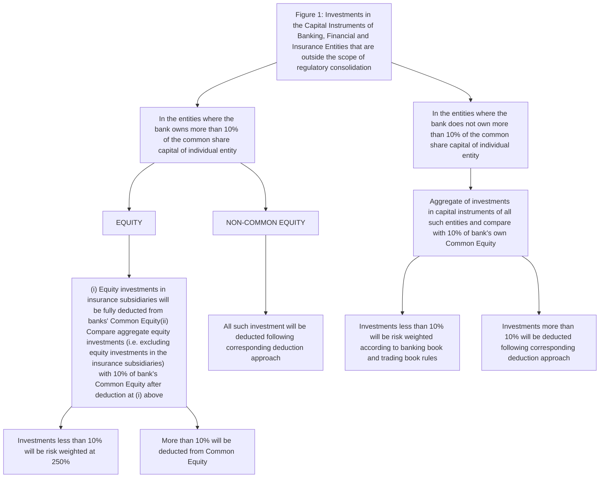

<!-- Page 1 -->

Beti Bachao Beti Padhao logo

Reserve Bank of India logo
# भारतीय रिज़र्व बैंक

G20 Stability Trust Growth logo

# RESERVE BANK OF INDIA

www.rbi.org.in

RBI/2025-26/08
DOR.CAP.REC.2/21.06.201/2025-26

April 01, 2025

All Scheduled Commercial Banks
(Excluding Small Finance Banks, Payments Banks
and Regional Rural Banks)

Madam / Dear Sir,

## Master Circular – Basel III Capital Regulations

Please refer to the <u>Master Circular No. DOR.CAP.REC.4/21.06.201/2024-25 dated April 01, 2024</u>, consolidating therein the prudential guidelines on Basel III capital adequacy [issued to](https://www.rbi.org.in/Scripts/BS_ViewMasCirculardetails.aspx?id=12652) banks till that date. <mark>[Withdrawn](https://www.rbi.org.in/Scripts/BS_ViewMasCirculardetails.aspx?id=12652)</mark>

2. The instructions contained in the aforesaid <u>Master Circular</u> have been suitably updated / amended by incorporating relevant guidelines, issued as on date. A list of circulars consolidated in this Master Circular is contained in <u>Annex 26</u>.

3. Small Finance Banks and Payments Banks may refer to their respective licensing guidelines and operating guidelines issued by Reserve Bank, for prudential guidelines on capital adequacy.

Yours faithfully,

(Usha Janakiraman)
Chief General Manager-in-Charge

Encl.: As above

---

<!-- Page 2 -->

| TABLE OF CONTENTS                               | TABLE OF CONTENTS                                  | TABLE OF CONTENTS                                                                     | TABLE OF CONTENTS |
| ----------------------------------------------- | -------------------------------------------------- | ------------------------------------------------------------------------------------- | ----------------- |
| Part A : Minimum Capital Requirement (Pillar 1) |                                                    |                                                                                       |                   |
| 1                                               | Introduction                                       |                                                                                       |                   |
| 2                                               | Approach to Implementation and Effective Date      |                                                                                       |                   |
| 3                                               | Scope of Application of Capital Adequacy Framework |                                                                                       |                   |
| 4                                               | Composition of Regulatory Capital                  |                                                                                       |                   |
|                                                 | 4.1                                                | General                                                                               |                   |
|                                                 | 4.2                                                | Elements and Criteria of Regulatory Capital                                           |                   |
|                                                 | 4.3                                                | Recognition of Minority Interest                                                      |                   |
|                                                 | 4.4                                                | Regulatory Adjustments / Deductions                                                   |                   |
|                                                 | 4.5                                                | Transitional Arrangements                                                             |                   |
| 5                                               | Capital Charge for Credit Risk                     |                                                                                       |                   |
|                                                 | 5.1                                                | General                                                                               |                   |
|                                                 | 5.2                                                | Claims on Domestic Sovereigns                                                         |                   |
|                                                 | 5.3                                                | Claims on Foreign Sovereigns and Foreign Central Banks                                |                   |
|                                                 | 5.4                                                | Claims on Public Sector Entities (PSEs)                                               |                   |
|                                                 | 5.5                                                | Claims on MDBs, BIS and IMF                                                           |                   |
|                                                 | 5.6                                                | Claims on Banks                                                                       |                   |
|                                                 | 5.7                                                | Claims on Primary Dealers                                                             |                   |
|                                                 | 5.8                                                | Claims on Corporates & NBFCs                                                          |                   |
|                                                 | 5.9                                                | Claims included in the Regulatory Retail Portfolios                                   |                   |
|                                                 | 5.10                                               | Claims secured by Residential Property                                                |                   |
|                                                 | 5.11                                               | Claims Classified as Commercial Real Estate                                           |                   |
|                                                 | 5.12                                               | Non-Performing Assets                                                                 |                   |
|                                                 | 5.13                                               | Specified Categories                                                                  |                   |
|                                                 | 5.14                                               | Other Assets                                                                          |                   |
|                                                 | 5.15                                               | Off-Balance Sheet Items                                                               |                   |
|                                                 |                                                    | 5.15.1 General                                                                        |                   |
|                                                 |                                                    | 5.15.2 Non-Market-related Off-balance Sheet items                                     |                   |
|                                                 |                                                    | 5.15.3 Treatment of Total Counterparty Credit Risk                                    |                   |
|                                                 |                                                    | 5.15.4 Failed Transactions                                                            |                   |
|                                                 | 5.16                                               | Securitisation Exposures                                                              |                   |
|                                                 | 5.17                                               | Capital Adequacy Requirements for Credit Default Swaps (CDS) Position in Banking Book |                   |
|                                                 |                                                    | 5.17.1 Recognition of External/Third Party CDS Hedges                                 |                   |
|                                                 |                                                    | 5.17.2 Internal Hedges                                                                |                   |
| 6                                               | External Credit Assessments                        |                                                                                       |                   |
|                                                 | 6.1                                                | Eligible Credit Rating Agencies                                                       |                   |
|                                                 | 6.2                                                | Scope of Application of External Ratings                                              |                   |
|                                                 | 6.3                                                | Mapping Process                                                                       |                   |
|                                                 | 6.4                                                | Long Term Ratings                                                                     |                   |
|                                                 | 6.5                                                | Short Term Ratings                                                                    |                   |
|                                                 | 6.6                                                | Use of Unsolicited Ratings                                                            |                   |
|                                                 | 6.7                                                | Use of Multiple Rating Assessments                                                    |                   |
|                                                 | 6.8                                                | Applicability of Issue rating to Issuer/other claims                                  |                   |
| 7                                               | Credit Risk Mitigation                             |                                                                                       |                   |
|                                                 | 7.1                                                | General Principles                                                                    |                   |
|                                                 | 7.2                                                | Legal Certainty                                                                       |                   |
|                                                 | 7.3                                                | Credit Risk Mitigation Techniques – Collateralised Transactions                       |                   |

| TABLE OF CONTENTS                               | TABLE OF CONTENTS                                  | TABLE OF CONTENTS                                                                     | TABLE OF CONTENTS |
| ----------------------------------------------- | -------------------------------------------------- | ------------------------------------------------------------------------------------- | ----------------- |
| Part A : Minimum Capital Requirement (Pillar 1) |                                                    |                                                                                       |                   |
| 1                                               | Introduction                                       |                                                                                       |                   |
| 2                                               | Approach to Implementation and Effective Date      |                                                                                       |                   |
| 3                                               | Scope of Application of Capital Adequacy Framework |                                                                                       |                   |
| 4                                               | Composition of Regulatory Capital                  |                                                                                       |                   |
|                                                 | 4.1                                                | General                                                                               |                   |
|                                                 | 4.2                                                | Elements and Criteria of Regulatory Capital                                           |                   |
|                                                 | 4.3                                                | Recognition of Minority Interest                                                      |                   |
|                                                 | 4.4                                                | Regulatory Adjustments / Deductions                                                   |                   |
|                                                 | 4.5                                                | Transitional Arrangements                                                             |                   |
| 5                                               | Capital Charge for Credit Risk                     |                                                                                       |                   |
|                                                 | 5.1                                                | General                                                                               |                   |
|                                                 | 5.2                                                | Claims on Domestic Sovereigns                                                         |                   |
|                                                 | 5.3                                                | Claims on Foreign Sovereigns and Foreign Central Banks                                |                   |
|                                                 | 5.4                                                | Claims on Public Sector Entities (PSEs)                                               |                   |
|                                                 | 5.5                                                | Claims on MDBs, BIS and IMF                                                           |                   |
|                                                 | 5.6                                                | Claims on Banks                                                                       |                   |
|                                                 | 5.7                                                | Claims on Primary Dealers                                                             |                   |
|                                                 | 5.8                                                | Claims on Corporates & NBFCs                                                          |                   |
|                                                 | 5.9                                                | Claims included in the Regulatory Retail Portfolios                                   |                   |
|                                                 | 5.10                                               | Claims secured by Residential Property                                                |                   |
|                                                 | 5.11                                               | Claims Classified as Commercial Real Estate                                           |                   |
|                                                 | 5.12                                               | Non-Performing Assets                                                                 |                   |
|                                                 | 5.13                                               | Specified Categories                                                                  |                   |
|                                                 | 5.14                                               | Other Assets                                                                          |                   |
|                                                 | 5.15                                               | Off-Balance Sheet Items                                                               |                   |
|                                                 |                                                    | 5.15.1 General                                                                        |                   |
|                                                 |                                                    | 5.15.2 Non-Market-related Off-balance Sheet items                                     |                   |
|                                                 |                                                    | 5.15.3 Treatment of Total Counterparty Credit Risk                                    |                   |
|                                                 |                                                    | 5.15.4 Failed Transactions                                                            |                   |
|                                                 | 5.16                                               | Securitisation Exposures                                                              |                   |
|                                                 | 5.17                                               | Capital Adequacy Requirements for Credit Default Swaps (CDS) Position in Banking Book |                   |
|                                                 |                                                    | 5.17.1 Recognition of External/Third Party CDS Hedges                                 |                   |
|                                                 |                                                    | 5.17.2 Internal Hedges                                                                |                   |
| 6                                               | External Credit Assessments                        |                                                                                       |                   |
|                                                 | 6.1                                                | Eligible Credit Rating Agencies                                                       |                   |
|                                                 | 6.2                                                | Scope of Application of External Ratings                                              |                   |
|                                                 | 6.3                                                | Mapping Process                                                                       |                   |
|                                                 | 6.4                                                | Long Term Ratings                                                                     |                   |
|                                                 | 6.5                                                | Short Term Ratings                                                                    |                   |
|                                                 | 6.6                                                | Use of Unsolicited Ratings                                                            |                   |
|                                                 | 6.7                                                | Use of Multiple Rating Assessments                                                    |                   |
|                                                 | 6.8                                                | Applicability of Issue rating to Issuer/other claims                                  |                   |
| 7                                               | Credit Risk Mitigation                             |                                                                                       |                   |
|                                                 | 7.1                                                | General Principles                                                                    |                   |
|                                                 | 7.2                                                | Legal Certainty                                                                       |                   |
|                                                 | 7.3                                                | Credit Risk Mitigation Techniques – Collateralised Transactions                       |                   |

---

<!-- Page 3 -->

|                                                               |                                                           | 7.3.2                                                               | Overall Framework and Minimum Conditions                               |   |
| ------------------------------------------------------------- | --------------------------------------------------------- | ------------------------------------------------------------------- | ---------------------------------------------------------------------- | - |
|                                                               |                                                           | 7.3.4                                                               | The Comprehensive Approach                                             |   |
|                                                               |                                                           | 7.3.5                                                               | Eligible Financial Collateral                                          |   |
|                                                               |                                                           | 7.3.6                                                               | Calculation of Capital Requirement                                     |   |
|                                                               |                                                           | 7.3.7                                                               | Haircuts                                                               |   |
|                                                               |                                                           | 7.3.8                                                               | Capital Adequacy Framework for Repo-/Reverse Repo- style Transactions. |   |
|                                                               |                                                           | 7.3.9                                                               | Collateralised OTC derivatives transactions                            |   |
|                                                               | 7.4                                                       | Credit Risk Mitigation Techniques – On–balance Sheet netting        |                                                                        |   |
|                                                               | 7.5                                                       | Credit Risk Mitigation Techniques – Guarantees                      |                                                                        |   |
|                                                               |                                                           | 7.5.4                                                               | Operational requirements for Guarantees                                |   |
|                                                               |                                                           | 7.5.5                                                               | Additional operational requirements for Guarantees                     |   |
|                                                               |                                                           | 7.5.6                                                               | Range of Eligible Guarantors (counter-guarantors)                      |   |
|                                                               |                                                           | 7.5.7                                                               | Risk Weights                                                           |   |
|                                                               |                                                           | 7.5.8                                                               | Proportional Cover                                                     |   |
|                                                               |                                                           | 7.5.9                                                               | Currency Mismatches                                                    |   |
|                                                               |                                                           | 7.5.10                                                              | Sovereign Guarantees and Counter-guarantees                            |   |
|                                                               |                                                           | 7.5.11                                                              | ECGC Guaranteed Exposures                                              |   |
|                                                               | 7.6                                                       | Maturity Mismatch                                                   |                                                                        |   |
|                                                               | 7.7                                                       | Treatment of pools of CRM Techniques                                |                                                                        |   |
| 8                                                             | Capital Charge for Market Risk                            |                                                                     |                                                                        |   |
|                                                               | 8.1                                                       | Introduction                                                        |                                                                        |   |
|                                                               | 8.2                                                       | Scope and Coverage of Capital Charge for Market Risks               |                                                                        |   |
|                                                               | 8.3                                                       | Measurement of Capital Charge for Interest Rate Risk                |                                                                        |   |
|                                                               | 8.4                                                       | Measurement of Capital Charge for Equity Risk                       |                                                                        |   |
|                                                               | 8.5                                                       | Measurement of Capital Charge for Foreign Exchange Risk             |                                                                        |   |
|                                                               | 8.6                                                       | Measurement of Capital Charge for CDS in Trading Book               |                                                                        |   |
|                                                               |                                                           | 8.6.1 General Market Risk                                           |                                                                        |   |
|                                                               |                                                           | 8.6.2 Specific Risk for Exposure to Reference Entity                |                                                                        |   |
|                                                               |                                                           | 8.6.3 Capital Charge for Counterparty Credit Risk                   |                                                                        |   |
|                                                               |                                                           | 8.6.4 Treatment of Exposures below Materiality Thresholds of CDS    |                                                                        |   |
|                                                               | 8.7                                                       | Aggregation of the Capital Charge for Market Risk                   |                                                                        |   |
|                                                               | 8.8                                                       | Treatment of illiquid positions                                     |                                                                        |   |
| 9                                                             | Capital charge for Operational Risk                       |                                                                     |                                                                        |   |
|                                                               | 9.1                                                       | Definition of Operational Risk                                      |                                                                        |   |
|                                                               | 9.2                                                       | The Measurement Methodologies                                       |                                                                        |   |
|                                                               | 9.3                                                       | The Basic Indicator Approach                                        |                                                                        |   |
| Part B : Supervisory Review and Evaluation Process (Pillar 2) |                                                           |                                                                     |                                                                        |   |
| 10                                                            | Introduction to SREP under Pillar 2                       |                                                                     |                                                                        |   |
| 11                                                            | Need for improved risk management                         |                                                                     |                                                                        |   |
| 12                                                            | Guidelines for SREP of the RBI and the ICAAP of the Banks |                                                                     |                                                                        |   |
|                                                               | 12.1                                                      | The Background                                                      |                                                                        |   |
|                                                               | 12.2                                                      | Conduct of the SREP by the RBI                                      |                                                                        |   |
|                                                               | 12.3                                                      | The Structural Aspects of the ICAAP                                 |                                                                        |   |
|                                                               | 12.4                                                      | Review of ICAAP Outcomes                                            |                                                                        |   |
|                                                               | 12.5                                                      | ICAAP to be an integral part of the Mgmt. & Decision making Culture |                                                                        |   |
|                                                               | 12.6                                                      | The Principle of Proportionality                                    |                                                                        |   |

|                                                               |                                                           | 7.3.2                                                               | Overall Framework and Minimum Conditions                               |   |
| ------------------------------------------------------------- | --------------------------------------------------------- | ------------------------------------------------------------------- | ---------------------------------------------------------------------- | - |
|                                                               |                                                           | 7.3.4                                                               | The Comprehensive Approach                                             |   |
|                                                               |                                                           | 7.3.5                                                               | Eligible Financial Collateral                                          |   |
|                                                               |                                                           | 7.3.6                                                               | Calculation of Capital Requirement                                     |   |
|                                                               |                                                           | 7.3.7                                                               | Haircuts                                                               |   |
|                                                               |                                                           | 7.3.8                                                               | Capital Adequacy Framework for Repo-/Reverse Repo- style Transactions. |   |
|                                                               |                                                           | 7.3.9                                                               | Collateralised OTC derivatives transactions                            |   |
|                                                               | 7.4                                                       | Credit Risk Mitigation Techniques – On–balance Sheet netting        |                                                                        |   |
|                                                               | 7.5                                                       | Credit Risk Mitigation Techniques – Guarantees                      |                                                                        |   |
|                                                               |                                                           | 7.5.4                                                               | Operational requirements for Guarantees                                |   |
|                                                               |                                                           | 7.5.5                                                               | Additional operational requirements for Guarantees                     |   |
|                                                               |                                                           | 7.5.6                                                               | Range of Eligible Guarantors (counter-guarantors)                      |   |
|                                                               |                                                           | 7.5.7                                                               | Risk Weights                                                           |   |
|                                                               |                                                           | 7.5.8                                                               | Proportional Cover                                                     |   |
|                                                               |                                                           | 7.5.9                                                               | Currency Mismatches                                                    |   |
|                                                               |                                                           | 7.5.10                                                              | Sovereign Guarantees and Counter-guarantees                            |   |
|                                                               |                                                           | 7.5.11                                                              | ECGC Guaranteed Exposures                                              |   |
|                                                               | 7.6                                                       | Maturity Mismatch                                                   |                                                                        |   |
|                                                               | 7.7                                                       | Treatment of pools of CRM Techniques                                |                                                                        |   |
| 8                                                             | Capital Charge for Market Risk                            |                                                                     |                                                                        |   |
|                                                               | 8.1                                                       | Introduction                                                        |                                                                        |   |
|                                                               | 8.2                                                       | Scope and Coverage of Capital Charge for Market Risks               |                                                                        |   |
|                                                               | 8.3                                                       | Measurement of Capital Charge for Interest Rate Risk                |                                                                        |   |
|                                                               | 8.4                                                       | Measurement of Capital Charge for Equity Risk                       |                                                                        |   |
|                                                               | 8.5                                                       | Measurement of Capital Charge for Foreign Exchange Risk             |                                                                        |   |
|                                                               | 8.6                                                       | Measurement of Capital Charge for CDS in Trading Book               |                                                                        |   |
|                                                               |                                                           | 8.6.1 General Market Risk                                           |                                                                        |   |
|                                                               |                                                           | 8.6.2 Specific Risk for Exposure to Reference Entity                |                                                                        |   |
|                                                               |                                                           | 8.6.3 Capital Charge for Counterparty Credit Risk                   |                                                                        |   |
|                                                               |                                                           | 8.6.4 Treatment of Exposures below Materiality Thresholds of CDS    |                                                                        |   |
|                                                               | 8.7                                                       | Aggregation of the Capital Charge for Market Risk                   |                                                                        |   |
|                                                               | 8.8                                                       | Treatment of illiquid positions                                     |                                                                        |   |
| 9                                                             | Capital charge for Operational Risk                       |                                                                     |                                                                        |   |
|                                                               | 9.1                                                       | Definition of Operational Risk                                      |                                                                        |   |
|                                                               | 9.2                                                       | The Measurement Methodologies                                       |                                                                        |   |
|                                                               | 9.3                                                       | The Basic Indicator Approach                                        |                                                                        |   |
| Part B : Supervisory Review and Evaluation Process (Pillar 2) |                                                           |                                                                     |                                                                        |   |
| 10                                                            | Introduction to SREP under Pillar 2                       |                                                                     |                                                                        |   |
| 11                                                            | Need for improved risk management                         |                                                                     |                                                                        |   |
| 12                                                            | Guidelines for SREP of the RBI and the ICAAP of the Banks |                                                                     |                                                                        |   |
|                                                               | 12.1                                                      | The Background                                                      |                                                                        |   |
|                                                               | 12.2                                                      | Conduct of the SREP by the RBI                                      |                                                                        |   |
|                                                               | 12.3                                                      | The Structural Aspects of the ICAAP                                 |                                                                        |   |
|                                                               | 12.4                                                      | Review of ICAAP Outcomes                                            |                                                                        |   |
|                                                               | 12.5                                                      | ICAAP to be an integral part of the Mgmt. & Decision making Culture |                                                                        |   |
|                                                               | 12.6                                                      | The Principle of Proportionality                                    |                                                                        |   |

---

<!-- Page 4 -->

|                                                   | 12.7                                                                                                                                                                                                    | Regular independent review and validation                                                              |   |
| ------------------------------------------------- | ------------------------------------------------------------------------------------------------------------------------------------------------------------------------------------------------------- | ------------------------------------------------------------------------------------------------------ | - |
|                                                   | 12.8                                                                                                                                                                                                    | ICAAP to be a Forward looking Process                                                                  |   |
|                                                   | 12.9                                                                                                                                                                                                    | ICAAP to be a Risk-based Process                                                                       |   |
|                                                   | 12.10                                                                                                                                                                                                   | ICAAP to include Stress Tests and Scenario Analysis                                                    |   |
|                                                   | 12.11                                                                                                                                                                                                   | Use of Capital Models for ICAAP                                                                        |   |
| 13                                                | Select Operational Aspects of ICAAP                                                                                                                                                                     |                                                                                                        |   |
| Part C : Market Discipline (Pillar 3)             |                                                                                                                                                                                                         |                                                                                                        |   |
| 14                                                | Guidelines on Market Discipline                                                                                                                                                                         |                                                                                                        |   |
|                                                   | 14.1                                                                                                                                                                                                    | General                                                                                                |   |
|                                                   | 14.2                                                                                                                                                                                                    | Achieving Appropriate Disclosure                                                                       |   |
|                                                   | 14.3                                                                                                                                                                                                    | Interaction with Accounting Disclosure                                                                 |   |
|                                                   | 14.4                                                                                                                                                                                                    | Validation                                                                                             |   |
|                                                   | 14.5                                                                                                                                                                                                    | Materiality                                                                                            |   |
|                                                   | 14.6                                                                                                                                                                                                    | Proprietary and Confidential Information                                                               |   |
|                                                   | 14.7                                                                                                                                                                                                    | General Disclosure Principle                                                                           |   |
|                                                   | 14.8                                                                                                                                                                                                    | Implementation Date                                                                                    |   |
|                                                   | 14.9                                                                                                                                                                                                    | Scope and Frequency of Disclosures                                                                     |   |
|                                                   | 14.10                                                                                                                                                                                                   | Regulatory Disclosure Section                                                                          |   |
|                                                   | 14.11                                                                                                                                                                                                   | Pillar 3 Under Basel III Framework                                                                     |   |
|                                                   | 14.12                                                                                                                                                                                                   | Disclosure Template                                                                                    |   |
|                                                   | 14.13                                                                                                                                                                                                   | Reconciliation Requirements                                                                            |   |
|                                                   | 14.14                                                                                                                                                                                                   | Format of Disclosure Template                                                                          |   |
|                                                   | Table DF-1                                                                                                                                                                                              | Scope of Application and Capital Adequacy                                                              |   |
|                                                   | Table DF-2                                                                                                                                                                                              | Capital Adequacy                                                                                       |   |
|                                                   | Table DF-3                                                                                                                                                                                              | Credit Risk: General Disclosures for All Banks                                                         |   |
|                                                   | Table DF-4                                                                                                                                                                                              | Credit Risk: Disclosures for Portfolios subject to the Standardised Approach                           |   |
|                                                   | Table DF-5                                                                                                                                                                                              | Credit Risk Mitigation: Disclosures for Standardised Approach                                          |   |
|                                                   | Table DF-6                                                                                                                                                                                              | Securitisation: Disclosure for Standardised Approach                                                   |   |
|                                                   | Table DF-7                                                                                                                                                                                              | Market Risk in Trading Book                                                                            |   |
|                                                   | Table DF-8                                                                                                                                                                                              | Operational Risk                                                                                       |   |
|                                                   | Table DF-9                                                                                                                                                                                              | Interest Rate Risk in the Banking Book (IRRBB)                                                         |   |
|                                                   | Table DF-10                                                                                                                                                                                             | General Disclosure for Exposures Related to Counterparty Credit Risk                                   |   |
|                                                   | Table DF-11                                                                                                                                                                                             | Composition of Capital                                                                                 |   |
|                                                   | Table DF-12                                                                                                                                                                                             | Composition of Capital- Reconciliation Requirements                                                    |   |
|                                                   | Table DF-13                                                                                                                                                                                             | Main Features of Regulatory Capital Instruments                                                        |   |
|                                                   | Table DF-14                                                                                                                                                                                             | Full Terms and Conditions of Regulatory Capital Instruments                                            |   |
|                                                   | Table DF-15                                                                                                                                                                                             | Disclosure Requirements for Remuneration                                                               |   |
|                                                   | Table DF-16                                                                                                                                                                                             | Equities – Disclosure for Banking Book Positions                                                       |   |
|                                                   | Table DF-17                                                                                                                                                                                             | Summary Comparison of Accounting Assets vs. Leverage Ratio Exposure Measure                            |   |
|                                                   | Table DF-18                                                                                                                                                                                             | Leverage Ratio Common Disclosure Template                                                              |   |
| Part D : Capital Conservation Buffer Framework    |                                                                                                                                                                                                         |                                                                                                        |   |
| 15                                                | Capital Conservation Buffer                                                                                                                                                                             |                                                                                                        |   |
|                                                   | 15.1                                                                                                                                                                                                    | Objective                                                                                              |   |
|                                                   | 15.2                                                                                                                                                                                                    | The Framework                                                                                          |   |
| Part E : Leverage Ratio Framework                 |                                                                                                                                                                                                         |                                                                                                        |   |
| 16                                                | Leverage Ratio                                                                                                                                                                                          |                                                                                                        |   |
|                                                   | 16.1 16.2                                                                                                                                                                                               | Rationale and Objective Definition, Minimum Requirement and Scope of Application of the Leverage Ratio |   |
|                                                   | 16.3                                                                                                                                                                                                    | Capital Measure                                                                                        |   |
|                                                   | 16.4                                                                                                                                                                                                    | Exposure Measure                                                                                       |   |
|                                                   | 16.4.1                                                                                                                                                                                                  | General measurement principles                                                                         |   |
|                                                   | 16.4.2                                                                                                                                                                                                  | On-balance sheet exposures                                                                             |   |
|                                                   | 16.4.3                                                                                                                                                                                                  | Derivative exposures                                                                                   |   |
|                                                   | 16.4.4                                                                                                                                                                                                  | Securities financing transaction exposures                                                             |   |
|                                                   | 16.4.5                                                                                                                                                                                                  | Off-balance sheet items                                                                                |   |
|                                                   | 16.5                                                                                                                                                                                                    | Disclosure and Reporting Requirements                                                                  |   |
|                                                   | 16.6                                                                                                                                                                                                    | Disclosure Templates                                                                                   |   |
| Part F : Countercyclical Capital Buffer Framework |                                                                                                                                                                                                         |                                                                                                        |   |
| 17                                                | Countercyclical Capital Buffer                                                                                                                                                                          |                                                                                                        |   |
|                                                   | 17.1                                                                                                                                                                                                    | Objective                                                                                              |   |
|                                                   | 17.2                                                                                                                                                                                                    | The Framework                                                                                          |   |
| Annex                                             |                                                                                                                                                                                                         |                                                                                                        |   |
| Annex 1                                           | Criteria for classification as Common Shares (paid-up equity capital) for regulatory purposes – Indian Banks                                                                                            |                                                                                                        |   |
| Annex 2                                           | Criteria for classification as common equity for regulatory purposes – Foreign Banks                                                                                                                    |                                                                                                        |   |
| Annex 3                                           | Criteria for inclusion of Perpetual Non-Cumulative Preference Shares (PNCPS) in Additional Tier 1 capital                                                                                               |                                                                                                        |   |
| Annex 4                                           | Criteria for inclusion of Perpetual Debt Instruments (PDI) in Additional Tier 1 capital                                                                                                                 |                                                                                                        |   |
| Annex 5                                           | Criteria for inclusion of Debt Capital instruments as Tier 2 capital                                                                                                                                    |                                                                                                        |   |
| Annex 6                                           | Criteria for inclusion of Perpetual Cumulative Preference Shares (PCPS)/ Redeemable Non-Cumulative Preference Shares (RNCPS) / Redeemable Cumulative Preference Shares (RCPS) as part of Tier 2 capital |                                                                                                        |   |
| Annex 7                                           | Prudential guidelines on Credit Default Swaps (CDS)                                                                                                                                                     |                                                                                                        |   |
| Annex 8                                           | Illustrations on Credit Risk Mitigation                                                                                                                                                                 |                                                                                                        |   |
| Annex 9                                           | Measurement of capital charge for Market Risks in respect of Interest Rate Derivatives and Options.                                                                                                     |                                                                                                        |   |
| Annex 10                                          | An Illustrative Approach for Measurement of Interest Rate Risk in the Banking Book (IRRBB) under Pillar 2                                                                                               |                                                                                                        |   |
| Annex 11                                          | Investments in the capital of banking, financial and insurance entities which are outside the scope of regulatory consolidation                                                                         |                                                                                                        |   |
| Annex 12                                          | Calculation of CVA risk capital charge                                                                                                                                                                  |                                                                                                        |   |
| Annex 13                                          | Calculation of SFT Exposure for the purpose of Leverage Ratio                                                                                                                                           |                                                                                                        |   |
| Annex 14                                          | An Illustrative outline of the ICAAP document                                                                                                                                                           |                                                                                                        |   |
| Annex 15                                          | Minimum requirements to ensure loss absorbency of Additional Tier 1 instruments at pre-specified trigger and of all non-equity regulatory capital instruments at the point of non-viability             |                                                                                                        |   |
| Annex 16                                          | Calculation of minority interest - illustrative example                                                                                                                                                 |                                                                                                        |   |
| Annex 17                                          | Pillar 3 disclosure requirements                                                                                                                                                                        |                                                                                                        |   |
| Annex 18                                          | Requirements for Recognition of Net Replacement Cost in Close-out Netting Sets                                                                                                                          |                                                                                                        |   |
| Annex 19                                          | Guidelines on General permission for infusion of capital in overseas branches and banking subsidiaries and retention/ repatriation/ transfer of profits in these centres by banks incorporated in India |                                                                                                        |   |
| Annex 20                                          | Calculation of 15% of common equity limit on items subject to limited recognition                                                                                                                       |                                                                                                        |   |

---

<!-- Page 5 -->

Withdrawn

---

<!-- Page 6 -->

| Annex 21 Annex 22 | Illustrations of revised instructions on Regulatory Retail Format- Reporting of Capital Issuances                    |   |
| ----------------- | -------------------------------------------------------------------------------------------------------------------- | - |
| Annex 23          | Clarifications regarding Bilateral Netting under Current Exposure Method                                             |   |
| Annex 24          | Illustrative Examples - Risk Weights (RW) applicable on credit facilities guaranteed under specific existing schemes |   |
| Annex 25 Annex 26 | Glossary List of circulars consolidated in the Master Circular                                                       |   |

Withdrawn stamp

| Annex 21 Annex 22 | Illustrations of revised instructions on Regulatory Retail Format- Reporting of Capital Issuances                    |   |
| ----------------- | -------------------------------------------------------------------------------------------------------------------- | - |
| Annex 23          | Clarifications regarding Bilateral Netting under Current Exposure Method                                             |   |
| Annex 24          | Illustrative Examples - Risk Weights (RW) applicable on credit facilities guaranteed under specific existing schemes |   |
| Annex 25 Annex 26 | Glossary List of circulars consolidated in the Master Circular                                                       |   |

---

<!-- Page 7 -->

# <u>Master Circular on Basel III Capital Regulations</u>

## Part A: Minimum Capital Requirement

# 1. Introduction

1.1 Basel III reforms are the response of Basel Committee on Banking Supervision (BCBS) to improve the banking sector’s ability to absorb shocks arising from financial and economic stress, whatever the source, thus reducing the risk of spill over from the financial sector to the real economy. During Pittsburgh summit in September 2009, the G20 leaders committed to strengthen the regulatory system for banks and other financial firms and also act together to raise capital standards, to implement strong international compensation standards aimed at ending practices that lead to excessive risk-taking, to improve the over-the-counter derivatives market and to create more powerful tools to hold large global firms to account for the risks they take. For all these reforms, the leaders set for themselves strict and precise timetables. Consequently, the Basel Committee on Banking Supervision (BCBS) released comprehensive reform package entitled “Basel III: A global regulatory framework for more resilient banks and banking systems” (known as Basel III capital regulations) in December 2010.

1.2 Basel III reforms strengthen the bank-level i.e., micro prudential regulation, with the intention to raise the resilience of individual banking institutions in periods of stress. Besides, the reforms have a macro prudential focus also, addressing system wide risks, which can build up across the banking sector, as well as the procyclical amplification of these risks over time. These new global regulatory and supervisory standards mainly seek to raise the quality and level of capital to ensure banks are better able to absorb losses on both a going concern and a gone concern basis, increase the risk coverage of the capital framework, introduce leverage ratio to serve as a backstop to the risk-based capital measure, raise the standards for the supervisory review process (Pillar 2) and public disclosures (Pillar 3) etc. The macro prudential aspects of Basel III are largely enshrined in the capital buffers. Both the buffers i.e., the capital conservation buffer and the countercyclical buffer are intended to protect the banking sector from periods of excess credit growth.

# 2. Approach to Implementation and Effective Date

2.1 The Basel III capital regulations continue to be based on three-mutually reinforcing Pillars, viz. minimum capital requirements, supervisory review of capital adequacy, and market discipline of the Basel II capital adequacy framework¹. Under Pillar 1, the Basel III framework will continue to offer the three distinct options for computing capital requirement for credit risk and three other options for computing capital requirement for operational risk, albeit with certain modifications / enhancements. These options for credit and operational risks are based on increasing risk

\*1 For reference, please refer to the Master Circular on Prudential Guidelines on Capital Adequacy and Market Discipline - New Capital Adequacy Framework (NCAF) issued vide <u>circular DBOD.No.BP.BC.4/21.06.001/2015-16 dated July 1, 2015</u>.

---

<!-- Page 8 -->

sensitivity and allow banks to select an approach that is most appropriate to the stage of development of bank's operations. The options available for computing capital for credit risk are Standardised Approach, Foundation Internal Rating Based Approach and Advanced Internal Rating Based Approach. The options available for computing capital for operational risk are Basic Indicator Approach (BIA), The Standardised Approach (TSA) and Advanced Measurement Approach (AMA).

2.2 Keeping in view the Reserve Bank’s goal to have consistency and harmony with international standards, it was decided in 2007 that all commercial banks in India (excluding Local Area Banks and Regional Rural Banks) should adopt Standardised Approach for credit risk, Basic Indicator Approach for operational risk by March 2009 and banks should continue to apply the Standardised Duration Approach (SDA) for computing capital requirement for market risks.

2.3 Banks were advised to undertake an internal assessment of their preparedness for migration to advanced approaches and take a decision with the approval of their Boards, whether they would like to migrate to any of the advanced approaches. Based on bank's internal assessment and its preparation, a bank may choose a suitable date to apply for implementation of advanced approach. Besides, banks, at their discretion, would have the option of adopting the advanced approaches for one or more of the risk categories, as per their preparedness, while continuing with the simpler approaches for other risk categories, and it would not be necessary to adopt the advanced approaches for all the risk categories simultaneously. However, banks should invariably obtain prior approval of the RBI for adopting any of the advanced approaches.

**2.4 Effective Date:** The Basel III capital regulations were implemented in India with effect from April 1, 2013 and have been fully implemented as on October 1, 2021. Banks have to comply with the regulatory limits and minima as prescribed under Basel III capital regulations, on an ongoing basis.

# 3. Scope of Application of Capital Adequacy Framework

3.1 A bank shall comply with the capital adequacy ratio requirements at two levels:

(a) the consolidated (“Group”) level² capital adequacy ratio requirements, [which](https://rbi.org.in/scripts/NotificationUser.aspx?Id=1071&Mode=0) measure the capital adequacy of a bank based on its capital strength and risk profile after consolidating the assets and liabilities of its subsidiaries / joint ventures / associates etc. except those engaged in insurance and any non-financial activities; and

\*² In terms of guidelines on preparation of consolidated prudential reports issued vide <u>circular DBOD. No.BP.BC.72/21.04.018/ 2001-02 dated February 25, 2003</u>, a consolidated bank may exclude group companies which [are engaged in insurance business and businesses not pertaining](https://rbi.org.in/scripts/NotificationUser.aspx?Id=1071&Mode=0) to financial services. A consolidated bank should maintain a minimum Capital to Risk-weighted Assets Ratio (CRAR) as applicable to a bank on an ongoing basis. Please also refer to <u>circular DBOD.No.FSD.BC.46/24.01.028/2006-07 dated December 12, 2006</u>.

---

<!-- Page 9 -->

(b) the standalone (“Solo”) level capital adequacy ratio requirements, which measure the capital adequacy of a bank based on its standalone capital strength and risk profile.

Accordingly, overseas operations of a bank through its branches will be covered in both the above scenarios.

**3.2** For the purpose of these guidelines, the subsidiary is an enterprise that is controlled by another enterprise (known as the parent). Banks will follow the definition of ‘control’ as given in the applicable accounting standards.

**3.3** The components, elements and eligibility criteria of the regulatory capital instruments for foreign banks operating in India under the Wholly Owned Subsidiary (WOS) model would be as applicable to the other domestic banks as stipulated in this Master Circular. The WOS shall meet the Basel III requirements on a continuous basis from the time of its entry / conversion. WOS shall, however, maintain a minimum capital adequacy ratio, on a continuous basis for an initial period of three years from the commencement of its operations, at 10 per cent. In addition, the WOS shall maintain the Capital Conservation Buffer and other buffers as applicable³.

## 3.4 Capital Adequacy at Group / Consolidated Level

~~Withdrawn~~
3.4.1 All banking and other financial subsidiaries except subsidiaries engaged in insurance and any non-financial activities (both regulated and unregulated) should be fully consolidated for the purpose of capital adequacy. This would ensure assessment of capital adequacy at the group level, taking into account the risk profile of assets and liabilities of the consolidated subsidiaries.

3.4.2 The insurance and non-financial subsidiaries / joint ventures / associates etc. of a bank **should not** be consolidated for the purpose of capital adequacy. The equity and other regulatory capital investments in the insurance and non-financial subsidiaries will be deducted from consolidated regulatory capital of the group. Equity and other regulatory capital investments in the unconsolidated insurance and non-financial entities of banks (which also include joint ventures / associates of the parent bank) will be treated in terms of paragraphs 4.4.9 and 5.13.6 respectively.

3.4.3 All regulatory adjustments indicated in paragraph 4.4 are required to be made to the consolidated capital of the banking group as indicated therein.

3.4.4 Minority interest (i.e., non-controlling interest) and other capital issued out of consolidated subsidiaries as per paragraph 3.4.1 that is held by third parties will be recognized in the consolidated regulatory capital of the group subject to certain conditions as stipulated in paragraph 4.3.

---

<!-- Page 10 -->

3.4.5 Banks should ensure that majority owned financial entities that are not consolidated for capital purposes and for which the investment in equity and other instruments eligible for regulatory capital status is deducted, meet their respective regulatory capital requirements. In case of any shortfall in the regulatory capital requirements in the unconsolidated entity, the shortfall shall be fully deducted from the Common Equity Tier 1 capital.

3.4.6 It is clarified that group/ consolidated level capital adequacy would also mean application of consolidated capital adequacy norms to the Non-Operative Financial Holding Company (NOFHC) after consolidating the relevant entities held by it in terms of paragraph 3.1(a) above, in conjunction with the Guidelines for consolidated accounting and other quantitative methods to facilitate consolidated supervision issued vide <u>circular dated DBOD.No.BP.BC.72 /21.04.018/2001-02 dated February 25, 2003</u>4.

3.4.7 Banks may refer to <u>**[Annex 19](https://www.rbi.org.in/Scripts/NotificationUser.aspx?Id=1071&Mode=0)**</u> for guidelines on general permission for infusion of capital in overseas banking centres and retention/ repatriation/ transfer of profits in these centres.

## 3.5 Capital Adequacy at Solo Level

3.5.1 While assessing the capital adequacy of a bank at solo level, all regulatory adjustments indicated in paragraph 4.4 are required to be made. In addition, investments in the capital instruments of the subsidiaries, which are consolidated in the consolidated financial statements of the group, shall be deducted from the corresponding capital instruments issued by the bank.

3.5.2 In case of any shortfall in the regulatory capital requirements in the unconsolidated entity (e.g., insurance subsidiary), the shortfall shall be fully deducted from the Common Equity Tier 1 capital.

## 4. Composition of Regulatory Capital

### 4.1 General

Banks shall maintain a minimum Pillar 1 Capital to Risk-weighted Assets Ratio (CRAR) of 9% on an on-going basis (other than capital conservation buffer and countercyclical capital buffer etc.). The Reserve Bank will take into account the relevant risk factors and the internal capital adequacy assessments of each bank to ensure that the capital held by a bank is commensurate with the bank's overall risk profile. This would include, among others, the effectiveness of the bank's risk management systems in identifying, assessing / measuring, monitoring and managing various risks including interest rate risk in the banking book, liquidity risk, concentration risk and residual risk. Accordingly, the Reserve Bank will consider prescribing a higher level of minimum capital ratio for each bank under the Pillar 2 framework on the basis of their respective risk profiles and their risk management systems. Further, in terms of the Pillar 2 requirements, banks are expected

---

<!-- Page 11 -->

to operate at a level well above the minimum requirement. A bank should compute Basel III capital ratios in the following manner:

$$ \text{Common Equity Tier 1 capital ratio} = \frac{\text{Common Equity Tier 1 capital}}{\text{Credit Risk RWA*} + \text{Market Risk RWA} + \text{Operational Risk RWA}} $$

$$ \text{Tier 1 capital ratio} = \frac{\text{Eligible Tier 1 capital}}{\text{Credit Risk RWA} + \text{Market Risk RWA} + \text{Operational Risk RWA}} $$

$$ \text{Total Capital (CRAR}^\#) = \frac{\text{Eligible Total Capital}}{\text{Credit Risk RWA} + \text{Market Risk RWA} + \text{Operational Risk RWA}} $$

\*Risk Weight Assets

#Capital to Risk Weighted Assets Ratio

# 4.2 Elements of Regulatory Capital and the Criteria for their Inclusion in the Definition of Regulatory Capital

## 4.2.1 Components of Capital ~~Withdrawn~~

Total regulatory capital will consist of the sum of the following categories:

(i) Tier 1 Capital (going-concern capital)5

* (a) Common Equity Tier 1

* (b) Additional Tier 1

(ii) Tier 2 Capital (gone-concern capital)

## 4.2.2 Limits and Minima

(i) As a matter of prudence, it has been decided that scheduled commercial banks operating in India shall maintain a minimum total capital (MTC) of 9% of total risk weighted assets (RWAs) i.e., capital to risk weighted assets (CRAR). This will be further divided into different components as described under paragraphs 4.2.2(ii) to 4.2.2(viii).

(ii) Common Equity Tier 1 (CET1) capital must be at least 5.5% of risk-weighted assets (RWAs) i.e., for credit risk + market risk + operational risk on an ongoing basis.

(iii) Tier 1 capital must be at least 7% of RWAs on an ongoing basis. Thus, within the minimum Tier 1 capital, Additional Tier 1 capital can be admitted maximum at 1.5% of RWAs.

5 From regulatory capital perspective, going-concern capital is the capital which can absorb losses without triggering bankruptcy of the bank. Gone-concern capital is the capital which will absorb losses only in a situation of liquidation of the bank.

---

<!-- Page 12 -->

(iv) Total Capital (Tier 1 Capital plus Tier 2 Capital) must be at least 9% of RWAs on an ongoing basis. Thus, within the minimum CRAR of 9%, Tier 2 capital can be admitted maximum up to 2%.

(v) If a bank has complied with the minimum Common Equity Tier 1 and Tier 1 capital ratios, then the excess Additional Tier 1 capital can be admitted for compliance with the minimum CRAR of 9% of RWAs.

(vi) In addition to the minimum Common Equity Tier 1 capital of 5.5% of RWAs, banks are also required to maintain a capital conservation buffer (CCB) of 2.5% of RWAs6 in the form of Common Equity Tier 1 capital. Details of operational aspects of CCB have been furnished in paragraph 15. The capital requirements are summarised as follows:

| S.No.  | Regulatory Capital                                                              | As % to RWAs |
| ------ | ------------------------------------------------------------------------------- | ------------ |
| (i)    | Minimum Common Equity Tier 1 Ratio                                              | 5.5          |
| (ii)   | Capital Conservation Buffer (comprised of Common Equity)                        | 2.5          |
| (iii)  | Minimum Common Equity Tier 1 Ratio plus Capital Conservation Buffer \[(i)+(ii)] | 8.0          |
| (iv)   | Additional Tier 1 Capital                                                       | 1.5          |
| (v)    | Minimum Tier 1 Capital Ratio \[(i) +(iv)]                                       | 7.0          |
| (vi)   | Tier 2 Capital                                                                  | 2.0          |
| (vii)  | Minimum Total Capital Ratio (MTC) \[(v)+(vi)]                                   | 9.0          |
| (viii) | Minimum Total Capital Ratio plus Capital Conservation Buffer \[(vii)+(ii)]      | 11.5         |

## 4.2.3 Common Equity Tier 1 Capital

### 4.2.3.1 Common Equity – Indian Banks

### A. Elements of Common Equity Tier 1 Capital

Elements of Common Equity component of Tier 1 capital will comprise the following:

(i) Common shares (paid-up equity capital) issued by the bank which meet the criteria for classification as common shares for regulatory purposes as given in <u>Annex 1</u>;

(ii) Stock surplus (share premium) resulting from the issue of common shares;

(iii) Statutory reserves;

| S.No.  | Regulatory Capital                                                              | As % to RWAs |
| ------ | ------------------------------------------------------------------------------- | ------------ |
| (i)    | Minimum Common Equity Tier 1 Ratio                                              | 5.5          |
| (ii)   | Capital Conservation Buffer (comprised of Common Equity)                        | 2.5          |
| (iii)  | Minimum Common Equity Tier 1 Ratio plus Capital Conservation Buffer \[(i)+(ii)] | 8.0          |
| (iv)   | Additional Tier 1 Capital                                                       | 1.5          |
| (v)    | Minimum Tier 1 Capital Ratio \[(i) +(iv)]                                       | 7.0          |
| (vi)   | Tier 2 Capital                                                                  | 2.0          |
| (vii)  | Minimum Total Capital Ratio (MTC) \[(v)+(vi)]                                   | 9.0          |
| (viii) | Minimum Total Capital Ratio plus Capital Conservation Buffer \[(vii)+(ii)]      | 11.5         |

---

<!-- Page 13 -->

(iv) Capital reserves representing surplus arising out of sale proceeds of assets;

(v) AFS reserve7;

(vi) Revaluation reserves arising out of change in the carrying amount of a bank’s property consequent upon its revaluation may be reckoned as CET1 capital at a discount of 55 per cent, subject to meeting the following conditions:

* bank is able to sell the property readily at its own will and there is no legal impediment in selling the property;

* the revaluation reserves are shown under Schedule 2: Reserves & Surplus in the Balance Sheet of the bank;

* revaluations are realistic, in accordance with Indian Accounting Standards.

* valuations are obtained, from two independent valuers, at least once in every 3 years; where the value of the property has been substantially impaired by any event, these are to be immediately revalued and appropriately factored into capital adequacy computations;

* the external auditors of the bank have not expressed a qualified opinion on the revaluation of the property;

* the instructions on valuation of properties and other specific requirements as mentioned in the <u>circular DBOD.BP.BC.No.50/21.04.018/2006-07 January 4, 2007</u> on ‘Valuation of Properties [- Empanelment of Valuers’ are strictly adhered to.](https://www.rbi.org.in/Scripts/NotificationUser.aspx?Id=3231&Mode=0)

**Withdrawn**

Revaluation reserves which do not qualify as CET1 capital shall also not qualify as Tier 2 capital. The bank may choose to reckon revaluation reserves in CET1 capital or Tier 2 capital at its discretion, subject to fulfilment of all the conditions specified above.

(vii) Banks may, at their discretion, reckon foreign currency translation reserve arising due to translation of financial statements of their foreign operations in terms of Accounting Standard (AS) 11 as CET1 capital at a discount of 25 per cent subject to meeting the following conditions:

* the FCTR are shown under Schedule 2: Reserves & Surplus in the Balance Sheet of the bank;

* the external auditors of the bank have not expressed a qualified opinion on the FCTR.

(viii) Other disclosed free reserves, if any;

(ix) Balance in Profit & Loss Account at the end of the previous financial year;

---

<!-- Page 14 -->

(x) Banks may reckon the profits in current financial year for CRAR calculation on a quarterly basis provided the incremental provisions made for non-performing assets at the end of any of the four quarters of the previous financial year have not deviated more than 25% from the average of the four quarters. The amount which can be reckoned would be arrived at by using the following formula:

$$ EP_t = \{NP_t - 0.25 * D * t\} $$

where;

EPt = Eligible profit up to the quarter ‘t’ of the current financial year; t varies from 1 to 4

NPt = Net profit up to the quarter ‘t’

D = average annual dividend paid during last three years

It is clarified that the cumulative net loss up to the quarter end must be deducted while calculating CET1 capital for the relevant quarter.

(xi) While calculating capital adequacy at the consolidated level, common shares issued by consolidated subsidiaries of the bank and held by third parties (i.e., minority interest) which meet the criteria for inclusion in Common Equity Tier 1 capital (refer to paragraph 4.3.2); and ~~Withdrawn~~

(xii) Less: Regulatory adjustments / deductions applied in the calculation of Common Equity Tier 1 capital [i.e., to be deducted from the sum of items (i) to (xi)]. ~~Withdrawn~~

## B. Criteria for Classification as Common Shares for Regulatory Purposes

Common Equity is recognised as the highest quality component of capital and is the primary form of funding which ensures that a bank remains solvent. Therefore, under Basel III, common shares to be included in Common Equity Tier 1 capital must meet the criteria as furnished in <u>Annex 1</u>.

# 4.2.3.2 Common Equity Tier 1 Capital – Foreign Banks’ Branches

## A. Elements of Common Equity Tier 1 Capital

Elements of Common Equity Tier 1 capital will remain the same and consist of the following:

(i) Interest-free funds from Head Office kept in a separate account in Indian books specifically for the purpose of meeting the capital adequacy norms\*;

(ii) Statutory reserves kept in Indian books;

(iii) Remittable surplus retained in Indian books which is not repatriable so long as the bank functions in India\*;

---

<!-- Page 15 -->

(iv) Interest-free funds remitted from abroad for the purpose of acquisition of property and held in a separate account in Indian books provided they are non-repatriable and have the ability to absorb losses regardless of their source;

(v) Capital reserve representing surplus arising out of sale of assets in India held in a separate account and which is not eligible for repatriation so long as the bank functions in India;

(vi) AFS reserve8;

(vii) Revaluation reserves arising out of change in the carrying amount of a bank's property consequent upon its revaluation may be reckoned as CET1 capital at a discount of 55 per cent, subject to meeting the same set of conditions mentioned for Indian banks in paragraph 4.2.3.1.A (vi) above9;

(viii) Banks may, at their discretion, reckon foreign currency translation reserve arising due to translation of financial statements of their foreign operations in terms of Accounting Standard (AS) 11 as CET1 capital at a discount of 25 per cent subject to meeting the same set of conditions mentioned for Indian banks in paragraph 4.2.3.1.A (vii) above; and

(ix) Less: Regulatory adjustments / deductions applied in the calculation of Common Equity Tier 1 capital [i.e., to be deducted from the sum of items (i) to (viii)].

**Note:** \*Banks are advised to refer to <u>circular DOR.CRE.REC.47/21.01.003/2021-22 dated September 09, 2021</u> on 'Large Exposures [Framework ](https://www.rbi.org.in/scripts/NotificationUser.aspx?Id=12160&Mode=0)– Credit Risk Mitigation (CRM) for offsetting [– non-centrally cleared](https://www.rbi.org.in/scripts/NotificationUser.aspx?Id=12160&Mode=0) derivative transactions of foreign bank branches in India with their Head Office' which inter alia, states that there shall not be any double counting of the funds placed under section 11(2) of the Banking Regulation Act, 1949 as both capital and CRM.

## B. Criteria for Classification as Common Equity for Regulatory Purposes

The instruments to be included in Common Equity Tier 1 capital must meet the criteria furnished in <u>Annex 2</u>.

### Notes:

(i) Foreign banks are required to furnish to Reserve Bank, an undertaking to the effect that the bank will not remit abroad the 'capital reserve' and 'remittable surplus retained in India'

8 Please refer to <u>Master Direction - Classification, Valuation and Operation of Investment Portfolio of Commercial Banks (Directions), [2023 dated September 12, 2023](https://www.rbi.org.in/Scripts/BS_ViewMasDirections.aspx?id=12534)</u>. It is also clarified that any negative balance in the AFS reserve [shall be deducted from CET1 capital.](https://www.rbi.org.in/Scripts/BS_ViewMasDirections.aspx?id=12534)

9 Revaluation reserves which do not qualify as CET1 capital shall also not qualify as Tier 2 capital. The bank may choose to reckon revaluation reserves in CET1 capital or Tier 2 capital at its discretion, subject to fulfilment of all the conditions specified in paragraph 4.2.3.1.A (vi).

---

<!-- Page 16 -->

as long as they function in India to be eligible for including this item under Common Equity Tier 1 capital.

(ii) These funds may be retained in a separate account titled as 'Amount Retained in India for Meeting Capital to Risk-weighted Asset Ratio (CRAR) Requirements' under 'Capital Funds'.

(iii) An auditor's certificate to the effect that these funds represent surplus remittable to Head Office once tax assessments are completed or tax appeals are decided and do not include funds in the nature of provisions towards tax or for any other contingency may also be furnished to Reserve Bank.

(iv) The net credit balance, if any, in the inter-office account with Head Office / overseas branches will not be reckoned as capital funds. However, the debit balance in the Head Office account will have to be set-off against capital subject to the following provisions10:

(a) If net overseas placements with Head Office / other overseas branches / other group entities (Placement minus borrowings, excluding Head Office borrowings for Tier I and II capital purposes) exceed 10% of the bank's minimum CRAR requirement, the amount in excess of this limit would be deducted from Tier I capital. ~~Withdrawn~~

(b) For the purpose of the above prudential cap, the net overseas placement would be the higher of the overseas placements as on date and the average daily outstanding over year to date. ~~Withdrawn~~

(c) The overall cap on such placements / investments will continue to be guided by the present regulatory and statutory restrictions i.e., net open position limit and the gap limits approved by the Reserve Bank of India, and Section 25 of the Banking Regulation Act, 1949. All such transactions should also be in conformity with other FEMA guidelines.

# 4.2.4 Additional Tier 1 Capital

## 4.2.4.1 Additional Tier 1 Capital – Indian Banks

### A. Elements of Additional Tier 1 Capital

Additional Tier 1 capital will consist of the sum of the following elements:

(i) Perpetual Non-Cumulative Preference Shares (PNCPS), which comply with the regulatory requirements as specified in <u>Annex 3</u>;

\*10 Please refer to the <u>circular DBOD.No.BP.BC.28/21.06.001/2012-13 dated July 9, 2012</u> on ‘Treatment of Head Office Debit Balance - Foreign [Banks’.](https://www.rbi.org.in/Scripts/NotificationUser.aspx?Id=7433&Mode=0)

---

<!-- Page 17 -->

(ii) Stock surplus (share premium) resulting from the issue of instruments included in Additional Tier 1 capital;

(iii) Debt capital instruments eligible for inclusion in Additional Tier 1 capital, which comply with the regulatory requirements as specified in <u>Annex 4</u>;

(iv) Any other type of instrument generally notified by the Reserve Bank from time to time for inclusion in Additional Tier 1 capital;

(v) While calculating capital adequacy at the consolidated level, Additional Tier 1 instruments issued by consolidated subsidiaries of the bank and held by third parties which meet the criteria for inclusion in Additional Tier 1 capital (refer to paragraph 4.3.3); and

(vi) Less: Regulatory adjustments / deductions applied in the calculation of Additional Tier 1 capital [i.e., to be deducted from the sum of items (i) to (v)].

## B. Criteria for Classification as Additional Tier 1 Capital for Regulatory Purposes

(i) Under Basel III, the criteria for instruments to be included in Additional Tier 1 capital have been modified to improve their loss absorbency as indicated in <u>Annex 3</u>, <u>4</u> and <u>15</u>. Criteria for inclusion of Perpetual Non-Cumulative Preference Shares (PNCPS) in Additional Tier 1 Capital are furnished in <u>Annex 3</u>. Criteria for inclusion of Perpetual Debt Instruments (PDI) in Additional Tier 1 Capital are furnished in <u>Annex 4</u>. <u>Annex 15</u> contains criteria for loss absorption through conversion / write-down / write-off of Additional Tier 1 instruments on breach of the pre-specified trigger and of all non-common equity regulatory capital instruments at the point of non-viability.

### 4.2.4.2 Elements and Criteria for Additional Tier 1 Capital – Foreign Banks’ Branches

Various elements and their criteria for inclusion in the Additional Tier 1 capital are as follows:

(i) Head Office borrowings in foreign currency by foreign banks operating in India for inclusion in Additional Tier 1 capital which comply with the regulatory requirements as specified in <u>Annex 4</u> and <u>Annex 15</u>;

(ii) Any other item specifically allowed by the Reserve Bank from time to time for inclusion in Additional Tier 1 capital; and

(iii) Less: Regulatory adjustments / deductions applied in the calculation of Additional Tier 1 capital [i.e., to be deducted from the sum of items (i) to (ii)].

### 4.2.5 Elements of Tier 2 Capital

Under Basel III, there will be a single set of criteria governing all Tier 2 debt capital instruments.

### 4.2.5.1 Tier 2 Capital - Indian Banks

---

<!-- Page 18 -->

# A. Elements of Tier 2 Capital

## (i) General Provisions and Loss Reserves

a. Provisions or loan-loss reserves held against future, presently unidentified losses, which are freely available to meet losses which subsequently materialize, will qualify for inclusion within Tier 2 capital. Accordingly, General Provisions on Standard Assets, Floating Provisions11, incremental provisions in respect of unhedged foreign currency exposures12, Provisions held for Country Exposures, Investment Reserve Account, excess provisions which arise on account of sale of NPAs and ‘countercyclical provisioning buffer’13 will qualify for inclusion in Tier 2 capital. However, these items together will be admitted as Tier 2 capital up to a maximum of 1.25% of the total credit risk-weighted assets under the standardized approach. Under Internal Ratings Based (IRB) approach, where the total expected loss amount is less than total eligible provisions, banks may recognise the difference as Tier 2 capital up to a maximum of 0.6% of credit-risk weighted assets calculated under the IRB approach.

b. Investment Fluctuation Reserve shall also qualify for inclusion in Tier 2 capital, without any ceiling14.

~~Withdrawn~~
c. Provisions ascribed to identified deterioration of particular assets or loan liabilities, whether individual or grouped should be excluded. Accordingly, for instance, specific provisions on NPAs, both at individual account or at portfolio level, provisions in lieu of diminution in the fair value of assets in the case of restructured advances, provisions against depreciation in the value of investments will be excluded.

(ii) Debt Capital Instruments issued by the banks;

(iii) Preference Share Capital Instruments [Perpetual Cumulative Preference Shares (PCPS) / Redeemable Non-Cumulative Preference Shares (RNCPS) / Redeemable Cumulative Preference Shares (RCPS)] issued by the banks;

(iv) Stock surplus (share premium) resulting from the issue of instruments included in Tier 2 capital;

11 Banks will continue to have the option to net off such provisions from Gross NPAs to arrive at Net NPA or reckoning it as part of their Tier 2 capital as per <u>circular DBOD.NO.BP.BC 33/21.04.048/2009-10 dated August 27, 2009</u>.

12 [Please refer to ](https://www.rbi.org.in/Scripts/NotificationUser.aspx?Id=12402&Mode=0)Reserve Bank of [India (Unhedged Foreign Currency Exposure) Directions, 2022 issued](https://rbi.org.in/scripts/NotificationUser.aspx?Id=5234&Mode=0) vide <u>DOR.MRG.REC.76/00-00-007/2022-23 dated October 11, 2022</u>.

13 Please refer to <u>circular DBOD.No.BP.BC.87/21.04.048/2010-11 dated April 21, 2011</u> on provisioning coverage ratio (PCR) for advances.

14 Please refer to clause 37 of the <u>Master Direction DOR.MRG.36/21.04.141/2023-24 dated September 12, 2023</u> titled ‘Classification, Valuation and [Operation of Investment Portfolio of Commercial Banks (Directions), 2023’.](https://www.rbi.org.in/Scripts/BS_ViewMasDirections.aspx?id=12534)

---

<!-- Page 19 -->

(v) While calculating capital adequacy at the consolidated level, Tier 2 capital instruments issued by consolidated subsidiaries of the bank and held by third parties which meet the criteria for inclusion in Tier 2 capital (refer to paragraph 4.3.4);

(vi) Any other type of instrument generally notified by the Reserve Bank from time to time for inclusion in Tier 2 capital; and

(vii) Less: Regulatory adjustments / deductions applied in the calculation of Tier 2 capital [i.e., to be deducted from the sum of items (i) to (vi)].

## B. Criteria for Classification as Tier 2 Capital for Regulatory Purposes

Under Basel III, the criteria for instruments to be included in Tier 2 capital have been modified to improve their loss absorbency as indicated in <u>Annex 5</u>, <u>6</u> and <u>15</u>. Criteria for inclusion of Debt Capital Instruments as Tier 2 capital are furnished in <u>Annex 5</u>. Criteria for inclusion of Perpetual Cumulative Preference Shares (PCPS) / Redeemable Non-Cumulative Preference Shares (RNCPS) / Redeemable Cumulative Preference Shares (RCPS) as part of Tier 2 capital are furnished in <u>Annex 6</u>. <u>Annex 15</u> contains criteria for loss absorption through conversion / write-off of all non-common equity regulatory capital instruments at the point of non-viability.

~~Withdrawn~~

### 4.2.5.2 Tier 2 Capital – Foreign Banks’ Branches

## A. Elements of Tier 2 Capital

Elements of Tier 2 capital in case of foreign banks’ branches will be as under:

(i) General Provisions and Loss Reserves (as detailed in paragraph 4.2.5.1.A.(i) above);

(ii) Head Office (HO) borrowings in foreign currency received as part of Tier 2 debt capital; and

(iii) Less: Regulatory adjustments / deductions applied in the calculation of Tier 2 capital [i.e., to be deducted from the sum of items (i) and (iii)].

## B. Criteria for Classification as Tier 2 Capital for Regulatory Purposes

Criteria for inclusion of Head Office (HO) borrowings in foreign currency received as part of Tier 2 debt Capital for foreign banks are furnished in <u>Annex 5</u> and <u>Annex 15</u>.

### 4.3 Recognition of Minority Interest (i.e., Non-Controlling Interest) and Other Capital Issued out of Consolidated Subsidiaries that is Held by Third Parties

4.3.1 Under Basel III, the minority interest is recognised only in cases where there is considerable explicit or implicit assurance that the minority interest which is supporting the risks of the subsidiary would be available to absorb the losses at the consolidated level. Accordingly,

---

<!-- Page 20 -->

the portion of minority interest which supports risks in a subsidiary that is a bank will be included in group’s Common Equity Tier 1. Consequently, minority interest in the subsidiaries which are not banks will not be included in the regulatory capital of the group. In other words, the proportion of surplus capital which is attributable to the minority shareholders would be excluded from the group’s Common Equity Tier 1 capital. Further, under Basel III, the minority interest in relation to other components of regulatory capital will also be recognised.

## 4.3.2 Treatment of Minority Interest Corresponding to Common Shares Issued by Consolidated Subsidiaries

Minority interest arising from the issue of common shares by a fully consolidated subsidiary of the bank may receive recognition in Common Equity Tier 1 capital only if: (a) the instrument giving rise to the minority interest would, if issued by the bank, meet all of the criteria for classification as common shares for regulatory capital purposes as stipulated in <u>Annex 1</u>; and (b) the subsidiary that issued the instrument is itself a bank15. The amount of minority interest meeting the criteria above that will be recognised in consolidated Common Equity Tier 1 capital will be calculated as follows:

(i) Total minority interest meeting the two criteria above minus the amount of the surplus Common Equity Tier 1 capital of the subsidiary attributable to the minority shareholders.

(ii) Surplus Common Equity Tier 1 capital of the subsidiary is calculated as the Common Equity Tier 1 of the subsidiary minus the lower of: (a) the minimum Common Equity Tier 1 capital requirement of the subsidiary plus the capital conservation buffer (i.e. 8.0% of risk weighted assets) and (b) the portion of the consolidated minimum Common Equity Tier 1 capital requirement plus the capital conservation buffer (i.e. 8.0% of consolidated risk weighted assets) that relates to the subsidiary.

(iii) The amount of the surplus Common Equity Tier 1 capital that is attributable to the minority shareholders is calculated by multiplying the surplus Common Equity Tier 1 by the percentage of Common Equity Tier 1 that is held by minority shareholders.

## 4.3.3 Treatment of Minority Interest Corresponding to Tier 1 Qualifying Capital Issued by Consolidated Subsidiaries

Tier 1 capital instruments issued by a fully consolidated subsidiary of the bank to third party investors (including amounts under paragraph 4.3.2) may receive recognition in Tier 1 capital only if the instruments would, if issued by the bank, meet all of the criteria for classification as Tier 1

---

<!-- Page 21 -->

capital. The amount of this capital that will be recognised in Tier 1 capital will be calculated as follows:

(i) Total Tier 1 capital of the subsidiary issued to third parties minus the amount of the surplus Tier 1 capital of the subsidiary attributable to the third party investors.

(ii) Surplus Tier 1 capital of the subsidiary is calculated as the Tier 1 capital of the subsidiary minus the lower of: (a) the minimum Tier 1 capital requirement of the subsidiary plus the capital conservation buffer (i.e., 9.5% of risk weighted assets) and (b) the portion of the consolidated minimum Tier 1 capital requirement plus the capital conservation buffer (i.e. 9.5% of consolidated risk weighted assets) that relates to the subsidiary.

(iii) The amount of the surplus Tier 1 capital that is attributable to the third party investors is calculated by multiplying the surplus Tier 1 capital by the percentage of Tier 1 capital that is held by third party investors.

The amount of this Tier 1 capital that will be recognised in Additional Tier 1 capital will exclude amounts recognised in Common Equity Tier 1 capital under paragraph 4.3.2.

## 4.3.4 Treatment of Minority Interest Corresponding to Tier 1 Capital and Tier 2 Capital Qualifying Capital Issued by Consolidated Subsidiaries

Total capital instruments (i.e., Tier 1 and Tier 2 capital instruments) issued by a fully consolidated subsidiary of the bank to third party investors (including amounts under paragraphs 4.3.2 and 4.3.3) may receive recognition in Total Capital only if the instruments would, if issued by the bank, meet all of the criteria for classification as Tier 1 or Tier 2 capital. The amount of this capital that will be recognised in consolidated Total Capital will be calculated as follows:

(i) Total capital instruments of the subsidiary issued to third parties minus the amount of the surplus Total Capital of the subsidiary attributable to the third party investors.

(ii) Surplus Total Capital of the subsidiary is calculated as the Total Capital of the subsidiary minus the lower of: (a) the minimum Total Capital requirement of the subsidiary plus the capital conservation buffer (i.e., 11.5% of risk weighted assets) and (b) the portion of the consolidated minimum Total Capital requirement plus the capital conservation buffer (i.e., 11.5% of consolidated risk weighted assets) that relates to the subsidiary.

(iii) The amount of the surplus Total Capital that is attributable to the third party investors is calculated by multiplying the surplus Total Capital by the percentage of Total Capital that is held by third party investors.

The amount of this Total Capital that will be recognised in Tier 2 capital will exclude amounts recognised in Common Equity Tier 1 capital under paragraph 4.3.2 and amounts recognised in Additional Tier 1 under paragraph 4.3.3.

---

<!-- Page 22 -->

4.3.5 An illustration of calculation of minority interest and other capital issued out of consolidated subsidiaries that is held by third parties is furnished in <u>Annex 16</u>.

# 4.4 Regulatory Adjustments / Deductions

The following paragraphs deal with the regulatory adjustments / deductions which will be applied to regulatory capital both at solo and consolidated level.

## 4.4.1 Goodwill and all Other Intangible Assets

(i) Goodwill and all other intangible assets should be deducted from Common Equity Tier 1 capital including any goodwill included in the valuation of significant investments in the capital of banking, financial and insurance entities which are outside the scope of regulatory consolidation. In terms of AS 23 – Accounting for investments in associates, goodwill/capital reserve arising on the acquisition of an associate by an investor should be included in the carrying amount of investment in the associate but should be disclosed separately. Therefore, if the acquisition of equity interest in any associate involves payment which can be attributable to goodwill, this should be deducted from the Common Equity Tier 1 of the bank.

(ii) The full amount of the intangible assets is to be deducted net of any associated deferred tax liabilities which would be extinguished if the intangible assets become impaired or derecognized under the relevant accounting standards. For this purpose, the definition of intangible assets would be in accordance with the Indian accounting standards. Losses in the current period and those brought forward from previous periods should also be deducted from Common Equity Tier 1 capital, if not already deducted.

(iii) Application of these rules at consolidated level would mean deduction of any goodwill and other intangible assets from the consolidated Common Equity which is attributed to the Balance Sheets of subsidiaries, in addition to deduction of goodwill and other intangible assets which pertain to the solo bank.

## 4.4.2 Deferred Tax Assets (DTAs)¹⁶

(i) Deferred tax assets (DTAs) associated with accumulated losses and other such assets shall be deducted in full, from CET1 capital.

(ii) DTAs which relate to timing differences (other than those related to accumulated losses) may, instead of full deduction from CET1 capital, be recognised in the CET1 capital up to 10% of a bank's CET1 capital, at the discretion of banks [after the application of all regulatory adjustments mentioned from paragraphs 4.4.1 to 4.4.9.2(C)(ii)].

\*16 Please refer to paragraph 2.3 of <u>circular no. DBR.No.BP.BC.83/21.06.201/2015-16 dated March 1, 2016</u> on Master Circular – Basel III Capital Regulations [– Revision.](https://www.rbi.org.in/Scripts/BS_ViewMasCirculardetails.aspx?id=10294)

---

<!-- Page 23 -->

(iii) Further, the limited recognition of DTAs as at (ii) above along with limited recognition of significant investments in the common shares of unconsolidated financial (i.e. banking, financial and insurance) entities in terms of paragraph 4.4.9.2(C) (iii) taken together must not exceed 15% of the CET1 capital, calculated after all regulatory adjustments set out from paragraphs 4.4.1 to 4.4.9. Please refer to <u>Annex 20</u> clarifying this applicable limited recognition. However, banks shall ensure that the CET1 capital arrived at after application of 15% limit should in no case result in recognising any item more than the 10% limit applicable individually.

(iv) The amount of DTAs which are to be deducted from CET1 capital may be netted with associated deferred tax liabilities (DTLs) provided that:

* (a) both the DTAs and DTLs relate to taxes levied by the same taxation authority and offsetting is permitted by the relevant taxation authority;

* (b) the DTLs permitted to be netted against DTAs must exclude amounts that have been netted against the deduction of goodwill, intangibles and defined benefit pension assets; and

* (c) the DTLs must be allocated on a *pro rata* basis between DTAs subject to deduction from CET1 capital as at (i) and (ii) above.

~~(v) The amount of DTAs which is not deducted from CET1 capital (in terms of para (ii) above) will be risk weighted at 250% as in the case of significant investments in common shares not deducted from bank's CET1 capital as indicated in paragraph 4.4.9 (C)(iii).~~
Withdrawn

## 4.4.3 Cash Flow Hedge Reserve

(i) The amount of the cash flow hedge reserve which relates to the hedging of items that are not fair valued on the balance sheet (including projected cash flows) should be derecognised in the calculation of Common Equity Tier 1. This means that positive amounts should be deducted and negative amounts should be added back. This treatment specifically identifies the element of the cash flow hedge reserve that is to be derecognised for prudential purposes. It removes the element that gives rise to artificial volatility in Common Equity, as in this case the reserve only reflects one half of the picture (the fair value of the derivative, but not the changes in fair value of the hedged future cash flow).

(ii) Application of these rules at consolidated level would mean derecognition of cash flow hedge reserve from the consolidated Common Equity which is attributed to the subsidiaries, in addition to derecognition of cash flow hedge reserve pertaining to the solo bank.

## 4.4.4 Shortfall of the Stock of Provisions to Expected Losses

The deduction from capital in respect of a shortfall of the stock of provisions to expected losses under the Internal Ratings Based (IRB) approach should be made in the calculation of Common Equity Tier 1. The full amount is to be deducted and should not be reduced by any tax effects that could be expected to occur if provisions were to rise to the level of expected losses.

---

<!-- Page 24 -->

### 4.4.5 Gain-on-Sale Related to Securitisation Transactions, Unrealised Profits Arising because of Transfer of Loans, and Security Receipts (SRs) guaranteed by the Government of India

(i) Banks shall be guided by the <u>Master Direction no. DOR.STR.REC.53/21.04.177/2021-22 dated September 24, 2021</u> titled Reserve [Bank of India (Securitisation of Standard Assets)](https://www.rbi.org.in/Scripts/BS_ViewMasDirections.aspx?id=12165) [Directions, 2021, as amended](https://www.rbi.org.in/Scripts/BS_ViewMasDirections.aspx?id=12165) from time to time, in this regard. Application of these rules at consolidated level would mean deduction of gain-on-sale from the consolidated Common Equity which is recognized by the subsidiaries in their P&L and / or equity, in addition to deduction of any gain-on-sale recognised by the bank at the solo level.

(ii) Banks shall be guided by the <u>Master Direction no. DOR.STR.REC.51/21.04.048/2021-22 dated September 24, 2021</u> titled Reserve [Bank of India (Transfer of Loan Exposures) Directions,](https://www.rbi.org.in/Scripts/BS_ViewMasDirections.aspx?id=12166) [2021, as amended from time](https://www.rbi.org.in/Scripts/BS_ViewMasDirections.aspx?id=12166) to time, for the prudential treatment of unrealised profits arising because of transfer of loans and SRs guaranteed by the Government of India.

### 4.4.6 Cumulative Gains and Losses due to Changes in Own Credit Risk on Fair Valued Financial Liabilities

~~Withdrawn~~
(i) Banks are required to derecognise in the calculation of Common Equity Tier 1 capital, all unrealised gains and losses which have resulted from changes in the fair value of liabilities that are due to changes in the bank's own credit risk. In addition, with regard to derivative liabilities, derecognise all accounting valuation adjustments arising from the bank's own credit risk. The offsetting between valuation adjustments arising from the bank's own credit risk and those arising from its counterparties' credit risk is not allowed. If a bank values its derivatives and securities financing transactions (SFTs) liabilities taking into account its own creditworthiness in the form of debit valuation adjustments (DVAs), then the bank is required to deduct all DVAs from its Common Equity Tier 1 capital, irrespective of whether the DVAs arises due to changes in its own credit risk or other market factors. Thus, such deduction also includes the deduction of initial DVA at inception of a new trade. In other words, though a bank will have to recognize a loss reflecting the credit risk of the counterparty (i.e., credit valuation adjustments-CVA), the bank will not be allowed to recognize the corresponding gain due to its own credit risk.

(ii) Application of these rules at consolidated level would mean derecognition of unrealised gains and losses which have resulted from changes in the fair value of liabilities that are due to changes in the subsidiaries' credit risk, in the calculation of consolidated Common Equity Tier 1 capital, in addition to derecognition of any such unrealised gains and losses attributed to the bank at the solo level.

### 4.4.7 Defined Benefit Pension Fund¹⁷ Assets and Liabilities

\*¹⁷ It includes other defined employees' funds also.

---

<!-- Page 25 -->

(i) Defined benefit pension fund liabilities, as included on the balance sheet, must be fully recognised in the calculation of Common Equity Tier 1 capital (i.e., Common Equity Tier 1 capital cannot be increased through derecognising these liabilities). For each defined benefit pension fund that is an asset on the balance sheet, the asset should be deducted in the calculation of Common Equity Tier 1 net of any associated deferred tax liability which would be extinguished if the asset should become impaired or derecognised under the relevant accounting standards.

(ii) Application of these rules at consolidated level would mean deduction of defined benefit pension fund assets and recognition of defined benefit pension fund liabilities pertaining to subsidiaries in the consolidated Common Equity Tier 1, in addition to those pertaining to the solo bank.

### 4.4.8 Investments in Own Shares (Treasury Stock)

(i) Investment in a bank’s own shares is tantamount to repayment of capital and therefore, it is necessary to knock-off such investment from the bank’s capital with a view to improving the bank’s quality of capital. This deduction would remove the double counting of equity capital which arises from direct holdings, indirect holdings via index funds and potential future holdings as a result of contractual obligations to purchase own shares.

~~(ii) Banks should not repay their equity capital without specific approval of Reserve Bank of India. Repayment of equity capital can take place by way of share buy-back, investments in own shares (treasury stock) or payment of dividends out of reserves, none of which are permissible. However, banks may end up having indirect investments in their own stock if they invest in / take exposure to mutual funds or index funds / securities which have long position in bank’s share. In such cases, banks should look through holdings of index securities to deduct exposures to own shares from their Common Equity Tier 1 capital. Following the same approach outlined above, banks must deduct investments in their own Additional Tier 1 capital in the calculation of their Additional Tier 1 capital and investments in their own Tier 2 capital in the calculation of their Tier 2 capital. In this regard, the following rules may be observed:~~

* (a) If the amount of investments made by the mutual funds / index funds / venture capital funds / private equity funds / investment companies in the capital instruments of the investing bank is known; the indirect investment would be equal to bank’s investments in such entities multiplied by the percent of investments of these entities in the investing bank’s respective capital instruments.

* (b) If the amount of investments made by the mutual funds / index funds / venture capital funds / private equity funds / investment companies in the capital instruments of the investing bank is not known but, as per the investment policies / mandate of these entities such investments are permissible; the indirect investment would be equal to bank’s investments in

---

<!-- Page 26 -->

these entities multiplied by 10%18 of investments of such entities in the investing bank's capital instruments. Banks must note that this method does not follow corresponding deduction approach i.e., all deductions will be made from the Common Equity Tier 1 capital even though, the investments of such entities are in the Additional Tier 1 / Tier 2 capital of the investing banks.

(iii) Application of these rules at consolidated level would mean deduction of subsidiaries' investments in their own shares (direct or indirect) in addition to bank's direct or indirect investments in its own shares while computing consolidated Common Equity Tier 1.

### 4.4.9 Investments in the Capital of Banking, Financial and Insurance Entities19

#### 4.4.9.1 Limits on a Bank's Investments in the Capital of Banking, Financial and Insurance Entities

(i) A bank's investment in the capital instruments issued by banking, financial and insurance entities is subject to the following limits:

(a) A bank's investments in the **capital instruments** issued by banking, financial and insurance entities should not exceed 10% of its **capital funds**, but after all deductions mentioned in paragraph 4 (upto paragraph 4.4.8).

(b) A bank's acquisition of share capital or voting rights in a banking company shall be guided by the <u>Master Direction and Guidelines on Acquisition and Holding of Shares or Voting rights in Banking [Companies dated January 16, 2023]([https://rbi.org.in/Scripts/BS_ViewMasDirections.aspx?id=12439](https://rbi.org.in/Scripts/BS_ViewMasDirections.aspx?id=12439))</u>, as amended from time to time.

(c) Prudential Regulations for Banks' Investments shall be as prescribed in <u>Master Direction- Reserve Bank of India (Financial Services provided by Banks) Directions, [2016](https://www.rbi.org.in/scripts/BS_ViewMasDirections.aspx?id=10425)</u> dated May [16, 2016, as amended from time to time.](https://www.rbi.org.in/scripts/BS_ViewMasDirections.aspx?id=10425)

(ii) An indicative list of institutions which may be deemed to be financial institutions other than banks and insurance companies for capital adequacy purposes is as under:

* Asset Management Companies of Mutual Funds / Venture Capital Funds / Private Equity Funds etc;

* Non-Banking Finance Companies;

* Housing Finance Companies;

* Primary Dealers;

* Merchant Banking Companies;

\*18 In terms of Securities and Exchange Board of India (Mutual Funds) Regulations 1996, no mutual fund under all its schemes should own more than ten per cent of any company's paid up capital carrying voting rights.

\*19 These rules will be applicable to a bank's equity investments in other banks and financial entities, even if such investments are exempted from 'capital market exposure' limit.

---

<!-- Page 27 -->

* Entities engaged in activities which are ancillary to the business of banking under the B.R. Act, 1949; and
* Central Counterparties (CCPs).

(iii) Investments made by a banking subsidiary/ associate in the equity or non- equity regulatory capital instruments issued by its parent bank should be deducted from such subsidiary's regulatory capital following corresponding deduction approach, in its capital adequacy assessment on a solo basis. The regulatory treatment of investment by the non-banking financial subsidiaries / associates in the parent bank's regulatory capital would, however, be governed by the applicable regulatory capital norms of the respective regulators of such subsidiaries / associates.

## 4.4.9.2 Treatment of a Bank’s Investments in the Capital Instruments Issued by Banking, Financial and Insurance Entities within Limits

The investment of banks in the regulatory capital instruments of other financial entities contributes to the inter-connectedness amongst the financial institutions. In addition, these investments also amount to double counting of capital in the financial system. Therefore, these investments have been subjected to stringent treatment in terms of deduction from respective tiers of regulatory capital. A schematic representation of treatment of banks’ investments in capital instruments of financial entities is shown in **Figure 1** below. Accordingly, all investments20 in the capital instruments issued by banking, financial and insurance entities within the limits mentioned in **paragraph 4.4.9.1** will be subject to the following rules:

\*20 For this purpose, investments may be reckoned at values according to their classification in terms of <u>Master Direction - Classification, Valuation and Operation of Investment Portfolio of Commercial Banks (Directions), [2023]([https://www.rbi.org.in/Scripts/BS_ViewMasDirections.aspx?id=12534](https://www.rbi.org.in/Scripts/BS_ViewMasDirections.aspx?id=12534)) [dated September 12, 2023](https://www.rbi.org.in/Scripts/BS_ViewMasDirections.aspx?id=12534)</u>.

---

<!-- Page 28 -->

**Figure 1: Investments in the Capital Instruments of Banking, Financial and Insurance Entities that are outside the scope of regulatory consolidation**

Withdrawn watermark

## (A) Reciprocal Cross- Holdings in the Capital of Banking, Financial and Insurance Entities

Reciprocal cross holdings of capital might result in artificially inflating the capital position of banks. Such holdings of capital will be fully deducted. Banks must apply a "corresponding deduction approach" to such investments in the capital of other banks, other financial institutions and insurance entities. This means the deduction should be applied to the same component of capital (Common Equity, Additional Tier 1 and Tier 2 capital) for which the capital would qualify if it was issued by the bank itself. For this purpose, a holding will be treated as reciprocal cross holding if the investee entity has also invested in any class of bank's capital instruments which need not necessarily be the same as the bank's holdings.

---

<!-- Page 29 -->

# (B) Investments in the Capital of Banking, Financial and Insurance Entities which are outside the Scope of Regulatory Consolidation and where the Bank does not Own more than 10% of the Issued Common Share Capital of the Entity

(i) The regulatory adjustment described in this section applies to investments in the capital of banking, financial and insurance entities that are outside the scope of regulatory consolidation and where the bank does not own more than 10% of the issued common share capital of the entity. In addition:

* (a) Investments include direct, indirect21 and synthetic holdings of capital instruments. For example, banks should look through holdings of index securities to determine their underlying holdings of capital.

* (b) Holdings in both the banking book and trading book are to be included. Capital includes common stock (paid-up equity capital) and all other types of cash and synthetic capital instruments (e.g., subordinated debt).

* (c) Underwriting positions held for five working days or less can be excluded. Underwriting positions held for longer than five working days must be included.

* ~~ (d) If the capital instrument of the entity in which the bank has invested does not meet the criteria for Common Equity Tier 1, Additional Tier 1, or Tier 2 capital of the bank, the capital is to be considered common shares for the purposes of this regulatory adjustment22. ~~ **Withdrawn**

* (e) With the prior approval of RBI, a bank can temporarily exclude certain investments where these have been made in the context of resolving or providing financial assistance to reorganise a distressed institution.

(ii) If the total of all holdings listed in paragraph (i) above, in aggregate exceed 10% of the bank’s Common Equity (after applying all other regulatory adjustments in full listed prior to this one), then the amount above 10% is required to be deducted, applying a corresponding deduction approach. This means the deduction should be applied to the same component of capital for which the capital would qualify if it was issued by the bank itself. Accordingly, the amount to be deducted from common equity should be calculated as the total of all holdings which in aggregate exceed 10% of the bank’s common equity (as per above) multiplied by the common equity holdings as a percentage of the total capital holdings. This would result in a Common Equity deduction which corresponds to the proportion of total capital holdings held in Common Equity.

---

<!-- Page 30 -->

Similarly, the amount to be deducted from Additional Tier 1 capital should be calculated as the total of all holdings which in aggregate exceed 10% of the bank’s Common Equity (as per above) multiplied by the Additional Tier 1 capital holdings as a percentage of the total capital holdings. The amount to be deducted from Tier 2 capital should be calculated as the total of all holdings which in aggregate exceed 10% of the bank’s Common Equity (as per above) multiplied by the Tier 2 capital holdings as a percentage of the total capital holdings. (Please refer to illustration given in <u>Annex 11</u>).

(iii) If, under the corresponding deduction approach, a bank is required to make a deduction from a particular tier of capital and it does not have enough of that tier of capital to satisfy that deduction, the shortfall will be deducted from the next higher tier of capital (e.g., if a bank does not have enough Additional Tier 1 capital to satisfy the deduction, the shortfall will be deducted from Common Equity Tier 1 capital).

(iv) Investments below the threshold of 10% of bank’s Common Equity, which are not deducted, will be risk weighted. Thus, instruments in the trading book will be treated as per the market risk rules and instruments in the banking book should be treated as per the standardised approach or internal ratings-based approach (as applicable). For the application of risk weighting the amount of the holdings which are required to be risk weighted would be allocated on a pro rata basis between the Banking and Trading Book. However, in certain cases, such investments in both scheduled and non-scheduled commercial banks will be fully deducted from Common Equity Tier 1 capital of investing bank as indicated in paragraphs 5.6, 8.3.4 and 8.4.4.

(v) For the purpose of risk weighting of investments in as indicated in para (iv) above, investments in securities having comparatively higher risk weights will be considered for risk weighting to the extent required to be risk weighted, both in banking and trading books. In other words, investments with comparatively poor ratings (i.e., higher risk weights) should be considered for the purpose of application of risk weighting first and the residual investments should be considered for deduction.

** (C) Significant Investments in the Capital of Banking, Financial and Insurance Entities which are outside the Scope of Regulatory Consolidation23 **

(i) The regulatory adjustment described in this section applies to investments in the capital of banking, financial and insurance entities that are outside the scope of regulatory

\*23 Investments in entities that are outside of the scope of regulatory consolidation refers to investments in entities that have not been consolidated at all or have not been consolidated in such a way as to result in their assets being included in the calculation of consolidated risk-weighted assets of the group.

---

<!-- Page 31 -->

consolidation where the bank owns more than 10% of the issued common share capital of the issuing entity or where the entity is an affiliate24 of the bank. In addition:

* Investments include direct, indirect25 and synthetic holdings of capital instruments. For example, banks should look through holdings of index securities to determine their underlying holdings of capital.

* Holdings in both the banking book and trading book are to be included. Capital includes common stock and all other types of cash and synthetic capital instruments (e.g., subordinated debt).

* Underwriting positions held for five working days or less can be excluded. Underwriting positions held for longer than five working days must be included.

* If the capital instrument of the entity in which the bank has invested does not meet the criteria for Common Equity Tier 1, Additional Tier 1, or Tier 2 capital of the bank, the capital is to be considered common shares for the purposes of this regulatory adjustment26.

* With the prior approval of RBI, a bank can temporarily exclude certain investments where these have been made in the context of resolving or providing financial assistance to reorganise a distressed institution.

## (ii) Investments other than Common Shares

All investments included in para (i) above which are not common shares must be fully deducted following a corresponding deduction approach. This means the deduction should be applied to the same tier of capital for which the capital would qualify if it was issued by the bank itself. If the bank is required to make a deduction from a particular tier of capital and it does not have enough of that tier of capital to satisfy that deduction, the shortfall will be deducted from the next higher tier of capital (e.g., if a bank does not have enough Additional Tier 1 capital to satisfy the deduction, the shortfall will be deducted from Common Equity Tier 1 capital).

## (iii) Investments which are Common Shares

All investments included in para (i) above which are common shares and which exceed 10% of the bank’s Common Equity (after the application of all regulatory adjustments) shall be deducted while calculating Common Equity Tier 1 capital. The amount that is not deducted (upto 10% if bank’s common equity invested in the equity capital of such

24 An affiliate of a bank is defined as a company that controls, or is controlled by, or is under common control with, the bank. Control of a company is defined as (1) ownership, control, or holding with power to vote 20% or more of a class of voting securities of the company; or (2) consolidation of the company for financial reporting purposes.

25 Indirect holdings are exposures or part of exposures that, if a direct holding loses its value, will result in a loss to the bank substantially equivalent to the loss in the value of direct holding.

26 If the investment is issued out of a regulated financial entity and not included in regulatory capital in the relevant sector of the financial entity, it is not required to be deducted.

---

<!-- Page 32 -->

entities) in the calculation of Common Equity Tier 1 shall be risk weighted at 250% (refer to illustration in <u>Annex 11</u>). However, in certain cases, such investments in both scheduled and non-scheduled commercial banks shall be fully deducted from Common Equity Tier 1 capital of investing bank as indicated in paragraphs 5.6, 8.3.4 and 8.4.4.

4.4.9.3 With regard to computation of indirect holdings through mutual funds or index funds, of capital of banking, financial and insurance entities which are outside the scope of regulatory consolidation as mentioned in paragraphs 4.4.9.2(B) and 4.4.9.2(C) above, the following rules may be observed:

* (i) If the amount of investments made by the mutual funds / index funds / venture capital funds / private equity funds / investment companies in the capital instruments of the financial entities is known; the indirect investment of the bank in such entities would be equal to bank’s investments in these entities multiplied by the percent of investments of such entities in the financial entities’ capital instruments.

* (ii) If the amount of investments made by the mutual funds / index funds / venture capital funds / private equity funds / investment companies in the capital instruments of the investing bank is not known but, as per the investment policies / mandate of these entities such investments are permissible; the indirect investment would be equal to bank’s investments in these entities multiplied by maximum permissible limit which these entities are authorized to invest in the financial entities’ capital instruments.

* (iii) If neither the amount of investments made by the mutual funds / index funds / venture capital funds / private equity funds in the capital instruments of financial entities nor the maximum amount which these entities can invest in financial entities are known but, as per the investment policies / mandate of these entities such investments are permissible; the entire investment of the bank in these entities would be treated as indirect investment in financial entities. Banks must note that this method does not follow corresponding deduction approach i.e. all deductions shall be made from the Common Equity Tier 1 capital even though, the investments of such entities are in the Additional Tier 1 / Tier 2 capital of the investing banks.

4.4.9.4 Application of these rules at consolidated level would mean:

* (i) Identifying the relevant entities below and above threshold of 10% of common share capital of investee entities, based on aggregate investments of the consolidated group (parent plus consolidated subsidiaries) in common share capital of individual investee entities.

* (ii) Applying the rules as stipulated in paragraphs 4.4.9.2(A), 4.4.9.2(B) and 4.4.9.2(C) and segregating investments into those which shall be deducted from the consolidated capital and those which shall be risk weighted. For this purpose,

---

<!-- Page 33 -->

* investments of the entire consolidated entity in capital instruments of investee entities shall be aggregated into different classes of instruments.

* the consolidated Common Equity of the group shall be taken into account.

4.4.9.5 It has come to our notice that certain investors such as Employee Pension Funds have subscribed to regulatory capital issues of commercial banks concerned. These funds enjoy the counter guarantee by the bank concerned in respect of returns. When returns of the investors of the capital issues are counter guaranteed by the bank, such investments shall not be considered as regulatory capital for the purpose of capital adequacy.

4.4.10 As indicated in paragraphs 3.4.2 and 3.5.1, equity investments in non-financial subsidiaries should be fully deducted from the consolidated and solo CET1 capital of the bank respectively, after making all the regulatory adjustments as indicated in above paragraphs.

## 4.4.11 Intra Group Transactions and Exposures

Attention is invited to <u>circular DBOD.No.BP.BC.96/21.06.102/2013-14 dated February 11, 2014</u> on “Guidelines on Management [of Intra-Group Transactions and Exposures” in terms of which](https://www.rbi.org.in/Scripts/NotificationUser.aspx?Id=8739&Mode=0) intra-group exposures beyond permissible limits subsequent to March 31, 2016, if any, would be deducted from Common Equity Tier 1 capital of the bank.

~~4.4.12 The net unrealised gains arising on fair valuation of Level 3 financial instruments recognised in the Profit and Loss Account or in the AFS-Reserve shall be deducted from CET 1 capital²⁷.~~

## 4.5 Transitional Arrangements

4.5.1 Capital instruments, which no longer qualified as non-common equity Tier 1 capital or Tier 2 capital, were phased out beginning January 1, 2013, and completely derecognised from regulatory capital by March 31, 2022.

4.5.2 Non-common equity regulatory capital instruments, issued on or after January 1, 2013, must comply with all the eligibility criteria, including the non-viability criteria, in order to be an eligible regulatory capital instrument (Additional Tier 1 or Tier 2 capital). Otherwise, such instrument will be fully derecognised as eligible capital instrument.

4.5.3 Capital instruments, which do not meet the criteria for inclusion in Common Equity Tier 1, were excluded from Common Equity Tier 1 as on April 1, 2013.

---

<!-- Page 34 -->

# 5. Capital Charge for Credit Risk

## 5.1 General

Under the Standardised Approach, the rating assigned by the eligible external credit rating agencies will largely support the measure of credit risk. The Reserve Bank has identified the external credit rating agencies that meet the eligibility criteria specified under the revised Framework. Banks shall rely upon the ratings assigned by the external credit rating agencies chosen by the Reserve Bank for assigning risk weights for capital adequacy purposes as per the mapping furnished in these guidelines.

## 5.2 Claims on Domestic Sovereigns

5.2.1 Both fund based and non-fund based claims on the central government will attract a zero risk weight. Central Government guaranteed claims will attract a zero risk weight.

5.2.2 The Direct loan / credit / overdraft exposure, if any, of banks to the State Governments and the investment in State Government securities will attract zero risk weight. State Government guaranteed claims will attract 20 per cent risk weight.

5.2.3 The risk weight applicable to claims on central government exposures will also apply to the claims on the Reserve Bank of India, DICGC, Credit Guarantee Fund Trust for Micro and Small Enterprises (CGTMSE) and Credit Risk Guarantee Fund Trust for Low Income Housing (CRGFTLIH) and individual schemes under National Credit Guarantee Trustee Company Ltd. (NCGTC) which are backed by explicit Central Government Guarantee. The claims on ECGC will attract a risk weight of 20 per cent.

Withdrawn

5.2.4 The risk weight of zero percent as mentioned in para 5.2.3 above shall be applicable in respect of exposures guaranteed under any existing or future schemes launched by CGTMSE, CRGFTLIH and NCGTC satisfying the following conditions28:

i. **Prudential Aspects**: The guarantees provided under the respective schemes should comply with the requirements for credit risk mitigation in terms of paragraph 7.5 of this Master Circular which *inter alia* requires such guarantees to be direct, explicit, irrevocable and unconditional.

ii. **Restrictions on permissible claims**: Where the terms of the guarantee schemes restrict the maximum permissible claims through features like specified extent of guarantee coverage, clause on first loss absorption by member lending institutions (MLI), payout cap, etc., the zero percent risk weight shall be restricted to the maximum permissible claim and the residual exposure shall be subjected to risk weight as applicable to the counterparty in terms of extant regulations.

iii. In case of a portfolio-level guarantee, effective from April 1, 2023, the extent of exposure subjected to first loss absorption by the MLI, if any, shall be subjected to full capital deduction and

---

<!-- Page 35 -->

the residual exposure shall be subjected to risk weight as applicable to the counterparty in terms of extant regulations, on a pro rata basis. The maximum capital charge shall be capped at a notional level arrived at by treating the entire exposure as unguaranteed.

Subject to the aforementioned prescriptions, any scheme launched after September 7, 2022 under any of the aforementioned Trust Funds, in order to be eligible for zero percent risk weight, shall provide for settlement of the eligible guaranteed claims within thirty days from the date of lodgement, and the lodgement shall be permitted within sixty days from the date of default. Some illustrative examples of risk weights applicable on claims guaranteed under specific existing schemes are given in the <u>Annex 24</u>.

The above regulatory stipulation shall be applicable to all the banks to the extent they are recognised as eligible MLIs under the respective schemes.

5.2.5 The above risk weights for both direct claims and guarantee claims will be applicable as long as they are classified as ‘standard’ / performing assets. Where these sovereign exposures are classified as non-performing, they would attract risk weights as applicable to NPAs, which are detailed in paragraph 5.12.

5.2.6 The above risk weights will be applied if such exposures are denominated in Indian Rupees and also funded in Indian Rupees.

## 5.3 Claims on Foreign Sovereigns and Foreign Central Banks²⁹

5.3.1 Subject to paragraph 5.3.2 below, claims on foreign sovereigns and their central banks will attract risk weights as per the rating assigned³⁰ to those sovereigns and central banks/ sovereign and central bank claims, by international rating agencies as follows:

**Table 1: Claims on Foreign Sovereigns / Central Banks – Risk Weights**

| S\&P\*/Fitch ratings | AAA to AA | A  | BBB | BB to B | Below B | Unrated |
| -------------------- | --------- | -- | --- | ------- | ------- | ------- |
| Moody’s ratings      | Aaa to Aa | A  | Baa | Ba to B | Below B | Unrated |
| Risk weight (%)      | 0         | 20 | 50  | 100     | 150     | 100     |

\* Standard & Poor’s

5.3.2 Claims on the foreign sovereign or foreign central bank in their jurisdiction, denominated in the domestic currency of that jurisdiction, met out of resources of the same currency³¹ will

²⁹ Please refer to the <u>circular DBR.BP.BC.No.43/21.06.001/2015-16 dated October 8, 2015</u> on Risk Weights for Claims on Foreign Central Banks

³⁰ For example: The risk weight assigned to an investment in US Treasury Bills by any overseas branch of an Indian Bank in Paris, irrespective of the currency of funding, will be determined by the rating assigned to the Treasury Bills, as indicated in Table 1.

³¹ For example: The risk weight assigned to an investment in US Treasury Bills by overseas branch of any Indian bank in New York will attract a zero per cent risk weight, irrespective of the rating of the claim, if the investment is funded from out of the USD denominated resources of that overseas branch of the Indian bank in New York. In case the

| S\&P\*/Fitch ratings | AAA to AA | A  | BBB | BB to B | Below B | Unrated |
| -------------------- | --------- | -- | --- | ------- | ------- | ------- |
| Moody’s ratings      | Aaa to Aa | A  | Baa | Ba to B | Below B | Unrated |
| Risk weight (%)      | 0         | 20 | 50  | 100     | 150     | 100     |

---

<!-- Page 36 -->

attract a risk weight of zero percent. However, in case a Host Supervisor requires a more conservative treatment to such claims in the books of the foreign branches of the Indian Banks, they should adopt the requirements prescribed by the Host Country supervisors for computing capital adequacy.

## 5.4 Claims on Public Sector Entities (PSEs)

5.4.1 Claims on domestic public sector entities will be risk weighted in a manner similar to claims on Corporates.

5.4.2 Claims on foreign PSEs will be risk weighted as per the rating assigned by the international rating agencies as under:

**Table 2: Claims on Foreign PSEs – Risk Weights**

| S\&P / Fitch ratings | AAA to AA | A  | BBB to BB | Below BB | Unrated |
| -------------------- | --------- | -- | --------- | -------- | ------- |
| Moody’s ratings      | Aaa to Aa | A  | Baa to Ba | Below Ba | Unrated |
| Risk weight (%)      | 20        | 50 | 100       | 150      | 100     |

## 5.5 Claims on MDBs, BIS and IMF

~~Withdrawn~~
Claims on the Bank for International Settlements (BIS), the International Monetary Fund (IMF) and the following eligible Multilateral Development Banks (MDBs) evaluated by the BCBS will be treated similar to claims on scheduled banks meeting the minimum capital adequacy requirements and assigned a uniform twenty per cent risk weight:

(a) World Bank Group: IBRD and IFC,

(b) Asian Development Bank,

(c) African Development Bank,

(d) European Bank for Reconstruction and Development,

(e) Inter-American Development Bank,

(f) European Investment Bank,

(g) European Investment Fund,

(h) Nordic Investment Bank,

(i) Caribbean Development Bank,

(j) Islamic Development Bank and

(k) Council of Europe Development Bank

(l) International Finance Facility for Immunization (IFFIm)

(m) Asian Infrastructure Investment Bank (AIIB)

## 5.6 Claims on Banks (Exposure to capital instruments)

| S\&P / Fitch ratings | AAA to AA | A  | BBB to BB | Below BB | Unrated |
| -------------------- | --------- | -- | --------- | -------- | ------- |
| Moody’s ratings      | Aaa to Aa | A  | Baa to Ba | Below Ba | Unrated |
| Risk weight (%)      | 20        | 50 | 100       | 150      | 100     |

---

<!-- Page 37 -->

5.6.1 In case of a banks’ investment in capital instruments of other banks, the following such **investments** would not be deducted, but would attract appropriate risk weights (refer to the paragraph 4.4.9 above):

(i) Investments in **capital instruments** of banks where the investing bank holds not more than 10% of the issued common shares of the investee banks, subject to the following conditions:

* Aggregate of these investments, together with investments in the capital instruments in insurance and other financial entities, do not exceed 10% of Common Equity of the investing bank; and

* The equity investment in the investee entities is outside the scope of regulatory consolidation.

(ii) **Equity investments** in other banks where the investing bank holds more than 10% of the issued common shares of the investee banks, subject to the following conditions:

* Aggregate of these investments, together with such investments in insurance and other financial entities, do not exceed 10% of Common Equity of the investing bank. ~~Withdrawn~~

* The equity investment in the investee entities is outside the scope of regulatory consolidation.

Accordingly, the claims on banks incorporated in India and the branches of foreign banks in India, other than those deducted in terms of paragraph 4.4.9 above, will be risk weighted as under:

Table 3: Claims on Banks³² Incorporated in India and Foreign Bank Branches in India

| Level of Common Equity Tier 1 capital (CET1) including applicable capital conservation buffer (CCB) (%) of the investee bank (where applicable) 1 | Risk Weights (%) All Scheduled Banks(Commercial, Regional Rural Banks, Local Area Banks and Co-Operative Banks) Investments referred to in paragraph 5.6.1 (i) 2 | Risk Weights (%) All Scheduled Banks(Commercial, Regional Rural Banks, Local Area Banks and Co-Operative Banks) Investments referred to in paragraph 5.6.1 (ii) 3 | Risk Weights (%) All Scheduled Banks(Commercial, Regional Rural Banks, Local Area Banks and Co-Operative Banks) All other claims 4 | Risk Weights (%) All Non-Scheduled Banks(Commercial, Regional Rural Banks, Local Area Banks and Co-Operative Banks) Investments referred to in paragraph 5.6.1 (i) 5 | Risk Weights (%) All Non-Scheduled Banks(Commercial, Regional Rural Banks, Local Area Banks and Co-Operative Banks) Investments referred to in paragraph 5.6.1 (ii) 6 | Risk Weights (%) All Non-Scheduled Banks(Commercial, Regional Rural Banks, Local Area Banks and Co-Operative Banks) All other claims 7 |
| ----------------------------------------------------------------------------------------------------------------------------------------------------- | ---------------------------------------------------------------------------------------------------------------------------------------------------------------------------- | ----------------------------------------------------------------------------------------------------------------------------------------------------------------------------- | ---------------------------------------------------------------------------------------------------------------------------------------------- | -------------------------------------------------------------------------------------------------------------------------------------------------------------------------------- | --------------------------------------------------------------------------------------------------------------------------------------------------------------------------------- | -------------------------------------------------------------------------------------------------------------------------------------------------- |
| Applicable Minimum CET1 + Applicable CCB and above                                                                                                    | 125 % or the risk weight as per the rating of the                                                                                                                            | 250                                                                                                                                                                           | 20                                                                                                                                             | 125% or the risk weight as per the rating of the                                                                                                                                 | 300                                                                                                                                                                               | 100                                                                                                                                                |

\*³² For claims held in trading book, please see the paragraphs 8.3.4 and 8.4.4 under ‘capital charge for market risk’

---

<!-- Page 38 -->

|                                                                   | instrument or counterparty, whichever is higher |                  |     | instrument or counterparty, whichever is higher |                  |     |
| ----------------------------------------------------------------- | ----------------------------------------------- | ---------------- | --- | ----------------------------------------------- | ---------------- | --- |
| Applicable Minimum CET1 + CCB = 75% and <100% of applicable CCB³³ | 150                                             | 300              | 50  | 250                                             | 350              | 150 |
| Applicable Minimum CET1 + CCB = 50% and <75% of applicable CCB    | 250                                             | 350              | 100 | 350                                             | 450              | 250 |
| Applicable Minimum CET1 + CCB = 0% and <50% of applicable CCB     | 350                                             | 450              | 150 | 625                                             | Full deduction\* | 350 |
| Minimum CET1 less than applicable minimum                         | 625                                             | Full deduction\* | 625 | Full deduction\*                                | Full deduction\* | 625 |

\* The deduction should be made from Common Equity Tier 1 Capital.

<u>**Notes:**</u>

(i) In the case of banks where no capital adequacy norms have been prescribed by the RBI, the lending / investing bank may calculate the CRAR of the cooperative bank concerned, notionally, by obtaining necessary information from the investee bank, using the capital adequacy norms as applicable to the commercial banks. In case, it is not found feasible to compute CRAR on such notional basis, the risk weight of 350 or 625 per cent, as per the risk perception of the investing bank, should be applied uniformly to the investing bank’s entire exposure.

(ii) In case of banks where capital adequacy norms are not applicable at present, the matter of investments in their capital-eligible instruments would not arise for now. However, this Table above will become applicable to them, if in future they issue any capital instruments where other banks are eligible to invest.

(iii) Till such time the investee banks have not disclosed their Basel III capital ratios publicly, the risk weights / capital charges shall be arrived at based on the applicable tables / paragraph as contained in the <u>Master Circular DBOD.No.BP.BC.4/21.06.001/2015-16 dated July 1, 2015</u> on Prudential [Guidelines](https://www.rbi.org.in/Scripts/BS_ViewMasCirculardetails.aspx?id=9893) [on Capital Adequacy and Market Discipline - New Capital Adequacy](https://www.rbi.org.in/Scripts/BS_ViewMasCirculardetails.aspx?id=9893) Framework.

5.6.2 The claims on foreign banks will be risk weighted as under as per the ratings assigned by international rating agencies.

\*33 For example, as on March 31, 2022, minimum Common Equity Tier 1 of 5.5% and CCB between equal to 75% of 2.50% and less than 2.50%.

---

<!-- Page 39 -->

Table 4: Claims on Foreign Banks – Risk Weights

| S\&P / Fitch ratings | AAA to AA | A  | BBB | BB to B | Below B | Unrated |
| -------------------- | --------- | -- | --- | ------- | ------- | ------- |
| Moody’s ratings      | Aaa to Aa | A  | Baa | Ba to B | Below B | Unrated |
| Risk weight (%)      | 20        | 50 | 50  | 100     | 150     | 50      |

The exposures of the Indian branches of foreign banks, guaranteed / counter-guaranteed by the overseas Head Offices or the bank’s branch in another country shall amount to a claim on the parent foreign bank if exposure is reckoned as per prudential norms on the foreign bank’s branch / Head office [and ](https://rbi.org.in/Scripts/NotificationUser.aspx?Id=11479&Mode=0)shall also attract the risk weights as per Table 4 above. If bank reckons the exposure on the original counterparty, it shall attract the risk weight as per Table 5, if the counterparty is a person resident in India, or 150%34 if the counterparty is a person resident outside India.

5.6.3 However, the claims on a bank which are denominated in 'domestic35' foreign currency met out of the resources in the same currency raised in that jurisdiction will be risk weighted at 20 per cent provided the bank complies with the minimum CRAR prescribed by the concerned bank regulator(s).

~~5.6.4 However, in case a Host Supervisor requires a more conservative treatment for such claims in the books of the foreign branches of the Indian banks, they should adopt the requirements prescribed by the Host supervisor for computing capital adequacy.~~

## 5.7 Claims on Primary Dealers

Claims on Primary Dealers shall be risk weighted in a manner similar to claims on corporates.

## 5.8 Claims on Corporates and NBFCs

5.8.1 Claims on corporates36, and exposures to all NBFCs37, excluding Core Investment Companies (CICs), will be risk weighted as per the ratings assigned by the rating agencies registered with SEBI and accredited by the Reserve Bank of India. Exposures to CICs, rated as

\*34 Please refer to <u>Circular DOR.No.BP.BC.43 /21.01.003/2019-20 dated March 23, 2020</u> on “Large Exposures Framework”

\*35 For example: A Euro denominated claim of SBI branch in Paris on BNP Paribas, Paris which is funded from out of the Euro denominated deposits of SBI, Paris will attract a 20 per cent risk weight irrespective of the rating of the claim, provided BNP Paribas complies with the minimum CRAR stipulated by its regulator/supervisor in France. If BNP Paribas were breaching the minimum CRAR, the risk weight will be as indicated in Table 3 above.

\*36 Claims on corporates will include all fund based and non-fund based exposures other than those which qualify for inclusion under ‘sovereign’, ‘bank’, ‘regulatory retail’, ‘residential mortgage’, ‘non performing assets’, specified category addressed separately in these guidelines.

\*37 Please refer to <u>circulars DBR.BP.BC.No.25/21.06.001/2018-19 dated February 22, 2019</u> on Risk Weights for exposures to NBFCs and <u>DOR.STR.REC.61/21.06.001/2024-25 dated February 25, 2025</u> on Exposures of Scheduled Commercial Banks (SCBs) [to Non-Banking Financial Companies (NBFCs) – Review of Risk](https://www.rbi.org.in/Scripts/NotificationUser.aspx?Id=12787&Mode=0) Weights.

| S\&P / Fitch ratings | AAA to AA | A  | BBB | BB to B | Below B | Unrated |
| -------------------- | --------- | -- | --- | ------- | ------- | ------- |
| Moody’s ratings      | Aaa to Aa | A  | Baa | Ba to B | Below B | Unrated |
| Risk weight (%)      | 20        | 50 | 50  | 100     | 150     | 50      |

---

<!-- Page 40 -->

well as unrated, will be risk-weighted at 100%. The following table indicates the risk weight applicable to claims on corporates and exposures to all NBFCs, excluding CICs.

**Table 5: Part A – Long term Claims on Corporates and NBFCs excluding CICs – Risk Weights**

| Domestic rating agencies | AAA | AA | A  | BBB | BB & below | Unrated |
| ------------------------ | --- | -- | -- | --- | ---------- | ------- |
| Risk weight (%)          | 20  | 30 | 50 | 100 | 150        | 100     |

**Table 5: Part B – Short term Claims on Corporates and NBFCs excluding CICs – Risk Weights**

| CARE        | CRISIL Ratings Ltd. | India Ratings and Research Private Limited (India Ratings) | ICRA        | Brickwork³⁸      | Acuite Ratings & Research Limited (Acuite)³⁹ | Infomerics Valuation and Rating Ltd. | (%) |
| ----------- | ------------------- | ---------------------------------------------------------- | ----------- | ---------------- | -------------------------------------------- | ------------------------------------ | --- |
| CARE A1+    | CRISIL A1+          | IND A1+                                                    | ICRA A1+    | Brickwork A1+    | Acuite A1+                                   | IVR A1+                              | 20  |
| CARE A1     | CRISIL A1           | IND A1                                                     | ICRA A1     | Brickwork A1     | Acuite A1                                    | IVR A1                               | 30  |
| CARE A2     | CRISIL A2           | IND A2                                                     | ICRA A2     | Brickwork A2     | Acuite A2                                    | IVR A2                               | 50  |
| CARE A3     | CRISIL A3           | IND A3                                                     | ICRA A3     | Brickwork A3     | Acuite A3                                    | IVR A3                               | 100 |
| CARE A4 & D | CRISIL A4 & D       | IND A4 & D                                                 | ICRA A4 & D | Brickwork A4 & D | Acuite A4 & D                                | IVR A4 and D                         | 150 |
| Unrated     | Unrated             | Unrated                                                    | Unrated     | Unrated          | Unrated                                      | Unrated                              | 100 |

**Note:**

(i) No claim on an unrated corporate may be given a risk weight preferential to that assigned to its sovereign of incorporation.

(ii) Claims on corporates and NBFCs, except CICs, having aggregate exposure from banking system of more than ₹ 100 crore which were rated earlier and subsequently have become unrated will attract a risk weight of 150%.

(iii) All unrated claims on corporates and NBFCs, except CICs, having aggregate exposure from banking system of more than ₹ 200 crore will attract a risk weight of 150%.

5.8.2 The Reserve Bank may increase the standard risk weight for unrated claims where a higher risk weight is warranted by the overall default experience. As part of the supervisory review

\*³⁸ Please refer to <u>circular DOR.STR.REC.26/21.06.008/2024-25 dated July 10, 2024</u>.

\*³⁹ Please refer to <u>[circular DBOD.BP.BC.No.59/21.06.007/2013-14 dated October 17,](https://www.rbi.org.in/Scripts/NotificationUser.aspx?Id=12700&Mode=0) 2013</u>.

| Domestic rating agencies | AAA | AA | A  | BBB | BB & below | Unrated |
| ------------------------ | --- | -- | -- | --- | ---------- | ------- |
| Risk weight (%)          | 20  | 30 | 50 | 100 | 150        | 100     |

---

<!-- Page 41 -->

process, the Reserve Bank would also consider whether the credit quality of unrated corporate claims held by individual banks should warrant a standard risk weight higher than 100 per cent.

5.8.3 The claims on non-resident corporates will be risk weighted as under as per the ratings assigned by international rating agencies.

**Table 6: Claims on Non-Resident Corporates – Risk Weights**

| S\&P/ Fitch Ratings | AAA to AA | A  | BBB to BB | Below BB | Unrated |
| ------------------- | --------- | -- | --------- | -------- | ------- |
| Moody’s ratings     | Aaa to Aa | A  | Baa to Ba | Below Ba | Unrated |
| Risk Weight (%)     | 20        | 50 | 100       | 150      | 100     |

**Note:**

* (i) Unrated claims having aggregate exposure from banking system of more than ₹ 200 crore will attract a risk weight of 150%.

* (ii) Claims with aggregate exposure from banking system of more than ₹ 100 crore which were rated earlier and subsequently have become unrated will attract a risk weight of 150%.

## 5.9 Claims included in the Regulatory Retail Portfolios

5.9.1 Claims (including both fund-based and non-fund based) that meet all the four criteria listed below in paragraph 5.9.3 may be considered as retail claims for regulatory capital purposes and included in a regulatory retail portfolio. Claims included in this portfolio shall be assigned a risk-weight of 75 per cent, except as provided in paragraph 5.12 below for non-performing assets.

5.9.2 The following claims, both fund based and non-fund based, shall be excluded from the regulatory retail portfolio:

* (a) Exposures by way of investments in securities (such as bonds and equities), whether listed or not;

* (b) Mortgage Loans to the extent that they qualify for treatment as claims secured by residential property40 or claims secured by commercial real estate41;

* (c) Loans and Advances to bank’s own staff which are fully covered by superannuation benefits and / or mortgage of flat/ house;

* (d) Consumer Credit, including Personal Loans and credit card receivables;

* (e) Capital Market Exposures;

* (f) Venture Capital Funds.

### 5.9.3 Qualifying Criteria

* (i) <u>Orientation Criterion</u> - The exposure (both fund-based and non fund-based) is to an individual person or persons or to a small business; Person under this clause would mean any

| S\&P/ Fitch Ratings | AAA to AA | A  | BBB to BB | Below BB | Unrated |
| ------------------- | --------- | -- | --------- | -------- | ------- |
| Moody’s ratings     | Aaa to Aa | A  | Baa to Ba | Below Ba | Unrated |
| Risk Weight (%)     | 20        | 50 | 100       | 150      | 100     |

---

<!-- Page 42 -->

legal person capable of entering into contracts and would include but not be restricted to individual and HUF; small business would include partnership firm, trust, private limited companies, public limited companies, co-operative societies etc. Small business is one where the total average annual turnover is less than ₹ 50 crore. The turnover criterion will be linked to the average of the last three years in the case of existing entities; projected turnover in the case of new entities; and both actual and projected turnover for entities which are yet to complete three years.

(ii) <u>Product Criterion</u> - The exposure (both fund-based and non-fund-based) takes the form of any of the following: revolving credits and lines of credit (including overdrafts), term loans and leases (e.g., instalment loans and leases, student and educational loans) and small business facilities and commitments.

(iii) <u>Granularity Criterion</u> - Banks must ensure that the regulatory retail portfolio is sufficiently diversified to a degree that reduces the risks in the portfolio, warranting the 75 per cent risk weight. One way of achieving this is that no aggregate exposure to one counterpart should exceed 0.2 per cent of the overall regulatory retail portfolio. **'Aggregate exposure'** means gross amount (i.e., not taking any benefit for credit risk mitigation into account) of all forms of debt exposures (e.g., loans or commitments) that individually satisfy the three other criteria. In addition, 'one counterpart' means one or several entities that may be considered as a single beneficiary (e.g., in the case of a small business that is affiliated to another small business, the limit would apply to the bank's aggregated exposure on both businesses). While banks may appropriately use the group exposure concept for computing aggregate exposures, they should evolve adequate systems to ensure strict adherence with this criterion. NPAs under retail loans are to be excluded from the overall regulatory retail portfolio when assessing the granularity criterion for risk-weighting purposes.

(iv) <u>Low value of individual exposures</u> - The maximum aggregated retail exposure to one counterpart should not exceed the absolute threshold limit of ₹ 7.5 crore.

Note:

a) The threshold limit referred above was raised from ₹ 5 crore to ₹ 7.5 crore vide <u>circular no. DOR.No.BP.BC.23/21.06.201/2020-21 dated October 12, 2020</u> on 'Regulatory Retail Portfolio – Revised Limit for Risk Weight'. In terms of the aforesaid circular, the risk weight of 75 per cent will apply to all fresh exposures and also to existing exposures where incremental exposure may be taken by the banks upto the revised limit of ₹ 7.5 crore. Illustrations are given in **<u>Annex 21</u>**.

b) Microfinance loans which are not in the nature of consumer credit and fulfil all the four criteria specified in paragraph 5.9.3 above, may be classified under regulatory retail

---

<!-- Page 43 -->

portfolio, provided that the banks put in place appropriate policies and standard operating procedures to ensure fulfilment of the qualifying criteria.

5.9.4 For the purpose of ascertaining compliance with the absolute threshold, exposure would mean sanctioned limit or the actual outstanding, whichever is higher, for all fund based and non-fund based facilities, including all forms of off-balance sheet exposures. In the case of term loans and EMI based facilities, where there is no scope for redrawing any portion of the sanctioned amounts, exposure shall mean the actual outstanding.

5.9.5 The RBI would evaluate at periodic intervals the risk weight assigned to the retail portfolio with reference to the default experience for these exposures. As part of the supervisory review process, the RBI would also consider whether the credit quality of regulatory retail claims held by individual banks should warrant a standard risk weight higher than 75 per cent.

## 5.10 Claims secured by Residential Property

5.10.1 Lending to individuals meant for acquiring residential property which are fully secured by mortgages on the residential property that is or will be occupied by the borrower, or that is rented, shall be risk weighted as indicated as per Table 7 below, based on Board approved valuation policy. LTV ratio should be computed as a percentage with total outstanding in the account (viz. "principal + accrued interest + other charges pertaining to the loan" without any netting) in the numerator and the realisable value of the residential property mortgaged to the bank in the denominator.

| Table 7: Claims Secured by Residential Property – Risk Weights42 | Table 7: Claims Secured by Residential Property – Risk Weights42 | Table 7: Claims Secured by Residential Property – Risk Weights42 |
| ---------------------------------------------------------------- | ---------------------------------------------------------------- | ---------------------------------------------------------------- |
| numerator and the realisable value of the denominator.           | property                                                         | to the bank the                                                  |
| Category of Loan                                                 | LTV Ratio43 (%)                                                  | Risk Weight (%)                                                  |
| (a) Individual Housing Loans                                     |                                                                  |                                                                  |
| (i) Up to Rs. 30 lakh                                            | ≤80                                                              | 35                                                               |
|                                                                  | >80 and ≤90                                                      | 50                                                               |
| (ii) Above Rs. 30 lakh and up to Rs. 75 lakh                     | ≤80                                                              | 35                                                               |
| (iii) Above Rs.75 lakh                                           | ≤75                                                              | 50                                                               |
| (b) Commercial Real Estate – Residential Housing (CRE-RH)        | N A                                                              | 75                                                               |
| (c) Commercial Real Estate (CRE)                                 | N A                                                              | 100                                                              |

42 Please refer to the <u>circular no. circular no. DBR.BP.BC.No.72/08.12.015/2016-17 dated June 7, 2017</u> on Individual Housing Loans: Rationalisation [of Risk-Weights and Loan [to Value ](https://rbi.org.in/scripts/NotificationUser.aspx?Id=6984&Mode=0)(LTV) Ratios](https://rbi.org.in/scripts/NotificationUser.aspx?Id=10995&Mode=0)

43 Please also refer to para 2 of the <u>circular DBOD.No.BP.BC.78/08.12.001/2011-12 dated February 3, 2012</u> on Housing Loans by Commercial Banks – Loan to Value (LTV) Ratio and para 2 of the <u>DBR.BP.BC.No.74/08.12.015/2014-15 dated March 5, 2015</u>

| Table 7: Claims Secured by Residential Property – Risk Weights42 | Table 7: Claims Secured by Residential Property – Risk Weights42 | Table 7: Claims Secured by Residential Property – Risk Weights42 |
| ---------------------------------------------------------------- | ---------------------------------------------------------------- | ---------------------------------------------------------------- |
| numerator and the realisable value of the denominator.           | property                                                         | to the bank the                                                  |
| Category of Loan                                                 | LTV Ratio43 (%)                                                  | Risk Weight (%)                                                  |
| (a) Individual Housing Loans                                     |                                                                  |                                                                  |
| (i) Up to Rs. 30 lakh                                            | ≤80                                                              | 35                                                               |
|                                                                  | >80 and ≤90                                                      | 50                                                               |
| (ii) Above Rs. 30 lakh and up to Rs. 75 lakh                     | ≤80                                                              | 35                                                               |
| (iii) Above Rs.75 lakh                                           | ≤75                                                              | 50                                                               |
| (b) Commercial Real Estate – Residential Housing (CRE-RH)        | N A                                                              | 75                                                               |
| (c) Commercial Real Estate (CRE)                                 | N A                                                              | 100                                                              |

---

<!-- Page 44 -->

However, the 
| following LTV ratios and Risk or after Oc\[to]\(https\://www\[.]\(\[https\://rbi.org.in/Scripts/BS\_ViewMasDirections.aspx?id=12165]\(https\://rbi.org.in/Scripts/BS\_ViewMasDirections.aspx?id=12165))rbi.org.in/Scripts/Notificati\[on]\(\[https\://rbi.org.in/scripts/NotificationUser.aspx?Id=5261\&Mode=0]\(\[https\://rbi.org.in/scripts/NotificationUser.aspx?Id=5261\&Mode=0]\(https\://rbi.org.in/scripts/NotificationUser.aspx?Id=5261\&Mode=0)))User.aspx?Id=10063\&Mode=0)ber and | shall apply to individual March irrespective |
| --------------------------------------------------------------------------------------------------------------------------------------------------------------------------------------------------------------------------------------------------------------------------------------------------------------------------------------------------------------------------------------------------------------------------------------------------------------------------------------------- | -------------------------------------------- |
| LTV Ratio (%)                                                                                                                                                                                                                                                                                                                                                                                                                                                                                 | Risk Weight (%)                              |
| ≤ 80                                                                                                                                                                                                                                                                                                                                                                                                                                                                                          | 35                                           |
| > 80 and ≤ 90                                                                                                                                                                                                                                                                                                                                                                                                                                                                                 | 50                                           |

 housing loans sanctioned on or after June 7, 2017, shall be as under, irrespective of the loan amount44:

| following LTV ratios and Risk or after October and | shall apply to individual March irrespective |
| -------------------------------------------------- | -------------------------------------------- |
| LTV Ratio (%)                                      | Risk Weight (%)                              |
| ≤ 80                                               | 35                                           |
| > 80 and ≤ 90                                      | 50                                           |

**Notes:**

1 - The LTV ratios and Risk [Weights](https://www.rbi.org.in/Scripts/NotificationUser.aspx?Id=12286&Mode=0) set out in the <u>circular DBR.BP.BC.No.44/08.12.015/2015-16 dated October 8, 2015</u>, shall continue to apply to [loans sanctioned up to June 6, 2017.](https://www.rbi.org.in/Scripts/NotificationUser.aspx?Id=10063&Mode=0)

2 - The LTV ratio should not exceed the prescribed ceiling in all fresh cases of sanction. In case the LTV ratio is currently above the ceiling prescribed for any reasons, efforts shall be made to bring it within limits.

3 - Banks' exposures to third dwelling unit onwards to an individual will also be treated as CRE exposures, as indicated in paragraph 2 in Appendix 2 of <u>Circular DBOD.BP.BC.No.42/08.12.015/2009-10 dated September 9, 2009</u> on 'Guidelines on Classification of Exposures as Commercial Real Estate (CRE) Exposures'.

5.10.2 All other claims secured by residential property would attract the higher of the risk weight applicable to the counterparty or to the purpose for which the bank has extended finance.

5.10.3 Loans / exposures to intermediaries for on-lending will not be eligible for inclusion under claims secured by residential property but will be treated as claims on corporates or claims included in the regulatory retail portfolio as the case may be.

5.10.4 Investments in mortgage backed securities (MBS) backed by exposures as at paragraph 5.10.1 above will be governed by the guidelines pertaining to securitisation exposures45.

## 5.11 Claims Classified as Commercial Real Estate Exposure

5.11.1 Commercial Real Estate exposure is defined as per the guidelines issued vide <u>circular DBOD.No.BP.BC.42/08.12.015/2009-10 dated September 9, 2009</u>.

[5.11.2 Claims mentioned above will attract a risk weight of 100 per](https://rbi.org.in/scripts/NotificationUser.aspx?Id=5261&Mode=0) cent.

44 Please refer to <u>circulars no. DOR.No.BP.BC.24/08.12.015/2020-21 dated October 16, 2020</u> and <u>DOR.CRE.REC.13/08.12.015/2022[-23 dated April 8, 2022](https://rbi.org.in/scripts/NotificationUser.aspx?Id=11984&Mode=0)</u> on Individual Housing Loans – Rationalisation of Risk Weights

45 Please refer to <u>Master Direction – Reserve Bank of India (Securitisation of Standard Assets) Directions, 2021 dated September 24, 2021</u>.

| following LTV ratios and Risk or after October and | shall apply to individual March irrespective |
| -------------------------------------------------- | -------------------------------------------- |
| LTV Ratio (%)                                      | Risk Weight (%)                              |
| ≤ 80                                               | 35                                           |
| > 80 and ≤ 90                                      | 50                                           |

---

<!-- Page 45 -->

5[.]([https://rbi.org.in/Scripts/BS_ViewMasDirections.aspx?id=12165](https://rbi.org.in/Scripts/BS_ViewMasDirections.aspx?id=12165))11.3 Investments in mortgage backed securities (MBS) backed by exposures as at paragraph 5.11.1 above will be governed by the guidelines pertaining to securitisation exposures46.

## 5.12 Non-Performing Assets (NPAs)

5.12.1 The <u>unsecured portion</u> of NPA (other than a qualifying residential mortgage loan which is addressed in paragraph 5.12.6), <u>net of specific provisions</u> (including partial write-offs), will be risk-weighted as follows:

* (i) 150 per cent risk weight when specific provisions are less than 20 per cent of the outstanding amount of the NPA;

* (ii) 100 per cent risk weight when specific provisions are at least 20 per cent of the outstanding amount of the NPA;

* (iii) 50 per cent risk weight when specific provisions are at least 50 per cent of the outstanding amount of the NPA

5.12.2 For the purpose of computing the level of specific provisions in NPAs for deciding the risk-weighting, all funded NPA exposures of a single counterparty (without netting the value of the eligible collateral) should be reckoned in the denominator.

~~Withdrawn~~ 5.12.3 For the purpose of defining the secured portion of the NPA, eligible collateral will be the same as recognised for credit risk mitigation purposes (paragraph 7.3.5). Hence, other forms of collateral like land, buildings, plant, machinery, current assets, etc. will not be reckoned while computing the secured portion of NPAs for capital adequacy purposes.

5.12.4 In addition to the above, where a NPA is fully secured by the following forms of collateral that are not recognised for credit risk mitigation purposes, either independently or along with other eligible collateral a 100 per cent risk weight may apply, net of specific provisions, when provisions reach 15 per cent of the outstanding amount:

* (i) Land and building which are valued by an expert valuer and where the valuation is not more than three years old, and

* (ii) Plant and machinery in good working condition at a value not higher than the depreciated value as reflected in the audited balance sheet of the borrower, which is not older than eighteen months.

5.12.5 The above collaterals (mentioned in paragraph 5.12.4) will be recognized only where the bank is having clear title to realize the sale proceeds thereof and can appropriate the same

\*46 Please refer to <u>Master Direction – Reserve Bank of India (Securitisation of Standard Assets) Directions, 2021 dated September 24, 2021</u>.

---

<!-- Page 46 -->

towards the amounts due to the bank. The bank’s title to the collateral should be well documented. These forms of collaterals are not recognised anywhere else under the standardised approach.

5.12.6 Claims secured by residential property, as defined in paragraph 5.10.1, which are NPA will be risk weighted at 100 per cent net of specific provisions. If the specific provisions in such loans are at least 20 per cent but less than 50 per cent of the outstanding amount, the risk weight applicable to the loan net of specific provisions will be 75 per cent. If the specific provisions are 50 per cent or more the applicable risk weight will be 50 per cent.

## 5.13 Specified Categories

5.13.1 Fund based and non-fund based claims on Venture Capital Funds, which are considered as high risk exposures, will attract a higher risk weight of 150 per cent.

5.13.2 Reserve Bank may, in due course, decide to apply a 150 per cent or higher risk weight reflecting the higher risks associated with any other claim that may be identified as a high risk exposure.

5.13.3 Consumer credit exposure (outstanding as well as new), including personal loans, but excluding housing loans, ~~education loans,~~ vehicle loans and loans secured by gold and gold jewellery, will attract a risk weight of 125 per cent47. Microfinance loans that are in the nature of consumer credit and are not eligible for classification under regulatory retail under paragraph 5.9 shall be risk weighted at 100 per cent.48 Credit card receivables will attract a higher risk weight of 150 per cent or higher, if warranted by the external rating (or, the lack of it) of the counterparty. As gold and gold jewellery are eligible financial collateral, the counterparty exposure in respect of personal loans secured by gold and gold jewellery will be worked out under the comprehensive approach as per paragraph 7.3.4. The ‘exposure value after risk mitigation’ shall attract the risk weight of 125 per cent. All other consumer credit exposures shall attract a risk weight of 100%, unless specified otherwise.

5.13.4 Advances classified as ‘Capital market exposures’ will attract a 125 per cent risk weight or risk weight warranted by external rating (or lack of it) of the counterparty, whichever is higher. These risk weights will also be applicable to all banking book exposures, which are exempted from capital market exposure ceilings for direct investments / total capital market exposures49.

5.13.5 The exposure to capital instruments issued by NBFCs which are not deducted and are required to be risk weighted in terms of paragraph 4.4.9.2(B) would be risk weighted at 125% or

\*47 Please refer to <u>circular - DOR.STR.REC.57/21.06.001/2023-24 dated November 16, 2023</u> on Regulatory measures towards consumer [credit and bank credit to NBFCs.](https://www.rbi.org.in/Scripts/NotificationUser.aspx?Id=12567&Mode=0)

\*48 Please refer to <u>circular - DOR.CRE.REC.63/21.06.001/2024-25 dated February 25, 2025</u> on Review of Risk Weights on Microfinance [Loans.](https://www.rbi.org.in/Scripts/NotificationUser.aspx?Id=12786&Mode=0)

\*49 The applicable risk weight for banking book exposure / capital charge for market risk exposure for a bank’s equity investments in other banks/financial institutions etc. are covered under paragraphs 5 and 8 respectively. These risk weights / capital charge will also apply to exposures which are exempt from ‘capital market exposure’ limit.

---

<!-- Page 47 -->

as per the external ratings, whichever is higher. The exposure to **equity instruments** issued by NBFCs which are not deducted and are required to be risk weighted [in ](https://www.rbi.org.in/Scripts/NotificationUser.aspx?Id=12402&Mode=0)terms of paragraph 4.4.9.2(C) would be risk weighted at 250%. The claims (other than in the form of capital instruments of investee companies) on all NBFCs excluding Core Investment Companies (CIC) shall be risk weighted as per the ratings assigned by the rating agencies registered with SEBI and accredited by the Reserve Bank of India, in a manner similar to that of corporates. The claims on CICs, rated and unrated, shall be risk-weighted at 100%.

5.13.6 All investments in the paid-up equity of non-financial entities (other than subsidiaries) which exceed 10% of the issued common share capital of the issuing entity or where the entity is an unconsolidated affiliate as defined in paragraph 4.4.9.2(C)(i) will receive a risk weight of 1250%50. Equity investments equal to or below 10% paid-up equity of such investee companies shall be assigned a 125% risk weight or the risk weight as warranted by rating or lack of it, whichever higher.

5.13.7 The exposure to capital instruments issued by financial entities (other than banks and NBFCs) which are not deducted and are required to be risk weighted in terms of paragraph 4.4.9.2(B) would be risk weighted at 125% or as per the external ratings whichever is higher. The exposure to equity instruments issued by financial entities (other than banks and NBFCs) which are not deducted and are required to be risk weighted in terms of paragraph 4.4.9.2(C) would be risk weighted at 250%.

5.13.8 Bank’s investments in the non-equity capital eligible instruments of other banks should be risk weighted as prescribed in paragraph 5.6.1.

5.13.9 Unhedged Foreign Currency Exposure51

The extent of unhedged foreign currency exposures of entities52 continues to be significant and this can increase the probability of default in times of high currency volatility. It was, therefore, decided to introduce incremental capital requirements for bank exposures to entities with unhedged foreign currency exposures (i.e. over and above the present capital requirements) as under:

| Potential Loss/EBID (%) | Incremental Capital Requirement                   |
| ----------------------- | ------------------------------------------------- |
| Up to 75 per cent       | 0                                                 |
| More than 75 per cent   | 25 percentage point53 increase in the risk weight |

50 Equity investments in non-financial subsidiaries will be deducted from the consolidated / solo bank capital as indicated in paragraphs 3.4.2 / 3.5.1.

51 Please refer to Reserve Bank of India (Unhedged Foreign Currency Exposure) Directions, 2022 issued vide <u>DOR.MRG.REC.76/00-00-007/2022-23 dated October 11, 2022</u>.

52 In this context, ‘entities’ means those entities which have borrowed from banks including borrowing in INR and other currencies.

53 For example: for an entity which otherwise attracts a risk weight of 50 per cent, the applicable risk weight would become 75 per cent.

| Potential Loss/EBID (%) | Incremental Capital Requirement                   |
| ----------------------- | ------------------------------------------------- |
| Up to 75 per cent       | 0                                                 |
| More than 75 per cent   | 25 percentage point53 increase in the risk weight |

---

<!-- Page 48 -->

5.13.10 Guidelines on Enhancing Credit Supply for Large Borrowers through Market Mechanism

Additional Risk weight of 75 percentage points over and above the applicable risk weight for the exposure to the specified borrower54 shall apply on the incremental exposure of the banking system to a specified borrower beyond Normally permitted lending limit (NPLL)55 as per the instructions contained in <u>circular no. DBR.BP.BC.No.8/21.01.003/2016-17 dated August 25, 2016</u>. The resultant additional [risk weighted exposure, in terms of risk weighted assets (RWA),](https://www.rbi.org.in/Scripts/NotificationUser.aspx?Id=10574&Mode=0) [shall be](https://www.rbi.org.in/Scripts/NotificationUser.aspx?Id=10574&Mode=0) distributed in proportion to each bank’s funded exposure to the specified borrower.

## 5.14 Other Assets

5.14.1 Loans and advances to bank’s own staff which are fully covered by superannuation benefits and/or mortgage of flat/ house will attract a 20 per cent risk weight. Since flat / house is not an eligible collateral and since banks normally recover the dues by adjusting the superannuation benefits only at the time of cessation from service, the concessional risk weight shall be applied without any adjustment of the outstanding amount. In case a bank is holding eligible collateral in respect of amounts due from a staff member, the outstanding amount in respect of that staff member shall be adjusted to the extent permissible, as indicated in paragraph 7 below.

5.14.2 Other loans and advances to bank’s own staff will be eligible for inclusion under regulatory retail portfolio and will therefore attract a 75 per cent risk weight. Withdrawn stamp

5.14.3 All other assets will attract a uniform risk weight of 100 per cent.

## 5.15 Off-Balance Sheet Items

### 5.15.1 General

(i) The total risk weighted off-balance sheet credit exposure is calculated as the sum of the risk-weighted amount of the market related and non-market related off-balance sheet items.

54 ‘Specified borrower’, means a borrower having an Aggregate Sanctioned Credit Limit (ASCL) of more than Rs.10,000 crore at any time from April 1, 2019 onwards.

55 **Normally permitted lending limit (NPLL)**, means 50 percent of the incremental funds raised by the specified borrower over and above its Aggregate Sanctioned Credit Limit as on the reference date, in the financial years (FYs) succeeding the FY in which the reference date falls. For this purpose, any funds raised by way of equity shall be deemed to be part of incremental funds raised by the specified borrower (from outside the banking system) in the given year; Provided that where a specified borrower has already raised funds by way of market instruments and the amount outstanding in respect of such instruments as on the reference date is 15 per cent or more of ASCL on that date, the NPLL will mean 60 percent of the incremental funds raised by the specified borrower over and above its ASCL as on the reference date, in the financial years (FYs) succeeding the FY in which the reference date falls.

**Aggregate Sanctioned Credit Limit (ASCL)** means the aggregate of the fund based credit limits sanctioned or outstanding, whichever is higher, to a borrower by the banking system. ASCL would also include unlisted privately placed debt with the banking system.

---

<!-- Page 49 -->

The risk-weighted amount of an off-balance sheet item that gives rise to credit exposure is generally calculated by means of a two-step process:

(a) the notional amount of the transaction is converted into a credit equivalent amount, by multiplying the amount by the specified credit conversion factor or by applying the current exposure method; and

(b) the resulting credit equivalent amount is multiplied by the risk weight applicable to the counterparty or to the purpose for which the bank has extended finance or the type of asset, whichever is higher.

(ii) Where the off-balance sheet item is secured by eligible collateral or guarantee, the credit risk mitigation guidelines detailed in paragraph 7 shall be applied.

### 5.15.2 Non-market-related Off Balance Sheet Items56

(i) The credit equivalent amount in relation to a non-market related off-balance sheet item like, direct credit substitutes, trade and performance related contingent items and commitments with certain drawdown, other commitments, etc. will be determined by multiplying the contracted amount of that particular transaction by the relevant credit conversion factor (CCF).

(ii) Where the non-market related off-balance sheet item is an undrawn or partially undrawn fund-based facility57, the amount of undrawn commitment to be included in calculating the off-balance sheet non-market related credit exposures is the maximum unused portion of the commitment that could be drawn during the remaining period to maturity. Any drawn portion of a commitment forms a part of bank's on-balance sheet credit exposure.

(iii) In the case of irrevocable commitments to provide off-balance sheet facilities, the original maturity will be measured from the commencement of the commitment until the time the associated facility expires. For example, an irrevocable commitment with an original

56 The aggregate capital required to be maintained by the banks providing Partial Credit Enhancement will be computed as provided in <u>circular DBR.BP.BC.No.40/21.04.142/2015-16 dated September 24, 2015</u>, as amended from time to time.

57 For example: (a) In the case of a cash credit facility for Rs.100 lakh (which is not unconditionally cancellable) where the drawn portion is Rs. 60 lakh, the undrawn portion of Rs. 40 lakh will attract a CCF of 20 per cent (since the CC facility is subject to review / renewal normally once a year). The credit equivalent amount of Rs. 8 lakh (20% of Rs.40 lakh) will be assigned the appropriate risk weight as applicable to the counterparty / rating to arrive at the risk weighted asset for the undrawn portion. The drawn portion (Rs. 60 lakh) will attract a risk weight as applicable to the counterparty / rating.

(b) A TL of Rs. 700 cr is sanctioned for a large project which can be drawn down in stages over a three year period. The terms of sanction allow draw down in three stages – Rs. 150 cr in Stage I, Rs. 200 cr in Stage II and Rs. 350 cr in Stage III, where the borrower needs the bank’s explicit approval for draw down under Stages II and III after completion of certain formalities. If the borrower has drawn already Rs. 50 cr under Stage I, then the undrawn portion would be computed with reference to Stage I alone i.e., it will be Rs.100 cr. If Stage I is scheduled to be completed within one year, the CCF will be 20% and if it is more than one year then the applicable CCF will be 50 per cent.

---

<!-- Page 50 -->

maturity of 12 months, to issue a 6 month documentary letter of credit, is deemed to have an original maturity of 18 months. Irrevocable commitments to provide off-balance sheet facilities should be assigned the lower of the two applicable credit conversion factors. For example, an irrevocable commitment with an original maturity of 15 months (50 per cent - CCF) to issue a six month documentary letter of credit (20 per cent - CCF) would attract the lower of the CCF i.e., the CCF applicable to the documentary letter of credit viz. 20 per cent.

(iv) The credit conversion factors for non-market related off-balance sheet transactions are as under:

**Table 8: Credit Conversion Factors – Non-market related Off-Balance Sheet Items**

| Sr. No. | Instruments                                                                                                                                                                                                                                                                                                                                                                                                                                       | Credit Conversion Factor (%) |
| ------- | ------------------------------------------------------------------------------------------------------------------------------------------------------------------------------------------------------------------------------------------------------------------------------------------------------------------------------------------------------------------------------------------------------------------------------------------------- | ---------------------------- |
| 1.      | Direct credit substitutes e.g., general guarantees of indebtedness (including standby L/Cs serving as financial guarantees for loans and securities, credit enhancements, liquidity facilities for securitisation transactions), and acceptances (including endorsements with the character of acceptance). (i.e., the risk of loss depends on the credit worthiness of the counterparty or the party against whom a potential claim is acquired) | 100                          |
| 2.      | Certain transaction-related contingent items (e.g., performance bonds, bid bonds, warranties, indemnities and standby letters of credit related to particular transaction). ~~Withdrawn~~                                                                                                                                                                                                                                                     | 50                           |
| 3.      | Short-term self-liquidating trade letters of credit arising from the movement of goods (e.g., documentary credits collateralised by the underlying shipment) for both issuing bank and confirming bank. ~~Withdrawn~~                                                                                                                                                                                                                         | 20                           |
| 4.      | Sale and repurchase agreement and asset sales with recourse, where the credit risk remains with the bank. (These items are to be risk weighted according to the type of asset and not according to the type of counterparty with whom the transaction has been entered into.)                                                                                                                                                                     | 100                          |
| 5.      | Forward asset purchases, forward deposits and partly paid shares and securities, which represent commitments with certain drawdown. (These items are to be risk weighted according to the type of asset and not according to the type of counterparty with whom the transaction has been entered into.)                                                                                                                                           | 100                          |
| 6       | Lending of banks’ securities or posting of securities as collateral by banks, including instances where these arise out of repo style transactions (i.e., repurchase / reverse repurchase and securities lending / securities borrowing transactions)                                                                                                                                                                                             | 100                          |
| 7.      | Note issuance facilities and revolving / non-revolving underwriting facilities.                                                                                                                                                                                                                                                                                                                                                                   | 50                           |
| 8       | Commitments with certain drawdown                                                                                                                                                                                                                                                                                                                                                                                                                 | 100                          |
| 9.      | Other commitments (e.g., formal standby facilities and credit lines) with an original maturity of                                                                                                                                                                                                                                                                                                                                                 |                              |
|         | a) up to one year                                                                                                                                                                                                                                                                                                                                                                                                                                 | 20                           |
|         | b) over one year                                                                                                                                                                                                                                                                                                                                                                                                                                  | 50                           |
|         | Similar commitments that are unconditionally cancellable at any time by the bank without prior notice or that effectively provide for automatic cancellation due to deterioration in a borrower’s credit worthiness\58\.\\\*                                                                                                                                                                                                           | 0                            |
| 10.     | Take-out Finance in the books of taking-over institution                                                                                                                                                                                                                                                                                                                                                                                          |                              |
|         | (i) Unconditional take-out finance                                                                                                                                                                                                                                                                                                                                                                                                                | 100                          |
|         | (ii) Conditional take-out finance                                                                                                                                                                                                                                                                                                                                                                                                                 | 50                           |

---

<!-- Page 51 -->

\* **<u>Note</u>**: In respect of borrowers having aggregate fund based working capital limit of ₹ 150 crore and above from the banking system, the undrawn portion of cash credit / overdraft limits sanctioned, irrespective of whether unconditionally cancellable or not, shall attract a credit conversion factor of 20 percent.59

~~Withdrawn~~

(v) In regard to non-market related off-balance sheet items, the following transactions with non-bank counterparties will be treated as claims on banks:

* Guarantees issued by banks against the counter guarantees of other banks.

* Rediscounting of documentary bills discounted by other banks and bills discounted by banks which have been accepted by another bank will be treated as a funded claim on a bank.

In all the above cases banks should be fully satisfied that the risk exposure is in fact on the other bank. If they are satisfied that the exposure is on the other bank they shall assign these exposures the risk weight applicable to banks as detailed in paragraph 5.6.

(vi) Issue of Irrevocable Payment Commitment by banks to various Stock Exchanges on behalf of Mutual Funds and FIIs is a financial guarantee with a Credit Conversion Factor (CCF) of 100. However, capital will have to be maintained only on exposure which is reckoned as CME, i.e. 50% of the amount, because the rest of the exposure is deemed to have been covered by cash/securities which are admissible risk mitigants as per capital adequacy

\*58 However, this will be subject to banks demonstrating that they are actually able to cancel any undrawn commitments in case of deterioration in a borrower’s credit worthiness failing which the credit conversion factor applicable to such facilities which are not cancellable will apply. Banks’ compliance to these guidelines will be assessed under Supervisory Review and Evaluation Process under Pillar 2 of RBI.

\*59 Please refer to the <u>circular DBR.BP.BC.No.12/21.04.048/2018-19 dated December 5, 2018</u> on ‘Guidelines on Loan System for Delivery of 

[Bank Credit’.](https://www.rbi.org.in/scripts/NotificationUser.aspx?Id=11428&Mode=0)

---

<!-- Page 52 -->

framework. Thus, capital is to be maintained on the amount taken for CME and the risk weight would be 125% thereon.

(vii) For classification of banks guarantees60 viz. direct credit substitutes and transaction-related contingent items etc. (Sr. No. 1 and 2 of Table 8 above), the following principles should be kept in view for the application of CCFs:

(a) Financial guarantees are direct credit substitutes wherein a bank irrevocably undertakes to guarantee the repayment of a contractual financial obligation. Financial guarantees essentially carry the same credit risk as a direct extension of credit i.e., the risk of loss is directly linked to the creditworthiness of the counterparty against whom a potential claim is acquired. An indicative list of financial guarantees, attracting a CCF of 100 per cent is as under:

* Guarantees for credit facilities;

* Guarantees in lieu of repayment of financial securities;

* Guarantees in lieu of margin requirements of exchanges;

* Guarantees for mobilisation advance, advance money before the commencement of a project and for money to be received in various stages of project implementation;

* Guarantees towards revenue dues, taxes, duties, levies etc. in favour of Tax/ Customs / Port / Excise Authorities and for disputed liabilities for litigation pending at courts;

* Credit Enhancements;

* Liquidity facilities for securitisation transactions;

* Acceptances (including endorsements with the character of acceptance);

* Deferred payment guarantees.

<mark>**Withdrawn**</mark>

(b) Performance guarantees are essentially transaction-related contingencies that involve an irrevocable undertaking to pay a third party in the event the counterparty fails to fulfil or perform a contractual non-financial obligation. In such transactions, the risk of loss depends on the event which need not necessarily be related to the creditworthiness of the counterparty involved. An indicative list of performance guarantees, attracting a CCF of 50 per cent is as under:

* Bid bonds;

* Performance bonds and export performance guarantees;

* Guarantees in lieu of security deposits / earnest money deposits (EMD) for participating in tenders;

* Retention money guarantees;

* Warranties, indemnities and standby letters of credit related to particular transaction.

---

<!-- Page 53 -->

# 5.15.3 Treatment of Total Counterparty Credit Risk

5.15.3.1 The total capital charge for counterparty credit risk will cover the default risk as well as credit migration risk of the counterparty reflected in mark-to-market losses on the expected counterparty risk (such losses being known as credit value adjustments, CVA). Counterparty risk may arise in the context of OTC derivatives and Securities Financing Transactions. Such instruments generally exhibit the following abstract characteristics:

*   The transactions generate a current exposure or market value.

*   The transactions have an associated random future market value based on market variables.

*   The transactions generate an exchange of payments or an exchange of a financial instrument against payment.

*   Collateral may be used to mitigate risk exposure and is inherent in the nature of some transactions.

*   Short-term financing may be a primary objective in that the transactions mostly consist of an exchange of one asset for another (cash or securities) for a relatively short period of time, usually for the business purpose of financing. The two sides of the transactions are not the result of separate decisions but form an indivisible whole to accomplish a defined objective.

*   Netting may be used to mitigate the risk.

*   Positions are frequently valued (most commonly on a daily basis), according to market variables.

*   Remargining may be employed.

The ‘capital charge for default risk’ will be calculated using **Current Exposure Method** as explained in **paragraph 5.15.3.4**. The ‘capital charge for CVA risk’ will be calculated as explained in **paragraph 5.15.3.5**. The Current Exposure method is applicable only to OTC derivatives. The counterparty risk on account of Securities Financing Transactions is covered in **paragraph 7.3.8** of the Master Circular.

## 5.15.3.2 Definitions and general terminology

**Counterparty Credit Risk (CCR)** is the risk that the counterparty to a transaction could default before the final settlement of the transaction's cash flows. An economic loss would occur if the transactions or portfolio of transactions with the counterparty has a positive economic value at the time of default. Unlike a firm’s exposure to credit risk through a loan, where the exposure to credit risk is unilateral and only the lending bank faces the risk of loss, CCR creates a bilateral risk of loss: the market value of the transaction can be positive or negative to either counterparty to the transaction. The market value is uncertain and can vary over time with the movement of underlying market factors.

---

<!-- Page 54 -->

**Securities Financing Transactions (SFTs)** are transactions such as repurchase agreements, reverse repurchase agreements, security lending and borrowing, collateralised borrowing and lending (CBLO) and margin lending transactions, where the value of the transactions depends on market valuations and the transactions are often subject to margin agreements.

**Netting Set** is a group of transactions with a single counterparty that are subject to a legally enforceable bilateral netting arrangement and for which netting is recognised for regulatory capital purposes. Each transaction that is not subject to a legally enforceable bilateral netting arrangement that is recognised for regulatory capital purposes should be interpreted as its own netting set for the purpose of these rules.

**Hedging Set** is a group of risk positions from the transactions within a single netting set for which only their balance is relevant for determining the exposure amount or EAD under the CCR standardised method.

**Current Exposure** is the larger of zero, or the market value of a transaction or portfolio of transactions within a netting set with a counterparty that would be lost upon the default of the counterparty, assuming no recovery on the value of those transactions in bankruptcy. Current exposure is often also called Replacement Cost.

**Credit Valuation Adjustment** is an adjustment to the mid-market valuation of the portfolio of trades with a counterparty. This adjustment reflects the market value of the credit risk due to any failure to perform on contractual agreements with a counterparty. This adjustment may reflect the market value of the credit risk of the counterparty or the market value of the credit risk of both the bank and the counterparty.

~~Withdrawn~~

**One-Sided Credit Valuation Adjustment** is a credit valuation adjustment that reflects the market value of the credit risk of the counterparty to the bank, but does not reflect the market value of the credit risk of the bank to the counterparty.

**Outstanding EAD** for a given OTC derivative counterparty is defined as the greater of zero and the difference between the sum of EADs across all netting sets with the counterparty and the credit valuation adjustment (CVA) for that counterparty which has already been recognised by the bank as an incurred write-down (i.e., a CVA loss).

**Cross-Product Netting** refers to the inclusion of transactions of different product categories within the same netting set.

A **central counterparty61 (CCP)** is a clearing house that interposes itself between counterparties to contracts traded in one or more financial markets, becoming the buyer to every seller and the seller to every buyer and thereby ensuring the future performance of open contracts. A CCP becomes counterparty to trades with market participants through novation, an open offer

---

<!-- Page 55 -->

system, or another legally binding arrangement. For the purposes of the capital framework, a CCP is a financial institution.

A qualifying central counterparty (QCCP) is an entity that is licensed to operate as a CCP (including a license granted by way of confirming an exemption), and is permitted by the appropriate regulator / overseer to operate as such with respect to the products offered. This is subject to the provision that the CCP is based and prudentially supervised in a jurisdiction where the relevant regulator/overseer has established, and publicly indicated that it applies to the CCP on an ongoing basis, domestic rules and regulations that are consistent with the CPSS-IOSCO Principles for Financial Market Infrastructures.

A clearing member is a member of, or a direct participant in, a CCP that is entitled to enter into a transaction with the CCP, regardless of whether it enters into trades with a CCP for its own hedging, investment or speculative purposes or whether it also enters into trades as a financial intermediary between the CCP and other market participants62.

A client is a party to a transaction with a CCP through either a clearing member acting as a financial intermediary, or a clearing member guaranteeing the performance of the client to the CCP.

Initial margin means a clearing member’s or client’s funded collateral posted to the CCP to mitigate the potential future exposure of the CCP to the clearing member arising from the possible future change in the value of their transactions. For the purposes of these guidelines, initial margin does not include contributions to a CCP for mutualised loss sharing arrangements (i.e. in case a CCP uses initial margin to mutualise losses among the clearing members, it will be treated as a default fund exposure).

Variation margin means a clearing member’s or client’s funded collateral posted on a daily or intraday basis to a CCP based upon price movements of their transactions.

Trade exposures include the current63 and potential future exposure of a clearing member or a client to a CCP arising from OTC derivatives, exchange traded derivatives transactions or SFTs, as well as initial margin.

Default funds, also known as clearing deposits or guarantee fund contributions (or any other names), are clearing members’ funded or unfunded contributions towards, or underwriting of, a CCP’s mutualised loss sharing arrangements. The description given by a CCP to its mutualised

---

<!-- Page 56 -->

loss sharing arrangements is not determinative of their status as a default fund; rather, the substance of such arrangements will govern their status.

**Offsetting transaction** means the transaction leg between the clearing member and the CCP when the clearing member acts on behalf of a client (e.g. when a clearing member clears or novates a client’s trade).

5.15.3.3 When entering into bilateral OTC derivative transactions, banks are required to hold capital to protect against the risk that the counterparty defaults and for credit valuation adjustment (CVA) risk. The CVA charge is introduced as part of the Basel III framework as explained in paragraphs 5.15.3.4 and 5.15.3.5 below.

## 5.15.3.4 Default Risk Capital Charge for CCR

The exposure amount for the purpose of computing for default risk capital charge for counterparty credit risk will be calculated using the **Current Exposure Method (CEM)** described as under:

(i) The credit equivalent amount of a market related off-balance sheet transaction calculated using the current exposure method is the sum of current credit exposure and potential future credit exposure of these contracts. For this purpose, credit equivalent amount will be adjusted for legally valid eligible financial collaterals in accordance with **paragraph 7.3** – Credit Risk Mitigation Techniques – Collateralised Transactions and the provisions held by the bank for CVA losses.

(ii) The CVA loss will be calculated as a prudent valuation adjustment as per prudent valuation guidance contained in **paragraph 8.8.1**, without taking into account any offsetting debit valuation adjustments (DVA) which have been deducted from capital (please see paragraph 4.4.6). The CVA loss deducted from exposures to determine outstanding EAD is the CVA loss gross of all DVA which have been separately deducted from capital. To the extent DVA has not been separately deducted from a bank’s capital, the CVA loss used to determine outstanding EAD will be net of such DVA. Risk Weighted Assets for a given OTC derivative counterparty may be calculated as the applicable risk weight under the Standardised or IRB approach multiplied by the outstanding EAD of the counterparty. This reduction of EAD by CVA losses does not apply to the determination of the CVA risk capital charge as per formula given in **paragraph 5.15.3.5 (ii)**.

(iii) While computing the credit exposure, banks may exclude ‘sold options’ that are outside netting and margin agreements, provided the entire premium / fee or any other form of income is received / realised64.

---

<!-- Page 57 -->

(iv) Current credit exposure is defined as the sum of the positive mark-to-market value of these contracts. The Current Exposure Method requires periodical calculation of the current credit exposure by marking these contracts to market, thus capturing the current credit exposure.

(v) Potential future credit exposure is determined by multiplying the notional principal amount of each of these contracts irrespective of whether the contract has a zero, positive or negative mark-to-market value by the relevant add-on factor indicated below according to the nature and residual maturity of the instrument.

**Table 9: Credit Conversion Factors for Market-Related Off-Balance Sheet Items65**

|                             | Credit Conversion Factors (%) Interest Rate Contracts | Credit Conversion Factors (%) Exchange Rate Contracts and Gold |
| --------------------------- | --------------------------------------------------------- | ------------------------------------------------------------------ |
| One year or less            | 0.50                                                      | 2.00                                                               |
| Over one year to five years | 1.00                                                      | 10.00                                                              |
| Over five years             | 3.00                                                      | 15.00                                                              |

Notes:

Withdrawn

(a) For contracts with multiple exchanges of principal, the add-on factors are to be multiplied by the number of remaining payments in the contract.

(b) For contracts that are structured to settle outstanding exposure following specified payment dates and where the terms are reset such that the market value of the contract is zero on these specified dates, the residual maturity would be set equal to the time until the next reset date. However, in the case of interest rate contracts which have residual maturities of more than one year and meet the above criteria, the CCF or add-on factor is subject to a floor of 1.0%.

(c) No potential future credit exposure would be calculated for single currency floating / floating interest rate swaps; the credit exposure on these contracts would be evaluated solely on the basis of their mark-to-market value.

(d) Potential future exposures should be based on ‘effective’ rather than ’apparent notional amounts’. In the event that the ‘stated notional amount’ is leveraged or enhanced by the structure of the transaction, banks must use the ‘effective notional amount’ when determining potential future exposure. For example, a stated notional amount of USD 1 million with payments based on an internal rate of two times the BPLR / Base Rate would have an effective notional amount of USD 2 million.

---

<!-- Page 58 -->

(vi) When effective bilateral netting contracts as specified in Annex 18 (part B) are in place, RC will be the net replacement cost and the add-on will be ANet as calculated below:

(a) Credit exposure on bilaterally netted forward transactions will be calculated as the sum of the net mark-to-market replacement cost, if positive, plus an add-on based on the notional underlying principal. The add-on for netted transactions (ANet) will equal the weighted average of the gross add-on (AGross) and the gross add-on adjusted by the ratio of net current replacement cost to gross current replacement cost (NGR). This is expressed through the following formula:

$$ A_{Net} = 0.4 \cdot A_{Gross} + 0.6 \cdot NGR \cdot A_{Gross} $$

where:

NGR = level of net replacement cost / level of gross replacement cost for transactions subject to legally enforceable netting agreements66.

AGross = sum of individual add-on amounts (calculated by multiplying the notional principal amount by the appropriate add-on factors set out in Table 9 of paragraph 5.15.3.4 and Tables 20 & 21 of paragraph 8.6.3) of all transactions subject to legally enforceable netting agreements with one counterparty.

~~(b) For the purposes of calculating potential future credit exposure to a netting counterparty for forward foreign exchange contracts and other similar contracts in which the notional principal amount is equivalent to cash flows, the notional principal is defined as the net receipts falling due on each value date in each currency. The reason for this is that offsetting contracts in the same currency maturing on the same date will have lower potential future exposure as well as lower current exposure.~~

**Note:** Clarifications on certain issues raised by banks regarding Bilateral netting are furnished in Annex 23.

## 5.15.3.5 Capitalisation of mark-to-market counterparty risk losses (CVA capital charge)

(i) In addition to the default risk capital requirement for counterparty credit risk, banks are also required to compute an additional capital charge to cover the risk of mark-to-market losses on the expected counterparty risk (such losses being known as credit value adjustments, CVA) to OTC derivatives. The CVA capital charge will be calculated in the manner indicated below in para (ii). Banks are not required to include in this capital charge

\*66 Banks must calculate NGR on a counterparty by counterparty basis for all transactions that are subject to legally enforceable netting agreements.

---

<!-- Page 59 -->

(a) transactions with a central counterparty (CCP); and (b) securities financing transactions (SFTs).

(ii) Banks should use the following formula to calculate a portfolio capital charge for CVA risk for their counterparties:

$$ K = 2.33 \cdot \sqrt{h} \cdot \sqrt{\left( \sum_{i} 0.5 \cdot w_{i} \cdot (M_{i} \cdot EAD_{i}^{total} - M_{i}^{hedge} B_{i}) - \sum_{ind} w_{ind} \cdot M_{ind} \cdot B_{ind} \right)^{2} + \sum_{i} 0.75 \cdot w_{i}^{2} \cdot (M_{i} \cdot EAD_{i}^{total} - M_{i}^{hedge} B_{i})^{2}} $$

Where;

*   **h** is the one-year risk horizon (in units of a year), h = 1.

*   **wi** is the weight applicable to counterparty ‘i’. Counterparty ‘i’ should be mapped to one of the seven weights **wi** based on its external rating, as shown in the **Table** below in the last bullet point.

*   **EADitotal** is the exposure at default of counterparty ‘i’ (summed across its netting sets) including the effect of collateral as per the existing Current Exposure Method (CEM) as applicable to the calculation of counterparty risk capital charges for such counterparty by the bank. The exposure should be discounted by applying the factor (1-exp(-0.05\*Mi))/(0.05\*Mi). <mark>**Withdrawn**</mark>

*   **Bi** is the notional of purchased single name CDS hedges (summed if more than one position) referencing counterparty ‘i’, and used to hedge CVA risk. This notional amount should be discounted by applying the factor (1-exp(-0.05\*Mihedge))/(0.05\* Mihedge).

*   **Bind** is the full notional of one or more index CDS of purchased protection, used to hedge CVA risk. This notional amount should be discounted by applying the factor (1-exp(-0.05\*Mind))/(0.05\* Mind).

*   **wind** is the weight applicable to index hedges. The bank must map indices to one of the seven weights wi based on the average spread of index ‘ind’.

*   **Mi** is the effective maturity of the transactions with counterparty ‘i’. Mi is the notional weighted average maturity of all the contracts with counterparty ‘i’.

*   **Mihedge** is the maturity of the hedge instrument with notional Bi (the quantities Mihedge · Bi are to be summed if these are several positions).

*   **Mind** is the maturity of the index hedge ‘ind’. In case of more than one index hedge position, it is the notional weighted average maturity.

---

<!-- Page 60 -->

* For any counterparty that is also a constituent of an index on which a CDS is used for hedging counterparty credit risk, the notional amount attributable to that single name (as per its reference entity weight) may be subtracted from the index CDS notional amount and treated as a single name hedge (Bi) of the individual counterparty with maturity based on the maturity of the index.

* The weights are given in the Table below, which are based on the external rating of the counterparty:

### Weights (wi)

| Rating        | Wi      |
| ------------- | ------- |
| AAA           | 0.7%    |
| AA            | 0.7%    |
| A             | 0.8%    |
| BBB           | 1.0%    |
| BB            | 2.0%    |
| B and unrated | 3.0%    |
| CCC           | 10.0%67 |

* In cases where the unrated counterparty is a scheduled commercial bank, banks shall use the following Table to arrive at the implied ratings of the counterparty-bank and consequently, the Wi.

| Applicable Risk weight of the Counterparty-bank according to Table 3 of paragraph 5.6 | Implied ratings | Wi   |
| ------------------------------------------------------------------------------------- | --------------- | ---- |
| 20                                                                                    | AAA/AA          | 0.7% |
| 50                                                                                    | A               | 0.8% |
| 100                                                                                   | BBB             | 1%   |
| 150                                                                                   | BB              | 2%   |
| 625                                                                                   | CCC             | 10%  |

* Banks will have to continuously monitor the capital adequacy position of their counterparty banks so that the effect of any change in the implied ratings is adequately reflected in CVA capital charge calculations.

An illustration of CVA risk capital charge has been furnished in <u>Annex 12</u>.

## 5.15.3.6 Calculation of the Aggregate CCR and CVA Risk Capital Charges

\* 67 Please refer to the revised version of Basel III capital rules (bcbs189.doc) issued by the BCBS vide press release on June 1, 2011.

| Rating        | Wi      |
| ------------- | ------- |
| AAA           | 0.7%    |
| AA            | 0.7%    |
| A             | 0.8%    |
| BBB           | 1.0%    |
| BB            | 2.0%    |
| B and unrated | 3.0%    |
| CCC           | 10.0%67 |

| Applicable Risk weight of the Counterparty-bank according to Table 3 of paragraph 5.6 | Implied ratings | Wi   |
| ------------------------------------------------------------------------------------- | --------------- | ---- |
| 20                                                                                    | AAA/AA          | 0.7% |
| 50                                                                                    | A               | 0.8% |
| 100                                                                                   | BBB             | 1%   |
| 150                                                                                   | BB              | 2%   |
| 625                                                                                   | CCC             | 10%  |

---

<!-- Page 61 -->

The total CCR capital charge for the bank is determined as the sum of the following two components:

i. The sum over all counterparties of the CEM based capital charge determined as per paragraph 5.15.3.4; and

ii. The standardised CVA risk capital charge determined as per paragraph 5.15.3.568

## 5.15.3.7 Capital requirement for exposures to Central Counterparties (CCPs)

### Scope of Application

i. Exposures to central counterparties arising from OTC derivatives transactions, exchange traded derivatives transactions and securities financing transactions (SFTs) will be subject to the counterparty credit risk treatment as indicated in this paragraph below.

ii. Exposures arising from the settlement of cash transactions (equities, fixed income, spot FX, commodity etc.) are not subject to this treatment. The settlement of cash transactions remains subject to the treatment described in paragraph 5.15.4 of this Master Circular.

iii. When the clearing member-to-client leg of an exchange traded derivatives transaction is conducted under a bilateral agreement, both the client bank and the clearing member are to capitalise that transaction as an OTC derivative. <mark>Withdrawn</mark>

iv. For the purpose of capital adequacy framework, CCPs will be considered as financial institution. Accordingly, a bank’s investments in the capital of CCPs will be guided in terms of paragraph 4.4.9 of this Master Circular. <mark>Withdrawn</mark>

v. Capital requirements will be dependent on the nature of CCPs viz. Qualifying CCPs (QCCPs) and non-Qualifying CCPs. A Qualifying CCP has been defined under paragraph 5.15.3.2 of this Master Circular.

a. Regardless of whether a CCP is classified as a QCCP or not, a bank retains the responsibility to ensure that it maintains adequate capital for its exposures. Under Pillar 2, a bank should consider whether it might need to hold capital in excess of the minimum capital requirements if, for example, (i) its dealings with a CCP give rise to more risky exposures or (ii) where, given the context of that bank’s dealings, it is unclear that the CCP meets the definition of a QCCP.

b. Banks may be required to hold additional capital against their exposures to QCCPs via Pillar 2, if in the opinion of RBI, it is necessary to do so. This might be considered

---

<!-- Page 62 -->

appropriate where, for example, an external assessment such as an Financial Sector Assessment Program (FSAP) of International Monetary Fund / World Bank has found material shortcomings in the CCP or the regulation of CCPs, and the CCP and / or the CCP regulator have not since publicly addressed the issues identified.

c. Where the bank is acting as a clearing member, the bank should assess through appropriate scenario analysis and stress testing whether the level of capital held against exposures to a CCP adequately addresses the inherent risks of those transactions. This assessment will include potential future or contingent exposures resulting from future drawings on default fund commitments, and/or from secondary commitments to take over or replace offsetting transactions from clients of another clearing member in case of this clearing member defaulting or becoming insolvent.

d. A bank must monitor and report to senior management and the appropriate committee of the Board (e.g., Risk Management Committee) on a regular basis (quarterly or at more frequent intervals) all of its exposures to CCPs, including exposures arising from trading through a CCP and exposures arising from CCP membership obligations such as default fund contributions.

~~e. Unless Reserve Bank (DOR) requires otherwise, the trades with a former QCCP may continue to be capitalised as though they are with a QCCP for a period not exceeding three months from the date it ceases to qualify as a QCCP. After that time, the bank’s exposures with such a central counterparty must be capitalised according to rules applicable for non-QCCP.~~

# 5.15.3.8 Exposures to Qualifying CCPs (QCCPs)

## (i) Trade exposures

### Clearing member exposures to QCCPs

(a) Where a bank acts as a clearing member of a QCCP for its own purposes, a risk weight of 2% must be applied to the bank’s trade exposure to the QCCP in respect of OTC derivatives transactions, exchange traded derivatives transactions and SFTs.

(b) The exposure amount for such trade exposure will be calculated in accordance with the Current Exposure Method (CEM) for derivatives and rules as applicable for capital adequacy for Repo / Reverse Repo-style transactions69.

(c) Where settlement is legally enforceable on a net basis in an event of default and regardless of whether the counterparty is insolvent or bankrupt, the total replacement cost

---

<!-- Page 63 -->

of all contracts relevant to the trade exposure determination70 can be calculated as a net replacement cost if the applicable close-out netting sets meet the requirements set out in <u>Annex 18</u> of these guidelines.

(d) Banks will have to demonstrate that the conditions mentioned in <u>Annex 18</u> are fulfilled on a regular basis by obtaining independent and reasoned legal opinion as regards legal certainty of netting of exposures to QCCPs. Banks may also obtain from the QCCPs, the legal opinion taken by the respective QCCPs on the legal certainty of their major activities such as settlement finality, netting, collateral arrangements (including margin arrangements); default procedures etc.

## Clearing member exposures to clients

The clearing member will always capitalise its exposure (including potential CVA71 risk exposure) to clients as bilateral trades, irrespective of whether the clearing member guarantees the trade or acts as an intermediary between the client and the QCCP. However, to recognize the shorter close-out period for cleared transactions, clearing members can capitalize the exposure to their clients by multiplying the EAD by a scalar which is not less than 0.71.

## Client bank exposures to clearing member

I. Where a bank is a client of the clearing member, and enters into a transaction with the clearing member acting as a financial intermediary (i.e., the clearing member completes an offsetting transaction with a QCCP), the client’s exposures to the clearing member will receive the treatment applicable to the paragraph “clearing member exposure to QCCPs” of this section (mentioned above), if following conditions are met:

(a) The offsetting transactions are identified by the QCCP as client transactions and collateral to support them is held by the QCCP and / or the clearing member, as applicable, under arrangements that prevent any losses to the client due to:

* (i) the default or insolvency of the clearing member;

* (ii) the default or insolvency of the clearing member’s other clients; and

* (iii) the joint default or insolvency of the clearing member and any of its other clients.

The client bank must obtain an independent, written and reasoned legal opinion that concludes that, in the event of legal challenge, the relevant courts and administrative authorities [would](https://www.rbi.org.in/scripts/NotificationUser.aspx?Id=8662&Mode=0) find

\*70 It is clarified that the trade exposure (i.e., both replacement cost and potential future exposure) can be computed on net basis, provided other conditions stated in paragraph 5.15.3.8 are met.

\*71 Please refer to Guidelines on Implementation of Basel III Capital Regulations in India - Clarifications (<u>[Circular](https://www.rbi.org.in/scripts/NotificationUser.aspx?Id=7911&Mode=0) DBOD.No.BP.BC.88/21.06.201/2012-13</u> dated March 28, 2013 read with circular <u>[DBOD.No.BP.BC.81/21.06.201/2013-14 dated December 31, 2013](https://www.rbi.org.in/scripts/NotificationUser.aspx?Id=7911&Mode=0)</u>) in terms of which CVA risk capital charges would [become effective as on April 1, 2014.](https://www.rbi.org.in/scripts/NotificationUser.aspx?Id=8662&Mode=0)

---

<!-- Page 64 -->

that the client would bear no losses on account of the insolvency of an intermediary under the relevant law, including:

* the law(s) applicable to client bank, clearing member and QCCP;

* the law of the jurisdiction(s) of the foreign countries in which the client bank, clearing member or QCCP are located

* the law that governs the individual transactions and collateral; and

* the law that governs any contract or agreement necessary to meet this condition (a).

(b) Relevant laws, regulations, rules, contractual, or administrative arrangements provide that the offsetting transactions with the defaulted or insolvent clearing member are highly likely to continue to be indirectly transacted through the QCCP, or by the QCCP, should the clearing member default or become insolvent. In such circumstances, the client positions and collateral with the QCCP will be transferred at the market value unless the client requests to close out the position at the market value. In this context, it may be clarified that if relevant laws, regulations, rules, contractual or administrative agreements provide that trades are highly likely to be ported, this condition can be considered to be met. If there is a clear precedent for transactions being ported at a QCCP and intention of the participants is to continue this practice, then these factors should be considered while assessing if trades are highly likely to be ported. The fact that QCCP documentation does not prohibit client trades from being ported is not sufficient to conclude that they are highly likely to be ported. Other evidence such as the criteria mentioned in this paragraph is necessary to make this claim.

II. Where a client is not protected from losses in the case that the clearing member and another client of the clearing member jointly default or become jointly insolvent, but all other conditions mentioned above are met and the concerned CCP is a QCCP, a risk weight of 4% will apply to the client’s exposure to the clearing member.

III. Where the client bank does not meet the requirements in the above paragraphs, the bank will be required to capitalize its exposure (including potential CVA risk exposure) to the clearing member as a bilateral trade.

IV. Under situations in which a client enters into a transaction with the QCCP with a clearing member guaranteeing its performance, the capital requirements will be based on paragraph 5 of this Master Circular.

# Treatment of posted collateral

(a) In all cases, any assets or collateral posted must, from the perspective of the bank posting such collateral, receive the risk weights that otherwise applies to such assets or collateral under the capital adequacy framework, regardless of the fact that such assets have been

---

<!-- Page 65 -->

posted as collateral. Thus, collateral posted from Banking Book will receive Banking Book treatment and collateral posted from Trading Book will receive Trading Book treatment. Where assets or collateral of a clearing member or client are posted with a QCCP or a clearing member and are not held in a bankruptcy remote manner, the bank posting such assets or collateral must also recognise credit risk based upon the assets or collateral being exposed to risk of loss based on the creditworthiness of the entity72 holding such assets or collateral.

(b) Collateral posted by the clearing member (including cash, securities, other pledged assets, and excess initial or variation margin, also called over-collateralisation), that is held by a custodian73, and is bankruptcy remote from the QCCP, is not subject to a capital requirement for counterparty credit risk exposure to such bankruptcy remote custodian.

(c) Collateral posted by a client, that is held by a custodian, and is bankruptcy remote from the QCCP, the clearing member and other clients, is not subject to a capital requirement for counterparty credit risk. If the collateral is held at the QCCP on a client’s behalf and is not held on a bankruptcy remote basis, a 2% risk weight will be applied to the collateral if the conditions established in paragraph on “client bank exposures to clearing members” of this section are met (mentioned above). A risk weight of 4% will be made applicable if a client is not protected from losses in the case that the clearing member and another client of the clearing member jointly default or become jointly insolvent, but all other conditions mentioned in paragraph on “client bank exposures to clearing members” of this section are met.

(d) If a clearing member collects collateral from a client for client cleared trades and this collateral is passed on to the QCCP, the clearing member may recognize this collateral for both the QCCP - clearing member leg and the clearing member - client leg of the client cleared trade. Therefore, initial margins (IMs) as posted by clients to clearing members mitigate the exposure the clearing member has against these clients.

### (ii) Default Fund Exposures to QCCPs

(a) Where a default fund is shared between products or types of business with settlement risk only (e.g., equities and bonds) and products or types of business which give rise to counterparty credit risk i.e., OTC derivatives, exchange traded derivatives or SFTs, all of the default fund contributions will receive the risk weight determined according to the

\*72 Where the entity holding such assets or collateral is the QCCP, a risk-weight of 2% applies to collateral included in the definition of trade exposures. The relevant risk-weight of the QCCP will apply to assets or collateral posted for other purposes

\*73 In this paragraph, the word “custodian” may include a trustee, agent, pledgee, secured creditor or any other person that holds property in a way that does not give such person a beneficial interest in such property and will not result in such property being subject to legally-enforceable claims by such persons, creditors, or to a court-ordered stay of the return of such property, should such person become insolvent or bankrupt.

---

<!-- Page 66 -->

formulae and methodology set forth below, without apportioning to different classes or types of business or products.

(b) However, where the default fund contributions from clearing members are segregated by product types and only accessible for specific product types, the capital requirements for those default fund exposures determined according to the formulae and methodology set forth below must be calculated for each specific product giving rise to counterparty credit risk. In case the QCCP’s prefunded own resources are shared among product types, the QCCP will have to allocate those funds to each of the calculations, in proportion to the respective product specific exposure i.e., EAD.

(c) Clearing member banks are required to capitalise their exposures arising from default fund contributions to a qualifying CCP by applying the following formula:

* Clearing member banks may apply a risk-weight of 1250% to their default fund exposures to the qualifying CCP, subject to an overall cap on the risk-weighted assets from all its exposures to the QCCP (i.e., including trade exposures) equal to 20% of the trade exposures to the QCCP. More specifically, the Risk Weighted Assets (RWA) for both bank *i*’s trade and default fund exposures to each QCCP are equal to74:

$$ Min \{(2\% * TE_i + 1250\% * DF_i); (20\% * TE_i)\} $$

Where;

TEi is bank *i*’s trade exposure to the QCCP; and

DFi is bank *i*'s pre-funded contribution to the QCCP's default fund.

### 5.15.3.9 Exposures to Non-qualifying CCPs

(a) Banks must apply the Standardised Approach for credit risk according to the category of the counterparty, to their trade exposure to a non-qualifying CCP75.

(b) Banks must apply a risk weight of 1250% to their default fund contributions to a non-qualifying CCP.

(c) For the purposes of this paragraph, the default fund contributions of such banks will include both the funded and the unfunded contributions which are liable to be paid should the CCP so require. Where there is a liability for unfunded contributions (i.e. unlimited binding commitments) the Reserve Bank will determine in its Pillar 2 assessments the amount of unfunded commitments to which 1250% risk weight should apply.

74 The 2% risk weight on trade exposures does not apply additionally, as it is included in the equation.

75 In cases where a CCP is to be considered as non-QCCP and the exposure is to be reckoned on CCP, the applicable risk weight will be according to the ratings assigned to the CCPs.

---

<!-- Page 67 -->

# 5.15.4 Failed Transactions

(i) With regard to unsettled securities and foreign exchange transactions, banks are exposed to counterparty credit risk from trade date, irrespective of the booking or the accounting of the transaction. Banks are encouraged to develop, implement and improve systems for tracking and monitoring the credit risk exposure arising from unsettled transactions as appropriate for producing management information that facilitates action on a timely basis.

(ii) Banks must closely monitor securities and foreign exchange transactions that have failed, starting from the day they fail for producing management information that facilitates action on a timely basis. Failed transactions give rise to risk of delayed settlement or delivery.

(iii) Failure of transactions settled through a delivery-versus-payment system (DvP), providing simultaneous exchanges of securities for cash, expose banks to a risk of loss on the difference between the transaction valued at the agreed settlement price and the transaction valued at current market price (i.e., positive current exposure). Failed transactions where cash is paid without receipt of the corresponding receivable (securities, foreign currencies, or gold,) or, conversely, deliverables were delivered without receipt of the corresponding cash payment (non-DvP, or free delivery) expose banks to a risk of loss on the full amount of cash paid or deliverables delivered. Therefore, a capital charge is required for failed transactions and must be calculated as under. The following capital treatment is applicable to all failed transactions, including transactions through recognised clearing houses and Central Counterparties. Repurchase and reverse-repurchase agreements as well as securities lending and borrowing that have failed to settle are excluded from this capital treatment.

(iv) **For DvP Transactions** – If the payments have not yet taken place five business days after the settlement date, banks are required to calculate a **capital charge** by multiplying the positive current exposure of the transaction by the appropriate factor as under. In order to capture the information, banks will need to upgrade their information systems in order to track the number of days after the agreed settlement date and calculate the corresponding capital charge.

| Number of working days after the agreed settlement date | Corresponding risk multiplier (in per cent) |
| ------------------------------------------------------- | ------------------------------------------- |
| From 5 to 15                                            | 9                                           |
| From 16 to 30                                           | 50                                          |
| From 31 to 45                                           | 75                                          |
| 46 or more                                              | 100                                         |

| Number of working days after the agreed settlement date | Corresponding risk multiplier (in per cent) |
| ------------------------------------------------------- | ------------------------------------------- |
| From 5 to 15                                            | 9                                           |
| From 16 to 30                                           | 50                                          |
| From 31 to 45                                           | 75                                          |
| 46 or more                                              | 100                                         |

---

<!-- Page 68 -->

(v) For non-DvP transactions (free deliveries) after the first contractual payment / delivery leg, the bank that has made the payment will treat its exposure as a loan if the second leg has not been received by the end of the business day. If the dates when two payment legs are made are the same according to the time zones where each payment is made, it is deemed that they are settled on the same day. For example, if a bank in Tokyo transfers Yen on day X (Japan Standard Time) and receives corresponding US Dollar via CHIPS on day X (US Eastern Standard Time), the settlement is deemed to take place on the same value date. Banks shall compute the capital requirement using the counterparty risk weights prescribed in these guidelines. However, if five business days after the second contractual payment / delivery date the second leg has not yet effectively taken place, the bank that has made the first payment leg will receive a risk weight of 1250% on the full amount of the value transferred plus replacement cost, if any. This treatment will apply until the second payment / delivery leg is effectively made.

## 5.16 Securitisation Exposures

5.16.1 The treatment of securitisation exposures for capital adequacy has been specified in the <u>Master Direction– Reserve Bank of India (Securitisation of Standard Assets) Directions, 2021</u>76. [As specified under clause 4 of Master Direction ]([https://www.rbi.org.in/Scripts/BS_ViewMasDirections.aspx?id=12165](https://www.rbi.org.in/Scripts/BS_ViewMasDirections.aspx?id=12165))*ibid*, these directions, including those under chapter VI *ibid*, will be applicable to securitisation transactions undertaken subsequent to the issue of these directions.

5.16.2 For transactions undertaken before issuance of the afore mentioned directions, i.e., prior to September 24, 2021, the treatment of securitisation exposures for capital adequacy would be as per the guidelines issued vide <u>circular no. DBOD.NO.BP.BC.60 / 21.04.048/2005-06 dated February 1, 2006</u>, as amended from [time to time, and as consolidated in para 5.16 of ](https://www.rbi.org.in/Scripts/NotificationUser.aspx?Id=2723&Mode=0)<u>Master [Circular no. DBR.No.BP.BC.1/21.06.201/2015](https://www.rbi.org.in/Scripts/NotificationUser.aspx?Id=2723&Mode=0)-16 on Basel III Capital Regulations dated [July 1,](https://www.rbi.org.in/Scripts/BS_ViewMasCirculardetails.aspx?id=9859) [2015](https://www.rbi.org.in/Scripts/BS_ViewMasCirculardetails.aspx?id=9859)</u>.

## [5.17](https://www.rbi.org.in/Scripts/BS_ViewMasCirculardetails.aspx?id=9859) Capital Adequacy Requirement for Credit Default Swap (CDS) Positions in the Banking Book

### 5.17.1 Recognition of External / Third-party CDS Hedges

5.17.1.1 In case of Banking Book positions hedged by bought CDS positions, no exposure will be reckoned against the reference entity / underlying asset in respect of the hedged exposure, and exposure will be deemed to have been substituted by the protection seller, if the following conditions are satisfied:

(a) Operational requirements mentioned in paragraph 4 of <u>circular DBOD.BP.BC.No.61/21.06.203/2011-12 dated November 30, 2011</u> on Prudential

\*76 <u>Master Direction no. DOR.STR.REC.53/21.04.177/2021-22 dated September 24, 2021</u>.

---

<!-- Page 69 -->

Guidelines on Credit Default Swaps (CDS) are met (refer to <u>Annex 7</u> of these guidelines);

(b) The risk weight applicable to the protection seller under the Standardised Approach for credit risk is lower than that of the underlying asset; and

(c) There is no maturity mismatch between the underlying asset and the reference / deliverable obligation. If this condition is not satisfied, then the amount of credit protection to be recognised should be computed as indicated in paragraph 5.17.1.3 (ii) below.

5.17.1.2 If the conditions 5.17.1.1 (a) and (b) above are not satisfied or the bank breaches any of these conditions subsequently, the bank shall reckon the exposure on the underlying asset; and the CDS position will be transferred to Trading Book where it will be subject to specific risk, counterparty credit risk and general market risk (wherever applicable) capital requirements as applicable to Trading Book.

5.17.1.3 The unprotected portion of the underlying exposure should be risk-weighted as applicable under the Standardised Approach for credit risk. The amount of credit protection shall be adjusted if there are any mismatches between the underlying asset/ obligation and the reference / deliverable asset / obligation with regard to asset or maturity. These are dealt with in detail in the following paragraphs.

(i) **Asset Mismatches:** Asset mismatch will arise if the underlying asset is different from the reference asset or deliverable obligation. Protection will be reckoned as available by the protection buyer only if the mismatched assets meet the requirements that (1) the reference obligation or deliverable obligation ranks pari passu with or is junior to the underlying obligation, and (2) the underlying obligation and reference obligation or deliverable obligation share the same obligor (i.e., the same legal entity) and legally enforceable cross-default or cross-acceleration clauses are in place.

(ii) **Maturity Mismatches:** The protection buyer would be eligible to reckon the amount of protection if the maturity of the credit derivative contract were to be equal or more than the maturity of the underlying asset. If, however, the maturity of the CDS contract is less than the maturity of the underlying asset, then it would be construed as a maturity mismatch. In case of maturity mismatch the amount of protection will be determined in the following manner:

a. If the residual maturity of the credit derivative product is less than **three months** no protection will be recognized.

b. If the residual maturity of the credit derivative contract is **three months** or more protection proportional to the period for which it is available will be recognised.

When there is a maturity mismatch the following adjustment will be applied.

$$ Pa = P \times (t - 0.25) \div (T - 0.25) $$

---

<!-- Page 70 -->

Where:

Pa = value of the credit protection adjusted for maturity mismatch

P = credit protection

t = min (T, residual maturity of the credit protection arrangement) expressed in years

T = min (5, residual maturity of the underlying exposure) expressed in years

*Example*: Suppose the underlying asset is a corporate bond of Face Value of Rs.100 where the residual maturity is of 5 years and the residual maturity of the CDS is 4 years. The amount of credit protection is computed as under:

100 * {(4 - 0.25) ÷ (5 - 0.25)} = 100*(3.75÷ 4.75) = 78.95

c. Once the residual maturity of the CDS contract reaches **three months**, protection ceases to be recognised.

## 5.17.2 Internal Hedges

Banks can use CDS contracts to hedge against the credit risk in their existing corporate bonds portfolios. A bank can hedge a Banking Book credit risk exposure either by an internal hedge (the protection purchased from the trading desk of the bank and held in the Trading Book) or an external hedge (protection purchased from an eligible third party protection provider). When a bank hedges a Banking Book credit risk exposure (corporate bonds) using a CDS booked in its Trading Book (i.e., using an internal hedge), the Banking Book exposure is not deemed to be hedged for capital purposes unless the bank transfers the credit risk from the Trading Book to an eligible third party protection provider through a CDS meeting the requirements of **paragraph 5.17** vis-à-vis the Banking Book exposure. Where such third party protection is purchased and is recognised as a hedge of a Banking Book exposure for regulatory capital purposes, no capital is required to be maintained on internal and external CDS hedge. In such cases, the external CDS will act as indirect hedge for the Banking Book exposure and the capital adequacy in terms of **paragraph 5.17**, as applicable for external/ third party hedges, will be applicable.

~~Withdrawn~~

## 6. External Credit Assessments

## 6.1 Eligible Credit Rating Agencies

6.1.1 Reserve Bank has undertaken the detailed process of identifying the eligible credit rating agencies, whose ratings may be used by banks for assigning risk weights for credit risk. In line with the provisions of the Revised Framework77, where the facility provided by the bank possesses

---

<!-- Page 71 -->

rating assigned by an eligible credit rating agency, the risk weight of the claim will be based on this rating.

6.1.2 Banks may use the ratings of the following domestic credit rating agencies (arranged in alphabetical order) for the purposes of risk weighting their claims for capital adequacy purposes:

* (a) Acuite Ratings & Research Limited (Acuite)78
* (b) Brickwork Ratings India Private Limited79
* (c) CARE Ratings Limited;
* (d) CRISIL Ratings Limited80;
* (e) ICRA Limited;
* (f) India Ratings and Research Private Limited (India Ratings); and
* (g) INFOMERICS Valuation and Rating Ltd. (INFOMERICS)81

6.1.3 The Reserve Bank of India has decided that banks may use the ratings of the following international credit rating agencies (arranged in alphabetical order) for the purposes of risk weighting their claims for capital adequacy purposes where specified:

* a. Fitch;
* b. Moody's; and
* c. Standard & Poor’s

Withdrawn

## 6.2 Scope of Application of External Ratings

6.2.1 Banks should use the chosen credit rating agencies and their ratings consistently for each type of claim, for both risk weighting and risk management purposes. Banks will not be allowed to “cherry pick” the assessments provided by different credit rating agencies and to arbitrarily change the use of credit rating agencies. If a bank has decided to use the ratings of some of the chosen credit rating agencies for a given type of claim, it can use only the ratings of those credit rating agencies, despite the fact that some of these claims may be rated by other chosen credit rating agencies whose ratings the bank has decided not to use. Banks shall not use one agency’s rating for one corporate bond, while using another agency’s rating for another exposure to the same counterparty, unless the respective exposures are rated by only one of the chosen credit rating agencies, whose ratings the bank has decided to use. External assessments for one entity within a corporate group cannot be used to risk weight other entities within the same group.

6.2.2 Banks must disclose the names of the credit rating agencies that they use for the risk weighting of their assets, the risk weights associated with the particular rating grades as

\*78 Please refer to <u>circular DBOD.BP.BC.No.59/21.06.007/2013-14 dated October 17, 2013</u>.
\*79 Please refer to <u>[circular DOR.STR.REC.26/21.06.008/2024-25 dated July 10, 2024](https://www.rbi.org.in/Scripts/NotificationUser.aspx?Id=8510&Mode=0)</u>.
\*80 Please refer to <u>[circular DOR.No.CRE.BC.33/21.06.007/2020-21 dated January 27,](https://www.rbi.org.in/Scripts/NotificationUser.aspx?Id=12700&Mode=0) 2021</u>.
\*81 Please refer to <u>[circular DBR.No.BP.BC.74/21.06.009/2016-17 dated June 13, 2017](https://www.rbi.org.in/Scripts/NotificationUser.aspx?Id=12016&Mode=0)</u>. The rating-risk weight mapping for the long term [and short term ratings assigned by INFOMERICS will be the same as](https://www.rbi.org.in/Scripts/NotificationUser.aspx?Id=11000&Mode=0) in case of other rating agencies.

---

<!-- Page 72 -->

determined by Reserve Bank through the mapping process for each eligible credit rating agency as well as the aggregated risk weighted assets as required vide **Table DF-4** of <u>Annex 17</u>.

6.2.3 To be eligible for risk-weighting purposes, the external credit assessment must take into account and reflect the entire amount of credit risk exposure the bank has with regard to all payments owed to it. For example, if a bank is owed both principal and interest, the assessment must fully take into account and reflect the credit risk associated with timely repayment of both principal and interest.

6.2.4 To be eligible for risk weighting purposes, the rating should be in force and confirmed from the monthly bulletin of the concerned rating agency. The rating agency should have reviewed the rating at least once during the previous 15 months.

6.2.5 An eligible credit assessment must be publicly available. In other words, a rating must be published in an accessible form and included in the external credit rating agency’s transition matrix. Consequently, ratings that are made available only to the parties to a transaction do not satisfy this requirement.

6.2.6 For assets in the bank’s portfolio that have contractual maturity less than or equal to one year, short term ratings accorded by the chosen credit rating agencies would be relevant. For other assets which have a contractual maturity of more than one year, long term ratings accorded by the chosen credit rating agencies would be relevant.

6.2.7 Cash credit exposures tend to be generally rolled over and also tend to be drawn on an average for a major portion of the sanctioned limits. Hence, even though a cash credit exposure may be sanctioned for period of one year or less, these exposures should be reckoned as long term exposures and accordingly the long term ratings accorded by the chosen credit rating agencies will be relevant. Similarly, banks may use long-term ratings of a counterparty as a proxy for an unrated short- term exposure on the same counterparty subject to strict compliance with the requirements for use of multiple rating assessments and applicability of issue rating to issuer / other claims as indicated in paragraphs 6.4, 6.5, 6.7 and 6.8 below.

## 6.3 Mapping Process

The Revised Framework recommends development of a mapping process to assign the ratings issued by eligible credit rating agencies to the risk weights available under the Standardised risk weighting framework. The mapping process is required to result in a risk weight assignment consistent with that of the level of credit risk. A mapping of the credit ratings awarded by the chosen domestic credit rating agencies has been furnished below in paragraphs 6.4.1 and 6.5.4, which should be used by banks in assigning risk weights to the various exposures.

## 6.4 Long Term Ratings

---

<!-- Page 73 -->

6.4.1 On the basis of the above factors as well as the data made available by the rating agencies, the ratings issued by the chosen domestic credit rating agencies have been mapped to the appropriate risk weights applicable as per the Standardised approach under the Revised Framework. The rating-risk weight mapping furnished in the Table 10 below shall be adopted by all banks in India:

Table 10: Risk Weight Mapping of Long Term Ratings of the chosen Domestic Rating Agencies

| CARE                                         | CRISIL Ratings Limited                               | India Ratings                    | ICRA                                         | Brickwork⁸²                                                      | Acuite                                           | Infomerics                       | Standardised approach risk weights (in per cent) |
| -------------------------------------------- | ---------------------------------------------------- | -------------------------------- | -------------------------------------------- | ---------------------------------------------------------------- | ------------------------------------------------ | -------------------------------- | ------------------------------------------------ |
| CARE AAA                                     | CRISIL AAA                                           | IND AAA                          | ICRA AAA                                     | Brickwork AAA                                                    | Acuité AAA                                       | IVR AAA                          | 20                                               |
| CARE AA                                      | CRISIL AA                                            | IND AA                           | ICRA AA                                      | Brickwork AA                                                     | Acuité AA                                        | IVR AA                           | 30                                               |
| CARE A                                       | CRISIL A                                             | IND A                            | ICRA A                                       | Brickwork A                                                      | Acuité A                                         | IVR A                            | 50                                               |
| CARE BBB                                     | CRISIL BBB                                           | IND BBB                          | ICRA BBB                                     | Brickwork BBB                                                    | Acuité BBB                                       | IVR BBB                          | 100                                              |
| CARE BB, CARE B, CARE C & CARE D | CRISIL BB, CRISIL B, CRISIL C & CRISIL D | IND BB, IND B, IND C & IND D | ICRA BB, ICRA B, ICRA C & ICRA D | Brickwork BB, Brickwork B, Brickwork C & Brickwork D | Acuité BB, Acuité B, Acuité C & Acuité D | IVR BB, IVR B, IVR C & IVR D | 150                                              |
| Unrated                                      | Unrated                                              | Unrated                          | Unrated                                      | Unrated                                                          | Unrated                                          | Unrated                          | 100 $                                            |

$ The risk weight is 150% in the following two cases:

* if the aggregate exposure from banking system is more than INR 200 crore

* if the aggregate exposure from banking system is more than INR 100 crore for exposures which were rated earlier and subsequently have become unrated.

6.4.2 Where “+” or “-” notation is attached to the rating, the corresponding main rating category risk weight should be used. For example, A+ or A- would be considered to be in the A rating category and assigned 50 per cent risk weight.

6.4.3 If an issuer has a long-term exposure with an external long term rating that warrants a risk weight of 150 per cent, all unrated claims on the same counter-party, whether short-term or long-term, should also receive a 150 per cent risk weight, unless the bank uses recognised credit risk mitigation techniques for such claims.

## 6.5 Short Term Ratings

6.5.1 For risk-weighting purposes, short-term ratings are deemed to be issue-specific. They can only be used to derive risk weights for claims arising from the rated facility. They cannot be generalised to other short-term claims. In no event can a short-term rating be used to support a

---

<!-- Page 74 -->

risk weight for an unrated long-term claim. Short-term assessments may only be used for short-term claims against banks and corporates.

6.5.2 Notwithstanding the above restriction on using an issue specific short term rating for other short term exposures, the following broad principles will apply. The unrated short term claim on counterparty will attract a risk weight of at least one level higher than the risk weight applicable to the rated short term claim on that counter-party. If a short-term rated facility to counterparty attracts a 20 per cent or a 50 per cent risk-weight, unrated short-term claims to the same counter-party cannot attract a risk weight lower than 30 per cent or 100 per cent respectively.

6.5.3 Similarly, if an issuer has a short-term exposure with an external short term rating that warrants a risk weight of 150 per cent, all unrated claims on the same counter-party, whether long-term or short-term, should also receive a 150 per cent risk weight, unless the bank uses recognised credit risk mitigation techniques for such claims.

6.5.4 In respect of the issue specific short term ratings the following risk weight mapping shall be adopted by banks:

**Table 11: Risk Weight Mapping of Short Term Ratings of Domestic Rating Agencies**

| CARE        | CRISIL Ratings Limited | India Ratings | ICRA        | Brickwork83      | Acuite        | Infomerics   | Standardised approach risk weights (in per cent) |
| ----------- | ---------------------- | ------------- | ----------- | ---------------- | ------------- | ------------ | ------------------------------------------------ |
| CARE A1+    | CRISIL A1+             | IND A1+       | ICRA A1+    | Brickwork A1+    | Acuite A1+    | IVR A1+      | 20                                               |
| CARE A1     | CRISIL A1              | IND A1        | ICRA A1     | Brickwork A1     | Acuite A1     | IVR A1       | 30                                               |
| CARE A2     | CRISIL A2              | IND A2        | ICRA A2     | Brickwork A2     | Acuite A2     | IVR A2       | 50                                               |
| CARE A3     | CRISIL A3              | IND A3        | ICRA A3     | Brickwork A3     | Acuite A3     | IVR A3       | 100                                              |
| CARE A4 & D | CRISIL A4 & D          | IND A4 & D    | ICRA A4 & D | Brickwork A4 & D | Acuite A4 & D | IVR A4 and D | 150                                              |
| Unrated     | Unrated                | Unrated       | Unrated     | Unrated          | Unrated       | Unrated      | 100 $                                            |

\* $ The risk weight is 150% in the following two cases:
* if the aggregate exposure from banking system is more than INR 200 crore
* if the aggregate exposure from banking system is more than INR 100 crore for exposures which were rated earlier and subsequently have become unrated.

6.5.5 Where “+” or “-” notation is attached to the rating, the corresponding main rating category risk weight should be used for A2 and below, unless specified otherwise. For example, A2+ or A2- would be considered to be in the A2 rating category and assigned 50 per cent risk weight.

---

<!-- Page 75 -->

6.5.6 The above risk weight mapping of both long term and short term ratings of the chosen domestic rating agencies would be reviewed annually by the Reserve Bank.

## 6.6 Use of Unsolicited Ratings

A rating would be treated as solicited only if the issuer of the instrument has requested the credit rating agency for the rating and has accepted the rating assigned by the agency. As a general rule, banks should use only **solicited rating from the chosen credit rating agencies**. No ratings issued by the credit rating agencies on an unsolicited basis should be considered for risk weight calculation as per the Standardised Approach.

## 6.7 Use of Multiple Rating Assessments

Banks shall be guided by the following in respect of exposures / obligors having multiple ratings from the chosen credit rating agencies chosen by the bank for the purpose of risk weight calculation:

* (i) If there is only one rating by a chosen credit rating agency for a particular claim, that rating would be used to determine the risk weight of the claim.

* (ii) If there are two ratings accorded by chosen credit rating agencies that map into different risk weights, the higher risk weight should be applied.

* (iii) ~~If there are three or more ratings accorded by chosen credit rating agencies with different risk weights, the ratings corresponding to the two lowest risk weights should be referred to and the higher of those two risk weights should be applied. i.e., the second lowest risk weight.~~ <mark>**Withdrawn**</mark>

## 6.8 Applicability of ‘Issue Rating’ to issuer/ other claims

6.8.1 Where a bank invests in a particular issue that has an issue specific rating by a chosen credit rating agency the risk weight of the claim will be based on this assessment. Where the bank’s claim is not an investment in a specific assessed issue, the following general principles will apply:

* (i) In circumstances where the borrower has a specific assessment for an issued debt - but the bank’s claim is not an investment in this particular debt - the rating applicable to the specific debt (where the rating maps into a risk weight lower than that which applies to an unrated claim) may be applied to the bank’s unassessed claim only if this claim ranks *pari passu* or senior to the specific rated debt in all respects and the maturity of the unassessed claim is not later than the maturity of the rated claim84,

---

<!-- Page 76 -->

except where the rated claim is a short term obligation as specified in paragraph 6.5.2. If not, the rating applicable to the specific debt cannot be used and the unassessed claim will receive the risk weight for unrated claims.

It is observed that the Press Releases (PRs) issued by External Credit Assessment Institutions (ECAIs) on rating actions are often devoid of the lenders’ details. Absence of such information may result in banks applying the derived risk weights for unrated exposures, without satisfying themselves regarding adherence to prescribed conditions. This may, consequentially, lead to potentially lower provision of capital as well as underpricing of risks. In order to address the above information asymmetry, the Reserve Bank had advised the ECAIs vide letter dated June 4, 2021 to disclose the name of the banks and the corresponding credit facilities rated by them in the PRs issued on rating actions by August 31, 2021, after obtaining requisite consent from the borrowers.

However, on a review it has been observed that the above disclosures are not available in a large number of PRs issued by ECAIs owing to the absence of requisite consent by the borrowers to the ECAIs. It is, therefore, advised85 that a bank loan rating without the above disclosure by the ECAI shall not be eligible for being reckoned for capital computation by banks. Banks shall treat such exposures as unrated and assign applicable risk weights in terms of paragraph 5.8.1 of this Master Circular.

~~Withdrawn~~

*Illustratively, a scenario may be assumed, where a borrower has availed credit facilities from Banks A, B and C and external rating from an ECAI is obtained only in respect of the credit facility extended by Bank A. If the ECAI has disclosed the name of Bank A and the corresponding credit facility rated by it, then Bank A can reckon the said rating for risk weighting purpose. Banks B and C are permitted to derive risk weights for their respective unrated credit facilities subject to conditions stated in paragraph 6.8.1 (i) of Master Circular ibid, as permitted hitherto. In the event of ECAI not making the above disclosure, none of the banks shall reckon the said rating, and therefore shall apply risk weights of 100 percent or 150 percent as applicable in terms of extant instructions.*

(ii) In circumstances where the borrower has an issuer assessment, this assessment typically applies to senior unsecured claims on that issuer. Consequently, only senior claims on that issuer will benefit from a high quality issuer assessment. Other unassessed claims of a highly assessed issuer will be treated as unrated. If either the

\*pari-passu with the rated claims and the maturity of the unrated claim is not later than the rated claim. In a similar case where a short term claim is rated A1+ and a long term claim is rated A, the bank may assign 50 per cent risk weight to an unrated short term or long term claim

85 Please refer <u>circular no. DOR.STR.REC.71/21.06.201/2022-23 dated October 10, 2022</u> on Review of Prudential Norms – Risk Weights [for Exposures to Corporates and NBFCs.](https://www.rbi.org.in/Scripts/NotificationUser.aspx?Id=12396&Mode=0)

---

<!-- Page 77 -->

issuer or a single issue has a low quality assessment (mapping into a risk weight equal to or higher than that which applies to unrated claims), an unassessed claim on the same counterparty that ranks pari-passu or is subordinated to either the senior unsecured issuer assessment or the exposure assessment will be assigned the same risk weight as is applicable to the low quality assessment.

(iii) Where a bank intends to extend an issuer or an issue specific rating assigned by a chosen credit rating agency to any other exposure which the bank has on the same counterparty and which meets the above criterion, it should be extended to the entire amount of credit risk exposure the bank has with regard to that exposure i.e., both principal and interest.

(iv) With a view to avoiding any double counting of credit enhancement factors, no recognition of credit risk mitigation techniques should be taken into account if the credit enhancement is already reflected in the issue specific rating accorded by a chosen credit rating agency relied upon by the bank.

(v) Where unrated exposures are risk weighted based on the rating of an equivalent exposure to that borrower, the general rule is that foreign currency ratings would be used only for exposures in foreign currency.

6.8.2 If the conditions indicated in paragraph 6.8.1 above are not satisfied, the rating applicable to the specific debt cannot be used and the claims on NABARD/SIDBI/NHB86 on account of deposits placed in lieu of shortfall in achievement of priority sector lending targets/sub-targets shall be risk weighted as applicable for unrated claims, i.e., 100%.

<mark>Withdrawn</mark>

# 7. Credit Risk Mitigation

## 7.1 General Principles

7.1.1 Banks use a number of techniques to mitigate the credit risks to which they are exposed. For example, exposures may be collateralised in whole or in part by cash or securities, deposits from the same counterparty, guarantee of a third party, etc. Credit risk mitigation approach as detailed in this section is applicable to the banking book exposures. This will also be applicable for calculation of the counterparty risk charges for OTC derivatives and repo-style transactions booked in the trading book.

7.1.2 The general principles applicable to use of credit risk mitigation techniques are as under:

\*86 Please refer to the <u>circular DBOD.BP.BC.No.103/21.06.001/2012-13 dated June 20, 2013</u> on ‘Risk Weights on Deposits Placed with NABARD [/ SIDBI / NHB in lieu of Shortfall in Achievement of Priority Sector](https://www.rbi.org.in/Scripts/NotificationUser.aspx?Id=8045&Mode=0) Lending Targets / Sub-targets’.

---

<!-- Page 78 -->

(i) No transaction in which Credit Risk Mitigation (CRM) techniques are used should receive a higher capital requirement than an otherwise identical transaction where such techniques are not used.

(ii) The effects of CRM will **not** be double counted. Therefore, no additional supervisory recognition of CRM for regulatory capital purposes will be granted on claims for which an issue-specific rating is used that already reflects that CRM.

(iii) Principal-only ratings will not be allowed within the CRM framework.

(iv) While the use of CRM techniques reduces or transfers credit risk, it simultaneously may increase other risks (residual risks). Residual risks include legal, operational, liquidity and market risks. Therefore, it is imperative that banks employ robust procedures and processes to control these risks, including strategy; consideration of the underlying credit; valuation; policies and procedures; systems; control of roll-off risks; and management of concentration risk arising from the bank's use of CRM techniques and its interaction with the bank's overall credit risk profile. Where these risks are not adequately controlled, Reserve Bank may impose additional capital charges or take other supervisory actions. The disclosure requirements prescribed in **Table DF-5 of <u>Annex 17</u>** must also be observed for banks to obtain capital relief in respect of any CRM techniques.

<mark>Withdrawn</mark>

## 7.2 Legal Certainty

In order for banks to obtain capital relief for any use of CRM techniques, the following minimum standards for legal documentation must be met. All documentation used in collateralised transactions and guarantees must be binding on all parties and legally enforceable in all relevant jurisdictions. Banks must have conducted sufficient legal review, which should be well documented, to verify this requirement. Such verification should have a well-founded legal basis for reaching the conclusion about the binding nature and enforceability of the documents. Banks should also undertake such further review as necessary to ensure continuing enforceability.

## 7.3 Credit Risk Mitigation Techniques - Collateralised Transactions

### 7.3.1 A Collateralised Transaction is one in which:

(i) banks have a credit exposure and that credit exposure is hedged in whole or in part by collateral posted by a counterparty or by a third party on behalf of the counterparty. Here, "counterparty" is used to denote a party to whom a bank has an on- or off-balance sheet credit exposure.

(ii) banks have a specific lien on the collateral and the requirements of legal certainty are met.

### 7.3.2 Overall framework and minimum conditions

---

<!-- Page 79 -->

The framework allows banks to adopt either the simple approach, which, similar to the 1988 Accord, substitutes the risk weighting of the collateral for the risk weighting of the counterparty for the collateralised portion of the exposure (generally subject to a 20 per cent floor), or the comprehensive approach, which allows fuller offset of collateral against exposures, by effectively reducing the exposure amount by the value ascribed to the collateral. Banks in India shall adopt the Comprehensive Approach, which allows fuller offset of collateral against exposures, by effectively reducing the exposure amount by the value ascribed to the collateral. Under this approach, banks, which take eligible financial collateral (e.g., cash or securities, more specifically defined below), are allowed to reduce their credit exposure to a counterparty when calculating their capital requirements to take account of the risk mitigating effect of the collateral. Credit risk mitigation is allowed only on an account-by-account basis, even within regulatory retail portfolio. However, before capital relief will be granted the standards set out below must be met:

(i) In addition to the general requirements for legal certainty, the legal mechanism by which collateral is pledged or transferred must ensure that the bank has the right to liquidate or take legal possession of it, in a timely manner, in the event of the default, insolvency or bankruptcy (or one or more otherwise-defined credit events set out in the transaction documentation) of the counterparty (and, where applicable, of the custodian holding the collateral). Furthermore, banks must take all steps necessary to fulfill those requirements under the law applicable to the bank’s interest in the collateral for obtaining and maintaining an enforceable security interest, e.g., by registering it with a registrar.

(ii) In order for collateral to provide protection, the credit quality of the counterparty and the value of the collateral must not have a material positive correlation. For example, securities issued by the counterparty - or by any related group entity - would provide little protection and so would be ineligible.

(iii) Banks must have clear and robust procedures for the timely liquidation of collateral to ensure that any legal conditions required for declaring the default of the counterparty and liquidating the collateral are observed, and that collateral can be liquidated promptly.

(iv) Where the collateral is held by a custodian, banks must take reasonable steps to ensure that the custodian segregates the collateral from its own assets.

(v) Banks must ensure that sufficient resources are devoted to the orderly operation of margin agreements with OTC derivative and securities-financing counterparties banks, as measured by the timeliness and accuracy of its outgoing calls and response time to incoming calls. Banks must have collateral management policies in place to control, monitor and report the following to the Board or one of its Committees:

* the risk to which margin agreements exposes them (such as the volatility and liquidity of the securities exchanged as collateral),

---

<!-- Page 80 -->

* the concentration risk to particular types of collateral,

* the reuse of collateral (both cash and non-cash) including the potential liquidity shortfalls resulting from the reuse of collateral received from counterparties, and

* the surrender of rights on collateral posted to counterparties.

7.3.3 A capital requirement will be applied to a bank on either side of the collateralised transaction: for example, both repos and reverse repos will be subject to capital requirements. Likewise, both sides of securities lending and borrowing transactions will be subject to explicit capital charges, as will the posting of securities in connection with a derivative exposure or other borrowing.

## 7.3.4 The Comprehensive Approach

(i) In the comprehensive approach, when taking collateral, banks will need to calculate their adjusted exposure to a counterparty for capital adequacy purposes in order to take account of the effects of that collateral. Banks are required to adjust both the amount of the exposure to the counterparty and the value of any collateral received in support of that counterparty to take account of possible future fluctuations in the value of either, occasioned by market movements. These adjustments are referred to as ‘haircuts’. The application of haircuts will produce volatility adjusted amounts for both exposure and collateral. The volatility adjusted amount for the exposure will be higher than the exposure and the volatility adjusted amount for the collateral will be lower than the collateral, unless either side of the transaction is cash. In other words, the ‘haircut’ for the exposure will be a premium factor and the ‘haircut’ for the collateral will be a discount factor. It may be noted that the purpose underlying the application of haircut is to capture the market-related volatility inherent in the value of exposures as well as of the eligible financial collaterals. Since the value of credit exposures acquired by banks in the course of their banking operations, would not be subject to market volatility, (since the loan disbursal / investment would be a “cash” transaction) though the value of eligible financial collateral would be, the haircut stipulated in **Table-12** (paragraph 7.3.7) would apply in respect of credit transactions only to the eligible collateral but not to the credit exposure of the bank. On the other hand, exposures of banks, arising out of repo-style transactions would require upward adjustment for volatility, as the value of security sold/lent/pledged in the repo transaction, would be subject to market volatility. Hence, such exposures shall attract haircut.

(ii) Additionally, where the exposure and collateral are held in different currencies an additional downwards adjustment must be made to the volatility adjusted collateral amount to take account of possible future fluctuations in exchange rates.

---

<!-- Page 81 -->

(iii) Where the volatility-adjusted exposure amount is greater than the volatility-adjusted collateral amount (including any further adjustment for foreign exchange risk), banks shall calculate their risk-weighted assets as the difference between the two multiplied by the risk weight of the counterparty. The framework for performing calculations of capital requirement is indicated in **paragraph 7.3.6.**

## 7.3.5 Eligible Financial Collateral

The following collateral instruments are eligible for recognition in the comprehensive approach:

(i) <u>Cash</u> (as well as certificates of deposit or comparable instruments, including fixed deposit receipts, issued by the lending bank) on deposit with the bank which is incurring the counterparty exposure.

(ii) <u>Gold</u>: Gold would include both bullion and jewellery. However, the value of the collateralised jewellery should be arrived at after notionally converting these to 99.99 purity.

(iii) <u>Securities</u> issued by Central and State Governments

(iv) <u>Kisan Vikas Patra</u> and National Savings Certificates provided no lock-in period is operational and if they can be encashed within the holding period.

~~(v) <u>Life insurance</u> policies with a declared surrender value of an insurance company which is regulated by an insurance sector regulator.~~

(vi) <u>Debt securities</u> rated by a chosen Credit Rating Agency in respect of which banks should be sufficiently confident about the market liquidity87 where these are either:

(a) Attracting 100 per cent or lesser risk weight i.e., rated at least BBB(-) when issued by public sector entities and other entities (including banks and Primary Dealers); or

(b) Attracting 100 per cent or lesser risk weight i.e., rated at least CARE A3/ CRISIL A3/ India Ratings and Research Private Limited (India Ratings) A3/ICRA A3/Brickwork A3/ Acuite A3/ IVR A3 (Infomerics) for short-term debt instruments.

(vii) Debt Securities not rated by a chosen Credit Rating Agency in respect of which banks should be sufficiently confident about the market liquidity where these are:

\*87 A debenture would meet the test of liquidity if it is traded on a recognised stock exchange(s) on at least 90 per cent of the trading days during the preceding 365 days. Further, liquidity can be evidenced in the trading during the previous one month in the recognised stock exchange if there are a minimum of 25 trades of marketable lots in securities of each issuer.

---

<!-- Page 82 -->

(a) issued by a bank; and

(b) listed on a recognised exchange; and

(c) classified as senior debt; and

(d) all rated issues of the same seniority by the issuing bank are rated at least BBB (-) or CARE A3/ CRISIL A3/ India Ratings and Research Private Limited (India Ratings) A3/ICRA A3/Brickwork A3/Acuite A3/ IVR A3 (Infomerics) by a chosen Credit Rating Agency; and

(e) the bank holding the securities as collateral has no information to suggest that the issue justifies a rating below BBB(-) or CARE A3/ CRISIL A3/ India Ratings and Research Private Limited (India Ratings) A3/ICRA A3/Brickwork A3/Acuite A3/ IVR A3 (Infomerics) (as applicable) and;

(f) Banks should be sufficiently confident about the market liquidity of the security.

(viii) Units of Mutual Funds regulated by the securities regulator of the jurisdiction of the bank’s operation mutual funds where:

(a) a price for the units is publicly quoted daily i.e., where the daily NAV is available in public domain; and

(b) Mutual fund is limited to investing in the instruments listed in this paragraph.

(ix) Re-securitisations, irrespective of any credit ratings, are not eligible financial collateral.

(x) For foreign bank branches, cash/unencumbered approved securities, the source of which is interest-free funds from Head Office or remittable surplus retained in Indian books, held with RBI under section 11(2)(b)(i) of the Banking Regulation Act,1949 may be reckoned as CRM, for offsetting the gross exposure of the foreign bank branches in India to the Head Office (including overseas branches), subject to the conditions prescribed in the <u>circular no. DOR.CRE.REC.47/21.01.003/2021-22 dated September 09, 2021</u> on ‘Large [Exposures Framework – Credit Risk Mitigation (CRM) for offsetting](https://www.rbi.org.in/scripts/NotificationUser.aspx?Id=12160&Mode=0) [– non-centrally](https://www.rbi.org.in/scripts/NotificationUser.aspx?Id=12160&Mode=0) cleared derivative transactions of foreign bank branches in India with their Head Office’88.

## 7.3.6 Calculation of capital requirement

For a collateralised transaction, the exposure amount after risk mitigation is calculated as follows:

\*88 As mentioned in the referenced circular, the amount so held shall not be included in regulatory capital. (i.e., no double counting of the fund placed under Section 11(2) as both capital and CRM). Accordingly, while assessing the capital adequacy of a bank, the amount will form part of regulatory adjustments made to Common Equity Tier 1 Capital.

---

<!-- Page 83 -->

**E\* = max {0, [E x (1 + Hₑ) - C x (1 - Hc - Hfx)]}**

where:

* E\* = the exposure value after risk mitigation

* E = current value of the exposure for which the collateral qualifies as a risk mitigant

* Hₑ = haircut appropriate to the exposure

* C = the current value of the collateral received

* Hc = haircut appropriate to the collateral

* Hfx = haircut appropriate for currency mismatch between the collateral and exposure

The exposure amount after risk mitigation (i.e., E\*) will be multiplied by the risk weight of the counterparty to obtain the risk-weighted asset amount for the collateralised transaction. Illustrative examples calculating the effect of Credit Risk Mitigation is furnished in <u>Annex 8</u>.

### 7.3.7 Haircuts

(i) In principle, banks have two ways of calculating the haircuts: (i) standard supervisory haircuts, using parameters set by the Basel Committee, and (ii) own-estimate haircuts, using banks’ own internal estimates of market price volatility. Banks in India shall use only the standard supervisory haircuts for both the exposure as well as the collateral.

(ii) The Standard Supervisory Haircuts (assuming daily mark-to-market, daily re-margining and a 10 business-day holding period)89, expressed as percentages, would be as furnished in Table 12.

(iii) The ratings indicated in Table 12 represent the ratings assigned by the domestic rating agencies. In the case of exposures toward debt securities issued by foreign Central Governments and foreign corporates, the haircut may be based on ratings of the international rating agencies, as indicated in Table 13.

(iv) Sovereign will include Reserve Bank of India and DICGC which are eligible for zero per cent risk weight. Guarantees issued by CGTMSE, CRGFTLIH and individual schemes under National Credit Guarantee Trustee Company Ltd. (NCGTC) which are backed by explicit Central Government Guarantee shall also be included under Sovereign.

(v) Banks may apply a zero haircut for eligible collateral where it is a National Savings Certificate, Kisan Vikas Patras, surrender value of insurance policies and banks’ own deposits.

---

<!-- Page 84 -->

(vi) The standard supervisory haircut for currency risk where exposure and collateral are denominated in different currencies is eight per cent (also based on a 10-business day holding period and daily mark-to-market).

**Table 12: Standard Supervisory Haircuts for Sovereign and other securities which constitute Exposure and Collateral**

| Sl. No. | Issue Ratingfor Debt securities                                                                                                             | ResidualMaturity(in years) | Haircut(in percentage)                                                                                                               |
| ------- | ------------------------------------------------------------------------------------------------------------------------------------------- | -------------------------- | ------------------------------------------------------------------------------------------------------------------------------------ |
| **A**   | **Securities issued / guaranteed by the Government of India and issued by the State Governments (Sovereign securities)**                    |                            |                                                                                                                                      |
| I       | Rating not applicable – as Government securities are not currently rated in India                                                           | ≤ 1 year                   | 0.5                                                                                                                                  |
|         |                                                                                                                                             | > 1 year and ≤ 5 years     | 2                                                                                                                                    |
|         |                                                                                                                                             | > 5 years                  | 4                                                                                                                                    |
| **B**   | **Domestic debt securities other than those indicated at Item No. A above including the securities guaranteed by Indian State Governments** |                            |                                                                                                                                      |
| II      | AAA to AA A1                                                                                                                            | ≤ 1 year                   | 1                                                                                                                                    |
|         |                                                                                                                                             | > 1 year and ≤ 5 years     | 4                                                                                                                                    |
|         |                                                                                                                                             | > 5 years                  | 8                                                                                                                                    |
| III     | A to BBB A2, A3 and unrated bank securities as specified in paragraph 7.3.5 (vii) of the Circular                                   | ≤ 1 year                   | 2                                                                                                                                    |
|         |                                                                                                                                             | > 1 year and ≤ years       | 6                                                                                                                                    |
|         |                                                                                                                                             | > 5 years                  | 12                                                                                                                                   |
| IV      | Units of Mutual Funds                                                                                                                       |                            | Highest haircut applicable to any of the above securities, in which the eligible mutual fund {cf. paragraph 7.3.5 (viii)} can invest |
| **C**   | **Cash in the same currency**                                                                                                               |                            | 0                                                                                                                                    |
| **D**   | **Gold**                                                                                                                                    |                            | 15                                                                                                                                   |
| **E**   | **Securitisation Exposures90**                                                                                                              |                            |                                                                                                                                      |
| II      | AAA to AA                                                                                                                                   | ≤ 1 year                   | 2                                                                                                                                    |
|         |                                                                                                                                             | > 1 year and ≤ 5 years     | 8                                                                                                                                    |
|         |                                                                                                                                             | > 5 years                  | 16                                                                                                                                   |
| III     | A to BBB and unrated bank securities as specified in paragraph 7.3.5 (vii) of the Circular                                          | ≤ 1 year                   | 4                                                                                                                                    |
|         |                                                                                                                                             | > 1 year and ≤ years       | 12                                                                                                                                   |
|         |                                                                                                                                             | > 5 years                  | 24                                                                                                                                   |

\*90 Including those backed by securities issued by foreign sovereigns and foreign corporates.

---

<!-- Page 85 -->

**Table 13: Standard Supervisory Haircut for Exposures and Collaterals which are obligations of foreign central sovereigns / foreign corporates**

| Issue rating for debt securities as assigned by international rating agencies | Residual Maturity               | Other Issues (%) | Other Issues (%) |
| ----------------------------------------------------------------------------- | ------------------------------- | ---------------- | ---------------- |
| AAA to AA / A1                                                            | < = 1 year                      | 0.5              | 1                |
|                                                                               | > 1 year and < or = 5 years | 2                | 4                |
|                                                                               | > 5 years                       | 4                | 8                |
| A to BBB / A2 / A3 and Unrated Bank Securities                            | < = 1 year                      | 1                | 2                |
|                                                                               | > 1 year and < or = 5 years | 3                | 6                |
|                                                                               | > 5 years                       | 6                | 12               |

(vii) For transactions in which banks’ exposures are unrated or bank lends non-eligible instruments (i.e. non-investment grade corporate securities), the haircut to be applied on a exposure should be 25 per cent. (Since, at present, the repos are allowed only in the case of Government securities, banks are not likely to have any exposure which will attract the provisions of this clause. However, this would be relevant, if in future, repos/security lending transactions are permitted in the case of unrated corporate securities).

~~Withdrawn~~

(viii) Where the collateral is a basket of assets, the haircut on the basket will be,

$$ H = \sum_{i} a_i H_i $$

where $a_i$ is the weight of the asset (as measured by the amount/value of the asset in units of currency) in the basket and $H_i$, the haircut applicable to that asset.

(ix) Adjustment for different holding periods:

For some transactions, depending on the nature and frequency of the revaluation and remargining provisions, different holding periods (other than 10 business-days) are appropriate. The framework for collateral haircuts distinguishes between repo-style transactions (i.e., repo/reverse repos and securities lending/borrowing91), “other capital-market-driven transactions” (i.e., OTC derivatives transactions and margin lending) and secured lending. In capital-market-driven transactions and repo-style transactions, the documentation contains remargining clauses; in secured lending transactions, it generally does not. In view of different holding periods, in the case of these transactions, the minimum holding period shall be taken as indicated below:

---

<!-- Page 86 -->

| Transaction type                  | Minimum holding Period | Condition         |
| --------------------------------- | ---------------------- | ----------------- |
| Repo-style transaction            | five business days     | daily remargining |
| Other capital market transactions | ten business days      | daily remargining |
| Secured lending                   | twenty business days   | daily revaluation |

The haircut for the transactions with other than 10 business–days minimum holding period, as indicated above, will have to be adjusted by scaling up/down the haircut for 10 business–days indicated in the Table 12, as per the formula given in paragraph 7.3.7 (xi) below.

(x) Adjustment for non-daily mark-to-market or remargining:

In case a transaction has margining frequency different from daily margining assumed, the applicable haircut for the transaction will also need to be adjusted by using the formula given in paragraph 7.3.7 (xi) below.

(xi) Formula for adjustment for different holding periods and / or non-daily mark-to-market or remargining:

Adjustment for the variation in holding period and margining / mark-to-market, as indicated in paragraph (ix) and (x) above will be done as per the following formula:

Withdrawn stamp over an equation

$$ H = H_{10} \sqrt{\frac{N_R + (T_M - 1)}{10}} $$

Where;

H = haircut

H10 = 10-business-day standard supervisory haircut for instrument

NR = actual number of business days between remargining for capital market transactions or revaluation for secured transactions.

TM = minimum holding period for the type of transaction

# 7.3.8 Capital Adequacy Framework for Repo-/Reverse Repo-style transactions.

7.3.8.1 The repo-style transactions also attract capital charge for Counterparty credit risk (CCR), in addition to the credit risk and market risk. The CCR is defined as the risk of default by the counterparty in a repo-style transaction, resulting in non-delivery of the security lent/pledged/sold or non-repayment of the cash.

A. Treatment in the books of the borrower of funds:

---

<!-- Page 87 -->

(i) Where a bank has borrowed funds by selling / lending or posting, as collateral, of securities, the ‘Exposure’ will be an off-balance sheet exposure equal to the 'market value' of the securities sold/lent as scaled up after applying appropriate haircut. For the purpose, the haircut as per Table 12 would be used as the basis which should be applied by using the formula in paragraph 7.3.7 (xi), to reflect minimum (prescribed) holding period of five business-days for repo-style transactions and the variations, if any, in the frequency of re-margining, from the daily margining assumed for the standard supervisory haircut. The 'off-balance sheet exposure' will be converted into 'on-balance sheet' equivalent by applying a credit conversion factor of 100 per cent, as per item 5 in **Table 8** (paragraph 5.15).

(ii) The amount of money received will be treated as collateral for the securities lent/sold/pledged. Since the collateral is cash, the haircut for it would be zero.

(iii) The credit equivalent amount arrived at (i) above, net of amount of cash collateral, will attract a risk weight as applicable to the counterparty.

(iv) As the securities will come back to the books of the borrowing bank after the repo period, it will continue to maintain the capital for the credit risk in the securities in the cases where the securities involved in repo are held under banking book, and capital for market risk in cases where the securities are held under trading book. The capital charge for credit risk / specific risk would be determined according to the credit rating of the issuer of the security. In the case of Government securities, the capital charge for credit / specific risk will be 'zero'.
<mark>**Withdrawn**</mark>

B. Treatment in the books of the lender of funds:

(i) The amount lent will be treated as on-balance sheet/funded exposure on the counter party, collateralised by the securities accepted under the repo.

(ii) The exposure, being cash, will receive a zero haircut.

(iii) The collateral will be adjusted downwards/marked down as per applicable haircut.

(iv) The amount of exposure reduced by the adjusted amount of collateral, will receive a risk weight as applicable to the counterparty, as it is an on- balance sheet exposure.

(v) The lending bank will not maintain any capital charge for the security received by it as collateral during the repo period, since such collateral does not enter its balance sheet but is only held as a bailee.

7.3.8.2 The formula in paragraph 7.3.6 will be adapted as follows to calculate the capital requirements for transactions with bilateral netting agreements. The bilateral netting agreements must meet the requirements set out in <u>**Annex 18**</u> (part A) of these guidelines.

---

<!-- Page 88 -->

$$E^* = \max \{0, [(\Sigma(E) - \Sigma(C)) + \Sigma (E_s \times H_s) + \Sigma(E_{fx} \times H_{fx})]\}$$

where:

E* = the exposure value after risk mitigation

E = current value of the exposure

C = the value of the collateral received

Es = absolute value of the net position in a given security

Hs = haircut appropriate to Es

Efx = absolute value of the net position in a currency different from the settlement currency

Hfx = haircut appropriate for currency mismatch

The intention here is to obtain a net exposure amount after netting of the exposures and collateral and have an add-on amount reflecting possible price changes for the securities involved in the transactions and for foreign exchange risk if any. The net long or short position of each security included in the netting agreement will be multiplied by the appropriate haircut. All other rules regarding the calculation of haircuts stated in paragraphs 7.3.6-7.3.7 equivalently apply for banks using bilateral netting agreements for repo-style transactions.

## 7.3.9 Collateralised OTC derivatives transactions

The calculation of the counterparty credit risk charge for an individual contract will be as follows:

counterparty charge = [(RC + add-on) – CA] x r x 9%
where:

RC = the replacement cost,

add-on = the amount for potential future exposure calculated according to paragraph 5.15.3.4,

CA = the volatility adjusted collateral amount under the comprehensive approach prescribed in paragraphs 7.3.6- 7.3.7 or zero if no eligible collateral is applied to the transaction, and r = the risk weight of the counterparty.

When effective bilateral netting contracts are in place, RC will be the net replacement cost and the add-on will be ANet as calculated according to <u>Annex 18</u> (part B) and paragraph 5.15.3.4. The haircut for currency risk (Hfx) should be applied when there is a mismatch between the collateral currency and the settlement currency. Even in the case where there are more than two currencies involved in the exposure, collateral and settlement currency, a single haircut assuming a 10-business day holding period scaled up as necessary depending on the frequency of mark-to-market will be applied.

## 7.4 Credit Risk Mitigation Techniques – On-Balance Sheet Netting

---

<!-- Page 89 -->

On-balance sheet netting is confined to loans/advances and deposits, where banks have legally enforceable netting arrangements, involving specific lien with proof of documentation. They may calculate capital requirements on the basis of net credit exposures subject to the following conditions:

Where a bank,

(a) has a well-founded legal basis for concluding that the netting or offsetting agreement is enforceable in each relevant jurisdiction regardless of whether the counterparty is insolvent or bankrupt;

(b) is able at any time to determine the loans/advances and deposits withthe same counterparty that are subject to the netting agreement;

(c) monitors and controls the relevant exposures on a net basis; and

(d) monitors and controls its roll-off risks.

it may use the net exposure of loans/advances and deposits as the basis for its capital adequacy calculation in accordance with the formula in paragraph 7.3.6. Loans/advances are treated as exposure and deposits as collateral. The haircuts will be zero except when a currency mismatch exists. All the requirements contained in paragraph 7.3.6 and 7.6 will also apply.

# 7.5 Credit Risk Mitigation Techniques - Guarantees

<mark>**Withdrawn**</mark>

7.5.1 Where guarantees are direct, explicit, irrevocable and unconditional banks may take account of such credit protection in calculating capital requirements.

7.5.2 A range of guarantors are recognised and a substitution approach will be applied. Thus, only guarantees issued by entities with a lower risk weight than the counterparty will lead to reduced capital charges since the protected portion of the counterparty exposure is assigned the risk weight of the guarantor, whereas the uncovered portion retains the risk weight of the underlying counterparty.

7.5.3 Detailed operational requirements for guarantees eligible for being treated as a CRM are as under:

## 7.5.4 Operational requirements for guarantees

(i) A guarantee (counter-guarantee) must represent a direct claim on the protection provider and must be explicitly referenced to specific exposures or a pool of exposures, so that the extent of the cover is clearly defined and incontrovertible. The guarantee must be irrevocable; there must be no clause in the contract that would allow the protection provider unilaterally to cancel the cover or that would increase the effective cost of cover as a result of deteriorating credit quality in the guaranteed exposure. The guarantee must also be unconditional; there should be no clause in the guarantee outside the direct control

---

<!-- Page 90 -->

of the bank that could prevent the protection provider from being obliged to pay out in a timely manner in the event that the original counterparty fails to make the payment(s) due.

(ii) All exposures will be risk weighted after taking into account risk mitigation available in the form of guarantees. When a guaranteed exposure is classified as non-performing, the guarantee will cease to be a credit risk mitigant and no adjustment would be permissible on account of credit risk mitigation in the form of guarantees. The entire outstanding, net of specific provision and net of realisable value of eligible collaterals / credit risk mitigants, will attract the appropriate risk weight.

## 7.5.5 Additional operational requirements for guarantees

In addition to the legal certainty requirements in paragraph 7.2 above, in order for a guarantee to be recognised, the following conditions must be satisfied:

(i) On the qualifying default/non-payment of the counterparty, the bank is able in a timely manner to pursue the guarantor for any monies outstanding under the documentation governing the transaction. The guarantor shall make one lump sum payment of all monies under such documentation to the bank, or the guarantor shall assume the future payment obligations of the counterparty covered by the guarantee. The bank must have the right to receive any such payments from the guarantor without first having to take legal actions in order to pursue the counterparty for payment.

(ii) The guarantee is an explicitly documented obligation assumed by the guarantor.

(iii) Except as noted in the following sentence, the guarantee covers all types of payments the underlying obligor is expected to make under the documentation governing the transaction, for example notional amount, margin payments etc. Where a guarantee covers payment of principal only, interests and other uncovered payments should be treated as an unsecured amount in accordance with paragraph 7.5.8.

~~Withdrawn~~

## 7.5.6 Range of Eligible Guarantors (Counter-Guarantors)

Credit protection given by the following entities will be recognised:

(i) Sovereigns, sovereign entities (including BIS, IMF, European Central Bank and European Community as well as those MDBs referred to in paragraph 5.5, ECGC and CGTMSE, CRGFTLIH, individual schemes under NCGTC which are backed by explicit Central Government Guarantee), banks and primary dealers with a lower risk weight than the counterparty.

(ii) Other entities that are externally rated except when credit protection is provided to a securitisation exposure. This would include credit protection provided by parent, subsidiary and affiliate companies when they have a lower risk weight than the obligor.

---

<!-- Page 91 -->

(iii) When credit protection is provided to a securitisation exposure, other entities that currently are externally rated BBB- or better and that were externally rated A- or better at the time the credit protection was provided. This would include credit protection provided by parent, subsidiary and affiliate companies when they have a lower risk weight than the obligor.

(iv) In case of securitisation transactions, SPEs cannot be recognised as eligible guarantors.

## 7.5.7 Risk Weights

7.5.7.1 The protected portion is assigned the risk weight of the protection provider. Exposures covered by State Government guarantees will attract a risk weight of 20 per cent. The uncovered portion of the exposure is assigned the risk weight of the underlying counterparty subject to conditions stipulated in paragraph 7.5.7.2.

7.5.7.2 As per para 7.13 of <u>Circular No.DBR.No.BP.BC.43/21.01.003/2018-19 dated June 03, 2019</u> on Large Exposures Framework, [any CRM instrument from which CRM benefits like shifting](https://www.rbi.org.in/Scripts/NotificationUser.aspx?Id=11573&Mode=0) [of exposure/](https://www.rbi.org.in/Scripts/NotificationUser.aspx?Id=11573&Mode=0) risk weights etc. are not derived may not be counted as an exposure on the CRM provider. In case of non-fund based credit facilities provided to a person resident outside India where CRM benefits are not derived and the exposure is shifted to the non-resident person, such exposures to the non-resident person shall attract a minimum risk weight of 150%.

Withdrawn

## 7.5.8 Proportional Cover

Where the amount guaranteed, or against which credit protection is held, is less than the amount of the exposure, and the secured and unsecured portions are of equal seniority, i.e. the bank and the guarantor share losses on a pro-rata basis capital relief will be afforded on a proportional basis: i.e. the protected portion of the exposure will receive the treatment applicable to eligible guarantees, with the remainder treated as unsecured.

## 7.5.9 Currency Mismatches

Where the credit protection is denominated in a currency different from that in which the exposure is denominated – i.e., there is a currency mismatch – the amount of the exposure deemed to be protected will be reduced by the application of a haircut HFX, i.e.,

$$ G_A = G \times (1 - H_{FX}) $$

Where;

G = nominal amount of the credit protection

HFX = haircut appropriate for currency mismatch between the credit protection and underlying obligation.

Banks using the supervisory haircuts will apply a haircut of eight per cent for currency mismatch.

## 7.5.10 Sovereign Guarantees and Counter-Guarantees

---

<!-- Page 92 -->

A claim may be covered by a guarantee that is indirectly counter-guaranteed by a sovereign. Such a claim shall be treated as covered by a sovereign guarantee provided that:

(i) the sovereign counter-guarantee covers all credit risk elements of the claim;

(ii) both the original guarantee and the counter-guarantee meet all operational requirements for guarantees, except that the counter-guarantee need not be direct and explicit to the original claim; and

(iii) the cover should be robust and no historical evidence suggests that the coverage of the counter-guarantee is less than effectively equivalent to that of a direct sovereign guarantee.

# 7.5.11 ECGC Guaranteed Exposures:

Under the Export Credit insurance92 for banks on Whole Turnover Basis, the guarantee/insurance cover given by ECGC for export credit exposures of the banks ranges between 50% and 75% for pre-shipment credit and 50% to 85% in case of post-shipment credit. However, the ECGC’s total liability on account of default by the exporters is capped by an amount specified as Maximum Liability (ML). In this context, it is clarified that risk weight (as given in para 5.2.3 of this Master Circular) applicable to the claims on ECGC should be capped to the ML amount specified in the whole turnover policy of the ECGC. The banks are required to proportionately distribute the ECGC maximum liability amount to all individual export credits that are covered by the ECGC Policy. For the covered portion of individual export credits, the banks shall apply the risk weight applicable to claims on ECGC. For the remaining portion of individual export credit, the banks shall apply the risk weight as per the rating of the counter-party. The Risk Weighted Assets computation can be mathematically represented as under:

<mark>Withdrawn</mark>

| Size of individual export credit exposure i         | Ai   |
| --------------------------------------------------- | ---- |
| Size of individual covered export credit exposure i | Bi   |
| Sum of individual covered export credit exposures   | Σ Bi |
|                                                     |      |
| *Where:*                                            |      |
| i = 1 to n, if total number of exposures is n       |      |
| Maximum Liability Amount                            | ML   |
| Risk Weight of counter party for exposure i         | RWi  |
| RWA for ECGC Guaranteed Export Credit:              |      |

$$ \sum [(\frac{Bi}{\sum Bi} * ML * 20\%) + \{Ai - (\frac{Bi}{\sum Bi} * ML)\} * RWi] $$

\*92 DBOD Mailbox Clarification dated October 18, 2013.

---

<!-- Page 93 -->

# 7.6 Maturity Mismatch

7.6.1 For the purpose of calculating risk-weighted assets, a maturity mismatch occurs when the residual maturity of collateral is less than that of the underlying exposure. Where there is a maturity mismatch and the CRM has an original maturity of less than one year, the CRM is not recognised for capital purposes. In other cases where there is a maturity mismatch, partial recognition is given to the CRM for regulatory capital purposes as detailed below in paragraphs 7.6.2 to 7.6.4. In case of loans collateralised by the bank's own deposits, even if the tenor of such deposits is less than three months or deposits have maturity mismatch vis-à-vis the tenor of the loan, the provisions of paragraph 7.6.1 regarding derecognition of collateral would not be attracted provided an explicit consent of the depositor has been obtained from the depositor (i.e. borrower) for adjusting the maturity proceeds of such deposits against the outstanding loan or for renewal of such deposits till the full repayment of the underlying loan.

## 7.6.2 Definition of Maturity

The maturity of the underlying exposure and the maturity of the collateral should both be defined conservatively. The effective maturity of the underlying should be gauged as the longest possible remaining time before the counterparty is scheduled to fulfil its obligation, taking into account any applicable grace period. For the collateral, embedded options which may reduce the term of the collateral should be taken into account so that the shortest possible effective maturity is used. The maturity relevant here is the residual maturity.

## 7.6.3 Risk Weights for Maturity Mismatches

As outlined in paragraph 7.6.1, collateral with maturity mismatches are only recognised when their original maturities are greater than or equal to one year. As a result, the maturity of collateral for exposures with original maturities of less than one year must be matched to be recognised. In all cases, collateral with maturity mismatches will no longer be recognised when they have a residual maturity of three months or less.

7.6.4 When there is a maturity mismatch with recognised credit risk mitigants (collateral, on-balance sheet netting and guarantees) the following adjustment will be applied:

$$ Pa = P \times ( t- 0.25 ) \div ( T- 0.25) $$

where:

*   Pa = value of the credit protection adjusted for maturity mismatch

*   P = credit protection (e.g. collateral amount, guarantee amount) adjusted for any haircuts

---

<!-- Page 94 -->

t = min (T, residual maturity of the credit protection arrangement) expressed in years

T = min (5, residual maturity of the exposure) expressed in years

## 7.7 Treatment of pools of CRM Techniques

In the case where a bank has multiple CRM techniques covering a single exposure (e.g., a bank has both collateral and guarantee partially covering an exposure), the bank will be required to subdivide the exposure into portions covered by each type of CRM technique (e.g., portion covered by collateral, portion covered by guarantee) and the risk-weighted assets of each portion must be calculated separately. When credit protection provided by a single protection provider has differing maturities, they must be subdivided into separate protection as well.

# 8. Capital Charge for Market Risk

## 8.1 Introduction

Market risk is defined as the risk of losses in on-balance sheet and off-balance sheet positions arising from movements in market prices. The market risk positions subject to capital charge requirement are:

(i) The risks pertaining to interest rate related instruments and equities in the trading book; and

(ii) Foreign exchange risk (including open position in precious metals) throughout the bank (both banking and trading books).

## 8.2 Scope and Coverage of Capital Charge for Market Risks

8.2.1 These guidelines seek to address the issues involved in computing capital charges for interest rate related instruments in the trading book, equities in the trading book and foreign exchange risk (including gold and other precious metals) in both trading and banking books. Trading book for the purpose of capital adequacy will include all instruments that are classified as "Held for Trading" as per <u>Master Direction - Classification, Valuation and Operation of Investment Portfolio of Commercial [Banks (Directions),]([https://www.rbi.org.in/Scripts/BS_ViewMasDirections.aspx?id=12534](https://www.rbi.org.in/Scripts/BS_ViewMasDirections.aspx?id=12534)) 2023 dated September 12, 2023</u>. All other instruments93 will be included in the banking book and attract corresponding capital charge for credit risk (or counterparty credit risk, where applicable).

8.2.2 Banks are required to manage the market risks in their books on an ongoing basis and ensure that the capital requirements for market risks are being maintained on a continuous basis,

\*93 Accordingly, instruments classified under HTM, AFS, FVTPL (non-HFT) and investments in own subsidiaries, joint ventures and associates will also be part of banking book and will not attract market risk capital charge.

---

<!-- Page 95 -->

i.e., at the close of each business day. Banks are also required to maintain strict risk management systems to monitor and control intra-day exposures to market risks.

8.2.3 Capital for market risk would not be relevant for securities, which have already matured and remain unpaid. These securities will attract capital only for credit risk. On completion of 90 days delinquency, these will be treated on par with NPAs for deciding the appropriate risk weights for credit risk.

8.2.4 The risk-weighted assets for market risk should be determined by multiplying the market risk capital charge by a factor of 12.5, as provided in paragraph 8.7. The market risk capital charge is the simple sum of the capital requirements arising from each of the three risk classes – namely interest rate risk, equity risk and foreign exchange risk as detailed in the formula below:

$$ Capital Requirement = CR_{IRR} * SF_{IRR} + CR_{EQ} * SF_{EQ} + CR_{FX} * SF_{FX} $$

where:

a) $CR_{IRR}$ = capital requirement prescribed for interest rate risk under paragraph 8.3 and <u>Annex 9</u> (including additional requirements for options such as non-delta risks);

b) $CR_{EQ}$ = capital requirement prescribed for equity risk under paragraph 8.4;

~~Withdrawn~~ c) $CR_{FX}$ = capital requirement prescribed for forex risk under paragraph 8.5 and <u>Annex 9</u> (including additional requirements for options such as non-delta risks);

d) $SF_{IRR}$ = Scaling factor of 1.2;

e) $SF_{EQ}$ = Scaling factor of 2.0; and

f) $SF_{FX}$ = Scaling factor of 1.1.

*Note: The scalars provided above are part of a transition arrangement. Upon implementation of ‘final guidelines on minimum capital requirements for Market Risk - Simplified Standardised Approach’, the scalars will be $SF_{IRR} = 1.3$; $SF_{EQ} = 3.5$; and $SF_{FX} = 1.2$.*

## 8.3 Measurement of Capital Charge for Interest Rate Risk

8.3.1 This section describes the framework for measuring the risk of holding or taking positions in debt securities and other interest rate related instruments in the trading book.

8.3.2 The capital charge for interest rate related instruments would apply to fair value of these items in bank's trading book. Since banks are required to maintain capital for market risks on an ongoing basis, they are required to mark to market their trading positions on a daily basis. The fair value will be determined as per extant RBI guidelines on valuation of investments.

---

<!-- Page 96 -->

8.3.3 The minimum capital requirement is expressed in terms of two separately calculated charges, (i) "specific risk" charge for each security, which is designed to protect against an adverse movement in the price of an individual security owing to factors related to the individual issuer, both for short (short position is not allowed in India except in derivatives and Central Government Securities) and long positions, and (ii) "general market risk" charge towards interest rate risk in the portfolio, where long and short positions (which is not allowed in India except in derivatives and Central Government Securities) in different securities or instruments can be offset.

## A. Specific Risk

8.3.4 The capital charge for specific risk is designed to protect against an adverse movement in the price of an individual security owing to factors related to the individual issuer. The specific risk charges for various kinds of exposures would be applied as detailed below:

| Sr. No. | Nature of debt securities / issuer                                                                                                                                                                                      | Table to be followed                                                    |
| ------- | ----------------------------------------------------------------------------------------------------------------------------------------------------------------------------------------------------------------------- | ----------------------------------------------------------------------- |
| a.      | Central, State and Foreign Central Governments’ Bonds                                                                                                                                                                   | Table 14 – Part A                                                       |
| b.      | Banks’ Bonds                                                                                                                                                                                                            | Table 14 – Part B                                                       |
| c.      | Corporate Bonds (other than Bank Bonds)                                                                                                                                                                                 | Table 14 – Part C                                                       |
| d.      | Securitisation Exposure                                                                                                                                                                                                 | Table 14 – Part D Table 14 – Part E(i) and E(ii)                    |
| e.      | Non-common Equity Capital Instruments issued by Financial Entities other than Banks                                                                                                                                     | Table 14 – Part F                                                       |
| f.      | Debt mutual fund / exchange traded fund\* (ETF) with underlying comprising of (i) Central, State and Foreign Central Governments' bonds (ii) Bank's Bonds and (iii) Corporate Bonds (other than Bank Bonds) | EMPTY Table 14 – Part A Table 14 – Part B Table 14 – Part C |
| g.      | Equity Investments in Banks                                                                                                                                                                                             | Table 17 – Part A                                                       |
| h.      | Equity Investments in Financial Entities (other than Banks)                                                                                                                                                             | Table 17 – Part B                                                       |
| i.      | Equity Investments in Non-financial (commercial) Entities                                                                                                                                                               | Table 17 – Part C                                                       |

Withdrawn

\*Asia-Pacific, CEETRIS, ...

---

<!-- Page 97 -->

\*<u>**Note**</u>: In case of debt mutual fund / ETF which contains a mix of the above debt instruments, the specific risk capital charge shall be computed based on the debt instrument attracting the highest specific risk capital charge in the fund. Debt mutual fund / ETF classified in trading book for which constituent debt details are not available, at least as of each month-end, shall continue to be treated on par with equity for computation of capital charge for market risk as prescribed in paragraph 8.4.1.

**Table 14 – Part A: Specific Risk Capital Charge for Sovereign securities issued by Indian and foreign sovereigns**

| Sr. No. | Nature of Investment                                                                                                     | Residual Maturity                                    | Specific risk capital (as % of exposure) |
| ------- | ------------------------------------------------------------------------------------------------------------------------ | ---------------------------------------------------- | ---------------------------------------- |
| A.      | Indian Central Government and State Governments                                                                          |                                                      |                                          |
| 1.      | Investment in Central and State Government Securities                                                                    | All                                                  | 0.00                                     |
| 2.      | Investments in other approved securities guaranteed by Central Government                                                | All                                                  | 0.00                                     |
| 3.      | Investments in other approved securities guaranteed by State Government                                                  | 6 months or less                                     | 0.28                                     |
|         |                                                                                                                          | More than 6 months and up to and including 24 months | 1.13                                     |
|         |                                                                                                                          | More than 24 months                                  | 1.80                                     |
| 4.      | Investment in other securities where payment of interest and repayment of principal are guaranteed by Central Government | All                                                  | 0.00                                     |
| 5.      | Investments in other securities where payment of interest and repayment of principal are guaranteed by State Government. | 6 months or less                                     | 0.28                                     |
|         |                                                                                                                          | More than 6 months and up to and including 24 months | 1.13                                     |
|         |                                                                                                                          | More than 24 months                                  | 1.80                                     |
| B.      | Foreign Central Governments                                                                                              |                                                      |                                          |
| 1.      | AAA to AA                                                                                                                | All                                                  | 0.00                                     |
| 2.      | A to BBB                                                                                                                 | 6 months or less                                     | 0.28                                     |
|         |                                                                                                                          | More than 6 months and up to and including 24 months | 1.13                                     |
|         |                                                                                                                          | More than 24 months                                  | 1.80                                     |
| 3.      | BB to B                                                                                                                  | All                                                  | 9.00                                     |
| 4.      | Below B                                                                                                                  | All                                                  | 13.50                                    |
| 5.      | Unrated                                                                                                                  | All                                                  | 13.50                                    |

| Sr. No. | Nature of Investment                                                                                                     | Residual Maturity                                    | Specific risk capital (as % of exposure) |
| ------- | ------------------------------------------------------------------------------------------------------------------------ | ---------------------------------------------------- | ---------------------------------------- |
| A.      | Indian Central Government and State Governments                                                                          |                                                      |                                          |
| 1.      | Investment in Central and State Government Securities                                                                    | All                                                  | 0.00                                     |
| 2.      | Investments in other approved securities guaranteed by Central Government                                                | All                                                  | 0.00                                     |
| 3.      | Investments in other approved securities guaranteed by State Government                                                  | 6 months or less                                     | 0.28                                     |
|         |                                                                                                                          | More than 6 months and up to and including 24 months | 1.13                                     |
|         |                                                                                                                          | More than 24 months                                  | 1.80                                     |
| 4.      | Investment in other securities where payment of interest and repayment of principal are guaranteed by Central Government | All                                                  | 0.00                                     |
| 5.      | Investments in other securities where payment of interest and repayment of principal are guaranteed by State Government. | 6 months or less                                     | 0.28                                     |
|         |                                                                                                                          | More than 6 months and up to and including 24 months | 1.13                                     |
|         |                                                                                                                          | More than 24 months                                  | 1.80                                     |
| B.      | Foreign Central Governments                                                                                              |                                                      |                                          |
| 1.      | AAA to AA                                                                                                                | All                                                  | 0.00                                     |
| 2.      | A to BBB                                                                                                                 | 6 months or less                                     | 0.28                                     |
|         |                                                                                                                          | More than 6 months and up to and including 24 months | 1.13                                     |
|         |                                                                                                                          | More than 24 months                                  | 1.80                                     |
| 3.      | BB to B                                                                                                                  | All                                                  | 9.00                                     |
| 4.      | Below B                                                                                                                  | All                                                  | 13.50                                    |
| 5.      | Unrated                                                                                                                  | All                                                  | 13.50                                    |

---

<!-- Page 98 -->

# Table 14 - Part B: Specific risk capital charge for bonds issued by banks

| Level of Common Equity Tier 1 capital(CET1) including applicable capitalconservation buffer (CCB) (%) of theinvestee bank (where applicable)1 | Residual maturity2         | Specific risk capital charge (%) All Scheduled Banks(Commercial, Regional Rural Banks, Local AreaBanks and Co-operative Banks) Investments in capital instruments (other than equity#) referred to in para 5.6.1(i) 3 | Specific risk capital charge (%) All Scheduled Banks(Commercial, Regional Rural Banks, Local AreaBanks and Co-operative Banks) All other claims 4 | Specific risk capital charge (%) All Non-ScheduledBanks (Commercial,Regional Rural Banks,Local Area Banks andCo-operative Banks) Investments in capital instruments (other than equity#) referred to in para 5.6.1(i) 5 | Specific risk capital charge (%) All Non-ScheduledBanks (Commercial,Regional Rural Banks,Local Area Banks andCo-operative Banks) All other Claims 6 |
| --------------------------------------------------------------------------------------------------------------------------------------------- | -------------------------- | --------------------------------------------------------------------------------------------------------------------------------------------------------------------------------------------------------------------------------- | ------------------------------------------------------------------------------------------------------------------------------------------------------------- | ----------------------------------------------------------------------------------------------------------------------------------------------------------------------------------------------------------------------------------- | --------------------------------------------------------------------------------------------------------------------------------------------------------------- |
| Applicable Minimum CET1 + Applicable CCB and above                                                                                            | ≤6 months                  | 1.75                                                                                                                                                                                                                              | 0.28                                                                                                                                                          | 1.75                                                                                                                                                                                                                                | 1.75                                                                                                                                                            |
|                                                                                                                                               | > 6 months and ≤ 24 months | 7.06                                                                                                                                                                                                                              | 1.13                                                                                                                                                          | 7.06                                                                                                                                                                                                                                | 7.06                                                                                                                                                            |
|                                                                                                                                               | >24 months                 | 11.25                                                                                                                                                                                                                             | 1.8                                                                                                                                                           | 11.25                                                                                                                                                                                                                               | 11.25                                                                                                                                                           |
| Applicable Minimum CET1 + CCB = 75% and <100% of applicable CCB                                                                               | All Maturities             | 13.5                                                                                                                                                                                                                              | 4.5                                                                                                                                                           | 22.5                                                                                                                                                                                                                                | 13.5                                                                                                                                                            |
| Applicable Minimum CET1 + CCB = 50% and <75% of applicable CCB                                                                                | All Maturities             | 22.5                                                                                                                                                                                                                              | 9                                                                                                                                                             | 31.5                                                                                                                                                                                                                                | 22.5                                                                                                                                                            |
| Applicable Minimum CET1 + CCB = 0% and <50% of applicable CCB                                                                                 | All Maturities             | 31.5                                                                                                                                                                                                                              | 13.5                                                                                                                                                          | 56.25                                                                                                                                                                                                                               | 31.5                                                                                                                                                            |
| Minimum CET1 less than applicable minimum                                                                                                     | All Maturities             | 56.25                                                                                                                                                                                                                             | 56.25                                                                                                                                                         | Full deduction\*                                                                                                                                                                                                                    | 56.25                                                                                                                                                           |

\* The deduction should be made from Common Equity Tier 1 Capital.

\# refer to para 8.4.4 below for specific risk capital charge on equity instruments.

**Notes:**

(i) In case of banks where no capital adequacy norms have been prescribed by the RBI, the lending / investing bank shall calculate the applicable Common Equity Tier 1 and capital conservation buffer of the bank concerned, notionally, by obtaining necessary information from the investee bank and using the capital adequacy norms as applicable to the

---

<!-- Page 99 -->

commercial banks. In case, it is not found feasible to compute applicable Common Equity Tier 1 and capital conservation buffer on such notional basis, the specific risk capital charge of 31.5% or 56.25 %, as per the risk perception of the investing bank, shall be applied uniformly to the investing bank’s entire exposure.

(ii) In case of banks where capital [adequacy](https://www.rbi.org.in/Scripts/BS_ViewMasCirculardetails.aspx?id=9893) norms are not applicable at present, the matter of investments in their capital-eligible instruments would not arise for now. However, this Table above shall become applicable to them, if in future they issue any capital instruments where other banks are eligible to invest.

(iii) The existing specific risk capital charges up to 9% have been scaled up to reflect the application of specific risk charge corresponding to risk weight of 125% instead of 100%. For instance, the existing specific risk charge for exposure to capital instrument issued by scheduled banks with applicable Common Equity Tier 1 and capital conservation buffer more than 9% and instrument having a residual maturity of less than 6 month is 1.4%. This is scaled up as under:

$$ 1.4 * 125\% = 1.75 $$

(iv) Till such time the investee banks have not disclosed their Basel III capital ratios publicly, the risk weights / capital charges may be arrived at based on the tables/paragraph as contained in the <u>Master Circular DBOD.No.BP.BC.4/21.06.001/2015-16 dated July 1, 2015</u> on Prudential [Guidelines on Capital Adequacy and Market Discipline - New Capital](https://www.rbi.org.in/Scripts/BS_ViewMasCirculardetails.aspx?id=9893) Adequacy Framework.

# Table 14 – Part C94: Specific Risk Capital Charge for Corporate Bonds (Other than bank bonds)

| \* Rating by the ECAI  | Residual maturity                                       | Specific Risk Capital Charge (in %) |
| ---------------------- | ------------------------------------------------------- | ----------------------------------- |
| AAA to BBB             | 6 months or less                                        | 0.28                                |
|                        | Greater than 6 months and up to and including 24 months | 1.14                                |
|                        | Exceeding 24 months                                     | 1.80                                |
| BB and below           | All maturities                                          | 13.5                                |
| Unrated (if permitted) | All maturities                                          | 9                                   |

\* These ratings indicate the ratings assigned by Indian rating agencies/ECAIs or foreign rating agencies. In the case of foreign ECAIs, the rating symbols used here correspond to Standard and Poor. The modifiers “+” or “-” have been subsumed with the main rating category.

## Table 14 – Part D: Specific Risk Capital Charge for Securitisation Exposures

For securitisation transactions undertaken subsequent to the issuance of <u>Master Direction – Reserve Bank of India (Securitisation of Standard Assets) Directions, [2021]([https://rbi.org.in/Scripts/BS_ViewMasDirections.aspx?id=12165](https://rbi.org.in/Scripts/BS_ViewMasDirections.aspx?id=12165)) [dated September 24, 2021](https://rbi.org.in/Scripts/BS_ViewMasDirections.aspx?id=12165)</u>, the specific risk capital requirement of securitisation

| \* Rating by the ECAI  | Residual maturity                                       | Specific Risk Capital Charge (in %) |
| ---------------------- | ------------------------------------------------------- | ----------------------------------- |
| AAA to BBB             | 6 months or less                                        | 0.28                                |
|                        | Greater than 6 months and up to and including 24 months | 1.14                                |
|                        | Exceeding 24 months                                     | 1.80                                |
| BB and below           | All maturities                                          | 13.5                                |
| Unrated (if permitted) | All maturities                                          | 9                                   |

---

<!-- Page 100 -->

exposures that are held under trading book is to be calculated according to the revised method as set out in the Master Direction ibid. Accordingly, a bank shall calculate the specific risk capital requirement applicable to each securitisation exposure in trading book by dividing the risk weight calculated as if it were held in the banking book by 11.11, subject to a cap on specific risk capital requirement of 100 per cent.

For transactions undertaken before issuance of the aforementioned Directions, i.e., prior to September 24, 2021, the treatment of securitisation exposures for capital adequacy would be as per Table 14 – Part E provided below.

**Table 14 – Part E(i): Specific Risk Capital Charge for transactions in Securitisation Exposures prior to September 24, 2021**

| Rating by the ECAI\*   | Specific Risk Capital Charge Securitisation Exposures (in %) | Specific Risk Capital Charge Securitisation Exposures (SDIs) relating to Commercial Real Estate Exposures (in %) |
| ---------------------- | ---------------------------------------------------------------- | -------------------------------------------------------------------------------------------------------------------- |
| AAA                    | 1.8                                                              | 9.0                                                                                                                  |
| AA                     | 2.7                                                              | 9.0                                                                                                                  |
| A                      | 4.5                                                              | 9.0                                                                                                                  |
| BBB                    | 9.0                                                              | 9.0                                                                                                                  |
| BB                     | 31.5 (100.0 in the case of originators)                          | 31.5 (100.0 in the case of originators)                                                                              |
| B and below or Unrated | 100.0                                                            | 100.0                                                                                                                |

\* These ratings indicate the ratings assigned by Indian rating agencies/ECAIs or foreign rating agencies. In the case of foreign ECAIs, the rating symbols used here correspond to Standard and Poor. The modifiers "+" or "-" have been subsumed with the main rating category.

**Table 14 – Part E (ii): Specific Risk Capital Charge for transactions in Re-securitisation Exposures95**

| Rating by the ECAI\* | Specific Risk Capital Charge Re-Securitisation Exposures (in %) | Specific Risk Capital Charge Re-Securitisation Exposures relating to Commercial Real Estate Exposures (in %) |
| -------------------- | ------------------------------------------------------------------- | ---------------------------------------------------------------------------------------------------------------- |
| AAA                  | 3.6                                                                 | 18.0                                                                                                             |
| AA                   | 5.4                                                                 | 18.0                                                                                                             |
| A                    | 9.0                                                                 | 18.0                                                                                                             |
| BBB                  | 18.0                                                                | 18.0                                                                                                             |

95 Re-securitisation Exposures are not allowed in terms of <u>circular DBOD.No.BP.BC-103/21.04.177/2011-12 dated May 07, 2012</u> (instructions since consolidated in <u>Master Direction [– Reserve Bank of India (Securitisation of Standard](https://www.rbi.org.in/Scripts/NotificationUser.aspx?Id=7184&Mode=0) [Assets) Directions,](https://www.rbi.org.in/Scripts/NotificationUser.aspx?Id=7184&Mode=0) 2021 dated September 24, 2021</u>[).]([https://rbi.org.in/Scripts/BS_ViewMasDirections.aspx?id=12165](https://rbi.org.in/Scripts/BS_ViewMasDirections.aspx?id=12165))

| Rating by the ECAI\*   | Specific Risk Capital Charge Securitisation Exposures (in %) | Specific Risk Capital Charge Securitisation Exposures (SDIs) relating to Commercial Real Estate Exposures (in %) |
| ---------------------- | ---------------------------------------------------------------- | -------------------------------------------------------------------------------------------------------------------- |
| AAA                    | 1.8                                                              | 9.0                                                                                                                  |
| AA                     | 2.7                                                              | 9.0                                                                                                                  |
| A                      | 4.5                                                              | 9.0                                                                                                                  |
| BBB                    | 9.0                                                              | 9.0                                                                                                                  |
| BB                     | 31.5 (100.0 in the case of originators)                          | 31.5 (100.0 in the case of originators)                                                                              |
| B and below or Unrated | 100.0                                                            | 100.0                                                                                                                |

| Rating by the ECAI\* | Specific Risk Capital Charge Re-Securitisation Exposures (in %) | Specific Risk Capital Charge Re-Securitisation Exposures relating to Commercial Real Estate Exposures (in %) |
| -------------------- | ------------------------------------------------------------------- | ---------------------------------------------------------------------------------------------------------------- |
| AAA                  | 3.6                                                                 | 18.0                                                                                                             |
| AA                   | 5.4                                                                 | 18.0                                                                                                             |
| A                    | 9.0                                                                 | 18.0                                                                                                             |
| BBB                  | 18.0                                                                | 18.0                                                                                                             |

---

<!-- Page 101 -->

| BB                     | 63.0 (100.0 in the case of originators) | 63.0 (100.0 in the case of originators) |
| ---------------------- | --------------------------------------- | --------------------------------------- |
| B and below or Unrated | 100.0                                   | 100.0                                   |

\* These ratings indicate the ratings assigned by Indian rating agencies/ECAIs or foreign rating agencies. In the case of foreign ECAIs, the rating symbols used here correspond to Standard and Poor. The modifiers “+” or “-” have been subsumed with the main rating category.

**Table 14 - Part F: Specific risk capital charge for non-common equity capital instruments issued by financial entities other than banks**

| 1                    | Residual maturity 2    | Specific risk capital charge (%) 3 |
| -------------------- | -------------------------- | -------------------------------------- |
| Specific risk charge | ≤6 months                  | 1.75                                   |
|                      | > 6 months and ≤ 24 months | 7.06                                   |
|                      | >24 months                 | 11.25                                  |

8.3.5 Banks shall, in addition to computing the counterparty credit risk (CCR) charge for OTC derivatives, as part of capital for credit risk as per the Standardised Approach covered in paragraph 5 above, also compute the specific risk charge for OTC derivatives in the trading book as required in terms of <u>Annex 9</u>. ~~Withdrawn~~

## B. General Market Risk

8.3.6 The capital requirements for general market risk are designed to capture the risk of loss arising from changes in market interest rates. The capital charge is the sum of four components:

* (i) the net short (short position is not allowed in India except in derivatives and Central Government Securities) or long position in the whole trading book;

* (ii) a small proportion of the matched positions in each time-band (the “vertical disallowance”);

* (iii) a larger proportion of the matched positions across different time-bands (the “horizontal disallowance”), and

* (iv) a net charge for positions in options, where appropriate.

8.3.7 Separate maturity ladders should be used for each currency and capital charges should be calculated for each currency separately and then summed with no offsetting between positions of opposite sign. In the case of those currencies in which business is insignificant (where the turnover in the respective currency is less than 5 per cent of overall foreign exchange turnover), separate calculations for each currency are not required. The bank may, instead, slot within each appropriate time-band, the net long or short position for each currency. However, these individual net positions are to be summed within each time-band, irrespective of whether they are long or

---

<!-- Page 102 -->

short positions, to produce a gross position figure. The gross positions in each time-band will be subject to the assumed change in yield set out in Table-16 with no further offsets.

8.3.8 The Basel Committee has suggested two broad methodologies for computation of capital charge for market risks. One is the standardised method and the other is the banks’ internal risk management models method. As banks in India are still in a nascent stage of developing internal risk management models, it has been decided that, to start with, banks may adopt the standardised method. Under the standardised method there are two principal methods of measuring market risk, a “maturity” method and a “duration” method. As “duration” method is a more accurate method of measuring interest rate risk, it has been decided to adopt standardised duration method to arrive at the capital charge. Accordingly, banks are required to measure the general market risk charge by calculating the price sensitivity (modified duration) of each position separately. Under this method, the mechanics are as follows:

i. first calculate the price sensitivity (modified duration) of each instrument;

ii. next apply the assumed change in yield to the modified duration of each instrument between 0.6 and 1.0 percentage points depending on the maturity of the instrument (see **Table 15**);

iii. slot the resulting capital charge measures into a maturity ladder with the fifteen time bands as set out in **Table 15**;

iv. subject long and short positions (short position is not allowed in India except in derivatives and Central Government Securities) in each time band to a 5 per cent vertical disallowance designed to capture basis risk; and

v. carry forward the net positions in each time-band for horizontal offsetting subject to the disallowances set out in **Table 16**.

<mark>Withdrawn</mark>

**Table 15 - Duration Method – Time Bands and Assumed changes in Yield**

| Time Bands       | Assumed Change in Yield | Time Bands        | Assumed Change in Yield |
| ---------------- | ----------------------- | ----------------- | ----------------------- |
| Zone 1           |                         | Zone 3            |                         |
| 1 month or less  | 1.00                    | 3.6 to 4.3 years  | 0.75                    |
| 1 to 3 months    | 1.00                    | 4.3 to 5.7 years  | 0.70                    |
| 3 to 6 months    | 1.00                    | 5.7 to 7.3 years  | 0.65                    |
| 6 to 12 months   | 1.00                    | 7.3 to 9.3 years  | 0.60                    |
| Zone 2           |                         | 9.3 to 10.6 years | 0.60                    |
| 1.0 to 1.9 years | 0.90                    | 10.6 to 12 years  | 0.60                    |
| 1.9 to 2.8 years | 0.80                    | 12 to 20 years    | 0.60                    |
| 2.8 to 3.6 years | 0.75                    | over 20 years     | 0.60                    |

| Time Bands       | Assumed Change in Yield | Time Bands        | Assumed Change in Yield |
| ---------------- | ----------------------- | ----------------- | ----------------------- |
| Zone 1           |                         | Zone 3            |                         |
| 1 month or less  | 1.00                    | 3.6 to 4.3 years  | 0.75                    |
| 1 to 3 months    | 1.00                    | 4.3 to 5.7 years  | 0.70                    |
| 3 to 6 months    | 1.00                    | 5.7 to 7.3 years  | 0.65                    |
| 6 to 12 months   | 1.00                    | 7.3 to 9.3 years  | 0.60                    |
| Zone 2           |                         | 9.3 to 10.6 years | 0.60                    |
| 1.0 to 1.9 years | 0.90                    | 10.6 to 12 years  | 0.60                    |
| 1.9 to 2.8 years | 0.80                    | 12 to 20 years    | 0.60                    |
| 2.8 to 3.6 years | 0.75                    | over 20 years     | 0.60                    |

---

<!-- Page 103 -->

# Table 16 - Horizontal Disallowances

| Zones  | Time band         | Within the zones | Between adjacent zones | Between zones 1 and 3 |
| ------ | ----------------- | ---------------- | ---------------------- | --------------------- |
| Zone 1 | 1 month or less   | 40%              | 40%                    | 100%                  |
|        | 1 to 3 months     |                  |                        |                       |
|        | 3 to 6 months     |                  |                        |                       |
|        | 6 to 12 months    |                  |                        |                       |
| Zone 2 | 1.0 to 1.9 years  | 30%              |                        |                       |
|        | 1.9 to 2.8 years  |                  |                        |                       |
|        | 2.8 to 3.6 years  |                  |                        |                       |
| Zone 3 | 3.6 to 4.3 years  | 30%              | 40%                    |                       |
|        | 4.3 to 5.7 years  |                  |                        |                       |
|        | 5.7 to 7.3 years  |                  |                        |                       |
|        | 7.3 to 9.3 years  |                  |                        |                       |
|        | 9.3 to 10.6 years |                  |                        |                       |
|        | 10.6 to 12 years  |                  |                        |                       |
|        | 12 to 20 years    |                  |                        |                       |
|        | over 20 years     |                  |                        |                       |
|        | over 20 years     |                  |                        |                       |

8.3.9 The measurement system should include all interest rate derivatives and off balance-sheet instruments in the trading book which react to changes in interest rates, (e.g. forward rate agreements (FRAs), other forward contracts, bond futures, interest rate and cross-currency swaps and forward foreign exchange positions). Options can be treated in a variety of ways as described in **Annex 9**.

## 8.4 Measurement of Capital Charge for Equity Risk

8.4.1 The capital charge for equities would apply on their fair value in bank's trading book. Minimum capital requirement to cover the risk of holding or taking positions in equities in the trading book is set out below. This is applied to all instruments that exhibit market behaviour similar to equities but not to non-convertible preference shares (which are covered by the interest rate risk requirements described earlier). The instruments covered include equity shares96, whether voting or non-voting, convertible securities that behave like equities, for example: units of funds97 (other than debt mutual funds/ETFs mentioned in para 8.3.4), and commitments to buy or sell equity.

### Specific and General Market Risk

\*96 Please refer to Master Direction - Classification, Valuation and Operation of Investment Portfolio of Commercial Banks (Directions), [2023 dated September 12, 2023]([https://www.rbi.org.in/Scripts/BS_ViewMasDirections.aspx?id=12534](https://www.rbi.org.in/Scripts/BS_ViewMasDirections.aspx?id=12534)), [2023 dated September 12, 2023](https://www.rbi.org.in/Scripts/BS_ViewMasDirections.aspx?id=12534)). Accordingly, a) investments in subsidiaries, associates and joint [ventures would be part of banking book; b) unlisted](https://www.rbi.org.in/Scripts/BS_ViewMasDirections.aspx?id=12534) equity would be part of banking book [FVTPL (non-HFT), or under AFS in terms of clause 6.2(a) of Directions]; and c) listed equity is generally part of trading book (classified under HFT), unless such investment is classified under AFS in terms of clause 6.2(a) of Directions.

\*97 Please also refer to paragraph 7(d) and 8(b) of Annex I of Master Direction - Classification, Valuation and Operation of Investment Portfolio of Commercial Banks (Directions), 2023 dated September 12, 2023, 2023 dated September 12, 2023).

---

<!-- Page 104 -->

8.4.2 Capital charge for specific risk (akin to credit risk) will be 11.25 per cent or capital charge in accordance with the risk warranted by external rating (or lack of it) of the counterparty, whichever is higher and specific risk is computed on banks' gross equity positions (i.e., the sum of all long equity positions and of all short equity positions - short equity position is, however, not allowed for banks in India). In addition, the general market risk charge will also be 9 per cent on the gross equity positions. These capital charges will also be applicable to all trading book exposures, which are exempted from capital market exposure ceilings for direct investments.

8.4.3 Specific Risk Capital Charge for banks’ investment in Security Receipts98 will be 13.5 per cent (equivalent to 150 per cent risk weight).

8.4.4 The specific risk charge for bank’s investments in the equity of other banks / other financial entities / non-financial entities will be as under:

**Table 17 – Part A: Specific risk charge for bank’s investments in the equity of other banks**

| Level of Common Equity Tier 1capital (CET1) including applicablecapital conservation buffer (CCB)(%) of the investee bank (whereapplicable) | All Scheduled Banks(Commercial, Regional RuralBanks, Local Area Banks andCo-Operative Banks) Equity investments in otherbanks referred to in: para 5.6.1(i) | All Scheduled Banks(Commercial, Regional RuralBanks, Local Area Banks andCo-Operative Banks) Equity investments in otherbanks referred to in: Para 5.6.1(ii) | All Non-scheduled Banks(Commercial, Local AreaBanks and Co-OperativeBanks) (in %) Equity investments in otherbanks referred to in: para 5.6.1(i) | All Non-scheduled Banks(Commercial, Local AreaBanks and Co-OperativeBanks) (in %) Equity investments in otherbanks referred to in: para 5.6.1(ii) |
| ------------------------------------------------------------------------------------------------------------------------------------------- | ------------------------------------------------------------------------------------------------------------------------------------------------------------------- | -------------------------------------------------------------------------------------------------------------------------------------------------------------------- | -------------------------------------------------------------------------------------------------------------------------------------------------------- | --------------------------------------------------------------------------------------------------------------------------------------------------------- |
| Applicable Minimum CET1 + Applicable CCB and above                                                                                      | 11.25                                                                                                                                                               | 22.5                                                                                                                                                                 | 11.25                                                                                                                                                    | 27                                                                                                                                                        |
| Applicable Minimum CET1 + CCB = 75% and <100% of applicable CCB                                                                         | 13.5                                                                                                                                                                | 27                                                                                                                                                                   | 22.5                                                                                                                                                     | 31.5                                                                                                                                                      |
| Applicable Minimum CET1 + CCB = 50% and <75% of applicable CCB                                                                          | 22.5                                                                                                                                                                | 31.5                                                                                                                                                                 | 31.5                                                                                                                                                     | 40.5                                                                                                                                                      |
| Applicable Minimum CET1 + CCB = 0% and <50% of applicable CCB                                                                           | 31.5                                                                                                                                                                | 40.5                                                                                                                                                                 | 56.25                                                                                                                                                    | Full deduction\*                                                                                                                                      |
| Minimum CET1 less than applicable minimum                                                                                               | 50                                                                                                                                                                  | Full deduction\*                                                                                                                                                 | Full deduction\*                                                                                                                                     | Full deduction\*                                                                                                                                      |

\* Full deduction should be made from Common Equity Tier 1 capital

**Note:**

Till such time the investee banks have not disclosed their Basel III capital ratios publicly, the risk weights / capital charges may be arrived at based on the tables/paragraph as contained in the <u>Master Circular DBOD.No.BP.BC.4/21.06.001/2015-16 dated July 1, 2015</u> on

\*98 Please refer to <u>Master Direction - Classification, Valuation and Operation of Investment Portfolio of Commercial Banks (Directions), [2023 dated September 12, 2023](https://www.rbi.org.in/Scripts/BS_ViewMasDirections.aspx?id=12534)</u>. Accordingly, Security Receipts can be part of banking book [classified under FVTPL (non-HFT)] or trading book (classified](https://www.rbi.org.in/Scripts/BS_ViewMasDirections.aspx?id=12534) under HFT).

---

<!-- Page 105 -->

Prudential Guidelines on Capital Adequacy and Market Discipline - New Capital Adequacy Framework.

**Table 17 – Part B: Specific risk charge for bank’s investments in the equity of financial entities other than banks**

|                          | Equity investments in financial entities other than banks referred to in: | Equity investments in financial entities other than banks referred to in: |
| ------------------------ | ------------------------------------------------------------------------- | ------------------------------------------------------------------------- |
|                          | para 5.6.1(i)                                                             | para 5.6.1(ii)                                                            |
| Specific risk charge (%) | 11.25                                                                     | 22.5                                                                      |

**Table 17 – Part C: Specific risk charge for bank’s investments in the equity of non-financial (commercial) entities**

| Equity investments in non-financial entities | Equity investments in non-financial entities where a bank does not own more than 10% of the equity capital of investee companies | Equity investments in non-financial entities which are more than 10% of the equity capital of investee companies or which are affiliates of the bank (these exposures need not attract general market risk charge) |
| -------------------------------------------- | ------------------------------------------------------------------------------------------------------------------------------------ | ---------------------------------------------------------------------------------------------------------------------------------------------------------------------------------------------------------------------- |
| Specific risk charge (%)                     | 11.25                                                                                                                                | 100                                                                                                                                                                                                                    |

## 8.5 Measurement of Capital Charge for Foreign Exchange Risk

Withdrawn The bank’s net open position in each currency should be calculated by summing:

* The net spot position (i.e., all asset items less all liability items, including accrued interest, denominated in the currency in question);

* The net forward position (i.e., all amounts to be received less all amounts to be paid under forward foreign exchange transactions, including currency futures and the principal on currency swaps not included in the spot position);

* Guarantees (and similar instruments) that are certain to be called and are likely to be irrecoverable;

* Net future income/expenses not yet accrued but already fully hedged (at the discretion of the reporting bank);

* Depending on accounting conventions in different countries, any other item representing a profit or loss in foreign currencies;

* The net delta-based equivalent of the total book of foreign currency options

Foreign exchange open positions and gold open positions are at present risk-weighted at 100 per cent. Thus, capital charge for market risks in foreign exchange and gold open position is 9 per cent. These open positions, limits or actual whichever is higher, would continue to attract capital charge at 9 per cent. This capital charge is in addition to the capital charge for credit risk on the on-balance sheet and off-balance sheet items pertaining to foreign exchange and gold transactions.

|                          | Equity investments in financial entities other than banks referred to in: | Equity investments in financial entities other than banks referred to in: |
| ------------------------ | ------------------------------------------------------------------------- | ------------------------------------------------------------------------- |
|                          | para 5.6.1(i)                                                             | para 5.6.1(ii)                                                            |
| Specific risk charge (%) | 11.25                                                                     | 22.5                                                                      |

---

<!-- Page 106 -->

# 8.6 Measurement of Capital Charge for Credit Default Swap (CDS) in the Trading Book

## 8.6.1 General Market Risk

A credit default swap does not normally create a position for general market risk for either the protection buyer or protection seller. However, the present value of premium payable / receivable is sensitive to changes in the interest rates. In order to measure the interest rate risk in premium receivable / payable, the present value of the premium can be treated as a notional position in Government securities of relevant maturity. These positions will attract appropriate capital charge for general market risk. The protection buyer / seller will treat the present value of the premium payable / receivable equivalent to a short / long notional position in Government securities of relevant maturity.

## 8.6.2 Specific Risk for Exposure to Reference Entity

A CDS creates a notional long / short position for specific risk in the reference asset / obligation for protection seller / protection buyer. For calculating specific risk capital charge, the notional amount of the CDS and its maturity should be used. The specific risk capital charge for CDS positions will be as per Tables below.

**Table 18: Specific Risk Capital Charges for bought and sold CDS positions in the Trading Book: Exposures to entities other than Commercial Real Estate Companies**

~~Withdrawn~~

| Upto 90 days Ratings by the ECAI\* | Upto 90 days Residual Maturity of the instrument    | Upto 90 days Capital charge | After 90 days Ratings by the ECAI\* | After 90 days Capital charge |
| -------------------------------------- | ------------------------------------------------------- | ------------------------------- | --------------------------------------- | -------------------------------- |
| AAA to BBB                             | 6 months or less                                        | 0.28 %                          | AAA                                     | 1.8 %                            |
|                                        | Greater than 6 months and up to and including 24 months | 1.14%                           | AA                                      | 2.7%                             |
|                                        | Exceeding 24 months                                     | 1.80%                           | A                                       | 4.5%                             |
|                                        |                                                         |                                 | BBB                                     | 9.0%                             |
| BB and below                           | All maturities                                          | 13.5%                           | BB and below                            | 13.5%                            |
| Unrated (if permitted)                 | All maturities                                          | 9.0%                            | Unrated (if permitted)                  | 9.0%                             |

\* These ratings indicate the ratings assigned by Indian rating agencies / ECAIs or foreign rating agencies. In the case of foreign ECAIs, the rating symbols used here correspond to Standard and Poor. The modifiers "+" or "-" have been subsumed within the main category.

**Table 19: Specific Risk Capital Charges for bought and sold CDS positions in the Trading Book : Exposures to Commercial Real Estate Companies**

| Ratings by the ECAI\* | Residual Maturity of the instrument | Capital charge |
| --------------------- | ----------------------------------- | -------------- |
| AAA to BBB            | 6 months or less                    | 1.4%           |

| Ratings by the ECAI\* | Residual Maturity of the instrument | Capital charge |
| --------------------- | ----------------------------------- | -------------- |
| AAA to BBB            | 6 months or less                    | 1.4%           |

---

<!-- Page 107 -->

|                        | Greater than 6 months and up to and including 24 months | 7.7% |
| ---------------------- | ------------------------------------------------------- | ---- |
|                        | Exceeding 24 months                                     | 9.0% |
| BB and below           | All maturities                                          | 9.0% |
| Unrated (if permitted) | All maturities                                          | 9.0% |

\# The above table shall be applicable for exposures up to 90 days. Capital charge for exposures to Commercial Real Estate Companies beyond 90 days shall be taken at 9.0%, regardless of rating of the reference / deliverable obligation.

\* These ratings indicate the ratings assigned by Indian rating agencies / ECAIs or foreign rating agencies. In the case of foreign ECAIs, the rating symbols used here correspond to Standard and Poor. The modifiers "+" or "-" have been subsumed within the main category.

### 8.6.2.1 Specific Risk Capital Charges for Positions Hedged by CDS99

(i) Banks may fully offset the specific risk capital charges when the values of two legs (i.e., long and short in CDS positions) always move in the opposite direction and broadly to the same extent. This would be the case when the two legs consist of **completely identical CDS**. In these cases, no specific risk capital requirement applies to both sides of the CDS positions.

(ii) Banks may offset 80 per cent of the specific risk capital charges when the value of two legs (i.e., long and short) always moves in the opposite direction but not broadly to the same extent. This would be the case when a long cash position is hedged by a credit default swap and there is an exact match in terms of the reference / deliverable obligation, and the maturity of both the reference / deliverable obligation and the CDS. In addition, key features of the CDS (e.g., credit event definitions, settlement mechanisms) should not cause the price movement of the CDS to materially deviate from the price movements of the cash position. To the extent that the transaction transfers risk, an 80% specific risk offset will be applied to the side of the transaction with the higher capital charge, while the specific risk requirement on the other side will be zero.

(iii) Banks may offset partially the specific risk capital charges when the value of the two legs (i.e., long and short) usually moves in the opposite direction. This would be the case in the following situations:

(a) The position is captured in paragraph 8.6.2.1(ii) but there is an asset mismatch between the cash position and the CDS. However, the underlying asset is included in the (reference / deliverable) obligations in the CDS documentation and meets the requirements in paragraph 5.17.1.3(i) above.

(b) The position is captured in paragraph 8.6.2.1(ii) but there is maturity mismatch between credit protection and the underlying asset. However, the underlying asset is included in the (reference/ deliverable) obligations in the CDS documentation.

|                        | Greater than 6 months and up to and including 24 months | 7.7% |
| ---------------------- | ------------------------------------------------------- | ---- |
|                        | Exceeding 24 months                                     | 9.0% |
| BB and below           | All maturities                                          | 9.0% |
| Unrated (if permitted) | All maturities                                          | 9.0% |

---

<!-- Page 108 -->

(c) In each of the cases in paragraph (a) and (b) above, rather than applying specific risk capital requirements on each side of the transaction (i.e., the credit protection and the underlying asset), only higher of the two capital requirements will apply.

## 8.6.2.2 Specific Risk Charge in CDS Positions which are not meant for Hedging

In cases not captured in paragraph 8.6.2.1, a specific risk capital charge will be assessed against both sides of the positions.

## 8.6.3 Capital Charge for Counterparty Credit Risk

The credit exposure for the purpose of counterparty credit risk on account of CDS transactions in the Trading Book will be calculated according to the Current Exposure Method100.

### 8.6.3.1 Protection Seller

A protection seller will have exposure to the protection buyer only if the fee/premia is outstanding. In such cases, the counterparty credit risk charge for all single name long CDS positions in the Trading Book will be calculated as the sum of the current marked-to-market value, if positive (zero, if marked-to-market value is negative) and the potential future exposure add-on factors based on table given below. However, for protection seller where the CDS positions are outside netting and margin agreements, the add-on will be capped to the amount of unpaid premia. Banks have the option to remove such CDS positions from their legal netting sets and treat them as individual unmargined transactions in order to apply the cap.

| Table 20: Add-on Factors for Protection Sellers (As % of Notional Principal of CDS) Type of Reference Obligation | Table 20: Add-on Factors for Protection Sellers (As % of Notional Principal of CDS) Add-on Factor |
| ------------------------------------------------------------------------------------------------------------------------ | --------------------------------------------------------------------------------------------------------- |
| Obligations rated BBB- and above                                                                                         | 10%                                                                                                       |
| Below BBB- and unrated                                                                                                   | 20%                                                                                                       |

### 8.6.3.2 Protection Buyer

A CDS contract creates a counterparty exposure on the protection seller on account of the credit event payment. The counterparty credit risk charge for all short CDS positions in the Trading Book

100 A CDS contract, which is required to be marked-to-market, creates bilateral exposure for the parties to the contract. The mark-to-market value of a CDS contract is the difference between the default-adjusted present value of protection payment (called "protection leg" / "credit leg") and the present value of premium payable called ("premium leg"). If the value of credit leg is less than the value of the premium leg, then the marked-to-market value for the protection seller in positive. Therefore, the protection seller will have exposure to the counterparty (protection buyer) if the value of premium leg is more than the value of credit leg. In case, no premium is outstanding, the value of premium leg will be zero and the mark-to-market value of the CDS contract will always be negative for the protection seller and therefore, protection seller will not have any exposure to the protection buyer. In no case, the protection seller's exposure on protection buyer can exceed the amount of the premium unpaid. For the purpose of capital adequacy as well as exposure norms, the measure of counterparty exposures in case of CDS transaction held in Trading Book is the Potential Future Exposure (PFE) which is measured and recognised as per Current Exposure Method.

---

<!-- Page 109 -->

will be calculated as the sum of the current marked-to-market value, if positive (zero, if marked-to-market value is negative) and the potential future exposure add-on factors based on table given below:

| Table 21: Add-on Factors for Protection Buyers (As % of Notional Principal of CDS) Type of Reference Obligation | Table 21: Add-on Factors for Protection Buyers (As % of Notional Principal of CDS) Add-on Factor |
| ----------------------------------------------------------------------------------------------------------------------- | -------------------------------------------------------------------------------------------------------- |
| Obligations rated BBB- and above                                                                                        | 10%                                                                                                      |
| Below BBB- and unrated                                                                                                  | 20%                                                                                                      |

## 8.6.3.3 Capital Charge for [Counterparty](https://www.rbi.org.in/scripts/NotificationUser.aspx?Id=6432&Mode=0) Risk for Collateralised Transactions in CDS

As mentioned in paragraph 3.3 of the <u>circular IDMD.PCD.No.5053/14.03.04/2010-11 dated May 23, 2011</u>, collaterals and margins would [be maintained by the individual market participants. The](https://www.rbi.org.in/scripts/NotificationUser.aspx?Id=6432&Mode=0) counterparty exposure for CDS traded in the OTC market will be calculated as per the Current Exposure Method. Under this method, the calculation of the counterparty credit risk charge for an individual contract, taking into account the collateral, will be as follows:

Counterparty risk capital charge = [(RC + add-on) – CA] x r x 9%

Withdrawn stamp

Where;

RC = the replacement cost,

add-on = the amount for potential future exposure calculated according to paragraph 5.15.3.4 above.

CA = the volatility adjusted amount of eligible collateral under the comprehensive approach prescribed in paragraph 7.3 on "Credit Risk Mitigation Techniques - Collateralised Transactions" of these guidelines, or zero if no eligible collateral is applied to the transaction, and

r = the risk weight of the counterparty.

## 8.6.4 Treatment of Exposures below Materiality Thresholds of CDS

Materiality thresholds on payments below which no payment is made in the event of loss are equivalent to retained first loss positions and should be assigned risk weight of 1250 per cent for capital adequacy purpose by the protection buyer.

## 8.7 Aggregation of the capital charge for Market Risks

As explained earlier capital charges for specific risk and general market risk are to be computed separately before aggregation. For computing the total capital charge and Risk Weighted Assets for market risks, the calculations may be plotted in the following table:

---

<!-- Page 110 -->

# <u>Proforma</u>

(₹ in crore)

| Risk Category                                                                                                           | Capital charge | Risk Weighted Assets (RWA)    |
| ----------------------------------------------------------------------------------------------------------------------- | -------------- | ----------------------------- |
| I. Interest Rate (a+b)                                                                                                  |                | 12.5 times the capital charge |
| a. General market risk                                                                                                  |                |                               |
| i) Net position (parallel shift) ii) Horizontal disallowance (curvature) iii) Vertical disallowance (basis) iv) Options |                |                               |
| b. Specific risk                                                                                                        |                |                               |
| II. Equity (a+b)                                                                                                        |                | 12.5 times the capital charge |
| a. General market risk                                                                                                  |                |                               |
| b. Specific risk                                                                                                        |                |                               |
| III. Foreign Exchange and Gold                                                                                          |                | 12.5 times the capital charge |
| IV. Total capital charge and RWA for market risks (I+II+III)                                                            |                |                               |

Withdrawn stamp

## 8.8 Treatment for Illiquid Positions

### 8.8.1 Prudent Valuation Guidance

(i) This section provides banks with guidance on prudent valuation for positions that are accounted for at fair value. It is especially important for positions without actual market prices or observable inputs to valuation, as well as less liquid positions which raise supervisory concerns about prudent valuation. The valuation guidance set forth below is not intended to require banks to change valuation procedures for financial reporting purposes.

(ii) A framework for prudent valuation practices should at a minimum include the following:

### 8.8.1.1 Systems and Controls:

Banks must establish and maintain adequate systems and controls sufficient to give management and supervisors the confidence that their valuation estimates are prudent and reliable. These systems must be integrated with other risk management systems within the organisation (such as credit analysis). Such systems must include:

(i) Documented policies and procedures for the process of valuation. This includes clearly defined responsibilities of the various areas involved in the determination of the valuation, sources of market information and review of their appropriateness, guidelines for the use of unobservable inputs reflecting the bank’s assumptions of what market participants would use in pricing the position, frequency of independent valuation, timing

| Risk Category                                                                                                           | Capital charge | Risk Weighted Assets (RWA)    |
| ----------------------------------------------------------------------------------------------------------------------- | -------------- | ----------------------------- |
| I. Interest Rate (a+b)                                                                                                  |                | 12.5 times the capital charge |
| a. General market risk                                                                                                  |                |                               |
| i) Net position (parallel shift) ii) Horizontal disallowance (curvature) iii) Vertical disallowance (basis) iv) Options |                |                               |
| b. Specific risk                                                                                                        |                |                               |
| II. Equity (a+b)                                                                                                        |                | 12.5 times the capital charge |
| a. General market risk                                                                                                  |                |                               |
| b. Specific risk                                                                                                        |                |                               |
| III. Foreign Exchange and Gold                                                                                          |                | 12.5 times the capital charge |
| IV. Total capital charge and RWA for market risks (I+II+III)                                                            |                |                               |

---

<!-- Page 111 -->

of closing prices, procedures for adjusting valuations, end of the month and ad-hoc verification procedures; and

(ii) Clear and independent (i.e., independent of front office) reporting lines for the department accountable for the valuation process.

### 8.8.1.2 Valuation Methodologies:

**Marking to Market**

(i) Marking-to-market is at least the daily valuation of positions at readily available close out prices in orderly transactions that are sourced independently. Examples of readily available close out prices include exchange prices, screen prices, or quotes from several independent reputable brokers.

(ii) Banks must mark-to-market as much as possible. The more prudent side of bid/offer should be used unless the institution is a significant market maker in a particular position type and it can close out at mid-market. Banks should maximise the use of relevant observable inputs and minimise the use of unobservable inputs when estimating fair value using a valuation technique. However, observable inputs or transactions may not be relevant, such as in a forced liquidation or distressed sale, or transactions may not be observable, such as when markets are inactive. In such cases, the observable data should be considered, but may not be determinative. ~~Withdrawn~~

**Marking to Model**

(iii) Marking-to model is defined as any valuation which has to be benchmarked, extrapolated or otherwise calculated from a market input. Where marking-to-market is not possible, banks should follow the guidelines on valuation of investments contained in <u>Master Direction - Classification, Valuation and Operation of Investment Portfolio of Commercial [Banks (Directions),](https://www.rbi.org.in/Scripts/BS_ViewMasDirections.aspx?id=12534) [2023 dated September 12, 2023](https://www.rbi.org.in/Scripts/BS_ViewMasDirections.aspx?id=12534)</u>. For investment and derivative positions other than those [covered in the Master Direction, the](https://www.rbi.org.in/Scripts/BS_ViewMasDirections.aspx?id=12534) valuation model used by banks must be demonstrated to be prudent. When marking to valuation model other than that prescribed in RBI / FIMMDA guidelines, an extra degree of conservatism is appropriate. RBI will consider the following in assessing whether a mark-to-model valuation is prudent: ~~Withdrawn~~

* Senior management should be aware of the elements of the trading book or of other fair-valued positions which are subject to mark to model and should understand the materiality of the uncertainty this creates in the reporting of the risk/performance of the business.

* Market inputs should be sourced, to the extent possible, in line with market prices (as discussed above). The appropriateness of the market inputs for the particular position being valued should be reviewed regularly.

* Where available, generally accepted valuation methodologies for particular products should be used as far as possible.

---

<!-- Page 112 -->

* Where the model is developed by the institution itself, it should be based on appropriate assumptions, which have been assessed and challenged by suitably qualified parties independent of the development process. The model should be developed or approved independently of the front office. It should be independently tested. This includes validating the mathematics, the assumptions and the software implementation.

* There should be formal change control procedures in place and a secure copy of the model should be held and periodically used to check valuations.

* Risk management should be aware of the weaknesses of the models used and how best to reflect those in the valuation output.

* The model should be subject to periodic review to determine the accuracy of its performance (e.g., assessing continued appropriateness of the assumptions, analysis of P&L versus risk factors, comparison of actual close out values to model outputs).

* Valuation adjustments should be made as appropriate, for example, to cover the uncertainty of the model valuation (see also valuation adjustments in paragraphs 8.8.1.2 (vi), (vii) and 8.8.2.1 to 8.8.2.4).

## Independent Price Verification

(iv) Independent price verification is distinct from daily mark-to-market. It is the process by which market prices or model inputs are regularly verified for accuracy. While daily marking-to-market may be performed by dealers, verification of market prices or model inputs should be performed by a unit independent of the dealing room, at least monthly (or, depending on the nature of the market/trading activity, more frequently). It need not be performed as frequently as daily mark-to-market, since the objective, i.e., independent, marking of positions should reveal any error or bias in pricing, which should result in the elimination of inaccurate daily marks.

(v) Independent price verification entails a higher standard of accuracy in that the market prices or model inputs are used to determine profit and loss figures, whereas daily marks are used primarily for management reporting in between reporting dates. For independent price verification, where pricing sources are more subjective, e.g., only one available broker quote, prudent measures such as valuation adjustments may be appropriate.

## Valuation Adjustments

(vi) As part of their procedures for marking to market, banks must establish and maintain procedures for considering valuation adjustments. RBI would particularly expect banks using third-party valuations to consider whether valuation adjustments are necessary. Such considerations are also necessary when marking to model.

(vii) At a minimum, banks should consider the following valuation adjustments while valuing their derivatives portfolios:

---

<!-- Page 113 -->

* incurred CVA losses101,

* closeout costs,

* operational risks,

* early termination, investing and funding costs, and

* future administrative costs and,

* where appropriate, model risk.

Banks may follow any recognised method/model to compute the above adjustments except provisions against incurred CVA losses. However, banks may use the following formula to calculate incurred CVA loss on derivatives transactions:

**ICVALt = Max [0,{(EEt \*RPt) - (EE0 \*RP0)}]**

Where;

ICVALt = Cumulative Incurred CVA loss at time ‘t’.

EEt = Value of counterparty exposure projected after one year from ‘t’ and discounted back to ‘t’ using CEM and a risk free discount rate for one year

EE0 = Counterparty exposure estimated at time ‘0’ using CEM

RPt = Credit spread of the counterparty as reflected in the CDS or bond

In cases where market based credit spreads are not available, risk premium applicable to the counterparty according to its credit grade as per the internal credit rating system of the bank used for pricing/loan approval purposes at time ‘t’ may be used.

RP0 = Credit spread of the counterparty as reflected in the CDS or bond prices.

In cases where market based credit spreads are not available, risk premium applicable to the counterparty according to its credit grade as per the internal credit rating system of the bank used for pricing / loan approval purposes at time ‘0’ i.e. the date of the transaction.

Note: Some of other terms used above are explained below:

## Close-out costs

Close-out costs adjustment factors in the cost of eliminating the market risk of the portfolio.

## Investing and Funding costs

Withdrawn

\*101 Provisions against incurred CVA losses are akin to specific provisions required on impaired assets and depreciation in case of investments held in the trading book. These provisions will be in addition to the general provisions @ 0.4% required on the positive MTM values. The provisions against incurred CVA losses may be netted off from the exposure value while calculating capital charge for default risk under the Current Exposure Method as required in terms of paragraph 5.15.3.4 (ii).

---

<!-- Page 114 -->

The "investing and funding costs adjustment" relating to the cost of funding and investing cash flow mismatches at rates different from the rate which models typically assume.

**Administrative costs adjustment**

Administrative costs adjustment relates to the costs that will be incurred to administer the portfolio.

## 8.8.2 Adjustment to the current valuation of less liquid positions for regulatory capital purposes:

8.8.2.1 Banks must establish and maintain procedures for judging the necessity of and calculating an adjustment to the current valuation of less liquid positions for regulatory capital purposes. This adjustment may be in addition to any changes to the value of the position required for financial reporting purposes and should be designed to reflect the illiquidity of the position. An adjustment to a position’s valuation to reflect current illiquidity should be considered whether the position is marked to market using market prices or observable inputs, third-party valuations or marked to model.

8.8.2.2 Bearing in mind that the assumptions made about liquidity in the market risk capital charge may not be consistent with the bank’s ability to sell or hedge out less liquid positions where appropriate, banks must take an adjustment to the current valuation of these positions, and review their continued appropriateness on an on-going basis. Reduced liquidity may have arisen from market events. Additionally, close-out prices for concentrated positions and/or stale positions should be considered in establishing the adjustment. RBI has not prescribed any particularly methodology for calculating the amount of valuation adjustment on account of illiquid positions. Banks must consider all relevant factors when determining the appropriateness of the adjustment for less liquid positions. These factors may include, but are not limited to, the amount of time it would take to hedge out the position/risks within the position, the average volatility of bid/offer spreads, the availability of independent market quotes (number and identity of market makers), the average and volatility of trading volumes (including trading volumes during periods of market stress), market concentrations, the aging of positions, the extent to which valuation relies on marking-to-model, and the impact of other model risks not included in paragraph 8.8.2.2. The valuation adjustment on account of illiquidity should be considered irrespective of whether the guidelines issued by FIMMDA have taken into account the illiquidity premium or not, while fixing YTM/spreads for the purpose of valuation.

8.8.2.3 For complex products including, but not limited to, securitisation exposures, banks must explicitly assess the need for valuation adjustments to reflect two forms of model risk:

(i) the model risk associated with using a possibly incorrect valuation methodology; and

(ii) the risk associated with using unobservable (and possibly incorrect) calibration parameters in the valuation model.

---

<!-- Page 115 -->

8.8.2.4 The adjustment to the current valuation of less liquid positions made under paragraph 8.8.2.2 will not be debited to P&L Account, but will be deducted from Common Equity Tier 1 capital while computing CRAR of the bank. The adjustment may exceed those valuation adjustments made under financial reporting/accounting standards and paragraphs 8.8.1.2 (vi) and (vii).

8.8.2.5 In calculating the eligible capital for market risk, it will be necessary first to calculate the banks’ minimum capital requirement for credit and operational risk and only afterwards its market risk requirement to establish how much components of capital are available to support market risk.

# 9. Capital Charge for Operational Risk

## 9.1 Definition of Operational Risk

Operational risk is defined as the risk of loss resulting from inadequate or failed internal processes, people and systems or from external events. This definition includes legal risk, but excludes strategic and reputational risk. Legal risk includes, but is not limited to, exposure to fines, penalties, or punitive damages resulting from supervisory actions, as well as private settlements.

## 9.2 The Measurement Methodologies

9.2.1 The New Capital Adequacy Framework outlines three methods for calculating operational risk capital charges in a continuum of increasing sophistication and risk sensitivity: (i) the Basic Indicator Approach (BIA); (ii) the Standardised Approach (TSA); and (iii) Advanced Measurement Approaches (AMA).

9.2.2 Banks in India shall compute the capital requirements for operational risk under the Basic Indicator Approach. Reserve Bank will review the capital requirement produced by the Basic Indicator Approach for general credibility, especially in relation to a bank’s peers and in the event that credibility is lacking, appropriate supervisory action under Pillar 2 will be considered.

## 9.3 The Basic Indicator Approach

9.3.1 Under the Basic Indicator Approach, banks shall hold capital for operational risk equal to the average over the previous three years of a fixed percentage (denoted as alpha) of positive annual gross income. Figures for any year in which annual gross income is negative or zero should be excluded from both the numerator and denominator when calculating the average. If negative gross income distorts a bank’s Pillar 1 capital charge, Reserve Bank will consider appropriate supervisory action under Pillar 2. The charge may be expressed as follows:

$$ KBIA = [ \sum (GI_{1...n} \times \alpha)]/n $$

Where:

KBIA = the capital charge under the Basic Indicator Approach

GI = annual gross income, where positive, over the previous three years

---

<!-- Page 116 -->

n = number of the previous three years for which gross income is positive

α = 15 per cent, which is set by the BCBS, relating the industry wide level of required capital to the industry wide level of the indicator.

9.3.2. Gross income is defined as "Net interest income" plus "net non-interest income". It is intended that this measure should:

(i) be gross of any provisions (e.g., for unpaid interest) and write-offs made during the year;

(ii) be gross of operating expenses, including fees paid to outsourcing service providers, in addition to fees paid for services that are outsourced, fees received by banks that provide outsourcing services shall be included in the definition of gross income;

(iii) exclude reversal during the year in respect of provisions and write-offs made during the previous year(s);

(iv) exclude income recognised from the disposal of items of movable and immovable property;

(v) exclude realised profits/losses from the sale of securities in the "*banking book*";

Withdrawn

(vi) exclude income from legal settlements in favour of the bank;

(vii) exclude other extraordinary or irregular items of income and expenditure; and

(viii) exclude income derived from insurance activities (i.e., income derived by writing insurance policies) and insurance claims in favour of the bank.

9.3.3 Banks are advised to compute capital charge for operational risk under the Basic Indicator Approach as follows:

(a) Average of [Gross Income * alpha(α)] for each of the last three financial years, excluding years of negative or zero gross income as mentioned in *paragraph 9.3.1*.

(b) Gross income = *Net profit* (+) *Provisions & contingencies* (+) *operating expenses (Schedule 16)* (–) *items (iii) to (viii) of paragraph 9.3.2.*

(c) Alpha (α) = 15 per cent

9.3.4 As a point of entry for capital calculation, no specific criteria for use of the Basic Indicator Approach are set out in these guidelines. Nevertheless, banks using this approach are encouraged to comply with the 'Guidance Note on Operational Risk Management and Operational Resilience' issued by the Reserve Bank of India on April 30, 2024, and '*Revisions to the Principles for the Sound Management of Operational Risk*' and '*Principles for Operational Resilience*' issued by the Basel Committee on Banking Supervision in March 2021. Further, banks are also

---

<!-- Page 117 -->

encouraged to be in readiness for migrating to the new Standardised Approach prescribed in <u>‘Master Direction on Minimum Capital Requirements for Operational Risk’ dated June 26, 2023</u>.

[9.3.5 Once the bank has calculated the capital charge for operational risk under the Basic](https://www.rbi.org.in/Scripts/BS_ViewMasDirections.aspx?id=12520) Indicator Approach, it has to multiply this with 12.5 and arrive at the notional risk weighted asset (RWA) for operational risk.

# Part B: Supervisory Review and Evaluation Process (SREP)

## 10. Introduction to the SREP under Pillar 2

10.1 The New Capital Adequacy Framework (NCAF), based on the Basel II Framework evolved by the Basel Committee on Banking Supervision, was adapted for India vide <u>Circular DBOD.No.BP.BC.90/20.06.001/ 2006-07 dated April 27, 2007</u>. In terms of paragraph 2.4 [(iii)(c)](https://www.rbi.org.in/Scripts/NotificationUser.aspx?Id=3464&Mode=0) [of the Annex to the aforesaid circular banks were required to have](https://www.rbi.org.in/Scripts/NotificationUser.aspx?Id=3464&Mode=0) a Board-approved policy on Internal Capital Adequacy Assessment Process (ICAAP) and to assess the capital requirement as per ICAAP. It is presumed that banks would have formulated the policy and also undertaken the capital adequacy assessment accordingly.

10.2 The Capital Adequacy Framework rests on three components or three Pillars. Pillar 1 is the Minimum Capital Ratio while Pillar 2 and Pillar 3 are the Supervisory Review Process (SRP) and Market Discipline, respectively. The guidelines in regard to the SRP and the ICAAP are furnished in this Section. An illustrative outline of the format of the ICAAP document, to be submitted to the RBI, by banks, is furnished at <u>Annex 14</u>. Withdrawn

10.3 The objective of the SRP is to ensure that banks have adequate capital to support all the risks in their business as also to encourage them to develop and use better risk management techniques for monitoring and managing their risks. This in turn would require a well-defined internal assessment process within banks through which they assure the RBI that adequate capital is indeed held towards the various risks to which they are exposed. The process of assurance could also involve an active dialogue between the bank and the RBI so that, when warranted, appropriate intervention could be made to either reduce the risk exposure of the bank or augment / restore its capital. Thus, ICAAP is an important component of the SRP.

10.4 The main aspects to be addressed under the SRP, and therefore, under the ICAAP, would include:

(a) the risks that are not fully captured by the minimum capital ratio prescribed under Pillar 1;

(b) the risks that are not at all taken into account by the Pillar 1; and

(c) the factors external to the bank.

Since the capital adequacy ratio prescribed by the RBI under the Pillar 1 of the Framework is only the regulatory **minimum** level, addressing only the three specified risks (viz., credit, market and operational risks), holding additional capital might be necessary for banks, on account of both –

---

<!-- Page 118 -->

the possibility of some under-estimation of risks under the Pillar 1 and the actual risk exposure of a bank vis-à-vis the quality of its risk management architecture. **Illustratively**, some of the risks that the banks are generally exposed to but which are not captured or not fully captured in the regulatory CRAR would include:

(a) Interest rate risk in the banking book;

(b) Credit concentration risk;

(c) Liquidity risk;

(d) Settlement risk;

(e) Reputational risk;

(f) Strategic risk;

(g) Risk of under-estimation of credit risk under the Standardised approach;

(h) Model risk i.e., the risk of under-estimation of credit risk under the IRB approaches;

(i) Risk of weakness in the credit-risk mitigants;

(j) Residual risk of securitisation;

(k) Cyber security/IT infrastructure risk;

(l) Human capital risk;

(m) Group risk;

(n) Outsourcing / vendor management risk;

(o) Collateral risk

Withdrawn stamp

The quantification of currency induced credit risk will form a part of banks’ Internal Capital Adequacy Assessment Programme (ICAAP) and banks are expected to address this risk in a comprehensive manner. The ICAAP should measure the extent of currency induced credit risk102 the bank is exposed to and also concentration of such exposures. Banks may also like to perform stress tests under various extreme but plausible exchange rate scenarios under ICAAP. Outcome of ICAAP may lead a bank to take appropriate risk management actions like risk reduction, maintenance of more capital or provision, etc.

It is, therefore, only appropriate that the banks make their own assessment of their various risk exposures, through a well-defined internal process, and maintain an adequate capital cushion for such risks.

10.5 It is recognised that there is no one single approach for conducting the ICAAP and the market consensus in regard to the best practice for undertaking ICAAP is yet to emerge. The methodologies and techniques are still evolving particularly in regard to measurement of non-quantifiable risks, such as reputational and strategic risks. These guidelines, therefore, seek to provide only broad principles to be followed by banks in developing their ICAAP.

\*102 Please refer to <u>circular DBOD.No.BP.BC.85/21.06.200/2013-14</u> and <u>DBOD.No.BP.BC.116/21.06.200/2013-14</u> dated January 15, 2014 [and June 3, 2014, respectively.](https://rbi.org.in/scripts/NotificationUser.aspx?Id=8694&Mode=0)

---

<!-- Page 119 -->

10.6 Banks were advised to develop and put in place, with the approval of their Boards, an ICAAP commensurate with their size, level of complexity, risk profile and scope of operations. The ICAAP would be in addition to a bank’s calculation of regulatory capital requirements under Pillar 1.

10.7 The ICAAP document should, *inter alia*, include the capital adequacy assessment and projections of capital requirement for the ensuing year, along with the plans and strategies for meeting the capital requirement. An illustrative outline of a format of the ICAAP document is furnished at <u>Annex 14</u>, for guidance of the banks though the ICAAP documents of the banks could vary in length and format, in tune with their size, level of complexity, risk profile and scope of operations.

## 11. Need for Improved Risk Management103

11.1 While financial institutions have faced difficulties over the years for a multitude of reasons, the major causes of serious banking problems continue to be lax credit standards for borrowers and counterparties, poor portfolio risk management, and a lack of attention to changes in economic or other circumstances that can lead to a deterioration in the credit standing of a bank's counterparties. This experience is common in both advanced and developing countries.

11.2 The financial market crisis of 2007-08 has underscored the critical importance of effective credit risk management to the long-term success of any banking organisation and as a key component to financial stability. It has provided a stark reminder of the need for banks to effectively identify, measure, monitor and control credit risk, as well as to understand how credit risk interacts with other types of risk (including market, liquidity and reputational risk). The essential elements of a comprehensive credit risk management programme include (i) establishing an appropriate credit risk environment; (ii) operating under a sound credit granting process; (iii) maintaining an appropriate credit administration, measurement and monitoring process; and (iv) ensuring adequate controls over credit risk as elaborated in our Guidance note on Credit Risk issued on October 12, 2002104.

~~Withdrawn~~

11.3 The financial crisis has emphasised the importance of effective capital planning and long-term capital maintenance. A bank’s ability to withstand uncertain market conditions is bolstered by maintaining a strong capital position that accounts for potential changes in the bank’s strategy and volatility in market conditions over time. Banks should focus on effective and efficient capital planning, as well as long-term capital maintenance. An effective capital planning process requires a bank to assess both the risks to which it is exposed and the risk management processes in place to manage and mitigate those risks; evaluate its capital adequacy relative to its risks; and consider the potential impact on earnings and capital from economic downturns. A bank’s capital

---

<!-- Page 120 -->

planning process should incorporate rigorous, forward looking stress testing, as discussed below in paragraph 12.10.

11.4 Rapid growth in any business activity can present banks with significant risk management challenges. This was the case with the expanded use of the “originate-to-distribute” business model, off-balance sheet vehicles, liquidity facilities and credit derivatives. The originate-to-distribute model and securitisation can enhance credit intermediation and bank profitability, as well as more widely diversify risk. Managing the associated risks, however, poses significant challenges. Indeed, these activities create exposures within business lines, across the firm and across risk factors that can be difficult to identify, measure, manage, mitigate and control. This is especially true in an environment of declining market liquidity, asset prices and risk appetite. The inability to properly identify and measure such risks may lead to unintended risk exposures and concentrations, which in turn can lead to concurrent losses arising in several businesses and risk dimensions due to a common set of factors. Strong demand for structured products created incentives for banks using the originate-to-distribute model to originate loans, such as subprime mortgages, using unsound and unsafe underwriting standards. At the same time, many investors relied solely on the ratings of the credit rating agencies (CRAs) when determining whether to invest in structured credit products. Many investors conducted little or no independent due diligence on the structured products they purchased. Furthermore, many banks had insufficient risk management processes in place to address the risks associated with exposures held on their balance sheet, as well as those associated with off-balance sheet entities, such as asset backed commercial paper (ABCP) conduits and structured investment vehicles (SIVs).

11.5 Innovation has increased the complexity and potential illiquidity of structured credit products. This, in turn, can make such products more difficult to value and hedge, and may lead to inadvertent increases in overall risk. Further, the increased growth of complex investor-specific products may result in thin markets that are illiquid, which can expose a bank to large losses in times of stress if the associated risks are not well understood and managed in a timely and effective manner.

# 12. Guidelines for the SREP of the RBI and the ICAAP of Banks

## 12.1 Background

12.1.1 The Basel capital adequacy framework rests on the following three mutually-reinforcing pillars:

* Pillar 1: Minimum Capital Requirements - which prescribes a risk-sensitive calculation of capital requirements that, for the first time, explicitly includes operational risk in addition to market and credit risk.

* Pillar 2: Supervisory Review Process (SRP) - which envisages the establishment of suitable risk management systems in banks and their review by the supervisory authority.

---

<!-- Page 121 -->

Pillar 3: Market Discipline - which seeks to achieve increased transparency through expanded disclosure requirements for banks.

12.1.2 The Basel Committee also lays down the following four key principles in regard to the SRP envisaged under Pillar 2:

**Principle 1:** Banks should have a process for assessing their overall capital adequacy in relation to their risk profile and a strategy for maintaining their capital levels.

**Principle 2:** Supervisors should review and evaluate banks’ internal capital adequacy assessments and strategies, as well as their ability to monitor and ensure their compliance with the regulatory capital ratios. Supervisors should take appropriate supervisory action if they are not satisfied with the result of this process.

**Principle 3:** Supervisors should expect banks to operate above the minimum regulatory capital ratios and should have the ability to require banks to hold capital in excess of the minimum.

**Principle 4:** Supervisors should seek to intervene at an early stage to prevent capital from falling below the minimum levels required to support the risk characteristics of a particular bank and should require rapid remedial action if capital is not maintained or restored.

12.1.3 It would be seen that the principles 1 and 3 relate to the supervisory expectations from banks while the principles 2 and 4 deal with the role of the supervisors under Pillar 2. Pillar 2 (Supervisory Review Process - SRP) requires banks to implement an internal process, called the Internal Capital Adequacy Assessment Process (ICAAP), for assessing their capital adequacy in relation to their risk profiles as well as a strategy for maintaining their capital levels. Pillar 2 also requires the supervisory authorities to subject all banks to an evaluation process, hereafter called Supervisory Review and Evaluation Process (SREP), and to initiate such supervisory measures on that basis, as might be considered necessary. An analysis of the foregoing principles indicates that the following broad responsibilities have been cast on banks and the supervisors:

**Banks’ responsibilities**

(a) Banks should have in place a process for assessing their overall capital adequacy in relation to their risk profile and a strategy for maintaining their capital levels (Principle 1)

(b) Banks should operate above the minimum regulatory capital ratios (Principle 3)

**Supervisors’ responsibilities**

(a) Supervisors should review and evaluate a bank’s ICAAP. (Principle 2)

(b) Supervisors should take appropriate action if they are not satisfied with the results of this process. (Principle 2)

---

<!-- Page 122 -->

(c) Supervisors should review and evaluate a bank’s compliance with the regulatory capital ratios. (Principle 2)

(d) Supervisors should have the ability to require banks to hold capital in excess of the minimum. (Principle 3)

(e) Supervisors should seek to intervene at an early stage to prevent capital from falling below the minimum levels. (Principle 4)

(f) Supervisors should require rapid remedial action if capital is not maintained or restored. (Principle 4)

12.1.4 Thus, the ICAAP and SREP are the two important components of Pillar 2 and could be broadly defined as follows:

The ICAAP comprises a bank’s procedures and measures designed to ensure the following:

(a) An appropriate identification and measurement of risks;

(b) An appropriate level of internal capital in relation to the bank’s risk profile; and

(c) Application and further development of suitable risk management systems in the bank.

The SREP consists of a review and evaluation process adopted by the supervisor, which covers all the processes and measures defined in the principles listed above. Essentially, these include the review and evaluation of the bank’s ICAAP, conducting an independent assessment of the bank’s risk profile, and if necessary, taking appropriate prudential measures and other supervisory actions.

12.1.5 These guidelines seek to provide broad guidance to banks by outlining the manner in which the SREP would be carried out by the RBI, the expected scope and design of their ICAAP, and the expectations of the RBI from banks in regard to implementation of the ICAAP.

## 12.2 Conduct of the SREP by the RBI

12.2.1 Capital helps protect individual banks from insolvency, thereby promoting safety and soundness in the overall banking system. Minimum regulatory capital requirements under Pillar 1 establish a threshold below which a sound bank’s regulatory capital must not fall. Regulatory capital ratios permit some comparative analysis of capital adequacy across regulated banking entities because they are based on certain common methodology / assumptions. However, supervisors need to perform a more comprehensive assessment of capital adequacy that considers risks specific to a bank, conducting analyses that go beyond minimum regulatory capital requirements.

12.2.2 The RBI generally expects banks to hold capital above their minimum regulatory capital levels, commensurate with their individual risk profiles, to account for all material risks. Under the

---

<!-- Page 123 -->

SREP, the RBI will assess the overall capital adequacy of a bank through a comprehensive evaluation that takes into account all relevant available information. In determining the extent to which banks should hold capital in excess of the regulatory minimum, the RBI would take into account the combined implications of a bank’s compliance with regulatory minimum capital requirements, the quality and results of a bank’s ICAAP, and supervisory assessment of the bank’s risk management processes, control systems and other relevant information relating to the bank’s risk profile and capital position.

12.2.3 The SREP of banks would, thus, be conducted as part of the RBI’s Risk Based Supervision (RBS) of banks and in the light of the data in the off-site returns received from banks in the RBI, in conjunction with the ICAAP document, which is required to be submitted every year by banks to the RBI (refer to paragraph 12.3.3.6 below). Through the SREP, the RBI would evaluate the adequacy and efficacy of the ICAAP of banks and the capital requirements derived by them therefrom. While in the course of evaluation, there would be no attempt to reconcile the difference between the regulatory minimum CRAR and the outcome of the ICAAP of a bank (as the risks covered under the two processes are different), banks would be expected to demonstrate to the RBI that the ICAAP adopted by them is fully responsive to their size, level of complexity, scope and scale of operations and the resultant risk profile / exposures, and adequately captures their capital requirements. Such an evaluation of the effectiveness of the ICAAP would help the RBI in understanding the capital management processes and strategies adopted by banks. If considered necessary, the SREP could also involve a dialogue between the bank’s top management and the RBI from time to time. In addition to the periodic reviews, independent external experts may also be commissioned by the RBI, if deemed necessary, to perform ad hoc reviews and comment on specific aspects of the ICAAP process of a bank; the nature and extent of such a review shall be determined by the RBI.

12.2.4 Pillar 1 capital requirements will include a buffer for uncertainties surrounding the Pillar 1 regime that affect the banking population as a whole. Bank-specific uncertainties will be treated under Pillar 2105. It is anticipated that such buffers under Pillar 1 will be set to provide reasonable assurance that a bank with good internal systems and controls, a well-diversified risk profile and a business profile well covered by the Pillar 1 regime, and which operates with capital equal to Pillar 1 requirements, will meet the minimum goals for soundness embodied in Pillar 1. However, RBI may require particular banks to operate with a buffer, over and above the Pillar 1 standard. Banks should maintain this buffer for a combination of the following:

(a) Pillar 1 minimums are anticipated to be set to achieve a level of bank creditworthiness in markets that is below the level of creditworthiness sought by many banks for their own reasons. For example, most international banks appear to prefer to be highly rated by

\*105 Annex 3 of the Guidelines on Implementation of Basel III Capital Regulations in India issued vide <u>circular DBOD.No.BP.BC.98/21.06.201/2011-2012 dated May 2, 2012</u>.

---

<!-- Page 124 -->

internationally recognised rating agencies. Thus, banks are likely to choose to operate above Pillar 1 minimums for competitive reasons.

(b) In the normal course of business, the type and volume of activities will change, as will the different risk exposures, causing fluctuations in the overall capital ratio.

(c) It may be costly for banks to raise additional capital, especially if this needs to be done quickly or at a time when market conditions are unfavourable.

(d) For banks to fall below minimum regulatory capital requirements is a serious matter. It may place banks in breach of the provisions of the Banking Regulation Act and / or attract prompt corrective action on the part of RBI.

(e) There may be risks, either specific to individual banks, or more generally to an economy at large, that are not taken into account in Pillar 1106.

As a part of Supervisory Review and Evaluation Process (SREP) under Pillar 2, RBI may review the risk management measures taken by the bank and its adequacy to manage currency induced credit risk107, especially if exposure to such risks is assessed to be on higher side.

Under the SREP, the RBI would make an assessment as to whether the bank maintains adequate capital cushion to take care of the above situations. Such a cushion should be in addition to the capital conservation buffer and countercyclical capital buffer, if any, required to be maintained by the bank according to the applicable guidelines. Such cushion would generally be reflected in more than minimum capital adequacy ratio maintained by the bank after taking into account capital conservation buffer and countercyclical capital buffer.

Under the SREP, RBI would also seek to determine whether a bank’s overall capital remains adequate as the underlying conditions change. Generally, material increases in risk that are not otherwise mitigated should be accompanied by commensurate increases in capital. Conversely, reductions in overall capital (to a level still above regulatory minima) may be appropriate if the RBI’s supervisory assessment leads it to a conclusion that risk has materially declined or that it has been appropriately mitigated. Based on such assessment, the RBI could consider initiating appropriate supervisory measures to address its supervisory concerns. The measures could include requiring a modification or enhancement of the risk management and internal control processes of a bank, a reduction in risk exposures, or any other action as deemed necessary to address the identified supervisory concerns. These measures could also include the stipulation

\*106 If a bank has identified some capital add-on to take care of an identified Pillar 2 risk or inadequately capitalised Pillar 1 risk, that add-on can be translated into risk weighted assets as indicated in this paragraph below, which should be added to the total risk weighted assets of the bank. No additional Pillar 2 buffer need be maintained for such identified risks.

\*107 Please refer to <u>circular DBOD.No.BP.BC.85/21.06.200/2013-14</u> and <u>DBOD.No.BP.BC.116/21.06.200/2013-14</u> dated January 15, 2014 [and June 3, 2014, respectively.](https://rbi.org.in/scripts/NotificationUser.aspx?Id=8694&Mode=0)

---

<!-- Page 125 -->

of a bank-specific additional capital requirement over and above what has been determined under Pillar 1.

12.2.5 As and when the advanced approaches envisaged in the Basel capital adequacy framework are permitted to be adopted in India, the SREP would also assess the ongoing compliance by banks with the eligibility criteria for adopting the advanced approaches.

# 12.3 The Structural Aspects of the ICAAP

12.3.1 This section outlines the broad parameters of the ICAAP that banks shall comply with in designing and implementing their ICAAP.

## 12.3.2 Every bank shall have an ICAAP

The ICAAP shall be prepared, on a solo basis, at every tier for each banking entity within the banking group, as also at the level of the consolidated bank. This requirement shall also apply to the foreign banks which have a branch presence in India and their ICAAP should cover their Indian operations only.

## 12.3.3 ICAAP to encompass firm-wide risk profile108

### 12.3.3.1 General firm-wide risk management principles:

Senior management should understand the importance of taking an integrated, firm-wide perspective of a bank’s risk exposure, in order to support its ability to identify and react to emerging and growing risks in a timely and effective manner. The purpose of this guidance is the need to enhance firm-wide oversight, risk management and controls around banks’ capital markets activities, including securitisation, off-balance sheet exposures, structured credit and complex trading activities.

A sound risk management system should have the following key features:

* Active board and senior management oversight;

* Appropriate policies, procedures and limits;

* Comprehensive and timely identification, measurement, mitigation, controlling, monitoring and reporting of risks;

* Appropriate management information systems (MIS) at the business and firm-wide level; and

* Comprehensive internal controls.

### 12.3.3.2 Board and Senior Management Oversight:

The ultimate responsibility for designing and implementation of the ICAAP lies with the board of directors of the bank (in case of banks incorporated in India including foreign banks operating

---

<!-- Page 126 -->

under the WOS model) and with the Chief Executive Officer (in the case of the foreign banks with branch presence in India). It is the responsibility of the board of directors and senior management to define the institution’s risk appetite and to ensure that the bank’s risk management framework includes detailed policies that set specific firm-wide prudential limits on the bank’s activities, which are consistent with its risk taking appetite and capacity. In order to determine the overall risk appetite, the board and senior management must first have an understanding of risk exposures on a firm-wide basis. To achieve this understanding, the appropriate members of senior management must bring together the perspectives of the key business and control functions. In order to develop an integrated firm-wide perspective on risk, senior management must overcome organisational silos between business lines and share information on market developments, risks and risk mitigation techniques. As the banking industry is exhibiting the tendency to move increasingly towards market-based intermediation, there is a greater probability that many areas of a bank may be exposed to a common set of products, risk factors or counterparties. Senior management should establish a risk management process that is not limited to credit, market, liquidity and operational risks, but incorporates all material risks. This includes reputational and strategic risks, as well as risks that do not appear to be significant in isolation, but when combined with other risks could lead to material losses.

The Board of Directors and senior management should possess sufficient knowledge of all major business lines to ensure that appropriate policies, controls and risk monitoring systems are effective. They should have the necessary expertise to understand the capital markets activities in which the bank is involved – such as securitisation and off-balance sheet activities – and the associated risks. The board and senior management should remain informed on an on-going basis about these risks as financial markets, risk management practices and the bank’s activities evolve. In addition, the board and senior management should ensure that accountability and lines of authority are clearly delineated. With respect to new or complex products and activities, senior management should understand the underlying assumptions regarding business models, valuation and risk management practices. In addition, senior management should evaluate the potential risk exposure if those assumptions fail. Before embarking on new activities or introducing products new to the institution, the board and senior management should identify and review the changes in firm-wide risks arising from these potential new products or activities and ensure that the infrastructure and internal controls necessary to manage the related risks are in place. In this review, a bank should also consider the possible difficulty in valuing the new products and how they might perform in a stressed economic environment. The Board should ensure that the senior management of the bank:

(i) establishes a risk framework in order to assess and appropriately manage the various risk exposures of the bank;

(ii) develops a system to monitor the bank's risk exposures and to relate them to the bank's capital and reserve funds;

---

<!-- Page 127 -->

(iii) establishes a method to monitor the bank's compliance with internal policies, particularly in regard to risk management; and

(iv) effectively communicates all relevant policies and procedures throughout the bank.

A bank’s risk function and its chief risk officer (CRO) or equivalent position should be independent of the individual business lines and report directly to the chief executive officer (CEO) / Managing Director and the institution’s board of directors. In addition, the risk function should highlight to senior management and the board risk management concerns, such as risk concentrations and violations of risk appetite limits. Banks may refer to <u>circular no. DBR.BP.BC.No.65/21.04.103/2016-17 dated April 27, 2017</u> on Risk Management [Systems –](https://www.rbi.org.in/Scripts/NotificationUser.aspx?Id=10948&Mode=0) [Role of the Chief Risk Officer (CRO), as amended from time to](https://www.rbi.org.in/Scripts/NotificationUser.aspx?Id=10948&Mode=0) time, for, *inter alia*, the guidelines on the Role of CRO.

### 12.3.3.3 Policies, procedures, limits and controls:

The structure, design and contents of a bank's ICAAP should be approved by the Board of Directors to ensure that the ICAAP forms an integral part of the management process and decision making culture of the bank. Firm-wide risk management programmes should include detailed policies that set specific firm-wide prudential limits on the principal risks relevant to a bank’s activities. A bank’s policies and procedures should provide specific guidance for the implementation of broad business strategies and should establish, where appropriate, internal limits for the various types of risks to which the bank may be exposed. These limits should consider the bank’s role in the financial system and be defined in relation to the bank’s capital, total assets, earnings or, where adequate measures exist, its overall risk level.

A bank’s policies, procedures and limits shall:

* Provide for adequate and timely identification, measurement, monitoring, control and mitigation of the risks posed by its lending, investing, trading, securitisation, off-balance sheet, fiduciary and other significant activities at the business line and firm-wide levels;

* Ensure that the economic substance of a bank’s risk exposures, including reputational risk and valuation uncertainty, are fully recognised and incorporated into the bank’s risk management processes;

* Be consistent with the bank’s stated goals and objectives, as well as its overall financial strength;

* Clearly delineate accountability and lines of authority across the bank’s various business activities, and ensure there is a clear separation between business lines and the risk function;

* Escalate and address breaches of internal position limits;

---

<!-- Page 128 -->

* Provide for the review of new businesses and products by bringing together all relevant risk management, control and business lines to ensure that the bank is able to manage and control the activity prior to it being initiated; and

* Include a schedule and process for reviewing the policies, procedures and limits and for updating them as appropriate.

## 12.3.3.4 Identifying, measuring, monitoring and reporting of risk:

(i) A bank’s MIS should provide the board and senior management in a clear and concise manner with timely and relevant information concerning their institutions’ risk profile. This information should include all risk exposures, including those that are off-balance sheet. Management should understand the assumptions behind and limitations inherent in specific risk measures.

(ii) The key elements necessary for the aggregation of risks are an appropriate infrastructure and MIS that (i) allow for the aggregation of exposures and risk measures across business lines and (ii) support customised identification of concentrations and emerging risks. MIS developed to achieve this objective should support the ability to evaluate the impact of various types of economic and financial shocks that affect the whole of the financial institution. Further, a bank’s systems should be flexible enough to incorporate hedging and other risk mitigation actions to be carried out on a firm-wide basis while taking into account the various related basis risks.

(iii) To enable proactive management of risk, the board and senior management need to ensure that MIS is capable of providing regular, accurate and timely information on the bank’s aggregate risk profile, as well as the main assumptions used for risk aggregation. MIS should be adaptable and responsive to changes in the bank’s underlying risk assumptions and should incorporate multiple perspectives of risk exposure to account for uncertainties in risk measurement. In addition, it should be sufficiently flexible so that the institution can generate forward-looking bank-wide scenario analyses that capture management’s interpretation of evolving market conditions and stressed conditions. Third-party inputs or other tools used within MIS (e.g., credit ratings, risk measures, models) should be subject to initial and ongoing validation.

(iv) A bank’s MIS should be capable of capturing limit breaches and there should be procedures in place to promptly report such breaches to senior management, as well as to ensure that appropriate follow-up actions are taken. For instance, similar exposures should be aggregated across business platforms (including the banking and trading books) to determine whether there is a concentration or a breach of an internal position limit.

## 12.3.3.5 Internal controls:

Risk management processes should be frequently monitored and tested by independent control areas and internal, as well as external, auditors. The aim is to ensure that the information on

---

<!-- Page 129 -->

which decisions are based is accurate so that processes fully reflect management policies and that regular reporting, including the reporting of limit breaches and other exception-based reporting, is undertaken effectively. The risk management function of banks must be independent of the business lines in order to ensure an adequate separation of duties and to avoid conflicts of interest.

Since a sound risk management process provides the basis for ensuring that a bank maintains adequate capital, the board of directors of a bank shall set the tolerance level for risk.

## 12.3.3.6 Submission of the outcome of the ICAAP to the Board and the RBI

As the ICAAP is an ongoing process, a written record on the outcome of the ICAAP should be periodically submitted by banks to their board of directors. Such written record of the internal assessment of its capital adequacy should include, inter alia, the risks identified, the manner in which those risks are monitored and managed, the impact of the bank’s changing risk profile on the bank’s capital position, details of stress tests/scenario analysis conducted and the resultant capital requirements. The reports shall be sufficiently detailed to allow the Board of Directors to evaluate the level and trend of material risk exposures, whether the bank maintains adequate capital against the risk exposures ~~Withdrawn~~ and in case of additional capital being needed, the plan for augmenting capital. The board of directors would be expected make timely adjustments to the strategic plan, as necessary.

Based on the outcome of the ICAAP as submitted to and approved by the Board, the ICAAP Document, in the format furnished at <u>Annex 14</u>, should be furnished to the RBI (i.e., to the CGM-in-Charge, Department of Supervision, Central Office, Reserve Bank of India, World Trade Centre, Centre I, Colaba, Cuffe Parade, Mumbai – 400 005, with a copy addressed to Senior Supervisory Manager of the bank). The document should reach the RBI latest by end of the first quarter (i.e., April-June) of the relevant financial year.

## 12.4 Review of the ICAAP Outcomes

The board of directors shall, at least once a year, assess and document whether the processes relating to the ICAAP implemented by the bank successfully achieve the objectives envisaged by the board. The senior management should also receive and review the reports regularly to evaluate the sensitivity of the key assumptions and to assess the validity of the bank’s estimated future capital requirements. In the light of such an assessment, appropriate changes in the ICAAP should be instituted to ensure that the underlying objectives are effectively achieved.

## 12.5 ICAAP to be an Integral part of the Management and Decision-making Culture

The ICAAP should from an integral part of the management and decision-making culture of a bank. This integration could range from using the ICAAP to internally allocate capital to various business units, to having it play a role in the individual credit decision process and pricing of products or more general business decisions such as expansion plans and budgets. The

---

<!-- Page 130 -->

integration would also mean that ICAAP should enable the bank management to assess, on an ongoing basis, the risks that are inherent in their activities and material to the institution.

## 12.6 The Principle of Proportionality

The implementation of ICAAP should be guided by the principle of proportionality. Though banks are encouraged to migrate to and adopt progressively sophisticated approaches in designing their ICAAP, the RBI would expect the degree of sophistication adopted in the ICAAP in regard to risk measurement and management to be commensurate with the nature, scope, scale and the degree of complexity in the bank’s business operations. The following paragraphs illustratively enumerate the broad approach which could be considered by banks with varying levels of complexity in their operations, in formulating their ICAAP.

**(A)** In relation to a bank that defines its activities and risk management practices as **simple**, in carrying out its ICAAP, that bank could:

* (a) identify and consider that bank’s largest losses over the last 3 to 5 years and whether those losses are likely to recur;

* (b) prepare a short list of the most significant risks to which that bank is exposed;

* (c) ~~consider how that bank would act, and the amount of capital that would be absorbed in the event that each of the risks identified were to materialise;~~

* (d) ~~consider how that bank’s capital requirement might alter under the scenarios in (c) and how its capital requirement might alter in line with its business plans for the next 3 to 5 years; and~~

* (e) ~~document the ranges of capital required in the scenarios identified above and form an overall view on the amount and quality of capital which that bank should hold, ensuring that its senior management is involved in arriving at that view.~~

**(B)** In relation to a bank that define its activities and risk management practices as **moderately complex**, in carrying out its ICAAP, that bank could:

* (a) having consulted the operational management in each major business line, prepare a comprehensive list of the major risks to which the business is exposed;

* (b) estimate, with the aid of historical data, where available, the range and distribution of possible losses which might arise from each of those risks and consider using shock stress tests to provide risk estimates;

* (c) consider the extent to which that bank’s capital requirement adequately captures the risks identified in (a) and (b) above;

---

<!-- Page 131 -->

(d) for areas in which the capital requirement is either inadequate or does not address a risk, estimate the additional capital needed to protect that bank and its customers, in addition to any other risk mitigation action that bank plans to take;

(e) consider the risk that the bank’s own analyses of capital adequacy may be inaccurate and that it may suffer from management weaknesses which affect the effectiveness of its risk management and mitigation;

(f) project that bank’s business activities forward in detail for one year and in less detail for the next 3 to 5 years, and estimate how that bank’s capital and capital requirement would alter, assuming that business develops as expected;

(g) assume that business does not develop as expected and consider how that bank’s capital and capital requirement would alter and what that bank’s reaction to a range of adverse economic scenarios might be;

(h) document the results obtained from the analyses in (b), (d), (f), and (g) above in a detailed report for that bank’s top management / board of directors; and

(i) ensure that systems and processes are in place to review the accuracy of the estimates made in (b), (d), (f) and (g) (i.e., systems for back testing) vis-à-vis the performance / actuals.

~~Withdrawn~~

**(C)** In relation to a bank that define its activities and risk management practices as **complex**, in carrying out its ICAAP, that bank could follow a proportional approach to that bank’s ICAAP which should cover the issues identified at (a) to (d) in paragraph (B) above but is likely also to involve the use of models, most of which will be integrated into its day-to-day management and operations.

Models of the kind referred to above may be linked so as to generate an overall estimate of the amount of capital that a bank considers appropriate to hold for its business needs. A bank may also link such models to generate information on the economic capital considered desirable for that bank. A model which a bank uses to generate its target amount of economic capital is known as an economic capital model (ECM). Economic capital is the target amount of capital which optimises the return for a bank’s stakeholders for a desired level of risk. For example, a bank is likely to use value-at-risk (VaR) models for market risk and advanced modelling approaches for credit risk. A bank might also use economic scenario generators to model stochastically its business forecasts and risks. However, banks shall take prior approval of the RBI for migrating to the advanced approaches.

Such a bank is also likely to be part of a group and to be operating internationally. There is likely to be centralised control over the models used throughout the group, the assumptions made and their overall calibration.

---

<!-- Page 132 -->

## 12.7 Regular Independent Review and Validation

The ICAAP should be subject to regular and independent review through an internal or external audit process, separately from the SREP conducted by the RBI, to ensure that the ICAAP is comprehensive and proportionate to the nature, scope, scale and level of complexity of the bank’s activities so that it accurately reflects the major sources of risk that the bank is exposed to. A bank shall ensure appropriate and effective internal control structures, particularly in regard to the risk management processes, in order to monitor the bank’s continued compliance with internal policies and procedures. As a minimum, a bank shall conduct periodic reviews of its risk management processes, which should ensure:

(a) the integrity, accuracy, and reasonableness of the processes;

(b) the appropriateness of the bank’s capital assessment process based on the nature, scope, scale and complexity of the bank’s activities;

(c) the timely identification of any concentration risk;

(d) the accuracy and completeness of any data inputs into the bank’s capital assessment process;

~~(e) the reasonableness and validity of any assumptions and scenarios used in the capital assessment process; and~~

(f) that the bank conducts appropriate stress testing;

## 12.8 ICAAP to be a Forward-looking Process

The ICAAP should be forward looking in nature, and thus, should take into account the expected / estimated future developments such as strategic plans, macro-economic factors, etc., including the likely future constraints in the availability and use of capital. As a minimum, the management of a bank shall develop and maintain an appropriate strategy that would ensure that the bank maintains adequate capital commensurate with the nature, scope, scale, complexity and risks inherent in the bank’s on-balance-sheet and off-balance-sheet activities, and should demonstrate as to how the strategy dovetails with the macro-economic factors.

Thus, banks shall have an explicit, Board-approved capital plan which should spell out the institution's objectives in regard to level of capital, the time horizon for achieving those objectives, and in broad terms, the capital planning process and the allocated responsibilities for that process.

## 12.9 ICAAP to be a Risk-based Process

The adequacy of a bank’s capital is a function of its risk profile. Banks shall, therefore, set their capital targets which are consistent with their risk profile and operating environment. As a minimum, a bank shall have in place a sound ICAAP, which shall include all **material** risk exposures incurred by the bank. There are some types of risks (such as reputation risk and

---

<!-- Page 133 -->

strategic risk) which are less readily quantifiable; for such risks, the focus of the ICAAP should be more on qualitative assessment, risk management and mitigation than on quantification of such risks. Banks’ ICAAP document shall clearly indicate for which risks a quantitative measure is considered warranted, and for which risks a qualitative measure is considered to be the correct approach.

## 12.10 ICAAP to Include Stress Tests and Scenario Analyses

As part of the ICAAP, the management of a bank shall, as a minimum, conduct relevant stress tests periodically, particularly in respect of the bank’s material risk exposures, in order to evaluate the potential vulnerability of the bank to some unlikely but plausible events or movements in the market conditions that could have an adverse impact on the bank. The use of stress testing framework can provide a bank’s management a better understanding of the bank’s likely exposure in extreme circumstances. In this context, the attention is also invited to the <u>RBI circulars DBOD.No.BP.BC.101/21.04.103/2006-07</u> and <u>DBOD.BP.BC.No.75/21.04.103/2013[-14](https://www.rbi.org.in/scripts/NotificationUser.aspx?Id=3605&Mode=0)</u> dated [June 26, 2007 and December 2, 2013, respectively](https://www.rbi.org.in/scripts/NotificationUser.aspx?Id=3605&Mode=0) [on stress testing. The banks are ](https://www.rbi.org.in/scripts/NotificationUser.aspx?Id=8605&Mode=0)urged to take necessary measures for implementing an appropriate formal stress testing framework by the date specified which would also meet the stress testing requirements under the ICAAP of the banks.

## 12.11 Use of Capital Models for ICAAP

~~Withdrawn~~
While the RBI does not expect the banks to use complex and sophisticated econometric models for internal assessment of their capital requirements, and there is no RBI-mandated requirement for adopting such models, the banks, with international presence, were required109 to develop suitable methodologies, by March 31, 2001, for estimating and maintaining economic capital. However, some of the banks, which have relatively complex operations and are adequately equipped in this regard, may like to place reliance on such models as part of their ICAAP. While there is no single prescribed approach as to how a bank should develop its capital model, a bank adopting a model-based approach to its ICAAP shall be able to, *inter alia*, demonstrate:

(a) Well documented model specifications, including the methodology / mechanics and the assumptions underpinning the working of the model;

(b) The extent of reliance on the historical data in the model and the system of back testing to be carried out to assess the validity of the outputs of the model vis-à-vis the actual outcomes;

(c) A robust system for independent validation of the model inputs and outputs;

(d) A system of stress testing the model to establish that the model remains valid even under extreme conditions / assumptions;

---

<!-- Page 134 -->

(e) The level of confidence assigned to the model outputs and its linkage to the bank’s business strategy;

(f) The adequacy of the requisite skills and resources within the banks to operate, maintain and develop the model.

# 13. Select Operational Aspects of the ICAAP

This Section outlines in somewhat greater detail the scope of the risk universe expected to be normally captured by the banks in their ICAAP.

## 13.1 Identifying and Measuring Material Risks in ICAAP

(i) The first objective of an ICAAP is to identify all material risks. Risks that can be reliably measured and quantified should be treated as rigorously as data and methods allow. The appropriate means and methods to measure and quantify those material risks are likely to vary across banks.

(ii) Some of the risks to which banks are exposed include credit risk, market risk, operational risk, interest rate risk in the banking book, credit concentration risk and liquidity risk (as briefly outlined below). The RBI has issued guidelines to the banks on asset liability management, management of country risk, credit risk, operational risk, etc., from time to time. A bank’s risk management processes, including its ICAAP, should, therefore, be consistent with this existing body of guidance. However, certain other risks, such as reputational risk and business or strategic risk, may be equally important for a bank and, in such cases, should be given same consideration as the more formally defined risk types. For example, a bank may be engaged in businesses for which periodic fluctuations in activity levels, combined with relatively high fixed costs, have the potential to create unanticipated losses that must be supported by adequate capital. Additionally, a bank might be involved in strategic activities (such as expanding business lines or engaging in acquisitions) that introduce significant elements of risk and for which additional capital would be appropriate.

(iii) Additionally, if banks employ risk mitigation techniques, they should understand the risk to be mitigated and the potential effects of that mitigation, reckoning its enforceability and effectiveness, on the risk profile of the bank.

## 13.2 Credit Risk110

13.2.1 Banks should have methodologies that enable them to assess the credit risk involved in exposures to individual borrowers or counterparties as well as at the portfolio level. Banks should be particularly attentive to identifying credit risk concentrations and ensuring that their effects are adequately assessed. This should include consideration of various types of dependence among

---

<!-- Page 135 -->

exposures, incorporating the credit risk effects of extreme outcomes, stress events, and shocks to the assumptions made about the portfolio and exposure behaviour. Banks should also carefully assess concentrations in counterparty credit exposures, including counterparty credit risk exposures emanating from trading in less liquid markets, and determine the effect that these might have on the bank’s capital adequacy.

13.2.2 Banks should assess exposures, regardless of whether they are rated or unrated111, and determine whether the risk weights applied to such exposures, under the Standardised Approach, are appropriate for their inherent risk. In those instances where a bank determines that the inherent risk of such an exposure, particularly if it is unrated, is significantly higher than that implied by the risk weight to which it is assigned, the bank should consider the higher degree of credit risk in the evaluation of its overall capital adequacy. For more sophisticated banks, the credit review assessment of capital adequacy, at a minimum, should cover four areas: risk rating systems, portfolio analysis/aggregation, securitisation/complex credit derivatives, and large exposures and risk concentrations.

### 13.2.3 Counterparty credit risk (CCR)

(i) ~~Withdrawn~~ The bank must have counterparty credit risk management policies, processes and systems that are conceptually sound and implemented with integrity relative to the sophistication and complexity of a bank’s holdings of exposures that give rise to counterparty credit risk (CCR). A sound counterparty credit risk management framework shall include the identification, measurement, management, approval and internal reporting of CCR.

(ii) The bank’s risk management policies must take account of the market, liquidity and operational risks that can be associated with CCR and, to the extent practicable, interrelationships among those risks. The bank must not undertake business with a counterparty without assessing its creditworthiness and must take due account of both settlement and pre-settlement credit risk. These risks must be managed as comprehensively as practicable at the counterparty level (aggregating counterparty exposures with other credit exposures) and at the enterprise-wide level.

(iii) The Board of directors and senior management must be actively involved in the CCR control process and must regard this as an essential aspect of the business to which significant resources need to be devoted. The daily reports prepared on a firm’s exposures to CCR must be reviewed by a level of management with sufficient seniority and authority to enforce both reductions of positions taken by individual credit managers or traders and reductions in the bank’s overall CCR exposure.

---

<!-- Page 136 -->

(iv) The bank’s CCR management system must be used in conjunction with internal credit and trading limits.

(v) The measurement of CCR must include monitoring daily and intra-day usage of credit lines. The bank must measure current exposure gross and net of collateral held where such measures are appropriate and meaningful (e.g. OTC derivatives, margin lending, etc.). Measuring and monitoring peak exposure or potential future exposure (PFE), both the portfolio and counterparty levels is one element of a robust limit monitoring system. Banks must take account of large or concentrated positions, including concentrations by groups of related counterparties, by industry, by market, customer investment strategies, etc.

(vi) The bank must have an appropriate stress testing methodology in place to assess the impact on the counterparty credit risk of abnormal volatilities in market variables driving the counterparty exposures and changes in the creditworthiness of the counterparty. The results of this stress testing must be reviewed periodically by senior management and must be reflected in the CCR policies and limits set by management and the board of directors. Where stress tests reveal particular vulnerability to a given set of circumstances, management should explicitly consider appropriate risk management strategies (e.g. by hedging against that outcome, or reducing the size of the firm’s exposures).

~~(vii) The bank must have a routine in place for ensuring compliance with a documented set of internal policies, controls and procedures concerning the operation of the CCR management system. The firm’s CCR management system must be well documented, for example, through a risk management manual that describes the basic principles of the risk management system and that provides an explanation of the empirical techniques used to measure CCR.~~

(viii) The bank must conduct an independent review of the CCR management system regularly through its own internal auditing process. This review must include both the activities of the business credit and trading units and of the independent CCR control unit. A review of the overall CCR management process must take place at regular intervals (ideally not less than once a year) and must specifically address, at a minimum:

* the adequacy of the documentation of the CCR management system and process;

* the organisation of the collateral management unit;

* the organisation of the CCR control unit;

* the integration of CCR measures into daily risk management;

* the approval process for risk pricing models and valuation systems used by front and back-office personnel;

* the validation of any significant change in the CCR measurement process;

* the scope of counterparty credit risks captured by the risk measurement model;

* the integrity of the management information system;

---

<!-- Page 137 -->

* the accuracy and completeness of CCR data;
* the accurate reflection of legal terms in collateral and netting agreements into exposure measurements; the verification of the consistency, timeliness and reliability of data sources used to run internal models, including the independence of such data sources;
* the accuracy and appropriateness of volatility and correlation assumptions;
* the accuracy of valuation and risk transformation calculations; and
* the verification of the model’s accuracy through frequent back-testing.

(ix) Banks should make an assessment as part of their ICAAP as to whether the bank’s evaluation of the risks contained in the transactions that give rise to CCR and the bank’s assessment of whether the Current Exposure Method (CEM) captures those risks appropriately and satisfactorily. In cases where, under SREP, it is determined that CEM does not capture the risk inherent in the bank’s relevant transactions (as could be the case with structured, more complex OTC derivatives), RBI may require the bank to apply the CEM on a transaction-by-transaction basis (i.e., no netting will be recognized even if it is permissible legally).

**13.3 Market Risk:** ~~A bank should be able to identify risks in trading activities resulting from a movement in market prices. This determination should consider factors such as illiquidity of instruments, concentrated positions, one-way markets, non-linear/deep out-of-the money positions, and the potential for significant shifts in correlations. Exercises that incorporate extreme events and shocks should also be tailored to capture key portfolio vulnerabilities to the relevant market developments.~~

**13.4 Operational Risk:** A bank should be able to assess the potential risks resulting from inadequate or failed internal processes, people, and systems, as well as from events external to the bank. This assessment should include the effects of extreme events and shocks relating to operational risk. Events could include a sudden increase in failed processes across business units or a significant incidence of failed internal controls.

**13.5 Interest Rate Risk in the Banking Book (IRRBB):** A bank should identify the risks associated with the changing interest rates on its on-balance sheet and off-balance sheet exposures in the banking book from both, a short-term and long-term perspective. This might include the impact of changes due to parallel shocks, yield curve twists, yield curve inversions, changes in the relationships of rates (basis risk), and other relevant scenarios. The bank should be able to support its assumptions about the behavioural characteristics of its non-maturity deposits and other assets and liabilities, especially those exposures characterised by embedded optionality. Given the uncertainty in such assumptions, stress testing and scenario analysis should be used in the analysis of interest rate risks. While there could be several approaches to measurement of IRRBB, an illustrative approach for measurement of IRRBB is furnished at <u>Annex 10</u>. The banks would, however, be free to adopt any other variant of these approaches or

---

<!-- Page 138 -->

entirely different methodology for computing / quantifying the IRRBB provided the technique is based on objective, verifiable and transparent methodology and criteria.

Reference is also invited to the updated guidelines on IRRBB issued vide <u>circular no. DOR.MRG.REC.102/00-00-009/2022-23 dated February 17, 2023</u> on ‘Governance, [measurement and management of Interest Rate Risk in Banking Book’.](https://www.rbi.org.in/Scripts/NotificationUser.aspx?Id=12456&Mode=0) As mentioned in the circular *ibid*, the date for implementation will be communicated in due course. Banks are advised to be in preparedness for measuring, monitoring, and disclosing their exposure to interest rate risk in the banking book in terms of the circular *ibid*. Meanwhile, banks shall submit the disclosures as advised in the circular *ibid*.

**13.6 Credit Concentration Risk:** A risk concentration is any single exposure or a group of exposures with the potential to produce losses large enough (relative to a bank’s capital, total assets, or overall risk level) to threaten a bank’s health or ability to maintain its core operations. Risk concentrations have arguably been the single most important cause of major problems in banks. Concentration risk resulting from concentrated portfolios could be significant for most of the banks.

The following **qualitative criteria** could be adopted by banks to demonstrate that the credit concentration risk is being adequately addressed:

~~Withdrawn~~

(a) While assessing the exposure to concentration risk, a bank should keep in view that the calculations of Basel capital adequacy framework are based on the assumption that a bank is well diversified.

(b) While the banks’ single borrower exposures, the group borrower exposures112 and capital market exposures are regulated by the exposure norms prescribed by the RBI, there could be concentrations in these portfolios as well. In assessing the degree of credit concentration, therefore, a bank shall consider not only the foregoing exposures but also consider the degree of credit concentration in a particular economic sector or geographical area. Banks with operational concentration in a few geographical regions, by virtue of the pattern of their branch network, shall also consider the impact of adverse economic developments in that region, and their impact on the asset quality.

(c) The performance of specialised portfolios may, in some instances, also depend on key individuals / employees of the bank. Such a situation could exacerbate the concentration risk because the skills of those individuals, in part, limit the risk arising from a concentrated portfolio. The impact of such key employees / individuals on the concentration risk is likely to be correspondingly greater in smaller banks. In developing its stress tests and scenario analyses, a

---

<!-- Page 139 -->

bank shall, therefore, also consider the impact of losing key personnel on its ability to operate normally, as well as the direct impact on its revenues.

As regards the **quantitative criteria** to be used to ensure that credit concentration risk is being adequately addressed, the credit concentration risk calculations shall be performed at the counterparty level (i.e., large exposures), at the portfolio level (i.e., sectoral and geographical concentrations) and at the asset class level (i.e., liability and assets concentrations). In this regard, a reference is invited to paragraph 3.2.2 (c) of the Annex to our Circular DBOD.No.BP.(SC).BC.98/21.04.103/ 99 dated October 7, 1999 regarding Risk Management System in Banks in terms of which certain prudential limits have been stipulated in regard to ‘substantial exposures’ of banks. As a prudent practice, banks may like to ensure that their aggregate exposure (including non-funded exposures) to all ‘large borrowers’ does not exceed at any time, 800 per cent of their ‘capital funds’ (as defined for the purpose of extant exposure norms of the RBI). The ‘large borrower’ for this purpose could be taken to mean as one to whom the bank’s aggregate exposure (funded as well as non-funded) exceeds 10 per cent of the bank’s capital funds. The banks would also be well advised to pay special attention to their industry-wise exposures where their exposure to a particular industry exceeds 10 per cent of their aggregate credit exposure (including investment exposure) to the industrial sector as a whole.

~~Withdrawn~~
There could be several approaches to the measurement of credit concentration the banks’ portfolio. One of the approaches commonly used for the purpose involves computation of Herfindahl-Hirshman Index (HHI). It may please be noted that the HHI as a measure of concentration risk is only one of the possible methods and the banks would be free to adopt any other appropriate method for the purpose, which has objective and transparent criteria for such measurement.

Risk concentrations should be analysed on both solo and consolidated basis113. Risk concentrations should be viewed in the context of a single or a set of closely related risk-drivers that may have different impacts on a bank. These concentrations should be integrated when assessing a bank’s overall risk exposure. A bank should consider concentrations that are based on common or correlated risk factors that reflect more subtle or more situation-specific factors than traditional concentrations, such as correlations between market, credit risks and liquidity risk.

The growth of market-based intermediation has increased the possibility that different areas of a bank are exposed to a common set of products, risk factors or counterparties. This has created new challenges for risk aggregation and concentration management. Through its risk management processes and MIS, a bank should be able to identify and aggregate similar risk exposures across the firm, including across legal entities, asset types (e.g., loans, derivatives and

---

<!-- Page 140 -->

structured products), risk areas (e.g., the trading book) and geographic regions. In addition to the situations described in para 13.6 (b) above, risk concentrations can arise include:

* exposures to a single counterparty, or group of connected counterparties;

* exposures to both regulated and non-regulated financial institutions such as hedge funds and private equity firms;

* trading exposures/market risk;

    - exposures to counterparties (e.g., hedge funds and hedge counterparties) through the execution or processing of transactions (either product or service);

    - funding sources;

    - assets that are held in the banking book or trading book, such as loans, derivatives and structured products; and

    - off-balance sheet exposures, including guarantees, liquidity lines and other commitments.

Risk concentrations can also arise through a combination of exposures across these broad categories. A bank should have an understanding of its firm-wide risk concentrations resulting from similar exposures across its different business lines. Examples of such business lines include subprime exposure in lending books; counterparty exposures; conduit exposures and SIVs; contractual and non-contractual exposures; trading activities; and underwriting pipelines. While risk concentrations often arise due to direct exposures to borrowers and obligors, a bank may also incur a concentration to a particular asset type indirectly through investments backed by such assets (e.g., collateralised debt obligations – CDOs), as well as exposure to protection providers guaranteeing the performance of the specific asset type (e.g., monoline insurers). In this context, it may be noted that while banks in India are presently not allowed to pursue most of such business lines/assume most of such exposures without RBI’s permission, their foreign branches may have such exposures booked before issuance of <u>circular DBOD.No.BP.BC.89/21.04.141/2008-09 dated December 1, 2008</u>. A bank should have in [place](https://www.rbi.org.in/scripts/NotificationUser.aspx?Id=4676&Mode=0) [adequate, systematic procedures for identifying high correlation between](https://www.rbi.org.in/scripts/NotificationUser.aspx?Id=4676&Mode=0) the creditworthiness of a protection provider and the obligors of the underlying exposures due to their performance being dependent on common factors beyond systematic risk (i.e., “wrong way risk”).

Procedures should be in place to communicate risk concentrations to the board of directors and senior management in a manner that clearly indicates where in the organisation each segment of a risk concentration resides. A bank should have credible risk mitigation strategies in place that have senior management approval. This may include altering business strategies, reducing limits or increasing capital buffers in line with the desired risk profile. While it implements risk mitigation strategies, the bank should be aware of possible concentrations that might arise as a result of employing risk mitigation techniques.

Banks should employ a number of techniques, as appropriate, to measure risk concentrations. These techniques include shocks to various risk factors; use of business level and firm-wide

---

<!-- Page 141 -->

scenarios; and the use of integrated stress testing and economic capital models. Identified concentrations should be measured in a number of ways, including for example consideration of gross versus net exposures, use of notional amounts, and analysis of exposures with and without counterparty hedges. A bank should establish internal position limits for concentrations to which it may be exposed. When conducting periodic stress tests a bank should incorporate all major risk concentrations and identify and respond to potential changes in market conditions that could adversely impact their performance and capital adequacy.

The assessment of such risks under a bank’s ICAAP and the supervisory review process should not be a mechanical process, but one in which each bank determines, depending on its business model, its own specific vulnerabilities. An appropriate level of capital for risk concentrations should be incorporated in a bank’s ICAAP, as well as in Pillar 2 assessments. Each bank should discuss such issues with its supervisor.

A bank should have in place effective internal policies, systems and controls to identify, measure, monitor, manage, control and mitigate its risk concentrations in a timely manner. Not only should normal market conditions be considered, but also the potential build-up of concentrations under stressed market conditions, economic downturns and periods of general market illiquidity. In addition, the bank should assess scenarios that consider possible concentrations arising from contractual and non-contractual contingent claims. The scenarios should also combine the potential build-up of pipeline exposures together with the loss of market liquidity and a significant decline in asset values.

**13.7 Liquidity Risk:** A bank should understand the risks resulting from its inability to meet its obligations as they come due, because of difficulty in liquidating assets (market liquidity risk) or in obtaining adequate funding (funding liquidity risk). This assessment should include analysis of sources and uses of funds, an understanding of the funding markets in which the bank operates, and an assessment of the efficacy of a contingency funding plan for events that could arise.

The financial market crisis underscores the importance of assessing the potential impact of liquidity risk on capital adequacy in a bank’s ICAAP114. Senior management should consider the relationship between liquidity and capital since liquidity risk can impact capital adequacy which, in turn, can aggravate a bank’s liquidity profile.

In September 2008, the Basel Committee on Banking Supervision published Principles for Sound Liquidity Risk Management and Supervision, which stresses that banks need to have strong liquidity cushions in order to weather prolonged periods of financial market stress and illiquidity. The standards address many of the shortcomings experienced by the banking sector during the market turmoil that began in mid-2007, including those related to stress testing practices

114 <u>Master Circular DBOD.No.BP.BC.73/21.06.001/2009-10 dated Feb 8, 2010</u>.

---

<!-- Page 142 -->

contingency funding plans, management of on- and off-balance sheet activity and contingent commitments.

This liquidity guidance outlines requirements for sound practices for the liquidity risk management of banks. The fundamental principle is that a bank should both assiduously manage its liquidity risk and also maintain sufficient liquidity to withstand a range of stress events. Liquidity is a critical element of a bank’s resilience to stress, and as such, a bank should maintain a liquidity cushion, made up of unencumbered, high quality liquid assets, to protect against liquidity stress events, including potential losses of unsecured and typically available secured funding sources.

A key element in the management of liquidity risk is the need for strong governance of liquidity risk, including the setting of a liquidity risk tolerance by the board. The risk tolerance should be communicated throughout the bank and reflected in the strategy and policies that senior management set to manage liquidity risk. Another facet of liquidity risk management is that a bank should appropriately price the costs, benefits and risks of liquidity into the internal pricing, performance measurement, and new product approval process of all significant business activities.

A bank is expected to be able to thoroughly identify, measure and control liquidity risks, especially with regard to complex products and contingent commitments (both contractual and non-contractual). This process should involve the ability to project cash flows arising from assets, liabilities and off-balance sheet items over various time horizons, and should ensure diversification in both the tenor and source of funding. A bank should utilise early warning indicators to identify the emergence of increased risk or vulnerabilities in its liquidity position or funding needs. It should have the ability to control liquidity risk exposure and funding needs, regardless of its organisation structure, within and across legal entities, business lines, and currencies, taking into account any legal, regulatory and operational limitations to the transferability of liquidity.

A bank’s failure to effectively manage intraday liquidity could leave it unable to meet its payment obligations at the time expected, which could lead to liquidity dislocations that cascade quickly across many systems and institutions. As such, the bank’s management of intraday liquidity risks should be considered as a crucial part of liquidity risk management. It should also actively manage its collateral positions and have the ability to calculate all of its collateral positions.

While banks typically manage liquidity under “normal” circumstances, they should also be prepared to manage liquidity under “stressed” conditions. A bank should perform stress tests or scenario analyses on a regular basis in order to identify and quantify their exposures to possible future liquidity stresses, analysing possible impacts on the institutions’ cash flows, liquidity positions, profitability, and solvency. The results of these stress tests should be discussed thoroughly by management, and based on this discussion, should form the basis for taking remedial or mitigating actions to limit the bank’s exposures, build up a liquidity cushion, and adjust

---

<!-- Page 143 -->

its liquidity profile to fit its risk tolerance. The results of stress tests should also play a key role in shaping the bank’s contingency funding planning, which should outline policies for managing a range of stress events and clearly sets out strategies for addressing liquidity shortfalls in emergency situations.

As public disclosure increases certainty in the market, improves transparency, facilitates valuation, and strengthens market discipline, it is important that banks publicly disclose information on a regular basis that enables market participants to make informed decisions about the soundness of their liquidity risk management framework and liquidity position.

## 13.8 Off-Balance Sheet Exposures and Securitisation Risk

Banks’ use of securitisation has grown dramatically over the last several years. It has been used as an alternative source of funding and as a mechanism to transfer risk to investors. While the risks associated with securitisation are not new to banks, the global financial crisis of 2008 highlighted unexpected aspects of credit risk, concentration risk, market risk, liquidity risk, legal risk and reputational risk, which banks failed to adequately address. For instance, a number of banks that were not contractually obligated to support sponsored securitisation structures were unwilling to allow those structures to fail due to concerns about reputational risk and future access to capital markets. The support of these structures exposed the banks to additional and unexpected credit, market and liquidity risk as they brought assets onto their balance sheets, which put significant pressure on their financial profile and capital ratios.

Weaknesses in banks’ risk management of securitisation and off-balance sheet exposures resulted in large unexpected losses during the financial crisis. To help mitigate these risks, a bank’s on- and off-balance sheet securitisation activities should be included in its risk management disciplines, such as product approval, risk concentration limits, and estimates of market, credit and operational risk.

In light of the wide range of risks arising from securitisation activities, which can be compounded by rapid innovation in securitisation techniques and instruments, minimum capital requirements calculated under Pillar 1 are often insufficient. All risks arising from securitisation, particularly those that are not fully captured under Pillar 1, should be addressed in a bank’s ICAAP. These risks include:

* Credit, market, liquidity and reputational risk of each exposure;

* Potential delinquencies and losses on the underlying securitised exposures;

* Exposures from credit lines or liquidity facilities to special purpose entities;

* Exposures from guarantees provided by monolines and other third parties.

Securitisation exposures should be included in the bank’s MIS to help ensure that senior management understands the implications of such exposures for liquidity, earnings, risk concentration and capital. More specifically, a bank should have the necessary processes in place

---

<!-- Page 144 -->

to capture in a timely manner, updated information on securitisation transactions including market data, if available, and updated performance data from the securitisation trustee or servicer.

# 13.9 Reputational Risk and Implicit Support115

## 13.9.1 Provision of Implicit Support for Securitisation Transactions

(i) Provision of implicit support to a transaction, whether contractual (i.e., credit enhancements provided at the inception of a securitised transaction) or non-contractual (implicit support) can take numerous forms. For instance, contractual support can include over collateralisation, credit derivatives, spread accounts, contractual recourse obligations, subordinated notes, credit risk mitigants provided to a specific tranche, the subordination of fee or interest income or the deferral of margin income, and clean-up calls that exceed 10 percent of the initial issuance. Examples of implicit support include the purchase of deteriorating credit risk exposures from the underlying pool, the sale of discounted credit risk exposures into the pool of securitised credit risk exposures, the purchase of underlying exposures at above market price or an increase in the first loss position according to the deterioration of the underlying exposures.

(ii) The provision of implicit (or non-contractual) support, as opposed to contractual credit support (i.e., credit enhancements), raises significant supervisory concerns. For traditional securitisation structures the provision of implicit support undermines the clean break criteria, which when satisfied would allow banks to exclude the securitised assets from regulatory capital calculations. For synthetic securitisation structures, it negates the significance of risk transference. By providing implicit support, banks signal to the market that the risk is still with the bank and has not in effect been transferred. The institution's capital calculation therefore understates the true risk. Accordingly, national supervisors are expected to take appropriate action when a banking organisation provides implicit support.

(iii) When a bank has been found to provide implicit support to a securitisation, it will be required to hold capital against all of the underlying exposures associated with the structure as if they had not been securitised. It will also be required to disclose publicly that it was found to have provided non-contractual support, as well as the resulting increase in the capital charge (as noted above). The aim is to require banks to hold capital against exposures for which they assume the credit risk, and to discourage them from providing non-contractual support.

(iv) If a bank is found to have provided implicit support on more than one occasion, the bank is required to disclose its transgression publicly and the Reserve Bank will take appropriate action that may include, but is not limited to, one or more of the following:

* The bank may be prevented from gaining favourable capital treatment on securitised assets for a period of time to be determined by the Reserve Bank;

\*115 Annex 3 of the Guidelines on Implementation of Basel III Capital Regulations in India issued vide <u>circular DBOD.No.BP.BC.98/21.06.201/2011-2012 dated May 2, 2012</u>.

---

<!-- Page 145 -->

* The bank may be required to hold capital against all securitised assets as though the bank had created a commitment to them, by applying a conversion factor to the risk weight of the underlying assets;
* For purposes of capital calculations, the bank may be required to treat all securitised assets as if they remained on the balance sheet; and
* The bank may be required by the Reserve Bank to hold regulatory capital in excess of the minimum risk-based capital ratios.

(v) During the SREP, Reserve Bank will determine implicit support and may take appropriate supervisory action to mitigate the effects. Pending any investigation, the bank may be prohibited from any capital relief for planned securitisation transactions (moratorium). The action of Reserve Bank will be aimed at changing the bank's behaviour with regard to the provision of implicit support, and to correct market perception as to the willingness of the bank to provide future recourse beyond contractual obligations.

### 13.9.2 Reputational Risk on Account of Implicit Support

(i) Reputational risk can be defined as the risk arising from negative perception on the part of customers, counterparties, shareholders, investors, debt-holders, market analysts, other relevant parties or regulators that can adversely affect a bank's ability to maintain existing, or establish new, business relationships and continued access to sources of funding (e.g. through the interbank or securitisation markets). Reputational risk is multidimensional and reflects the perception of other market participants. Furthermore, it exists throughout the organisation and exposure to reputational risk is essentially a function of the adequacy of the bank's internal risk management processes, as well as the manner and efficiency with which management responds to external influences on bank-related transactions.

(ii) Reputational risk can lead to the provision of implicit support, which may give rise to credit, liquidity, market and legal risk - all of which can have a negative impact on a bank's earnings, liquidity and capital position. A bank should identify potential sources of reputational risk to which it is exposed. These include the bank's business lines, liabilities, affiliated operations, off-balance sheet vehicles and the markets in which it operates. The risks that arise should be incorporated into the bank's risk management processes and appropriately addressed in its ICAAP and liquidity contingency plans.

(iii) Prior to the 2007 upheaval, many banks failed to recognise the reputational risk associated with their off-balance sheet vehicles. In stressed conditions some firms went beyond their contractual obligations to support their sponsored securitisations and off balance sheet vehicles. A bank should incorporate the exposures that could give rise to reputational risk into its assessments of whether the requirements under the securitisation framework have been met and the potential adverse impact of providing implicit support.

---

<!-- Page 146 -->

(iv) Reputational risk may arise, for example, from a bank's sponsorship of securitisation structures such as ABCP conduits and SIVs, as well as from the sale of credit exposures to securitisation trusts. It may also arise from a bank's involvement in asset or funds management, particularly when financial instruments are issued by owned or sponsored entities and are distributed to the customers of the sponsoring bank. In the event that the instruments were not correctly priced or the main risk drivers not adequately disclosed, a sponsor may feel some responsibility to its customers, or be economically compelled, to cover any losses. Reputational risk also arises when a bank sponsors activities such as money market mutual funds, in-house hedge funds and real estate investment trusts. In these cases, a bank may decide to support the value of shares / units held by investors even though is not contractually required to provide the support.

(v) The financial market crisis has provided several examples of banks providing financial support that exceeded their contractual obligations. In order to preserve their reputation, some banks felt compelled to provide liquidity support to their SIVs, which was beyond their contractual obligations. In other cases, banks purchased ABCP issued by vehicles they sponsored in order to maintain market liquidity. As a result, these banks assumed additional liquidity and credit risks, and also put pressure on capital ratios.

~~(vi) Reputational risk also may affect a bank's liabilities, since market confidence and a bank's ability to fund its business are closely related to its reputation. For instance, to avoid damaging its reputation, a bank may call its liabilities even though this might negatively affect its liquidity profile. This is particularly true for liabilities that are components of regulatory capital, such as hybrid / subordinated debt. In such cases, a bank's capital position is likely to suffer.~~

(vii) Bank management should have appropriate policies in place to identify sources of reputational risk when entering new markets, products or lines of activities. In addition, a bank's stress testing procedures should take account of reputational risk so management has a firm understanding of the consequences and second round effects of reputational risk.

(viii) Once a bank identifies potential exposures arising from reputational concerns, it should measure the amount of support it might have to provide (including implicit support of securitisations) or losses it might experience under adverse market conditions. In particular, in order to avoid reputational damages and to maintain market confidence, a bank should develop methodologies to measure as precisely as possible the effect of reputational risk in terms of other risk types (e.g., credit, liquidity, market or operational risk) to which it may be exposed. This could be accomplished by including reputational risk scenarios in regular stress tests. For instance, non-contractual off-balance sheet exposures could be included in the stress tests to determine the effect on a bank's credit, market and liquidity risk profiles. Methodologies also could include comparing the actual amount of exposure carried on the balance sheet versus the maximum exposure amount held off-balance sheet, that is, the potential amount to which the bank could be exposed.

---

<!-- Page 147 -->

(ix) A bank should pay particular attention to the effects of reputational risk on its overall liquidity position, taking into account both possible increases in the asset side of the balance sheet and possible restrictions on funding, should the loss of reputation result in various counterparties' loss of confidence.

(x) In contrast to contractual credit exposures, such as guarantees, implicit support is a more subtle form of exposure. Implicit support arises when a bank provides post-sale support to a securitisation transaction in excess of any contractual obligation. Implicit support may include any letter of comfort provided by the originator in respect of the present or future liabilities of the SPV. Such non-contractual support exposes a bank to the risk of loss, such as loss arising from deterioration in the credit quality of the securitisation's underlying assets.

(xi) By providing implicit support, a bank signals to the market that all of the risks inherent in the securitised assets are still held by the organisation and, in effect, had not been transferred. Since the risk arising from the potential provision of implicit support is not captured ex ante under Pillar 1, it must be considered as part of the Pillar 2 process. In addition, the processes for approving new products or strategic initiatives should consider the potential provision of implicit support and should be incorporated in a bank's ICAAP.

## 13.10 Risk Evaluation and Management

Withdrawn
A bank should conduct analyses of the underlying risks when investing in the structured products (permitted by RBI) and must not solely rely on the external credit ratings assigned to securitisation exposures by the credit rating agencies. A bank should be aware that external ratings are a useful starting point for credit analysis, but are no substitute for full and proper understanding of the underlying risk, especially where ratings for certain asset classes have a short history or have been shown to be volatile. Moreover, a bank also should conduct credit analysis of the securitisation exposure at acquisition and on an ongoing basis. It should also have in place the necessary quantitative tools, valuation models and stress tests of sufficient sophistication to reliably assess all relevant risks.

When assessing securitisation exposures, a bank should ensure that it fully understands the credit quality and risk characteristics of the underlying exposures in structured credit transactions, including any risk concentrations. In addition, a bank should review the maturity of the exposures underlying structured credit transactions relative to the issued liabilities in order to assess potential maturity mismatches.

A bank should track credit risk in securitisation exposures at the transaction level and across securitisations exposures within each business line and across business lines. It should produce reliable measures of aggregate risk. A bank also should track all meaningful concentrations in securitisation exposures, such as name, product or sector concentrations, and feed this information to firm-wide risk aggregation systems that track, for example, credit exposure to a particular obligor.

---

<!-- Page 148 -->

A bank’s own assessment of risk needs to be based on a comprehensive understanding of the structure of the securitisation transaction. It should identify the various types of triggers, credit events and other legal provisions that may affect the performance of its on- and off-balance sheet exposures and integrate these triggers and provisions into its funding/liquidity, credit and balance sheet management. The impact of the events or triggers on a bank’s liquidity and capital position should also be considered.

Banks globally, either underestimated or did not anticipate that a market-wide disruption could prevent them from securitising warehoused or pipeline exposures and did not anticipate the effect this could have on liquidity, earnings and capital adequacy. As part of its risk management processes, a bank should consider and, where appropriate, mark-to-market warehoused positions, as well as those in the pipeline, regardless of the probability of securitising the exposures. It should consider scenarios which may prevent it from securitising its assets as part of its stress testing and identify the potential effect of such exposures on its liquidity, earnings and capital adequacy.

A bank should develop prudent contingency plans specifying how it would respond to funding, capital and other pressures that arise when access to securitisation markets is reduced. The contingency plans should also address how the bank would address valuation challenges for potentially illiquid positions held for sale or for trading. The risk measures, stress testing results and contingency plans should be incorporated into the bank’s risk management processes and its ICAAP, and should result in an appropriate level of capital under Pillar 2 in excess of the minimum requirements.

A bank that employs risk mitigation techniques should fully understand the risks to be mitigated, the potential effects of that mitigation and whether or not the mitigation is fully effective. This is to help ensure that the bank does not understate the true risk in its assessment of capital. In particular, it should consider whether it would provide support to the securitisation structures in stressed scenarios due to the reliance on securitisation as a funding tool.

# 13.11 Valuation Practices

The characteristics of complex structured products, including securitisation transactions, make their valuation inherently difficult due, in part, to the absence of active and liquid markets, the complexity and uniqueness of the cash waterfalls, and the links between valuations and underlying risk factors. As mentioned earlier, banks in India are presently not allowed to assume such exposures without RBI’s permission. However, their foreign branches may have such exposures booked before issuance of <u>circular DBOD.No. BP.BC.89/21.04.141/2008-09 dated December 1, 2008</u>. The absence of a [transparent price from a liquid market means that the](https://www.rbi.org.in/scripts/NotificationUser.aspx?Id=4676&Mode=0) [valuation must rely on](https://www.rbi.org.in/scripts/NotificationUser.aspx?Id=4676&Mode=0) models or proxy-pricing methodologies, as well as on expert judgment. The outputs of such models and processes are highly sensitive to the inputs and parameter assumptions adopted, which may themselves be subject to estimation error and uncertainty.

---

<!-- Page 149 -->

Moreover, calibration of the valuation methodologies is often complicated by the lack of readily available benchmarks. Therefore, a bank is expected to have adequate governance structures and control processes for fair valuing exposures for risk management and financial reporting purposes. The valuation governance structures and related processes should be embedded in the overall governance structure of the bank, and consistent for both risk management and reporting purposes. The governance structures and processes are expected to explicitly cover the role of the board and senior management. In addition, the board should receive reports from senior management on the valuation oversight and valuation model performance issues that are brought to senior management for resolution, as well as all significant changes to valuation policies.

A bank should also have clear and robust governance structures for the production, assignment and verification of financial instrument valuations. Policies should ensure that the approvals of all valuation methodologies are well documented. In addition, policies and procedures should set forth the range of acceptable practices for the initial pricing, marking-to-market/model, valuation adjustments and periodic independent revaluation. New product approval processes should include all internal stakeholders relevant to risk measurement, risk control, and the assignment and verification of valuations of financial instruments.

A bank’s control processes for measuring and reporting valuations should be consistently applied across the firm and integrated with risk measurement and management processes. In particular, valuation controls should be applied consistently across similar instruments (risks) and consistent across business lines (books). These controls should be subject to internal audit. Regardless of the booking location of a new product, reviews and approval of valuation methodologies must be guided by a minimum set of considerations. Furthermore, the valuation/new product approval process should be supported by a transparent, well-documented inventory of acceptable valuation methodologies that are specific to products and businesses.

In order to establish and verify valuations for instruments and transactions in which it engages, a bank must have adequate capacity, including during periods of stress. This capacity should be commensurate with the importance, riskiness and size of these exposures in the context of the business profile of the institution. In addition, for those exposures that represent material risk, a bank is expected to have the capacity to produce valuations using alternative methods in the event that primary inputs and approaches become unreliable, unavailable or not relevant due to market discontinuities or illiquidity. A bank must test and review the performance of its models under stress conditions so that it understands the limitations of the models under stress conditions.

The relevance and reliability of valuations is directly related to the quality and reliability of the inputs. A bank is expected to apply the accounting guidance provided to determine the relevant market information and other factors likely to have a material effect on an instrument's fair value when selecting the appropriate inputs to use in the valuation process. Where values are

---

<!-- Page 150 -->

determined to be in an active market, a bank should maximise the use of relevant observable inputs and minimise the use of unobservable inputs when estimating fair value using a valuation technique. However, where a market is deemed inactive, observable inputs or transactions may not be relevant, such as in a forced liquidation or distress sale, or transactions may not be observable, such as when markets are inactive. In such cases, accounting fair value guidance provides assistance on what should be considered, but may not be determinative. In assessing whether a source is reliable and relevant, a bank should consider, among other things:

*   the frequency and availability of the prices/quotes;

*   whether those prices represent actual regularly occurring transactions on an arm's length basis;

*   the breadth of the distribution of the data and whether it is generally available to the relevant participants in the market;

*   the timeliness of the information relative to the frequency of valuations;

*   the number of independent sources that produce the quotes/prices;

*   whether the quotes/prices are supported by actual transactions;

*   the maturity of the market; and

*   the similarity between the financial instrument sold in a transaction and the instrument held by the institution.

A bank’s external reporting should provide timely, relevant, reliable and decision useful information that promotes transparency. Senior management should consider whether disclosures around valuation uncertainty can be made more meaningful. For instance, the bank may describe the modelling techniques and the instruments to which they are applied; the sensitivity of fair values to modelling inputs and assumptions; and the impact of stress scenarios on valuations. A bank should regularly review its disclosure policies to ensure that the information disclosed continues to be relevant to its business model and products and to current market conditions.

# 13.12 Sound Stress Testing Practices

Stress testing is an important tool that is used by banks as part of their internal risk management that alerts bank management to adverse unexpected outcomes related to a broad variety of risks, and provides an indication to banks of how much capital might be needed to absorb losses should large shocks occur. Moreover, stress testing supplements other risk management approaches and measures. It plays a particularly important role in:

*   providing forward looking assessments of risk,

*   overcoming limitations of models and historical data,

*   supporting internal and external communication,

*   feeding into capital and liquidity planning procedures,

*   informing the setting of a banks’ risk tolerance,

---

<!-- Page 151 -->

* addressing existing or potential, firm-wide risk concentrations, and
* facilitating the development of risk mitigation or contingency plans across a range of stressed conditions.

Stress testing is especially important after long periods of benign risk, when the fading memory of negative economic conditions can lead to complacency and the underpricing of risk, and when innovation leads to the rapid growth of new products for which there is limited or no loss data.

It should be recognised that improvements in stress testing alone cannot address all risk management weaknesses, but as part of a comprehensive approach, stress testing has a leading role to play in strengthening bank corporate governance and the resilience of individual banks and the financial system.

Stress testing should form an integral part of the overall governance and risk management culture of the bank. Board and senior management involvement in setting stress testing objectives, defining scenarios, discussing the results of stress tests, assessing potential actions and decision making is critical in ensuring the appropriate use of stress testing in banks’ risk governance and capital planning. Senior management should take an active interest in the development in, and operation of, stress testing. The results of stress tests should contribute to strategic decision making and foster internal debate regarding assumptions, such as the cost, risk and speed with which new capital could be raised or that positions could be hedged or sold. Board and senior management involvement in the stress testing program is essential for its effective operation.

A bank’s capital planning process should incorporate rigorous; forward looking stress testing that identifies possible events or changes in market conditions that could adversely impact the bank. Banks, under their ICAAPs should examine future capital resources and capital requirements under adverse scenarios. In particular, the results of forward-looking stress testing should be considered when evaluating the adequacy of a bank’s capital buffer. Capital adequacy should be assessed under stressed conditions against a variety of capital ratios, including regulatory ratios, as well as ratios based on the bank’s internal definition of capital resources. In addition, the possibility that a crisis impairs the ability of even very healthy banks to raise funds at reasonable cost should be considered.

A bank should develop methodologies to measure the effect of reputational risk in terms of other risk types, namely credit, liquidity, market and other risks that they may be exposed to in order to avoid reputational damages and in order to maintain market confidence. This could be done by including reputational risk scenarios in regular stress tests. For instance, including non-contractual off-balance sheet exposures in the stress tests to determine the effect on a bank’s credit, market and liquidity risk profiles.

A bank should carefully assess the risks with respect to commitments to off-balance sheet vehicles and third-party firms related to structured credit securities and the possibility that assets will need to be taken on balance sheet for reputational reasons. Therefore, in its stress testing

---

<!-- Page 152 -->

programme, a bank should include scenarios assessing the size and soundness of such vehicles and firms relative to its own financial, liquidity and regulatory capital positions. This analysis should include structural, solvency, liquidity and other risk issues, including the effects of covenants and triggers.

## 13.13 Sound Compensation Practices

Risk management must be embedded in the culture of a bank. It should be a critical focus of the CEO/Managing Director, Chief Risk Officer (CRO), senior management, trading desk and other business line heads and employees in making strategic and day-to-day decisions. For a broad and deep risk management culture to develop and be maintained over time, compensation policies must not be unduly linked to short-term accounting profit generation. Compensation policies should be linked to longer-term capital preservation and the financial strength of the firm, and should consider risk-adjusted performance measures. In addition, a bank should provide adequate disclosure regarding its compensation policies to stakeholders. Each bank’s board of directors and senior management have the responsibility to mitigate the risks arising from remuneration policies in order to ensure effective firm-wide risk management.

Compensation practices at large financial institutions are one factor among many that contributed to the financial crisis that began in 2007. High short-term profits led to generous bonus payments to employees without adequate regard to the longer-term risks they imposed on their firms. These incentives amplified the excessive risk-taking that has threatened the global financial system and left firms with fewer resources to absorb losses as risks materialised. The lack of attention to risk also contributed to the large, in some cases extreme absolute level of compensation in the industry. As a result, to improve compensation practices and strengthen supervision in this area, particularly for systemically important firms, the Financial Stability Board (formerly the Financial Stability Forum) published its Principles for Sound Compensation Practices in April 2009.

A bank’s board of directors must actively oversee the compensation system’s design and operation, which should not be controlled primarily by the chief executive officer and management team. Relevant board members and employees must have independence and expertise in risk management and compensation. In addition, the board of directors must monitor and review the compensation system to ensure the system includes adequate controls and operates as intended. The practical operation of the system should be regularly reviewed to ensure compliance with policies and procedures. Compensation outcomes, risk measurements, and risk outcomes should be regularly reviewed for consistency with intentions.

Staff that are engaged in the financial and risk control areas must be independent, have appropriate authority, and be compensated in a manner that is independent of the business areas they oversee and commensurate with their key role in the firm. Effective independence and appropriate authority of such staff is necessary to preserve the integrity of financial and risk management’s influence on incentive compensation.

---

<!-- Page 153 -->

Compensation must be adjusted for all types of risk so that remuneration is balanced between the profit earned and the degree of risk assumed in generating the profit. In general, both quantitative measures and human judgment should play a role in determining the appropriate risk adjustments, including those that are difficult to measure such as liquidity risk and reputation risk.

Compensation outcomes must be symmetric with risk outcomes and compensation systems should link the size of the bonus pool to the overall performance of the firm. Employees’ incentive payments should be linked to the contribution of the individual and business to the firm’s overall performance.

Compensation payout schedules must be sensitive to the time horizon of risks. Profits and losses of different activities of a financial firm are realised over different periods of time. Variable compensation payments should be deferred accordingly. Payments should not be finalised over short periods where risks are realised over long periods. Management should question payouts for income that cannot be realised or whose likelihood of realisation remains uncertain at the time of payout.

The mix of cash, equity and other forms of compensation must be consistent with risk alignment. The mix will vary depending on the employee’s position and role. The firm should be able to explain the rationale for its mix.

Withdrawn

RBI will review compensation practices in a rigorous and sustained manner and deficiencies, if any, will be addressed promptly with the appropriate supervisory action.

**13.14** The risk factors discussed above <u>should not be considered an exhaustive list</u> of those affecting any given bank. All relevant factors that present a material source of risk to capital should be incorporated in a well-developed ICAAP. Furthermore, banks should be mindful of the capital adequacy effects of concentrations that may arise within each risk type.

# 13.15 Quantitative and Qualitative Approaches in ICAAP

(a) All measurements of risk incorporate both quantitative and qualitative elements, but to the extent possible, a quantitative approach should form the foundation of a bank’s measurement framework. In some cases, quantitative tools can include the use of large historical databases; when data are more scarce, a bank may choose to rely more heavily on the use of stress testing and scenario analyses. Banks should understand when measuring risks that measurement error always exists, and in many cases the error is itself difficult to quantify. In general, an increase in uncertainty related to modeling and business complexity should result in a larger capital cushion.

(b) Quantitative approaches that focus on most likely outcomes for budgeting, forecasting, or performance measurement purposes may not be fully applicable for capital adequacy because the ICAAP should also take less likely events into account. Stress testing and scenario analysis can be effective in gauging the consequences of outcomes that are unlikely but would have a considerable impact on safety and soundness.

---

<!-- Page 154 -->

(c) To the extent that risks cannot be reliably measured with quantitative tools – for example, where measurements of risk are based on scarce data or unproven quantitative methods – qualitative tools, including experience and judgment, may be more heavily utilised. Banks should be cognisant that qualitative approaches have their own inherent biases and assumptions that affect risk assessment; accordingly, banks should recognise the biases and assumptions embedded in, and the limitations of, the qualitative approaches used.

## 13.16 Risk Aggregation and Diversification Effects

(a) An effective ICAAP should assess the risks across the entire bank. A bank choosing to conduct risk aggregation among various risk types or business lines should understand the challenges in such aggregation. In addition, when aggregating risks, banks should ensure that any potential concentrations across more than one risk dimension are addressed, recognising that losses could arise in several risk dimensions at the same time, stemming from the same event or a common set of factors. For example, a localised natural disaster could generate losses from credit, market, and operational risks at the same time.

(b) In considering the possible effects of diversification, management should be systematic and rigorous in documenting decisions, and in identifying assumptions used in each level of risk aggregation. Assumptions about diversification should be supported by analysis and evidence. The bank should have systems capable of aggregating risks based on the bank’s selected framework. For example, a bank calculating correlations within or among risk types should consider data quality and consistency, and the volatility of correlations over time and under stressed market conditions.

<mark>Withdrawn</mark>

# Part C: Market Discipline

## 14. Guidelines for Market Discipline

### 14.1 General

14.1.1 The purpose of Market discipline is to complement the minimum capital requirements (detailed under Pillar 1) and the supervisory review process (detailed under Pillar 2). The aim is to encourage market discipline by developing a set of disclosure requirements which will allow market participants to assess key pieces of information on the scope of application, capital, risk exposures, risk assessment processes and hence, the capital adequacy of the institution.

14.1.2 In principle, banks’ disclosures should be consistent with how senior management and the Board of Directors assess and manage the risks of the bank. Under Pillar 1, banks use specified approaches / methodologies for measuring the various risks they face and the resulting capital

---

<!-- Page 155 -->

requirements. It is believed that providing disclosures that are based on a common framework is an effective means of informing the market about a bank’s exposure to those risks and provides a consistent and comprehensive disclosure framework that enhances comparability.

## 14.2 Achieving Appropriate Disclosure

14.2.1 Market discipline can contribute to a safe and sound banking environment. Hence, non-compliance with the prescribed disclosure requirements would attract a penalty, including financial penalty. However, it is not intended that direct additional capital requirements would be a response to non-disclosure, except as indicated below.

14.2.2 In addition to the general intervention measures, the Basel Capital Adequacy Framework also anticipates a role for specific measures. Where disclosure is a qualifying criterion under Pillar 1 to obtain lower risk weightings and/or to apply specific methodologies, there would be a direct sanction (not being allowed to apply the lower risk weighting or the specific methodology).

## 14.3 Interaction with Accounting Disclosures

It is recognised that the Pillar 3 disclosure framework does not conflict with requirements under accounting standards, which are broader in scope. The BCBS has taken considerable efforts to see that the narrower focus of Pillar 3, which is aimed at disclosure of bank capital adequacy, does not conflict with the broader accounting requirements. The Reserve Bank will consider future modifications to the Market Discipline disclosures as necessary in light of its ongoing monitoring of this area and industry developments. Withdrawn stamp

## 14.4 Validation

The disclosures in this manner should be subjected to adequate validation. For example, since information in the annual financial statements would generally be audited, the additional material published with such statements must be consistent with the audited statements. In addition, supplementary material (such as Management’s Discussion and Analysis) that is published should also be subjected to sufficient scrutiny (e.g., internal control assessments, etc.) to satisfy the validation issue. If material is not published under a validation regime, for instance in a stand-alone report or as a section on a website, then management should ensure that appropriate verification of the information takes place, in accordance with the general disclosure principle set out below. In the light of the above, Pillar 3 disclosures will not be required to be audited by an external auditor, unless specified.

## 14.5 Materiality

A bank should decide which disclosures are relevant for it based on the materiality concept. Information would be regarded as material if its omission or misstatement could change or influence the assessment or decision of a user relying on that information for the purpose of making economic decisions. This definition is consistent with International Accounting Standards

---

<!-- Page 156 -->

and with the national accounting framework. The Reserve Bank recognises the need for a qualitative judgment of whether, in light of the particular circumstances, a user of financial information would consider the item to be material (user test). The Reserve Bank does not consider it necessary to set specific thresholds for disclosure as the user test is a useful benchmark for achieving sufficient disclosure. However, with a view to facilitate smooth transition to greater disclosures as well as to promote greater comparability among the banks’ Pillar 3 disclosures, the materiality thresholds have been prescribed for certain limited disclosures. Notwithstanding the above, banks are encouraged to apply the user test to these specific disclosures and where considered necessary make disclosures below the specified thresholds also.

## 14.6 Proprietary and Confidential Information

Proprietary information encompasses information (for example on products or systems), that if shared with competitors would render a bank’s investment in these products/systems less valuable, and hence would undermine its competitive position. Information about customers is often confidential, in that it is provided under the terms of a legal agreement or counterparty relationship. This has an impact on what banks should reveal in terms of information about their customer base, as well as details on their internal arrangements, for instance methodologies used, parameter estimates, data etc. The Reserve Bank believes that the requirements set out below strike an appropriate balance between the need for meaningful disclosure and the protection of proprietary and confidential information.

## 14.7 General Disclosure Principle

Banks should have a formal disclosure policy approved by the Board of directors that addresses the bank’s approach for determining what disclosures it will make and the internal controls over the disclosure process. In addition, banks should implement a process for assessing the appropriateness of their disclosures, including validation and frequency.

## 14.8 Implementation Date

In terms of Guidelines on Composition of Capital Disclosure Requirements issued vide <u>circular DBOD.No.BP.BC.98/21.06.201/2012-13 dated May 28, 2013</u>, Pillar 3 disclosures as introduced [under Basel III have become effective from July 1, 2013. The](https://www.rbi.org.in/scripts/NotificationUser.aspx?Id=8005&Mode=0) first set of disclosures as required by these guidelines was to be made by banks as on September 30, 2013.

## 14.9 Scope and Frequency of Disclosures

14.9.1 Pillar 3 applies at the top consolidated level of the banking group to which the Capital Adequacy Framework applies. Disclosures related to individual banks within the groups would not generally be required to be made by the parent bank. An exception to this arises in the disclosure of capital ratios by the top consolidated entity where an analysis of significant bank subsidiaries within the group is appropriate, in order to recognise the need for these subsidiaries to comply

---

<!-- Page 157 -->

with the Framework and other applicable limitations on the transfer of funds or capital within the group. Pillar 3 disclosures will be required to be made by the individual banks on a stand-alone basis when they are not the top consolidated entity in the banking group.

14.9.2 Banks are required to make Pillar 3 disclosures116 at least on a half yearly basis, irrespective of whether financial statements are audited, with the exception of following disclosures:

(i) Table DF-2: Capital Adequacy;

(ii) Table DF-3: Credit Risk: General Disclosures for All Banks; and

(iii) Table DF-4: Credit Risk: Disclosures for Portfolios Subject to the Standardised Approach.

The disclosures as indicated at (i), (ii) and (iii) above will be made at least on a quarterly basis by banks.

14.9.3 All disclosures must either be included in a bank’s published financial results / statements or, at a minimum, must be disclosed on bank’s website. If a bank finds it operationally inconvenient to make these disclosures along with published financial results / statements, the bank must provide in these financial results / statements, a direct link to where the Pillar 3 disclosures can be found on the bank’s website. The Pillar 3 disclosures should be made concurrent with publication of financial results / statements117.

14.9.4 However, banks may note that in the case of main features template (as indicated in paragraph 14.13.7) and provision of the full terms and conditions of capital instruments (as indicated in paragraph 14.13.8), banks are required to update these disclosures concurrently whenever a new capital instrument is issued and included in capital or whenever there is a redemption, conversion / write-down or other material change in the nature of an existing capital instrument.

## 14.10 Regulatory Disclosure Section

14.10.1 Banks are required to make disclosures in the format as specified in <u>Annex 17</u> of this Master Circular. Banks have to maintain a ‘Regulatory Disclosures Section’ on their websites, where all the information relating to disclosures will be made available to the market participants. The direct link to this page should be prominently provided on the home page of a bank’s website and it should be easily accessible. This requirement is essentially to ensure that the relevance /

---

<!-- Page 158 -->

benefit of Pillar 3 disclosures is not diminished by the challenge of finding the disclosure in the first place.

14.10.2 An archive for at least three years of all templates relating to prior reporting periods should be made available by banks on their websites.

# 14.11 Pillar 3 under Basel III Framework118

14.11.1 The Pillar 3 disclosure requirements as introduced under Basel III along with previous disclosure requirements with suitable modifications / enhancements are detailed in the subsequent paragraphs.

14.11.2 In order to ensure comparability of the capital adequacy of banks across jurisdictions, it is important to disclose details of items of regulatory capital and various regulatory adjustments to it. Further, to improve consistency and ease of use of disclosures relating to the composition of capital and to mitigate the risk of inconsistent reporting format undermining the objective of enhanced disclosures, banks across Basel member jurisdictions are required to publish their capital positions according to common templates. The disclosure requirements are set out in the form of following templates:

## (i) Disclosure Template

~~Withdrawn~~ A common template which will be used by banks to report the details of their regulatory capital. It is designed to meet the Basel III requirement to disclose all regulatory adjustments. The template enhances consistency and comparability in the disclosure of the elements of capital between banks and across jurisdictions.

## (ii) Reconciliation Requirements

In order to meet the reconciliation requirements as envisaged under Basel III, a three-step approach has been devised. This step-by-step approach to reconciliation ensures that the Basel III requirement to provide a full reconciliation of all regulatory capital elements back to the published financial statements is met in a consistent manner.

## (iii) Main Features Template

A common template has been designed to capture the main features of all regulatory capital instruments issued by a bank at one place. This disclosure requirement is intended to meet the Basel III requirement to provide a description of the main features of capital instruments.

## (iv) Other Disclosure Requirements

---

<!-- Page 159 -->

This disclosure enables banks in meeting the Basel III requirement to provide the full terms and conditions of capital instruments on their websites.

**(v)** Pillar 3 disclosure requirements also include certain aspects that are not specifically required to compute capital requirements under Pillar 1119. It may be noted that beyond disclosure requirements as set forth in these guidelines, banks are responsible for conveying their actual risk profile to market participants. The information banks disclose must be adequate to fulfill this objective. In addition to the specific disclosure requirements as set out in the guidelines, banks operating in India should also make additional disclosures in the following areas:

(i) Securitisation exposures in the trading book;

(ii) Sponsorship of off-balance sheet vehicles;

(iii) Valuation with regard to securitisation exposures; and

(iv) Pipeline and warehousing risks with regard to securitisation exposures.

# 14.12 Disclosure Template

14.12.1 The common template which banks should use is set out in **Table DF-11** of <u>Annex 17</u>, along with explanations.

14.12.2 It may be noted that banks should not add or delete any rows / columns from the common reporting template. This is essential to ensure that there is no divergence in reporting templates across banks and across jurisdictions which could undermine the objectives of consistency and comparability of a bank’s regulatory capital. The template will retain the same row numbering used in its first column such that market participants can easily map the Indian version of templates to the common version designed by the Basel Committee.

14.12.3 The Basel Committee has suggested that in cases where the national implementation of Basel III rules120 applies a more conservative definition of an element (e.g., components and criteria of regulatory capital, regulatory adjustments etc.), national authorities may choose between one of two approaches listed below for the purpose of disclosure:

*Approach 1*: In the national version of the template, banks are required to maintain the same definitions121 of all rows. Further, banks will have to report the impact of the more conservative national definition in the rows exclusively designated for national specific adjustments.

\*119 <u>Master Circular DBOD.No.BP.BC.73/21.06.001/2009-10 dated Feb 8, 2010</u>.

\*120 [As defined in the ](https://rbi.org.in/Scripts/BS_ViewMasCirculardetails.aspx?id=5494)<u>DBOD.No.BP.BC.98/21.06.201/2011-12 dated May 2, 2012</u> on Guidelines on Implementation of Basel III Capital Regulations [in India.](https://www.rbi.org.in/scripts/NotificationUser.aspx?Id=7174&Mode=0)

\*121 Basel III: A global regulatory framework for more resilient banks and banking systems, December 2010 (rev June 2011).

---

<!-- Page 160 -->

*Approach 2*: In the national version of the template, banks are required to use the definitions of elements as implemented in that jurisdiction122, clearly labelling them as being different from the Basel III minimum definition123, and banks are required to separately disclose the impact of each of these different definitions in the notes to the template.

14.12.4 The aim of both the approaches is to provide all the information necessary to enable market participants to calculate the capital of banks on a common basis. In the Indian context, Approach 2 appears to be more practical and less burdensome for banks than the Approach 1. Under the Approach 2, banks have to furnish data based on the definition of capital / regulatory adjustments as implemented [in India.](https://www.rbi.org.in/scripts/NotificationUser.aspx?Id=7174&Mode=0) The difference with the Basel III minimum can be separately disclosed and explained in notes to the templates. This way of disclosure will be more relevant and comprehensible to a larger number of users of disclosures more specifically, the domestic users. At the same time, information provided in the notes to the templates to indicate differences from Basel III minimum will help facilitate cross-jurisdictional comparison of banks’ capital, should users desire. Accordingly, the disclosure templates have been customised, keeping in view the consistency and comparability of disclosures.

## 14.13 Reconciliation Requirements

~~Withdrawn~~
14.13.1 Banks will be required to disclose a full reconciliation of all regulatory capital elements back to the balance sheet in the audited (or unaudited) financial statements. This requirement aims to address disconnect, if any, present in a bank’s disclosure between the numbers used for the calculation of regulatory capital and the numbers used in the balance sheet.

14.13.2 Banks will have to follow a three step approach to show the link between their balance sheet and the numbers which are used in the composition of capital disclosure template set out in <u>Annex 17</u> (**Table DF-11** whichever applicable). The three steps are explained below and also illustrated in Table DF-12 of <u>Annex 17</u>:

Step 1: banks are required to disclose the reported balance sheet under the regulatory scope of consolidation124 (**Table DF-12** of <u>Annex 17</u>);

Step 2: banks will have to expand the lines of the balance sheet under regulatory scope of consolidation (**Table DF-12** of <u>Annex 17</u>) to display all components which are used in the composition of capital disclosure template (**Table DF-11** of <u>Annex 17</u>); and

\*122 As defined in the <u>DBOD.No.BP.BC.98/21.06.201/2011-12 dated May 2, 2012</u> on Guidelines on Implementation of Basel III Capital Regulations in India.

\*123 Basel III: A global regulatory framework for more resilient banks and banking systems, December 2010 (rev June 2011).

\*124 Regulatory scope of consolidation is explained in paragraph 3 of this Master Circular.

---

<!-- Page 161 -->

Step 3: finally, banks will have to map each of the components that are disclosed in Step 2 to the composition of capital disclosure template set out in **Table DF-11** of <u>Annex 17</u> whichever, applicable.

14.13.3 *Step 1: Disclose the reported balance sheet under the regulatory scope of consolidation*

(i) The scope of consolidation for accounting purposes is often different from that applied for the regulatory purposes. Usually, there will be difference between the financial statements of a bank specifically, the bank’s balance sheet in published financial statements and the balance sheet considered for the calculation of regulatory capital. Therefore, the reconciliation process involves disclosing how the balance sheet changes when the regulatory scope of consolidation is applied for the purpose of calculation of regulatory capital on a consolidated basis.

(ii) Accordingly, banks are required to disclose the list of the legal entities which have been included within accounting scope of consolidation but excluded from the regulatory scope of consolidation. This is intended to enable market participants and supervisors to investigate the risks posed by unconsolidated entities (e.g., unconsolidated subsidiaries). Similarly, banks are required to list the legal entities which have been included in the regulatory consolidation but not in the accounting scope of consolidation. Finally, it is possible that some entities are included in both the regulatory scope of consolidation and accounting scope of consolidation, but the method of consolidation differs between these two scopes. In such cases, banks are required to list these legal entities and explain the differences in the consolidation methods.

(iii) If the scope of regulatory consolidation and accounting consolidation is identical for a particular banking group, it would not be required to undertake Step 1. The banking group would state that there is no difference between the regulatory consolidation and the accounting consolidation and move to Step 2.

(iv) In addition to the above requirements, banks must disclose for each legal entity, its total balance sheet assets, total balance sheet equity (as stated on the accounting balance sheet of the legal entity), method of consolidation and a description of the principle activities of the entity. These disclosures are required to be made as indicated in the revised templates namely **Table DF-1: Scope of Application of <u>Annex 17</u>**.

14.13.4 *Step 2: Expand the lines of the regulatory balance sheet to display all of the components used in the definition of capital disclosure template (Table DF-11 of <u>Annex 17</u>)*

(i) Many of the elements used in the calculation of regulatory capital may not be readily identified from the face of the balance sheet. This requires that banks should expand the rows of the balance sheet under regulatory scope of consolidation such that all the components used in the definition of capital disclosure template (**Table DF-11** of <u>Annex 17</u>) are displayed separately.

---

<!-- Page 162 -->

(ii) For example, paid-up share capital may be reported as one line on the balance sheet. However, some elements of this may meet the requirements for inclusion in Common Equity Tier 1 (CET1) capital and other elements may only meet the requirements for Additional Tier 1 (AT1) or Tier 2 (T2) capital, or may not meet the requirements for inclusion in regulatory capital at all. Therefore, if a bank has some amount of paid-up capital which goes into the calculation of CET1 and some amount which goes into the calculation of AT1, it should expand the ‘paid-up share capital’ line of the balance sheet in the following way:

| Paid-up share capital             |   | Ref |
| --------------------------------- | - | --- |
| of which amount eligible for CET1 |   | e   |
| of which amount eligible for AT1  |   | f   |

(iii) In addition, as illustrated above, each element of the expanded balance sheet must be given a reference number / letter for use in Step 3.

(iv) Another example is regulatory adjustments of the deduction of intangible assets. *Firstly*, there could be a possibility that the intangible assets may not be readily identifiable in the balance sheet. There is a possibility that the amount on the balance sheet may combine goodwill and other intangibles. *Secondly*, the amount to be deducted is net of any related deferred tax liability. This deferred tax liability is likely to be reported in combination with other deferred tax liabilities which have no relation to goodwill or intangibles. Therefore, the bank should expand the balance sheet in the following way:

<mark>**Withdrawn**</mark>

| Goodwill and intangible assets |   | Ref |
| ------------------------------ | - | --- |
| of which goodwill              |   | a   |
| of which other intangibles     |   | b   |

| Current and deferred tax liabilities (DTLs)      |   | Ref |
| ------------------------------------------------ | - | --- |
| of which DTLs related to goodwill                |   | c   |
| of which DTLs related to other intangible assets |   | d   |

(v) Banks will need to expand elements of the balance sheet only to the extent required to reach the components which are used in the definition of capital disclosure template. For example, if entire paid-up capital of the bank met the requirements to be included in CET1, the bank would not need to expand this line.

### 14.13.5 Step 3: Map each of the components that are disclosed in Step 2 to the composition of capital disclosure templates

(i) When reporting the disclosure template (i.e., **Table DF-11** of <u>Annex 17</u>), a bank is required to use the reference numbers / letters from Step 2 to show the source of every input.

(ii) For example, if the composition of capital disclosure template includes the line ‘goodwill net of related deferred tax liability’, then next to this item the bank should put ‘a - c’. This is required

---

<!-- Page 163 -->

to illustrate that how these components of the balance sheet under the regulatory scope of consolidation have been used to calculate this item in the disclosure template.

14.13.6 The three step approach is flexible and offers the following benefits:

* (i) the level of disclosure is proportionate, varying with the complexity of the balance sheet of the reporting bank (i.e., banks are not subject to a fixed template. A bank may skip a step if there is no further information added by that step);

* (ii) supervisors and market participants can trace the origin of the elements of the regulatory capital back to their exact location on the balance sheet under the regulatory scope of consolidation; and

* (iii) the approach is flexible enough to be used under any accounting standards. Banks are required to map all the components of the regulatory capital disclosure templates back to the balance sheet under the regulatory scope of consolidation, regardless of where the accounting standards require the source to be reported on the balance sheet.

## 14.13.7 Main Features Template

~~Withdrawn~~
14.13.7.1 Banks are required to complete a ‘main features template’ to ensure consistency and comparability of disclosures of the main features of capital instruments. Banks are required to disclose a description of the main features of capital instruments issued by them. Besides, banks will also be required to make available the full terms and conditions of their capital instruments (paragraph 14.13.8 below). The requirement of separately disclosing main features of capital instruments is intended to provide an overview of the capital structure of a bank. Many times, it may not be possible for the users to extract key features of capital instruments with ease from the full disclosure of terms and conditions of capital instruments made by banks.

14.13.7.2 This template represents the minimum level of summary disclosure which banks are required to report in respect of each regulatory capital instrument issued. The main feature disclosure template is set out in **Table DF-13** of <u>Annex 17</u> along with a description of each of the items to be reported. Some of the key aspects of the ‘Main Features Template’ are as under:

* (i) it is designed to be completed by banks from when the Basel III capital regulations come into effect i.e., as on April 1, 2013. Therefore, it includes disclosure relating to instruments which are subject to the transitional arrangements.

* (ii) banks are required to report each capital instrument (including common shares) in a separate column of the template, such that the completed template would provide a ‘main features report’ that summarises all of the regulatory capital instruments of the banking group.

---

<!-- Page 164 -->

14.13.7.3 Banks are required to keep the completed main features report up-to-date. Banks should ensure that the report is updated and made publicly available, whenever a bank issues or repays a capital instrument and whenever there is redemption, conversion / write-down or other material change in the nature of an existing capital instrument.

## 14.13.8 Other Disclosure Requirements

In addition to the disclosure requirements set out in above paragraphs, banks are required to make the following disclosure in respect of the composition of capital:

* (i) Full Terms and Conditions: banks are required to make available on their websites125 the full terms and conditions of all instruments included in regulatory capital. The requirement for banks to make available the full terms and conditions of instruments on their websites will allow supervisors and market participants to investigate the specific features of individual capital instruments.

* (ii) Banks are required to keep the terms and conditions of all capital instruments up-to-date (**Table DF-14** of <u>Annex 17</u>). Whenever there is a change in the terms and conditions of a capital instrument, banks should update them promptly and make publicly available such updated disclosure.

~~Withdrawn~~

## 14.14 Format of Disclosure Template

All Pillar 3 disclosure templates as set out in these guidelines are furnished in tabular form in <u>Annex 17</u>. Additional relevant definitions and explanations are also provided for the Pillar 3 disclosures.

## Part D: Capital Conservation Buffer Framework126

## 15. Capital Conservation Buffer

### 15.1 Objective

15.1.1 The capital conservation buffer (CCB) is designed to ensure that banks build up capital buffers during normal times (i.e., outside periods of stress) which can be drawn down as losses are incurred during a stressed period. The requirement is based on simple capital conservation rules designed to avoid breaches of minimum capital requirements.

15.1.2 Outside the period of stress, banks should hold buffers of capital above the regulatory minimum. When buffers have been drawn down, one way banks should look to rebuild them is through reducing discretionary distributions of earnings. This could include reducing dividend payments, share buybacks and staff bonus payments. Banks may also choose to raise new

\*125 Please refer to paragraph 14.10 of this Master Circular.

\*126 Annex 4 of Guidelines on Implementation of Basel III Capital Regulations in India issued vide <u>circular DBOD.No.BP.BC.98/21.06.201/2011-12 dated May 2, 2012</u>.

---

<!-- Page 165 -->

capital from the market as an alternative to conserving internally generated capital. However, if a bank decides to make payments in excess of the constraints imposed as explained above, the bank, with the prior approval of RBI, would have to use the option of raising capital from the market equal to the amount above the constraint which it wishes to distribute.

15.1.3 In the absence of raising capital from the market, the share of earnings retained by banks for the purpose of rebuilding their capital buffers should increase the nearer their actual capital levels are to the minimum capital requirement. It will not be appropriate for banks which have depleted their capital buffers to use future predictions of recovery as justification for maintaining generous distributions to shareholders, other capital providers and employees. It is also not acceptable for banks which have depleted their capital buffers to try and use the distribution of capital as a way to signal their financial strength. Not only is this irresponsible from the perspective of an individual bank, putting shareholders’ interests above depositors, it may also encourage other banks to follow suit. As a consequence, banks in aggregate can end up increasing distributions at the exact point in time when they should be conserving earnings.

15.1.4 The capital conservation buffer can be drawn down only when a bank faces a systemic or idiosyncratic stress. A bank should not choose in normal times to operate in the buffer range simply to compete with other banks and win market share. This aspect would be specifically looked into by Reserve Bank of India during the Supervisory Review and Evaluation Process. If, at any time, a bank is found to have allowed its capital conservation buffer to fall in normal times, particularly by increasing its risk weighted assets without a commensurate increase in the Common Equity Tier 1 Ratio (although adhering to the restrictions on distributions), this would be viewed seriously. In addition, such a bank will be required to bring the buffer to the desired level within a time limit prescribed by Reserve Bank of India. The banks which draw down their capital conservation buffer during a stressed period should also have a definite plan to replenish the buffer as part of its Internal Capital Adequacy Assessment Process and strive to bring the buffer to the desired level within a time limit agreed to with Reserve Bank of India during the Supervisory Review and Evaluation Process.

<mark>Withdrawn</mark>

15.1.5 The framework of capital conservation buffer will strengthen the ability of banks to withstand adverse economic environment conditions, will help increase banking sector resilience both going into a downturn, and provide the mechanism for rebuilding capital during the early stages of economic recovery. Thus, by retaining a greater proportion of earnings during a downturn, banks will be able to help ensure that capital remains available to support the ongoing business operations / lending activities during the period of stress. Therefore, this framework is expected to help reduce pro-cyclicality.

## 15.2 The Framework

---

<!-- Page 166 -->

15.2.1 Banks are required to maintain a capital conservation buffer of 2.5%, comprised of Common Equity Tier 1 capital, above the regulatory minimum capital requirement127 of 9%. Capital distribution constraints will be imposed on a bank when capital level falls within this range. However, they will be able to conduct business as normal when their capital levels fall into the conservation range as they experience losses. Therefore, the constraints imposed are related to the distributions only and are not related to the operations of banks. The distribution constraints imposed on banks when their capital levels fall into the range increase as the banks’ capital levels approach the minimum requirements. The **Table 22** below shows the minimum capital conservation ratios a bank must meet at various levels of the Common Equity Tier 1 capital ratios.

**Table 22: Minimum capital conservation standards for individual bank**

| Common Equity Tier 1 Ratio after including the current periods retained earnings | Minimum Capital Conservation Ratios (expressed as a percentage of earnings) |
| -------------------------------------------------------------------------------- | --------------------------------------------------------------------------- |
| 5.5% - 6.125%                                                                    | 100%                                                                        |
| >6.125% - 6.75%                                                                  | 80%                                                                         |
| >6.75% - 7.375%                                                                  | 60%                                                                         |
| >7.375% - 8.0%                                                                   | 40%                                                                         |
| >8.0%                                                                            | 0%                                                                          |

For example, a bank with a Common Equity Tier 1 capital ratio in the range of 6.125% to 6.75% is required to conserve 80% of its earnings in the subsequent financial year (i.e., payout no more than 20% in terms of dividends, share buybacks and discretionary bonus payments is allowed).

15.2.2 The Common Equity Tier 1 ratio includes amounts used to meet the minimum Common Equity Tier 1 capital requirement of 5.5%, but excludes any additional Common Equity Tier 1 needed to meet the 7% Tier 1 and 9% Total Capital requirements. For example, a bank maintains Common Equity Tier 1 capital of 9% and has no Additional Tier 1 or Tier 2 capital. Therefore, the bank would meet all minimum capital requirements, but would have a zero conservation buffer and therefore, the bank would be subjected to 100% constraint on distributions of capital by way of dividends, share-buybacks and discretionary bonuses.

15.2.3 The following represents other key aspects of the capital conservation buffer requirements:

(i) **Elements subject to the restriction on distributions:** Dividends and share buybacks, discretionary payments on other Tier 1 capital instruments and discretionary bonus payments to staff would constitute items considered to be distributions. Payments which do not result in

\*127 Common Equity Tier 1 must first be used to meet the minimum capital requirements (including the 7% Tier 1 and 9% Total capital requirements, if necessary), before the remainder can contribute to the capital conservation buffer requirement.

| Common Equity Tier 1 Ratio after including the current periods retained earnings | Minimum Capital Conservation Ratios (expressed as a percentage of earnings) |
| -------------------------------------------------------------------------------- | --------------------------------------------------------------------------- |
| 5.5% - 6.125%                                                                    | 100%                                                                        |
| >6.125% - 6.75%                                                                  | 80%                                                                         |
| >6.75% - 7.375%                                                                  | 60%                                                                         |
| >7.375% - 8.0%                                                                   | 40%                                                                         |
| >8.0%                                                                            | 0%                                                                          |

---

<!-- Page 167 -->

depletion of Common Equity Tier 1 capital, (for example certain scrip dividends128) are not considered distributions.

(ii) **Definition of earnings:** Earnings are defined as distributable profits before the deduction of elements subject to the restriction on distributions mentioned at (i) above. Earnings are calculated after the tax which would have been reported had none of the distributable items been paid. As such, any tax impact of making such distributions are reversed out. If a bank does not have positive earnings and has a Common Equity Tier 1 ratio less than 8%, it should not make positive net distributions.

(iii) **Solo or consolidated application:** Capital conservation buffer is applicable both at the solo level (global position) as well as at the consolidated level, i.e., restrictions would be imposed on distributions at the level of both the solo bank and the consolidated group. In all cases where the bank is the parent of the group, it would mean that distributions by the bank can be made only in accordance with the <u>lower</u> of its Common Equity Tier 1 Ratio at solo level or consolidated level129. For example, if a bank’s Common Equity Tier 1 ratio at solo level is 6.8% and that at consolidated level is 7.4%. It will be subject to a capital conservation requirement of 60% consistent with the Common Equity Tier 1 range of >6.75% - 7.375% as per **Table 22** in paragraph 15.2.1 above. Suppose a bank’s Common Equity Tier 1 ratio at solo level is 6.6% and that at consolidated level is 6%. It will be subject to a capital conservation requirement of 100% consistent with the Common Equity Tier 1 range of >5.5% - 6.125% as per **Table 22** on minimum capital conservation standards for individual bank.

# Part E: Leverage Ratio Framework130

## 16. Leverage Ratio

### 16.1 Rationale and Objective

An underlying cause of the global financial crisis was the build-up of excessive on- and off-balance sheet leverage in the banking system. In many cases, banks built up excessive leverage while apparently maintaining strong risk-based capital ratios. During the most severe part of the crisis, the banking sector was forced by the market to reduce its leverage in a manner that amplified downward pressure on asset prices. This deleveraging process exacerbated the feedback loop between losses, falling bank capital and contraction in credit availability. Therefore, under Basel III, a simple, transparent, non-risk based leverage ratio has been introduced. The leverage ratio

\*128 A scrip dividend is a scrip issue made in lieu of a cash dividend. The term ‘scrip dividends’ also includes bonus shares.

\*129 If a subsidiary is a bank, it will naturally be subject to the provisions of capita conservation buffer. If it is not a bank, even then the parent bank should not allow the subsidiary to distribute dividend which are inconsistent with the position of CCB at the consolidated level.

\*130 Please refer to Annex 5 of Guidelines on Implementation of Basel III Capital Regulations in India issued vide <u>circular DBOD.No.BP.BC.98/21.06.201/2011-12 dated May 2, 2012</u>.

---

<!-- Page 168 -->

is calibrated to act as a credible supplementary measure to the risk based capital requirements and is intended to achieve the following objectives:

(a) constrain the build-up of leverage in the banking sector to avoid destabilising deleveraging processes which can damage the broader financial system and the economy; and

(b) reinforce the risk-based requirements with a simple, non-risk based “backstop” measure.

# 16.2 Definition, Minimum Requirement and Scope of Application of the Leverage Ratio

## Definition and minimum requirement

16.2.1 The Basel III leverage ratio is defined as the capital measure (the numerator) divided by the exposure measure (the denominator), with this ratio expressed as a percentage.

$$ Leverage Ratio = \frac{Capital Measure}{Exposure Measure} $$

16.2.2 The minimum Leverage Ratio shall be 4% for Domestic Systemically Important Banks (D-SIBs) and 3.5% for other banks131. Both the capital measure and the exposure measure along with Leverage Ratio are to be disclosed on a quarter-end basis. However, banks must meet the minimum Leverage Ratio requirement at all times. ~~Withdrawn~~

## Scope of consolidation

16.2.3 The Basel III leverage ratio framework follows the same scope of regulatory consolidation as is used for the risk-based capital framework132.

16.2.4 *Treatment of investments in the capital of banking, financial, insurance and commercial entities that are outside the regulatory scope of consolidation:* in cases where a banking, financial, insurance or commercial entity is outside the scope of regulatory consolidation, only the investment in the capital of such entities (i.e. only the carrying value of the investment, as opposed to the underlying assets and other exposures of the investee) is to be included in the leverage ratio exposure measure. However, investments in the capital of such entities that are deducted from Tier 1 capital (i.e., either deduction from Common Equity Tier 1 capital or deduction from Additional Tier 1 capital following corresponding deduction approach) as set out in paragraph 4.4

\*131 Please refer to <u>circular no. DBR.BP.BC.No.49/21.06.201/2018-19 dated June 28, 2019</u> on Basel III Capital Regulations- Implementation [of Leverage Ratio.](https://www.rbi.org.in/scripts/NotificationUser.aspx?Id=11606&Mode=0)

\*132 Please refer to paragraph 3: Scope of Application of Capital Adequacy Framework. Please also refer to circulars <u>DBOD.No.BP.BC.72/21.04.018/2001-02 dated February 25, 2003</u> and <u>DBOD.No.FSD.BC.46/24.01.028/2006-07 dated [December 12, 2006](https://www.rbi.org.in/Scripts/NotificationUser.aspx?Id=1071&Mode=0)</u>.

---

<!-- Page 169 -->

- Regulatory Adjustments / Deductions133 of this Master Circular may be excluded from the leverage ratio exposure measure.

## 16.3 Capital Measure

The capital measure for the leverage ratio is the Tier 1 capital of the risk-based capital framework134, taking into account various regulatory adjustments / deductions and the transitional arrangements. In other words, the capital measure used for the leverage ratio at any particular point in time is the Tier 1 capital measure applying at that time under the risk-based framework.

## 16.4 Exposure Measure

### 16.4.1 General Measurement Principles

(i) The exposure measure for the leverage ratio should generally follow the accounting value, subject to the following:

* on-balance sheet, non-derivative exposures are included in the exposure measure net of specific provisions or accounting valuation adjustments (e.g. accounting credit valuation adjustments, prudent valuation adjustments);

* netting of loans and deposits is not allowed.

~~(ii) Unless specified differently below, banks must not take account of physical or financial collateral, guarantees or other credit risk mitigation techniques to reduce the exposure measure.~~

(iii) A bank’s total exposure measure is the sum of the following exposures:

(a) on-balance sheet exposures;

(b) derivative exposures;

(c) securities financing transaction (SFT) exposures; and

(d) off- balance sheet (OBS) items.

The specific treatments for these four main exposure types are defined in paragraphs 16.4.2 to 16.4.5 below.

### 16.4.2 On-balance sheet exposures

---

<!-- Page 170 -->

16.4.2.1 Banks must include all balance sheet assets in their exposure measure, including on-balance sheet derivatives collateral and collateral for SFTs, with the exception of on-balance sheet derivative and SFT assets that are covered in paragraph 16.4.3 and 16.4.4 below135.

16.4.2.2 However, to ensure consistency, balance sheet assets deducted from Tier 1 capital as set out in paragraph 4.4 - Regulatory Adjustments / Deductions may be deducted from the exposure measure. Following are the two examples:

* Where a banking, financial or insurance entity is not included in the regulatory scope of consolidation (as set out in paragraph 16.2.3), the amount of any investment in the capital of that entity that is totally or partially deducted from CET1 capital or from Additional Tier 1 capital of the bank (in terms of paragraphs 3.4.2 and 4.4.9.2(C)) may also be deducted from the exposure measure.

* For banks using the internal ratings-based (IRB) approach to determining capital requirements for credit risk, paragraph 4.4.4 requires any shortfall in the stock of eligible provisions relative to expected losses to be deducted from CET1 capital. The same amount may be deducted from the exposure measure.

Withdrawn stamp

16.4.2.3 Liability items must not be deducted from the exposure measure. For example, gains/losses on fair valued liabilities or accounting value adjustments on derivative liabilities due to changes in the bank’s own credit risk as described in paragraph 4.4.6 must not be deducted from the exposure measure.

## 16.4.3 Derivative exposures

16.4.3.1 **Treatment of derivatives**: Derivatives create two types of exposure:

(a) an exposure arising from the underlying of the derivative contract; and

(b) a counterparty credit risk (CCR) exposure.

The leverage ratio framework uses the method set out below to capture both of these exposure types.

\*135 Where a bank according to its operative accounting framework recognises fiduciary assets on the balance sheet, these assets can be excluded from the leverage ratio exposure measure provided that the assets meet the IAS 39 criteria for derecognition and, where applicable, IFRS 10 for deconsolidation. When disclosing the leverage ratio, banks must also disclose the extent of such de-recognised fiduciary items as set out in paragraph 16.7.4.

---

<!-- Page 171 -->

16.4.3.2 Banks must calculate their derivative exposures136, including where a bank sells protection using a credit derivative, as the replacement cost (RC)137 for the current exposure plus an add-on for potential future exposure (PFE), as described in paragraph 16.4.3.3 below. If the derivative exposure is covered by an eligible bilateral netting contract as specified in the <u>**Annex 18**</u> (part B), an alternative treatment as indicated in paragraph 16.4.3.4 below may be applied138. Written credit derivatives are subject to an additional treatment, as set out in paragraphs 16.4.3.11 to 16.4.3.14 below.

16.4.3.3 For a single derivative contract, not covered by an eligible bilateral netting contract as specified in <u>**Annex 18**</u> (part B), the amount to be included in the exposure measure is determined as follows:

> exposure measure = replacement cost (RC) + add-on

where;

RC = the replacement cost of the contract (obtained by marking to market), where the contract has a positive value.

add-on = an amount for PFE over the remaining life of the contract calculated by applying an add-on factor to the notional principal amount of the derivative. The add-on factors are given in Table 9 of paragraph 5.15.3.4 and Tables 20 & 21 of paragraph 8.6.3. ~~Withdrawn~~

16.4.3.4 ***Bilateral netting:*** when an eligible bilateral netting contract is in place as specified in <u>**Annex 18**</u> (part B), the RC for the set of derivative exposures covered by the contract will be the sum of net replacement cost and the add-on factors as described in paragraph 16.4.3.3 above will be ANet as calculated below:

(a) Credit exposure on bilaterally netted forward transactions will be calculated as the sum of the net mark-to-market replacement cost, if positive, plus an add-on based on the notional underlying principal. The add-on for netted transactions (ANet) will equal the weighted average of the gross

\*136 This approach makes reference to the Current Exposure Method (CEM) to calculate CCR exposure amounts associated with derivative exposures. The Basel Committee will consider whether the recently released Standardised Approach for measuring exposure at default (EAD) for CCR known as SA-CCR is appropriate in the context of the need to capture both types of exposures created by derivatives as described in paragraph 16.4.3.1. Banks operating in India may continue to use CEM until advised otherwise by the Reserve Bank

\*137 If, under the relevant accounting standards, there is no accounting measure of exposure for certain derivative instruments because they are held (completely) off-balance sheet, the bank must use the sum of positive fair values of these derivatives as the replacement cost.

\*138 These netting rules are with the exception of cross-product netting i.e. cross-product netting is not permitted in determining the leverage ratio exposure measure. However, where a bank has a cross-product netting agreement in place that meets the eligibility criteria of Annex 20 (part B) it may choose to perform netting separately in each product category provided that all other conditions for netting in this product category that are applicable to the Basel III leverage ratio are met.

---

<!-- Page 172 -->

add-on (AGross) and the gross add-on adjusted by the ratio of net current replacement cost to gross current replacement cost (NGR). This is expressed through the following formula:

$$ A_{Net} = 0.4 \cdot A_{Gross} + 0.6 \cdot NGR \cdot A_{Gross} $$

where:

NGR = level of net replacement cost / level of gross replacement cost for transactions subject to legally enforceable netting agreements139

AGross = sum of individual add-on amounts (calculated by multiplying the notional principal amount by the appropriate add-on factors set out in Table 9 of paragraph 5.15.3.4 and Tables 20 & 21 of paragraph 8.6.3) of all transactions subject to legally enforceable netting agreements with one counterparty.

(b) For the purposes of calculating potential future credit exposure to a netting counterparty for forward foreign exchange contracts and other similar contracts in which the notional principal amount is equivalent to cash flows, the notional principal is defined as the net receipts falling due on each value date in each currency. The reason for this is that offsetting contracts in the same currency maturing on the same date will have lower potential future exposure as well as lower current exposure.

~~16.4.3.5 **Treatment of related collateral:** collateral received in connection with derivative contracts has two countervailing effects on leverage:~~

* ~~it reduces counterparty exposure; but~~

* ~~it can also increase the economic resources at the disposal of the bank, as the bank can use the collateral to leverage itself.~~

16.4.3.6 Collateral received in connection with derivative contracts does not necessarily reduce the leverage inherent in a bank’s derivatives position, which is generally the case if the settlement exposure arising from the underlying derivative contract is not reduced. As a general rule, collateral received may not be netted against derivative exposures whether or not netting is permitted under the bank’s operative accounting or risk-based framework. Therefore, it is advised that when calculating the exposure amount by applying paragraphs 16.4.3.2 to 16.4.3.4 above, a bank must not reduce the exposure amount by any collateral received from the counterparty.

16.4.3.7 Similarly, with regard to collateral provided, banks must gross up their exposure measure by the amount of any derivatives collateral provided where the effect of providing collateral has reduced the value of their balance sheet assets under their operative accounting framework.

---

<!-- Page 173 -->

16.4.3.8 **Treatment of cash variation margin**: in the treatment of derivative exposures for the purpose of the leverage ratio, the cash portion of variation margin exchanged between counterparties may be viewed as a form of pre-settlement payment, if the following conditions are met:

(i) For trades not cleared through a qualifying central counterparty (QCCP)140, the cash received by the recipient counterparty is not segregated141.

(ii) Variation margin is calculated and exchanged on a daily basis based on mark-to-market valuation of derivatives positions142.

(iii) The cash variation margin is received in the same currency as the currency of settlement of the derivative contract143.

(iv) Variation margin exchanged is the full amount that would be necessary to fully extinguish the mark-to-market exposure of the derivative subject to the threshold and minimum transfer amounts applicable to the counterparty144.

(v) Derivatives transactions and variation margins are covered by a single master netting agreement (MNA)145, 146 between the legal entities that are the counterparties in the derivatives transaction. The MNA must explicitly stipulate that the counterparties agree to settle net any payment obligations covered by such a netting agreement, taking into account any variation margin received or provided if a credit event occurs involving either counterparty. The MNA must be legally enforceable and effective147 in all relevant jurisdictions, including in the event of default and bankruptcy or insolvency.

Withdrawn

\*140 A QCCP is as defined in the paragraph 5.15.3.2.

\*141 Cash variation margin would satisfy the non-segregation criterion if the recipient counterparty has no restrictions on the ability to use the cash received (i.e., the cash variation margin received is used as its own cash). Further, this criterion would be met if the cash received by the recipient counterparty is not required to be segregated by law, regulation, or any agreement with the counterparty.

\*142 To meet this criterion, derivative positions must be valued daily and cash variation margin must be transferred daily to the counterparty or to the counterparty’s account, as appropriate.

\*143 For this paragraph, currency of settlement means any currency of settlement specified in the derivative contract, governing qualifying master netting agreement (MNA), or the credit support annex (CSA) to the qualifying MNA. The Basel Committee will review the issue further for an appropriate treatment in this regard.

\*144 Cash variation margin exchanged on the morning of the subsequent trading day based on the previous, end-of-day market values would meet this criterion, provided that the variation margin exchanged is the full amount that would be necessary to fully extinguish the mark-to-market exposure of the derivative subject to applicable threshold and minimum transfer amounts.

\*145 A Master MNA may be deemed to be a single MNA for this purpose.

\*146 To the extent that the criteria in this paragraph include the term “master netting agreement”, this term should be read as including any “netting agreement” that provides legally enforceable rights of offsets. This is to take account of the fact that no standardisation has currently emerged for netting agreements employed by CCPs

\*147 A master netting agreement (MNA) is deemed to meet this criterion if it satisfies the conditions as specified in <u>Annex 20</u> (part B).

---

<!-- Page 174 -->

16.4.3.9 If the conditions in paragraph 16.4.3.8 are met, the cash portion of variation margin received may be used to reduce the replacement cost portion of the leverage ratio exposure measure, and the receivables assets from cash variation margin provided may be deducted from the leverage ratio exposure measure as follows:

* In the case of cash variation margin received, the receiving bank may reduce the replacement cost (but not the add-on portion) of the exposure amount of the derivative asset by the amount of cash received if the positive mark-to-market value of the derivative contract(s) has not already been reduced by the same amount of cash variation margin received under the bank’s operative accounting standard.

* In the case of cash variation margin provided to a counterparty, the posting bank may deduct the resulting receivable from its leverage ratio exposure measure, where the cash variation margin has been recognised as an asset under the bank’s operative accounting framework.

Cash variation margin may not be used to reduce the PFE amount (including the calculation of the net-to-gross ratio (NGR) as defined in para 16.4.3.4).

16.4.3.10 ~~**Treatment of clearing services:** where a bank acting as clearing member (CM)148 offers clearing services to clients, the clearing member’s trade exposures149 to the central counterparty (CCP) that arise when the clearing member is obligated to reimburse the client for any losses suffered due to changes in the value of its transactions in the event that the CCP defaults, must be captured by applying the same treatment that applies to any other type of derivatives transactions. However, if the clearing member, based on the contractual arrangements with the client, is not obligated to reimburse the client for any losses suffered due to changes in the value of its transactions in the event that a QCCP defaults, the clearing member need not recognise the resulting trade exposures to the QCCP in the leverage ratio exposure measure150.~~

16.4.3.11 Where a client enters directly into a derivatives transaction with the CCP and the CM guarantees the performance of its clients’ derivative trade exposures to the CCP, the bank acting as the clearing member for the client to the CCP must calculate its related leverage ratio exposure resulting from the guarantee as a derivative exposure as set out in paragraphs 16.4.3.2 to

\*148 A Clearing Member (CM) is as defined in the paragraph 5.15.3.2.

\*149 For the purposes of paragraphs 16.4.3.9 and 16.4.3.10, “trade exposures” includes initial margin irrespective of whether or not it is posted in a manner that makes it remote from the insolvency of the CCP.

\*150 An affiliated entity to the bank acting as a clearing member (CM) may be considered a client for the purpose of this paragraph of the Basel III leverage ratio framework if it is outside the relevant scope of regulatory consolidation at the level at which the Basel III leverage ratio is applied. In contrast, if an affiliate entity falls within the regulatory scope of consolidation, the trade between the affiliate entity and the CM is eliminated in the course of consolidation, but the CM still has a trade exposure to the qualifying central counterparty (QCCP), which will be considered proprietary and the exemption in this paragraph no longer applies.

---

<!-- Page 175 -->

16.4.3.9, as if it had entered directly into the transaction with the client, including with regard to the receipt or provision of cash variation margin.

16.4.3.12 **Additional treatment for written credit derivatives**: in addition to the CCR exposure arising from the fair value of the contracts, written credit derivatives create a notional credit exposure arising from the creditworthiness of the reference entity. It is therefore appropriate to treat written credit derivatives consistently with cash instruments (e.g., loans, bonds) for the purposes of the exposure measure.

16.4.3.13 In order to capture the credit exposure to the underlying reference entity, in addition to the above CCR treatment for derivatives and related collateral, the effective notional amount151 referenced by a written credit derivative is to be included in the exposure measure. The effective notional amount of a written credit derivative may be reduced by any negative change in fair value amount that has been incorporated into the calculation of Tier 1 capital with respect to the written credit derivative152. The resulting amount may be further reduced by the effective notional amount of a purchased credit derivative on the same reference name provided153 154:

* the credit protection purchased is on a reference obligation which ranks pari passu with or is junior to the underlying reference obligation of the written credit derivative in the case of single name credit derivatives155; and

* the remaining maturity of the credit protection purchased is equal to or greater than the remaining maturity of the written credit derivative.

16.4.3.14 Since written credit derivatives are included in the exposure measure at their effective notional amounts, and are also subject to add-on amounts for PFE, the exposure measure for

\*151 The effective notional amount is obtained by adjusting the notional amount to reflect the true exposure of contracts that are leveraged or otherwise enhanced by the structure of the transaction.

\*152 A negative change in fair value is meant to refer to a negative fair value of a credit derivative that is recognised in Tier 1 capital. This treatment is consistent with the rationale that the effective notional amounts included in the exposure measure may be capped at the level of the maximum potential loss, which means the maximum potential loss at the reporting date is the notional amount of the credit derivative minus any negative fair value that has already reduced Tier 1 capital. For example, if a written credit derivative had a positive fair value of 20 on one date and has a negative fair value of 10 on a subsequent reporting date, the effective notional amount of the credit derivative may be reduced by 10. The effective notional amount cannot be reduced by 30. However, if at the subsequent reporting date the credit derivative has a positive fair value of 5, the effective notional amount cannot be reduced at all.

\*153 Two reference names are considered identical only if they refer to the same legal entity. For single-name credit derivatives, protection purchased that references a subordinated position may offset protection sold on a more senior position of the same reference entity as long as a credit event on the senior reference asset would result in a credit event on the subordinated reference asset.

\*154 The effective notional amount of a written credit derivative may be reduced by any negative change in fair value reflected in the bank's Tier 1 capital provided the effective notional amount of the offsetting purchased credit protection is also reduced by any resulting positive change in fair value reflected in Tier 1 capital.

\*155 For tranched products if applicable, the purchased protection must be on a reference obligation with the same level of seniority.

---

<!-- Page 176 -->

written credit derivatives may be overstated. Banks may therefore choose to deduct the individual PFE add-on amount relating to a written credit derivative (which is not offset according to paragraph 16.4.3.13 and whose effective notional amount is included in the exposure measure) from their gross add-on in paragraphs 16.4.3.2 to 16.4.3.4156.

## 16.4.4 Securities financing transaction exposures

16.4.4.1 SFTs157 are included in the exposure measure according to the treatment described in the following paragraphs. The treatment recognises that secured lending and borrowing in the form of SFTs is an important source of leverage and ensures consistent international implementation by providing a common measure for dealing with the main differences in the operative accounting frameworks.

16.4.4.2 **General treatment (bank acting as principal)**: the sum of the amounts in sub-paragraphs (A) and (B) below are to be included in the leverage ratio exposure measure:

(A) Gross SFT assets158 recognised for accounting purposes (i.e., with no recognition of accounting netting)159, adjusted as follows:

* (i) excluding from the exposure measure the value of any securities received under an SFT, where the bank has recognised the securities as an asset on its balance sheet160; and

* (ii) cash payables and cash receivables in SFTs with the same counterparty may be measured net if all the following criteria are met:

    * (a) Transactions have the same explicit final settlement date;

\*156 In these cases, where effective bilateral netting contracts are in place, and when calculating $A_{Net} = 0.4 \cdot A_{Gross} + 0.6 \cdot NGR \cdot A_{Gross}$ as per paragraphs 16.4.3.2 to 16.4.3.4, $A_{Gross}$ may be reduced by the individual add-on amounts (i.e., notionals multiplied by the appropriate add-on factors) which relate to written credit derivatives whose notional amounts are included in the leverage ratio exposure measure. However, no adjustments must be made to NGR. Where effective bilateral netting contracts are not in place, the PFE add-on may be set to zero in order to avoid the double-counting described in this paragraph.

\*157 SFTs are transactions such as repurchase agreements, reverse repurchase agreements, security lending and borrowing, and margin lending transactions, where the value of the transactions depends on market valuations and the transactions are often subject to margin agreements.

\*158 For SFT assets subject to novation and cleared through QCCPs, "gross SFT assets recognised for accounting purposes" are replaced by the final contractual exposure, given that pre-existing contracts have been replaced by new legal obligations through the novation process.

\*159 Gross SFT assets recognised for accounting purposes must not recognise any accounting netting of cash payables against cash receivables (e.g., as currently permitted under the IFRS and US GAAP accounting frameworks). This regulatory treatment has the benefit of avoiding inconsistencies from netting which may arise across different accounting regimes.

\*160 This may apply, for example, under US GAAP where securities received under an SFT may be recognised as assets if the recipient has the right to rehypothecate but has not done so.

---

<!-- Page 177 -->

(b) The right to set off the amount owed to the counterparty with the amount owed by the counterparty is legally enforceable both currently in the normal course of business and in the event of: (i) default; (ii) insolvency; and (iii) bankruptcy; and

(c) The counterparties intend to settle net, settle simultaneously, or the transactions are subject to a settlement mechanism that results in the functional equivalent of net settlement, that is, the cash flows of the transactions are equivalent, in effect, to a single net amount on the settlement date. To achieve such equivalence, both transactions are settled through the same settlement system and the settlement arrangements are supported by cash and/or intraday credit facilities intended to ensure that settlement of both transactions will occur by the end of the business day and the linkages to collateral flows do not result in the unwinding of net cash settlement161, 162.

(B) A measure of CCR calculated as the current exposure without an add-on for PFE, calculated as follows:

(i) Where a qualifying MNA163 is in place, the current exposure (E*) is the greater of zero and the total fair value of securities and cash lent to a counterparty for all transactions included in the qualifying MNA ($\sum E_i$), less the total fair value of cash and securities received from the counterparty for those transactions ($\sum C_i$). This is illustrated in the following formula:

$$E^* = \max \{0, [\sum E_i - \sum C_i]\}$$

(ii) Where no qualifying MNA is in place, the current exposure for transactions with a counterparty must be calculated on a transaction by transaction basis: that is, each transaction is treated as its own netting set, as shown in the following formula:

$$E_i^* = \max \{0, [E_i - C_i]\}$$

***

\*161 This latter condition ensures that any issues arising from the securities leg of the SFTs do not interfere with the completion of the net settlement of the cash receivables and payables.

\*162 To achieve functional equivalence, all transactions must be settled through the same settlement mechanism. The failure of any single securities transaction in the settlement mechanism should delay settlement of only the matching cash leg or create an obligation to the settlement mechanism, supported by an associated credit facility. Further, if there is a failure of the securities leg of a transaction in such a mechanism at the end of the window for settlement in the settlement mechanism, then this transaction and its matching cash leg must be split out from the netting set and treated gross for the purposes of the Basel III leverage ratio exposure measure. Specifically, the criteria in this paragraph are not intended to preclude a Delivery-versus-Payment (DVP) settlement mechanism or other type of settlement mechanism, provided that the settlement mechanism meets the functional requirements set out in this paragraph. For example, a settlement mechanism may meet these functional requirements if any failed transaction (that is, the securities that failed to transfer and the related cash receivable or payable) can be re-entered in the settlement mechanism until they are settled.

\*163 A “qualifying” MNA is one that meets the requirements under Annex 20 - Part A.

---

<!-- Page 178 -->

16.4.4.3 **Sale accounting transactions:** leverage may remain with the lender of the security in an SFT whether or not sale accounting is achieved under the operative accounting framework. As such, where sale accounting is achieved for an SFT under the bank’s operative accounting framework, the bank must reverse all sales-related accounting entries, and then calculate its exposure as if the SFT had been treated as a financing transaction under the operative accounting framework (i.e., the bank must include the sum of amounts in sub-paragraphs (A) and (B) of paragraph 16.4.4.2 for such an SFT) for the purposes of determining its exposure measure.

16.4.4.4 **Bank acting as agent:** a bank acting as agent in an SFT generally provides an indemnity or guarantee to only one of the two parties involved, and only for the difference between the value of the security or cash its customer has lent and the value of collateral the borrower has provided. In this situation, the bank is exposed to the counterparty of its customer for the difference in values rather than to the full exposure to the underlying security or cash of the transaction (as is the case where the bank is one of the principals in the transaction). Where the bank does not own/control the underlying cash or security resource, that resource cannot be leveraged by the bank.

16.4.4.5 Where a bank acting as agent in an SFT provides an indemnity or guarantee to a customer or counterparty for any difference between the value of the security or cash the customer has lent and the value of collateral the borrower has provided, then the bank will be required to calculate its exposure measure by applying only subparagraph (B) of paragraph 16.4.4.2164.

16.4.4.6 A bank acting as agent in an SFT and providing an indemnity or guarantee to a customer or counterparty will be considered eligible for the exceptional treatment set out in paragraph 16.4.4.5 only if the bank’s exposure to the transaction is limited to the guaranteed difference between the value of the security or cash its customer has lent and the value of the collateral the borrower has provided. In situations where the bank is further economically exposed (i.e., beyond the guarantee for the difference) to the underlying security or cash in the transaction165, a further exposure equal to the full amount of the security or cash must be included in the exposure measure.

16.4.4.7 An illustrative example of exposure measure for SFT transactions are furnished in <u>Annex 13</u>.

# 16.4.5 Off-balance sheet items

164 Where, in addition to the conditions in paragraphs 16.4.4.4 to 16.4.4.6, a bank acting as an agent in an SFT does not provide an indemnity or guarantee to any of the involved parties, the bank is not exposed to the SFT and therefore need not recognise those SFTs in its exposure measure.

165 For example, due to the bank managing collateral received in the bank’s name or on its own account rather than on the customer’s or borrower’s account (e.g., by on-lending or managing unsegregated collateral, cash or securities).

---

<!-- Page 179 -->

16.4.5.1 This paragraph explains the treatment of off-balance sheet (OBS) items into the leverage ratio exposure measure. OBS items include commitments (including liquidity facilities), whether or not unconditionally cancellable, direct credit substitutes, acceptances, standby letters of credit, trade letters of credit, etc.

16.4.5.2 In the risk-based capital framework, OBS items are converted under the standardised approach into credit exposure equivalents through the use of credit conversion factors (CCFs)166. For the purpose of determining the exposure amount of OBS items for the leverage ratio, the CCFs set out in the following paragraphs must be applied to the notional amount167.

(i) Commitments other than securitisation liquidity facilities with an original maturity up to one year and commitments with an original maturity over one year shall receive a CCF of 20% and 50%, respectively. However, any commitments that are unconditionally cancellable at any time by the bank without prior notice, or that effectively provide for automatic cancellation due to deterioration in a borrower’s creditworthiness, will receive a 10% CCF.

(ii) Direct credit substitutes, e.g., general guarantees of indebtedness (including standby letters of credit serving as financial guarantees for loans and securities) and acceptances (including endorsements with the character of acceptances) will receive a CCF of 100%.

~~(iii) Forward asset purchases, forward forward deposits and partly paid shares and securities, which represent commitments with certain drawdown, will receive a CCF of 100%.~~

(iv) Certain transaction-related contingent items (e.g., performance bonds, bid bonds, warranties and standby letters of credit related to particular transactions) will receive a CCF of 50%.

(v) Note issuance facilities (NIFs) and revolving underwriting facilities (RUFs) will receive a CCF of 50%.

(vi) For short-term self-liquidating trade letters of credit arising from the movement of goods (e.g. documentary credits collateralised by the underlying shipment), a 20% CCF will be applied to both issuing and confirming banks.

(vii) Where there is an undertaking to provide a commitment on an OBS item, banks should apply the lower of the two applicable CCFs.

\*166 Please refer to paragraph 5.15.1.

\*167 These correspond to the CCFs of the standardised approach for credit risk under paragraph 5.15.2 (including Table 8), subject to a floor of 10%. The floor of 10% will affect commitments that are unconditionally cancellable at any time by the bank without prior notice, or that effectively provide for automatic cancellation due to deterioration in a borrower’s creditworthiness. These may receive a 0% CCF under the risk-based capital framework. For any OBS item not specifically mentioned under paragraph 16.4.5.2, the applicable CCF for that item will be as indicated in the paragraph 5.15.2 above.

---

<!-- Page 180 -->

(viii) All off-balance sheet securitisation exposures will receive a CCF of 100% conversion factor.

## 16.5 Disclosure and Reporting requirements

16.5.1 Banks are required to publicly disclose their Basel III leverage ratio on a consolidated basis.

16.5.2 To enable market participants to reconcile leverage ratio disclosures with banks’ published financial statements from period to period, and to compare the capital adequacy of banks, it is important that banks adopt a consistent and common disclosure of the main components of the leverage ratio, while also reconciling these disclosures with their published financial statements.

16.5.3 To facilitate consistency and ease of use of disclosures relating to the composition of the leverage ratio, and to mitigate the risk of inconsistent formats undermining the objective of enhanced disclosure, banks shall publish their leverage ratio according to a common set of templates.

16.5.4 The public disclosure requirements include:

~~Withdrawn~~

*   a **summary comparison table** that provides a comparison of banks’ total accounting assets amounts and leverage ratio exposures;

*   a **common disclosure template** that provides a breakdown of the

*   main leverage ratio regulatory elements;

*   a **reconciliation requirement** that details the source(s) of material differences between banks’ total balance sheet assets in their financial statements and on-balance sheet exposures in the common disclosure template; and

*   **other disclosures** as set out below.

16.5.5 Banks should also report their leverage ratio to the RBI (Department of Banking Supervision) along with detailed calculations of capital and exposure measures on a quarterly basis.

## 16.5.6 Implementation date, frequency and location of disclosure

16.5.6.1 Banks operating in India are required to make disclosure of the leverage ratio and its components from the date of publication of their first set of financial statements / results on or after April 1, 2015. Accordingly, the first such disclosure was to be made for the quarter ending June 30, 2015.

16.5.6.2 With the exception of the mandatory quarterly frequency requirement in paragraph 16.5.6.3 below, detailed disclosures required according to paragraphs 16.6 must be made by banks, irrespective of whether financial statements are audited, at least on a half yearly basis (i.e. as on September 30 and March 31 of a financial year), along with other Pillar 3 disclosures as required in terms of paragraph 14.9.

---

<!-- Page 181 -->

16.5.6.3 As the leverage ratio is an important supplementary measure to the risk-based capital requirements, the same Pillar 3 disclosure requirement also applies to the leverage ratio. Therefore, banks, at a minimum, must disclose the following three items on a quarterly basis, irrespective of whether financial statements are audited:

(i) Tier 1 capital (as per paragraph 16.3);

(ii) Exposure measure (as per paragraph 16.4); and

(iii) Leverage ratio (as per paragraph 16.2).

At a minimum, these disclosures should be made on a quarter-end basis (i.e., as on June 30, September 30, December 31 and March 31 of a financial year), along with the figures of the prior three quarter-ends.

16.5.6.4 The location of leverage ratio disclosures should be as stipulated for Pillar 3 disclosures in terms of paragraphs 14.9.3 and 14.10. However, specific to leverage ratio disclosures, banks have to make available on their websites, an ongoing archive of all reconciliation templates, disclosure templates and explanatory tables relating to prior reporting periods, instead of an archive for at least three years as required in case of Pillar 3 disclosures.

## 16.6 Disclosure templates

~~16.6.1 The summary comparison table (Table: DF-17), common disclosure template (Table: DF-18) and explanatory table, qualitative reconciliation and other requirements are set out in the <u>Annex 17</u>: Pillar 3 disclosure requirements. Together, these ensure transparency between the values used for the calculation of the Basel III leverage ratio and the values used in banks’ published financial statements.~~

## Part F: Countercyclical Capital Buffer Framework

## 17. Countercyclical Capital Buffer

### 17.1 Objective

The aim of the Countercyclical Capital Buffer (CCCB) regime is twofold. Firstly, it requires banks to build up a buffer of capital in good times which may be used to maintain flow of credit to the real sector in difficult times. Secondly, it achieves the broader macro-prudential goal of restricting the banking sector from indiscriminate lending in the periods of excess credit growth that have often been associated with the building up of system-wide risk.

### 17.2 The Framework

17.2.1 The CCCB may be maintained in the form of Common Equity Tier 1 (CET 1) capital only, and the amount of the CCCB may vary from 0 to 2.5% of total risk weighted assets (RWA) of the banks. If, as per the Reserve Bank of India directives, banks are required to hold CCCB at a given

---

<!-- Page 182 -->

point in time, the same may be disclosed at table DF-11 of <u>Annex 17</u> as indicated in Basel III Master Circular.

17.2.2 The CCCB decision would normally be pre-announced with a lead time of 4 quarters. However, depending on the CCCB indicators, the banks may be advised to build up requisite buffer in a shorter span of time.

17.2.3 The credit-to-GDP gap168 shall be the main indicator in the CCCB framework in India. However, it shall not be the only reference point and shall be used in conjunction with GNPA growth. The Reserve Bank of India shall also look at other supplementary indicators for CCCB decision such as incremental C-D ratio for a moving period of three years (along with its correlation with credit-to-GDP gap and GNPA growth), Industry Outlook (IO) assessment index (along with its correlation with GNPA growth) and interest coverage ratio (along with its correlation with credit-to-GDP gap). While taking the final decision on CCCB, the Reserve Bank of India may use its discretion to use all or some of the indicators along with the credit-to-GDP gap.

17.2.4 The CCCB framework shall have two thresholds, viz., lower threshold and upper threshold, with respect to credit-to-GDP gap.

~~Withdrawn~~
a. The lower threshold (L) of the credit-to-GDP gap where the CCCB is activated shall be set at 3 percentage points, provided its relationship with GNPA remains significant. The buffer activation decision will also depend upon other supplementary indicators as detailed in paragraph 4.

b. The upper threshold (H) where the CCCB reaches its maximum shall be kept at 15 percentage points of the credit-to-GDP gap. Once the upper threshold of the credit-to-GDP gap is reached, the CCCB shall remain at its maximum value of 2.5 per cent of RWA, till the time a withdrawal is signalled by the Reserve Bank of India.

c. In between 3 and 15 percentage points of credit-to-GDP gap, the CCCB shall increase gradually from 0 to 2.5 per cent of the RWA of the bank but the rate of increase would be different based on the level/position169 of credit-to-GDP gap between 3 and 15 percentage points. If the credit-to-GDP gap is below 3 percentage points then there will not be any CCCB requirement.

17.2.5 The same set of indicators that are used for activating CCCB (as mentioned in paragraph 4) may be used to arrive at the decision for the release phase of the CCCB. However, discretion

\*168 Credit-to-GDP gap is the difference between credit-to-GDP ratio and the long term trend value of credit-to-GDP ratio at any point in time.

\*169 The CCCB requirement shall increase linearly from 0 to 20 basis points when credit-to-GDP gap moves from 3 to 7 percentage points. Similarly, for above 7 and up to 11 percentage points range of credit-to-GDP gap, CCCB requirement shall increase linearly from above 20 to 90 basis points. Finally, for above 11 and up to 15 percentage points range of credit-to-GDP gap, the CCCB requirement shall increase linearly from above 90 to 250 basis points. However, if the credit-to-GDP gap exceeds 15 percentage points, the buffer shall remain at 2.5 per cent of the RWA.

---

<!-- Page 183 -->

shall be with the Reserve Bank of India for operating the release phase of CCCB. Further, the entire CCCB accumulated may be released at a single point in time but the use of the same by banks will not be unfettered and will need to be decided only after discussion with the Reserve Bank of India.

17.2.6 For all banks operating in India, CCCB shall be maintained on a solo basis as well as on consolidated basis.

17.2.7 All banks operating in India (both foreign and domestic banks) should maintain capital for Indian operations under CCCB framework based on their exposures in India.

17.2.8 Banks incorporated in India having international presence shall maintain adequate capital under CCCB as prescribed by the host supervisors in respective jurisdictions. The banks, based on the geographic location of their private sector credit exposures (including non-bank financial sector exposures), shall calculate their bank specific CCCB requirement as a weighted170 average of the requirements that are being applied in respective jurisdictions. The Reserve Bank of India may also ask Indian banks to keep excess capital under CCCB framework for exposures in any of the host countries they are operating if it feels the CCCB requirement in host country is not adequate.

~~Withdrawn~~
17.2.9 Banks will be subject to restrictions on discretionary distributions (may include dividend payments, share buybacks and staff bonus payments) if they do not meet the requirement on countercyclical capital buffer which is an extension of the requirement for capital conservation buffer (CCB). Assuming a concurrent requirement of CCB of 2.5% and CCCB of 2.5% of total RWAs, the required conservation ratio (restriction on discretionary distribution) of a bank, at various levels of CET1 capital held is illustrated in Table-23.

**Table 23: Individual bank minimum capital conservation ratios, assuming a requirement of 2.5% each of capital conservation buffer and CCCB**

| Common Equity Tier 1 Ratio bands | Minimum Capital Conservation Ratios (expressed as % of earnings) |
| -------------------------------- | ---------------------------------------------------------------- |
| >5.5%-6.75%                      | 100%                                                             |
| >6.75%-8.0%                      | 80%                                                              |
| >8.0%-9.25%                      | 60%                                                              |
| >9.25%-10.50%                    | 40%                                                              |
| >10.50%                          | 0%                                                               |

\*170 Weight = (bank’s total credit risk charge that relates to private sector credit exposures in that jurisdiction/ bank’s total credit risk charge that relates to private sector credit exposures across all jurisdictions), where credit includes all private sector credit exposures that attract a credit risk capital charge, or the risk weighted equivalent trading book capital charges for specific risk, IRC and securitisation.

| Common Equity Tier 1 Ratio bands | Minimum Capital Conservation Ratios (expressed as % of earnings) |
| -------------------------------- | ---------------------------------------------------------------- |
| >5.5%-6.75%                      | 100%                                                             |
| >6.75%-8.0%                      | 80%                                                              |
| >8.0%-9.25%                      | 60%                                                              |
| >9.25%-10.50%                    | 40%                                                              |
| >10.50%                          | 0%                                                               |
| 5.5% - 6.375%\*                  | 100%                                                             |
| 6.375% - 7.25%                   | 80%                                                              |
| 7.25% - 8.125%                   | 60%                                                              |
| 8.125% - 9.00%                   | 40%                                                              |
| 9.00%                            | 0%                                                               |

---

<!-- Page 184 -->

The CET 1 ratio bands are structured in increments of 25% of the required CCB and CCCB prescribed by the Reserve Bank of India at that point in time171. A separate illustrative table is given below with an assumption of CCCB requirement at 1%.

**Table 24: Individual bank minimum capital conservation standards, when a bank is subject to a 2.5% CCB and 1% CCCB**

\*(6.375=5.50+0.625+0.250)

As the total requirement of CCB and CCCB is 2.5% and 1% respectively, at each band, 0.625% and 0.250% of RWA are being added for CCB and CCCB respectively.

~~Withdrawn~~
17.2.10 Banks must ensure that their CCCB requirements are calculated and publicly disclosed with at least the same frequency as their minimum capital requirements as applicable in various jurisdictions. The buffer should be based on the latest relevant jurisdictional CCCB requirements that are applicable on the date that they calculate their minimum capital requirement. In addition, when disclosing their buffer requirement, banks must also disclose the geographic breakdown of their private sector credit exposures used in the calculation of the buffer requirement.

17.3 The CCCB decisions may form a part of the first bi-monthly monetary policy statement of the Reserve Bank of India for the year. However, more frequent communications in this regard may be made by the Reserve Bank of India, if warranted by changes in economic conditions.

17.4 The indicators and thresholds for CCCB decisions mentioned above shall be subject to continuous review and empirical testing for their usefulness and other indicators may also be used by the Reserve Bank of India to support CCCB decisions.

\*171 First CET 1 ratio band = Minimum CET 1 ratio + 25% of CCB + 25% of applicable CCCB. For subsequent bands, starting point will be the upper limit of previous band. However, it may be mentioned that CET 1 ratio band may change depending on various capital/buffer requirements (e.g., D-SIB buffer) as prescribed by the Reserve Bank of India from time to time. Accordingly, lower and upper values of the bands as given in Table-25 will undergo changes.

---

<!-- Page 185 -->

# Criteria for Classification as Common Shares (Paid-up Equity Capital) for Regulatory Purposes – Indian Banks

1. All common shares should ideally be the voting shares. However, in rare cases, where banks need to issue non-voting common shares as part of Common Equity Tier 1 capital, they must be identical to voting common shares of the issuing bank in all respects except the absence of voting rights. Limit on voting rights will be applicable based on the provisions of respective statutes governing individual banks {i.e., Banking Companies (Acquisition and Transfer of Undertakings) Act, 1970 / 1980 in case of nationalized banks; SBI Act, 1955 in case of State Bank of India; State Bank of India (Subsidiary Banks) Act, 1959 in case of associate banks of State Bank of India; Banking Regulation Act, 1949 in case of Private Sector Banks, etc.}

2. Represents the most subordinated claim in liquidation of the bank.

3. Entitled to a claim on the residual assets which is proportional to its share of paid up capital, after all senior claims have been repaid in liquidation (i.e. has an unlimited and variable claim, not a fixed or capped claim).

~~4. Principal is perpetual and never repaid outside of liquidation (except discretionary repurchases / buy backs or other means of effectively reducing capital in a discretionary manner that is allowable under relevant law as well as guidelines, if any, issued by RBI in the matter).~~ Withdrawn

5. The bank does nothing to create an expectation at issuance that the instrument will be bought back, redeemed or cancelled nor do the statutory or contractual terms provide any feature which might give rise to such an expectation.

6. Distributions are paid out of distributable items. The level of distributions is not in any way tied or linked to the amount paid up at issuance and is not subject to a contractual cap (except to the extent that a bank is unable to pay distributions that exceed the level of distributable items). As regards ‘distributable items’, it is clarified that the dividend on common shares will be paid out of current year’s profit only.

7. There are no circumstances under which the distributions are obligatory. Non-payment is therefore not an event of default.

8. Distributions are paid only after all legal and contractual obligations have been met and payments on more senior capital instruments have been made. This means that there are no preferential distributions, including in respect of other elements classified as the highest quality issued capital.

---

<!-- Page 186 -->

9. It is the paid-up capital that takes the first and proportionately greatest share of any losses as they occur172. Within the highest quality capital, each instrument absorbs losses on a going concern basis proportionately and *pari passu* with all the others.

10. The paid up amount is classified as equity capital (i.e. not recognised as a liability) for determining balance sheet insolvency.

11. The paid up amount is classified as equity under the relevant accounting standards.

12. It is directly issued and paid up and the bank cannot directly or indirectly have funded the purchase of the instrument173. Banks should also not extend loans against their own shares.

13. The paid up amount is neither secured nor covered by a guarantee of the issuer or related entity174 nor subject to any other arrangement that legally or economically enhances the seniority of the claim.

14. Paid up capital is only issued with the approval of the owners of the issuing bank, either given directly by the owners or, if permitted by applicable law, given by the Board of Directors or by other persons duly authorised by the owners.

15. Paid up capital is clearly and separately disclosed in the bank’s balance sheet.

Withdrawn stamp

172 In cases where capital instruments have a permanent write-down feature, this criterion is still deemed to be met by common shares.

173 Banks should not grant advances against its own shares as this would be construed as indirect funding of its own capital.

174 A related entity can include a parent company, a sister company, a subsidiary or any other affiliate. A holding company is a related entity irrespective of whether it forms part of the consolidated banking group.

---

<!-- Page 187 -->

# Criteria for Classification as Common Equity for Regulatory Purposes – Foreign Banks

1. Represents the most subordinated claim in liquidation of the Indian operations of the bank.

2. Entitled to a claim on the residual assets which is proportional to its share of paid up capital, after all senior claims have been repaid in liquidation (i.e. has an unlimited and variable claim, not a fixed or capped claim).

3. Principal is perpetual and never repaid outside of liquidation (except with the approval of RBI).

4. Distributions to the Head Office of the bank are paid out of distributable items. The level of distributions is not in any way tied or linked to the amount paid up at issuance and is not subject to a contractual cap (except to the extent that a bank is unable to pay distributions that exceed the level of distributable items). As regards ‘distributable items’, it is clarified that: the dividend on common shares/ equity will be paid out of current year’s profit only.

5. Distributions to the Head Office of the bank are paid only after all legal and contractual obligations have been met and payments on more senior capital instruments have been made. This means that there are no preferential distributions, including in respect of other elements classified as the highest quality issued capital.

6. This capital takes the first and proportionately greatest share of any losses as they occur175.

7. It is clearly and separately disclosed in the bank’s balance sheet.

---

<!-- Page 188 -->

# Criteria for Inclusion of Perpetual Non-cumulative Preference Shares (PNCPS) in Additional Tier 1 Capital

The PNCPS will be issued by Indian banks, subject to extant legal provisions, only in Indian rupees and should meet the following terms and conditions to qualify for inclusion in Additional Tier 1 Capital for capital adequacy purposes:

## 1. Terms of Issue of Instruments

### 1.1 Paid up Status

The instruments should be issued by the bank (i.e., not by any ‘SPV’ etc. set up by the bank for this purpose) and fully paid up.

### 1.2 Amount

The amount of PNCPS to be raised may be decided by the Board of Directors of banks.

### 1.3 Limits

~~Withdrawn~~
While complying with minimum Tier 1 of 7% of risk weighted assets, a bank cannot admit, Perpetual Non-Cumulative Preference Shares (PNCPS) together with Perpetual Debt Instruments (PDI) in Additional Tier 1 Capital, more than 1.5% of risk weighted assets. However, once this minimum total Tier 1 capital has been complied with, any additional PNCPS and PDI issued by the bank can be included in Total Tier 1 capital reported. Excess PNCPS and PDI can be reckoned to comply with Tier 2 capital if the latter is less than 2% of RWAs i.e., while complying with minimum Total Capital of 9% of risk weighted assets.

### 1.4 Maturity Period

The PNCPS shall be perpetual i.e., there is no maturity date and there are no step-ups or other incentives to redeem.

### 1.5 Rate of Dividend

The rate of dividend payable to the investors may be either a fixed rate or a floating rate referenced to a market determined rupee interest benchmark rate.

### 1.6 Optionality

PNCPS shall not be issued with a 'put option'. However, banks may issue the instruments with a call option at a particular date subject to following conditions:

(a) The call option on the instrument is permissible after the instrument has run for at least five years;

---

<!-- Page 189 -->

(b) To exercise a call option a bank shall receive prior approval of RBI (Department of Regulation);

(c) A bank must not do anything which creates an expectation that the call will be exercised176. For example, to preclude such expectation of the instrument being called, the dividend / coupon reset date need not be co-terminus with the call date. Banks may, at their discretion, consider having an appropriate gap between dividend / coupon reset date and call date; and

(d) Banks must not exercise a call unless:

(i) They replace the called instrument with capital of the same or better quality and the replacement of this capital is done at conditions which are sustainable for the income capacity of the bank177; or

(ii) The bank demonstrates that its capital position is well above the minimum capital requirements after the call option is exercised178.

The use of tax event and regulatory event calls may be permitted. However, exercise of the calls on account of these events is subject to the requirements set out in points (b) to (d) of criterion 1.6. RBI will permit the bank to exercise the call only if the RBI is convinced that the bank was not in a position to anticipate these events at the time of issuance of PNCPS. ~~Withdrawn~~

To illustrate, if there is a change in tax treatment which makes the capital instrument with tax deductible coupons into an instrument with non-tax deductible coupons, then the bank would have the option (not obligation) to repurchase the instrument. In such a situation, a bank may be allowed to replace the capital instrument with another capital instrument that perhaps does have tax deductible coupons. Similarly, if there is a downgrade of the instrument in regulatory classification (e.g., if it is decided by the RBI to exclude an instrument from regulatory capital) the bank has the option to call the instrument and replace it with an instrument with a better regulatory classification, or a lower coupon with the same regulatory classification with prior approval of RBI. However, banks may not create an expectation / signal an early redemption / maturity of the regulatory capital instrument.

## 1.7 Repurchase / Buy-back / Redemption

(i) Principal of the instruments may be repaid (e.g., through repurchase or redemption) only with prior approval of RBI and banks should not assume or create market expectations that

---

<!-- Page 190 -->

supervisory approval will be given (this repurchase / buy-back /redemption of the principal is in a situation other than in the event of exercise of call option by the bank. One of the major differences is that in the case of the former, the option to offer the instrument for repayment on announcement of the decision to repurchase / buy-back /redeem the instrument, would lie with the investors whereas, in case of the latter, it lies with the bank).

(ii) [Banks ](https://www.rbi.org.in/Scripts/BS_ViewMasDirections.aspx?id=12534)may repurchase / buy-back / redeem the instruments only if:

* (a) They replace such instrument with capital of the same or better quality and the replacement of this capital is done at conditions which are sustainable for the income capacity of the bank; or

* (b) The bank demonstrates that its capital position is well above the minimum capital requirements after the repurchase / buy-back / redemption.

## 1.8 Dividend Discretion

(i) The bank must have full discretion at all times to cancel [distribution](https://www.rbi.org.in/Scripts/BS_ViewMasDirections.aspx?id=12534)s/payments179;

(ii) Cancellation of discretionary payments must not be an event of default;

(iii) Banks must have full access to cancelled payments to meet obligations as they fall due;

(iv) ~~Cancellation of distributions/payments must not impose restrictions on the bank except in relation to distributions to common stakeholders; and~~

(v) Dividends must be paid out of distributable items only. As regards ‘distributable items’, it is clarified that the dividend on perpetual non-cumulative preference shares (PNCPS) will be paid out of current year’s profit only.

> *Note: As provided in clause 13(d) of <u>Master Direction - Classification, Valuation and Operation of Investment Portfolio of Commercial Banks (Directions), 2023 dated September [12, 2023](https://www.rbi.org.in/Scripts/BS_ViewMasDirections.aspx?id=12534)</u>, the unrealised gains transferred to AFS-Reserve shall not be available for any distribution such as dividend and coupon on Additional Tier 1. Further, clause 28 and 41 of the Directions ibid provide that banks shall not pay dividends out of net unrealised gains recognised in the Profit and Loss Account arising on fair valuation of Level 3 financial instruments on their Balance Sheet.*

(vi) The dividend shall not be cumulative. i.e., dividend missed in a year will not be paid in future years, even if adequate profit is available and the level of CRAR conforms to the regulatory

\*179 Consequence of full discretion at all times to cancel distributions / payments is that “dividend pushers” are prohibited. An instrument with a dividend pusher obliges the issuing bank to make a dividend/coupon payment on the instrument if it has made a payment on another (typically more junior) capital instrument or share. This obligation is inconsistent with the requirement for full discretion at all times. Furthermore, the term “cancel distributions/payments” means extinguish these payments. It does not permit features that require the bank to make distributions/payments in kind.

---

<!-- Page 191 -->

minimum. When dividend is paid at a rate lesser than the prescribed rate, the unpaid amount will not be paid in future years, even if adequate profit is available and the level of CRAR conforms to the regulatory minimum.

(vii) The instrument cannot not have a credit sensitive coupon feature, i.e., a dividend that is reset periodically based in whole or in part on the banks’ credit standing. For this purpose, any reference rate including a broad index which is sensitive to changes to the bank’s own creditworthiness and / or to changes in the credit worthiness of the wider banking sector will be treated as a credit sensitive reference rate. Banks desirous of offering floating reference rate may take prior approval of the RBI (DOR) as regard permissibility of such reference rates.

(viii) In general, it may be in order for banks to have dividend stopper arrangement that stop dividend payments on common shares in the event the holders of AT1 instruments are not paid dividend/coupon. However, dividend stoppers must not impede the full discretion that bank must have at all times to cancel distributions/payments on the Additional Tier 1 instrument, nor must they act in a way that could hinder the re-capitalisation of the bank. For example, it would not be permitted for a stopper on an Additional Tier 1 instrument to:

*   attempt to stop payment on another instrument where the payments on this other instrument were not also fully discretionary;
*   prevent distributions to shareholders for a period that extends beyond the point in time that dividends/coupons on the Additional Tier 1 instrument are resumed;
*   impede the normal operation of the bank or any restructuring activity (including acquisitions/disposals).

~~Withdrawn~~

A stopper may act to prohibit actions that are equivalent to the payment of a dividend, such as the bank undertaking discretionary share buybacks, if **otherwise permitted**.

## 1.9 Treatment in Insolvency

The instrument cannot contribute to liabilities exceeding assets if such a balance sheet test forms part of a requirement to prove insolvency under any law or otherwise.

## 1.10 Loss Absorption Features

PNCPS should have principal loss absorption through either (i) conversion to common shares at an objective pre-specified trigger point or (ii) a write-down mechanism which allocates losses to the instrument at a pre-specified trigger point. The write-down will have the following effects:

a) Reduce the claim of the instrument in liquidation;

b) Reduce the amount re-paid when a call is exercised; and

c) Partially or fully reduce dividend payments on the instrument.

Various criteria for loss absorption through conversion / write-down / write-off on breach of pre-specified trigger and at the point of non-viability are furnished in <u>Annex 15</u>.

---

<!-- Page 192 -->

## 1.11 Prohibition on Purchase / Funding of PNCPS

Neither the bank nor a related party over which the bank exercises control or significant influence (as defined under relevant Accounting Standards) should purchase PNCPS, nor can the bank directly or indirectly should fund the purchase of the instrument. Banks should also not grant advances against the security of PNCPS issued by them.

## 1.12 Re-capitalisation

The instrument cannot have any features that hinder re-capitalisation, such as provisions which require the issuer to compensate investors if a new instrument is issued at a lower price during a specified time frame.

## 1.13 Reporting of Non-payment of Dividends and Non-exercise of Call Option

All instances of non-payment of dividends and non-exercise of call option shall be notified by the issuing banks to the Chief General Managers-in-Charge of Department of Regulation and Department of Supervision of the Reserve Bank of India, Mumbai.

## 1.14 Seniority of Claim

~~The claims of the investors in instruments shall be~~
~~(i) Superior to the claims of investors in equity shares;~~
~~(ii) Subordinated to the claims of PDIs, all Tier 2 regulatory capital instruments, depositors and general creditors of the bank; and~~
~~(iii) is neither secured nor covered by a guarantee of the issuer nor related entity or other arrangement that legally or economically enhances the seniority of the claim vis-à-vis bank creditors.~~
Withdrawn

## 1.15 Investment in Instruments Raised in Indian Rupees by Foreign Entities/NRIs

(i) Investment by FIIs and NRIs shall be within an overall limit of 49% and 24% of the issue respectively, subject to the investment by each FII not exceeding 10% of the issue, and investment by each NRI not exceeding 5% of the issue. Investment by FIIs in these instruments shall be outside the ECB limit for rupee-denominated corporate debt, as fixed by Government of India from time to time. The overall non-resident holding of Preference Shares and equity shares in public sector banks will be subject to the statutory / regulatory limit.

(ii) Banks should comply with the terms and conditions, if any, stipulated by SEBI / other regulatory authorities in regard to issue of the instruments.

## 1.16 Compliance with Reserve Requirements

---

<!-- Page 193 -->

(i) The funds collected by various branches of the bank or other banks for the issue and held pending finalisation of allotment of the Additional Tier 1 Preference Shares will have to be taken into account for the purpose of calculating reserve requirements.

(ii) However, the total amount raised by the bank by issue of PNCPS shall not be reckoned as liability for calculation of net demand and time liabilities for the purpose of reserve requirements and, as such, will not attract CRR / SLR requirements.

## 1.17 Reporting of Issuances

(i) Banks issuing PNCPS shall submit a report to the Chief General Manager-in-charge, Department of Regulation, Reserve Bank of India, Mumbai giving details of the instrument as per the format prescribed in <u>Annex 22</u> duly certified by the compliance officer of the bank, soon after the issue is completed.

(ii) The issue-wise details of amount raised as PNCPS qualifying for Additional Tier 1 capital by the bank from FIIs / NRIs are required to be reported within 30 days of the issue to the Chief General Manager, Reserve Bank of India, Foreign Exchange Department, Foreign Investment Division, Central Office, Mumbai 400 001 in the **proforma** given at the end of this **Annex**. The details of the secondary market sales / purchases by FIIs and the NRIs in these instruments on the floor of the stock exchange shall be reported by the custodians and designated banks, respectively, to the Reserve Bank of India through the soft copy of the LEC Returns, on a daily basis, as prescribed in Schedule 2 and 3 of the <u>FEMA Notification No.20 dated 3rd May 2000</u>, as amended from time to time.

## 1.18 Investment in Additional Tier 1 Capital Instruments (PNCPS) Issued by Other Banks/ FIs

(i) A bank's investment in PNCPS issued by other banks and financial institutions will be reckoned along with the investment in other instruments eligible for capital status while computing compliance with the overall ceiling of 10% of investing banks' capital funds as prescribed vide <u>circular DBOD.BP.BC.No.3/21.01.002/2004-05 dated July 6, 2004</u>.

[(ii) Bank's investments in PNCPS issued by other banks / financial](https://www.rbi.org.in/scripts/NotificationUser.aspx?Id=1772&Mode=0) institutions will attract risk weight as provided in paragraphs 5.6 and 8.3.4 of this Master Circular, whichever applicable for capital adequacy purposes.

(iii) A bank's investments in the PNCPS of other banks will be treated as exposure to capital market and be reckoned for the purpose of compliance with the prudential ceiling for capital market exposure as fixed by RBI.

## 1.19 Classification in the Balance Sheet

PNCPS will be classified as capital and shown under 'Schedule I - Capital' of the Balance sheet.

---

<!-- Page 194 -->

# 1.20 PNCPS to Retail Investors180

With a view to enhancing investor education relating to risk characteristics of regulatory capital requirements, banks issuing PNCPS to retail investors, subject to approval of their Board, should adhere to the following conditions:

(a) The requirement for specific sign-off as quoted below, from the investors for having understood the features and risks of the instrument may be incorporated in the common application form of the proposed issue.

> **"By making this application, I / We acknowledge that I / We have understood the terms and conditions of the Issue of [insert the name of the instruments being issued] of [Name of The Bank] as disclosed in the Draft Shelf Prospectus, Shelf Prospectus and Tranche Document".**

(b) All the publicity material, application form and other communication with the investor shall clearly state in bold letters (with font size 14) how PNCPS is different from common shares. In addition, the loss absorbency features of the instrument should be clearly explained and the investor’s sign-off for having understood these features and other terms and conditions of the instrument should be obtained.

Withdrawn Reporting Format

**Details of Investments by FIIs and NRIs in Perpetual Non-Cumulative Preference Shares qualifying as Additional Tier 1 capital**

(a) Name of the bank:     

(b) Total issue size / amount raised (in Rupees):     

(c) Date of issue:     

| FIIs  | FIIs          | FIIs                                    | NRIs        | NRIs          | NRIs                                    |
| ----- | ------------- | --------------------------------------- | ----------- | ------------- | --------------------------------------- |
| No of | Amount raised |                                         | No. of NRIs | Amount raised |                                         |
| FIIs  | in Rupees     | as a percentage of the total issue size |             | in Rupees     | as a percentage of the total issue size |
|       |               |                                         |             |               |                                         |

It is certified that

(i) the aggregate investment by all FIIs does not exceed 49 % of the issue size and investment by no individual FII exceeds 10 % of the issue size.

\*180 Please refer to <u>circular DBOD.BP.BC.38/21.06.201/2014-15 dated September 1, 2014</u> on Implementation of Basel III Capital Regulations [in India – Amendments.](https://www.rbi.org.in/Scripts/NotificationUser.aspx?Id=9202&Mode=0)

| FIIs  | FIIs          | FIIs                                    | NRIs        | NRIs          | NRIs                                    |
| ----- | ------------- | --------------------------------------- | ----------- | ------------- | --------------------------------------- |
| No of | Amount raised |                                         | No. of NRIs | Amount raised |                                         |
| FIIs  | in Rupees     | as a percentage of the total issue size |             | in Rupees     | as a percentage of the total issue size |
|       |               |                                         |             |               |                                         |

---

<!-- Page 195 -->

(ii) It is certified that the aggregate investment by all NRIs does not exceed 24 % of the issue size and investment by no individual NRI exceeds 5 % of the issue size.

Authorised Signatory

Date

Seal of the bank

Withdrawn stamp

---

<!-- Page 196 -->

# Criteria for Inclusion of Perpetual Debt Instruments (PDI) in Additional Tier 1 Capital

The Perpetual Debt Instruments that may be issued as bonds or debentures by Indian banks should meet the following terms and conditions to qualify for inclusion in Additional Tier 1 Capital for capital adequacy purposes:

## 1. Terms of Issue of Instruments Denominated in Indian Rupees

### 1.1 Paid-in Status

The instruments should be issued by the bank (i.e., not by any ‘SPV’ etc. set up by the bank for this purpose) and fully paid-in.

### 1.2 Amount

The amount of PDI to be raised may be decided by the Board of Directors of banks.

### 1.3 Limits

~~Withdrawn~~
While complying with minimum Tier 1 of 7% of risk weighted assets, a bank cannot admit, Perpetual Debt Instruments (PDI) together with Perpetual Non-Cumulative Preference Shares (PNCPS) in Additional Tier 1 Capital, more than 1.5% of risk weighted assets. However, once this minimum total Tier 1 capital has been complied with, any additional PNCPS and PDI issued by the bank can be included in Total Tier 1 capital reported. Excess PNCPS and PDI can be reckoned to comply with Tier 2 capital if the latter is less than 2% of RWAs i.e., while complying with minimum Total Capital of 9% of risk weighted assets.

### 1.4 Maturity Period

The PDIs shall be perpetual i.e., there is no maturity date and there are no step-ups or other incentives to redeem.

### 1.5 Rate of Interest

The interest payable to the investors may be either at a fixed rate or at a floating rate referenced to a market determined rupee interest benchmark rate.

### 1.6 Optionality

PDIs shall not have any ‘put option’. However, banks may issue the instruments with a call option at a particular date subject to following conditions:

* a. The call option on the instrument is permissible after the instrument has run for at least five years;

---

<!-- Page 197 -->

b. To exercise a call option a bank must receive prior approval of RBI (Department of Regulation);

c. A bank must not do anything which creates an expectation that the call will be exercised. For example, to preclude such expectation of the instrument being called, the dividend / coupon reset date need not be co-terminus with the call date. Banks may, at their discretion, consider having an appropriate gap between dividend / coupon reset date and call date; and

d. Banks must not exercise a call unless:

* (i) They replace the called instrument with capital of the same or better quality and the replacement of this capital is done at conditions which are sustainable for the income capacity of the bank181; or

* (ii) The bank demonstrates that its capital position is well above the minimum capital requirements after the call option is exercised182.

The use of tax event and regulatory event calls may be permitted. However, exercise of the calls on account of these events is subject to the requirements set out in points (b) to (d) of criterion 1.6. RBI will permit the bank to exercise the call only if the RBI is convinced that the bank was not in a position to anticipate these events at the time of issuance of PDIs.

To illustrate, if there is a change in tax treatment which makes the capital instrument with tax deductible coupons into an instrument with non-tax deductible coupons, then the bank would have the option (not obligation) to repurchase the instrument. In such a situation, a bank may be allowed to replace the capital instrument with another capital instrument that perhaps does have tax deductible coupons. Similarly, if there is a downgrade of the instrument in regulatory classification (e.g., if it is decided by the RBI to exclude an instrument from regulatory capital) the bank has the option to call the instrument and replace it with an instrument with a better regulatory classification, or a lower coupon with the same regulatory classification with prior approval of RBI. However, banks may not create an expectation / signal an early redemption / maturity of the regulatory capital instrument.

## 1.7 Repurchase / Buy-back / Redemption

(i) Principal of the instruments may be repaid (e.g., through repurchase or redemption) only with prior approval of RBI and banks should not assume or create market expectations that supervisory approval will be given (this repurchase / buy-back /redemption of the principal is in a situation other than in the event of exercise of call option by the bank. One of the major differences

---

<!-- Page 198 -->

is that in the case of the former, the option to offer the instrument for repayment on announcement of the decision to repurchase / buy-back /redeem the instrument, would lie with the investors whereas, in case of the latter, it lies with the bank).

(ii) Banks may repurchase / buy-back / redemption only if:

(a) They replace such instrument with capital of the same or better quality and the replacement of this capital is done at conditions which are sustainable for the income capacity of the bank; or

(b) The bank demonstrates that its capital position is well above the minimum capital requirements after the repurchase / buy-back / redemption.

## 1.8 Coupon Discretion

(a) The bank must have full discretion at all times to cancel distributions/payments183

(b) Cancellation of discretionary payments must not be an event of default

(c) Banks must have full access to cancelled payments to meet obligations as they fall due

(d) Cancellation of distributions/payments must not impose restrictions on the bank except in relation to distributions to common stakeholders.

(e) Coupons must be paid out of ‘distributable items’184. In this context, coupon may be paid out of current year profits. However, if current year profits are not sufficient, coupon may be paid subject to availability of:

* (i) Profits brought forward from previous years, and/or

* (ii) Reserves representing appropriation of net profits, including statutory reserves, and excluding share premium, revaluation reserve, foreign currency translation reserve, investment reserve, unrealised gains transferred to AFS reserve185 and reserves created on amalgamation.

The accumulated losses and deferred revenue expenditure, if any, shall be netted off from (i) and (ii) to arrive at the available balances for payment of coupon.

---

<!-- Page 199 -->

If the aggregate of: (a) profits in the current year; (b) profits brought forward from the previous years and (c) permissible reserves as at (ii) above, excluding statutory reserves, net of accumulated losses and deferred revenue expenditure are less than the amount of coupon, only then the bank shall make appropriation from the statutory reserves. In such cases, banks are required to report to the Reserve Bank within twenty-one days from the date of such appropriation in compliance with Section 17(2) of the Banking Regulation Act 1949.

It may be noted that prior approval of the Reserve Bank for appropriation of reserves as above, in terms of the <u>circular, DBOD.BP.BC No.31/21.04.018/2006-07 dated September 20, 2006</u> on 'Section [17 (2) of Banking Regulation Act, 1949 - Appropriation]([https://rbi.org.in/Scripts/NotificationUser.aspx?Id=3098&Mode=0](https://rbi.org.in/Scripts/NotificationUser.aspx?Id=3098&Mode=0)) from Reserve Fund' is not required in this regard.

However, payment of coupons on PDIs from the reserves is subject to the issuing bank meeting minimum regulatory requirements for CET1, Tier 1 and Total Capital ratios including the additional capital requirements for Domestic Systemically Important Banks at all times and subject to the restrictions under the capital buffer frameworks (i.e. capital conservation buffer and counter cyclical capital buffer in terms of paras 15 and 17 of this Master Circular).

In order to meet the eligibility criteria for perpetual debt instruments, banks must ensure and indicate in their offer documents that they have full discretion at all times to cancel distributions / payments.

(f) the interest shall not be cumulative.

(g) The instrument cannot have a credit sensitive coupon feature, i.e., a dividend that is reset periodically based in whole or in part on the banks' credit standing. For this purpose, any reference rate including a broad index which is sensitive to changes to the bank's own creditworthiness and / or to changes in the credit worthiness of the wider banking sector will be treated as a credit sensitive reference rate. Banks desirous of offering floating reference rate may take prior approval of the RBI (DOR) as regard permissibility of such reference rates.

(h) In general, it may be in order for banks to have dividend stopper arrangement that stop dividend payments on common shares in the event the holders of AT1 instruments are not paid dividend/coupon. However, dividend stoppers must not impede the full discretion that bank must have at all times to cancel distributions/payments on the Additional Tier 1 instrument, nor must they act in a way that could hinder the re-capitalisation of the bank. For example, it would not be permitted for a stopper on an Additional Tier 1 instrument to:

---

<!-- Page 200 -->

* attempt to stop payment on another instrument where the payments on this other instrument were not also fully discretionary;

* prevent distributions to shareholders for a period that extends beyond the point in time that dividends/coupons on the Additional Tier 1 instrument are resumed;

* impede the normal operation of the bank or any restructuring activity (including acquisitions/disposals).

A stopper may act to prohibit actions that are equivalent to the payment of a dividend, such as the bank undertaking discretionary share buybacks, if otherwise permitted.

## 1.9 Treatment in Insolvency

The instrument cannot contribute to liabilities exceeding assets if such a balance sheet test forms part of a requirement to prove insolvency under any law or otherwise.

## 1.10 Loss Absorption Features

PDIs may be classified as liabilities for accounting purposes (not for the purpose of insolvency as indicated in paragraph 1.9 above). In such cases, these instruments must have principal loss absorption through either (i) conversion to common shares at an objective pre-specified trigger point or (ii) a write-down mechanism which allocates losses to the instrument at a pre-specified trigger point. The write-down will have the following effects:

a) Reduce the claim of the instrument in liquidation;

b) Reduce the amount re-paid when a call is exercised; and

c) Partially or fully reduce coupon payments on the instrument.

Various criteria for loss absorption through conversion / write-down / write-off on breach of pre-specified trigger and at the point of non-viability are furnished in <u>Annex 15</u>.

## 1.11 Prohibition on Purchase / Funding of Instruments

Neither the bank nor a related party over which the bank exercises control or significant influence (as defined under relevant Accounting Standards) should purchase the instrument, nor can the bank directly or indirectly fund the purchase of the instrument. Banks should also not grant advances against the security of the debt instruments issued by them.

## 1.12 Re-capitalisation

The instrument cannot have any features that hinder re-capitalisation, such as provisions which require the issuer to compensate investors if a new instrument is issued at a lower price during a specified time frame.

## 1.13 Reporting of Non-payment of Coupons and Non-exercise of Call Option

---

<!-- Page 201 -->

All instances of non-payment of coupon and non-exercise of call option should be notified by the issuing banks to the Chief General Managers-in-Charge of Department of Regulation and Department of Supervision of the Reserve Bank of India, Mumbai.

## 1.14 Seniority of Claim

The claims of the investors in instruments shall be

(i) superior to the claims of investors in equity shares and perpetual non-cumulative preference shares;

(ii) subordinated to the claims of depositors, general creditors and subordinated debt of the bank;

(iii) is neither secured nor covered by a guarantee of the issuer nor related entity or other arrangement that legally or economically enhances the seniority of the claim vis-à-vis bank creditors.

## 1.15 Investment in Instruments Raised in Indian Rupees by Foreign Entities/NRIs

(i) Investment by FIIs in instruments raised in Indian Rupees shall be outside the ECB limit for rupee denominated corporate debt, as fixed by the Govt. of India from time to time, for investment by FIIs in corporate debt instruments. Investment in these instruments by FIIs and NRIs shall be within an overall limit of 49% and 24% of the issue, respectively, subject to the investment by each FII not exceeding 10% of the issue and investment by each NRI not exceeding 5% of the issue.

~~Withdrawn~~

(ii) Banks should comply with the terms and conditions, if any, stipulated by SEBI / other regulatory authorities in regard to issue of the instruments.

## 1.16 Terms of Issue of Instruments Denominated in Foreign Currency/ Rupee Denominated Bonds Overseas

Banks may augment their capital funds through the issue of PDIs in foreign currency/ rupee denominated bonds overseas without seeking the prior approval of the Reserve Bank of India, subject to compliance with the FEMA guidelines as applicable and the requirements mentioned below:

(i) These instruments shall comply with all terms and conditions as applicable to the instruments issued in Indian Rupees.

---

<!-- Page 202 -->

(ii) Not more than 49% of the eligible amount can be issued in foreign currency186 and/or in rupee denominated bonds overseas187.

“Eligible amount” <u>**in this context**</u> shall mean the higher of:

(a) 1.5% of RWA and

(b) Total Additional Tier 1 capital

as on March 31 of the previous financial year.

An illustration of the above limit is provided in <u>**Annex 4A**</u>.

(iii) Instruments issued in foreign currency shall be outside the existing limit for foreign currency borrowings by Authorised Dealers, stipulated in terms of <u>**Master Direction - Risk Management and Inter-Bank Dealings dated July 5, 2016**</u> as updated from [time to time.](https://www.rbi.org.in/Scripts/BS_ViewMasDirections.aspx?id=10485)

[(iv) Banks, other than foreign bank branches, raising PDIs](https://www.rbi.org.in/Scripts/BS_ViewMasDirections.aspx?id=10485) overseas should obtain and keep on record a legal opinion from an advocate/ attorney practising in the relevant legal jurisdiction, that the terms and conditions of issue of the instrument are in conformity with this Master Circular, as amended from to time, can be enforced in the concerned legal jurisdiction and the applicable laws there do not stand in the way of enforcement of those conditions.

## 1.17 Compliance with Reserve Requirements

The total amount raised by a bank through debt instruments shall not be reckoned as liability for calculation of net demand and time liabilities for the purpose of reserve requirements and, as such, will not attract CRR / SLR requirements.

## 1.18 Reporting of Issuances

Banks issuing PDIs shall submit a report to the Chief General Manager-in-charge, Department of Regulation, Reserve Bank of India, Mumbai giving details of the instrument as per the format prescribed in <u>**Annex 22**</u> duly certified by the compliance officer of the bank, soon after the issue is completed.

## 1.19 Investment in Additional Tier 1 Debt Capital Instruments (PDIs) Issued by Other Banks/ FIs

(i) A bank's investment in debt instruments issued by other banks and financial institutions will be reckoned along with the investment in other instruments eligible for capital status while

\*186 Not applicable to foreign banks’ branches. The limit for PDIs eligible for inclusion in AT1 capital, denominated in foreign currency/rupee denominated bonds, as prescribed in para 1.16(ii) above, is also applicable to foreign banks operating under the Wholly Owned Subsidiary (WOS) model

\*187 Please refer to <u>circular no. DOR.CAP.REC.No.56/21.06.201/2021-22 dated October 4, 2021</u> on Basel III Capital Regulations - Perpetual [Debt Instruments (PDI) in Additional Tier 1 Capital – Eligible Limit](https://www.rbi.org.in/scripts/NotificationUser.aspx?Id=12173&Mode=0) for Instruments Denominated in Foreign Currency/Rupee Denominated Bonds Overseas.

---

<!-- Page 203 -->

computing compliance with the overall ceiling of 10% for cross holding of capital among banks/FIs prescribed vide <u>circular DBOD.BP.BC.No.3/21.01.002/2004-05 dated July 6, 2004</u> and also subject to cross holding [limits.](https://www.rbi.org.in/scripts/NotificationUser.aspx?Id=1772&Mode=0)

(ii) Bank's investments in debt instruments issued by other banks will attract risk weight for capital adequacy purposes, as prescribed in paragraphs 5.6 and 8.3.4 of this Master Circular, whichever applicable.

## 1.20 Classification in the Balance Sheet

The amount raised by way of issue of debt capital instrument may be classified under ‘Schedule 4 – Borrowings’ in the Balance Sheet 188.

## 1.21 Raising of Instruments for Inclusion as Additional Tier 1 Capital by Foreign Banks in India

Foreign banks in India may raise Head Office (HO) borrowings in foreign currency for inclusion as Additional Tier 1 capital subject to the same terms and conditions as mentioned in items 1.1 to 1.18 above for Indian banks. In addition, the following terms and conditions would also be applicable:

~~Withdrawn~~

a) <u>Maturity period</u>: If the amount of Additional Tier 1 capital raised as Head Office borrowings shall be retained in India on a perpetual basis.

b) <u>Rate of interest</u>: Rate of interest on Additional Tier 1 capital raised as HO borrowings should not exceed the on-going market rate. Interest should be paid at half yearly rests.

c) <u>Withholding tax</u>: Interest payments to the HO will be subject to applicable withholding tax.

d) <u>Documentation</u>: The foreign bank raising Additional Tier 1 capital as HO borrowings should obtain a letter from its HO agreeing to give the loan for supplementing the capital base for the Indian operations of the foreign bank. The loan documentation should confirm that the loan given by HO shall be eligible for the same level of seniority of claim as the investors in debt capital instruments issued by Indian banks. The loan agreement will be governed by and construed in accordance with the Indian law.

e) <u>Disclosure</u>: The total eligible amount of HO borrowings shall be disclosed in the balance sheet under the head ‘Additional Tier 1 capital raised in the form of Head Office borrowings in foreign currency.

f) <u>Hedging</u>: The total eligible amount of HO borrowing should remain fully swapped in Indian Rupees with the bank at all times.

---

<!-- Page 204 -->

g) <u>Reporting and certification</u>: Details regarding the total amount of Additional Tier 1 capital raised as HO borrowings, along with a certification to the effect that the borrowing is in accordance with these guidelines, should be advised to the Chief General Managers-in-Charge of the Department of Regulation, Department of External Investments and Operations and Financial Markets Regulation Department, Reserve Bank of India, Mumbai.

## 1.22 Perpetual Debt Instruments to Retail Investors189

With a view to enhancing investor education relating to risk characteristics of regulatory capital requirements, banks issuing Perpetual Debt Instruments to retail investors, subject to approval of their Board, shall adhere to the following conditions:

(a) For floating rate instruments, banks should not use its Fixed Deposit rate as benchmark.

(b) The requirement for specific sign-off as quoted below, from the investors for having understood the features and risks of the instrument may be incorporated in the common application form of the proposed debt issue.

> **"By making this application, I / We acknowledge that I/We have understood the terms and conditions of the Issue of [insert the name of the instruments being issued ] of [Name of The Bank ] as disclosed in the Draft Shelf Prospectus, Shelf Prospectus and Tranche Document ".** ~~Withdrawn~~

(c) All the publicity material, application form and other communication with the investor should clearly state in bold letters (with font size 14) how a Perpetual Debt Instrument is different from fixed deposit particularly that it is not covered by deposit insurance. In addition, the loss absorbency features of the instrument should be clearly explained and the investor’s sign-off for having understood these features and other terms and conditions of the instrument should be obtained.

---

<!-- Page 205 -->

**Annex 4A**

# Illustration on the “eligible amount” that can be raised as per paragraph 1.16 (ii) of <u>Annex 4</u>

We consider the RWAs of the bank as on March 31 of previous financial year as ₹ 1000 crore.

|         | Scenario                                                                                                                                                                                                               | Maximum amount of AT1 bonds thatcan be raised overseas (in foreigncurrency and/or in rupeedenominated bonds overseas) |
| ------- | ---------------------------------------------------------------------------------------------------------------------------------------------------------------------------------------------------------------------- | --------------------------------------------------------------------------------------------------------------------- |
| Case I  | The bank had AT1 capital of less than or equal to 1.5% of RWAs as on March 31 of the previous financial year. Illustratively, the bank did not have any AT1 capital as on March 31 of the previous financial year. | Equals ₹ 7.35 crore (49% of 1.5% of RWAs).                                                                            |
| Case II | The bank had AT1 capital more than 1.5% of RWAs as on March 31 of previous financial year. Illustratively, the bank had AT1 capital of ₹ 50 crore as on March 31 of the previous financial year.                   | Equals 49% of ₹ 50 crore i.e., ₹ 24.5 crore (49% of total AT1 capital as it is more than 1.5% of RWAs).               |

Note: The amount of AT1 capital recognised for inclusion in Tier 1 capital will be subject to the limits mentioned in para 4.2.2 and para 1.3 of <u>Annex 4</u> of the Master Circular.

---

<!-- Page 206 -->

# Criteria for Inclusion of Debt Capital Instruments as Tier 2 Capital

The Tier 2 debt capital instruments that may be issued as bonds / debentures by Indian banks should meet the following terms and conditions to qualify for inclusion as Tier 2 Capital for capital adequacy purposes190:

## 1. Terms of Issue of Instruments Denominated in Indian Rupees

### 1.1 Paid-in Status

The instruments should be issued by the bank (i.e., not by any ‘SPV’ etc. set up by the bank for this purpose) and fully paid-in.

### 1.2 Amount

The amount of these debt instruments to be raised may be decided by the Board of Directors of banks.

### 1.3 Maturity Period

The debt instruments should have a minimum maturity of five years and there are no step-ups or other incentives to redeem.

### 1.4 Discount

The debt instruments shall be subjected to a progressive discount for capital adequacy purposes. As they approach maturity these instruments should be subjected to progressive discount as indicated in the table below for being eligible for inclusion in Tier 2 capital.

~~Withdrawn~~

| Remaining Maturity of Instruments               | Rate of Discount (%) |
| ----------------------------------------------- | -------------------- |
| Less than one year                              | 100                  |
| One year and more but less than two years       | 80                   |
| Two years and more but less than three years    | 60                   |
| *Three years and more but less than four years* | 40                   |
| Four years and more but less than five years    | 20                   |

### 1.5 Rate of Interest

(i) The interest payable to the investors may be either at a fixed rate or at a floating rate referenced to a market determined rupee interest benchmark rate.

(ii) The instrument cannot have a credit sensitive coupon feature, i.e., a coupon that is reset periodically based in whole or in part on the banks’ credit standing. Banks desirous of offering

\*190 The criteria relating to loss absorbency through conversion / write-down / write-off at the point of non-viability are furnished in Annex 16.

| Remaining Maturity of Instruments               | Rate of Discount (%) |
| ----------------------------------------------- | -------------------- |
| Less than one year                              | 100                  |
| One year and more but less than two years       | 80                   |
| Two years and more but less than three years    | 60                   |
| *Three years and more but less than four years* | 40                   |
| Four years and more but less than five years    | 20                   |

---

<!-- Page 207 -->

floating reference rate may take prior approval of the RBI (DOR) as regard permissibility of such reference rates.

## 1.6 Optionality

The debt instruments shall not have any ‘put option’. However, it may be callable at the initiative of the issuer only after a minimum of five years:

(a) To exercise a call option a bank must receive prior approval of RBI (Department of Regulation); and

(b) A bank must not do anything which creates an expectation that the call will be exercised. For example, to preclude such expectation of the instrument being called, the dividend / coupon reset date need not be co-terminus with the call date. Banks may, at their discretion, consider having an appropriate gap between dividend / coupon reset date and call date; and

(c) Banks must not exercise a call unless:

(i) They replace the called instrument with capital of the same or better quality and the replacement of this capital is done at conditions which are sustainable for the income capacity of the bank191; or

(ii) The bank demonstrates that its capital position is well above the minimum capital requirements after the call option is exercised192.

~~Withdrawn~~

The use of tax event and regulatory event calls may be permitted. However, exercise of the calls on account of these events is subject to the requirements set out in points (a) to (c) of criterion 1.6. RBI will permit the bank to exercise the call only if the RBI is convinced that the bank was not in a position to anticipate these events at the time of issuance of these instruments as explained in case of Additional Tier 1 instruments.

## 1.7 Treatment in Bankruptcy / Liquidation

The investor must have no rights to accelerate the repayment of future scheduled payments (coupon or principal) except in bankruptcy and liquidation.

## 1.8 Prohibition on Purchase / Funding of Instruments

Neither the bank nor a related party over which the bank exercises control or significant influence (as defined under relevant Accounting Standards) should purchase the instrument, nor can the bank directly or indirectly should fund the purchase of the instrument. Banks should also not grant advances against the security of the debt instruments issued by them.

191 Replacement issues can be concurrent with but not after the instrument is called.

192 Minimum refers to Common Equity ratio of 8% of RWAs (including capital conservation buffer of 2.5% of RWAs) and Total capital ratio of 11.5% of RWAs including any additional capital requirement identified under Pillar 2.

---

<!-- Page 208 -->

## 1.9 Reporting of Non-payment of Coupons and Non-exercise of Call Option

All instances of non-payment of coupon and non-exercise of call option should be notified by the issuing banks to the Chief General Managers-in-Charge of Department of Regulation and Department of Supervision of the Reserve Bank of India, Mumbai.

## 1.10 Seniority of Claim

The claims of the investors in instruments shall be

(i) senior to the claims of investors in instruments eligible for inclusion in Tier 1 capital;

(ii) subordinate to the claims of all depositors and general creditors of the bank; and

(iii) is neither secured nor covered by a guarantee of the issuer or related entity or other arrangement that legally or economically enhances the seniority of the claim vis-à-vis bank creditors.

## 1.11 Investment in Instruments Raised in Indian Rupees by Foreign Entities/NRIs

(i) Investment by FIIs in Tier 2 instruments raised in Indian Rupees shall be outside the limit for investment in corporate debt instruments, as fixed by the Govt. of India from time to time. However, investment by FIIs in these instruments will be subject to a separate ceiling of USD 500 million. In addition, NRIs shall also be eligible to invest in these instruments as per existing policy.

~~Withdrawn~~

(ii) Banks should comply with the terms and conditions, if any, stipulated by SEBI / other regulatory authorities in regard to issue of the instruments.

## 1.11A Issuance of rupee denominated bonds overseas by Indian banks

Banks are permitted to raise funds through issuance of rupee denominated bonds overseas for qualification as debt capital instruments eligible for inclusion as Tier 2 capital, subject to compliance with all the terms and conditions applicable to instruments issued in Indian Rupees and FEMA guidelines, as applicable.

## 1.12 Terms of Issue of Tier 2 Debt Capital Instruments in Foreign Currency

Banks may issue Tier 2 Debt Instruments in Foreign Currency without seeking the prior approval of the Reserve Bank of India, subject to compliance with the requirements mentioned below:

(i) Tier 2 Instruments issued in foreign currency should comply with all terms and conditions applicable to instruments issued in Indian Rupees.

(ii) The total outstanding amount of Tier 2 Instruments in foreign currency shall not exceed 25% of the unimpaired Tier 1 capital193. This eligible amount will be computed with reference to the amount of Tier 1 capital as on March 31 of the previous financial year, after deduction of

---

<!-- Page 209 -->

goodwill and other intangible assets but before the deduction of investments, as per paragraph 4.4.9 of this Master Circular.

(iii) This will be in addition to the existing limit for foreign currency borrowings by Authorised Dealers stipulated in terms of <u>Master Direction - Risk Management and Inter-Bank Dealings dated July 5, 2016</u> as updated from [time to time.](https://www.rbi.org.in/Scripts/BS_ViewMasDirections.aspx?id=10485)

[(iv) Banks,](https://www.rbi.org.in/Scripts/BS_ViewMasDirections.aspx?id=10485) other than foreign bank branches, raising Tier 2 bonds overseas194 should obtain and keep on record a legal opinion from an advocate/ attorney practising in the relevant legal jurisdiction, that the terms and conditions of issue of the instrument are in conformity with this Master Circular, as amended from to time, can be enforced in the concerned legal jurisdiction and the applicable laws there do not stand in the way of enforcement of those conditions.

## 1.13 Compliance with Reserve Requirements

(i) The funds collected by various branches of the bank or other banks for the issue and held pending finalisation of allotment of the Tier 2 Capital instruments will have to be taken into account for the purpose of calculating reserve requirements.

[(ii)](https://www.rbi.org.in/scripts/NotificationUser.aspx?Id=1772&Mode=0) The total amount raised by a bank through Tier 2 instruments shall be reckoned as liability for the calculation of net demand and time liabilities for the purpose of reserve requirements and, as such, will attract CRR/SLR requirements. <mark>**Withdrawn**</mark>

## 1.14 Reporting of Issuances

Banks issuing debt instruments shall submit a report to the Chief General Manager-in-charge, Department of Regulation, Reserve Bank of India, Mumbai giving details of the instrument as per the format prescribed in <u>Annex 22</u> duly certified by the compliance officer of the bank, soon after the issue is completed.

## 1.15 Investment in Tier 2 Debt Capital Instruments Issued by Other Banks/ FIs

(i) A bank's investment in Tier 2 debt instruments issued by other banks and financial institutions will be reckoned along with the investment in other instruments eligible for capital status while computing compliance with the overall ceiling of 10% for cross holding of capital among banks/FIs prescribed vide <u>circular DBOD.BP.BC.No.3/ 21.01.002/ 2004-05 dated 6th July 2004</u> and also subject to cross holding [limits.](https://www.rbi.org.in/scripts/NotificationUser.aspx?Id=1772&Mode=0)

(ii) Bank's investments in Tier 2 instruments issued by other banks/ financial institutions will attract risk weight as per paragraphs 5.6 and 8.3.4 of this Master Circular, whichever applicable for capital adequacy purposes.

## 1.16 Classification in the Balance Sheet

---

<!-- Page 210 -->

The amount raised by way of issue of Tier 2 debt capital instrument may be classified under ‘Schedule 4 – Borrowings’ in the Balance Sheet.

## 1.17 Debt Capital Instruments to Retail Investors 195, 196

With a view to enhancing investor education relating to risk characteristics of regulatory capital requirements, banks issuing subordinated debt to retail investors, subject to approval of their Board, should adhere [to the ](https://www.rbi.org.in/Scripts/NotificationUser.aspx?Id=5459&Mode=0)following conditions:

(a) For floating rate instruments, banks should not use its Fixed Deposit rate as benchmark.

(b) The requirement for specific sign-off as quoted below, from the investors for having understood the features and risks of the instrument may be incorporated in the common application form of the proposed debt issue.

> **"By making this application, I / We acknowledge that I/We have understood the terms and conditions of the Issue of [insert the name of the instruments being issued] of [Name of The Bank ] as disclosed in the Draft Shelf Prospectus, Shelf Prospectus and Tranche Document ".**

~~(c) All the publicity material, application form and other communication with the investor should clearly state in bold letters (with font size 14) how a subordinated bond is different from fixed deposit particularly that it is not covered by deposit insurance. In addition, the loss absorbency features of the instrument should be clearly explained and the investor’s sign-off for having understood these features and other terms and conditions of the instrument should be obtained.~~ Withdrawn

## 1.18 Raising of Instruments for Inclusion as Tier 2 Capital by Foreign Banks in India

Foreign banks in India may raise Head Office (HO) borrowings in foreign currency for inclusion as Tier 2 capital subject to the same terms and conditions as mentioned in items 1.1 to 1.17 above for Indian banks. In addition, the following terms and conditions would also be applicable:

(a) <u>Maturity period:</u> If the amount of Tier 2 debt capital raised as HO borrowings is in tranches, each tranche shall be retained in India for a minimum period of five years.

\*195 Please refer to <u>circular DBOD.BP.BC.No.69 / 21.01.002/ 2009-10 dated January 13, 2010</u>.

\*196 Please also refer to the <u>circular DBOD.BP.BC.No.72/21.01.002/2012-13 dated January 24, 2013</u> on ‘Retail Issue of Subordinated Debt for Raising [Tier 2 Capital’, in terms of which banks were advised that with a view](https://www.rbi.org.in/Scripts/NotificationUser.aspx?Id=7824&Mode=0) to deepening the corporate bond market in India through enhanced retail participation, banks, while issuing subordinated debt for raising Tier 2 capital, are encouraged to consider the option of raising such funds through public issue to retail investors. However, while doing so banks are advised to adhere to the conditions prescribed in circular dated January 13, 2010 so as to ensure that the investor is aware of the risk characteristics of regulatory capital instruments.

---

<!-- Page 211 -->

(b) <u>*Rate of interest:*</u> Rate of interest on Tier 2 capital raised as HO borrowings should not exceed the on-going market rate. Interest should be paid at half yearly rests.

(c) <u>*Withholding tax:*</u> Interest payments to the HO will be subject to applicable withholding tax.

(d) <u>*Documentation:*</u> The foreign bank raising Tier 2 debt capital as HO borrowings should obtain a letter from its HO agreeing to give the loan for supplementing the capital base for the Indian operations of the foreign bank. The loan documentation should confirm that the loan given by HO shall be eligible for the same level of seniority of claim as the investors in debt capital instruments issued by Indian banks. The loan agreement will be governed by and construed in accordance with the Indian law.

(e) <u>*Disclosure:*</u> The total eligible amount of HO borrowings shall be disclosed in the balance sheet under the head 'Tier 2 debt capital raised in the form of Head Office borrowings in foreign currency.

(f) <u>*Hedging:*</u> The total eligible amount of HO borrowing should remain fully swapped in Indian Rupees with the bank at all times.

(g) <u>*Reporting and certification:*</u> Details regarding the total amount of Tier 2 debt capital raised as HO borrowings, along with a certification to the effect that the borrowing is in accordance with these guidelines, should be advised to the Chief General Managers-in-Charge of the Department of Regulation, Department of External Investments and Operations and Financial Markets Regulation Department, Reserve Bank of India, Mumbai..

(h) <u>*Features:*</u> The HO borrowings should be fully paid up, i.e. the entire borrowing or each tranche of the borrowing should be available in full to the branch in India. It should be unsecured, subordinated to the claims of other creditors of the foreign bank in India, free of restrictive clauses and should not be redeemable at the instance of the HO.

(i) <u>*Rate of discount:*</u> The HO borrowings will be subjected to progressive discount as they approach maturity at the rates indicated below:

| Remaining maturity of borrowing         | Rate of discount (%)                                                                      |
| --------------------------------------- | ----------------------------------------------------------------------------------------- |
| More than 5 years                       | Not Applicable (the entire amount can be included as subordinated debt in Tier 2 capital) |
| More than 4 years and less than 5 years | 20                                                                                        |
| More than 3 years and less than 4 years | 40                                                                                        |
| More than 2 years and less than 3 years | 60                                                                                        |
| More than 1 year and less than 2 years  | 80                                                                                        |
| Less than 1 year                        | 100 (No amount can be treated as subordinated debt for Tier 2 capital)                    |

| Remaining maturity of borrowing         | Rate of discount (%)                                                                      |
| --------------------------------------- | ----------------------------------------------------------------------------------------- |
| More than 5 years                       | Not Applicable (the entire amount can be included as subordinated debt in Tier 2 capital) |
| More than 4 years and less than 5 years | 20                                                                                        |
| More than 3 years and less than 4 years | 40                                                                                        |
| More than 2 years and less than 3 years | 60                                                                                        |
| More than 1 year and less than 2 years  | 80                                                                                        |
| Less than 1 year                        | 100 (No amount can be treated as subordinated debt for Tier 2 capital)                    |

---

<!-- Page 212 -->

## 1.19 Requirements

The total amount of HO borrowings is to be reckoned as liability for the calculation of net demand and time liabilities for the purpose of reserve requirements and, as such, will attract CRR/SLR requirements.

## 1.20 Hedging

The entire amount of HO borrowing should remain fully swapped with banks at all times. The swap should be in Indian rupees.

## 1.21 Reporting and Certification

Such borrowings done in compliance with the guidelines set out above would not require prior approval of Reserve Bank of India. However, information regarding the total amount of borrowing raised from Head Office under this Annex, along with a certification to the effect that the borrowing is as per the guidelines, should be advised to the Chief General Managers-in-Charge of the Department of Regulation, Department of External Investments and Operations and Financial Markets Regulation Department, Reserve Bank of India, Mumbai.

Withdrawn stamp

---

<!-- Page 213 -->

# Criteria for Inclusion of Perpetual Cumulative Preference Shares (PCPS)/ Redeemable Non-Cumulative Preference Shares (RNCPS) / Redeemable Cumulative Preference Shares (RCPS) as Part of Tier 2 Capital

## 1 Terms of Issue of Instruments197

### 1.1 Paid-in Status

The instruments should be issued by the bank (i.e., not by any ‘SPV’ etc. set up by the bank for this purpose) and fully paid-in.

### 1.2 Amount

The amount to be raised may be decided by the Board of Directors of banks.

### 1.3 Maturity Period

These instruments could be either perpetual (PCPS) or dated (RNCPS and RCPS) instruments with a fixed maturity of minimum five years and there should be no step-ups or other incentives to redeem. The perpetual instruments shall be cumulative. The dated instruments could be cumulative or non-cumulative. <mark>**Withdrawn**</mark>

### 1.4 Amortisation

The Redeemable Preference Shares (both cumulative and non-cumulative) shall be subjected to a progressive discount for capital adequacy purposes over the last five years of their tenor, as they approach maturity as indicated in the table below for being eligible for inclusion in Tier 2 capital. <mark>**Withdrawn**</mark>

| Remaining Maturity of Instruments             | Rate of Discount (%) |
| --------------------------------------------- | -------------------- |
| Less than one year                            | 100                  |
| One year and more but less than two years     | 80                   |
| Two years and more but less than three years  | 60                   |
| Three years and more but less than four years | 40                   |
| Four years and more but less than five years  | 20                   |

### 1.5 Coupon

The coupon payable to the investors may be either at a fixed rate or at a floating rate referenced to a market determined rupee interest benchmark rate. Banks desirous of offering floating

| Remaining Maturity of Instruments             | Rate of Discount (%) |
| --------------------------------------------- | -------------------- |
| Less than one year                            | 100                  |
| One year and more but less than two years     | 80                   |
| Two years and more but less than three years  | 60                   |
| Three years and more but less than four years | 40                   |
| Four years and more but less than five years  | 20                   |

---

<!-- Page 214 -->

reference rate may take prior approval of the RBI (DOR) as regard permissibility of such reference rates.

## 1.6 Optionality

These instruments shall not be issued with a 'put option'. However, banks may issue the instruments with a call option at a particular date subject to following conditions:

(a) The call option on the instrument is permissible after the instrument has run for at least five years; and

(b) To exercise a call option a bank must receive prior approval of RBI (Department of Regulation); and

(c) A bank must not do anything which creates an expectation that the call will be exercised. For example, to preclude such expectation of the instrument being called, the dividend / coupon reset date need not be co-terminus with the call date. Banks may, at their discretion, consider having an appropriate gap between dividend / coupon reset date and call date; and

(d) Banks must not exercise a call unless:

~~(i) They replace the called instrument with capital of the same or better quality and the replacement of this capital is done at conditions which are sustainable for the income capacity of the bank198; or~~

~~(ii) The bank demonstrates that its capital position is well above the minimum capital requirements after the call option is exercised199.~~

The use of tax event and regulatory event calls may be permitted. However, exercise of the calls on account of these events is subject to the requirements set out in points (b) to (d) of criterion 1.6. RBI will permit the bank to exercise the call only if the RBI is convinced that the bank was not in a position to anticipate these events at the time of issuance of these instruments as explained in case of Additional Tier 1 instruments.

## 1.7 Treatment in Bankruptcy / Liquidation

The investor must have no rights to accelerate the repayment of future scheduled payments (coupon or principal) except in bankruptcy and liquidation.

## 1.8 Prohibition on Purchase / Funding

Neither the bank nor a related party over which the bank exercises control or significant influence (as defined under relevant Accounting Standards) should purchase these instruments, nor can

---

<!-- Page 215 -->

the bank directly or indirectly should fund the purchase of the instrument. Banks should also not grant advances against the security of these instruments issued by them.

## 1.9 Reporting of Non-payment of Coupon and Non-exercise of Call Option

All instances of non-payment of coupon and non-exercise of call option should be notified by the issuing banks to the Chief General Managers-in-Charge of Department of Regulation and Department of Supervision of the Reserve Bank of India, Mumbai.

## 1.10 Seniority of Claim

The claims of the investors in instruments shall be:

* (i) senior to the claims of investors in instruments eligible for inclusion in Tier 1 capital;

* (ii) subordinate to the claims of all depositors and general creditors of the bank; and

* (iii) is neither secured nor covered by a guarantee of the issuer or related entity or other arrangement that legally or economically enhances the seniority of the claim vis-à-vis bank creditors.

## 1.11 Investment in Instruments Raised in Indian Rupees by Foreign Entities/NRIs

~~Withdrawn~~

(i) Investment by FIIs and NRIs shall be within an overall limit of 49% and 24% of the issue respectively, subject to the investment by each FII not exceeding 10% of the issue and investment by each NRI not exceeding 5% of the issue. Investment by FIIs in these instruments shall be outside the ECB limit for rupee denominated corporate debt as fixed by Government of India from time to time. However, investment by FIIs in these instruments will be subject to separate ceiling of USD 500 million. The overall non-resident holding of Preference Shares and equity shares in public sector banks will be subject to the statutory / regulatory limit.

(ii) Banks should comply with the terms and conditions, if any, stipulated by SEBI / other regulatory authorities in regard to issue of the instruments.

## 1.12 Compliance with Reserve Requirements

(a) The funds collected by various branches of the bank or other banks for the issue and held pending finalization of allotment of these instruments will have to be taken into account for the purpose of calculating reserve requirements.

(b) The total amount raised by a bank through the issue of these instruments shall be reckoned as liability for the calculation of net demand and time liabilities for the purpose of reserve requirements and, as such, will attract CRR / SLR requirements.

## 1.13 Reporting of Issuances

Banks issuing these instruments shall submit a report to the Chief General Manager-in-charge, Department of Regulation, Reserve Bank of India, Mumbai giving details of the instrument as per

---

<!-- Page 216 -->

the format prescribed in <u>Annex 22</u> duly certified by the compliance officer of the bank, soon after the issue is completed.

## 1.14 Investment in these Instruments Issued by other Banks/ FIs

(i) A bank's investment in these instruments issued by other banks and financial institutions shall be reckoned along with the investment in other instruments eligible for capital status while computing compliance with the overall ceiling of 10% of investing banks' total capital funds prescribed vide <u>circular DBOD.BP.BC.No.3/21.01.002/2004-05 dated July 6, 2004</u> and also subject to cross holding [limits.](https://www.rbi.org.in/scripts/NotificationUser.aspx?Id=1772&Mode=0)

(ii) Bank's investments in these instruments issued by other banks / financial institutions shall attract risk weight for capital adequacy purposes as provided vide paragraphs 5.6 and 8.3.4 of this Master Circular, whichever applicable.

## 1.15 Classification in the Balance Sheet

These instruments will be classified as ‘Borrowings’ under Schedule 4 of the Balance Sheet under item No. I (i.e., Borrowings).

## 1.16 PCPS/RNCPS/RCPS to Retail Investors200

~~Withdrawn~~ With a view to enhancing investor education relating to risk characteristics of regulatory capital requirements, banks issuing PCPS/RNCPS/RCPS to retail investors, subject to approval of their Board, should adhere to the following conditions:

(a) The requirement for specific sign-off as quoted below, from the investors for having understood the features and risks of the instrument may be incorporated in the common application form of the proposed issue.

> **"By making this application, I / We acknowledge that I/We have understood the terms and conditions of the Issue of [insert the name of the instruments being issued] of [Name of The Bank] as disclosed in the Draft Shelf Prospectus, Shelf Prospectus and Tranche Document ".**

(b) All the publicity material, application form and other communication with the investor should clearly state in bold letters (**with font size 14**) how a PCPS/RNCPS/RCPS is different from common shares / fixed deposit particularly that it is not covered by deposit insurance. In addition, the loss absorbency features of the instrument should be clearly explained and the investor’s sign-off for having understood these features and other terms and conditions of the instrument should be obtained.

---

<!-- Page 217 -->

# Prudential Guidelines on Credit Default Swaps (CDS)

## 1. Introduction

Banks can undertake transactions in CDS in terms of <u>Master Direction – Reserve Bank of India (Credit Derivatives) Directions, 2022</u>. As users, banks [can buy CDS to hedge a Banking Book or]([https://www.rbi.org.in/Scripts/BS_ViewMasDirections.aspx?id=12226](https://www.rbi.org.in/Scripts/BS_ViewMasDirections.aspx?id=12226)) [Trading Book exposure. The prudential](https://www.rbi.org.in/Scripts/BS_ViewMasDirections.aspx?id=12226) guidelines dealing with CDS are dealt with in the following paragraphs.

## 2. Definitions

The expressions/definitions unless defined in this Master Circular shall have the same meaning as have been assigned to them under <u>Master Direction – Reserve Bank of India (Credit Derivatives) Directions, 2022</u>.

## [3. ](https://www.rbi.org.in/Scripts/BS_ViewMasDirections.aspx?id=12226)Classification of CDS into Trading Book and Banking Book Positions

Banks should refer to paragraph 8.2.1 of the Master Circular for classifying CDS into trading book and banking book. All CDS positions should meet the operational requirements indicated in paragraph 4 below.

## 4. Operational requirements for CDS to be recognised as eligible External / Third-party hedges for Trading Book and Banking Book

(a) A CDS contract should represent a direct claim on the protection provider and should be explicitly referenced to specific exposure, so that the extent of the cover is clearly defined and incontrovertible.

(b) Other than non-payment by a protection purchaser of premium in respect of the credit protection contract it should be irrevocable.

(c) There should be no clause in the contract that would allow the protection provider unilaterally to cancel the credit cover or that would increase the effective cost of cover as a result of deteriorating credit quality in the hedged exposure.

(d) The CDS contract should be unconditional; there should be no clause in the protection contract outside the direct control of the bank (protection buyer) that could prevent the protection provider from being obliged to pay out in a timely manner in the event that the original counterparty fails to make the payment(s) due.

(e) The credit events specified by the contracting parties should at a minimum cover:

---

<!-- Page 218 -->

(i) failure to pay the amounts due under terms of the underlying obligation that are in effect at the time of such failure (with a grace period that is closely in line with the grace period in the underlying obligation);

(ii) bankruptcy, insolvency or inability of the obligor to pay its debts, or its failure or admission in writing of its inability generally to pay its debts as they become due, and analogous events; and

(iii) restructuring of the underlying obligation involving forgiveness or postponement of principal, interest or fees that results in a credit loss event (i.e. charge-off, specific provision or other similar debit to the profit and loss account);

(iv) when the restructuring of the underlying obligation is not covered by the CDS, but the other requirements in paragraph 4 are met, partial recognition of the CDS will be allowed. If the amount of the CDS is less than or equal to the amount of the underlying obligation, 60% of the amount of the hedge can be recognised as covered. If the amount of the CDS is larger than that of the underlying obligation, then the amount of eligible hedge is capped at 60% of the amount of the underlying obligation.

(f) If the CDS specifies deliverable obligations that are different from the underlying obligation, the resultant asset mismatch will be governed under paragraph (k) below.

(g) The CDS shall not terminate prior to expiration of any grace period required for a default on the underlying obligation to occur as a result of a failure to pay201.

(h) The CDS allowing for cash settlement are recognised for capital purposes insofar as a robust valuation process is in place in order to estimate loss reliably. There should be a clearly specified period for obtaining post-credit event valuations of the underlying obligation. If the reference obligation specified in the CDS for purposes of cash settlement is different than the underlying obligation, the resultant asset mismatch will be governed under paragraph (k) below.

(i) If the protection purchaser’s right/ability to transfer the underlying obligation to the protection provider is required for settlement, the terms of the underlying obligation should provide that any required consent to such transfer may not be unreasonably withheld.

(j) The identity of the parties responsible for determining whether a credit event has occurred should be clearly defined. This determination should not be the sole

---

<!-- Page 219 -->

responsibility of the protection seller. The protection buyer should have the right/ability to inform the protection provider of the occurrence of a credit event.

(k) A mismatch between the underlying obligation and the reference obligation or deliverable obligation under the CDS (i.e. the obligation used for purposes of determining cash settlement value or the deliverable obligation) is permissible if (1) the reference obligation or deliverable obligation ranks *pari passu* with or is junior to the underlying obligation, and (2) the underlying obligation and reference obligation or deliverable obligation share the same obligor (i.e. the same legal entity) and legally enforceable cross-default or cross-acceleration clauses are in place.

(l) A mismatch between the underlying obligation and the obligation used for purposes of determining whether a credit event has occurred is permissible if (1) the latter obligation ranks *pari passu* with or is junior to the underlying obligation, and (2) the underlying obligation and reference obligation share the same obligor (i.e. the same legal entity) and legally enforceable cross-default or cross acceleration clauses are in place.

# 5. Capital Adequacy Requirement for CDS Positions in the Banking Book

## 5.1 Recognition of External/Third-party CDS Hedges

~~Withdrawn~~

5.1.1 In case of Banking Book positions hedged by bought CDS positions, no exposure will be reckoned against the reference entity / underlying asset in respect of the hedged exposure, and exposure will be deemed to have been substituted by the protection seller, if the following conditions are satisfied:

(a) Operational requirements mentioned in paragraph 4 are met;

(b) The risk weight applicable to the protection seller under the Basel II202 Standardised Approach for credit risk is lower than that of the underlying asset; and

(c) There is no maturity mismatch between the underlying asset and the reference / deliverable obligation. If this condition is not satisfied, then the amount of credit protection to be recognised should be computed as indicated in paragraph 5.1.3 (ii) below.

5.1.2 If the conditions (a) and (b) above are not satisfied or the bank breaches any of these conditions subsequently, the bank shall reckon the exposure on the underlying asset; and the CDS position will be transferred to Trading Book where it will be subject to specific risk, counterparty credit risk and general market risk (wherever applicable) capital requirements as applicable to Trading Book.

---

<!-- Page 220 -->

5.1.3 The unprotected portion of the underlying exposure should be risk-weighted as applicable under Basel II framework. The amount of credit protection shall be adjusted if there are any mismatches between the underlying asset/ obligation and the reference / deliverable asset / obligation with regard to *asset* or *maturity*. These are dealt with in detail in the following paragraphs.

(i) **Asset mismatches**

Asset mismatch will arise if the underlying asset is different from the reference asset or deliverable obligation. Protection will be reckoned as available by the protection buyer only if the mismatched assets meet the requirements specified in paragraph 4 (k) above.

(ii) **Maturity mismatches**

The protection buyer would be eligible to reckon the amount of protection if the maturity of the credit derivative contract were to be equal or more than the maturity of the underlying asset. If, however, the maturity of the CDS contract is less than the maturity of the underlying asset, then it would be construed as a maturity mismatch. In case of maturity mismatch the amount of protection will be determined in the following manner:

Withdrawn

a. If the residual maturity of the credit derivative product is less than **three months** no protection will be recognized.

b. If the residual maturity of the credit derivative contract is **three months** or more protection proportional to the period for which it is available will be recognised. When there is a maturity mismatch the following adjustment will be applied.

$$ Pa = P \times (t - .25) \div (T - .25) $$

Where:

Pa = value of the credit protection adjusted for maturity mismatch

P = credit protection

t = min (T, residual maturity of the credit protection arrangement) expressed in years

T = min (5, residual maturity of the underlying exposure) expressed in years

***Example:** Suppose the underlying asset is a corporate bond of Face Value of Rs. 100 where the residual maturity is of 5 years and the residual maturity of the CDS is 4 years. The amount of credit protection is computed as under:*

$$ 100 * \{(4 - .25) \div (5 - .25)\} = 100 * (3.75 \div 4.75) = 78.95 $$

c. Once the residual maturity of the CDS contract reaches **three months**, protection ceases to be recognised.

---

<!-- Page 221 -->

## 5.2 Internal Hedges

Banks can use CDS contracts to hedge against the credit risk in their existing corporate bonds portfolios. A bank can hedge a Banking Book credit risk exposure either by an internal hedge (the protection purchased from the trading desk of the bank and held in the Trading Book) or an external hedge (protection purchased from an eligible third party protection provider). When a bank hedges a Banking Book credit risk exposure (corporate bonds) using a CDS booked in its Trading Book (i.e. using an internal hedge), the Banking Book exposure is not deemed to be hedged for capital purposes unless the bank transfers the credit risk from the Trading Book to an eligible third party protection provider through a CDS meeting the requirements of paragraph 5.1 vis-à-vis the Banking Book exposure. Where such third party protection is purchased and is recognised as a hedge of a Banking Book exposure for regulatory capital purposes, no capital is required to be maintained on internal and external CDS hedge. In such cases, the external CDS will act as indirect hedge for the Banking Book exposure and the capital adequacy in terms of paragraph 5.1, as applicable for external / third party hedges, will be applicable.

## 6. Capital Adequacy for CDS in the Trading Book

### 6.1 General Market Risk

~~Withdrawn~~
A credit default swap does not normally create a position for general market risk for either the protection buyer or protection seller. However, the present value of premium payable / receivable is sensitive to changes in the interest rates. In order to measure the interest rate risk in premium receivable/payable, the present value of the premium can be treated as a notional position in Government securities of relevant maturity. These positions will attract appropriate capital charge for general market risk. The protection buyer / seller will treat the present value of the premium payable / receivable equivalent to a short / long notional position in Government securities of relevant maturity.

### 6.2 Specific Risk for Exposure to Reference Entity

A CDS creates a notional long / short position for specific risk in the reference asset / obligation for protection seller / protection buyer. For calculating specific risk capital charge, the notional amount of the CDS and its maturity should be used. The specific risk capital charge for CDS positions will be as per Table-1 and Table-2 below.

**Table-1: Specific risk capital charges for bought and sold CDS positions in the Trading Book: Exposures to entities <u>other than</u> Commercial Real Estate Companies/ NBFC-ND-SI**

| Upto 90 days | After 90 days203 |
| ------------ | ---------------- |

\*203 Under Basel II, the specific risk capital charge for risk exposures to corporate bonds, CDS contracts, etc., held in Trading Book have been calibrated, keeping in view the generally short time horizon of the Trading Book. In case such positions remain in the Trading Book for longer time horizons, these are exposed to higher credit risk. In such

---

<!-- Page 222 -->

| Ratings by the ECAI\*  | Residual Maturity of the instrument                     | Capital charge | Ratings by the ECAI\*  | Capital charge |
| ---------------------- | ------------------------------------------------------- | -------------- | ---------------------- | -------------- |
| AAA to BBB             | 6 months or less                                        | 0.28 %         | AAA                    | 1.8 %          |
|                        | Greater than 6 months and up to and including 24 months | 1.14%          | AA                     | 2.7%           |
|                        | Exceeding 24                                            | 1.80%          | A                      | 4.5%           |
|                        | months                                                  |                | BBB                    | 9.0%           |
| BB and below           | All maturities                                          | 13.5%          | BB and below           | 13.5%          |
| Unrated (if permitted) | All maturities                                          | 9.0%           | Unrated (if permitted) | 9.0%           |

\* These ratings indicate the ratings assigned by Indian rating agencies / ECAIs or foreign rating agencies. In the case of foreign ECAIs, the rating symbols used here correspond to Standard and Poor. The modifiers “+” or “-“ have been subsumed within the main category.

**Table-2: Specific risk capital charges for bought and sold CDS positions in the Trading Book: Exposures to Commercial Real Estate Companies/ NBFC-ND-SI#**

| Ratings by the ECAI\*  | Residual Maturity of the instrument                     | Capital charge |
| ---------------------- | ------------------------------------------------------- | -------------- |
| AAA to BBB             | 6 months or less                                        | 1.4%           |
|                        | Greater than 6 months and up to and including 24 months | 7.7%           |
|                        | Exceeding 24 months                                     | 9.0%           |
| BB and below           | All maturities                                          | 9.0%           |
| Unrated (if permitted) | All maturities                                          | 9.0%           |

# The above table will be applicable for exposures upto 90 days. Capital charge for exposures to Commercial Real Estate Companies / NBFC-ND-SI beyond 90 days shall be taken at 9.0%, regardless of rating of the reference /deliverable obligation.

\* These ratings indicate the ratings assigned by Indian rating agencies / ECAIs or foreign rating agencies. In the case of foreign ECAIs, the rating symbols used here correspond to Standard and Poor. The modifiers “+” or “-” have been subsumed within the main category.

### 6.2.1 Specific Risk Capital Charges for Positions Hedged by CDS204

cases, the normal specific risk capital charge will be inadequate. Hence, the specific risk capital charges on exposures remaining in Trading Book beyond 90 days have been suitably increased.

204 This paragraph will be applicable only in those cases where a CDS position is explicitly meant for hedging a Trading Book exposure. In other words, a bank cannot treat a CDS position as a hedge against any other Trading Book exposure if it was not intended to be as such *ab initio*.

| Ratings by the ECAI\*  | Residual Maturity of the instrument                     | Capital charge | Ratings by the ECAI\*  | Capital charge |
| ---------------------- | ------------------------------------------------------- | -------------- | ---------------------- | -------------- |
| AAA to BBB             | 6 months or less                                        | 0.28 %         | AAA                    | 1.8 %          |
|                        | Greater than 6 months and up to and including 24 months | 1.14%          | AA                     | 2.7%           |
|                        | Exceeding 24                                            | 1.80%          | A                      | 4.5%           |
|                        | months                                                  |                | BBB                    | 9.0%           |
| BB and below           | All maturities                                          | 13.5%          | BB and below           | 13.5%          |
| Unrated (if permitted) | All maturities                                          | 9.0%           | Unrated (if permitted) | 9.0%           |

| Ratings by the ECAI\*  | Residual Maturity of the instrument                     | Capital charge |
| ---------------------- | ------------------------------------------------------- | -------------- |
| AAA to BBB             | 6 months or less                                        | 1.4%           |
|                        | Greater than 6 months and up to and including 24 months | 7.7%           |
|                        | Exceeding 24 months                                     | 9.0%           |
| BB and below           | All maturities                                          | 9.0%           |
| Unrated (if permitted) | All maturities                                          | 9.0%           |

---

<!-- Page 223 -->

(i) Banks may fully offset the specific risk capital charges when the values of two legs (i.e. long and short in CDS positions) always move in the opposite direction and broadly to the same extent. This would be the case when the two legs consist of **completely identical CDS**. In these cases, no specific risk capital requirement applies to both sides of the CDS positions.

(ii) Banks may offset 80 per cent of the specific risk capital charges when the value of two legs (i.e., long and short) always moves in the opposite direction but not broadly to the same extent205. This would be the case when a long cash position is hedged by a credit default swap and there is an exact match in terms of the reference / deliverable obligation, and the maturity of both the reference / deliverable obligation and the CDS. In addition, key features of the CDS (e.g., credit event definitions, settlement mechanisms) should not cause the price movement of the CDS to materially deviate from the price movements of the cash position. To the extent that the transaction transfers risk, an 80% specific risk offset will be applied to the side of the transaction with the higher capital charge, while the specific risk requirement on the other side will be zero206.

(iii) Banks may offset partially the specific risk capital charges when the value of the two legs (i.e., long and short) usually moves in the opposite direction. This would be the case in the following situations:

~~(a) The position is captured in paragraph 6.2.1 (ii) but there is an asset mismatch between the cash position and the CDS. However, the underlying asset is included in the (reference / deliverable) obligations in the CDS documentation and meets the requirements of paragraph 4 (k).~~

~~(b) The position is captured in paragraph 6.2.1 (ii) but there is maturity mismatch between credit protection and the underlying asset. However, the underlying asset is included in the (reference / deliverable) obligations in the CDS documentation.~~

~~(c) In each of the cases in paragraph (a) and (b) above, rather than applying specific risk capital requirements on each side of the transaction (i.e., the credit protection and the underlying asset), only higher of the two capital requirements will apply.~~

# 6.2.2 Specific Risk Charge in CDS Positions which are not meant for Hedging

\*205 A cash position in corporate bond in Trading Book hedged by a CDS position, even where the reference obligation and the underlying bonds are the same, will not qualify for 100% offset because a CDS cannot guarantee a 100% match between the market value of CDS and the appreciation / depreciation in the underlying bond at all times. This paragraph will apply only when two legs consist of completely identical CDS instruments.

\*206 For example, if specific risk charge on long position (corporate bond) comes to Rs.1000 and that on the short position (credit protection bought through CDS) comes to Rs.700, there will be no capital change on the short position and the long position will attract specific risk capital charge of Rs.200 (1000-80% of 1000). Banks will not be allowed to offset specific risk charges between two opposite CDS positions which are not completely identical.

---

<!-- Page 224 -->

In cases not captured in paragraph 6.2.1, a specific risk capital charge will be assessed against both sides of the positions.

# 7 Capital Charge for Counterparty Credit Risk

The credit exposure for the purpose of counterparty credit risk on account of CDS transactions in the Trading Book will be calculated according to the Current Exposure Method207 under Basel framework.

## 7.1 Protection Seller

A protection seller will have exposure to the protection buyer only if the fee / premia are outstanding. In such cases, the counterparty credit risk charge for all single name long CDS positions in the Trading Book will be calculated as the sum of the current marked-to-market value, if positive (zero, if marked-to-market value is negative) and the potential future exposure add-on factors based on Table 3 given below. However, for protection seller where the CDS positions are outside netting and margin agreements, the add-on will be capped to the amount of unpaid premia. Banks have the option to remove such CDS positions from their legal netting sets and treat them as individual unmargined transactions in order to apply the cap.

Table 3: Add-on factors for Protection sellers

| (As % of Notional Principal of CDS) Type of Reference Obligation208 | (As % of Notional Principal of CDS) Add-on factor |
| ----------------------------------------------------------------------- | ----------------------------------------------------- |
| Obligations rated BBB- and above                                        | 10%                                                   |
| Below BBB- and unrated                                                  | 20%                                                   |

## 7.2 Protection Buyer

A CDS contract creates a counterparty exposure on the protection seller on account of the credit event payment. The counterparty credit risk charge for all short CDS positions in the Trading Book will be calculated as the sum of the current marked-to-market value, if positive (zero, if marked-

207 A CDS contract, which is required to be marked-to-market, creates bilateral exposure for the parties to the contract. The mark-to-market value of a CDS contract is the difference between the default-adjusted present value of protection payment (called "protection leg" / "credit leg") and the present value of premium payable called ("premium leg"). If the value of credit leg is less than the value of the premium leg, then the marked-to-market value for the protection seller in positive. Therefore, the protection seller will have exposure to the counterparty (protection buyer) if the value of premium leg is more than the value of credit leg. In case, no premium is outstanding, the value of premium leg will be zero and the mark-to-market value of the CDS contract will always be negative for the protection seller and therefore, protection seller will not have any exposure to the protection buyer. In no case, the protection seller's exposure on protection buyer can exceed the amount of the premium unpaid. For the purpose of capital adequacy as well as exposure norms, the measure of counterparty exposures in case of CDS transaction held in Trading Book is the Potential Future Exposure (PFE) which is measured and recognised as per Current Exposure Method.

208 The add-on factors will be the same regardless of maturity of the reference obligations or CDS contract.

---

<!-- Page 225 -->

to-market value is negative) and the potential future exposure add-on factors based on Table 4 given below:

**Table 4: Add-on factors for Protection Buyers**

(As % of Notional Principal of CDS)

| Type of Reference Obligation²⁰⁹  | Add-on factor |
| -------------------------------- | ------------- |
| Obligations rated BBB- and above | 10%           |
| Below BBB- and unrated           | 20%           |

## 7.3 Capital Charge for Counterparty risk for Collateralised Transactions in CDS

The counterparty exposure for CDS traded in the OTC market will be calculated as per the Current Exposure Method. Under this method, the calculation of the counterparty credit risk charge for an individual contract, taking into account the collateral, will be as follows:

Counterparty risk capital charge = [(RC + add-on) – CA] x r x 9%

where:

RC = the replacement cost,

add-on = the amount for potential future exposure calculated according to paragraph 7 above.

~~Withdrawn~~ CA = the volatility adjusted amount of eligible collateral under the comprehensive approach prescribed in paragraphs 7.3 “Credit Risk Mitigation Techniques- Collateralised Transactions” of these guidelines, or zero if no eligible collateral is applied to the transaction, and

r = the risk weight of the counterparty.

## 8. Treatment of Exposures Below Materiality Thresholds

Materiality thresholds on payments below which no payment is made in the event of loss are equivalent to retained first loss positions and should be assigned risk weight of 1250% for capital adequacy purpose by the protection buyer.

## 9. General Provisions Requirements

At present, general provisions (standard asset provisions) are required only for Loans and Advances and the positive marked-to-market values of derivatives contracts. For all CDS positions including the hedged positions, both in the Banking Book and Trading Book, banks should hold general provisions for gross positive marked-to-market values of the CDS contracts.

## 10. Prudential Treatment Post-Credit Event

---

<!-- Page 226 -->

## 10.1 Protection Buyer

In case the credit event payment is not received within the period as stipulated in the CDS contract, the protection buyer shall ignore the credit protection of the CDS and reckon the credit exposure on the underlying asset and maintain appropriate level of capital and provisions as warranted for the exposure. On receipt of the credit event payment, (a) the underlying asset shall be removed from the books if it has been delivered to the protection seller or (b) the book value of the underlying asset shall be reduced to the extent of credit event payment received if the credit event payment does not fully cover the book value of the underlying asset and appropriate provisions shall be maintained for the reduced value.

## 10.2 Protection Seller

**10.2.1** From the date of credit event and until the credit event payment in accordance with the CDS contract, the protection seller shall debit the Profit and Loss account and recognise a liability to pay to the protection buyer, for an amount equal to fair value of the contract (notional of credit protection less expected recovery value). In case, the fair value of the deliverable obligation (in case of physical settlement) / reference obligation (in case of cash settlement) is not available after the date of the credit event, Withdrawn then until the time that value is available, the protection seller should debit the Profit and Loss account for the full amount of the protection sold and recognise a liability to pay to the protection buyer equal to that amount.

**10.2.2** In case of physical settlement, after the credit event payment, the protection seller shall recognise the assets received, if any, from the protection buyer at the fair value. These investments will be classified as non-performing investments and valued in terms of paragraph 19 of the <u>Master Direction – Classification, Valuation and Operation of Investment Portfolio of Commercial [Banks (Directions), 2021](https://www.rbi.org.in/Scripts/BS_ViewMasDirections.aspx?id=12153)</u>. Thereafter, the protection seller shall subject these assets [to the appropriate prudential treatment](https://www.rbi.org.in/Scripts/BS_ViewMasDirections.aspx?id=12153) as applicable to corporate bonds.

## 11. Exposure Norms

**11.1** For the present, the CDS is primarily intended to provide an avenue to investors for hedging credit risk in the corporate bonds, after they have invested in the bonds. It should, therefore, not be used as a substitute for a bank guarantee. Accordingly, a bank should not sell credit protection by writing a CDS on a corporate bond on the date of its issuance in the primary market or undertake, before or at the time of issuance of the bonds, to write such protection in future210.

\*210 As per extant instructions issued by RBI, banks are not permitted to guarantee the repayment of principal and/or interest due on corporate bonds. Considering this restriction, writing credit protection through CDS on a corporate bond on the date of its issuance or undertaking, before or at the time of issuance, to write such protection in future, will be deemed to be a violation of the said instructions.

---

<!-- Page 227 -->

**11.2** Exposure on account of all CDS contracts will be aggregated and combined with other on-balance sheet and off-balance sheet exposures against the reference entity for the purpose of complying with the exposure norms.

**11.3 Protection Seller**

(i) A protection seller will recognise an exposure to the reference entity of the CDS contract equal to the amount of credit protection sold, subject to paragraph (ii) below.

(ii) If a market maker has two completely identical opposite positions in CDS forming a hedged position which qualifies for capital adequacy treatment in terms of paragraph 6.2.1(i), no exposure would be reckoned against the reference entity.

(iii) Protection seller will also recognise an exposure to the counterparty equal to the total credit exposure calculated under Current Exposure Method as prescribed in Basel II framework in the case of all CDS positions held in the Trading Book.

**11.4 Protection Buyer**

(i) In respect of obligations hedged in the Banking Book as indicated in paragraph 5.1 ~~Withdrawn~~ and Trading Book as indicated in paragraph 6.2.1 (ii), the protection buyer will not reckon any exposure on the reference entity. The exposure will be deemed to have been transferred on the protection seller to the extent of protection available.

(ii) In all other cases where the obligations in Banking Book or Trading Book are hedged by CDS positions, the protection buyer will continue to reckon the exposure on the reference entity equal to the outstanding position of the underlying asset.

(iii) For all bought CDS positions (hedged and un-hedged) held in Trading Book, the protection buyer will also reckon exposure on the counterparties to the CDS contracts as measured by the Current Exposure Method.

(iv) The protection buyer needs to adhere to all the criteria required for transferring the exposures fully to the protection seller in terms of paragraph (i) above on an on-going basis so as to qualify for exposure relief on the underlying asset. In case any of these criteria are not met subsequently, the bank will have to reckon the exposure on the underlying asset. Therefore, banks should restrict the total exposure to an obligor including that covered by way of various unfunded credit protections (guarantees, LCs, standby LCs, CDS, etc.) within an internal exposure ceiling considered appropriate by the Board of the bank in such a way that it does not breach the single / group borrower exposure limit prescribed by RBI. In case of the event of any breach in the single / group borrower exposure limit, the entire exposure in excess of the limit will be risk weighted at 1250%. In order to ensure that consequent upon such a treatment, the bank does not breach the minimum capital requirement prescribed by

---

<!-- Page 228 -->

RBI, it should keep sufficient cushion in capital in case it assumes exposures in excess of normal exposure limit.

(v) In respect of bought CDS positions held in Trading Book which are not meant for hedging, the protection buyer will not reckon any exposure against the reference entity211.

## 12. Reporting Requirements

Banks should report “total exposure” in all cases where they have assumed exposures against borrowers in excess of the normal single / group exposure limits due to the credit protections obtained by them through CDS, guarantees or any other instruments of credit risk transfer, to the Department of Supervision (DOS) on a quarterly basis.

Withdrawn stamp

---

<!-- Page 229 -->

# Part – A
# Illustrations on Credit Risk Mitigation (Loan- Exposures)
# Calculation of Exposure amount for collateralised transactions

$$ E * = Max \{0, [ E \times (1 + H_e ) – C \times ( 1 – H_c – H_{FX} ) ] \} $$

Where,

**E*** = Exposure value after risk mitigation

**E** = Current value of the exposure

**Hₑ** = Haircut appropriate to the exposure

**C** = Current value of the collateral received

**H_c** = Haircut appropriate to the collateral

**H_{FX}** = Haircut appropriate for currency mismatch between the collateral and exposure

| Sl. No. (1) | Particulars (2)                     | Case I (3) | Case 2 (4) | Case 3 (5)                  | Case 4 (6)              | Case 5 (7) |
| --------------- | --------------------------------------- | -------------- | -------------- | ------------------------------- | --------------------------- | -------------- |
| 1               | **Exposure**                            | 100            | 100            | 100                             | 100                         | 100            |
| 2               | Maturity of the exposure                | 2              | 3              | 6                               | 3                           | 3              |
| 3               | Nature of the exposure                  | Corporate Loan | Corporate Loan | Corporate Loan                  | Corporate Loan              | Corporate Loan |
| 4               | Currency                                | INR            | INR            | USD                             | INR                         | INR            |
| 5               | Exposure in rupees                      | 100            | 100            | 4000 (Row 1 x exch. rate##) | 100                         | 100            |
| 6               | Rating of exposure                      | BB             | A              | BBB-                            | AA                          | B-             |
|                 | Applicable Risk weight                  | 150            | 50             | 100@                            | 30                          | 150            |
| 7               | Haircut for exposure\*                  | 0              | 0              | 0                               | 0                           | 0              |
| 8               | **Collateral**                          | 100            | 100            | 4000                            | 2                           | 100            |
| 9               | Currency                                | INR            | INR            | INR                             | USD                         | INR            |
| 10              | **Collateral in Rs.**                   | 100            | 100            | 4000                            | 80 (Row 1 x Exch. Rate) | 100            |
| 11              | Residual maturity of collateral (years) | 2              | 3              | 6                               | 3                           | 5              |

[Handwritten/Stamped: **Withdrawn** across the table]

---

<!-- Page 230 -->

| 12 13 14 15 16 17 18 19 20 | Nature of collateral Rating of Collateral Haircut for collateral (%) Haircut for currency mismatches (%) \[cf. para 7.3.7 (vi) of the circular] Total Haircut on collateral \[Row 10 x (row 14+15)] Collateral after haircut (Row 10 - Row 16) Net Exposure (Row 5 – Row 17) Risk weight (%) RWA (Row 18 x 19) | Sovereign (GoI) Security NA 0.02 0 2 98 2 150 3 | Bank Bonds Unrated 0.06 0 6 94 6 50 3 | Corporate Bonds BBB 0.12 0.08 800 3200 800 100@ 800 | Foreign Corporate Bonds AAA (S & P) 0.04 0.08 9.6 70.4 29.6 30 8.88 | Units of Mutual Funds AA 0.08 0 8.0 92 8 150 12 |
| ---------------------------------------------------------- | ---------------------------------------------------------------------------------------------------------------------------------------------------------------------------------------------------------------------------------------------------------------------------------------------------------------------------------------------- | ------------------------------------------------------------------------------- | --------------------------------------------------------------------- | ----------------------------------------------------------------------------------- | --------------------------------------------------------------------------------------------------- | ------------------------------------------------------------------------------- |

~~Withdrawn~~

## Exchange rate assumed to be 1 USD = Rs.40

# Not applicable

@ In case of long term ratings, as per para 6.4.2 of the circular, where “+” or “-” notation is attached to the rating, the corresponding main rating category risk weight is to be used. Hence risk weight is 100 per cent.

\* Haircut for exposure is taken as zero because the loans are not marked to market and hence are not volatile

Case 4: Haircut applicable as per Table – 12 of Basel III Capital Regulations

Case 5: It is assumed that the Mutual Fund meets the criteria specified in paragraph 7.3.5(viii) and has investments in the securities all of which have residual maturity

---

<!-- Page 231 -->

of more than five years are rated AA and above – which would attract a haircut of eight per cent in terms of Table 12.

# Part - B
# Illustrations on computation of capital charge for Counterparty Credit Risk (CCR) – Repo Transactions

An illustration showing computation of total capital charge for a repo transaction comprising the capital charge for CCR and Credit/Market risk for the underlying security, under Basel-II is furnished below:

## A. Particulars of a Repo Transaction:

Let us assume the following parameters of a hypothetical repo transaction:

| Type of the Security                                                     | GOI security                                          |
| ------------------------------------------------------------------------ | ----------------------------------------------------- |
| Residual Maturity                                                        | 5 years                                               |
| Coupon                                                                   | 6 %                                                   |
| Current Market Value                                                     | Rs.1050                                               |
| Cash borrowed                                                            | Rs.1000                                               |
| Modified Duration of the security                                        | 4.5 years                                             |
| Assumed frequency of margining                                           | Daily                                                 |
| Haircut for security                                                     | 2% (Cf. Item A(i), Table 12 of the Circular)          |
| Haircut on cash                                                          | Zero (Cf. Item C in Table 12 of the Circular)         |
| Minimum holding period                                                   | 5 business-days (Cf. para 7.3.7 (ix) of the Circular) |
| Change in yield for computing the capital charge for general market risk | 0.7 % p.a. (Cf. Zone 3 in Table 15 of the Circular)   |

## B. Computation of total capital charge comprising the capital charge for Counterparty Credit Risk (CCR) and Credit / Market risk for the underlying security

### B.1 In the books of the borrower of funds (for the off-balance sheet exposure due to lending of the security under repo)

(In this case, the security lent is the exposure of the security lender while cash borrowed is the collateral)

| Sl.No. | Items                                                         | Particulars        | Amount (in Rs.) |
| ------ | ------------------------------------------------------------- | ------------------ | --------------- |
| A.     | Capital Charge for CCR                                        |                    |                 |
| 1.     | Exposure                                                      | MV of the security | 1050            |
| 2.     | CCF for Exposure                                              | 100 %              |                 |
| 3.     | On-Balance Sheet Credit Equivalent                            | 1050 \* 100 %      | 1050            |
| 4.     | Haircut                                                       | 1.4 % @            |                 |
| 5.     | Exposure adjusted for haircut as per Table 12 of the Circular | 1050 \* 1.014      | 1064.70         |
| 6.     | Collateral for the security lent                              | Cash               | 1000            |

| Type of the Security                                                     | GOI security                                          |
| ------------------------------------------------------------------------ | ----------------------------------------------------- |
| Residual Maturity                                                        | 5 years                                               |
| Coupon                                                                   | 6 %                                                   |
| Current Market Value                                                     | Rs.1050                                               |
| Cash borrowed                                                            | Rs.1000                                               |
| Modified Duration of the security                                        | 4.5 years                                             |
| Assumed frequency of margining                                           | Daily                                                 |
| Haircut for security                                                     | 2% (Cf. Item A(i), Table 12 of the Circular)          |
| Haircut on cash                                                          | Zero (Cf. Item C in Table 12 of the Circular)         |
| Minimum holding period                                                   | 5 business-days (Cf. para 7.3.7 (ix) of the Circular) |
| Change in yield for computing the capital charge for general market risk | 0.7 % p.a. (Cf. Zone 3 in Table 15 of the Circular)   |

| Sl.No. | Items                                                         | Particulars        | Amount (in Rs.) |
| ------ | ------------------------------------------------------------- | ------------------ | --------------- |
| A.     | Capital Charge for CCR                                        |                    |                 |
| 1.     | Exposure                                                      | MV of the security | 1050            |
| 2.     | CCF for Exposure                                              | 100 %              |                 |
| 3.     | On-Balance Sheet Credit Equivalent                            | 1050 \* 100 %      | 1050            |
| 4.     | Haircut                                                       | 1.4 % @            |                 |
| 5.     | Exposure adjusted for haircut as per Table 12 of the Circular | 1050 \* 1.014      | 1064.70         |
| 6.     | Collateral for the security lent                              | Cash               | 1000            |

---

<!-- Page 232 -->

| 7.  | Haircut for exposure                               | 0 %            |       |
| --- | -------------------------------------------------- | -------------- | ----- |
| 8.  | Collateral adjusted for haircut                    | 1000 \* 1.00   | 1000  |
| 9.  | Net Exposure ( 5- 8)                               | 1064.70 – 1000 | 64.70 |
| 10. | Risk weight (for a Scheduled CRAR- compliant bank) | 20 %           |       |
| 11. | Risk weighted assets for CCR (9 x 10)              | 64.70 \* 20 %  | 12.94 |
| 12. | Capital Charge for CCR (11 x 9%)                   | 12.94 \* 0.09  | 1.16  |

| B. Capital for Credit/ market Risk of the security                                       | B. Capital for Credit/ market Risk of the security                       | B. Capital for Credit/ market Risk of the security                                                                             | B. Capital for Credit/ market Risk of the security |
| ---------------------------------------------------------------------------------------- | ------------------------------------------------------------------------ | ------------------------------------------------------------------------------------------------------------------------------ | -------------------------------------------------- |
| 1.                                                                                       | Capital for credit risk (if the security is held under banking book) | Credit risk                                                                                                                    | Zero (Being Govt. security)                    |
| 2.                                                                                       | Capital for market risk (if the security is held under trading book) | Specific Risk                                                                                                                  | Zero (Being Govt. security)                    |
|                                                                                          |                                                                          | General Market Risk (4.5 \* 0.7 % \* 1050) {Modified duration \* assumed yield change (%) \* market value of security} | 33.07                                              |
| Total capital required (for CCR + credit risk + specific risk + general market risk) |                                                                          |                                                                                                                                | 34.23                                              |

@ The supervisory haircut of 2 per cent has been scaled down using the formula indicated in paragraph 7.3.7 of the Circular.

## <u>B.2</u> In the books of the lender of funds (for the on-balance sheet exposure due to lending of funds under repo)

(In this case, the cash lent is the exposure and the security borrowed is collateral)

| Sl.No | Items                                                         | Particulars                  | Amount (in Rs.) |
| ----- | ------------------------------------------------------------- | ---------------------------- | --------------- |
| A.    | Capital Charge for CCR                                        |                              |                 |
| 1.    | Exposure                                                      | Cash                         | 1000            |
| 2.    | Haircut for exposure                                          | 0 %                          |                 |
| 3.    | Exposure adjusted for haircut as per Table 12 of the Circular | 1000 \* 1.00                 | 1000            |
| 4.    | Collateral for the cash lent                                  | Market value of the security | 1050            |
| 5.    | Haircut for collateral                                        | 1.4 % @                      |                 |
| 6.    | Collateral adjusted for haircut                               | 1050 \* 0.986                | 1035.30         |
| 7.    | Net Exposure (3 - 6)                                          | Max {1000 - 1035.30}         | 0               |
| 8.    | Risk weight (for a Scheduled CRAR-compliant bank)             | 20 %                         |                 |
| 9.    | Risk weighted assets for CCR (7 x 8)                          | 0 \* 20 %                    | 0               |
| 10.   | Capital Charge for CCR                                        | 0                            | 0               |
| B.    | Capital for Credit/ market Risk of the security               |                              |                 |

| 7.  | Haircut for exposure                               | 0 %            |       |
| --- | -------------------------------------------------- | -------------- | ----- |
| 8.  | Collateral adjusted for haircut                    | 1000 \* 1.00   | 1000  |
| 9.  | Net Exposure ( 5- 8)                               | 1064.70 – 1000 | 64.70 |
| 10. | Risk weight (for a Scheduled CRAR- compliant bank) | 20 %           |       |
| 11. | Risk weighted assets for CCR (9 x 10)              | 64.70 \* 20 %  | 12.94 |
| 12. | Capital Charge for CCR (11 x 9%)                   | 12.94 \* 0.09  | 1.16  |

| Sl.No | Items                                                         | Particulars                  | Amount (in Rs.) |
| ----- | ------------------------------------------------------------- | ---------------------------- | --------------- |
| A.    | Capital Charge for CCR                                        |                              |                 |
| 1.    | Exposure                                                      | Cash                         | 1000            |
| 2.    | Haircut for exposure                                          | 0 %                          |                 |
| 3.    | Exposure adjusted for haircut as per Table 12 of the Circular | 1000 \* 1.00                 | 1000            |
| 4.    | Collateral for the cash lent                                  | Market value of the security | 1050            |
| 5.    | Haircut for collateral                                        | 1.4 % @                      |                 |
| 6.    | Collateral adjusted for haircut                               | 1050 \* 0.986                | 1035.30         |
| 7.    | Net Exposure (3 - 6)                                          | Max {1000 - 1035.30}         | 0               |
| 8.    | Risk weight (for a Scheduled CRAR-compliant bank)             | 20 %                         |                 |
| 9.    | Risk weighted assets for CCR (7 x 8)                          | 0 \* 20 %                    | 0               |
| 10.   | Capital Charge for CCR                                        | 0                            | 0               |
| B.    | Capital for Credit/ market Risk of the security               |                              |                 |

---

<!-- Page 233 -->

| 1. | Capital for credit risk (if the security is held under banking book) | Credit Risk                                                  | Not applicable, as it is maintained by the borrower of funds |
| -- | ------------------------------------------------------------------------ | ------------------------------------------------------------ | ------------------------------------------------------------ |
| 2. | Capital for market risk (if the security is held under trading book) | Specific Risk                                                | Not applicable, as it is maintained by the borrower of funds |
|    | General Market Risk                                                      | Not applicable, as it is maintained by the borrower of funds |                                                              |

@ The supervisory haircut of 2 per cent has been scaled down using the formula indicated in paragraph 7.3.7 of the Circular.

Withdrawn stamp

---

<!-- Page 234 -->

# Measurement of capital charge for Market Risks in respect of Interest Rate Derivatives and Options

## A. <u>Interest Rate Derivatives</u>

The measurement system should include all interest rate derivatives and off-balance-sheet instruments in the trading book, which react to changes in interest rates, (e.g., forward rate agreements (FRAs), other forward contracts, bond futures, interest rate and cross-currency swaps and forward foreign exchange positions). Options can be treated in a variety of ways as described in para B.1 below. A summary of the rules for dealing with interest rate derivatives is set out in the Table at the end of this section.

## 1. Calculation of positions

The derivatives should be converted into positions in the relevant underlying and be subjected to specific and general market risk charges as described in the guidelines. In order to calculate the capital charge, the amounts reported should be the market value of the principal amount of the underlying or of the notional underlying. For instruments where the apparent notional amount differs from the <u>effective notional amount, banks must use the effective notional amount</u>.

## (a) Futures and Forward Contracts, including Forward Rate Agreements

~~Withdrawn~~

These instruments are treated as a combination of a long and a short position in a notional government security. The maturity of a future or a FRA will be the period until delivery or exercise of the contract, plus - where applicable - the life of the underlying instrument. *For example, a long position in a June three-month interest rate future (taken in April) is to be reported as a long position in a government security with a maturity of five months and a short position in a government security with a maturity of two months.* Where a range of deliverable instruments may be delivered to fulfill the contract, the bank has flexibility to elect which deliverable security goes into the duration ladder but should take account of any conversion factor defined by the exchange.

## (b) Swaps

Swaps will be treated as two notional positions in government securities with relevant maturities. *For example, an interest rate swap under which a bank is receiving floating rate interest and paying fixed will be treated as a long position in a floating rate instrument of maturity equivalent to the period until the next interest fixing and a short position in a fixed-rate instrument of maturity equivalent to the residual life of the swap.* For swaps that pay or receive a fixed or floating interest rate against some other reference price, e.g., a stock index, the interest rate component should be slotted into the appropriate repricing maturity category, with the equity component being included in the equity framework.

---

<!-- Page 235 -->

Separate legs of cross-currency swaps are to be reported in the relevant maturity ladders for the currencies concerned.

# 2. Calculation of capital charges for derivatives under the Standardised Methodology

## (a) Allowable offsetting of Matched Positions

Banks may exclude the following from the interest rate maturity framework altogether (for both specific and general market risk);

* Long and short positions (both actual and notional) in identical instruments with exactly the same issuer, coupon, currency and maturity.

* A matched position in a future or forward and its corresponding underlying may also be fully offset, (the leg representing the time to expiry of the future should however be reported) and thus excluded from the calculation.

When the future or the forward comprises a range of deliverable instruments, offsetting of positions in the future or forward contract and its underlying is only permissible in cases where there is a readily identifiable underlying security which is most profitable for the trader with a short position to deliver. The price of this security, sometimes called the "cheapest-to-deliver", and the price of the future or forward contract should in such cases move in close alignment.

~~Withdrawn~~
No offsetting will be allowed between positions in different currencies; the separate legs of cross-currency swaps or forward foreign exchange deals are to be treated as notional positions in the relevant instruments and included in the appropriate calculation for each currency.

In addition, opposite positions in the same category of instruments can in certain circumstances be regarded as matched and allowed to offset fully. To qualify for this treatment the positions must relate to the same underlying instruments, be of the same nominal value and be denominated in the same currency. In addition:

* <u>for Futures:</u> offsetting positions in the notional or underlying instruments to which the futures contract relates must be for identical products and mature within seven days of each other;

* <u>for Swaps and FRAs:</u> the reference rate (for floating rate positions) must be identical and the coupon closely matched (i.e. within 15 basis points); and

* <u>for Swaps, FRAs and Forwards:</u> the next interest fixing date or, for fixed coupon positions or forwards, the residual maturity must correspond within the following limits:
    

    - less than one month hence: same day;
    

    - between one month and one year hence: within seven days;
    

    - over one year hence: within thirty days.

Banks with large swap books may use alternative formulae for these swaps to calculate the positions to be included in the duration ladder. The method would be to calculate the sensitivity of the net present value implied by the change in yield used in the duration method and allocate

---

<!-- Page 236 -->

these sensitivities into the time-bands set out in Table 15 in paragraph 8.3.8 of this Master Circular.

**(b) Specific Risk**

Interest rate and currency swaps, FRAs, forward foreign exchange contracts and interest rate futures will not be subject to a specific risk charge. This exemption also applies to futures on an interest rate index (e.g., LIBOR). However, in the case of futures contracts where the underlying is a debt security, or an index representing a basket of debt securities, a specific risk charge will apply according to the credit risk of the issuer as set out in paragraphs above.

**(c) General Market Risk**

General market risk applies to positions in all derivative products in the same manner as for cash positions, subject only to an exemption for fully or very closely matched positions in identical instruments as defined in paragraphs above. The various categories of instruments should be slotted into the maturity ladder and treated according to the rules identified earlier.

Table A - Summary of Treatment of Interest Rate Derivatives

| Instrument                              | Specific risk charge | General Market risk charge                |
| --------------------------------------- | -------------------- | ----------------------------------------- |
| **Exchange-traded Future**              |                      |                                           |
| - Government debt security              | No                   | Yes, as two positions                     |
| - Corporate debt security               | Yes                  | Yes, as two positions                     |
| - Index on interest rates (e.g., MIBOR) | No                   | Yes, as two positions                     |
| **OTC Forward**                         |                      |                                           |
| - Government debt security              | No                   | Yes, as two positions                     |
| - Corporate debt security               | Yes                  | Yes, as two positions                     |
| - Index on interest rates (e.g., MIBOR) | No                   | Yes, as two positions                     |
| **FRAs, Swaps**                         | No                   | Yes, as two positions                     |
| **Forward Foreign Exchange**            | No                   | Yes, as one position in each currency |
| **Options**                             |                      |                                           |
| - Government debt security              | No                   |                                           |
| - Corporate debt security               | Yes                  |                                           |
| - Index on interest rates (e.g., MIBOR) | No                   |                                           |
| - FRAs, Swaps                           | No                   |                                           |

*Note: The table above is marked with a diagonal stamp "Withdrawn".*

**B. <u>Treatment of Options</u>**

1. In recognition of the wide diversity of banks’ activities in options and the difficulties of measuring price risk for options, alternative approaches are permissible as under:

---

<!-- Page 237 -->

* those banks which solely use purchased options212 shall be free to use the simplified approach described in Section I below;
* those banks which also write options shall be expected to use one of the intermediate approaches as set out in Section II below.

2. In the **simplified approach**, the positions for the options and the associated underlying, cash or forward, are not subject to the standardised methodology but rather are "carved-out" and subject to separately calculated capital charges that incorporate both general market risk and specific risk. The risk numbers thus generated are then added to the capital charges for the relevant category, i.e., interest rate related instruments, equities, and foreign exchange as described in paragraph 8.3 to 8.5 of this Master Circular. The delta-plus method uses the sensitivity parameters or "Greek letters" associated with options to measure their market risk and capital requirements. Under this method, the delta-equivalent position of each option becomes part of the standardised methodology set out in paragraph 8.3 to 8.5 of this Master Circular with the delta-equivalent amount subject to the applicable general market risk charges. Separate capital charges are then applied to the gamma and Vega risks of the option positions. The **scenario approach** uses simulation techniques to calculate changes in the value of an options portfolio for changes in the level and volatility of its associated underlyings. Under this approach, the general market risk charge is determined by the scenario "grid" (i.e., the specified combination of underlying and volatility changes) that produces the largest loss. For the delta-plus method and the scenario approach the specific risk capital charges are determined separately by multiplying the delta-equivalent of each option by the specific risk weights set out in paragraph 8.3 to 8.4 of this Master Circular.

## I. Simplified Approach

3. Banks which handle a limited range of purchased options only will be free to use the simplified approach set out in Table B below, for particular trades. As an example of how the calculation would work, if a holder of 100 shares currently valued at Rs.10 each holds an equivalent put option with a strike price of Rs.11, the capital charge would be: Rs.1,000 x 18 per cent (i.e., 9 per cent specific plus 9 per cent general market risk) = Rs.180, less the amount the option is in the money (Rs.11 – Rs.10) x 100 = Rs.100, i.e., the capital charge would be Rs.80. A similar methodology applies for options whose underlying is a foreign currency or an interest rate related instrument.

---

<!-- Page 238 -->

**Table B - Simplified approach: capital charges**

| Capital charges Position                                   | Treatment                                                                                                                                                                                                                                  |
| ---------------------------------------------------------- | ------------------------------------------------------------------------------------------------------------------------------------------------------------------------------------------------------------------------------------------ |
| Long cash and Long put Or Short cash and Long call | The capital charge will be the market value of the underlying security213 multiplied by the sum of specific and general market risk charges214 for the underlying less the amount the option is in the money (if any) bounded at zero 215. |
| Long call Or Long put                              | The capital charge will be the lesser of: (i) the market value of the underlying security multiplied by the sum of specific and general market risk charges 204 for the underlying (ii) the market value of the option216          |

## II. Intermediate Approaches

### (a) Delta-plus Method

4. Banks which write options will be allowed to include delta-weighted options positions within the standardised methodology set out in paragraph 8.3 to 8.5 of this Master Circular. Such options should be reported as a position equal to the market value of the underlying multiplied by the delta.

~~Withdrawn~~

However, since delta does not sufficiently cover the risks associated with options positions, banks will also be required to measure gamma (which measures the rate of change of delta) and Vega (which measures the sensitivity of the value of an option with respect to a change in volatility) sensitivities in order to calculate the total capital charge. These sensitivities will be calculated according to an approved exchange model or to the bank’s proprietary options pricing model subject to oversight by the Reserve Bank of India 217.

\*213 In some cases, such as foreign exchange, it may be unclear which side is the "underlying security"; this should be taken to be the asset which would be received if the option were exercised. In addition, the nominal value should be used for items where the market value of the underlying instrument could be zero, e.g., caps and floors, swaptions etc.

\*214 Some options (e.g., where the underlying is an interest rate or a currency) bear no specific risk, but specific risk shall be present in the case of options on certain interest rate-related instruments (e.g., options on a corporate debt security or corporate bond index; see Section B for the relevant capital charges) and for options on equities and stock indices (see Section C). The charge under this measure for currency options will be 9 per cent.

\*215 For options with a residual maturity of more than six months, the strike price should be compared with the forward, not current, price. A bank unable to do this must take the "in-the-money" amount to be zero.

\*216 Where the position does not fall within the trading book (i.e., options on certain foreign exchange or commodities positions not belonging to the trading book), it may be acceptable to use the book value instead.

\*217 Reserve Bank of India may wish to require banks doing business in certain classes of exotic options (e.g., barriers, digitals) or in options "at-the-money" that are close to expiry to use either the scenario approach or the internal models’ alternative, both of which can accommodate more detailed revaluation approaches.

---

<!-- Page 239 -->

5. Delta-weighted positions with *debt securities or interest rates as the underlying* will be slotted into the interest rate time-bands, as set out in Table 15 of paragraph 8.3 of this Master Circular, under the following procedure. A two-legged approach should be used as for other derivatives, requiring one entry at the time the underlying contract takes effect and a second at the time the underlying contract matures. For instance, a bought call option on a June three-month interest-rate future will in April be considered, on the basis of its delta-equivalent value, to be a long position with a maturity of five months and a short position with a maturity of two months 218. The written option will be similarly slotted as a long position with a maturity of two months and a short position with a maturity of five months. Floating rate instruments with caps or floors will be treated as a combination of floating rate securities and a series of European-style options. For example, the holder of a three-year floating rate bond indexed to six month LIBOR with a cap of 15 per cent will treat it as:

(i) a debt security that reprices in six months; and

(ii) a series of five written call options on a FRA with a reference rate of 15 per cent, each with a negative sign at the time the underlying FRA takes effect and a positive sign at the time the underlying FRA matures219.

~~Withdrawn~~
6. The capital charge for *options with equities as the underlying* will also be based on the delta-weighted positions which will be incorporated in the measure of market risk described in paragraph 8.4 of this Master Circular. For purposes of this calculation each national market is to be treated as a separate underlying. The capital charge for options on foreign exchange and gold positions will be based on the method set out in paragraph 8.5 of this Master Circular. For delta risk, the net delta-based equivalent of the foreign currency and gold options will be incorporated into the measurement of the exposure for the respective currency (or gold) position.

7. In addition to the above capital charges arising from delta risk, there will be further capital charges for gamma and for Vega risk. Banks using the delta-plus method will be required to calculate the gamma and Vega for each option position (including hedge positions) separately. The capital charges should be calculated in the following way:

(i) for each individual option a "gamma impact" should be calculated according to a Taylor series expansion as:

$$ \text{Gamma impact} = ½ \times \text{Gamma} \times \text{VU}^2 $$

where VU = Variation of the underlying of the option.

\*218 Two-months call option on a bond future, where delivery of the bond takes place in September, would be considered in April as being long the bond and short a five-month deposit, both positions being delta-weighted.

\*219 The rules applying to closely-matched positions set out in paragraph 2 (a) of this Annex shall also apply in this respect.

---

<!-- Page 240 -->

(ii) VU will be calculated as follows:

*   for interest rate options if the underlying is a bond, the price sensitivity should be worked out as explained. An equivalent calculation should be carried out where the underlying is an interest rate.

*   for options on equities and equity indices; which are not permitted at present, the market value of the underlying should be multiplied by 9 per cent220;

*   for foreign exchange and gold options: the market value of the underlying should be multiplied by 9 per cent;

(iii) For the purpose of this calculation the following positions should be treated as *the same underlying*:

*   for interest rates221, each time-band as set out in Table 15 of this Master Circular222;

*   for equities and stock indices, each national market;

*   for foreign currencies and gold, each currency pair and gold;

(iv) Each option on the same underlying will have a gamma impact that is either positive or negative. These individual gamma impacts will be summed, resulting in a net gamma impact for each underlying that is either positive or negative. Only those net gamma impacts that are negative will be included in the capital calculation. ~~Withdrawn~~

(v) The total gamma capital charge will be the sum of the absolute value of the net negative gamma impacts as calculated above.

(vi) For *volatility risk*, banks will be required to calculate the capital charges by multiplying the sum of the Vegas for all options on the same underlying, as defined above, by a proportional shift in volatility of ± 25 per cent.

(vii) The total *capital charge* for Vega risk will be the sum of the absolute value of the individual capital charges that have been calculated for Vega risk.

## (b) Scenario Approach

8. More sophisticated banks will also have the right to base the market risk capital charge for options portfolios and associated hedging positions on *scenario matrix analysis*. This will be accomplished by specifying a fixed range of changes in the option portfolio’s risk factors and calculating changes in the value of the option portfolio at various points along this "grid". For the purpose of calculating the capital charge, the bank will revalue the option portfolio using matrices for simultaneous changes in the option’s underlying rate or price and in the volatility of that rate

\*220 The basic rules set out here for interest rate and equity options do not attempt to capture specific risk when calculating gamma capital charges. However, Reserve Bank may require specific banks to do so.

\*221 Positions have to be slotted into separate maturity ladders by currency.

\*222 Banks using the duration method should use the time-bands as set out in Table 16 of this Master Circular.

---

<!-- Page 241 -->

or price. A different matrix will be set up for each individual underlying as defined in paragraph 7 above. As an alternative, at the discretion of each national authority, banks which are significant traders in options for interest rate options will be permitted to base the calculation on a minimum of six sets of time-bands. When using this method, not more than three of the time-bands as defined in paragraph 8.3 of this Master Circular should be combined into any one set.

9. The options and related hedging positions will be evaluated over a specified range above and below the current value of the underlying. The range for interest rates is consistent with the assumed changes in yield in Table-15 of paragraph 8.3 of this Master Circular. Those banks using the alternative method for interest rate options set out in paragraph 8 above should use, for each set of time-bands, the highest of the assumed changes in yield applicable to the group to which the time-bands belong 223. The other ranges are ±9 per cent for equities and ±9 per cent for foreign exchange and gold. For all risk categories, at least seven observations (including the current observation) should be used to divide the range into equally spaced intervals.

10. The second dimension of the matrix entails a change in the volatility of the underlying rate or price. A single change in the volatility of the underlying rate or price equal to a shift in volatility of + 25 per cent and - 25 per cent is expected to be sufficient in most cases. As circumstances warrant, however, the Reserve Bank may choose to require that a different change in volatility be used and / or that intermediate points on the grid be calculated.

~~11. After calculating the matrix, each cell contains the net profit or loss of the option and the underlying hedge instrument. The capital charge for each underlying will then be calculated as the largest loss contained in the matrix.~~

12. In drawing up these intermediate approaches it has been sought to cover the major risks associated with options. In doing so, it is conscious that so far as specific risk is concerned, only the delta-related elements are captured; to capture other risks would necessitate a much more complex regime. On the other hand, in other areas the simplifying assumptions used have resulted in a relatively conservative treatment of certain options positions.

13. Besides the options risks mentioned above, the RBI is conscious of the other risks also associated with options, e.g., rho (rate of change of the value of the option with respect to the interest rate) and theta (rate of change of the value of the option with respect to time). While not proposing a measurement system for those risks at present, it expects banks undertaking significant options business at the very least to monitor such risks closely. Additionally, banks will be permitted to incorporate rho into their capital calculations for interest rate risk, if they wish to do so.

---

<!-- Page 242 -->

# An Illustrative Approach for Measurement of Interest Rate Risk in the Banking Book (IRRBB) under Pillar 2

The Basel-II Framework224 (Paragraphs 739 and 762 to 764) require the banks to measure the interest rate risk in the banking book (IRRBB) and hold capital commensurate with it. If supervisors determine that banks are not holding capital commensurate with the level of interest rate risk, they must require the bank to reduce its risk, to hold a specific additional amount of capital or some combination of the two. To comply with the requirements of Pillar 2 relating to IRRBB, the guidelines on Pillar 2 issued by many regulators contain definite provisions indicating the approach adopted by the supervisors to assess the level of interest rate risk in the banking book and the action to be taken in case the level of interest rate risk found is significant.

In terms of para 764 of the Basel II framework, the banks can follow the indicative methodology prescribed in the supporting document "Principles for the Management and Supervision of Interest Rate Risk" issued by BCBS for assessment of sufficiency of capital for IRRBB.

## 2. The approach prescribed in the BCBS Paper on "Principles for the Management and Supervision of Interest Rate Risk"

Withdrawn

The main components of the approach prescribed in the above mentioned supporting document are as under:

a) The assessment should take into account both the earnings perspective and economic value perspective of interest rate risk.

b) The impact on income or the economic value of equity should be calculated by applying a notional interest rate shock of 200 basis points.

c) The usual methods followed in measuring the interest rate risk are:

* **a) Earnings perspective**
  Gap Analysis, simulation techniques and Internal Models based on VaR

* **b) Economic perspective**
  Gap analysis combined with duration gap analysis, simulation techniques and Internal Models based on VaR

## 3. <u>Methods for measurement of the IRRBB</u>

### 3.1 <u>Impact on Earnings</u>

---

<!-- Page 243 -->

The major methods used for computing the impact on earnings are the gap Analysis, Simulations and VaR based Techniques. Banks in India have been using the Gap Reports to assess the impact of adverse movements in the interest rate on income through gap method. The banks may continue with the same. However, the banks may use the simulations also. The banks may calculate the impact on the earnings by gap analysis or any other method with the assumed change in yield on 200 bps over one year. However, no capital needs to be allocated for the impact on the earnings.

## 3.2 <u>Impact of IRRBB on the Market Value of Equity (MVE)</u>

The banks may use the Method indicated in the Basel Committee on Banking Supervision (BCBS) Paper "Principles for the Management and Supervision of Interest rate Risk" (July 2004) for computing the impact of the interest rate shock on the MVE.

### 3.2.1 <u>Method indicated in the BCBS Paper on "Principles for the Management and Supervision of Interest Rate Risk"</u>

The following steps are involved in this approach:

a) The variables such as maturity/re-pricing date, coupon rate, frequency, principal amount for each item of asset/liability (for each category of asset / liability) are generated.

b) The longs and shorts in each time band are offset.

c) The resulting short and long positions are weighted by a factor that is designed to reflect the sensitivity of the positions in the different time bands to an assumed change in interest rates. These factors are based on an assumed parallel shift of 200 basis points throughout the time spectrum, and on a proxy of modified duration of positions situated at the middle of each time band and yielding 5 per cent.

d) The resulting weighted positions are summed up, offsetting longs and shorts, leading to the net short- or long-weighted position.

e) The weighted position is seen in relation to capital.

For details banks may refer to the <u>**Annex 3**</u> **and** <u>**4**</u> of captioned paper issued by the BCBS225.

### 3.2.2 <u>Other techniques for Interest rate risk measurement</u>

The banks can also follow different versions / variations of the above techniques or entirely different techniques to measure the IRRBB if they find them conceptually sound. In this context, <u>**Annex 1**</u> **and** <u>**2**</u> of the BCBS paper referred to above provide broad details of interest rate risk measurement techniques and overview of some of the factors which the supervisory authorities

---

<!-- Page 244 -->

might consider in obtaining and analysing the information on individual bank's exposures to interest rate risk.

# 4. <u>Suggested approach for measuring the impact of IRRBB on capital</u>

**4.1** As per Basel II Framework, if the supervisor feels that the bank is not holding capital commensurate with the level of IRRBB, it may either require the bank to reduce the risk or allocate additional capital or a combination of the two.

**4.2** The banks can decide, with the approval of the Board, on the appropriate level of interest rate risk in the banking book which they would like to carry keeping in view their capital level, interest rate management skills and the ability to re-balance the banking book portfolios quickly in case of adverse movement in the interest rates. In any case, a level of interest rate risk which generates a drop in the MVE of more than 20 per cent with an interest rate shock of 200 basis points, will be treated as excessive and such banks would normally be required by the RBI to hold additional capital against IRRBB as determined during the SREP. The banks which have IRRBB exposure equivalent to less than 20 per cent drop in the MVE may also be required to hold additional capital if the level of interest rate risk is considered, by the RBI, to be high in relation to their capital level or the quality of interest rate risk management framework obtaining in the bank. While the banks may on their own decide to hold additional capital towards IRRBB keeping in view the potential drop in their MVE, the IRR management skills and the ability to re-balance the portfolios quickly in case of adverse movement in the interest rates, the amount of exact capital add-on, if considered necessary, will be decided by the RBI as part of the SREP, in consultation with the bank.

# 5. <u>Limit setting</u>

The banks would be well advised to consider setting the internal limits for controlling their IRRBB. The following are some of the indicative ways for setting the limits:

* a) Internal limits could be fixed in terms of the maximum decline in earnings (as a percentage of the base-scenario income) or decline in capital (as a percentage of the base-scenario capital position) as a result of 200 or 300 basis point interest-rate shock.

* b) The limits could also be placed in terms of PV01 value (present value of a basis point) of the net position of the bank as a percentage of net worth/capital of the bank.

---

<!-- Page 245 -->

# Investments in the Capital of Banking, Financial and Insurance Entities which are Outside the Scope of Regulatory Consolidation

## PART A: Details of Regulatory Capital Structure of a Bank

(Rs. crore)

| Entity                                                                                                                                                                                                                         | Total Capital of the Investee entities | Total Capital of the Investee entities | Total Capital of the Investee entities | Total Capital of the Investee entities | Investments of bank in these entities | Investments of bank in these entities | Investments of bank in these entities | Investments of bank in these entities |
| ------------------------------------------------------------------------------------------------------------------------------------------------------------------------------------------------------------------------------ | -------------------------------------- | -------------------------------------- | -------------------------------------- | -------------------------------------- | ------------------------------------- | ------------------------------------- | ------------------------------------- | ------------------------------------- |
|                                                                                                                                                                                                                                | Common equity                          | Additional Tier 1                      | Tier 2                                 | Total capital                          | Common Equity                         | Additional Tier 1                     | Tier 2                                | Total investment                      |
| Investments in the capital of banking, financial and insurance entities which are outside the scope of regulatory consolidation and where the bank does not own more than 10% of the issued common share capital of the entity |                                        |                                        |                                        |                                        |                                       |                                       |                                       |                                       |
| A                                                                                                                                                                                                                              | 250                                    | 0                                      | 80                                     | 330                                    | 12                                    | 0                                     | 15                                    | 27                                    |
| B                                                                                                                                                                                                                              | 300                                    | 10                                     | 0                                      | 310                                    | 14                                    | 10                                    | 0                                     | 24                                    |
| Total                                                                                                                                                                                                                          | 550                                    | 10                                     | 80                                     | 640                                    | 26                                    | 10                                    | 15                                    | 51                                    |
| Significant investments in the capital of banking, financial and insurance entities which are outside the scope of regulatory consolidation                                                                                    |                                        |                                        |                                        |                                        |                                       |                                       |                                       |                                       |
| C                                                                                                                                                                                                                              | 150                                    | 20                                     | 10                                     | 180                                    | 20                                    | 10                                    | 0                                     | 30                                    |
| D                                                                                                                                                                                                                              | 200                                    | 10                                     | 5                                      | 215                                    | 25                                    | 5                                     | 5                                     | 35                                    |
| Total                                                                                                                                                                                                                          | 350                                    | 30                                     | 15                                     | 395                                    | 45                                    | 15                                    | 5                                     | 65                                    |

## PART B: Details of Capital Structure and Bank's Investments in Unconsolidated Entities

| Entity                                                                                                                                                                                                                         | Total Capital of the Investee entities | Total Capital of the Investee entities | Total Capital of the Investee entities | Total Capital of the Investee entities | Investments of bank in these entities | Investments of bank in these entities | Investments of bank in these entities | Investments of bank in these entities |
| ------------------------------------------------------------------------------------------------------------------------------------------------------------------------------------------------------------------------------ | -------------------------------------- | -------------------------------------- | -------------------------------------- | -------------------------------------- | ------------------------------------- | ------------------------------------- | ------------------------------------- | ------------------------------------- |
|                                                                                                                                                                                                                                | Common equity                          | Additional Tier 1                      | Tier 2                                 | Total capital                          | Common Equity                         | Additional Tier 1                     | Tier 2                                | Total investment                      |
| Investments in the capital of banking, financial and insurance entities which are outside the scope of regulatory consolidation and where the bank does not own more than 10% of the issued common share capital of the entity |                                        |                                        |                                        |                                        |                                       |                                       |                                       |                                       |
| A                                                                                                                                                                                                                              | 250                                    | 0                                      | 80                                     | 330                                    | 12                                    | 0                                     | 15                                    | 27                                    |
| B                                                                                                                                                                                                                              | 300                                    | 10                                     | 0                                      | 310                                    | 14                                    | 10                                    | 0                                     | 24                                    |
| Total                                                                                                                                                                                                                          | 550                                    | 10                                     | 80                                     | 640                                    | 26                                    | 10                                    | 15                                    | 51                                    |
| Significant investments in the capital of banking, financial and insurance entities which are outside the scope of regulatory consolidation                                                                                    |                                        |                                        |                                        |                                        |                                       |                                       |                                       |                                       |
| C                                                                                                                                                                                                                              | 150                                    | 20                                     | 10                                     | 180                                    | 20                                    | 10                                    | 0                                     | 30                                    |
| D                                                                                                                                                                                                                              | 200                                    | 10                                     | 5                                      | 215                                    | 25                                    | 5                                     | 5                                     | 35                                    |
| Total                                                                                                                                                                                                                          | 350                                    | 30                                     | 15                                     | 395                                    | 45                                    | 15                                    | 5                                     | 65                                    |

| Entity                                                                                                                                                                                                                         | Total Capital of the Investee entities | Total Capital of the Investee entities | Total Capital of the Investee entities | Total Capital of the Investee entities | Investments of bank in these entities | Investments of bank in these entities | Investments of bank in these entities | Investments of bank in these entities |
| ------------------------------------------------------------------------------------------------------------------------------------------------------------------------------------------------------------------------------ | -------------------------------------- | -------------------------------------- | -------------------------------------- | -------------------------------------- | ------------------------------------- | ------------------------------------- | ------------------------------------- | ------------------------------------- |
|                                                                                                                                                                                                                                | Common equity                          | Additional Tier 1                      | Tier 2                                 | Total capital                          | Common Equity                         | Additional Tier 1                     | Tier 2                                | Total investment                      |
| Investments in the capital of banking, financial and insurance entities which are outside the scope of regulatory consolidation and where the bank does not own more than 10% of the issued common share capital of the entity |                                        |                                        |                                        |                                        |                                       |                                       |                                       |                                       |
| A                                                                                                                                                                                                                              | 250                                    | 0                                      | 80                                     | 330                                    | 12                                    | 0                                     | 15                                    | 27                                    |
| B                                                                                                                                                                                                                              | 300                                    | 10                                     | 0                                      | 310                                    | 14                                    | 10                                    | 0                                     | 24                                    |
| Total                                                                                                                                                                                                                          | 550                                    | 10                                     | 80                                     | 640                                    | 26                                    | 10                                    | 15                                    | 51                                    |
| Significant investments in the capital of banking, financial and insurance entities which are outside the scope of regulatory consolidation                                                                                    |                                        |                                        |                                        |                                        |                                       |                                       |                                       |                                       |
| C                                                                                                                                                                                                                              | 150                                    | 20                                     | 10                                     | 180                                    | 20                                    | 10                                    | 0                                     | 30                                    |
| D                                                                                                                                                                                                                              | 200                                    | 10                                     | 5                                      | 215                                    | 25                                    | 5                                     | 5                                     | 35                                    |
| Total                                                                                                                                                                                                                          | 350                                    | 30                                     | 15                                     | 395                                    | 45                                    | 15                                    | 5                                     | 65                                    |

---

<!-- Page 246 -->

# PART C: Regulatory Adjustments on Account of Investments in Entities where Bank Does not own more than 10% of the Issued Common Share Capital of the Entity

| C-1: Bifurcation of Investments of bank into Trading and Banking Book | C-1: Bifurcation of Investments of bank into Trading and Banking Book | C-1: Bifurcation of Investments of bank into Trading and Banking Book | C-1: Bifurcation of Investments of bank into Trading and Banking Book | C-1: Bifurcation of Investments of bank into Trading and Banking Book |
| --------------------------------------------------------------------- | --------------------------------------------------------------------- | --------------------------------------------------------------------- | --------------------------------------------------------------------- | --------------------------------------------------------------------- |
|                                                                       | Common Equity                                                         | Additional Tier 1                                                     | Tier 2                                                                | Total investments                                                     |
| Total investments in A & B held in Banking Book                       | 11                                                                    | 6                                                                     | 10                                                                    | 27                                                                    |
| Total investments in A & B held in Trading Book                       | 15                                                                    | 4                                                                     | 5                                                                     | 24                                                                    |
| Total of Banking and Trading Book Investments in A & B                | 26                                                                    | 10                                                                    | 15                                                                    | 51                                                                    |

| C-2: Regulatory adjustments                                                                                                                                                                                                                                         | C-2: Regulatory adjustments |
| ------------------------------------------------------------------------------------------------------------------------------------------------------------------------------------------------------------------------------------------------------------------- | --------------------------- |
| Bank's aggregate investment in Common Equity of A & B                                                                                                                                                                                                               | 26                          |
| Bank's aggregate investment in Additional Tier 1 capital of A & B                                                                                                                                                                                                   | 10                          |
| Bank's aggregate investment in Tier 2 capital of A & B                                                                                                                                                                                                              | 15                          |
| Total of bank's investment in A and B                                                                                                                                                                                                                               | 51                          |
| Bank common equity                                                                                                                                                                                                                                                  | 400                         |
| 10% of bank's common equity                                                                                                                                                                                                                                         | 40                          |
| Bank's total holdings in capital instruments of A & B in excess of 10% of banks common equity (51-40)                                                                                                                                                               | 11                          |
| Note: Investments in both A and B will qualify for this treatment as individually, both of them are less than 10% of share capital of respective entity. Investments in C & D do not qualify; as bank's investment is more than 10% of their common shares capital. |                             |

Withdrawn

| C-3: Summary of Regulatory Adjustments                                         | C-3: Summary of Regulatory Adjustments | Banking Book            | Trading Book |
| ------------------------------------------------------------------------------ | -------------------------------------- | ----------------------- | ------------ |
| Amount to be deducted from common equity of the bank (26/51)\*11               | 5.60                                   |                         |              |
| Amount to be deducted from Additional Tier 1 of the bank (10/51)\*11           | 2.16                                   |                         |              |
| Amount to be deducted from Tier 2 of the bank (15/51)\*11                      | 3.24                                   |                         |              |
| **Total Deduction**                                                            | **11.00**                              |                         |              |
| Common equity investments of the bank in A & B to be risk weighted             | 20.40 (26-5.60)                    | 8.63 (11/26)\*20.40 | 11.77        |
| Additional Tier 1 capital investments of the bank in A & B to be risk weighted | 7.84 (10-2.16)                     | 4.70                    | 3.14         |
| Tier 2 capital investments of the bank in A & B to be risk weighted            | 11.76 (15-3.24)                    | 7.84                    | 3.92         |
| **Total allocation for risk weighting**                                        | **40.00**                              | **21.17**               | **18.83**    |

| C-1: Bifurcation of Investments of bank into Trading and Banking Book | C-1: Bifurcation of Investments of bank into Trading and Banking Book | C-1: Bifurcation of Investments of bank into Trading and Banking Book | C-1: Bifurcation of Investments of bank into Trading and Banking Book | C-1: Bifurcation of Investments of bank into Trading and Banking Book |
| --------------------------------------------------------------------- | --------------------------------------------------------------------- | --------------------------------------------------------------------- | --------------------------------------------------------------------- | --------------------------------------------------------------------- |
|                                                                       | Common Equity                                                         | Additional Tier 1                                                     | Tier 2                                                                | Total investments                                                     |
| Total investments in A & B held in Banking Book                       | 11                                                                    | 6                                                                     | 10                                                                    | 27                                                                    |
| Total investments in A & B held in Trading Book                       | 15                                                                    | 4                                                                     | 5                                                                     | 24                                                                    |
| Total of Banking and Trading Book Investments in A & B                | 26                                                                    | 10                                                                    | 15                                                                    | 51                                                                    |

| C-2: Regulatory adjustments                                                                                                                                                                                                                                         | C-2: Regulatory adjustments |
| ------------------------------------------------------------------------------------------------------------------------------------------------------------------------------------------------------------------------------------------------------------------- | --------------------------- |
| Bank's aggregate investment in Common Equity of A & B                                                                                                                                                                                                               | 26                          |
| Bank's aggregate investment in Additional Tier 1 capital of A & B                                                                                                                                                                                                   | 10                          |
| Bank's aggregate investment in Tier 2 capital of A & B                                                                                                                                                                                                              | 15                          |
| Total of bank's investment in A and B                                                                                                                                                                                                                               | 51                          |
| Bank common equity                                                                                                                                                                                                                                                  | 400                         |
| 10% of bank's common equity                                                                                                                                                                                                                                         | 40                          |
| Bank's total holdings in capital instruments of A & B in excess of 10% of banks common equity (51-40)                                                                                                                                                               | 11                          |
| Note: Investments in both A and B will qualify for this treatment as individually, both of them are less than 10% of share capital of respective entity. Investments in C & D do not qualify; as bank's investment is more than 10% of their common shares capital. |                             |

---

<!-- Page 247 -->

# PART D: Regulatory Adjustments on Account of Significant Investments in the Capital of Banking, Financial and Insurance Entities which are outside the Scope of Regulatory Consolidation

| *Bank aggregate investment in Common Equity of C & D*                              | 45  |
| ---------------------------------------------------------------------------------- | --- |
| Bank's aggregate investment in Additional Tier 1 capital of C & D                  | 15  |
| Bank's aggregate investment in Tier 2 capital of C & D                             | 5   |
| Total of bank's investment in C and D                                              | 65  |
| Bank's common equity                                                               | 400 |
| 10% of bank's common equity                                                        | 40  |
| Bank's investment in equity of C & D in excess of 10% of its common equity (45-40) | 5   |

| D-1: Summary of regulatory adjustments                                                                      | D-1: Summary of regulatory adjustments |
| ----------------------------------------------------------------------------------------------------------- | -------------------------------------- |
| Amount to be deducted from common equity of the bank (excess over 10%)                                      | 5                                      |
| Amount to be deducted from Additional Tier 1 of the bank (all Additional Tier 1 investments to be deducted) | 15                                     |
| Amount to be deducted from Tier 2 of the bank (all Tier 2 investments to be deducted)                       | 5                                      |
| **Total deduction**                                                                                         | **25**                                 |
| Common equity investments of the bank in C & D to be risk weighted (upto 10%)                               | 40                                     |

**Withdrawn**

# PART E: Total Regulatory Capital of the Bank after Regulatory Adjustments

|                                                                                                                                                                                             | Before deduction | Deductions as per Table C-3 | Deductions as per Table D-1 | After deductions |
| ------------------------------------------------------------------------------------------------------------------------------------------------------------------------------------------- | ---------------- | --------------------------- | --------------------------- | ---------------- |
| Common Equity                                                                                                                                                                               | 400.00           | 5.61                        | 5.00                        | 387.24\*         |
| Additional Tier 1 capital                                                                                                                                                                   | 15.00            | 2.16                        | 15.00                       | 0.00             |
| Tier 2 capital                                                                                                                                                                              | 135.00           | 3.24                        | 5.00                        | 126.76           |
| **Total Regulatory capital**                                                                                                                                                                | **550.00**       | **11.00**                   | **25.00**                   | **514.00**       |
| \\\*Since there is a shortfall of 2.16 in the Additional Tier 1 capital of the bank after deduction, which has to be deducted from the next higher category of capital i.e., common equity. |                  |                             |                             |                  |

| *Bank aggregate investment in Common Equity of C & D*                              | 45  |
| ---------------------------------------------------------------------------------- | --- |
| Bank's aggregate investment in Additional Tier 1 capital of C & D                  | 15  |
| Bank's aggregate investment in Tier 2 capital of C & D                             | 5   |
| Total of bank's investment in C and D                                              | 65  |
| Bank's common equity                                                               | 400 |
| 10% of bank's common equity                                                        | 40  |
| Bank's investment in equity of C & D in excess of 10% of its common equity (45-40) | 5   |

---

<!-- Page 248 -->

# Annex 12

(cf para 5.15.3.5)

# CALCULATION OF CVA RISK CAPITAL CHARGE

(Rs. in crore)

| Derivatives 1   | Counterparty 2 | Notional principal of trades whose MTM is negative 3 | Notional principal of trades whose MTM is positive 4 | Total Notional Principal (column 3+4) 5 | Weighted average residual maturity 6 | Positive MTM value of trades (column 4) 7 | PFE 8 | Total current credit exposure as per CEM 9 | External rating of counterparty 10 |
| ------------------- | ------------------ | -------------------------------------------------------- | -------------------------------------------------------- | ------------------------------------------- | ---------------------------------------- | --------------------------------------------- | --------- | ---------------------------------------------- | -------------------------------------- |
| Interest rate swaps | A                  | 150                                                      | 150                                                      | 300                                         | 1.85 years                               | 1.5                                           | 1%        | 4.5                                            | A (risk weight 50%)                    |
| Currency swaps      | B                  | 300                                                      | 200                                                      | 500                                         | 5.01 years                               | 2.8                                           | 10%       | 52.8                                           | AAA (risk weight 20%)                  |

Formula to be used for calculation of capital charge for CVA risk:

Formula for CVA risk capital charge K with a red "Withdrawn" stamp across it

* Bi is the notional of purchased single name CDS hedges - nil

* Bind is the full notional of one or more index CDS of purchased protection, used to hedge CVA risk. - nil

* wind is the weight applicable to index hedges - nil

* Mihedge is the maturity of the hedge instrument with notional Bi

* Mi is the effective maturity of the transactions with counterparty ‘i’

* EADitotal is the exposure at default of counterparty ‘i’ (summed across its netting sets). For non-IMM banks the exposure should be discounted by applying the factor: (1- exp(-0.05\*Mi))/(0.05\*Mi).

* h = 1 year

## Assumptions:

* Applicable coupon rate on both legs of swap with exchange of coupon at yearly intervals for swap with counterparty A = 6% p.a.

* Applicable coupon rate on both legs of swap with exchange of coupon at yearly intervals for swap with counterparty = 7% p.a.

---

<!-- Page 249 -->

**Calculation:**

Discount factor to be applied to counterparty A: (1-exp (-0.05*MA))/(0.05*MA) = 0.95551

Discounted EADA = 4.5*0.95551=4.2981

Discount factor to be applied to counterparty B: (1-exp (-0.05*MB))/(0.05*MB) =0.8846

Discounted EADB = 52.8*0.8846=46.7061

$K= 2.33*1*[\{(0.5*.008*(1.85*4.2981-0) + (0.5*0.007*(5.01*46.7061-0))-0\}^2+$
$(0.75*0.008^2*(1.85*4.2981-0)^2 + (0.75*0.007^2*(5.01*46.7061-0)^2]^{1/2}$

= 2.33*1.66 = 3.86

Therefore, total capital charge for CVA risk on portfolio basis = Rs. 3.86 crore

Withdrawn stamp

---

<!-- Page 250 -->

# Calculation of SFT Exposure for the Purpose of Leverage Ratio

| Illustrative Balance Sheet of Banks | Illustrative Balance Sheet of Banks | Illustrative Balance Sheet of Banks | Illustrative Balance Sheet of Banks | Illustrative Balance Sheet of Banks | Illustrative Balance Sheet of Banks | Illustrative Balance Sheet of Banks | Illustrative Balance Sheet of Banks | Illustrative Balance Sheet of Banks |
| ----------------------------------- | ----------------------------------- | ----------------------------------- | ----------------------------------- | ----------------------------------- | ----------------------------------- | ----------------------------------- | ----------------------------------- | ----------------------------------- |
| Bank A Bank B                       |                                     |                                     |                                     |                                     |                                     |                                     |                                     |                                     |
| Liabilities                         |                                     | Assets                              |                                     |                                     | Liabilities                         |                                     | Assets                              |                                     |
| Item                                | Amount                              | Item                                | Amount                              |                                     | Item                                | Amount                              | Item                                | Amount                              |
|                                     |                                     | Cash                                | 100                                 |                                     |                                     |                                     | Cash                                | 0                                   |
| Capital                             | 153                                 | Securities                          | 53                                  |                                     | Capital                             | 104                                 | Securities                          | 104                                 |
| Total                               | 153                                 | Total                               | 153                                 |                                     | Total                               | 104                                 | Total                               | 104                                 |

| Reverse Repoof Bank A withBank B | SFT Transactions Bank A lends cash of 100 to Bank B against security of 104 Capital | SFT Transactions Bank A lends cash of 100 to Bank B against security of 104 153 Securities ReceivableSFT | SFT Transactions Bank A lends cash of 100 to Bank B against security of 104 Cash 53 100 | SFT Transactions Bank A lends cash of 100 to Bank B against security of 104 0 PayableSFT | SFT Transactions Bank A lends cash of 100 to Bank B against security of 104 Capital 100 | SFT Transactions Bank A lends cash of 100 to Bank B against security of 104 104 Securities | SFT Transactions Bank A lends cash of 100 to Bank B against security of 104 Cash 104 | Bank A lends cash of 100 to Bank B against security of 104 100 |
| -------------------------------- | ------------------------------------------------------------------------------------------- | ------------------------------------------------------------------------------------------------------------------------ | ------------------------------------------------------------------------------------------------------- | ------------------------------------------------------------------------------------------------ | ----------------------------------------------------------------------------------------------- | ------------------------------------------------------------------------------------------------------ | ------------------------------------------------------------------------------------------------ | ------------------------------------------------------------------ |
| Total                            | 153                                                                                         | Total                                                                                                                    | 153                                                                                                     | Total                                                                                            | 204                                                                                             | Total                                                                                                  | 204                                                                                              |                                                                    |

| Repo of Bank A with Bank B | Bank A borrows cash of 50 from Bank B against security of 53 | Bank A borrows cash of 50 from Bank B against security of 53 | Bank A borrows cash of 50 from Bank B against security of 53 | Bank A borrows cash of 50 from Bank B against security of 53 | Bank A borrows cash of 50 from Bank B against security of 53 | Bank A borrows cash of 50 from Bank B against security of 53 | Bank A borrows cash of 50 from Bank B against security of 53 | Bank A borrows cash of 50 from Bank B against security of 53 |
| -------------------------- | ------------------------------------------------------------ | ------------------------------------------------------------ | ------------------------------------------------------------ | ------------------------------------------------------------ | ------------------------------------------------------------ | ------------------------------------------------------------ | ------------------------------------------------------------ | ------------------------------------------------------------ |
|                            | Capital                                                      | 153                                                          | Cash                                                         | 50                                                           | Capital                                                      | 104                                                          | Cash                                                         | 50                                                           |
|                            |                                                              |                                                              | Securities                                                   | 53                                                           |                                                              |                                                              | Securities                                                   | 104                                                          |
|                            | Payable SFT                                                  | 50                                                           | Receivable SFT                                               | 100                                                          | Payable SFT                                                  | 100                                                          | Receivable SFT                                               | 50                                                           |
|                            | Total                                                        | 203                                                          | Total                                                        | 203                                                          | Total                                                        | 204                                                          | Total                                                        | 204                                                          |

|                                   | Leverage Ratio Exposure Bank A                         | Leverage Ratio Exposure                                | Leverage Ratio Exposure                                    | Leverage Ratio Exposure Bank B                     | Leverage Ratio Exposure Bank B |
| --------------------------------- | ---------------------------------------------------------- | ------------------------------------------------------ | ---------------------------------------------------------- | ------------------------------------------------------ | ---------------------------------- |
| Item                              | Exposure where netting of SFT exposures is not permissible | Exposure where netting of SFT exposures is permissible | Exposure where netting of SFT exposures is not permissible | Exposure where netting of SFT exposures is permissible |                                    |
| On-balance sheet items            | 103                                                        | 103                                                    | 154                                                        | 154                                                    |                                    |
| Gross SFT assets                  | 100                                                        | 100                                                    | 50                                                         | 50                                                     |                                    |
| Netted amount of Gross SFT assets | -                                                          | 50\*                                                   | -                                                          | 0\*                                                    |                                    |
| CCR exposure for SFT assets       | 3                                                          | 0#                                                     | 4                                                          | 1#                                                     |                                    |
| Total SFT exposures               | 103                                                        | 50                                                     | 54                                                         | 1                                                      |                                    |
| Total Exposures                   | 206                                                        | 153                                                    | 208                                                        | 155                                                    |                                    |

\* Max ((SFT receivable -SFT payable), 0)

# CCR exposure = Max ((total cash / securities receivable - total cash / securities payable), 0)

| Illustrative Balance Sheet of Banks | Illustrative Balance Sheet of Banks | Illustrative Balance Sheet of Banks | Illustrative Balance Sheet of Banks | Illustrative Balance Sheet of Banks | Illustrative Balance Sheet of Banks | Illustrative Balance Sheet of Banks | Illustrative Balance Sheet of Banks | Illustrative Balance Sheet of Banks |
| ----------------------------------- | ----------------------------------- | ----------------------------------- | ----------------------------------- | ----------------------------------- | ----------------------------------- | ----------------------------------- | ----------------------------------- | ----------------------------------- |
| Bank A Bank B                       |                                     |                                     |                                     |                                     |                                     |                                     |                                     |                                     |
| Liabilities                         |                                     | Assets                              |                                     |                                     | Liabilities                         |                                     | Assets                              |                                     |
| Item                                | Amount                              | Item                                | Amount                              |                                     | Item                                | Amount                              | Item                                | Amount                              |
|                                     |                                     | Cash                                | 100                                 |                                     |                                     |                                     | Cash                                | 0                                   |
| Capital                             | 153                                 | Securities                          | 53                                  |                                     | Capital                             | 104                                 | Securities                          | 104                                 |
| Total                               | 153                                 | Total                               | 153                                 |                                     | Total                               | 104                                 | Total                               | 104                                 |

| Repo of Bank A with Bank B | Bank A borrows cash of 50 from Bank B against security of 53 | Bank A borrows cash of 50 from Bank B against security of 53 | Bank A borrows cash of 50 from Bank B against security of 53 | Bank A borrows cash of 50 from Bank B against security of 53 | Bank A borrows cash of 50 from Bank B against security of 53 | Bank A borrows cash of 50 from Bank B against security of 53 | Bank A borrows cash of 50 from Bank B against security of 53 | Bank A borrows cash of 50 from Bank B against security of 53 |
| -------------------------- | ------------------------------------------------------------ | ------------------------------------------------------------ | ------------------------------------------------------------ | ------------------------------------------------------------ | ------------------------------------------------------------ | ------------------------------------------------------------ | ------------------------------------------------------------ | ------------------------------------------------------------ |
|                            | Capital                                                      | 153                                                          | Cash                                                         | 50                                                           | Capital                                                      | 104                                                          | Cash                                                         | 50                                                           |
|                            |                                                              |                                                              | Securities                                                   | 53                                                           |                                                              |                                                              | Securities                                                   | 104                                                          |
|                            | Payable SFT                                                  | 50                                                           | Receivable SFT                                               | 100                                                          | Payable SFT                                                  | 100                                                          | Receivable SFT                                               | 50                                                           |
|                            | Total                                                        | 203                                                          | Total                                                        | 203                                                          | Total                                                        | 204                                                          | Total                                                        | 204                                                          |

|                                   | Leverage Ratio Exposure Bank A                         | Leverage Ratio Exposure                                | Leverage Ratio Exposure                                    | Leverage Ratio Exposure Bank B                     | Leverage Ratio Exposure Bank B |
| --------------------------------- | ---------------------------------------------------------- | ------------------------------------------------------ | ---------------------------------------------------------- | ------------------------------------------------------ | ---------------------------------- |
| Item                              | Exposure where netting of SFT exposures is not permissible | Exposure where netting of SFT exposures is permissible | Exposure where netting of SFT exposures is not permissible | Exposure where netting of SFT exposures is permissible |                                    |
| On-balance sheet items            | 103                                                        | 103                                                    | 154                                                        | 154                                                    |                                    |
| Gross SFT assets                  | 100                                                        | 100                                                    | 50                                                         | 50                                                     |                                    |
| Netted amount of Gross SFT assets | -                                                          | 50\*                                                   | -                                                          | 0\*                                                    |                                    |
| CCR exposure for SFT assets       | 3                                                          | 0#                                                     | 4                                                          | 1#                                                     |                                    |
| Total SFT exposures               | 103                                                        | 50                                                     | 54                                                         | 1                                                      |                                    |
| Total Exposures                   | 206                                                        | 153                                                    | 208                                                        | 155                                                    |                                    |

---

<!-- Page 251 -->

# An illustrative outline of the ICAAP Document

## 1. What is an ICAAP document?

The ICAAP Document would be a comprehensive Paper furnishing detailed information on the ongoing assessment of the bank’s entire spectrum of risks, how the bank intends to mitigate those risks and how much current and future capital is necessary for the bank, reckoning other mitigating factors. The purpose of the ICAAP document is to apprise the Board of the bank on these aspects as also to explain to the RBI the bank’s internal capital adequacy assessment process and the banks’ approach to capital management. The ICAAP could also be based on the existing internal documentation of the bank.

The ICAAP document submitted to the RBI should be formally approved by the bank’s Board. It is expected that the document would be prepared in a format that would be easily understood at the senior levels of management and would contain all the relevant information necessary for the bank and the RBI to make an informed judgment as to the appropriate capital level of the bank and its risk management approach. Where appropriate, technical information on risk measurement methodologies, capital models, if any, used and all other work carried out to validate the approach (e.g., board papers and minutes, internal or external reviews) could be furnished to the RBI as appendices to the ICAAP Document.

Withdrawn stamp

## 2. Contents

The ICAAP Document should contain the following sections:

I. Executive Summary

II. Background

III. Summary of current and projected financial and capital positions

IV. Capital Adequacy

V. Key sensitivities and future scenarios

VI. Aggregation and diversification

VII. Testing and adoption of the ICAAP

VIII. Use of the ICAAP within the bank

## I. Executive Summary

The purpose of the Executive Summary is to present an overview of the ICAAP methodology and results. This overview would typically include:

a) the purpose of the report and the regulated entities within a banking group that are covered by the ICAAP;

b) the main findings of the ICAAP analysis:

---

<!-- Page 252 -->

* i how much and what composition of internal capital the bank considers it should hold as compared with the minimum CRAR requirement (CRAR) under ‘Pillar 1’ calculation, and

* ii the adequacy of the bank’s risk management processes;

* c) a summary of the financial position of the bank, including the strategic position of the bank, its balance sheet strength, and future profitability;

* d) brief descriptions of the capital raising and dividend plan including how the bank intends to manage its capital in the days ahead and for what purposes;

* e) commentary on the most material risks to which the bank is exposed, why the level of risk is considered acceptable or, if it is not, what mitigating actions are planned;

* f) commentary on major issues where further analysis and decisions are required; and

* g) who has carried out the assessment, how it has been challenged / validated / stress tested, and who has approved it.

## II. Background

~~Withdrawn~~
This section would cover the relevant organisational and historical financial data for the bank. e.g., group structure (legal and operational), operating profit, profit before tax, profit after tax, dividends, shareholders’ funds, capital funds held vis-à-vis the regulatory requirements, customer deposits, deposits by banks, total assets, and any conclusions that can be drawn from trends in the data which may have implications for the bank’s future.

## III. Summary of current and projected financial and capital positions

This section would explain the present financial position of the bank and expected changes to the current business profile, the environment in which it expects to operate, its projected business plans (by appropriate lines of business), projected financial position, and future planned sources of capital.

The starting balance sheet used as reference and date as of which the assessment is carried out should be indicated.

The projected financial position could reckon both the projected capital available and projected capital requirements based on envisaged business plans. These might then provide a basis against which adverse scenarios might be compared.

## IV. <u>Capital Adequacy</u>

This section might start with a description of the bank’s risk appetite, in quantitative terms, as approved by the bank’s Board and used in the ICAAP. It would be necessary to clearly spell out in the document whether what is being presented represents the bank’s view of the amount of

---

<!-- Page 253 -->

capital required to meet minimum regulatory needs or whether represents the amount of capital that a bank believes it would need to meet its business plans. For instance, it should be clearly brought out whether the capital required is based on a particular credit rating desired by the bank or includes buffers for strategic purposes or seeks to minimise the chance of breaching regulatory requirements. Where economic capital models are used for internal capital assessment, the confidence level, time horizon, and description of the event to which the confidence level relates, should also be enumerated. Where scenario analyses or other means are used for capital assessment, then the basis / rationale for selecting the chosen severity of scenarios used, should also be included.

The section would then include a detailed review of the capital adequacy of the bank.

The information provided would include the following elements:

**Timing**

* the effective date of the ICAAP calculations together with details of any events between this date and the date of submission to the Board / RBI which would materially impact the ICAAP calculations together with their effects; and

Withdrawn

* details of, and rationale for, the time period selected for which capital requirement has been assessed.

**Risks Analysed**

* an identification of the major risks faced by the bank in each of the following categories:

    a) credit risk

    b) market risk

    c) operational risk

    d) liquidity risk

    e) concentration risk

    f) interest rate risk in the banking book

    g) residual risk of securitisation

    h) strategic risk

    i) business risk

    j) reputation risk

    k) group risk

    l) pension obligation risk

    m) other residual risk; and

    n) any other risks that might have been identified

* for each of these risks, an explanation of how the risk has been assessed and to the extent possible, the **quantitative results** of that assessment;

---

<!-- Page 254 -->

* where some of these risks have been highlighted in the report of the RBI’s on-site inspection of the bank, an explanation of how the bank has mitigated these;

* where relevant, a comparison of the RBI-assessed CRAR during on-site inspection with the results of the CRAR calculations of the bank under the ICAAP;

* a clear articulation of the bank’s risk appetite, in quantitative terms, by risk category and the extent of its consistency (its ‘fit’) with the overall assessment of bank’s various risks; and

* where relevant, an explanation of any other methods, apart from capital, used by the bank to mitigate the risks.

## Methodology and Assumptions

A description of how assessments for each of the major risks have been approached and the main assumptions made.

For instance, banks may choose to base their ICAAP on the results of the CRAR calculation with the capital for additional risks (e.g., concentration risk, interest rate risk in the banking book, etc.) assessed separately and added to the Pillar 1 computations. Alternatively, banks could choose to base their ICAAP on internal models for all risks, including those covered under the CRAR (i.e., Credit, Market and Operational Risks).

The description here would make clear which risks are covered by which modelling or calculation approach. This would include details of the methodology and process used to calculate risks in each of the categories identified and reason for choosing the method used in each case.

Where the bank uses an internal model for the quantification of its risks, this section should explain for each of those models:

* the key assumptions and parameters within the capital modelling work and background information on the derivation of any key assumptions;

* how parameters have been chosen, including the historical period used and the calibration process;

* the limitations of the model;

* the sensitivity of the model to changes in those key assumptions or parameters chosen; and

* the validation work undertaken to ensure the continuing adequacy of the model.

Where stress tests or scenario analyses have been used to validate, supplement, or probe the results of other modelling approaches, then this section should provide:

* details of simulations to capture risks not well estimated by the bank’s internal capital model (e.g., non-linear products, concentrations, illiquidity and shifts in correlations in a crisis period);

---

<!-- Page 255 -->

* details of the quantitative results of stress tests and scenario analyses the bank carried out and the confidence levels and key assumptions behind those analyses, including, the distribution of outcomes obtained for the main individual risk factors;

* details of the range of combined adverse scenarios which have been applied, how these were derived and the resulting capital requirements; and

* where applicable, details of any additional business-unit-specific or business-plan-specific stress tests selected.

**Capital Transferability**

In case of banks with conglomerate structure, details of any restrictions on the management’s ability to transfer capital into or out of the banking business(es) arising from, for example, by contractual, commercial, regulatory or statutory constraints that apply, should be furnished. Any restrictions applicable and flexibilities available for distribution of dividend by the entities in the Group could also be enumerated. In case of overseas banking subsidiaries of the banks, the regulatory restrictions would include the minimum regulatory capital level acceptable to the host-country regulator of the subsidiary, after declaration of dividend.

## V. Firm-wide risk oversight and specific aspects of risk management226

### V.1 <u>Risk Management System in the bank</u>

This section would describe the risk management infrastructure within the bank along the following lines:

* The oversight of board and senior management

* Policies, Procedures and Limits

* identification, measurement, mitigation, controlling and reporting of risks

* MIS at the firm wide level

* Internal controls

### V.2 <u>Off-balance Sheet Exposures with a focus on Securitisation</u>

This section would comprehensively discuss and analyse underlying risks inherent in the off-balance sheet exposures particularly its investment in structured products. When assessing securitisation exposures, bank should thoroughly analyse the credit quality and risk characteristics of the underlying exposures. This section should also comprehensively explain the maturity of the exposures underlying securitisation transactions relative to issued liabilities in order to assess potential maturity mismatches.

### V.3 <u>Assessment of Reputational Risk and Implicit Support</u>

---

<!-- Page 256 -->

This section should discuss the possibilities of reputational risk leading to provision of implicit support, which might give rise to credit, market and legal risks. This section should thoroughly discuss potential sources of reputational risk to the bank.

## V. 4 <u>Assessment of valuation and Liquidity Risk</u>

This section would describe the governance structures and control processes for valuing exposures for risk management and financial reporting purposes, with a special focus on valuation of illiquid positions. This section will have relevant details leading to establishment and verification of valuations for instruments and transactions in which it engages.

## V. 5 <u>Stress Testing practices</u>

This section would explain the role of board and senior management in setting stress testing objectives, defining scenarios, discussing the results of stress tests, assessing potential actions and decision making on the basis of results of stress tests. This section would also describe the rigorous and forward-looking stress testing that identifies possible events or changes in market conditions that could adversely the bank. RBI would assess the effectiveness of banks’ stress testing programme in identifying relevant vulnerabilities.

## V. 6 <u>Sound compensation practices</u>

Withdrawn
This section should describe the compensation practices followed by the bank and how far the compensation practices are linked to long-term capital preservation and the financial strength of the firm. The calculation of risk-adjusted performance measure for the employees and its link, if any, with the compensation should clearly be disclosed in this section.

## VI. <u>Key sensitivities and future scenarios</u>

This section would explain how a bank would be affected by an economic recession or downswings in the business cycle or markets relevant to its activities. The RBI would like to be apprised as to how a bank would manage its business and capital so as to survive a recession while meeting the minimum regulatory standards. The analysis would include future financial projections for, say, three to five years based on business plans and solvency calculations.

For the purpose of this analysis, the severity of the recession reckoned should typically be one that occurs only once in a 25 year period. The time horizon would be from the day of the ICAAP calculation to at least the deepest part of the recession envisaged.

Typical scenarios would include:

* how an economic downturn would affect:

    - the bank’s capital funds and future earnings; and

    - the bank’s CRAR taking into account future changes in its projected balance sheet.

---

<!-- Page 257 -->

* In both cases, it would be helpful if these projections show separately the effects of management actions to change the bank’s business strategy and the implementation of contingency plans.

* projections of the future CRAR would include the effect of changes in the credit quality of the bank’s credit risk counterparties (including migration in their ratings during a recession) and the bank’s capital and its credit risk capital requirement;

* an assessment by the bank of any other capital planning actions to enable it to continue to meet its regulatory capital requirements throughout a recession such as new capital injections from related companies or new share issues;

* This section would also explain which key macroeconomic factors are being stressed, and how those have been identified as drivers of the bank’s earnings. The bank would also explain how the macroeconomic factors affect the key parameters of the internal model by demonstrating, for instance, how the relationship between the two has been established.

## Management Actions

This section would elaborate on the management actions assumed in deriving the ICAAP, in particular:

* the quantitative impact of management actions – sensitivity testing of key management actions and revised ICAAP figures with management actions excluded.

* evidence of management actions implemented in the past during similar periods of economic stress.

## VII. Aggregation and Diversification

This section would describe how the results of the various separate risk assessments are brought together and an overall view taken on capital adequacy. At a technical level, this would, therefore, require some method to be used to combine the various risks using some appropriate quantitative techniques. At the broader level, the overall reasonableness of the detailed quantification approaches might be compared with the results of an analysis of capital planning and a view taken by senior management as to the overall level of capital that is considered appropriate.

* In enumerating the process of technical aggregation, the following aspects could be covered:

    i. any allowance made for diversification, including any assumed correlations within risks and between risks and how such correlations have been assessed, including in stressed conditions;

    ii. the justification for any credit taken for diversification benefits between legal entities, and the justification for the free movement of capital, if any assumed, between them in times of financial stress;

---

<!-- Page 258 -->

iii. the impact of diversification benefits with management actions excluded. It might be helpful to work out revised ICAAP figures with all correlations set to ‘1’ i.e., no diversification; and similar figures with all correlations set to ‘0’ i.e., assuming all risks are independent i.e., full diversification.

* As regards the overall assessment, this should describe how the bank has arrived at its overall assessment of the capital it needs taking into account such matters as:

i) the inherent uncertainty in any modelling approach;

ii) weaknesses in the bank’s risk management procedures, systems or controls;

iii) the differences between regulatory capital and internal capital; and

iv) the differing purposes that capital serves: shareholder returns, rating objectives for the bank as a whole or for certain debt instruments the bank has issued, avoidance of regulatory intervention, protection against uncertain events, depositor protection, working capital, capital held for strategic acquisitions, etc.

## VIII. Testing and Adoption of the ICAAP

~~This section would describe the extent of challenging and testing that the ICAAP has been subjected to. It would thus include the testing and control processes applied to the ICAAP models and calculations. It should also describe the process of review of the test results by the senior management or the Board and the approval of the results by them. A copy of any relevant report placed before the senior management or the Board of the bank in this regard, along with their response, could be attached to the ICAAP Document sent to the RBI.~~

Details of the reliance placed on any external service providers or consultants in the testing process, for instance, for generating economic scenarios, could also be detailed here.

In addition, a copy of any report obtained from an external reviewer or internal audit should also be sent to the RBI.

## IX. Use of the ICAAP within the bank

This section would contain information to demonstrate the extent to which the concept of capital management is embedded within the bank, including the extent and use of capital modelling or scenario analyses and stress testing within the bank’s capital management policy. For instance, use of ICAAP in setting pricing and charges and the level and nature of future business, could be an indicator in this regard.

This section could also include a statement of the bank’s actual operating philosophy on capital management and how this fits in to the ICAAP Document submitted. For instance, differences in

---

<!-- Page 259 -->

risk appetite used in preparing the ICAAP Document vis-à-vis that used for business decisions might be discussed.

Lastly, the banks may also furnish the details of any anticipated future refinements envisaged in the ICAAP (highlighting those aspects which are work-in-progress) apart from any other information that the bank believes would be helpful to the RBI in reviewing the ICAAP Document.

Withdrawn watermark

---

<!-- Page 260 -->

# Minimum Requirements to Ensure Loss Absorbency of Additional Tier 1 Instruments at Pre-specified Trigger and of All Non-equity Regulatory Capital Instruments at the Point of Non-viability227

## 1. INTRODUCTION

1.1 As indicated in paragraph 4.2.4 of this Master Circular, under Basel III non-common equity elements to be included in Tier 1 capital should absorb losses while the bank remains a going concern. Towards this end, one of the important criteria for Additional Tier 1 instruments is that these instruments should have principal loss absorption through either (i) conversion into common shares or (ii) a write-down mechanism, which allocates losses to the instrument at an objective pre-specified trigger point.

1.2 During the financial crisis a number of distressed banks were rescued by the public sector injecting funds in the form of common equity and other forms of Tier 1 capital. While this had the effect of supporting depositors it also meant that Tier 2 capital instruments (mainly subordinated debt), and in some cases Tier 1 instruments, did not absorb losses incurred by certain large internationally-active banks that would have failed had the public sector not provided support. Therefore, Basel III requires that the terms and conditions of all non-common Tier 1 and Tier 2 capital instruments issued by a bank must have a provision that requires such instruments, at the option of the relevant authority, to either be written off or converted into common equity upon the occurrence of the trigger event.

1.3 Therefore, in order for an instrument issued by a bank to be included in Additional (i.e. non-common) Tier 1 or in Tier 2 capital, in addition to criteria for individual types of non-equity regulatory capital instruments mentioned in <u>Annex 3</u>, <u>4</u>, <u>5</u> and <u>6</u>, it must also meet or exceed minimum requirements set out in the following paragraphs.

## 2. LOSS ABSORPTION OF ADDITIONAL TIER 1 (AT1) INSTRUMENTS AT THE PRE-SPECIFIED TRIGGER

### I. Loss Absorption Features

2.1 One of the criteria for AT1 capital instruments228 requires that these instruments should have principal loss absorption at an objective pre-specified trigger point through either:

(i) conversion to common shares, or

\*227 Please refer to paragraph 2 of the <u>circular DBOD.No.BP.BC.38/21.06.201/2014-15 dated September 1, 2014</u> on Implementation of Basel III Capital Regulations [in India-Amendments.](https://www.rbi.org.in/Scripts/NotificationUser.aspx?Id=9202&Mode=0)

\*228 Please refer to the Appendices 4 & 5 of the <u>circular DBOD.No.BP.BC.98 /21.06.201/2011-12 dated May 2, 2012</u> on ‘Guidelines on Implementation of Basel III Capital [Regulations in India’.](https://www.rbi.org.in/scripts/NotificationUser.aspx?Id=7174&Mode=0)

---

<!-- Page 261 -->

(ii) a write-down mechanism which allocates losses to the instrument.

The write-down shall have the following effects:

(a) reduce the claim of the instrument in liquidation;

(b) reduce the amount re-paid when a call is exercised; and

(c) partially or fully reduce coupon/dividend payments on the instrument.

2.2 Accordingly, banks may issue AT1 instruments with either conversion229 or write-down (temporary or permanent)230 mechanism.

## II. Level of Pre-specified Trigger and Amount of Equity to be Created by Conversion / Write-down

2.3 The pre-specified trigger for loss absorption through conversion / write-down of Additional Tier 1 instruments (PNCPS and PDI) must be at least Common Equity Tier 1 capital of 6.125% of RWAs. The Write-down of any Common Equity Tier 1 capital shall not be required before a write-down of any Additional Tier 1 capital instrument.

~~2.4 The conversion / write-down mechanism (temporary or permanent) which allocates losses to the Additional Tier 1 instruments (AT1) instruments must generate Common Equity Tier 1 (CET1) under applicable Indian Accounting Standards. The instrument will receive recognition in AT1 capital only upto the extent of minimum level of CET1 generated (i.e., net of contingent liability recognised under the Indian Accounting Standards, potential tax liabilities, etc., if any) by a full write-down / conversion of the instrument.~~

2.5 Banks must obtain and keep on their records a certificate from the statutory auditors clearly stating that the conversion / write-down mechanism chosen by the bank for a particular AT1 issuance is able to generate CET1 under the prevailing accounting standards231. Further, banks must also obtain and keep on their records an external legal opinion confirming that the conversion or write-down of Additional Tier 1 capital instrument at the pre-specified trigger by the issuing bank is legally enforceable.

\*229 Conversion means conversion to common shares.

\*230 When a paid-up instrument is fully and permanently written-down, it ceases to exist resulting in extinguishment of a liability of a bank (a non-common equity instrument) and creates CET1. A temporary write-down is different from a conversion and a permanent write-down i.e., the original instrument may not be fully extinguished. Generally, the par value of the instrument is written-down (decrease) on the occurrence of the trigger event and which may be written-up (increase) back to its original value in future depending upon the conditions prescribed in the terms and conditions of the instrument. The amount shown on the balance sheet subsequent to temporary write-down may depend on the precise features of the instrument and the prevailing accounting standards.

\*231 Auditors certificate would be required not only at the time of issuance of the instruments, but also whenever there is a change in accounting norms / standards which may affect the ability of the loss absorbency mechanism of the instrument to create CET1

---

<!-- Page 262 -->

2.6 The aggregate amount to be written-down / converted for all AT1 instruments on breaching the trigger level must be at least the amount needed to immediately return the bank’s CET1 ratio to the trigger level or, if this is not possible, the full principal value of the instruments. Further, the issuer should have full discretion to determine the amount of AT1 instruments to be converted / written-down subject to the amount of conversion/write-down not exceeding the amount which would be required to bring the CET1 ratio to 8% of RWAs (minimum CET1 of 5.5% + capital conservation buffer of 2.5%).

2.7 When a bank breaches the pre-specified trigger of loss absorbency of AT1 and the equity is replenished either through conversion or write-down, such replenished amount of equity will be excluded from the total equity of the bank for the purpose of determining the proportion of earnings to be paid out as dividend in terms of rules laid down for maintaining capital conservation buffer. However, once the bank has attained total Common Equity ratio of 8% without counting the replenished equity capital, that point onwards, the bank may include the replenished equity capital for all purposes232.

2.8 The conversion / write-down may be allowed more than once in case a bank hits the pre-specified trigger level subsequent to the first conversion / write-down which was partial.

~~Withdrawn~~
2.9 The conversion / write-down of AT1 instruments are primarily intended to replenish the equity in the event it is depleted by losses. Therefore, banks should not use conversion / write-down of AT1 instruments to support expansion of balance sheet by incurring further obligations / booking assets. Accordingly, a bank whose Common Equity ratio slips below 8% due to losses and is still above 6.125% i.e., trigger point, should seek to expand its balance sheet further only by raising fresh equity from its existing shareholders or market and the internal accruals. However, fresh exposures can be taken to the extent of amortization of the existing ones. If any expansion in exposures, such as due to draw down of sanctioned borrowing limits, is inevitable, this should be compensated within the shortest possible time by reducing other exposures233. The bank should maintain proper records to facilitate verification of these transactions by its internal auditors, statutory auditors and Inspecting Officers of RBI.

## III. Treatment of AT1 Instruments in the event of Winding-Up, Amalgamation, Acquisition, Re-Constitution etc. of the Bank

2.10 If a bank goes into liquidation before the AT1 instruments have been written-down/ converted, these instruments will absorb losses in accordance with the order of seniority indicated in the offer document and as per usual legal provisions governing priority of charges.

\*232 If the total CET1 ratio of the bank falls again below the 8%, it would include the replenished capital for the purpose of applying the capital conservation buffer framework.

\*233 For the purpose of determination of breach of trigger, the fresh equity, if any, raised after slippage of CET1 below 8% will not be subtracted. In other words, if CET1 of the bank now is above the trigger level though it would have been below the trigger had it not raised the fresh equity which it did, the trigger will not be treated as breached.

---

<!-- Page 263 -->

2.11 If a bank goes into liquidation after the AT1 instruments have been written-down, the holders of these instruments will have no claim on the proceeds of liquidation.

(a) *Amalgamation of a banking company: (Section 44 A of BR Act, 1949)*

2.12 If a bank is amalgamated with any other bank before the AT1 instruments have been written-down/converted, these instruments will become part of the corresponding categories of regulatory capital of the new bank emerging after the merger.

2.13 If a bank is amalgamated with any other bank after the AT1 instruments have been written-down temporarily, the amalgamated entity can write-up these instruments as per its discretion.

2.14 If a bank is amalgamated with any other bank after the non-equity regulatory capital instruments have been written-down permanently, these cannot be written-up by the amalgamated entity.

(b) *Scheme of reconstitution or amalgamation of a banking company: (Section 45 of BR Act, 1949)*

2.15 If the relevant authorities decide to reconstitute a bank or amalgamate a bank with any other bank under the Section 45 of BR Act, 1949, such a bank will be deemed as non-viable or approaching non-viability and both the pre-specified trigger and the trigger at the point of non-viability234 for conversion / write-down of AT1 instruments will be activated. Accordingly, the AT1 instruments will be fully converted / written-down permanently before amalgamation / reconstitution in accordance with these rules.

# IV. Fixation of Conversion Price, Capping of Number of Shares / Voting Rights

2.16 Banks may issue AT1 instruments with conversion features either based on price fixed at the time of issuance or based on the market price prevailing at the time of conversion235.

2.17 There will be possibility of the debt holders receiving a large number of shares in the event the share price is very low at the time of conversion. Thus, debt holders will end up holding the number of shares and attached voting rights exceeding the legally permissible limits. Banks should therefore, always keep sufficient headroom to accommodate the additional equity due to conversion without breaching any of the statutory / regulatory ceilings especially that for maximum private shareholdings and maximum voting rights per investors / group of related investors. In order to achieve this, banks should cap the number of shares and / or voting rights in accordance with relevant laws and regulations on Ownership and Governance of banks. Banks should adequately incorporate these features in the terms and conditions of the instruments in the offer document. In exceptional circumstances, if the breach is inevitable, the bank should immediately

---

<!-- Page 264 -->

inform the Reserve Bank of India (Department of Regulation) about it. The investors will be required to bring the shareholdings below the statutory / regulatory ceilings within the specific time frame as determined by the Reserve Bank of India.

2.18 In the case of unlisted banks, the conversion price should be determined based on the fair value of the bank’s common shares to be estimated according to a mutually acceptable methodology which should be in conformity with the standard market practice for valuation of shares of unlisted companies.

2.19 In order to ensure the criteria that the issuing bank must maintain at all times all prior authorisation necessary to immediately issue the relevant number of shares specified in the instrument's terms and conditions should the trigger event occur, the capital clause of each bank will have to be suitably modified to take care of conversion aspects.

## V. Order of Conversion / Write-down of Various Types of AT1 Instruments

2.20 Banks should clearly indicate in the offer document, the order of conversion / write-down of the instrument in question vis-à-vis other capital instruments which the bank has already issued or may issue in future, based on the advice of its legal counsels.

Withdrawn

# 3. Minimum Requirements to Ensure Loss Absorbency of Non-equity Regulatory Capital Instruments at the Point of Non-Viability

## I. Mode of Loss Absorption and Trigger Event

3.1 The terms and conditions of all non-common equity Tier 1 and Tier 2 capital instruments issued by banks in India must have a provision that requires such instruments, at the option of the Reserve Bank of India, to either be written off or converted into common equity upon the occurrence of the trigger event, called the ‘Point of Non-Viability (PONV) Trigger’ stipulated below:

*(i) The PONV Trigger event is the earlier of:*

*   a. a decision that a conversion236 or write-off237, without which the firm would become non-viable, is necessary, as determined by the Reserve Bank of India; and

*   b. the decision to make a public sector injection of capital, or equivalent support, without which the firm would have become non-viable, as determined by the relevant authority.

The Write-off of any Common Equity Tier 1 capital shall not be required before the write-off of any Non-equity (Additional Tier 1 and Tier 2) regulatory capital instrument.

---

<!-- Page 265 -->

(ii) Such a decision would invariably imply that the write-off or issuance of any new shares as a result of conversion consequent upon the trigger event must occur prior to any public sector injection of capital so that the capital provided by the public sector is not diluted. As such, the contractual terms and conditions of an instrument must not provide for any residual claims on the issuer which are senior to ordinary shares of the bank (or banking group entity where applicable), following a trigger event and when conversion or write-off is undertaken.

(iii) Any compensation paid to the instrument holders as a result of the write-off238 must be paid immediately in the form of common shares.

(iv) The issuing bank must maintain at all times all prior authorisation necessary to immediately issue the relevant number of shares specified in the instrument’s terms and conditions should the trigger event occur.

(v) In order to ensure that these requirements are met, banks should obtain and keep on their records an external legal opinion confirming that the conversion or write-off feature of non-equity capital instruments (Additional Tier 1 or Tier 2) by the RBI at the point of non-viability is legally enforceable. Further, the legal opinion should also confirm that there are no legal impediments to the conversion of the instrument into ordinary shares of the bank (or a banking group entity, where applicable) or write-off upon a trigger event. The RBI may also require the bank to submit additional information in order to ensure that such instruments are eligible for inclusion into regulatory capital.

## II. A Non-viable Bank

3.2 For the purpose of these guidelines, a non-viable bank will be:

A bank which, owing to its financial and other difficulties, may no longer remain a going concern on its own in the opinion of the Reserve Bank unless appropriate measures are taken to revive its operations and thus, enable it to continue as a going concern. The difficulties faced by a bank should be such that these are likely to result in financial losses and raising the Common Equity Tier 1 capital of the bank should be considered as the most appropriate way to prevent the bank from turning non-viable. Such measures would include write-off / conversion of non-equity regulatory capital into common shares in combination with or without other measures as considered appropriate by the Reserve Bank239.

\*238 Compensation in the form of common shares may be viewed as the simultaneous occurrence of (a) permanent write-off of the original instrument; and (b) creation of new common shares issued in lieu of non-equity capital instrument which is written-off, as compensation for its extinguishment. The precise mechanism may vary under the accounting standards. No compensation (i.e., zero common shares) is paid in case of full and permanent write-off.

\*239 In rare situations, a bank may also become non-viable due to non-financial problems, such as conduct of affairs of the bank in a manner which is detrimental to the interest of depositors, serious corporate governance issues, etc. In such situations raising capital is not considered a part of the solution and therefore, may not attract provisions of this framework.

---

<!-- Page 266 -->

# III. Restoring Viability

3.3 A bank facing financial difficulties and approaching a PONV will be deemed to achieve viability if within a reasonable time in the opinion of Reserve Bank, it will be able to come out of the present difficulties if appropriate measures are taken to revive it. The measures including augmentation of equity capital through write-off/conversion/public sector injection of funds are likely to:

a. Restore depositors’/investors’ confidence;

b. Improve rating /creditworthiness of the bank and thereby improve its borrowing capacity and liquidity and reduce cost of funds; and

c. Augment the resource base to fund balance sheet growth in the case of fresh injection of funds.

# IV. Other Requirements to be met by the Non-common Equity Capital Instruments so as to Absorb Losses at the PONV

3.4 Instruments may be issued with either of the following feature:

Withdrawn stamp

a. conversion; or

b. permanent write-off

3.5 The amount of non-equity capital to be converted / written-off will be determined by RBI.

3.6 When a bank breaches the PONV trigger and the equity is replenished either through conversion or write-off, such replenished amount of equity will be excluded from the total equity of the bank for the purpose of determining the proportion of earnings to be paid out as dividend in terms of rules laid down for maintaining capital conservation buffer. However, once the bank has attained total Common Equity ratio of 8% without counting the replenished equity capital, that point onwards, the bank may include the replenished equity capital for all purposes240.

3.7 The provisions regarding treatment of AT1 instruments in the event of winding-up, amalgamation, acquisition, re-constitution etc. of the bank as given in paragraphs 2.10 to 2.15 will also be applicable to all non-common equity capital instruments (AT1 and Tier 2 capital instruments) when these events take place after conversion/write-off at the PONV.

3.8 The provisions regarding fixation of conversion price, capping of number of shares/voting rights applicable to AT1 instruments in terms of paragraphs 2.16 to 2.19 above will also be applicable for conversion of all non-common equity capital instruments (AT1 and Tier 2 capital instruments) at the PONV.

240 If the total CET1 ratio of the bank falls again below the total Common Equity ratio of 8%, it would include the replenished capital for the purpose of applying the capital conservation buffer framework.

---

<!-- Page 267 -->

3.9 The provisions regarding order of conversion/write-down of AT1 instruments as given in paragraph 2.20 above will also be applicable for conversion/ write-off of all non-common equity capital instruments (AT1 and Tier 2 capital instruments) at the PONV.

## V. Criteria to Determine the PONV

3.10 The above framework will be invoked when a bank is adjudged by Reserve Bank of India to be approaching the point of non-viability, or has already reached the point of non-viability, but in the views of RBI:

* a) there is a possibility that a timely intervention in form of capital support, with or without other supporting interventions, is likely to rescue the bank; and

* b) if left unattended, the weaknesses would inflict financial losses on the bank and, thus, cause decline in its common equity level.

3.11 The purpose of write-off and / or conversion of non-equity regulatory capital elements will be to shore up the capital level of the bank. RBI would follow a two- stage approach to determine the non-viability of a bank. The **Stage 1** assessment would consist of purely objective and quantifiable criteria to indicate that there is a prima facie case of a bank approaching non-viability and, therefore, a closer examination of the bank's financial situation is warranted. The **Stage 2** assessment would consist of supplementary subjective criteria which, in conjunction with the Stage 1 information, would help in determining whether the bank is about to become non-viable. These criteria would be evaluated together and not in isolation.

3.12 Once the PONV is confirmed, the next step would be to decide whether rescue of the bank would be through write-off/conversion alone or write-off/conversion in conjunction with a public sector injection of funds.

3.13 The trigger at PONV will be evaluated both at consolidated and solo level and breach at either level will trigger conversion / write-off.

3.14 As the capital adequacy is applicable both at solo and consolidated levels, the **minority interests** in respect of capital instruments issued by subsidiaries of banks including overseas subsidiaries can be included in the consolidated capital of the banking group only if these instruments have pre-specified triggers (in case of AT1 capital instruments) / loss absorbency at the PONV241 (for all non-common equity capital instruments). In addition, where a bank wishes the instrument issued by its subsidiary to be included in the consolidated group's capital in addition

---

<!-- Page 268 -->

to its solo capital, the terms and conditions of that instrument must specify an additional trigger event.

*This additional trigger event is the earlier of:*

(1) a decision that a conversion or write-off, without which the bank or the subsidiary would become non-viable, is necessary, as determined by the Reserve Bank of India; and

(2) the decision to make a public sector injection of capital, or equivalent support, without which the bank or the subsidiary would have become non-viable, as determined by the Reserve Bank of India. Such a decision would invariably imply that the write-off or issuance of any new shares as a result of conversion consequent upon the trigger event shall occur prior to any public sector injection of capital so that the capital provided by the public sector is not diluted.

3.15 In such cases, the subsidiary should obtain its regulator’s approval/no-objection for allowing the capital instrument to be converted/written-off at the additional trigger point referred to in paragraph 3.14 above.

3.16 Any common shares paid as compensation to the holders of the instrument must be common shares of either the issuing subsidiary or the parent bank (including any successor in resolution).

Withdrawn stamp

---

<!-- Page 269 -->

# Calculation of Minority Interest - Illustrative Example

This Annex illustrates the treatment of minority interest and other capital issued out of subsidiaries to third parties, which is set out in paragraph 4.3 of this Master Circular.

A banking group for this purpose consists of two legal entities that are both banks. Bank P is the parent and Bank S is the subsidiary and their unconsolidated balance sheets are set out below:

| Bank P Balance Sheet            | Bank P Balance Sheet | Bank S Balance Sheet   | Bank S Balance Sheet |
| ------------------------------- | -------------------- | ---------------------- | -------------------- |
| Assets                          |                      | Assets                 |                      |
| Loans to customers              | 100                  | Loans to customers     | 150                  |
| Investment in CET1 of Bank S    | 7                    |                        |                      |
| Investment in the AT1 of Bank S | 4                    |                        |                      |
| Investment in the T2 of Bank S  | 2                    |                        |                      |
| Total                           | 113                  | Total                  | 150                  |
| Liabilities and equity          |                      | Liabilities and equity |                      |
| Depositors                      | 70                   | Depositors             | 127                  |
| Tier 2                          | 10                   | Tier 2                 | 8                    |
| Additional Tier 1               | 7                    | Additional Tier 1      | 5                    |
| Common equity                   | 26                   | Common equity          | 10                   |
| Total                           | 113                  | Total                  | 150                  |

Withdrawn

The balance sheet of Bank P shows that in addition to its loans to customers, it owns 70% of the common shares of Bank S, 80% of the Additional Tier 1 of Bank S and 25% of the Tier 2 capital of Bank S.

The ownership of the capital of Bank S is therefore as follows:

| Capital issued by Bank S    | Capital issued by Bank S         | Capital issued by Bank S       | Capital issued by Bank S |
| --------------------------- | -------------------------------- | ------------------------------ | ------------------------ |
|                             | Amount issued to parent (Bank P) | Amount issued to third parties | Total                    |
| Common Equity Tier 1 (CET1) | 7                                | 3                              | 10                       |
| Additional Tier 1 (AT1)     | 4                                | 1                              | 5                        |
| Tier 1 (T1)                 | 11                               | 4                              | 15                       |
| Tier 2 (T2)                 | 2                                | 6                              | 8                        |
| Total capital (TC)          | 13                               | 10                             | 23                       |

| Bank P Balance Sheet            | Bank P Balance Sheet | Bank S Balance Sheet   | Bank S Balance Sheet |
| ------------------------------- | -------------------- | ---------------------- | -------------------- |
| Assets                          |                      | Assets                 |                      |
| Loans to customers              | 100                  | Loans to customers     | 150                  |
| Investment in CET1 of Bank S    | 7                    |                        |                      |
| Investment in the AT1 of Bank S | 4                    |                        |                      |
| Investment in the T2 of Bank S  | 2                    |                        |                      |
| Total                           | 113                  | Total                  | 150                  |
| Liabilities and equity          |                      | Liabilities and equity |                      |
| Depositors                      | 70                   | Depositors             | 127                  |
| Tier 2                          | 10                   | Tier 2                 | 8                    |
| Additional Tier 1               | 7                    | Additional Tier 1      | 5                    |
| Common equity                   | 26                   | Common equity          | 10                   |
| Total                           | 113                  | Total                  | 150                  |

| Capital issued by Bank S    | Capital issued by Bank S         | Capital issued by Bank S       | Capital issued by Bank S |
| --------------------------- | -------------------------------- | ------------------------------ | ------------------------ |
|                             | Amount issued to parent (Bank P) | Amount issued to third parties | Total                    |
| Common Equity Tier 1 (CET1) | 7                                | 3                              | 10                       |
| Additional Tier 1 (AT1)     | 4                                | 1                              | 5                        |
| Tier 1 (T1)                 | 11                               | 4                              | 15                       |
| Tier 2 (T2)                 | 2                                | 6                              | 8                        |
| Total capital (TC)          | 13                               | 10                             | 23                       |

---

<!-- Page 270 -->

| Consolidated Balance Sheet                                                   | Consolidated Balance Sheet | Consolidated Balance Sheet                                                                 |
| ---------------------------------------------------------------------------- | -------------------------- | ------------------------------------------------------------------------------------------ |
| Assets                                                                       |                            | Remarks                                                                                    |
| Loans to customers                                                           | 250                        | Investments of P in S aggregating Rs.13 will be cancelled during accounting consolidation. |
| Liabilities and equity                                                       |                            |                                                                                            |
| Depositors                                                                   | 197                        |                                                                                            |
| Tier 2 issued by subsidiary to third Parties                                 | 6                          | (8-2)                                                                                      |
| Tier 2 issued by parent                                                      | 10                         |                                                                                            |
| Additional Tier 1 issued by subsidiary to third parties                      | 1                          | (5-4)                                                                                      |
| Additional Tier 1 issued by parent                                           | 7                          |                                                                                            |
| Common equity issued by subsidiary to third parties (i.e. minority interest) | 3                          | (10-7)                                                                                     |
| Common equity issued by parent                                               | 26                         |                                                                                            |
| Total                                                                        | 250                        |                                                                                            |

For illustrative purposes Bank S is assumed to have risk weighted assets of 100 against the actual value of assets of 150. In this example, the minimum capital requirements of Bank S and the subsidiary's contribution to the consolidated requirements are the same. This means that it is subject to the following minimum plus capital conservation buffer requirements and has the following surplus capital:

| Minimum and surplus capital of Bank S 1 | Minimum and surplus capital of Bank S Minimum plus capitalconservation bufferrequired²⁴² 2 | Minimum and surplus capital of Bank S Actualcapitalavailable 3 | Minimum and surplus capital of Bank S Surplus(3-2) 4 |
| --------------------------------------- | -------------------------------------------------------------------------------------------------- | ---------------------------------------------------------------------- | ------------------------------------------------------------ |
| Common Equity Tier 1 capital        | 7.0 (= 7.0% of 100)                                                                            | 10                                                                     | 3.0                                                          |
| Tier 1 capital                          | 8.5 (= 8.5% of 100)                                                                            | 15 (10+5)                                                          | 6.5                                                          |
| Total capital                           | 10.5 (= 10.5% of 100)                                                                          | 23 (10+5+8)                                                        | 12.5                                                         |

The following table illustrates how to calculate the amount of capital issued by Bank S to include in consolidated capital, following the calculation procedure set out in paragraph 4.3.4 of this Master Circular:

\*242 Illustration is based on Basel III minima as indicated in the BCBS document ‘Basel III: A global regulatory framework for more resilient banks and banking systems issued in December 2010 (rev June 2011)’ The Common Equity Tier 1 in the example should be read to include issued common shares plus retained earnings and reserves in Bank S.

| Consolidated Balance Sheet                                                   | Consolidated Balance Sheet | Consolidated Balance Sheet                                                                 |
| ---------------------------------------------------------------------------- | -------------------------- | ------------------------------------------------------------------------------------------ |
| Assets                                                                       |                            | Remarks                                                                                    |
| Loans to customers                                                           | 250                        | Investments of P in S aggregating Rs.13 will be cancelled during accounting consolidation. |
| Liabilities and equity                                                       |                            |                                                                                            |
| Depositors                                                                   | 197                        |                                                                                            |
| Tier 2 issued by subsidiary to third Parties                                 | 6                          | (8-2)                                                                                      |
| Tier 2 issued by parent                                                      | 10                         |                                                                                            |
| Additional Tier 1 issued by subsidiary to third parties                      | 1                          | (5-4)                                                                                      |
| Additional Tier 1 issued by parent                                           | 7                          |                                                                                            |
| Common equity issued by subsidiary to third parties (i.e. minority interest) | 3                          | (10-7)                                                                                     |
| Common equity issued by parent                                               | 26                         |                                                                                            |
| Total                                                                        | 250                        |                                                                                            |

---

<!-- Page 271 -->

| Bank S: Amount of capital issued to third parties included in consolidated capital | Bank S: Amount of capital issued to third parties included in consolidated capital Total amount issued (a) | Bank S: Amount of capital issued to third parties included in consolidated capital Amount issued to third parties (b) | Bank S: Amount of capital issued to third parties included in consolidated capital Surplus (c) | Bank S: Amount of capital issued to third parties included in consolidated capital Surplus attributable to third parties (i.e., amount excluded from consolidated capital) (d) = (c) \* (b)/(a) | Bank S: Amount of capital issued to third parties included in consolidated capital Amount included in consolidated capital (e) = (b) – (d) |
| ---------------------------------------------------------------------------------- | -------------------------------------------------------------------------------------------------------------- | ------------------------------------------------------------------------------------------------------------------------- | -------------------------------------------------------------------------------------------------- | --------------------------------------------------------------------------------------------------------------------------------------------------------------------------------------------------- | ---------------------------------------------------------------------------------------------------------------------------------------------- |
| Common Equity Tier 1 capital                                                       | 10                                                                                                             | 3                                                                                                                         | 3.0                                                                                                | 0.90                                                                                                                                                                                                | 2.10                                                                                                                                           |
| Tier 1 capital                                                                     | 15                                                                                                             | 4                                                                                                                         | 6.5                                                                                                | 1.73                                                                                                                                                                                                | 2.27                                                                                                                                           |
| Total capital                                                                      | 23                                                                                                             | 10                                                                                                                        | 12.5                                                                                               | 5.43                                                                                                                                                                                                | 4.57                                                                                                                                           |

The following table summarises the components of capital for the consolidated group based on the amounts calculated in the table above. Additional Tier 1 is calculated as the difference between Common Equity Tier 1 and Tier 1 and Tier 2 is the difference between Total Capital and Tier 1.

|                              | Total amount issued by parent (all of which is to be included in consolidated capital) | Amount issued by subsidiaries to third parties to be included in consolidated capital | Total amount issued by parent and subsidiary to be included in consolidated capital |
| ---------------------------- | -------------------------------------------------------------------------------------- | ------------------------------------------------------------------------------------- | ----------------------------------------------------------------------------------- |
| Common Equity Tier 1 capital | 26                                                                                     | 2.10                                                                                  | 28.10                                                                               |
| *Additional Tier 1 capital*  | 7                                                                                      | 0.17                                                                                  | 7.17                                                                                |
| *Tier 1 capital*             | 33                                                                                     | 2.27                                                                                  | 35.27                                                                               |
| *Tier 2 capital*             | 10                                                                                     | 2.30                                                                                  | 12.30                                                                               |
| *Total capital*              | 43                                                                                     | 4.57                                                                                  | 47.57                                                                               |

~~Withdrawn~~

---

<!-- Page 272 -->

# Pillar 3 Disclosure Requirements

## 1. Scope of Application and Capital Adequacy

## Table DF-1: Scope of Application

**Name of the head of the banking group to which the framework applies**     

| Name of the entity / Country of incorporation | Whether the entity is included under accounting scope of consolidation (yes / no) | Explain the method of consolidation | Whether the entity is included under regulatory scope of consolidation243 (yes / no) | Explain the method of consolidation | Explain the reasons for difference in the method of consolidation | Explain the reasons if consolidated under only one of the scopes of consolidation244 |
| --------------------------------------------- | --------------------------------------------------------------------------------- | ----------------------------------- | ------------------------------------------------------------------------------------ | ----------------------------------- | ----------------------------------------------------------------- | ------------------------------------------------------------------------------------ |
|                                               |                                                                                   |                                     |                                                                                      |                                     |                                                                   |                                                                                      |
|                                               |                                                                                   |                                     |                                                                                      |                                     |                                                                   |                                                                                      |

~~Withdrawn~~

**(i) Qualitative Disclosures:**

**a. List of group entities considered for consolidation**

**b. List of group entities not considered for consolidation both under the accounting and regulatory scope of consolidation**

| Name of the entity / country of incorporation | Principle activity of the entity | Total balance sheet equity (as stated in the accounting balance sheet of the legal entity) | % of bank’s holding in the total equity | Regulatory treatment of bank’s investments in the capital instruments of the entity | Total balance sheet assets (as stated in the accounting balance sheet of the legal entity) |
| --------------------------------------------- | -------------------------------- | ------------------------------------------------------------------------------------------ | --------------------------------------- | ----------------------------------------------------------------------------------- | ------------------------------------------------------------------------------------------ |
|                                               |                                  |                                                                                            |                                         |                                                                                     |                                                                                            |
|                                               |                                  |                                                                                            |                                         |                                                                                     |                                                                                            |

---

<!-- Page 273 -->

**(ii) Quantitative Disclosures:**

**c. List of group entities considered for consolidation**

| Name of the entity / country of incorporation (as indicated in (i)a. above) | Principle activity of the entity | Total balance sheet equity (as stated in the accounting balance sheet of the legal entity) | Total balance sheet assets (as stated in the accounting balance sheet of the legal entity) |
| --------------------------------------------------------------------------- | -------------------------------- | ------------------------------------------------------------------------------------------ | ------------------------------------------------------------------------------------------ |
|                                                                             |                                  |                                                                                            |                                                                                            |
|                                                                             |                                  |                                                                                            |                                                                                            |

**d. The aggregate amount of capital deficiencies245 in all subsidiaries which are not included in the regulatory scope of consolidation i.e., that are deducted:**

| Name of the subsidiaries / country of incorporation | Principle activity of the entity | Total balance sheet equity (as stated in the accounting balance sheet of the legal entity) | % of bank’s holding in the total equity | Capital deficiencies |
| --------------------------------------------------- | -------------------------------- | ------------------------------------------------------------------------------------------ | --------------------------------------- | -------------------- |
|                                                     |                                  |                                                                                            |                                         |                      |
|                                                     |                                  |                                                                                            |                                         |                      |

~~Withdrawn~~

**e. The aggregate amounts (e.g., current book value) of the bank’s total interests in insurance entities, which are risk-weighted:**

| Name of the insurance entities / country of incorporation | Principle activity of the entity | Total balance sheet equity (as stated in the accounting balance sheet of the legal entity) | % of bank’s holding in the total equity / proportion of voting power | Quantitative impact on regulatory capital of using risk weighting method versus using the full deduction method |
| --------------------------------------------------------- | -------------------------------- | ------------------------------------------------------------------------------------------ | -------------------------------------------------------------------- | --------------------------------------------------------------------------------------------------------------- |
|                                                           |                                  |                                                                                            |                                                                      |                                                                                                                 |
|                                                           |                                  |                                                                                            |                                                                      |                                                                                                                 |

~~Withdrawn~~

**f. Any restrictions or impediments on transfer of funds or regulatory capital within the banking group:**

\*245 A capital deficiency is the amount by which actual capital is less than the regulatory capital requirement. Any deficiencies which have been deducted on a group level in addition to the investment in such subsidiaries are not to be included in the aggregate capital deficiency.

---

<!-- Page 274 -->

# Table DF-2: Capital Adequacy

| Qualitative disclosures                                                                                                           | Qualitative disclosures         |
| --------------------------------------------------------------------------------------------------------------------------------- | ------------------------------- |
| (a) A summary discussion of the bank's approach to assessing the adequacy of its capital to support current and future activities |                                 |
| Quantitative disclosures                                                                                                          |                                 |
| (b) Capital requirements for credit risk:                                                                                         |                                 |
| • Portfolios subject to standardised approach                                                                                     |                                 |
| • Securitisation exposures                                                                                                        |                                 |
| (c) Capital requirements for market risk:                                                                                         |                                 |
| • Standardised duration approach;                                                                                                 |                                 |
| - Interest rate risk                                                                                                              |                                 |
| - Foreign exchange risk (including gold)                                                                                          |                                 |
| - Equity risk                                                                                                                     |                                 |
| (d) Capital requirements for operational risk:                                                                                    |                                 |
| • Basic Indicator Approach                                                                                                        |                                 |
| (e) Common Equity Tier 1                                                                                                          | Tier 1and Total Capital ratios: |
| • For the top consolidated group; and ~~Withdrawn~~                                                                           |                                 |
| • For significant bank subsidiaries (stand alone or sub-consolidated depending on how the Framework is applied)                   |                                 |

## 2. Risk exposure and assessment

The risks to which banks are exposed and the techniques that banks use to identify, measure, monitor and control those risks are important factors market participants consider in their assessment of an institution. In this section, several key banking risks are considered: credit risk, market risk, and interest rate risk in the banking book and operational risk. Also included in this section are disclosures relating to credit risk mitigation and asset securitisation, both of which alter the risk profile of the institution. Where applicable, separate disclosures are set out for banks using different approaches to the assessment of regulatory capital.

## 2.1 General qualitative disclosure requirement

For each separate risk area (e.g., credit, market, operational, banking book interest rate risk) banks must describe their risk management objectives and policies, including:

* (i) strategies and processes;
* (ii) the structure and organisation of the relevant risk management function;
* (iii) the scope and nature of risk reporting and/or measurement systems;
* (iv) policies for hedging and/or mitigating risk and strategies and processes for monitoring the continuing effectiveness of hedges/mitigants.

---

<!-- Page 275 -->

# Credit risk

General disclosures of credit risk provide market participants with a range of information about overall credit exposure and need not necessarily be based on information prepared for regulatory purposes. Disclosures on the capital assessment techniques give information on the specific nature of the exposures, the means of capital assessment and data to assess the reliability of the information disclosed.

**Table DF-3: Credit Risk: General Disclosures for All Banks**

| \*\*Qualitative Disclosures\*\*                                                                                                                                                   |
| --------------------------------------------------------------------------------------------------------------------------------------------------------------------------------- |
| (a) The general qualitative disclosure requirement with respect to credit risk, including:                                                                                        |
| \* Definitions of past due and impaired (for accounting purposes);                                                                                                                |
| \* Discussion of the bank's credit risk management policy;                                                                                                                        |
| \*\*Quantitative Disclosures\*\*                                                                                                                                                  |
| (b) Total gross credit risk exposures246, Fund based and Non-fund based separately.                                                                                               |
| (c) Geographic distribution of exposures247, Fund based and Non-fund based separately                                                                                             |
| \* Overseas                                                                                                                                                                       |
| \* Domestic                                                                                                                                                                       |
| (d) Industry248 type distribution of exposures, fund based and non-fund based separately                                                                                          |
| (e) Residual contractual maturity breakdown of assets,249                                                                                                                         |
| (f) Amount of NPAs (Gross)                                                                                                                                                        |
| \* Substandard                                                                                                                                                                    |
| \* Doubtful 1                                                                                                                                                                     |
| \* Doubtful 2                                                                                                                                                                     |
| \* Doubtful 3                                                                                                                                                                     |
| \* Loss                                                                                                                                                                           |
| (g) Net NPAs                                                                                                                                                                      |
| (h) NPA Ratios                                                                                                                                                                    |
| \* Gross NPAs to gross advances                                                                                                                                                   |
| \* Net NPAs to net advances                                                                                                                                                       |
| (i) Movement of NPAs (Gross)                                                                                                                                                      |
| o Opening balance                                                                                                                                                                 |
| o Additions                                                                                                                                                                       |
| o Reductions                                                                                                                                                                      |
| o Closing balance                                                                                                                                                                 |
| (j) Movement of provisions (Separate disclosure shall be made for specific provisions and general provisions held by the bank with a description of each type of provisions held) |
| \* Opening balance                                                                                                                                                                |

Withdrawn stamp

\*246 That is after accounting offsets in accordance with the applicable accounting regime and without taking into account the effects of credit risk mitigation techniques, e.g., collateral and netting.

\*247 That is, on the same basis as adopted for Segment Reporting adopted for compliance with AS 17.

\*248 The industries break-up may be provided on the same lines as prescribed for DSB returns. If the exposure to any particular industry is more than 5 per cent of the gross credit exposure as computed under (b) above it should be disclosed separately.

\*249 Banks shall use the same maturity bands as used for reporting positions in the ALM returns.

---

<!-- Page 276 -->

* Provisions made during the period

* Write-off

* Write-back of excess provisions

* Any other adjustments, including transfers between provisions

* Closing balance

In addition, write-offs and recoveries that have been booked directly to the income statement should be disclosed separately.

(k) Amount of Non-Performing Investments

(l) Amount of provisions held for non-performing investments

(m) Movement of provisions for depreciation on investments

* Opening balance

* Provisions made during the period

* Write-off

* Write-back of excess provisions

* Closing balance

(n) By major industry or counterparty type:

* Amount of NPAs and if available, past due loans, provided separately;

* Specific and general provisions; and

* Specific provisions and write-offs during the current period.

In addition, banks are encouraged also to provide an analysis of the ageing of past-due loans.

(o) Amount of NPAs and, if available, past due loans provided separately broken down by significant geographic areas including, if practical, the amounts of specific and general provisions related to each geographical area. The portion of general provisions that is not allocated to a geographical area should be disclosed separately.

# Table DF-4 - Credit Risk: Disclosures for Portfolios Subject to the Standardised Approach

## Qualitative Disclosures

(a) For portfolios under the standardised approach:

* Names of credit rating agencies used, plus reasons for any changes;

* Types of exposure for which each agency is used; and

* A description of the process used to transfer public issue ratings onto comparable assets in the banking book;

## Quantitative Disclosures

(b) For exposure250 amounts after risk mitigation subject to the standardised approach, amount of a bank’s outstandings (rated and unrated) in the following three major risk buckets as well as those that are deducted;

* Below 100 % risk weight

* 100 % risk weight

* More than 100 % risk weight

* Deducted

---

<!-- Page 277 -->

# Table DF-5: Credit Risk Mitigation: Disclosures for Standardised Approaches251

| \*\*Qualitative Disclosures\*\*                                                                                                                                                                                                                                                                                                                                                                                                                                                                                                                                                |
| ------------------------------------------------------------------------------------------------------------------------------------------------------------------------------------------------------------------------------------------------------------------------------------------------------------------------------------------------------------------------------------------------------------------------------------------------------------------------------------------------------------------------------------------------------------------------------ |
| (a) The general qualitative disclosure requirement with respect to credit risk mitigation including: \*\*a) Policies and processes for, and an indication of the extent to which the bank makes use of, on- and off-balance sheet netting;\*\* \* policies and processes for collateral valuation and management; \* a description of the main types of collateral taken by the bank; \* the main types of guarantor counterparty and their credit worthiness; and \* information about (market or credit) risk concentrations within the mitigation taken |
| \*\*Quantitative Disclosures\*\*                                                                                                                                                                                                                                                                                                                                                                                                                                                                                                                                               |
| \*\*(b) For each separately disclosed credit risk portfolio the total exposure (after, where applicable, on- or off balance sheet netting) that is covered by eligible financial collateral after the application of haircuts.\*\*                                                                                                                                                                                                                                                                                                                                             |
| \*\*(c) For each separately disclosed portfolio the total exposure (after, where applicable, on- or off-balance sheet netting) that is covered by guarantees/credit derivatives (whenever specifically permitted by RBI)\*\*                                                                                                                                                                                                                                                                                                                                                   |

# Table DF-6: Securitisation Exposures: Disclosure for Standardised Approach

~~Withdrawn~~

| \*\*Qualitative Disclosures\*\* |                                                                                                                                                                                                                                                                                                                                                                                                                                                                                                                                                                                                                                                                                                                                                                                                                                                                                                                                                                                                                                                                                                                                                                                                                                                                                                                                                                                                                                                                                                                                  |
| ------------------------------- | -------------------------------------------------------------------------------------------------------------------------------------------------------------------------------------------------------------------------------------------------------------------------------------------------------------------------------------------------------------------------------------------------------------------------------------------------------------------------------------------------------------------------------------------------------------------------------------------------------------------------------------------------------------------------------------------------------------------------------------------------------------------------------------------------------------------------------------------------------------------------------------------------------------------------------------------------------------------------------------------------------------------------------------------------------------------------------------------------------------------------------------------------------------------------------------------------------------------------------------------------------------------------------------------------------------------------------------------------------------------------------------------------------------------------------------------------------------------------------------------------------------------------------- |
| (a)                             | The general qualitative disclosure requirement with respect to securitisation including a discussion of: \* the bank's objectives in relation to securitisation activity, including the extent to which these activities transfer credit risk of the underlying securitised exposures away from the bank to other entities. \* the nature of other risks (e.g., liquidity risk) inherent in securitised assets; \* the various roles played by the bank in the securitisation process (For example: originator, investor, servicer, provider of credit enhancement, liquidity provider, swap provider@, protection provider#) and an indication of the extent of the bank's involvement in each of them; \* a description of the processes in place to monitor changes in the credit and market risk of securitisation exposures (for example, how the behaviour of the underlying assets impacts securitisation exposures). \* a description of the bank's policy governing the use of credit risk mitigation to mitigate the risks retained through securitisation exposures; @ A bank may have provided support to a securitisation structure in the form of an interest rate swap or currency swap to mitigate the interest rate/currency risk of the underlying assets, if permitted as per regulatory rules. # A bank may provide credit protection to a securitisation transaction through guarantees, credit derivatives or any other similar product, if permitted as per regulatory rules. |
| (b)                             | \*\*Summary of the bank's accounting policies for securitisation activities, including:\*\*                                                                                                                                                                                                                                                                                                                                                                                                                                                                                                                                                                                                                                                                                                                                                                                                                                                                                                                                                                                                                                                                                                                                                                                                                                                                                                                                                                                                                                      |

\*251 At a minimum, banks must give the disclosures in this Table in relation to credit risk mitigation that has been recognised for the purposes of reducing capital requirements under this Framework. Where relevant, banks are encouraged to give further information about mitigants that have not been recognised for that purpose.

---

<!-- Page 278 -->

|                                            | \* whether the transactions are treated as sales or financings;                                                                                                                                                                                                                                                                                                                                                                                            |
| ------------------------------------------ | ---------------------------------------------------------------------------------------------------------------------------------------------------------------------------------------------------------------------------------------------------------------------------------------------------------------------------------------------------------------------------------------------------------------------------------------------------------- |
|                                            | \* methods and key assumptions (including inputs) applied in valuing positions retained or purchased                                                                                                                                                                                                                                                                                                                                                       |
|                                            | \* changes in methods and key assumptions from the previous period and impact of the changes;                                                                                                                                                                                                                                                                                                                                                              |
|                                            | \* policies for recognising liabilities on the balance sheet for arrangements that could require the bank to provide financial support for securitised assets.                                                                                                                                                                                                                                                                                             |
| (c)                                        | In the banking book, the names of ECAIs used for securitisations and the types of securitisation exposure for which each agency is used.                                                                                                                                                                                                                                                                                                                   |
| **Quantitative disclosures: Banking Book** |                                                                                                                                                                                                                                                                                                                                                                                                                                                            |
| (d)                                        | The total amount of exposures securitised by the bank.                                                                                                                                                                                                                                                                                                                                                                                                     |
| (e)                                        | For exposures securitised losses recognised by the bank during the current period broken by the exposure type (e.g. Credit cards, housing loans, auto loans etc. detailed by underlying security)                                                                                                                                                                                                                                                          |
| (f)                                        | Amount of assets intended to be securitised within a year                                                                                                                                                                                                                                                                                                                                                                                                  |
| (g)                                        | Of (f), amount of assets originated within a year before securitisation.                                                                                                                                                                                                                                                                                                                                                                                   |
| (h)                                        | The total amount of exposures securitised (by exposure type) and unrecognised gain or losses on sale by exposure type.                                                                                                                                                                                                                                                                                                                                     |
| (i)                                        | Aggregate amount of: \* on-balance sheet securitisation exposures retained or purchased broken down by exposure type and \* off-balance sheet securitisation exposures broken down by exposure type                                                                                                                                                                                                                                                |
| (j)                                        | ~~(i) Aggregate amount of securitisation exposures retained or purchased and the associated capital charges, broken down between exposures and further broken down into different risk weight bands for each regulatory capital approach (ii) Exposures that have been deducted entirely from Tier 1 capital, credit enhancing I/Os deducted from total capital, and other exposures deducted from total capital (by exposure type).~~ *Withdrawn* |
| **Quantitative Disclosures: Trading book** |                                                                                                                                                                                                                                                                                                                                                                                                                                                            |
| (k)                                        | Aggregate amount of exposures securitised by the bank for which the bank has retained some exposures and which is subject to the market risk approach, by exposure type.                                                                                                                                                                                                                                                                                   |
| (l)                                        | Aggregate amount of: \* on-balance sheet securitisation exposures retained or purchased broken down by exposure type; and \* off-balance sheet securitisation exposures broken down by exposure type.                                                                                                                                                                                                                                              |
| (m)                                        | **Aggregate amount of securitisation exposures retained or purchased separately for:** \* securitisation exposures retained or purchased subject to Comprehensive Risk Measure for specific risk; and \* securitisation exposures subject to the securitisation framework for specific risk broken down into different risk weight bands.                                                                                                          |
| (n)                                        | Aggregate amount of: \* the capital requirements for the securitisation exposures, subject to the securitisation framework broken down into different risk weight bands. \* securitisation exposures that are deducted entirely from Tier 1 capital, credit enhancing I/Os deducted from total capital, and other exposures deducted from total capital (by exposure type).                                                                        |

---

<!-- Page 279 -->

# Table DF-7: Market Risk in Trading Book

| Qualitative disclosures  | Qualitative disclosures                                                                                                       |
| ------------------------ | ----------------------------------------------------------------------------------------------------------------------------- |
| (a)                      | The general qualitative disclosure requirement for market risk including the portfolios covered by the standardised approach. |
| Quantitative disclosures |                                                                                                                               |
| (b)                      | The capital requirements for: • interest rate risk; • equity position risk; and • foreign exchange risk;          |

# Table DF-8: Operational Risk

| Qualitative disclosures                                                |
| ---------------------------------------------------------------------- |
| • The general qualitative disclosure requirement for operational risk. |

# Table DF-9: Interest Rate Risk in the Banking Book (IRRBB)

| Qualitative Disclosures                                                                                                                                                                     | Qualitative Disclosures                                                                 | Qualitative Disclosures             |
| ------------------------------------------------------------------------------------------------------------------------------------------------------------------------------------------- | --------------------------------------------------------------------------------------- | ----------------------------------- |
| (a) The general qualitative disclosure requirement including the nature of IRRBB and key assumptions                                                                                        | including assumptions regarding loan prepayments and behaviour of non-maturity deposits | and frequency of IRRBB measurement. |
| Quantitative Disclosures                                                                                                                                                                    |                                                                                         |                                     |
| (b) The increase (decline) in earnings and economic value (or relevant measure used by management) for upward and downward rate shocks according to management’s method for measuring IRRBB | broken down by currency (where the turnover is more than 5% of the total turnover).     |                                     |

~~Withdrawn~~

# Table DF-10: General Disclosure for Exposures Related to Counterparty Credit Risk

| Qualitative Disclosures | (a) Quantitative Disclosures | The general qualitative disclosure requirement with respect to derivatives and CCR, including:• Discussion of methodology used to assign economic capital and credit limits for counterparty credit exposures;• Discussion of policies for securing collateral and establishing credit reserves;• Discussion of policies with respect to wrong-way risk exposures;• Discussion of the impact of the amount of collateral the bank would have to provide given a credit rating downgrade. (b) | Gross positive fair value of contracts, netting benefits, netted current credit exposure, collateral held (including type, e.g., cash, government securities, etc.), and net derivatives credit exposure252. |
| ----------------------- | -------------------------------- | ------------------------------------------------------------------------------------------------------------------------------------------------------------------------------------------------------------------------------------------------------------------------------------------------------------------------------------------------------------------------------------------------------------------------------------------------------------------------------------------------ | ------------------------------------------------------------------------------------------------------------------------------------------------------------------------------------------------------------ |

\*252 Net credit exposure is the credit exposure on derivatives transactions after considering both the benefits from legally enforceable netting agreements and collateral arrangements. The notional amount of credit derivative hedges alerts market participants to an additional source of credit risk mitigation.

---

<!-- Page 280 -->

|   |     | Also report measures for exposure at default, or exposure amount, under CEM. The notional value of credit derivative hedges, and the                                                                                                                                                                                                              |
| - | --- | ------------------------------------------------------------------------------------------------------------------------------------------------------------------------------------------------------------------------------------------------------------------------------------------------------------------------------------------------- |
|   | (c) | *distribution of current credit exposure by types of credit exposure*253.                                                                                                                                                                                                                                                                         |
|   |     | Credit derivative transactions that create exposures to CCR (notional value), segregated between use for the institution’s own credit portfolio, as well as in its intermediation activities, including the distribution of the credit derivatives products used254, broken down further by protection bought and sold within each product group. |

# 3 Composition of Capital Disclosure Templates

## 3.1 Disclosure Template

(i) The template is designed to capture the capital positions of banks. Certain rows are in *italics*. These rows will be deleted after all the ineligible capital instruments have been fully phased out (i.e., from April 1, 2022 onwards).

(ii) The reconciliation requirement in terms of paragraph 14.13 of this Master Circular results in the decomposition of certain regulatory adjustments. For example, the disclosure template below includes the adjustment of ‘Goodwill net of related tax liability’. The requirements will lead to the disclosure of both the goodwill component and the related tax liability component of this regulatory adjustment.

**Withdrawn**

(iii) Certain rows of the template are shaded as explained below:

a. each dark grey row introduces a new section detailing a certain component of regulatory capital.

b. the light grey rows with no thick border represent the sum cells in the relevant section.

c. the light grey rows with a thick border show the main components of regulatory capital and the capital ratios.

(iv) Also provided along with the Table, an explanation of each line of the template, with references to the appropriate paragraphs of this Master Circular.

\*253 For example, interest rate contracts, FX contracts, credit derivatives, and other contracts.

\*254 For example, credit default swaps.

---

<!-- Page 281 -->

# Table DF-11: Composition of Capital

(Rs. in million)

| Basel III common disclosure template                   | Basel III common disclosure template                                                                                                                                                                                                                                | Basel III common disclosure template |        |
| ------------------------------------------------------ | ------------------------------------------------------------------------------------------------------------------------------------------------------------------------------------------------------------------------------------------------------------------- | ------------------------------------ | ------ |
| Common Equity Tier 1 capital: instruments and reserves |                                                                                                                                                                                                                                                                     |                                      | Ref No |
| 1                                                      | Directly issued qualifying common share capital plus related stock surplus (share premium)                                                                                                                                                                          |                                      |        |
| 2                                                      | Retained earnings                                                                                                                                                                                                                                                   |                                      |        |
| 3                                                      | Accumulated other comprehensive income (and other reserves)                                                                                                                                                                                                         |                                      |        |
| 4                                                      | Directly issued capital subject to phase out from CET1 (only applicable to non-joint stock companies255)                                                                                                                                                            |                                      |        |
| 5                                                      | Common share capital issued by subsidiaries and held by third parties (amount allowed in group CET1)                                                                                                                                                                |                                      |        |
| 6                                                      | Common Equity Tier 1 capital before regulatory adjustments                                                                                                                                                                                                          |                                      |        |
| Common Equity Tier 1 capital: regulatory adjustments   |                                                                                                                                                                                                                                                                     |                                      |        |
| 7                                                      | Prudential valuation adjustments                                                                                                                                                                                                                                    |                                      |        |
| 8                                                      | Goodwill (net of related tax liability)                                                                                                                                                                                                                             |                                      |        |
| 9                                                      | Intangibles (net of related tax liability)                                                                                                                                                                                                                          |                                      |        |
| 10                                                     | Deferred tax assets256                                                                                                                                                                                                                                              |                                      |        |
| 11                                                     | Cash-flow hedge reserve                                                                                                                                                                                                                                             |                                      |        |
| 12                                                     | Shortfall of provisions to expected losses                                                                                                                                                                                                                          |                                      |        |
| 13                                                     | Securitisation gain on sale                                                                                                                                                                                                                                         |                                      |        |
| 14                                                     | Gains and losses due to changes in own credit risk on fair valued liabilities                                                                                                                                                                                       |                                      |        |
| 15                                                     | Defined-benefit pension fund net assets                                                                                                                                                                                                                             |                                      |        |
| 16                                                     | Investments in own shares (if not already netted off paid-up capital on reported balance sheet)                                                                                                                                                                     |                                      |        |
| 17                                                     | Reciprocal cross-holdings in common equity                                                                                                                                                                                                                          |                                      |        |
| 18                                                     | Investments in the capital of banking, financial and insurance entities that are outside the scope of regulatory consolidation, net of eligible short positions, where the bank does not own more than 10% of the issued share capital (amount above 10% threshold) |                                      |        |
| 19                                                     | Significant investments in the common stock of banking, financial and insurance entities that are outside the scope of regulatory consolidation, net of eligible short positions (amount above 10% threshold)257                                                    |                                      |        |

255 Not Applicable to commercial banks in India.

256 In terms of Basel III rules text issued by the Basel Committee (December 2010), DTAs that rely on future profitability of the bank to be realized are to be deducted. DTAs which relate to temporary differences are to be treated under the “threshold deductions” as set out in paragraph 87.

257 Only significant investments other than in the insurance and non-financial subsidiaries should be reported here. The insurance and non-financial subsidiaries are not consolidated for the purpose of capital adequacy. The equity and other regulatory capital investments in insurance subsidiaries are fully deducted from consolidated regulatory

| Basel III common disclosure template                   | Basel III common disclosure template                                                                                                                                                                                                                                | Basel III common disclosure template |        |
| ------------------------------------------------------ | ------------------------------------------------------------------------------------------------------------------------------------------------------------------------------------------------------------------------------------------------------------------- | ------------------------------------ | ------ |
| Common Equity Tier 1 capital: instruments and reserves |                                                                                                                                                                                                                                                                     |                                      | Ref No |
| 1                                                      | Directly issued qualifying common share capital plus related stock surplus (share premium)                                                                                                                                                                          |                                      |        |
| 2                                                      | Retained earnings                                                                                                                                                                                                                                                   |                                      |        |
| 3                                                      | Accumulated other comprehensive income (and other reserves)                                                                                                                                                                                                         |                                      |        |
| 4                                                      | Directly issued capital subject to phase out from CET1 (only applicable to non-joint stock companies255)                                                                                                                                                            |                                      |        |
| 5                                                      | Common share capital issued by subsidiaries and held by third parties (amount allowed in group CET1)                                                                                                                                                                |                                      |        |
| 6                                                      | Common Equity Tier 1 capital before regulatory adjustments                                                                                                                                                                                                          |                                      |        |
| Common Equity Tier 1 capital: regulatory adjustments   |                                                                                                                                                                                                                                                                     |                                      |        |
| 7                                                      | Prudential valuation adjustments                                                                                                                                                                                                                                    |                                      |        |
| 8                                                      | Goodwill (net of related tax liability)                                                                                                                                                                                                                             |                                      |        |
| 9                                                      | Intangibles (net of related tax liability)                                                                                                                                                                                                                          |                                      |        |
| 10                                                     | Deferred tax assets256                                                                                                                                                                                                                                              |                                      |        |
| 11                                                     | Cash-flow hedge reserve                                                                                                                                                                                                                                             |                                      |        |
| 12                                                     | Shortfall of provisions to expected losses                                                                                                                                                                                                                          |                                      |        |
| 13                                                     | Securitisation gain on sale                                                                                                                                                                                                                                         |                                      |        |
| 14                                                     | Gains and losses due to changes in own credit risk on fair valued liabilities                                                                                                                                                                                       |                                      |        |
| 15                                                     | Defined-benefit pension fund net assets                                                                                                                                                                                                                             |                                      |        |
| 16                                                     | Investments in own shares (if not already netted off paid-up capital on reported balance sheet)                                                                                                                                                                     |                                      |        |
| 17                                                     | Reciprocal cross-holdings in common equity                                                                                                                                                                                                                          |                                      |        |
| 18                                                     | Investments in the capital of banking, financial and insurance entities that are outside the scope of regulatory consolidation, net of eligible short positions, where the bank does not own more than 10% of the issued share capital (amount above 10% threshold) |                                      |        |
| 19                                                     | Significant investments in the common stock of banking, financial and insurance entities that are outside the scope of regulatory consolidation, net of eligible short positions (amount above 10% threshold)257                                                    |                                      |        |

---

<!-- Page 282 -->

| 20                                     | Mortgage servicing rights258 (amount above 10% threshold)                                                                                                 |   |   |
| -------------------------------------- | --------------------------------------------------------------------------------------------------------------------------------------------------------- | - | - |
| 21                                     | Deferred tax assets arising from temporary differences259 (amount above 10% threshold, net of related tax liability)                                      |   |   |
| 22                                     | Amount exceeding the 15% threshold                                                                                                                        |   |   |
| 23                                     | of which: significant investments in the common stock of financial entities                                                                               |   |   |
| 24                                     | of which: mortgage servicing rights                                                                                                                       |   |   |
| 25                                     | of which: deferred tax assets arising from temporary differences                                                                                          |   |   |
| 26                                     | National specific regulatory adjustments260 (26a+26b+26c+26d+26e+26f+26g)                                                                                 |   |   |
| 26a                                    | of which: Investments in the equity capital of unconsolidated insurance subsidiaries                                                                      |   |   |
| 26b                                    | of which: Investments in the equity capital of unconsolidated non-financial subsidiaries261                                                               |   |   |
| 26c                                    | of which: Shortfall in the equity capital of majority owned financial entities which have not been consolidated with the bank262                          |   |   |
| 26d                                    | of which: Unrealised profits arising because of transfer of loans                                                                                         |   |   |
| 26e                                    | of which: deductions applicable on account of SRs guaranteed by the Government of India                                                                   |   |   |
| 26f                                    | of which: Intra-group exposures beyond permissible limits                                                                                                 |   |   |
| 26g                                    | of which: Net unrealised gains arising on fair valuation of Level 3 financial instruments recognised in the Profit and Loss Account or in the AFS-Reserve |   |   |
| 27                                     | Regulatory adjustments applied to Common Equity Tier 1 due to insufficient Additional Tier 1 and Tier 2 to cover deductions                               |   |   |
| 28                                     | Total regulatory adjustments to Common equity Tier 1                                                                                                      |   |   |
| 29                                     | Common Equity Tier 1 capital (CET1)                                                                                                                       |   |   |
| Additional Tier 1 capital: instruments |                                                                                                                                                           |   |   |
| 30                                     | Directly issued qualifying Additional Tier 1 instruments plus related stock surplus (share premium) (31+32)                                               |   |   |
| 31                                     | of which: classified as equity under applicable accounting standards (Perpetual Non-Cumulative Preference Shares)                                         |   |   |

capital of the banking group. However, in terms of Basel III rules text of the Basel Committee, insurance subsidiaries are included under significant investments and thus, deducted based on 10% threshold rule instead of full deduction.

258 Not applicable in Indian context.

259 Please refer to Footnote 246 above.

260 Adjustments which are not specific to the Basel III regulatory adjustments (as prescribed by the Basel Committee) will be reported under this row. However, regulatory adjustments which are linked to Basel III i.e., where there is a change in the definition of the Basel III regulatory adjustments, the impact of these changes will be explained in the Notes of this disclosure template.

261 Non-financial subsidiaries are not consolidated for the purpose of capital adequacy. The equity and other regulatory capital investments in the non-financial subsidiaries are deducted from consolidated regulatory capital of the group. These investments are not required to be deducted fully from capital under Basel III rules text of the Basel Committee.

262 Please refer to paragraph 3.4.5 of this Master Circular. Please also refer to the Paragraph 34 of the Basel II Framework issued by the Basel Committee (June 2006). Though this is not national specific adjustment, it is reported here.

| 20                                     | Mortgage servicing rights258 (amount above 10% threshold)                                                                                                 |   |   |
| -------------------------------------- | --------------------------------------------------------------------------------------------------------------------------------------------------------- | - | - |
| 21                                     | Deferred tax assets arising from temporary differences259 (amount above 10% threshold, net of related tax liability)                                      |   |   |
| 22                                     | Amount exceeding the 15% threshold                                                                                                                        |   |   |
| 23                                     | of which: significant investments in the common stock of financial entities                                                                               |   |   |
| 24                                     | of which: mortgage servicing rights                                                                                                                       |   |   |
| 25                                     | of which: deferred tax assets arising from temporary differences                                                                                          |   |   |
| 26                                     | National specific regulatory adjustments260 (26a+26b+26c+26d+26e+26f+26g)                                                                                 |   |   |
| 26a                                    | of which: Investments in the equity capital of unconsolidated insurance subsidiaries                                                                      |   |   |
| 26b                                    | of which: Investments in the equity capital of unconsolidated non-financial subsidiaries261                                                               |   |   |
| 26c                                    | of which: Shortfall in the equity capital of majority owned financial entities which have not been consolidated with the bank262                          |   |   |
| 26d                                    | of which: Unrealised profits arising because of transfer of loans                                                                                         |   |   |
| 26e                                    | of which: deductions applicable on account of SRs guaranteed by the Government of India                                                                   |   |   |
| 26f                                    | of which: Intra-group exposures beyond permissible limits                                                                                                 |   |   |
| 26g                                    | of which: Net unrealised gains arising on fair valuation of Level 3 financial instruments recognised in the Profit and Loss Account or in the AFS-Reserve |   |   |
| 27                                     | Regulatory adjustments applied to Common Equity Tier 1 due to insufficient Additional Tier 1 and Tier 2 to cover deductions                               |   |   |
| 28                                     | Total regulatory adjustments to Common equity Tier 1                                                                                                      |   |   |
| 29                                     | Common Equity Tier 1 capital (CET1)                                                                                                                       |   |   |
| Additional Tier 1 capital: instruments |                                                                                                                                                           |   |   |
| 30                                     | Directly issued qualifying Additional Tier 1 instruments plus related stock surplus (share premium) (31+32)                                               |   |   |
| 31                                     | of which: classified as equity under applicable accounting standards (Perpetual Non-Cumulative Preference Shares)                                         |   |   |

---

<!-- Page 283 -->

| 32                                                | of which: classified as liabilities under applicable accounting standards (Perpetual debt Instruments)                                                                                                                                                                                   |   |   |
| ------------------------------------------------- | ---------------------------------------------------------------------------------------------------------------------------------------------------------------------------------------------------------------------------------------------------------------------------------------- | - | - |
| 33                                                | Directly issued capital instruments subject to phase out from Additional Tier 1                                                                                                                                                                                                          |   |   |
| 34                                                | Additional Tier 1 instruments (and CET1 instruments not included in row 5) issued by subsidiaries and held by third parties (amount allowed in group AT1)                                                                                                                                |   |   |
| 35                                                | of which: instruments issued by subsidiaries subject to phase out                                                                                                                                                                                                                        |   |   |
| 36                                                | Additional Tier 1 capital before regulatory adjustments                                                                                                                                                                                                                                  |   |   |
| Additional Tier 1 capital: regulatory adjustments |                                                                                                                                                                                                                                                                                          |   |   |
| 37                                                | Investments in own Additional Tier 1 instruments                                                                                                                                                                                                                                         |   |   |
| 38                                                | Reciprocal cross-holdings in Additional Tier 1 instruments                                                                                                                                                                                                                               |   |   |
| 39                                                | Investments in the capital of banking, financial and insurance entities that are outside the scope of regulatory consolidation, net of eligible short positions, where the bank does not own more than 10% of the issued common share capital of the entity (amount above 10% threshold) |   |   |
| 40                                                | Significant investments in the capital of banking, financial and insurance entities that are outside the scope of regulatory consolidation (net of eligible short positions)263                                                                                                          |   |   |
| 41                                                | National specific regulatory adjustments (41a+41b)                                                                                                                                                                                                                                       |   |   |
| 41a                                               | of which: Investments in the Additional Tier 1 capital of unconsolidated insurance subsidiaries                                                                                                                                                                                          |   |   |
| 41b                                               | of which: Shortfall in the Additional Tier 1 capital of majority owned financial entities which have not been consolidated with the bank                                                                                                                                                 |   |   |
| 42                                                | Regulatory adjustments applied to Additional Tier 1 due to insufficient Tier 2 to cover deductions                                                                                                                                                                                       |   |   |
| 43                                                | Total regulatory adjustments to Additional Tier 1 capital                                                                                                                                                                                                                                |   |   |
| 44                                                | Additional Tier 1 capital (AT1)                                                                                                                                                                                                                                                          |   |   |
| 45                                                | Tier 1 capital (T1 = CET1 + AT1) (29 + 44)                                                                                                                                                                                                                                               |   |   |
| Tier 2 capital: instruments and provisions        |                                                                                                                                                                                                                                                                                          |   |   |
| 46                                                | Directly issued qualifying Tier 2 instruments plus related stock surplus                                                                                                                                                                                                                 |   |   |
| 47                                                | Directly issued capital instruments subject to phase out from Tier 2                                                                                                                                                                                                                     |   |   |
| 48                                                | Tier 2 instruments (and CET1 and AT1 instruments not included in rows 5 or 34) issued by subsidiaries and held by third parties (amount allowed in group Tier 2)                                                                                                                         |   |   |
| 49                                                | of which: instruments issued by subsidiaries subject to phase out                                                                                                                                                                                                                        |   |   |
| 50                                                | Provisions264                                                                                                                                                                                                                                                                            |   |   |
| 51                                                | Tier 2 capital before regulatory adjustments                                                                                                                                                                                                                                             |   |   |
| Tier 2 capital: regulatory adjustments            |                                                                                                                                                                                                                                                                                          |   |   |
| 52                                                | Investments in own Tier 2 instruments                                                                                                                                                                                                                                                    |   |   |

263 Please refer to Footnote 247 above.

264 Eligible Provisions and revaluation Reserves in terms of paragraph 4.2.5.1 of this Master Circular, both to be reported and break-up of these two items to be furnished in Notes.

| 32                                                | of which: classified as liabilities under applicable accounting standards (Perpetual debt Instruments)                                                                                                                                                                                   |   |   |
| ------------------------------------------------- | ---------------------------------------------------------------------------------------------------------------------------------------------------------------------------------------------------------------------------------------------------------------------------------------- | - | - |
| 33                                                | Directly issued capital instruments subject to phase out from Additional Tier 1                                                                                                                                                                                                          |   |   |
| 34                                                | Additional Tier 1 instruments (and CET1 instruments not included in row 5) issued by subsidiaries and held by third parties (amount allowed in group AT1)                                                                                                                                |   |   |
| 35                                                | of which: instruments issued by subsidiaries subject to phase out                                                                                                                                                                                                                        |   |   |
| 36                                                | Additional Tier 1 capital before regulatory adjustments                                                                                                                                                                                                                                  |   |   |
| Additional Tier 1 capital: regulatory adjustments |                                                                                                                                                                                                                                                                                          |   |   |
| 37                                                | Investments in own Additional Tier 1 instruments                                                                                                                                                                                                                                         |   |   |
| 38                                                | Reciprocal cross-holdings in Additional Tier 1 instruments                                                                                                                                                                                                                               |   |   |
| 39                                                | Investments in the capital of banking, financial and insurance entities that are outside the scope of regulatory consolidation, net of eligible short positions, where the bank does not own more than 10% of the issued common share capital of the entity (amount above 10% threshold) |   |   |
| 40                                                | Significant investments in the capital of banking, financial and insurance entities that are outside the scope of regulatory consolidation (net of eligible short positions)263                                                                                                          |   |   |
| 41                                                | National specific regulatory adjustments (41a+41b)                                                                                                                                                                                                                                       |   |   |
| 41a                                               | of which: Investments in the Additional Tier 1 capital of unconsolidated insurance subsidiaries                                                                                                                                                                                          |   |   |
| 41b                                               | of which: Shortfall in the Additional Tier 1 capital of majority owned financial entities which have not been consolidated with the bank                                                                                                                                                 |   |   |
| 42                                                | Regulatory adjustments applied to Additional Tier 1 due to insufficient Tier 2 to cover deductions                                                                                                                                                                                       |   |   |
| 43                                                | Total regulatory adjustments to Additional Tier 1 capital                                                                                                                                                                                                                                |   |   |
| 44                                                | Additional Tier 1 capital (AT1)                                                                                                                                                                                                                                                          |   |   |
| 45                                                | Tier 1 capital (T1 = CET1 + AT1) (29 + 44)                                                                                                                                                                                                                                               |   |   |
| Tier 2 capital: instruments and provisions        |                                                                                                                                                                                                                                                                                          |   |   |
| 46                                                | Directly issued qualifying Tier 2 instruments plus related stock surplus                                                                                                                                                                                                                 |   |   |
| 47                                                | Directly issued capital instruments subject to phase out from Tier 2                                                                                                                                                                                                                     |   |   |
| 48                                                | Tier 2 instruments (and CET1 and AT1 instruments not included in rows 5 or 34) issued by subsidiaries and held by third parties (amount allowed in group Tier 2)                                                                                                                         |   |   |
| 49                                                | of which: instruments issued by subsidiaries subject to phase out                                                                                                                                                                                                                        |   |   |
| 50                                                | Provisions264                                                                                                                                                                                                                                                                            |   |   |
| 51                                                | Tier 2 capital before regulatory adjustments                                                                                                                                                                                                                                             |   |   |
| Tier 2 capital: regulatory adjustments            |                                                                                                                                                                                                                                                                                          |   |   |
| 52                                                | Investments in own Tier 2 instruments                                                                                                                                                                                                                                                    |   |   |

---

<!-- Page 284 -->

| 53                                                                 | Reciprocal cross-holdings in Tier 2 instruments                                                                                                                                                                                                                                              |   |   |
| ------------------------------------------------------------------ | -------------------------------------------------------------------------------------------------------------------------------------------------------------------------------------------------------------------------------------------------------------------------------------------- | - | - |
| 54                                                                 | Investments in the capital of banking, financial and insurance entities that are outside the scope of regulatory consolidation, net of eligible short positions, where the bank does not own more than 10% of the issued common share capital of the entity (amount above the 10% threshold) |   |   |
| 55                                                                 | Significant investments265 in the capital banking, financial and insurance entities that are outside the scope of regulatory consolidation (net of eligible short positions)                                                                                                                 |   |   |
| 56                                                                 | National specific regulatory adjustments (56a+56b)                                                                                                                                                                                                                                           |   |   |
| 56a                                                                | of which: Investments in the Tier 2 capital of unconsolidated insurance subsidiaries                                                                                                                                                                                                         |   |   |
| 56b                                                                | of which: Shortfall in the Tier 2 capital of majority owned financial entities which have not been consolidated with the bank                                                                                                                                                                |   |   |
| 57                                                                 | Total regulatory adjustments to Tier 2 capital                                                                                                                                                                                                                                               |   |   |
| 58                                                                 | Tier 2 capital (T2)                                                                                                                                                                                                                                                                          |   |   |
| 59                                                                 | Total capital (TC = T1 + T2) (45 + 58)                                                                                                                                                                                                                                                       |   |   |
| 60                                                                 | Total risk weighted assets (60a + 60b + 60c)                                                                                                                                                                                                                                                 |   |   |
| 60a                                                                | of which: total credit risk weighted assets                                                                                                                                                                                                                                                  |   |   |
| 60b                                                                | of which: total market risk weighted assets                                                                                                                                                                                                                                                  |   |   |
| 60c                                                                | of which: total operational risk weighted assets                                                                                                                                                                                                                                             |   |   |
| Capital ratios and buffers                                         |                                                                                                                                                                                                                                                                                              |   |   |
| 61                                                                 | Common Equity Tier 1 (as a percentage of risk weighted assets)                                                                                                                                                                                                                               |   |   |
| 62                                                                 | Tier 1 (as a percentage of risk weighted assets)                                                                                                                                                                                                                                             |   |   |
| 63                                                                 | Total capital (as a percentage of risk weighted assets)                                                                                                                                                                                                                                      |   |   |
| 64                                                                 | Institution specific buffer requirement (minimum CET1 requirement plus capital conservation plus countercyclical buffer requirements plus higher of G-SIB buffer requirement and D-SIB buffer requirement, expressed as a percentage of risk weighted assets)                                |   |   |
| 65                                                                 | of which: capital conservation buffer requirement                                                                                                                                                                                                                                            |   |   |
| 66                                                                 | of which: bank specific countercyclical buffer requirement                                                                                                                                                                                                                                   |   |   |
| 67                                                                 | of which: higher of G-SIB and D-SIB buffer requirement                                                                                                                                                                                                                                       |   |   |
| 68                                                                 | Common Equity Tier 1 available to meet buffers (as a percentage of risk weighted assets)                                                                                                                                                                                                     |   |   |
| National minima (if different from Basel III)                      |                                                                                                                                                                                                                                                                                              |   |   |
| 69                                                                 | National Common Equity Tier 1 minimum ratio (if different from Basel III minimum)                                                                                                                                                                                                            |   |   |
| 70                                                                 | National Tier 1 minimum ratio (if different from Basel III minimum)                                                                                                                                                                                                                          |   |   |
| 71                                                                 | National total capital minimum ratio (if different from Basel III minimum)                                                                                                                                                                                                                   |   |   |
| Amounts below the thresholds for deduction (before risk weighting) |                                                                                                                                                                                                                                                                                              |   |   |
| 72                                                                 | Non-significant investments in the capital of other financial entities                                                                                                                                                                                                                       |   |   |

| 53                                                                 | Reciprocal cross-holdings in Tier 2 instruments                                                                                                                                                                                                                                              |   |   |
| ------------------------------------------------------------------ | -------------------------------------------------------------------------------------------------------------------------------------------------------------------------------------------------------------------------------------------------------------------------------------------- | - | - |
| 54                                                                 | Investments in the capital of banking, financial and insurance entities that are outside the scope of regulatory consolidation, net of eligible short positions, where the bank does not own more than 10% of the issued common share capital of the entity (amount above the 10% threshold) |   |   |
| 55                                                                 | Significant investments265 in the capital banking, financial and insurance entities that are outside the scope of regulatory consolidation (net of eligible short positions)                                                                                                                 |   |   |
| 56                                                                 | National specific regulatory adjustments (56a+56b)                                                                                                                                                                                                                                           |   |   |
| 56a                                                                | of which: Investments in the Tier 2 capital of unconsolidated insurance subsidiaries                                                                                                                                                                                                         |   |   |
| 56b                                                                | of which: Shortfall in the Tier 2 capital of majority owned financial entities which have not been consolidated with the bank                                                                                                                                                                |   |   |
| 57                                                                 | Total regulatory adjustments to Tier 2 capital                                                                                                                                                                                                                                               |   |   |
| 58                                                                 | Tier 2 capital (T2)                                                                                                                                                                                                                                                                          |   |   |
| 59                                                                 | Total capital (TC = T1 + T2) (45 + 58)                                                                                                                                                                                                                                                       |   |   |
| 60                                                                 | Total risk weighted assets (60a + 60b + 60c)                                                                                                                                                                                                                                                 |   |   |
| 60a                                                                | of which: total credit risk weighted assets                                                                                                                                                                                                                                                  |   |   |
| 60b                                                                | of which: total market risk weighted assets                                                                                                                                                                                                                                                  |   |   |
| 60c                                                                | of which: total operational risk weighted assets                                                                                                                                                                                                                                             |   |   |
| Capital ratios and buffers                                         |                                                                                                                                                                                                                                                                                              |   |   |
| 61                                                                 | Common Equity Tier 1 (as a percentage of risk weighted assets)                                                                                                                                                                                                                               |   |   |
| 62                                                                 | Tier 1 (as a percentage of risk weighted assets)                                                                                                                                                                                                                                             |   |   |
| 63                                                                 | Total capital (as a percentage of risk weighted assets)                                                                                                                                                                                                                                      |   |   |
| 64                                                                 | Institution specific buffer requirement (minimum CET1 requirement plus capital conservation plus countercyclical buffer requirements plus higher of G-SIB buffer requirement and D-SIB buffer requirement, expressed as a percentage of risk weighted assets)                                |   |   |
| 65                                                                 | of which: capital conservation buffer requirement                                                                                                                                                                                                                                            |   |   |
| 66                                                                 | of which: bank specific countercyclical buffer requirement                                                                                                                                                                                                                                   |   |   |
| 67                                                                 | of which: higher of G-SIB and D-SIB buffer requirement                                                                                                                                                                                                                                       |   |   |
| 68                                                                 | Common Equity Tier 1 available to meet buffers (as a percentage of risk weighted assets)                                                                                                                                                                                                     |   |   |
| National minima (if different from Basel III)                      |                                                                                                                                                                                                                                                                                              |   |   |
| 69                                                                 | National Common Equity Tier 1 minimum ratio (if different from Basel III minimum)                                                                                                                                                                                                            |   |   |
| 70                                                                 | National Tier 1 minimum ratio (if different from Basel III minimum)                                                                                                                                                                                                                          |   |   |
| 71                                                                 | National total capital minimum ratio (if different from Basel III minimum)                                                                                                                                                                                                                   |   |   |
| Amounts below the thresholds for deduction (before risk weighting) |                                                                                                                                                                                                                                                                                              |   |   |
| 72                                                                 | Non-significant investments in the capital of other financial entities                                                                                                                                                                                                                       |   |   |

---

<!-- Page 285 -->

| 73                                                                                                                | Significant investments in the common stock of financial entities                                                                            |   |   |
| ----------------------------------------------------------------------------------------------------------------- | -------------------------------------------------------------------------------------------------------------------------------------------- | - | - |
| 74                                                                                                                | Mortgage servicing rights (net of related tax liability)                                                                                     |   |   |
| 75                                                                                                                | Deferred tax assets arising from temporary differences (net of related tax liability)                                                        |   |   |
| Applicable caps on the inclusion of provisions in Tier 2                                                          |                                                                                                                                              |   |   |
| 76                                                                                                                | Provisions eligible for inclusion in Tier 2 in respect of exposures subject to standardised approach (prior to application of cap)           |   |   |
| 77                                                                                                                | Cap on inclusion of provisions in Tier 2 under standardised approach                                                                         |   |   |
| 78                                                                                                                | Provisions eligible for inclusion in Tier 2 in respect of exposures subject to internal ratings-based approach (prior to application of cap) |   |   |
| 79                                                                                                                | Cap for inclusion of provisions in Tier 2 under internal ratings- based approach                                                             |   |   |
| Capital instruments subject to phase-out arrangements (only applicable between March 31, 2017 and March 31, 2022) |                                                                                                                                              |   |   |
| 80                                                                                                                | Current cap on CET1 instruments subject to phase out arrangements                                                                            |   |   |
| 81                                                                                                                | Amount excluded from CET1 due to cap (excess over cap after redemptions and maturities)                                                      |   |   |
| 82                                                                                                                | Current cap on AT1 instruments subject to phase out arrangements                                                                             |   |   |
| 83                                                                                                                | Amount excluded from AT1 due to cap (excess over cap after redemptions and maturities)                                                       |   |   |
| 84                                                                                                                | Current cap on T2 instruments subject to phase out arrangements                                                                              |   |   |
| 85                                                                                                                | Amount excluded from T2 due to cap (excess over cap after redemptions and maturities)                                                        |   |   |

## Notes to the Template

| Row No. of the template | Particular                                                                                                                                                                           | (Rs. in million) |
| ----------------------- | ------------------------------------------------------------------------------------------------------------------------------------------------------------------------------------ | ---------------- |
| 10                      | Deferred tax assets associated with accumulated losses                                                                                                                               |                  |
|                         | Deferred tax assets (excluding those associated with accumulated losses) net of Deferred tax liability                                                                               |                  |
|                         | Total as indicated in row 10                                                                                                                                                         |                  |
| 19                      | If investments in insurance subsidiaries are not deducted fully from capital and instead considered under 10% threshold for deduction, the resultant increase in the capital of bank |                  |
|                         | of which: Increase in Common Equity Tier 1 capital                                                                                                                                   |                  |
|                         | of which: Increase in Additional Tier 1 capital                                                                                                                                      |                  |
|                         | of which: Increase in Tier 2 capital                                                                                                                                                 |                  |
| 26b                     | If investments in the equity capital of unconsolidated non- financial subsidiaries are not deducted and hence, risk weighted then:                                                   |                  |
|                         | (i) Increase in Common Equity Tier 1 capital                                                                                                                                         |                  |

| 73                                                                                                                | Significant investments in the common stock of financial entities                                                                            |   |   |
| ----------------------------------------------------------------------------------------------------------------- | -------------------------------------------------------------------------------------------------------------------------------------------- | - | - |
| 74                                                                                                                | Mortgage servicing rights (net of related tax liability)                                                                                     |   |   |
| 75                                                                                                                | Deferred tax assets arising from temporary differences (net of related tax liability)                                                        |   |   |
| Applicable caps on the inclusion of provisions in Tier 2                                                          |                                                                                                                                              |   |   |
| 76                                                                                                                | Provisions eligible for inclusion in Tier 2 in respect of exposures subject to standardised approach (prior to application of cap)           |   |   |
| 77                                                                                                                | Cap on inclusion of provisions in Tier 2 under standardised approach                                                                         |   |   |
| 78                                                                                                                | Provisions eligible for inclusion in Tier 2 in respect of exposures subject to internal ratings-based approach (prior to application of cap) |   |   |
| 79                                                                                                                | Cap for inclusion of provisions in Tier 2 under internal ratings- based approach                                                             |   |   |
| Capital instruments subject to phase-out arrangements (only applicable between March 31, 2017 and March 31, 2022) |                                                                                                                                              |   |   |
| 80                                                                                                                | Current cap on CET1 instruments subject to phase out arrangements                                                                            |   |   |
| 81                                                                                                                | Amount excluded from CET1 due to cap (excess over cap after redemptions and maturities)                                                      |   |   |
| 82                                                                                                                | Current cap on AT1 instruments subject to phase out arrangements                                                                             |   |   |
| 83                                                                                                                | Amount excluded from AT1 due to cap (excess over cap after redemptions and maturities)                                                       |   |   |
| 84                                                                                                                | Current cap on T2 instruments subject to phase out arrangements                                                                              |   |   |
| 85                                                                                                                | Amount excluded from T2 due to cap (excess over cap after redemptions and maturities)                                                        |   |   |

| Row No. of the template | Particular                                                                                                                                                                           | (Rs. in million) |
| ----------------------- | ------------------------------------------------------------------------------------------------------------------------------------------------------------------------------------ | ---------------- |
| 10                      | Deferred tax assets associated with accumulated losses                                                                                                                               |                  |
|                         | Deferred tax assets (excluding those associated with accumulated losses) net of Deferred tax liability                                                                               |                  |
|                         | Total as indicated in row 10                                                                                                                                                         |                  |
| 19                      | If investments in insurance subsidiaries are not deducted fully from capital and instead considered under 10% threshold for deduction, the resultant increase in the capital of bank |                  |
|                         | of which: Increase in Common Equity Tier 1 capital                                                                                                                                   |                  |
|                         | of which: Increase in Additional Tier 1 capital                                                                                                                                      |                  |
|                         | of which: Increase in Tier 2 capital                                                                                                                                                 |                  |
| 26b                     | If investments in the equity capital of unconsolidated non- financial subsidiaries are not deducted and hence, risk weighted then:                                                   |                  |
|                         | (i) Increase in Common Equity Tier 1 capital                                                                                                                                         |                  |

---

<!-- Page 286 -->

|    | (ii) Increase in risk weighted assets                    |   |
| -- | -------------------------------------------------------- | - |
| 50 | Eligible Provisions included in Tier 2 capital           |   |
|    | Eligible Revaluation Reserves included in Tier 2 capital |   |
|    | Total of row 50                                          |   |

| Explanation of each row of the Common Disclosure Template Row No. | Explanation of each row of the Common Disclosure Template Explanation                                                                                                                                                                                                                                                                                                                                                                                                                                                                                                                                     |
| --------------------------------------------------------------------- | ------------------------------------------------------------------------------------------------------------------------------------------------------------------------------------------------------------------------------------------------------------------------------------------------------------------------------------------------------------------------------------------------------------------------------------------------------------------------------------------------------------------------------------------------------------------------------------------------------------- |
| 1                                                                     | Instruments issued by the parent bank of the reporting banking group which meet all of the CET1 entry criteria set out in paragraph 4.2.3 (read with *Annex 1* / *Annex 2*) of the Master Circular. This should be equal to the sum of common shares (and related surplus only) which must meet the common shares criteria. This should be net of treasury stock and other investments in own shares to the extent that these are already derecognised on the balance sheet under the relevant accounting standards. Other paid-up capital elements must be excluded. All minority interest must be excluded. |
| 2                                                                     | Retained earnings, prior to all regulatory adjustments in accordance with paragraph 4.2.3 of the Master Circular                                                                                                                                                                                                                                                                                                                                                                                                                                                                                              |
| 3                                                                     | Accumulated other comprehensive income and other disclosed reserves, prior to all regulatory adjustments.                                                                                                                                                                                                                                                                                                                                                                                                                                                                                                     |
| 4                                                                     | Banks must report zero in this row.                                                                                                                                                                                                                                                                                                                                                                                                                                                                                                                                                                           |
| 5                                                                     | Common share capital issued by subsidiaries and held by third parties. Only the amount that is eligible for inclusion in group CET1 should be reported here, as determined by the application of paragraph 4.3.4 of the Master Circular (Also see *Annex 16* of the Master Circular for illustration).                                                                                                                                                                                                                                                                                                        |
| 6                                                                     | Sum of rows 1 to 5.                                                                                                                                                                                                                                                                                                                                                                                                                                                                                                                                                                                           |
| 7                                                                     | Valuation adjustments according to the requirements of paragraph 8.8 of the Master Circular                                                                                                                                                                                                                                                                                                                                                                                                                                                                                                                   |
| 8                                                                     | Goodwill net of related tax liability, as set out in paragraph 4.4.1 of the Master Circular                                                                                                                                                                                                                                                                                                                                                                                                                                                                                                                   |
| 9                                                                     | Intangibles (net of related tax liability), as set out in paragraph 4.4.1 of the Master Circular                                                                                                                                                                                                                                                                                                                                                                                                                                                                                                              |
| 10                                                                    | Deferred tax assets (net of related tax liability), as set out in paragraph 4.4.2 of the Master Circular                                                                                                                                                                                                                                                                                                                                                                                                                                                                                                      |
| 11                                                                    | The element of the cash-flow hedge reserve described in paragraph 4.4.3 of the Master Circular                                                                                                                                                                                                                                                                                                                                                                                                                                                                                                                |
| 12                                                                    | Shortfall of provisions to expected losses as described in paragraph 4.4.4 of the Master Circular                                                                                                                                                                                                                                                                                                                                                                                                                                                                                                             |
| 13                                                                    | Securitisation gain on sale as described in paragraph 4.4.5 of the Master Circular                                                                                                                                                                                                                                                                                                                                                                                                                                                                                                                            |
| 14                                                                    | Gains and losses due to changes in own credit risk on fair valued liabilities as described in paragraph 4.4.6 of the Master Circular                                                                                                                                                                                                                                                                                                                                                                                                                                                                          |
| 15                                                                    | Defined benefit pension fund net assets, the amount to be deducted, as set out in paragraph 4.4.7 of the Master Circular                                                                                                                                                                                                                                                                                                                                                                                                                                                                                      |
| 16                                                                    | Investments in own shares (if not already netted off paid-in capital on reported balance sheet), as set out in paragraph 4.4.8 of the Master Circular                                                                                                                                                                                                                                                                                                                                                                                                                                                         |
| 17                                                                    | Reciprocal cross-holdings in common equity as set out in paragraph 4.4.9.2(A) of the Master Circular                                                                                                                                                                                                                                                                                                                                                                                                                                                                                                          |
| 18                                                                    | Investments in the capital of banking, financial and insurance entities that are outside the scope of regulatory consolidation where the bank does not own more than 10% of the issued share capital (amount above 10% threshold), amount to be                                                                                                                                                                                                                                                                                                                                                               |

Withdrawn

|    | (ii) Increase in risk weighted assets                    |   |
| -- | -------------------------------------------------------- | - |
| 50 | Eligible Provisions included in Tier 2 capital           |   |
|    | Eligible Revaluation Reserves included in Tier 2 capital |   |
|    | Total of row 50                                          |   |

---

<!-- Page 287 -->

|     | deducted from CET1 in accordance with paragraph 4.4.9.2(B) of the Master Circular                                                                                                                                                                                                      |
| --- | -------------------------------------------------------------------------------------------------------------------------------------------------------------------------------------------------------------------------------------------------------------------------------------- |
| 19  | Significant investments in the common stock of banking, financial and insurance entities that are outside the scope of regulatory consolidation (amount above 10% threshold), amount to be deducted from CET1 in accordance with paragraph 4.4.9.2(C) of the Master Circular           |
| 20  | Not relevant                                                                                                                                                                                                                                                                           |
| 21  | Not relevant                                                                                                                                                                                                                                                                           |
| 22  | Not relevant                                                                                                                                                                                                                                                                           |
| 23  | Not relevant                                                                                                                                                                                                                                                                           |
| 24  | Not relevant                                                                                                                                                                                                                                                                           |
| 25  | Not relevant                                                                                                                                                                                                                                                                           |
| 26  | Any national specific regulatory adjustments that are required by national authorities to be applied to CET1 in addition to the Basel III minimum set of adjustments \[i.e., in terms of December 2010 (rev June 2011) document issued by the Basel Committee on Banking Supervision]. |
| 26d | Unrealised profits arising because of transfer of loans as described in paragraph 4.4.5 of the Master Circular                                                                                                                                                                         |
| 26e | Deductions applicable on account of SRs guaranteed by the Government of India as described in paragraph 4.4.5 of the Master Circular                                                                                                                                                   |
| 26f | Intra-group exposures beyond permissible limits as described in paragraph 4.4.11 of the Master Circular                                                                                                                                                                                |
| 26g | Net unrealised gains arising on fair valuation of Level 3 financial instruments recognised in the Profit and Loss Account or in the AFS-Reserve as described in paragraph 4.4.12 of the Master Circular                                                                                |
| 27  | Regulatory adjustments applied to Common Equity Tier 1 due to insufficient Additional Tier 1 to cover deductions. If the amount reported in row 43 exceeds the amount reported in row 36 the excess is to be reported here.                                                            |
| 28  | Total regulatory adjustments to Common equity Tier 1, to be calculated as the sum of rows 7 to 22 plus row 26 and 27.                                                                                                                                                                  |
| 29  | Common Equity Tier 1 capital (CET1), to be calculated as row 6 minus row 28.                                                                                                                                                                                                           |
| 30  | Instruments that meet all of the AT1 entry criteria set out in paragraph 4.2.4. All instruments issued of subsidiaries of the consolidated group should be excluded from this row.                                                                                                     |
| 31  | The amount in row 30 classified as equity under applicable Accounting Standards.                                                                                                                                                                                                       |
| 32  | The amount in row 30 classified as liabilities under applicable Accounting Standards.                                                                                                                                                                                                  |
| 33  | Directly issued capital instruments subject to phase out from Additional Tier 1 in accordance with the requirements of paragraph 4.5 of the Master Circular                                                                                                                            |
| 34  | Additional Tier 1 instruments (and CET1 instruments not included in row 5) issued by subsidiaries and held by third parties, the amount allowed in group AT1 in accordance with paragraph 4.3.4 of the Master Circular (please see *Annex 16* for illustration).                       |
| 35  | The amount reported in row 34 that relates to instruments subject to phase out from AT1 in accordance with the requirements of paragraph 4.5 of the Master Circular                                                                                                                    |
| 36  | The sum of rows 30, 33 and 34.                                                                                                                                                                                                                                                         |
| 37  | Investments in own Additional Tier 1 instruments, amount to be deducted from AT1 in accordance with paragraph 4.4.8 of the Master Circular                                                                                                                                             |

---

<!-- Page 288 -->

| 38 | Reciprocal cross-holdings in Additional Tier 1 instruments, amount to be deducted from AT1 in accordance with paragraph 4.4.9.2 (A) of the Master Circular                                                                                                                                                                                                    |
| -- | ------------------------------------------------------------------------------------------------------------------------------------------------------------------------------------------------------------------------------------------------------------------------------------------------------------------------------------------------------------- |
| 39 | Investments in the capital of banking, financial and insurance entities that are outside the scope of regulatory consolidation where the bank does not own more than 10% of the issued common share capital of the entity (net of eligible short positions), amount to be deducted from AT1 in accordance with paragraph 4.4.9.2(B) of the Master Circular    |
| 40 | Significant investments in the capital of banking, financial and insurance entities that are outside the scope of regulatory consolidation (net of eligible short positions), amount to be deducted from AT1 in accordance with paragraph 4.4.9.2(C) of the Master Circular                                                                                   |
| 41 | Any national specific regulatory adjustments that are required by national authorities to be applied to Additional Tier 1 in addition to the Basel III minimum set of adjustments \[i.e. in terms of December 2010 (rev June 2011) document issued by the Basel Committee on Banking Supervision.                                                             |
| 42 | Regulatory adjustments applied to Additional Tier 1 due to insufficient Tier 2 to cover deductions. If the amount reported in row 57 exceeds the amount reported in row 51 the excess is to be reported here.                                                                                                                                                 |
| 43 | The sum of rows 37 to 42.                                                                                                                                                                                                                                                                                                                                     |
| 44 | Additional Tier 1 capital, to be calculated as row 36 minus row 43.                                                                                                                                                                                                                                                                                           |
| 45 | Tier 1 capital, to be calculated as row 29 plus row 44.                                                                                                                                                                                                                                                                                                       |
| 46 | Instruments that meet all of the Tier 2 entry criteria set out in paragraph 4.2.5 of the Master Circular. All instruments issued of subsidiaries of the consolidated group should be excluded from this row. Provisions and Revaluation Reserves should not be included in Tier 2 in this row. ~~Withdrawn~~                                              |
| 47 | Directly issued capital instruments subject to phase out from Tier 2 in accordance with the requirements of paragraph 4.5 of the Master Circular ~~Withdrawn~~                                                                                                                                                                                            |
| 48 | Tier 2 instruments (and CET1 and AT1 instruments not included in rows 5 or 32) issued by subsidiaries and held by third parties (amount allowed in group Tier 2) in accordance with paragraph 4.3.4 of the Master Circular ~~Withdrawn~~                                                                                                                  |
| 49 | The amount reported in row 48 that relates to instruments subject to phase out from Tier 2 in accordance with the requirements of paragraph 4.5 of the Master Circular                                                                                                                                                                                        |
| 50 | Provisions and Revaluation Reserves included in Tier 2 calculated in accordance with paragraph 4.2.5 of the Master Circular                                                                                                                                                                                                                                   |
| 51 | The sum of rows 46 to 48 and row 50.                                                                                                                                                                                                                                                                                                                          |
| 52 | Investments in own Tier 2 instruments, amount to be deducted from Tier 2 in accordance with paragraph 4.4.8 of the Master Circular                                                                                                                                                                                                                            |
| 53 | Reciprocal cross-holdings in Tier 2 instruments, amount to be deducted from Tier 2 in accordance with paragraph 4.4.9.2(A) of the Master Circular                                                                                                                                                                                                             |
| 54 | Investments in the capital of banking, financial and insurance entities that are outside the scope of regulatory consolidation where the bank does not own more than 10% of the issued common share capital of the entity (net of eligible short positions), amount to be deducted from Tier 2 in accordance with paragraph 4.4.9.2(B) of the Master Circular |
| 55 | Significant investments in the capital of banking, financial and insurance entities that are outside the scope of regulatory consolidation (net of eligible short positions), amount to be deducted from Tier 2 in accordance with paragraph 4.4.9.2(C) of the Master Circular                                                                                |
| 56 | Any national specific regulatory adjustments that are required by national authorities to be applied to Tier 2 in addition to the Basel III minimum set of                                                                                                                                                                                                    |

---

<!-- Page 289 -->

|    | adjustments \[i.e. in terms of December 2010 (rev June 2011) document issued by the Basel Committee on Banking Supervision].                                                                                                                                                                                                                                                                                                                                                                                                                                                                                                                                                                                                                                                                                                       |
| -- | ---------------------------------------------------------------------------------------------------------------------------------------------------------------------------------------------------------------------------------------------------------------------------------------------------------------------------------------------------------------------------------------------------------------------------------------------------------------------------------------------------------------------------------------------------------------------------------------------------------------------------------------------------------------------------------------------------------------------------------------------------------------------------------------------------------------------------------- |
| 57 | The sum of rows 52 to 56.                                                                                                                                                                                                                                                                                                                                                                                                                                                                                                                                                                                                                                                                                                                                                                                                          |
| 58 | Tier 2 capital, to be calculated as row 51 minus row 57.                                                                                                                                                                                                                                                                                                                                                                                                                                                                                                                                                                                                                                                                                                                                                                           |
| 59 | Total capital, to be calculated as row 45 plus row 58.                                                                                                                                                                                                                                                                                                                                                                                                                                                                                                                                                                                                                                                                                                                                                                             |
| 60 | Total risk weighted assets of the reporting group. Details to be furnished under rows 60a, 60b and 60c.                                                                                                                                                                                                                                                                                                                                                                                                                                                                                                                                                                                                                                                                                                                            |
| 61 | Common Equity Tier 1ratio (as a percentage of risk weighted assets), to be calculated as row 29 divided by row 60 (expressed as a percentage).                                                                                                                                                                                                                                                                                                                                                                                                                                                                                                                                                                                                                                                                                     |
| 62 | Tier 1 ratio (as a percentage of risk weighted assets), to be calculated as row 45 divided by row 60 (expressed as a percentage).                                                                                                                                                                                                                                                                                                                                                                                                                                                                                                                                                                                                                                                                                                  |
| 63 | Total capital ratio (as a percentage of risk weighted assets), to be calculated as row 59 divided by row 60 (expressed as a percentage).                                                                                                                                                                                                                                                                                                                                                                                                                                                                                                                                                                                                                                                                                           |
| 64 | Institution specific buffer requirement (minimum CET1 requirement plus capital conservation buffer plus countercyclical buffer requirements plus higher of G-SIB buffer requirement and D-SIB buffer requirement, expressed as a percentage of risk weighted assets). To be calculated as 5.5% plus 2.5% capital conservation buffer plus the bank specific countercyclical buffer requirement whenever activated plus the higher of bank D-SIB requirement (where applicable) and the bank G-SIB requirement (where applicable) as set out in *Global systemically important banks: assessment methodology and the additional loss absorbency requirement: Rules text (November 2011)* issued by the Basel Committee. This row will show the CET1 ratio below which the bank will become subject to constraints on distributions. |
| 65 | ~~The amount in row 64 (expressed as a percentage of risk weighed assets) that relates to the capital conservation buffer), i.e., banks will report 2.5% here.~~                                                                                                                                                                                                                                                                                                                                                                                                                                                                                                                                                                                                                                                               |
| 66 | ~~The amount in row 64 (expressed as a percentage of risk weighed assets) that relates to the bank specific countercyclical buffer requirement.~~                                                                                                                                                                                                                                                                                                                                                                                                                                                                                                                                                                                                                                                                              |
| 67 | ~~The amount in row 64 (expressed as a percentage of risk weighed assets) that relates to the higher of the bank’s D-SIB requirement and G-SIB requirement.~~                                                                                                                                                                                                                                                                                                                                                                                                                                                                                                                                                                                                                                                                  |
| 68 | Common Equity Tier 1 (as a percentage of risk-weighted assets) available to meet the buffers after meeting the bank’s minimum capital requirements. To be calculated as the CET1 ratio of the bank, less any common equity (as a percentage of risk-weighted assets) used to meet the bank’s minimum CET1, minimum Tier 1 and minimum Total capital requirements.                                                                                                                                                                                                                                                                                                                                                                                                                                                                  |
| 69 | National Common Equity Tier 1 minimum ratio (if different from Basel III minimum). 5.5% should be reported.                                                                                                                                                                                                                                                                                                                                                                                                                                                                                                                                                                                                                                                                                                                        |
| 70 | National Tier 1 minimum ratio (if different from Basel III minimum). 7% should be reported.                                                                                                                                                                                                                                                                                                                                                                                                                                                                                                                                                                                                                                                                                                                                        |
| 71 | National total capital minimum ratio (if different from Basel III minimum). 9% should be reported.                                                                                                                                                                                                                                                                                                                                                                                                                                                                                                                                                                                                                                                                                                                                 |
| 72 | Non-significant investments in the capital of other financial entities, the total amount of such holdings that are not reported in row 18, row 39 and row 54.                                                                                                                                                                                                                                                                                                                                                                                                                                                                                                                                                                                                                                                                      |
| 73 | Significant investments in the common stock of financial entities, the total amount of such holdings that are not reported in row 19                                                                                                                                                                                                                                                                                                                                                                                                                                                                                                                                                                                                                                                                                               |
| 74 | Mortgage servicing rights, the total amount of such holdings that are not reported in row 19 and row 23. - Not Applicable in India.                                                                                                                                                                                                                                                                                                                                                                                                                                                                                                                                                                                                                                                                                                |
| 75 | Deferred tax assets arising from temporary differences, the total amount of such holdings that are not reported in row 21 and row 25.                                                                                                                                                                                                                                                                                                                                                                                                                                                                                                                                                                                                                                                                                              |
| 76 | Provisions eligible for inclusion in Tier 2 in respect of exposures subject to standardised approach calculated in accordance paragraph 4.2.5 of the Master Circular, prior to the application of the cap.                                                                                                                                                                                                                                                                                                                                                                                                                                                                                                                                                                                                                         |

---

<!-- Page 290 -->

| 77 | Cap on inclusion of provisions in Tier 2 under standardised approach calculated in accordance paragraph 4.2.5 of the Master Circular.                                           |
| -- | ------------------------------------------------------------------------------------------------------------------------------------------------------------------------------- |
| 78 | Provisions eligible for inclusion in Tier 2 in respect of exposures subject to internal ratings-based approach calculated in accordance paragraph 4.2.5 of the Master Circular. |
| 79 | Cap for inclusion of provisions in Tier 2 under internal ratings-based approach calculated in accordance paragraph 4.2.5 of the Master Circular                                 |
| 80 | Current cap on CET1 instruments subject to phase out arrangements see paragraph 4.5 of the Master Circular                                                                      |
| 81 | Amount excluded from CET1 due to cap (excess over cap after redemptions and maturities), see paragraph 4.5 of the Master Circular                                               |
| 82 | Current cap on AT1 instruments subject to phase out arrangements see paragraph 4.5 of the Master Circular                                                                       |
| 83 | Amount excluded from AT1 due to cap (excess over cap after redemptions and maturities) see paragraph 4.5 of the Master Circular                                                 |
| 84 | Current cap on T2 instruments subject to phase out arrangements see paragraph 4.5 of the Master Circular                                                                        |
| 85 | Amount excluded from T2 due to cap (excess over cap after redemptions and maturities) see paragraph 4.5 of the Master Circular                                                  |

## 3.2 Three Step Approach to Reconciliation Requirements

## Step 1

Under Step 1, banks are required to take their balance sheet in their financial statements (numbers reported the middle column below) and report the numbers when the regulatory scope of consolidation is applied (numbers reported in the right hand column below). If there are rows in the regulatory consolidation balance sheet that are not present in the published financial statements, banks are required to give a value of zero in the middle column and furnish the corresponding amount in the column meant for regulatory scope of consolidation. Banks may however, indicate what the exact treatment is for such amount in the balance sheet.

**Table DF-12: Composition of Capital- Reconciliation Requirements**

(Rs. in million)

|    |                               | Balance sheet as in financial statements | Balance sheet under regulatory scope of consolidation |
| -- | ----------------------------- | ---------------------------------------- | ----------------------------------------------------- |
|    |                               | As on reporting date                     | As on reporting date                                  |
| A  | Capital & Liabilities         |                                          |                                                       |
| i  | Paid-up Capital               |                                          |                                                       |
|    | Reserves & Surplus            |                                          |                                                       |
|    | Minority Interest             |                                          |                                                       |
|    | Total Capital                 |                                          |                                                       |
| ii | Deposits                      |                                          |                                                       |
|    | of which: Deposits from banks |                                          |                                                       |

|    |                               | Balance sheet as in financial statements | Balance sheet under regulatory scope of consolidation |
| -- | ----------------------------- | ---------------------------------------- | ----------------------------------------------------- |
|    |                               | As on reporting date                     | As on reporting date                                  |
| A  | Capital & Liabilities         |                                          |                                                       |
| i  | Paid-up Capital               |                                          |                                                       |
|    | Reserves & Surplus            |                                          |                                                       |
|    | Minority Interest             |                                          |                                                       |
|    | Total Capital                 |                                          |                                                       |
| ii | Deposits                      |                                          |                                                       |
|    | of which: Deposits from banks |                                          |                                                       |

---

<!-- Page 291 -->

|     | of which: Customer deposits of which: Other deposits (pl. specify) |   |   |
| --- | ---------------------------------------------------------------------- | - | - |
| iii | Borrowings                                                             |   |   |
|     | of which: From RBI                                                     |   |   |
|     | of which: From banks                                                   |   |   |
|     | of which: From other institutions & agencies                           |   |   |
|     | of which: Others (pl. specify)                                         |   |   |
|     | of which: Capital instruments                                          |   |   |
| iv  | Other liabilities & provisions                                         |   |   |
|     | Total                                                                  |   |   |
| B   | Assets                                                                 |   |   |
| i   | Cash and balances with Reserve Bank of India                           |   |   |
|     | Balance with banks and money at call and short notice                  |   |   |
| ii  | Investments:                                                           |   |   |
|     | of which: Government securities                                        |   |   |
|     | of which: Other approved securities                                    |   |   |
|     | of which: Shares                                                       |   |   |
|     | of which: Debentures & Bonds                                           |   |   |
|     | of which: Subsidiaries / Joint Ventures / Associates                   |   |   |
|     | of which: Others (Commercial Papers, Mutual Funds etc.)                |   |   |
| iii | Loans and advances                                                     |   |   |
|     | of which: Loans and advances to banks                                  |   |   |
|     | of which: Loans and advances to customers                              |   |   |
| iv  | Fixed assets                                                           |   |   |
| v   | Other assets                                                           |   |   |
|     | of which: Goodwill and intangible assets                               |   |   |
|     | of which: Deferred tax assets                                          |   |   |
| vi  | Goodwill on consolidation                                              |   |   |
| vii | Debit balance in Profit & Loss account                                 |   |   |
|     | Total Assets                                                           |   |   |

**Step 2**

Under Step 2 banks are required to expand the regulatory-scope balance sheet (revealed in Step 1) to identify all the elements that are used in the definition of capital disclosure template set out in Table DF-11. Set out below are some examples of elements that may need to be expanded for a particular banking group. The more complex the balance sheet of the bank, the more items would need to be disclosed. Each element must be given a reference number/letter that can be used in Step 3.

(Rs. in million)

|     | of which: Customer deposits of which: Other deposits (pl. specify) |   |   |
| --- | ---------------------------------------------------------------------- | - | - |
| iii | Borrowings                                                             |   |   |
|     | of which: From RBI                                                     |   |   |
|     | of which: From banks                                                   |   |   |
|     | of which: From other institutions & agencies                           |   |   |
|     | of which: Others (pl. specify)                                         |   |   |
|     | of which: Capital instruments                                          |   |   |
| iv  | Other liabilities & provisions                                         |   |   |
|     | Total                                                                  |   |   |
| B   | Assets                                                                 |   |   |
| i   | Cash and balances with Reserve Bank of India                           |   |   |
|     | Balance with banks and money at call and short notice                  |   |   |
| ii  | Investments:                                                           |   |   |
|     | of which: Government securities                                        |   |   |
|     | of which: Other approved securities                                    |   |   |
|     | of which: Shares                                                       |   |   |
|     | of which: Debentures & Bonds                                           |   |   |
|     | of which: Subsidiaries / Joint Ventures / Associates                   |   |   |
|     | of which: Others (Commercial Papers, Mutual Funds etc.)                |   |   |
| iii | Loans and advances                                                     |   |   |
|     | of which: Loans and advances to banks                                  |   |   |
|     | of which: Loans and advances to customers                              |   |   |
| iv  | Fixed assets                                                           |   |   |
| v   | Other assets                                                           |   |   |
|     | of which: Goodwill and intangible assets                               |   |   |
|     | of which: Deferred tax assets                                          |   |   |
| vi  | Goodwill on consolidation                                              |   |   |
| vii | Debit balance in Profit & Loss account                                 |   |   |
|     | Total Assets                                                           |   |   |

---

<!-- Page 292 -->

|     |                                                         | Balance sheet as in financial statements | Balance sheet under regulatory scope of consolidation |
| --- | ------------------------------------------------------- | ---------------------------------------- | ----------------------------------------------------- |
|     |                                                         | As on reporting date                     | As on reporting date                                  |
| A   | Capital & Liabilities                                   |                                          |                                                       |
| i   | Paid-up Capital                                         |                                          |                                                       |
|     | of which: Amount eligible for CET1                      |                                          | e                                                     |
|     | of which: Amount eligible for AT1                       |                                          | f                                                     |
|     | Reserves & Surplus                                      |                                          |                                                       |
|     | Minority Interest                                       |                                          |                                                       |
|     | Total Capital                                           |                                          |                                                       |
| ii  | Deposits                                                |                                          |                                                       |
|     | of which: Deposits from banks                           |                                          |                                                       |
|     | of which: Customer deposits                             |                                          |                                                       |
|     | of which: Other deposits (pl. specify)                  |                                          |                                                       |
| iii | Borrowings                                              |                                          |                                                       |
|     | of which: From RBI                                      |                                          |                                                       |
|     | of which: From banks                                    |                                          |                                                       |
|     | of which: From other institutions & agencies            |                                          |                                                       |
|     | of which: Others (pl. specify)                          |                                          |                                                       |
|     | of which: Capital instruments                           |                                          |                                                       |
| iv  | Other liabilities & provisions                          |                                          |                                                       |
|     | of which: DTLs related to goodwill                      |                                          | c                                                     |
|     | of which: DTLs related to intangible assets             |                                          | d                                                     |
|     | Total                                                   |                                          |                                                       |
| B   | Assets                                                  |                                          |                                                       |
| i   | Cash and balances with Reserve Bank of India            |                                          |                                                       |
|     | Balance with banks and money at call and short notice   |                                          |                                                       |
| ii  | Investments                                             |                                          |                                                       |
|     | of which: Government securities                         |                                          |                                                       |
|     | of which: Other approved securities                     |                                          |                                                       |
|     | of which: Shares                                        |                                          |                                                       |
|     | of which: Debentures & Bonds                            |                                          |                                                       |
|     | of which: Subsidiaries / Joint Ventures / Associates    |                                          |                                                       |
|     | of which: Others (Commercial Papers, Mutual Funds etc.) |                                          |                                                       |
| iii | Loans and advances                                      |                                          |                                                       |
|     | of which: Loans and advances to banks                   |                                          |                                                       |
|     | of which: Loans and advances to customers               |                                          |                                                       |
| iv  | Fixed assets                                            |                                          |                                                       |
| v   | Other assets                                            |                                          |                                                       |
|     | of which: Goodwill and intangible assets                |                                          |                                                       |

|     |                                                         | Balance sheet as in financial statements | Balance sheet under regulatory scope of consolidation |
| --- | ------------------------------------------------------- | ---------------------------------------- | ----------------------------------------------------- |
|     |                                                         | As on reporting date                     | As on reporting date                                  |
| A   | Capital & Liabilities                                   |                                          |                                                       |
| i   | Paid-up Capital                                         |                                          |                                                       |
|     | of which: Amount eligible for CET1                      |                                          | e                                                     |
|     | of which: Amount eligible for AT1                       |                                          | f                                                     |
|     | Reserves & Surplus                                      |                                          |                                                       |
|     | Minority Interest                                       |                                          |                                                       |
|     | Total Capital                                           |                                          |                                                       |
| ii  | Deposits                                                |                                          |                                                       |
|     | of which: Deposits from banks                           |                                          |                                                       |
|     | of which: Customer deposits                             |                                          |                                                       |
|     | of which: Other deposits (pl. specify)                  |                                          |                                                       |
| iii | Borrowings                                              |                                          |                                                       |
|     | of which: From RBI                                      |                                          |                                                       |
|     | of which: From banks                                    |                                          |                                                       |
|     | of which: From other institutions & agencies            |                                          |                                                       |
|     | of which: Others (pl. specify)                          |                                          |                                                       |
|     | of which: Capital instruments                           |                                          |                                                       |
| iv  | Other liabilities & provisions                          |                                          |                                                       |
|     | of which: DTLs related to goodwill                      |                                          | c                                                     |
|     | of which: DTLs related to intangible assets             |                                          | d                                                     |
|     | Total                                                   |                                          |                                                       |
| B   | Assets                                                  |                                          |                                                       |
| i   | Cash and balances with Reserve Bank of India            |                                          |                                                       |
|     | Balance with banks and money at call and short notice   |                                          |                                                       |
| ii  | Investments                                             |                                          |                                                       |
|     | of which: Government securities                         |                                          |                                                       |
|     | of which: Other approved securities                     |                                          |                                                       |
|     | of which: Shares                                        |                                          |                                                       |
|     | of which: Debentures & Bonds                            |                                          |                                                       |
|     | of which: Subsidiaries / Joint Ventures / Associates    |                                          |                                                       |
|     | of which: Others (Commercial Papers, Mutual Funds etc.) |                                          |                                                       |
| iii | Loans and advances                                      |                                          |                                                       |
|     | of which: Loans and advances to banks                   |                                          |                                                       |
|     | of which: Loans and advances to customers               |                                          |                                                       |
| iv  | Fixed assets                                            |                                          |                                                       |
| v   | Other assets                                            |                                          |                                                       |
|     | of which: Goodwill and intangible assets                |                                          |                                                       |

---

<!-- Page 293 -->

| Extract of Basel III common disclosure template (with added column) – Table DF-11 \* | Extract of Basel III common disclosure template (with added column) – Table DF-11 \*                                                                                      | Extract of Basel III common disclosure template (with added column) – Table DF-11 \* | Extract of Basel III common disclosure template (with added column) – Table DF-11 \*                                                                       |
| ------------------------------------------------------------------------------------ | ------------------------------------------------------------------------------------------------------------------------------------------------------------------------- | ------------------------------------------------------------------------------------ | ---------------------------------------------------------------------------------------------------------------------------------------------------------- |
| Common Equity Tier 1 capital: instruments and reserves                               |                                                                                                                                                                           |                                                                                      |                                                                                                                                                            |
|                                                                                      |                                                                                                                                                                           | Withdrawn Component of regulatory of capital reported by bank                        | Source based based on reference numbers/letters numbers/letters of the balance sheet under the regulatory regulatory scope of of consolidation from step 2 |
| 1                                                                                    | Directly issued issued qualifying common common share (and equivalent for non-joint stock companies) capital plus related stock surplus capital plus related stock        |                                                                                      | e                                                                                                                                                          |
| 2                                                                                    | Retained earnings                                                                                                                                                         |                                                                                      |                                                                                                                                                            |
| 3                                                                                    | Accumulated other other comprehensive income (and other reserves)                                                                                                         |                                                                                      |                                                                                                                                                            |
| 4                                                                                    | Directly issued capital subject to phase issued capital subject to phase out from CET1 (only applicable to non- from CET1 (only applicable to non- joint stock companies) |                                                                                      |                                                                                                                                                            |
| 5                                                                                    | Common share share capital issued issued by subsidiaries and held by third parties and held by third parties (amount allowed in group CET1)                               |                                                                                      |                                                                                                                                                            |
| 6                                                                                    | Common Equity Tier 1 capital before regulatory adjustments                                                                                                                |                                                                                      |                                                                                                                                                            |
| 7                                                                                    | Prudential valuation adjustments                                                                                                                                          |                                                                                      |                                                                                                                                                            |
| 8                                                                                    | Goodwill (net of related tax liability)                                                                                                                                   |                                                                                      | a-c                                                                                                                                                        |

**Step 3**: Under Step 3 banks are required to complete a column added to the Table DF-11 disclosure template to show the source of every input.

(iii) For example, the definition of capital disclosure template includes the line “goodwill net of related deferred tax liability”. Next to the disclosure of this item in the disclosure template under Table DF-11, the bank would be required to put ‘a – c’ to show that row 8 of the template has been calculated as the difference between component ‘a’ of the balance sheet under the regulatory scope of consolidation, illustrated in step 2, and component ‘c’.

| Extract of Basel III common disclosure template (with added column) – Table DF-11 \* | Extract of Basel III common disclosure template (with added column) – Table DF-11 \*                                                                                      | Extract of Basel III common disclosure template (with added column) – Table DF-11 \* | Extract of Basel III common disclosure template (with added column) – Table DF-11 \*                                                                       |
| ------------------------------------------------------------------------------------ | ------------------------------------------------------------------------------------------------------------------------------------------------------------------------- | ------------------------------------------------------------------------------------ | ---------------------------------------------------------------------------------------------------------------------------------------------------------- |
| Common Equity Tier 1 capital: instruments and reserves                               |                                                                                                                                                                           |                                                                                      |                                                                                                                                                            |
|                                                                                      |                                                                                                                                                                           | Withdrawn Component of regulatory of capital reported by bank                        | Source based based on reference numbers/letters numbers/letters of the balance sheet under the regulatory regulatory scope of of consolidation from step 2 |
| 1                                                                                    | Directly issued issued qualifying common common share (and equivalent for non-joint stock companies) capital plus related stock surplus capital plus related stock        |                                                                                      | e                                                                                                                                                          |
| 2                                                                                    | Retained earnings                                                                                                                                                         |                                                                                      |                                                                                                                                                            |
| 3                                                                                    | Accumulated other other comprehensive income (and other reserves)                                                                                                         |                                                                                      |                                                                                                                                                            |
| 4                                                                                    | Directly issued capital subject to phase issued capital subject to phase out from CET1 (only applicable to non- from CET1 (only applicable to non- joint stock companies) |                                                                                      |                                                                                                                                                            |
| 5                                                                                    | Common share share capital issued issued by subsidiaries and held by third parties and held by third parties (amount allowed in group CET1)                               |                                                                                      |                                                                                                                                                            |
| 6                                                                                    | Common Equity Tier 1 capital before regulatory adjustments                                                                                                                |                                                                                      |                                                                                                                                                            |
| 7                                                                                    | Prudential valuation adjustments                                                                                                                                          |                                                                                      |                                                                                                                                                            |
| 8                                                                                    | Goodwill (net of related tax liability)                                                                                                                                   |                                                                                      | a-c                                                                                                                                                        |

\*This table is not a separate disclosure requirement. Rather, this extract indicates how step 3 would be reflected in Table DF-11.

## 3.3 Main Features Template

(i) Template which banks must use to ensure that the key features of regulatory capital instruments are disclosed is set out below. Banks will be required to complete all of the shaded

| Extract of Basel III common disclosure template (with added column) – Table DF-11 \* | Extract of Basel III common disclosure template (with added column) – Table DF-11 \*                                                                                      | Extract of Basel III common disclosure template (with added column) – Table DF-11 \* | Extract of Basel III common disclosure template (with added column) – Table DF-11 \*                                                                       |
| ------------------------------------------------------------------------------------ | ------------------------------------------------------------------------------------------------------------------------------------------------------------------------- | ------------------------------------------------------------------------------------ | ---------------------------------------------------------------------------------------------------------------------------------------------------------- |
| Common Equity Tier 1 capital: instruments and reserves                               |                                                                                                                                                                           |                                                                                      |                                                                                                                                                            |
|                                                                                      |                                                                                                                                                                           | Withdrawn Component of regulatory of capital reported by bank                        | Source based based on reference numbers/letters numbers/letters of the balance sheet under the regulatory regulatory scope of of consolidation from step 2 |
| 1                                                                                    | Directly issued issued qualifying common common share (and equivalent for non-joint stock companies) capital plus related stock surplus capital plus related stock        |                                                                                      | e                                                                                                                                                          |
| 2                                                                                    | Retained earnings                                                                                                                                                         |                                                                                      |                                                                                                                                                            |
| 3                                                                                    | Accumulated other other comprehensive income (and other reserves)                                                                                                         |                                                                                      |                                                                                                                                                            |
| 4                                                                                    | Directly issued capital subject to phase issued capital subject to phase out from CET1 (only applicable to non- from CET1 (only applicable to non- joint stock companies) |                                                                                      |                                                                                                                                                            |
| 5                                                                                    | Common share share capital issued issued by subsidiaries and held by third parties and held by third parties (amount allowed in group CET1)                               |                                                                                      |                                                                                                                                                            |
| 6                                                                                    | Common Equity Tier 1 capital before regulatory adjustments                                                                                                                |                                                                                      |                                                                                                                                                            |
| 7                                                                                    | Prudential valuation adjustments                                                                                                                                          |                                                                                      |                                                                                                                                                            |
| 8                                                                                    | Goodwill (net of related tax liability)                                                                                                                                   |                                                                                      | a-c                                                                                                                                                        |

---

<!-- Page 294 -->

cells for each outstanding regulatory capital instrument (banks should insert “NA” if the question is not applicable).

**Table DF-13: Main Features of Regulatory Capital Instruments**

| Disclosure template for main features of regulatory capital instruments | Disclosure template for main features of regulatory capital instruments                                       | Disclosure template for main features of regulatory capital instruments |
| ----------------------------------------------------------------------- | ------------------------------------------------------------------------------------------------------------- | ----------------------------------------------------------------------- |
| 1                                                                       | Issuer                                                                                                        |                                                                         |
| 2                                                                       | Unique identifier (e.g., CUSIP, ISIN or Bloomberg identifier for private placement)                           |                                                                         |
| 3                                                                       | Governing law(s) of the instrument                                                                            |                                                                         |
|                                                                         | Regulatory treatment                                                                                          |                                                                         |
| 4                                                                       | Transitional Basel III rules                                                                                  |                                                                         |
| 5                                                                       | Post-transitional Basel III rules                                                                             |                                                                         |
| 6                                                                       | Eligible at solo/group/ group & solo                                                                          |                                                                         |
| 7                                                                       | Instrument type                                                                                               |                                                                         |
| 8                                                                       | Amount recognised in regulatory capital (Rs. in million, as of most recent reporting date)                    |                                                                         |
| 9                                                                       | Par value of instrument                                                                                       |                                                                         |
| 10                                                                      | Accounting classification                                                                                     |                                                                         |
| 11                                                                      | Original date of issuance                                                                                     |                                                                         |
| 12                                                                      | Perpetual or dated                                                                                            |                                                                         |
| 13                                                                      | Original maturity date                                                                                        |                                                                         |
| 14                                                                      | Issuer call subject to prior supervisory approval                                                             |                                                                         |
| 15                                                                      | Optional call date, contingent call dates and redemption amount                                               |                                                                         |
| 16                                                                      | Subsequent call dates, if applicable                                                                          |                                                                         |
|                                                                         | Coupons / dividends                                                                                           |                                                                         |
| 17                                                                      | Fixed or floating dividend/coupon                                                                             |                                                                         |
| 18                                                                      | Coupon rate and any related index                                                                             |                                                                         |
| 19                                                                      | Existence of a dividend stopper                                                                               |                                                                         |
| 20                                                                      | Fully discretionary, partially discretionary or mandatory                                                     |                                                                         |
| 21                                                                      | Existence of step up or other incentive to redeem                                                             |                                                                         |
| 22                                                                      | Noncumulative or cumulative                                                                                   |                                                                         |
| 23                                                                      | Convertible or non-convertible                                                                                |                                                                         |
| 24                                                                      | If convertible, conversion trigger(s)                                                                         |                                                                         |
| 25                                                                      | If convertible, fully or partially                                                                            |                                                                         |
| 26                                                                      | If convertible, conversion rate                                                                               |                                                                         |
| 27                                                                      | If convertible, mandatory or optional conversion                                                              |                                                                         |
| 28                                                                      | If convertible, specify instrument type convertible into                                                      |                                                                         |
| 29                                                                      | If convertible, specify issuer of instrument it converts into                                                 |                                                                         |
| 30                                                                      | Write-down feature                                                                                            |                                                                         |
| 31                                                                      | If write-down, write-down trigger(s)                                                                          |                                                                         |
| 32                                                                      | If write-down, full or partial                                                                                |                                                                         |
| 33                                                                      | If write-down, permanent or temporary                                                                         |                                                                         |
| 34                                                                      | If temporary write-down, description of write-up mechanism                                                    |                                                                         |
| 35                                                                      | Position in subordination hierarchy in liquidation (specify instrument type immediately senior to instrument) |                                                                         |
| 36                                                                      | Non-compliant transitioned features                                                                           |                                                                         |
| 37                                                                      | If yes, specify non-compliant features                                                                        |                                                                         |

| Disclosure template for main features of regulatory capital instruments |                                                                                                                                                                                                                                                                                                                                                                                                                                                                                |   |
| ----------------------------------------------------------------------- | ------------------------------------------------------------------------------------------------------------------------------------------------------------------------------------------------------------------------------------------------------------------------------------------------------------------------------------------------------------------------------------------------------------------------------------------------------------------------------ | - |
| 1                                                                       | Issuer                                                                                                                                                                                                                                                                                                                                                                                                                                                                         |   |
| 2                                                                       | Unique identifier (e.g., CUSIP, ISIN or Bloomberg identifier for private placement)                                                                                                                                                                                                                                                                                                                                                                                            |   |
| 3                                                                       | Governing law(s) of the instrument                                                                                                                                                                                                                                                                                                                                                                                                                                             |   |
|                                                                         | Regulatory treatment                                                                                                                                                                                                                                                                                                                                                                                                                                                           |   |
| 4                                                                       | Transitional Basel III rules                                                                                                                                                                                                                                                                                                                                                                                                                                                   |   |
| 5                                                                       | Post-transitional Basel III rules                                                                                                                                                                                                                                                                                                                                                                                                                                              |   |
| 6                                                                       | Eligible at solo/group/ group & solo                                                                                                                                                                                                                                                                                                                                                                                                                                           |   |
| 7                                                                       | Instrument type                                                                                                                                                                                                                                                                                                                                                                                                                                                                |   |
| 8                                                                       | Amount recognised in regulatory capital (Rs. in million, as of most recent reporting date)                                                                                                                                                                                                                                                                                                                                                                                     |   |
| 9                                                                       | Par value of instrument                                                                                                                                                                                                                                                                                                                                                                                                                                                        |   |
| 10                                                                      | Accounting classification                                                                                                                                                                                                                                                                                                                                                                                                                                                      |   |
| 11                                                                      | Original date of issuance                                                                                                                                                                                                                                                                                                                                                                                                                                                      |   |
| 12                                                                      | Perpetual or dated                                                                                                                                                                                                                                                                                                                                                                                                                                                             |   |
| 13                                                                      | Original maturity date                                                                                                                                                                                                                                                                                                                                                                                                                                                         |   |
| 14                                                                      | Issuer call subject to prior supervisory approval                                                                                                                                                                                                                                                                                                                                                                                                                              |   |
| 15                                                                      | Optional call date, contingent call dates and redemption amount                                                                                                                                                                                                                                                                                                                                                                                                                |   |
| 16                                                                      | Subsequent call dates, if applicable                                                                                                                                                                                                                                                                                                                                                                                                                                           |   |
|                                                                         | Coupons / dividends                                                                                                                                                                                                                                                                                                                                                                                                                                                            |   |
| 17                                                                      | Fixed or floating dividend/coupon                                                                                                                                                                                                                                                                                                                                                                                                                                              |   |
| 18                                                                      | Coupon rate and any related index                                                                                                                                                                                                                                                                                                                                                                                                                                              |   |
| 19                                                                      | Existence of a dividend stopper                                                                                                                                                                                                                                                                                                                                                                                                                                                |   |
| 20                                                                      | Fully discretionary, partially discretionary or mandatory                                                                                                                                                                                                                                                                                                                                                                                                                      |   |
| 21                                                                      | Existence of step up or other incentive to redeem                                                                                                                                                                                                                                                                                                                                                                                                                              |   |
| 22                                                                      | Noncumulative or cumulative                                                                                                                                                                                                                                                                                                                                                                                                                                                    |   |
| 23                                                                      | Convertible or non-convertible                                                                                                                                                                                                                                                                                                                                                                                                                                                 |   |
| 24                                                                      | If convertible, conversion trigger(s)                                                                                                                                                                                                                                                                                                                                                                                                                                          |   |
| 25                                                                      | If convertible, fully or partially                                                                                                                                                                                                                                                                                                                                                                                                                                             |   |
| 26                                                                      | If convertible, conversion rate                                                                                                                                                                                                                                                                                                                                                                                                                                                |   |
| 27                                                                      | If convertible, mandatory or optional conversion                                                                                                                                                                                                                                                                                                                                                                                                                               |   |
| 28                                                                      | If convertible, specify instrument type convertible into                                                                                                                                                                                                                                                                                                                                                                                                                       |   |
| 29                                                                      | If convertible, specify issuer of instrument it converts into                                                                                                                                                                                                                                                                                                                                                                                                                  |   |
| 30                                                                      | Write-down feature                                                                                                                                                                                                                                                                                                                                                                                                                                                             |   |
| 31                                                                      | If write-down, write-down trigger(s)                                                                                                                                                                                                                                                                                                                                                                                                                                           |   |
| 32                                                                      | If write-down, full or partial                                                                                                                                                                                                                                                                                                                                                                                                                                                 |   |
| 33                                                                      | If write-down, permanent or temporary                                                                                                                                                                                                                                                                                                                                                                                                                                          |   |
| 34                                                                      | If temporary write-down, description of write-up mechanism                                                                                                                                                                                                                                                                                                                                                                                                                     |   |
| 35                                                                      | Position in subordination hierarchy in liquidation (specify instrument type immediately senior to instrument)                                                                                                                                                                                                                                                                                                                                                                  |   |
| 36                                                                      | Non-compliant transitioned features                                                                                                                                                                                                                                                                                                                                                                                                                                            |   |
| 37                                                                      | If yes, specify non-compliant features                                                                                                                                                                                                                                                                                                                                                                                                                                         |   |
| Further explanation of items in main features disclosure template       |                                                                                                                                                                                                                                                                                                                                                                                                                                                                                |   |
| 1                                                                       | Identifies issuer legal entity. Free text                                                                                                                                                                                                                                                                                                                                                                                                                                      |   |
| 2                                                                       | Unique identifier (e.g., CUSIP, ISIN or Bloomberg identifier for private placement) Free text                                                                                                                                                                                                                                                                                                                                                                                  |   |
| 3                                                                       | Specifies the governing law(s) of the instrument Free text                                                                                                                                                                                                                                                                                                                                                                                                                     |   |
| 4                                                                       | Specifies transitional Basel III regulatory capital treatment. Select from menu: \[Common Equity Tier 1] \[Additional Tier 1] \[Tier 2]                                                                                                                                                                                                                                                                                                                                        |   |
| 5                                                                       | Specifies regulatory capital treatment under Basel III rules not taking into account transitional treatment. Select from menu: \[Common Equity Tier 1] \[Additional Tier 1] \[Tier 2] \[Ineligible]                                                                                                                                                                                                                                                                            |   |
| 6                                                                       | Specifies the level(s) within the group at which the instrument is included in capital. Select from menu: \[Solo] \[Group] \[Solo and Group]                                                                                                                                                                                                                                                                                                                                   |   |
| 7                                                                       | Specifies instrument type, varying by jurisdiction. Helps provide more granular understanding of features, particularly during transition. Select from menu: \[Common Shares] \[Perpetual Non-cumulative Preference Shares] \[Perpetual Debt Instruments] \[Upper Tier 2 Capital Instruments] \[Perpetual Cumulative Preference Shares] \[Redeemable Non-cumulative Preference Shares] \[Redeemable Cumulative Preference Shares] \[Tier 2 Debt Instruments] \[Others-specify] |   |
| 8                                                                       | Specifies amount recognised in regulatory capital. Free text                                                                                                                                                                                                                                                                                                                                                                                                                   |   |
| 9                                                                       | Par value of instrument Free text                                                                                                                                                                                                                                                                                                                                                                                                                                              |   |
| 10                                                                      | Specifies accounting classification. Helps to assess loss absorbency. Select from menu: \[Shareholders’ equity] \[Liability] \[Non-controlling interest in consolidated subsidiary]                                                                                                                                                                                                                                                                                            |   |
| 11                                                                      | Specifies date of issuance. Free text                                                                                                                                                                                                                                                                                                                                                                                                                                          |   |
| 12                                                                      | Specifies whether dated or perpetual. Select from menu: \[Perpetual] \[Dated]                                                                                                                                                                                                                                                                                                                                                                                                  |   |
| 13                                                                      | For dated instrument, specifies original maturity date (day, month and year). For perpetual instrument put “no maturity”. Free text                                                                                                                                                                                                                                                                                                                                            |   |
| 14                                                                      | Specifies whether there is an issuer call option. Helps to assess permanence. Select from menu: \[Yes] \[No]                                                                                                                                                                                                                                                                                                                                                                   |   |
| 15                                                                      | For instrument with issuer call option, specifies first date of call if the instrument has a call option on a specific date (day, month and year) and, in addition, specifies if the instrument has a tax and/or regulatory event call. Also specifies the redemption price. Helps to assess permanence. Free text                                                                                                                                                             |   |
| 16                                                                      | Specifies the existence and frequency of subsequent call dates, if applicable. Helps to assess permanence.                                                                                                                                                                                                                                                                                                                                                                     |   |

---

<!-- Page 295 -->

(ii) Using the reference numbers in the left column of the table above, the following table provides a more detailed explanation of what banks would be required to report in each of the grey cells, including, where relevant, the list of options contained in the spread sheet’s drop down menu.

---

<!-- Page 296 -->

| Free text | Free text                                                                                                                                                                                                                                                                                                                                                                                                                                                                                                                                                                                                                                                                                                                                                               |
| --------- | ----------------------------------------------------------------------------------------------------------------------------------------------------------------------------------------------------------------------------------------------------------------------------------------------------------------------------------------------------------------------------------------------------------------------------------------------------------------------------------------------------------------------------------------------------------------------------------------------------------------------------------------------------------------------------------------------------------------------------------------------------------------------- |
| 17        | Specifies whether the coupon/dividend is fixed over the life of the instrument, floating over the life of the instrument, currently fixed but will move to a floating rate in the future, currently floating but will move to a fixed rate in the future. Select from menu: \[Fixed], \[Floating] \[Fixed to floating], \[Floating to fixed]                                                                                                                                                                                                                                                                                                                                                                                                                        |
| 18        | Specifies the coupon rate of the instrument and any related index that the coupon/dividend rate references. Free text                                                                                                                                                                                                                                                                                                                                                                                                                                                                                                                                                                                                                                               |
| 19        | Specifies whether the non-payment of a coupon or dividend on the instrument prohibits the payment of dividends on common shares (i.e. whether there is a dividend stopper). Select from menu: \[Yes], \[No]                                                                                                                                                                                                                                                                                                                                                                                                                                                                                                                                                         |
| 20        | Specifies whether the issuer has full discretion, partial discretion or no discretion over whether a coupon/dividend is paid. If the bank has full discretion to cancel coupon/dividend payments under all circumstances it must select “fully discretionary” (including when there is a dividend stopper that does not have the effect of preventing the bank from cancelling payments on the instrument). If there are conditions that must be met before payment can be cancelled (e.g. capital below a certain threshold), the bank must select “partially discretionary”. If the bank is unable to cancel the payment outside of insolvency the bank must select “mandatory”. Select from menu: \[Fully discretionary] \[Partially discretionary] \[Mandatory] |
| 21        | ~~Specifies whether there is a step-up or other incentive to redeem.~~ ~~Select from menu: \[Yes] \[No]~~                                                                                                                                                                                                                                                                                                                                                                                                                                                                                                                                                                                                                                                   |
| 22        | ~~Specifies whether dividends / coupons are cumulative or noncumulative.~~ ~~Select from menu: \[Noncumulative] \[Cumulative]~~                                                                                                                                                                                                                                                                                                                                                                                                                                                                                                                                                                                                                             |
| 23        | ~~Specifies whether instrument is convertible or not. Helps to assess loss absorbency.~~ ~~Select from menu: \[Convertible] \[Nonconvertible]~~                                                                                                                                                                                                                                                                                                                                                                                                                                                                                                                                                                                                             |
| 24        | ~~Specifies the conditions under which the instrument will convert, including point of non-viability. Where one or more authorities have the ability to trigger conversion, the authorities should be listed. For each of the authorities it should be stated whether it is the terms of the contract of the instrument that provide the legal basis for the authority to trigger conversion (a contractual approach) or whether the legal basis is provided by statutory means (a statutory approach).~~ ~~Free text~~                                                                                                                                                                                                                                     |
| 25        | Specifies whether the instrument will always convert fully, may convert fully or partially, or will always convert partially Select from menu: \[Always Fully] \[Fully or Partially] \[Always partially]                                                                                                                                                                                                                                                                                                                                                                                                                                                                                                                                                            |
| 26        | Specifies rate of conversion into the more loss absorbent instrument. Helps to assess the degree of loss absorbency. Free text                                                                                                                                                                                                                                                                                                                                                                                                                                                                                                                                                                                                                                      |
| 27        | For convertible instruments, specifies whether conversion is mandatory or optional. Helps to assess loss absorbency. Select from menu: \[Mandatory] \[Optional] \[NA]                                                                                                                                                                                                                                                                                                                                                                                                                                                                                                                                                                                               |
| 28        | For convertible instruments, specifies instrument type convertible into. Helps to assess loss absorbency. Select from menu: \[Common Equity Tier 1] \[Additional Tier 1] \[Tier 2] \[Other]                                                                                                                                                                                                                                                                                                                                                                                                                                                                                                                                                                         |
| 29        | If convertible, specify issuer of instrument into which it converts. Free text                                                                                                                                                                                                                                                                                                                                                                                                                                                                                                                                                                                                                                                                                      |
| 30        | Specifies whether there is a write down feature. Helps to assess loss absorbency. Select from menu: \[Yes] \[No]                                                                                                                                                                                                                                                                                                                                                                                                                                                                                                                                                                                                                                                    |

---

<!-- Page 297 -->

| 31 | Specifies the trigger at which write-down occurs, including point of non-viability. Where one or more authorities have the ability to trigger write-down, the authorities should be listed. For each of the authorities it should be stated whether it is the terms of the contract of the instrument that provide the legal basis for the authority to trigger write-down (a contractual approach) or whether the legal basis is provided by statutory means (a statutory approach). *Free text* |
| -- | ----------------------------------------------------------------------------------------------------------------------------------------------------------------------------------------------------------------------------------------------------------------------------------------------------------------------------------------------------------------------------------------------------------------------------------------------------------------------------------------------------- |
| 32 | Specifies whether the instrument will always be written down fully, may be written down partially, or will always be written down partially. Helps assess the level of loss absorbency at write-down. *Select from menu: \[Always Fully] \[Fully or Partially] \[Always partially]*                                                                                                                                                                                                               |
| 33 | For write down instrument, specifies whether write down is permanent or temporary. Helps to assess loss absorbency. *Select from menu: \[Permanent] \[Temporary] \[NA]*                                                                                                                                                                                                                                                                                                                           |
| 34 | For instrument that has a temporary write-down, description of write-up mechanism. *Free text*                                                                                                                                                                                                                                                                                                                                                                                                    |
| 35 | Specifies instrument to which it is most immediately subordinate. Helps to assess loss absorbency on gone-concern basis. Where applicable, banks should specify the column numbers of the instruments in the completed main features template to which the instrument is most immediately subordinate. *Free text*                                                                                                                                                                                |
| 36 | Specifies whether there are non-compliant features. *Select from menu: \[Yes] \[No]*                                                                                                                                                                                                                                                                                                                                                                                                              |
| 37 | If there are non-compliant features, banks to specify which ones. Helps to assess instrument loss absorbency. *Free text*                                                                                                                                                                                                                                                                                                                                                                         |

# 3.5 Full Terms and Conditions of Regulatory Capital Instruments

Under this template, banks are required to disclose the full terms and conditions of all instruments included in the regulatory capital.

**Table DF-14: Full Terms and Conditions of Regulatory Capital Instruments**

| Instruments | Full Terms and Conditions |
| ----------- | ------------------------- |

# 3.6 Disclosure Requirements for Remuneration

Please refer to the Guidelines on Compensation of Whole Time Directors/ Chief Executive Officers/ Material Risk Takers and Control Function staff issued vide <u>circular DOR.Appt.BC.No.23/29.67.001/2019-20 dated November 4, 2019</u>, as amended from time [to time,](https://www.rbi.org.in/Scripts/NotificationUser.aspx?Id=11720&Mode=0) [addressed to all private sector and foreign banks operating in India.](https://www.rbi.org.in/Scripts/NotificationUser.aspx?Id=11720&Mode=0) Private sector and foreign banks operating in India are required to make disclosure on remuneration on an annual basis at the minimum, in their Annual Financial Statements in the following template:

| Instruments | Full Terms and Conditions |
| ----------- | ------------------------- |

---

<!-- Page 298 -->

# Table DF-15: Disclosure Requirements for Remuneration

| Remuneration                | Remuneration |                                                                                                                                                                                                                                                                                                                                                                                                                                                                                                                                                                                                                                                                                      |
| --------------------------- | ------------ | ------------------------------------------------------------------------------------------------------------------------------------------------------------------------------------------------------------------------------------------------------------------------------------------------------------------------------------------------------------------------------------------------------------------------------------------------------------------------------------------------------------------------------------------------------------------------------------------------------------------------------------------------------------------------------------ |
| **Qualitative disclosures** | (a)          | Information relating to the bodies that oversee remuneration. Disclosure should include: • Name, composition and mandate of the main body overseeing remuneration. • External consultants whose advice has been sought, the body by which they were commissioned, and in what areas of the remuneration process. • A description of the scope of the bank’s remuneration policy (eg. by regions, business lines), including the extent to which it is applicable to foreign subsidiaries and branches. • A description of the type of employees covered and number of such employees.                                                                                |
|                             | (b)          | Information relating to the design and structure of remuneration processes. Disclosure should include: • An overview of the key features and objectives of remuneration policy. • Whether the remuneration committee reviewed the firm’s remuneration policy during the past year, and if so, an overview of any changes that were made. • A discussion of how the bank ensures that risk and compliance employees are remunerated independently of the businesses they oversee.                                                                                                                                                                                         |
|                             | (c)          | Description of the ways in which current and future risks are taken into account in the remuneration processes. Disclosure should include: • An overview of the key risks that the bank takes into account when implementing remuneration measures. • An overview of the nature and type of key measures used to take account of these risks, including risk difficult to measure (values need not be disclosed). • A discussion of the ways in which these measures affect remuneration. • A discussion of how the nature and type of these measures have changed over the past year and reasons for the changes, as well as the impact of changes on remuneration. |
|                             | (d)          | Description of the ways in which the bank seeks to link performance during a performance measurement period with levels of remuneration. Disclosure should include: • An overview of main performance metrics for bank, top level business lines and individuals. • A discussion of how amounts of individual remuneration are linked to the bank-wide and individual performance. • A discussion of the measures the bank will in general implement to adjust remuneration in the event that performance metrics are weak. This should include the bank’s criteria for determining ‘weak’ performance metrics.                                                      |

*Note: The table contains a diagonal red watermark text: **Withdrawn***

---

<!-- Page 299 -->

|                                                                                                                                                      | (e) | Description of the ways in which the bank seeks to adjust remuneration to take account of the longer term performance. Disclosure should include: • A discussion of the bank’s policy on deferral and vesting of variable remuneration and, if the fraction of variable remuneration that is deferred differs across employees or groups of employees, a description of the factors that determine the fraction and their relative importance. • A discussion of the bank’s policy and criteria for adjusting deferred remuneration before vesting and (if permitted by national law) after. |                                                                                                                                                                |
| ---------------------------------------------------------------------------------------------------------------------------------------------------- | --- | ---------------------------------------------------------------------------------------------------------------------------------------------------------------------------------------------------------------------------------------------------------------------------------------------------------------------------------------------------------------------------------------------------------------------------------------------------------------------------------------------------------------------------------------------------------------------------------------------------- | -------------------------------------------------------------------------------------------------------------------------------------------------------------- |
|                                                                                                                                                      | (f) | Description of the different forms of variable remuneration that the bank utilizes and the rationale for using these different forms. Disclosure should include: • An overview of the forms of variable remuneration offered. • A discussion of the use of different forms of variable remuneration and, if the mix of different forms of variable remuneration differs across employees or group of employees, a description of the factors that determine the mix and their relative importance.                                                                                           |                                                                                                                                                                |
| **Quantitative disclosures** (The quantitative disclosures should only cover Whole Time Directors / Chief Executive Officer / Other Risk Takers) | (g) | \\\*                                                                                                                                                                                                                                                                                                                                                                                                                                                                                                                                                                                                 | Number of meetings held by the main body overseeing remuneration during the financial year and remuneration paid to its member.                                |
|                                                                                                                                                      | (h) | \\\*                                                                                                                                                                                                                                                                                                                                                                                                                                                                                                                                                                                                 | ~~Number of employees having received a variable remuneration award during the financial year.~~                                                           |
|                                                                                                                                                      |     | \\\*                                                                                                                                                                                                                                                                                                                                                                                                                                                                                                                                                                                                 | ~~Number and total amount of sign-on awards made during the financial year.~~                                                                              |
|                                                                                                                                                      |     | \\\*                                                                                                                                                                                                                                                                                                                                                                                                                                                                                                                                                                                                 | ~~Number and total amount of guaranteed bonuses awarded during the financial year.~~                                                                       |
|                                                                                                                                                      |     | \\\*                                                                                                                                                                                                                                                                                                                                                                                                                                                                                                                                                                                                 | ~~Details of severance pay, in addition to accrued benefits, if any.~~                                                                                     |
|                                                                                                                                                      | (i) | \\\*                                                                                                                                                                                                                                                                                                                                                                                                                                                                                                                                                                                                 | Total amount of outstanding deferred remuneration, split into cash, shares and share-linked instruments and other forms.                                       |
|                                                                                                                                                      |     | \\\*                                                                                                                                                                                                                                                                                                                                                                                                                                                                                                                                                                                                 | Total amount of deferred remuneration paid out in the financial year.                                                                                          |
|                                                                                                                                                      | (j) | \\\*                                                                                                                                                                                                                                                                                                                                                                                                                                                                                                                                                                                                 | Breakdown of amount of remuneration awards for the financial year to show • fixed and variable, • deferred and non-deferred • different forms used |
|                                                                                                                                                      | (k) | \\\*                                                                                                                                                                                                                                                                                                                                                                                                                                                                                                                                                                                                 | Total amount of outstanding deferred remuneration and retained remuneration exposed to ex post explicit and / or implicit adjustments.                         |
|                                                                                                                                                      |     | \\\*                                                                                                                                                                                                                                                                                                                                                                                                                                                                                                                                                                                                 | Total amount of reductions during the financial year due to ex-post explicit adjustments.                                                                      |
|                                                                                                                                                      |     | \\\*                                                                                                                                                                                                                                                                                                                                                                                                                                                                                                                                                                                                 | Total amount of reductions during the financial year due to ex-post implicit adjustments.                                                                      |

---

<!-- Page 300 -->

# Table DF-16: Equities – Disclosure for Banking Book Positions

| Qualitative Disclosures  | Qualitative Disclosures                                                                                                                                                                                                                                                                                                                                                                                                                                                                                                                                                                                 |
| ------------------------ | ------------------------------------------------------------------------------------------------------------------------------------------------------------------------------------------------------------------------------------------------------------------------------------------------------------------------------------------------------------------------------------------------------------------------------------------------------------------------------------------------------------------------------------------------------------------------------------------------------- |
| 1                        | The general qualitative disclosure requirement (Para 2.1 of this Annex) with respect to equity risk, including: \* differentiation between holdings on which capital gains are expected and those taken under other objectives including for relationship and strategic reasons; and \* discussion of important policies covering the valuation and accounting of equity holdings in the banking book. This includes the accounting techniques and valuation methodologies used, including key assumptions and practices affecting valuation as well as significant changes in these practices. |
| Quantitative Disclosures |                                                                                                                                                                                                                                                                                                                                                                                                                                                                                                                                                                                                         |
| 1                        | Value disclosed in the balance sheet of investments, as well as the fair value of those investments; for quoted securities, a comparison to publicly quoted share values where the share price is materially different from fair value.                                                                                                                                                                                                                                                                                                                                                                 |
| 2                        | The types and nature of investments, including the amount that can be classified as: \* Publicly traded; and \* Privately held.                                                                                                                                                                                                                                                                                                                                                                                                                                                                 |
| 3                        | ~~The cumulative realised gains (losses) arising from sales and liquidations in the reporting period.~~ Withdrawn                                                                                                                                                                                                                                                                                                                                                                                                                                                                                   |
| 4                        | ~~Total unrealised gains (losses)266~~ Withdrawn                                                                                                                                                                                                                                                                                                                                                                                                                                                                                                                                                    |
| 5                        | ~~Total latent revaluation gains (losses)267~~ Withdrawn                                                                                                                                                                                                                                                                                                                                                                                                                                                                                                                                            |
| 6                        | ~~Any amounts of the above included in Tier 1 and/or Tier 2 capital.~~ Withdrawn                                                                                                                                                                                                                                                                                                                                                                                                                                                                                                                    |
| 7                        | ~~Capital requirements broken down by appropriate equity groupings, consistent with the bank’s methodology, as well as the aggregate amounts and the type of equity investments subject to any supervisory transition or grandfathering provisions regarding regulatory capital requirements.~~ Withdrawn                                                                                                                                                                                                                                                                                           |

## 4. Leverage Ratio Disclosures

(i) The scope of consolidation of the Basel III leverage ratio as set out in paragraph 16.2.3 may be different from the scope of consolidation of the published financial statements. Also, there may be differences between the measurement criteria of assets on the accounting balance sheet in the published financial statements relative to measurement criteria of the leverage ratio (e.g., due to differences of eligible hedges, netting or the recognition of credit risk mitigation). Further, in order to adequately capture embedded leverage, the framework incorporates both on- and off-balance sheet exposures.

\*266 Unrealised gains (losses) recognised in the balance sheet but not through the profit and loss account.

\*267 Unrealised gains (losses) not recognised either in the balance sheet or through the profit and loss account.

---

<!-- Page 301 -->

(ii) The templates set out below are designed to be flexible enough to be used under any accounting standard, and are consistent yet proportionate, varying with the complexity of the balance sheet of the reporting bank268.

## 4.1 Summary comparison table

4.1.1 Applying values at the end of period (e.g., quarter-end), banks must report a reconciliation of their balance sheet assets from their published financial statements with the leverage ratio exposure measure as shown in Table DF-17 below. Specifically:

* line 1 should show the bank’s total consolidated assets as per published financial statements;

* line 2 should show adjustments related to investments in banking, financial, insurance or commercial entities that are consolidated for accounting purposes, but outside the scope of regulatory consolidation as set out in paragraphs 16.2.4 and 16.4.2.2;

* line 3 should show adjustments related to any fiduciary assets recognised on the balance sheet pursuant to the bank’s operative accounting framework but excluded from the leverage ratio exposure measure, as described in footnote 147 of the Master Circular;

* lines 4 and 5 should show adjustments related to derivative financial instruments and securities financing transactions (i.e., repos and other similar secured lending), respectively; **Withdrawn**

* line 6 should show the credit equivalent amount of OBS items, as determined under paragraph 16.4.5.2;

* line 7 should show any other adjustments; and

* line 8 should show the leverage ratio exposure, which should be the sum of the previous items. This should also be consistent with line 22 of Table DF-18 below.

| Table DF 17- Summary comparison of accounting assets vs. leverage ratio exposure measure | Table DF 17- Summary comparison of accounting assets vs. leverage ratio exposure measure                                                                                           | Table DF 17- Summary comparison of accounting assets vs. leverage ratio exposure measure |
| ---------------------------------------------------------------------------------------- | ---------------------------------------------------------------------------------------------------------------------------------------------------------------------------------- | ---------------------------------------------------------------------------------------- |
|                                                                                          | Item                                                                                                                                                                               | (Rs. in Million)                                                                         |
| 1                                                                                        | Total consolidated assets as per published financial statements                                                                                                                    |                                                                                          |
| 2                                                                                        | Adjustment for investments in banking, financial, insurance or commercial entities that are consolidated for accounting purposes but outside the scope of regulatory consolidation |                                                                                          |
| 3                                                                                        | Adjustment for fiduciary assets recognised on the balance sheet pursuant to the operative accounting framework but excluded from the leverage ratio exposure measure               |                                                                                          |
| 4                                                                                        | Adjustments for derivative financial instruments                                                                                                                                   |                                                                                          |
| 5                                                                                        | Adjustment for securities financing transactions (i.e., repos and similar secured lending)                                                                                         |                                                                                          |

\*268 Specifically, a common template is set out. However, with respect to reconciliation, banks are to qualitatively reconcile any material difference between total balance sheet assets in their reported financial statements and on-balance sheet exposures as prescribed in the leverage ratio.

| Table DF 17- Summary comparison of accounting assets vs. leverage ratio exposure measure | Table DF 17- Summary comparison of accounting assets vs. leverage ratio exposure measure                                                                                           | Table DF 17- Summary comparison of accounting assets vs. leverage ratio exposure measure |
| ---------------------------------------------------------------------------------------- | ---------------------------------------------------------------------------------------------------------------------------------------------------------------------------------- | ---------------------------------------------------------------------------------------- |
|                                                                                          | Item                                                                                                                                                                               | (Rs. in Million)                                                                         |
| 1                                                                                        | Total consolidated assets as per published financial statements                                                                                                                    |                                                                                          |
| 2                                                                                        | Adjustment for investments in banking, financial, insurance or commercial entities that are consolidated for accounting purposes but outside the scope of regulatory consolidation |                                                                                          |
| 3                                                                                        | Adjustment for fiduciary assets recognised on the balance sheet pursuant to the operative accounting framework but excluded from the leverage ratio exposure measure               |                                                                                          |
| 4                                                                                        | Adjustments for derivative financial instruments                                                                                                                                   |                                                                                          |
| 5                                                                                        | Adjustment for securities financing transactions (i.e., repos and similar secured lending)                                                                                         |                                                                                          |

---

<!-- Page 302 -->

| 6 | Adjustment for off-balance sheet items (i.e., conversion to credit equivalent amounts of off- balance sheet exposures) |   |
| - | ---------------------------------------------------------------------------------------------------------------------- | - |
| 7 | Other adjustments                                                                                                      |   |
| 8 | Leverage ratio exposure                                                                                                |   |

## 4.2 Common disclosure template and explanatory table, reconciliation and other requirements

4.2.1 Banks must report, in accordance with Table DF-18 below, and applying values at the end of period (e.g., quarter-end), a breakdown of the following exposures under the leverage ratio framework: (i) on-balance sheet exposures; (ii) derivative exposures; (iii) SFT exposures; and (iv) OBS items. Banks must also report their Tier 1 capital, total exposures and the leverage ratio.

4.2.2 The Basel III leverage ratio for the quarter, expressed as a percentage and calculated according to paragraph 16.2, is to be reported in line 22.

4.2.3 *Reconciliation with public financial statements*: banks are required to disclose and detail the source of material differences between their total balance sheet assets (net of on-balance sheet derivative and SFT assets) as reported in their financial statements and their on-balance sheet exposures in line 1 of the common disclosure template.

~~4.2.4 *Material periodic changes in the leverage ratio*: banks are required to explain the key drivers of material changes in their Basel III leverage ratio observed from the end of the previous reporting period to the end of the current reporting period (whether these changes stem from changes in the numerator and/or from changes in the denominator).~~

| Table DF-18: Leverage ratio common disclosure template | Table DF-18: Leverage ratio common disclosure template                                                                                   | Table DF-18: Leverage ratio common disclosure template |
| ------------------------------------------------------ | ---------------------------------------------------------------------------------------------------------------------------------------- | ------------------------------------------------------ |
|                                                        | Item                                                                                                                                     | Leverage ratio framework (Rs. in million)              |
| On-balance sheet exposures                             |                                                                                                                                          |                                                        |
| 1                                                      | On-balance sheet items (excluding derivatives and SFTs, but including collateral)                                                        |                                                        |
| 2                                                      | (Asset amounts deducted in determining Basel III Tier 1 capital)                                                                         |                                                        |
| 3                                                      | Total on-balance sheet exposures (excluding derivatives and SFTs) (sum of lines 1 and 2)                                                 |                                                        |
| Derivative exposures                                   |                                                                                                                                          |                                                        |
| 4                                                      | Replacement cost associated with all derivatives transactions (i.e., net of eligible cash variation margin)                              |                                                        |
| 5                                                      | Add-on amounts for PFE associated with all derivatives transactions                                                                      |                                                        |
| 6                                                      | Gross-up for derivatives collateral provided where deducted from the balance sheet assets pursuant to the operative accounting framework |                                                        |
| 7                                                      | (Deductions of receivables assets for cash variation margin provided in derivatives transactions)                                        |                                                        |
| 8                                                      | (Exempted CCP leg of client-cleared trade exposures)                                                                                     |                                                        |

| 6 | Adjustment for off-balance sheet items (i.e., conversion to credit equivalent amounts of off- balance sheet exposures) |   |
| - | ---------------------------------------------------------------------------------------------------------------------- | - |
| 7 | Other adjustments                                                                                                      |   |
| 8 | Leverage ratio exposure                                                                                                |   |

| Table DF-18: Leverage ratio common disclosure template | Table DF-18: Leverage ratio common disclosure template                                                                                   | Table DF-18: Leverage ratio common disclosure template |
| ------------------------------------------------------ | ---------------------------------------------------------------------------------------------------------------------------------------- | ------------------------------------------------------ |
|                                                        | Item                                                                                                                                     | Leverage ratio framework (Rs. in million)              |
| On-balance sheet exposures                             |                                                                                                                                          |                                                        |
| 1                                                      | On-balance sheet items (excluding derivatives and SFTs, but including collateral)                                                        |                                                        |
| 2                                                      | (Asset amounts deducted in determining Basel III Tier 1 capital)                                                                         |                                                        |
| 3                                                      | Total on-balance sheet exposures (excluding derivatives and SFTs) (sum of lines 1 and 2)                                                 |                                                        |
| Derivative exposures                                   |                                                                                                                                          |                                                        |
| 4                                                      | Replacement cost associated with all derivatives transactions (i.e., net of eligible cash variation margin)                              |                                                        |
| 5                                                      | Add-on amounts for PFE associated with all derivatives transactions                                                                      |                                                        |
| 6                                                      | Gross-up for derivatives collateral provided where deducted from the balance sheet assets pursuant to the operative accounting framework |                                                        |
| 7                                                      | (Deductions of receivables assets for cash variation margin provided in derivatives transactions)                                        |                                                        |
| 8                                                      | (Exempted CCP leg of client-cleared trade exposures)                                                                                     |                                                        |

---

<!-- Page 303 -->

| 9                                          | Adjusted effective notional amount of written credit derivatives                                    |   |
| ------------------------------------------ | --------------------------------------------------------------------------------------------------- | - |
| 10                                         | (Adjusted effective notional offsets and add-on deductions for written credit derivatives)          |   |
| 11                                         | Total derivative exposures (sum of lines 4 to 10)                                                   |   |
| Securities financing transaction exposures |                                                                                                     |   |
| 12                                         | Gross SFT assets (with no recognition of netting), after adjusting for sale accounting transactions |   |
| 13                                         | (Netted amounts of cash payables and cash receivables of gross SFT assets)                          |   |
| 14                                         | CCR exposure for SFT assets                                                                         |   |
| 15                                         | Agent transaction exposures                                                                         |   |
| 16                                         | Total securities financing transaction exposures (sum of lines 12 to 15)                            |   |
| Other off-balance sheet exposures          |                                                                                                     |   |
| 17                                         | Off-balance sheet exposure at gross notional amount                                                 |   |
| 18                                         | (Adjustments for conversion to credit equivalent amounts)                                           |   |
| 19                                         | Off-balance sheet items (sum of lines 17 and 18)                                                    |   |
| Capital and total exposures                |                                                                                                     |   |
| 20                                         | Tier 1 capital                                                                                      |   |
| 21                                         | Total exposures (sum of lines 3, 11, 16 and 19)                                                     |   |
| Leverage ratio                             |                                                                                                     |   |
| 22                                         | Basel III leverage ratio                                                                            |   |

4.2.5 The following table sets out explanations for each row of the disclosure template referencing the relevant paragraphs of the Basel III leverage ratio framework detailed in this document.

<mark>Withdrawn</mark>

| Explanation of each row of the common disclosure template Row number | Explanation of each row of the common disclosure template Explanation                                                                                                                                                                                                                            |
| ------------------------------------------------------------------------ | ---------------------------------------------------------------------------------------------------------------------------------------------------------------------------------------------------------------------------------------------------------------------------------------------------- |
| 1                                                                        | On-balance sheet assets according to paragraph 16.4.2.1.                                                                                                                                                                                                                                             |
| 2                                                                        | Deductions from Basel III Tier 1 capital determined by paragraphs 16.2.4 and 16.4.2.2 and excluded from the leverage ratio exposure measure, reported as negative amounts.                                                                                                                           |
| 3                                                                        | Sum of lines 1 and 2.                                                                                                                                                                                                                                                                                |
| 4                                                                        | Replacement cost (RC) associated with *all* derivatives transactions (including exposures resulting from transactions described in paragraph 16.4.3.11), net of cash variation margin received and with, where applicable, bilateral netting according to paragraphs 16.4.3.2-16.4.3.4 and 16.4.3.9. |
| 5                                                                        | Add-on amount for all derivative exposures according to paragraphs 16.4.3.2-16.4.3.4                                                                                                                                                                                                                 |
| 6                                                                        | Grossed-up amount for collateral provided according to paragraph 16.4.3.7                                                                                                                                                                                                                            |
| 7                                                                        | Deductions of receivables assets from cash variation margin provided in derivatives transactions according to paragraph 16.4.3.9, reported as negative amounts.                                                                                                                                      |
| 8                                                                        | Exempted trade exposures associated with the CCP leg of derivatives transactions resulting from client-cleared transactions according to paragraph 16.4.3.10, reported as negative amounts.                                                                                                          |

| 9                                          | Adjusted effective notional amount of written credit derivatives                                    |   |
| ------------------------------------------ | --------------------------------------------------------------------------------------------------- | - |
| 10                                         | (Adjusted effective notional offsets and add-on deductions for written credit derivatives)          |   |
| 11                                         | Total derivative exposures (sum of lines 4 to 10)                                                   |   |
| Securities financing transaction exposures |                                                                                                     |   |
| 12                                         | Gross SFT assets (with no recognition of netting), after adjusting for sale accounting transactions |   |
| 13                                         | (Netted amounts of cash payables and cash receivables of gross SFT assets)                          |   |
| 14                                         | CCR exposure for SFT assets                                                                         |   |
| 15                                         | Agent transaction exposures                                                                         |   |
| 16                                         | Total securities financing transaction exposures (sum of lines 12 to 15)                            |   |
| Other off-balance sheet exposures          |                                                                                                     |   |
| 17                                         | Off-balance sheet exposure at gross notional amount                                                 |   |
| 18                                         | (Adjustments for conversion to credit equivalent amounts)                                           |   |
| 19                                         | Off-balance sheet items (sum of lines 17 and 18)                                                    |   |
| Capital and total exposures                |                                                                                                     |   |
| 20                                         | Tier 1 capital                                                                                      |   |
| 21                                         | Total exposures (sum of lines 3, 11, 16 and 19)                                                     |   |
| Leverage ratio                             |                                                                                                     |   |
| 22                                         | Basel III leverage ratio                                                                            |   |

---

<!-- Page 304 -->

| 9  | Adjusted effective notional amount (i.e., the effective notional amount reduced by any negative change in fair value) for written credit derivatives according to paragraph 16.4.3.13.                                                                                               |
| -- | ------------------------------------------------------------------------------------------------------------------------------------------------------------------------------------------------------------------------------------------------------------------------------------ |
| 10 | Adjusted effective notional offsets of written credit derivatives according to paragraph 16.4.3.13 and deducted add-on amounts relating to written credit derivatives according to paragraph 16.4.3.14, reported as negative amounts.                                                |
| 11 | Sum of lines 4–10.                                                                                                                                                                                                                                                                   |
| 12 | Gross SFT assets with no recognition of any netting other than novation with QCCPs as set out in footnote 139, removing certain securities received as determined by paragraph 16.4.4.2 (A) and adjusting for any sales accounting transactions as determined by paragraph 16.4.4.3. |
| 13 | Cash payables and cash receivables of gross SFT assets netted according to paragraph 16.4.4.2 (A), reported as negative amounts.                                                                                                                                                     |
| 14 | Measure of counterparty credit risk for SFTs as determined by paragraph 16.4.4.2 (B).                                                                                                                                                                                                |
| 15 | Agent transaction exposure amount determined according to paragraphs 16.4.4.4-16.4.4.6                                                                                                                                                                                               |
| 16 | Sum of lines 12–15.                                                                                                                                                                                                                                                                  |
| 17 | Total off-balance sheet exposure amounts on a gross notional basis, before any adjustment for credit conversion factors according to paragraph 16.4.5.2.                                                                                                                             |
| 18 | Reduction in gross amount of off-balance sheet exposures due to the application of credit conversion factors in paragraph 16.4.5.2.                                                                                                                                                  |
| 19 | Sum of lines 17 and 18.                                                                                                                                                                                                                                                              |
| 20 | Tier 1 capital as determined by paragraph 16.3.                                                                                                                                                                                                                                      |
| 21 | Sum of lines 3, 11, 16 and 19.                                                                                                                                                                                                                                                       |
| 22 | Basel III leverage ratio according to paragraph 4.2.2 of Annex 17.                                                                                                                                                                                                                   |

4.2.6 To ensure that the summary comparison table, common disclosure template and explanatory table remain comparable across jurisdictions, there should be no adjustments made by banks to disclose their leverage ratio. Banks are not permitted to add, delete or change the definitions of any rows from the summary comparison table and common disclosure template implemented in their jurisdiction. This will prevent a divergence of tables and templates that could undermine the objectives of consistency and comparability.

| 9  | Adjusted effective notional amount (i.e., the effective notional amount reduced by any negative change in fair value) for written credit derivatives according to paragraph 16.4.3.13.                                                                                               |
| -- | ------------------------------------------------------------------------------------------------------------------------------------------------------------------------------------------------------------------------------------------------------------------------------------ |
| 10 | Adjusted effective notional offsets of written credit derivatives according to paragraph 16.4.3.13 and deducted add-on amounts relating to written credit derivatives according to paragraph 16.4.3.14, reported as negative amounts.                                                |
| 11 | Sum of lines 4–10.                                                                                                                                                                                                                                                                   |
| 12 | Gross SFT assets with no recognition of any netting other than novation with QCCPs as set out in footnote 139, removing certain securities received as determined by paragraph 16.4.4.2 (A) and adjusting for any sales accounting transactions as determined by paragraph 16.4.4.3. |
| 13 | Cash payables and cash receivables of gross SFT assets netted according to paragraph 16.4.4.2 (A), reported as negative amounts.                                                                                                                                                     |
| 14 | Measure of counterparty credit risk for SFTs as determined by paragraph 16.4.4.2 (B).                                                                                                                                                                                                |
| 15 | Agent transaction exposure amount determined according to paragraphs 16.4.4.4-16.4.4.6                                                                                                                                                                                               |
| 16 | Sum of lines 12–15.                                                                                                                                                                                                                                                                  |
| 17 | Total off-balance sheet exposure amounts on a gross notional basis, before any adjustment for credit conversion factors according to paragraph 16.4.5.2.                                                                                                                             |
| 18 | Reduction in gross amount of off-balance sheet exposures due to the application of credit conversion factors in paragraph 16.4.5.2.                                                                                                                                                  |
| 19 | Sum of lines 17 and 18.                                                                                                                                                                                                                                                              |
| 20 | Tier 1 capital as determined by paragraph 16.3.                                                                                                                                                                                                                                      |
| 21 | Sum of lines 3, 11, 16 and 19.                                                                                                                                                                                                                                                       |
| 22 | Basel III leverage ratio according to paragraph 4.2.2 of Annex 17.                                                                                                                                                                                                                   |

---

<!-- Page 305 -->

# Requirements for Recognition of Net Replacement Cost in Close-out Netting Sets

## A. For repo-style transactions

The effects of bilateral netting agreements covering repo-style transactions will be recognised on a counterparty-by-counterparty basis if the agreements are legally enforceable in each relevant jurisdiction upon the occurrence of an event of default and regardless of whether the counterparty is insolvent or bankrupt. In addition, netting agreements must:

*   a) provide the non-defaulting party the right to terminate and close-out in a timely manner all transactions under the agreement upon an event of default, including in the event of insolvency or bankruptcy of the counterparty;

*   b) provide for the netting of gains and losses on transactions (including the value of any collateral) terminated and closed out under it so that a single net amount is owed by one party to the other;

*   c) allow for the prompt liquidation or setoff of collateral upon the event of default; and

*   ~~d) be, together with the rights arising from the provisions required in (a) to (c) above, legally enforceable in each relevant jurisdiction upon the occurrence of an event of default and regardless of the counterparty's insolvency or bankruptcy.~~ **Withdrawn**

*   e) Netting across positions in the banking and trading book will only be recognised when the netted transactions fulfil the following conditions:

    - (i) All transactions are marked to market daily269; and

    - (ii) The collateral instruments used in the transactions are recognised as eligible financial collateral in the banking book.

## B. For Derivatives transactions

(a) Banks may net transactions subject to novation under which any obligation between a bank and its counterparty to deliver a given currency on a given value date is automatically amalgamated with all other obligations for the same currency and value date, legally substituting one single amount for the previous gross obligations.

(b) Banks may also net transactions subject to any legally valid form of bilateral netting not covered in (a), including other forms of novation.

---

<!-- Page 306 -->

(c) In both cases (a) and (b), a bank will need to satisfy that it has:

(i) A netting contract or agreement270 with the counterparty which creates a single legal obligation, covering all included transactions, such that the bank would have either a claim to receive or obligation to pay only the net sum of the positive and negative mark-to-market values of included individual transactions in the event a counterparty fails to perform due to any of the following: default, bankruptcy, liquidation or similar circumstances;

(ii) Written and reasoned legal opinions that, in the event of a legal challenge, the relevant courts and administrative authorities would find the bank's exposure to be such a net amount under:

* The law of the jurisdiction in which the counterparty is chartered and, if the foreign branch of a counterparty is involved, then also under the law of the jurisdiction in which the branch is located;

* The law that governs the individual transactions; and

* The law that governs any contract or agreement necessary to effect the netting.

(iii) Procedures in place to ensure that the legal characteristics of netting arrangements are kept under review in the light of possible changes in relevant law.

~~(d) Contracts containing walkaway clauses will not be eligible for netting for the purpose of calculating capital requirements under these guidelines. A walkaway clause is a provision which permits a non-defaulting counterparty to make only limited payments or no payment at all, to the estate of a defaulter, even if the defaulter is a net creditor.~~

---

<!-- Page 307 -->

# Guidelines on General permission for infusion of capital in overseas banking centres271 and retention/ repatriation/ transfer of profits in these centres by banks incorporated in India

Banks which meet the regulatory capital requirements (including capital buffers272) may, with the approval of their boards:

a) infuse capital in their overseas branches and banking subsidiaries; and

b) retain profits in, and transfer or repatriate profits from these overseas centres.

2. Banks shall, while considering such proposals, analyse all relevant aspects including inter alia the business plans, home and host country regulatory requirements and performance parameters of their overseas centres. Banks shall also ensure compliance with all applicable home and host country laws and regulations.

3. Banks which do not meet the minimum regulatory capital requirements as laid down in para 1 above, shall be required to seek prior approval of RBI.

## Reporting

~~4. Banks shall report all such instances of infusion of capital and/ or retention273/transfer/ repatriation of profits in overseas branches and banking subsidiaries within 30 days of such action, to the Chief General Manager-in-Charge, Department of Regulation, Central Office, Mumbai with a copy to Chief General Manager-in-Charge, Department of Supervision, Central Office, Mumbai.~~

## Applicability

5. The guidelines in this Annex are not applicable to foreign banks, Small Finance Banks, Payments Banks and Regional Rural Banks.

---

<!-- Page 308 -->

# Calculation of 15% of common equity limit on items subject to limited recognition (i.e., DTAs associated with timing differences and significant investments in common shares of unconsolidated financial entities)

1. Banks must follow the 15% limit on significant investments in the common shares of unconsolidated financial institutions (banks, insurance and other financial entities) and deferred tax assets arising from timing differences (collectively referred to as specified items) as stipulated in paragraph 3 of this circular.

2. The recognition of these specified items will be limited to 15% of Common Equity Tier 1 (CET1) capital, after the application of all deductions. To determine the maximum amount of the specified items that can be recognised\*, banks should multiply the amount of CET1\*\* (after all deductions, including after the deduction of the specified items in full i.e., specified items should be fully deducted from CET1 along with other deductions first for arriving at CET1\*\*) by 17.65%. This number i.e., 17.65% is derived from the proportion of 15% to 85% (15%/85% = 17.65%).

3. As an example, take a bank with Rs.85 of common equity (calculated net of all deductions, including after the deduction of the specified items in full).

4. The maximum amount of specified items that can be recognised by this bank in its calculation of CET1 capital is Rs.85 x 17.65% = Rs.15. Any excess above Rs.15 must be deducted from CET1. If the bank has specified items (excluding amounts deducted after applying the individual 10% limits) that in aggregate sum up to the 15% limit, CET1 after inclusion of the specified items, will amount to Rs.85 + Rs.15 = Rs.100. The percentage of specified items to total CET1 would equal 15%.

<mark>Withdrawn</mark>

\* The actual amount that will be recognised may be lower than this maximum, either because the sum of the three specified items are below the 15% limit set out in this annex, or due to the application of the 10% limit applied to each item.

\*\* At this point, this is a "hypothetical" amount of CET1 in that it is used only for the purposes of determining the deduction of the specified items.

---

<!-- Page 309 -->

# Illustrations of revised instructions on Regulatory Retail

**Scenario 1** : As on October 12, 2020, a bank has an exposure of ₹ 4 crore to borrower A which qualifies for classification as ‘regulatory retail’ in terms of Paragraph 5.9 of the Master Circular. Accordingly, it attracts 75% risk weight.

If the bank takes an additional exposure to borrower A upto ₹ 7.5 crore and which continues to satisfy all other eligibility criteria of para 5.9 of the above-mentioned circular, the entire revised exposure shall qualify for classification as ‘regulatory retail’ and attract 75% risk weight.

**Scenario 2** : As on October 12, 2020, a bank has an exposure of ₹ 6 crore to borrower B. After October 12, 2020, if the bank takes an additional exposure to borrower B, upto ₹ 7.5 crore and which otherwise satisfies all other eligibility criteria of para 5.9 of the above-mentioned circular, the entire revised exposure shall qualify for classification as ‘regulatory retail’ and attract 75% risk weight. However, if no additional exposure is taken after October 12, 2020, then the existing exposure shall continue to attract risk weight as applicable earlier. The illustrations are tabulated below.

|   | Borrower                                                            | A   | A   | B    | B    |
| - | ------------------------------------------------------------------- | --- | --- | ---- | ---- |
|   | Scenarios                                                           | 1   | 2   | 3    | 4    |
| A | Existing Exposure (in ₹ crore) as on October 12, 2020               | 4.0 | 4.0 | 6.0  | 6.0  |
| B | Existing risk weight                                                | 75% | 75% | 100% | 100% |
| C | Additional exposure taken on or after October 12, 2020 (in ₹ crore) | 0   | 1.5 | 0    | 1.5  |
| D | Total exposure on or after October 12, 2020 (in ₹ crore)            | 4.0 | 5.5 | 6    | 7.5  |
| E | Applicable risk weight on D                                         | 75% | 75% | 100% | 75%  |

|   | Borrower                                                            | A   | A   | B    | B    |
| - | ------------------------------------------------------------------- | --- | --- | ---- | ---- |
|   | Scenarios                                                           | 1   | 2   | 3    | 4    |
| A | Existing Exposure (in ₹ crore) as on October 12, 2020               | 4.0 | 4.0 | 6.0  | 6.0  |
| B | Existing risk weight                                                | 75% | 75% | 100% | 100% |
| C | Additional exposure taken on or after October 12, 2020 (in ₹ crore) | 0   | 1.5 | 0    | 1.5  |
| D | Total exposure on or after October 12, 2020 (in ₹ crore)            | 4.0 | 5.5 | 6    | 7.5  |
| E | Applicable risk weight on D                                         | 75% | 75% | 100% | 75%  |

---

<!-- Page 310 -->

# Format- Reporting of Capital Issuances

| Issuer                                 |   |
| -------------------------------------- | - |
| Issue Size                             |   |
| Instrument                             |   |
| Deemed Date of Allotment               |   |
| Coupon                                 |   |
| Tenor                                  |   |
| Credit Rating                          |   |
| Put Option                             |   |
| Call Option                            |   |
| Redemption/ Maturity                   |   |
| Whether Private Placement or otherwise |   |

Banks may also email a soft copy of such details in excel format to cgmicdor@rbi.org.in

2. The reporting shall be duly certified by the compliance officer of the [bank.](mailto:cgmicdor@rbi.org.in)

3. The compliance of the capital issuances with the Basel III Capital regulations will continue to be examined by our Department of Supervision in course of the supervisory evaluation.

<mark>**Withdrawn**</mark>

| Issuer                                 |   |
| -------------------------------------- | - |
| Issue Size                             |   |
| Instrument                             |   |
| Deemed Date of Allotment               |   |
| Coupon                                 |   |
| Tenor                                  |   |
| Credit Rating                          |   |
| Put Option                             |   |
| Call Option                            |   |
| Redemption/ Maturity                   |   |
| Whether Private Placement or otherwise |   |

---

<!-- Page 311 -->

# Clarifications regarding Bilateral Netting under Current Exposure Method

|    | Banks’ Query                                                                                                                                                                                                                                                                                                                                                                                                                                                                                                                                                                                                                                                                                                                                                                                                                                                                  | Our Response                                                                                                                                                                                                                                                                                                                                                                                                                                                                                                                                                                                                                                            |
| -- | ----------------------------------------------------------------------------------------------------------------------------------------------------------------------------------------------------------------------------------------------------------------------------------------------------------------------------------------------------------------------------------------------------------------------------------------------------------------------------------------------------------------------------------------------------------------------------------------------------------------------------------------------------------------------------------------------------------------------------------------------------------------------------------------------------------------------------------------------------------------------------- | ------------------------------------------------------------------------------------------------------------------------------------------------------------------------------------------------------------------------------------------------------------------------------------------------------------------------------------------------------------------------------------------------------------------------------------------------------------------------------------------------------------------------------------------------------------------------------------------------------------------------------------------------------- |
| 1. | While the definition of ‘Netting Set’ provided in para 5.15.3.2 requires Netting Set to be formed basis legally enforceable bilateral netting arrangement, The Bilateral Netting of Qualified Financial Contracts Act, 2020 stipulates that bilateral netting act applies to a Qualified Financial Contract entered into on a bilateral basis between qualified financial market participants, either under a netting agreement or otherwise.  Clarification required on the following  a) Whether the Bank can legally enforce bilateral netting arrangements without executing separate mutual bilateral agreements with each counterparty?  b) If response for part “a” is “Yes” then, do the Banks still need to satisfy the terms & conditions as articulated in *Annexure 18* – Part B of Basel III capital regulations?  **Withdrawn** | To avail the benefit of bilateral netting for computation of regulatory capital requirement for derivative transactions, the bank shall have an effective bilateral netting contract or agreement with each counterparty, as specified in *Annex 18* (Part B).                                                                                                                                                                                                                                                                                                                                                                                          |
| 2. | Paragraph 5.15.3.4(vi) provides the formula for computation of credit exposure for ‘bilaterally netted forward transactions’. Please clarify  a) whether the term ‘bilaterally netted forward transactions’ means ‘all bilaterally netted contracts maturing on a future date’; and  b) whether ANet formula be applied considering all types of deals in the netting set or only those where the notional principal amount is equivalent to cash flows.                                                                                                                                                                                                                                                                                                                                                                                                      | (a) Bilateral Netting as per para 5.15.3.4(vi), shall be applicable for all over-the-counter (OTC) derivative exposures to a counterparty, arising from the netting set covered by a qualifying bilateral netting agreement, subject to meeting the criterion prescribed for effective bilateral netting contracts as specified in *Annex 18* (Part B).  (b) For such exposures as at (a) above, as specified in para 5.15.3.4 (vi) , Replacement Cost will be Net Replacement Cost and Potential Future Exposure will be ANet. ANet is calculated using gross add-on (AGross) and NGR. Gross add-on (AGross), in turn, is calculated as sum of |

---

<!-- Page 312 -->

| Banks’ Query                                                                                                                                                                                                                                                                                                                                                                                                                                                                                                                                                | Our Response                                                                                                                                                                                                                                                                                                                                                                                                                                                                                                                                                                                                                                                                                                                                                                                                                                                                 |
| ----------------------------------------------------------------------------------------------------------------------------------------------------------------------------------------------------------------------------------------------------------------------------------------------------------------------------------------------------------------------------------------------------------------------------------------------------------------------------------------------------------------------------------------------------------- | ---------------------------------------------------------------------------------------------------------------------------------------------------------------------------------------------------------------------------------------------------------------------------------------------------------------------------------------------------------------------------------------------------------------------------------------------------------------------------------------------------------------------------------------------------------------------------------------------------------------------------------------------------------------------------------------------------------------------------------------------------------------------------------------------------------------------------------------------------------------------------- |
|                                                                                                                                                                                                                                                                                                                                                                                                                                                                                                                                                             | individual add-on amounts (add-on factor multiplied by notional principal amount).  (c) However, while calculating add-on amounts in case of forward foreign exchange contracts or other similar contracts where notional principal amount is equivalent to cash flows, the notional principal amount can be taken as the net receipts falling due on each value date in each currency.                                                                                                                                                                                                                                                                                                                                                                                                                                                                              |
| 3. The definition of cross-product netting, as per paragraph 5.15.3.2, provides that “Cross-Product Netting refers to the inclusion of transactions of different product categories within the same netting set”. Also, footnote 120 provides that cross-product netting is not permitted in determining the leverage ratio exposure measure.  In this regard, please clarify  a) meaning of product categories in definition of cross-product netting  b) whether cross-product netting is allowed for capital adequacy framework. | The term ‘product categories’ in the definition of cross-product netting refers to (a) OTC derivative transactions and (b) repo / reverse repo.  Cross-Product Netting is not permitted for capital adequacy as well as leverage ratio measure.  Thus, all eligible OTC derivative transactions with a counterparty will form part of one netting set and all eligible OTC repo / reverse repo transactions with that counterparty will form part of a separate netting set.                                                                                                                                                                                                                                                                                                                                                                                 |
| 4. The definition of ‘Outstanding EAD’, as per paragraph 5.15.3.2, provides that “Outstanding EAD for a given OTC derivative counterparty is defined as the greater of zero and the difference between the sum of EADs across all netting sets with the counterparty and the credit valuation adjustment (CVA) for that counterparty which has already been recognised by the bank as an incurred write-down (i.e., a CVA loss)”.  In this regard, please clarify whether “CVA loss” mentioned above refers to “Incurred CVA loss” as per paragraph | The total capital charge for counterparty credit risk in OTC derivatives is sum of capital charge to cover the default risk and capital charge for credit valuation adjustment (CVA) risk. CVA risk is credit migration risk of the counterparty reflected in mark-to-market losses on the expected counterparty risk.  The ‘capital charge for default risk’ will be calculated using Current Exposure Method (CEM) as explained in paragraph 5.15.3.4. Under CEM, the exposure amount for default risk is the credit equivalent amount of a market related off-balance sheet transaction calculated as the sum of current credit exposure and potential future credit exposure of OTC derivative contracts. The credit equivalent amount will be adjusted for legally valid eligible financial collaterals and the provisions held by the bank for CVA losses. The |

*Note: A red stamp reading "Withdrawn" is visible across the middle of the table.*

---

<!-- Page 313 -->

|    | Banks’ Query                                                                                                                                                                                                                                                                                                                                  | Our Response                                                                                                                                                                                                                                                                                                                                                                                                                                                                                                                                                                                                                                                    |
| -- | --------------------------------------------------------------------------------------------------------------------------------------------------------------------------------------------------------------------------------------------------------------------------------------------------------------------------------------------- | --------------------------------------------------------------------------------------------------------------------------------------------------------------------------------------------------------------------------------------------------------------------------------------------------------------------------------------------------------------------------------------------------------------------------------------------------------------------------------------------------------------------------------------------------------------------------------------------------------------------------------------------------------------- |
|    | 8.8.1.2 or “CVA Capital charge as per paragraph 5.15.3.5.                                                                                                                                                                                                                                                                                     | CVA loss will be calculated as per instructions contained in paragraph 8.8.1.2.  In addition to the default risk capital requirement for counterparty credit risk as discussed above, banks are also required to compute an additional capital charge to cover the risk of mark-to-market losses on the expected counterparty risk (such losses being known as credit value adjustments, CVA) to OTC derivatives. The CVA capital charge will be calculated as per instructions given in para 5.15.3.5.  In the definition of ‘Outstanding EAD’, the reference has been made to ‘CVA loss’ which should be calculated as per paragraph 8.8.1.2. |
| 5. | With the revised guidelines, trades across maturities within a netting set will be netted. In this connection, please clarify whether the Long-term, or Short-term ratings shall be considered for claims on corporates.                                                                                                                      | The risk-weight corresponding to the worst applicable long-term rating of the counterparty should be applied.                                                                                                                                                                                                                                                                                                                                                                                                                                                                                                                                                   |
| 6. | Paragraph 7.3.9 provides that collateral can be used to net off exposure (RC as well as PFE) under capital adequacy framework. However, for leverage ratio, paragraph 16.4.3.9 provides Cash variation margin cannot be used to reduce the PFE amount. Please clarify whether collateral (cash variation margin) can be used for PFE as well. | The collateral can be netted against both replacement cost and PFE for capital adequacy purposes.  While computing for leverage ratio exposure measure, as provided in paragraph 16.4.3.5 to 16.4.3.9, collateral cannot be netted against derivative exposure (RC and PFE). However, cash variation margin can be used to reduce replacement cost portion of the leverage ratio exposure measure, but not the PFE subject to conditions provided in paragraph 16.4.3.8 and 16.4.3.9.                                                                                                                                                                   |
| 7. | Whether the amendments to Prudential guidelines for Bilateral Netting shall be applicable for exposure computation under Large Exposure Framework and Financial Disclosures.                                                                                                                                                                  | a) The exposure computation under the Large Exposure Framework shall be as per this Master Circular.  b) A reference is made to Guidance Note on Accounting for Derivative Contracts (Revised 2021) issued by the Institute of Chartered Accountants of India (ICAI). The Guidance Note                                                                                                                                                                                                                                                                                                                                                                 |

<mark>Withdrawn</mark>

---

<!-- Page 314 -->

|     | Banks' Query                                                                                                                                                                                                                                                                                                                                                                                                                                                                                                                                                                                                                                                                                                                                                                                                                                                                                                                                        | Our Response                                                                                                                                                                                                                                                                                                                                                                                                                                                                                                                                                        |
| --- | --------------------------------------------------------------------------------------------------------------------------------------------------------------------------------------------------------------------------------------------------------------------------------------------------------------------------------------------------------------------------------------------------------------------------------------------------------------------------------------------------------------------------------------------------------------------------------------------------------------------------------------------------------------------------------------------------------------------------------------------------------------------------------------------------------------------------------------------------------------------------------------------------------------------------------------------------- | ------------------------------------------------------------------------------------------------------------------------------------------------------------------------------------------------------------------------------------------------------------------------------------------------------------------------------------------------------------------------------------------------------------------------------------------------------------------------------------------------------------------------------------------------------------------- |
|     |                                                                                                                                                                                                                                                                                                                                                                                                                                                                                                                                                                                                                                                                                                                                                                                                                                                                                                                                                     | (Para 64) mandates that all amounts presented in the financial statements should be gross amounts.                                                                                                                                                                                                                                                                                                                                                                                                                                                                  |
| 8.  | a) The counterparty exposure for incurred CVA is calculated using the CEM method. However, given the CEM method has undergone an amendment pursuant to the netting guidelines, clarity is required that the exposure used for calculating Incurred CVA Loss should also be considered on net basis wherever applicable (in case of enforceable netting agreement). b) Also, given that there will be many trades with different start date and maturity date within the same netting set, clarity is required on the credit spread to be used for calculation of incurred CVA losses.                                                                                                                                                                                                                                                                                                                                                           | a) Banks may refer to paragraph 8.8.1.2, read with paragraph 5.15.3 of this Master Circular in the matter. b) Reference is invited to clarification no. 5 above. Under the same principle, it is clarified that credit spread pertaining to long-term issuer rating shall be used.                                                                                                                                                                                                                                                                              |
| 9.  | As per Paragraph 5.9.8 'Provisioning requirements for derivative exposures' of *Master Circular on 'Prudential norms \[on Income]\(\[https\://www\.rbi.org.in/Scripts/BS\_ViewMasCirculardetails.aspx?id=12281]\(https\://www\.rbi.org.in/Scripts/BS\_ViewMasCirculardetails.aspx?id=12281)) \[Recognition\[, As]\(https\://www\.rbi.org.in/Scripts/BS\_ViewMasCirculardetails.aspx?id=9875)set Classification and]\(https\://www\.rbi.org.in/Scripts/BS\_ViewMasCirculardetails.aspx?id=12281) Provisioning pertaining to Advances' \[dated April ]\(https\://www\.rbi.org.in/Scripts/BS\_ViewMasCirculardetails.aspx?id=12281)1, 2022*, derivative \[transactions shall attract]\(https\://www\.rbi.org.in/Scripts/BS\_ViewMasCirculardetails.aspx?id=12281) provisioning requirement as applicable to the loan assets in the 'standard' category. The treatment applicable after implementation of bilateral netting framework may be clarified. | The provisioning requirement for standard assets shall be applicable on the credit exposures arising from derivative contracts. For this purpose, credit exposure of derivative contracts shall be computed as per this Master Circular. Accordingly, standard asset provisions on derivative exposures may be computed based on net replacement cost instead of current marked to market value of the contract (i.e., replacement cost), subject to compliance with the conditions prescribed for "effective bilateral netting contracts" in this Master Circular. |
| 10. | Netting guidelines do not indicate about any amendment of para 2.1.3.2 on Measurement of Credit Exposure of Derivative Products to the *Master Circular - Exposure Norms \[dated]\(\[https\://www\.rbi.org.in/Scripts/BS\_ViewMasCirculardetails.aspx?id=9875]\(\[https\://www\.rbi.org.in/Scripts/BS\_ViewMasCirculardetails.aspx?id=9875]\(https\://www\.rbi.org.in/Scripts/BS\_ViewMasCirculardetails.aspx?id=9875))) July 1, 2015*.                                                                                                                                                                                                                                                                                                                                                                                                                                                                                                             | The Current Exposure Method, as provided in this Master Circular, shall be applicable for measurement of credit exposure of derivatives products for the purpose of para 2.1.3.2 of *Master Circular - Exposure Norms dated July 1, 2015*, as \[amended from time to time.]\(https\://www\.rbi.org.in/Scripts/BS\_ViewMasCirculardetails.aspx?id=9875)                                                                                                                                                                                                              |

<mark>Withdrawn</mark>

---

<!-- Page 315 -->

# Illustrative Examples - Risk Weights (RW) applicable on credit facilities guaranteed under specific existing schemes

(Guarantee coverage, first loss percentage and payout cap ratio may be factored in as given below and as amended from time to time in the respective schemes)

| Scheme name                                                   | Guarantee Cover                                                                                                                                                                                          | Risk Weight                                                                                                                                                                                                                                                                                                                                                       |
| ------------------------------------------------------------- | -------------------------------------------------------------------------------------------------------------------------------------------------------------------------------------------------------- | ----------------------------------------------------------------------------------------------------------------------------------------------------------------------------------------------------------------------------------------------------------------------------------------------------------------------------------------------------------------- |
| 1. Credit Guarantee Fund Scheme for Factoring (CGFSF)         | The first loss of 10% of the amount in default to be borne by Factors. The remaining 90% (i.e. second loss) of the amount in default will be borne by NCGTC and Factors in the ratio of 2:1 respectively | \* First loss of 10% amount in default — Full capital deduction \* 60% amount in default borne by NCGTC- 0% RW. \* Balance 30% amount in default *Counterparty/Regulatory Retail Portfolio (RRP) RW as applicable.* **Note:** The maximum capital charge shall be capped at a notional level arrived by treating the entire exposure as unguaranteed. |
| Withdrawn watermark                                           |                                                                                                                                                                                                          |                                                                                                                                                                                                                                                                                                                                                                   |
| 2. Credit Guarantee Fund Scheme for Skill Development (CGFSD) | 75% of the amount in default. 100% of the guaranteed claims shall be paid by the Trust after all avenues for recovery have been exhausted and there is no scope for recovering the default amount.       | \* Entire amount in default - *Counterparty/ Regulatory Retail Portfolio (RRP) RW as applicable.*                                                                                                                                                                                                                                                                 |
| 3. Credit Guarantee Fund for Micro Units (CGFMU)              | *Micro Loans* The first loss to the extent of 3% of amount in default. Out of the balance, guarantee will be to a maximum extent of 75% of the amount in default in the crystallized portfolio   | \* First loss of 3% amount in default — Full capital deduction \* 72.75% of the amount in default - 0% RW, subject to maximum of $ (\\{15\\% \* CP\\} - C) \* \left\[ \frac{SLA}{CP} \right] $                                                                                                                                                            |

Table graphic

---

<!-- Page 316 -->

|                                                   |                                                                                                                                                                                                                                                                                                      | Where- o CP = Crystallized Portfolio (sanctioned amount) o C = Claims received in previous years, if any, in the crystallized portfolio o SLA = Sanctioned limit of each account in the crystallized portfolio o 15 per cent represents the payout cap • Balance amount in default - *Counterparty/ RRP RW as applicable.*  **Note:** The maximum capital charge shall be capped at a notional level arrived by treating the entire exposure as unguaranteed. |
| ------------------------------------------------- | ---------------------------------------------------------------------------------------------------------------------------------------------------------------------------------------------------------------------------------------------------------------------------------------------------- | ----------------------------------------------------------------------------------------------------------------------------------------------------------------------------------------------------------------------------------------------------------------------------------------------------------------------------------------------------------------------------------------------------------------------------------------------------------------------------------------- |
| 4.CGTMSE guarantee coverage for Micro-Enterprises | *Upto ₹5 lakh* 85% of the amount in default subject to a maximum of ₹4.25 lakh *Above ₹5 lakh & upto ₹50 lakh* 75% of the amount in default subject to a maximum of ₹37.50 lakh *Above ₹50 lakh & upto ₹200 lakh* 75% of the amount in default subject to a maximum of ₹150 lakh | • Guaranteed amount in default – *0% RW\** • Balance amount in default - *Counterparty/ RRP RW as applicable.*                                                                                                                                                                                                                                                                                                                                                                        |

Withdrawn stamp

\*In terms of the payout cap stipulations of CGTMSE, claims of the member lending institutions will be settled to the extent of 2 times of the fee including recovery remitted during the previous financial year. However, since the balance claims will be settled in subsequent year/s as the position is remedied, the entire extent of guaranteed portion may be assigned zero percent risk weight.

---

<!-- Page 317 -->

Annex 25

# <u>GLOSSARY</u>

| **Asset**                                  | An asset is anything of value that is owned by a person or business                                                                                                                                                                                                                                                                                                                                                                                                                                                                                                                                                |
| ------------------------------------------ | ------------------------------------------------------------------------------------------------------------------------------------------------------------------------------------------------------------------------------------------------------------------------------------------------------------------------------------------------------------------------------------------------------------------------------------------------------------------------------------------------------------------------------------------------------------------------------------------------------------------ |
| **Balance Sheet**                          | A balance sheet is a financial statement of the assets and liabilities of a trading concern, recorded at a particular point in time.                                                                                                                                                                                                                                                                                                                                                                                                                                                                               |
| **Basel Committee on Banking Supervision** | The Basel Committee is a committee of bank supervisors consisting of members from each of the G10 countries. The Committee is a forum for discussion on the handling of specific supervisory problems. It coordinates the sharing of supervisory responsibilities among national authorities in respect of banks' foreign establishments with the aim of ensuring effective supervision of banks' activities worldwide. Update with latest                                                                                                                                                                         |
| **Basic Indicator Approach**               | An operational risk measurement technique permitted under Basel II. The approach sets a charge for operational risk as a fixed percentage ("alpha factor") of a single indicator. The indicator serves as a proxy for the bank's risk exposure.                                                                                                                                                                                                                                                                                                                                                                    |
| **Basis Risk**                             | The risk that the interest rate of different assets, liabilities and off-balance sheet items may change in different magnitude is termed as basis risk.                                                                                                                                                                                                                                                                                                                                                                                                                                                            |
| **Capital**                                | Capital refers to the funds (e.g., money, loans, equity, etc.) which are available to carry on a business, make an investment, and generate future revenue. Capital also refers to physical assets which can be used to generate future returns.                                                                                                                                                                                                                                                                                                                                                                   |
| **Capital adequacy**                       | A measure of the adequacy of an entity's capital resources in relation to its current liabilities and also in relation to the risks associated with its assets. An appropriate level of capital adequacy ensures that the entity has sufficient capital to support its activities and that its net worth is sufficient to absorb adverse changes in the value of its assets without becoming insolvent. For example, under BIS (Bank for International Settlements) rules, banks are required to maintain a certain level of capital against their risk-adjusted assets.                                           |
| **Capital reserves**                       | That portion of a company's profits not paid out as dividends to shareholders. They are also known as undistributable reserves.                                                                                                                                                                                                                                                                                                                                                                                                                                                                                    |
| **Convertible Bond**                       | A bond giving the investor the option to convert the bond into equity at a fixed conversion price or as per a pre-determined pricing formula.                                                                                                                                                                                                                                                                                                                                                                                                                                                                      |
| **Credit risk**                            | Risk that a party to a contractual agreement or transaction will be unable to meet their obligations or will default on commitments. Credit risk can be associated with almost any transaction or instrument such as swaps, repos, CDs, foreign exchange transactions, etc. Specific types of credit risk include sovereign risk, country risk, legal or force majeure risk, marginal risk and settlement risk.                                                                                                                                                                                                |
| **Debentures**                             | Bonds issued by a company bearing a fixed rate of interest usually payable half yearly on specific dates and principal amount repayable on a particular date on redemption of the debentures.                                                                                                                                                                                                                                                                                                                                                                                                                      |
| **Deferred Tax Assets**                    | Unabsorbed depreciation and carry forward of losses which can be set-off against future taxable income which is considered as timing differences result in deferred tax assets. The deferred Tax Assets are accounted as per the Accounting Standard 22. Deferred Tax Assets have an effect of decreasing future income tax payments, which indicates that they are prepaid income taxes and meet definition of assets. Whereas deferred tax liabilities have an effect of increasing future year's income tax payments, which indicates that they are accrued income taxes and meet definition of liabilities |
| **Delta (Δ)**                              | The delta of an option / a portfolio of options is the rate of change in the value of the option / portfolio with respect to change in the price of the asset(s) underlying the option(s).                                                                                                                                                                                                                                                                                                                                                                                                                         |

*Withdrawn*

---

<!-- Page 318 -->

| **Derivative**                         | A derivative instrument derives much of its value from an underlying product. Examples of derivatives include futures, options, forwards and swaps. For example, a forward contract can be derived from the spot currency market and the spot markets for borrowing and lending. In the past, derivative instruments tended to be restricted only to those products which could be derived from spot markets. However, today the term seems to be used for any product that can be derived from any other.                  |
| -------------------------------------- | --------------------------------------------------------------------------------------------------------------------------------------------------------------------------------------------------------------------------------------------------------------------------------------------------------------------------------------------------------------------------------------------------------------------------------------------------------------------------------------------------------------------------- |
| **Duration**                           | Duration (Macaulay duration) measures the price volatility of fixed income securities. It is often used in the comparison of the interest rate risk between securities with different coupons and different maturities. It is the weighted average of the present value of all the cash flows associated with a fixed income security. It is expressed in years. The duration of a fixed income security is always shorter than its term to maturity, except in the case of zero coupon securities where they are the same. |
| **Foreign Institutional Investor**     | An institution established or incorporated outside India which proposes to make investment in India insecurities; provided that a domestic asset management company or domestic portfolio manager who manages funds raised or collected or brought from outside India for investment in India on behalf of a sub-account, shall be deemed to be a Foreign Institutional Investor.                                                                                                                                           |
| **Forward Contract**                   | A forward contract is an agreement between two parties to buy or sell an agreed amount of a commodity or financial instrument at an agreed price, for delivery on an agreed future date. In contrast to a futures contract, a forward contract is not transferable or exchange tradable, its terms are not standardized and no margin is exchanged. The buyer of the forward contract *is said to be long the contract and the seller is said to be short the contract.*                                                    |
| **Gamma(Γ)**                           | The gamma of an option / portfolio of options is the rate of change of the option’s / portfolio’s delta with respect to the change in the price of the asset(s) underlying the option (s).                                                                                                                                                                                                                                                                                                                                  |
| **General provisions & loss reserves** | Such reserves, if they are not attributable to the actual diminution in value or identifiable potential loss in any specific asset and are available to meet unexpected losses, can be included in Tier II capital.                                                                                                                                                                                                                                                                                                         |
| **General market risk**                | Risk that relates to overall market conditions while specific risk is risk that relates to the issuer of a particular security                                                                                                                                                                                                                                                                                                                                                                                              |
| **Hedging**                            | Taking action to eliminate or reduce exposure to risk                                                                                                                                                                                                                                                                                                                                                                                                                                                                       |
| **Horizontal Disallowance**            | A disallowance of offsets to required capital used the BIS Method for assessing market risk for regulatory capital. In order to calculate the capital required for interest rate risk of a trading portfolio, the BIS Method allows offsets of long and short positions. Yet interest rate risk of instruments at different horizontal points of the yield curve are not perfectly correlated. *Hence, the BIS Method requires that a portion of these offsets be disallowed.*                                              |
| **Interest rate risk**                 | Risk that the financial value of assets or liabilities (or inflows/outflows) will be altered because of fluctuations in interest rates. For example, the risk that future investment may have to be made at lower rates and future borrowings at higher rates.                                                                                                                                                                                                                                                              |
| **Long Position**                      | A long position refers to a position where gains arise from a rise in the value of the underlying.                                                                                                                                                                                                                                                                                                                                                                                                                          |
| **Market risk**                        | Risk of loss arising from movements in market prices or rates away from the rates or prices set out in a transaction or agreement.                                                                                                                                                                                                                                                                                                                                                                                          |
| **Modified Duration**                  | The modified duration or volatility of an interest bearing security is its Macaulay duration divided by one plus security’s yield to maturity (YTM) per period. It represents the percentage change in a securities' price for a 100 basis points change in yield. It is generally accurate for only small changes in the yield.                                                                                                                                                                                            |

---

<!-- Page 319 -->

|                             | $ MD = - \frac{dP}{dY} \cdot \frac{1}{P} $ where: MD = Modified duration P = Gross price (i.e. clean price plus accrued interest). dP = Corresponding small change in price. dY = Small change in yield compounded with the frequency of the coupon payment.                                                                                                                                                                                                                                                                                                    |
| --------------------------- | --------------------------------------------------------------------------------------------------------------------------------------------------------------------------------------------------------------------------------------------------------------------------------------------------------------------------------------------------------------------------------------------------------------------------------------------------------------------------------------------------------------------------------------------------------------- |
| Mortgage-backed security    | As defined in the Master Direction DOR.STR.REC.53/21.04.177/2021-22 dated September \[24, 2021]\(<https://www.rbi.org.in/Scripts/BS_ViewMasDirections.aspx?id=12165>) – Reserve Bank of India (Securitisation of \[Standard Assets) Directions, 2021.]\(<https://www.rbi.org.in/Scripts/BS_ViewMasDirections.aspx?id=12165>)                                                                                                                                                                                                                                    |
| Mutual Fund                 | Mutual Fund is a mechanism for pooling the resources by issuing units to the investors and investing funds in securities in accordance with objectives as disclosed in offer document. A fund established in the form of a trust to raise monies through the sale of units to the public or a section of the public under one or more schemes for investing in securities, including money market instruments.                                                                                                                                                  |
| Net Interest Margin         | Net interest margin is the net interest income divided by average interest earning assets                                                                                                                                                                                                                                                                                                                                                                                                                                                                       |
| Net NPA                     | Net NPA = Gross NPA – (Balance in Interest Suspense account + DICGC/ECGC claims received and held pending adjustment + Part payment received and kept in suspense account + Total provisions held)‘                                                                                                                                                                                                                                                                                                                                                             |
| Nostro accounts             | Foreign currency settlement accounts that a bank maintains with its overseas correspondent banks. These accounts are assets of the domestic bank.                                                                                                                                                                                                                                                                                                                                                                                                               |
| Off-Balance Sheet exposures | Off-Balance Sheet exposures refer to the business activities of a bank that generally do not involve booking assets (loans) and taking deposits. Off-balance sheet activities normally generate fees, but produce liabilities or assets that are deferred or contingent and thus, do not appear on the institution's balance sheet until or unless they become actual assets or liabilities.                                                                                                                                                                    |
| Open position               | It is the net difference between the amounts payable and amounts receivable in a particular instrument or commodity. It results from the existence of a net long or net short position in the particular instrument or commodity.                                                                                                                                                                                                                                                                                                                               |
| Option                      | An option is a contract which grants the buyer the right, but not the obligation, to buy (call option) or sell (put option) an asset, commodity, currency or financial instrument at an agreed rate (exercise price) on or before an agreed date (expiry or settlement date). The buyer pays the seller an amount called the premium in exchange for this right. This premium is the price of the option.                                                                                                                                                       |
| Rho(ρ)                      | Rho of an option / a portfolio of options is the rate of change in the value of an option / portfolio with respect to change in the level of interest rates.                                                                                                                                                                                                                                                                                                                                                                                                    |
| Risk                        | The possibility of an outcome not occurring as expected. It can be measured and is not the same as uncertainty, which is not measurable. In financial terms, risk refers to the possibility of financial loss. It can be classified as credit risk, market risk and operational risk.                                                                                                                                                                                                                                                                           |
| Risk Asset Ratio            | A bank's risk asset ratio is the ratio of a bank's risk assets to its capital funds. Risk assets include assets other than highly rated government and government agency obligations and cash, for example, corporate bonds and loans. The capital funds include capital and undistributed reserves. The lower the risk asset ratio the better the bank's 'capital cushion'                                                                                                                                                                                     |
| Risk Weights                | Basel II sets out a risk-weighting schedule for measuring the credit risk of obligors. The risk weights are linked to ratings given to sovereigns, financial institutions and corporations by external credit rating agencies.                                                                                                                                                                                                                                                                                                                                  |
| Securitisation              | As defined in the Master Direction DOR.STR.REC.53/21.04.177/2021-22 dated September \[24, 2021]\(<https://www.rbi.org.in/Scripts/BS_ViewMasDirections.aspx?id=12165>) – Reserve Bank of India (Securitisation of \[Standard Assets) Directions, 2021.]\(<https://www.rbi.org.in/Scripts/BS_ViewMasDirections.aspx?id=12165>)                                                                                                                                                                                                                                    |
| Short position              | A short position refers to a position where gains arise from a decline in the value of the underlying. It also refers to the sale of a security in which the seller does not have a long position.                                                                                                                                                                                                                                                                                                                                                              |
| Specific risk               | Within the framework of the BIS proposals on market risk, specific risk refers to the risk associated with a specific security, issuer or company, as opposed to the risk associated with a market or market sector (general risk).                                                                                                                                                                                                                                                                                                                             |
| Subordinated debt           | Refers to the status of the debt. In the event of the bankruptcy or liquidation of the debtor, subordinated debt only has a secondary claim on repayments, after other debt has been repaid.                                                                                                                                                                                                                                                                                                                                                                    |
| Theta(θ)                    | The theta of an option / a portfolio of options is the rate of change in the value of the option / portfolio with respect to passage of time, with all else remaining the same. It is also called the “time decay” of the option.                                                                                                                                                                                                                                                                                                                               |
| Underwrite                  | Generally, to underwrite means to assume a risk for a fee. Its two most common contexts are: a) Securities: a dealer or investment bank agrees to purchase a new issue of securities from the issuer and distribute these securities to investors. The underwriter may be one person or part of an underwriting syndicate. Thus the issuer faces no risk of being left with unsold securities. b) Insurance: a person or company agrees to provide financial compensation against the risk of fire, theft, death, disability, etc., for a fee called a premium. |
| Value at risk (VAR)         | It is a method for calculating and controlling exposure to market risk. VAR is a single number (currency amount) which estimates the maximum expected loss of a portfolio over a given time horizon (the holding period) and at a given confidence level.                                                                                                                                                                                                                                                                                                       |
| Vega (ν)                    | The Vega of an option / a portfolio of options is the rate of change in the value of the option / portfolio with respect to volatility of the asset(s) underlying the options                                                                                                                                                                                                                                                                                                                                                                                   |
| Venture capital Fund        | A fund with the purpose of investing in start-up businesses that is perceived to have excellent growth prospects but does not have access to capital markets                                                                                                                                                                                                                                                                                                                                                                                                    |
| Vertical Disallowance       | In the BIS Method for determining regulatory capital necessary to cushion market risk, a reversal of the offsets of a general risk charge of a long position by a short position in two or more securities in the same time band in the yield curve where the securities have differing credit risks                                                                                                                                                                                                                                                            |

---

<!-- Page 320 -->

**Withdrawn**

---

<!-- Page 321 -->

**Annex 26**

(Cf. Para 2 of the covering circular)

# List of Circulars Consolidated in the Master Circular

| Sl. No | Circular No.                                                                                                                                                                                                                                                                                                                                                                                                                                               | Subject                                                                                                                      | Updated Para No. of the Master Circular                                                                                                                                                                                                                                                                                                                                                                                                                                                                                                                                            |
| ------ | ---------------------------------------------------------------------------------------------------------------------------------------------------------------------------------------------------------------------------------------------------------------------------------------------------------------------------------------------------------------------------------------------------------------------------------------------------------- | ---------------------------------------------------------------------------------------------------------------------------- | ---------------------------------------------------------------------------------------------------------------------------------------------------------------------------------------------------------------------------------------------------------------------------------------------------------------------------------------------------------------------------------------------------------------------------------------------------------------------------------------------------------------------------------------------------------------------------------- |
| 1      | *DBOD.No.BP.BC.16 \[/21.06.001/\[2012]\(\[https\://www\.rbi.org.in/Scripts/BS\_ViewMasCirculardetails.aspx?id=7413]\(https\://www\.rbi.org.in/Scripts/BS\_ViewMasCirculardetails.aspx?id=7413))-13 dated July 2,]\(https\://www\.rbi.org.in/Scripts/BS\_ViewMasCirculardetails.aspx?id=7413) \[2012]\(\[https\://www\.rbi.org.in/Scripts/NotificationUser.aspx?Id=7174\&Mode=0]\(https\://www\.rbi.org.in/Scripts/NotificationUser.aspx?Id=7174\&Mode=0))* | Master Circular - Prudential Guidelines on Capital Adequacy and Market Discipline- New Capital Adequacy Framework (NCAF)     |                                                                                                                                                                                                                                                                                                                                                                                                                                                                                                                                                                                    |
| 2      | *DBOD.No.BC.72/29.67.001 \[/2011-12 dated January 13, 2012]\(\[https\://www\.rbi.org.in/Scripts/NotificationUser.aspx?Id=6938\&Mode=0]\(https\://www\.rbi.org.in/Scripts/NotificationUser.aspx?Id=6938\&Mode=0))*                                                                                                                                                                                                                                          | Guidelines on Compensation of Whole Time Directors / Chief Executive Officers / Risk takers and Control function Staff, etc. | Table DF-15 on Disclosure Requirements for Remuneration of Annex 17                                                                                                                                                                                                                                                                                                                                                                                                                                                                                                                |
| 3      | *DBOD.No.BP.BC.98 \[/21.06.201/2011-12 dated May 2, ]\(https\://www\.rbi.org.in/Scripts/NotificationUser.aspx?Id=7174\&Mode=0)2012* Withdrawn                                                                                                                                                                                                                                                                                                              | Guidelines on Implementation of Basel III Capital Regulations in India                                                       | Scope of Application (paragraph 3) is replaced by sub-paragraph 3.1 of Section B of Annex 1; • Definition of Capital (paragraph 4) is replaced by Annex 1 (excluding sub-paragraph 3.1 of Section B) ; • Risk Coverage : Capital Charge for Credit Risk (paragraph 5), External Credit Assessments (paragraph 6), Credit Risk Mitigation (paragraph 7) and Capital Charge for Market Risk (paragraph 8) will be modified as indicated in Annex 2; • Supervisory Review and Evaluation Process under Pillar 2 (paragraphs 12 & 13) is modified as indicated in Annex 3. |

---

<!-- Page 322 -->

| 4  | *DBOD.No.BP.BC.28* *\[/21.06.001/\[2012]\(\[https\://www\.rbi.org.in/Scripts/NotificationUser.aspx?Id=7433\&Mode=0]\(https\://www\.rbi.org.in/Scripts/NotificationUser.aspx?Id=7433\&Mode=0))-13 dated July 9,]\(https\://www\.rbi.org.in/Scripts/NotificationUser.aspx?Id=7433\&Mode=0)* *2012*       | Prudential Guidelines on Capital Adequacy Treatment of Head Office Debit Balance - Foreign Banks                                                                                                        | Para 4.2.3.2.B.(iv)                                                                                                            |
| -- | -------------------------------------------------------------------------------------------------------------------------------------------------------------------------------------------------------------------------------------------------------------------------------------------------------------- | ------------------------------------------------------------------------------------------------------------------------------------------------------------------------------------------------------- | ------------------------------------------------------------------------------------------------------------------------------ |
| 5  | *DBOD.No.BP.BC.41* *\[/21.06.009/2012-13 dated]\(\[https\://www\.rbi.org.in/Scripts/NotificationUser.aspx?Id=7562\&Mode=0]\(https\://www\.rbi.org.in/Scripts/NotificationUser.aspx?Id=7562\&Mode=0))* *\[September 13, 2012]\(https\://www\.rbi.org.in/Scripts/NotificationUser.aspx?Id=7562\&Mode=0)* | Prudential Guidelines on Capital Adequacy and Market Discipline - New Capital Adequacy Framework (NCAF) Eligible Credit Rating Agencies - SME Rating Agency of India Ltd. (SMERA)                       | Para 6.1.2 Para 7.3.5.(vi) (b) Para 7.3.5.(vii) (d) and (e) Tables 5:Part B, 10, 11                                |
| 6  | *DBOD.No.BP.BC.54* *\[/21.06.007/2012-13 dated]\(\[https\://www\.rbi.org.in/Scripts/NotificationUser.aspx?Id=7669\&Mode=0]\(https\://www\.rbi.org.in/Scripts/NotificationUser.aspx?Id=7669\&Mode=0))* *\[November 5, 2012]\(https\://www\.rbi.org.in/Scripts/NotificationUser.aspx?Id=7669\&Mode=0)*   | Prudential Guidelines on Capital Adequacy and Market Discipline - New Capital Adequacy Framework (NCAF) - Change of Name of Fitch Ratings to India Ratings and Research Private Limited (India Ratings) | Para 6.1.2 Para 7.3.5.(vi) (b) Para 7.3.5.(vii) (d) and (e) Tables 5:Part B, 10, 11                                |
| 7  | DBOD.BP.BC.No.72 /21.01.002/2012-13 dated January 1, \[2013]\(\[https\://www\.rbi.org.in/Scripts/NotificationUser.aspx?Id=8005\&Mode=0]\(https\://www\.rbi.org.in/Scripts/NotificationUser.aspx?Id=8005\&Mode=0))                                                                                          | Retail Issue of Subordinated Debt for Raising Tier II Capital                                                                                                                                           | Footnote under para 1.17 of Annex 5                                                                                            |
| 8  | *DBOD.No.BP.BC.88* *\[/21.06.201/2012-13 dated March]\(\[https\://www\.rbi.org.in/Scripts/NotificationUser.aspx?Id=7911\&Mode=0]\(https\://www\.rbi.org.in/Scripts/NotificationUser.aspx?Id=7911\&Mode=0))* *\[28, 2013]\(https\://www\.rbi.org.in/Scripts/NotificationUser.aspx?Id=7911\&Mode=0)*     | Guidelines on Implementation of Basel III Capital Regulations in India - Clarifications                                                                                                                 | Paragraphs 3.4.2, 4.4.6.(i), 4.4.9.2 .B.(iv) , 4.4.9.2.C.(iii), 4.5, 7.5.6, 8.4.4, Table 3, Table 14 - Part B, Annex 15 and 25 |
| 9  | *DBOD.No.BP.BC.89.21.04.009* *\[/2012-13 dated April 2, 2013]\(\[https\://www\.rbi.org.in/Scripts/NotificationUser.aspx?Id=7924\&Mode=0]\(https\://www\.rbi.org.in/Scripts/NotificationUser.aspx?Id=7924\&Mode=0))*                                                                                        | New Capital Adequacy Framework - Non-market related Off Balance Sheet Items - Bank Guarantees                                                                                                           | Paragraph 5.15.2.(vii)                                                                                                         |
| 10 | *DBOD.No.BP.BC.98* *\[/21.06.201/2012-13 dated May 28,]\(https\://www\.rbi.org.in/Scripts/NotificationUser.aspx?Id=8005\&Mode=0)* *\[2013]\(\[https\://www\.rbi.org.in/Scripts/NotificationUser.aspx?Id=8045\&Mode=0]\(https\://www\.rbi.org.in/Scripts/NotificationUser.aspx?Id=8045\&Mode=0))*       | Guidelines on Composition of Capital Disclosure Requirements                                                                                                                                            | Part – C : Market Discipline (Pillar 3) and Annex 17                                                                           |
| 11 | *DBOD.BP.BC.No.103* *\[/21.06.001/2012-13 dated June 20,]\(https\://www\.rbi.org.in/Scripts/NotificationUser.aspx?Id=8045\&Mode=0)* *2013*                                                                                                                                                             | Risk Weights on deposits placed with NABARD/SIDBI/NHB in lieu of shortfall in achievement of priority sector lending targets/sub-targets                                                                | Para 6.8.2                                                                                                                     |
| 12 | *DBOD.BP.BC.No.104*                                                                                                                                                                                                                                                                                            | Housing Sector: New sub-sector CRE                                                                                                                                                                      | Para 5.10.1 and Table 7                                                                                                        |

~~Withdrawn~~
*(Note: The word "Withdrawn" is stamped in red diagonally across rows 7 and 8 of the table.)*

---

<!-- Page 323 -->

|    | */08.12.015/2012-13 dated June 21, \[2013]\(\[https\://www\.rbi.org.in/Scripts/NotificationUser.aspx?Id=8047\&Mode=0]\(https\://www\.rbi.org.in/Scripts/NotificationUser.aspx?Id=8047\&Mode=0))*                                                                                                                                                                              | (Residential Housing) within CRE and Rationalisation of provisioning, risk-weight and LTV ratios                                                                |                                                                                                                                                                |
| -- | ----------------------------------------------------------------------------------------------------------------------------------------------------------------------------------------------------------------------------------------------------------------------------------------------------------------------------------------------------------------------------- | --------------------------------------------------------------------------------------------------------------------------------------------------------------- | -------------------------------------------------------------------------------------------------------------------------------------------------------------- |
| 13 | *DBOD.No.BP.BC.28 \[/21.06.201/\[2013]\(https\://www\.rbi.org.in/Scripts/NotificationUser.aspx?Id=8204\&Mode=0)-14 dated July 2,]\(https\://www\.rbi.org.in/Scripts/NotificationUser.aspx?Id=8204\&Mode=0) 2013*                                                                                                                                                              | Capital Requirements for Banks' Exposures to Central Counterparties                                                                                             | Paras 5.15.3 and 5.15.4                                                                                                                                        |
| 14 | *\[DBOD.BP.BC.No.59]\(https\://www\.rbi.org.in/Scripts/NotificationUser.aspx?Id=8204\&Mode=0) \[/21.06.007/2013-14 dated October]\(\[https\://www\.rbi.org.in/Scripts/NotificationUser.aspx?Id=8510\&Mode=0]\(https\://www\.rbi.org.in/Scripts/NotificationUser.aspx?Id=8510\&Mode=0)) \[17, 2013]\(https\://www\.rbi.org.in/Scripts/NotificationUser.aspx?Id=8510\&Mode=0)*  | Change of name of SME Rating Agency of India Limited to SMERA Ratings Limited (SMERA)                                                                           | Tables 5-Part B, 10 and 11 Paras 6.1.2                                                                                                                     |
| 15 | *DBOD.BP.BC.No.75 \[/21.04.103/2013-14 dated]\(https\://www\.rbi.org.in/Scripts/NotificationUser.aspx?Id=8605\&Mode=0) \[December 2, 2013]\(https\://www\.rbi.org.in/Scripts/NotificationUser.aspx?Id=8605\&Mode=0)*                                                                                                                                                          | Guidelines on Stress Testing                                                                                                                                    | Para 12.10                                                                                                                                                     |
| 16 | *\[DBOD.No.BP.BC.81]\(https\://www\.rbi.org.in/Scripts/NotificationUser.aspx?Id=8605\&Mode=0) \[/21.06.201/2013-14 dated]\(\[https\://www\.rbi.org.in/Scripts/NotificationUser.aspx?Id=8662\&Mode=0]\(https\://www\.rbi.org.in/Scripts/NotificationUser.aspx?Id=8662\&Mode=0)) \[December 31, 2013]\(https\://www\.rbi.org.in/Scripts/NotificationUser.aspx?Id=8662\&Mode=0)* | Basel III Capital Regulations — Capital Requirements for Credit Valuation Adjustment Risk on OTC Derivatives and for Banks' Exposures to Central Counterparties | Footnote to para 5.15.3.6                                                                                                                                      |
| 17 | *DBOD.No.BP.BC.96 \[/21.06.102/2013-14 dated February]\(\[https\://www\.rbi.org.in/Scripts/NotificationUser.aspx?Id=8739\&Mode=0]\(https\://www\.rbi.org.in/Scripts/NotificationUser.aspx?Id=8739\&Mode=0)) \[11, 2014]\(https\://www\.rbi.org.in/Scripts/NotificationUser.aspx?Id=8739\&Mode=0)*                                                                             | Guidelines on Management of Intra-Group Transactions and Exposures                                                                                              | Para 4.4.11                                                                                                                                                    |
| 18 | *DBOD.No.BP.BC.102 \[/21.06.201/2013-14 dated March]\(\[https\://www\.rbi.org.in/Scripts/NotificationUser.aspx?Id=8806\&Mode=0]\(https\://www\.rbi.org.in/Scripts/NotificationUser.aspx?Id=8806\&Mode=0)) \[27, 2014]\(https\://www\.rbi.org.in/Scripts/NotificationUser.aspx?Id=8806\&Mode=0)*                                                                               | Implementation of Basel III Capital Regulations in India — Capital Planning                                                                                     | Annex 1 para 6 Annex 2 para 4 Annex 3 para 1.6 and 1.8 Annex 4 para 1.6 and 1.8 Annex 5 para 1.6 Annex 6 para 1.6 Annex 15             |
| 19 | DBOD Mailbox Clarification dated October 18, 2013                                                                                                                                                                                                                                                                                                                             | Master Circular — Basel III Capital Regulations — Applicable Risk Weights for ECGC Guaranteed Exposures                                                         | Para 7.5.11 inserted                                                                                                                                           |
| 20 | *DBOD.No.BP.BC.38 \[/21.06.201/2014-15 dated]\(\[https\://www\.rbi.org.in/Scripts/NotificationUser.aspx?Id=9202\&Mode=0]\(https\://www\.rbi.org.in/Scripts/NotificationUser.aspx?Id=9202\&Mode=0)) \[September 1, 2014]\(https\://www\.rbi.org.in/Scripts/NotificationUser.aspx?Id=9202\&Mode=0)*                                                                             | Implementation of Basel III Capital Regulations in India — Amendments                                                                                           | Paras 4.2.2 and 4.2.4.1.B Paras 1.3, 1.6 and 1.20 of Annex 3 Paras 1.3, 1.6, 1.8(e), 1.22 of Annex 4 Paras 1.3, 1.12(ii), 1.17 and 1.18 of Annex 5 |

Withdrawn

---

<!-- Page 324 -->

|    |                                                                                                                                                                                                                                                                                                                                                                                      |                                                                                                 | Paras 1.3 and 1.16 of Annex 6 Annex 15 Table DF-11 under Annex 17                                                                                                                                                                                       |
| -- | ------------------------------------------------------------------------------------------------------------------------------------------------------------------------------------------------------------------------------------------------------------------------------------------------------------------------------------------------------------------------------------ | ----------------------------------------------------------------------------------------------- | --------------------------------------------------------------------------------------------------------------------------------------------------------------------------------------------------------------------------------------------------------------- |
| 21 | *DBR.No.BP.BC.58* *\[/21.06.201/2014-15 dated January]\(\[https\://www\.rbi.org.in/Scripts/NotificationUser.aspx?Id=9466\&Mode=0]\(https\://www\.rbi.org.in/Scripts/NotificationUser.aspx?Id=9466\&Mode=0)) \[8, 2015]\(https\://www\.rbi.org.in/Scripts/NotificationUser.aspx?Id=9466\&Mode=0)*                                                                                 | Implementation of Basel III Capital Regulations in India – Revised Framework for Leverage Ratio | Part E fully replaced Para 4, Table DF-17, Table DF-18 and Table 21 of Annex 17                                                                                                                                                                                 |
| 22 | *DBR.No.BP.BC.71* *\[/21.06.201/2014-15 dated February]\(\[https\://www\.rbi.org.in/Scripts/NotificationUser.aspx?Id=9546\&Mode=0]\(https\://www\.rbi.org.in/Scripts/NotificationUser.aspx?Id=9546\&Mode=0)) \[5, 2015]\(https\://www\.rbi.org.in/Scripts/NotificationUser.aspx?Id=9546\&Mode=0)*                                                                                | Guidelines for implementation of Countercyclical Capital Buffer (CCCB)                          | Para 17                                                                                                                                                                                                                                                         |
| 23 | *DBR.No.BP.BC.80* *\[/21.06.201/2014-15 dated March]\(\[https\://www\.rbi.org.in/Scripts/NotificationUser.aspx?Id=9631\&Mode=0]\(https\://www\.rbi.org.in/Scripts/NotificationUser.aspx?Id=9631\&Mode=0)) \[31, 2015]\(https\://www\.rbi.org.in/Scripts/NotificationUser.aspx?Id=9631\&Mode=0)*                                                                                  | Prudential Guidelines on Capital Adequacy and Liquidity Standards - Amendments                  | Figure 1 under para 4.4.9.2 revised Paras 4.4.1 (ii), 4.4.2, 4.4.11, 4.4, 4.5, 5.2.6, 5.9, 5.13.6, 5.15.3.8. (ii) (c), 5.15.3.9, 5.15.4, 7.4, 7.5.6, 8.6.4, 8.7, 9.3, 15.2.1, Paras 8 and 11.4 (iv) of Annex 7 Tables DF-3, DF-15 and DF-16 of Annex 17 |
| 24 | *DBR.BP.BC.No.43* *\[/21.06.001/2015-16 dated October]\(https\://www\.rbi.org.in/Scripts/NotificationUser.aspx?Id=10065\&Mode=0) \[8, 2015]\(https\://www\.rbi.org.in/Scripts/NotificationUser.aspx?Id=10065\&Mode=0)*                                                                                                                                                           | Risk Weights for Claims on Foreign Central Banks                                                | Para 5.3                                                                                                                                                                                                                                                        |
| 25 | *\[DBR.BP.BC.No.44]\(https\://www\.rbi.org.in/Scripts/NotificationUser.aspx?Id=10065\&Mode=0)* *\[/08.12.015/2015-16 dated October]\(\[https\://www\.rbi.org.in/Scripts/NotificationUser.aspx?Id=10063\&Mode=0]\(https\://www\.rbi.org.in/Scripts/NotificationUser.aspx?Id=10063\&Mode=0)) \[8, 2015]\(https\://www\.rbi.org.in/Scripts/NotificationUser.aspx?Id=10063\&Mode=0)* | Individual Housing Loans: Rationalisation of Risk-Weights and LTV Ratios                        | Para 5.10                                                                                                                                                                                                                                                       |
| 26 | *DBR.No.BP.BC.57* *\[/21.06.201/2015-16 dated]\(\[https\://www\.rbi.org.in/Scripts/NotificationUser.aspx?Id=10124\&Mode=0]\(https\://www\.rbi.org.in/Scripts/NotificationUser.aspx?Id=10124\&Mode=0)) \[November 19, 2015]\(https\://www\.rbi.org.in/Scripts/NotificationUser.aspx?Id=10124\&Mode=0)*                                                                            | Non-Operative Financial Holding Company (NOFHC) - Application of Capital Adequacy Norms         | Para 3.4.6                                                                                                                                                                                                                                                      |
| 27 | *DBR.No.BP.BC.71* *\[/21.06.201/2015-16 dated January]\(https\://www\.rbi.org.in/Scripts/NotificationUser.aspx?Id=10221\&Mode=0) \[14, 2016]\(https\://www\.rbi.org.in/Scripts/NotificationUser.aspx?Id=10221\&Mode=0)*                                                                                                                                                          | Master Circular - Basel III Capital Regulations - Clarification                                 | Para 1.8(e) of Annex 4                                                                                                                                                                                                                                          |
| 28 | *\[DBR.No.BP.BC.83]\(https\://www\.rbi.org.in/Scripts/NotificationUser.aspx?Id=10221\&Mode=0)* *\[/21.06.201/2015-16 March 1, 2016]\(\[https\://www\.rbi.org.in/Scripts/NotificationUser.aspx?Id=10294\&Mode=0]\(https\://www\.rbi.org.in/Scripts/NotificationUser.aspx?Id=10294\&Mode=0))*                                                                                      | Master Circular – Basel III Capital Regulations – Revision                                      | Para 4.2.3.1, 4.2.3.2, 4.4.2 Annex 20                                                                                                                                                                                                                       |
| 29 | *DBR.BP.BC.No.105* *\[/21.06.001/2015-16 dated June 23,]\(\[https\://www\.rbi.org.in/Scripts/NotificationUser.aspx?Id=10455\&Mode=0]\(https\://www\.rbi.org.in/Scripts/NotificationUser.aspx?Id=10455\&Mode=0)) \[2016]\(https\://www\.rbi.org.in/Scripts/NotificationUser.aspx?Id=10455\&Mode=0)*                                                                               | Reporting Requirements under Basel III Capital Regulations – Review                             | Para 1.17 of Annex 3 Para 1.18 of Annex 4 Para 1.14 of Annex 5 Para 1.13 of Annex 6 Annex 22                                                                                                                                                    |
| 30 | *DBR.No.BP.BC.6*                                                                                                                                                                                                                                                                                                                                                                     | Review of Prudential Norms - Risk Weights for                                                   | Para 5.8                                                                                                                                                                                                                                                        |

Withdrawn

---

<!-- Page 325 -->

|    | *\[/21.06.001/2016-17 dated]\(https\://www\.rbi.org.in/Scripts/NotificationUser.aspx?Id=10676\&Mode=0) August \[25, 2016]\(\[https\://www\.rbi.org.in/Scripts/NotificationUser.aspx?Id=10569\&Mode=0]\(https\://www\.rbi.org.in/Scripts/NotificationUser.aspx?Id=10569\&Mode=0))*                                                                                                                                                                                                                                                                                                                                                                                                                                                                                                                                                                                                                                                                                                                                                                                                                                                                                                                                                                       | Exposures to Corporates, AFCs and NBFC-IFCs                                                                   |                                                                        |
| -- | ------------------------------------------------------------------------------------------------------------------------------------------------------------------------------------------------------------------------------------------------------------------------------------------------------------------------------------------------------------------------------------------------------------------------------------------------------------------------------------------------------------------------------------------------------------------------------------------------------------------------------------------------------------------------------------------------------------------------------------------------------------------------------------------------------------------------------------------------------------------------------------------------------------------------------------------------------------------------------------------------------------------------------------------------------------------------------------------------------------------------------------------------------------------------------------------------------------------------------------------------------- | ------------------------------------------------------------------------------------------------------------- | ---------------------------------------------------------------------- |
| 31 | *DBR.BP.BC.No.8* *\[/21.01.003/2016-17 dated August]\(\[https\://www\.rbi.org.in/Scripts/NotificationUser.aspx?Id=10574\&Mode=0]\(https\://www\.rbi.org.in/Scripts/NotificationUser.aspx?Id=10574\&Mode=0)) \[25, 2016]\(https\://www\.rbi.org.in/Scripts/NotificationUser.aspx?Id=10574\&Mode=0)*                                                                                                                                                                                                                                                                                                                                                                                                                                                                                                                                                                                                                                                                                                                                                                                                                                                                                                                                                  | Guidelines on Enhancing Credit Supply for Large Borrowers through Market Mechanism                            | Para 5.13.10                                                           |
| 32 | *\[DBR.BP.BC.No.20]\(https\://www\.rbi.org.in/scripts/NotificationUser.aspx?Id=11428\&Mode=0)* *\[/21.06.001/2016-17 dated October]\(https\://www\.rbi.org.in/Scripts/NotificationUser.aspx?Id=10655\&Mode=0) \[20, 2016]\(https\://www\.rbi.org.in/Scripts/NotificationUser.aspx?Id=10655\&Mode=0)*                                                                                                                                                                                                                                                                                                                                                                                                                                                                                                                                                                                                                                                                                                                                                                                                                                                                                                                                                | Risk Weights for exposures to HFCs                                                                            | Para 5.8                                                               |
| 33 | *\[DBR.BP.BC.No.28]\(https\://www\.rbi.org.in/Scripts/NotificationUser.aspx?Id=10655\&Mode=0)* */21.06.001/2016-17 dated \[November 3, 2016]\(https\://www\.rbi.org.in/Scripts/NotificationUser.aspx?Id=10676\&Mode=0)*                                                                                                                                                                                                                                                                                                                                                                                                                                                                                                                                                                                                                                                                                                                                                                                                                                                                                                                                                                                                                             | Issue of Rupee Denominated Bonds Overseas                                                                     | Para 1.16 of Annex 4 Para 1.11A of Annex 5                         |
| 34 | \[DBR.No.BP.5609]\(https\://www\.rbi.org.in/Scripts/NotificationUser.aspx?Id=10676\&Mode=0) /21.06.001/2016-17 dated November 17, 2016                                                                                                                                                                                                                                                                                                                                                                                                                                                                                                                                                                                                                                                                                                                                                                                                                                                                                                                                                                                                                                                                                                              | Risk Weights for Advances Guaranteed by Various Schemes                                                       | Para 5.2.3                                                             |
| 35 | *DBR.BP.BC.No.50* *\[/21.06.201/2016-17 dated February]\(https\://www\.rbi.org.in/Scripts/NotificationUser.aspx?Id=10848\&Mode=0) \[2, 2017]\(https\://www\.rbi.org.in/Scripts/NotificationUser.aspx?Id=10848\&Mode=0)*                                                                                                                                                                                                                                                                                                                                                                                                                                                                                                                                                                                                                                                                                                                                                                                                                                                                                                                                                                                                                             | Basel III Capital Regulations - Additional Tier 1 Capital                                                     | Para 1.8(e) of Annex 4                                                 |
| 36 | \[DBOD Mail]\(https\://www\.rbi.org.in/Scripts/NotificationUser.aspx?Id=10848\&Mode=0) Box Clarification dated April 25, \[2017]\(\[https\://rbi.org.in/scripts/NotificationUser.aspx?Id=10995\&Mode=0]\(https\://rbi.org.in/scripts/NotificationUser.aspx?Id=10995\&Mode=0))                                                                                                                                                                                                                                                                                                                                                                                                                                                                                                                                                                                                                                                                                                                                                                                                                                                                                                                                                                           | Elements of Common Equity Tier 1 Capital                                                                      | Para 4.2.3.1.A (x)                                                     |
| 37 | *DBR.BP.BC.No.72* *\[/08.12.015/2016-17 dated June 7,]\(https\://rbi.org.in/scripts/NotificationUser.aspx?Id=10995\&Mode=0) \[2017]\(\[https\://www\.rbi.org.in/Scripts/NotificationUser.aspx?Id=11000\&Mode=0]\(https\://www\.rbi.org.in/Scripts/NotificationUser.aspx?Id=11000\&Mode=0))*                                                                                                                                                                                                                                                                                                                                                                                                                                                                                                                                                                                                                                                                                                                                                                                                                                                                                                                                                         | Individual Housing Loans: Rationalisation of Risk-Weights and Loan to Value (LTV) Ratios                      | Para 5.10                                                              |
| 38 | *DBR.No.BP.BC.74* *\[/21.06.009/2016-17 dated June 13,]\(https\://www\.rbi.org.in/Scripts/NotificationUser.aspx?Id=11000\&Mode=0) 2017*                                                                                                                                                                                                                                                                                                                                                                                                                                                                                                                                                                                                                                                                                                                                                                                                                                                                                                                                                                                                                                                                                                             | ~~Withdrawn~~ Eligible Credit Rating Agencies – INFOMERICS Valuation and Rating Pvt Ltd. (INFOMERICS) | Para 6.1.2 Table 10 under para 6.4.1 Table 11 under para 6.5.4 |
| 39 | DBOD Mail Box Clarifications dated July 24, 2017, October 4, 2017 and December 29, 2017                                                                                                                                                                                                                                                                                                                                                                                                                                                                                                                                                                                                                                                                                                                                                                                                                                                                                                                                                                                                                                                                                                                                                                 | Review of Prudential Norms – Risk Weights for Exposures to Corporates, AFCs and NBFC-IFCs                     | Para 5.8                                                               |
| 40 | *DBR.BP.BC.No.12* *\[/21.04.048/2018-19 dated]\(https\://www\.rbi.org.in/scripts/NotificationUser.aspx?Id=11428\&Mode=0) \[December 5, 2018]\(https\://www\.rbi.org.in/scripts/NotificationUser.aspx?Id=11428\&Mode=0)*                                                                                                                                                                                                                                                                                                                                                                                                                                                                                                                                                                                                                                                                                                                                                                                                                                                                                                                                                                                                                             | Guidelines on Loan System for Delivery of Bank Credit                                                         | Para 5.15.2 (iv)                                                       |
| 41 | *DBR.BP.BC.No.20* *\[/21.06.201/2018-19 dated January]\(https\://www\.rbi.org.in/Scripts/NotificationUser.aspx?Id=11452\&Mode=0) \[10, 2019]\(https\://www\.rbi.org.in/Scripts/NotificationUser.aspx?Id=11452\&Mode=0)*; *\[DOR.BP.BC.No.45]\(https\://www\.rbi.org.in/Scripts/NotificationUser.aspx?Id=11452\&Mode=0)* *\[/21.06.201/2019-20 dated March]\(https\://www\.rbi.org.in/Scripts/NotificationUser.aspx?Id=11837\&Mode=0) \[27, 2020]\(https\://www\.rbi.org.in/Scripts/NotificationUser.aspx?Id=11837\&Mode=0)*; *\[DOR.BP.BC.No.15]\(https\://www\.rbi.org.in/Scripts/NotificationUser.aspx?Id=11837\&Mode=0)* *\[/21.06.201/2020-21 dated]\(https\://www\.rbi.org.in/Scripts/NotificationUser.aspx?Id=11970\&Mode=0) \[September 29, 2020]\(https\://www\.rbi.org.in/Scripts/NotificationUser.aspx?Id=11970\&Mode=0)*; and *\[DOR.CAP.BC.No.34]\(https\://www\.rbi.org.in/Scripts/NotificationUser.aspx?Id=11970\&Mode=0)* *\[/21.06.201/2020-21 dated February]\(\[https\://www\.rbi.org.in/Scripts/NotificationUser.aspx?Id=12023\&Mode=0]\(https\://www\.rbi.org.in/Scripts/NotificationUser.aspx?Id=12023\&Mode=0)) \[5, 2021]\(https\://www\.rbi.org.in/Scripts/NotificationUser.aspx?Id=12023\&Mode=0)* | Basel III Capital Regulations- Review of transitional arrangements                                            | Para 4.2.2 (vi)                                                        |

---

<!-- Page 326 -->

| 42 | *DBR.BP.BC.No.25* *\[/21.06.001/2018-19 dated February]\(https\://www\.rbi.org.in/Scripts/NotificationUser.aspx?Id=11479\&Mode=0) \[22, 2019]\(https\://www\.rbi.org.in/Scripts/NotificationUser.aspx?Id=11479\&Mode=0)*                                                                                                                                                       | Risk Weights for Exposures to NBFCs                                                                                                                                              | Para 5.8 Para 5.13.5                                                                                                                                                                |
| -- | ---------------------------------------------------------------------------------------------------------------------------------------------------------------------------------------------------------------------------------------------------------------------------------------------------------------------------------------------------------------------------------- | -------------------------------------------------------------------------------------------------------------------------------------------------------------------------------- | --------------------------------------------------------------------------------------------------------------------------------------------------------------------------------------- |
| 43 | *\[DBR.BP.BC.No.49]\(https\://www\.rbi.org.in/Scripts/NotificationUser.aspx?Id=11479\&Mode=0)* *\[/21.06.201/2018-19 dated June 28,]\(\[https\://www\.rbi.org.in/scripts/NotificationUser.aspx?Id=11606\&Mode=0]\(https\://www\.rbi.org.in/scripts/NotificationUser.aspx?Id=11606\&Mode=0)) \[2019]\(https\://www\.rbi.org.in/scripts/NotificationUser.aspx?Id=11606\&Mode=0)* | Basel III Capital Regulations- Implementation of Leverage Ratio                                                                                                                  | Para 16.2.2                                                                                                                                                                             |
| 44 | *DOR.No.BP.BC.43* *\[/21.01.003/2019-20 dated March]\(https\://rbi.org.in/scripts/NotificationUser.aspx?Id=11827\&Mode=0) \[23, 2020]\(https\://rbi.org.in/scripts/NotificationUser.aspx?Id=11827\&Mode=0)*                                                                                                                                                                    | Large Exposures Framework                                                                                                                                                        | Para 5.6.2                                                                                                                                                                              |
| 45 | *\[DoR.BP.BC.No.76]\(https\://rbi.org.in/scripts/NotificationUser.aspx?Id=11827\&Mode=0)* *\[/21.06.201/2019-20 dated June 21,]\(\[https\://www\.rbi.org.in/Scripts/NotificationUser.aspx?Id=11916\&Mode=0]\(https\://www\.rbi.org.in/Scripts/NotificationUser.aspx?Id=11916\&Mode=0)) \[2020]\(https\://www\.rbi.org.in/Scripts/NotificationUser.aspx?Id=11916\&Mode=0)*      | Assignment of Risk Weights on Credit Facilities (Guaranteed Emergency Credit Line) under the Emergency Credit Line Guarantee Scheme                                              | Para 5.2.3                                                                                                                                                                              |
| 46 | *DOR.No.BP.BC.5* *\[/21.04.201/2020-21 dated August]\(https\://www\.rbi.org.in/Scripts/NotificationUser.aspx?Id=11943\&Mode=0) \[6, 2020]\(https\://www\.rbi.org.in/Scripts/NotificationUser.aspx?Id=11943\&Mode=0)*                                                                                                                                                           | Treatment of debt mutual funds/ETFs                                                                                                                                              | Para 8.3.4 Para 8.4.1                                                                                                                                                               |
| 47 | *\[DOR.No.BP.BC.23]\(https\://www\.rbi.org.in/Scripts/NotificationUser.aspx?Id=11943\&Mode=0)* */21.06.201/2020-21 dated October \[12, 2020]\(https\://www\.rbi.org.in/Scripts/NotificationUser.aspx?Id=11981\&Mode=0)*                                                                                                                                                        | Regulatory Retail Portfolio – Revised Limit for Risk Weight                                                                                                                      | Para 5.9.3 Annex 21                                                                                                                                                                 |
| 48 | *\[DOR.No.BP.BC.24]\(https\://www\.rbi.org.in/Scripts/NotificationUser.aspx?Id=11981\&Mode=0)* *\[/08.12.015/2020-21 dated October]\(https\://www\.rbi.org.in/Scripts/NotificationUser.aspx?Id=11984\&Mode=0) \[16, 2020]\(https\://www\.rbi.org.in/Scripts/NotificationUser.aspx?Id=11984\&Mode=0)*                                                                           | Individual Housing Loans – Rationalisation of Risk Weights                                                                                                                       | Para 5.10                                                                                                                                                                               |
| 49 | *\[DOR.No.CRE.BC.33/]\(https\://www\.rbi.org.in/Scripts/NotificationUser.aspx?Id=11984\&Mode=0)* *\[21.06.007/2020-21 dated January]\(https\://www\.rbi.org.in/Scripts/NotificationUser.aspx?Id=12016\&Mode=0) \[27, 2021]\(https\://www\.rbi.org.in/Scripts/NotificationUser.aspx?Id=12016\&Mode=0)*                                                                          | Eligible Credit Rating Agencies – CRISIL Ratings Limited                                                                                                                         | Para 6.1.2                                                                                                                                                                              |
| 50 | *\[DOR.CAP.51]\(https\://www\.rbi.org.in/Scripts/NotificationUser.aspx?Id=12016\&Mode=0)* *\[/21.06.201/2020-21 dated March]\(\[https\://www\.rbi.org.in/Scripts/NotificationUser.aspx?Id=12048\&Mode=0]\(https\://www\.rbi.org.in/Scripts/NotificationUser.aspx?Id=12048\&Mode=0)) \[30, 2021]\(https\://www\.rbi.org.in/Scripts/NotificationUser.aspx?Id=12048\&Mode=0)*     | Bilateral Netting of Qualified Financial Contracts- Amendments to Prudential Guidelines                                                                                          | Paras 5.15.3.1, 5.15.3.2, 5.15.3.4, 5.15.3.5, 7.3.8, 7.3.9, 16.4.3.2, 16.4.3.3, 16.4.3.4, 16.4.3.8, 16.4.3.9, 16.4.3.14, 16.4.4.2(B) Annex 7 Annex 17: Table DF-10 Annex 18 |
| 51 | *DOR.CRE.REC.47* *\[/21.01.003/2021-22 dated]\(\[https\://www\.rbi.org.in/scripts/NotificationUser.aspx?Id=12160\&Mode=0]\(https\://www\.rbi.org.in/scripts/NotificationUser.aspx?Id=12160\&Mode=0)) \[September 9, 2021]\(https\://www\.rbi.org.in/scripts/NotificationUser.aspx?Id=12160\&Mode=0)*                                                                           | Large Exposures Framework – Credit Risk Mitigation (CRM) for offsetting – non-centrally cleared derivative transactions of foreign bank branches in India with their Head Office | Para 7.3.5 (x)                                                                                                                                                                          |
| 52 | *DOR.CAP.REC.No.56* *\[/21.06.201/2021-22 dated October]\(\[https\://www\.rbi.org.in/Scripts/NotificationUser.aspx?Id=12173\&Mode=0]\(https\://www\.rbi.org.in/Scripts/NotificationUser.aspx?Id=12173\&Mode=0)) \[4, 2021]\(https\://www\.rbi.org.in/Scripts/NotificationUser.aspx?Id=12173\&Mode=0)*                                                                          | Basel III Capital Regulations - Perpetual Debt Instruments (PDI)                                                                                                                 | Para 1.16 of Annex 4 Annex 4A                                                                                                                                                       |

*Note: A large red diagonal stamp reading "[Withdrawn](https://www.rbi.org.in/Scripts/NotificationUser.aspx?Id=11981&Mode=0)" is present across rows 47, 48, 49, and 50.*

---

<!-- Page 327 -->

|    |                                                                                                                                                                                                                                                                                                                                                                               | in Additional Tier 1 Capital – Eligible Limit for Instruments Denominated in Foreign Currency/Rupee Denominated Bonds                                                                      |                                                                                                                                                                                                                                        |
| -- | ----------------------------------------------------------------------------------------------------------------------------------------------------------------------------------------------------------------------------------------------------------------------------------------------------------------------------------------------------------------------------- | ------------------------------------------------------------------------------------------------------------------------------------------------------------------------------------------ | -------------------------------------------------------------------------------------------------------------------------------------------------------------------------------------------------------------------------------------- |
| 53 | *DOR.CAP.REC.No.72 \[/21.06.201/2021-22 dated]\(\[https\://www\.rbi.org.in/Scripts/NotificationUser.aspx?Id=12205\&Mode=0]\(https\://www\.rbi.org.in/Scripts/NotificationUser.aspx?Id=12205\&Mode=0)) \[December 8, 2021]\(https\://www\.rbi.org.in/Scripts/NotificationUser.aspx?Id=12205\&Mode=0)*                                                                          | Overseas General permission for infusion of capital in overseas branches and subsidiaries and retention/ repatriation/ transfer of profits in these centres by banks incorporated in India | Para 3.4.7 Annex 19                                                                                                                                                                                                                |
| 54 | *DOR.CRE.REC.13 \[/08.12.015/\[2022]\(https\://www\.rbi.org.in/Scripts/NotificationUser.aspx?Id=12286\&Mode=0)-23 dated April 8,]\(https\://www\.rbi.org.in/Scripts/NotificationUser.aspx?Id=12286\&Mode=0) \[2022]\(\[https\://www\.rbi.org.in/Scripts/NotificationUser.aspx?Id=12396\&Mode=0]\(https\://www\.rbi.org.in/Scripts/NotificationUser.aspx?Id=12396\&Mode=0))*   | Individual Housing Loans – Rationalisation of Risk Weights                                                                                                                                 | Para 5.10.1                                                                                                                                                                                                                            |
| 55 | *\[DOR.MRG.REC.64]\(https\://www\.rbi.org.in/Scripts/NotificationUser.aspx?Id=12286\&Mode=0) \[/00-00-005/2022-23 dated August]\(\[https\://www\.rbi.org.in/Scripts/NotificationUser.aspx?Id=12376\&Mode=0]\(https\://www\.rbi.org.in/Scripts/NotificationUser.aspx?Id=12376\&Mode=0)) \[11, 2022]\(https\://www\.rbi.org.in/Scripts/NotificationUser.aspx?Id=12376\&Mode=0)* | Bilateral Netting of Qualified Financial Contracts - Amendments to Prudential Guidelines                                                                                                   | Paras 5.15.3.2, 5.15.3.4(iii), 8.6.3.1 Para 7.1 of Annex 7                                                                                                                                                                         |
| 56 | *DOR.STR.REC.67 \[/21.06.201/2022-23 dated]\(\[https\://www\.rbi.org.in/Scripts/NotificationUser.aspx?Id=12384\&Mode=0]\(https\://www\.rbi.org.in/Scripts/NotificationUser.aspx?Id=12384\&Mode=0)) \[September 07, 2022]\(https\://www\.rbi.org.in/Scripts/NotificationUser.aspx?Id=12384\&Mode=0)*                                                                           | Review of Prudential Norms – Risk Weights for Exposures guaranteed by Credit Guarantee Schemes (CGS)                                                                                       | Para 5.2 Annex 24                                                                                                                                                                                                                  |
| 57 | *DOR.STR.REC.71 \[/21.06.201/2022-23 October 10,]\(https\://www\.rbi.org.in/Scripts/NotificationUser.aspx?Id=12396\&Mode=0) 2022*                                                                                                                                                                                                                                             | Review of Prudential Norms – Risk Weights for Exposures to Corporates and NBFCs                                                                                                            | Para 6.8.1(i)                                                                                                                                                                                                                          |
| 58 | *DOR.STR.REC.94 \[/21.06.008/2022-23 dated January]\(https\://www\.rbi.org.in/Scripts/NotificationUser.aspx?Id=12435\&Mode=0) \[09, 2023]\(https\://www\.rbi.org.in/Scripts/NotificationUser.aspx?Id=12435\&Mode=0)*                                                                                                                                                          | Basel III Capital Regulations - Eligible Credit Rating Agencies                                                                                                                            | Para 6.1.2                                                                                                                                                                                                                             |
| 59 | *\[DOR.STR.REC.57/21.06.001/2023]\(https\://www\.rbi.org.in/Scripts/NotificationUser.aspx?Id=12435\&Mode=0)-\[24 dated November 16, 2023]\(\[https\://www\.rbi.org.in/Scripts/NotificationUser.aspx?Id=12567\&Mode=0]\(https\://www\.rbi.org.in/Scripts/NotificationUser.aspx?Id=12567\&Mode=0))*                                                                             | Regulatory measures towards consumer credit and bank credit to NBFCs                                                                                                                       | Para 5.13.3                                                                                                                                                                                                                            |
| 60 | *DOR.MRG.REC.80/00-00-\[003/2022-23 dated February 28,]\(\[https\://www\.rbi.org.in/Scripts/NotificationUser.aspx?Id=12615\&Mode=0]\(https\://www\.rbi.org.in/Scripts/NotificationUser.aspx?Id=12615\&Mode=0)) \[2024]\(https\://www\.rbi.org.in/Scripts/NotificationUser.aspx?Id=12615\&Mode=0)*                                                                             | Capital Adequacy Guidelines – Review of Trading Book                                                                                                                                       | 4.2.3.1(A), 4.2.3.2(A), 4.2.5.1(A)(i)(b), 4.4.9.2, 4.4.12, Table 3, 7.3.8.1(A)(iv), 8.2.1, 8.2.4, 8.3.2, 8.3.4, Table 14, 8.4.1, 8.4.3, Table 17 Part A, 8.8.1(i), 8.8.1.2(iii), 9.3.2, 16.4.1(i), Annex 3 Para 1.8, Annex 4 Para 1.8, |

*Note: A red diagonal stamp reading "Withdrawn" is present across rows 55, 56, and 57.*

---

<!-- Page 328 -->

|    |                                                                                                                                                                                                                      |                                                                                                                    | Annex 7 Para 3,Annex 8 Part B.      |
| -- | -------------------------------------------------------------------------------------------------------------------------------------------------------------------------------------------------------------------- | ------------------------------------------------------------------------------------------------------------------ | ----------------------------------- |
| 61 | *DOR.STR.REC.26/21.06.008/2024-\[25 dated July 10, 2024]\(\[https\://www\.rbi.org.in/Scripts/NotificationUser.aspx?Id=12700\&Mode=0]\(https\://www\.rbi.org.in/Scripts/NotificationUser.aspx?Id=12700\&Mode=0))*     | Basel III Capital Regulations - Eligible Credit Rating Agencies (ECAI)                                             | Table 5: Part B, 6.1.2              |
| 62 | *DOR.STR.REC.61/21.06.001/2024-\[25 dated February 25, 2025]\(\[https\://www\.rbi.org.in/Scripts/NotificationUser.aspx?Id=12787\&Mode=0]\(https\://www\.rbi.org.in/Scripts/NotificationUser.aspx?Id=12787\&Mode=0))* | Exposures of Scheduled Commercial Banks (SCBs) to Non-Banking Financial Companies (NBFCs) – Review of Risk Weights | 5.8.1                               |
| 63 | *DOR.CRE.REC.63/21.06.001/2024-\[25 dated February 25, 2025]\(\[https\://www\.rbi.org.in/Scripts/NotificationUser.aspx?Id=12786\&Mode=0]\(https\://www\.rbi.org.in/Scripts/NotificationUser.aspx?Id=12786\&Mode=0))* | Review of Risk Weights on Microfinance Loans                                                                       | Para 5.9.3 Note (b) and para 5.13.3 |

Withdrawn stamp